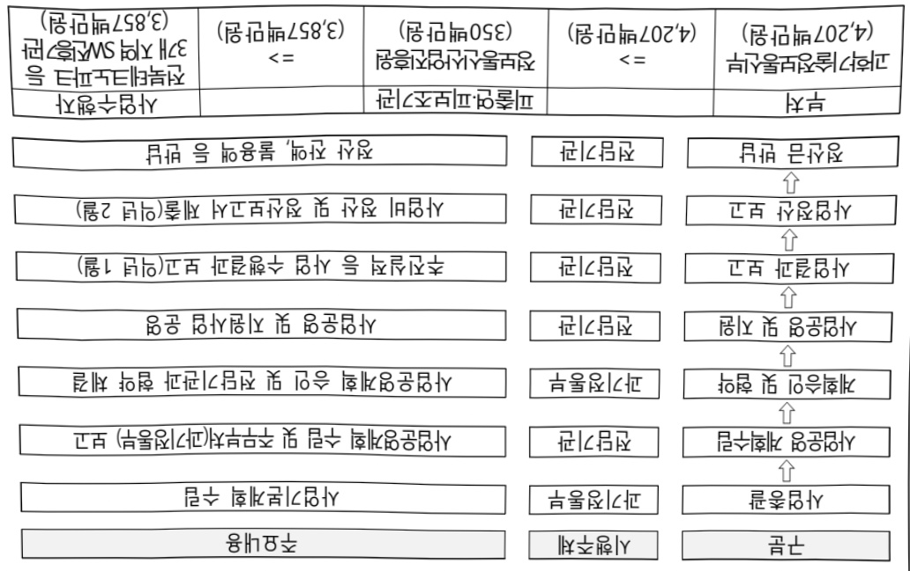

# AI융합 지능형 농업 생태계 구축

**해당 페이지**: PDF 485 ~ 491 쪽 해당

**부처**: 과학기술정보통신부
**분야**: 통신
**회계유형**: 지역균형발전 특별회계
**2026 확정예산**: 4207.0 백만원
**전년대비 증감률**: -41.6%
**AI 도메인**: 농업/식품, 디지털전환(AX)

---

<table border=1 style='margin: auto; word-wrap: break-word;'><tr><td style='text-align: center; word-wrap: break-word;'>사 업 명</td></tr><tr><td style='text-align: center; word-wrap: break-word;'>(35) AI융합 지능형 농업 생태계 구축 (2601-408)</td></tr></table>

사업 코드 정보

<table border=1 style='margin: auto; word-wrap: break-word;'><tr><td style='text-align: center; word-wrap: break-word;'>구분</td><td style='text-align: center; word-wrap: break-word;'>회계</td><td style='text-align: center; word-wrap: break-word;'>소관</td><td style='text-align: center; word-wrap: break-word;'>실국(기관)</td><td style='text-align: center; word-wrap: break-word;'>계정</td><td style='text-align: center; word-wrap: break-word;'>분야</td><td style='text-align: center; word-wrap: break-word;'>부문</td></tr><tr><td style='text-align: center; word-wrap: break-word;'>코드</td><td style='text-align: center; word-wrap: break-word;'>지역균형발전</td><td style='text-align: center; word-wrap: break-word;'>과학기술정보</td><td style='text-align: center; word-wrap: break-word;'>인공지능</td><td rowspan="2">지역지원</td><td style='text-align: center; word-wrap: break-word;'>130</td><td style='text-align: center; word-wrap: break-word;'>133</td></tr><tr><td style='text-align: center; word-wrap: break-word;'>명칭</td><td style='text-align: center; word-wrap: break-word;'>특별회계</td><td style='text-align: center; word-wrap: break-word;'>통신부</td><td style='text-align: center; word-wrap: break-word;'>정책기획관</td><td style='text-align: center; word-wrap: break-word;'>통신</td><td style='text-align: center; word-wrap: break-word;'>정보통신</td></tr></table>

<table border=1 style='margin: auto; word-wrap: break-word;'><tr><td style='text-align: center; word-wrap: break-word;'>구분</td><td style='text-align: center; word-wrap: break-word;'>프로그램</td><td style='text-align: center; word-wrap: break-word;'>단위사업</td><td style='text-align: center; word-wrap: break-word;'>세부사업</td></tr><tr><td style='text-align: center; word-wrap: break-word;'>코드</td><td style='text-align: center; word-wrap: break-word;'>2600</td><td style='text-align: center; word-wrap: break-word;'>2601</td><td style='text-align: center; word-wrap: break-word;'>408</td></tr><tr><td style='text-align: center; word-wrap: break-word;'>명칭</td><td style='text-align: center; word-wrap: break-word;'>인공지능데이터진흥</td><td style='text-align: center; word-wrap: break-word;'>AI기술개발(지틀)</td><td style='text-align: center; word-wrap: break-word;'>AI융합 지능형 농업생태계 구축</td></tr></table>

<table border=1 style='margin: auto; word-wrap: break-word;'><tr><td colspan="6">☐ 사업 성격 (공통요구자료 Ⅱ-1 작성유의사항 4. 참조, 해당하는 사항에 “○” 표시)</td></tr><tr><td rowspan="2">신규 계속</td><td rowspan="2">완료</td><td rowspan="2">예비타당성 실시여부</td><td rowspan="2">총사업비 관리대상</td><td rowspan="2">총액계상 예산사업</td><td style='text-align: center; word-wrap: break-word;'>사업소관 변경정보</td></tr><tr><td style='text-align: center; word-wrap: break-word;'>2025예산 시 소관</td></tr><tr><td style='text-align: center; word-wrap: break-word;'></td><td style='text-align: center; word-wrap: break-word;'>○</td><td style='text-align: center; word-wrap: break-word;'></td><td style='text-align: center; word-wrap: break-word;'></td><td style='text-align: center; word-wrap: break-word;'></td><td style='text-align: center; word-wrap: break-word;'></td></tr></table>

□ 사업 지원 형태 및 지원율

<table border=1 style='margin: auto; word-wrap: break-word;'><tr><td style='text-align: center; word-wrap: break-word;'>직접</td><td style='text-align: center; word-wrap: break-word;'>출자</td><td style='text-align: center; word-wrap: break-word;'>출연</td><td style='text-align: center; word-wrap: break-word;'>보조</td><td style='text-align: center; word-wrap: break-word;'>융자</td><td style='text-align: center; word-wrap: break-word;'>국고보조율(%)</td><td style='text-align: center; word-wrap: break-word;'>융자율(%)</td></tr><tr><td style='text-align: center; word-wrap: break-word;'></td><td style='text-align: center; word-wrap: break-word;'></td><td style='text-align: center; word-wrap: break-word;'>○</td><td style='text-align: center; word-wrap: break-word;'></td><td style='text-align: center; word-wrap: break-word;'></td><td style='text-align: center; word-wrap: break-word;'></td><td style='text-align: center; word-wrap: break-word;'></td></tr></table>

□사업 소관부처 및 시행주체

<table border=1 style='margin: auto; word-wrap: break-word;'><tr><td style='text-align: center; word-wrap: break-word;'>사업명</td><td colspan="2">구분</td></tr><tr><td rowspan="3">AI융합 지능형 농업생태계 구축</td><td rowspan="2">소관부처</td><td style='text-align: center; word-wrap: break-word;'>인공지능정책실 인공지능정책기획관</td></tr><tr><td style='text-align: center; word-wrap: break-word;'>디지털인재양성과</td></tr><tr><td style='text-align: center; word-wrap: break-word;'>사업시행주체</td><td style='text-align: center; word-wrap: break-word;'>정보통신산업진흥원</td></tr></table>

---

### 가. 예산 총괄표

(단위: 백만원, %)

<table border=1 style='margin: auto; word-wrap: break-word;'><tr><td rowspan="2">사업명</td><td rowspan="2">2024년 결산</td><td colspan="2">2025년 예산</td><td colspan="2">2026년 예산</td><td rowspan="2">증감(B-A)</td><td rowspan="2">(B-A)/A</td></tr><tr><td style='text-align: center; word-wrap: break-word;'>본예산</td><td style='text-align: center; word-wrap: break-word;'>추경(A)</td><td style='text-align: center; word-wrap: break-word;'>요구안</td><td style='text-align: center; word-wrap: break-word;'>본예산(B)</td></tr><tr><td style='text-align: center; word-wrap: break-word;'>AI융합 지능형 농업 생태계 구축</td><td style='text-align: center; word-wrap: break-word;'>9,350</td><td style='text-align: center; word-wrap: break-word;'>7,200</td><td style='text-align: center; word-wrap: break-word;'>7,200</td><td style='text-align: center; word-wrap: break-word;'>4,207</td><td style='text-align: center; word-wrap: break-word;'>4,207</td><td style='text-align: center; word-wrap: break-word;'>△2,993</td><td style='text-align: center; word-wrap: break-word;'>△41.6</td></tr></table>

□ 기능별(내역사업별) 예산 내역

(단위:백만원)

<table border=1 style='margin: auto; word-wrap: break-word;'><tr><td rowspan="2"></td><td colspan="5">2024</td><td colspan="5">2025</td><td rowspan="2">2026 예산</td></tr><tr><td style='text-align: center; word-wrap: break-word;'>예산액(추경)</td><td style='text-align: center; word-wrap: break-word;'>예산현액</td><td style='text-align: center; word-wrap: break-word;'>집행액</td><td style='text-align: center; word-wrap: break-word;'>이월액</td><td style='text-align: center; word-wrap: break-word;'>불용액</td><td style='text-align: center; word-wrap: break-word;'>예산액(추경)</td><td style='text-align: center; word-wrap: break-word;'>예산현액</td><td style='text-align: center; word-wrap: break-word;'>집행액</td><td style='text-align: center; word-wrap: break-word;'>이월액</td><td style='text-align: center; word-wrap: break-word;'>불용액</td></tr><tr><td style='text-align: center; word-wrap: break-word;'>○ 기능별 분류(합계)</td><td style='text-align: center; word-wrap: break-word;'>9,350</td><td style='text-align: center; word-wrap: break-word;'>9,350</td><td style='text-align: center; word-wrap: break-word;'>9,350</td><td style='text-align: center; word-wrap: break-word;'>-</td><td style='text-align: center; word-wrap: break-word;'>-</td><td style='text-align: center; word-wrap: break-word;'>7,200</td><td style='text-align: center; word-wrap: break-word;'>7,200</td><td style='text-align: center; word-wrap: break-word;'>7,200</td><td style='text-align: center; word-wrap: break-word;'>-</td><td style='text-align: center; word-wrap: break-word;'>-</td><td style='text-align: center; word-wrap: break-word;'>4,207</td></tr><tr><td rowspan="4">• 인공지능 자율작업관제 체계 실증• 인공지능 솔루션서비스 플랫폼 구축• 인공지능 기술고도화 및 사업화 지원• AI융합 지능형농업 생태계 구축</td><td style='text-align: center; word-wrap: break-word;'>3,910</td><td style='text-align: center; word-wrap: break-word;'>3,910</td><td style='text-align: center; word-wrap: break-word;'>3,910</td><td style='text-align: center; word-wrap: break-word;'>-</td><td style='text-align: center; word-wrap: break-word;'>-</td><td style='text-align: center; word-wrap: break-word;'>-</td><td style='text-align: center; word-wrap: break-word;'>-</td><td style='text-align: center; word-wrap: break-word;'>-</td><td style='text-align: center; word-wrap: break-word;'>-</td><td style='text-align: center; word-wrap: break-word;'>-</td><td style='text-align: center; word-wrap: break-word;'>-</td></tr><tr><td style='text-align: center; word-wrap: break-word;'>2,460</td><td style='text-align: center; word-wrap: break-word;'>2,460</td><td style='text-align: center; word-wrap: break-word;'>2,460</td><td style='text-align: center; word-wrap: break-word;'>-</td><td style='text-align: center; word-wrap: break-word;'>-</td><td style='text-align: center; word-wrap: break-word;'>-</td><td style='text-align: center; word-wrap: break-word;'>-</td><td style='text-align: center; word-wrap: break-word;'>-</td><td style='text-align: center; word-wrap: break-word;'>-</td><td style='text-align: center; word-wrap: break-word;'>-</td><td style='text-align: center; word-wrap: break-word;'>-</td></tr><tr><td style='text-align: center; word-wrap: break-word;'>2,980</td><td style='text-align: center; word-wrap: break-word;'>2,980</td><td style='text-align: center; word-wrap: break-word;'>2,980</td><td style='text-align: center; word-wrap: break-word;'>-</td><td style='text-align: center; word-wrap: break-word;'>-</td><td style='text-align: center; word-wrap: break-word;'>-</td><td style='text-align: center; word-wrap: break-word;'>-</td><td style='text-align: center; word-wrap: break-word;'>-</td><td style='text-align: center; word-wrap: break-word;'>-</td><td style='text-align: center; word-wrap: break-word;'>-</td><td style='text-align: center; word-wrap: break-word;'>-</td></tr><tr><td style='text-align: center; word-wrap: break-word;'>-</td><td style='text-align: center; word-wrap: break-word;'>-</td><td style='text-align: center; word-wrap: break-word;'>-</td><td style='text-align: center; word-wrap: break-word;'>-</td><td style='text-align: center; word-wrap: break-word;'>-</td><td style='text-align: center; word-wrap: break-word;'>7,200</td><td style='text-align: center; word-wrap: break-word;'>7,200</td><td style='text-align: center; word-wrap: break-word;'>7,200</td><td style='text-align: center; word-wrap: break-word;'>-</td><td style='text-align: center; word-wrap: break-word;'>-</td><td style='text-align: center; word-wrap: break-word;'>4,207</td></tr></table>

### 나.사업설명자료

## 1 ) 사업목적·내용

(AI융합 지능형 농업 생태계 구축) AI기반 지능형 농업기술의 융합·확산 기반 조성 및 경쟁력 강화를 위해 AI기반 농기계 자율작업 및 정밀농업 기술 개발·실증

- 농기계 자율작업 및 정밀농업 AI솔루션들을 상호 연계하여 지능형 농업기술의 통합

관제 시스템 구축 및 실증

- 농업데이터 수집·가공 플랫폼을 구축하여 AI 자율 농작업 및 농작물 상태 분석·

예측 등 정밀농업 AI솔루션 개발

- AI기반 자율 농작업·관제 솔루션의 고도화 지원 및 신규 AI 농업 서비스 확산 기반 조성

---

## 2 ) 사업개요

## □ 사업근거 및 추진경위

① 법령상 근거 조항 적시

° 정보통신산업진흥법 제27조(사업)

° 정보통신 진흥 및 융합 활성화 등에 관한 특별법 제32조(정보통신융합등 기술·서비스 개발 등의 지원)

° 지방자치분권 및 지역군형발전에 관한 특별법 제14조(지역산업 육성 및 일자리 창출 등 지역경제 활성화 촉진), 제16조(지역과학기술 및 정보통신의 진흥), 제79조(지역지원계정의 세입과 세출)

## ② 추진경위

0 인공지능 지역 확산 추진방향('21.10월,4차위)

▶ 인공지능 기반 지역경제 재도약과 디지털 대전환 가속화를 위해 과기정통부와 17개 시·도가

협력하여 인공지능 지역 확산 추진방향 마련

호남권은 AI기반 농작업 시스템 실증, 지원 플랫폼 구축 및 사업화 지원 등 AI용합 지능형

농업 생태계 구축 사업 제안

### ° 정부 국정과제('22.5월)

국정과제 77(민·관 협력을 통한 디지털 경제 패권국가 실현)

- (국정과제 주요내용 일부) 전 분야에 AI 전면 적용('22~')을 통해 AI 융합 확산

→ (이행계획) 지역별 강점을 살린 권역별 AI 선도 프로젝트 등 추진

ㅇ 대한민국 디지털 전략 발표('22.9월, 관계부처합동)

"국민과 함께 세계 모범이 되는 디지털 강국 대한민국 실현"

뉴욕구상에 담긴 기조와 철학을 반영하여, 5대 전략 19대 세부과제 제시

② 충분한 디지털 자원 확보

- (융합) 국민 일상 속 'AI 융합시대 본격화'

0 인공지능 일상화 및 산업고도화 계획 발표('23.1월, 과학기술정보통신부)

국민과 디지털혜택 공유, 대규모 인공지능 수요창출, 산업혁신을 위한 인공지능사업 추진

국민 일상생활, 공공영역, 전산업 분야로 인공지능 전면 확산

○ AI 일상화를 위한 '24년 국민·산업·공공 프로젝트 추진계획 발표(관계부처 합동,'24.04)

---

▶ 산업 순분야 AI 융합·접목 촉진

- (농·축·수산) 무인化·자동化·안전化로 전통적 재배환경의 진화 촉발

→ (지역 농업AI) 농업 인프라가 우수한 호남권 중심, 지능형 농업 인프라·데이터 기반 AI 솔루션('24~'25년 12건) 개발·실증

° AI 3강 도약을 위한 정책 과제 발표(대선공약('25.5) 및 국정과제(안)('25.8))

▶ 인공지능 대전환(AX)으로 혁신 생태계 구축 및 일자리 창출

- 제조AI 등 산업별 융합 촉진, 인공지능 활용 선도사업 추진 및 확산 기반 조성

국정과제(안) 21. 세계에서 AI를 가장 잘 쓰는 나라 구현

## □ 주요내용

① 사업규모

- 총사업비 : 해당없음

- 사업기간 : '24년 ~ '28년(5년)

- 최근 5년 간 투입된 사업비(예산액기준, 추경편성한 연도에는 추경포함)

<table border=1 style='margin: auto; word-wrap: break-word;'><tr><td style='text-align: center; word-wrap: break-word;'>$ \underline{\text{角}} $</td><td style='text-align: center; word-wrap: break-word;'>2022</td><td style='text-align: center; word-wrap: break-word;'>2023</td><td style='text-align: center; word-wrap: break-word;'>2024</td><td style='text-align: center; word-wrap: break-word;'>2025</td><td style='text-align: center; word-wrap: break-word;'>2026</td></tr><tr><td style='text-align: center; word-wrap: break-word;'>$ \underline{\text{人}} $</td><td style='text-align: center; word-wrap: break-word;'>-</td><td style='text-align: center; word-wrap: break-word;'>-</td><td style='text-align: center; word-wrap: break-word;'>9,350</td><td style='text-align: center; word-wrap: break-word;'>7,200</td><td style='text-align: center; word-wrap: break-word;'>4,207</td></tr></table>

- 기타 : (지방비 매칭) 국비 : 지방비 = 2 : 1

## ② 사업추진체계

- 사업시행방법 : 출연

- 사업시행주체 : 정보통신산업진흥원

- 사업 수혜자 : AI기업 및 농기계 지능화 수요 기업, 농업분야 종사자 등

- 보조, 융자, 출연, 출자 등의 경우 보조·융자 등 지원 비율 및 법적근거

<table border=1 style='margin: auto; word-wrap: break-word;'><tr><td style='text-align: center; word-wrap: break-word;'>내역사업명</td><td style='text-align: center; word-wrap: break-word;'>구분</td><td style='text-align: center; word-wrap: break-word;'>피보조·피출연 등 기관명</td><td style='text-align: center; word-wrap: break-word;'>지원 금액 (2026예산안)</td><td style='text-align: center; word-wrap: break-word;'>지원 비율(%)</td><td style='text-align: center; word-wrap: break-word;'>보조율 법적근거 (해당 조항)</td></tr><tr><td style='text-align: center; word-wrap: break-word;'>AI융합 지능형 농업 생태계 구축</td><td style='text-align: center; word-wrap: break-word;'>출연</td><td style='text-align: center; word-wrap: break-word;'>정보통신 산업진흥원</td><td style='text-align: center; word-wrap: break-word;'>4,207</td><td style='text-align: center; word-wrap: break-word;'>100</td><td style='text-align: center; word-wrap: break-word;'>정보통신산업진흥법 제27조, 정보통신 진흥 및 융합 활성화 등에 관한 특별법 제32조, 지방자치분권 및 지역균형발전에 관한 특별법 제14조</td></tr></table>

---

## 3 ) 2026년도 예산 산출 근거

① AI융합 지능형 농업 생태계 구축 : ('24) 7,200 → ('25요구) 4,207백만원, △41.6%

- (요구) 실증과제·기술 고도화 사업화 지원 축소 및 AX랩 구축에서 전환에 따른 비용 감소 등을 감안, '25년 대비 △41.6% 감액 요구

- (산출)

· 원격자율농업 실증 2건 x 250백만원 + 노지정밀농업 실증 3건 x 250백만원 + 관제네트워크 실증 2건 x 130백만원 + 양방향 통합관제시스템 1건 x 700백만원

·플랫폼 운영 1식 x 960백만원 + AI 솔루션 개발 및 연계 3건 x 100백만원

· AI 실증랩 운영 3개소 운영 x 20백만원 + AI 기술고도화 사업화 지원 17건 x 40백만원(총 677백만원)

2025년도 예산 및 2026년도 예산안 산출 세부내역 비교

<table border=1 style='margin: auto; word-wrap: break-word;'><tr><td colspan="2">&#x27;25년 예산</td><td colspan="2">&#x27;26년 예산</td></tr><tr><td style='text-align: center; word-wrap: break-word;'>예산</td><td style='text-align: center; word-wrap: break-word;'>산출내역</td><td style='text-align: center; word-wrap: break-word;'>예산</td><td style='text-align: center; word-wrap: break-word;'>산출내역</td></tr><tr><td style='text-align: center; word-wrap: break-word;'>7,200</td><td style='text-align: center; word-wrap: break-word;'>○ 사업출연금(350-02) : 7,200백만원가. AI융합 지능형 농업 생태계 구축(7,200백만원) · 원격자율농업 실증 22건×250백만원 · 노지정밀농업 실증 4건×250백만원 · 관제네트워크 실증 6건×130백만원 · 양방향 통합관제시스템 구축 및 운영 1건 × 910백만원 · 플랫폼 구축 및 운영 1식 1,260백만원 · AI 솔루션 개발 및 연계 12건 × 100백만원 · AI 실증렴 운영 2개소 × 20백만원 · AI 실증렴 1개소 추가 구축 × 270백만원 · AI 기술고도화 사업화 지원 31건 × 40백만원 = 1,240백만원</td><td style='text-align: center; word-wrap: break-word;'>4,207</td><td style='text-align: center; word-wrap: break-word;'>○ 사업출연금(350-02) : 4,207백만원가. AI융합 지능형 농업 생태계 구축(4,207백만원) · 원격자율농업 실증 22건×250백만원 · 노지정밀농업 실증 3건×250백만원 · 관제네트워크 실증 22건×130백만원 · 양방향 통합관제시스템 운영 1건 × 700백만원 · 플랫폼 운영 1식 960백만원 · AI 솔루션 개발 및 연계 3건 × 100백만원 · AI 실증렴 운영 3개소 × 20백만원 · AI 기술고도화 사업화 지원 17건 × 40백만원 = 677백만원</td></tr></table>

## 4 ) 사업효과

☐ 사업영향, 산출물 성과지표 등

① 2022~2026년도 성과계획서 상 성과지표 및 최근 5년간 성과 달성도

<table border=1 style='margin: auto; word-wrap: break-word;'><tr><td style='text-align: center; word-wrap: break-word;'>성과지표</td><td style='text-align: center; word-wrap: break-word;'>구분</td><td style='text-align: center; word-wrap: break-word;'>2022</td><td style='text-align: center; word-wrap: break-word;'>2023</td><td style='text-align: center; word-wrap: break-word;'>2024</td><td style='text-align: center; word-wrap: break-word;'>2025</td><td style='text-align: center; word-wrap: break-word;'>2026</td><td style='text-align: center; word-wrap: break-word;'>2026 목표치산출근거</td><td style='text-align: center; word-wrap: break-word;'>측정산식(또는 측정방법)</td><td style='text-align: center; word-wrap: break-word;'>자료수집방법(또는 자료출처)</td></tr><tr><td rowspan="3">일자리 창출(단위:%)</td><td style='text-align: center; word-wrap: break-word;'>목표</td><td style='text-align: center; word-wrap: break-word;'>-</td><td style='text-align: center; word-wrap: break-word;'>-</td><td style='text-align: center; word-wrap: break-word;'>4</td><td style='text-align: center; word-wrap: break-word;'>4</td><td style='text-align: center; word-wrap: break-word;'>4</td><td rowspan="3">AI솔루션실증 및 AI혁신 지원사업 수혜기업 전수조사</td><td rowspan="3">∑당해 신규고용 인원 수 / ∑당해 정부보조금(10억당)</td><td rowspan="3">사업결과보고서(4대 보험 가입자 명부 등)</td></tr><tr><td style='text-align: center; word-wrap: break-word;'>실적</td><td style='text-align: center; word-wrap: break-word;'>-</td><td style='text-align: center; word-wrap: break-word;'>-</td><td style='text-align: center; word-wrap: break-word;'>6.1</td><td style='text-align: center; word-wrap: break-word;'>-</td><td style='text-align: center; word-wrap: break-word;'>-</td></tr><tr><td style='text-align: center; word-wrap: break-word;'>달성도</td><td style='text-align: center; word-wrap: break-word;'>-</td><td style='text-align: center; word-wrap: break-word;'>-</td><td style='text-align: center; word-wrap: break-word;'>152.5</td><td style='text-align: center; word-wrap: break-word;'>-</td><td style='text-align: center; word-wrap: break-word;'>-</td></tr><tr><td rowspan="3">수혜기업 만족도(단위:%)</td><td style='text-align: center; word-wrap: break-word;'>목표</td><td style='text-align: center; word-wrap: break-word;'>-</td><td style='text-align: center; word-wrap: break-word;'>-</td><td style='text-align: center; word-wrap: break-word;'>80</td><td style='text-align: center; word-wrap: break-word;'>85</td><td style='text-align: center; word-wrap: break-word;'>87</td><td rowspan="3">사업종료(28년까지 최종 90점이 되도록 연결 목표치 신출</td><td rowspan="3">수혜기업을 대상으로 설문지를 통한 만족도 측정</td><td rowspan="3">사업결과보고서(설문조사 결과)</td></tr><tr><td style='text-align: center; word-wrap: break-word;'>실적</td><td style='text-align: center; word-wrap: break-word;'>-</td><td style='text-align: center; word-wrap: break-word;'>-</td><td style='text-align: center; word-wrap: break-word;'>89.18</td><td style='text-align: center; word-wrap: break-word;'>-</td><td style='text-align: center; word-wrap: break-word;'>-</td></tr><tr><td style='text-align: center; word-wrap: break-word;'>달성도</td><td style='text-align: center; word-wrap: break-word;'>-</td><td style='text-align: center; word-wrap: break-word;'>-</td><td style='text-align: center; word-wrap: break-word;'>111.5</td><td style='text-align: center; word-wrap: break-word;'>-</td><td style='text-align: center; word-wrap: break-word;'>-</td></tr></table>

② 성과지표 이외의 연도별 사업추진 경과 및 실적

<table border=1 style='margin: auto; word-wrap: break-word;'><tr><td style='text-align: center; word-wrap: break-word;'>2024</td><td style='text-align: center; word-wrap: break-word;'>○ 총괄운영기관(주관기관) 공모·선정 및 협약 체결○ AI솔루션 실증 과제 13개 컨소시엄 선정 및 협약 체결○ 지능형 농업 AI 실증랩 2개소 구축○ 인공지능솔루션 서비스 플랫폼 구축</td></tr></table>

---

7)사업 집행절차

6) 총사업비 대상사업 정보 : 해당없음

5) 타당성조사 및 예비타당성조사 시행여부 및 결과 요지 : 해당없음

기술 개발·실증 연계

AI 실증랩 운영(3개소)을 통한 기술 실증 및 사업화·고도화 지원

0 AI솔루션 실증 과제 수행을 통한 지능형 농업 생태계 기술 고도화 및 확산 기술 확보(20건)

0 인공지능솔루션 서비스 플랫폼 운영을 통한 AI융합 농업 데이터 확보 및 AI 융합

③향후(2026년도 이후)기대효과

<table border=1 style='margin: auto; word-wrap: break-word;'><tr><td style='text-align: center; word-wrap: break-word;'>2025</td><td style='text-align: center; word-wrap: break-word;'>○ 총괄운영기관(주관기관) 협약 체결○ AI솔루션 실증 과제 13개 컨소시엄 지원 및 실증○ 2단계 AI솔루션 실증을 위한 과제 기획○ 지능형 농업 AI 실증랩 2개소 운영 및 1개소 신규 구축○ 인공지능솔루션 관제센터 구축 및 서비스 플랫폼 고도화○ 농업 전문기업 기술고도화 및 사업화 지원</td></tr></table>

---

## 8 ) 각종 평가

<table border=1 style='margin: auto; word-wrap: break-word;'><tr><td style='text-align: center; word-wrap: break-word;'>1) 국회(예결위, 상임위, 예정처, 국정감사 포함) 지적 : 해당없음</td></tr><tr><td style='text-align: center; word-wrap: break-word;'>2) 대외공개 평가 : 해당없음</td></tr><tr><td style='text-align: center; word-wrap: break-word;'>3) 자체평가 : 해당없음</td></tr></table>

### 다. 최근 4년간 결산내역

## 1 ) 결산표

☐ 부처 결산내역

(단위: 백만원, %)

<table border=1 style='margin: auto; word-wrap: break-word;'><tr><td rowspan="2">闰도</td><td colspan="3">예산액</td><td rowspan="2">예산현액(A)</td><td rowspan="2">집행액(B)</td><td rowspan="2">집행률(B/A)</td><td rowspan="2">다음연도이월액</td><td rowspan="2">불용액</td></tr><tr><td style='text-align: center; word-wrap: break-word;'>본예산</td><td style='text-align: center; word-wrap: break-word;'>추경중감액</td><td style='text-align: center; word-wrap: break-word;'>추경</td></tr><tr><td style='text-align: center; word-wrap: break-word;'>2022</td><td style='text-align: center; word-wrap: break-word;'>-</td><td style='text-align: center; word-wrap: break-word;'>-</td><td style='text-align: center; word-wrap: break-word;'>-</td><td style='text-align: center; word-wrap: break-word;'>-</td><td style='text-align: center; word-wrap: break-word;'>-</td><td style='text-align: center; word-wrap: break-word;'>-</td><td style='text-align: center; word-wrap: break-word;'>-</td><td style='text-align: center; word-wrap: break-word;'>-</td></tr><tr><td style='text-align: center; word-wrap: break-word;'>2023</td><td style='text-align: center; word-wrap: break-word;'>-</td><td style='text-align: center; word-wrap: break-word;'>-</td><td style='text-align: center; word-wrap: break-word;'>-</td><td style='text-align: center; word-wrap: break-word;'>-</td><td style='text-align: center; word-wrap: break-word;'>-</td><td style='text-align: center; word-wrap: break-word;'>-</td><td style='text-align: center; word-wrap: break-word;'>-</td><td style='text-align: center; word-wrap: break-word;'>-</td></tr><tr><td style='text-align: center; word-wrap: break-word;'>2024</td><td style='text-align: center; word-wrap: break-word;'>9,350</td><td style='text-align: center; word-wrap: break-word;'>-</td><td style='text-align: center; word-wrap: break-word;'>9,350</td><td style='text-align: center; word-wrap: break-word;'>9,350</td><td style='text-align: center; word-wrap: break-word;'>9,350</td><td style='text-align: center; word-wrap: break-word;'>100.0</td><td style='text-align: center; word-wrap: break-word;'>-</td><td style='text-align: center; word-wrap: break-word;'>-</td></tr><tr><td style='text-align: center; word-wrap: break-word;'>2025</td><td style='text-align: center; word-wrap: break-word;'>7,200</td><td style='text-align: center; word-wrap: break-word;'>-</td><td style='text-align: center; word-wrap: break-word;'>7,200</td><td style='text-align: center; word-wrap: break-word;'>7,200</td><td style='text-align: center; word-wrap: break-word;'>7,200</td><td style='text-align: center; word-wrap: break-word;'>100.0</td><td style='text-align: center; word-wrap: break-word;'>-</td><td style='text-align: center; word-wrap: break-word;'>-</td></tr></table>

## 2 ) 주요 결산사항

□ 2022~2025년 결산 주요사항

<table border=1 style='margin: auto; word-wrap: break-word;'><tr><td style='text-align: center; word-wrap: break-word;'>2022</td><td style='text-align: center; word-wrap: break-word;'>- 해당없음(&#x27;24년 신규사업&#x27;)</td></tr><tr><td style='text-align: center; word-wrap: break-word;'>2023</td><td style='text-align: center; word-wrap: break-word;'>- 해당없음(&#x27;24년 신규사업&#x27;)</td></tr><tr><td style='text-align: center; word-wrap: break-word;'>2024</td><td style='text-align: center; word-wrap: break-word;'>- 해당사항 없음</td></tr><tr><td style='text-align: center; word-wrap: break-word;'>2025</td><td style='text-align: center; word-wrap: break-word;'>- 해당사항 없음</td></tr></table>

□ 2025년 이·전용 등 세부내역 : 해당없음

---

### 원본 PDF 크롭 이미지

