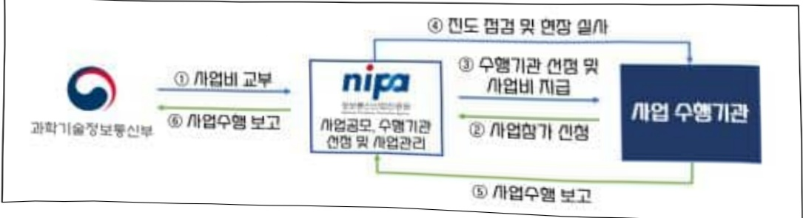
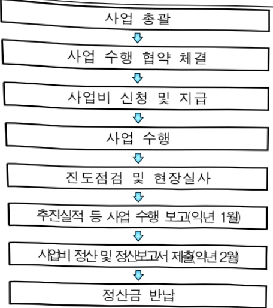

# AI일상화확산

**해당 페이지**: PDF 500 ~ 507 쪽 해당

**부처**: 과학기술정보통신부
**분야**: 통신
**회계유형**: 일반회계
**2026 확정예산**: 8296.0 백만원
**전년대비 증감률**: -73.1%
**AI 도메인**: LLM/언어모델, 의료/바이오, 디지털전환(AX)

---

<table border=1 style='margin: auto; word-wrap: break-word;'><tr><td style='text-align: center; word-wrap: break-word;'>사 업 명</td></tr><tr><td style='text-align: center; word-wrap: break-word;'>(316) AI일상화 확산 (2602-338)</td></tr></table>

사업 코드 정보

<table border=1 style='margin: auto; word-wrap: break-word;'><tr><td style='text-align: center; word-wrap: break-word;'>구분</td><td style='text-align: center; word-wrap: break-word;'>회계</td><td style='text-align: center; word-wrap: break-word;'>소관</td><td style='text-align: center; word-wrap: break-word;'>실국(기관)</td><td style='text-align: center; word-wrap: break-word;'>계정</td><td style='text-align: center; word-wrap: break-word;'>분야</td><td style='text-align: center; word-wrap: break-word;'>부문</td></tr><tr><td style='text-align: center; word-wrap: break-word;'>코드</td><td rowspan="2">일반회계</td><td rowspan="2">과학기술정보통신부</td><td rowspan="2">안공지능정책기획관</td><td rowspan="2">0</td><td style='text-align: center; word-wrap: break-word;'>130</td><td style='text-align: center; word-wrap: break-word;'>133</td></tr><tr><td style='text-align: center; word-wrap: break-word;'>명칭</td><td style='text-align: center; word-wrap: break-word;'>통신</td><td style='text-align: center; word-wrap: break-word;'>정보통신</td></tr></table>

<table border=1 style='margin: auto; word-wrap: break-word;'><tr><td style='text-align: center; word-wrap: break-word;'>구분</td><td style='text-align: center; word-wrap: break-word;'>프로그램</td><td style='text-align: center; word-wrap: break-word;'>단위사업</td><td style='text-align: center; word-wrap: break-word;'>세부사업</td></tr><tr><td style='text-align: center; word-wrap: break-word;'>코드</td><td style='text-align: center; word-wrap: break-word;'>2600</td><td style='text-align: center; word-wrap: break-word;'>2602</td><td style='text-align: center; word-wrap: break-word;'>338</td></tr><tr><td style='text-align: center; word-wrap: break-word;'>명칭</td><td style='text-align: center; word-wrap: break-word;'>인공지능데이터진흥</td><td style='text-align: center; word-wrap: break-word;'>AI경쟁력강화(일반)</td><td style='text-align: center; word-wrap: break-word;'>AI일상화 확산</td></tr></table>

<table border=1 style='margin: auto; word-wrap: break-word;'><tr><td colspan="6">☐ 사업 성격 (공통요구자료 II-1 작성유의사항 4. 참조, 해당하는 사항에 “○” 표시)</td></tr><tr><td rowspan="2">신규 계속</td><td rowspan="2">완료</td><td rowspan="2">예비타당성 실시여부</td><td rowspan="2">총사업비 관리대상</td><td rowspan="2">총액계상 예산사업</td><td style='text-align: center; word-wrap: break-word;'>사업소관 변경정보</td></tr><tr><td style='text-align: center; word-wrap: break-word;'>2025예산 시 소관</td></tr><tr><td style='text-align: center; word-wrap: break-word;'></td><td style='text-align: center; word-wrap: break-word;'>☐</td><td style='text-align: center; word-wrap: break-word;'></td><td style='text-align: center; word-wrap: break-word;'></td><td style='text-align: center; word-wrap: break-word;'></td><td style='text-align: center; word-wrap: break-word;'></td></tr></table>

사업지원형태 및 지원을(최소한 한 개는 반드시 선택하시오. 해당사항에 O 표시)

<table border=1 style='margin: auto; word-wrap: break-word;'><tr><td style='text-align: center; word-wrap: break-word;'>직접</td><td style='text-align: center; word-wrap: break-word;'>출자</td><td style='text-align: center; word-wrap: break-word;'>출연</td><td style='text-align: center; word-wrap: break-word;'>보조</td><td style='text-align: center; word-wrap: break-word;'>융자</td><td style='text-align: center; word-wrap: break-word;'>국고보조율(%)</td><td style='text-align: center; word-wrap: break-word;'>융자율(%)</td></tr><tr><td style='text-align: center; word-wrap: break-word;'></td><td style='text-align: center; word-wrap: break-word;'></td><td style='text-align: center; word-wrap: break-word;'>O</td><td style='text-align: center; word-wrap: break-word;'></td><td style='text-align: center; word-wrap: break-word;'></td><td style='text-align: center; word-wrap: break-word;'></td><td style='text-align: center; word-wrap: break-word;'></td></tr></table>

□ 사업 소관부처 및 시행주체

<table border=1 style='margin: auto; word-wrap: break-word;'><tr><td style='text-align: center; word-wrap: break-word;'>사업명</td><td colspan="2">구분</td></tr><tr><td rowspan="2">AI기반 보건의료 서비스 선도, AI심리계어· 돌봄지원</td><td style='text-align: center; word-wrap: break-word;'>소관부처</td><td style='text-align: center; word-wrap: break-word;'>인공지능정책실 인공지능정책기획관 인공지능융합팀</td></tr><tr><td style='text-align: center; word-wrap: break-word;'>사업시행주체</td><td style='text-align: center; word-wrap: break-word;'>정보통신산업진흥원</td></tr><tr><td rowspan="2">AI마다어문화 향유 확산 AI 법률 보조 서비스 확산 초거대 AI 기반 학술활동 지원</td><td style='text-align: center; word-wrap: break-word;'>소관부처</td><td style='text-align: center; word-wrap: break-word;'>인공지능정책실 인공지능정책기획관 디지털인재양성과</td></tr><tr><td style='text-align: center; word-wrap: break-word;'>사업시행주체</td><td style='text-align: center; word-wrap: break-word;'>정보통신산업진흥원</td></tr><tr><td rowspan="2">초거대 AI 기반 클라우드 서비스 개발 역량 지원</td><td style='text-align: center; word-wrap: break-word;'>소관부처</td><td style='text-align: center; word-wrap: break-word;'>인공지능정책실 인공지능인프라정책관 AI데이터진흥과</td></tr><tr><td style='text-align: center; word-wrap: break-word;'>사업시행주체</td><td style='text-align: center; word-wrap: break-word;'>정보통신산업진흥원</td></tr></table>

---

### 가. 예산 총괄표

(단위: 백만원, %)

<table border=1 style='margin: auto; word-wrap: break-word;'><tr><td rowspan="2">사업명</td><td rowspan="2">2024년 결산</td><td colspan="2">2025년 예산</td><td colspan="2">2026년 예산</td><td rowspan="2">중감(B-A)</td><td rowspan="2">(B-A)/A</td></tr><tr><td style='text-align: center; word-wrap: break-word;'>본예산</td><td style='text-align: center; word-wrap: break-word;'>추경*(A)</td><td style='text-align: center; word-wrap: break-word;'>요구안</td><td style='text-align: center; word-wrap: break-word;'>본예산(B)</td></tr><tr><td style='text-align: center; word-wrap: break-word;'>AI일상화 확산</td><td style='text-align: center; word-wrap: break-word;'>38,300</td><td style='text-align: center; word-wrap: break-word;'>30,870</td><td style='text-align: center; word-wrap: break-word;'>30,870</td><td style='text-align: center; word-wrap: break-word;'>8,296</td><td style='text-align: center; word-wrap: break-word;'>8,296</td><td style='text-align: center; word-wrap: break-word;'>△22,574</td><td style='text-align: center; word-wrap: break-word;'>△73.1</td></tr></table>

* 추경: 추경증감액을 포함한 최종 예산액을 기재

## □ 기능별(내역사업별) 예산 내역

(단위:백만원)

<table border=1 style='margin: auto; word-wrap: break-word;'><tr><td rowspan="2"></td><td colspan="5">2024</td><td colspan="5">2025</td><td rowspan="2">2026예산</td></tr><tr><td style='text-align: center; word-wrap: break-word;'>예산액(추경)</td><td style='text-align: center; word-wrap: break-word;'>예산현액</td><td style='text-align: center; word-wrap: break-word;'>집행액</td><td style='text-align: center; word-wrap: break-word;'>이월액</td><td style='text-align: center; word-wrap: break-word;'>불용액</td><td style='text-align: center; word-wrap: break-word;'>예산액(추경)</td><td style='text-align: center; word-wrap: break-word;'>예산현액</td><td style='text-align: center; word-wrap: break-word;'>집행액</td><td style='text-align: center; word-wrap: break-word;'>이월액</td><td style='text-align: center; word-wrap: break-word;'>불용액</td></tr><tr><td style='text-align: center; word-wrap: break-word;'>○ 기능별 분류(합계)</td><td style='text-align: center; word-wrap: break-word;'>38,300</td><td style='text-align: center; word-wrap: break-word;'>38,300</td><td style='text-align: center; word-wrap: break-word;'>38,300</td><td style='text-align: center; word-wrap: break-word;'>-</td><td style='text-align: center; word-wrap: break-word;'>-</td><td style='text-align: center; word-wrap: break-word;'>30,870</td><td style='text-align: center; word-wrap: break-word;'>30,870</td><td style='text-align: center; word-wrap: break-word;'>30,870</td><td style='text-align: center; word-wrap: break-word;'>-</td><td style='text-align: center; word-wrap: break-word;'>-</td><td style='text-align: center; word-wrap: break-word;'>-</td></tr><tr><td style='text-align: center; word-wrap: break-word;'>• AI 미디어·문화 향유 확산</td><td style='text-align: center; word-wrap: break-word;'>9,000</td><td style='text-align: center; word-wrap: break-word;'>9,000</td><td style='text-align: center; word-wrap: break-word;'>9,000</td><td style='text-align: center; word-wrap: break-word;'>-</td><td style='text-align: center; word-wrap: break-word;'>-</td><td style='text-align: center; word-wrap: break-word;'>8,100</td><td style='text-align: center; word-wrap: break-word;'>8,100</td><td style='text-align: center; word-wrap: break-word;'>8,100</td><td style='text-align: center; word-wrap: break-word;'>-</td><td style='text-align: center; word-wrap: break-word;'>-</td><td style='text-align: center; word-wrap: break-word;'>-</td></tr><tr><td style='text-align: center; word-wrap: break-word;'>• AI 법률보조 서비스 확산</td><td style='text-align: center; word-wrap: break-word;'>7,500</td><td style='text-align: center; word-wrap: break-word;'>7,500</td><td style='text-align: center; word-wrap: break-word;'>7,500</td><td style='text-align: center; word-wrap: break-word;'>-</td><td style='text-align: center; word-wrap: break-word;'>-</td><td style='text-align: center; word-wrap: break-word;'>6,750</td><td style='text-align: center; word-wrap: break-word;'>6,750</td><td style='text-align: center; word-wrap: break-word;'>6,750</td><td style='text-align: center; word-wrap: break-word;'>-</td><td style='text-align: center; word-wrap: break-word;'>-</td><td style='text-align: center; word-wrap: break-word;'>-</td></tr><tr><td style='text-align: center; word-wrap: break-word;'>• AI 학술 및 개발역량 강화 지원</td><td style='text-align: center; word-wrap: break-word;'>7,800</td><td style='text-align: center; word-wrap: break-word;'>7,800</td><td style='text-align: center; word-wrap: break-word;'>7,800</td><td style='text-align: center; word-wrap: break-word;'>-</td><td style='text-align: center; word-wrap: break-word;'>-</td><td style='text-align: center; word-wrap: break-word;'>7,020</td><td style='text-align: center; word-wrap: break-word;'>7,020</td><td style='text-align: center; word-wrap: break-word;'>7,020</td><td style='text-align: center; word-wrap: break-word;'>-</td><td style='text-align: center; word-wrap: break-word;'>-</td><td style='text-align: center; word-wrap: break-word;'>-</td></tr><tr><td style='text-align: center; word-wrap: break-word;'>• AI기반 보건의료 서비스 선도</td><td style='text-align: center; word-wrap: break-word;'>8,000</td><td style='text-align: center; word-wrap: break-word;'>8,000</td><td style='text-align: center; word-wrap: break-word;'>8,000</td><td style='text-align: center; word-wrap: break-word;'>-</td><td style='text-align: center; word-wrap: break-word;'>-</td><td style='text-align: center; word-wrap: break-word;'>7,200</td><td style='text-align: center; word-wrap: break-word;'>7,200</td><td style='text-align: center; word-wrap: break-word;'>7,200</td><td style='text-align: center; word-wrap: break-word;'>-</td><td style='text-align: center; word-wrap: break-word;'>-</td><td style='text-align: center; word-wrap: break-word;'>6,636</td></tr><tr><td style='text-align: center; word-wrap: break-word;'>• AI심리케어·돌봄 지원</td><td style='text-align: center; word-wrap: break-word;'>6,000</td><td style='text-align: center; word-wrap: break-word;'>6,000</td><td style='text-align: center; word-wrap: break-word;'>6,000</td><td style='text-align: center; word-wrap: break-word;'>-</td><td style='text-align: center; word-wrap: break-word;'>-</td><td style='text-align: center; word-wrap: break-word;'>1,800</td><td style='text-align: center; word-wrap: break-word;'>1,800</td><td style='text-align: center; word-wrap: break-word;'>1,800</td><td style='text-align: center; word-wrap: break-word;'>-</td><td style='text-align: center; word-wrap: break-word;'>-</td><td style='text-align: center; word-wrap: break-word;'>1,660</td></tr></table>

### 나.사업설명자료

## 1 ) 사업목적·내용

o 초거대 AI 기반의 경쟁력 있는 응용서비스 개발·실증 지원을 통해 전문분야 종사

자의 업무 보조 및 효율화를 도모하고 국민 일상 속 AI 활용·확산

- (AI기반 보건의료 서비스 선도) 소아·청소년과 의료진 지원, 보호자 상담 지원 등을

초거대 AI 플랫폼을 활용해 지원하는 서비스 개발·실증

- (AI 심리케어·돌봄지원) 심리상담 전문인력을 지원하기 위한 AI기반 상담일지 생성·

요약·분석 지원 등의 초거대AI 기반 심리케어 전문가 보조 서비스 개발·실증

---

## 2 ) 사업개요

① 법령상 근거 및 조항 적시

° 정보통신산업진흥법 제27조(사업), 제28조(재원)

0 정보통신 진흥 및 융합 활성화 등에 대한 특별법 제32조(정보통신융합등 기술·서비스 개발 등의 지원)

② 추진경위

° 윤석열정부 국정과제('22.5월)

국정과제 77(민·관 협력을 통한 디지털 경제 패권국가 실현)

1 세계가 주목하는 인공지능(AI) 초일류 국가

- 초거대 AI 모델을 활용하여 혁신적 인공지능 서비스 개발

° 대한민국 디지털 전략 발표('22.9월, 관계부처합동)

"국민과 함께 세계 모범이 되는 디지털 강국 대한민국 실현"

▶뉴욕구상에 담긴 기조와 철학을 반영하여, 5대 전략 19대 세부과제 제시

② 충분한 디지털 자원 확보

- (용합) 국민 일상 속 'AI 융합시대 본격화'

° '22.9 : 뉴욕구상 및 AI 석학과 대화

·인류 보편적 가치 확산 및 디지털 혜택을 공유하기 위한 새로운 디지털 질서 수립 제안,

인공지능의 공정성·공평성 등 본질적 논의와 정부 지원의 중요성 강조

° '22.12~'23.3 : 초거대AI 기업 릴레이간담회

·초거대AI 기업 간담회(22.12~23.3, 네이버, 카카오, LG AI 연구원, KT, SKT 등)

· 챗GPT 대응 장관-전문가 토론회('23.2), 디지털 국정과제 현장 간담회('23.2)

• 제3차 ‘인공지능 최고위 전략대화’ 개최('23.3)

* 네이버, LG AI, SKT, KT, 카카오 등 초거대 AI 개발 기업 / 루닛, 뤼튼, 스캔터랩스 등

AI 스타트업 / 서울대·KAIST 등 학계 등 다양한 의견 수렴 추진

° '23.1 : 인공지능 일상화 및 산업 고도화 계획

·AI를 국민생활 곳곳에 확산하여, 민생·사회 현안을 해결하고 국민과 디지털 혜택을 공유할 수 있는 과제 발굴·기획

° '23.4 : '초거대 AI 경쟁력 강화 방안' 발표

• 창작 등 민간 5대 전문영역 초거대 AI 플래그십 프로젝트 추진

°25.8월 : 이재명정부 123대 국정과제 (국정기획위원회 국민보고대회)

국정과제 23. 안전과 책임 기반의 'AI 기본사회' 실현

---

## 주요내용

① 사업규모

- 총사업비(해당되는 경우에만 기재) : 해당 없음

- 사업기간 : '24년 ~ '27년

- 최근 5년 간 투입된 사업비(예산액기준, 추경편성한 연도에는 추경포함)

<table border=1 style='margin: auto; word-wrap: break-word;'><tr><td style='text-align: center; word-wrap: break-word;'>연도</td><td style='text-align: center; word-wrap: break-word;'>2022</td><td style='text-align: center; word-wrap: break-word;'>2023</td><td style='text-align: center; word-wrap: break-word;'>2024</td><td style='text-align: center; word-wrap: break-word;'>2025</td><td style='text-align: center; word-wrap: break-word;'>2026</td></tr><tr><td style='text-align: center; word-wrap: break-word;'>사업비</td><td style='text-align: center; word-wrap: break-word;'>-</td><td style='text-align: center; word-wrap: break-word;'>-</td><td style='text-align: center; word-wrap: break-word;'>38,300</td><td style='text-align: center; word-wrap: break-word;'>30,870</td><td style='text-align: center; word-wrap: break-word;'>8,296</td></tr></table>

- 기타: 해당 없음

② 사업추진체계

- 사업시행방법 : 출연

- 사업시행주체 : 정보통신산업진흥원

- 사업 수혜자 : 초거대 AI 기업, AI·데이터 전문기업, 클라우드 기업 등

- 보조, 융자, 출연, 출자 등의 경우 보조·융자 등 지원 비율 및 법적근거

<table border=1 style='margin: auto; word-wrap: break-word;'><tr><td style='text-align: center; word-wrap: break-word;'>내역사업명</td><td style='text-align: center; word-wrap: break-word;'>구분</td><td style='text-align: center; word-wrap: break-word;'>피보조·피출연 등 기관명</td><td style='text-align: center; word-wrap: break-word;'>지원 금액 (2026예산)</td><td style='text-align: center; word-wrap: break-word;'>지원 비율(%)</td><td style='text-align: center; word-wrap: break-word;'>보조율 법적근거 (해당 조항)</td></tr><tr><td style='text-align: center; word-wrap: break-word;'>AI 기반 보건의료 서비스 선도</td><td style='text-align: center; word-wrap: break-word;'>출연</td><td style='text-align: center; word-wrap: break-word;'>정보통신 산업진흥원</td><td style='text-align: center; word-wrap: break-word;'>6,636백만</td><td style='text-align: center; word-wrap: break-word;'>100%</td><td style='text-align: center; word-wrap: break-word;'>정보통신산업진흥범 제27조, 제28조, 정보통신 진흥 및 융합 활성화 등에 대한 특별법 제32조</td></tr><tr><td style='text-align: center; word-wrap: break-word;'>AI 심리계어· 돌봄지원</td><td style='text-align: center; word-wrap: break-word;'>출연</td><td style='text-align: center; word-wrap: break-word;'>정보통신 산업진흥원</td><td style='text-align: center; word-wrap: break-word;'>1,660백만</td><td style='text-align: center; word-wrap: break-word;'>100%</td><td style='text-align: center; word-wrap: break-word;'>정보통신산업진흥범 제27조, 제28조, 정보통신 진흥 및 융합 활성화 등에 대한 특별법 제32조</td></tr></table>

## 3 ) 2026년도 예산 산출 근거

○ 사업출연금(350-02) : 8,296백만원

가 AI 기반 보건의료 서비스 선도 (6,636백만원)

· 1개 서비스 x 6,636백만원

나. AI 심리케어·돌봄지원(1,800백만원)

• 1개 컨소시엄 x 1,660백만원 = 1,660백만원

---

## 4 ) 사업효과

☐ 사업영향, 산출물 성과지표 등

① 2022~2026년도 성과계획서 상 성과지표 및 최근 5년간 성과 달성도

<table border=1 style='margin: auto; word-wrap: break-word;'><tr><td style='text-align: center; word-wrap: break-word;'>성과지표</td><td style='text-align: center; word-wrap: break-word;'>구분</td><td style='text-align: center; word-wrap: break-word;'>2022</td><td style='text-align: center; word-wrap: break-word;'>2023</td><td style='text-align: center; word-wrap: break-word;'>2024</td><td style='text-align: center; word-wrap: break-word;'>2025</td><td style='text-align: center; word-wrap: break-word;'>2026</td><td style='text-align: center; word-wrap: break-word;'>2026 목표치산출근거</td><td style='text-align: center; word-wrap: break-word;'>측정산시(또는 측정방법)</td><td style='text-align: center; word-wrap: break-word;'>자료수집방법(또는 자료출처)</td></tr><tr><td rowspan="3">전문가 만족도(단위: 점)</td><td style='text-align: center; word-wrap: break-word;'>목표</td><td style='text-align: center; word-wrap: break-word;'>-</td><td style='text-align: center; word-wrap: break-word;'>-</td><td style='text-align: center; word-wrap: break-word;'>60</td><td style='text-align: center; word-wrap: break-word;'>72</td><td style='text-align: center; word-wrap: break-word;'>-</td><td rowspan="3">&#x27;25년 사업종료</td><td rowspan="3">법률,미디어·문화,학술 분야국내외 전문가만족도 조사</td><td rowspan="3">설문조사</td></tr><tr><td style='text-align: center; word-wrap: break-word;'>실적</td><td style='text-align: center; word-wrap: break-word;'>-</td><td style='text-align: center; word-wrap: break-word;'>-</td><td style='text-align: center; word-wrap: break-word;'>86</td><td style='text-align: center; word-wrap: break-word;'>87</td><td style='text-align: center; word-wrap: break-word;'>-</td></tr><tr><td style='text-align: center; word-wrap: break-word;'>달성도</td><td style='text-align: center; word-wrap: break-word;'>-</td><td style='text-align: center; word-wrap: break-word;'>-</td><td style='text-align: center; word-wrap: break-word;'>143%</td><td style='text-align: center; word-wrap: break-word;'>121%</td><td style='text-align: center; word-wrap: break-word;'>-</td></tr><tr><td rowspan="3">클라우드 서비스사업화 성공률(단위: %)</td><td style='text-align: center; word-wrap: break-word;'>목표</td><td style='text-align: center; word-wrap: break-word;'>-</td><td style='text-align: center; word-wrap: break-word;'>-</td><td style='text-align: center; word-wrap: break-word;'>60</td><td style='text-align: center; word-wrap: break-word;'>66</td><td style='text-align: center; word-wrap: break-word;'>-</td><td rowspan="3">&#x27;25년 사업종료</td><td rowspan="3">초거대 AI기반의 클라우드 서비스 고도화를 통해 매출 발생한 과제 비율</td><td rowspan="3">사업 결과 보고서</td></tr><tr><td style='text-align: center; word-wrap: break-word;'>실적</td><td style='text-align: center; word-wrap: break-word;'>-</td><td style='text-align: center; word-wrap: break-word;'>-</td><td style='text-align: center; word-wrap: break-word;'>62.5</td><td style='text-align: center; word-wrap: break-word;'>68.8</td><td style='text-align: center; word-wrap: break-word;'>-</td></tr><tr><td style='text-align: center; word-wrap: break-word;'>달성도</td><td style='text-align: center; word-wrap: break-word;'>-</td><td style='text-align: center; word-wrap: break-word;'>-</td><td style='text-align: center; word-wrap: break-word;'>104.2</td><td style='text-align: center; word-wrap: break-word;'>104.2</td><td style='text-align: center; word-wrap: break-word;'>-</td></tr><tr><td rowspan="3">의료분야학습데이터수집·가공(단위: 건)</td><td style='text-align: center; word-wrap: break-word;'>목표</td><td style='text-align: center; word-wrap: break-word;'>-</td><td style='text-align: center; word-wrap: break-word;'>-</td><td style='text-align: center; word-wrap: break-word;'>4,200</td><td style='text-align: center; word-wrap: break-word;'>5,040</td><td style='text-align: center; word-wrap: break-word;'>6,048</td><td rowspan="3">전년 목표대비 20% 상향하여 목표치 설정</td><td rowspan="3">의료분야(보건의료, 심리계어) 학습데이터수집·가공 수</td><td rowspan="3">사업 결과보고서</td></tr><tr><td style='text-align: center; word-wrap: break-word;'>실적</td><td style='text-align: center; word-wrap: break-word;'>-</td><td style='text-align: center; word-wrap: break-word;'>-</td><td style='text-align: center; word-wrap: break-word;'>4,200</td><td style='text-align: center; word-wrap: break-word;'>5,471</td><td style='text-align: center; word-wrap: break-word;'></td></tr><tr><td style='text-align: center; word-wrap: break-word;'>달성도</td><td style='text-align: center; word-wrap: break-word;'>-</td><td style='text-align: center; word-wrap: break-word;'>-</td><td style='text-align: center; word-wrap: break-word;'>100%</td><td style='text-align: center; word-wrap: break-word;'>109%</td><td style='text-align: center; word-wrap: break-word;'></td></tr></table>

② 성과지표 이외의 연도별 사업추진 경과 및 실적

<table border=1 style='margin: auto; word-wrap: break-word;'><tr><td style='text-align: center; word-wrap: break-word;'>2024</td><td style='text-align: center; word-wrap: break-word;'>○ (5대 서비스) 사업수행기관 공모 및 선정을 통해 초거대 AI 서비스 개발 추진○ (미디어·문화) 과제 수행을 위한 컨소시엄 선정 및 1차년도 성과 발굴- 매출 24.6억원, 수출 4.9만$, 특허 출원 23건, 특허 등록 5건○ (법률) 과제 수행을 위한 컨소시엄 선정 및 1차년도 성과 발굴- 매출 8.4억원, MOU/LOI 27건, 특허 출원 5건○ (학술) 과제 수행을 위한 컨소시엄 선정 및 1차년도 성과 발굴- MOU/LOI 3건, 특허 출원 1건, 논문개재 3건○ (클라우드) 초거대 AI 활용 SaaS 고도화·사업화 지원을 통해 16개 서비스 창출○ (보건의료) 사업수행기관 공모 및 선정을 통해 초거대 AI 서비스 개발·실증 추진- 10개 서비스(소아 보호자대상 6종, 의료진 4종) 中 3종*에 대한 파일릿 서비스 런칭* 소아 건강상담 서비스(24.10.5), 소아 회귀질환 상담 서비스(24.11.4), 소아 약물상담 서비스(24.12.16)- 의료기관(5개) 가천대길병원, 경희대병원, 계명대동산병원, 전남대병원, 화순 전남대병원 및 환우회(1형당뇨형 환우회)를 통해 실증 추진○ (심리케어) 사업수행기관 공모 및 선정을 통해 초거대 AI 서비스 개발 추진- 국민체감형, 전문가 보조 서비스 컨소시엄 전문 역량을 기반으로 심리케어 데이터 수집 및 서비스 개발 설계 및 테스트 추진</td></tr><tr><td style='text-align: center; word-wrap: break-word;'>2025</td><td style='text-align: center; word-wrap: break-word;'>○ (미디어·문화) 2차년도 과제 수행, 서비스 실증 및 성과 발굴- 매출 9.4억원, 수출 5.7만$, 특허 출원 21건, 특허 등록 1건○ (법률) 2차년도 과제 수행, 서비스 실증 및 성과 발굴</td></tr></table>

---

<table border=1 style='margin: auto; word-wrap: break-word;'><tr><td style='text-align: center; word-wrap: break-word;'></td><td style='text-align: center; word-wrap: break-word;'>- 매출 11.4억원, MOU/LOI 28건, 특허 출원 5건, 특허 등록 2건○ (학술) 2차년도 과제 수행, 서비스 실증 및 성과 발굴- 사업화 성과 11건, MOU/LOI 2건, 특허 출원 1건, 논문개재 2건○ (클라우드) 초거대 AI 활용 SaaS 고도화·사업화 지원을 통해 16개 서비스 창출○ (보건의료) 초거대 AI 서비스 개발·실증을 통한 중·장기 적용·확산 기반 마련- 10개 서비스(소아 보호자대상 6종, 의료진 4종) 中 5종*에 대한 파일릿 서비스 런칭 예정* 소아 응급처치·응급실 방문결정, 소아 알레르기 예측 상담, 소아 성장·비만 예측 상담, 소아 감염·호흡기 질환 증례 추전, 의료진 응급 지원- 의료기기 인허가 : 서비스 10종 中, 4종*에 대해 인허가 계획 추진* 소아 희귀질환 및 심전도 분석, 맞춤형 증례 추천 및 소아 알레르기 예측○ (심리케어) AI심리케어 돌봄지원(전문가 서비스 보조) 계속과제(전소시엄) 지원- 상담인력 보조 서비스(3종) 개발 추진</td></tr></table>

## ③향후(2026년도 이후)기대효과

- 심리상담 보조 영역의 전문화된 언어모델을 확보 및 전문 보조 데이터를 활용한 상담인력 보조 서비스(4종) 개발로 업무효율화 30% 제고

- 소아·청소년과 대민·의료진 보조를 위한 초거대 AI 서비스 개발을 통해 저출산, 소아과 의료진 부족 등 사회 현안 해결 및 국민체감 의료서비스 제고

- 파일럿 서비스 고도화 및 추가 런칭을 통하여 소아청소년 환자의 불필요한 의료기관 방문 감소, 의료접근성 개선 등 소아청소년 대상 의료의 질 개선에 기여

* (25) 파일럿 3종 고도화&신규 5종 서비스 런칭→(26) 신규 2종 서비스 런칭&서비스 실증

→(27) 서비스 고도화 및 보급확산

## 5 ) 타당성조사 및 예비타당성조사 시행여부 및 결과 요지 : 해당 없음

## 6 ) 총사업비 대상사업 정보 : 해당 없음

## 7 ) 사업 집행절차

---

·과학기술정보통신부→정보통신산업진흥원

·과학기술정보통신부

·정보통신산업진흥원

·정보통신산업진흥원

·정보통신산업진흥원 $\leftrightarrow$ 사업수행기관

·정보통신산업진흥원→과학기술정보통신부

·정보통신산업진흥원→과학기술정보통신부

·정보통신산업진흥원→과학기술정보통신부

## < AI기반 보건의료 서비스 선도>

<table border=1 style='margin: auto; word-wrap: break-word;'><tr><td style='text-align: center; word-wrap: break-word;'>부처</td><td style='text-align: center; word-wrap: break-word;'></td><td style='text-align: center; word-wrap: break-word;'>피출연·피보조기관</td><td style='text-align: center; word-wrap: break-word;'></td><td style='text-align: center; word-wrap: break-word;'>사업수행기관(기업 등)</td></tr><tr><td style='text-align: center; word-wrap: break-word;'>과학기술정보통신부(6,636백만원)</td><td style='text-align: center; word-wrap: break-word;'>=&gt;(6,636백만원)</td><td style='text-align: center; word-wrap: break-word;'>정보통신산업진흥원(199백만원)</td><td style='text-align: center; word-wrap: break-word;'>=&gt;(6,437백만원)</td><td style='text-align: center; word-wrap: break-word;'>AI기업 등 컨소시엄(6,437백만원)</td></tr></table>

## < AI심리케어·돌봄지원 >

<table border=1 style='margin: auto; word-wrap: break-word;'><tr><td style='text-align: center; word-wrap: break-word;'>부처</td><td style='text-align: center; word-wrap: break-word;'></td><td style='text-align: center; word-wrap: break-word;'>피출연·피보조기관</td><td style='text-align: center; word-wrap: break-word;'></td><td style='text-align: center; word-wrap: break-word;'>사업수행기관(기업 등)</td></tr><tr><td style='text-align: center; word-wrap: break-word;'>과학기술정보통신부(1,660백만원)</td><td style='text-align: center; word-wrap: break-word;'>=&gt;(1,660백만원)</td><td style='text-align: center; word-wrap: break-word;'>정보통신산업진흥원(50백만원)</td><td style='text-align: center; word-wrap: break-word;'>=&gt;(1,610백만원)</td><td style='text-align: center; word-wrap: break-word;'>AI기업 등 컨소시엄(1,610백만원)</td></tr></table>

## 8 ) 각종 평가

1) 국회(예결위, 상임위, 예정처, 국정감사 포함) 지적

- '초거대 AI 기반 클라우드 서비스 개발 역량 지원' 사업과 '디지털플랫폼정부 혁신서비스 테스트베드 지원' 사업의 내역사업이 유사한 것으로 보여, 차별화 및 중복지원 방지 대책 필요(23.11월 과방위)

- '초거대 AI 기반 클라우드서비스 개발 역량 지원' 사업의 성과지표 설정 필요('23.11월 과방위)

- 'AI심리케어·돌봄지원' 사업 내 국민체감형 과제는 연구책임자 선정의 부적절성, 사업 수행 필요성 부족 등의 사유로 삭감 필요(과방위·예결위 '25년 예산심사,' 24.11월)

2) 감사원 및 국무총리실 지적 : 해당 없음

3) 2024회계연도 대상 재정사업 자율평가 결과

·AI 미디어·문화 향유 확산 : 85.0 (보통)

·AI 법률 보조 서비스 확산 : 86.9 (보통)

·AI 학술 및 개발역량 강화 지원 : 82.2 (보통)

---

·AI 기반 보건의료 서비스 선도:94.7(우수)

·AI 심리케어·돌봄지원 : 80.1(보통)

4) 기타 시민단체, 언론 및 민원 : 해당 없음

5) 문제점 지적에 대한 후속조치

- '24년 사업 추진 시 민간·공공분야를 명확히 구분하여 중복성이 없도록 추진('23.11월 과방위)

- '초거대 AI 기반 클라우드 서비스 개발 역량 지원 시업을 통한'사업화 성공률 지표 추가 설정(23.11월 과빙위)

- 'AI심리케어·돌봄지원' 사업 내 '25년 국민체감형 과제 예산(36억원) 전액 감액('25년 예산 국회 의결) 및 과제 종료

### 다.최근 4년간 결산내역

## 1 ) 결산표

☐ 부처 결산내역

(단위: 백만원, %)

<table border=1 style='margin: auto; word-wrap: break-word;'><tr><td rowspan="2">연도</td><td colspan="3">예산액</td><td rowspan="2">예산현액(A)</td><td rowspan="2">집행액(B)</td><td rowspan="2">집행률(B/A)</td><td rowspan="2">다음연도이월액</td><td rowspan="2">불용액</td></tr><tr><td style='text-align: center; word-wrap: break-word;'>본예산</td><td style='text-align: center; word-wrap: break-word;'>추경중감액</td><td style='text-align: center; word-wrap: break-word;'>추경</td></tr><tr><td style='text-align: center; word-wrap: break-word;'>2024</td><td style='text-align: center; word-wrap: break-word;'>38,300</td><td style='text-align: center; word-wrap: break-word;'>-</td><td style='text-align: center; word-wrap: break-word;'>38,300</td><td style='text-align: center; word-wrap: break-word;'>38,300</td><td style='text-align: center; word-wrap: break-word;'>38,300</td><td style='text-align: center; word-wrap: break-word;'>100</td><td style='text-align: center; word-wrap: break-word;'>-</td><td style='text-align: center; word-wrap: break-word;'>-</td></tr><tr><td style='text-align: center; word-wrap: break-word;'>2025</td><td style='text-align: center; word-wrap: break-word;'>30,870</td><td style='text-align: center; word-wrap: break-word;'>-</td><td style='text-align: center; word-wrap: break-word;'>30,870</td><td style='text-align: center; word-wrap: break-word;'>30,870</td><td style='text-align: center; word-wrap: break-word;'>30,870</td><td style='text-align: center; word-wrap: break-word;'>100</td><td style='text-align: center; word-wrap: break-word;'></td><td style='text-align: center; word-wrap: break-word;'></td></tr></table>

## 2 ) 주요 결산사항

2022~2025년 결산 주요사항 : 해당 없음

□ 2025년 이·전용 등 세부내역 : 해당 없음

---

### 원본 PDF 크롭 이미지

