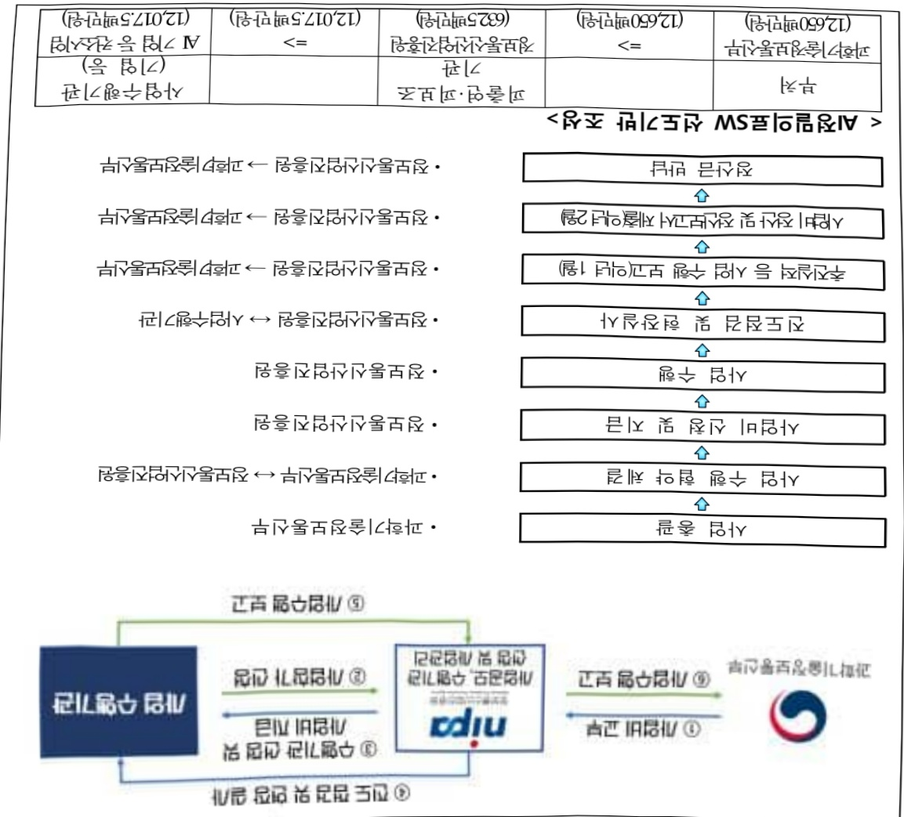
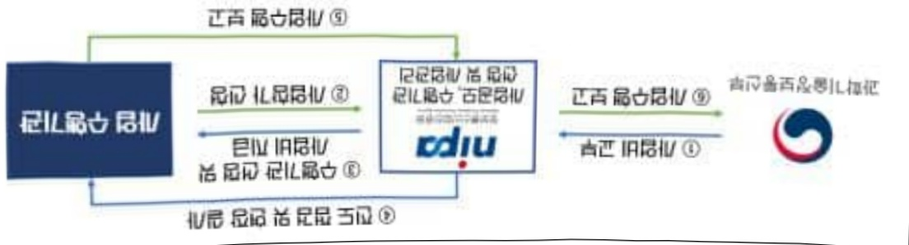

# AI정밀의료SW선도기반조성

**해당 페이지**: PDF 508 ~ 514 쪽 해당

**부처**: 과학기술정보통신부
**분야**: 통신
**회계유형**: 일반회계
**2026 확정예산**: 12650.0 백만원
**전년대비 증감률**: -29.0%
**AI 도메인**: 의료/바이오, 교육/인재, 디지털전환(AX)

---

<table border=1 style='margin: auto; word-wrap: break-word;'><tr><td style='text-align: center; word-wrap: break-word;'>사 업 명</td></tr><tr><td style='text-align: center; word-wrap: break-word;'>(222) AI정밀의료SW 선도기반조성 (2233-336)</td></tr></table>

사업 코드 정보

<table border=1 style='margin: auto; word-wrap: break-word;'><tr><td style='text-align: center; word-wrap: break-word;'>구분</td><td style='text-align: center; word-wrap: break-word;'>회계</td><td style='text-align: center; word-wrap: break-word;'>소관</td><td style='text-align: center; word-wrap: break-word;'>실국(기관)</td><td style='text-align: center; word-wrap: break-word;'>계정</td><td style='text-align: center; word-wrap: break-word;'>분야</td><td style='text-align: center; word-wrap: break-word;'>부문</td></tr><tr><td style='text-align: center; word-wrap: break-word;'>코드</td><td rowspan="2">일반회계</td><td rowspan="2">과학기술정보통신부</td><td rowspan="2">안공지능정책기획관</td><td rowspan="2">0</td><td style='text-align: center; word-wrap: break-word;'>130</td><td style='text-align: center; word-wrap: break-word;'>133</td></tr><tr><td style='text-align: center; word-wrap: break-word;'>명칭</td><td style='text-align: center; word-wrap: break-word;'>통신</td><td style='text-align: center; word-wrap: break-word;'>정보통신</td></tr></table>

<table border=1 style='margin: auto; word-wrap: break-word;'><tr><td style='text-align: center; word-wrap: break-word;'>구분</td><td style='text-align: center; word-wrap: break-word;'>프로그램</td><td style='text-align: center; word-wrap: break-word;'>단위사업</td><td style='text-align: center; word-wrap: break-word;'>세부사업</td></tr><tr><td style='text-align: center; word-wrap: break-word;'>코드</td><td style='text-align: center; word-wrap: break-word;'>2200</td><td style='text-align: center; word-wrap: break-word;'>2233</td><td style='text-align: center; word-wrap: break-word;'>336</td></tr><tr><td style='text-align: center; word-wrap: break-word;'>명칭</td><td style='text-align: center; word-wrap: break-word;'>SW산업진흥</td><td style='text-align: center; word-wrap: break-word;'>SW산업경쟁력강화(일반)</td><td style='text-align: center; word-wrap: break-word;'>AI정밀의료SW선도기반조성</td></tr></table>

□ 사업 성격 (공통요구자료 II-1 작성유의사항 4. 참조, 해당하는 사항에 “○” 표시)

<table border=1 style='margin: auto; word-wrap: break-word;'><tr><td rowspan="2">신규</td><td rowspan="2">계속</td><td rowspan="2">완료</td><td rowspan="2">예비타당성 실시여부</td><td rowspan="2">총사업비 관리대상</td><td rowspan="2">총액계상 예산사업</td><td style='text-align: center; word-wrap: break-word;'>사업소관 변경정보</td></tr><tr><td style='text-align: center; word-wrap: break-word;'>2025예산 시 소관</td></tr><tr><td style='text-align: center; word-wrap: break-word;'></td><td style='text-align: center; word-wrap: break-word;'>O</td><td style='text-align: center; word-wrap: break-word;'></td><td style='text-align: center; word-wrap: break-word;'></td><td style='text-align: center; word-wrap: break-word;'></td><td style='text-align: center; word-wrap: break-word;'></td><td style='text-align: center; word-wrap: break-word;'></td></tr></table>

□ 사업 지원 형태 및 지원을 (최소한 한 개는 반드시 선택하시오. 해당사항에 0 표시)

<table border=1 style='margin: auto; word-wrap: break-word;'><tr><td style='text-align: center; word-wrap: break-word;'>직접</td><td style='text-align: center; word-wrap: break-word;'>출자</td><td style='text-align: center; word-wrap: break-word;'>출연</td><td style='text-align: center; word-wrap: break-word;'>보조</td><td style='text-align: center; word-wrap: break-word;'>융자</td><td style='text-align: center; word-wrap: break-word;'>국고보조율(%)</td><td style='text-align: center; word-wrap: break-word;'>융자율(%)</td></tr><tr><td style='text-align: center; word-wrap: break-word;'></td><td style='text-align: center; word-wrap: break-word;'></td><td style='text-align: center; word-wrap: break-word;'>O</td><td style='text-align: center; word-wrap: break-word;'></td><td style='text-align: center; word-wrap: break-word;'></td><td style='text-align: center; word-wrap: break-word;'></td><td style='text-align: center; word-wrap: break-word;'></td></tr></table>

## 사업 소관부처 및 시행주체

<table border=1 style='margin: auto; word-wrap: break-word;'><tr><td style='text-align: center; word-wrap: break-word;'>사업 명</td><td colspan="2">구분</td></tr><tr><td rowspan="2">AI 정밀의료SW 선도기반조성</td><td style='text-align: center; word-wrap: break-word;'>소관부처</td><td style='text-align: center; word-wrap: break-word;'>인공지능정책실 인공지능정책기획관 인공지능융합팀</td></tr><tr><td style='text-align: center; word-wrap: break-word;'>사업 시행주체</td><td style='text-align: center; word-wrap: break-word;'>정보통신산업진흥원</td></tr></table>

---

### 가. 예산 총괄표

(단위: 백만원, %)

<table border=1 style='margin: auto; word-wrap: break-word;'><tr><td rowspan="2">사업명</td><td rowspan="2">2024년 결산</td><td colspan="2">2025년 예산</td><td colspan="2">2026년 예산</td><td rowspan="2" colspan="2">중감(B-A)</td></tr><tr><td style='text-align: center; word-wrap: break-word;'>본예산</td><td style='text-align: center; word-wrap: break-word;'>추경*(A)</td><td style='text-align: center; word-wrap: break-word;'>요구안</td><td colspan="3">본예산(B)</td></tr><tr><td style='text-align: center; word-wrap: break-word;'>AI정밀의료SW 선도기반조성</td><td style='text-align: center; word-wrap: break-word;'>19,838</td><td style='text-align: center; word-wrap: break-word;'>17,825</td><td style='text-align: center; word-wrap: break-word;'>17,825</td><td style='text-align: center; word-wrap: break-word;'>11,950</td><td style='text-align: center; word-wrap: break-word;'>12,650</td><td style='text-align: center; word-wrap: break-word;'>△5,175</td><td style='text-align: center; word-wrap: break-word;'>△29.0</td></tr></table>

* 추경: 추경증감액을 포함한 최종 예산액을 기재

## □ 기능별(내역사업별) 예산 내역

(단위: 백만원)

<table border=1 style='margin: auto; word-wrap: break-word;'><tr><td rowspan="2"></td><td colspan="5">2024</td><td colspan="5">2025</td><td rowspan="2">2026 예산</td></tr><tr><td style='text-align: center; word-wrap: break-word;'>예산액(추경)</td><td style='text-align: center; word-wrap: break-word;'>예산현액</td><td style='text-align: center; word-wrap: break-word;'>집행액</td><td style='text-align: center; word-wrap: break-word;'>이월액</td><td style='text-align: center; word-wrap: break-word;'>불용액</td><td style='text-align: center; word-wrap: break-word;'>예산액(추경)</td><td style='text-align: center; word-wrap: break-word;'>예산현액</td><td style='text-align: center; word-wrap: break-word;'>집행액</td><td style='text-align: center; word-wrap: break-word;'>이월액</td><td style='text-align: center; word-wrap: break-word;'>불용액</td></tr><tr><td style='text-align: center; word-wrap: break-word;'>○ 기능별 분류(합계)</td><td style='text-align: center; word-wrap: break-word;'>19,838</td><td style='text-align: center; word-wrap: break-word;'>19,838</td><td style='text-align: center; word-wrap: break-word;'>19,838</td><td style='text-align: center; word-wrap: break-word;'>-</td><td style='text-align: center; word-wrap: break-word;'>-</td><td style='text-align: center; word-wrap: break-word;'>17,825</td><td style='text-align: center; word-wrap: break-word;'>17,826</td><td style='text-align: center; word-wrap: break-word;'>17,825</td><td style='text-align: center; word-wrap: break-word;'>-</td><td style='text-align: center; word-wrap: break-word;'>-</td><td style='text-align: center; word-wrap: break-word;'>12,650</td></tr><tr><td style='text-align: center; word-wrap: break-word;'>• 정밀의료SW 서비스 구축 지원</td><td style='text-align: center; word-wrap: break-word;'>18,338</td><td style='text-align: center; word-wrap: break-word;'>18,338</td><td style='text-align: center; word-wrap: break-word;'>18,338</td><td style='text-align: center; word-wrap: break-word;'>-</td><td style='text-align: center; word-wrap: break-word;'>-</td><td style='text-align: center; word-wrap: break-word;'>16,325</td><td style='text-align: center; word-wrap: break-word;'>16,325</td><td style='text-align: center; word-wrap: break-word;'>16,325</td><td style='text-align: center; word-wrap: break-word;'>-</td><td style='text-align: center; word-wrap: break-word;'>-</td><td style='text-align: center; word-wrap: break-word;'>11,950</td></tr><tr><td style='text-align: center; word-wrap: break-word;'>• 정밀의료SW 산업 육성 지원</td><td style='text-align: center; word-wrap: break-word;'>1,500</td><td style='text-align: center; word-wrap: break-word;'>1,500</td><td style='text-align: center; word-wrap: break-word;'>1,500</td><td style='text-align: center; word-wrap: break-word;'>-</td><td style='text-align: center; word-wrap: break-word;'>-</td><td style='text-align: center; word-wrap: break-word;'>1,500</td><td style='text-align: center; word-wrap: break-word;'>1,500</td><td style='text-align: center; word-wrap: break-word;'>1,500</td><td style='text-align: center; word-wrap: break-word;'>-</td><td style='text-align: center; word-wrap: break-word;'>-</td><td style='text-align: center; word-wrap: break-word;'>700</td></tr></table>

### 나. 사업설명자료

## 1 ) 사업목적·내용

° (AI 정밀의료SW 선도기반조성) 의료분야 AI 활용 확산을 지원하여 공공 분야 의료 서비스 향상, 공공의료 AI자원 확충 및 디지털 헬스케어 생태계 육성에 기여

(정밀의료SW 서비스 구축 지원) 공공의료 자원 부족 등 문제 해소를 위해, 공공의료기관 특성에 맞는 AI 진단보조 SW 도입 지원 및 클라우드 기반 진료 협력 플랫폼을 통한 의료기관(1~3차 병원 등) 간 디지털 협력 생태계 조성

(정밀의료SW 산업 육성 지원) AI의료 역량을 갖춘 디지털 전문 의사 양성을 위한 의료AI 교육 과정 의대 정규과정 도입 및 확산 지원

## 2 ) 사업개요

사업근거 및 추진경위

① 법령상 근거 및 조항 적시

---

- 정보통신산업 진흥법 제21조(정보통신망 응용서비스의 개발촉진 등)

제21조(정보통신망 응용서비스의 개발촉진 등)

② 과학기술정보통신부장관은 민간부문에 의한 정보통신망 응용서비스의 개발을 촉진하기 위하여 재정 및 기술 등 필요한 지원을 할 수 있다.

## - 정보통신산업 진흥법 27조(사업), 제28조(재원)

제27조(사업) 산업진흥원은 다음 각 호의 사업을 한다.

3. 정보통신산업 육성·발전 및 지원시설 등 기반조성사업

4. 정보통신기업의 창업·성장 등의 지원

7. 정보통신기술의 융합·활용에 관한 사업

8. 정보통신산업 관련 국제교류·협력 및 해외진출의 지원

제28조(재원 등) ① 정부는 예산 또는 기금의 범위에서 산업진흥원의 설립 및 운영에 필요한 경비의 전부 또는 일부를 출연하거나 보조할 수 있다.

- 정보통신 진흥 및 융합 활성화 등에 관한 특별법 제32조(정보통신융합 등 기술·서비스 개발 등의 지원)

제32조(정보통신융합 등 기술·서비스 개발 등의 지원) ② 과학기술정보통신부장관은 정보통신융합 등 기술·서비스의 개발을 촉진하기 위하여 다음 각 호의 사업을 추진할 수 있다.

1. 정보통신융합 등 기술·서비스 관련 연구개발 사업

11. 정보통신융합 등 기술·서비스 관련 시범사업

12. 그 밖에 정보통신기술진흥을 위하여 필요한 사업

③ 과학기술정보통신부장관은 제2항 각 호의 사업을 추진하기 위하여 법인인 전담기관을 설립하거나 법인·단체에 위탁·운영할 수 있으며, 필요한 비용의 전부 또는 일부를 예산의 범위에서 출연 또는 보조할 수 있다.

## ② 추진경위

0 대한민국 디지털 전략 발표('22.9월, 관계부처합동)

“국민과 함께 세계 모범이 되는 디지털 강국 대한민국 실현”

▶뉴욕구상에 담긴 기조와 철학을 반영하여, 5대 전략 19대 세부과제 제시

② 충분한 디지털 자원 확보

- (용합) 국민 일상 속 'AI 융합시대 본격화'

°'新성장 4.0 전략' 추진계획 발표('22.12월, 기획재정부)

▶ (新일상:Digital Everywhere) 의료 AI-SW 적용·확산 등 AI제품·서비스 개발 보급

°‘인공지능 일상화 및 산업 고도화 계획’(23.1월, 과학기술정보통신부)

AI를 국민생활 곳곳에 확산하여, 민생·사회 현안을 해결하고 국민과 디지털 혜택을 공유할 수 있는 과제 발굴·기획

---

°‘첨단산업 글로벌 클러스터 육성방안('23.6월') 및 후속방안 조치('23.9월, 관계부처합동)

□ 기존 한계를 뛰어넘는 R&D 성공사례 창출을 위해 7대 선도프로젝트 추진

② 닥터앤서 3.0

° 전국민 AI일상화 실행계획('23.9월, 관계부처합동)

<1-2> (건강) 의료·보건 서비스 품질 제고

□ 일반국민의 의료 혜택 향상

(디지털의료 확산) 의료기관 대상 클라우드 기반 병원정보시스템, 질환진단 AI, 응급의료 시스템 도입 지원(의료AI 개발) 중증질환 및 소아희귀질환 등 진단·예후관리를 지원하는 AI 개발 및 임상시험·인허가 획득 지원(디지털치료기기) 개인 라이프로그(혈압, 운동량 등), 진료기록 등을 활용해 만성질환, 신경퇴행성, 뇌발달질환 분야 디지털치료기기 개발·실증

이재명정부 123대 국정과제('25.8월, 국정기획위원회 국민보고대회)

□ (국정과제 23) 안전과 책임 기반의 'AI 기본사회' 실현

## 주요내용

① 사업규모

- 총사업비(해당되는 경우에만 기재) : 해당 없음

- 사업기간 : '22년 ~ '29년(요구)

- 최근 5년 간 투입된 사업비(예산액기준, 추경편성한 연도에는 추경포함)

<table border=1 style='margin: auto; word-wrap: break-word;'><tr><td style='text-align: center; word-wrap: break-word;'>$ \underline{\text{所}} $</td><td style='text-align: center; word-wrap: break-word;'>2022</td><td style='text-align: center; word-wrap: break-word;'>2023</td><td style='text-align: center; word-wrap: break-word;'>2024</td><td style='text-align: center; word-wrap: break-word;'>2025</td><td style='text-align: center; word-wrap: break-word;'>2026</td></tr><tr><td style='text-align: center; word-wrap: break-word;'>$ \underline{\text{人}} $</td><td style='text-align: center; word-wrap: break-word;'>9,920</td><td style='text-align: center; word-wrap: break-word;'>15,828</td><td style='text-align: center; word-wrap: break-word;'>19,838</td><td style='text-align: center; word-wrap: break-word;'>17,825</td><td style='text-align: center; word-wrap: break-word;'>12,650</td></tr></table>

-기타: 해당 없음

② 사업추진체계

- 사업시행방법 : 출연

- 사업시행주체 : 정보통신산업진흥원

- 사업 수혜자 : 의료 AI 등 디지털헬스 분야 기업, 의료기관, 관련 연구기관 등

- 보조, 융자, 출연, 출자 등의 경우 보조·융자 등 지원 비율 및 법적근거

<table border=1 style='margin: auto; word-wrap: break-word;'><tr><td style='text-align: center; word-wrap: break-word;'>내역사업명</td><td style='text-align: center; word-wrap: break-word;'>구분</td><td style='text-align: center; word-wrap: break-word;'>피보조·피출연 등 기관명</td><td style='text-align: center; word-wrap: break-word;'>지원 금액 (2026예산)</td><td style='text-align: center; word-wrap: break-word;'>지원 비율(%)</td><td style='text-align: center; word-wrap: break-word;'>보조율 법적근거 (해당 조항)</td></tr><tr><td style='text-align: center; word-wrap: break-word;'>정밀의료SW 섹스구축 지원</td><td style='text-align: center; word-wrap: break-word;'>출연</td><td style='text-align: center; word-wrap: break-word;'>정보통신 산업진흥원</td><td style='text-align: center; word-wrap: break-word;'>11,950백만</td><td style='text-align: center; word-wrap: break-word;'>100%</td><td style='text-align: center; word-wrap: break-word;'>정보통신산업진흥법 제27조, 제28조, 정보통신 진흥 및 융합 활성화 등에 대한 특별법 제32조</td></tr><tr><td style='text-align: center; word-wrap: break-word;'>정밀의료SW 산업육성 지원</td><td style='text-align: center; word-wrap: break-word;'>출연</td><td style='text-align: center; word-wrap: break-word;'>정보통신 산업진흥원</td><td style='text-align: center; word-wrap: break-word;'>700백만</td><td style='text-align: center; word-wrap: break-word;'>100%</td><td style='text-align: center; word-wrap: break-word;'>정보통신산업진흥법 제27조, 제28조, 정보통신 진흥 및 융합 활성화 등에 대한 특별법 제32조</td></tr></table>

---

3) 2026년도 예산 산출 근거

o 사업출연금(350-02) : 12,650백만원
- 정밀의료SW 서비스 구축 지원 11,950백만원
· 클라우드 협력 플랫폼 구축 : 클라우드 플랫폼 구축 1식×1,000백만원 + 특화질환 실증 1식×750 백만원=1,750백만원
· AI기반 의료시스템 디지털 전환 지원 : 12개 컨소시엄(공공의료) × 850백만원 = 10,200백만원
- 정밀의료SW 산업 육성 지원 700백만원
· 의료AI 교육 확산 : 의대 정규 괴정 확산 지원 1식×700백만원 = 700백만원

## 4 ) 사업효과

□ 사업영향, 산출물 성과지표 등

① 2022~2026년도 성과계획서 상 성과지표 및 최근 5년간 성과 달성도

<table border=1 style='margin: auto; word-wrap: break-word;'><tr><td style='text-align: center; word-wrap: break-word;'>성과지표</td><td style='text-align: center; word-wrap: break-word;'>구분</td><td style='text-align: center; word-wrap: break-word;'>2022</td><td style='text-align: center; word-wrap: break-word;'>2023</td><td style='text-align: center; word-wrap: break-word;'>2024</td><td style='text-align: center; word-wrap: break-word;'>2025</td><td style='text-align: center; word-wrap: break-word;'>2026</td><td style='text-align: center; word-wrap: break-word;'>2026 목표치산출근거</td><td style='text-align: center; word-wrap: break-word;'>측정산식(또는 측정방법)</td><td style='text-align: center; word-wrap: break-word;'>자료수집방법(또는 자료출처)</td></tr><tr><td rowspan="3">공공의료기관의료진 사용자만족도(단위: 점)</td><td style='text-align: center; word-wrap: break-word;'>목표</td><td style='text-align: center; word-wrap: break-word;'>-</td><td style='text-align: center; word-wrap: break-word;'>-</td><td style='text-align: center; word-wrap: break-word;'>80</td><td style='text-align: center; word-wrap: break-word;'>83</td><td style='text-align: center; word-wrap: break-word;'>85</td><td rowspan="3">서비스 안정화를감안, 25년 목표대비(83점) 2점상향 하여 설정</td><td rowspan="3">소프트웨어사용 만족도 등 객관적평가 설문</td><td rowspan="3">만족도 조사결과보고서</td></tr><tr><td style='text-align: center; word-wrap: break-word;'>실적</td><td style='text-align: center; word-wrap: break-word;'>-</td><td style='text-align: center; word-wrap: break-word;'>-</td><td style='text-align: center; word-wrap: break-word;'>81.0</td><td style='text-align: center; word-wrap: break-word;'>88.1</td><td style='text-align: center; word-wrap: break-word;'>-</td></tr><tr><td style='text-align: center; word-wrap: break-word;'>달성도</td><td style='text-align: center; word-wrap: break-word;'>-</td><td style='text-align: center; word-wrap: break-word;'>-</td><td style='text-align: center; word-wrap: break-word;'>100%</td><td style='text-align: center; word-wrap: break-word;'>100%</td><td style='text-align: center; word-wrap: break-word;'>-</td></tr></table>

② 성과지표 이외의 연도별 사업추진 경과 및 실적 : 해당 없음

③향후(2026년도 이후)기대효과

- AI기업의 수요처 맞춤형 서비스 개발·실증을 통해 확보된 래퍼런스를 기반으로

타 산업으로의 수요처 다변화·지속적 사업성 확보 및 기업 경쟁력 제고

5) 타당성조사 및 예비타당성조사 시행여부 및 결과 요지 : 해당 없음

6) 총사업비 대상사업 정보 : 해당 없음

---

2025년도 부처 재정사업 자율평가 결과: 우수(92.7점)

2024년도 부처 재정사업 자율평가 결과: 보통(83.3점)

8)각종평가

7)사업 집행절차

---

### 다. 최근 4년간 결산내역

## 1 ) 결산표

☐ 부처 결산내역

(단위: 백만원, %)

<table border=1 style='margin: auto; word-wrap: break-word;'><tr><td rowspan="2">연도</td><td colspan="3">예산액</td><td rowspan="2">예산현액(A)</td><td rowspan="2">집행액(B)</td><td rowspan="2">집행률(B/A)</td><td rowspan="2">다음연도이월액</td><td rowspan="2">불용액</td></tr><tr><td style='text-align: center; word-wrap: break-word;'>본예산</td><td style='text-align: center; word-wrap: break-word;'>추경증감액</td><td style='text-align: center; word-wrap: break-word;'>추경</td></tr><tr><td style='text-align: center; word-wrap: break-word;'>2022</td><td style='text-align: center; word-wrap: break-word;'>9,920</td><td style='text-align: center; word-wrap: break-word;'>-</td><td style='text-align: center; word-wrap: break-word;'>9,920</td><td style='text-align: center; word-wrap: break-word;'>9,920</td><td style='text-align: center; word-wrap: break-word;'>9,920</td><td style='text-align: center; word-wrap: break-word;'>100</td><td style='text-align: center; word-wrap: break-word;'>-</td><td style='text-align: center; word-wrap: break-word;'>-</td></tr><tr><td style='text-align: center; word-wrap: break-word;'>2023</td><td style='text-align: center; word-wrap: break-word;'>15,828</td><td style='text-align: center; word-wrap: break-word;'>-</td><td style='text-align: center; word-wrap: break-word;'>15,828</td><td style='text-align: center; word-wrap: break-word;'>15,828</td><td style='text-align: center; word-wrap: break-word;'>15,828</td><td style='text-align: center; word-wrap: break-word;'>100</td><td style='text-align: center; word-wrap: break-word;'>-</td><td style='text-align: center; word-wrap: break-word;'>-</td></tr><tr><td style='text-align: center; word-wrap: break-word;'>2024</td><td style='text-align: center; word-wrap: break-word;'>19,838</td><td style='text-align: center; word-wrap: break-word;'>-</td><td style='text-align: center; word-wrap: break-word;'>19,838</td><td style='text-align: center; word-wrap: break-word;'>19,838</td><td style='text-align: center; word-wrap: break-word;'>19,838</td><td style='text-align: center; word-wrap: break-word;'>100</td><td style='text-align: center; word-wrap: break-word;'>-</td><td style='text-align: center; word-wrap: break-word;'>-</td></tr><tr><td style='text-align: center; word-wrap: break-word;'>2025</td><td style='text-align: center; word-wrap: break-word;'>17,825</td><td style='text-align: center; word-wrap: break-word;'>-</td><td style='text-align: center; word-wrap: break-word;'>17,825</td><td style='text-align: center; word-wrap: break-word;'>17,825</td><td style='text-align: center; word-wrap: break-word;'>17,825</td><td style='text-align: center; word-wrap: break-word;'>100</td><td style='text-align: center; word-wrap: break-word;'>-</td><td style='text-align: center; word-wrap: break-word;'>-</td></tr></table>

## 2 ) 주요 결산사항

2022~2025년 결산 주요사항 : 해당 없음

2025년 이·전용 등 세부내역 : 해당 없음

---

### 원본 PDF 크롭 이미지

