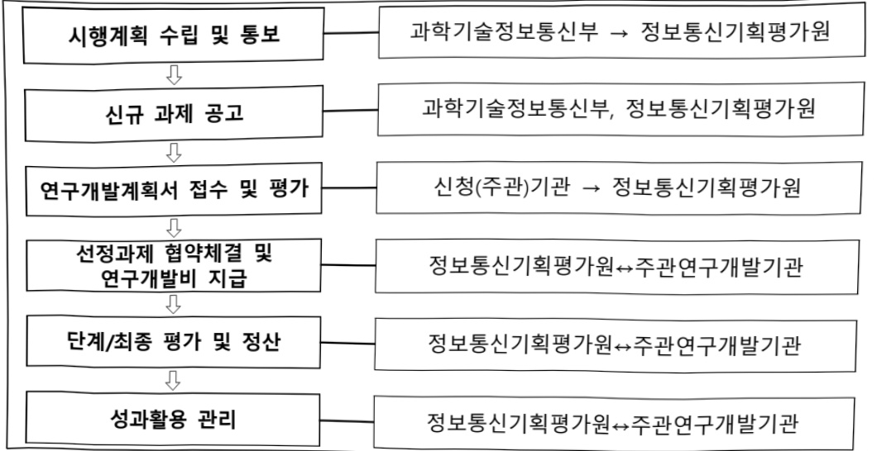

# AI최고급신진연구자지원사업(R&D)

**해당 페이지**: PDF 515 ~ 520 쪽 해당

**부처**: 과학기술정보통신부
**분야**: 통신
**회계유형**: 일반회계
**2026 확정예산**: 34000.0 백만원
**전년대비 증감률**: 466.0%
**AI 도메인**: 교육/인재, 디지털전환(AX)

---

### 가. 예산 총괄표

(단위: 백만원, %)

<table border=1 style='margin: auto; word-wrap: break-word;'><tr><td rowspan="2">사업명</td><td rowspan="2">2024년 결산</td><td colspan="2">2025년 예산</td><td colspan="2">2026년 예산</td><td rowspan="2">중감 (B-A)</td><td rowspan="2">(B-A)/A</td></tr><tr><td style='text-align: center; word-wrap: break-word;'>본예산</td><td style='text-align: center; word-wrap: break-word;'>추경 $ ^{*} $(A)</td><td style='text-align: center; word-wrap: break-word;'>요구안</td><td style='text-align: center; word-wrap: break-word;'>본예산(B)</td></tr><tr><td style='text-align: center; word-wrap: break-word;'>AI최고급산전연구자원</td><td style='text-align: center; word-wrap: break-word;'>-</td><td style='text-align: center; word-wrap: break-word;'>6,000</td><td style='text-align: center; word-wrap: break-word;'>9,000</td><td style='text-align: center; word-wrap: break-word;'>34,000</td><td style='text-align: center; word-wrap: break-word;'>34,000</td><td style='text-align: center; word-wrap: break-word;'>28,000</td><td style='text-align: center; word-wrap: break-word;'>466</td></tr></table>

*추경: 추경증감액을 포함한 최종 예산액을 기재

## □ 기능별(내역사업별) 예산 내역

(단위:백만원)

<table border=1 style='margin: auto; word-wrap: break-word;'><tr><td rowspan="2"></td><td colspan="5">2024</td><td colspan="5">2025</td><td rowspan="2">2026 예산</td></tr><tr><td style='text-align: center; word-wrap: break-word;'>예산의 (추정)</td><td style='text-align: center; word-wrap: break-word;'>예산 현의</td><td style='text-align: center; word-wrap: break-word;'>집행의</td><td style='text-align: center; word-wrap: break-word;'>이월의</td><td style='text-align: center; word-wrap: break-word;'>불용의</td><td style='text-align: center; word-wrap: break-word;'>예산의 (추정)</td><td style='text-align: center; word-wrap: break-word;'>예산 현의</td><td style='text-align: center; word-wrap: break-word;'>집행의</td><td style='text-align: center; word-wrap: break-word;'>이월의</td><td style='text-align: center; word-wrap: break-word;'>불용의</td></tr><tr><td style='text-align: center; word-wrap: break-word;'>○ 기능별 분류(합계)</td><td style='text-align: center; word-wrap: break-word;'>-</td><td style='text-align: center; word-wrap: break-word;'>-</td><td style='text-align: center; word-wrap: break-word;'>-</td><td style='text-align: center; word-wrap: break-word;'>-</td><td style='text-align: center; word-wrap: break-word;'>-</td><td style='text-align: center; word-wrap: break-word;'>9,000</td><td style='text-align: center; word-wrap: break-word;'>9,000</td><td style='text-align: center; word-wrap: break-word;'>9,000</td><td style='text-align: center; word-wrap: break-word;'>-</td><td style='text-align: center; word-wrap: break-word;'>-</td><td style='text-align: center; word-wrap: break-word;'>34,000</td></tr><tr><td style='text-align: center; word-wrap: break-word;'>• AI취업진단보육지원</td><td style='text-align: center; word-wrap: break-word;'>-</td><td style='text-align: center; word-wrap: break-word;'>-</td><td style='text-align: center; word-wrap: break-word;'>-</td><td style='text-align: center; word-wrap: break-word;'>-</td><td style='text-align: center; word-wrap: break-word;'>-</td><td style='text-align: center; word-wrap: break-word;'>9,000</td><td style='text-align: center; word-wrap: break-word;'>9,000</td><td style='text-align: center; word-wrap: break-word;'>9,000</td><td style='text-align: center; word-wrap: break-word;'>-</td><td style='text-align: center; word-wrap: break-word;'>-</td><td style='text-align: center; word-wrap: break-word;'>34,000</td></tr></table>

### 나. 사업설명자료

## 1 ) 사업목적·내용

- (AI적고급신진연구자지원) AI 융합 분야 산학협력 연구 기반 창의·도전적 연구 지원을 통해 미래 AI 기술 혁신을 이끄는 최고(Global Top-tier) 수준의 AI 인재 양성

## 2 ) 사업개요

## ☐ 사업근거 및 추진경위

① 법령상 근거 및 조항 적시

- 정보통신진흥 및 융합활성화 등에 관한 특별법 제11조(국내 전문인력 양성)

---

정보통신진흥 및 융합활성화 등에 관한 특별법 제11조(국내 전문인력 양성) ① 과학기술 정보통신부장관은 정보통신 분야의 전문적인 기술, 지식 등을 가진 인력(이하 "전문인력"이라 한다)의 육성에 관한 시책을 수립 · 추진하여야 하며, 특히 소프트웨어 교육의 저변화대 및 지역산업의 발전을 위한 소프트웨어 특화교육 활성화를 위하여 노력하여야 한다.

② 제1항에 따른 시책에는 다음 각 호의 사항이 포함되어야 한다.

1. 전문인력의 육성 및 교육훈련에 관한 사항

2. 전문인력의 수급 및 활용에 관한 사항

3. 전문인력의 경력관리 지원 등에 관한 사항

4. 그 밖에 전문인력의 육성 및 관리 등을 위한 사항

- 정보통신산업진흥법 제16조(전문인력 양성)

## 정보통신산업진흥법 제16조(전문인력 양성) 과학기술정보통신부장관은 정보통신산업의

진흥에 필요한 전문인력을 양성하기 위하여 다음 각 호의 시책을 마련하여야 한다.

1. 전문인력의 수요 실태 파악 및 중·장기 수급 전망 수립

2. 전문인력 양성기관의 설립 · 지원

3. 전문인력 양성 교육프로그램의 개발 및 보급 지원

4. 정보통신기술 관련 자격제도의 정착 및 전문인력 수급 지원

5. 각급 학교 및 그 밖의 교육기관에서 시행하는 정보통신기술 및 정보통신산업 관련 교육의 지원

6. 그 밖에 전문인력 양성에 필요한 사항

## ② 추진경위

- 디지털 인재양성 종합방안 수립·발표(관계부처 합동, '22. 8월)

- 제26차 비상경제장관회의에서「소프트웨어진흥전략」 발표('23.4월)

- 인공지능(AI)-반도체전략(이니셔티브) 발표('24.4월)

- AI컴퓨팅 인프라 확충을 통한 국가AI역량 강화방안('25.2)

- 초격차 AI선도기술·인재 확보('25.5)

---

## 주요내용

## ① 사업규모

- 총사업비 : 해당없음

- 사업기간 : '25년 ~ '31년

- 최근 5년 간 투입된 사업비(예산액기준, 추경편성한 연도에는 추경포함)

<table border=1 style='margin: auto; word-wrap: break-word;'><tr><td style='text-align: center; word-wrap: break-word;'>연도</td><td style='text-align: center; word-wrap: break-word;'>2022</td><td style='text-align: center; word-wrap: break-word;'>2023</td><td style='text-align: center; word-wrap: break-word;'>2024</td><td style='text-align: center; word-wrap: break-word;'>2025</td><td style='text-align: center; word-wrap: break-word;'>2026</td></tr><tr><td style='text-align: center; word-wrap: break-word;'>사업비</td><td style='text-align: center; word-wrap: break-word;'>-</td><td style='text-align: center; word-wrap: break-word;'>-</td><td style='text-align: center; word-wrap: break-word;'>-</td><td style='text-align: center; word-wrap: break-word;'>9,000</td><td style='text-align: center; word-wrap: break-word;'>34,000</td></tr></table>

② 사업추진체계

- 사업시행방법 : 출연

- 사업시행주체 : 정보통신기획평가원

- 사업 수혜자 : 대학

- 보조, 융자, 출연, 출자 등의 경우 보조·융자 등 지원 비율 및 법적근거

<table border=1 style='margin: auto; word-wrap: break-word;'><tr><td style='text-align: center; word-wrap: break-word;'>내역사업명</td><td style='text-align: center; word-wrap: break-word;'>구분</td><td style='text-align: center; word-wrap: break-word;'>피보조·피출연 등 기관명</td><td style='text-align: center; word-wrap: break-word;'>지원 금액 (2026예산)</td><td style='text-align: center; word-wrap: break-word;'>지원 비율(%)</td><td style='text-align: center; word-wrap: break-word;'>보조율 법적근거 (해당 조항)</td></tr><tr><td style='text-align: center; word-wrap: break-word;'>AI스타 펜로우십지원 (AI최고급신전 연구자지원)</td><td style='text-align: center; word-wrap: break-word;'>출연</td><td style='text-align: center; word-wrap: break-word;'>정보통신 기획평가원</td><td style='text-align: center; word-wrap: break-word;'>34,000</td><td style='text-align: center; word-wrap: break-word;'>100</td><td style='text-align: center; word-wrap: break-word;'>·「국가연구개발혁신법」제13조(연구개발비 지급 및 사용 등) 제1항~제8항 ·제22조(전문기관의 지정 등) 제1항~제6항</td></tr></table>

## 3 ) 2026년도 예산 산출 근거

< AI스타펠로우십지원(AI최고급신진연구자지원) >

:(25) 9,000 → (26) 34,000 백만원, +25,000 백만원(+277.8%)

- (요구) 국가 AI 기술 수준을 향상하고 국가 경제 성장 견인을 위한 AI/AI융합 분야 세계 최고 수준(Global Top-tier)의 인재 양성 추진을 위하여 '25년 대비 +277.8% 증액 요구

- (산출) 계속과제 7개(과제 수) × 2,000백만원(과제 단가) × 12/12개월(수행 기간) = 14,000백만원 신규과제 20개(과제 수) × 2,000백만원(과제 단가) × 6/12개월(수행 기간) = 20,000백만원

- 2025년도 예산 및 2026년도 예산안 산출 세부내역 비교

<table border=1 style='margin: auto; word-wrap: break-word;'><tr><td colspan="2">&#x27;25년 예산</td><td colspan="2">&#x27;26년 예산안</td></tr><tr><td style='text-align: center; word-wrap: break-word;'>예산</td><td style='text-align: center; word-wrap: break-word;'>산출내역</td><td style='text-align: center; word-wrap: break-word;'>예산</td><td style='text-align: center; word-wrap: break-word;'>산출내역</td></tr><tr><td style='text-align: center; word-wrap: break-word;'>9,000</td><td style='text-align: center; word-wrap: break-word;'>○ 연구활동비등(360-05): 9,000백만원
- (계속) -
- (신규) (1차) 4개(과제 수) × 2,000백만원(과제 단가) × 9/12개월
(수행기간) = 6,000백만원
(2차) 3개(과제 수) × 2,000백만원(과제 단가) × 6/12개월
(수행기간) = 9,000백만원</td><td style='text-align: center; word-wrap: break-word;'>34,000</td><td style='text-align: center; word-wrap: break-word;'>○ 연구활동비등(360-05): 34,000백만원
- (계속) 7개(과제 수) × 2,000백만원(과제 단가) × 12/12개월(수행기간) = 14,000백만원
- (신규) 20개(과제 수) × 2,000백만원(과제 단가) × 6/12개월(수행기간) = 20,000백만원</td></tr></table>

---

## 4 ) 사업효과

☐ 사업영향, 산출물 성과지표 등

①2022~2026년도 성과계획서 상 성과지표 및 최근 5년간 성과 달성도

<table border=1 style='margin: auto; word-wrap: break-word;'><tr><td style='text-align: center; word-wrap: break-word;'>성과지표</td><td style='text-align: center; word-wrap: break-word;'>구분</td><td style='text-align: center; word-wrap: break-word;'>2022</td><td style='text-align: center; word-wrap: break-word;'>2023</td><td style='text-align: center; word-wrap: break-word;'>2024</td><td style='text-align: center; word-wrap: break-word;'>2025</td><td style='text-align: center; word-wrap: break-word;'>2026</td><td style='text-align: center; word-wrap: break-word;'>2026 목표치산출근거</td><td style='text-align: center; word-wrap: break-word;'>측정산식(또는 측정방법)</td><td style='text-align: center; word-wrap: break-word;'>자료수집방법(또는 자료출처)</td></tr><tr><td rowspan="3">연구 협업 다변성 지수(점)</td><td style='text-align: center; word-wrap: break-word;'>목표</td><td style='text-align: center; word-wrap: break-word;'>-</td><td style='text-align: center; word-wrap: break-word;'>-</td><td style='text-align: center; word-wrap: break-word;'>-</td><td style='text-align: center; word-wrap: break-word;'>0.12</td><td style='text-align: center; word-wrap: break-word;'>0.13</td><td rowspan="3">총 4개의 과제당 산학협력프로젝트 수 3건을 고려 총 12건 진행 등 논문 수를 인공지능융합혁신인 재양성 3개년(‘22~’24) 평균 160건의 60%인 96건 발표 기준으로 1차년도 목표치 설정 * 연도별 2% 상향하여 목표 반영</td><td rowspan="3">(0.7 x 산학협력 프로젝트 수 + 0.3 x 국제 공동 연구 수)/전체 발표 논문 수</td><td rowspan="3">과제별 연차보고서 자료</td></tr><tr><td style='text-align: center; word-wrap: break-word;'>실적</td><td style='text-align: center; word-wrap: break-word;'>-</td><td style='text-align: center; word-wrap: break-word;'>-</td><td style='text-align: center; word-wrap: break-word;'>-</td><td style='text-align: center; word-wrap: break-word;'>집계 중</td><td style='text-align: center; word-wrap: break-word;'>-</td></tr><tr><td style='text-align: center; word-wrap: break-word;'>달성도</td><td style='text-align: center; word-wrap: break-word;'>-</td><td style='text-align: center; word-wrap: break-word;'>-</td><td style='text-align: center; word-wrap: break-word;'>-</td><td style='text-align: center; word-wrap: break-word;'>-</td><td style='text-align: center; word-wrap: break-word;'>-</td></tr><tr><td rowspan="3">H-지수(점)</td><td style='text-align: center; word-wrap: break-word;'>목표</td><td style='text-align: center; word-wrap: break-word;'>-</td><td style='text-align: center; word-wrap: break-word;'>-</td><td style='text-align: center; word-wrap: break-word;'>-</td><td style='text-align: center; word-wrap: break-word;'>신규</td><td style='text-align: center; word-wrap: break-word;'>15</td><td rowspan="3">최근 5개년 CMU, 청화대 수준 25점의 60% 수준인 2차년도 목표치 15점으로 설정 * 연도별 2% 상향하여 목표 반영</td><td rowspan="3">max{h: f(h) ≥ h} * h : 논문의 수 / * f(h) : h 번 이상 인용된 논문의 수</td><td rowspan="3">과제별 연차보고서 자료</td></tr><tr><td style='text-align: center; word-wrap: break-word;'>실적</td><td style='text-align: center; word-wrap: break-word;'>-</td><td style='text-align: center; word-wrap: break-word;'>-</td><td style='text-align: center; word-wrap: break-word;'>-</td><td style='text-align: center; word-wrap: break-word;'>-</td><td style='text-align: center; word-wrap: break-word;'>-</td></tr><tr><td style='text-align: center; word-wrap: break-word;'>달성도</td><td style='text-align: center; word-wrap: break-word;'>-</td><td style='text-align: center; word-wrap: break-word;'>-</td><td style='text-align: center; word-wrap: break-word;'>-</td><td style='text-align: center; word-wrap: break-word;'>-</td><td style='text-align: center; word-wrap: break-word;'>-</td></tr></table>

② 성과지표 이외의 연도별 사업추진 경과 및 실적

<table border=1 style='margin: auto; word-wrap: break-word;'><tr><td style='text-align: center; word-wrap: break-word;'>2022</td><td style='text-align: center; word-wrap: break-word;'></td></tr><tr><td style='text-align: center; word-wrap: break-word;'>2023</td><td style='text-align: center; word-wrap: break-word;'></td></tr><tr><td style='text-align: center; word-wrap: break-word;'>2024</td><td style='text-align: center; word-wrap: break-word;'></td></tr><tr><td style='text-align: center; word-wrap: break-word;'>2025</td><td style='text-align: center; word-wrap: break-word;'>AI최고급신진연구자지원을 위해 7개 수행기관 선정
* 고려대, KAIST, DGIST, 국민대, UNIST, 성균관대, 서울대</td></tr></table>

③향후(2026년도 이후)기대효과

○ AI/AI융합 최고급(Top-tier) 인재의 확보를 통해 관련분야 기술수준 제고

○ AI/AI융합 최고급 인재 확보를 통해 산업·직업·사회적 변혁을 이끌 새로운 패러다임에 국가적 차원의 대응 가능

0 학제 중심의 교육·인재양성 환경에서 벗어나, AI 연구개발·활용인재 양성 환경 마련

5) 타당성조사 및 예비타당성조사 시행여부 및 결과 요지 : 해당없음

6) 총사업비 대상사업 정보 : 해당없음

---

## 7 ) 사업 집행절차

8) 각종 평가 : 해당없음

1) 국회(예결위, 상임위, 예정처, 국정감사 포함) 지적 : 해당없음

2) 대외공개 평가 : 해당없음

3) 자체평가 : 해당없음

### 다.최근 4년간 결산내역

## 1 ) 결산표

☐ 부처 결산내역

(단위: 백만원, %)

<table border=1 style='margin: auto; word-wrap: break-word;'><tr><td rowspan="2">연도</td><td colspan="3">예산액</td><td rowspan="2">예산현액(A)</td><td rowspan="2">집행액(B)</td><td rowspan="2">집행률(B/A)</td><td rowspan="2">다음연도이월액</td><td rowspan="2">불용액</td></tr><tr><td style='text-align: center; word-wrap: break-word;'>본예산</td><td style='text-align: center; word-wrap: break-word;'>추경중감액</td><td style='text-align: center; word-wrap: break-word;'>추경</td></tr><tr><td style='text-align: center; word-wrap: break-word;'>2022</td><td style='text-align: center; word-wrap: break-word;'>-</td><td style='text-align: center; word-wrap: break-word;'>-</td><td style='text-align: center; word-wrap: break-word;'>-</td><td style='text-align: center; word-wrap: break-word;'>-</td><td style='text-align: center; word-wrap: break-word;'>-</td><td style='text-align: center; word-wrap: break-word;'>-</td><td style='text-align: center; word-wrap: break-word;'>-</td><td style='text-align: center; word-wrap: break-word;'>-</td></tr><tr><td style='text-align: center; word-wrap: break-word;'>2023</td><td style='text-align: center; word-wrap: break-word;'>-</td><td style='text-align: center; word-wrap: break-word;'>-</td><td style='text-align: center; word-wrap: break-word;'>-</td><td style='text-align: center; word-wrap: break-word;'>-</td><td style='text-align: center; word-wrap: break-word;'>-</td><td style='text-align: center; word-wrap: break-word;'>-</td><td style='text-align: center; word-wrap: break-word;'>-</td><td style='text-align: center; word-wrap: break-word;'>-</td></tr><tr><td style='text-align: center; word-wrap: break-word;'>2024</td><td style='text-align: center; word-wrap: break-word;'>-</td><td style='text-align: center; word-wrap: break-word;'>-</td><td style='text-align: center; word-wrap: break-word;'>-</td><td style='text-align: center; word-wrap: break-word;'>-</td><td style='text-align: center; word-wrap: break-word;'>-</td><td style='text-align: center; word-wrap: break-word;'>-</td><td style='text-align: center; word-wrap: break-word;'>-</td><td style='text-align: center; word-wrap: break-word;'>-</td></tr><tr><td style='text-align: center; word-wrap: break-word;'>2025</td><td style='text-align: center; word-wrap: break-word;'>6,000</td><td style='text-align: center; word-wrap: break-word;'>3,000</td><td style='text-align: center; word-wrap: break-word;'>9,000</td><td style='text-align: center; word-wrap: break-word;'>9,000</td><td style='text-align: center; word-wrap: break-word;'>9,000</td><td style='text-align: center; word-wrap: break-word;'>100%</td><td style='text-align: center; word-wrap: break-word;'>-</td><td style='text-align: center; word-wrap: break-word;'>-</td></tr></table>

2) 주요 결산사항 : 해당없음

---

<table border=1 style='margin: auto; word-wrap: break-word;'><tr><td style='text-align: center; word-wrap: break-word;'>사 업 명</td></tr><tr><td style='text-align: center; word-wrap: break-word;'>(319) AI컴퓨팅자원활용기반강화 (2602-357)</td></tr></table>

사업 코드 정보

<table border=1 style='margin: auto; word-wrap: break-word;'><tr><td style='text-align: center; word-wrap: break-word;'>구분</td><td style='text-align: center; word-wrap: break-word;'>회계</td><td style='text-align: center; word-wrap: break-word;'>소관</td><td style='text-align: center; word-wrap: break-word;'>실국(기관)</td><td style='text-align: center; word-wrap: break-word;'>계정</td><td style='text-align: center; word-wrap: break-word;'>분야</td><td style='text-align: center; word-wrap: break-word;'>부문</td></tr><tr><td style='text-align: center; word-wrap: break-word;'>코드링칭</td><td style='text-align: center; word-wrap: break-word;'>일반회계</td><td style='text-align: center; word-wrap: break-word;'>과학기술정보통신부</td><td style='text-align: center; word-wrap: break-word;'>안공지능기반정책관</td><td style='text-align: center; word-wrap: break-word;'></td><td style='text-align: center; word-wrap: break-word;'>130통신</td><td style='text-align: center; word-wrap: break-word;'>133정보통신</td></tr></table>

<table border=1 style='margin: auto; word-wrap: break-word;'><tr><td style='text-align: center; word-wrap: break-word;'>구분</td><td style='text-align: center; word-wrap: break-word;'>프로그램</td><td style='text-align: center; word-wrap: break-word;'>단위사업</td><td style='text-align: center; word-wrap: break-word;'>세부사업</td></tr><tr><td style='text-align: center; word-wrap: break-word;'>코드</td><td style='text-align: center; word-wrap: break-word;'>2600</td><td style='text-align: center; word-wrap: break-word;'>2602</td><td style='text-align: center; word-wrap: break-word;'>357</td></tr><tr><td style='text-align: center; word-wrap: break-word;'>명칭</td><td style='text-align: center; word-wrap: break-word;'>인공지능데이터진흥</td><td style='text-align: center; word-wrap: break-word;'>AI경쟁력강화</td><td style='text-align: center; word-wrap: break-word;'>AI컴퓨팅자원활용기반강화</td></tr></table>

사업 성격

<table border=1 style='margin: auto; word-wrap: break-word;'><tr><td rowspan="2">신규</td><td rowspan="2">계속</td><td rowspan="2">완료</td><td rowspan="2">예비타당성 실시여부</td><td rowspan="2">총사업비 관리대상</td><td rowspan="2">총액계상 예산사업</td><td style='text-align: center; word-wrap: break-word;'>사업소관 변경정보</td></tr><tr><td style='text-align: center; word-wrap: break-word;'>2025예산 시 소관</td></tr><tr><td style='text-align: center; word-wrap: break-word;'></td><td style='text-align: center; word-wrap: break-word;'></td><td style='text-align: center; word-wrap: break-word;'></td><td style='text-align: center; word-wrap: break-word;'></td><td style='text-align: center; word-wrap: break-word;'></td><td style='text-align: center; word-wrap: break-word;'></td><td style='text-align: center; word-wrap: break-word;'></td></tr></table>

□ 사업 지원 형태 및 지원을

<table border=1 style='margin: auto; word-wrap: break-word;'><tr><td style='text-align: center; word-wrap: break-word;'>직접</td><td style='text-align: center; word-wrap: break-word;'>출자</td><td style='text-align: center; word-wrap: break-word;'>출연</td><td style='text-align: center; word-wrap: break-word;'>보조</td><td style='text-align: center; word-wrap: break-word;'>융자</td><td style='text-align: center; word-wrap: break-word;'>국고보조율(%)</td><td style='text-align: center; word-wrap: break-word;'>융자율(%)</td></tr><tr><td style='text-align: center; word-wrap: break-word;'></td><td style='text-align: center; word-wrap: break-word;'></td><td style='text-align: center; word-wrap: break-word;'>0</td><td style='text-align: center; word-wrap: break-word;'></td><td style='text-align: center; word-wrap: break-word;'></td><td style='text-align: center; word-wrap: break-word;'></td><td style='text-align: center; word-wrap: break-word;'></td></tr></table>

사업담당자

<table border=1 style='margin: auto; word-wrap: break-word;'><tr><td style='text-align: center; word-wrap: break-word;'>사업명</td><td colspan="5">구분</td></tr><tr><td style='text-align: center; word-wrap: break-word;'>GPU서버확충</td><td rowspan="3">소관부처</td><td style='text-align: center; word-wrap: break-word;'>실·국·과(팀)</td><td style='text-align: center; word-wrap: break-word;'>과 장</td><td style='text-align: center; word-wrap: break-word;'>사무관</td><td style='text-align: center; word-wrap: break-word;'>주무관</td></tr><tr><td style='text-align: center; word-wrap: break-word;'>GPU통합운영환경구축</td><td style='text-align: center; word-wrap: break-word;'>인공지능기반정책관</td><td style='text-align: center; word-wrap: break-word;'>김광년</td><td style='text-align: center; word-wrap: break-word;'>허예라</td><td style='text-align: center; word-wrap: break-word;'>-</td></tr><tr><td style='text-align: center; word-wrap: break-word;'>GPU임차</td><td style='text-align: center; word-wrap: break-word;'>인공지능기반정책과</td><td style='text-align: center; word-wrap: break-word;'>044-202-6370</td><td style='text-align: center; word-wrap: break-word;'>044-202-6572</td><td style='text-align: center; word-wrap: break-word;'>-</td></tr><tr><td rowspan="2">(WBL운영비등)</td><td rowspan="2">사업시행주체</td><td style='text-align: center; word-wrap: break-word;'>정보통신산업진흥원</td><td style='text-align: center; word-wrap: break-word;'>AI전략팀</td><td style='text-align: center; word-wrap: break-word;'>조성현</td><td style='text-align: center; word-wrap: break-word;'>043-931-5730</td></tr><tr><td style='text-align: center; word-wrap: break-word;'>정보통신산업진흥원</td><td style='text-align: center; word-wrap: break-word;'>AI에이전트팀</td><td style='text-align: center; word-wrap: break-word;'>조명수</td><td style='text-align: center; word-wrap: break-word;'>043-931-5820</td></tr><tr><td style='text-align: center; word-wrap: break-word;'>소형데이터센터기반</td><td rowspan="3">소관부처</td><td style='text-align: center; word-wrap: break-word;'>실·국·과(팀)</td><td style='text-align: center; word-wrap: break-word;'>과 장</td><td style='text-align: center; word-wrap: break-word;'>사무관</td><td style='text-align: center; word-wrap: break-word;'>주무관</td></tr><tr><td rowspan="3">AI산업성장지원</td><td style='text-align: center; word-wrap: break-word;'>인공지능기반정책관</td><td style='text-align: center; word-wrap: break-word;'>양기성</td><td style='text-align: center; word-wrap: break-word;'>정동균</td><td style='text-align: center; word-wrap: break-word;'>박순홍</td></tr><tr><td style='text-align: center; word-wrap: break-word;'>인공지능기반정책과</td><td style='text-align: center; word-wrap: break-word;'>044-202-6360</td><td style='text-align: center; word-wrap: break-word;'>044-202-6563</td><td style='text-align: center; word-wrap: break-word;'>044-202-6568</td></tr><tr><td style='text-align: center; word-wrap: break-word;'>사업시행주체</td><td style='text-align: center; word-wrap: break-word;'>정보통신산업진흥원</td><td style='text-align: center; word-wrap: break-word;'>클라우드산업팀</td><td style='text-align: center; word-wrap: break-word;'>이호영 팀장</td><td style='text-align: center; word-wrap: break-word;'>043-931-5770</td></tr><tr><td rowspan="4">공공AI클라우드서비스개발지원</td><td rowspan="3">소관부처</td><td style='text-align: center; word-wrap: break-word;'>실·국·과(팀)</td><td style='text-align: center; word-wrap: break-word;'>과 장</td><td style='text-align: center; word-wrap: break-word;'>사무관</td><td style='text-align: center; word-wrap: break-word;'>주무관</td></tr><tr><td style='text-align: center; word-wrap: break-word;'>인공지능기반정책관</td><td style='text-align: center; word-wrap: break-word;'>장기철</td><td style='text-align: center; word-wrap: break-word;'>최지혜</td><td style='text-align: center; word-wrap: break-word;'>우윤혁</td></tr><tr><td style='text-align: center; word-wrap: break-word;'>인공지능기반정책과</td><td style='text-align: center; word-wrap: break-word;'>044-202-6390</td><td style='text-align: center; word-wrap: break-word;'>044-202-6593</td><td style='text-align: center; word-wrap: break-word;'>044-202-6594</td></tr><tr><td style='text-align: center; word-wrap: break-word;'>사업시행주체</td><td style='text-align: center; word-wrap: break-word;'>한국지능정보사회진흥원</td><td style='text-align: center; word-wrap: break-word;'>AI클라우드기술혁신팀</td><td style='text-align: center; word-wrap: break-word;'>이재원 팀장</td><td style='text-align: center; word-wrap: break-word;'>053)230-1791</td></tr></table>

---

### 원본 PDF 크롭 이미지

