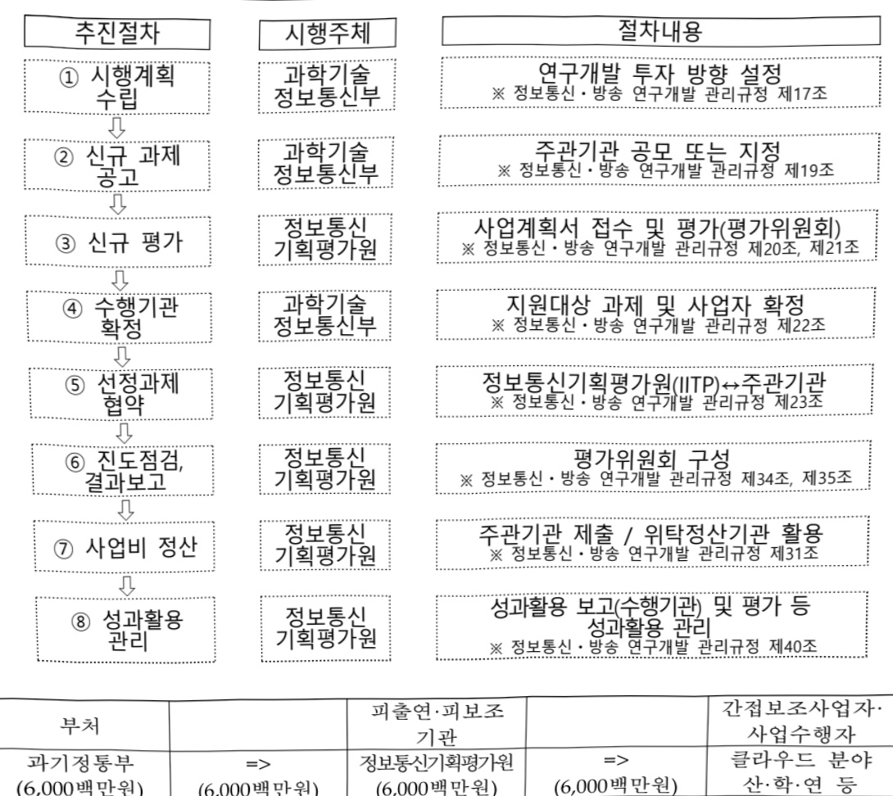

# AI클라우드 경쟁력강화 기술개발(R&D)

**해당 페이지**: PDF 528 ~ 533 쪽 해당

**부처**: 과학기술정보통신부
**분야**: 통신
**회계유형**: 일반회계
**2026 확정예산**: 6000.0 백만원
**전년대비 증감률**: None%
**AI 도메인**: 데이터, 클라우드/컴퓨팅

---

### 가. 예산 총괄표

(단위: 백만원, %)

<table border=1 style='margin: auto; word-wrap: break-word;'><tr><td rowspan="2">사업명</td><td rowspan="2">2024년 결산</td><td colspan="2">2025년 예산</td><td colspan="2">2026년 예산</td><td rowspan="2">중감(B-A)</td><td rowspan="2">(B-A)/A</td></tr><tr><td style='text-align: center; word-wrap: break-word;'>본예산</td><td style='text-align: center; word-wrap: break-word;'>추경*(A)</td><td style='text-align: center; word-wrap: break-word;'>요구안</td><td style='text-align: center; word-wrap: break-word;'>본예산(B)</td></tr><tr><td style='text-align: center; word-wrap: break-word;'>AI 클라우드 경쟁력강화 기술개발</td><td style='text-align: center; word-wrap: break-word;'></td><td style='text-align: center; word-wrap: break-word;'></td><td style='text-align: center; word-wrap: break-word;'></td><td style='text-align: center; word-wrap: break-word;'>6,000</td><td style='text-align: center; word-wrap: break-word;'>6,000</td><td style='text-align: center; word-wrap: break-word;'>6,000</td><td style='text-align: center; word-wrap: break-word;'>순증</td></tr></table>

*추경: 추경증감액을 포함한 최종 예산액을 기재

## □ 기능별(내역사업별) 예산 내역

(단위:백만원)

<table border=1 style='margin: auto; word-wrap: break-word;'><tr><td rowspan="2"></td><td colspan="5">2024</td><td colspan="5">2025</td><td rowspan="2">2026 예산</td></tr><tr><td style='text-align: center; word-wrap: break-word;'>예산액 (추정)</td><td style='text-align: center; word-wrap: break-word;'>예산 현액</td><td style='text-align: center; word-wrap: break-word;'>집행액</td><td style='text-align: center; word-wrap: break-word;'>이월액</td><td style='text-align: center; word-wrap: break-word;'>불용액</td><td style='text-align: center; word-wrap: break-word;'>예산액 (추정)</td><td style='text-align: center; word-wrap: break-word;'>예산 현액</td><td style='text-align: center; word-wrap: break-word;'>집행액</td><td style='text-align: center; word-wrap: break-word;'>이월액</td><td style='text-align: center; word-wrap: break-word;'>불용액</td></tr><tr><td style='text-align: center; word-wrap: break-word;'>○ 기능별 분류(합계)</td><td style='text-align: center; word-wrap: break-word;'>-</td><td style='text-align: center; word-wrap: break-word;'>-</td><td style='text-align: center; word-wrap: break-word;'>-</td><td style='text-align: center; word-wrap: break-word;'>-</td><td style='text-align: center; word-wrap: break-word;'>-</td><td style='text-align: center; word-wrap: break-word;'>-</td><td style='text-align: center; word-wrap: break-word;'>-</td><td style='text-align: center; word-wrap: break-word;'>-</td><td style='text-align: center; word-wrap: break-word;'>-</td><td style='text-align: center; word-wrap: break-word;'>-</td><td style='text-align: center; word-wrap: break-word;'>6,000</td></tr><tr><td style='text-align: center; word-wrap: break-word;'>• AI 클라우드 경쟁력 강화 기술개발</td><td style='text-align: center; word-wrap: break-word;'>-</td><td style='text-align: center; word-wrap: break-word;'>-</td><td style='text-align: center; word-wrap: break-word;'>-</td><td style='text-align: center; word-wrap: break-word;'>-</td><td style='text-align: center; word-wrap: break-word;'>-</td><td style='text-align: center; word-wrap: break-word;'>-</td><td style='text-align: center; word-wrap: break-word;'>-</td><td style='text-align: center; word-wrap: break-word;'>-</td><td style='text-align: center; word-wrap: break-word;'>-</td><td style='text-align: center; word-wrap: break-word;'>-</td><td style='text-align: center; word-wrap: break-word;'>6,000</td></tr></table>

### 나. 사업설명자료

1) 사업목적·내용

(AI 클라우드 경쟁력강화 기술개발)

(사업목적) 국산 AI 클라우드 핵심 인프라 기술 자립과 글로벌 수준의 AI 서비스 인프라 구축

- AI 클라우드의 핵심 기반 기술을 국내 기술로 확보하여 AI 컴퓨팅 인프라의 해외 의존도 낮추고 기술 주권 강화

°(내용)GPU클러스터기반AI모델의혁신적인개발이가능하도록효율적인

자원 활용과 성능 향상을 위한 최적화 기술 개발

- 국내 AI 데이터센터의 네트워크 플랫폼 국산화율을 50% 이상으로 향상

- AI 워크로드 특성을 반영한 GPU 활용을 현재 대비 20% 개선

° (성과물) GPU 클러스터 네트워크 운영 관리 플랫폼 SW, AI 워크로드 최적화

GPU 오케스트레이터, AI 특화 병렬 스토리지 시스템 등

- 글로벌 시장은 엔비디아와 같은 소수 기업의 기술에 크게 의존하고 있어, 비용

---

부담과 기술 의존도가 높아 국내 AI 클라우드 인프라의 기술 자립성과 경쟁력 강화를 위해 대체 기술 개발

- 국내 주요 CSP 외에도 다양한 규모의 GPU 클러스터 구축 수요가 있으며,

클라우드 인프라 구축 기업 또한 본 사업의 수혜기업임

## 2 ) 사업개요

사업근거 및 추진경위

① 법령상 근거 및 조항 적시 : 해당되는 모든 조항의 전체 조문을 기재

- 소프트웨어진흥법 제5조, 25조

제5조(기본계획의 수립 등) ① 과학기술정보통신부장관은 소프트웨어산업의 진흥을 위하여 중장기적인 기본계획(이하 "기본계획"이라 한다)을 수립·시행하여야 한다. ② 기본계획에는 다음 각 호의 사항이 포함되어야 한다.

5. 소프트웨어 기술의 연구개발 및 보급

제25조(소프트웨어 연구 및 기술개발 촉진 등) ① 정부는 소프트웨어 기술경쟁력 강화

를 위하여 소프트웨어 분야의 기초연구를 진흥하여야 한다.

- 정보통신 진흥 및 융합 활성화 등에 관한 특별법 제26조

제26조(소프트웨어 연구개발 활성화) ① 정부는 관계 법령에 따라 소프트웨어 분야의 국가 연구개발 사업을 실시함에 있어 지식정보재로서의 소프트웨어산업 분야의 특성을 감안하여 지원체계 및 평가방법을 별도로 정할 수 있다.

② 폐1학에 따른 지원체계 및 평가방법을 대통령령으로 정한다

② 제1항에 따른 지원체계 및 평가방법은 대통령령으로 정한다

## -정보통신산업 진흥법 제7조

제7조(정보통신기술진흥 시행계획) ① 과학기술정보통신부장관은 정보통신기술의 진흥을 위하여 진흥계획에 따라 다음 각 호의 사항이 포함된 정보통신기술진흥 시행계획을 매년 수립·시행하여야 한다.

1. 정보통신기술 수준의 조사, 개발된 정보통신기술의 평가 및 활용에 관한 사항

2. 정보통신기술 관련 정보의 원활한 유통에 관한 사항

3. 정보통신기술의 연구개발 및 다른 기술과의 결합 및 융합 촉진에 관한 사항

4. 정보통신기술의 협력, 지도 및 이전에 관한 사항

5. 정보통신기술에 관한 산학협동 촉진에 관한 사항

6. 전문인력의 양성 및 수급에 관한 사항

7. 정보통신기술의 표준화 및 새로운 정보통신기술의 채택에 관한 사항

8. 정보통신기술을 연구하는 기관 또는 단체의 육성에 관한 사항

9. 정보통신기술의 국제협력에 관한 사항

10. 그 밖에 정보통신기술의 진흥을 위하여 필요한 사항

② 과학기술정보통신부장관은 제1항에 따른 사항을 효율적으로 추진하기 위하여 필요하면 대통령령으로 정하는 바에 따라 정보통신기술의 개발 및 정보통신산업의 진흥과 관련된 연구기관 및 단체로 하여금 이를 대행하게 할 수 있으며 이에 드는 비용을 지원할 수 있다. <개정 2013. 3. 23., 2017. 7. 26.>

③ 제1항에 따른 정보통신기술진흥 시행계획의 수립·시행 등에 필요한 사항은 대통령령으로 정한다.

-클라우드컴퓨팅 발전 및 이용자 보호에 관한 법률 제8조

---

제8조(연구개발) ① 관계 중앙행정기관의 장은 클라우드컴퓨팅기술 및 클라우드컴퓨팅

서비스에 관한 연구개발사업을 추진할 수 있다.

② 관계 중앙행정기관의 장은 기업·연구기관 등에 제1항에 따른 연구개발사업을 수행하게 하고 그 사업 수행에 드는 비용의 전부 또는 일부를 지원할 수 있다.

② 추진경위 - 사업 시작년도, 추진배경, 부처별 중점과제, 대통령 공약사항 등

: 이재명 정부 123대 국정과제 20번「AI 3대 강국 도약을 위한 AI고속도로 구축」，

22번「초격차 AI 선도기술·인재 확보」등

- '22. 12. :「신성장 4.0 전략」 발표

- '24. 10. : 제4차 클라우드컴퓨팅 기본계획 발표

- '25. 2. : AI컴퓨팅 인프라 확충을 통한 국가AI 역량 강화방안(국가인공지능위원회)

- '25. 8. : "AI 3대 강국 도약"(국민보고대회)

- '25. 9. : 이재명 정부 123대 국정과제(국무회의) 20번, 22번 등

## 주요내용

① 사업규모

- 총사업비(해당되는 경우에만 기재) : 해당없음

- 사업기간 : '26 ~ '29

- 최근 5년 간 투입된 사업비(예산액기준, 추경편성한 연도에는 추경포함)

<table border=1 style='margin: auto; word-wrap: break-word;'><tr><td style='text-align: center; word-wrap: break-word;'>연도</td><td style='text-align: center; word-wrap: break-word;'>2022</td><td style='text-align: center; word-wrap: break-word;'>2023</td><td style='text-align: center; word-wrap: break-word;'>2024</td><td style='text-align: center; word-wrap: break-word;'>2025</td><td style='text-align: center; word-wrap: break-word;'>2026</td></tr><tr><td style='text-align: center; word-wrap: break-word;'>사업비</td><td style='text-align: center; word-wrap: break-word;'></td><td style='text-align: center; word-wrap: break-word;'></td><td style='text-align: center; word-wrap: break-word;'></td><td style='text-align: center; word-wrap: break-word;'></td><td style='text-align: center; word-wrap: break-word;'>6,000</td></tr></table>

- 기타: 해당없음

② 사업추진체계

- 사업시행방법 : 출연 (총사업비(국비)의 100%이내 정부매칭)

- 사업시행주체 : 정보통신기획평가원(전담기관)

- 사업 수혜자 : 클라우드 분야 대학, 연구소, 사업체

- 보조, 융자, 출연, 출자 등의 경우 보조·융자 등 지원 비율 및 법적근거

<table border=1 style='margin: auto; word-wrap: break-word;'><tr><td style='text-align: center; word-wrap: break-word;'>내역사업명</td><td style='text-align: center; word-wrap: break-word;'>구분</td><td style='text-align: center; word-wrap: break-word;'>피보조·피출연 등 기관명</td><td style='text-align: center; word-wrap: break-word;'>지원 금액 (2026예산)</td><td style='text-align: center; word-wrap: break-word;'>지원 비율(%)</td><td style='text-align: center; word-wrap: break-word;'>보조율 법적근거 (해당 조항)</td></tr><tr><td style='text-align: center; word-wrap: break-word;'>AI 클라우드 경쟁력강화 기술개발</td><td style='text-align: center; word-wrap: break-word;'>출연</td><td style='text-align: center; word-wrap: break-word;'>정보통신 기획평가원</td><td style='text-align: center; word-wrap: break-word;'>6,000</td><td style='text-align: center; word-wrap: break-word;'>100%이내</td><td style='text-align: center; word-wrap: break-word;'>정보통신 진흥 및 융합 활성화 등에 관한 특별법 제32조</td></tr></table>

---

## 3 ) 2026년도 예산 산출 근거

□ AI 클라우드 경쟁력강화 기술개발 : (2026 예산) 6,000백만원

- GPU 클러스터 기반 AI 모델의 혁신적인 개발이 가능하도록 효율적인 자원 활용과 성능 향상을 위한 최적화 기술 등 핵심 기술 개발을 위해 6,000백만원 확정

- (산출근거) (신규) 4개 과제 x 2,000백만원 x 9/12개월 = 6,000백만원

## 4 ) 사업효과

□ 사업영향, 산출물 성과지표 등

① 2022~2026년도 성과계획서 상 성과지표 및 최근 5년간 성과 달성도

<table border=1 style='margin: auto; word-wrap: break-word;'><tr><td style='text-align: center; word-wrap: break-word;'>성과지표</td><td style='text-align: center; word-wrap: break-word;'>구분</td><td style='text-align: center; word-wrap: break-word;'>2022</td><td style='text-align: center; word-wrap: break-word;'>2023</td><td style='text-align: center; word-wrap: break-word;'>2024</td><td style='text-align: center; word-wrap: break-word;'>2025</td><td style='text-align: center; word-wrap: break-word;'>2026</td><td style='text-align: center; word-wrap: break-word;'>2026 목표치산출근거</td><td style='text-align: center; word-wrap: break-word;'>측정산식(또는 측정방법)</td><td style='text-align: center; word-wrap: break-word;'>자료수집방법(또는 자료출처)</td></tr><tr><td rowspan="3">연구개발달성도(%)</td><td style='text-align: center; word-wrap: break-word;'>목표</td><td style='text-align: center; word-wrap: break-word;'>-</td><td style='text-align: center; word-wrap: break-word;'>-</td><td style='text-align: center; word-wrap: break-word;'>-</td><td style='text-align: center; word-wrap: break-word;'>신규</td><td style='text-align: center; word-wrap: break-word;'>75</td><td rowspan="3">신속하게 목표성능을달성하고자,초기부터 75% 수준의 높은 목표 설정</td><td rowspan="3">∑당해연도전송속도성능시험서/최종 성능 목표 * 100%</td><td rowspan="3">제3자 시험평가서 또는 자체평가 연차보고서 등</td></tr><tr><td style='text-align: center; word-wrap: break-word;'>실적</td><td style='text-align: center; word-wrap: break-word;'>-</td><td style='text-align: center; word-wrap: break-word;'>-</td><td style='text-align: center; word-wrap: break-word;'>-</td><td style='text-align: center; word-wrap: break-word;'>-</td><td style='text-align: center; word-wrap: break-word;'>-</td></tr><tr><td style='text-align: center; word-wrap: break-word;'>달성도</td><td style='text-align: center; word-wrap: break-word;'>-</td><td style='text-align: center; word-wrap: break-word;'>-</td><td style='text-align: center; word-wrap: break-word;'>-</td><td style='text-align: center; word-wrap: break-word;'>-</td><td style='text-align: center; word-wrap: break-word;'>-</td></tr><tr><td rowspan="3">공개SW 개발 활성화(단위: 지수)</td><td style='text-align: center; word-wrap: break-word;'>목표</td><td style='text-align: center; word-wrap: break-word;'>-</td><td style='text-align: center; word-wrap: break-word;'>-</td><td style='text-align: center; word-wrap: break-word;'>-</td><td style='text-align: center; word-wrap: break-word;'>신규</td><td style='text-align: center; word-wrap: break-word;'>1.03</td><td rowspan="3">신규지표임을감안하여 SW 분야 유사사업최초 목표치로 설정</td><td rowspan="3">∑Commit+Fork+Star+Issue(closed)+Pull request(closed)]/(당해연도공개SW개발방식지원예산(10억원))</td><td rowspan="3">NTIS, 저장소(Github 등), 성과조사 결과</td></tr><tr><td style='text-align: center; word-wrap: break-word;'>실적</td><td style='text-align: center; word-wrap: break-word;'>-</td><td style='text-align: center; word-wrap: break-word;'>-</td><td style='text-align: center; word-wrap: break-word;'>-</td><td style='text-align: center; word-wrap: break-word;'>-</td><td style='text-align: center; word-wrap: break-word;'>-</td></tr><tr><td style='text-align: center; word-wrap: break-word;'>달성도</td><td style='text-align: center; word-wrap: break-word;'>-</td><td style='text-align: center; word-wrap: break-word;'>-</td><td style='text-align: center; word-wrap: break-word;'>-</td><td style='text-align: center; word-wrap: break-word;'>-</td><td style='text-align: center; word-wrap: break-word;'>-</td></tr></table>

② 성과지표 이외의 연도별 사업추진 경과 및 실적 : 해당없음('26년 신규사업)

③ 향후(2026년도 이후) 기대효과 :

- 국내 AI 컴퓨팅 인프라의 기술 자립도 향상과 인프라 접근성 개선으로 AI 연구 및 산업 경쟁력 강화

- GPU 인프라의 활용 제약성 및 비효율성을 개선함으로써, 제한된 GPU 자원을 보유하고 있는 국내에 GPU 접근 제약성을 완화함으로써 AI서비스의 신속한 개발, 배포, 운용 등의 생태계 전반에 걸친 활성화에 기여

5) 타당성조사 및 예비타당성조사 시행여부 및 결과 요지 : 해당없음

6) 총사업비 대상사업 정보 : 해당없음

---

## 7 ) 사업 집행절차

<table border=1 style='margin: auto; word-wrap: break-word;'><tr><td style='text-align: center; word-wrap: break-word;'>부처</td><td style='text-align: center; word-wrap: break-word;'></td><td style='text-align: center; word-wrap: break-word;'>피출연·피보조기관</td><td style='text-align: center; word-wrap: break-word;'></td><td style='text-align: center; word-wrap: break-word;'>간접보조사업자·사업수행자</td></tr><tr><td style='text-align: center; word-wrap: break-word;'>과기정통부(6,000백만원)</td><td style='text-align: center; word-wrap: break-word;'>=&gt;(6,000백만원)</td><td style='text-align: center; word-wrap: break-word;'>정보통신기획평가원(6,000백만원)</td><td style='text-align: center; word-wrap: break-word;'>=&gt;(6,000백만원)</td><td style='text-align: center; word-wrap: break-word;'>클라우드 분야산·학·연 등</td></tr></table>

8) 각종 평가 : 해당없음

다.최근 4년간 결산내역 : 해당없음

---

<table border=1 style='margin: auto; word-wrap: break-word;'><tr><td style='text-align: center; word-wrap: break-word;'>사 엽 명</td></tr><tr><td style='text-align: center; word-wrap: break-word;'>(42) AI통합바우처 (2602-336)</td></tr></table>

☐ 사업 코드 정보

<table border=1 style='margin: auto; word-wrap: break-word;'><tr><td style='text-align: center; word-wrap: break-word;'>구분</td><td style='text-align: center; word-wrap: break-word;'>기금</td><td style='text-align: center; word-wrap: break-word;'>소관</td><td style='text-align: center; word-wrap: break-word;'>실국(기관)</td><td style='text-align: center; word-wrap: break-word;'>계정</td><td style='text-align: center; word-wrap: break-word;'>분야</td><td style='text-align: center; word-wrap: break-word;'>부문</td></tr><tr><td style='text-align: center; word-wrap: break-word;'>코드</td><td style='text-align: center; word-wrap: break-word;'>정보통신</td><td style='text-align: center; word-wrap: break-word;'>과학기술</td><td style='text-align: center; word-wrap: break-word;'>인공지능</td><td rowspan="2">0</td><td style='text-align: center; word-wrap: break-word;'>130</td><td style='text-align: center; word-wrap: break-word;'>133</td></tr><tr><td style='text-align: center; word-wrap: break-word;'>명칭</td><td style='text-align: center; word-wrap: break-word;'>진흥기금</td><td style='text-align: center; word-wrap: break-word;'>정보통신부</td><td style='text-align: center; word-wrap: break-word;'>인프라정책관</td><td style='text-align: center; word-wrap: break-word;'>통신</td><td style='text-align: center; word-wrap: break-word;'>정보통신</td></tr></table>

<table border=1 style='margin: auto; word-wrap: break-word;'><tr><td style='text-align: center; word-wrap: break-word;'>구분</td><td style='text-align: center; word-wrap: break-word;'>프로그램</td><td style='text-align: center; word-wrap: break-word;'>단위사업</td><td style='text-align: center; word-wrap: break-word;'>세부사업</td></tr><tr><td style='text-align: center; word-wrap: break-word;'>코드</td><td style='text-align: center; word-wrap: break-word;'>2600</td><td style='text-align: center; word-wrap: break-word;'>2602</td><td style='text-align: center; word-wrap: break-word;'>336</td></tr><tr><td style='text-align: center; word-wrap: break-word;'>명칭</td><td style='text-align: center; word-wrap: break-word;'>인공지능데이터진흥</td><td style='text-align: center; word-wrap: break-word;'>AI경쟁력강화(정진)</td><td style='text-align: center; word-wrap: break-word;'>AI통합바우처</td></tr></table>

☐ 사업 성격

<table border=1 style='margin: auto; word-wrap: break-word;'><tr><td rowspan="2">신규</td><td rowspan="2">계속</td><td rowspan="2">완료</td><td rowspan="2">예비타당성 실시여부</td><td rowspan="2">총사업비 관리대상</td><td rowspan="2">총액계상 예산사업</td><td style='text-align: center; word-wrap: break-word;'>사업소관 변경정보</td></tr><tr><td style='text-align: center; word-wrap: break-word;'>2025예산 시 소관</td></tr><tr><td style='text-align: center; word-wrap: break-word;'>O</td><td style='text-align: center; word-wrap: break-word;'></td><td style='text-align: center; word-wrap: break-word;'></td><td style='text-align: center; word-wrap: break-word;'></td><td style='text-align: center; word-wrap: break-word;'></td><td style='text-align: center; word-wrap: break-word;'></td><td style='text-align: center; word-wrap: break-word;'></td></tr></table>

□ 사업 지원 형태 및 지원을

<table border=1 style='margin: auto; word-wrap: break-word;'><tr><td style='text-align: center; word-wrap: break-word;'>직접</td><td style='text-align: center; word-wrap: break-word;'>출자</td><td style='text-align: center; word-wrap: break-word;'>출연</td><td style='text-align: center; word-wrap: break-word;'>보조</td><td style='text-align: center; word-wrap: break-word;'>융자</td><td style='text-align: center; word-wrap: break-word;'>국고보조율(%)</td><td style='text-align: center; word-wrap: break-word;'>융자율(%)</td></tr><tr><td style='text-align: center; word-wrap: break-word;'></td><td style='text-align: center; word-wrap: break-word;'></td><td style='text-align: center; word-wrap: break-word;'>O</td><td style='text-align: center; word-wrap: break-word;'>O</td><td style='text-align: center; word-wrap: break-word;'></td><td style='text-align: center; word-wrap: break-word;'></td><td style='text-align: center; word-wrap: break-word;'></td></tr></table>

□ 사업 소관부처 및 시행주체

<table border=1 style='margin: auto; word-wrap: break-word;'><tr><td style='text-align: center; word-wrap: break-word;'>사업명</td><td colspan="2">구분</td></tr><tr><td rowspan="2">고성능컴퓨팅지원</td><td style='text-align: center; word-wrap: break-word;'>소관부처</td><td style='text-align: center; word-wrap: break-word;'>인공지능인프라정책관 인공지능컴퓨팅인프라팀</td></tr><tr><td style='text-align: center; word-wrap: break-word;'>사업시행주체</td><td style='text-align: center; word-wrap: break-word;'>정보통신산업진흥원</td></tr><tr><td rowspan="2">AX원스톱바우처 지원</td><td style='text-align: center; word-wrap: break-word;'>소관부처</td><td style='text-align: center; word-wrap: break-word;'>인공지능인프라정책관 인공지능데이터진흥과</td></tr><tr><td style='text-align: center; word-wrap: break-word;'>사업시행주체</td><td style='text-align: center; word-wrap: break-word;'>정보통신산업진흥원</td></tr><tr><td rowspan="2">AI바우처지원</td><td style='text-align: center; word-wrap: break-word;'>소관부처</td><td style='text-align: center; word-wrap: break-word;'>인공지능인프라정책관 인공지능데이터진흥과</td></tr><tr><td style='text-align: center; word-wrap: break-word;'>사업시행주체</td><td style='text-align: center; word-wrap: break-word;'>정보통신산업진흥원</td></tr><tr><td rowspan="2">중소기업 등클라우드 서비스보급·확산</td><td style='text-align: center; word-wrap: break-word;'>소관부처</td><td style='text-align: center; word-wrap: break-word;'>인공지능인프라정책관 인공지능데이터진흥과</td></tr><tr><td style='text-align: center; word-wrap: break-word;'>사업시행주체</td><td style='text-align: center; word-wrap: break-word;'>정보통신산업진흥원</td></tr><tr><td rowspan="2">데이터바우처</td><td style='text-align: center; word-wrap: break-word;'>소관부처</td><td style='text-align: center; word-wrap: break-word;'>인공지능인프라정책관 인공지능데이터진흥과</td></tr><tr><td style='text-align: center; word-wrap: break-word;'>사업시행주체</td><td style='text-align: center; word-wrap: break-word;'>한국데이터산업진흥원</td></tr></table>

---

### 원본 PDF 크롭 이미지

