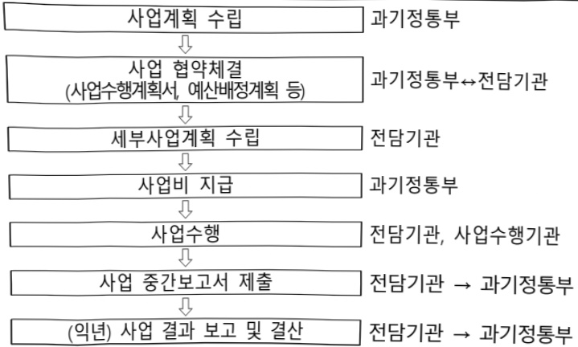

# AI혁신을 위한 데이터 안전 활용 지원 사업

**해당 페이지**: PDF 548 ~ 553 쪽 해당

**부처**: 과학기술정보통신부
**분야**: 통신
**회계유형**: 일반회계
**2026 확정예산**: 5000.0 백만원
**전년대비 증감률**: None%
**AI 도메인**: 보안/사이버

---

<table border=1 style='margin: auto; word-wrap: break-word;'><tr><td style='text-align: center; word-wrap: break-word;'>사 업 명</td></tr><tr><td style='text-align: center; word-wrap: break-word;'>(336) AI혁신을 위한 데이터안전활용 지원 (2604-301)</td></tr></table>

□ 사업 코드 정보

<table border=1 style='margin: auto; word-wrap: break-word;'><tr><td style='text-align: center; word-wrap: break-word;'>구분</td><td style='text-align: center; word-wrap: break-word;'>회계</td><td style='text-align: center; word-wrap: break-word;'>소관</td><td style='text-align: center; word-wrap: break-word;'>실국(기관)</td><td style='text-align: center; word-wrap: break-word;'>계정</td><td style='text-align: center; word-wrap: break-word;'>분야</td><td style='text-align: center; word-wrap: break-word;'>부문</td></tr><tr><td style='text-align: center; word-wrap: break-word;'>코드</td><td rowspan="2">일반회계</td><td style='text-align: center; word-wrap: break-word;'>과학기술</td><td style='text-align: center; word-wrap: break-word;'>인공지능인프라</td><td rowspan="2"></td><td style='text-align: center; word-wrap: break-word;'>130</td><td style='text-align: center; word-wrap: break-word;'>133</td></tr><tr><td style='text-align: center; word-wrap: break-word;'>명칭</td><td style='text-align: center; word-wrap: break-word;'>정보통신부</td><td style='text-align: center; word-wrap: break-word;'>정책관</td><td style='text-align: center; word-wrap: break-word;'>통신</td><td style='text-align: center; word-wrap: break-word;'>정보통신</td></tr></table>

<table border=1 style='margin: auto; word-wrap: break-word;'><tr><td style='text-align: center; word-wrap: break-word;'>구분</td><td style='text-align: center; word-wrap: break-word;'>프로그램</td><td style='text-align: center; word-wrap: break-word;'>단위사업</td><td style='text-align: center; word-wrap: break-word;'>세부사업</td></tr><tr><td style='text-align: center; word-wrap: break-word;'>코드</td><td style='text-align: center; word-wrap: break-word;'>2600</td><td style='text-align: center; word-wrap: break-word;'>2604</td><td style='text-align: center; word-wrap: break-word;'>301</td></tr><tr><td style='text-align: center; word-wrap: break-word;'>명칭</td><td style='text-align: center; word-wrap: break-word;'>인공지능데이터진흥</td><td style='text-align: center; word-wrap: break-word;'>데이터산업경쟁력강화</td><td style='text-align: center; word-wrap: break-word;'>AI혁신을 위한 데이터안전활용 지원</td></tr></table>

☐ 사업 성격 (공통요구자료 II-1 작성유의사항 4. 참조, 해당하는 사항에 “○” 표시)

<table border=1 style='margin: auto; word-wrap: break-word;'><tr><td rowspan="2">신규</td><td rowspan="2">계속</td><td rowspan="2">완료</td><td rowspan="2">예비타당성 실시여부</td><td rowspan="2">총사업비 관리대상</td><td rowspan="2">총액계상 예산사업</td><td style='text-align: center; word-wrap: break-word;'>사업소관 변경정보</td></tr><tr><td style='text-align: center; word-wrap: break-word;'>2025예산 시 소관</td></tr><tr><td style='text-align: center; word-wrap: break-word;'>O</td><td style='text-align: center; word-wrap: break-word;'></td><td style='text-align: center; word-wrap: break-word;'></td><td style='text-align: center; word-wrap: break-word;'></td><td style='text-align: center; word-wrap: break-word;'></td><td style='text-align: center; word-wrap: break-word;'></td><td style='text-align: center; word-wrap: break-word;'></td></tr></table>

□ 사업 지원 형태 및 지원율

<table border=1 style='margin: auto; word-wrap: break-word;'><tr><td style='text-align: center; word-wrap: break-word;'>직접</td><td style='text-align: center; word-wrap: break-word;'>출자</td><td style='text-align: center; word-wrap: break-word;'>출연</td><td style='text-align: center; word-wrap: break-word;'>보조</td><td style='text-align: center; word-wrap: break-word;'>융자</td><td style='text-align: center; word-wrap: break-word;'>국고보조율(%)</td><td style='text-align: center; word-wrap: break-word;'>융자율(%)</td></tr><tr><td style='text-align: center; word-wrap: break-word;'></td><td style='text-align: center; word-wrap: break-word;'></td><td style='text-align: center; word-wrap: break-word;'>O</td><td style='text-align: center; word-wrap: break-word;'></td><td style='text-align: center; word-wrap: break-word;'></td><td style='text-align: center; word-wrap: break-word;'></td><td style='text-align: center; word-wrap: break-word;'></td></tr></table>

## □ 사업 소관부처 및 시행주체

<table border=1 style='margin: auto; word-wrap: break-word;'><tr><td style='text-align: center; word-wrap: break-word;'>사업명</td><td colspan="2">구분</td></tr><tr><td rowspan="3">AI혁신을 위한 데이터 안전활용 지원</td><td rowspan="2">소관부처</td><td style='text-align: center; word-wrap: break-word;'>인공지능정책실 인공지능인프라정책관</td></tr><tr><td style='text-align: center; word-wrap: break-word;'>인공지능데이터진흥과</td></tr><tr><td style='text-align: center; word-wrap: break-word;'>사업시행주체</td><td style='text-align: center; word-wrap: break-word;'>한국지능정보사회진흥원</td></tr></table>

---

### 가.예산 총괄표

(단위: 백만원, %)

<table border=1 style='margin: auto; word-wrap: break-word;'><tr><td rowspan="2">사업명</td><td rowspan="2">2024년 결산</td><td colspan="2">2025년 예산</td><td colspan="2">2026년 예산</td><td rowspan="2">증감(B-A)</td><td rowspan="2">(B-A)/A</td></tr><tr><td style='text-align: center; word-wrap: break-word;'>본예산</td><td style='text-align: center; word-wrap: break-word;'>추경*(A)</td><td style='text-align: center; word-wrap: break-word;'>요구안</td><td style='text-align: center; word-wrap: break-word;'>본예산(B)</td></tr><tr><td style='text-align: center; word-wrap: break-word;'>AI혁신을 위한 데이터 안전활용 지원</td><td style='text-align: center; word-wrap: break-word;'>-</td><td style='text-align: center; word-wrap: break-word;'>-</td><td style='text-align: center; word-wrap: break-word;'>-</td><td style='text-align: center; word-wrap: break-word;'>5,000</td><td style='text-align: center; word-wrap: break-word;'>5,000</td><td style='text-align: center; word-wrap: break-word;'>5,000</td><td style='text-align: center; word-wrap: break-word;'>순증</td></tr></table>

□ 기능별(내역사업별) 예산 내역

(단위:백만원)

<table border=1 style='margin: auto; word-wrap: break-word;'><tr><td rowspan="2"></td><td colspan="5">2024</td><td colspan="5">2025</td><td rowspan="2">2026 예산</td></tr><tr><td style='text-align: center; word-wrap: break-word;'>예산액(추정)</td><td style='text-align: center; word-wrap: break-word;'>예산현액</td><td style='text-align: center; word-wrap: break-word;'>집행액</td><td style='text-align: center; word-wrap: break-word;'>이월액</td><td style='text-align: center; word-wrap: break-word;'>불용액</td><td style='text-align: center; word-wrap: break-word;'>예산액(추정)</td><td style='text-align: center; word-wrap: break-word;'>예산현액</td><td style='text-align: center; word-wrap: break-word;'>집행액</td><td style='text-align: center; word-wrap: break-word;'>이월액</td><td style='text-align: center; word-wrap: break-word;'>불용액</td></tr><tr><td style='text-align: center; word-wrap: break-word;'>○ 기능별 분류(합계)</td><td style='text-align: center; word-wrap: break-word;'>-</td><td style='text-align: center; word-wrap: break-word;'>-</td><td style='text-align: center; word-wrap: break-word;'>-</td><td style='text-align: center; word-wrap: break-word;'>-</td><td style='text-align: center; word-wrap: break-word;'>-</td><td style='text-align: center; word-wrap: break-word;'>-</td><td style='text-align: center; word-wrap: break-word;'>-</td><td style='text-align: center; word-wrap: break-word;'>-</td><td style='text-align: center; word-wrap: break-word;'>-</td><td style='text-align: center; word-wrap: break-word;'>-</td><td style='text-align: center; word-wrap: break-word;'>5,000</td></tr><tr><td rowspan="2">• 데이터안심구역 연계시스템 기획 • 데이터안심구역 전환 및 고도화 지원</td><td style='text-align: center; word-wrap: break-word;'>-</td><td style='text-align: center; word-wrap: break-word;'>-</td><td style='text-align: center; word-wrap: break-word;'>-</td><td style='text-align: center; word-wrap: break-word;'>-</td><td style='text-align: center; word-wrap: break-word;'>-</td><td style='text-align: center; word-wrap: break-word;'>-</td><td style='text-align: center; word-wrap: break-word;'>-</td><td style='text-align: center; word-wrap: break-word;'>-</td><td style='text-align: center; word-wrap: break-word;'>-</td><td style='text-align: center; word-wrap: break-word;'>-</td><td style='text-align: center; word-wrap: break-word;'>1,000</td></tr><tr><td style='text-align: center; word-wrap: break-word;'>-</td><td style='text-align: center; word-wrap: break-word;'>-</td><td style='text-align: center; word-wrap: break-word;'>-</td><td style='text-align: center; word-wrap: break-word;'>-</td><td style='text-align: center; word-wrap: break-word;'>-</td><td style='text-align: center; word-wrap: break-word;'>-</td><td style='text-align: center; word-wrap: break-word;'>-</td><td style='text-align: center; word-wrap: break-word;'>-</td><td style='text-align: center; word-wrap: break-word;'>-</td><td style='text-align: center; word-wrap: break-word;'>-</td><td style='text-align: center; word-wrap: break-word;'>4,000</td></tr></table>

### 나. 사업설명자료

## 1 ) 사업목적·내용

o (AI혁신을 위한 데이터안전활용 지원) 고품질 미개방 데이터와 안전한 분석 환경이 제공되는 데이터안심구역을 활용도가 높은 지역거점을 중심으로 확산·고도화하고, 안심구역 간 공동 연계 거버넌스 통해 AI혁신을 위한 데이터 안전 활용 기반 마련 *사전신청 및 승인 절차를 통해 물리적·기술적·관리적 보안환경을 갖춘 지정된 장소에서만 데이터를 활용하고, 분석 결과물만 반출할 수 있도록 조치한 환경 (데이터산업법 제11조 근거)

- (데이터안심구역 연계시스템 기획) 분절되어 운영 중인 데이터안심구역을 연계하고 미개방 데이터 및 보안 분석 환경 등을 공동으로 활용할 수 있는 안전한 데이터 연계 체계 구축

- (네이터안심구역 전환 및 고도화 지원) 기존 안심구역의 고도화 및 신규 지정 희망

기관을 대상으로 필수요건을 충족할 수 있도록 지원

* ①시설 및 공간(시설 통제, 장비 시스템 구축 등), ②조직 구성 및 운영(전문 운영 조직 구성 등, ③보호조치(암호화, 반출입 환경관리 등) 등 물리적·관리적·기술적 보안대책 마련 등 포함

---

## 2 ) 사업개요

## 사업근거 및 추진경위

① 법령상 근거 및 조항 적시

## - 지능정보화 기본법

## 제12조(한국지능정보사회진흥원의 설립) ①~② (생 략)

③ 지능정보사회원은 다음 각 호의 사업을 한다.

1.~4. (생 략)

5. 데이터 관련 시책의 수립 지원, 시범사업 추진 및 전문기술의 지원 등 데이터의 생산·관리·유통·활용의 활성화를 위하여 필요한 지원

6.~12. (생 략)

④~⑧ (생 략)

제42조(데이터 관련 시책의 마련) ① 정부는 지능정보화의 효율적 추진과 지능정보서비스의 제공·이용 활성화에 필요한 데이터의 생산·수집 및 유통·활용 등을 촉진하기 위하여 필요한 정책을 추진하여야 한다.

② 과학기술정보통신부장관은 다음 각 호의 사항이 포함된 시책을 수립·시행하여야 한다.

다만, 공공데이터에 관한 사항은「공공데이터의 제공 및 이용 활성화에 관한 법률」에 따른다.

1. 데이터 관련 시책의 기본방향

2. 데이터의 생산·수집 및 유통·활용

3. 데이터 유통 활성화 및 유통체계 구축

4. 데이터의 생산·수집 및 유통·활용에 관한 기술개발의 추진

5. 데이터의 표준화 및 품질제고

6. 데이터 전문인력 양성 및 데이터 전문기업 육성

7. 제2호부터 제6호까지와 관련한 재원의 확보

8. 그 밖에 데이터의 생산·수집 및 유통·활용을 위하여 필요한 사항

③ (생 략)

제43조데이터의 유통·활용) ① 정부는 데이터의 효율적인 생산·수집·관리와 원활한 유통·활용을 위하여 국가기관등, 법인, 기관 및 단체와의 협력체계를 구축하고, 이를 위한 지원을 할 수 있다.

② 정부는 지능정보사회 구현을 위하여 원활한 유통과 활용이 필요한 다음 각 호의 데이터를 생산·수집 또는 보유하고 있는 국가기관등, 법인, 기관 및 단체를 지원할 수 있다. 다만, 공공데이터에 관한 사항은「공공데이터의 제공 및 이용 활성화에 관한 법률」에 따른다.

1. 국가적으로 보존 및 이용 가치가 있는 자료로서 학술, 문화, 과학기술, 행정 등에 관한 디지털화된 자료나 디지털화의 필요성이 인정되는 데이터

2. 국민 생활의 질적 향상과 복리 증진 및 안전을 위하여 필요한 데이터

3. 국가 경제·산업의 발전을 도모하고 국가경쟁력 확보 등을 위하여 필요한 데이터

4. 그 밖에 지능정보화 및 지능정보서비스의 발전을 위하여 필요한 데이터

③~④ (생 략)

## -데이터산업진흥 및 이용촉진에 관한 기본법(데이터산업법)

제11조(데이터안심구역 지정) ① 과학기술정보통신부장관과 관계 중앙행정기관의 장은 누구든지 데이터를 안전하게 분석 · 활용할 수 있는 구역(이하 "데이터안심구역"이라 한다)을 지정하여 운영할 수 있다.

② 과학기술정보통신부장관과 중앙행정기관의 장은 데이터안심구역 이용을 지원하기 위하여 미개방데이터, 분석 시스템 및 도구 등을 지원할 수 있다.

③ 과학기술정보통신부장관과 관계 중앙행정기관의 장은 제2항에 따른 미개방데이터 지원을 위하여 필요한 경우에는 정부 및 지방자치단체, 공공기관, 민간법인 등에 데이터 제공을 요청할 수 있다.

④ 과학기술정보통신부장관과 중앙행정기관의 장은 제3항에 따른 데이터 제공에 필요한 기술적 ·

---

재정적 지원을 할 수 있다.

⑤ 과학기술정보통신부장관과 관계 중앙행정기관의 장은 데이터안심구역에 대한 제3자의 불법적인 접근, 데이터의 변경·훼손·유출 및 파괴, 그 밖의 위험에 대하여 대통령령으로 정하는 바에 따라 기술적·물리적·관리적 보안대책을 수립·시행하여야 한다.

⑥ 제1항부터 제5항까지에서 규정한 사항 외에 데이터안심구역의 지정 및 운영 등에 필요한 사항은 대통령령으로 정한다.

제32조(전문기관의 지정·운영) ① 정부는 데이터산업 전반의 기반 조성 및 관련 산업의 육성을 효율적으로 지원하기 위하여 필요한 때에는 그 업무를 전문적으로 수행할 기관(이하 이 조에서 "전문기관"이라 한다)을 지정할 수 있다.

② 전문기관은 이 법 또는 다른 법령에서 전문기관의 업무로 정하거나 전문기관에 위탁한 사업과 데이터 유통·활용 촉진 및 산업 기반 조성에 필요한 사업을 할 수 있다.

③ 정부는 데이터산업 전반의 기반 조성 및 관련 산업의 육성과 관련된 업무를 수행하는 데 필요한 자금의 전부 또는 일부를 전문기관에 출연하거나 융자 등을 할 수 있다.

④ 전문기관의 지정 및 운영 등에 관하여 필요한 사항은 대통령령으로 정한다.

## ② 추진경위

- '20.12 : 지능정보화기본법 시행

- '22.04. : 데이터 산업진흥 및 이용촉진에 관한 기본법 시행

- '22.09 : 대한민국 디지털 전략(관계부처합동)

- '23.01 : 제1차 데이터산업 진흥 기본계획(관계부처합동)

- '23.11 : 데이터 경제 활성화 추진과제(비상경제장관회의)

- '24.08 : '24년 데이터 산업진흥 시행계획(관계부처합동)

- '25.08 : 국정과제 20(AI 3대 강국 도약을 위한 AI 고속도로 구축), 국정과제 21 (세계에서 AI를 가장 잘 쓰는 나라 구현)

## ☐ 주요내용

① 사업규모

- 총사업비 : 해당 없음

- 사업기간 : 2026년 ~ 계속

- 최근 5년 간 투입된 사업비(예산액기준, 추경편성한 연도에는 추경포함)

<table border=1 style='margin: auto; word-wrap: break-word;'><tr><td style='text-align: center; word-wrap: break-word;'>$ \underline{\text{所}} $</td><td style='text-align: center; word-wrap: break-word;'>2022</td><td style='text-align: center; word-wrap: break-word;'>2023</td><td style='text-align: center; word-wrap: break-word;'>2024</td><td style='text-align: center; word-wrap: break-word;'>2025</td><td style='text-align: center; word-wrap: break-word;'>2026(所)</td></tr><tr><td style='text-align: center; word-wrap: break-word;'>$ \underline{\text{所}} $</td><td style='text-align: center; word-wrap: break-word;'>-</td><td style='text-align: center; word-wrap: break-word;'>-</td><td style='text-align: center; word-wrap: break-word;'>-</td><td style='text-align: center; word-wrap: break-word;'>-</td><td style='text-align: center; word-wrap: break-word;'>5,000 $ \underline{\text{所}} $</td></tr></table>

② 사업추진체계

- 사업시행방법 : 출연

-사업시행주체:한국지능정보사회진흥원

- 사업 수혜자 : 데이터 산업법 제11조에 따라 지정(예정)된 데이터 안심구역

- 보조, 융자, 출연, 출자 등의 경우 보조·융자 등 지원 비율 및 법적근거

---

<table border=1 style='margin: auto; word-wrap: break-word;'><tr><td style='text-align: center; word-wrap: break-word;'>내역사업명</td><td style='text-align: center; word-wrap: break-word;'>구분</td><td style='text-align: center; word-wrap: break-word;'>피보조·피출연 등 기관명</td><td style='text-align: center; word-wrap: break-word;'>지원 금액 (2026예산)</td><td style='text-align: center; word-wrap: break-word;'>지원 비율(%)</td><td style='text-align: center; word-wrap: break-word;'>보조율 법적근거 (해당 조항)</td></tr><tr><td style='text-align: center; word-wrap: break-word;'>데이터안심 구역 연계시스템 기획</td><td style='text-align: center; word-wrap: break-word;'>출연</td><td style='text-align: center; word-wrap: break-word;'>한국자능정보 사회진흥원</td><td style='text-align: center; word-wrap: break-word;'>1,000백만원</td><td style='text-align: center; word-wrap: break-word;'>100</td><td style='text-align: center; word-wrap: break-word;'>- 지능정보화기본법 제12조, 제42조, 제43조 - 데이터산업법 제11조, 제32조</td></tr><tr><td style='text-align: center; word-wrap: break-word;'>데이터안심 구역 전환 및 고도화 지원</td><td style='text-align: center; word-wrap: break-word;'>출연</td><td style='text-align: center; word-wrap: break-word;'>한국자능정보 사회진흥원</td><td style='text-align: center; word-wrap: break-word;'>4,000백만원</td><td style='text-align: center; word-wrap: break-word;'>100</td><td style='text-align: center; word-wrap: break-word;'>- 지능정보화기본법 제12조, 제42조, 제43조 - 데이터산업법 제11조, 제32조</td></tr></table>

## 3 ) 2026년도 예산 산출 근거

□ AI혁신을 위한 데이터 안전활용 지원 : (2026 예산) 5,000백만원(신규)

① 데이터안심구역 연계시스템 기획 : (2026 예산) 1,000백만원, 순증

② 데이터안심구역 전환·고도화 지원 : (2026 예산) 4,000백만원, 순증

## 4 ) 사업효과

☐ 사업영향, 산출물 성과지표 등

① 2022~2026년도 성과계획서 상 성과지표 및 최근 5년간 성과 달성도

<table border=1 style='margin: auto; word-wrap: break-word;'><tr><td style='text-align: center; word-wrap: break-word;'>성과지표</td><td style='text-align: center; word-wrap: break-word;'>구분</td><td style='text-align: center; word-wrap: break-word;'>2022</td><td style='text-align: center; word-wrap: break-word;'>2023</td><td style='text-align: center; word-wrap: break-word;'>2024</td><td style='text-align: center; word-wrap: break-word;'>2025</td><td style='text-align: center; word-wrap: break-word;'>2026</td><td style='text-align: center; word-wrap: break-word;'>2026 목표치산출근거</td><td style='text-align: center; word-wrap: break-word;'>측정산식(또는 측정방법)</td><td style='text-align: center; word-wrap: break-word;'>자료수집방법(또는 자료출처)</td></tr><tr><td rowspan="3">데이터안심구역연계 건수(단위: 건)</td><td style='text-align: center; word-wrap: break-word;'>목표</td><td style='text-align: center; word-wrap: break-word;'>-</td><td style='text-align: center; word-wrap: break-word;'>-</td><td style='text-align: center; word-wrap: break-word;'>-</td><td style='text-align: center; word-wrap: break-word;'>(신규)</td><td style='text-align: center; word-wrap: break-word;'>10</td><td rowspan="3">연계 시스템과 안심구역의 연계 건수</td><td rowspan="3">안심구역 누적 연계 건수</td><td rowspan="3">결과보고서</td></tr><tr><td style='text-align: center; word-wrap: break-word;'>실적</td><td style='text-align: center; word-wrap: break-word;'>-</td><td style='text-align: center; word-wrap: break-word;'>-</td><td style='text-align: center; word-wrap: break-word;'>-</td><td style='text-align: center; word-wrap: break-word;'>-</td><td style='text-align: center; word-wrap: break-word;'>-</td></tr><tr><td style='text-align: center; word-wrap: break-word;'>달성도</td><td style='text-align: center; word-wrap: break-word;'>-</td><td style='text-align: center; word-wrap: break-word;'>-</td><td style='text-align: center; word-wrap: break-word;'>-</td><td style='text-align: center; word-wrap: break-word;'>-</td><td style='text-align: center; word-wrap: break-word;'>-</td></tr></table>

② 성과지표 이외의 연도별 사업추진 경과 및 실적 : 해당 없음(2026년도 신규사업)

③ 향후(2026년도 이후) 기대효과

o 데이터안심구역 기반의 안전한 데이터 공유·분석 생태계 구축으로 국내 연구자 및 기업 등의 고품질 데이터 기반 AI 경쟁력 강화에 실질적 기여

5) 타당성조사 및 예비타당성조사 시행여부 및 결과 요지 : 해당없음

6) 총사업비 대상사업 정보 : 해당 없음

---

## 7 ) 사업 집행절차

<데이터안심구역 연계시스템 기획>

<table border=1 style='margin: auto; word-wrap: break-word;'><tr><td style='text-align: center; word-wrap: break-word;'>부처</td><td style='text-align: center; word-wrap: break-word;'></td><td style='text-align: center; word-wrap: break-word;'>피졸연·피보조기관</td><td style='text-align: center; word-wrap: break-word;'></td><td style='text-align: center; word-wrap: break-word;'>간접보조사업자·사업수행자</td></tr><tr><td style='text-align: center; word-wrap: break-word;'>과학기술정보통신부(1,000백만원)</td><td style='text-align: center; word-wrap: break-word;'>=&gt;(1,000백만원)</td><td style='text-align: center; word-wrap: break-word;'>한국지능정보사회진흥원(1,000백만원)</td><td style='text-align: center; word-wrap: break-word;'>=&gt;</td><td style='text-align: center; word-wrap: break-word;'></td></tr></table>

<데이터안심구역 전환·고도화 지원>

<table border=1 style='margin: auto; word-wrap: break-word;'><tr><td style='text-align: center; word-wrap: break-word;'>부처</td><td style='text-align: center; word-wrap: break-word;'></td><td style='text-align: center; word-wrap: break-word;'>피출연·피보조기관</td><td style='text-align: center; word-wrap: break-word;'></td><td style='text-align: center; word-wrap: break-word;'>간접보조사업자·사업수행자</td></tr><tr><td style='text-align: center; word-wrap: break-word;'>과학기술정보통신부(4,000백만원)</td><td style='text-align: center; word-wrap: break-word;'>=&gt;(4,000백만원)</td><td style='text-align: center; word-wrap: break-word;'>한국지능정보사회진흥원(4,000백만원)</td><td style='text-align: center; word-wrap: break-word;'>=&gt;(3,800백만원)</td><td style='text-align: center; word-wrap: break-word;'>데이터 안심구역전환·고도화기관 등</td></tr></table>

8) 각종 평가 : 해당 없음

### 다. 최근 4년간 결산내역 : 해당없음

---

### 원본 PDF 크롭 이미지

