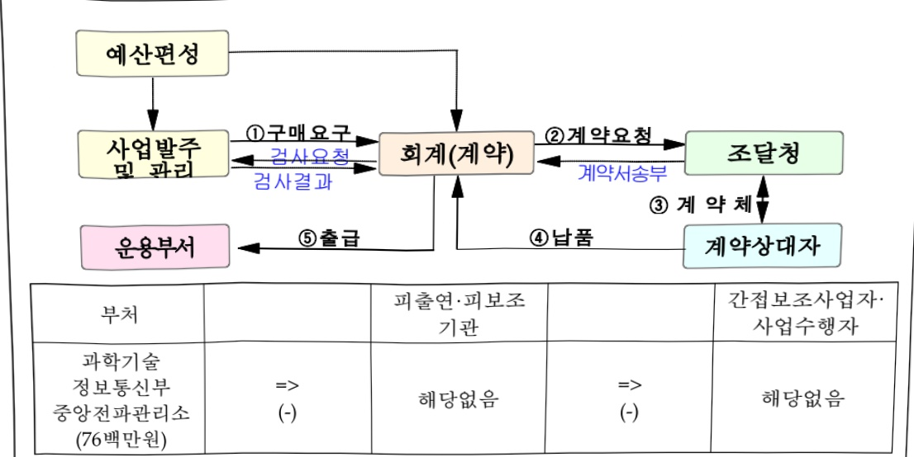
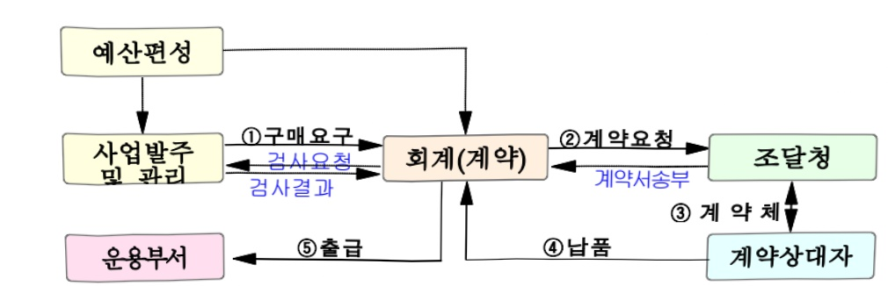

# AI활용 미인증 기자재 온라인 모니터링 시스템 구축

**해당 페이지**: PDF 554 ~ 559 쪽 해당

**부처**: 과학기술정보통신부
**분야**: 통신
**회계유형**: 일반회계
**2026 확정예산**: 76.0 백만원
**전년대비 증감률**: 100.0%
**AI 도메인**: 디지털전환(AX)

---

### 가. 예산 총괄표

(단위: 백만원, %)

<table border=1 style='margin: auto; word-wrap: break-word;'><tr><td rowspan="2">사업명</td><td rowspan="2">2024년 결산</td><td colspan="2">2025년 예산</td><td colspan="2">2026년 예산</td><td rowspan="2">중감(B-A)</td><td rowspan="2">(B-A)/A</td></tr><tr><td style='text-align: center; word-wrap: break-word;'>본예산</td><td style='text-align: center; word-wrap: break-word;'>추경 $ ^{*} $(A)</td><td style='text-align: center; word-wrap: break-word;'>요구안</td><td style='text-align: center; word-wrap: break-word;'>본예산(B)</td></tr><tr><td style='text-align: center; word-wrap: break-word;'></td><td style='text-align: center; word-wrap: break-word;'></td><td style='text-align: center; word-wrap: break-word;'></td><td style='text-align: center; word-wrap: break-word;'></td><td style='text-align: center; word-wrap: break-word;'>76</td><td style='text-align: center; word-wrap: break-word;'>76</td><td style='text-align: center; word-wrap: break-word;'>76</td><td style='text-align: center; word-wrap: break-word;'>100</td></tr></table>

* 추경: 추경증감액을 포함한 최종 예산액을 기재

□ 기능별(내역사업별), 목별 예산 내역

(단위:백만원)

<table border=1 style='margin: auto; word-wrap: break-word;'><tr><td rowspan="2"></td><td colspan="5">2024</td><td colspan="5">2025</td><td rowspan="2">2026예산</td></tr><tr><td style='text-align: center; word-wrap: break-word;'>예산액(추경)</td><td style='text-align: center; word-wrap: break-word;'>예산현액</td><td style='text-align: center; word-wrap: break-word;'>집행액</td><td style='text-align: center; word-wrap: break-word;'>이월액</td><td style='text-align: center; word-wrap: break-word;'>불용액</td><td style='text-align: center; word-wrap: break-word;'>예산액(추경)</td><td style='text-align: center; word-wrap: break-word;'>예산현액</td><td style='text-align: center; word-wrap: break-word;'>집행액</td><td style='text-align: center; word-wrap: break-word;'>이월액</td><td style='text-align: center; word-wrap: break-word;'>불용액</td></tr><tr><td style='text-align: center; word-wrap: break-word;'>○ 기능별 분류(합계)</td><td style='text-align: center; word-wrap: break-word;'>-</td><td style='text-align: center; word-wrap: break-word;'>-</td><td style='text-align: center; word-wrap: break-word;'>-</td><td style='text-align: center; word-wrap: break-word;'>-</td><td style='text-align: center; word-wrap: break-word;'>-</td><td style='text-align: center; word-wrap: break-word;'>-</td><td style='text-align: center; word-wrap: break-word;'>-</td><td style='text-align: center; word-wrap: break-word;'>-</td><td style='text-align: center; word-wrap: break-word;'>-</td><td style='text-align: center; word-wrap: break-word;'>-</td><td style='text-align: center; word-wrap: break-word;'>76</td></tr><tr><td style='text-align: center; word-wrap: break-word;'>• AI 활용 미인증기자재 온라인모니터링 시스템구축</td><td style='text-align: center; word-wrap: break-word;'>-</td><td style='text-align: center; word-wrap: break-word;'>-</td><td style='text-align: center; word-wrap: break-word;'>-</td><td style='text-align: center; word-wrap: break-word;'>-</td><td style='text-align: center; word-wrap: break-word;'>-</td><td style='text-align: center; word-wrap: break-word;'>-</td><td style='text-align: center; word-wrap: break-word;'>-</td><td style='text-align: center; word-wrap: break-word;'>-</td><td style='text-align: center; word-wrap: break-word;'>-</td><td style='text-align: center; word-wrap: break-word;'>-</td><td style='text-align: center; word-wrap: break-word;'>76</td></tr></table>

### 나. 사업설명자료

## 1 ) 사업목적·내용

- (AI 활용 미인증 기자재 온라인 모니터링 시스템 구축)

① 사업 목적: 적합성평가(KC인증)를 받지 않고 유통되는 전기·전자·통신 제품들에 대해 주된 유통 경로인 온라인 플랫폼 대상 모니터링을 위해 AI 도입·활용 추진

② 사업 내용: 적합성평가 관련 법령(고시), 방송통신기자재 적합성평가 및 민원 처리 현황 등의 데이터를 기반으로 AI를 학습시키고, 온라인상의 판매 글에서 인증 관련 정보를 AI가 스스로 수집·분석하여 인증 여부를 판단하는 모니터링 시스템 구축을 위한 ISP 수립

---

2) 사업개요

사업근거 및 추진경위

① 법령상 근거 및 조항 적시

<table border=1 style='margin: auto; word-wrap: break-word;'><tr><td style='text-align: center; word-wrap: break-word;'>◆ 전 파법</td></tr><tr><td style='text-align: center; word-wrap: break-word;'>제58조의2(방송통신기자재등의 적합성평가) ① 방송통신기자재와 전자파장해를 주거나 전자파로부터 영향을 받는 기자재(이하 “방송통신기자재등”이라 한다)를 제조 또는 판매하거나 수입하려는 자는 해당 기자재에 대하여 다음 각 호의 기준(이하 “적합성평가기준”이라 한다)에 따라 제2항에 따른 적합인증, 제3항에 따른 적합등록, 제4항에 따른 자기적합확인 또는 제9항에 따른 잠정인증(이하 “적합성평가”라 한다)을 받아야 한다.</td></tr><tr><td style='text-align: center; word-wrap: break-word;'>제71조의2(조사 및 조치) ① 과학기술정보통신부장관은 다음 각 호의 어느 하나에 해당하는 경우 소속 공무원으로 하여금 이를 조사 또는 시험하게 할 수 있다.</td></tr><tr><td style='text-align: center; word-wrap: break-word;'>3. 제19조·제19조의2·제24조·제25조·제29조·제45조·제52조·제58조·제58조의2 또는 제58조의10을 위반한 자가 있다고 인정되는 경우</td></tr><tr><td style='text-align: center; word-wrap: break-word;'>제84조(벌칙) 다음 각 호의 어느 하나에 해당하는 자는 3년 이하의 징역 또는 3천만원 이하의 벌금에 처한다.</td></tr><tr><td style='text-align: center; word-wrap: break-word;'>5. 제58조의2제2항, 제3항 및 제9항에 따른 적합성평가를 받지 아니한 기자재를 판매하거나 판매할 목적으로 제조·수입한 자</td></tr><tr><td style='text-align: center; word-wrap: break-word;'>제86조(벌칙) 다음 각 호의 어느 하나에 해당하는 자는 1년 이하의 징역 또는 1천만원 이하의 벌금에 처한다.</td></tr><tr><td style='text-align: center; word-wrap: break-word;'>4의2. 제58조의2제2항, 제3항 및 제9항을 위반하여 적합성평가를 받지 아니한 기자재를 판매·대여할 목적으로 운송하거나 무선국·방송통신망에 설치한 자</td></tr></table>

---

제89조의3(과태료) 다음 각 호의 어느 하나에 해당하는 자에게는 500만원 이하의 과태료를 부과한다.

2의2. 제58조의2제2항, 제3항 및 제9항을 위반하여 적합성평가를 받지 아니한 기자재를 판매 · 대여할 목적으로 진열 · 보관한 자

3. 제58조의2제4항을 위반하여 자기적합확인을 하지 아니하고 자기적합확인 대상 기자재를 판매하거나 판매할 목적으로 제조·수입한 자

제90조(과태료) 다음 각 호의 어느 하나에 해당하는 자에게는 300만원 이하의 과태료를 부과한다.

5의2. 제58조의2제4항을 위반하여 자기적합확인을 하지 아니하고 자기적합확인 대상 기자재를

판매·대여할목적으로진열·보관또는운송하거나무선국·방송통신망에설치한자

## ◆ 사법경찰관리의 직무를 수행할 자와 그 직무범위에 관한 법률

제5조(검사장의 지명에 의한 사법경찰관리) 다음 각 호에 규정된 자로서 그 소속 관서의 장의 제청에 의하여 그 근무지를 관할하는 지방검찰청검사장이 지명한 자 중 7급 이상의 국가공무원 또는 지방공무원 및 소방위 이상의 소방공무원은 사법경찰관의 직무를, 8급 • 9급의 국가공무원 또는 지방공무원 및 소방장 이하의 소방공무원은 사법경찰리의 직무를 수행한다.

23. 과학기술정보통신부와 그 소속 기관 및 방송통신위원회에 근무하며 무선설비, 전기통신설비, 방송통신설비, 감청설비, 미등록 불법감청설비탐지업자, 「전파법」 제58조의2제1항에 따른 방송통신기자재등 및 영리목적의 광고성 정보에 관한 단속 사무에 종사하는 4급부터 9급까지의 국가공무원

제6조(직무범위와 수사 관할) 제4조와 제5조에 따라 사법경찰관리의 직무를 수행할 자의

직무범위와 수사 관할은 다음 각 호에 규정된 범죄로 한정한다.

20. 제5조제23호에 규정된 자의 경우에는 소속 관서 관할 구역에서 발생하는 다음 각 목의 법률에 규정된 범죄

가.「전파법」중 무선설비나 같은 법 제58조의2제1항에 따른 방송통신기자재등에 관한 범죄

## ② 추진경위

- 1990.11.1.부터 전과환경 위해 방지 및 소비자 피해 예방을 위해 적합성평가를 받지 않은 방송통신기자재 등을 판매 또는 판매 목적으로 제조·수입한 자 등에 대해 조사·단속 시행

- 2012년 전기안전인증과 전자과 적합성평가 제도의 규제분리로 인해 전기용품이 적합성평가 대상으로 편입되었고, 소량·다품종 생산 증가로 매년 50,000건 이상의 기자재가 새롭게 적합성평가를 받고 있음

- 적합성평가를 받지 않은 기자재는 온라인 플랫폼, 해외직구 사이트 등 다양한 경로로 유통되고 있음

---

## □ 주요내용

① 사업규모

- 사업기간 : 2026~2029

- 최근 5년 간 투입된 사업비(예산액기준, 추경편성한 연도에는 추경포함)

<table border=1 style='margin: auto; word-wrap: break-word;'><tr><td style='text-align: center; word-wrap: break-word;'>연도</td><td style='text-align: center; word-wrap: break-word;'>2022</td><td style='text-align: center; word-wrap: break-word;'>2023</td><td style='text-align: center; word-wrap: break-word;'>2024</td><td style='text-align: center; word-wrap: break-word;'>2025</td><td style='text-align: center; word-wrap: break-word;'>2026(안)</td></tr><tr><td style='text-align: center; word-wrap: break-word;'>사업비</td><td style='text-align: center; word-wrap: break-word;'></td><td style='text-align: center; word-wrap: break-word;'></td><td style='text-align: center; word-wrap: break-word;'></td><td style='text-align: center; word-wrap: break-word;'></td><td style='text-align: center; word-wrap: break-word;'>76백만원</td></tr></table>

-기타: 해당 없음

② 사업추진체계

- 사업시행방법 : 직접수행

- 사업시행주체 : 과학기술정보통신부 중앙전파관리소

- 사업 수혜자 : 국가, 국민

- 보조, 융자, 출연, 출자 등의 경우 보조·융자 등 지원 비율 및 법적근거 : 해당없음

## 3 ) 2026년도 예산안 산출 근거

① AI 활용 미인증 기자재 온라인 모니터링 시스템 구축

:2026 요구) 76백만원

- (요구) 전기·전자·제품의 주된 유통 경로인 온라인 플랫폼을 대상으로 미인증 제품 유통 여부 모니터링을 위해 AI를 도입하고 활용하는 시스템 구축 관련 정보화 계획(ISP) 수립 예산 요구

- (산출) 시스템 ISP 수립 76백만원

SW사업 대가산정 가이드의 컨설팅 업무량 방식으로 산출

## 4 ) 사업효과

□ 사업영향, 산출물 성과지표 등

① 2022~2026년도 성과계획서 상 성과지표 및 최근 5년간 성과 달성도 : 해당 없음

② 성과지표 이외의 연도별 사업추진 경과 및 실적 : 해당 없음

③ 향후(2026년도 이후) 기대효과

2027년 본 사업 예산 편성, 2028년~2029년 본 사업 추진을 위해 시스템 개발 방향 및 적정 예산 규모 등을 검토하는 ISP 수립

---

5) 타당성조사 및 예비타당성조사 시행여부 및 결과 요지 : 해당 없음

6) 총사업비 대상사업 여부 및 내역 : 해당 없음

7) 사업 집행절차

<table border=1 style='margin: auto; word-wrap: break-word;'><tr><td style='text-align: center; word-wrap: break-word;'>부처</td><td style='text-align: center; word-wrap: break-word;'></td><td style='text-align: center; word-wrap: break-word;'>피출연·피보조기관</td><td style='text-align: center; word-wrap: break-word;'></td><td style='text-align: center; word-wrap: break-word;'>간접보조사업자·사업수행자</td></tr><tr><td style='text-align: center; word-wrap: break-word;'>과학기술정보통신부중앙전과관리소(76백만원)</td><td style='text-align: center; word-wrap: break-word;'>=&gt;(-)</td><td style='text-align: center; word-wrap: break-word;'>해당없음</td><td style='text-align: center; word-wrap: break-word;'>=&gt;(-)</td><td style='text-align: center; word-wrap: break-word;'>해당없음</td></tr></table>

## 8 ) 각종 평가

국회(상임위) 제기

- (김장겸 의원(국)) 미인증 기기의 불법 유통을 조기 차단하기 위한 AI 기반 상시 모니터링 체계 구축 사업이 신속히 착수할 수 있도록 1,884백만원의 예산 증액 필요

다. 최근 4년간 결산내역 : 해당 없음

---

<table border=1 style='margin: auto; word-wrap: break-word;'><tr><td style='text-align: center; word-wrap: break-word;'>사 업 명</td></tr><tr><td style='text-align: center; word-wrap: break-word;'>(179) AX혁신기업창의기술개발(R&amp;D) (2137-375)</td></tr></table>

□ 사업 코드 정보

<table border=1 style='margin: auto; word-wrap: break-word;'><tr><td style='text-align: center; word-wrap: break-word;'>구분</td><td style='text-align: center; word-wrap: break-word;'>회계</td><td style='text-align: center; word-wrap: break-word;'>소관</td><td style='text-align: center; word-wrap: break-word;'>실국(기관)</td><td style='text-align: center; word-wrap: break-word;'>계정</td><td style='text-align: center; word-wrap: break-word;'>분야</td><td style='text-align: center; word-wrap: break-word;'>부문</td></tr><tr><td style='text-align: center; word-wrap: break-word;'>코드</td><td rowspan="2">일반회계</td><td rowspan="2">과학기술정보통신부</td><td rowspan="2">정보통신정책관</td><td rowspan="2"></td><td style='text-align: center; word-wrap: break-word;'>130</td><td style='text-align: center; word-wrap: break-word;'>133</td></tr><tr><td style='text-align: center; word-wrap: break-word;'>명칭</td><td style='text-align: center; word-wrap: break-word;'>통신</td><td style='text-align: center; word-wrap: break-word;'>정보통신</td></tr></table>

<table border=1 style='margin: auto; word-wrap: break-word;'><tr><td style='text-align: center; word-wrap: break-word;'>구분</td><td style='text-align: center; word-wrap: break-word;'>프로그램</td><td style='text-align: center; word-wrap: break-word;'>단위사업</td><td style='text-align: center; word-wrap: break-word;'>세부사업</td></tr><tr><td style='text-align: center; word-wrap: break-word;'>코드</td><td style='text-align: center; word-wrap: break-word;'>2100</td><td style='text-align: center; word-wrap: break-word;'>2137</td><td style='text-align: center; word-wrap: break-word;'>310</td></tr><tr><td style='text-align: center; word-wrap: break-word;'>명칭</td><td style='text-align: center; word-wrap: break-word;'>정보통신용합산업</td><td style='text-align: center; word-wrap: break-word;'>ICT산업기반확충(일반)</td><td style='text-align: center; word-wrap: break-word;'>AX혁신기업창의기술개발(R&amp;D)</td></tr></table>

□ 사업 성격 (공통요구자료 Ⅱ-1 작성유의사항 4. 참조, 해당하는 사항에 “○” 표시)

<table border=1 style='margin: auto; word-wrap: break-word;'><tr><td rowspan="2">신규</td><td rowspan="2">계속</td><td rowspan="2">완료</td><td rowspan="2">예비타당성 실시여부</td><td rowspan="2">총사업비 관리대상</td><td rowspan="2">총액계상 예산사업</td><td style='text-align: center; word-wrap: break-word;'>사업소관 변경정보</td></tr><tr><td style='text-align: center; word-wrap: break-word;'>2025예산 시 소관</td></tr><tr><td style='text-align: center; word-wrap: break-word;'>☐</td><td style='text-align: center; word-wrap: break-word;'></td><td style='text-align: center; word-wrap: break-word;'></td><td style='text-align: center; word-wrap: break-word;'></td><td style='text-align: center; word-wrap: break-word;'></td><td style='text-align: center; word-wrap: break-word;'></td><td style='text-align: center; word-wrap: break-word;'></td></tr></table>

□ 사업 지원 형태 및 지원을 (최소한 한 개는 반드시 선택하시오. 해당사항에 0 표시)

<table border=1 style='margin: auto; word-wrap: break-word;'><tr><td style='text-align: center; word-wrap: break-word;'>직접</td><td style='text-align: center; word-wrap: break-word;'>출자</td><td style='text-align: center; word-wrap: break-word;'>출연</td><td style='text-align: center; word-wrap: break-word;'>보조</td><td style='text-align: center; word-wrap: break-word;'>융자</td><td style='text-align: center; word-wrap: break-word;'>국고보조율(%)</td><td style='text-align: center; word-wrap: break-word;'>융자율(%)</td></tr><tr><td style='text-align: center; word-wrap: break-word;'></td><td style='text-align: center; word-wrap: break-word;'></td><td style='text-align: center; word-wrap: break-word;'>○</td><td style='text-align: center; word-wrap: break-word;'></td><td style='text-align: center; word-wrap: break-word;'></td><td style='text-align: center; word-wrap: break-word;'></td><td style='text-align: center; word-wrap: break-word;'></td></tr></table>

□사업 소관부처 및 시행주체

<table border=1 style='margin: auto; word-wrap: break-word;'><tr><td style='text-align: center; word-wrap: break-word;'>사업명</td><td colspan="2">구분</td></tr><tr><td rowspan="2">AX혁신기업 창의기술개발</td><td style='text-align: center; word-wrap: break-word;'>소관부처</td><td style='text-align: center; word-wrap: break-word;'>정보통신정책실 정보통신산업정책관 정보통신산업기반과</td></tr><tr><td style='text-align: center; word-wrap: break-word;'>사업시행주체</td><td style='text-align: center; word-wrap: break-word;'>정보통신기획평가원</td></tr></table>

---

### 원본 PDF 크롭 이미지

