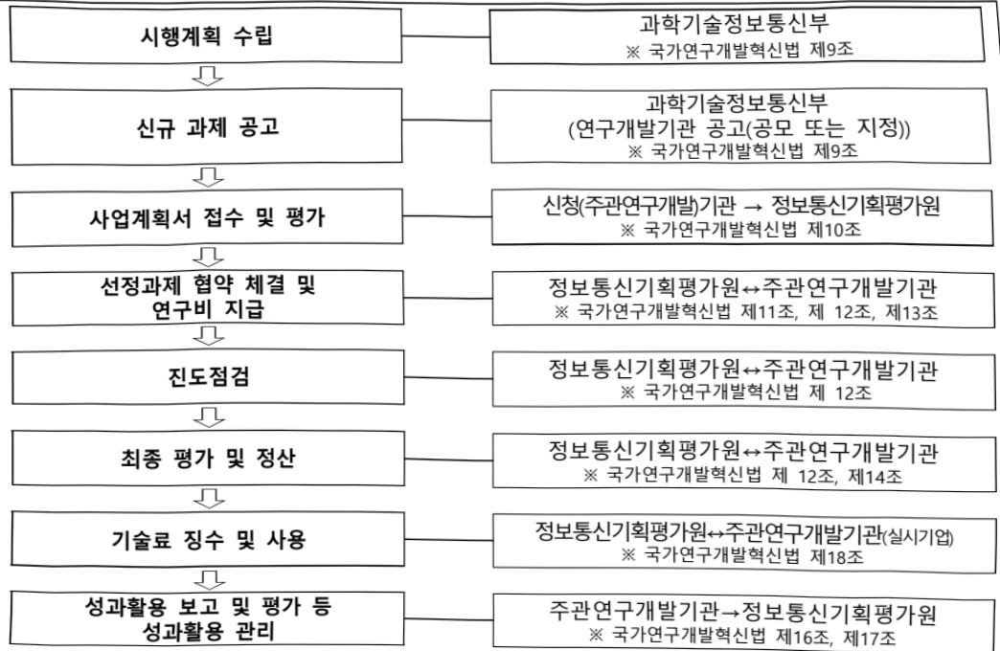

# ICT기반 디지털서비스 탄소중립 혁신기술개발(R&D)

**해당 페이지**: PDF 579 ~ 589 쪽 해당

**부처**: 과학기술정보통신부
**분야**: 통신
**회계유형**: 일반회계
**2026 확정예산**: 5625.0 백만원
**전년대비 증감률**: None%
**AI 도메인**: 데이터, 에너지, 건설/스마트시티

---

<table border=1 style='margin: auto; word-wrap: break-word;'><tr><td style='text-align: center; word-wrap: break-word;'>사 업 명</td></tr><tr><td style='text-align: center; word-wrap: break-word;'>(180) ICT기반디지털서비스탄소중립혁신기술개발 (2137-377)</td></tr></table>

□ 사업 코드 정보

<table border=1 style='margin: auto; word-wrap: break-word;'><tr><td style='text-align: center; word-wrap: break-word;'>구분</td><td style='text-align: center; word-wrap: break-word;'>회계</td><td style='text-align: center; word-wrap: break-word;'>소관</td><td style='text-align: center; word-wrap: break-word;'>실국(기관)</td><td style='text-align: center; word-wrap: break-word;'>계정</td><td style='text-align: center; word-wrap: break-word;'>분야</td><td style='text-align: center; word-wrap: break-word;'>부문</td></tr><tr><td style='text-align: center; word-wrap: break-word;'>코드</td><td rowspan="2">일반회계</td><td rowspan="2">과학기술정보통신부</td><td rowspan="2">정보통신산업정책관</td><td rowspan="2"></td><td style='text-align: center; word-wrap: break-word;'>130</td><td style='text-align: center; word-wrap: break-word;'>133</td></tr><tr><td style='text-align: center; word-wrap: break-word;'>명칭</td><td style='text-align: center; word-wrap: break-word;'>통신</td><td style='text-align: center; word-wrap: break-word;'>정보통신</td></tr></table>

<table border=1 style='margin: auto; word-wrap: break-word;'><tr><td style='text-align: center; word-wrap: break-word;'>구분</td><td style='text-align: center; word-wrap: break-word;'>프로그램</td><td style='text-align: center; word-wrap: break-word;'>단위사업</td><td style='text-align: center; word-wrap: break-word;'>세부사업</td></tr><tr><td style='text-align: center; word-wrap: break-word;'>코드</td><td style='text-align: center; word-wrap: break-word;'>2100</td><td style='text-align: center; word-wrap: break-word;'>2137</td><td style='text-align: center; word-wrap: break-word;'>377</td></tr><tr><td style='text-align: center; word-wrap: break-word;'>명칭</td><td style='text-align: center; word-wrap: break-word;'>정보통신융합산업</td><td style='text-align: center; word-wrap: break-word;'>ICT산업기반확충(일반)</td><td style='text-align: center; word-wrap: break-word;'>ICT기반디지털서비스탄소중립혁신기술개발(R&amp;D)</td></tr></table>

□ 사업 성격 (공통요구자료 1-1 작성유의사항 4. 참조, 해당하는 사양에 ☐ 표시)

<table border=1 style='margin: auto; word-wrap: break-word;'><tr><td rowspan="2">신규</td><td rowspan="2">계속</td><td rowspan="2">완료</td><td style='text-align: center; word-wrap: break-word;'>예비타당성</td><td style='text-align: center; word-wrap: break-word;'>총사업비</td><td style='text-align: center; word-wrap: break-word;'>총액계상</td><td style='text-align: center; word-wrap: break-word;'>사업소관 변경정보</td></tr><tr><td style='text-align: center; word-wrap: break-word;'>실시여부</td><td style='text-align: center; word-wrap: break-word;'>관리대상</td><td style='text-align: center; word-wrap: break-word;'>예산사업</td><td style='text-align: center; word-wrap: break-word;'>2025예산 시 소관</td></tr><tr><td style='text-align: center; word-wrap: break-word;'>○</td><td style='text-align: center; word-wrap: break-word;'></td><td style='text-align: center; word-wrap: break-word;'></td><td style='text-align: center; word-wrap: break-word;'></td><td style='text-align: center; word-wrap: break-word;'></td><td style='text-align: center; word-wrap: break-word;'></td><td style='text-align: center; word-wrap: break-word;'></td></tr></table>

사업 지원 형태 및 지원을 (최소한 한 개는 반드시 선택하시오. 해당사항에 O 표시)

<table border=1 style='margin: auto; word-wrap: break-word;'><tr><td style='text-align: center; word-wrap: break-word;'>직접</td><td style='text-align: center; word-wrap: break-word;'>출자</td><td style='text-align: center; word-wrap: break-word;'>출연</td><td style='text-align: center; word-wrap: break-word;'>보조</td><td style='text-align: center; word-wrap: break-word;'>융자</td><td style='text-align: center; word-wrap: break-word;'>국고보조율(%)</td><td style='text-align: center; word-wrap: break-word;'>융자율(%)</td></tr><tr><td style='text-align: center; word-wrap: break-word;'></td><td style='text-align: center; word-wrap: break-word;'></td><td style='text-align: center; word-wrap: break-word;'>○</td><td style='text-align: center; word-wrap: break-word;'></td><td style='text-align: center; word-wrap: break-word;'></td><td style='text-align: center; word-wrap: break-word;'></td><td style='text-align: center; word-wrap: break-word;'></td></tr></table>

## 사업 담당자

<table border=1 style='margin: auto; word-wrap: break-word;'><tr><td style='text-align: center; word-wrap: break-word;'>사업명</td><td colspan="2">구분</td></tr><tr><td rowspan="2">ICT기반 디지털서비스 탄소중립 혁신기술개발 (R&amp;D)</td><td style='text-align: center; word-wrap: break-word;'>소관부처</td><td style='text-align: center; word-wrap: break-word;'>정보통신정책실 정보통신산업정책관 정보통신방송기술정책과</td></tr><tr><td style='text-align: center; word-wrap: break-word;'>사업시행주체</td><td style='text-align: center; word-wrap: break-word;'>정보통신기획평가원 디지털사회혁신팀</td></tr></table>

---

### 가.예산안 총괄표

(단위: 백만원, %)

<table border=1 style='margin: auto; word-wrap: break-word;'><tr><td rowspan="2">사업명</td><td rowspan="2">2024년 결산</td><td colspan="2">2025년 예산</td><td colspan="2">2026년</td><td rowspan="2">증감(B-A)</td><td rowspan="2">(B-A)/A</td></tr><tr><td style='text-align: center; word-wrap: break-word;'>본예산(A)</td><td style='text-align: center; word-wrap: break-word;'>추경</td><td style='text-align: center; word-wrap: break-word;'>요구안</td><td style='text-align: center; word-wrap: break-word;'>조정안(B)</td></tr><tr><td style='text-align: center; word-wrap: break-word;'>ICT기반 디지털서비스 탄소중립 혁신기술개발(R&amp;D)</td><td style='text-align: center; word-wrap: break-word;'>-</td><td style='text-align: center; word-wrap: break-word;'>-</td><td style='text-align: center; word-wrap: break-word;'>-</td><td style='text-align: center; word-wrap: break-word;'>5,625</td><td style='text-align: center; word-wrap: break-word;'>5,625</td><td style='text-align: center; word-wrap: break-word;'>5,625</td><td style='text-align: center; word-wrap: break-word;'>순증</td></tr></table>

□ 기능별(내역사업별), 목별 예산안 내역

(단위:백만원)

<table border=1 style='margin: auto; word-wrap: break-word;'><tr><td rowspan="3"></td><td colspan="5">2024</td><td colspan="7">2025(2025.7월말)</td><td rowspan="3">2026예산안</td></tr><tr><td rowspan="2">예산액(추정)</td><td rowspan="2">예산현액</td><td rowspan="2">집행액[실집행액]</td><td rowspan="2">이월액</td><td rowspan="2">불용액</td><td rowspan="2">본예산</td><td rowspan="2">예산현액</td><td rowspan="2">집행액[실집행액]</td><td colspan="2">전년도이월액제외</td><td rowspan="2">이월예산액</td><td rowspan="2">불용예산액</td></tr><tr><td style='text-align: center; word-wrap: break-word;'>예산현액</td><td style='text-align: center; word-wrap: break-word;'>집행액[실집행액]</td></tr><tr><td style='text-align: center; word-wrap: break-word;'>○ 기능별 분류(합계)</td><td style='text-align: center; word-wrap: break-word;'>-</td><td style='text-align: center; word-wrap: break-word;'>-</td><td style='text-align: center; word-wrap: break-word;'>-</td><td style='text-align: center; word-wrap: break-word;'>-</td><td style='text-align: center; word-wrap: break-word;'>-</td><td style='text-align: center; word-wrap: break-word;'>-</td><td style='text-align: center; word-wrap: break-word;'>-</td><td style='text-align: center; word-wrap: break-word;'>-</td><td style='text-align: center; word-wrap: break-word;'>-</td><td style='text-align: center; word-wrap: break-word;'>-</td><td style='text-align: center; word-wrap: break-word;'>-</td><td style='text-align: center; word-wrap: break-word;'>-</td><td style='text-align: center; word-wrap: break-word;'>5,625</td></tr><tr><td style='text-align: center; word-wrap: break-word;'>· ICT기반디지털서비스탄소중립혁신기술개발</td><td style='text-align: center; word-wrap: break-word;'>-</td><td style='text-align: center; word-wrap: break-word;'>-</td><td style='text-align: center; word-wrap: break-word;'>-</td><td style='text-align: center; word-wrap: break-word;'>-</td><td style='text-align: center; word-wrap: break-word;'>-</td><td style='text-align: center; word-wrap: break-word;'>-</td><td style='text-align: center; word-wrap: break-word;'>-</td><td style='text-align: center; word-wrap: break-word;'>-</td><td style='text-align: center; word-wrap: break-word;'>-</td><td style='text-align: center; word-wrap: break-word;'>-</td><td style='text-align: center; word-wrap: break-word;'>-</td><td style='text-align: center; word-wrap: break-word;'>-</td><td style='text-align: center; word-wrap: break-word;'>5,625</td></tr><tr><td style='text-align: center; word-wrap: break-word;'>○ 비목별 분류(합계)</td><td style='text-align: center; word-wrap: break-word;'>-</td><td style='text-align: center; word-wrap: break-word;'>-</td><td style='text-align: center; word-wrap: break-word;'>-</td><td style='text-align: center; word-wrap: break-word;'>-</td><td style='text-align: center; word-wrap: break-word;'>-</td><td style='text-align: center; word-wrap: break-word;'>-</td><td style='text-align: center; word-wrap: break-word;'>-</td><td style='text-align: center; word-wrap: break-word;'>-</td><td style='text-align: center; word-wrap: break-word;'>-</td><td style='text-align: center; word-wrap: break-word;'>-</td><td style='text-align: center; word-wrap: break-word;'>-</td><td style='text-align: center; word-wrap: break-word;'>-</td><td style='text-align: center; word-wrap: break-word;'>5,625</td></tr><tr><td style='text-align: center; word-wrap: break-word;'>· 연구개발활동비 등(360-05)</td><td style='text-align: center; word-wrap: break-word;'>-</td><td style='text-align: center; word-wrap: break-word;'>-</td><td style='text-align: center; word-wrap: break-word;'>-</td><td style='text-align: center; word-wrap: break-word;'>-</td><td style='text-align: center; word-wrap: break-word;'>-</td><td style='text-align: center; word-wrap: break-word;'>-</td><td style='text-align: center; word-wrap: break-word;'>-</td><td style='text-align: center; word-wrap: break-word;'>-</td><td style='text-align: center; word-wrap: break-word;'>-</td><td style='text-align: center; word-wrap: break-word;'>-</td><td style='text-align: center; word-wrap: break-word;'>-</td><td style='text-align: center; word-wrap: break-word;'>-</td><td style='text-align: center; word-wrap: break-word;'>5,625</td></tr><tr><td style='text-align: center; word-wrap: break-word;'>○ 기능비목별 분류(합계)</td><td style='text-align: center; word-wrap: break-word;'>-</td><td style='text-align: center; word-wrap: break-word;'>-</td><td style='text-align: center; word-wrap: break-word;'>-</td><td style='text-align: center; word-wrap: break-word;'>-</td><td style='text-align: center; word-wrap: break-word;'>-</td><td style='text-align: center; word-wrap: break-word;'>-</td><td style='text-align: center; word-wrap: break-word;'>-</td><td style='text-align: center; word-wrap: break-word;'>-</td><td style='text-align: center; word-wrap: break-word;'>-</td><td style='text-align: center; word-wrap: break-word;'>-</td><td style='text-align: center; word-wrap: break-word;'>-</td><td style='text-align: center; word-wrap: break-word;'>-</td><td style='text-align: center; word-wrap: break-word;'>5,625</td></tr><tr><td style='text-align: center; word-wrap: break-word;'>· ICT기반디지털서비스탄소중립혁신기술개발</td><td style='text-align: center; word-wrap: break-word;'>-</td><td style='text-align: center; word-wrap: break-word;'>-</td><td style='text-align: center; word-wrap: break-word;'>-</td><td style='text-align: center; word-wrap: break-word;'>-</td><td style='text-align: center; word-wrap: break-word;'>-</td><td style='text-align: center; word-wrap: break-word;'>-</td><td style='text-align: center; word-wrap: break-word;'>-</td><td style='text-align: center; word-wrap: break-word;'>-</td><td style='text-align: center; word-wrap: break-word;'>-</td><td style='text-align: center; word-wrap: break-word;'>-</td><td style='text-align: center; word-wrap: break-word;'>-</td><td style='text-align: center; word-wrap: break-word;'>-</td><td style='text-align: center; word-wrap: break-word;'>5,625</td></tr><tr><td style='text-align: center; word-wrap: break-word;'>· 연구개발활동비 등(360-05)</td><td style='text-align: center; word-wrap: break-word;'>-</td><td style='text-align: center; word-wrap: break-word;'>-</td><td style='text-align: center; word-wrap: break-word;'>-</td><td style='text-align: center; word-wrap: break-word;'>-</td><td style='text-align: center; word-wrap: break-word;'>-</td><td style='text-align: center; word-wrap: break-word;'>-</td><td style='text-align: center; word-wrap: break-word;'>-</td><td style='text-align: center; word-wrap: break-word;'>-</td><td style='text-align: center; word-wrap: break-word;'>-</td><td style='text-align: center; word-wrap: break-word;'>-</td><td style='text-align: center; word-wrap: break-word;'>-</td><td style='text-align: center; word-wrap: break-word;'>-</td><td style='text-align: center; word-wrap: break-word;'>5,625</td></tr></table>

### 나. 사업설명자료

## 1 ) 사업목적·내용

- (사업목적) 국제사회의 탄소규제 강화 대응 및 탄소중립 디지털서비스 기술 경쟁력 강화를 위한 탄소 데이터 자동 정보화·지식화 및 전주기 탄소발자국 핵심기술 개발

- (내용) 동 사업은 빅데이터·AI·디지털트런 등의 ICT 기반 탄소 데이터 자동화 수집,

데이터 분석, 예측, 의사결정 등을 전주기 분석 지원하는 실질적이고 체계적인 디지털

탄소중립 핵심기술 개발 및 디지털 서비스 산업 연계·실증 추진을 목표로 함

---

## 2 ) 사업개요

□ 사업근거 및 추진경위

① 법령상 근거 및 조항 적시

- 기후위기 대응을 위한 탄소중립·녹색성장 기본법(탄소중립 기본법, 시행 '24.1.1.)

제56조(녹색기술의 연구개발 및 사업화 등의 촉진) ① 정부는 녹색기술의 연구개발 및 사업화 등을 촉진하기 위하여 다음 각 호의 사항을 포함하는 시책을 수립·시행하여야 한다.

1. 녹색기술과 관련된 정보의 수집·분석 및 제공

2. 녹색기술 평가기법의 개발 및 보급

3. 녹색기술 연구개발 및 사업화 등의 촉진을 위한 금융지원

4. 녹색기술 전문인력의 양성 및 국제협력 등

② 정부는 정보통신·나노·생명공학 기술 등 다른 기술 영역과의 융합을 촉진하고 녹색기술의 지식재산 권화를 통하여 지식기반 녹색경제로의 이행을 신속하게 추진하여야 한다.

③「과학기술기본법」제7조에 따른 과학기술기본계획에 제1항의 시책이 포함되는 경우에는 미리 위원회의 의견을 들어야 한다.

제63조(정보통신 기술·서비스 시책) ① 정부는 정보통신 기술 및 서비스를 적극 활용함으로써 온실가스를 감축하고, 에너지를 절약하며 에너지 이용효율을 향상시키기 위하여 다음 각 호의 사항을 포함한 정보통신 기술·서비스 시책을 수립·시행하여야 한다.

1.방송통신 네트워크 등 정보통신 기반 확대

2.새로운 정보통신 서비스의 개발·보급

3.정보통신 산업 및 기기 등에 대한 녹색기술 개발 촉진

② 정부는 제67조제1항에 따른 녹색생활을 확산시키기 위하여 재택근무·영상회의·원격교육·원격진료 등을 활성화하는 등의 정보통신 시책을 수립·시행하여야 한다.

③ 정부는 정보통신기술을 활용하여 전력 네트워크를 지능화·고도화함으로써 고품질의 전력서비스를 제공하고 에너지 이용효율을 극대화하며 온실가스를 획기적으로 감축할 수 있도록 하여야 한다.

-정보통신 진흥 및 융합 활성화 등에 관한 특별법(정보통신융합법, 시행 '23.6.22.)

제32조(정보통신융합등 기술·서비스 개발 등의 지원) ① 과학기술정보통신부장관은 다른 산업 및 서비스 등에 정보통신의 접목을 통하여 생산성과 가치를 높일 수 있도록 노력하여야 한다. <개정 2017. 7. 26.>

②과학기술정보통신부장관은 정보통신융합등 기술·서비스의 개발을 촉진하기 위하여 다음 각 호의 사업을 추진할 수 있다. <개정 2017. 7. 26.>

1.정보통신융합등 기술·서비스 관련 연구개발 사업

2.제1호에 따라 추진되는 과제에 대한 기획·평가·관리

3. 국가·지방자치단체, 대학·정부출연연구기관, 민간 등이 보유한 정보통신융합등 기술의 거래 등 기술이전을 위한 중개·알선 지원

4.정보통신융합등 기술에 대한 평가 및 평가 기법의 개발·보급

5. 정보통신융합등 기술의 기술이전·사업화에 관한 통계조사·연구 등 관련 정보의 수집·분석·제공

6.정보통신융합등 기술의 기술이전 후 상용화 연구개발 지원

7.정보통신융합등 기술의 기술사업화 전문인력 양성

8. 정보통신융합등 기술의 기술거래·사업화 촉진을 위한 정보시스템 구축·활용

9.지식재산권 등 정보통신융합등 기술 관련 연구성과물의 관리·홍보·활용

10.정보통신융합등 기술·서비스의 수준조사 등 정책연구 사업

11.정보통신융합등 기술·서비스 관련 시범사업

12.그 밖에 정보통신기술진흥을 위하여 필요한 사업

③ 과학기술정보통신부장관은 제2항 각 호의 사업을 추진하기 위하여 법인인 전담기관을 설립하거나 법인·단체에 위탁·운영할 수 있으며, 필요한 비용의 전부 또는 일부를 예산의 범위에서 출연 또는 보조할 수 있다. <개정 2017. 7. 26.>

④ 중앙행정기관의 장 및 지방자치단체의 장은 제2항 각 호의 사업을 제3항에 따른 전담기관으로 하여금 수행하게 하고, 그에 소요되는 비용의 전부 또는 일부를 지원할 수 있다.

⑤ 제3항에 따른 전담기관에 관하여 이 법에서 정한 것을 제외하고는「민법」중 재단법인에 관한 규정을 준용하며, 전담기관의 운영 및 제2항 각 호의 업무수행에 필요한 사항은 대통령령으로 정하다

---

② 추진경위 - 사업 시작년도, 추진배경, 부처별 중점과제, 대통령 공약사항 등 - 사업 시작년도 : 2026년

-추진배경

· 과리 협정의 신규 기후 재원 목표* 설정 및 이행 노력에도, 총정경쟁법 (CCA), EU 탄소국경조정제도(CBAM) 등에 대한 국내 대응 수준**은 초기 단계

* 신규 기후재원 목표(NCQG) : '25년부터 개발도상국 기후위기 대응을 위한 지원금 규모를 수립하고, 재원 공여할 국가와 받을 국가를 결정하는 것

** 주요산업의 탄소배출량 보고가 의무화되고 있으나, 국내 디지털산업의 대응 미흡

· 이러한 환경에서 디지털 산업 글로벌 경쟁력을 확보하여 지속적으로 성장하기 위해서는 전과정 인벤토리 구축 및 탄소 배출량 분석 시급

- 국정과제 23 : 국민의 안전과 보편적 삶의 질 제고를 위한 'AI 기본사회' 실현

- 그간 정부 발표대책('22~'23)

(1)대한민국 디지털 전략(관계부처,'22.9)

관련 내용

<table border=1 style='margin: auto; word-wrap: break-word;'><tr><td style='text-align: center; word-wrap: break-word;'>목표</td><td colspan="4">국민과 함께 세계 모범이 되는 디지털 대한민국</td></tr><tr><td style='text-align: center; word-wrap: break-word;'>기부방향</td><td style='text-align: center; word-wrap: break-word;'>세계 최고의 디지털 역량</td><td style='text-align: center; word-wrap: break-word;'>확장하는 디지털 경제</td><td style='text-align: center; word-wrap: break-word;'>포용하는 디지털 사회</td><td style='text-align: center; word-wrap: break-word;'>함께하는 디지털 골징부</td></tr><tr><td style='text-align: center; word-wrap: break-word;'>관련내용</td><td colspan="4">ㅇ (디지털 탄소중립) 그린 데이터센터 활성화 및 5G-6G 등 유·무선 네트워크 효율화, AI 기반 발전량·계통영향 예측 및 지능형 관리시스템 기반 에너지 소비 혁신 추진</td></tr></table>

(2)탄소중립 녹색성장 기술혁신 전략(관계부처, '22.10)

<table border=1 style='margin: auto; word-wrap: break-word;'><tr><td style='text-align: center; word-wrap: break-word;'>목표</td><td colspan="3">기술 혁신을 통한 2030 NDC 및 2050 탄소중립 실현</td></tr><tr><td style='text-align: center; word-wrap: break-word;'>기본 방향</td><td style='text-align: center; word-wrap: break-word;'>민간주도+임무중심 기획</td><td style='text-align: center; word-wrap: break-word;'>신속 유연한 투자</td><td style='text-align: center; word-wrap: break-word;'>기술혁신 기반조성</td></tr><tr><td style='text-align: center; word-wrap: break-word;'>관련 내용</td><td colspan="3">o 탄소배출과 관련하여 데이터 기반 모니터링을 통해 실제 저감 효과 분석 및 관련 기술 개발 - 탄소중립 R&amp;D 실증 추진시 탄소배출 측정 센서 등 ICT 기술을 접목(혹은 개발)하여 실제 탄소 저감 효과도 모니터링</td></tr></table>

(3) 디지털 기반 탄소발자국 점검기술 육성 전략(관계부처, '23.5)

<table border=1 style='margin: auto; word-wrap: break-word;'><tr><td style='text-align: center; word-wrap: break-word;'>목표</td><td colspan="4">탄소중립 달성탄소배출 측정기술 선도를 통한 수출경쟁력 확보</td></tr><tr><td style='text-align: center; word-wrap: break-word;'>기부방향</td><td style='text-align: center; word-wrap: break-word;'>(측정) 탄소배출 측정 신뢰도 향상</td><td style='text-align: center; word-wrap: break-word;'>(보안) 탄소배출 정보 보안 강화</td><td style='text-align: center; word-wrap: break-word;'>(지원) 탄소배출 측정 역량 강화</td><td style='text-align: center; word-wrap: break-word;'>(기반) 측정기술 표준 등 DB구축 확대</td></tr><tr><td style='text-align: center; word-wrap: break-word;'>관련내용</td><td style='text-align: center; word-wrap: break-word;'>○ 실시간 탄소측정 센서 개발 및 제품 탄소배출량 산정 SW 개발</td><td style='text-align: center; word-wrap: break-word;'>○ 블록체인 기반 탄소배출 데이터 보안 기술 등 개발</td><td style='text-align: center; word-wrap: break-word;'>○ 기업 스스로 실제 적용 개발하는 탄소 측정 리빙랩 구축</td><td style='text-align: center; word-wrap: break-word;'>○ 주력 수출분야 대상 탄소측정기술 표준 DB 개발</td></tr></table>

---

(4) 디지털 전환을 통한 탄소중립 촉진 방안(관계부처, '23.11)

<table border=1 style='margin: auto; word-wrap: break-word;'><tr><td style='text-align: center; word-wrap: break-word;'>목표</td><td colspan="3">2030 NDC 및 2050 탄소중립 달성</td></tr><tr><td style='text-align: center; word-wrap: break-word;'>기본 방향</td><td style='text-align: center; word-wrap: break-word;'>산업 전반 탄소감축 촉진</td><td style='text-align: center; word-wrap: break-word;'>디지털 부문 고효율화·저전력화</td><td style='text-align: center; word-wrap: break-word;'>그린 디지털 생태계 구축</td></tr><tr><td style='text-align: center; word-wrap: break-word;'>관련 내용</td><td style='text-align: center; word-wrap: break-word;'>ㅇ 지역산업 데이터를 수집분석 하고, 객관적 지표에 대한 탄소중립 성과검증 기반 마련</td><td style='text-align: center; word-wrap: break-word;'>ㅇ 한국형 그린 데이터센터 핵심기술 확보 및 저전력 네트워크 핵심기술 개발</td><td style='text-align: center; word-wrap: break-word;'>ㅇ 디지털 요소기술을 활용해, 전주기 객관적인 탄소정보 측정·보고·검증 플랫폼 개발</td></tr></table>

□ 주요내용

① 사업규모

- 총사업비(해당되는 경우에만 기재) : 해당없음

- 사업기간 : 26년 ~ 29년

- 최근 5년 간 투입된 사업비(예산액기준, 추경편성한 연도에는 추경포함)

<table border=1 style='margin: auto; word-wrap: break-word;'><tr><td style='text-align: center; word-wrap: break-word;'>연도</td><td style='text-align: center; word-wrap: break-word;'>2022</td><td style='text-align: center; word-wrap: break-word;'>2023</td><td style='text-align: center; word-wrap: break-word;'>2024</td><td style='text-align: center; word-wrap: break-word;'>2025</td><td style='text-align: center; word-wrap: break-word;'>2026</td></tr><tr><td style='text-align: center; word-wrap: break-word;'>사업비</td><td style='text-align: center; word-wrap: break-word;'>-</td><td style='text-align: center; word-wrap: break-word;'>-</td><td style='text-align: center; word-wrap: break-word;'>-</td><td style='text-align: center; word-wrap: break-word;'>-</td><td style='text-align: center; word-wrap: break-word;'>5,625</td></tr></table>

② 사업추진체계

- 사업시행방법 : 출연

- 사업시행주체 : 정보통신기획평가원

- 사업 수혜자 : 산 · 학 · 연 등

- 보조, 융자, 출연, 출자 등의 경우 보조·융자 등 지원 비율 및 법적근거

<table border=1 style='margin: auto; word-wrap: break-word;'><tr><td style='text-align: center; word-wrap: break-word;'>내역사업명</td><td style='text-align: center; word-wrap: break-word;'>구분</td><td style='text-align: center; word-wrap: break-word;'>피보조·피출연 등 기관명</td><td style='text-align: center; word-wrap: break-word;'>지원 금액 (2026예산안)</td><td style='text-align: center; word-wrap: break-word;'>지원 비율(%)</td><td style='text-align: center; word-wrap: break-word;'>보조율 법적근거 (해당 조항)</td></tr><tr><td style='text-align: center; word-wrap: break-word;'>ICT기반 디지털서비스 탄소중립혁신 기술개발</td><td style='text-align: center; word-wrap: break-word;'>출연</td><td style='text-align: center; word-wrap: break-word;'>정보통신 기획평가원</td><td style='text-align: center; word-wrap: break-word;'>5,625</td><td style='text-align: center; word-wrap: break-word;'>100%</td><td style='text-align: center; word-wrap: break-word;'>「정보통신 진흥 및 융합 활성화 등에 관한 특별법」제32조(정보통신융합등 기술·서비스 개발 등의 지원) 제3항</td></tr></table>

---

## ☐ 요구내용 및 산출근거

ICT 기반 탄소 데이터 자동화 수집, 데이터 분석, 예측, 의사결정 등을 전주기 분석 지원하는 실질적이고 체계적인 디지털 탄소중립 핵심기술 개발 및 디지털 서비스 산업 연계·실증 추진을 위해 5,625백만원 요구(신규과제 3개, 5,625백만원)

* 신규과제 3개 x 2,500백만원 x 9/12 = 5,625백만원

① (과제1, 설계/운영) 데이터센터 내부의 IoT로부터 데이터를 실시간으로 수집하고 가상의 공간에서 IT장비 등 정밀 분석하여 조율하는 탄소중립 지향 디지털트런 기반 가상 운영 플랫폼 개발

(2) (과제2, 수집/문석) 데이터의 수집·처리·관리·저장 과정에서 발생하는 탄소 배출량을 산정하고, 이를 데이터센터 이용자별로 배분하여 각 이용 데이터에 따른 탄소 배출량 산출 가능 LCI 모델 기술개발

③ (과제3, 수집/분석) 전주기 탄소발자국 분석 통합 플랫폼 개발을 통해 자동화 수집·분석된 탄소배출을 실시간 모니터링하고 주요 배출 시점 식별하여 최적의 감축 전략을 제시하는 의사결정 지원 시스템 구축

2025년도 예산 및 2026년도 예산안 산출 세부내역 비교

<table border=1 style='margin: auto; word-wrap: break-word;'><tr><td colspan="2">2025년 본예산</td><td colspan="2">2026년 예산안</td></tr><tr><td style='text-align: center; word-wrap: break-word;'>예산</td><td style='text-align: center; word-wrap: break-word;'>산출내역</td><td style='text-align: center; word-wrap: break-word;'>예산</td><td style='text-align: center; word-wrap: break-word;'>산출내역</td></tr><tr><td style='text-align: center; word-wrap: break-word;'>-</td><td style='text-align: center; word-wrap: break-word;'>-</td><td style='text-align: center; word-wrap: break-word;'>5,625</td><td style='text-align: center; word-wrap: break-word;'>○ 연구개발활동비 등(360-05): 5,625백만원가. 신규과제• (과제1) 탄소 인지 디지털 서비스 운영 아키텍처 및 시스템 기술개발 : 2,500 * 1개 * 9/12개월 = 1,875백만원• (과제2) AI 자동화·지능화 LCI 모델을 통한 탄소중립 데이터 분석 시스템 개발 : 2,500 * 1개 * 9/12개월 = 1,875백만원• (과제3) 디지털 전주기 탄소발자국 분석 기술개발 : 2,500 * 1개 * 9/12개월 = 1,875백만원</td></tr></table>

---

## 4 ) 사업효과

☐ 사업영향, 산출물 성과지표 등

12022~2026년도 성과계획서 상 성과지표 및 최근 5년간 성과 달성도

<table border=1 style='margin: auto; word-wrap: break-word;'><tr><td style='text-align: center; word-wrap: break-word;'>성과지표</td><td style='text-align: center; word-wrap: break-word;'>구분</td><td style='text-align: center; word-wrap: break-word;'>2022</td><td style='text-align: center; word-wrap: break-word;'>2023</td><td style='text-align: center; word-wrap: break-word;'>2024</td><td style='text-align: center; word-wrap: break-word;'>2025</td><td style='text-align: center; word-wrap: break-word;'>2026</td><td style='text-align: center; word-wrap: break-word;'>2026 목표치산출근거</td><td style='text-align: center; word-wrap: break-word;'>측정산식(또는 측정방법)</td><td style='text-align: center; word-wrap: break-word;'>자료수집방법(또는 자료출처)</td></tr><tr><td rowspan="3">IT장비당온실가스 배출량(단위: kgCO2e/대)</td><td style='text-align: center; word-wrap: break-word;'>목표</td><td style='text-align: center; word-wrap: break-word;'>-</td><td style='text-align: center; word-wrap: break-word;'>-</td><td style='text-align: center; word-wrap: break-word;'>-</td><td style='text-align: center; word-wrap: break-word;'>-</td><td style='text-align: center; word-wrap: break-word;'>신규</td><td rowspan="3">&#x27;26년 신규지표로&#x27;27년부터 적용하여 &#x27;25년 IT 장비 1대당 연간 온실가스 배출량을 기준 100kgCO2e에서 10% 감축한 수치</td><td rowspan="3">(연간 전력 사용량 / 장비수)* 배출계수</td><td rowspan="3">전력 계속 시스템을 통한 자동수집 및 고시된 배출계수 값(환경부, 한국환경공단 등)</td></tr><tr><td style='text-align: center; word-wrap: break-word;'>실적</td><td style='text-align: center; word-wrap: break-word;'>-</td><td style='text-align: center; word-wrap: break-word;'>-</td><td style='text-align: center; word-wrap: break-word;'>-</td><td style='text-align: center; word-wrap: break-word;'>-</td><td style='text-align: center; word-wrap: break-word;'>-</td></tr><tr><td style='text-align: center; word-wrap: break-word;'>달성도</td><td style='text-align: center; word-wrap: break-word;'>-</td><td style='text-align: center; word-wrap: break-word;'>-</td><td style='text-align: center; word-wrap: break-word;'>-</td><td style='text-align: center; word-wrap: break-word;'>-</td><td style='text-align: center; word-wrap: break-word;'>-</td></tr><tr><td rowspan="3">탄소발자국 국제공인 인증건수(단위: 건)</td><td style='text-align: center; word-wrap: break-word;'>목표</td><td style='text-align: center; word-wrap: break-word;'>-</td><td style='text-align: center; word-wrap: break-word;'>-</td><td style='text-align: center; word-wrap: break-word;'>-</td><td style='text-align: center; word-wrap: break-word;'>-</td><td style='text-align: center; word-wrap: break-word;'>2</td><td rowspan="3">과제별 R&amp;D 종료시점의 탄소발자국 검증 누적 건수를 반영</td><td rowspan="3">국제 검증기관 인증서 취득 건수 합계</td><td rowspan="3">국제 검증기관 인증서 * TUV SUD, 로이드, SCS, UL 등</td></tr><tr><td style='text-align: center; word-wrap: break-word;'>실적</td><td style='text-align: center; word-wrap: break-word;'>-</td><td style='text-align: center; word-wrap: break-word;'>-</td><td style='text-align: center; word-wrap: break-word;'>-</td><td style='text-align: center; word-wrap: break-word;'>-</td><td style='text-align: center; word-wrap: break-word;'>-</td></tr><tr><td style='text-align: center; word-wrap: break-word;'>달성도</td><td style='text-align: center; word-wrap: break-word;'>-</td><td style='text-align: center; word-wrap: break-word;'>-</td><td style='text-align: center; word-wrap: break-word;'>-</td><td style='text-align: center; word-wrap: break-word;'>-</td><td style='text-align: center; word-wrap: break-word;'>-</td></tr></table>

② 성과지표 이외의 연도별 사업추진 경과 및 실적 : 해당없음('26년 신규)

<table border=1 style='margin: auto; word-wrap: break-word;'><tr><td style='text-align: center; word-wrap: break-word;'>2022</td><td style='text-align: center; word-wrap: break-word;'>-</td></tr><tr><td style='text-align: center; word-wrap: break-word;'>2023</td><td style='text-align: center; word-wrap: break-word;'>-</td></tr><tr><td style='text-align: center; word-wrap: break-word;'>2024</td><td style='text-align: center; word-wrap: break-word;'>-</td></tr><tr><td style='text-align: center; word-wrap: break-word;'>2025</td><td style='text-align: center; word-wrap: break-word;'>-</td></tr></table>

③ 향후(2026년도 이후) 기대효과 : 개조식으로 작성, 건 별로 계량적 수치 제시

°(사회적 효과) 국내 지역 주력산업의 탄소 배출량 저감 및 지속 가능성 확보로 2030 NDC 및 2050 탄소중립 등 국가 정책 실현에 기여

° (기술적 효과) 데이터센터 가상화 및 디지털트런 기반 운영 최적화를 통한 소비 전력* 절감, AI기반 액침녕각 국산화 기술 100% 적용 등

* 전력 사용 효율(PEU) 1.2x, 물사용량 감소지수(WUE) 0.2L/kWh 달성 목표 설정

o (수요처 실증) 민간에서 투자하기 어려운 데이터센터 에너지 최적화 HW/SW 개발 및 실증이 필요한 민간/공공 데이터센터 보유 기관

*최종수요처:(1차/실증)HPC허브,광주AI데이터센터등에서실증

(2차/수요) 네이버·카카오·SK·KT 등 AI·데이터센터 적용

---

°(솔루션 운영) 운영 주체 설정을 위해 기술의 실효성, 지속가능한 확산 가능성,

공공성과 민간 효율성의 균형 측면에서 고려하여 각 유형별 연계 추진

- 탄소중립 디지털 서비스 솔루션의 운영주체 확립을 위해 공공·민관에서 운영하고

민간 개발기술을 지자체 산하 공공 데이터센터 등에 실증·적용 추진

5) 타당성조사 및 예비타당성조사 시행여부 및 결과 요지 : 해당없음

## 6 ) 총사업비 대상사업 여부 및 내역 : 해당없음

## 7 ) 사업 집행절차

-ICT기반 디지털서비스 탄소중립 혁신기술개발(2026년)

<table border=1 style='margin: auto; word-wrap: break-word;'><tr><td style='text-align: center; word-wrap: break-word;'>부처</td><td style='text-align: center; word-wrap: break-word;'></td><td style='text-align: center; word-wrap: break-word;'>피출연기관</td><td style='text-align: center; word-wrap: break-word;'></td><td style='text-align: center; word-wrap: break-word;'>사업수행자</td></tr><tr><td style='text-align: center; word-wrap: break-word;'>과학기술정보통신부(5,625백만원)</td><td style='text-align: center; word-wrap: break-word;'>=&gt;(교부액:5,625백만원)</td><td style='text-align: center; word-wrap: break-word;'>정보통신기획평가원(5,625백만원)</td><td style='text-align: center; word-wrap: break-word;'>=&gt;(교부액:5,625백만원)</td><td style='text-align: center; word-wrap: break-word;'>산·학·연 등선정된 수행기관(5,625백만원)</td></tr></table>

---

8) 중기재정계획 상 연도별 투자계획 및 추진경과

(단위: 백만원)

<table border=1 style='margin: auto; word-wrap: break-word;'><tr><td style='text-align: center; word-wrap: break-word;'>2024 재정계획</td><td style='text-align: center; word-wrap: break-word;'>2024</td><td style='text-align: center; word-wrap: break-word;'>2025</td><td style='text-align: center; word-wrap: break-word;'>2026</td><td style='text-align: center; word-wrap: break-word;'>2027</td><td style='text-align: center; word-wrap: break-word;'>2028</td><td style='text-align: center; word-wrap: break-word;'>2029</td></tr><tr><td style='text-align: center; word-wrap: break-word;'>2024~2028</td><td style='text-align: center; word-wrap: break-word;'>-</td><td style='text-align: center; word-wrap: break-word;'>-</td><td style='text-align: center; word-wrap: break-word;'>5,625</td><td style='text-align: center; word-wrap: break-word;'>7,500</td><td style='text-align: center; word-wrap: break-word;'>7,500</td><td style='text-align: center; word-wrap: break-word;'>☑</td></tr><tr><td style='text-align: center; word-wrap: break-word;'>2025~2029</td><td style='text-align: center; word-wrap: break-word;'>☑</td><td style='text-align: center; word-wrap: break-word;'>-</td><td style='text-align: center; word-wrap: break-word;'>5,625</td><td style='text-align: center; word-wrap: break-word;'>7,500</td><td style='text-align: center; word-wrap: break-word;'>7,500</td><td style='text-align: center; word-wrap: break-word;'>7,500</td></tr></table>

9) 최근 3년간 동 사업에 대한 주요 의부지적사항 및 평가, 문제점 및 대책

해당없음

## 10 ) 향후 추진방향 및 추진계획

<table border=1 style='margin: auto; word-wrap: break-word;'><tr><td style='text-align: center; word-wrap: break-word;'>○ (추진방향) 디지털 서비스 및 인프라 전·후방 산업의 탄소중립 기술 경쟁력 강화를 위해 관련 기술로드맵(그린 데이터센터, ESG/탄소중립 플랫폼)의 추진방향에 맞춰 탄소중립 혁신 기술 개발 추진</td></tr></table>

<table border=1 style='margin: auto; word-wrap: break-word;'><tr><td style='text-align: center; word-wrap: break-word;'>구분</td><td style='text-align: center; word-wrap: break-word;'>추진 내용</td></tr><tr><td style='text-align: center; word-wrap: break-word;'>설계/운영(과제1)</td><td style='text-align: center; word-wrap: break-word;'>탄소중립 데이터센터 구현을 위한 그린 데이터센터 아키텍처 및 운영 기술</td></tr><tr><td style='text-align: center; word-wrap: break-word;'>수집/분석(과제2)</td><td style='text-align: center; word-wrap: break-word;'>데이터센터 산업의 자동화 탄소 정보지식화를 위한 AI 기반 탄소 데이터 디지털 수집/분석/평가(디지털 MRV) 기술</td></tr><tr><td style='text-align: center; word-wrap: break-word;'>전주기 분석(과제3)</td><td style='text-align: center; word-wrap: break-word;'>데이터센터 산업의 전주기 탄소발자국 분석을 위한 자율형 탄소 LCA 기술</td></tr></table>

<table border=1 style='margin: auto; word-wrap: break-word;'><tr><td style='text-align: center; word-wrap: break-word;'>○ (추진계획) 전문기관인 정보통신기획평가원을 통해 사업 수행 관리 추진</td></tr><tr><td style='text-align: center; word-wrap: break-word;'>- 과제기획위원회의 상세기획(&#x27;25下), 과기정통부 사업심의위원회에서 확정(&#x27;25.12월)</td></tr><tr><td style='text-align: center; word-wrap: break-word;'>- 지정공모, 품목지정으로 3개(56억원)에 대해 수행기관 공모, 선정평가(&#x27;26.2~3월) 후 종합심의위원회 평가결과 확정 후 협약(&#x27;26.4월) 추진</td></tr></table>

11) 해당사업에 대한 각종 사업평가의 결과 : 해당없음

12) 해당사업에 대한 부처 자체평가의 결과 : 해당없음

13) 부처 건의사항 : 해당없음

---

### 다. 최근 4년간 결산내역

## 1 ) 결산표

☐ 부처 결산내역

(단위: 백만원, %)

<table border=1 style='margin: auto; word-wrap: break-word;'><tr><td rowspan="2">闰도</td><td colspan="3">예산액</td><td rowspan="2">전년도이월액</td><td rowspan="2">이·전용등</td><td rowspan="2">예비비</td><td rowspan="2">예산현액(B)</td><td rowspan="2">집행액(C)</td><td rowspan="2">집행률(C/A)</td><td rowspan="2">집행률(C/B)</td><td rowspan="2">다음연도이월액</td><td rowspan="2">불용액</td></tr><tr><td style='text-align: center; word-wrap: break-word;'>본예산</td><td style='text-align: center; word-wrap: break-word;'>추경증감액</td><td style='text-align: center; word-wrap: break-word;'>추경(A)</td></tr><tr><td style='text-align: center; word-wrap: break-word;'>2022</td><td style='text-align: center; word-wrap: break-word;'>-</td><td style='text-align: center; word-wrap: break-word;'>-</td><td style='text-align: center; word-wrap: break-word;'>-</td><td style='text-align: center; word-wrap: break-word;'>-</td><td style='text-align: center; word-wrap: break-word;'>-</td><td style='text-align: center; word-wrap: break-word;'>-</td><td style='text-align: center; word-wrap: break-word;'>-</td><td style='text-align: center; word-wrap: break-word;'>-</td><td style='text-align: center; word-wrap: break-word;'>-</td><td style='text-align: center; word-wrap: break-word;'>-</td><td style='text-align: center; word-wrap: break-word;'>-</td><td style='text-align: center; word-wrap: break-word;'>-</td></tr><tr><td style='text-align: center; word-wrap: break-word;'>2023</td><td style='text-align: center; word-wrap: break-word;'>-</td><td style='text-align: center; word-wrap: break-word;'>-</td><td style='text-align: center; word-wrap: break-word;'>-</td><td style='text-align: center; word-wrap: break-word;'>-</td><td style='text-align: center; word-wrap: break-word;'>-</td><td style='text-align: center; word-wrap: break-word;'>-</td><td style='text-align: center; word-wrap: break-word;'>-</td><td style='text-align: center; word-wrap: break-word;'>-</td><td style='text-align: center; word-wrap: break-word;'>-</td><td style='text-align: center; word-wrap: break-word;'>-</td><td style='text-align: center; word-wrap: break-word;'>-</td><td style='text-align: center; word-wrap: break-word;'>-</td></tr><tr><td style='text-align: center; word-wrap: break-word;'>2024</td><td style='text-align: center; word-wrap: break-word;'>-</td><td style='text-align: center; word-wrap: break-word;'>-</td><td style='text-align: center; word-wrap: break-word;'>-</td><td style='text-align: center; word-wrap: break-word;'>-</td><td style='text-align: center; word-wrap: break-word;'>-</td><td style='text-align: center; word-wrap: break-word;'>-</td><td style='text-align: center; word-wrap: break-word;'>-</td><td style='text-align: center; word-wrap: break-word;'>-</td><td style='text-align: center; word-wrap: break-word;'>-</td><td style='text-align: center; word-wrap: break-word;'>-</td><td style='text-align: center; word-wrap: break-word;'>-</td><td style='text-align: center; word-wrap: break-word;'>-</td></tr><tr><td style='text-align: center; word-wrap: break-word;'>2025</td><td style='text-align: center; word-wrap: break-word;'>-</td><td style='text-align: center; word-wrap: break-word;'>-</td><td style='text-align: center; word-wrap: break-word;'>-</td><td style='text-align: center; word-wrap: break-word;'>-</td><td style='text-align: center; word-wrap: break-word;'>-</td><td style='text-align: center; word-wrap: break-word;'>-</td><td style='text-align: center; word-wrap: break-word;'>-</td><td style='text-align: center; word-wrap: break-word;'>-</td><td style='text-align: center; word-wrap: break-word;'>-</td><td style='text-align: center; word-wrap: break-word;'>-</td><td style='text-align: center; word-wrap: break-word;'>-</td><td style='text-align: center; word-wrap: break-word;'>-</td></tr></table>

□출연·보조사업 등 실집행내역

(단위:백만원,%)

<table border=1 style='margin: auto; word-wrap: break-word;'><tr><td rowspan="3">구분</td><td colspan="3">부처</td><td colspan="7">사업시행주체(피출연·피보조 기관 등)</td></tr><tr><td colspan="2">예산액</td><td rowspan="2">집행액</td><td rowspan="2">교부액</td><td rowspan="2">전년도 이월액</td><td rowspan="2">교부 현액</td><td rowspan="2">집행액 (B)</td><td rowspan="2">이월액</td><td rowspan="2">불용액</td><td rowspan="2">실집행률 (B/A)</td></tr><tr><td style='text-align: center; word-wrap: break-word;'>본예산</td><td style='text-align: center; word-wrap: break-word;'>추경(A)</td></tr><tr><td style='text-align: center; word-wrap: break-word;'>2022</td><td style='text-align: center; word-wrap: break-word;'>-</td><td style='text-align: center; word-wrap: break-word;'>-</td><td style='text-align: center; word-wrap: break-word;'>-</td><td style='text-align: center; word-wrap: break-word;'>-</td><td style='text-align: center; word-wrap: break-word;'>-</td><td style='text-align: center; word-wrap: break-word;'>-</td><td style='text-align: center; word-wrap: break-word;'>-</td><td style='text-align: center; word-wrap: break-word;'>-</td><td style='text-align: center; word-wrap: break-word;'>-</td><td style='text-align: center; word-wrap: break-word;'>-</td></tr><tr><td style='text-align: center; word-wrap: break-word;'>2023</td><td style='text-align: center; word-wrap: break-word;'>-</td><td style='text-align: center; word-wrap: break-word;'>-</td><td style='text-align: center; word-wrap: break-word;'>-</td><td style='text-align: center; word-wrap: break-word;'>-</td><td style='text-align: center; word-wrap: break-word;'>-</td><td style='text-align: center; word-wrap: break-word;'>-</td><td style='text-align: center; word-wrap: break-word;'>-</td><td style='text-align: center; word-wrap: break-word;'>-</td><td style='text-align: center; word-wrap: break-word;'>-</td><td style='text-align: center; word-wrap: break-word;'>-</td></tr><tr><td style='text-align: center; word-wrap: break-word;'>2024</td><td style='text-align: center; word-wrap: break-word;'>-</td><td style='text-align: center; word-wrap: break-word;'>-</td><td style='text-align: center; word-wrap: break-word;'>-</td><td style='text-align: center; word-wrap: break-word;'>-</td><td style='text-align: center; word-wrap: break-word;'>-</td><td style='text-align: center; word-wrap: break-word;'>-</td><td style='text-align: center; word-wrap: break-word;'>-</td><td style='text-align: center; word-wrap: break-word;'>-</td><td style='text-align: center; word-wrap: break-word;'>-</td><td style='text-align: center; word-wrap: break-word;'>-</td></tr><tr><td style='text-align: center; word-wrap: break-word;'>2025. 7월기준</td><td style='text-align: center; word-wrap: break-word;'>-</td><td style='text-align: center; word-wrap: break-word;'>-</td><td style='text-align: center; word-wrap: break-word;'>-</td><td style='text-align: center; word-wrap: break-word;'>-</td><td style='text-align: center; word-wrap: break-word;'>-</td><td style='text-align: center; word-wrap: break-word;'>-</td><td style='text-align: center; word-wrap: break-word;'>-</td><td style='text-align: center; word-wrap: break-word;'>-</td><td style='text-align: center; word-wrap: break-word;'>-</td><td style='text-align: center; word-wrap: break-word;'>-</td></tr></table>

---

## 2 ) 주요 결산사항

□ 2022~2025년 결산 주요 지적사항 및 시정요구사항

<table border=1 style='margin: auto; word-wrap: break-word;'><tr><td style='text-align: center; word-wrap: break-word;'>2022</td><td style='text-align: center; word-wrap: break-word;'>- 해당없음</td></tr><tr><td style='text-align: center; word-wrap: break-word;'>2023</td><td style='text-align: center; word-wrap: break-word;'>- 해당없음</td></tr><tr><td style='text-align: center; word-wrap: break-word;'>2024</td><td style='text-align: center; word-wrap: break-word;'>- 해당없음</td></tr><tr><td style='text-align: center; word-wrap: break-word;'>2025</td><td style='text-align: center; word-wrap: break-word;'>- 해당없음</td></tr></table>

□ 2025년 이·전용 등 세부내역 : 해당없음

□ 2025년 예비비 배정 세부내역 : 해당없음

---

### 원본 PDF 크롭 이미지

