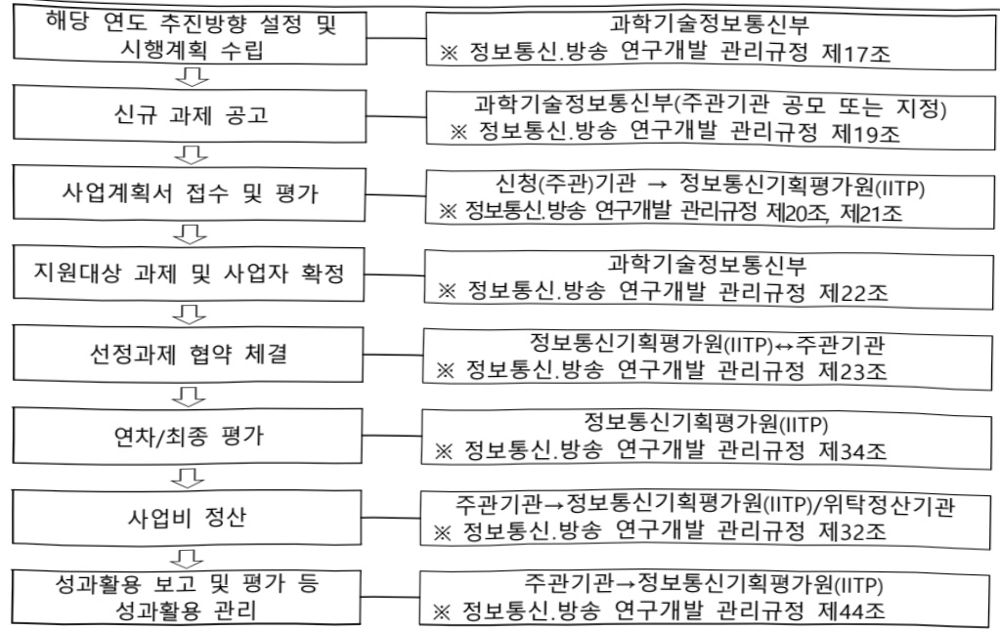

# PIM인공지능반도체핵심기술개발(R&D)

**해당 페이지**: PDF 612 ~ 619 쪽 해당

**부처**: 과학기술정보통신부
**분야**: 통신
**회계유형**: 일반회계
**2026 확정예산**: 27014.0 백만원
**전년대비 증감률**: -34.8%
**AI 도메인**: AI반도체, 교육/인재

---

<table border=1 style='margin: auto; word-wrap: break-word;'><tr><td style='text-align: center; word-wrap: break-word;'>사 업 명</td></tr><tr><td style='text-align: center; word-wrap: break-word;'>(327) PIM인공지능반도체 핵심기술개발(설계)(R&amp;D) (2603-314)</td></tr></table>

□ 사업 코드 정보

<table border=1 style='margin: auto; word-wrap: break-word;'><tr><td style='text-align: center; word-wrap: break-word;'>구분</td><td style='text-align: center; word-wrap: break-word;'>회계</td><td style='text-align: center; word-wrap: break-word;'>소관</td><td style='text-align: center; word-wrap: break-word;'>실국(기관)</td><td style='text-align: center; word-wrap: break-word;'>계정</td><td style='text-align: center; word-wrap: break-word;'>분야</td><td style='text-align: center; word-wrap: break-word;'>부문</td></tr><tr><td style='text-align: center; word-wrap: break-word;'>코드</td><td rowspan="2">일반회계</td><td style='text-align: center; word-wrap: break-word;'>과학기술정보</td><td rowspan="2">정보통신산업정책관</td><td rowspan="2"></td><td style='text-align: center; word-wrap: break-word;'>130</td><td style='text-align: center; word-wrap: break-word;'>133</td></tr><tr><td style='text-align: center; word-wrap: break-word;'>명칭</td><td style='text-align: center; word-wrap: break-word;'>통신부</td><td style='text-align: center; word-wrap: break-word;'>통신</td><td style='text-align: center; word-wrap: break-word;'>정보통신</td></tr></table>

<table border=1 style='margin: auto; word-wrap: break-word;'><tr><td style='text-align: center; word-wrap: break-word;'>구분</td><td style='text-align: center; word-wrap: break-word;'>프로그램</td><td style='text-align: center; word-wrap: break-word;'>단위사업</td><td style='text-align: center; word-wrap: break-word;'>세부사업</td></tr><tr><td style='text-align: center; word-wrap: break-word;'>코드</td><td style='text-align: center; word-wrap: break-word;'>2600</td><td style='text-align: center; word-wrap: break-word;'>2603</td><td style='text-align: center; word-wrap: break-word;'>314</td></tr><tr><td style='text-align: center; word-wrap: break-word;'>명칭</td><td style='text-align: center; word-wrap: break-word;'>인공지능데이터진흥</td><td style='text-align: center; word-wrap: break-word;'>AI반도체경쟁력강화(일반)</td><td style='text-align: center; word-wrap: break-word;'>PIM인공지능반도체핵심기술개발(설계)</td></tr></table>

□ 사업 성격 (공통요구자료 Ⅱ-1 작성유의사항 4. 참조, 해당하는 사항에 “○” 표시)

<table border=1 style='margin: auto; word-wrap: break-word;'><tr><td rowspan="2">신규</td><td rowspan="2">계속</td><td rowspan="2">완료</td><td rowspan="2">예비타당성 실시여부</td><td rowspan="2">총사업비 관리대상</td><td rowspan="2">총액계상 예산사업</td><td style='text-align: center; word-wrap: break-word;'>사업소관 변경정보</td></tr><tr><td style='text-align: center; word-wrap: break-word;'>2025예산 시 소관</td></tr><tr><td style='text-align: center; word-wrap: break-word;'></td><td style='text-align: center; word-wrap: break-word;'>○</td><td style='text-align: center; word-wrap: break-word;'></td><td style='text-align: center; word-wrap: break-word;'>○</td><td style='text-align: center; word-wrap: break-word;'></td><td style='text-align: center; word-wrap: break-word;'></td><td style='text-align: center; word-wrap: break-word;'></td></tr></table>

사업지원형태 및 지원을(최소한개는반드시선택하시오.해당사항에O표시)

<table border=1 style='margin: auto; word-wrap: break-word;'><tr><td style='text-align: center; word-wrap: break-word;'>직접</td><td style='text-align: center; word-wrap: break-word;'>출자</td><td style='text-align: center; word-wrap: break-word;'>출연</td><td style='text-align: center; word-wrap: break-word;'>보조</td><td style='text-align: center; word-wrap: break-word;'>융자</td><td style='text-align: center; word-wrap: break-word;'>국고보조율(%)</td><td style='text-align: center; word-wrap: break-word;'>융자율(%)</td></tr><tr><td style='text-align: center; word-wrap: break-word;'></td><td style='text-align: center; word-wrap: break-word;'></td><td style='text-align: center; word-wrap: break-word;'>○</td><td style='text-align: center; word-wrap: break-word;'></td><td style='text-align: center; word-wrap: break-word;'></td><td style='text-align: center; word-wrap: break-word;'></td><td style='text-align: center; word-wrap: break-word;'></td></tr></table>

□ 사업 소관부처 및 시행주체

<table border=1 style='margin: auto; word-wrap: break-word;'><tr><td style='text-align: center; word-wrap: break-word;'>사업명</td><td colspan="2">구분</td></tr><tr><td rowspan="3">PIM인공지능 반도체 핵심기술개발 (설계)(R&amp;D)</td><td rowspan="2">소관부처</td><td style='text-align: center; word-wrap: break-word;'>정보통신방송기술정책관</td></tr><tr><td style='text-align: center; word-wrap: break-word;'>정보통신방송기술정책과</td></tr><tr><td style='text-align: center; word-wrap: break-word;'>사업시행주체</td><td style='text-align: center; word-wrap: break-word;'>정보통신기획평가원</td></tr></table>

---

### 가. 예산 총괄표

(단위: 백만원, %)

<table border=1 style='margin: auto; word-wrap: break-word;'><tr><td rowspan="2">사업명</td><td rowspan="2">2024년 결산</td><td colspan="2">2025년 예산</td><td colspan="2">2026년 예산</td><td rowspan="2">증감(B-A)</td><td rowspan="2">(B-A)/A</td></tr><tr><td style='text-align: center; word-wrap: break-word;'>본예산</td><td style='text-align: center; word-wrap: break-word;'>추경*(A)</td><td style='text-align: center; word-wrap: break-word;'>요구안</td><td style='text-align: center; word-wrap: break-word;'>본예산(B)</td></tr><tr><td style='text-align: center; word-wrap: break-word;'>PIM인공지능반도체핵심기술개발(설계)(R&amp;D)</td><td style='text-align: center; word-wrap: break-word;'>27,767</td><td style='text-align: center; word-wrap: break-word;'>41,458</td><td style='text-align: center; word-wrap: break-word;'>-</td><td style='text-align: center; word-wrap: break-word;'>27,014</td><td style='text-align: center; word-wrap: break-word;'>27,014</td><td style='text-align: center; word-wrap: break-word;'>△14,444</td><td style='text-align: center; word-wrap: break-word;'>△34.8</td></tr></table>

□ 기능별(내역사업별) 예산 내역

(단위:백만원)

<table border=1 style='margin: auto; word-wrap: break-word;'><tr><td rowspan="2"></td><td colspan="5">2024</td><td colspan="5">2025</td><td rowspan="2">2026예산</td></tr><tr><td style='text-align: center; word-wrap: break-word;'>예산액(추경)</td><td style='text-align: center; word-wrap: break-word;'>예산현액</td><td style='text-align: center; word-wrap: break-word;'>집행액</td><td style='text-align: center; word-wrap: break-word;'>이월액</td><td style='text-align: center; word-wrap: break-word;'>불용액</td><td style='text-align: center; word-wrap: break-word;'>예산액(추경)</td><td style='text-align: center; word-wrap: break-word;'>예산현액</td><td style='text-align: center; word-wrap: break-word;'>집행액</td><td style='text-align: center; word-wrap: break-word;'>이월액</td><td style='text-align: center; word-wrap: break-word;'>불용액</td></tr><tr><td style='text-align: center; word-wrap: break-word;'>○ 기능별 분류(합계)</td><td style='text-align: center; word-wrap: break-word;'>27,767</td><td style='text-align: center; word-wrap: break-word;'>27,767</td><td style='text-align: center; word-wrap: break-word;'>27,767</td><td style='text-align: center; word-wrap: break-word;'>-</td><td style='text-align: center; word-wrap: break-word;'>-</td><td style='text-align: center; word-wrap: break-word;'>-</td><td style='text-align: center; word-wrap: break-word;'>41,458</td><td style='text-align: center; word-wrap: break-word;'>41,458</td><td style='text-align: center; word-wrap: break-word;'>-</td><td style='text-align: center; word-wrap: break-word;'>-</td><td style='text-align: center; word-wrap: break-word;'>27,014</td></tr><tr><td style='text-align: center; word-wrap: break-word;'>• PIM 설계기술</td><td style='text-align: center; word-wrap: break-word;'>19,968</td><td style='text-align: center; word-wrap: break-word;'>19,968</td><td style='text-align: center; word-wrap: break-word;'>19,968</td><td style='text-align: center; word-wrap: break-word;'>-</td><td style='text-align: center; word-wrap: break-word;'>-</td><td style='text-align: center; word-wrap: break-word;'>-</td><td style='text-align: center; word-wrap: break-word;'>33,526</td><td style='text-align: center; word-wrap: break-word;'>33,526</td><td style='text-align: center; word-wrap: break-word;'>-</td><td style='text-align: center; word-wrap: break-word;'>-</td><td style='text-align: center; word-wrap: break-word;'>19,694</td></tr><tr><td style='text-align: center; word-wrap: break-word;'>• PIM 혁신기반기술</td><td style='text-align: center; word-wrap: break-word;'>6,732</td><td style='text-align: center; word-wrap: break-word;'>6,732</td><td style='text-align: center; word-wrap: break-word;'>6,732</td><td style='text-align: center; word-wrap: break-word;'>-</td><td style='text-align: center; word-wrap: break-word;'>-</td><td style='text-align: center; word-wrap: break-word;'>-</td><td style='text-align: center; word-wrap: break-word;'>6,732</td><td style='text-align: center; word-wrap: break-word;'>6,732</td><td style='text-align: center; word-wrap: break-word;'>-</td><td style='text-align: center; word-wrap: break-word;'>-</td><td style='text-align: center; word-wrap: break-word;'>6,120</td></tr><tr><td style='text-align: center; word-wrap: break-word;'>• 사업단운영비</td><td style='text-align: center; word-wrap: break-word;'>1,067</td><td style='text-align: center; word-wrap: break-word;'>1,067</td><td style='text-align: center; word-wrap: break-word;'>1,067</td><td style='text-align: center; word-wrap: break-word;'>-</td><td style='text-align: center; word-wrap: break-word;'>-</td><td style='text-align: center; word-wrap: break-word;'>-</td><td style='text-align: center; word-wrap: break-word;'>1,200</td><td style='text-align: center; word-wrap: break-word;'>1,200</td><td style='text-align: center; word-wrap: break-word;'>-</td><td style='text-align: center; word-wrap: break-word;'>-</td><td style='text-align: center; word-wrap: break-word;'>1,200</td></tr></table>

### 나. 사업설명자료

## 1 ) 사업목적·내용

(PIM 인공지능반도체핵심기술개발(설계)) PIM* 인공지능 반도체 초격차 기술확보 및 산업 생태계 구축을 통한 글로벌 기술·시장 주도권 확보

* Processing in memory : 저장(메모리)과 연산(프로세서) 기능을 통합한 신개념 반도체

- (PIM 설계기술) 프로세서·로직과 메모리(DRAM 등)를 융합한 PIM 반도체 개발 및 성능검증 침 제작 지원

- (PIM 혁신기반기술) 시스템 아키텍처 및 SW, 인터페이스 및 인력양성 등 PIM 기반 기술개발 지원

---

## 2 ) 사업개요

## □ 사업근거 및 추진경위

① 법령상 근거 및 조항 적시 : 정보통신 진흥 및 융합 활성화 등에 관한 특별법 제 32조(정보통신융합등 기술·서비스 개발 등의 지원)

제32조(정보통신용합등 기술·서비스 개발 등의 지원) ② 과학기술정보통신부장관은 정보통신용합등 기술·서비스의 개발을 촉진하기 위하여 다음 각 호의 사업을 추진할 수 있다.

1. 정보통신용합등 기술·서비스 관련 연구개발 사업

2. 제1호에 따라 추진되는 과제에 대한 기획·평가·관리

3. 국가·지방자치단체, 대학·정부출연연구기관, 민간 등이 보유한 정보통신용합등 기술의 거래 등 기술 이전을 위한 중개·알선 지원

4. 정보통신용합등 기술에 대한 평가 및 평가 기법의 개발·보급

5. 정보통신용합등 기술의 기술이전·사업화에 관한 통계조사·연구 등 관련 정보의 수집·분석·제공

③ 과학기술정보통신부장관은 제2항 각 호의 사업을 추진하기 위하여 법인인 전담기관을 설립하거나 법인·단체에 위탁·운영할 수 있으며, 필요한 비용의 전부 또는 일부를 예산의 범위에서 출연 또는 보조할 수 있다.

② 추진경위 - 사업 시작년도, 추진배경, 부처별 중점과제, 대통령 공약사항 등

- 4차 산업혁명 대응계획('17.11, 4차산업혁명위원회)

* 4차 산업혁명의 공통기반인 AI·컴퓨팅·로보틱스·데이터 등을 아우르는 지능화 기술의 고도화 추진

-혁신성장동력 추진계획('17.12, 관계부처 합동)

* 13대 혁신성장동력 분야로 ‘지능형반도체’ 선정

- 인공지능(AI) R&D 전략('18.05, 과학기술정보통신부)

* 세계적 수준의 AI 기술력 및 R&D 생태계 확보를 위해 기술개발, 인력양성, 인프라 지원

- 「혁신성장 확산·가속화 전략」('19.8, 관계부처 합동)

* 혁신성장 전략투자 분야로 D.N.A(AI) + BIG3(시스템반도체, 바이오헬스, 미래차) 지정

- 시스템반도체 비전과 전략('19.04, 관계부처합동)

-인공지능 국가전략('19.12, 관계부처합동)

- 인공지능반도체 산업 발전전략('20.10, 관계부처합동)

- 인공지능 반도체 경쟁력 강화방안('22.1)

-인공지능반도체 산업 성장 지원대책('22.6)

- 국산 AI반도체를 활용한 K-클라우드 추진방안('22.12)

* 초고속·저전력 AI반도체 기술력 기반 국내 클라우드 경쟁력을 혁신적으로 개선

- 국민과 함께하는 민생토론회-민생을 살찌우는 반도체 산업(24.1)

- 반도체 현안점검 회의('24.4, 대통령 주재)

---

-「AI반도체 이니셔티브」과기전문회의 전원회의 심의·의결('24.4)

- (국정과제 22-4) 차세대 AI반도체(NPU, PIM 등) 기술 선점 및 산업 생태계 조성

## 주요내용

① 사업규모

- 총사업비(해당되는 경우에만 기재) : 해당없음

- 사업기간 : '22 ~ '28

- 최근 5년 간 투입된 사업비(예산액기준, 추경편성한 연도에는 추경포함)

<table border=1 style='margin: auto; word-wrap: break-word;'><tr><td style='text-align: center; word-wrap: break-word;'>연도</td><td style='text-align: center; word-wrap: break-word;'>2022</td><td style='text-align: center; word-wrap: break-word;'>2023</td><td style='text-align: center; word-wrap: break-word;'>2024</td><td style='text-align: center; word-wrap: break-word;'>2025</td><td style='text-align: center; word-wrap: break-word;'>2026(안)</td></tr><tr><td style='text-align: center; word-wrap: break-word;'>사업비</td><td style='text-align: center; word-wrap: break-word;'>20,994</td><td style='text-align: center; word-wrap: break-word;'>27,000</td><td style='text-align: center; word-wrap: break-word;'>27,767</td><td style='text-align: center; word-wrap: break-word;'>41,458</td><td style='text-align: center; word-wrap: break-word;'>27,014</td></tr></table>

② 사업추진체계

- 사업시행방법 : 출연

- 사업시행주체 : 정보통신기획평가원

- 사업 수혜자 : 기업, 대학, 연구소 등

- 보조, 융자, 출연, 출자 등의 경우 보조·융자 등 지원 비율 및 법적근거

<table border=1 style='margin: auto; word-wrap: break-word;'><tr><td style='text-align: center; word-wrap: break-word;'>내역사업명</td><td style='text-align: center; word-wrap: break-word;'>구분</td><td style='text-align: center; word-wrap: break-word;'>피보조·피출연 등 기관명</td><td style='text-align: center; word-wrap: break-word;'>지원 금액 (2026예산안)</td><td style='text-align: center; word-wrap: break-word;'>지원 비율(%)</td><td style='text-align: center; word-wrap: break-word;'>보조율 법적근거 (해당 조항)</td></tr><tr><td style='text-align: center; word-wrap: break-word;'>PIM인공지능 반도체핵심 기술개발 (설계)</td><td style='text-align: center; word-wrap: break-word;'>출연</td><td style='text-align: center; word-wrap: break-word;'>정보통신 기획평가원</td><td style='text-align: center; word-wrap: break-word;'>27,767</td><td style='text-align: center; word-wrap: break-word;'>100</td><td style='text-align: center; word-wrap: break-word;'>정보통신 진흥 및 융합 활성화 등에 관한 특별법 제32조(정보통신 융합 등 기술·서비스 등의 개발 지원)</td></tr></table>

---

## 3 ) 2026년도 예산안 산출 근거

<table border=1 style='margin: auto; word-wrap: break-word;'><tr><td style='text-align: center; word-wrap: break-word;'>① PIM 설계기술(19,694백만원) - (계속) 17개 과제 X 1,158.5 백만원 X 12/12개월 = 19,694백만원</td></tr><tr><td style='text-align: center; word-wrap: break-word;'>② PIM 혁신기반기술(6,120백만원) - (계속) 2개 과제 X 1,800 백만원 X 12/12개월 = 3,600백만원 (신규) 4개 과제 X 840백만원 X 9/12개월 = 2,520백만원</td></tr><tr><td style='text-align: center; word-wrap: break-word;'>③ 사업단 운영비(1,200백만원) - (산출) 1개 과제 X 1,200백만원 = 1,200백만원</td></tr></table>

## 4 ) 사업효과

☐ 사업영향, 산출물 성과지표 등

①2022~2026년도 성과계획서 상 성과지표 및 최근 5년간 성과 달성도

<table border=1 style='margin: auto; word-wrap: break-word;'><tr><td style='text-align: center; word-wrap: break-word;'>성과지표</td><td style='text-align: center; word-wrap: break-word;'>구분</td><td style='text-align: center; word-wrap: break-word;'>2022</td><td style='text-align: center; word-wrap: break-word;'>2023</td><td style='text-align: center; word-wrap: break-word;'>2024</td><td style='text-align: center; word-wrap: break-word;'>2025</td><td style='text-align: center; word-wrap: break-word;'>2026</td><td style='text-align: center; word-wrap: break-word;'>2026 목표치산출근거</td><td style='text-align: center; word-wrap: break-word;'>측정산식(또는 측정방법)</td><td style='text-align: center; word-wrap: break-word;'>자료수집방법(또는 자료출처)</td></tr><tr><td rowspan="3">논문 mrnIF(표준화된 순위보정 영향력 지수)</td><td style='text-align: center; word-wrap: break-word;'>목표</td><td style='text-align: center; word-wrap: break-word;'>58.65</td><td style='text-align: center; word-wrap: break-word;'>59.82</td><td style='text-align: center; word-wrap: break-word;'>61.02</td><td style='text-align: center; word-wrap: break-word;'>62.24</td><td style='text-align: center; word-wrap: break-word;'>63.48</td><td rowspan="3">ICT R&amp;D 사업의 과거 4개년(14~18*) 논문 mrnIF 평균값 57.5 점 기준 매년 2% 증가치를 설정</td><td rowspan="3">$ \frac{(N \times rnIF_j - 1)}{N - 1} \times 100 $ (N:해당분야 학술 지수, mIFj:순위 보정영향력지수)</td><td rowspan="3">NIS 성과분석보고서</td></tr><tr><td style='text-align: center; word-wrap: break-word;'>실적</td><td style='text-align: center; word-wrap: break-word;'>63.29</td><td style='text-align: center; word-wrap: break-word;'>68.63</td><td style='text-align: center; word-wrap: break-word;'>68.73</td><td style='text-align: center; word-wrap: break-word;'>-</td><td style='text-align: center; word-wrap: break-word;'>-</td></tr><tr><td style='text-align: center; word-wrap: break-word;'>달성도</td><td style='text-align: center; word-wrap: break-word;'>107</td><td style='text-align: center; word-wrap: break-word;'>114</td><td style='text-align: center; word-wrap: break-word;'>113</td><td style='text-align: center; word-wrap: break-word;'>-</td><td style='text-align: center; word-wrap: break-word;'>-</td></tr><tr><td rowspan="3">우수특허비율(단위: %)</td><td style='text-align: center; word-wrap: break-word;'>목표</td><td style='text-align: center; word-wrap: break-word;'>-</td><td style='text-align: center; word-wrap: break-word;'>-</td><td style='text-align: center; word-wrap: break-word;'>2.10</td><td style='text-align: center; word-wrap: break-word;'>2.38</td><td style='text-align: center; word-wrap: break-word;'>2.66</td><td rowspan="3">ICT R&amp;D 사업의 과거 3개년(18~20) 우수특허 비율 평균치를 설정 * 매해 전년 목표 대비 0.28% 증가치를 설정</td><td rowspan="3">측정산식: S M A R T AAA~A등급 특허건수 / SMART 등록 특허 분석대상 건수</td><td rowspan="3">NTIS, 한국발명 진흥회 (SMART)</td></tr><tr><td style='text-align: center; word-wrap: break-word;'>실적</td><td style='text-align: center; word-wrap: break-word;'>-</td><td style='text-align: center; word-wrap: break-word;'>-</td><td style='text-align: center; word-wrap: break-word;'>6.25</td><td style='text-align: center; word-wrap: break-word;'>-</td><td style='text-align: center; word-wrap: break-word;'>-</td></tr><tr><td style='text-align: center; word-wrap: break-word;'>달성도</td><td style='text-align: center; word-wrap: break-word;'>-</td><td style='text-align: center; word-wrap: break-word;'>-</td><td style='text-align: center; word-wrap: break-word;'>2.98</td><td style='text-align: center; word-wrap: break-word;'>-</td><td style='text-align: center; word-wrap: break-word;'>-</td></tr><tr><td rowspan="3">기술료징수액(10억원당)</td><td style='text-align: center; word-wrap: break-word;'>목표</td><td style='text-align: center; word-wrap: break-word;'>-</td><td style='text-align: center; word-wrap: break-word;'>-</td><td style='text-align: center; word-wrap: break-word;'>-</td><td style='text-align: center; word-wrap: break-word;'>-</td><td style='text-align: center; word-wrap: break-word;'>0.32</td><td rowspan="3">유사사업의 ‘20년 기술료 성과 평균으로 설정</td><td rowspan="3">측정산식: 당해연도 기술료 징수액(억원) / 당애연도 정부지원금(10억원당)</td><td rowspan="3">NIS 성과분석보고서</td></tr><tr><td style='text-align: center; word-wrap: break-word;'>실적</td><td style='text-align: center; word-wrap: break-word;'>-</td><td style='text-align: center; word-wrap: break-word;'>-</td><td style='text-align: center; word-wrap: break-word;'>-</td><td style='text-align: center; word-wrap: break-word;'>-</td><td style='text-align: center; word-wrap: break-word;'>-</td></tr><tr><td style='text-align: center; word-wrap: break-word;'>달성도</td><td style='text-align: center; word-wrap: break-word;'>-</td><td style='text-align: center; word-wrap: break-word;'>-</td><td style='text-align: center; word-wrap: break-word;'>-</td><td style='text-align: center; word-wrap: break-word;'>-</td><td style='text-align: center; word-wrap: break-word;'>-</td></tr><tr><td rowspan="3">사업화 매출액(10억원당)</td><td style='text-align: center; word-wrap: break-word;'>목표</td><td style='text-align: center; word-wrap: break-word;'>-</td><td style='text-align: center; word-wrap: break-word;'>-</td><td style='text-align: center; word-wrap: break-word;'>-</td><td style='text-align: center; word-wrap: break-word;'>-</td><td style='text-align: center; word-wrap: break-word;'>2.46</td><td rowspan="3">2018년도 정보 통신·방송연구 개발사업 성과 조사·분석 보고서 ICT R&amp;D 사업 10억당 매출액 2.24억 원을 기준으로 매년 10% 증가로 목표 설정</td><td rowspan="3">측정산식: \Sigma (사업화 매출액 ×기여율)/정부 지원금(10억당)</td><td rowspan="3">NIS 성과분석보고서</td></tr><tr><td style='text-align: center; word-wrap: break-word;'>실적</td><td style='text-align: center; word-wrap: break-word;'>-</td><td style='text-align: center; word-wrap: break-word;'>-</td><td style='text-align: center; word-wrap: break-word;'>-</td><td style='text-align: center; word-wrap: break-word;'>-</td><td style='text-align: center; word-wrap: break-word;'>-</td></tr><tr><td style='text-align: center; word-wrap: break-word;'>달성도</td><td style='text-align: center; word-wrap: break-word;'>-</td><td style='text-align: center; word-wrap: break-word;'>-</td><td style='text-align: center; word-wrap: break-word;'>-</td><td style='text-align: center; word-wrap: break-word;'>-</td><td style='text-align: center; word-wrap: break-word;'>-</td></tr><tr><td rowspan="3">신개념 PIM 인공지능 반도체 전문인력 양성(단위: 명)</td><td style='text-align: center; word-wrap: break-word;'>목표</td><td style='text-align: center; word-wrap: break-word;'>150</td><td style='text-align: center; word-wrap: break-word;'>300</td><td style='text-align: center; word-wrap: break-word;'>450</td><td style='text-align: center; word-wrap: break-word;'>600</td><td style='text-align: center; word-wrap: break-word;'>750</td><td rowspan="3">PIM반도체설계 연구센터의 연도별 인력 양성 목표를 기준으로 설정</td><td rowspan="3">PIM반도체설계연구센터를 통해 양성되는 PIM반도체 기술관련 누적 인력을 합산</td><td rowspan="3">성과조사 결과 (PIM사업단)</td></tr><tr><td style='text-align: center; word-wrap: break-word;'>실적</td><td style='text-align: center; word-wrap: break-word;'>440</td><td style='text-align: center; word-wrap: break-word;'>1,672</td><td style='text-align: center; word-wrap: break-word;'>1,835</td><td style='text-align: center; word-wrap: break-word;'>-</td><td style='text-align: center; word-wrap: break-word;'>-</td></tr><tr><td style='text-align: center; word-wrap: break-word;'>달성도</td><td style='text-align: center; word-wrap: break-word;'>290</td><td style='text-align: center; word-wrap: break-word;'>557</td><td style='text-align: center; word-wrap: break-word;'>408</td><td style='text-align: center; word-wrap: break-word;'>-</td><td style='text-align: center; word-wrap: break-word;'>-</td></tr></table>

---

② 성과지표 이외의 연도별 사업추진 경과 및 실적

<table border=1 style='margin: auto; word-wrap: break-word;'><tr><td style='text-align: center; word-wrap: break-word;'>2022</td><td style='text-align: center; word-wrap: break-word;'>○ PIM인공지능반도체 핵심기술개발 신규과제 수행기관 선정·착수 (&#x27;22.4~)○ PIM반도체 설계연구센터 개소(&#x27;22.6)○ PIM인공지능반도체 사업단 출범(&#x27;22.7)○ PIM인공지능반도체 전략기술 심포지엄 개최(&#x27;22.12)○ 논문 16건, 특허 출원 50건, 학술대회 27건</td></tr><tr><td style='text-align: center; word-wrap: break-word;'>2023</td><td style='text-align: center; word-wrap: break-word;'>○ PIM인공지능반도체 핵심기술개발 신규과제 수행기관 선정·착수 (&#x27;23.4~)○ PIM반도체 신규과제 착수보고회 개최(&#x27;23.5)○ 반도체공학회 연계 PIM반도체 사업단 특별세션 개최(&#x27;23.7)○ PIM반도체 현장컨설팅 추진(&#x27;23.8~)○ PIM인공지능반도체 핵심기술개발사업 기술교류회 개최(&#x27;23.12)○ 논문 47건, 특허 출원 88건, 특허 등록 4건</td></tr><tr><td style='text-align: center; word-wrap: break-word;'>2024</td><td style='text-align: center; word-wrap: break-word;'>○ PIM인공지능반도체 핵심기술개발 신규과제 수행기관 선정·착수 (&#x27;24.4~)○ PIM반도체 신규과제 착수보고회 개최(&#x27;24.5)○ 반도체공학회 연계 PIM반도체 사업단 특별세션 개최(&#x27;24.7)○ PIM반도체 현장컨설팅 추진(&#x27;24.8~)○ PIM인공지능반도체 핵심기술개발사업 기술교류회 개최(&#x27;24.11)○ 논문 59건, 특허 출원 108건, 특허 등록 19건</td></tr><tr><td style='text-align: center; word-wrap: break-word;'>2025</td><td style='text-align: center; word-wrap: break-word;'>○ PIM인공지능반도체 핵심기술개발 신규과제 수행기관 선정·착수 (&#x27;25.3~)○ PIM반도체 신규과제 착수보고회 개최(&#x27;25.6)○ 반도체공학회 연계 PIM반도체 사업단 특별세션 개최(&#x27;25.7)○ PIM반도체 현장컨설팅 추진(&#x27;25.8~)</td></tr></table>

## ③향후(2026년도 이후)기대효과

- 초고성능·초저전력 PIM 반도체 설계기술 및 성능 극대화를 위한 기반기술 개발을 통해 세계시장을 선도하는 초격차 기술력 확보

- 다양한 메모리별 특성을 활용하여 세계 최고 수준의 연산성능과 전력효율을 갖는 PIM 반도체 기술 역량 확보(연산성능 10PFLOPS, 에너지 효율 4POPS/W)

## 5 ) 타당성조사 및 예비타당성조사 시행여부 및 결과 요지

(보고서 제목, 작성자, 작성일) PIM 인공지능반도체 핵심기술 개발사업, KISTEP, '21.8

- (요약내용) 저장(메모리)과 연산(프로세서) 기능을 통합한 신개념 PIM(Processing in Memory) 인공지능 반도체 핵심기술개발 및 산업 생태계 구축을 통한 글로벌 기술 선점 및 신시장 주도권 확보

---

## 6 ) 총사업비 대상사업 여부 및 내역 : 해당없음

## 7 ) 사업 집행절차

## - PIM설계기술

<table border=1 style='margin: auto; word-wrap: break-word;'><tr><td style='text-align: center; word-wrap: break-word;'>부처</td><td style='text-align: center; word-wrap: break-word;'></td><td style='text-align: center; word-wrap: break-word;'>피출연·피보조기관</td><td style='text-align: center; word-wrap: break-word;'></td><td style='text-align: center; word-wrap: break-word;'>간접보조사업자·사업수행자</td></tr><tr><td style='text-align: center; word-wrap: break-word;'>부처(19,694백만원)</td><td style='text-align: center; word-wrap: break-word;'>=&gt;(19,694백만원)</td><td style='text-align: center; word-wrap: break-word;'>정보통신기획평가원(-)</td><td style='text-align: center; word-wrap: break-word;'>=&gt;(19,694백만원)</td><td style='text-align: center; word-wrap: break-word;'>AI반도체 관련산·학·연 기관</td></tr></table>

## - PIM혁신기반기술

<table border=1 style='margin: auto; word-wrap: break-word;'><tr><td style='text-align: center; word-wrap: break-word;'>부처</td><td style='text-align: center; word-wrap: break-word;'></td><td style='text-align: center; word-wrap: break-word;'>피출연·피보조기관</td><td style='text-align: center; word-wrap: break-word;'></td><td style='text-align: center; word-wrap: break-word;'>간접보조사업자·사업수행자</td></tr><tr><td style='text-align: center; word-wrap: break-word;'>부처(6,120백만원)</td><td style='text-align: center; word-wrap: break-word;'>=&gt;(6,120백만원)</td><td style='text-align: center; word-wrap: break-word;'>정보통산기획평가원(-)</td><td style='text-align: center; word-wrap: break-word;'>=&gt;(6,120백만원)</td><td style='text-align: center; word-wrap: break-word;'>AI반도체 관련산·학·연 기관</td></tr></table>

## -사업단운영비

---

<table border=1 style='margin: auto; word-wrap: break-word;'><tr><td style='text-align: center; word-wrap: break-word;'>부처</td><td style='text-align: center; word-wrap: break-word;'></td><td style='text-align: center; word-wrap: break-word;'>피출연·피보조기관</td><td style='text-align: center; word-wrap: break-word;'></td><td style='text-align: center; word-wrap: break-word;'>간접보조사업자·사업수행자</td></tr><tr><td style='text-align: center; word-wrap: break-word;'>부처(1,200백만원)</td><td style='text-align: center; word-wrap: break-word;'>=&gt;(1,200백만원)</td><td style='text-align: center; word-wrap: break-word;'>정보통신기획평가원(-)</td><td style='text-align: center; word-wrap: break-word;'>=&gt;(1,200백만원)</td><td style='text-align: center; word-wrap: break-word;'>PIM반도체사업단</td></tr></table>

8) 각종 평가 : 해당없음

### 다.최근 4년간 결산내역

1) 결산표

☐ 부처 결산내역

(단위: 백만원, %)

<table border=1 style='margin: auto; word-wrap: break-word;'><tr><td rowspan="2">연도</td><td colspan="3">예산액</td><td rowspan="2">전년도 이월액</td><td rowspan="2">이·전용 등</td><td rowspan="2">예비비</td><td rowspan="2">예산 현액(B)</td><td rowspan="2">집행액(C)</td><td rowspan="2">집행률(C/A)</td><td rowspan="2">집행률(C/B)</td><td rowspan="2">다음연도 이월액</td><td rowspan="2">불용액</td></tr><tr><td colspan="2">본예산 중감액</td><td style='text-align: center; word-wrap: break-word;'>추경(A)</td></tr><tr><td style='text-align: center; word-wrap: break-word;'>2022</td><td style='text-align: center; word-wrap: break-word;'>20,994</td><td style='text-align: center; word-wrap: break-word;'>-</td><td style='text-align: center; word-wrap: break-word;'>20,994</td><td style='text-align: center; word-wrap: break-word;'>-</td><td style='text-align: center; word-wrap: break-word;'>-</td><td style='text-align: center; word-wrap: break-word;'>-</td><td style='text-align: center; word-wrap: break-word;'>20,994</td><td style='text-align: center; word-wrap: break-word;'>20,994</td><td style='text-align: center; word-wrap: break-word;'>100.0</td><td style='text-align: center; word-wrap: break-word;'>100.0</td><td style='text-align: center; word-wrap: break-word;'>-</td><td style='text-align: center; word-wrap: break-word;'>-</td></tr><tr><td style='text-align: center; word-wrap: break-word;'>2023</td><td style='text-align: center; word-wrap: break-word;'>27,000</td><td style='text-align: center; word-wrap: break-word;'>-</td><td style='text-align: center; word-wrap: break-word;'>27,000</td><td style='text-align: center; word-wrap: break-word;'>-</td><td style='text-align: center; word-wrap: break-word;'>-</td><td style='text-align: center; word-wrap: break-word;'>-</td><td style='text-align: center; word-wrap: break-word;'>27,000</td><td style='text-align: center; word-wrap: break-word;'>27,000</td><td style='text-align: center; word-wrap: break-word;'>100.0</td><td style='text-align: center; word-wrap: break-word;'>100.0</td><td style='text-align: center; word-wrap: break-word;'>-</td><td style='text-align: center; word-wrap: break-word;'>-</td></tr><tr><td style='text-align: center; word-wrap: break-word;'>2024</td><td style='text-align: center; word-wrap: break-word;'>27,767</td><td style='text-align: center; word-wrap: break-word;'>-</td><td style='text-align: center; word-wrap: break-word;'>27,767</td><td style='text-align: center; word-wrap: break-word;'>-</td><td style='text-align: center; word-wrap: break-word;'>-</td><td style='text-align: center; word-wrap: break-word;'>-</td><td style='text-align: center; word-wrap: break-word;'>27,767</td><td style='text-align: center; word-wrap: break-word;'>27,767</td><td style='text-align: center; word-wrap: break-word;'>100.0</td><td style='text-align: center; word-wrap: break-word;'>100.0</td><td style='text-align: center; word-wrap: break-word;'>-</td><td style='text-align: center; word-wrap: break-word;'>-</td></tr><tr><td style='text-align: center; word-wrap: break-word;'>2025</td><td style='text-align: center; word-wrap: break-word;'>41,458</td><td style='text-align: center; word-wrap: break-word;'>-</td><td style='text-align: center; word-wrap: break-word;'>41,458</td><td style='text-align: center; word-wrap: break-word;'>-</td><td style='text-align: center; word-wrap: break-word;'>-</td><td style='text-align: center; word-wrap: break-word;'>-</td><td style='text-align: center; word-wrap: break-word;'>41,458</td><td style='text-align: center; word-wrap: break-word;'>41,458</td><td style='text-align: center; word-wrap: break-word;'>100.0</td><td style='text-align: center; word-wrap: break-word;'>100.0</td><td style='text-align: center; word-wrap: break-word;'></td><td style='text-align: center; word-wrap: break-word;'></td></tr></table>

□출연·보조사업 등 실집행내역

(단위: 백만원, %)

<table border=1 style='margin: auto; word-wrap: break-word;'><tr><td rowspan="2">구분</td><td colspan="3">부처</td><td colspan="6">사업시행주체(피출연·피보조기관 등)</td></tr><tr><td colspan="2">예산액</td><td style='text-align: center; word-wrap: break-word;'>집행액</td><td style='text-align: center; word-wrap: break-word;'>교부액</td><td style='text-align: center; word-wrap: break-word;'>전년도이월액</td><td style='text-align: center; word-wrap: break-word;'>교부현액</td><td style='text-align: center; word-wrap: break-word;'>집행액(B)</td><td style='text-align: center; word-wrap: break-word;'>이월액</td><td style='text-align: center; word-wrap: break-word;'>실집행률(B/A)</td></tr><tr><td style='text-align: center; word-wrap: break-word;'>2022</td><td style='text-align: center; word-wrap: break-word;'>20,994</td><td style='text-align: center; word-wrap: break-word;'>20,994</td><td style='text-align: center; word-wrap: break-word;'>20,994</td><td style='text-align: center; word-wrap: break-word;'>20,994</td><td style='text-align: center; word-wrap: break-word;'>-</td><td style='text-align: center; word-wrap: break-word;'>20,994</td><td style='text-align: center; word-wrap: break-word;'>20,994</td><td style='text-align: center; word-wrap: break-word;'>-</td><td style='text-align: center; word-wrap: break-word;'>100.0</td></tr><tr><td style='text-align: center; word-wrap: break-word;'>2023</td><td style='text-align: center; word-wrap: break-word;'>27,000</td><td style='text-align: center; word-wrap: break-word;'>27,000</td><td style='text-align: center; word-wrap: break-word;'>27,000</td><td style='text-align: center; word-wrap: break-word;'>27,000</td><td style='text-align: center; word-wrap: break-word;'>-</td><td style='text-align: center; word-wrap: break-word;'>27,000</td><td style='text-align: center; word-wrap: break-word;'>27,000</td><td style='text-align: center; word-wrap: break-word;'>-</td><td style='text-align: center; word-wrap: break-word;'>100.0</td></tr><tr><td style='text-align: center; word-wrap: break-word;'>2024</td><td style='text-align: center; word-wrap: break-word;'>27,767</td><td style='text-align: center; word-wrap: break-word;'>27,767</td><td style='text-align: center; word-wrap: break-word;'>27,767</td><td style='text-align: center; word-wrap: break-word;'>27,767</td><td style='text-align: center; word-wrap: break-word;'>-</td><td style='text-align: center; word-wrap: break-word;'>27,767</td><td style='text-align: center; word-wrap: break-word;'>27,767</td><td style='text-align: center; word-wrap: break-word;'>-</td><td style='text-align: center; word-wrap: break-word;'>100.0</td></tr><tr><td style='text-align: center; word-wrap: break-word;'>2025.12월기준</td><td style='text-align: center; word-wrap: break-word;'>41,458</td><td style='text-align: center; word-wrap: break-word;'>41,458</td><td style='text-align: center; word-wrap: break-word;'>41,458</td><td style='text-align: center; word-wrap: break-word;'>41,458</td><td style='text-align: center; word-wrap: break-word;'></td><td style='text-align: center; word-wrap: break-word;'>41,458</td><td style='text-align: center; word-wrap: break-word;'>41,458</td><td style='text-align: center; word-wrap: break-word;'></td><td style='text-align: center; word-wrap: break-word;'>100.0</td></tr></table>

2) 주요 결산사항 : 해당없음

---

### 원본 PDF 크롭 이미지

