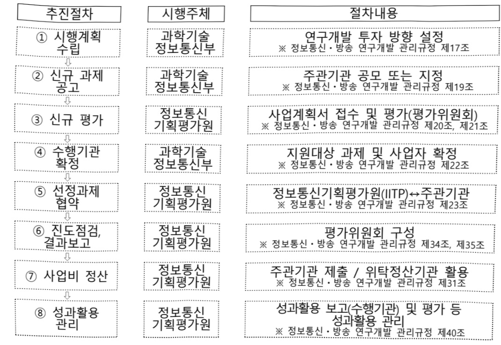

# SW컴퓨팅산업원천기술개발(R&D,정보화)

**해당 페이지**: PDF 620 ~ 629 쪽 해당

**부처**: 과학기술정보통신부
**분야**: 통신
**회계유형**: 기금
**2026 확정예산**: 77201.0 백만원
**전년대비 증감률**: -18.5%
**AI 도메인**: AI반도체, 데이터, 클라우드/컴퓨팅, 디지털전환(AX)

---

<table border=1 style='margin: auto; word-wrap: break-word;'><tr><td style='text-align: center; word-wrap: break-word;'>사 업 명</td></tr><tr><td style='text-align: center; word-wrap: break-word;'>(23) SW컴퓨팅산업원천기술개발(R&amp;D) (2231-323)</td></tr></table>

□ 사업 코드 정보

<table border=1 style='margin: auto; word-wrap: break-word;'><tr><td style='text-align: center; word-wrap: break-word;'>구분</td><td style='text-align: center; word-wrap: break-word;'>기금</td><td style='text-align: center; word-wrap: break-word;'>소관</td><td style='text-align: center; word-wrap: break-word;'>실국(기관)</td><td style='text-align: center; word-wrap: break-word;'>계정</td><td style='text-align: center; word-wrap: break-word;'>분야</td><td style='text-align: center; word-wrap: break-word;'>부문</td></tr><tr><td style='text-align: center; word-wrap: break-word;'>코드</td><td style='text-align: center; word-wrap: break-word;'>정보통신진흥</td><td style='text-align: center; word-wrap: break-word;'>과학기술</td><td rowspan="2">소프트웨어정책관</td><td rowspan="2"></td><td style='text-align: center; word-wrap: break-word;'>130</td><td style='text-align: center; word-wrap: break-word;'>133</td></tr><tr><td style='text-align: center; word-wrap: break-word;'>명칭</td><td style='text-align: center; word-wrap: break-word;'>기금</td><td style='text-align: center; word-wrap: break-word;'>정보통신부</td><td style='text-align: center; word-wrap: break-word;'>통신</td><td style='text-align: center; word-wrap: break-word;'>정보통신</td></tr></table>

<table border=1 style='margin: auto; word-wrap: break-word;'><tr><td style='text-align: center; word-wrap: break-word;'>구분</td><td style='text-align: center; word-wrap: break-word;'>프로그램</td><td style='text-align: center; word-wrap: break-word;'>단위사업</td><td style='text-align: center; word-wrap: break-word;'>세부사업</td></tr><tr><td style='text-align: center; word-wrap: break-word;'>코드</td><td style='text-align: center; word-wrap: break-word;'>2200</td><td style='text-align: center; word-wrap: break-word;'>2231</td><td style='text-align: center; word-wrap: break-word;'>323</td></tr><tr><td style='text-align: center; word-wrap: break-word;'>명칭</td><td style='text-align: center; word-wrap: break-word;'>SW산업진흥</td><td style='text-align: center; word-wrap: break-word;'>SW.디지털콘텐츠기술개발</td><td style='text-align: center; word-wrap: break-word;'>SW컴퓨팅산업원천기술개발</td></tr></table>

<table border=1 style='margin: auto; word-wrap: break-word;'><tr><td colspan="6">☐ 사업 성격 (공통요구자료 Ⅱ-1 작성유의사항 4. 참조, 해당하는 사항에 “○” 표시)</td></tr><tr><td rowspan="3">신규</td><td rowspan="3">계속</td><td rowspan="3">완료</td><td rowspan="3">예비타당성 실시여부</td><td rowspan="3">총사업비 관리대상</td><td rowspan="2">총액계상 예산사업</td></tr><tr></tr><tr><td style='text-align: center; word-wrap: break-word;'>2025예산 시 소관</td></tr><tr><td style='text-align: center; word-wrap: break-word;'></td><td style='text-align: center; word-wrap: break-word;'>○</td><td style='text-align: center; word-wrap: break-word;'></td><td style='text-align: center; word-wrap: break-word;'></td><td style='text-align: center; word-wrap: break-word;'></td><td style='text-align: center; word-wrap: break-word;'></td></tr></table>

사업지원형태 및 지원을(최소한 한 개는 반드시 선택하시오. 해당사항에 O 표시)

<table border=1 style='margin: auto; word-wrap: break-word;'><tr><td style='text-align: center; word-wrap: break-word;'>직접</td><td style='text-align: center; word-wrap: break-word;'>출자</td><td style='text-align: center; word-wrap: break-word;'>출연</td><td style='text-align: center; word-wrap: break-word;'>보조</td><td style='text-align: center; word-wrap: break-word;'>융자</td><td style='text-align: center; word-wrap: break-word;'>국고보조율(%)</td><td style='text-align: center; word-wrap: break-word;'>융자율(%)</td></tr><tr><td style='text-align: center; word-wrap: break-word;'></td><td style='text-align: center; word-wrap: break-word;'></td><td style='text-align: center; word-wrap: break-word;'>○</td><td style='text-align: center; word-wrap: break-word;'></td><td style='text-align: center; word-wrap: break-word;'></td><td style='text-align: center; word-wrap: break-word;'></td><td style='text-align: center; word-wrap: break-word;'></td></tr></table>

□ 사업 소관부처 및 시행주체

<table border=1 style='margin: auto; word-wrap: break-word;'><tr><td style='text-align: center; word-wrap: break-word;'>사업명</td><td colspan="2">구분</td></tr><tr><td rowspan="2">응용기반SW 핵심기술</td><td style='text-align: center; word-wrap: break-word;'>소관부처</td><td style='text-align: center; word-wrap: break-word;'>정보통신정책실 소프트웨어정책관 소프트웨어정책과</td></tr><tr><td style='text-align: center; word-wrap: break-word;'>사업시행주체</td><td style='text-align: center; word-wrap: break-word;'>정보통신기획평가원</td></tr><tr><td rowspan="2">빅데이터 핵심기술</td><td style='text-align: center; word-wrap: break-word;'>소관부처</td><td style='text-align: center; word-wrap: break-word;'>인공지능정책실 인공지능인프라정책관 인공지능데이터진흥과</td></tr><tr><td style='text-align: center; word-wrap: break-word;'>사업시행주체</td><td style='text-align: center; word-wrap: break-word;'>정보통신기획평가원</td></tr><tr><td rowspan="2">컴퓨팅 핵심기술</td><td style='text-align: center; word-wrap: break-word;'>소관부처</td><td style='text-align: center; word-wrap: break-word;'>정보통신정책실 소프트웨어정책관 소프트웨어정책과</td></tr><tr><td style='text-align: center; word-wrap: break-word;'>사업시행주체</td><td style='text-align: center; word-wrap: break-word;'>정보통신기획평가원</td></tr><tr><td rowspan="2">SW스타랩</td><td style='text-align: center; word-wrap: break-word;'>소관부처</td><td style='text-align: center; word-wrap: break-word;'>정보통신정책실 소프트웨어정책관 소프트웨어정책과</td></tr><tr><td style='text-align: center; word-wrap: break-word;'>사업시행주체</td><td style='text-align: center; word-wrap: break-word;'>정보통신기획평가원</td></tr><tr><td rowspan="2">글로벌AI 프론티어랩</td><td style='text-align: center; word-wrap: break-word;'>소관부처</td><td style='text-align: center; word-wrap: break-word;'>인공지능정책실 인공지능정책기획관 디지털인재양성과</td></tr><tr><td style='text-align: center; word-wrap: break-word;'>사업시행주체</td><td style='text-align: center; word-wrap: break-word;'>정보통신기획평가원</td></tr></table>

---

### 가.지출계획 총괄표

(단위: 백만원, %)

<table border=1 style='margin: auto; word-wrap: break-word;'><tr><td colspan="3">2024년 2025년 예산</td><td colspan="2">2026년 예산</td><td colspan="2">증감 (B-A)</td></tr><tr><td style='text-align: center; word-wrap: break-word;'>사업명</td><td style='text-align: center; word-wrap: break-word;'>결산</td><td style='text-align: center; word-wrap: break-word;'>본예산</td><td style='text-align: center; word-wrap: break-word;'>추경(A)</td><td style='text-align: center; word-wrap: break-word;'>요구안</td><td style='text-align: center; word-wrap: break-word;'>본예산(B)</td><td style='text-align: center; word-wrap: break-word;'>(B-A)/A</td></tr><tr><td style='text-align: center; word-wrap: break-word;'>연구개발활동비등 (360-05)</td><td style='text-align: center; word-wrap: break-word;'>111,814</td><td style='text-align: center; word-wrap: break-word;'>94,695</td><td style='text-align: center; word-wrap: break-word;'>94,695</td><td style='text-align: center; word-wrap: break-word;'>77,201</td><td style='text-align: center; word-wrap: break-word;'>77,201</td><td style='text-align: center; word-wrap: break-word;'>△17,494</td></tr></table>

□ 기능별(내역사업별) 계획 내역

(단위:백만원)

<table border=1 style='margin: auto; word-wrap: break-word;'><tr><td rowspan="2"></td><td colspan="5">2024</td><td colspan="5">2025(25.12월말)</td><td rowspan="2">2026계획</td></tr><tr><td style='text-align: center; word-wrap: break-word;'>계획액(수정)</td><td style='text-align: center; word-wrap: break-word;'>계획현액</td><td style='text-align: center; word-wrap: break-word;'>집행액</td><td style='text-align: center; word-wrap: break-word;'>이월액</td><td style='text-align: center; word-wrap: break-word;'>불용액</td><td style='text-align: center; word-wrap: break-word;'>계획액(추정)</td><td style='text-align: center; word-wrap: break-word;'>계획현액</td><td style='text-align: center; word-wrap: break-word;'>집행액</td><td style='text-align: center; word-wrap: break-word;'>이월액</td><td style='text-align: center; word-wrap: break-word;'>불용액</td></tr><tr><td style='text-align: center; word-wrap: break-word;'>○ 기능별 분류(합계)</td><td style='text-align: center; word-wrap: break-word;'>111,814</td><td style='text-align: center; word-wrap: break-word;'>111,814</td><td style='text-align: center; word-wrap: break-word;'>111,814</td><td style='text-align: center; word-wrap: break-word;'>-</td><td style='text-align: center; word-wrap: break-word;'>-</td><td style='text-align: center; word-wrap: break-word;'>94,695</td><td style='text-align: center; word-wrap: break-word;'>94,695</td><td style='text-align: center; word-wrap: break-word;'>94,695</td><td style='text-align: center; word-wrap: break-word;'>-</td><td style='text-align: center; word-wrap: break-word;'>-</td><td style='text-align: center; word-wrap: break-word;'>77,201</td></tr><tr><td style='text-align: center; word-wrap: break-word;'>• 응용기반SW핵심기술</td><td style='text-align: center; word-wrap: break-word;'>26,500</td><td style='text-align: center; word-wrap: break-word;'>26,500</td><td style='text-align: center; word-wrap: break-word;'>26,500</td><td style='text-align: center; word-wrap: break-word;'>-</td><td style='text-align: center; word-wrap: break-word;'>-</td><td style='text-align: center; word-wrap: break-word;'>16,446</td><td style='text-align: center; word-wrap: break-word;'>16,446</td><td style='text-align: center; word-wrap: break-word;'>16,446</td><td style='text-align: center; word-wrap: break-word;'>-</td><td style='text-align: center; word-wrap: break-word;'>-</td><td style='text-align: center; word-wrap: break-word;'>8,900</td></tr><tr><td style='text-align: center; word-wrap: break-word;'>• 빅데이터핵심기술</td><td style='text-align: center; word-wrap: break-word;'>14,500</td><td style='text-align: center; word-wrap: break-word;'>14,500</td><td style='text-align: center; word-wrap: break-word;'>14,500</td><td style='text-align: center; word-wrap: break-word;'>-</td><td style='text-align: center; word-wrap: break-word;'>-</td><td style='text-align: center; word-wrap: break-word;'>10,093</td><td style='text-align: center; word-wrap: break-word;'>10,093</td><td style='text-align: center; word-wrap: break-word;'>10,093</td><td style='text-align: center; word-wrap: break-word;'>-</td><td style='text-align: center; word-wrap: break-word;'>-</td><td style='text-align: center; word-wrap: break-word;'>12,916</td></tr><tr><td style='text-align: center; word-wrap: break-word;'>• 컴퓨팅핵심기술</td><td style='text-align: center; word-wrap: break-word;'>55,314</td><td style='text-align: center; word-wrap: break-word;'>55,314</td><td style='text-align: center; word-wrap: break-word;'>55,314</td><td style='text-align: center; word-wrap: break-word;'>-</td><td style='text-align: center; word-wrap: break-word;'>-</td><td style='text-align: center; word-wrap: break-word;'>55,256</td><td style='text-align: center; word-wrap: break-word;'>55,256</td><td style='text-align: center; word-wrap: break-word;'>55,256</td><td style='text-align: center; word-wrap: break-word;'>-</td><td style='text-align: center; word-wrap: break-word;'>-</td><td style='text-align: center; word-wrap: break-word;'>33,985</td></tr><tr><td style='text-align: center; word-wrap: break-word;'>• SW스타텝</td><td style='text-align: center; word-wrap: break-word;'>8,500</td><td style='text-align: center; word-wrap: break-word;'>8,500</td><td style='text-align: center; word-wrap: break-word;'>8,500</td><td style='text-align: center; word-wrap: break-word;'>-</td><td style='text-align: center; word-wrap: break-word;'>-</td><td style='text-align: center; word-wrap: break-word;'>12,900</td><td style='text-align: center; word-wrap: break-word;'>12,900</td><td style='text-align: center; word-wrap: break-word;'>12,900</td><td style='text-align: center; word-wrap: break-word;'>-</td><td style='text-align: center; word-wrap: break-word;'>-</td><td style='text-align: center; word-wrap: break-word;'>11,400</td></tr><tr><td style='text-align: center; word-wrap: break-word;'>• AI반도체SW핵심기술</td><td style='text-align: center; word-wrap: break-word;'>7,000</td><td style='text-align: center; word-wrap: break-word;'>7,000</td><td style='text-align: center; word-wrap: break-word;'>7,000</td><td style='text-align: center; word-wrap: break-word;'>-</td><td style='text-align: center; word-wrap: break-word;'>-</td><td style='text-align: center; word-wrap: break-word;'>-</td><td style='text-align: center; word-wrap: break-word;'>-</td><td style='text-align: center; word-wrap: break-word;'>-</td><td style='text-align: center; word-wrap: break-word;'>-</td><td style='text-align: center; word-wrap: break-word;'>-</td><td style='text-align: center; word-wrap: break-word;'>-</td></tr><tr><td style='text-align: center; word-wrap: break-word;'>• 글로벌AI프론타이클</td><td style='text-align: center; word-wrap: break-word;'>-</td><td style='text-align: center; word-wrap: break-word;'>-</td><td style='text-align: center; word-wrap: break-word;'>-</td><td style='text-align: center; word-wrap: break-word;'>-</td><td style='text-align: center; word-wrap: break-word;'>-</td><td style='text-align: center; word-wrap: break-word;'>-</td><td style='text-align: center; word-wrap: break-word;'>-</td><td style='text-align: center; word-wrap: break-word;'>-</td><td style='text-align: center; word-wrap: break-word;'>-</td><td style='text-align: center; word-wrap: break-word;'>-</td><td style='text-align: center; word-wrap: break-word;'>10,000</td></tr></table>

### 나.사업설명자료

## 1 ) 사업목적·내용

- (SW컴퓨팅산업원천기술개발) 4차 산업혁명을 견인하는 지능화 융합 SW기술 확보를 통한 SW기술 선진국 도약

- (응용기반SW핵심기술) 비대면 업무환경 등 차세대 디지털 워크 환경을 지원하고 소프트웨어 서비스를 자율화, 지능화하여 디지털 혁신을 지원하기 위한 핵심기술 개발

- (빅데이터핵심기술) 데이터 수집·유통·활용의 생태계 지원 및 AI · 4차 산업혁명을 견인하는 빅데이터의 지능화·융합 핵심기술 개발

- (컴퓨팅핵심기술) 클라우드를 포함한 초고성능 컴퓨팅, 옛지 컴퓨팅, 데이터 중심 컴퓨팅 등

미래형 컴퓨팅 아키텍처 및 SW 자체의 신뢰성 확보를 지원하는 SW핵심기술 개발

- (SW스타랩) SW 기반기술 분야별 연구거점(대학)을 구축하여 대학의 다양한 창의성을 바탕으로 실전적 SW 연구개발 지원

---

- (글로벌AI프론티어랩) AI·디지털 분야 세계 최고 수준의 연구 수행을 위해 세계

우수연구자와 국내 최고연구진 간 공동연구 추진

## 2 ) 사업개요

## 사업근거 및 추진경위

① 법령상 근거 및 조항 적시

- 소프트웨어진흥법 제4조, 11조

제4조(기본계획의 수립 등) ① 과학기술정보통신부장관은 소프트웨어산업의 진흥을 위하여 중장기적인 기본계획(이하 "기본계획"이라 한다)을 수립하여야 한다. ② 기본계획에는 다음 각 호의 사항이 포함되어야 한다.

6. 소프트웨어 기술의 연구개발 및 보급에 관한 사항

제11조(소프트웨어 기술개발의 촉진) 정부는 소프트웨어산업과 관련된 기술의 개발을 촉진하기 위하여 기술개발 사업을 하는 자에게 필요한 자금의 전부 또는 일부를 출연하거나 보조할 수 있다.

- 정보통신 진흥 및 융합 활성화 등에 관한 특별법 제26조

제26조(소프트웨어 연구개발 활성화) ① 정부는 관계 법령에 따라 소프트웨어 분야의 국가 연구개발 사업을 실시함에 있어 지식정보재로서의 소프트웨어산업 분야의 특성을 감안하여 지원체계 및 평가방법을 별도로 정할 수 있다.

② 제1항에 따른 지원체계 및 평가방법은 대통령령으로 정한다

- 정보통신산업 진흥법 제7조

<table border=1 style='margin: auto; word-wrap: break-word;'><tr><td style='text-align: center; word-wrap: break-word;'>제7조(정보통신기술진흥 시행계획) ① 과학기술정보통신부장관은 정보통신기술의 진흥을 위하여 진흥계획에 따라 다음 각 호의 사항이 포함된 정보통신기술진흥 시행계획을 매년 수립·시행하여야 한다.</td></tr><tr><td style='text-align: center; word-wrap: break-word;'>1. 정보통신기술 수준의 조사, 개발된 정보통신기술의 평가 및 활용에 관한 사항</td></tr><tr><td style='text-align: center; word-wrap: break-word;'>2. 정보통신기술 관련 정보의 원활한 유통에 관한 사항</td></tr><tr><td style='text-align: center; word-wrap: break-word;'>3. 정보통신기술의 연구개발 및 다른 기술과의 결합 및 융합 촉진에 관한 사항</td></tr><tr><td style='text-align: center; word-wrap: break-word;'>4. 정보통신기술의 협력, 지도 및 이전에 관한 사항</td></tr><tr><td style='text-align: center; word-wrap: break-word;'>5. 정보통신기술에 관한 산학협동 촉진에 관한 사항</td></tr><tr><td style='text-align: center; word-wrap: break-word;'>6. 전문인력의 양성 및 수급에 관한 사항</td></tr><tr><td style='text-align: center; word-wrap: break-word;'>7. 정보통신기술의 표준화 및 새로운 정보통신기술의 채택에 관한 사항</td></tr><tr><td style='text-align: center; word-wrap: break-word;'>8. 정보통신기술을 연구하는 기관 또는 단체의 육성에 관한 사항</td></tr><tr><td style='text-align: center; word-wrap: break-word;'>9. 정보통신기술의 국제협력에 관한 사항</td></tr><tr><td style='text-align: center; word-wrap: break-word;'>10. 그 밖에 정보통신기술의 진흥을 위하여 필요한 사항</td></tr><tr><td style='text-align: center; word-wrap: break-word;'>② 과학기술정보통신부장관은 제1항에 따른 사항을 효율적으로 추진하기 위하여 필요하면 대통령령으로 정하는 바에 따라 정보통신기술의 개발 및 정보통신산업의 진흥과 관련된 연구기관 및 단체로 하여금 이를 대행하게 할 수 있으며 이에 드는 비용을 지원할 수 있다. &lt;개정 2013. 3. 23., 2017. 7. 26.&gt;</td></tr><tr><td style='text-align: center; word-wrap: break-word;'>③ 제1항에 따른 정보통신기술진흥 시행계획의 수립·시행 등에 필요한 사항은 대통령령으로 정하다.</td></tr></table>

② 추진경위

---

- '10. 02. : 「소프트웨어 '08. 05. : 부처 통합이후 지식경제 R&D개편에 따라 'SW · 컴퓨팅산업 원천기술개발사업」으로 개편

- '12. 06. : 'SW R&D 체계 개편방안」 수립

- '13. 10. : 관계부처 합동 '소프트웨어(SW) 혁신전략 수립

- '14. 02. : 국가과학기술심의회「선도형 SW R&D 추진계획」수립

- '14. 07. : '소프트웨어중심사회 실현전략' 발표

- '15. 03~04. : 'K-ICT 전략 및 'K-ICT SW기술 글로벌 선도전략' 발표

- '15. 04. : 미래성장동력 종합실천계획 발표(빅데이터, 관계부처합동)

- '16. 05. : K-ICT 전략 2016(10대 전략산업) 수립

- '16. 12. : '18년 일몰대상 사업 기간연장 적정성 검토(일몰기간 연장('20년))

- '17. 07. : 정부 조직개편으로 '과학기술정보통신부'로 변경

- '17. 12. : '혁신성장동력 추진계획' 수립

- '18. 01. : 'I-Korea 4.0 : ICT R&D 혁신전략' 수립

- '18. 12. : 제2차 클라우드 컴퓨팅 기본계획 수립(정보통신전략위원회)

- '19. 01. : 데이터·AI경제 활성화 계획 수립(혁신성장전략회의·경제관계장관회의)

- '19. 05. : 일몰관리 혁신방안 적정성 검토(일몰기간 일부 연장)

- '20. 05. : 코로나19 극복을 위한 추가적 일몰관리혁신(일몰연장 승인)

- '21. 06. : SW생태계혁신전략 발표

- '21. 12. : 「국가 필수전략기술 선정 및 육성·보호전략」 발표

- '22. 04. : '데이터 산업진흥 및 이용촉진에 관한 기본법(데이터산업법)' 제정

- '22. 12. : 「신성장 4.0 전략」 발표

- '23. 01. : '제1차 데이터산업 진흥 기본계획(미래 이슈 데이터 생산·공유 체계 구축)' 발표

- '23. 04. : '디지털의 기초 체력 강화를 위한 소프트웨어 진흥 전략' 발표

- '24. 04. : 인공지능 세계 3위 도약을 위한 'AI-반도체 이니셔티브' 발표

## 주요내용

① 사업규모

- 총사업비 : 해당없음

- 사업기간 : '09년 ~ 계속

-최근 5년 간 투입된 사업비(예산액기준, 추경편성한 연도에는 추경포함)

<table border=1 style='margin: auto; word-wrap: break-word;'><tr><td style='text-align: center; word-wrap: break-word;'>$ \underline{\text{연도}} $</td><td style='text-align: center; word-wrap: break-word;'>2022</td><td style='text-align: center; word-wrap: break-word;'>2023</td><td style='text-align: center; word-wrap: break-word;'>2024</td><td style='text-align: center; word-wrap: break-word;'>2025</td><td style='text-align: center; word-wrap: break-word;'>2026</td></tr><tr><td style='text-align: center; word-wrap: break-word;'>$ \underline{\text{사업비}} $</td><td style='text-align: center; word-wrap: break-word;'>119,361</td><td style='text-align: center; word-wrap: break-word;'>116,309</td><td style='text-align: center; word-wrap: break-word;'>111,814</td><td style='text-align: center; word-wrap: break-word;'>94,695</td><td style='text-align: center; word-wrap: break-word;'>77,201</td></tr></table>

-기타: 해당없음

---

## ② 사업추진체계

- 사업시행방법 : 출연 (총사업비의 3/4이내 정부매칭)

- 사업시행주체 : 정보통신기획평가원(전담기관)

- 사업 수혜자 : 소프트웨어 분야 대학, 연구소, 산업체

- 보조, 융자, 출연, 출자 등의 경우 보조 · 융자 등 지원 비율 및 법적근거

<table border=1 style='margin: auto; word-wrap: break-word;'><tr><td style='text-align: center; word-wrap: break-word;'>내역사업명</td><td style='text-align: center; word-wrap: break-word;'>구분</td><td style='text-align: center; word-wrap: break-word;'>피보조·피출연 등 기관명</td><td style='text-align: center; word-wrap: break-word;'>지원 금액 (2026계획)</td><td style='text-align: center; word-wrap: break-word;'>지원 비율(%)</td><td style='text-align: center; word-wrap: break-word;'>보조율 법적근거 (해당 조항)</td></tr><tr><td style='text-align: center; word-wrap: break-word;'>-응용기반SW핵심기술-빅데이터핵심기술-컴퓨팅핵심기술-SW스타템-글로벌AI프론티어랩</td><td style='text-align: center; word-wrap: break-word;'>출연</td><td style='text-align: center; word-wrap: break-word;'>정보통신기획평가원</td><td style='text-align: center; word-wrap: break-word;'>77,201</td><td style='text-align: center; word-wrap: break-word;'>50~100%</td><td style='text-align: center; word-wrap: break-word;'>정보통신 진흥 및 융합 활성화 등에 관한 특별법 제32조</td></tr></table>

## 3 ) 2026년도 계획 산출 근거

① 응용기반SW핵심기술 : 8,900백만원

- (요구) 신성장 4.0 추진전략하의 사회·기술적 환경 변화를 고려한 미래 유망SW·서비스의 경쟁력 강화와 국내 SW기업의 글로벌 SW시장 개척 및 진출지원 등을 위해 8,900백만원 요구

- (산출) 11개×809백만×12/12개월=8,900백만원

② 빅데이터핵심기술 : 12,916백만원

- (요구) 데이터산업 진흥 기본계획하의 초일류 데이터 분석활용 기술 경쟁력을 확보하고 빅데이터 품질 강화

핵심·요소 기술 개발을 위해 12,916백만원 요구

- (산출) 11개x1,174백만x12/12개월=12,916백만원

③ 컴퓨팅핵심기술 : 33,985백만원

- (요구) 클라우드, 초고성능 컴퓨팅, 데이터 중심 컴퓨팅 등 미래형 컴퓨팅 아키텍처, SW 신뢰성 지원하는 핵심기술 개발 및 국제협력 R&D 지원 등을 위해 33,985백만원 요구

- (산출) 23개×1,478백만×12/12개월=33,985백만원

④ SW스타랩 : 11,400백만원

- (요구) SW 기반기술 분야별 연구거점(대학)을 구축하여 대학의 다양한 창의성을 바탕으로 실천적 SW 연구 개발을 위해 11,400백만원 요구

- (산출) 38개x300백만x12/12개월=11,400백만원

⑤ 글로벌AI프론티어랩 : 10,000백만원

- (요구) AI·디지털 분야 세계 최고 수준의 연구 수행을 위해 세계 우수 연구자와 국내 최고연구진간의 공동 연구 추진을 위해 10,000백만원 요구

※ 기존 컴퓨팅핵심기술개발 내역사업의 내내역사업을 동일 세부사업의 신규내역사업으로 구조개편('24~'28) - (산출) 1개×10,000백만×12/12개월=10,000백만원

---

## 4 ) 사업효과

☐ 사업영향, 산출물 성과지표 등

①2022~2026년도 성과계획서 상 성과지표 및 최근 5년간 성과 달성도

<table border=1 style='margin: auto; word-wrap: break-word;'><tr><td style='text-align: center; word-wrap: break-word;'>성과지표</td><td style='text-align: center; word-wrap: break-word;'>구분</td><td style='text-align: center; word-wrap: break-word;'>2022</td><td style='text-align: center; word-wrap: break-word;'>2023</td><td style='text-align: center; word-wrap: break-word;'>2024</td><td style='text-align: center; word-wrap: break-word;'>2025</td><td style='text-align: center; word-wrap: break-word;'>2026</td><td style='text-align: center; word-wrap: break-word;'>2026목표치산출근거</td><td style='text-align: center; word-wrap: break-word;'>측정산식(또는 측정방법)</td><td style='text-align: center; word-wrap: break-word;'>자료수집방법(또는 자료출처)</td></tr><tr><td rowspan="3">표준화된 순위보정영향력지수(mmIF)(단위: 지수)</td><td style='text-align: center; word-wrap: break-word;'>목표</td><td style='text-align: center; word-wrap: break-word;'>63.10</td><td style='text-align: center; word-wrap: break-word;'>63.73</td><td style='text-align: center; word-wrap: break-word;'>64.37</td><td style='text-align: center; word-wrap: break-word;'>68.73</td><td style='text-align: center; word-wrap: break-word;'>69.42</td><td rowspan="3">최근 3개년 실적치평균값  기준으로 매년 1% 상향</td><td rowspan="3">(NxrnIFj - 1)/(N-1)x 100 (N: 해당분야내 학술지수, rnIFj : 순위보정영향력지수)</td><td rowspan="3">NTIS, 관리기관의 등록증</td></tr><tr><td style='text-align: center; word-wrap: break-word;'>실적</td><td style='text-align: center; word-wrap: break-word;'>71.79</td><td style='text-align: center; word-wrap: break-word;'>69.17</td><td style='text-align: center; word-wrap: break-word;'>66.61</td><td style='text-align: center; word-wrap: break-word;'>-</td><td style='text-align: center; word-wrap: break-word;'>-</td></tr><tr><td style='text-align: center; word-wrap: break-word;'>달성도</td><td style='text-align: center; word-wrap: break-word;'>113.7</td><td style='text-align: center; word-wrap: break-word;'>108.5</td><td style='text-align: center; word-wrap: break-word;'>103.5</td><td style='text-align: center; word-wrap: break-word;'>-</td><td style='text-align: center; word-wrap: break-word;'>-</td></tr><tr><td rowspan="3">특허등급(SMART)지수(단위: 지수)</td><td style='text-align: center; word-wrap: break-word;'>목표</td><td style='text-align: center; word-wrap: break-word;'>4.03</td><td style='text-align: center; word-wrap: break-word;'>4.07</td><td style='text-align: center; word-wrap: break-word;'>4.11</td><td style='text-align: center; word-wrap: break-word;'>4.19</td><td style='text-align: center; word-wrap: break-word;'>4.23</td><td rowspan="3">최근 3개년 실적치평균값  기준으로 매년 1% 상향</td><td rowspan="3">∑(Ai x Bi) /∑Bi(Ai : 특허등급별 가중치, Bi : 등급별 특허성과 건수)</td><td rowspan="3">NTIS, 한국발명진흥회(SMART)</td></tr><tr><td style='text-align: center; word-wrap: break-word;'>실적</td><td style='text-align: center; word-wrap: break-word;'>4.27</td><td style='text-align: center; word-wrap: break-word;'>4.25</td><td style='text-align: center; word-wrap: break-word;'>4.49</td><td style='text-align: center; word-wrap: break-word;'>-</td><td style='text-align: center; word-wrap: break-word;'>-</td></tr><tr><td style='text-align: center; word-wrap: break-word;'>달성도</td><td style='text-align: center; word-wrap: break-word;'>105.9</td><td style='text-align: center; word-wrap: break-word;'>104.4</td><td style='text-align: center; word-wrap: break-word;'>109.2</td><td style='text-align: center; word-wrap: break-word;'>-</td><td style='text-align: center; word-wrap: break-word;'>-</td></tr><tr><td rowspan="3">사업화 매출액(단위: 지수)</td><td style='text-align: center; word-wrap: break-word;'>목표</td><td style='text-align: center; word-wrap: break-word;'>2.26</td><td style='text-align: center; word-wrap: break-word;'>2.32</td><td style='text-align: center; word-wrap: break-word;'>2.39</td><td style='text-align: center; word-wrap: break-word;'>1.27</td><td style='text-align: center; word-wrap: break-word;'>1.31</td><td rowspan="3">최근 3개년 실적치평균값  기준으로 매년 3% 상향</td><td rowspan="3">당해연도 사업화 매출액(억원)/당해 년도 예산(10억원)×기여율</td><td rowspan="3">NTIS, 사업화 현황 자료 수집</td></tr><tr><td style='text-align: center; word-wrap: break-word;'>실적</td><td style='text-align: center; word-wrap: break-word;'>1.26</td><td style='text-align: center; word-wrap: break-word;'>1.08</td><td style='text-align: center; word-wrap: break-word;'>2.16</td><td style='text-align: center; word-wrap: break-word;'>-</td><td style='text-align: center; word-wrap: break-word;'>-</td></tr><tr><td style='text-align: center; word-wrap: break-word;'>달성도</td><td style='text-align: center; word-wrap: break-word;'>55.7</td><td style='text-align: center; word-wrap: break-word;'>46.5</td><td style='text-align: center; word-wrap: break-word;'>90.4</td><td style='text-align: center; word-wrap: break-word;'>-</td><td style='text-align: center; word-wrap: break-word;'>-</td></tr><tr><td rowspan="3">기술이전(단위: 지수) * &#x27;22년 신규</td><td style='text-align: center; word-wrap: break-word;'>목표</td><td style='text-align: center; word-wrap: break-word;'>0.062</td><td style='text-align: center; word-wrap: break-word;'>0.065</td><td style='text-align: center; word-wrap: break-word;'>0.067</td><td style='text-align: center; word-wrap: break-word;'>0.164</td><td style='text-align: center; word-wrap: break-word;'>0.170</td><td rowspan="3">최근 3개년 실적치평균값  기준으로 매년 4% 상향</td><td rowspan="3">기술료 및 기여율 반영(10억원당) * &#x27;22년부터, 공개SW 개발방식 적용예산 제외</td><td rowspan="3">NTIS, 기술이전 및 기술료 자료 수집</td></tr><tr><td style='text-align: center; word-wrap: break-word;'>실적</td><td style='text-align: center; word-wrap: break-word;'>0.134</td><td style='text-align: center; word-wrap: break-word;'>0.119</td><td style='text-align: center; word-wrap: break-word;'>0.142</td><td style='text-align: center; word-wrap: break-word;'>-</td><td style='text-align: center; word-wrap: break-word;'>-</td></tr><tr><td style='text-align: center; word-wrap: break-word;'>달성도</td><td style='text-align: center; word-wrap: break-word;'>216.1</td><td style='text-align: center; word-wrap: break-word;'>183.0</td><td style='text-align: center; word-wrap: break-word;'>211.9</td><td style='text-align: center; word-wrap: break-word;'>-</td><td style='text-align: center; word-wrap: break-word;'>-</td></tr><tr><td rowspan="3">공개SW 개발 활성화(단위: 지수) * &#x27;22년 신규</td><td style='text-align: center; word-wrap: break-word;'>목표</td><td style='text-align: center; word-wrap: break-word;'>1.03</td><td style='text-align: center; word-wrap: break-word;'>1.06</td><td style='text-align: center; word-wrap: break-word;'>1.09</td><td style='text-align: center; word-wrap: break-word;'>1.12</td><td style='text-align: center; word-wrap: break-word;'>1.15</td><td rowspan="3">21년 실적을 기준으로 매년 3% 상향 목표로 설정</td><td rowspan="3">∑(Commit+Fork+Star+Issue(closed)+Pull request(closed)] /(당해연도 공개SW개발방식 지원예산(10억원))</td><td rowspan="3">NTIS, 저장소(Github 등), 성과조사 결과</td></tr><tr><td style='text-align: center; word-wrap: break-word;'>실적</td><td style='text-align: center; word-wrap: break-word;'>1.07</td><td style='text-align: center; word-wrap: break-word;'>1.06</td><td style='text-align: center; word-wrap: break-word;'>1.09</td><td style='text-align: center; word-wrap: break-word;'>-</td><td style='text-align: center; word-wrap: break-word;'>-</td></tr><tr><td style='text-align: center; word-wrap: break-word;'>달성도</td><td style='text-align: center; word-wrap: break-word;'>103.8</td><td style='text-align: center; word-wrap: break-word;'>100.0</td><td style='text-align: center; word-wrap: break-word;'>100.0</td><td style='text-align: center; word-wrap: break-word;'>-</td><td style='text-align: center; word-wrap: break-word;'>-</td></tr></table>

② 성과지표 이외의 연도별 사업추진 경과 및 실적

### ·'22년 정부 R&D 우수성과 100선 선정(과기정통부 KISTEP(22.11))

- (SW스타랩) NP-hard 그래프 문제를 위한 실용적인 알고리즘 프레임워크 기술 1건

## [응용기반SW핵심기술]

· 비침습 BCI 통합 뇌인지 컴퓨팅을 통해 실생활 적용 가능한 원격 외골격 로봇 제어 기술 고도화 및 로봇팔 제어 기술, 통합 BCI 제어 SW 플랫폼 개발('22.12)

• 분자유전학적 원인 불명인 악성 종양 환자의 개인 맞춤 원인 규명 및 치료제 개발('22.12)

·비대면 원격 디지털 협업 환경서비스를 구축하기 위해 SW통합플랫폼의 클라우드 기반 Saas 플랫폼 구축 및 블록체인 기반 디지털 워크 통합 플랫폼 개발 등('22.12)

• 스토리지 내 하드웨어 가속이 주가된 SSD 설계를 통해 프로그램 실행상태와 데이터들을 전원 없이 비휘발성으로 유지 가능한 HW-SW 기술 개발('22.12)

· 니시덜선완 가속화를 위해 로우코딩 관련 기술/서비스 설계 및 프로토타입 구현 및 이커머스 산업 활성화를 위한 SW빌딩블록 결합 플랫폼 기술 개발 추진중

## [빅데이터핵심기술]

·데이터 특징과 문제 정의를 인지하는 빅데이터 분석모델 추천 자동화 기술, 능동적 즉시 대응 및 빠른 학습이 가능한 적응형 경량 옛지 연동분석 기술개발 등 추진

• 고품질 데이터셋의 적시·적소 활용을 지원하는 데이터읍스 프레임워크(DataOps Framework) 기술개발 등 신규 과제 추진 중

## [컴퓨팅핵심기술]

·바운드리스 컴퓨팅을 위한 차세대 메모리 중심 컴퓨팅 기술 연구 및 글로벌 운영

체제 최적화 추진중

---

<table border=1 style='margin: auto; word-wrap: break-word;'><tr><td style='text-align: center; word-wrap: break-word;'></td><td style='text-align: center; word-wrap: break-word;'>·빅데이터 분석 및 AI 처리를 위한 클라우드向 차세대 DBMS 기술 개발[SW스타템]·모델 기반의 초대형 복잡 시스템 분석 및 검증 SW 개발, 사람과 공감하는 대화 인공지능 개발, SW 오류를 자동으로 수정할 수 있는 기술개발 등 추진·딥러닝 기반 정책 및 동적 장면의 공간 영상 표현 학습 및 렌더링 연구, 최적의 인공지능 서비스 환경을 자율적으로 제공하는 차세대 클라우드 시스템 개발 등 신규과제 추진 중[AI반도체SW핵심기술]·인공지능 반도체의 시스템 SW 성능 극대화 및 학습·추론 활용을 위한 SW 패키지 등 개발 추진 중</td></tr><tr><td style='text-align: center; word-wrap: break-word;'>2023</td><td style='text-align: center; word-wrap: break-word;'>·23년 정부 R&amp;D 우수성과 100선 선정(과기정통부 KISTEP(23.11))- (SW스타템) 옛지 디바이스에서의 상시 실시간 지능형 교통 감시 시스템 1건[응용기반SW핵심기술]·업무 자동화 향상을 위한 프로세스 분석 및 자동화 대상 추천기술 개발에 대한 신규과제 추진·거대언어모델 기반의 레거시코드와 로우코드간 변환규칙추출 및 검증 기술과 이를 활용한 상호운용 SW 기술 개발 추진[비데이터핵심기술]·목적 맞춤형 합성데이터 생성 및 평가기술 개발 추진·분산된 데이터에 대한 논리적 데이터 통합과 복합분석을 지원하는 데이터 패브릭 기술개발 추진[컴퓨팅핵심기술]·양자 성능 검증 및 양자 SW 응용 기술 및 NISQ 환경에서 저부하, 고효율 양자 오류 경감 기술 개발 및 응용 기술 개발 추진·이종 퍼블럭 클라우드 활용 및 관리 복잡성을 극복하는 멀티 클라우드 관리 플랫폼 기술개발 등 신규 과제 추진[SW스타템]·오픈 월드 로봇 서비스를 위한 볼특정 환경 인지, 행동 및 상호작용 알고리즘 개발·서비스 연속성 지향 에지 Continuum SW 프레임워크 및 뇌의 고위수준 기능을 모사하는 시스템3 강화학습 기술개발 추진</td></tr><tr><td style='text-align: center; word-wrap: break-word;'>2024</td><td style='text-align: center; word-wrap: break-word;'>·24년 정부 R&amp;D 우수성과 100선 선정(과기정통부 KISTEP(24.11))- (응용기반SW핵심기술) 영유아/아동의 발달장애 조기선별을 위한 행동·반응 심리인지 AI 기술개발 1건[응용기반SW핵심기술]·글로벌시장개척형SW(Software Frontier) 기술개발(응용SW) 신규과제 3개 과제 추진·SW답테크 기술 글로벌 경쟁력 강화 신규과제 8개 과제 추진·ICT SW R&amp;D 우수성과 글로벌 스케일업 신규과제 6개 과제 추진[비데이터핵심기술]·예외 상황 합성데이터 생성 및 인공지능 예측 모델 고도화 기술 개발·데이터 기반 인구감소지역 사회문제 해결지원 기술 개발[컴퓨팅핵심기술]·지능형 차량에 필요한 AI 프레임워크와 연동되는 SDV기반 자동차 SW플랫폼 기술 개발·도심항공교통의 비정상 상황 인지 및 대응을 위한 온보드 기반 지능형 항전 SW 플랫폼 기술 개발·온디바이스 로봇 지능 지원 SW플랫폼 핵심 기술개발</td></tr></table>

---

<table border=1 style='margin: auto; word-wrap: break-word;'><tr><td style='text-align: center; word-wrap: break-word;'></td><td style='text-align: center; word-wrap: break-word;'>[SW스타템]• 딥러닝 기반 정적 및 동적 장면의 공간 영상 표현 학습 및 렌더링 연구• 초실감 디지털 휴먼 재현을 위한 편광 기반 4차원 시공간 모델 획득 및 렌더링 기술 개발</td></tr><tr><td style='text-align: center; word-wrap: break-word;'>2025</td><td style='text-align: center; word-wrap: break-word;'>[응·용기반SW핵심기술]• 사회·기술적 환경 변화를 고려한 핵심 국산 SW기술 확보 및 미래 유망 SW·서비스의 경쟁력 강화를 위한 핵심기술 확보를 위한 기술개발 계속과제 8개 과제 지원• 글로벌시장개척형SW(Software Frontier) 기술개발(응용SW) 계속과제 4개 과제 지원• SW딥테크 기술 글로벌 경쟁력 강화 계속과제 8개 과제 지원• ICT SW R&amp;D 우수성과 글로벌 스케일업 계속과제 6개 과제 지원[빅데이터핵심기술]• 데이터 활용 목적에 맞는 고품질의 데이터를 비용 효율적으로 확보하고 손쉽게 분석이 가능하게 하는 핵심 기술 확보 및 데이터의 수집, 저장, 처리, 분석 등 전주기에 사람의 개입을 최소화하는 빅데이터 시스템 기술 등 계속과제 14개 과제 지원[컴퓨팅핵심기술]• 초고성능 컴퓨팅, 데이터 중심 컴퓨팅 등 미래형 컴퓨팅 아키텍쳐 및 에너지 효율화 등 저전력·고효율 컴퓨팅 기술 계속과제 15개 과제 지원• HW의 성능을 향상·최적화하고 시스템 SW 기술의 혁신을 위한 계속과제 4개 과제 지원• 글로벌시장개척형SW(Software Frontier) 기술개발(컴퓨팅) 계속과제 4개 과제 지원• AI·디지털 분야 세계 최고 연구 및 과학적 한계에 돌파에 도전하는 국제 공동연구 계속과제 4개 과제 지원• 클라우드 인프라 성능 가속·최적화 기술, 클라우드 경쟁력 강화를 통한 SW 기술 개발 등 계속과제 4개 과제 지원[SW스타템]• SW 기반기술 분야별 연구거점(대학)을 구축하여 대학의 다양한 창의성을 바탕으로 실전적 SW 연구개발 지원 계속과제 43개 과제 지원</td></tr></table>

③ 향후(2026년도 이후) 기대효과 : 개조식으로 작성, 건 별로 계량적 수치 제시

- SW서비스를 자율화·지능화하여 응용프로그램의 쉬운 개발과 다양한 SW신기술을 타 산업에 접목하여 융합 촉진

- 최근 급격히 증가하는 비대면 솔루션 시장에 국내 사업자의 시장 진입을 촉진할 수 있는 클라우드 기반 기술 확보로 국내 기업 경쟁력 강화

- 다양한 분야, 대량/다종의 데이터를 바탕으로 한 신규 빅데이터 분석·활용 서비스 출시, 국내 기업의 해외시장 진출 등

- 초고성능 컴퓨팅, 데이터 중심 컴퓨팅 등 미래형 컴퓨팅 아키텍처 및 에너지 효율

화 등 저전력·고효율 컴퓨팅 기술 개발

## 5 ) 타당성조사 및 예비타당성조사 시행여부 및 결과 요지

□ 일몰관리혁신('20.5월)에 따라 관리

---

# 6) 총사업비 대상사업 여부 및 내역 : 해당없음

## 7 ) 사업 집행절차

<table border=1 style='margin: auto; word-wrap: break-word;'><tr><td style='text-align: center; word-wrap: break-word;'>부처</td><td style='text-align: center; word-wrap: break-word;'></td><td style='text-align: center; word-wrap: break-word;'>피출연·피보조기관</td><td style='text-align: center; word-wrap: break-word;'></td><td style='text-align: center; word-wrap: break-word;'>간접보조사업자·사업수행자</td></tr><tr><td style='text-align: center; word-wrap: break-word;'>과기정통부(77,201백만원)</td><td style='text-align: center; word-wrap: break-word;'>=&gt;(77,201백만원)</td><td style='text-align: center; word-wrap: break-word;'>정보통신기획평가원(77,201백만원)</td><td style='text-align: center; word-wrap: break-word;'>=&gt;(77,201백만원)</td><td style='text-align: center; word-wrap: break-word;'>소프트웨어 분야산·학·연 등</td></tr></table>

## 8 ) 각종 평가

1) 국회(예결위, 상임위, 예정처, 국정감사 포함) 지적 : 2023회계연도 결산('24.9월)에서 신속한 연구비 정산 및 법정기한 내 회수금 반납 필요를 지적하였으며, 이에 따라 과제별 정산 결과 통보·확정 후, 정산에 따른 잔액 및 회수금 반납 진행중

2) 감사원 지적 : 해당없음

3) 자체평가 : 국가연구개발사업중간평가('25.6월 과기본부) 결과 96점으로 '우수' 등급

4) 기타 시민단체, 언론 및 민원 : 해당없음

5) 문제점 지적에 대한 후속조치 : 해당없음

---

### 다. 최근 4년간 결산내역

## 1 ) 결산표

☐ 부처 결산내역

(단위: 백만원, %)

<table border=1 style='margin: auto; word-wrap: break-word;'><tr><td rowspan="2">연도</td><td colspan="3">계획액</td><td rowspan="2">계획현액(A)</td><td rowspan="2">집행액(B)</td><td rowspan="2">집행률(B/A)</td><td rowspan="2">다음연도이월액</td><td rowspan="2">불용액</td></tr><tr><td style='text-align: center; word-wrap: break-word;'>당초</td><td style='text-align: center; word-wrap: break-word;'>증감액</td><td style='text-align: center; word-wrap: break-word;'>추경</td></tr><tr><td style='text-align: center; word-wrap: break-word;'>2022</td><td style='text-align: center; word-wrap: break-word;'>119,361</td><td style='text-align: center; word-wrap: break-word;'>-</td><td style='text-align: center; word-wrap: break-word;'>119,361</td><td style='text-align: center; word-wrap: break-word;'>119,361</td><td style='text-align: center; word-wrap: break-word;'>119,361</td><td style='text-align: center; word-wrap: break-word;'>100.0</td><td style='text-align: center; word-wrap: break-word;'>-</td><td style='text-align: center; word-wrap: break-word;'>-</td></tr><tr><td style='text-align: center; word-wrap: break-word;'>2023</td><td style='text-align: center; word-wrap: break-word;'>116,309</td><td style='text-align: center; word-wrap: break-word;'>-</td><td style='text-align: center; word-wrap: break-word;'>116,309</td><td style='text-align: center; word-wrap: break-word;'>116,309</td><td style='text-align: center; word-wrap: break-word;'>116,309</td><td style='text-align: center; word-wrap: break-word;'>100.0</td><td style='text-align: center; word-wrap: break-word;'>-</td><td style='text-align: center; word-wrap: break-word;'>-</td></tr><tr><td style='text-align: center; word-wrap: break-word;'>2024</td><td style='text-align: center; word-wrap: break-word;'>111,814</td><td style='text-align: center; word-wrap: break-word;'>-</td><td style='text-align: center; word-wrap: break-word;'>111,814</td><td style='text-align: center; word-wrap: break-word;'>111,814</td><td style='text-align: center; word-wrap: break-word;'>111,814</td><td style='text-align: center; word-wrap: break-word;'>100.0</td><td style='text-align: center; word-wrap: break-word;'>-</td><td style='text-align: center; word-wrap: break-word;'>-</td></tr><tr><td style='text-align: center; word-wrap: break-word;'>2025</td><td style='text-align: center; word-wrap: break-word;'>94,695</td><td style='text-align: center; word-wrap: break-word;'>-</td><td style='text-align: center; word-wrap: break-word;'>94,695</td><td style='text-align: center; word-wrap: break-word;'>94,695</td><td style='text-align: center; word-wrap: break-word;'>94,695</td><td style='text-align: center; word-wrap: break-word;'>100.0</td><td style='text-align: center; word-wrap: break-word;'>-</td><td style='text-align: center; word-wrap: break-word;'>-</td></tr></table>

## 2 ) 주요 결산사항

□ 2022~2025년 결산 주요사항

<table border=1 style='margin: auto; word-wrap: break-word;'><tr><td style='text-align: center; word-wrap: break-word;'>2022</td><td style='text-align: center; word-wrap: break-word;'>- 해당사항 없음</td></tr><tr><td style='text-align: center; word-wrap: break-word;'>2023</td><td style='text-align: center; word-wrap: break-word;'>- 해당사항 없음</td></tr><tr><td style='text-align: center; word-wrap: break-word;'>2024</td><td style='text-align: center; word-wrap: break-word;'>- 해당사항 없음</td></tr><tr><td style='text-align: center; word-wrap: break-word;'>2025</td><td style='text-align: center; word-wrap: break-word;'>- 해당사항 없음</td></tr></table>

2025년 계획변경 세부내역 : 해당없음

---

### 원본 PDF 크롭 이미지

