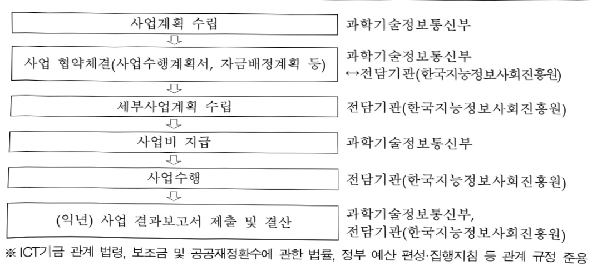
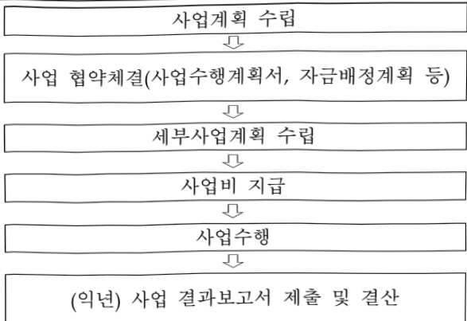

# World Best LLM 데이터 활용 지원

**해당 페이지**: PDF 630 ~ 637 쪽 해당

**부처**: 과학기술정보통신부
**분야**: 통신
**회계유형**: 일반회계
**2026 확정예산**: 30000.0 백만원
**전년대비 증감률**: None%
**AI 도메인**: LLM/언어모델, 데이터, 교육/인재

---

### 가.예산 총괄표

(단위: 백만원, %)

<table border=1 style='margin: auto; word-wrap: break-word;'><tr><td rowspan="2">사업명</td><td rowspan="2">2024년 결산</td><td colspan="2">2025년 예산</td><td colspan="2">2026년 예산</td><td rowspan="2">증감(B-A)</td><td rowspan="2">(B-A)/A</td></tr><tr><td style='text-align: center; word-wrap: break-word;'>본예산</td><td style='text-align: center; word-wrap: break-word;'>추경*(A)</td><td style='text-align: center; word-wrap: break-word;'>요구안</td><td style='text-align: center; word-wrap: break-word;'>본예산(B)</td></tr><tr><td style='text-align: center; word-wrap: break-word;'>World Best LLM 데이터 활용 지원</td><td style='text-align: center; word-wrap: break-word;'>-</td><td style='text-align: center; word-wrap: break-word;'>-</td><td style='text-align: center; word-wrap: break-word;'>30,000</td><td style='text-align: center; word-wrap: break-word;'>30,000</td><td style='text-align: center; word-wrap: break-word;'>30,000</td><td style='text-align: center; word-wrap: break-word;'>-</td><td style='text-align: center; word-wrap: break-word;'>-</td></tr></table>

※ 방송통신미디어위원회로 이관된 내역사업(WBL 차세대 데이터 구축, '25추경 20,000백만원)은 제외하고 작성

## □ 기능별(내역사업별) 예산 내역

(단위:백만원)

<table border=1 style='margin: auto; word-wrap: break-word;'><tr><td rowspan="2"></td><td colspan="5">2024</td><td colspan="5">2025</td><td rowspan="2">2026 예산</td></tr><tr><td style='text-align: center; word-wrap: break-word;'>예산액(추정)</td><td style='text-align: center; word-wrap: break-word;'>예산현액</td><td style='text-align: center; word-wrap: break-word;'>집행액</td><td style='text-align: center; word-wrap: break-word;'>이월액</td><td style='text-align: center; word-wrap: break-word;'>불용액</td><td style='text-align: center; word-wrap: break-word;'>예산액(추정)</td><td style='text-align: center; word-wrap: break-word;'>예산현액</td><td style='text-align: center; word-wrap: break-word;'>집행액</td><td style='text-align: center; word-wrap: break-word;'>이월액</td><td style='text-align: center; word-wrap: break-word;'>불용액</td></tr><tr><td style='text-align: center; word-wrap: break-word;'>○ 기능별 분류(합계)</td><td style='text-align: center; word-wrap: break-word;'>-</td><td style='text-align: center; word-wrap: break-word;'>-</td><td style='text-align: center; word-wrap: break-word;'>-</td><td style='text-align: center; word-wrap: break-word;'>-</td><td style='text-align: center; word-wrap: break-word;'>-</td><td style='text-align: center; word-wrap: break-word;'>30,000</td><td style='text-align: center; word-wrap: break-word;'>30,000</td><td style='text-align: center; word-wrap: break-word;'>30,000</td><td style='text-align: center; word-wrap: break-word;'>-</td><td style='text-align: center; word-wrap: break-word;'>-</td><td style='text-align: center; word-wrap: break-word;'>30,000</td></tr><tr><td rowspan="2">• WBL프로젝트데이터 지원• WBL 평가 검증기반 조성</td><td style='text-align: center; word-wrap: break-word;'>-</td><td style='text-align: center; word-wrap: break-word;'>-</td><td style='text-align: center; word-wrap: break-word;'>-</td><td style='text-align: center; word-wrap: break-word;'>-</td><td style='text-align: center; word-wrap: break-word;'>-</td><td style='text-align: center; word-wrap: break-word;'>25,000</td><td style='text-align: center; word-wrap: break-word;'>25,000</td><td style='text-align: center; word-wrap: break-word;'>25,000</td><td style='text-align: center; word-wrap: break-word;'>-</td><td style='text-align: center; word-wrap: break-word;'>-</td><td style='text-align: center; word-wrap: break-word;'>25,000</td></tr><tr><td style='text-align: center; word-wrap: break-word;'>-</td><td style='text-align: center; word-wrap: break-word;'>-</td><td style='text-align: center; word-wrap: break-word;'>-</td><td style='text-align: center; word-wrap: break-word;'>-</td><td style='text-align: center; word-wrap: break-word;'>-</td><td style='text-align: center; word-wrap: break-word;'>5,000</td><td style='text-align: center; word-wrap: break-word;'>5,000</td><td style='text-align: center; word-wrap: break-word;'>5,000</td><td style='text-align: center; word-wrap: break-word;'>-</td><td style='text-align: center; word-wrap: break-word;'>-</td><td style='text-align: center; word-wrap: break-word;'>5,000</td></tr></table>

※ 방송통신미디어위원회로 이관된 내역사업(WBL 차세대 데이터 구축, '25추경 20,000백만원)은 제외하고 작성

### 나. 사업설명자료

## 1 ) 사업목적·내용

° (World Best LLM 데이터 활용 지원) 글로벌 수준의 독자적인 AI모델의 신속한 개발에 필요한 데이터를 전폭 지원하고 AI 모델 간 경쟁 환경을 조성하여 AI생태계 활성화 도모 ※(국정과제 20-3) AI 3대 강국 도약을 위한 AI 고속도로 구축-생성형AI 학습데이터 확보 및 국가 데이터 통합 플랫폼 구축

(국정과제 21-1) 세계에서 AI를 가장 잘 쓰는 나라 구현 - AI파운데이션 모델 확보 및 확산

※(국가 AI 역량 강화 방안) 딥시크 돌풍에 따라 우리도 충분한 지원이 있으면, 글로벌 수준의 AI 파운데이션 모델 개발 가능 공감대 형성→AI 정예팀을 선발하여 글로벌 Top 수준의 LLM을 개발할 수 있도록 핵심 인프라(GPU·데이터·인재)를 패키지 집중 지원(제3차 국가인공지능위원회)

- (WBL프로젝트 데이터 지원) 「독자 AI 과운데이션 모델 프로젝트」수행기관(이하 '정예팀' 또는 'K-AI팀')의 AI모델 개발 계획에 따라 필요한 데이터의 공급·제공 및 구축·가공 지원

- (WBL 평가·검증 기반 조성) AI모델의 성능 및 안전성을 객관적으로 평가·검증할 수 있는 고품질 벤치마크 데이터를 구축하고 공개 경쟁·평가 체계(리더보드) 마련

---

## 2 ) 사업개요

□ 사업근거 및 추진경위

① 법령상 근거 및 조항

- 「지능정보화 기본법」 제12조(한국지능정보사회진흥원의 설립), 제42조(데이터 관련 시책의 마련), 제43조(데이터의 유통·활용)

<지능정보화 기본법>
제12조(한국지능정보사회진흥원의 설립) ① 과학기술정보통신부장관과 행정안전부장관은 지능정보사회 관련 정책의 개발과 국가기관등의 지능정보사회 시책 및 지능정보화 사업의 추진 등을 지원하기 위하여 한국지능정보사회진흥원(이하 "지능정보사회원"이라 한다)을 설립한다. ② ~ ⑦ (생 략)
제42조(데이터 관련 시책의 마련) ① 정부는 지능정보화의 효율적 추진과 지능정보서비스의 제공·이용 활성화에 필요한 데이터의 생산·수집 및 유통·활용 등을 촉진하기 위하여 필요한 정책을 추진하여야 한다.(후 략)
제43조(데이터의 유통·활용) ① 정부는 데이터의 효율적인 생산·수집·관리와 원활한 유통·활용을 위하여 국가기관등, 법인, 기관 및 단체와의 협력체계를 구축하고, 이를 위한 지원을 할 수 있다. ② ~ ③ (생 략) ④ 제2항에 따른 지원의 내용 및 방법 등에 관하여 필요한 사항과 제3항에 따른 데이터통합지원센터의 기능·운영 등에 관한 구체적인 사항은 대통령령으로 정한다.

-「데이터 산업진흥 및 이용촉진에 관한 기본법」제18조(데이터 유통 및 거래 체계 구축), 제42조(데이터 관련 시책의 마련), 제43조(데이터의 유통·활용)

<데이터산업진흥 및 이용촉진에 관한 기본법>

제18조(데이터 유통 및 거래 체계 구축) ① 과학기술정보통신부장관은 데이터 유통 및 거래를 활성화하기 위하여 데이터 유통 및 거래 체계를 구축하고, 데이터 유통 및 거래 기반 조성을 위하여 필요한 지원을 할 수 있다.(후 략) 제42조(데이터 관련 시책의 마련) ① 정부는 지능정보화의 효율적 추진과 지능정보서비스의 제공·이용 활성화에 필요한 데이터의 생산·수집 및 유통·활용 등을 촉진하기 위하여 필요한 정책을 추진하여야 한다.(후 략) 제43조(데이터의 유통·활용) ① 정부는 데이터의 효율적인 생산·수집·관리와 원활한 유통·활용을 위하여 국가기관등, 법인, 기관 및 단체와의 협력체계를 구축하고, 이를 위한 지원을 할 수 있다. ② ~ ③ (생 략) ④ 제2항에 따른 지원의 내용 및 방법 등에 관하여 필요한 사항과 제3항에 따른 데이터통합지원센터의 기능·운영 등에 관한 구체적인 사항은 대통령령으로 정한다.

- 「인공지능 발전과 신뢰 기반 조성 등에 관한 기본법」 제15조(인공지능 학습용 데이터 관련 시책의 수립 등), 제16조(인공지능기술 도입·활용)(‘26.1.22. 시행)

---

<인공지능 발전과 신뢰 기반 조성 등에 관한 기본법 >

제15조(인공지능 학습용데이터 관련 시책의 수립 등) ① 과학기술정보통신부장관은 관계 중앙행정기관의 장과 협의하여 인공지능의 개발·활용 등에 사용되는 데이터(이하 "학습용데이터"라 한다)의 생산·수집·관리·유통 및 활용 등을 촉진하기 위하여 필요한 시책을 추진하여야 한다. ② ~ ⑥ (후 략)

제16조(인공지능기술 도입·활용) ② 국가 및 지방자치단체는 기업 및 공공기관의 인공지능기술 도입 촉진 및 활용 확산을 위하여 필요한 경우 다음 각 호의 지원을 할 수 있다. (중 략)

2의2. 공공기관이 보유·관리하고 있는 데이터를 학습용데이터로 생성·제공하고 적절한 품질수준을 확보하기 위하여 필요한 지원 (후 략)

## ② 추진경위

- '25. 2 : 국내 AI 산업경쟁력 진단 및 점검회의(과기정통부)

- '25. 2 :「AI컴퓨팅 인프라 확충을 통한 국가AI역량 강화방안」(관계부처 합동, 제3차 국가인공지능위원회)

- '25. 3 : AI G3 강국을 위한 신기술 전략 포럼(국회)

- '25. 4 : 2025년 제1회 추가경정예산안(제17회 국무회의)

- '25. 5 : 2025년 제1회 추가경정예산안 배정계획(제20회 국무회의)

- '25. 7 : [독자 AI 파운데이션 모델 프로젝트] 정예팀 선정(과기정통부)

(이회)

- '25. 9 : [독자 AI 파운데이션 모델 프로젝트] 착수식(과기정통부)

- '25. 12 : [독자 AI 파운데이션 모델 프로젝트] 1차 발표회(과기정통부)

## 주요내용

① 사업규모

- 총사업비 : 해당없음

- 사업기간 : '25년 추경 ~ '27년(3년)

- 최근 5년 간 투입된 사업비(예산액기준, 추경편성한 연도에는 추경포함)

<table border=1 style='margin: auto; word-wrap: break-word;'><tr><td style='text-align: center; word-wrap: break-word;'>연도</td><td style='text-align: center; word-wrap: break-word;'>2022</td><td style='text-align: center; word-wrap: break-word;'>2023</td><td style='text-align: center; word-wrap: break-word;'>2024</td><td style='text-align: center; word-wrap: break-word;'>2025 $ ^{*} $</td><td style='text-align: center; word-wrap: break-word;'>2026</td></tr><tr><td style='text-align: center; word-wrap: break-word;'>사업비</td><td style='text-align: center; word-wrap: break-word;'>-</td><td style='text-align: center; word-wrap: break-word;'>-</td><td style='text-align: center; word-wrap: break-word;'>-</td><td style='text-align: center; word-wrap: break-word;'>30,000</td><td style='text-align: center; word-wrap: break-word;'>30,000</td></tr></table>

*방송통신미디어위원회로 이관된 내역사업(WBL 차세대 데이터 구축, '25추경 20,000백만원) 제외

② 사업추진체계

- 사업시행방법 : 출연

- 사업시행주체 : 한국지능정보사회진흥원(NIA)

- 사업 수혜자 : 독자 AI 파운데이션 모델 프로젝트 수행기관으로 선정된 국내 AI 기업 중심의 컨소시엄(이하 '정예팀' 또는 'K-AI팀'), AI·데이터 분야 국내 산·학·연 등

- 보조, 융자, 출연, 출자 등의 경우 보조·융자 등 지원 비율 및 법적근거

---

<table border=1 style='margin: auto; word-wrap: break-word;'><tr><td style='text-align: center; word-wrap: break-word;'>내역사업명</td><td style='text-align: center; word-wrap: break-word;'>구분</td><td style='text-align: center; word-wrap: break-word;'>피보조피출연 등 기관명</td><td style='text-align: center; word-wrap: break-word;'>지원 금액 (2026 예산)</td><td style='text-align: center; word-wrap: break-word;'>지원 비율(%)</td><td style='text-align: center; word-wrap: break-word;'>보조율 법적근거 (해당 조항)</td></tr><tr><td rowspan="2">WBL프로젝트 데이터 지원 WBL 평가검증 기반 조성</td><td rowspan="2">출연</td><td rowspan="2">한국지능정보 사회진흥원 (NIA)</td><td style='text-align: center; word-wrap: break-word;'>25,000</td><td style='text-align: center; word-wrap: break-word;'>100</td><td rowspan="2">지능정보화 기본법 제12조 (한국지능정보사회진흥원의 설립)</td></tr><tr><td style='text-align: center; word-wrap: break-word;'>5,000</td><td style='text-align: center; word-wrap: break-word;'>100</td></tr></table>

## 3 ) 2026년도 예산 산출 근거

World Best LLM 데이터 활용 지원 : 30,000백만원

① WBL프로젝트 데이터 지원 : 25,000백만원

- (내용) 「독자 AI 파운데이션 모델 프로젝트」 2년차 개발 계획에 따라 필요한 데이터 확보 및 가공·활용 등 지원

- (산출) 데이터 확보·제공 10,000백만원, 데이터 가공·활용 지원 15,000백만원

② WBL 평가·검증 기반 조성 : 5,000백만원

- (내용) AI모델 성능평가 및 안전성 검증에 필요한 벤치마크 데이터 구축·활용 및 차세대 AI리더보드 운영 지원

- (산출) WBL 평가·검증 데이터 구축 4,000백만원, 리더보드 운영·고도화 1,000백만원

※ 방송통신미디어위원회로 이관된 내역사업(WBL 차세대 데이터 구축, '25추경 20,000백만원)은 제외하고 작성

## 4 ) 사업효과

☐ 사업영향, 산출물 성과지표 등

① 2022~2026년도 성과계획서 상 성과지표 및 최근 5년간 성과 달성도

<table border=1 style='margin: auto; word-wrap: break-word;'><tr><td style='text-align: center; word-wrap: break-word;'>성과지표</td><td style='text-align: center; word-wrap: break-word;'>구분</td><td style='text-align: center; word-wrap: break-word;'>2022</td><td style='text-align: center; word-wrap: break-word;'>2023</td><td style='text-align: center; word-wrap: break-word;'>2024</td><td style='text-align: center; word-wrap: break-word;'>2025</td><td style='text-align: center; word-wrap: break-word;'>2026</td><td style='text-align: center; word-wrap: break-word;'>2026 목표치산출근거</td><td style='text-align: center; word-wrap: break-word;'>측정산식(또는 측정방법)</td><td style='text-align: center; word-wrap: break-word;'>자료수집방법(또는 자료출처)</td></tr><tr><td rowspan="3">평가검증데이터셋종합품질(단위:%)</td><td style='text-align: center; word-wrap: break-word;'>목표</td><td style='text-align: center; word-wrap: break-word;'>-</td><td style='text-align: center; word-wrap: break-word;'>-</td><td style='text-align: center; word-wrap: break-word;'>-</td><td style='text-align: center; word-wrap: break-word;'>95</td><td style='text-align: center; word-wrap: break-word;'>95</td><td rowspan="3">초거대AI 학습용데이터품질관리가이드라인</td><td rowspan="3">품질관리지표별목표치 달성률의평균</td><td rowspan="3">데이터산업법제20조에 따른데이터품질인증기관의결과보고서</td></tr><tr><td style='text-align: center; word-wrap: break-word;'>실적</td><td style='text-align: center; word-wrap: break-word;'>-</td><td style='text-align: center; word-wrap: break-word;'>-</td><td style='text-align: center; word-wrap: break-word;'>-</td><td style='text-align: center; word-wrap: break-word;'>95.9</td><td style='text-align: center; word-wrap: break-word;'>-</td></tr><tr><td style='text-align: center; word-wrap: break-word;'>달성도</td><td style='text-align: center; word-wrap: break-word;'>-</td><td style='text-align: center; word-wrap: break-word;'>-</td><td style='text-align: center; word-wrap: break-word;'>-</td><td style='text-align: center; word-wrap: break-word;'>100</td><td style='text-align: center; word-wrap: break-word;'>-</td></tr><tr><td rowspan="3">독자AI 개발 활용데이터 개방률(단위:%)</td><td style='text-align: center; word-wrap: break-word;'>목표</td><td style='text-align: center; word-wrap: break-word;'>-</td><td style='text-align: center; word-wrap: break-word;'>-</td><td style='text-align: center; word-wrap: break-word;'>-</td><td style='text-align: center; word-wrap: break-word;'>-</td><td style='text-align: center; word-wrap: break-word;'>50</td><td rowspan="3">사업계획</td><td rowspan="3">내내역사업예산 가중치를 적용한 데이터개방** 비율</td><td rowspan="3">AI-허브데이터안심구역등 업로드 내역</td></tr><tr><td style='text-align: center; word-wrap: break-word;'>실적</td><td style='text-align: center; word-wrap: break-word;'>-</td><td style='text-align: center; word-wrap: break-word;'>-</td><td style='text-align: center; word-wrap: break-word;'>-</td><td style='text-align: center; word-wrap: break-word;'>-</td><td style='text-align: center; word-wrap: break-word;'>-</td></tr><tr><td style='text-align: center; word-wrap: break-word;'>달성도</td><td style='text-align: center; word-wrap: break-word;'>-</td><td style='text-align: center; word-wrap: break-word;'>-</td><td style='text-align: center; word-wrap: break-word;'>-</td><td style='text-align: center; word-wrap: break-word;'>-</td><td style='text-align: center; word-wrap: break-word;'>-</td></tr></table>

*독자 AI파운데이션 모델 프로젝트 정예팀이 데이터를 구축·활용한 이후 기술 유출 등 우려사항을 해소할 수 있도록 일정 시점 이후 또는 일부 재가공한 이후 개방 추진

**저작권자가 개방에 동의하지 않은 저작물 데이터는 모수에서 제외

② 성과지표 이외의 연도별 사업추진 경과 및 실적

<table border=1 style='margin: auto; word-wrap: break-word;'><tr><td style='text-align: center; word-wrap: break-word;'>2025</td><td style='text-align: center; word-wrap: break-word;'>○ (WBL프로젝트 데이터 지원) 데이터 공급기관 모집 및 정예팀 수요조정을 위한 KDATA 협약 체결(6월), 정예팀 사업수행계획심의위원회 개최(8월), 1단계 정예팀(5개) 협약체결(8월), 데이터 확보·제공 및 개발활용 지원 등 사업추진(8월~), 중간점검(11월), 최종 품질검증 추진(12월)○ (WBL 평가검증 기반 조성) AI 안전신뢰성 평가지표 개발을 위한 AI안전연구소 협약 체결(6월), 성능평가 데이터셋 구축사업자 선정평가 및 리더보드 구축 공고(8월), 성능평가 데이터셋 구축 및 리더보드 구축 추진(~12월), 독자 AI 파운데이션 모델 프로젝트 단계평가 지원 및 AI리더보드 시범운영(12월)</td></tr></table>

---

③ 향후(2026년도 이후) 기대효과

° 정예팀 대상 데이터 자원을 지원 집중하여 차세대 AI 파운데이션 모델의 글로벌 경쟁력 극대화 및 국제적 위상 강화

- 학습·검증 과정에서 축적된 데이터를 범부처 및 민간으로 확산하고 개발된 모델을 공공·산업 현장에 실증 적용하여 실질적 성능 검증 및 과급효과 확산

국내 AI모델의 성능평가에 활용할 고품질 평가지표를 신규 구축·활용하고, 고품질 평가지표를 리더보드에 적용하여 국내 AI 기술력 제고 및 생태계 활성화 도모

## 5 ) 타당성조사 및 예비타당성조사 시행여부 및 결과 요지

□ 동 사업은 「국가재정법」제38조 제1항(예비타당성조사), 「예비타당성조사 운용지침」제14조

(예비타당성조사 대상사업) 등 관계규정에 따라 예비타당성조사 대상사업에 해당하지 않음

※ 민간(기업 등) 지원사업으로「지능정보화 기본법」제14조에 따른 지능정보화 사업이 아니며, 프로그램 예산체계 상 통신 분야 사업으로 기타 재정사업* 미해당

*중기재정지출이 500억원 이상이면서 프로그램 예산체계 상의 분야·부문 분류에 따라 사회복지, 보건, 교육, 노동, 문화 및 관광, 환경보호, 농림해양수산, 산업·중소기업 분야에 해당되는 사업 중 건설사업, 정보화사업에 해당하지 않는 사업

## 6 ) 총사업비 대상사업 정보 : 해당없음

## 7 ) 사업 집행절차

① WBL프로젝트 데이터 지원

---

<table border=1 style='margin: auto; word-wrap: break-word;'><tr><td style='text-align: center; word-wrap: break-word;'>부처</td><td style='text-align: center; word-wrap: break-word;'></td><td style='text-align: center; word-wrap: break-word;'>피출연·피보조기관</td><td style='text-align: center; word-wrap: break-word;'></td><td style='text-align: center; word-wrap: break-word;'>간접보조사업자·사업수행자</td></tr><tr><td style='text-align: center; word-wrap: break-word;'>과학기술정보통신부(25,000백만원)</td><td style='text-align: center; word-wrap: break-word;'>=&gt;(25,000백만원)</td><td style='text-align: center; word-wrap: break-word;'>한국지능정보사회진흥원(1,000백만원)</td><td style='text-align: center; word-wrap: break-word;'>=&gt;(24,000백만원)</td><td style='text-align: center; word-wrap: break-word;'>독자AI 정예팀 등(24,000백만원)</td></tr></table>

## ② WBL 평가·검증 기반 조성

사업 협약체결(사업수행계획서, 자금배정계획 등)

과학기술정보통신부

과학기술정보통신부

↔전담기관(한국지능정보사회진흥원)

전담기관(한국지능정보사회진흥원)

과학기술정보통신부

전담기관(한국지능정보사회진흥원)

과학기술정보통신부,

전담기관(한국지능정보사회진흥원)

CT기금 관계 법령,보조금 및 공공재정환수에 관한 법률,정부 예산 편성·집행지침 등 관계 규정 준용

<table border=1 style='margin: auto; word-wrap: break-word;'><tr><td style='text-align: center; word-wrap: break-word;'>부처</td><td style='text-align: center; word-wrap: break-word;'></td><td style='text-align: center; word-wrap: break-word;'>피출연·피보조기관</td><td style='text-align: center; word-wrap: break-word;'></td><td style='text-align: center; word-wrap: break-word;'>간접보조사업자·사업수행자</td></tr><tr><td style='text-align: center; word-wrap: break-word;'>과학기술정보통신부(5,000백만원)</td><td style='text-align: center; word-wrap: break-word;'>=&gt;(5,000백만원)</td><td style='text-align: center; word-wrap: break-word;'>한국지능정보사회진흥원(400백만원)</td><td style='text-align: center; word-wrap: break-word;'>=&gt;(4,600백만원)</td><td style='text-align: center; word-wrap: break-word;'>평가·검증 데이터구축 관련 기업·대학·연구소 등(4,600백만원)</td></tr></table>

※사업 추진계획에 따라 지원 세부내역 조정은 변동될 수 있음

## 8 ) 각종 평가

1) 국회(예결위, 상임위, 예정처, 국정감사 포함) 지적 : 해당없음

2) 대외공개 평가 : 해당없음

3) 자체평가 : 해당없음

---

### 다.최근 4년간 결산내역

## 1 ) 결산표

☐ 부처 결산내역

(단위: 백만원, %)

<table border=1 style='margin: auto; word-wrap: break-word;'><tr><td style='text-align: center; word-wrap: break-word;'>$ 12^{th} $ 2025 (12 000)</td><td style='text-align: center; word-wrap: break-word;'>$ 12^{nd} $ 2025 (12 000)</td><td style='text-align: center; word-wrap: break-word;'>$ 12^{nd} $ 2025 (12 000)</td><td style='text-align: center; word-wrap: break-word;'>$ 12^{nd} $ 2025 (12 000)</td><td style='text-align: center; word-wrap: break-word;'>$ 12^{nd} $ 2025 (12 000)</td><td style='text-align: center; word-wrap: break-word;'>$ 12^{nd} $ 2025 (12 000)</td><td style='text-align: center; word-wrap: break-word;'>$ 12^{nd} $ 2025 (12 000)</td><td style='text-align: center; word-wrap: break-word;'>$ 12^{nd} $ 2025 (12 00</td></tr></table>

## 2 ) 주요 결산사항 : 해당없음

□ 2022~2025년 결산 주요 지적사항 및 시정요구사항 : 해당없음

□ 2025년 이·전용 등 세부내역 : 해당없음

2025년 예비비 배정 세부내역 : 해당없음

---

<table border=1 style='margin: auto; word-wrap: break-word;'><tr><td style='text-align: center; word-wrap: break-word;'>사 업 명</td></tr><tr><td style='text-align: center; word-wrap: break-word;'>(311) 가상응합기반피지컬AI핵심기술개발(R&amp;D) (2601-397)</td></tr></table>

사업 코드 정보

<table border=1 style='margin: auto; word-wrap: break-word;'><tr><td style='text-align: center; word-wrap: break-word;'>구분</td><td style='text-align: center; word-wrap: break-word;'>회계</td><td style='text-align: center; word-wrap: break-word;'>소관</td><td style='text-align: center; word-wrap: break-word;'>실국(기관)</td><td style='text-align: center; word-wrap: break-word;'>계정</td><td style='text-align: center; word-wrap: break-word;'>분야</td><td style='text-align: center; word-wrap: break-word;'>부문</td></tr><tr><td style='text-align: center; word-wrap: break-word;'>코드</td><td rowspan="2">일반회계</td><td rowspan="2">과학기술정보통신부</td><td rowspan="2">소포트웨어정책관</td><td rowspan="2">-</td><td style='text-align: center; word-wrap: break-word;'>130</td><td style='text-align: center; word-wrap: break-word;'>133</td></tr><tr><td style='text-align: center; word-wrap: break-word;'>명칭</td><td style='text-align: center; word-wrap: break-word;'>통신</td><td style='text-align: center; word-wrap: break-word;'>정보통신</td></tr></table>

<table border=1 style='margin: auto; word-wrap: break-word;'><tr><td style='text-align: center; word-wrap: break-word;'>구분</td><td style='text-align: center; word-wrap: break-word;'>프로그램</td><td style='text-align: center; word-wrap: break-word;'>단위사업</td><td style='text-align: center; word-wrap: break-word;'>세부사업</td></tr><tr><td style='text-align: center; word-wrap: break-word;'>코드</td><td style='text-align: center; word-wrap: break-word;'>2600</td><td style='text-align: center; word-wrap: break-word;'>2601</td><td style='text-align: center; word-wrap: break-word;'>397</td></tr><tr><td style='text-align: center; word-wrap: break-word;'>명칭</td><td style='text-align: center; word-wrap: break-word;'>인공지능데이터진흥</td><td style='text-align: center; word-wrap: break-word;'>AI기술개발(일반)</td><td style='text-align: center; word-wrap: break-word;'>가상융합기반피지컬AI핵심기술개발(R&amp;D)</td></tr></table>

<table border=1 style='margin: auto; word-wrap: break-word;'><tr><td colspan="6">☐ 사업 성격 (공통요구자료 II-1 작성유의사항 4. 참조, 해당하는 사항에 “○” 표시)</td></tr><tr><td style='text-align: center; word-wrap: break-word;'>신규 계속</td><td style='text-align: center; word-wrap: break-word;'>완료</td><td style='text-align: center; word-wrap: break-word;'>예비타당성 실시여부</td><td style='text-align: center; word-wrap: break-word;'>총사업비 관리대상</td><td style='text-align: center; word-wrap: break-word;'>총액계상 예산사업</td><td style='text-align: center; word-wrap: break-word;'>사업소관 변경정보 2025예산 시 소관</td></tr><tr><td style='text-align: center; word-wrap: break-word;'>O</td><td style='text-align: center; word-wrap: break-word;'></td><td style='text-align: center; word-wrap: break-word;'></td><td style='text-align: center; word-wrap: break-word;'></td><td style='text-align: center; word-wrap: break-word;'></td><td style='text-align: center; word-wrap: break-word;'></td></tr></table>

사업 지원 형태 및 지원을 (최소한 한 개는 반드시 선택하시오. 해당사항에 O 표시)

<table border=1 style='margin: auto; word-wrap: break-word;'><tr><td style='text-align: center; word-wrap: break-word;'>직접</td><td style='text-align: center; word-wrap: break-word;'>출자</td><td style='text-align: center; word-wrap: break-word;'>출연</td><td style='text-align: center; word-wrap: break-word;'>보조</td><td style='text-align: center; word-wrap: break-word;'>융자</td><td style='text-align: center; word-wrap: break-word;'>국고보조율(%)</td><td style='text-align: center; word-wrap: break-word;'>융자율(%)</td></tr><tr><td style='text-align: center; word-wrap: break-word;'></td><td style='text-align: center; word-wrap: break-word;'></td><td style='text-align: center; word-wrap: break-word;'>O</td><td style='text-align: center; word-wrap: break-word;'></td><td style='text-align: center; word-wrap: break-word;'></td><td style='text-align: center; word-wrap: break-word;'></td><td style='text-align: center; word-wrap: break-word;'></td></tr></table>

□사업 소관부처 및 시행주체

<table border=1 style='margin: auto; word-wrap: break-word;'><tr><td style='text-align: center; word-wrap: break-word;'>사업명</td><td colspan="2">구분</td></tr><tr><td rowspan="3">가상융합기반 피지컬AI 핵심기술개발 (R&amp;D)</td><td rowspan="2">소관부처</td><td style='text-align: center; word-wrap: break-word;'>정보통신정책실 소프트웨어정책관</td></tr><tr><td style='text-align: center; word-wrap: break-word;'>디지털콘텐츠과</td></tr><tr><td style='text-align: center; word-wrap: break-word;'>사업시행주체</td><td style='text-align: center; word-wrap: break-word;'>정보통신기획평가원</td></tr></table>

---

### 원본 PDF 크롭 이미지

