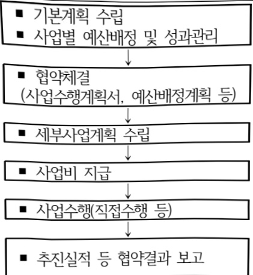

# 건전정보문화조성(정보화)

**해당 페이지**: PDF 664 ~ 673 쪽 해당

**부처**: 과학기술정보통신부
**분야**: 일반·지방행정
**회계유형**: 일반회계
**2026 확정예산**: 10157.0 백만원
**전년대비 증감률**: 142.2%
**AI 도메인**: 문화/콘텐츠

---

### 가. 예산 총괄표

(단위: 백만원, %)

<table border=1 style='margin: auto; word-wrap: break-word;'><tr><td rowspan="2">사업명</td><td rowspan="2">2024년 결산</td><td colspan="2">2025년 예산</td><td colspan="2">2026년 예산</td><td rowspan="2">중감(B-A)</td><td rowspan="2">(B-A)/A</td></tr><tr><td style='text-align: center; word-wrap: break-word;'>본예산</td><td style='text-align: center; word-wrap: break-word;'>추경*(A)</td><td style='text-align: center; word-wrap: break-word;'>요구안</td><td style='text-align: center; word-wrap: break-word;'>본예산(B)</td></tr><tr><td style='text-align: center; word-wrap: break-word;'>건전정보문화조성</td><td style='text-align: center; word-wrap: break-word;'>4,883</td><td style='text-align: center; word-wrap: break-word;'>4,194</td><td style='text-align: center; word-wrap: break-word;'>-</td><td style='text-align: center; word-wrap: break-word;'>10,157</td><td style='text-align: center; word-wrap: break-word;'>10,157</td><td style='text-align: center; word-wrap: break-word;'>5,963</td><td style='text-align: center; word-wrap: break-word;'>142.2</td></tr></table>

* 추경: 추경증감액을 포함한 최종 예산액을 기재

## □ 기능별(내역사업별) 예산 내역

(단위:백만원)

<table border=1 style='margin: auto; word-wrap: break-word;'><tr><td rowspan="2"></td><td colspan="5">2024</td><td colspan="5">2025</td><td rowspan="2">2026예산</td></tr><tr><td style='text-align: center; word-wrap: break-word;'>예산액(추경)</td><td style='text-align: center; word-wrap: break-word;'>예산현액</td><td style='text-align: center; word-wrap: break-word;'>집행액</td><td style='text-align: center; word-wrap: break-word;'>이월액</td><td style='text-align: center; word-wrap: break-word;'>불용액</td><td style='text-align: center; word-wrap: break-word;'>예산액(추경)</td><td style='text-align: center; word-wrap: break-word;'>예산현액</td><td style='text-align: center; word-wrap: break-word;'>집행액</td><td style='text-align: center; word-wrap: break-word;'>이월액</td><td style='text-align: center; word-wrap: break-word;'>불용액</td></tr><tr><td style='text-align: center; word-wrap: break-word;'>○ 기능별 분류(합계)</td><td style='text-align: center; word-wrap: break-word;'>4,883</td><td style='text-align: center; word-wrap: break-word;'>4,883</td><td style='text-align: center; word-wrap: break-word;'>4,883</td><td style='text-align: center; word-wrap: break-word;'>-</td><td style='text-align: center; word-wrap: break-word;'>-</td><td style='text-align: center; word-wrap: break-word;'>4,194</td><td style='text-align: center; word-wrap: break-word;'>4,194</td><td style='text-align: center; word-wrap: break-word;'>4,194</td><td style='text-align: center; word-wrap: break-word;'>-</td><td style='text-align: center; word-wrap: break-word;'>-</td><td style='text-align: center; word-wrap: break-word;'>4,194</td></tr><tr><td style='text-align: center; word-wrap: break-word;'>• 건전정보문화확산</td><td style='text-align: center; word-wrap: break-word;'>577</td><td style='text-align: center; word-wrap: break-word;'>577</td><td style='text-align: center; word-wrap: break-word;'>577</td><td style='text-align: center; word-wrap: break-word;'>-</td><td style='text-align: center; word-wrap: break-word;'>-</td><td style='text-align: center; word-wrap: break-word;'>327</td><td style='text-align: center; word-wrap: break-word;'>327</td><td style='text-align: center; word-wrap: break-word;'>327</td><td style='text-align: center; word-wrap: break-word;'>-</td><td style='text-align: center; word-wrap: break-word;'>-</td><td style='text-align: center; word-wrap: break-word;'>327</td></tr><tr><td style='text-align: center; word-wrap: break-word;'>• 인터넷·스마트폰과의존 예방·해소</td><td style='text-align: center; word-wrap: break-word;'>4,306</td><td style='text-align: center; word-wrap: break-word;'>4,306</td><td style='text-align: center; word-wrap: break-word;'>4,306</td><td style='text-align: center; word-wrap: break-word;'>-</td><td style='text-align: center; word-wrap: break-word;'>-</td><td style='text-align: center; word-wrap: break-word;'>3,867</td><td style='text-align: center; word-wrap: break-word;'>3,867</td><td style='text-align: center; word-wrap: break-word;'>3,867</td><td style='text-align: center; word-wrap: break-word;'>-</td><td style='text-align: center; word-wrap: break-word;'>-</td><td style='text-align: center; word-wrap: break-word;'>3,867</td></tr><tr><td style='text-align: center; word-wrap: break-word;'>• 디지털스트레스진단·대응</td><td style='text-align: center; word-wrap: break-word;'>-</td><td style='text-align: center; word-wrap: break-word;'>-</td><td style='text-align: center; word-wrap: break-word;'>-</td><td style='text-align: center; word-wrap: break-word;'>-</td><td style='text-align: center; word-wrap: break-word;'>-</td><td style='text-align: center; word-wrap: break-word;'>-</td><td style='text-align: center; word-wrap: break-word;'>-</td><td style='text-align: center; word-wrap: break-word;'>-</td><td style='text-align: center; word-wrap: break-word;'>-</td><td style='text-align: center; word-wrap: break-word;'>-</td><td style='text-align: center; word-wrap: break-word;'>1,000</td></tr><tr><td style='text-align: center; word-wrap: break-word;'>• AI억기능 대응실증·화산</td><td style='text-align: center; word-wrap: break-word;'>-</td><td style='text-align: center; word-wrap: break-word;'>-</td><td style='text-align: center; word-wrap: break-word;'>-</td><td style='text-align: center; word-wrap: break-word;'>-</td><td style='text-align: center; word-wrap: break-word;'>-</td><td style='text-align: center; word-wrap: break-word;'>-</td><td style='text-align: center; word-wrap: break-word;'>-</td><td style='text-align: center; word-wrap: break-word;'>-</td><td style='text-align: center; word-wrap: break-word;'>-</td><td style='text-align: center; word-wrap: break-word;'>-</td><td style='text-align: center; word-wrap: break-word;'>3,000</td></tr></table>

### 나. 사업설명자료

## 1 ) 사업목적·내용

(건전정보문화조성) 전 국민 대상 건전한 정보기술 이용 문화 조성을 위한 정보문화의 달 운영, 스마트폰 과의 존 예방·해소 등의 사업을 통해 AI·디지털 역기능에 대응하고 건강한 디지털 이용환경을 조성

- (건전정보문화확산) 전 국민 대상 디지털 포용 정책과 건전한 디지털 문화 확산을 위한 정보 문화의 달 및 기념식 운영, 유공자 포상 등

- (인터넷·스마트폰 과의존 예방·해소) 올바르고 건강한 지능정보서비스 이용을 위한 관계부처 합동 정책수립, 예방교육 및 전문상담 지원

- (디지털 스트레스 진단·대응) AI·디지털 일상화에 따른 국민의 연결되지 않을 권리

보장 등 접속 및 정보 과잉으로 인한 스트레스 진단·대응 필요

- (AI 역기능 대응 실증·확산) 국민의 삶과 밀접한 부문에서 발생할 수 있는 AI 역기능

선제적 대응을 위한 관련 기술 실증과 후속 과제 발굴 및 실증 결과물 확산

---

## 2 ) 사업개요

사업근거 및 추진경위

① 법령상 근거 및 조항 적시

0 지능정보화기본법 제12조(한국지능정보사회진흥원의 설립 등)

0 지능정보화기본법 제44조(정보문화의 창달과 확산)

0 지능정보화기본법 제51조(지능정보서비스 과의존의 예방 및 해소 계획 수립)

0 지능정보화기본법 제52조(지능정보서비스 과의존 대응센터)

0 지능정보화기본법 제53조(지능정보서비스 과의존 관련 전문인력 양성)

0 지능정보화기본법 제54조(지능정보서비스 과의존 관련 교육)

° 정보통신망법 제52조(한국인터넷진흥원의 설립 등)

° 정보통신망법 제4조(합성영상 등으로 인한 피해 예방의무)

② 추진경위 - 사업 시작년도, 추진배경, 부처별 중점과제, 대통령 공약사항 등

o 1988년 : 매년 6월을 '정보문화의 달'로 지정하여 전국적 실천운동 전개

2002년 : 인터넷중독 진단척도 개발, 인터넷중독예방상담센터 개소

2005년 : 사이버범죄 예방·교화를 위한 수강명령지원 신규 실시

o 2007년 : 정보문화포럼 발족

2009년 : 인터넷중독 가정방문상담 추진, 예방·상담 서비스(1599-0075) 개설

2014년 : 인터넷중독 전문상담사 민간자격제도 운영

o 2016년 : 민·관협력 '스마트쉽 문화운동본부' 발족

2017년 : 지능정보사회 윤리 가이드라인 마련

2018년 : '지능정보사회 윤리현장' 제정, 인터넷중독 예방교육 강화를 위한 국가

정보화기본법 및 시행령 개정

2019년 : 제4차 스마트폰·인터넷 과의 준 예방·해소 종합계획 수립, 디지털 역기능

예방·해소 범부처 대응체계 구성·운영, 제1회 한국코드페이 개최, 디지털

포용포럼 발족

2020년 : 디지털 역기능 대응 통합 안내 시스템 구축, 디지털사회혁신 지원센터 개소

2022년 : 제5차 스마트폰 과의존 예방 및 해소를 위한 기본계획 수립

2023년 : 관계부처 합동 스마트폰 과의존 예방 및 해소를 위한 추진계획 수립

0 2025년 : 제6차 지능정보서비스 과의존 예방·해소 기본계획 수립

o 2025년 : 국정과제 23번(국민의 안전과 보편적 삶의 질 제고를 위한 'AI 기본사회' 실현)

---

## 주요내용

① 사업규모

- 총사업비(해당되는 경우에만 기재) :

- 사업기간 : '02년 ~ 계속

- 최근 5년 간 투입된 사업비(예산액기준, 추경편성한 연도에는 추경포함)

<table border=1 style='margin: auto; word-wrap: break-word;'><tr><td style='text-align: center; word-wrap: break-word;'>$ \underline{\text{연도}} $</td><td style='text-align: center; word-wrap: break-word;'>2022</td><td style='text-align: center; word-wrap: break-word;'>2023</td><td style='text-align: center; word-wrap: break-word;'>2024</td><td style='text-align: center; word-wrap: break-word;'>2025</td><td style='text-align: center; word-wrap: break-word;'>2026</td></tr><tr><td style='text-align: center; word-wrap: break-word;'>$ \underline{\text{사업비}} $</td><td style='text-align: center; word-wrap: break-word;'>7,847</td><td style='text-align: center; word-wrap: break-word;'>6,380</td><td style='text-align: center; word-wrap: break-word;'>4,883</td><td style='text-align: center; word-wrap: break-word;'>4,194</td><td style='text-align: center; word-wrap: break-word;'>10,157</td></tr></table>

- 기타: 해당없음

② 사업추진체계

- 사업시행방법 : 출연

- 사업시행주체 : 한국지능정보사회진흥원, 한국인터넷진흥원

- 사업 수혜자 : 전 국민

- 보조, 융자, 출연, 출자 등의 경우 보조·융자 등 지원 비율 및 법적근거

<table border=1 style='margin: auto; word-wrap: break-word;'><tr><td style='text-align: center; word-wrap: break-word;'>내역사업명</td><td style='text-align: center; word-wrap: break-word;'>구분</td><td style='text-align: center; word-wrap: break-word;'>피보조·피출연 등 기관명</td><td style='text-align: center; word-wrap: break-word;'>지원 금액 (2026예산)</td><td style='text-align: center; word-wrap: break-word;'>지원 비율(%)</td><td style='text-align: center; word-wrap: break-word;'>보조율 법적근거 (해당 조항)</td></tr><tr><td style='text-align: center; word-wrap: break-word;'>건전정보 문화확산</td><td style='text-align: center; word-wrap: break-word;'>출연</td><td style='text-align: center; word-wrap: break-word;'>한국지능 정보사회 진흥원</td><td style='text-align: center; word-wrap: break-word;'>256</td><td style='text-align: center; word-wrap: break-word;'>100%</td><td style='text-align: center; word-wrap: break-word;'>지능정보화기본법 제12조(한국지능정보사회 진흥원의 설립)</td></tr><tr><td style='text-align: center; word-wrap: break-word;'>인터넷·스마트폰 과의존 예방·해소</td><td style='text-align: center; word-wrap: break-word;'>출연</td><td style='text-align: center; word-wrap: break-word;'>한국지능 정보사회 진흥원</td><td style='text-align: center; word-wrap: break-word;'>5,901</td><td style='text-align: center; word-wrap: break-word;'>100%</td><td style='text-align: center; word-wrap: break-word;'>지능정보화기본법 제12조(한국지능정보사회 진흥원의 설립)</td></tr><tr><td style='text-align: center; word-wrap: break-word;'>디지털스트레스진단·대응</td><td style='text-align: center; word-wrap: break-word;'>출연</td><td style='text-align: center; word-wrap: break-word;'>한국지능 정보사회 진흥원</td><td style='text-align: center; word-wrap: break-word;'>1,000</td><td style='text-align: center; word-wrap: break-word;'>100%</td><td style='text-align: center; word-wrap: break-word;'>지능정보화기본법 제12조(한국지능정보사회 진흥원의 설립)</td></tr><tr><td style='text-align: center; word-wrap: break-word;'>AI역기능 대응 실증 확산</td><td style='text-align: center; word-wrap: break-word;'>출연</td><td style='text-align: center; word-wrap: break-word;'>한국인터넷진흥원</td><td style='text-align: center; word-wrap: break-word;'>3,000</td><td style='text-align: center; word-wrap: break-word;'>100%</td><td style='text-align: center; word-wrap: break-word;'>정보통신망법 제52조(한국인터넷진흥원의 설립)</td></tr></table>

---

## 3 ) 2026년도 예산 산출 근거

□ 건전정보문화조성 : (2025 본예산) 4,194백만원 → (2026 예산) 10,157백만원, 5,963백만원 증액
① 건전정보문화확산: (2025 본예산) 327백만원 → (2026 예산) 256백만원, △71백만원
- (요구) 정보문화의 달(6월) 지속 운영, 정보문화 정책 연구기능 이관 등 '25년 대비 71백만원 감액
※ 정보문화 연구 및 정책지원(71백만원) 폐지
- (산출) 256백만원 (△71백만원)
  · (정보문화의달 운영) 256백만원 = 1식 × 256백만원
② 인터넷·스마트폰 과의존 예방·해소: (2025 본예산) 3,867백만원 → (2026 예산) 5,901백만원, 2,034백만원 증액
- (요구) 전국 어린이집, 유치원, 초·중·고, 대학 등의 디지털 과의존 예방교육 및 상담 등을 통한 역기능 대응 지원체계 강화 등을 위해 '25년 대비 2,034백만원(+52.6%) 증액을 요구
※ (스마트폰 과의존 전문인력 양성) 지원자 지속 감소로 인한 종료(△33백만원, 종료)
※ (스마트쉼 문화운동) 유아동·청소년 의무 예방교육 확대를 위한 예산 감축(△113백만원, 종료)
- (산출) 5,901백만원 (+2,034백만원)
  · (과의존 예방교육, 전문상담) 31,500개소 × 0.016백만원 = 504백만원
  * (과의존 예방교육 확대) ('25년) 20,250개소 → ('26요구) 31,500개소
  · (스마트쉼센터 상담사 인건비) 56명(무기계약직) × 53.6백만원 = 3,001백만원
  · (스마트폰 과의존 실태조사 등 정책지원) 1식 × 396백만원 = 396백만원
  · (신규 디지털 디톡스 캠프) 18개 × 8회 × 14백만원 (2,000백만원 순증) = 2,000백만원
③ 신규 디지털 스트레스 진단·대응 : (2026년 예산) 1,000백만원, 순증
- (요구) AI·디지털 일상화에 따른 국민의 접속 및 정보 과잉으로 인한 스트레스 진단·대응 필요
- (산출) 1,000백만원 (순증)
  · 기초연구 및 자가진단 척도 개발 : 1식 × 100백만원 = 100백만원
  · 자가진단 도구 및 관리시스템 개발 : 1식 × 900백만원 = 900백만원
④ 신규 AI 역기능 대응 실증·확산 : (2026년 예산) 3,000백만원, 순증
- (요구) AI역기능 선제적 대응을 위한 실환경 기반의 기술실증, 유관기관간 협의체 운영 등을 통한 국민
  체감형 서비스 실증 및 지속적인 과제 기획 등을 위한 신규예산 요구(신규)
- (산출) 3,000백만원 (순증)
  · AI역기능 대응 기술실증 : 1식 × 3,000백만원 = 3,000백만원

---

## 4 ) 사업효과

☐ 사업영향, 산출물 성과지표 등

① 2022~2026년도 성과계획서 상 성과지표 및 최근 5년간 성과 달성도

<table border=1 style='margin: auto; word-wrap: break-word;'><tr><td style='text-align: center; word-wrap: break-word;'>성과지표</td><td style='text-align: center; word-wrap: break-word;'>구분</td><td style='text-align: center; word-wrap: break-word;'>2022</td><td style='text-align: center; word-wrap: break-word;'>2023</td><td style='text-align: center; word-wrap: break-word;'>2024</td><td style='text-align: center; word-wrap: break-word;'>2025</td><td style='text-align: center; word-wrap: break-word;'>2026</td><td style='text-align: center; word-wrap: break-word;'>2026 목표치산출근거</td><td style='text-align: center; word-wrap: break-word;'>측정산식(또는 측정방법)</td><td style='text-align: center; word-wrap: break-word;'>자료수집방법(또는 자료출처)</td></tr><tr><td rowspan="3">스마트폰과의존예방교육유용도(단위:%)</td><td style='text-align: center; word-wrap: break-word;'>목표</td><td style='text-align: center; word-wrap: break-word;'>71.2</td><td style='text-align: center; word-wrap: break-word;'>71.4</td><td style='text-align: center; word-wrap: break-word;'>72.4</td><td style='text-align: center; word-wrap: break-word;'>72.9</td><td style='text-align: center; word-wrap: break-word;'>73.4</td><td rowspan="3">지난 4개년 실적치의 평균 증가율(0.47%p)을 고려하여 전년도 목표대비 0.5%p 상향설정</td><td rowspan="3">스마트폰 과의존예방교육 유용도 = (예방교육이 스마트폰 바른사용에 도움이 된 이용지수/예방교육수혜자수x100)</td><td rowspan="3">스마트폰 과의존실태조사 결과보고서(국가승인통계제120019호)</td></tr><tr><td style='text-align: center; word-wrap: break-word;'>실적</td><td style='text-align: center; word-wrap: break-word;'>71.6</td><td style='text-align: center; word-wrap: break-word;'>71.9</td><td style='text-align: center; word-wrap: break-word;'>72.4</td><td style='text-align: center; word-wrap: break-word;'>73.0</td><td style='text-align: center; word-wrap: break-word;'>-</td></tr><tr><td style='text-align: center; word-wrap: break-word;'>달성도</td><td style='text-align: center; word-wrap: break-word;'>101</td><td style='text-align: center; word-wrap: break-word;'>101</td><td style='text-align: center; word-wrap: break-word;'>100</td><td style='text-align: center; word-wrap: break-word;'>100</td><td style='text-align: center; word-wrap: break-word;'>-</td></tr><tr><td rowspan="3">AI 역기능 대응실증기술 활용도(단위:%)</td><td style='text-align: center; word-wrap: break-word;'>목표</td><td style='text-align: center; word-wrap: break-word;'>-</td><td style='text-align: center; word-wrap: break-word;'>-</td><td style='text-align: center; word-wrap: break-word;'>-</td><td style='text-align: center; word-wrap: break-word;'>신규</td><td style='text-align: center; word-wrap: break-word;'>90</td><td rowspan="3">①‘만족(80점 이상)’ 등급을 목표치를 설정 ②기술(API) 공개(목표 3건)</td><td rowspan="3">① 실증새닉스이용자 만족도×0.5+② 기술 공개율×0.5</td><td rowspan="3">설문조사 결과, 사업 완료보고서, API 가이드라인 등</td></tr><tr><td style='text-align: center; word-wrap: break-word;'>실적</td><td style='text-align: center; word-wrap: break-word;'>-</td><td style='text-align: center; word-wrap: break-word;'>-</td><td style='text-align: center; word-wrap: break-word;'>-</td><td style='text-align: center; word-wrap: break-word;'>-</td><td style='text-align: center; word-wrap: break-word;'>-</td></tr><tr><td style='text-align: center; word-wrap: break-word;'>달성도</td><td style='text-align: center; word-wrap: break-word;'>-</td><td style='text-align: center; word-wrap: break-word;'>-</td><td style='text-align: center; word-wrap: break-word;'>-</td><td style='text-align: center; word-wrap: break-word;'>-</td><td style='text-align: center; word-wrap: break-word;'>-</td></tr></table>

② 성과지표 이외의 연도별 사업추진 경과 및 실적

<table border=1 style='margin: auto; word-wrap: break-word;'><tr><td style='text-align: center; word-wrap: break-word;'>2022</td><td style='text-align: center; word-wrap: break-word;'>o (건전정보문화확산) - 디지털 기술 활용 및 시민 참여를 바탕으로 사회현안을 해결하기 위한 프로젝트 과제 공모(3개) - 제35회 정보문화의 달 기념식 개최(6.28, 서울 노들섬) o (인터넷·스마트폰 과의존 예방·해소) - 관계부처 합동 제5차 스마트폰 과의존 예방·해소 기본계획(&#x27;22~&#x27;24) 수립 - 전국 스마트섬센터 기반 스마트폰 과의존 예방교육(78만명), 전문상담(5.7만건) 지원</td></tr><tr><td style='text-align: center; word-wrap: break-word;'>2023</td><td style='text-align: center; word-wrap: break-word;'>o (건전정보문화확산) - 디지털 기술 활용 및 시민 참여를 바탕으로 사회현안을 해결하기 위한 프로젝트 과제 공모(4개) - 제36회 정보문화의 달 기념식 개최(6.15, 상암 누리꿈스퀘어) o (인터넷·스마트폰 과의존 예방·해소) - 관계부처 합동 2023년 스마트폰 과의존 예방·해소 추진계획 수립 - 전국 스마트섬센터 기반 스마트폰 과의존 예방교육(80만명), 전문상담(5.8만건) 지원</td></tr><tr><td style='text-align: center; word-wrap: break-word;'>2024</td><td style='text-align: center; word-wrap: break-word;'>o (건전정보문화확산) - 디지털 기술 활용 및 시민 참여를 바탕으로 사회현안을 해결하기 위한 프로젝트 과제 공모(3개) - 제37회 정보문화의 달 기념식 개최(6.19, 에스플렉스센터) o (인터넷·스마트폰 과의존 예방·해소) - 관계부처 합동 2024년 스마트폰 과의존 예방·해소 추진계획 수립 - 전국 스마트섬센터 기반 스마트폰 과의존 예방교육(66.4만명), 전문상담(5.6만건) 지원</td></tr><tr><td style='text-align: center; word-wrap: break-word;'>2025</td><td style='text-align: center; word-wrap: break-word;'>o (건전정보문화확산) - 제38회 정보문화의 달 기념식 개최(6.18, 상암 중소기업DMCE타위) 및 유공자 포상 실시 o (인터넷·스마트폰 과의존 예방·해소) - 관계부처 합동 제6차 지능정보서비스 과의존 예방·해소 기본계획 수립 - 전국 스마트섬센터 기반 스마트폰 과의존 예방교육 및 전문상담 추진</td></tr></table>

---

③ 향후(2026년도 이후) 기대효과 :

(건전정보문화확산) 디지털 포용성과를 시민과 공유하는 참여형 정보문화의 달(6월) 기념식 운영 및 정보문화 유공자 포상 등을 통해 지속적인 건전한 디지털 문화 조성 추진

o (인터넷·스마트폰 과의 존 예방·해소) 생애주기별 맞춤형 예방교육(총 36만명), 전문상담,

민·관 협력을 통한 인식제고 활동 등으로 국민의 스마트폰 바른사용 역량 강화

0 (디지털 스트레스 진단·대응) 디지털 스트레스에 대한 정의를 기반으로 정보·접속

과잉으로 인한 디지털 스트레스 진단·해소 추진

°(AI 역기능 대응 실증·확산) 실환경 기반의 실증을 통한 대국민 인식제고 및 관련 기술 고도화를 통한 기술 경쟁력 강화 및 국민 체감형 후속과제 발굴 등

5) 타당성조사 및 예비타당성조사 시행여부 및 결과 요지 : 해당없음

6) 총사업비 대상사업 정보 : 해당없음

---

## 7 ) 사업 집행절차

· 과학기술정보통신부

0 과학기술정보통신부 ↔ 한국지능정보사회진흥원 한국인터넷진흥원

0 한국지능정보사회진흥원, 한국인터넷진흥원

o 과학기술정보통신부

0 한국지능정보사회진흥원, 한국인터넷진흥원

0 한국지능정보사회진흥원 ↔ 과학기술정보통신부 한국인터넷진흥원

## <건전정보문화확산>

<table border=1 style='margin: auto; word-wrap: break-word;'><tr><td style='text-align: center; word-wrap: break-word;'>부처</td><td style='text-align: center; word-wrap: break-word;'>교부</td><td style='text-align: center; word-wrap: break-word;'>피출연·피보조 기관</td><td style='text-align: center; word-wrap: break-word;'>교부</td><td style='text-align: center; word-wrap: break-word;'>간접보조사엄자·사업수행자</td></tr><tr><td style='text-align: center; word-wrap: break-word;'>과학기술정보통신부 (256백만원)</td><td style='text-align: center; word-wrap: break-word;'>=&gt; (256백만원)</td><td style='text-align: center; word-wrap: break-word;'>한국지능정보사회진흥원 (100백만원)</td><td style='text-align: center; word-wrap: break-word;'>=&gt; (156백만원)</td><td style='text-align: center; word-wrap: break-word;'>사업수행자</td></tr></table>

<인터넷·스마트폰 과의존 예방·해소>

<table border=1 style='margin: auto; word-wrap: break-word;'><tr><td style='text-align: center; word-wrap: break-word;'>부처</td><td style='text-align: center; word-wrap: break-word;'>교부</td><td style='text-align: center; word-wrap: break-word;'>피출연·피보조 기관</td><td style='text-align: center; word-wrap: break-word;'>교부</td><td style='text-align: center; word-wrap: break-word;'>간접보조사업자 사업수행자</td></tr><tr><td style='text-align: center; word-wrap: break-word;'>과학기술정보통신부 (5,901백만원)</td><td style='text-align: center; word-wrap: break-word;'>=&gt; (5,901백만원)</td><td style='text-align: center; word-wrap: break-word;'>한국지능정보사회진흥원 (3,457백만원)* * 인건비 3,001백만원 포함</td><td style='text-align: center; word-wrap: break-word;'>=&gt; (2,444백만원)</td><td style='text-align: center; word-wrap: break-word;'>사업수행자</td></tr></table>

## <디지털 스트레스 진단·대응>

<table border=1 style='margin: auto; word-wrap: break-word;'><tr><td style='text-align: center; word-wrap: break-word;'>$ \underset{\cdot}{ப} $ ற $ \underset{\cdot}{ச} $ி</td><td style='text-align: center; word-wrap: break-word;'>$ \underset{\cdot}{亚} $ 艹</td><td style='text-align: center; word-wrap: break-word;'>$ \underset{\cdot}{ப} $ ழ $ \underset{\cdot}{査} $ ன $ \underset{\cdot}{.} $ ழ $ \underset{\cdot}{ப} $ ழ ஃ $ \underset{\cdot}{ட} $ ஃ ஞ $ \underset{\cdot}{ப} $ ல</td><td style='text-align: center; word-wrap: break-word;'>$ \underset{\cdot}{ப} $ ழ $ \underset{\cdot}{ப} $ ழ</td><td style='text-align: center; word-wrap: break-word;'>$ \underset{\cdot}{ந} $ ன $ \underset{\cdot}{ி} $ யு $ \underset{\cdot}{க} $ ல ய $ \underset{\cdot}{ன} $ ய $ \underset{\cdot}{ட} $ ய $ \underset{\cdot}{ன} $ ய</td></tr><tr><td style='text-align: center; word-wrap: break-word;'>$ \underset{\cdot}{ப} $ ழ $ \underset{\cdot}{ா} $ ழ ஞ $ \underset{\cdot}{க} $ ழ ஞ $ \underset{\cdot}{ம} $ ழ ஞ $ \underset{\cdot</td><td style='text-align: center; word-wrap: break-word;'></td><td style='text-align: center; word-wrap: break-word;'></td><td style='text-align: center; word-wrap: break-word;'></td><td style='text-align: center; word-wrap: break-word;'></td></tr></table>

## <AI역기능 대응 실증·확산>

<table border=1 style='margin: auto; word-wrap: break-word;'><tr><td style='text-align: center; word-wrap: break-word;'>부처</td><td style='text-align: center; word-wrap: break-word;'>교부</td><td style='text-align: center; word-wrap: break-word;'>피출연·피보조 기관</td><td style='text-align: center; word-wrap: break-word;'>교부</td><td style='text-align: center; word-wrap: break-word;'>간접보조사업자·사업수행자</td></tr><tr><td style='text-align: center; word-wrap: break-word;'>과학기술정보통신부(3,000백만원)</td><td style='text-align: center; word-wrap: break-word;'>=&gt;(3,000백만원)</td><td style='text-align: center; word-wrap: break-word;'>한국인터넷진흥원(300백만원)</td><td style='text-align: center; word-wrap: break-word;'>=&gt;(2,700백만원)</td><td style='text-align: center; word-wrap: break-word;'>AI역기능 대응기술실증지원기업 등용역 사업자</td></tr></table>

---

## 8 ) 각종 평가

<table border=1 style='margin: auto; word-wrap: break-word;'><tr><td colspan="2">1) 국회(예결위, 상임위, 예정처, 국정감사 포함) 지적</td></tr><tr><td style='text-align: center; word-wrap: break-word;'>2024회계연도 결산 (2025)</td><td style='text-align: center; word-wrap: break-word;'>○ 지능정보서비스 과의존 관련 교육을 실시하지 않는 기관이 어린이집을 중심으로 매년 2,000개 이상 집계되고 있고, 대학교의 실적 인정률이 낮게 집계되고 있으므로 이에 대한 개선방안을 마련할 것(예결위,24예산)</td></tr><tr><td colspan="2">2) 대외공개 평가 3) 자체평가</td></tr><tr><td style='text-align: center; word-wrap: break-word;'>재정사업 자율평가 (&#x27;23.4)</td><td style='text-align: center; word-wrap: break-word;'>○ (최종의견 및 점수) 미흡 / 76점○ (주요결과) 스마트폰 과의존 예방교육 유용도 외에 성과지표 추가 개발을 권고※ 미흡사유: 건전정보문화조성(세부사업)의 단년도 내역사업인 정보통신상징조형물설치의 ‘서울시 광화문 정비 계획’ 변경에 따른 철거대상 조형물 철거 연기로 인해 집행을 저하</td></tr><tr><td style='text-align: center; word-wrap: break-word;'>재정사업 자율평가 (&#x27;24.4)</td><td style='text-align: center; word-wrap: break-word;'>○ (최종의견 및 점수) 우수 / 92.7점○ (주요결과) 지역사회 디지털 역기능 해소를 위한 공헌기관 표창 수상 등 사업성과 우수</td></tr><tr><td style='text-align: center; word-wrap: break-word;'>재정사업 자율평가 (&#x27;25.4)</td><td style='text-align: center; word-wrap: break-word;'>○ (최종의견 및 점수) 보통 / 80.5점○ (주요결과) 정부 포상과 기념일이 지정된 사업으로 장기적 운영이 필요하며, 사업 내용이 반복되거나 획일화 될 수 있는 한계를 보완하기 위해 다양한 시민 계층의 참여 유도 및 교육 프로그램의 시의적절성에 대한 지속적인 연구가 요구됨.</td></tr></table>

---

### 다. 최근 4년간 결산내역

## 1 ) 결산표

☐ 부처 결산내역

(단위: 백만원, %)

<table border=1 style='margin: auto; word-wrap: break-word;'><tr><td rowspan="2">연도</td><td colspan="3">예산액</td><td rowspan="2">예산현액(A)</td><td rowspan="2">집행액(B)</td><td rowspan="2">집행률(B/A)</td><td rowspan="2">다음연도이월액</td><td rowspan="2">불용액</td></tr><tr><td style='text-align: center; word-wrap: break-word;'>본예산</td><td style='text-align: center; word-wrap: break-word;'>추경증감액</td><td style='text-align: center; word-wrap: break-word;'>추경</td></tr><tr><td style='text-align: center; word-wrap: break-word;'>2022</td><td style='text-align: center; word-wrap: break-word;'>7,847</td><td style='text-align: center; word-wrap: break-word;'></td><td style='text-align: center; word-wrap: break-word;'>7,847</td><td style='text-align: center; word-wrap: break-word;'>7,847</td><td style='text-align: center; word-wrap: break-word;'>7,847</td><td style='text-align: center; word-wrap: break-word;'>100</td><td style='text-align: center; word-wrap: break-word;'>-</td><td style='text-align: center; word-wrap: break-word;'>-</td></tr><tr><td style='text-align: center; word-wrap: break-word;'>2023</td><td style='text-align: center; word-wrap: break-word;'>6,380</td><td style='text-align: center; word-wrap: break-word;'></td><td style='text-align: center; word-wrap: break-word;'>6,380</td><td style='text-align: center; word-wrap: break-word;'>6,380</td><td style='text-align: center; word-wrap: break-word;'>6,380</td><td style='text-align: center; word-wrap: break-word;'>100</td><td style='text-align: center; word-wrap: break-word;'>-</td><td style='text-align: center; word-wrap: break-word;'>-</td></tr><tr><td style='text-align: center; word-wrap: break-word;'>2024</td><td style='text-align: center; word-wrap: break-word;'>4,883</td><td style='text-align: center; word-wrap: break-word;'></td><td style='text-align: center; word-wrap: break-word;'>4,883</td><td style='text-align: center; word-wrap: break-word;'>4,883</td><td style='text-align: center; word-wrap: break-word;'>4,883</td><td style='text-align: center; word-wrap: break-word;'>100</td><td style='text-align: center; word-wrap: break-word;'>-</td><td style='text-align: center; word-wrap: break-word;'>-</td></tr><tr><td style='text-align: center; word-wrap: break-word;'>2025</td><td style='text-align: center; word-wrap: break-word;'>4,194</td><td style='text-align: center; word-wrap: break-word;'></td><td style='text-align: center; word-wrap: break-word;'>4,194</td><td style='text-align: center; word-wrap: break-word;'>4,194</td><td style='text-align: center; word-wrap: break-word;'>4,194</td><td style='text-align: center; word-wrap: break-word;'>100</td><td style='text-align: center; word-wrap: break-word;'>-</td><td style='text-align: center; word-wrap: break-word;'>-</td></tr></table>

## 2 ) 주요 결산사항

□ 2022~2025년 결산 주요사항

<table border=1 style='margin: auto; word-wrap: break-word;'><tr><td style='text-align: center; word-wrap: break-word;'>2022</td><td style='text-align: center; word-wrap: break-word;'>- 불용 사유(집행부진사유) : ‘서울시 세종로공원 종합정비 기본계획(‘25년’ 연장으로 기존 기념탑 철거 불투명에 따른 조형물 관할 지자체(서울시)의 사업종료 의견 반영</td></tr><tr><td style='text-align: center; word-wrap: break-word;'>2023</td><td style='text-align: center; word-wrap: break-word;'>- 해당없음</td></tr><tr><td style='text-align: center; word-wrap: break-word;'>2024</td><td style='text-align: center; word-wrap: break-word;'>- 해당없음</td></tr><tr><td style='text-align: center; word-wrap: break-word;'>2025</td><td style='text-align: center; word-wrap: break-word;'>- 해당없음</td></tr></table>

□ 2025년 이·전용 등 세부내역 : 해당없음

---

<table border=1 style='margin: auto; word-wrap: break-word;'><tr><td style='text-align: center; word-wrap: break-word;'>사 업 명</td></tr><tr><td style='text-align: center; word-wrap: break-word;'>(308) 경량·저전력AI한계극복기술개발 (2601-393)</td></tr></table>

## □ 사업 코드 정보

<table border=1 style='margin: auto; word-wrap: break-word;'><tr><td style='text-align: center; word-wrap: break-word;'>구분</td><td style='text-align: center; word-wrap: break-word;'>회계</td><td style='text-align: center; word-wrap: break-word;'>소관</td><td style='text-align: center; word-wrap: break-word;'>실국(기관)</td><td style='text-align: center; word-wrap: break-word;'>계정</td><td style='text-align: center; word-wrap: break-word;'>분야</td><td style='text-align: center; word-wrap: break-word;'>부문</td></tr><tr><td style='text-align: center; word-wrap: break-word;'>코드</td><td rowspan="2">일반회계</td><td rowspan="2">과학기술정보통신부</td><td rowspan="2">인공지능기반정책관</td><td rowspan="2">-</td><td style='text-align: center; word-wrap: break-word;'>130</td><td style='text-align: center; word-wrap: break-word;'>133</td></tr><tr><td style='text-align: center; word-wrap: break-word;'>명칭</td><td style='text-align: center; word-wrap: break-word;'>통신</td><td style='text-align: center; word-wrap: break-word;'>정보통신</td></tr></table>

<table border=1 style='margin: auto; word-wrap: break-word;'><tr><td style='text-align: center; word-wrap: break-word;'>구분</td><td style='text-align: center; word-wrap: break-word;'>프로그램</td><td style='text-align: center; word-wrap: break-word;'>단위사업</td><td style='text-align: center; word-wrap: break-word;'>세부사업</td></tr><tr><td style='text-align: center; word-wrap: break-word;'>코드</td><td style='text-align: center; word-wrap: break-word;'>2600</td><td style='text-align: center; word-wrap: break-word;'>2601</td><td style='text-align: center; word-wrap: break-word;'>393</td></tr><tr><td style='text-align: center; word-wrap: break-word;'>명칭</td><td style='text-align: center; word-wrap: break-word;'>인공지능데이터진흥</td><td style='text-align: center; word-wrap: break-word;'>AI기술개발(일반)</td><td style='text-align: center; word-wrap: break-word;'>경량·저전력AI한계극복기술개발(R&amp;D)</td></tr></table>

□ 사업 성격 (공통요구자료 Ⅱ-1 작성유의사항 4. 참조, 해당하는 사항에 “○” 표시)

<table border=1 style='margin: auto; word-wrap: break-word;'><tr><td style='text-align: center; word-wrap: break-word;'>신규</td><td style='text-align: center; word-wrap: break-word;'>계속</td><td style='text-align: center; word-wrap: break-word;'>완료</td><td style='text-align: center; word-wrap: break-word;'>예비타당성 실시여부</td><td style='text-align: center; word-wrap: break-word;'>총사업비 관리대상</td><td style='text-align: center; word-wrap: break-word;'>총액계상 예산사업</td><td style='text-align: center; word-wrap: break-word;'>사업소관 변경정보 2025예산 시 소관</td></tr><tr><td style='text-align: center; word-wrap: break-word;'>O</td><td style='text-align: center; word-wrap: break-word;'></td><td style='text-align: center; word-wrap: break-word;'></td><td style='text-align: center; word-wrap: break-word;'></td><td style='text-align: center; word-wrap: break-word;'></td><td style='text-align: center; word-wrap: break-word;'></td><td style='text-align: center; word-wrap: break-word;'></td></tr></table>

□ 사업 지원 형태 및 지원을 (최소한 한 개는 반드시 선택하시오. 해당사항에 0 표시)

<table border=1 style='margin: auto; word-wrap: break-word;'><tr><td style='text-align: center; word-wrap: break-word;'>직접</td><td style='text-align: center; word-wrap: break-word;'>출자</td><td style='text-align: center; word-wrap: break-word;'>출연</td><td style='text-align: center; word-wrap: break-word;'>보조</td><td style='text-align: center; word-wrap: break-word;'>융자</td><td style='text-align: center; word-wrap: break-word;'>국고보조율(%)</td><td style='text-align: center; word-wrap: break-word;'>융자율(%)</td></tr><tr><td style='text-align: center; word-wrap: break-word;'></td><td style='text-align: center; word-wrap: break-word;'></td><td style='text-align: center; word-wrap: break-word;'>O</td><td style='text-align: center; word-wrap: break-word;'></td><td style='text-align: center; word-wrap: break-word;'></td><td style='text-align: center; word-wrap: break-word;'></td><td style='text-align: center; word-wrap: break-word;'></td></tr></table>

## □ 사업 담당자

<table border=1 style='margin: auto; word-wrap: break-word;'><tr><td style='text-align: center; word-wrap: break-word;'>사업명</td><td colspan="2">구분</td></tr><tr><td rowspan="2">경량·저전력 AI한계극복 기술개발</td><td style='text-align: center; word-wrap: break-word;'>소관부처</td><td style='text-align: center; word-wrap: break-word;'>인공지능정책실 인공지능정책기획관 디지털인재양성과</td></tr><tr><td style='text-align: center; word-wrap: break-word;'>사연시해주체</td><td style='text-align: center; word-wrap: break-word;'>정보통신기획평가원</td></tr></table>

---

### 원본 PDF 크롭 이미지

