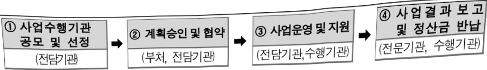

# 경쟁형 AI혁신인재 성장 지원

**해당 페이지**: PDF 680 ~ 685 쪽 해당

**부처**: 과학기술정보통신부
**분야**: 통신
**회계유형**: 일반회계
**2026 확정예산**: 13000.0 백만원
**전년대비 증감률**: None%
**AI 도메인**: 교육/인재, 디지털전환(AX)

---

<table border=1 style='margin: auto; word-wrap: break-word;'><tr><td style='text-align: center; word-wrap: break-word;'>사 업 명</td></tr><tr><td style='text-align: center; word-wrap: break-word;'>(220) 경쟁형 AI 혁신인재 성장 지원 (2232-331)</td></tr></table>

사업 코드 정보

<table border=1 style='margin: auto; word-wrap: break-word;'><tr><td style='text-align: center; word-wrap: break-word;'>구분</td><td style='text-align: center; word-wrap: break-word;'>회계</td><td style='text-align: center; word-wrap: break-word;'>소관</td><td style='text-align: center; word-wrap: break-word;'>실국(기관)</td><td style='text-align: center; word-wrap: break-word;'>계정</td><td style='text-align: center; word-wrap: break-word;'>분야</td><td style='text-align: center; word-wrap: break-word;'>부문</td></tr><tr><td style='text-align: center; word-wrap: break-word;'>코드 명칭</td><td style='text-align: center; word-wrap: break-word;'>일반회계</td><td style='text-align: center; word-wrap: break-word;'>과학기술정보통신부</td><td style='text-align: center; word-wrap: break-word;'>정보통신정책실소프트웨어정책관</td><td style='text-align: center; word-wrap: break-word;'>-</td><td style='text-align: center; word-wrap: break-word;'>130통신</td><td style='text-align: center; word-wrap: break-word;'>133정보통신</td></tr></table>

<table border=1 style='margin: auto; word-wrap: break-word;'><tr><td style='text-align: center; word-wrap: break-word;'>구분</td><td style='text-align: center; word-wrap: break-word;'>프로그램</td><td style='text-align: center; word-wrap: break-word;'>단위사업</td><td style='text-align: center; word-wrap: break-word;'>세부사업</td></tr><tr><td style='text-align: center; word-wrap: break-word;'>코드</td><td style='text-align: center; word-wrap: break-word;'>2200</td><td style='text-align: center; word-wrap: break-word;'>2232</td><td style='text-align: center; word-wrap: break-word;'>331</td></tr><tr><td style='text-align: center; word-wrap: break-word;'>명칭</td><td style='text-align: center; word-wrap: break-word;'>SW산업진흥</td><td style='text-align: center; word-wrap: break-word;'>SW융합인력양성</td><td style='text-align: center; word-wrap: break-word;'>경쟁형 AI 혁신인재 성장 지원</td></tr></table>

□ 사업 성격 (공통요구자료 Ⅱ-1 작성유의사항 4. 참조, 해당하는 사항에 “○” 표시)

<table border=1 style='margin: auto; word-wrap: break-word;'><tr><td rowspan="2">신규 계속</td><td rowspan="2">완료</td><td rowspan="2">예비타당성 실시여부</td><td rowspan="2">총사업비 관리대상</td><td rowspan="2">총액계상 예산사업</td><td style='text-align: center; word-wrap: break-word;'>사업소관 변경정보</td></tr><tr><td style='text-align: center; word-wrap: break-word;'>2025예산 시 소관</td></tr><tr><td style='text-align: center; word-wrap: break-word;'>☐</td><td style='text-align: center; word-wrap: break-word;'></td><td style='text-align: center; word-wrap: break-word;'></td><td style='text-align: center; word-wrap: break-word;'></td><td style='text-align: center; word-wrap: break-word;'></td><td style='text-align: center; word-wrap: break-word;'></td></tr></table>

사업 지원 형태 및 지원을 (최소한 한 개는 반드시 선택하시오. 해당사항에 O 표시)

<table border=1 style='margin: auto; word-wrap: break-word;'><tr><td style='text-align: center; word-wrap: break-word;'>직접</td><td style='text-align: center; word-wrap: break-word;'>출자</td><td style='text-align: center; word-wrap: break-word;'>출연</td><td style='text-align: center; word-wrap: break-word;'>보조</td><td style='text-align: center; word-wrap: break-word;'>융자</td><td style='text-align: center; word-wrap: break-word;'>국고보조율(%)</td><td style='text-align: center; word-wrap: break-word;'>융자율(%)</td></tr><tr><td style='text-align: center; word-wrap: break-word;'></td><td style='text-align: center; word-wrap: break-word;'></td><td style='text-align: center; word-wrap: break-word;'>0</td><td style='text-align: center; word-wrap: break-word;'></td><td style='text-align: center; word-wrap: break-word;'></td><td style='text-align: center; word-wrap: break-word;'></td><td style='text-align: center; word-wrap: break-word;'></td></tr></table>

## □ 사업 소관부처 및 시행주체

<table border=1 style='margin: auto; word-wrap: break-word;'><tr><td style='text-align: center; word-wrap: break-word;'>사업명</td><td colspan="2">구분</td></tr><tr><td rowspan="3">경쟁형 AI 혁신인재 성장 지원</td><td rowspan="2">소관부처</td><td style='text-align: center; word-wrap: break-word;'>정보통신정책실 소프트웨어정책관</td></tr><tr><td style='text-align: center; word-wrap: break-word;'>소프트웨어기반조성팀</td></tr><tr><td style='text-align: center; word-wrap: break-word;'>사업시행주체</td><td style='text-align: center; word-wrap: break-word;'>정보통신산업진흥원</td></tr></table>

---

### 가. 예산 총괄표

(단위: 백만원, %)

<table border=1 style='margin: auto; word-wrap: break-word;'><tr><td rowspan="2">사업명</td><td rowspan="2">2024년 결산</td><td colspan="2">2025년 예산</td><td colspan="2">2026년 예산</td><td rowspan="2">중감(B-A)</td><td rowspan="2">(B-A)/A</td></tr><tr><td style='text-align: center; word-wrap: break-word;'>본예산</td><td style='text-align: center; word-wrap: break-word;'>추경*(A)</td><td style='text-align: center; word-wrap: break-word;'>요구안</td><td style='text-align: center; word-wrap: break-word;'>본예산(B)</td></tr><tr><td style='text-align: center; word-wrap: break-word;'>경쟁형 AI혁신인재 성장 지원</td><td style='text-align: center; word-wrap: break-word;'>-</td><td style='text-align: center; word-wrap: break-word;'>-</td><td style='text-align: center; word-wrap: break-word;'>-</td><td style='text-align: center; word-wrap: break-word;'>13,000</td><td style='text-align: center; word-wrap: break-word;'>13,000</td><td style='text-align: center; word-wrap: break-word;'>13,000</td><td style='text-align: center; word-wrap: break-word;'>순증</td></tr></table>

* 추경: 추경증감액을 포함한 최종 예산액을 기재

## □ 기능별(내역사업별) 예산 내역

(단위: 백만원)

<table border=1 style='margin: auto; word-wrap: break-word;'><tr><td rowspan="2"></td><td colspan="5">2024</td><td colspan="5">2025</td><td rowspan="2">2026 叁沓</td></tr><tr><td style='text-align: center; word-wrap: break-word;'>叁沓(叁捌)</td><td style='text-align: center; word-wrap: break-word;'>叁沓(叁捌)</td><td style='text-align: center; word-wrap: break-word;'>叁捌</td><td style='text-align: center; word-wrap: break-word;'>叁捌</td><td style='text-align: center; word-wrap: break-word;'>叁捌</td><td style='text-align: center; word-wrap: break-word;'>叁沓(叁捌)</td><td style='text-align: center; word-wrap: break-word;'>叁沓(叁捌)</td><td style='text-align: center; word-wrap: break-word;'>叁捌</td><td style='text-align: center; word-wrap: break-word;'>叁捌</td><td style='text-align: center; word-wrap: break-word;'>叁捌</td></tr><tr><td style='text-align: center; word-wrap: break-word;'>○ 기능별 분류(합계)</td><td style='text-align: center; word-wrap: break-word;'>-</td><td style='text-align: center; word-wrap: break-word;'>-</td><td style='text-align: center; word-wrap: break-word;'>-</td><td style='text-align: center; word-wrap: break-word;'>-</td><td style='text-align: center; word-wrap: break-word;'>-</td><td style='text-align: center; word-wrap: break-word;'>-</td><td style='text-align: center; word-wrap: break-word;'>-</td><td style='text-align: center; word-wrap: break-word;'>-</td><td style='text-align: center; word-wrap: break-word;'>-</td><td style='text-align: center; word-wrap: break-word;'>-</td><td style='text-align: center; word-wrap: break-word;'>-</td></tr><tr><td style='text-align: center; word-wrap: break-word;'>· 인공지능 챔피언 프로젝트 · 인공지능 활용 루키 프로젝트</td><td style='text-align: center; word-wrap: break-word;'>-</td><td style='text-align: center; word-wrap: break-word;'>-</td><td style='text-align: center; word-wrap: break-word;'>-</td><td style='text-align: center; word-wrap: break-word;'>-</td><td style='text-align: center; word-wrap: break-word;'>-</td><td style='text-align: center; word-wrap: break-word;'>-</td><td style='text-align: center; word-wrap: break-word;'>-</td><td style='text-align: center; word-wrap: break-word;'>-</td><td style='text-align: center; word-wrap: break-word;'>-</td><td style='text-align: center; word-wrap: break-word;'>-</td><td style='text-align: center; word-wrap: break-word;'>-</td></tr></table>

### 나. 사업설명자료

## 1 ) 사업목적·내용

- (경쟁형 AI 혁신인재 성장 지원) 경쟁 방식을 통해 AI 혁신인재들이 자유롭게 팀을 구성하여 AI 분야 혁신·제품·서비스를 도전적으로 연구할 수 있도록 지원

- (인공지능 챔피언 프로젝트) AI 인재가 겨루는 도전·경쟁형 AI 비R&D를 통해 산업 기술 수요에 기반한 AI 혁신 제품·서비스 확보 및 국민적 AI 관심도 제고

- (인공지능 활용 루키 프로젝트) 스스로 문제를 정의하고 문제해결을 위해 산업 분야에 AI 기술을 활용·적용·응용할 수 있는 학부 대상 AI활용 고급인재 발굴 및 성장 지원

---

## 2 ) 사업개요

## □ 사업근거 및 추진경위

① 법령상 근거 및 조항 적시

- 정보통신진흥 및 융합활성화 등에 관한 특별법 제11조(국내 전문인력 양성)

정보통신진흥 및 융합활성화 등에 관한 특별법 제11조(국내 전문인력 양성) ① 과학기술

정보통신부장관은 정보통신 분야의 전문적인 기술, 지식 등을 가진 인력(이하 "전문인력"이라 한다)의 육성에 관한 시책을 수립 · 추진하여야 하며, 특히 소프트웨어 교육의 저변화대 및 지역산업의 발전을 위한 소프트웨어 특화교육 활성화를 위하여 노력하여야 한다.

② 제1항에 따른 시책에는 다음 각 호의 사항이 포함되어야 한다.

1. 전문인력의 육성 및 교육훈련에 관한 사항

2. 전문인력의 수급 및 활용에 관한 사항

3. 전문인력의 경력관리 지원 등에 관한 사항

4. 그 밖에 전문인력의 육성 및 관리 등을 위한 사항

- 정보통신산업진흥법 제16조(전문인력 양성)

## 정보통신산업진흥법 제16조(전문인력 양성) 과학기술정보통신부장관은 정보통신산업의

진흥에 필요한 전문인력을 양성하기 위하여 다음 각 호의 시책을 마련하여야 한다.

1. 전문인력의 수요 실태 파악 및 중·장기 수급 전망 수립

2. 전문인력 양성기관의 설립 · 지원

3. 전문인력 양성 교육프로그램의 개발 및 보급 지원

4. 정보통신기술 관련 자격제도의 정착 및 전문인력 수급 지원

5. 각급 학교 및 그 밖의 교육기관에서 시행하는 정보통신기술 및 정보통신산업 관련 교육의 지원

6. 그 밖에 전문인력 양성에 필요한 사항

## ② 추진경위

- 이재명정부 123대 국정과제('25.8월, 국정기획위원회 국민보고대회)

- AI컴퓨팅 인프라 확충을 통한 국가AI역량 강화방안('25.2월)

- 국가 AI전략 정책방향(안)('24.9월)

- AI-반도체 이니셔티브 수립·발표('24.4월)

- 지방 디지털 경쟁력 강화 방안('23.11.)

- 전국민 AI 일상화 실행계획('23.9)

- '新성장 4.0 전략' 추진계획 발표('22.12월, 기획재정부)

-인공지능 국가전략('19.12월, 관계부처 합동)

---

## □ 주요내용

① 사업규모

- 총사업비(해당되는 경우에만 기재) : 해당 없음

- 사업기간 : '26년~

- 최근 5년 간 투입된 사업비(예산액기준, 추경편성한 연도에는 추경포함)

<table border=1 style='margin: auto; word-wrap: break-word;'><tr><td style='text-align: center; word-wrap: break-word;'>$ \underline{\text{연도}} $</td><td style='text-align: center; word-wrap: break-word;'>2022</td><td style='text-align: center; word-wrap: break-word;'>2023</td><td style='text-align: center; word-wrap: break-word;'>2024</td><td style='text-align: center; word-wrap: break-word;'>2025</td><td style='text-align: center; word-wrap: break-word;'>2026</td></tr><tr><td style='text-align: center; word-wrap: break-word;'>$ \underline{\text{사업비}} $</td><td style='text-align: center; word-wrap: break-word;'>-</td><td style='text-align: center; word-wrap: break-word;'>-</td><td style='text-align: center; word-wrap: break-word;'>-</td><td style='text-align: center; word-wrap: break-word;'>-</td><td style='text-align: center; word-wrap: break-word;'>13,000</td></tr></table>

- 기타 : 해당없음

## ② 사업추진체계

- 사업시행방법 : 출연

- 사업시행주체 : 정보통신산업진흥원

- 사업 수혜자 : 산·학·연 등 AI 분야 연구자가 포함된 연구팀 등

- 보조, 융자, 출연, 줄자 등의 경우 보조 · 융자 등 지원 비율 및 법적근거

<table border=1 style='margin: auto; word-wrap: break-word;'><tr><td style='text-align: center; word-wrap: break-word;'>내역사업명</td><td style='text-align: center; word-wrap: break-word;'>구분</td><td style='text-align: center; word-wrap: break-word;'>피보조·피출연 등 기관명</td><td style='text-align: center; word-wrap: break-word;'>지원 금액 (2026예산안)</td><td style='text-align: center; word-wrap: break-word;'>지원 비율(%)</td><td style='text-align: center; word-wrap: break-word;'>보조율 법적근거 (해당 조항)</td></tr><tr><td style='text-align: center; word-wrap: break-word;'>인공지능 챔피언 프로젝트</td><td style='text-align: center; word-wrap: break-word;'>출연</td><td style='text-align: center; word-wrap: break-word;'>정보통신 산업진흥 원</td><td style='text-align: center; word-wrap: break-word;'>10,000</td><td style='text-align: center; word-wrap: break-word;'>100%</td><td rowspan="2">국가연구개발혁신법 시행령 제19조(연구 개발비의 지원과 부담) 정보통신·방송 연구개발 관리규정 제27조 (정부지원 및 기관부담 연구개발비 기준) 국가연구개발혁신법 시행령 제19조(연구 개발비의 지원과 부담) 정보통신·방송 연구개발 관리규정 제27조 (정부지원 및 기관부담 연구개발비 기준)</td></tr><tr><td style='text-align: center; word-wrap: break-word;'>인공지능 활용 투키 프로젝트</td><td style='text-align: center; word-wrap: break-word;'>출연</td><td style='text-align: center; word-wrap: break-word;'>정보통신 산업진흥 원</td><td style='text-align: center; word-wrap: break-word;'>3,000</td><td style='text-align: center; word-wrap: break-word;'>100%</td></tr></table>

## 3 ) 2026년도 예산 산출 근거

☐ 경쟁형 AI 혁신인재 성장 지원 사업 : (2025 본예산) 0백만원 → (2026 계획안) 13,000백만원, 순증

① 인공지능 챔피언 프로젝트 : (2025 본예산) 0백만원 → (2026 예산안) 10,000백만원, 순증

- (요구) AI 혁신 제품·서비스 확보 및 국민적 AI 관심도 제고를 위해 10,000백만원 예산 증액 요구

- (산출) 도전과제 기획, 대화·연구·평가 환경 구축, 방송 추진, 선행연구비, 후속연구비 지원 등 : 10,000백만원

× 1식 = 10,000백만원

② 인공지능 활용 루키 프로젝트 : (2025 본예산) 0백만원 → (2026 예산안) 3,000백만원, 순증

- (요구) 학부 대상 AI활용 고급인재 발굴 및 성장 지원을 위해 3,000백만원 예산 증액 요구

- (산출) 도전과제 기획, 대회연구평가 환경 구축, 방송 추진, 선행연구비, 후속연구비 지원 등 : 3,000백만원

× 1식 = 3,000백만원

---

## 4 ) 사업효과

□ 사업영향, 산출물 성과지표 등

① 2022~2026년도 성과계획서 상 성과지표 및 최근 5년간 성과 달성도

<table border=1 style='margin: auto; word-wrap: break-word;'><tr><td style='text-align: center; word-wrap: break-word;'>성과지표</td><td style='text-align: center; word-wrap: break-word;'>구분</td><td style='text-align: center; word-wrap: break-word;'>2022</td><td style='text-align: center; word-wrap: break-word;'>2023</td><td style='text-align: center; word-wrap: break-word;'>2024</td><td style='text-align: center; word-wrap: break-word;'>2025</td><td style='text-align: center; word-wrap: break-word;'>2026</td><td style='text-align: center; word-wrap: break-word;'>2026 목표치산출근거</td><td style='text-align: center; word-wrap: break-word;'>측정산식(또는 측정방법)</td><td style='text-align: center; word-wrap: break-word;'>자료수집방법(또는 자료출처)</td></tr><tr><td rowspan="3">AI 활용신기술 및서비스개발전수(단위: 건)</td><td style='text-align: center; word-wrap: break-word;'>목표</td><td style='text-align: center; word-wrap: break-word;'>-</td><td style='text-align: center; word-wrap: break-word;'>-</td><td style='text-align: center; word-wrap: break-word;'>-</td><td style='text-align: center; word-wrap: break-word;'>-</td><td style='text-align: center; word-wrap: break-word;'>24</td><td rowspan="3">AI 활용 신기술 및 서비스개발전수가신규지표 임을감안하여 최종본전 진출팀의수를 기준으로설정(30개 중 80% 이상)</td><td rowspan="3">후속지원, 특허출원, 투자유치, 창업, 대내외 수상 등 객관적으로 입증될 수있는 기준으로 측정</td><td rowspan="3">결과보고서</td></tr><tr><td style='text-align: center; word-wrap: break-word;'>실적</td><td style='text-align: center; word-wrap: break-word;'>-</td><td style='text-align: center; word-wrap: break-word;'>-</td><td style='text-align: center; word-wrap: break-word;'>-</td><td style='text-align: center; word-wrap: break-word;'>-</td><td style='text-align: center; word-wrap: break-word;'>-</td></tr><tr><td style='text-align: center; word-wrap: break-word;'>달성도</td><td style='text-align: center; word-wrap: break-word;'>-</td><td style='text-align: center; word-wrap: break-word;'>-</td><td style='text-align: center; word-wrap: break-word;'>-</td><td style='text-align: center; word-wrap: break-word;'>-</td><td style='text-align: center; word-wrap: break-word;'>-</td></tr></table>

② 성과지표 이외의 연도별 사업추진 경과 및 실적 : 해당없음

③ 향후(2026년도 이후) 기대효과 : 개조식으로 작성, 건 별로 계량적 수치 제시

- 우수 연구자에 대한 후속지원을 통해 AI스타트업 및 혁신 서비스 창출 기대

- 산업 현장 수요 기반의 AI 인재 저변 확대

- 대학생들의 창의적 문제 해결악량 및 AI 활용 능력 제고

5)타당성조사 및 예비타당성조사 시행여부 및 결과 요지 : 해당없음

6) 총사업비 대상사업 여부 및 내역 : 해당없음

7) 사업 집행절차

-사업 집행절차

·사업계획수립

·협약체결

(사업수행계획서, 예산배정계획 등)

·사업비지급

○과학기술정보통신부

·사업수행

·추진실적등결과보고

0과학기술정보통신부→정보통신산업진흥원

0 과학기술정보통신부

°전담기관: 정보통신산업진흥원

사업수행기관: ICT 협회 등(컨소시엄 가능)

0 정보통신산업진흥원 $\leftrightarrow$ 과학기술정보통신부

---

<내역1>-인공지능 챔피언 프로젝트

<table border=1 style='margin: auto; word-wrap: break-word;'><tr><td style='text-align: center; word-wrap: break-word;'>부처</td><td style='text-align: center; word-wrap: break-word;'></td><td style='text-align: center; word-wrap: break-word;'>피출연·피보조기관</td><td style='text-align: center; word-wrap: break-word;'></td><td style='text-align: center; word-wrap: break-word;'>간접보조사업자·사업수행자</td></tr><tr><td style='text-align: center; word-wrap: break-word;'>과기정통부 (10,000백만원)</td><td style='text-align: center; word-wrap: break-word;'>=&gt; (10,000백만원)</td><td style='text-align: center; word-wrap: break-word;'>정보통신산업진흥원 (300백만원)</td><td style='text-align: center; word-wrap: break-word;'>=&gt; (9,700백만원)</td><td style='text-align: center; word-wrap: break-word;'>민간위탁기관</td></tr></table>

<내역2> - 인공지능 활용 루키 프로젝트

<table border=1 style='margin: auto; word-wrap: break-word;'><tr><td style='text-align: center; word-wrap: break-word;'>부처</td><td style='text-align: center; word-wrap: break-word;'></td><td style='text-align: center; word-wrap: break-word;'>피출연·피보조기관</td><td style='text-align: center; word-wrap: break-word;'></td><td style='text-align: center; word-wrap: break-word;'>간접보조사업자·사업수행자</td></tr><tr><td style='text-align: center; word-wrap: break-word;'>과기정통부(3,000백만원)</td><td style='text-align: center; word-wrap: break-word;'>=&gt;(3,000백만원)</td><td style='text-align: center; word-wrap: break-word;'>정보통신산업진흥원(200백만원)</td><td style='text-align: center; word-wrap: break-word;'>=&gt;(2,800백만원)</td><td style='text-align: center; word-wrap: break-word;'>민간위탁기관</td></tr></table>

## 8 ) 각종 평가 : 해당없음

1) 국회(예결위, 상임위, 예정처, 국정감사 포함) 지적

2) 대외공개 평가

3) 자체평가

### 다. 최근 4년간 결산내역 : 해당없음

---

### 원본 PDF 크롭 이미지

