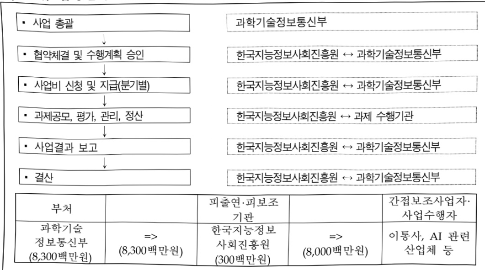

# 고성능 AI(Hyper-AI) 네트워크 기반조성 사업

**해당 페이지**: PDF 686 ~ 690 쪽 해당

**부처**: 과학기술정보통신부
**분야**: 통신
**회계유형**: 일반회계
**2026 확정예산**: 8300.0 백만원
**전년대비 증감률**: None%
**AI 도메인**: 교육/인재

---

<table border=1 style='margin: auto; word-wrap: break-word;'><tr><td style='text-align: center; word-wrap: break-word;'>사 업 명</td></tr><tr><td style='text-align: center; word-wrap: break-word;'>(273) 고성능 AI(Hyper-AI) 네트워크 기반조성 사업 (신규) (2433-305)</td></tr></table>

☐ 사업 코드 정보

<table border=1 style='margin: auto; word-wrap: break-word;'><tr><td style='text-align: center; word-wrap: break-word;'>구분</td><td style='text-align: center; word-wrap: break-word;'>회계</td><td style='text-align: center; word-wrap: break-word;'>소관</td><td style='text-align: center; word-wrap: break-word;'>실국(기관)</td><td style='text-align: center; word-wrap: break-word;'>계정</td><td style='text-align: center; word-wrap: break-word;'>분야</td><td style='text-align: center; word-wrap: break-word;'>부문</td></tr><tr><td style='text-align: center; word-wrap: break-word;'>코드</td><td rowspan="2">일반회계</td><td style='text-align: center; word-wrap: break-word;'>과학기술</td><td style='text-align: center; word-wrap: break-word;'>정보보호</td><td rowspan="2">-</td><td style='text-align: center; word-wrap: break-word;'>130</td><td style='text-align: center; word-wrap: break-word;'>133</td></tr><tr><td style='text-align: center; word-wrap: break-word;'>명칭</td><td style='text-align: center; word-wrap: break-word;'>정보통신부</td><td style='text-align: center; word-wrap: break-word;'>네트워크정책관</td><td style='text-align: center; word-wrap: break-word;'>통신</td><td style='text-align: center; word-wrap: break-word;'>정보통신</td></tr></table>

<table border=1 style='margin: auto; word-wrap: break-word;'><tr><td style='text-align: center; word-wrap: break-word;'>구분</td><td style='text-align: center; word-wrap: break-word;'>프로그램</td><td style='text-align: center; word-wrap: break-word;'>단위사업</td><td style='text-align: center; word-wrap: break-word;'>세부사업</td></tr><tr><td style='text-align: center; word-wrap: break-word;'>코드</td><td style='text-align: center; word-wrap: break-word;'>2400</td><td style='text-align: center; word-wrap: break-word;'>2433</td><td style='text-align: center; word-wrap: break-word;'>305</td></tr><tr><td style='text-align: center; word-wrap: break-word;'>명칭</td><td style='text-align: center; word-wrap: break-word;'>통신정책지원</td><td style='text-align: center; word-wrap: break-word;'>네트워크기반조성(일반)</td><td style='text-align: center; word-wrap: break-word;'>고성능 AI(Hyper-AI) 네트워크 기반조성 사업</td></tr></table>

<table border=1 style='margin: auto; word-wrap: break-word;'><tr><td colspan="6">☐ 사업 성격 (공통요구자료 II-1 작성유의사항 4. 참조, 해당하는 사항에 “○” 표시)</td></tr><tr><td rowspan="2">신규 계속</td><td rowspan="2">완료</td><td rowspan="2">예비타당성 실시여부</td><td rowspan="2">총사업비 관리대상</td><td rowspan="2">총액계상 예산사업</td><td style='text-align: center; word-wrap: break-word;'>사업소관 변경정보</td></tr><tr><td style='text-align: center; word-wrap: break-word;'>2025예산 시 소관</td></tr><tr><td style='text-align: center; word-wrap: break-word;'>○</td><td style='text-align: center; word-wrap: break-word;'></td><td style='text-align: center; word-wrap: break-word;'></td><td style='text-align: center; word-wrap: break-word;'></td><td style='text-align: center; word-wrap: break-word;'></td><td style='text-align: center; word-wrap: break-word;'></td></tr></table>

사업 지원 형태 및 지원을 (최소한 한 개는 반드시 선택하시오. 해당사항에 O 표시)

<table border=1 style='margin: auto; word-wrap: break-word;'><tr><td style='text-align: center; word-wrap: break-word;'>직접</td><td style='text-align: center; word-wrap: break-word;'>출자</td><td style='text-align: center; word-wrap: break-word;'>출연</td><td style='text-align: center; word-wrap: break-word;'>보조</td><td style='text-align: center; word-wrap: break-word;'>융자</td><td style='text-align: center; word-wrap: break-word;'>국고보조율(%)</td><td style='text-align: center; word-wrap: break-word;'>융자율(%)</td></tr><tr><td style='text-align: center; word-wrap: break-word;'></td><td style='text-align: center; word-wrap: break-word;'></td><td style='text-align: center; word-wrap: break-word;'>○</td><td style='text-align: center; word-wrap: break-word;'></td><td style='text-align: center; word-wrap: break-word;'></td><td style='text-align: center; word-wrap: break-word;'></td><td style='text-align: center; word-wrap: break-word;'></td></tr></table>

## □사업 소관부처 및 시행주체

<table border=1 style='margin: auto; word-wrap: break-word;'><tr><td style='text-align: center; word-wrap: break-word;'>사업명</td><td colspan="2">구분</td></tr><tr><td rowspan="2">고성능 AI(Hyper-AI) 네트워크 기반조성 사업</td><td style='text-align: center; word-wrap: break-word;'>소관부처</td><td style='text-align: center; word-wrap: break-word;'>정보보호네트워크정책실 네트워크정책과</td></tr><tr><td style='text-align: center; word-wrap: break-word;'>사업시행주체</td><td style='text-align: center; word-wrap: break-word;'>한국지능정보사회진흥원</td></tr></table>

---

### 가.예산 총괄표

(단위: 백만원, %)

<table border=1 style='margin: auto; word-wrap: break-word;'><tr><td rowspan="2">사업명</td><td rowspan="2">2024년 결산</td><td colspan="2">2025년 예산</td><td colspan="2">2026년 예산</td><td rowspan="2">증감(B-A)</td><td rowspan="2">(B-A)/A</td></tr><tr><td style='text-align: center; word-wrap: break-word;'>본예산</td><td style='text-align: center; word-wrap: break-word;'>추경*(A)</td><td style='text-align: center; word-wrap: break-word;'>요구안</td><td style='text-align: center; word-wrap: break-word;'>본예산(B)</td></tr><tr><td style='text-align: center; word-wrap: break-word;'>고성능AI(Hyper-AI)네트워크기반조성 사업</td><td style='text-align: center; word-wrap: break-word;'>-</td><td style='text-align: center; word-wrap: break-word;'>-</td><td style='text-align: center; word-wrap: break-word;'>-</td><td style='text-align: center; word-wrap: break-word;'>8,300</td><td style='text-align: center; word-wrap: break-word;'>8,300</td><td style='text-align: center; word-wrap: break-word;'>8,300</td><td style='text-align: center; word-wrap: break-word;'>순증</td></tr></table>

*추경: 추경증감액을 포함한 최종 예산액을 기재

## □ 기능별(내역사업별) 예산 내역

(단위:백만원)

<table border=1 style='margin: auto; word-wrap: break-word;'><tr><td rowspan="2"></td><td colspan="5">2024</td><td colspan="5">2025</td><td rowspan="2">2026예산</td></tr><tr><td style='text-align: center; word-wrap: break-word;'>예산액(추경)</td><td style='text-align: center; word-wrap: break-word;'>예산현액</td><td style='text-align: center; word-wrap: break-word;'>집행액</td><td style='text-align: center; word-wrap: break-word;'>이월액</td><td style='text-align: center; word-wrap: break-word;'>불용액</td><td style='text-align: center; word-wrap: break-word;'>예산액(추경)</td><td style='text-align: center; word-wrap: break-word;'>예산현액</td><td style='text-align: center; word-wrap: break-word;'>집행액</td><td style='text-align: center; word-wrap: break-word;'>이월액</td><td style='text-align: center; word-wrap: break-word;'>불용액</td></tr><tr><td style='text-align: center; word-wrap: break-word;'>○ 기능별 분류(합계)</td><td style='text-align: center; word-wrap: break-word;'>-</td><td style='text-align: center; word-wrap: break-word;'>-</td><td style='text-align: center; word-wrap: break-word;'>-</td><td style='text-align: center; word-wrap: break-word;'>-</td><td style='text-align: center; word-wrap: break-word;'>-</td><td style='text-align: center; word-wrap: break-word;'>-</td><td style='text-align: center; word-wrap: break-word;'>-</td><td style='text-align: center; word-wrap: break-word;'>-</td><td style='text-align: center; word-wrap: break-word;'>-</td><td style='text-align: center; word-wrap: break-word;'>-</td><td style='text-align: center; word-wrap: break-word;'>8,300</td></tr><tr><td style='text-align: center; word-wrap: break-word;'>• 고 성 능 AI(Hyper-AI) 네트워크 기반 조성 사업</td><td style='text-align: center; word-wrap: break-word;'>-</td><td style='text-align: center; word-wrap: break-word;'>-</td><td style='text-align: center; word-wrap: break-word;'>-</td><td style='text-align: center; word-wrap: break-word;'>-</td><td style='text-align: center; word-wrap: break-word;'>-</td><td style='text-align: center; word-wrap: break-word;'>-</td><td style='text-align: center; word-wrap: break-word;'>-</td><td style='text-align: center; word-wrap: break-word;'>-</td><td style='text-align: center; word-wrap: break-word;'>-</td><td style='text-align: center; word-wrap: break-word;'>-</td><td style='text-align: center; word-wrap: break-word;'>8,300</td></tr></table>

### 나.사업설명자료

## 1 ) 사업목적·내용

o 사업목적

- AI 시대의 버티컬 신산업을 창출하기 위한 데이터수집, AI 학습·추론 등 AI

위크로드를 지원하는 고성능 AI(Hyper-AI) 네트워크 조성 필요

## o 사업내용

- AI 워크로드(데이터수집→AI학습→AI추론→AI이용)를 지원하는 선도망 구축 및 AI 디바이스 실증 연계를 통한 융합서비스 발굴 및 고성능 AI(Hyper-AI) 선도망 관련 생태계 활성화를 촉진할 수 있는 협의체 구성·운영을 통한 기술 교류

---

## 2 ) 사업개요

사업근거 및 추진경위

① 법령상 근거 및 조항 적시 : 지능정보화기본법 제34조, 제39조

## 제34조(초연결지능정보통신기반 시책의 마련 등)

① 정부는 지능정보서비스가 안전하고 안정적으로 제공·이용될 수 있도록 초연결 지능정보통신기반 구축·운용에 관한 시책을 마련하여 시행하여야 한다. ② 정부는 초연결지능정보통신망의 확충·고도화 및 품질관리를 위하여 필요한 시책을 마련하여야 한다.

## 제39조(전담기관의 지정·운영)

① 과학기술정보통신부장관은 초연결지능정보통신기반의 원활한 구축과 이용촉진을 위하여 필요한 때에는 그 업무를 전담할 기관(이하 이 조에서 “전담기관”이라 한다)을 지정할 수 있다. ② 정부는 초연결지능정보통신기반의 구축 및 이용촉진과 관련된 업무를 수행하는 데 소요되는 자금을 전담기관에 출연하거나 융자 등을 할 수 있다.

② 추진경위

- '25.2월 : 국가 AI 역량 강화 방안(국가인공지능위원회) 중 AI G3 도약을 위해 AI 기술개발 및 융합촉진, 인프라 확충 필요 내용 포함

- '25.3월 : 국가전략기술 육성 기본계획('24-28, 국가과학기술자문회의) 중 '차세대 통신', '인공지능' 12대 국가전략기술 선정

- '25.8' : 국정과제 2-1 'AI 3대 강국 도약을 위한 「AI고속도로」 구축 핵심사업 포함

## 주요내용

① 사업규모

- 총사업비 : 해당없음

- 사업기간 : '26~'29

- 최근 5년 간 투입된 사업비(예산액기준, 추경편성한 연도에는 추경포함)

<table border=1 style='margin: auto; word-wrap: break-word;'><tr><td style='text-align: center; word-wrap: break-word;'>闰五</td><td style='text-align: center; word-wrap: break-word;'>2022</td><td style='text-align: center; word-wrap: break-word;'>2023</td><td style='text-align: center; word-wrap: break-word;'>2024</td><td style='text-align: center; word-wrap: break-word;'>2025</td><td style='text-align: center; word-wrap: break-word;'>2026</td></tr><tr><td style='text-align: center; word-wrap: break-word;'>사업비</td><td style='text-align: center; word-wrap: break-word;'>-</td><td style='text-align: center; word-wrap: break-word;'>-</td><td style='text-align: center; word-wrap: break-word;'>-</td><td style='text-align: center; word-wrap: break-word;'>-</td><td style='text-align: center; word-wrap: break-word;'>8,300</td></tr></table>

- 기타: 해당 없음

---

## ② 사업추진체계

- 사업시행방법 : 출연

- 사업시행주체 : 한국지능정보사회진흥원(NIA)

- 사업 수혜자 : 이통사, AI 관련 산업체(서비스, 디바이스, 장비, SW·AI) 등

- 보조, 융자, 출연, 출자 등의 경우 보조·융자 등 지원 비율 및 법적근거

<table border=1 style='margin: auto; word-wrap: break-word;'><tr><td style='text-align: center; word-wrap: break-word;'>내역사업명</td><td style='text-align: center; word-wrap: break-word;'>구분</td><td style='text-align: center; word-wrap: break-word;'>피보조·피출연 등 기관명</td><td style='text-align: center; word-wrap: break-word;'>지원 금액 (2026예산안)</td><td style='text-align: center; word-wrap: break-word;'>지원 비율(%)</td><td style='text-align: center; word-wrap: break-word;'>보조율 법적근거 (해당 조항)</td></tr><tr><td style='text-align: center; word-wrap: break-word;'>고성능 AI(Hyper-AI) 네트워크 기반조성 사업</td><td style='text-align: center; word-wrap: break-word;'>출연</td><td style='text-align: center; word-wrap: break-word;'>한국지능정보사회진흥원</td><td style='text-align: center; word-wrap: break-word;'>8,300</td><td style='text-align: center; word-wrap: break-word;'>100</td><td style='text-align: center; word-wrap: break-word;'>지능정보화기본법 제12조(한국지능정보사회진흥원의 설립) ④ 국가기관등은 지능정보사회원의 설립 · 시설 · 운영 및 사업 추진 등에 필요한 경비에 충당하도록 하기 위하여 지능정보사회원에 출연할 수 있으며, 정부는 지능정보사회원의 설립 및 운영 등을 위하여 필요한 국유재산을 무상으로 대여할 수 있다.</td></tr></table>

## 3 ) 2026년도 예산 산출 근거

<table border=1 style='margin: auto; word-wrap: break-word;'><tr><td colspan="2">☐ 고성능 AI(Hyper-AI) 네트워크 기반조성 사업 : (2025) - → (2026 예산안) 8,300백만원, 순증</td></tr><tr><td colspan="2">- (요구) 국정과제의 원활한 추진과 AI 3대 강국 도약을 위해 국내 AI 워크로드를 지원하는 AI 맞춤 네트워크 필드 테스트베드 구축 지원 요구</td></tr><tr><td colspan="2">- (산출) Hyper-AI 네트워크 파일럿 프로젝트 8,000백만원</td></tr><tr><td colspan="2">네트워크 기반 생태계 협력 지원 300백만원</td></tr></table>

## 4 ) 사업효과

☐ 사업영향, 산출물 성과지표 등

① 2022~2026년도 성과계획서 상 성과지표 및 최근 5년간 성과 달성도

<table border=1 style='margin: auto; word-wrap: break-word;'><tr><td style='text-align: center; word-wrap: break-word;'>성과지표</td><td style='text-align: center; word-wrap: break-word;'>구분</td><td style='text-align: center; word-wrap: break-word;'>2022</td><td style='text-align: center; word-wrap: break-word;'>2023</td><td style='text-align: center; word-wrap: break-word;'>2024</td><td style='text-align: center; word-wrap: break-word;'>2025</td><td style='text-align: center; word-wrap: break-word;'>2026</td><td style='text-align: center; word-wrap: break-word;'>2026 목표치산출근거</td><td style='text-align: center; word-wrap: break-word;'>측정산식(또는 측정방법)</td><td style='text-align: center; word-wrap: break-word;'>자료수집방법(또는 자료출처)</td></tr><tr><td rowspan="3">Hyper-AI 네트워크 과일릿 프로젝트(단위: 개)</td><td style='text-align: center; word-wrap: break-word;'>목표</td><td style='text-align: center; word-wrap: break-word;'>-</td><td style='text-align: center; word-wrap: break-word;'>-</td><td style='text-align: center; word-wrap: break-word;'>-</td><td style='text-align: center; word-wrap: break-word;'>-</td><td style='text-align: center; word-wrap: break-word;'>2(신규)</td><td rowspan="3">1차년도 사업목표 반영</td><td rowspan="3">∑Hyper-AI 지원 선도망 구성 수</td><td rowspan="3">결과보고서 등</td></tr><tr><td style='text-align: center; word-wrap: break-word;'>실적</td><td style='text-align: center; word-wrap: break-word;'>-</td><td style='text-align: center; word-wrap: break-word;'>-</td><td style='text-align: center; word-wrap: break-word;'>-</td><td style='text-align: center; word-wrap: break-word;'>-</td><td style='text-align: center; word-wrap: break-word;'>-</td></tr><tr><td style='text-align: center; word-wrap: break-word;'>달성도</td><td style='text-align: center; word-wrap: break-word;'>-</td><td style='text-align: center; word-wrap: break-word;'>-</td><td style='text-align: center; word-wrap: break-word;'>-</td><td style='text-align: center; word-wrap: break-word;'>-</td><td style='text-align: center; word-wrap: break-word;'>-</td></tr></table>

② 성과지표 이외의 연도별 사업추진 경과 및 실적 : 해당 없음

③향후(2026년도 이후)기대효과

- AI 워크로드를 지원하는 고성능(Hyper-AI) 네트워크 선도망 구성을 통한 AI 디바이스

(로봇, 자율차, 드론 등) 융합서비스 실증 환경 제공으로 소버린 AI 생태계 선점

---

-민·관협력을바탕으로네트워크기반비즈니스모델발굴과기술선도실증을

통하여 6G·AI 네트워크 기술력 확보 및 첨단 네트워크 조성

5) 타당성조사 및 예비타당성조사 시행여부 및 결과 요지 : 해당 없음

6) 총사업비 대상사업 여부 및 내역 : 해당 없음

7) 사업 집행절차

8) 각종 평가 : 해당 없음(신규)

다. 최근 4년간 결산내역 : 해당 없음(신규)

---

### 원본 PDF 크롭 이미지

