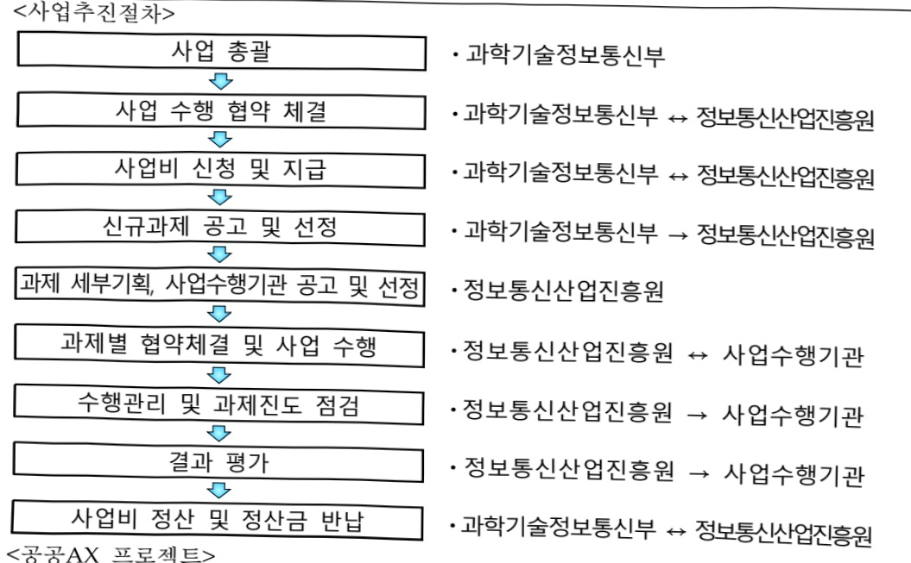

# 공공AX프로젝트

**해당 페이지**: PDF 691 ~ 697 쪽 해당

**부처**: 과학기술정보통신부
**분야**: 통신
**회계유형**: 일반
**2026 확정예산**: 60000.0 백만원
**전년대비 증감률**: None%
**AI 도메인**: 행정/전자정부, 디지털전환(AX)

---

<table border=1 style='margin: auto; word-wrap: break-word;'><tr><td style='text-align: center; word-wrap: break-word;'>사 업 명</td></tr><tr><td style='text-align: center; word-wrap: break-word;'>(321) 공공AX 프로젝트 (2602-364)</td></tr></table>

☐ 사업 코드 정보

<table border=1 style='margin: auto; word-wrap: break-word;'><tr><td style='text-align: center; word-wrap: break-word;'>구분</td><td style='text-align: center; word-wrap: break-word;'>회계</td><td style='text-align: center; word-wrap: break-word;'>소관</td><td style='text-align: center; word-wrap: break-word;'>실국(기관)</td><td style='text-align: center; word-wrap: break-word;'>계정</td><td style='text-align: center; word-wrap: break-word;'>분야</td><td style='text-align: center; word-wrap: break-word;'>부문</td></tr><tr><td style='text-align: center; word-wrap: break-word;'>코드</td><td rowspan="2">일반</td><td rowspan="2">과학기술정보통신부</td><td rowspan="2">정보통신정책관</td><td rowspan="2"></td><td style='text-align: center; word-wrap: break-word;'>130</td><td style='text-align: center; word-wrap: break-word;'>133</td></tr><tr><td style='text-align: center; word-wrap: break-word;'>명칭</td><td style='text-align: center; word-wrap: break-word;'>통신</td><td style='text-align: center; word-wrap: break-word;'>정보통신</td></tr></table>

<table border=1 style='margin: auto; word-wrap: break-word;'><tr><td style='text-align: center; word-wrap: break-word;'>구분</td><td style='text-align: center; word-wrap: break-word;'>프로그램</td><td style='text-align: center; word-wrap: break-word;'>단위사업</td><td style='text-align: center; word-wrap: break-word;'>세부사업</td></tr><tr><td style='text-align: center; word-wrap: break-word;'>코드</td><td style='text-align: center; word-wrap: break-word;'>2600</td><td style='text-align: center; word-wrap: break-word;'>2602</td><td style='text-align: center; word-wrap: break-word;'>364</td></tr><tr><td style='text-align: center; word-wrap: break-word;'>명칭</td><td style='text-align: center; word-wrap: break-word;'>인공지능데이터진흥</td><td style='text-align: center; word-wrap: break-word;'>AI경쟁력강화</td><td style='text-align: center; word-wrap: break-word;'>공공AX 프로젝트</td></tr></table>

□ 사업 성격 (공통요구자료 Ⅱ-1 작성유의사항 4. 참조, 해당하는 사항에 “○” 표시)

<table border=1 style='margin: auto; word-wrap: break-word;'><tr><td rowspan="2">신규</td><td rowspan="2">계속</td><td rowspan="2">완료</td><td rowspan="2">예비타당성 실시여부</td><td rowspan="2">총사업비 관리대상</td><td rowspan="2">총액계상 예산사업</td><td style='text-align: center; word-wrap: break-word;'>사업소관 변경정보</td></tr><tr><td style='text-align: center; word-wrap: break-word;'>2025예산 시 소관</td></tr><tr><td style='text-align: center; word-wrap: break-word;'></td><td style='text-align: center; word-wrap: break-word;'>O</td><td style='text-align: center; word-wrap: break-word;'></td><td style='text-align: center; word-wrap: break-word;'></td><td style='text-align: center; word-wrap: break-word;'></td><td style='text-align: center; word-wrap: break-word;'></td><td style='text-align: center; word-wrap: break-word;'></td></tr></table>

□ 사업 지원 형태 및 지원을 (최소한 한 개는 반드시 선택하시오. 해당사항에 0 표시)

<table border=1 style='margin: auto; word-wrap: break-word;'><tr><td style='text-align: center; word-wrap: break-word;'>직접</td><td style='text-align: center; word-wrap: break-word;'>출자</td><td style='text-align: center; word-wrap: break-word;'>출연</td><td style='text-align: center; word-wrap: break-word;'>보조</td><td style='text-align: center; word-wrap: break-word;'>융자</td><td style='text-align: center; word-wrap: break-word;'>국고보조율(%)</td><td style='text-align: center; word-wrap: break-word;'>융자율(%)</td></tr><tr><td style='text-align: center; word-wrap: break-word;'></td><td style='text-align: center; word-wrap: break-word;'></td><td style='text-align: center; word-wrap: break-word;'>O</td><td style='text-align: center; word-wrap: break-word;'></td><td style='text-align: center; word-wrap: break-word;'></td><td style='text-align: center; word-wrap: break-word;'></td><td style='text-align: center; word-wrap: break-word;'></td></tr></table>

## 사업 소관부처 및 시행주체

<table border=1 style='margin: auto; word-wrap: break-word;'><tr><td style='text-align: center; word-wrap: break-word;'>사업명</td><td colspan="2">구분</td></tr><tr><td rowspan="2"></td><td style='text-align: center; word-wrap: break-word;'>소관부처</td><td style='text-align: center; word-wrap: break-word;'>실·국·과(팀)명</td></tr><tr><td style='text-align: center; word-wrap: break-word;'>사업시행주체</td><td style='text-align: center; word-wrap: break-word;'>기관명</td></tr><tr><td rowspan="3">공공AX프로젝트</td><td rowspan="2">소관부처</td><td style='text-align: center; word-wrap: break-word;'>정보통신정책실정보통신정책관</td></tr><tr><td style='text-align: center; word-wrap: break-word;'>디지털사회기획과</td></tr><tr><td style='text-align: center; word-wrap: break-word;'>사업시행주체</td><td style='text-align: center; word-wrap: break-word;'>정보통신산업진흥원</td></tr></table>

---

### 가. 예산 총괄표

(단위: 백만원, %)

<table border=1 style='margin: auto; word-wrap: break-word;'><tr><td rowspan="2">사업명</td><td rowspan="2">2024년 결산</td><td colspan="2">2025년 예산</td><td colspan="2">2026년 예산</td><td rowspan="2">중감 (B-A)</td><td rowspan="2">(B-A)/A</td></tr><tr><td style='text-align: center; word-wrap: break-word;'>본예산</td><td style='text-align: center; word-wrap: break-word;'>추경*(A)</td><td style='text-align: center; word-wrap: break-word;'>요구안</td><td style='text-align: center; word-wrap: break-word;'>본예산(B)</td></tr><tr><td style='text-align: center; word-wrap: break-word;'>공공AX 프로젝트</td><td style='text-align: center; word-wrap: break-word;'></td><td style='text-align: center; word-wrap: break-word;'>15,000</td><td style='text-align: center; word-wrap: break-word;'>15,000</td><td style='text-align: center; word-wrap: break-word;'>60,000</td><td style='text-align: center; word-wrap: break-word;'>60,000</td><td style='text-align: center; word-wrap: break-word;'>45,000</td><td style='text-align: center; word-wrap: break-word;'>300%</td></tr></table>

* 추경: 추경증감액을 포함한 최종 예산액을 기재

## □ 기능별(내역사업별) 예산 내역

(단위: 백만원)

<table border=1 style='margin: auto; word-wrap: break-word;'><tr><td rowspan="2"></td><td colspan="5">2024</td><td colspan="5">2025</td><td rowspan="2">2026예산</td></tr><tr><td style='text-align: center; word-wrap: break-word;'>예산의(추정)</td><td style='text-align: center; word-wrap: break-word;'>예산현액</td><td style='text-align: center; word-wrap: break-word;'>집행액</td><td style='text-align: center; word-wrap: break-word;'>이월액</td><td style='text-align: center; word-wrap: break-word;'>불용액</td><td style='text-align: center; word-wrap: break-word;'>예산의(추정)</td><td style='text-align: center; word-wrap: break-word;'>예산현액</td><td style='text-align: center; word-wrap: break-word;'>집행액</td><td style='text-align: center; word-wrap: break-word;'>이월액</td><td style='text-align: center; word-wrap: break-word;'>불용액</td></tr><tr><td style='text-align: center; word-wrap: break-word;'>○ 기능별 분류(합계)</td><td style='text-align: center; word-wrap: break-word;'>-</td><td style='text-align: center; word-wrap: break-word;'>-</td><td style='text-align: center; word-wrap: break-word;'>-</td><td style='text-align: center; word-wrap: break-word;'>-</td><td style='text-align: center; word-wrap: break-word;'>-</td><td style='text-align: center; word-wrap: break-word;'>15,000</td><td style='text-align: center; word-wrap: break-word;'>15,000</td><td style='text-align: center; word-wrap: break-word;'>15,000</td><td style='text-align: center; word-wrap: break-word;'>-</td><td style='text-align: center; word-wrap: break-word;'>-</td><td style='text-align: center; word-wrap: break-word;'>60,000</td></tr><tr><td style='text-align: center; word-wrap: break-word;'>• 공공AX 프로젝트</td><td style='text-align: center; word-wrap: break-word;'>-</td><td style='text-align: center; word-wrap: break-word;'>-</td><td style='text-align: center; word-wrap: break-word;'>-</td><td style='text-align: center; word-wrap: break-word;'>-</td><td style='text-align: center; word-wrap: break-word;'>-</td><td style='text-align: center; word-wrap: break-word;'>15,000</td><td style='text-align: center; word-wrap: break-word;'>15,000</td><td style='text-align: center; word-wrap: break-word;'>15,000</td><td style='text-align: center; word-wrap: break-word;'>-</td><td style='text-align: center; word-wrap: break-word;'>-</td><td style='text-align: center; word-wrap: break-word;'>60,000</td></tr></table>

### 나. 사업설명자료

## 1 ) 사업목적·내용

- (공공AX프로젝트) 공공부문에 AI를 선도적으로 접목함으로써 공공서비스를 혁신하고, 공공분야의 AI 대전환(AX) 가속화 및 AI 산업 육성 촉진

## 2 ) 사업개요

## ☐ 사업근거 및 추진경위

① 법령상 근거 및 조항 적시 : 정보통신진흥법 제5조, 27조, 정보통신 진흥 및 융합 활성화 등에 관한 특별법 제32조

## ② 추진경위

- 대한민국 디지털 전략 발표('22.9월, 관계부처합동)

---

“국민과 함께 세계 모범이 되는 디지털 강국 대한민국 실현”

▶뉴욕구상에 담긴 기조와 철학을 반영하여, 5대 전략 19대 세부과제 제시

2 충분한 디지털 자원 확보

- (융합) 국민 일상 속 'AI 융합시대 본격화'

- 대한민국 디지털 전략과 신성장 4.0전략의 이행을 위한 “인공지능 일상화 및 산업 고도화 계획”(23.1월, 국가데이터정책위원회)

▶공공부문, 지역을 대상으로 AI 혁신을 선도적으로 적용하고 확산을 가속화

→공공AI융합확대,현장중심·부처협업과제발굴프로세스강화,지역별AI혁신과제추진

- 전국민 AI 일상화 실행계획('23.9월, 관계부처 합동)

“전세계에서 AI를 가장 잘 활용하는 대한민국으로 도약”

· 범부처 역량 결집, AI 일상화의 체계적 추진

· AI를 일상·일터·공공에 접목, 체감 가능한 혁신 창조

1 AI로 국민 일상을 풍요롭게 하겠습니다

3 AI를 가장 잘 사용하는 똑똑한 정부를 만들겠습니다

- (제3차 국가인공지능위원회) AI컴퓨팅인프라 확충을 통한 국가 AI역량 강화 방안 ('25.2, 관계부처 합동)

3 AI전환 가속화

0 AI컴퓨팅 인프라 확충을 통해 개발된 우리 AI모델이 시장에 안착할 수 있도록 선도

프리젠트 추진 및 국가 AI전환 가속화

⑦(공공)협업기반공공AI서비스도입·확산및초거대AI기반마련

- 민·관이 함께 기술개발 순 주기에 참여하는 공공 AI 솔루션 실증·확산

## □ 주요내용

① 사업규모

- 총사업비(해당되는 경우에만 기재) : 해당없음

- 사업기간 : 2025년 ~ 계속

- 최근 5년 간 투입된 사업비(예산액기준, 추경편성한 연도에는 추경포함)

<table border=1 style='margin: auto; word-wrap: break-word;'><tr><td style='text-align: center; word-wrap: break-word;'>연도</td><td style='text-align: center; word-wrap: break-word;'>2022</td><td style='text-align: center; word-wrap: break-word;'>2023</td><td style='text-align: center; word-wrap: break-word;'>2024</td><td style='text-align: center; word-wrap: break-word;'>2025</td><td style='text-align: center; word-wrap: break-word;'>2026</td></tr><tr><td style='text-align: center; word-wrap: break-word;'>사업비</td><td style='text-align: center; word-wrap: break-word;'></td><td style='text-align: center; word-wrap: break-word;'></td><td style='text-align: center; word-wrap: break-word;'></td><td style='text-align: center; word-wrap: break-word;'>15,000</td><td style='text-align: center; word-wrap: break-word;'>60,000</td></tr></table>

② 사업추진체계

- 사업시행방법 : 출연

- 사업시행주체 : 과학기술정보통신부(정보통신산업진흥원)

- 사업 수혜자 : 국내 인공지능·ICT 기업 및 기관, 협업부처, 국민 등

- 보조, 융자, 출연, 출자 등의 경우 보조·융자 등 지원 비율 및 법적근거

---

<table border=1 style='margin: auto; word-wrap: break-word;'><tr><td style='text-align: center; word-wrap: break-word;'>내역사업명</td><td style='text-align: center; word-wrap: break-word;'>구분</td><td style='text-align: center; word-wrap: break-word;'>피보조·피출연 등 기관명</td><td style='text-align: center; word-wrap: break-word;'>지원 금액 (2026예산안)</td><td style='text-align: center; word-wrap: break-word;'>지원 비율(%)</td><td style='text-align: center; word-wrap: break-word;'>보조율 법적근거 (해당 조항)</td></tr><tr><td style='text-align: center; word-wrap: break-word;'>공공AX 프로젝트</td><td style='text-align: center; word-wrap: break-word;'>출연</td><td style='text-align: center; word-wrap: break-word;'>정보통신 산업진흥원</td><td style='text-align: center; word-wrap: break-word;'>60,000</td><td style='text-align: center; word-wrap: break-word;'>100</td><td style='text-align: center; word-wrap: break-word;'>정보통신진흥법 제5조, 27조, 정보통신 진흥 및 융합 활성화 등에 관한 특별법 제32조</td></tr></table>

## 3 )2026년도 예산 산출 근거

□ 공공AX 프로젝트 : (2025 추경) 15,000백만원 → (2026 예산안) 60,000백만원, 45,000백만원 증액 (제2회 추경 15,000백만원)

- (요구) 공공 AI 보급·활용을 가속화하여 국가 전반의 AI 대전환(AX)을 촉진하고, 국가 AI 기술 경쟁력을 지속 확보하여 추가 AX 성과를 확보하기 위해 60,000백만원 요구

- (산출) ① 공공AX 계속과제 36,000백만원, ② 공공AX 신규과제 24,000백만원

①공공AX 계속과제 36,000백만원

·20개 과제 x 1,800백만원

* 계속과제 지원 여부는 과년도 연차평가 결과에 따라 결정되고, 탈락과제가 발생할 경우 단년도 과제를 신규로 공모·선정하여 추진

* 단, 신규로 선정하는 단년도 과제 지원규모, 개수 등은 탈락과제 발생 규모에 따라 변동 될 수 있으며,

민간주도형 공공AX 방식으로 지원 예정

②공공AX 신규과제 24,000백만원

·4개 과제(소형과제)×1,500백만원

·4개 과제(중형과제)×4,500백만원

o 2025년도 추가경정예산 및 2026년도 예산안 산출 세부내역 비교

<table border=1 style='margin: auto; word-wrap: break-word;'><tr><td colspan="2">2025년 제2회 추가경정예산</td><td colspan="2">2026년 예산안</td></tr><tr><td style='text-align: center; word-wrap: break-word;'>예산</td><td style='text-align: center; word-wrap: break-word;'>산출내역</td><td style='text-align: center; word-wrap: break-word;'>예산</td><td style='text-align: center; word-wrap: break-word;'>산출내역</td></tr><tr><td style='text-align: center; word-wrap: break-word;'>공공AX 프로젝트</td><td style='text-align: center; word-wrap: break-word;'>&lt; 공공AX 프로젝트 15,000백만원 &gt;</td><td style='text-align: center; word-wrap: break-word;'>&lt; 공공AX 프로젝트 60,000백만원 &gt; ① (공공AX 계속과제) 20개 × 1,800백만 = 36,000백만원 ② (공공AX 신규과제) 소형과제(4개) × 1,500백만 = 6,000백만원 (공공AX 신규과제) 중형과제(4개) × 4,500백만 = 18,000백만원 ※ 과제 당 2년 지원</td><td style='text-align: center; word-wrap: break-word;'>※ 과제 당 2년 지원</td></tr></table>

## 4 ) 사업효과

사업영향,산출물 성과지표 등

①2022~2026년도 성과계획서 상 성과지표 및 최근 5년간 성과 달성도

<table border=1 style='margin: auto; word-wrap: break-word;'><tr><td style='text-align: center; word-wrap: break-word;'>성과지표</td><td style='text-align: center; word-wrap: break-word;'>구분</td><td style='text-align: center; word-wrap: break-word;'>2022</td><td style='text-align: center; word-wrap: break-word;'>2023</td><td style='text-align: center; word-wrap: break-word;'>2024</td><td style='text-align: center; word-wrap: break-word;'>2025</td><td style='text-align: center; word-wrap: break-word;'>2026</td><td style='text-align: center; word-wrap: break-word;'>2026 목표치산출근거</td><td style='text-align: center; word-wrap: break-word;'>측정산식(또는 측정방법)</td><td style='text-align: center; word-wrap: break-word;'>자료수집방법(또는 자료출처)</td></tr><tr><td rowspan="3">공공 AX 만족도(단위:건)</td><td style='text-align: center; word-wrap: break-word;'>목표</td><td style='text-align: center; word-wrap: break-word;'></td><td style='text-align: center; word-wrap: break-word;'></td><td style='text-align: center; word-wrap: break-word;'></td><td style='text-align: center; word-wrap: break-word;'>70</td><td style='text-align: center; word-wrap: break-word;'>75</td><td rowspan="3">&#x27;26년 대비 만족도(기업, 공공수요처 5점 상향) 대상 설문조사</td><td rowspan="3">사업수혜대상</td><td rowspan="3">최종보고서</td></tr><tr><td style='text-align: center; word-wrap: break-word;'>실적</td><td style='text-align: center; word-wrap: break-word;'></td><td style='text-align: center; word-wrap: break-word;'></td><td style='text-align: center; word-wrap: break-word;'></td><td style='text-align: center; word-wrap: break-word;'>86.21</td><td style='text-align: center; word-wrap: break-word;'>-</td></tr><tr><td style='text-align: center; word-wrap: break-word;'>달성도</td><td style='text-align: center; word-wrap: break-word;'></td><td style='text-align: center; word-wrap: break-word;'></td><td style='text-align: center; word-wrap: break-word;'></td><td style='text-align: center; word-wrap: break-word;'>114.9%</td><td style='text-align: center; word-wrap: break-word;'>-</td></tr></table>

---

② 성과지표 이외의 연도별 사업추진 경과 및 실적

<table border=1 style='margin: auto; word-wrap: break-word;'><tr><td style='text-align: center; word-wrap: break-word;'>2022</td><td style='text-align: center; word-wrap: break-word;'></td></tr><tr><td style='text-align: center; word-wrap: break-word;'>2023</td><td style='text-align: center; word-wrap: break-word;'></td></tr><tr><td style='text-align: center; word-wrap: break-word;'>2024</td><td style='text-align: center; word-wrap: break-word;'></td></tr><tr><td style='text-align: center; word-wrap: break-word;'>2025</td><td style='text-align: center; word-wrap: break-word;'>○ 신규 공공AX 프로젝트 20개 과제를 부처공모를 통해 선정(&#x27;25.8.) ○ 2026년 AI 10대 민생 프로젝트 과제 선정(&#x27;25.11.)</td></tr></table>

③ 향후(2026년도 이후) 기대효과

- (공공AX 프로젝트) 공공 AX 촉진을 통해 AI를 공공 전반에 접목함으로써 공공

행정 신속성 및 효율성 확보 등 국민 체감효과 증대('26년 기준 28개 과제 지원 예정)

5) 타당성조사 및 예비타당성조사 시행여부 및 결과 요지 : 해당없음

6) 총사업비 대상사업 정보 : 해당없음

## 7 ) 사업 집행절차

<공공AX 프로젝트>

<table border=1 style='margin: auto; word-wrap: break-word;'><tr><td style='text-align: center; word-wrap: break-word;'>부처</td><td style='text-align: center; word-wrap: break-word;'></td><td style='text-align: center; word-wrap: break-word;'>피출연·피보조기관</td><td style='text-align: center; word-wrap: break-word;'></td><td style='text-align: center; word-wrap: break-word;'>간접보조사업자·사업수행자</td></tr><tr><td style='text-align: center; word-wrap: break-word;'>과학기술정보통신부(60,000백만원)</td><td style='text-align: center; word-wrap: break-word;'>=&gt;(60,000백만원)</td><td style='text-align: center; word-wrap: break-word;'>정보통신산업진흥원(60,000백만원)</td><td style='text-align: center; word-wrap: break-word;'>=&gt;(57,000백만원)</td><td style='text-align: center; word-wrap: break-word;'>AI 기업 등 컨소시엄,지정위탁기관 등(57,000백만원)</td></tr></table>

---

## 8 ) 각종 평가

<table border=1 style='margin: auto; word-wrap: break-word;'><tr><td style='text-align: center; word-wrap: break-word;'>1) 국회(예결위, 상임위, 예정처, 국정감사 포함) 지적 - 없음</td></tr><tr><td style='text-align: center; word-wrap: break-word;'>2) 대외공개 평가 - 없음</td></tr><tr><td style='text-align: center; word-wrap: break-word;'>3) 자체평가 - 없음</td></tr></table>

### 다. 최근 4년간 결산내역

## 1 ) 결산표

☐ 부처 결산내역

(단위: 백만원, %)

<table border=1 style='margin: auto; word-wrap: break-word;'><tr><td rowspan="2">연도</td><td colspan="3">예산액</td><td rowspan="2">예산현액(A)</td><td rowspan="2">집행액(B)</td><td rowspan="2">집행률(B/A)</td><td rowspan="2">다음연도이월액</td><td rowspan="2">불용액</td></tr><tr><td style='text-align: center; word-wrap: break-word;'>본예산</td><td style='text-align: center; word-wrap: break-word;'>추경중감액</td><td style='text-align: center; word-wrap: break-word;'>추경</td></tr><tr><td style='text-align: center; word-wrap: break-word;'>2022</td><td style='text-align: center; word-wrap: break-word;'></td><td style='text-align: center; word-wrap: break-word;'></td><td style='text-align: center; word-wrap: break-word;'></td><td style='text-align: center; word-wrap: break-word;'></td><td style='text-align: center; word-wrap: break-word;'></td><td style='text-align: center; word-wrap: break-word;'></td><td style='text-align: center; word-wrap: break-word;'></td><td style='text-align: center; word-wrap: break-word;'></td></tr><tr><td style='text-align: center; word-wrap: break-word;'>2023</td><td style='text-align: center; word-wrap: break-word;'></td><td style='text-align: center; word-wrap: break-word;'></td><td style='text-align: center; word-wrap: break-word;'></td><td style='text-align: center; word-wrap: break-word;'></td><td style='text-align: center; word-wrap: break-word;'></td><td style='text-align: center; word-wrap: break-word;'></td><td style='text-align: center; word-wrap: break-word;'></td><td style='text-align: center; word-wrap: break-word;'></td></tr><tr><td style='text-align: center; word-wrap: break-word;'>2024</td><td style='text-align: center; word-wrap: break-word;'></td><td style='text-align: center; word-wrap: break-word;'></td><td style='text-align: center; word-wrap: break-word;'></td><td style='text-align: center; word-wrap: break-word;'></td><td style='text-align: center; word-wrap: break-word;'></td><td style='text-align: center; word-wrap: break-word;'></td><td style='text-align: center; word-wrap: break-word;'></td><td style='text-align: center; word-wrap: break-word;'></td></tr><tr><td style='text-align: center; word-wrap: break-word;'>2025</td><td style='text-align: center; word-wrap: break-word;'></td><td style='text-align: center; word-wrap: break-word;'></td><td style='text-align: center; word-wrap: break-word;'>15,000</td><td style='text-align: center; word-wrap: break-word;'>15,000</td><td style='text-align: center; word-wrap: break-word;'>15,000</td><td style='text-align: center; word-wrap: break-word;'>100%</td><td style='text-align: center; word-wrap: break-word;'></td><td style='text-align: center; word-wrap: break-word;'></td></tr></table>

## 2 ) 주요 결산사항

□ 2022~2025년 결산 주요사항

<table border=1 style='margin: auto; word-wrap: break-word;'><tr><td style='text-align: center; word-wrap: break-word;'>2022</td><td style='text-align: center; word-wrap: break-word;'>- ‘협의 이·전용 등’의 상세내역 기술 : 전용, 이용, 조정, 이체 규모 각각 기재 - 이·전용 등 사유 - 추경 편성 사유 - 이월 사유 및 불용 사유(집행부진사유)</td></tr><tr><td style='text-align: center; word-wrap: break-word;'>2023</td><td style='text-align: center; word-wrap: break-word;'>- 위와 동일하게 기술</td></tr><tr><td style='text-align: center; word-wrap: break-word;'>2024</td><td style='text-align: center; word-wrap: break-word;'>- 위와 동일하게 기술</td></tr><tr><td style='text-align: center; word-wrap: break-word;'>2025</td><td style='text-align: center; word-wrap: break-word;'>- 위와 동일하게 기술</td></tr></table>

---

□ 2025년 이·전용 등 세부내역

(단위:백만원)

<table border=1 style='margin: auto; word-wrap: break-word;'><tr><td rowspan="2">구분(날짜)</td><td colspan="2">~에서</td><td rowspan="2">금액</td><td colspan="2">~으로</td><td rowspan="2">이·전용 등 사유</td></tr><tr><td style='text-align: center; word-wrap: break-word;'>세부사업 명(사업코드)</td><td style='text-align: center; word-wrap: break-word;'>목-세목 코드</td><td style='text-align: center; word-wrap: break-word;'>세부사업 명(사업코드)</td><td style='text-align: center; word-wrap: break-word;'>목-세목 코드</td></tr><tr><td style='text-align: center; word-wrap: break-word;'>이용(2025.2.1.)</td><td style='text-align: center; word-wrap: break-word;'></td><td style='text-align: center; word-wrap: break-word;'></td><td style='text-align: center; word-wrap: break-word;'></td><td style='text-align: center; word-wrap: break-word;'></td><td style='text-align: center; word-wrap: break-word;'></td><td style='text-align: center; word-wrap: break-word;'></td></tr><tr><td style='text-align: center; word-wrap: break-word;'>전용(2025.2.3.)</td><td style='text-align: center; word-wrap: break-word;'></td><td style='text-align: center; word-wrap: break-word;'></td><td style='text-align: center; word-wrap: break-word;'></td><td style='text-align: center; word-wrap: break-word;'></td><td style='text-align: center; word-wrap: break-word;'></td><td style='text-align: center; word-wrap: break-word;'></td></tr><tr><td style='text-align: center; word-wrap: break-word;'>조정(2025.2.5.)</td><td style='text-align: center; word-wrap: break-word;'></td><td style='text-align: center; word-wrap: break-word;'></td><td style='text-align: center; word-wrap: break-word;'></td><td style='text-align: center; word-wrap: break-word;'></td><td style='text-align: center; word-wrap: break-word;'></td><td style='text-align: center; word-wrap: break-word;'></td></tr><tr><td style='text-align: center; word-wrap: break-word;'>이체(2025.2.9.)</td><td style='text-align: center; word-wrap: break-word;'></td><td style='text-align: center; word-wrap: break-word;'></td><td style='text-align: center; word-wrap: break-word;'></td><td style='text-align: center; word-wrap: break-word;'></td><td style='text-align: center; word-wrap: break-word;'></td><td style='text-align: center; word-wrap: break-word;'></td></tr></table>

---

### 원본 PDF 크롭 이미지

