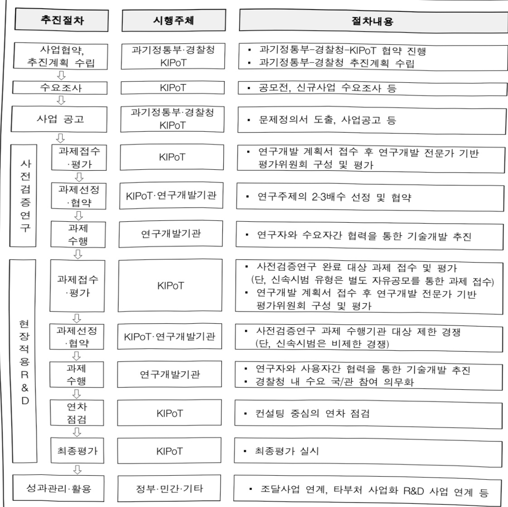
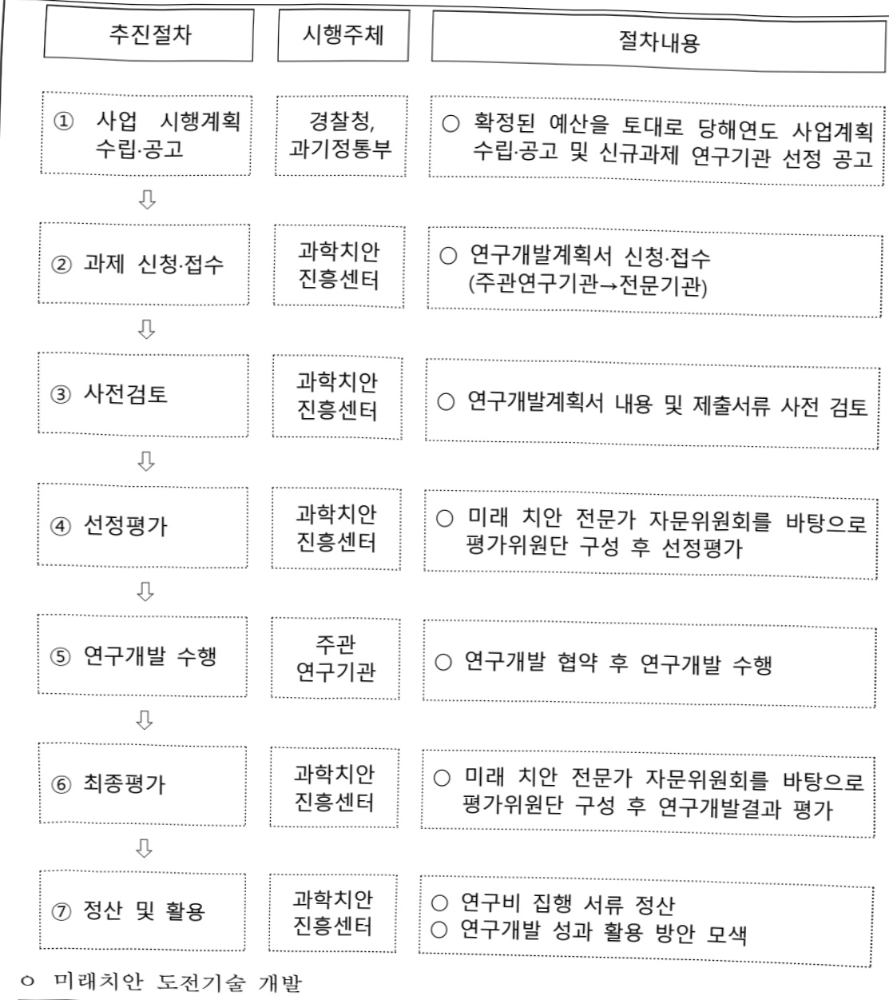
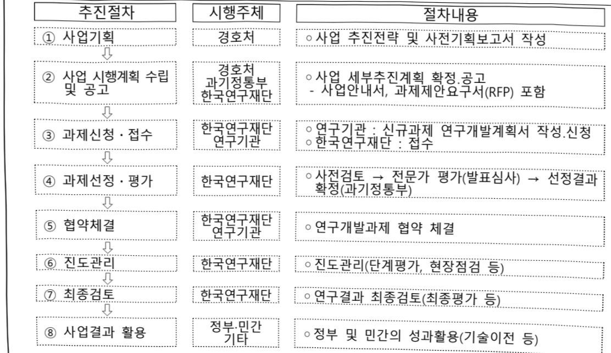
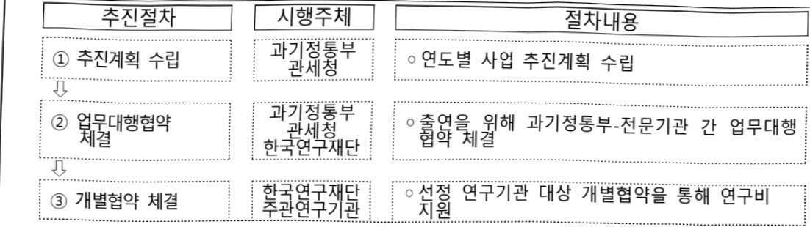
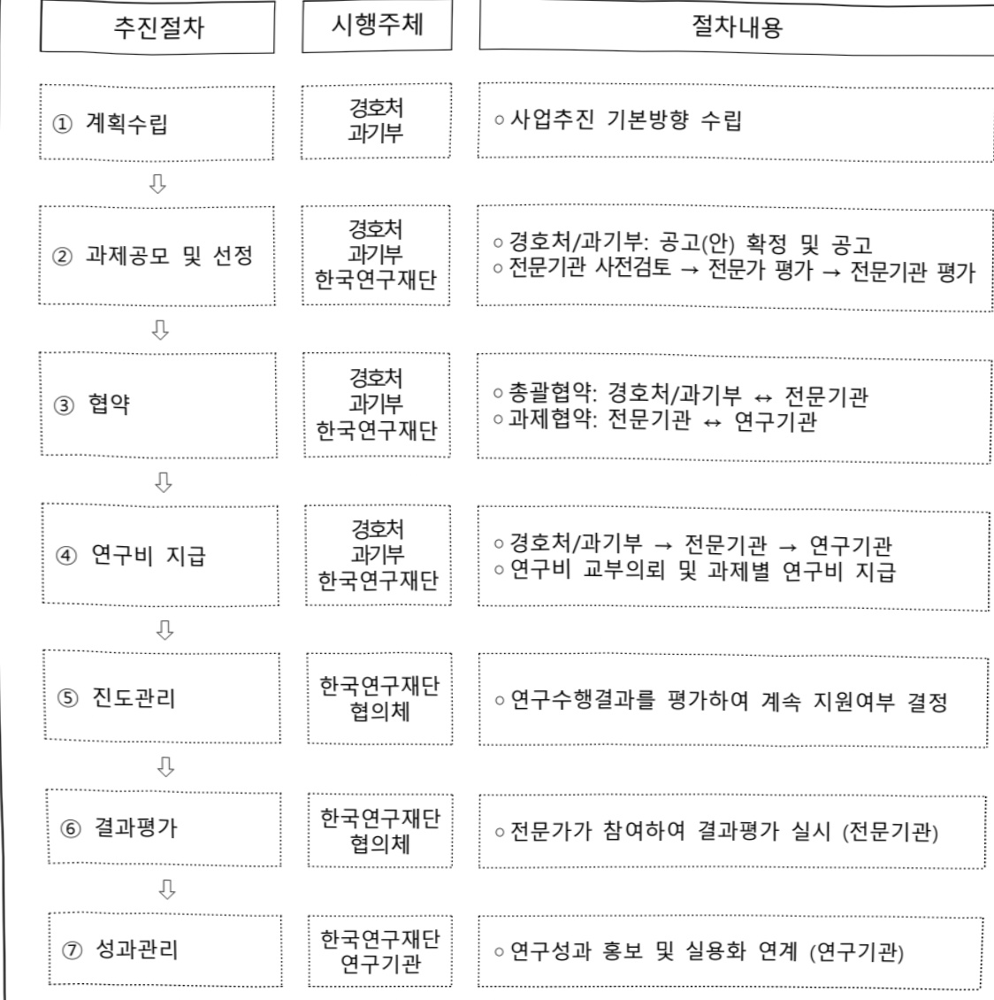
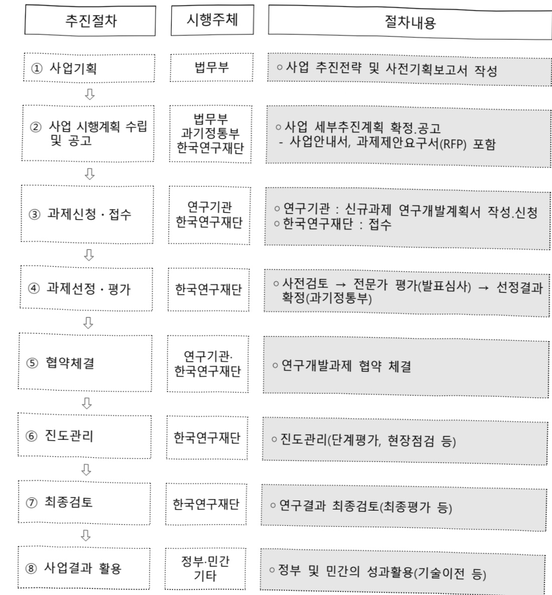

# 공공행정서비스혁신기술개발(R&D)

**해당 페이지**: PDF 698 ~ 718 쪽 해당

**부처**: 과학기술정보통신부
**분야**: 과학기술
**회계유형**: 일반회계
**2026 확정예산**: 9804.0 백만원
**전년대비 증감률**: None%
**AI 도메인**: 통신/네트워크, 법률/치안, 재난/안전

---

<table border=1 style='margin: auto; word-wrap: break-word;'><tr><td style='text-align: center; word-wrap: break-word;'>사 업 명</td></tr><tr><td style='text-align: center; word-wrap: break-word;'>(104) 공공행정서비스혁신기술개발(R&amp;D) (1531-430)</td></tr></table>

□ 사업 코드 정보

<table border=1 style='margin: auto; word-wrap: break-word;'><tr><td style='text-align: center; word-wrap: break-word;'>구분</td><td style='text-align: center; word-wrap: break-word;'>회계</td><td style='text-align: center; word-wrap: break-word;'>소관</td><td style='text-align: center; word-wrap: break-word;'>실국(기관)</td><td style='text-align: center; word-wrap: break-word;'>계정</td><td style='text-align: center; word-wrap: break-word;'>분야</td><td style='text-align: center; word-wrap: break-word;'>부문</td></tr><tr><td style='text-align: center; word-wrap: break-word;'>코드</td><td rowspan="2">일반회계</td><td rowspan="2">과학기술정보통신부</td><td rowspan="2">연구개발정책실미래전략기술정책관</td><td rowspan="2"></td><td style='text-align: center; word-wrap: break-word;'>150</td><td style='text-align: center; word-wrap: break-word;'>155</td></tr><tr><td style='text-align: center; word-wrap: break-word;'>명칭</td><td style='text-align: center; word-wrap: break-word;'>과학기술</td><td style='text-align: center; word-wrap: break-word;'>과학기술연구개발</td></tr></table>

<table border=1 style='margin: auto; word-wrap: break-word;'><tr><td style='text-align: center; word-wrap: break-word;'>구분</td><td style='text-align: center; word-wrap: break-word;'>프로그램</td><td style='text-align: center; word-wrap: break-word;'>단위사업</td><td style='text-align: center; word-wrap: break-word;'>세부사업</td></tr><tr><td style='text-align: center; word-wrap: break-word;'>코드</td><td style='text-align: center; word-wrap: break-word;'>1500</td><td style='text-align: center; word-wrap: break-word;'>1531</td><td style='text-align: center; word-wrap: break-word;'>430</td></tr><tr><td style='text-align: center; word-wrap: break-word;'>명칭</td><td style='text-align: center; word-wrap: break-word;'>사회문제해결</td><td style='text-align: center; word-wrap: break-word;'>사회문제해결연구(R&amp;D)</td><td style='text-align: center; word-wrap: break-word;'>공공행정서비스혁신기술개발(R&amp;D)</td></tr></table>

사업 성격 (공통요구자료 Ⅱ-1 작성유의사항 4. 참조, 해당하는 사항에 “0” 표시)

<table border=1 style='margin: auto; word-wrap: break-word;'><tr><td rowspan="2">신규</td><td rowspan="2">계속</td><td rowspan="2">완료</td><td rowspan="2">예비타당성 실시여부</td><td rowspan="2">총사업비 관리대상</td><td rowspan="2">총액계상 예산사업</td><td style='text-align: center; word-wrap: break-word;'>사업소관 변경정보</td></tr><tr><td style='text-align: center; word-wrap: break-word;'>2025예산 시 소관</td></tr><tr><td style='text-align: center; word-wrap: break-word;'></td><td style='text-align: center; word-wrap: break-word;'>○</td><td style='text-align: center; word-wrap: break-word;'></td><td style='text-align: center; word-wrap: break-word;'></td><td style='text-align: center; word-wrap: break-word;'></td><td style='text-align: center; word-wrap: break-word;'></td><td style='text-align: center; word-wrap: break-word;'></td></tr></table>

□ 사업 지원 형태 및 지원을 (최소한 한 개는 반드시 선택하시오. 해당사항에 O 표시)

<table border=1 style='margin: auto; word-wrap: break-word;'><tr><td style='text-align: center; word-wrap: break-word;'>직접</td><td style='text-align: center; word-wrap: break-word;'>출자</td><td style='text-align: center; word-wrap: break-word;'>출연</td><td style='text-align: center; word-wrap: break-word;'>보조</td><td style='text-align: center; word-wrap: break-word;'>융자</td><td style='text-align: center; word-wrap: break-word;'>국고보조율(%)</td><td style='text-align: center; word-wrap: break-word;'>융자율(%)</td></tr><tr><td style='text-align: center; word-wrap: break-word;'></td><td style='text-align: center; word-wrap: break-word;'></td><td style='text-align: center; word-wrap: break-word;'>○</td><td style='text-align: center; word-wrap: break-word;'></td><td style='text-align: center; word-wrap: break-word;'></td><td style='text-align: center; word-wrap: break-word;'></td><td style='text-align: center; word-wrap: break-word;'></td></tr></table>

## 사업 담당자

<table border=1 style='margin: auto; word-wrap: break-word;'><tr><td style='text-align: center; word-wrap: break-word;'>사업명</td><td colspan="2">구분</td></tr><tr><td rowspan="3">공공행정서비스혁신기술개발</td><td rowspan="2">소관부처</td><td style='text-align: center; word-wrap: break-word;'>연구개발정책실 미래전략기술정책관</td></tr><tr><td style='text-align: center; word-wrap: break-word;'>미래전략기술정책과</td></tr><tr><td style='text-align: center; word-wrap: break-word;'>사업시행주체</td><td style='text-align: center; word-wrap: break-word;'>한국연구재단, (재)과학치안진흥센터</td></tr></table>

---

### 가.예산 총괄표

(단위: 백만원, %)

<table border=1 style='margin: auto; word-wrap: break-word;'><tr><td rowspan="2">2024년 사업명</td><td colspan="2">2025년 예산</td><td colspan="2">2026년 예산</td><td rowspan="2" colspan="2">증감 (B-A)</td></tr><tr><td style='text-align: center; word-wrap: break-word;'>본예산</td><td style='text-align: center; word-wrap: break-word;'>추경*(A)</td><td style='text-align: center; word-wrap: break-word;'>요구안</td><td style='text-align: center; word-wrap: break-word;'>본예산(B)</td></tr><tr><td style='text-align: center; word-wrap: break-word;'>공공행정서비스혁신 기술개발(R&amp;D)</td><td style='text-align: center; word-wrap: break-word;'>7,047</td><td style='text-align: center; word-wrap: break-word;'>11,324</td><td style='text-align: center; word-wrap: break-word;'>11,324</td><td style='text-align: center; word-wrap: break-word;'>11,054</td><td style='text-align: center; word-wrap: break-word;'>9,804</td><td style='text-align: center; word-wrap: break-word;'>△1,520</td></tr></table>

□ 기능별(내역사업별) 예산 내역

(단위:백만원)

<table border=1 style='margin: auto; word-wrap: break-word;'><tr><td rowspan="2"></td><td colspan="5">2024</td><td colspan="5">2025</td><td rowspan="2">2026예산</td></tr><tr><td style='text-align: center; word-wrap: break-word;'>예산액(추경)</td><td style='text-align: center; word-wrap: break-word;'>예산현액</td><td style='text-align: center; word-wrap: break-word;'>집행액</td><td style='text-align: center; word-wrap: break-word;'>이월액</td><td style='text-align: center; word-wrap: break-word;'>불용액</td><td style='text-align: center; word-wrap: break-word;'>예산액(추경)</td><td style='text-align: center; word-wrap: break-word;'>예산현액</td><td style='text-align: center; word-wrap: break-word;'>집행액</td><td style='text-align: center; word-wrap: break-word;'>이월액</td><td style='text-align: center; word-wrap: break-word;'>불용액</td></tr><tr><td style='text-align: center; word-wrap: break-word;'>○ 기능별 분류(합계)</td><td style='text-align: center; word-wrap: break-word;'>7,047</td><td style='text-align: center; word-wrap: break-word;'>7,047</td><td style='text-align: center; word-wrap: break-word;'>7,047[7,047]</td><td style='text-align: center; word-wrap: break-word;'>-</td><td style='text-align: center; word-wrap: break-word;'>-</td><td style='text-align: center; word-wrap: break-word;'>11,324</td><td style='text-align: center; word-wrap: break-word;'>11,324</td><td style='text-align: center; word-wrap: break-word;'>11,324[11,324]</td><td style='text-align: center; word-wrap: break-word;'>-</td><td style='text-align: center; word-wrap: break-word;'>-</td><td style='text-align: center; word-wrap: break-word;'>9,804</td></tr><tr><td style='text-align: center; word-wrap: break-word;'>· 치안현장 맞춤형연구개발(폴리스랩3.0)</td><td style='text-align: center; word-wrap: break-word;'>-</td><td style='text-align: center; word-wrap: break-word;'>-</td><td style='text-align: center; word-wrap: break-word;'>-</td><td style='text-align: center; word-wrap: break-word;'>-</td><td style='text-align: center; word-wrap: break-word;'>-</td><td style='text-align: center; word-wrap: break-word;'>936</td><td style='text-align: center; word-wrap: break-word;'>936</td><td style='text-align: center; word-wrap: break-word;'>936[936]</td><td style='text-align: center; word-wrap: break-word;'>-</td><td style='text-align: center; word-wrap: break-word;'>-</td><td style='text-align: center; word-wrap: break-word;'>2,494</td></tr><tr><td style='text-align: center; word-wrap: break-word;'>· 미래치안 도전기술개발</td><td style='text-align: center; word-wrap: break-word;'>894</td><td style='text-align: center; word-wrap: break-word;'>894</td><td style='text-align: center; word-wrap: break-word;'>894[894]</td><td style='text-align: center; word-wrap: break-word;'>-</td><td style='text-align: center; word-wrap: break-word;'>-</td><td style='text-align: center; word-wrap: break-word;'>1,373</td><td style='text-align: center; word-wrap: break-word;'>1,373</td><td style='text-align: center; word-wrap: break-word;'>1,373[1,373]</td><td style='text-align: center; word-wrap: break-word;'>-</td><td style='text-align: center; word-wrap: break-word;'>-</td><td style='text-align: center; word-wrap: break-word;'>1,382</td></tr><tr><td style='text-align: center; word-wrap: break-word;'>· 관세행정 현장 맞춤형기술개발2.0</td><td style='text-align: center; word-wrap: break-word;'>-</td><td style='text-align: center; word-wrap: break-word;'>-</td><td style='text-align: center; word-wrap: break-word;'>-</td><td style='text-align: center; word-wrap: break-word;'>-</td><td style='text-align: center; word-wrap: break-word;'>-</td><td style='text-align: center; word-wrap: break-word;'>915</td><td style='text-align: center; word-wrap: break-word;'>915</td><td style='text-align: center; word-wrap: break-word;'>915[915]</td><td style='text-align: center; word-wrap: break-word;'>-</td><td style='text-align: center; word-wrap: break-word;'>-</td><td style='text-align: center; word-wrap: break-word;'>2,178</td></tr><tr><td style='text-align: center; word-wrap: break-word;'>· 경호(보안검색)대응기술개발</td><td style='text-align: center; word-wrap: break-word;'>500</td><td style='text-align: center; word-wrap: break-word;'>500</td><td style='text-align: center; word-wrap: break-word;'>500[500]</td><td style='text-align: center; word-wrap: break-word;'>-</td><td style='text-align: center; word-wrap: break-word;'>-</td><td style='text-align: center; word-wrap: break-word;'>1,500</td><td style='text-align: center; word-wrap: break-word;'>1,500</td><td style='text-align: center; word-wrap: break-word;'>1,500[1,500]</td><td style='text-align: center; word-wrap: break-word;'>-</td><td style='text-align: center; word-wrap: break-word;'>-</td><td style='text-align: center; word-wrap: break-word;'>1,500</td></tr><tr><td style='text-align: center; word-wrap: break-word;'>· 지능형유무인복합경비안전기술개발</td><td style='text-align: center; word-wrap: break-word;'>500</td><td style='text-align: center; word-wrap: break-word;'>500</td><td style='text-align: center; word-wrap: break-word;'>500[500]</td><td style='text-align: center; word-wrap: break-word;'>-</td><td style='text-align: center; word-wrap: break-word;'>-</td><td style='text-align: center; word-wrap: break-word;'>1,500</td><td style='text-align: center; word-wrap: break-word;'>1,500</td><td style='text-align: center; word-wrap: break-word;'>1,500[1,500]</td><td style='text-align: center; word-wrap: break-word;'>-</td><td style='text-align: center; word-wrap: break-word;'>-</td><td style='text-align: center; word-wrap: break-word;'>250</td></tr><tr><td style='text-align: center; word-wrap: break-word;'>· 재범정후 선제적 감지 및 대응력 강화</td><td style='text-align: center; word-wrap: break-word;'>800</td><td style='text-align: center; word-wrap: break-word;'>800</td><td style='text-align: center; word-wrap: break-word;'>800[800]</td><td style='text-align: center; word-wrap: break-word;'>-</td><td style='text-align: center; word-wrap: break-word;'>-</td><td style='text-align: center; word-wrap: break-word;'>2,000</td><td style='text-align: center; word-wrap: break-word;'>2,000</td><td style='text-align: center; word-wrap: break-word;'>2,000[2,000]</td><td style='text-align: center; word-wrap: break-word;'>-</td><td style='text-align: center; word-wrap: break-word;'>-</td><td style='text-align: center; word-wrap: break-word;'>2,000</td></tr><tr><td style='text-align: center; word-wrap: break-word;'>· 치안현장 맞춤형연구개발(폴리스랩2.0)</td><td style='text-align: center; word-wrap: break-word;'>4,353</td><td style='text-align: center; word-wrap: break-word;'>4,353</td><td style='text-align: center; word-wrap: break-word;'>4,353[4,353]</td><td style='text-align: center; word-wrap: break-word;'>-</td><td style='text-align: center; word-wrap: break-word;'>-</td><td style='text-align: center; word-wrap: break-word;'>3,100</td><td style='text-align: center; word-wrap: break-word;'>3,100</td><td style='text-align: center; word-wrap: break-word;'>3,100[3,100]</td><td style='text-align: center; word-wrap: break-word;'>-</td><td style='text-align: center; word-wrap: break-word;'>-</td><td style='text-align: center; word-wrap: break-word;'>-</td></tr></table>

### 나.사업설명자료

## 1 ) 사업목적·내용

(공공행정서비스혁신기술개발(R&D)) 치안, 관세, 경호 등 공공행정 서비스의 첨단화, 고도화를 위해 공공행정 현장에서 요구하는 기술을 과학기술정보통신부와 현장부처가 협업하여 개발 및 현장에 적용하는 R&D 사업

---

(치안현장 맞춤형 연구개발(폴리스랩3.0)) 치안 현장의 문제를 경쟁형 개방형 기획을 통해 다원적으로 접근하여 해결방안을 강구하고 국내·외 역량을 효율적으로 연계·활용하여 신속한 현장적용을 촉진하는 실증형 R&D 사업

※ 과기정통부-경찰청 다부처 협업 사업임

(미래치안도전기술개발) 급변하는 미래사회의 국가 치안 불확실성을 최소화하고, 예견치 못해 과소평가 될 수 있는 범죄/사고로 인한 피해 저감과 사회 “회복력” 확보를 위하여, 중장기 미래에 도래할 범죄·사고·불안 등 치안문제로부터 국민안전 확보 및 치안 현장 대응 역량 강화를 위한 맞춤형 연구개발 체계 마련

※ 과기정통부-경찰청 다부처 협업 사업임

(관세행정 현장 맞춤형 기술개발 2.0) 관세행정 서비스 공급자·수요자 참여 임무중심형

R&D 추진으로 관세행정을 첨단화하고 관세국경관리 효율성을 높여 국민을 위해

상황으로부터 보호할 수 있는 기술개발

(경호(보안검색) 대응기술개발) 보안검색 업무의 능률성과 효율성을 담보하고 보안

검색요원의 위험물 여부에 대한 판독을 보조할 수 있는 AI X-rav 적용 시스템 개발

(지능형 유무인 복합 경비안전 기술개발) 경비안전 수요부처(경호처)와 R&D 주무부처(과기부)가 협업하여 국가요인에 대한 위협 예방과 대응을 위해 5G, AI 등 국가전략 기술을 도입하여 장비·인원·공간이 통합된 유무인 복합 경비안전 기술개발 및 실증

(재범징후 선제적 감지 및 대응력 강화) 전자감독 사각지대에서의 재범발생과 점차

교묘해지는 재범시도를 사전 차단·대응하기 위해 24시간 고정밀 분석이 가능한

선제적 예방 중심의 예측적 전자감독시스템 개발 및 실증을 통한 사회안전망 구축

(치안현장 맞춤형 연구개발(폴리스랩2.0)) 기개발된 원전기술을 적극 활용하여 시의성 높은 현재·미래 치안현장의 문제해결 및 경찰의 과학적 역량강화를 통해 대국민 치안 서비스를 고도화하는 실증형 R&SD 사업

※ 과기정통부-경찰청 다부처 협업 사업임, 25년 사업 종료

---

## 2 ) 사업개요

□ 사업근거 및 추진경위

① 법령상 근거 및 조항 적시

-「과학기술기본법」제11조(국가연구개발사업의 추진)

① 중앙행정기관의 장은 기본계획에 따라 맡은 분야의 국가연구개발사업과 그 시책을 세워 추진하여야 한다.

-「과학기술기본법」제16조의6(과학기술을 활용한 사회문제의 해결)

① 정부는 과학기술을 활용한 삶의 질 향상, 경제적·사회적 현안 및 범지구적 문제 등의 해결을 위하여 필요한 시책을 세우고 추진하여야 한다.

② 제1항에 따른 시책을 세우고 추진하는 데 필요한 사항은 대통령령으로 정한다.

-「국가경찰과 자치경찰의 조직 및 운영에 관한 법률」 제33조(치안에 필요한 연구개발의 지원 등)

<table border=1 style='margin: auto; word-wrap: break-word;'><tr><td style='text-align: center; word-wrap: break-word;'>① 경찰청장은 치안에 필요한 연구·실험·조사·기술개발(이하 “연구개발사업”이라 한다) 및 전문인력 양성 등 치안분야의 과학기술진흥을 위한 시책을 마련하여 추진하여야 한다.</td></tr><tr><td style='text-align: center; word-wrap: break-word;'>② 경찰청장은 연구개발사업을 효율적으로 추진하기 위하여 다음 각 호의 어느 하나에 해당하는 기관 또는 단체 등과 협약을 맺어 연구개발사업을 실시하게 할 수 있다.</td></tr><tr><td style='text-align: center; word-wrap: break-word;'>③ 경찰청장은 제2항 각 호의 기관 또는 단체 등에 대하여 연구개발사업을 실시하는 데 필요한 경비의 전부 또는 일부를 출연하거나 보조할 수 있다.</td></tr><tr><td style='text-align: center; word-wrap: break-word;'>④ 제2항에 따른 연구개발사업의 실시와 제3항에 따른 출연금의 지급·사용 및 관리 등에 필요한 사항은 대통령령으로 정한다.</td></tr></table>

-「관세법」제322조의2(연구개발사업의 추진)

<table border=1 style='margin: auto; word-wrap: break-word;'><tr><td style='text-align: center; word-wrap: break-word;'>① 관세청장은 관세행정에 필요한 연구·실험·조사·기술개발(이하 “연구개발사업”이라 한다) 및 전문인력 양성 등 소관 분야의 과학기술진흥을 위한 시책을 마련하여 추진할 수 있다.</td></tr><tr><td style='text-align: center; word-wrap: break-word;'>② 제1항에 따른 연구개발사업은 단계별·분야별 연구개발과제를 선정하여 다음 각 호의 기관 또는 단체 등과 협약을 맺어 실시하게 할 수 있다.</td></tr><tr><td style='text-align: center; word-wrap: break-word;'>1. 국가 또는 지방자치단체가 직접 설치하여 운영하는 연구기관</td></tr><tr><td style='text-align: center; word-wrap: break-word;'>2. 「특정연구기관 육성법」 제2조에 따른 특정연구기관</td></tr><tr><td style='text-align: center; word-wrap: break-word;'>3. 「과학기술분야 정부출연연구기관 등의 설립·운영 및 육성에 관한 법률」에 따라 설립된 과학기술분야 정부출연연구기관</td></tr><tr><td style='text-align: center; word-wrap: break-word;'>4. 「고등교육법」에 따른 대학·산업대학·전문대학 및 기술대학</td></tr><tr><td style='text-align: center; word-wrap: break-word;'>5. 「기초연구진흥 및 기술개발지원에 관한 법률」 제14조의2제1항에 따라 인정받은 기업부 설연구소 또는 기업의 연구개발전담부서</td></tr><tr><td style='text-align: center; word-wrap: break-word;'>6. 「민법」이나 다른 법률에 따라 설립된 법인으로서 관세행정 관련 연구를 하는 기관</td></tr><tr><td style='text-align: center; word-wrap: break-word;'>7. 그 밖에 대통령령으로 정하는 관세행정 분야의 연구기관 또는 단체</td></tr><tr><td style='text-align: center; word-wrap: break-word;'>③ 관세청장은 제2항에 따른 기관 또는 단체 등에 연구개발사업을 실시하는 데 필요한 자금의 전부 또는 일부를 출연하거나 보조할 수 있다.</td></tr><tr><td style='text-align: center; word-wrap: break-word;'>④ 제3항에 따른 출연금 및 보조금의 지급·사용 및 관리 등에 필요한 사항은 대통령령으로 정한다.</td></tr></table>

-「대통령 등의 경호에 관한 법률」제15조(국가기관 등에 대한 협조 요청)

처장은 직무상 필요하다고 인정할 때에는 국가기관, 지방자치단체, 그 밖의 공공단체의 장에게 그 공무원 또는 직원의 파견이나 그 밖에 필요한 협조를 요청할 수 있다.

---

-「대통령 등의 경호에 관한 법률 시행령」 제4조의5(과학경호 발전방안의 수립·시행)

처장은 다음 각 호의 업무를 효율적으로 수행하기 위해 필요한 경우 독자적 또는 산학협력 등을 통한 경호연구개발사업의 수행으로 첨단과학기술을 활용한 과학경호 발전방안을 수립 · 시행할 수 있다.

1. 경호구역에서의 경호업무

2. 법 제5조제3항에 따른 안전 활동 업무

3. 법 제5조의2제1항에 따른 신변보호 및 행사장의 안전관리 등의 업무

4. 그 밖에 경호업무의 효율적 수행을 위해 처장이 필요하다고 인정하는 업무

## -「대통령경호처와 그 소속기관 직제」제6조(경호안전교육원)

① 경호안전교육원은 다음 사무를 관장한다.

1. 경호안전관리 관련 학술연구 및 장비개발

2. 대통령경호처 직원에 대한 교육

3. 국가 경호안전 관련 분야에 종사하는 공무원에 대한 수탁교육

4. 경호안전 관련 단체에 종사하는 사람에 대한 수탁교육

5. 법 제16조에 따른 대통령경호안전대책위원회 관련 기관 소속 공무원 및 처장이 필요하다고

## 인정하는 사람에 대한 수탁교육

6. 그 밖에 국가 주요 행사 안전관리 분야에 관한 연구 · 조사 및 관련 기관에 대한 지원

② 경호안전교육원에 원장 1명을 둔다.

③ 원장은 2급 경호공무원으로 보한다. <개정 2019. 10. 22., 2023. 12. 29.>

④ 원장은 처장의 명을 받아 소관 사무를 총괄하고, 소속 공무원을 지휘 · 감독한다.

⑤ 경호안전교육원의 하부조직과 그 분장사무는 처장이 정한다.

## ② 추진경위

- (1) 치안현장 맞춤형 연구개발(폴리스랩 3.0)

· 시범사업 치안현장맞춤형연구개발(폴리스랩1.0) 추진('18~'21년)

·과학치안 협력강화를 위한 과기정통부-경찰청 MOU 체결('21년)

· 선행사업 치안현장맞춤형연구개발(폴리스랩2.0) 추진('21~25년)

· 치안과학기술진흥 종합계획(2024~2028) 수립('24년)

· 치안현장맞춤형연구개발사업(폴리스랩3.0) 기획연구 및 착수('23~'24년)

· 치안현장맞춤형연구개발사업(폴리스랩3.0) 사전검증연구(9개), 현장적용R&D(3개), 실증지원팀 신규과제 선정 및 연구 착수('25)

## - (2) 미래치안도전기술개발

· 치안과학기술진흥 종합계획(2019~2023) 수립 (21년)

·과학치안 협력강화를 위한 과기정통부-경찰청 MOU 체결 (21년)

· 중장기 미래대응을 위한 사업 기획 추진(과기정통부-경찰청 공동) (21~22년)

· 미래치안도전기술개발사업 신규 과제(14개) 선정 (23년)

---

· 미래치안도전기술개발사업 신규 과제(4개) 선정 ('24년)

· 미래치안도전기술개발사업 신규 과제(6개) 선정 ('25년)

- (3) 관세행정 현장 맞춤형 기술개발2.0

· 제1차 국가연구개발 중장기 투자전략('23~27) 전략3 과제3-5, 제5차 과학기술기본계획 전략1

· 「관세행정 현장 맞춤형 기술개발」사업 기획(과기정통부·관세청 공동('20년))

· 「관세행정 현장 맞춤형 기술개발(커스텀즈랩 1.0)」운영('21년~'24년)

· 「관세행정 현장 맞춤형 기술개발(커스텀즈랩 2.0)」추진 ('25년~'28년)

- (4) 경호(보안검색)대응기술개발

· 新 X-ray 검색기법에 대한 경호안전교육원 연구업무 시작('19년)

* 검색장비 X-ray를 활용해 기존 검색하지 못했던 황산 등 위험물에 대한 연구

· X-ray 검색관련 인공지능 기술 적용방법에 대한 연구 시작('20년)

· 인공지능을 이용한 위험물 검출 시스템 및 방법 특허 등록('21년)

· 경호(보안검색)대응 기술 개발 사업 추진을 위한 부처협의('22년)

· 신규사업 기획연구('22년)

- (5) 지능형유무인복합경비안전기술개발

· 경호처-과기부 협업 신규R&D 소요 검토 ('22년)

· 경호처-과기부 협업 신규R&D 소요 검토 ('22년)

· 경호처-과기부 협업 경호(보안검색) 대응 R&D 예산 공동 신청 ('22년)

· 경호처-과기부 경호·경비·안전 분야 MOU 체결 ('22년)

· 지능형 경호장비 과학화 R&D 기획 연구과제 착수 ('22년~'23년)

· 경호처-과기부 경호경비과학화 R&D 중기계획 공동수립 ('23년)

· 과학경호자문위심의회에서 '24년 경호경비과학화 추진계획 심의·의결 ('23년)

· 경호처-과기부 지능형 유무인 복합 경비안전 기술개발 예산 공동신청 ('23년)

· 경호처-과기부 지능형 유무인 복합 경비안전 기술개발 신규과제 선정 및 착수('24년)

- (6) 재범징후 선제적 감지 및 대응력 강화

· 과학기술 기반 범죄예방정책 분야 연구개발사업 추진기획('22.4.)

· 범죄예방정책 분야 R&D 현황진단 및 내외부 수요조사('22.5.~'22.7.)

· 범죄예방정책 분야 R&D 중장기 추진전략 수립('22.9.)

· 과기정통부(거대공공연구정책과)와 1:1 매칭 사업추진('22.11.~)

· 선제적 범죄예방을 위한 '재범징후의 선제적 감지 및 대응력 강화사업' 기획

  추진(법무부·과기정통부 공동/'22.11.~'23.4.)

· 신규과제 선정 및 사업 추진('23.4.~)

---

## □ 주요내용

① 사업규모

- 총사업비(해당되는 경우에만 기재) : 해당없음

- 사업기간 : 2021 ~ 2030

- 최근 5년 간 투입된 사업비(예산액기준, 추경편성한 연도에는 추경포함)

<table border=1 style='margin: auto; word-wrap: break-word;'><tr><td style='text-align: center; word-wrap: break-word;'>$ \underline{\text{연도}} $</td><td style='text-align: center; word-wrap: break-word;'>2022</td><td style='text-align: center; word-wrap: break-word;'>2023</td><td style='text-align: center; word-wrap: break-word;'>2024</td><td style='text-align: center; word-wrap: break-word;'>2025</td><td style='text-align: center; word-wrap: break-word;'>2026</td></tr><tr><td style='text-align: center; word-wrap: break-word;'>$ \underline{\text{사업비}} $</td><td style='text-align: center; word-wrap: break-word;'>5,400</td><td style='text-align: center; word-wrap: break-word;'>8,920</td><td style='text-align: center; word-wrap: break-word;'>7,047</td><td style='text-align: center; word-wrap: break-word;'>11,324</td><td style='text-align: center; word-wrap: break-word;'>9,804</td></tr></table>

- 기타: 해당없음

## ② 사업추진체계

- 사업시행방법 : 출연

- 사업시행주체 : 한국연구재단, 과학치안진흥센터

- 사업 수혜자 : 현장 부처 공무원 및 공공행정서비스를 제공받는 국민 등

- 보조, 융자, 출연, 출자 등의 경우 보조·융자 등 지원 비율 및 법적근거

<table border=1 style='margin: auto; word-wrap: break-word;'><tr><td style='text-align: center; word-wrap: break-word;'>내역사업명</td><td style='text-align: center; word-wrap: break-word;'>구분</td><td style='text-align: center; word-wrap: break-word;'>피보조·피출연 등 기관명</td><td style='text-align: center; word-wrap: break-word;'>지원 금액 (2026예산)</td><td style='text-align: center; word-wrap: break-word;'>지원 비율(%)</td><td style='text-align: center; word-wrap: break-word;'>보조율 법적근거 (해당 조항)</td></tr><tr><td style='text-align: center; word-wrap: break-word;'>치안현장 맞춤형 연구개발 (폴리스랩3.0)</td><td style='text-align: center; word-wrap: break-word;'>출연</td><td rowspan="3">과학치안 진흥센터</td><td style='text-align: center; word-wrap: break-word;'>2,494</td><td style='text-align: center; word-wrap: break-word;'>100</td><td rowspan="3">- 국가경찰과 자치경찰의 조직 및 운영에 관한 법률 제33조 - 국가연구개발혁신법 제13조(연구개발비의 지급 및 사용 등)</td></tr><tr><td style='text-align: center; word-wrap: break-word;'>미래치안도전 기술개발</td><td style='text-align: center; word-wrap: break-word;'>출연</td><td style='text-align: center; word-wrap: break-word;'>1,382</td><td style='text-align: center; word-wrap: break-word;'>100</td></tr><tr><td style='text-align: center; word-wrap: break-word;'>치안현장 맞춤형 연구개발 (폴리스랩2.0)</td><td style='text-align: center; word-wrap: break-word;'>출연</td><td style='text-align: center; word-wrap: break-word;'>-</td><td style='text-align: center; word-wrap: break-word;'>100</td></tr><tr><td style='text-align: center; word-wrap: break-word;'>관세행정 현장맞춤 기술개발2.0</td><td style='text-align: center; word-wrap: break-word;'>출연</td><td rowspan="4">한국연구 재단</td><td style='text-align: center; word-wrap: break-word;'>2,178</td><td style='text-align: center; word-wrap: break-word;'>100</td><td rowspan="4">기초연구진흥 및 기술개발지원에 관한 법률 제14조</td></tr><tr><td style='text-align: center; word-wrap: break-word;'>경호(보안검색) 대응기술개발</td><td style='text-align: center; word-wrap: break-word;'>출연</td><td style='text-align: center; word-wrap: break-word;'>1,500</td><td style='text-align: center; word-wrap: break-word;'>100</td></tr><tr><td style='text-align: center; word-wrap: break-word;'>지능형 유무인 복합 경비안전 기술개발</td><td style='text-align: center; word-wrap: break-word;'>출연</td><td style='text-align: center; word-wrap: break-word;'>250</td><td style='text-align: center; word-wrap: break-word;'>100</td></tr><tr><td style='text-align: center; word-wrap: break-word;'>재범징후 선제적 감지 및 대응력 강화</td><td style='text-align: center; word-wrap: break-word;'>출연</td><td style='text-align: center; word-wrap: break-word;'>2,000</td><td style='text-align: center; word-wrap: break-word;'>100</td></tr></table>

---

## 3 ) 2026년도 예산 산출 근거

### ① 치안현장 맞춤형 연구개발(폴리스랩3.0)

### 1. 사전검증연구

- (요구) 다양한 치안현장 문제 해결을 지원하는 사전검증 연구 과제 지원 예산

- (산출) (단년도) 12개 과제 × 50백만원 × 50%(과기정통부·경찰청 1:1)

### 2. 현장적용R&D

- (요구) 치안현장 맞춤형 연구개발 및 실증 과제 수행 예산 요구(계속 3개, 신규 7개)

- (산출) (계속) 3개 과제 × 400백만원 × 12/12개월 × 50%(과기정통부·경찰청 1:1)

(신규) 7개 과제 × 542.8백만원 × 6/12개월 × 50%(과기정통부·경찰청 1:1)

### 3. 실증지원팀

- (요구) △광역 단위 실증을 통한 기술·제품의 효과성 검증 △수요자 중심 실증 체계 마련 등

치안현장 맞춤형 실증 지원 과제 수행을 위한 예산 요구

- (산출) (계속) 1개 과제 × 1,100백만원 × 12/12개월 × 50%(과기정통부·경찰청 1:1)

### 4. 기획평가관리비

- (요구) 원활한 사업 추진을 위한 기획, 평가, 관리 등에 소요되는 비용 요구

- (산출) 1개 × 94백만원 × 12/12개월

## ② 미래치안 도전 기술개발

- (요구) 미래사회와 관련된 새로운 치안 수요를 파악 및 과학기술·데이터 기반 탐색연구 지원 예산 요구

- (산출) (단년도) 10개 과제 × 80백만원 × 50%(경찰청·과기정통부 1:1)

### 2. 핵심원천기술개발

- (요구) 미래 치안 현장 대응력 강화와 사회 안전 확보를 위하여 주요 치안 업무와 관련된 원천 기술 연구개발 지원 예산 요구

- (산출) (신규) 4개 과제 × 300백만원 × 9/12개월 × 50%(경찰청·과기정통부 1:1)

### 3. 종합솔루션

- (요구) 미래치안 환경 변화에 능동적으로 대응하기 위한 국제협력 체계 및 치안 분야 국가연구 개발사업 연구개발성과 관리 체계 구축

- (산출) (계속) 1개 × 960백만원 × 12/12개월 × 50%(경찰청·과기정통부 1:1)

### 4. 기획평가관리비

- (요구) 원활한 사업 추진을 위한 기획, 평가, 관리 등에 소요되는 비용 요구

- (산출) 1개 × 52백만원 × 12/12개월

### ③ 관세행정 현장 맞춤형 기술개발 2.0

- (요구) 세관 공무원·연구자 등이 수요 발굴 → 기획 → 연구개발·적용까지 함께 참여하여 국민의 안전 확보를 목표로 관세현장에서 활용 가능한 기술 개발의 원활한 추진을 위해 5개 과제 2,178백만원을 요구

- (산출) (계속) 1개x2,400백만원x11/12x40%=880백만원

(계속) 1개x1,300백만원x11/12x40%=477백만원

(계속) 1개x960백만원x11/12x40%=352백만원

(계속) 1개x960백만원x11/12x40%=352백만원

(계속) 1개x320백만원x11/12x40%=117백만원

## ④ 경호(보안검색) 대응기술개발사업

- (요구) X-ray 이미지 데이터 구축, 4색 영상 AI기반 위험물 검색 프로그램 학습기능 고도화와 CBT 프로그램의 외국어 버전 개발, 재래식 무기류 및 기타 항공보안법상 반입금지 물품, 마약 시료 등에 대한 빅데이터 구축 및 폭발물, 화학적 위험물 빅데이터 구축 등을 위한 사업비 1,500백만원 요구

- (산출) (계속) 1개 과제 × 1,500백만원 × 12/12개월 = 1,500백만원

---

<table border=1 style='margin: auto; word-wrap: break-word;'><tr><td style='text-align: center; word-wrap: break-word;'>⑤ 지능형 유무인 복합 경비안전 기술개발- (요구) 기 보유한 다양한 경비안전 자원을 활용하여 경비안전활동 전단계 (답사-준비-실시-평가) 에 적용 가능한 AI 기반의 전영역 경비안전 기술개발 및 실증을 위해 250백만원 요구- (산출) (계속/무인기 통합대응) 1개 과제 × 500백만원 × 12/12개월 × 50% = 250백만원</td></tr><tr><td style='text-align: center; word-wrap: break-word;'>⑥ 재범징후 선제적 감지 및 대응력 강화- (요구) 본 사업의 핵심 목표인 AI 전자감독 시스템의 성능에 대한 신뢰성·객관성을 확보할 수 있도록 계속 과제 지원 예산 요구- (산출) (강력범죄 / 계속)1개 과제 × 3,200백만 × 50% × 12/12월 = 1,600백만원 (전자감독 / 계속)1개 과제 × 800백만 × 50% × 12/12월 = 400백만원</td></tr></table>

(5) 지능형 유무인 복합 경비안전 기술개발

- (요구) 기 보유한 다양한 경비안전 자원을 활용하여 경비안전활동 전단계 (답사-준비-실시-평가) 에 적용 가능한 AI 기반의 전영역 경비안전 기술개발 및 실증을 위해 250백만원 요구

- (산출) (계속/무인기 통합대응) 1개 과제 × 500백만원 × 12/12개월 × 50% = 250백만원

⑥ 재범징후 선제적 감지 및 대응력 강화

## 4 ) 사업효과

□ 사업영향, 산출물 성과지표 등

① '22~'26년도 성과계획서 상 성과지표 및 최근 5년간 성과 달성도

(1) 치안현장 맞춤형 연구개발(폴리스랩3.0)

<table border=1 style='margin: auto; word-wrap: break-word;'><tr><td style='text-align: center; word-wrap: break-word;'>성과지표</td><td style='text-align: center; word-wrap: break-word;'>구분</td><td style='text-align: center; word-wrap: break-word;'>2022</td><td style='text-align: center; word-wrap: break-word;'>2023</td><td style='text-align: center; word-wrap: break-word;'>2024</td><td style='text-align: center; word-wrap: break-word;'>2025</td><td style='text-align: center; word-wrap: break-word;'>2026</td><td style='text-align: center; word-wrap: break-word;'>2026 목표치산출근거</td><td style='text-align: center; word-wrap: break-word;'>측정산식(또는 측정방법)</td><td style='text-align: center; word-wrap: break-word;'>자료수집방법(또는 자료출처)</td></tr><tr><td rowspan="3">치안현장 수요연구내용반영도(단위: %)</td><td style='text-align: center; word-wrap: break-word;'>목표</td><td style='text-align: center; word-wrap: break-word;'>-</td><td style='text-align: center; word-wrap: break-word;'>-</td><td style='text-align: center; word-wrap: break-word;'>-</td><td style='text-align: center; word-wrap: break-word;'>신규</td><td style='text-align: center; word-wrap: break-word;'>70</td><td rowspan="3">선행사업의유사지표인치안현장 수요반영률(70%)에근거하여 시작목표치를 설정</td><td rowspan="3">[의견반영건수(실적)/현장의견제출건수]x100</td><td rowspan="3">연차·최종보고서,성과분석 보고서등</td></tr><tr><td style='text-align: center; word-wrap: break-word;'>실적</td><td style='text-align: center; word-wrap: break-word;'>-</td><td style='text-align: center; word-wrap: break-word;'>-</td><td style='text-align: center; word-wrap: break-word;'>-</td><td style='text-align: center; word-wrap: break-word;'>-</td><td style='text-align: center; word-wrap: break-word;'>-</td></tr><tr><td style='text-align: center; word-wrap: break-word;'>달성도</td><td style='text-align: center; word-wrap: break-word;'>-</td><td style='text-align: center; word-wrap: break-word;'>-</td><td style='text-align: center; word-wrap: break-word;'>-</td><td style='text-align: center; word-wrap: break-word;'>-</td><td style='text-align: center; word-wrap: break-word;'>-</td></tr><tr><td rowspan="3">실증 관서적용 수(단위: %)</td><td style='text-align: center; word-wrap: break-word;'>목표</td><td style='text-align: center; word-wrap: break-word;'>-</td><td style='text-align: center; word-wrap: break-word;'>-</td><td style='text-align: center; word-wrap: break-word;'>-</td><td style='text-align: center; word-wrap: break-word;'>-</td><td style='text-align: center; word-wrap: break-word;'>-</td><td rowspan="3">&#x27;25년 시작과제종료시점&#x27;(27년)현안대응과국제협력 유형은 최소 1개이상,신속시범 유형은 최소 2개 이상현장실증 목표치 설정</td><td rowspan="3">도출된 솔루션실증에 참여를 희망하여 현장에 도입한 경찰관서(시도청, 지방서, 지구대)수 누계</td><td rowspan="3">연차·최종보고서,성과분석 보고서,실증 수행 보고서등</td></tr><tr><td style='text-align: center; word-wrap: break-word;'>실적</td><td style='text-align: center; word-wrap: break-word;'>-</td><td style='text-align: center; word-wrap: break-word;'>-</td><td style='text-align: center; word-wrap: break-word;'>-</td><td style='text-align: center; word-wrap: break-word;'>-</td><td style='text-align: center; word-wrap: break-word;'>-</td></tr><tr><td style='text-align: center; word-wrap: break-word;'>달성도</td><td style='text-align: center; word-wrap: break-word;'>-</td><td style='text-align: center; word-wrap: break-word;'>-</td><td style='text-align: center; word-wrap: break-word;'>-</td><td style='text-align: center; word-wrap: break-word;'>-</td><td style='text-align: center; word-wrap: break-word;'>-</td></tr><tr><td rowspan="3">치안현장적용 및 실증지원만족도(단위: 점)</td><td style='text-align: center; word-wrap: break-word;'>목표</td><td style='text-align: center; word-wrap: break-word;'>-</td><td style='text-align: center; word-wrap: break-word;'>-</td><td style='text-align: center; word-wrap: break-word;'>-</td><td style='text-align: center; word-wrap: break-word;'>-</td><td style='text-align: center; word-wrap: break-word;'>-</td><td rowspan="3">선행사업의유사지표인만족도(70점)에근거하여 시작목표치를 설정</td><td rowspan="3">(현장적용 사용자만족도 + 실증지원만족도)/2</td><td rowspan="3">연차·최종보고서,성과분석 보고서,실증 수행 보고서등</td></tr><tr><td style='text-align: center; word-wrap: break-word;'>실적</td><td style='text-align: center; word-wrap: break-word;'>-</td><td style='text-align: center; word-wrap: break-word;'>-</td><td style='text-align: center; word-wrap: break-word;'>-</td><td style='text-align: center; word-wrap: break-word;'>-</td><td style='text-align: center; word-wrap: break-word;'>-</td></tr><tr><td style='text-align: center; word-wrap: break-word;'>달성도</td><td style='text-align: center; word-wrap: break-word;'>-</td><td style='text-align: center; word-wrap: break-word;'>-</td><td style='text-align: center; word-wrap: break-word;'>-</td><td style='text-align: center; word-wrap: break-word;'>-</td><td style='text-align: center; word-wrap: break-word;'>-</td></tr><tr><td rowspan="3">혁신·우수제품지정건수(단위: 건)</td><td style='text-align: center; word-wrap: break-word;'>목표</td><td style='text-align: center; word-wrap: break-word;'>-</td><td style='text-align: center; word-wrap: break-word;'>-</td><td style='text-align: center; word-wrap: break-word;'>-</td><td style='text-align: center; word-wrap: break-word;'>-</td><td style='text-align: center; word-wrap: break-word;'>-</td><td rowspan="3">과제가종료되어야평가가능한지표로 25년도미설정</td><td rowspan="3">∑(과기정통부(또는 경찰청)혁신제품선정건수 + 조달청 우수제품지정건수)</td><td rowspan="3">혁신·우수제품인증서 등</td></tr><tr><td style='text-align: center; word-wrap: break-word;'>실적</td><td style='text-align: center; word-wrap: break-word;'>-</td><td style='text-align: center; word-wrap: break-word;'>-</td><td style='text-align: center; word-wrap: break-word;'>-</td><td style='text-align: center; word-wrap: break-word;'>-</td><td style='text-align: center; word-wrap: break-word;'>-</td></tr><tr><td style='text-align: center; word-wrap: break-word;'>달성도</td><td style='text-align: center; word-wrap: break-word;'>-</td><td style='text-align: center; word-wrap: break-word;'>-</td><td style='text-align: center; word-wrap: break-word;'>-</td><td style='text-align: center; word-wrap: break-word;'>-</td><td style='text-align: center; word-wrap: break-word;'>-</td></tr></table>

※ '25년 신규사업으로 성과지표 및 목표 변동될 수 있음

---

## (2) 미래치안도전기술개발

<table border=1 style='margin: auto; word-wrap: break-word;'><tr><td style='text-align: center; word-wrap: break-word;'>성과지표</td><td style='text-align: center; word-wrap: break-word;'>구분</td><td style='text-align: center; word-wrap: break-word;'>2022</td><td style='text-align: center; word-wrap: break-word;'>2023</td><td style='text-align: center; word-wrap: break-word;'>2024</td><td style='text-align: center; word-wrap: break-word;'>2025</td><td style='text-align: center; word-wrap: break-word;'>2026</td><td style='text-align: center; word-wrap: break-word;'>2026 목표치산출근거</td><td style='text-align: center; word-wrap: break-word;'>측정산식(또는 측정방법)</td><td style='text-align: center; word-wrap: break-word;'>자료수집방법(또는 자료출처)</td></tr><tr><td rowspan="3">용합탑색연구성과활용도(단위:%)</td><td style='text-align: center; word-wrap: break-word;'>목표</td><td style='text-align: center; word-wrap: break-word;'>-</td><td style='text-align: center; word-wrap: break-word;'>신규</td><td style='text-align: center; word-wrap: break-word;'>50</td><td style='text-align: center; word-wrap: break-word;'>50</td><td style='text-align: center; word-wrap: break-word;'>50</td><td rowspan="3">결과물의 50%가치안 R&amp;D 추진에 기여하는 것을 도전적 목표치로 설정</td><td rowspan="3">연구성과 활용 누적 건수 / 종료과제 누적 건수×100</td><td rowspan="3">미래치안도전기술개발 연도별 시행계획, 경찰청 연도별 시행계획, 연차보고서</td></tr><tr><td style='text-align: center; word-wrap: break-word;'>실적</td><td style='text-align: center; word-wrap: break-word;'>-</td><td style='text-align: center; word-wrap: break-word;'>-</td><td style='text-align: center; word-wrap: break-word;'>50</td><td style='text-align: center; word-wrap: break-word;'></td><td style='text-align: center; word-wrap: break-word;'></td></tr><tr><td style='text-align: center; word-wrap: break-word;'>달성도</td><td style='text-align: center; word-wrap: break-word;'>-</td><td style='text-align: center; word-wrap: break-word;'>-</td><td style='text-align: center; word-wrap: break-word;'>100</td><td style='text-align: center; word-wrap: break-word;'></td><td style='text-align: center; word-wrap: break-word;'></td></tr><tr><td rowspan="3">종합솔루션만족도(단위:점)</td><td style='text-align: center; word-wrap: break-word;'>목표</td><td style='text-align: center; word-wrap: break-word;'>-</td><td style='text-align: center; word-wrap: break-word;'>신규</td><td style='text-align: center; word-wrap: break-word;'>60</td><td style='text-align: center; word-wrap: break-word;'>70</td><td style='text-align: center; word-wrap: break-word;'>80</td><td rowspan="3">1단계 종료시점(26년) 목표치를 만족(83.3점)으로 설정하여 매년 전년도 목표치의 29% 수준으로 상향 설정</td><td rowspan="3">평균 만족도(7점 척도, 100점 만점)</td><td rowspan="3">미래치안도전기술개발 연도별 시행계획, 연차보고서</td></tr><tr><td style='text-align: center; word-wrap: break-word;'>실적</td><td style='text-align: center; word-wrap: break-word;'>-</td><td style='text-align: center; word-wrap: break-word;'>-</td><td style='text-align: center; word-wrap: break-word;'>73.76</td><td style='text-align: center; word-wrap: break-word;'></td><td style='text-align: center; word-wrap: break-word;'></td></tr><tr><td style='text-align: center; word-wrap: break-word;'>달성도</td><td style='text-align: center; word-wrap: break-word;'>-</td><td style='text-align: center; word-wrap: break-word;'>-</td><td style='text-align: center; word-wrap: break-word;'>100</td><td style='text-align: center; word-wrap: break-word;'></td><td style='text-align: center; word-wrap: break-word;'></td></tr><tr><td rowspan="3">표준화된 영향력지수(mrnlF)(단위:점)</td><td style='text-align: center; word-wrap: break-word;'>목표</td><td style='text-align: center; word-wrap: break-word;'>-</td><td style='text-align: center; word-wrap: break-word;'>신규</td><td style='text-align: center; word-wrap: break-word;'>68.24</td><td style='text-align: center; word-wrap: break-word;'>68.86</td><td style='text-align: center; word-wrap: break-word;'>69.48</td><td rowspan="3">2020년 국가R&amp;D mrnlF(65.84)를 기준으로 매년 전년도 목표치의 0.9%로 상향 설정</td><td rowspan="3">SCI 논문의 mrnlF 합계 / 발표된 SCI 논문 수</td><td rowspan="3">미래치안도전기술개발 연도별 시행계획, NTIS</td></tr><tr><td style='text-align: center; word-wrap: break-word;'>실적</td><td style='text-align: center; word-wrap: break-word;'>-</td><td style='text-align: center; word-wrap: break-word;'>-</td><td style='text-align: center; word-wrap: break-word;'>89.4</td><td style='text-align: center; word-wrap: break-word;'></td><td style='text-align: center; word-wrap: break-word;'></td></tr><tr><td style='text-align: center; word-wrap: break-word;'>달성도</td><td style='text-align: center; word-wrap: break-word;'>-</td><td style='text-align: center; word-wrap: break-word;'>-</td><td style='text-align: center; word-wrap: break-word;'>100</td><td style='text-align: center; word-wrap: break-word;'></td><td style='text-align: center; word-wrap: break-word;'></td></tr></table>

### (3) 관세행정 현장 맞춤형 기술개발 2.0

<table border=1 style='margin: auto; word-wrap: break-word;'><tr><td style='text-align: center; word-wrap: break-word;'>성과지표</td><td style='text-align: center; word-wrap: break-word;'>구분</td><td style='text-align: center; word-wrap: break-word;'>&#x27;22</td><td style='text-align: center; word-wrap: break-word;'>&#x27;23</td><td style='text-align: center; word-wrap: break-word;'>&#x27;24</td><td style='text-align: center; word-wrap: break-word;'>&#x27;25</td><td style='text-align: center; word-wrap: break-word;'>&#x27;26</td><td style='text-align: center; word-wrap: break-word;'>&#x27;26목표치산출근거</td><td style='text-align: center; word-wrap: break-word;'>측정산식(또는 측정방법)</td><td style='text-align: center; word-wrap: break-word;'>자료수집방법(또는 자료출처)</td></tr><tr><td rowspan="3">수요자만족도 조사(단위: 점)</td><td style='text-align: center; word-wrap: break-word;'>목표</td><td style='text-align: center; word-wrap: break-word;'>-</td><td style='text-align: center; word-wrap: break-word;'>-</td><td style='text-align: center; word-wrap: break-word;'>-</td><td style='text-align: center; word-wrap: break-word;'>-</td><td style='text-align: center; word-wrap: break-word;'>70</td><td rowspan="3">R&amp;D단계완료(4차년도)를 기준으로 80점을 목표로 설정하고 2차년도부터 연차별 5점의 만족도 향상치 설정</td><td rowspan="3">성과물이 적용될 경우 기존에 비하여 관세현장업무 개선정도 등에 관한 설문조사(리커트 5점 척도, 100점으로환산)</td><td rowspan="3">만족도 조사 결과보고</td></tr><tr><td style='text-align: center; word-wrap: break-word;'>실적</td><td style='text-align: center; word-wrap: break-word;'>-</td><td style='text-align: center; word-wrap: break-word;'>-</td><td style='text-align: center; word-wrap: break-word;'>-</td><td style='text-align: center; word-wrap: break-word;'>-</td><td style='text-align: center; word-wrap: break-word;'>-</td></tr><tr><td style='text-align: center; word-wrap: break-word;'>달성도</td><td style='text-align: center; word-wrap: break-word;'>-</td><td style='text-align: center; word-wrap: break-word;'>-</td><td style='text-align: center; word-wrap: break-word;'>-</td><td style='text-align: center; word-wrap: break-word;'>-</td><td style='text-align: center; word-wrap: break-word;'>-</td></tr><tr><td rowspan="3">시제품개발성과(단위: 건)</td><td style='text-align: center; word-wrap: break-word;'>목표</td><td style='text-align: center; word-wrap: break-word;'>-</td><td style='text-align: center; word-wrap: break-word;'>-</td><td style='text-align: center; word-wrap: break-word;'>-</td><td style='text-align: center; word-wrap: break-word;'>-</td><td style='text-align: center; word-wrap: break-word;'>-</td><td rowspan="3">R&amp;D단계완료(실증전) 시점에 과제별 1건 최종 목표 설정(‘27 성과지표)</td><td rowspan="3">연구개발목표의 시제품개발(실증전) 달성 건수의 집계</td><td rowspan="3">과제별 연구성과 보고</td></tr><tr><td style='text-align: center; word-wrap: break-word;'>실적</td><td style='text-align: center; word-wrap: break-word;'>-</td><td style='text-align: center; word-wrap: break-word;'>-</td><td style='text-align: center; word-wrap: break-word;'>-</td><td style='text-align: center; word-wrap: break-word;'>-</td><td style='text-align: center; word-wrap: break-word;'>-</td></tr><tr><td style='text-align: center; word-wrap: break-word;'>달성도</td><td style='text-align: center; word-wrap: break-word;'>-</td><td style='text-align: center; word-wrap: break-word;'>-</td><td style='text-align: center; word-wrap: break-word;'>-</td><td style='text-align: center; word-wrap: break-word;'>-</td><td style='text-align: center; word-wrap: break-word;'>-</td></tr><tr><td rowspan="3">리빙템운영 목표달성도(단위: 점)</td><td style='text-align: center; word-wrap: break-word;'>목표</td><td style='text-align: center; word-wrap: break-word;'>-</td><td style='text-align: center; word-wrap: break-word;'>-</td><td style='text-align: center; word-wrap: break-word;'>-</td><td style='text-align: center; word-wrap: break-word;'>-</td><td style='text-align: center; word-wrap: break-word;'>-</td><td rowspan="3">R&amp;D단계완료(실증 전)를 기준으로 “우수”기준인 80점의 최종 목표 설정(‘27 성과지표)</td><td rowspan="3">수요기관, 외부전문가 등으로 자체평가위원회 구성하여 평가</td><td rowspan="3">리빙템운영 결과보고</td></tr><tr><td style='text-align: center; word-wrap: break-word;'>실적</td><td style='text-align: center; word-wrap: break-word;'>-</td><td style='text-align: center; word-wrap: break-word;'>-</td><td style='text-align: center; word-wrap: break-word;'>-</td><td style='text-align: center; word-wrap: break-word;'>-</td><td style='text-align: center; word-wrap: break-word;'>-</td></tr><tr><td style='text-align: center; word-wrap: break-word;'>달성도</td><td style='text-align: center; word-wrap: break-word;'>-</td><td style='text-align: center; word-wrap: break-word;'>-</td><td style='text-align: center; word-wrap: break-word;'>-</td><td style='text-align: center; word-wrap: break-word;'>-</td><td style='text-align: center; word-wrap: break-word;'>-</td></tr></table>

---

<table border=1 style='margin: auto; word-wrap: break-word;'><tr><td style='text-align: center; word-wrap: break-word;'>성과지표</td><td style='text-align: center; word-wrap: break-word;'>구분</td><td style='text-align: center; word-wrap: break-word;'>2022</td><td style='text-align: center; word-wrap: break-word;'>2023</td><td style='text-align: center; word-wrap: break-word;'>2024</td><td style='text-align: center; word-wrap: break-word;'>2025</td><td style='text-align: center; word-wrap: break-word;'>2026</td><td style='text-align: center; word-wrap: break-word;'>2026 목표치산출근거</td><td style='text-align: center; word-wrap: break-word;'>측정산식(또는 측정방법)</td><td style='text-align: center; word-wrap: break-word;'>자료수집방법(또는 자료출처)</td></tr><tr><td style='text-align: center; word-wrap: break-word;'>검색대상물품(재래식 무기류, 폭발물, 화학적 위험물, 생물학적 위험물, 반입금지물품) 비데이터 구축 및 레이블링</td><td style='text-align: center; word-wrap: break-word;'>목표</td><td style='text-align: center; word-wrap: break-word;'>-</td><td style='text-align: center; word-wrap: break-word;'>52,600</td><td style='text-align: center; word-wrap: break-word;'>29,480</td><td style='text-align: center; word-wrap: break-word;'>90,000</td><td style='text-align: center; word-wrap: break-word;'>82,600</td><td style='text-align: center; word-wrap: break-word;'>재책무릭 폭발물 화학 악물 생물책 악물 반입금지물 타패 샘물 및 Xray 0R1 박대패 82,600장 0상구축</td><td style='text-align: center; word-wrap: break-word;'>* 측정산식: 연구개발목표 달성 간수의 잡체 &lt;주체&gt; 과제 작업수행주관연구기탁 &lt;방법&gt; 위험물품 구축 DB 및 Xray 야마지 박대패 체지</td><td style='text-align: center; word-wrap: break-word;'>비대이터 관리대장 문서</td></tr><tr><td rowspan="3">4책 영상 AI기반 위험물 검색프로그램 개발 (단위: %)</td><td style='text-align: center; word-wrap: break-word;'>목표</td><td style='text-align: center; word-wrap: break-word;'>-</td><td style='text-align: center; word-wrap: break-word;'>90</td><td style='text-align: center; word-wrap: break-word;'>92</td><td style='text-align: center; word-wrap: break-word;'>93</td><td style='text-align: center; word-wrap: break-word;'>94</td><td rowspan="3">AI기반 검색프로그램 개발 정확도 및 재현율 정갈도 등 평균 94%이상 달성</td><td rowspan="3">-정확도: (올바르게 예측된 대야터 수)(전체 태야터 수 재현율: TP/TP+TN 정갈도=TP/TP+TP</td><td rowspan="3">공인인증서</td></tr><tr><td style='text-align: center; word-wrap: break-word;'>실적</td><td style='text-align: center; word-wrap: break-word;'>-</td><td style='text-align: center; word-wrap: break-word;'>91.7</td><td style='text-align: center; word-wrap: break-word;'>92</td><td style='text-align: center; word-wrap: break-word;'>-</td><td style='text-align: center; word-wrap: break-word;'>-</td></tr><tr><td style='text-align: center; word-wrap: break-word;'>달성도</td><td style='text-align: center; word-wrap: break-word;'>-</td><td style='text-align: center; word-wrap: break-word;'>101.85</td><td style='text-align: center; word-wrap: break-word;'>100</td><td style='text-align: center; word-wrap: break-word;'>-</td><td style='text-align: center; word-wrap: break-word;'>-</td></tr><tr><td rowspan="3">비데이터를 활용한 CBT(Computer Based Training) 프로그램 개발</td><td style='text-align: center; word-wrap: break-word;'>목표</td><td style='text-align: center; word-wrap: break-word;'>-</td><td style='text-align: center; word-wrap: break-word;'>1건</td><td style='text-align: center; word-wrap: break-word;'>-</td><td style='text-align: center; word-wrap: break-word;'>-</td><td style='text-align: center; word-wrap: break-word;'>85%</td><td rowspan="3">확보된 위험물 박대패 활용한 CBT 개발 앞으로 목표 설정(24년 개발 및 평균 26년 교육 현장 적용평가 83% 0상산출</td><td rowspan="3">-보태야터를 활용한 CBT 프로그램 공인인증기관의 상승인증 건 수(GS인증 1년) -한장 배치된 CBT 프로그램의 30명 이상의 사용자 만족도 조화표 정량부로 측정</td><td rowspan="3">공인인증서 및 프로그램 사용자 만족도 결과</td></tr><tr><td style='text-align: center; word-wrap: break-word;'>실적</td><td style='text-align: center; word-wrap: break-word;'>-</td><td style='text-align: center; word-wrap: break-word;'>1건</td><td style='text-align: center; word-wrap: break-word;'>-</td><td style='text-align: center; word-wrap: break-word;'>-</td><td style='text-align: center; word-wrap: break-word;'>-</td></tr><tr><td style='text-align: center; word-wrap: break-word;'>달성도</td><td style='text-align: center; word-wrap: break-word;'>-</td><td style='text-align: center; word-wrap: break-word;'>100</td><td style='text-align: center; word-wrap: break-word;'>-</td><td style='text-align: center; word-wrap: break-word;'>-</td><td style='text-align: center; word-wrap: break-word;'>-</td></tr><tr><td rowspan="3">AI기반 검색시스템 완성 및 현장배치/실증평가</td><td style='text-align: center; word-wrap: break-word;'>목표</td><td style='text-align: center; word-wrap: break-word;'>-</td><td style='text-align: center; word-wrap: break-word;'>-</td><td style='text-align: center; word-wrap: break-word;'>1개소</td><td style='text-align: center; word-wrap: break-word;'>2개소</td><td style='text-align: center; word-wrap: break-word;'>시스템 연동체제 1건</td><td rowspan="3">실산 모터량을 완화 수요처 몽렬맥에 사널 연 동체 구현 1건 산출</td><td rowspan="3">-성능개요의 성능AP 값 &gt;9인층실증기소수 -한화비결과보러건수 -실증과보러대타 1003일대상으로A를 측정하 성능90% 화한 삼증기소수</td><td rowspan="3">성능결과서 및 현장배치 결과보고서</td></tr><tr><td style='text-align: center; word-wrap: break-word;'>실적</td><td style='text-align: center; word-wrap: break-word;'>-</td><td style='text-align: center; word-wrap: break-word;'>-</td><td style='text-align: center; word-wrap: break-word;'>2개소</td><td style='text-align: center; word-wrap: break-word;'>-</td><td style='text-align: center; word-wrap: break-word;'>-</td></tr><tr><td style='text-align: center; word-wrap: break-word;'>달성도</td><td style='text-align: center; word-wrap: break-word;'>-</td><td style='text-align: center; word-wrap: break-word;'>-</td><td style='text-align: center; word-wrap: break-word;'>200</td><td style='text-align: center; word-wrap: break-word;'>-</td><td style='text-align: center; word-wrap: break-word;'>-</td></tr></table>

(4)경호(보안검색)대응기술개발

<table border=1 style='margin: auto; word-wrap: break-word;'><tr><td rowspan="3">개발제품 완성도 (단위: %)</td><td style='text-align: center; word-wrap: break-word;'>목표</td><td style='text-align: center; word-wrap: break-word;'>-</td><td style='text-align: center; word-wrap: break-word;'>-</td><td style='text-align: center; word-wrap: break-word;'>-</td><td style='text-align: center; word-wrap: break-word;'>-</td><td style='text-align: center; word-wrap: break-word;'>-</td><td rowspan="3">개발제품 목표성능 (연구계획서)을 100%로 설정 (&#x27;28 성과지표)</td><td rowspan="3">R&amp;D성과물에 대한 현장실증 추진하고, 실제증환경에서 목표성능의 100% 달성여부 평가 (과제별 최종평가시)</td><td rowspan="3">최종 평가보고</td></tr><tr><td style='text-align: center; word-wrap: break-word;'>실적</td><td style='text-align: center; word-wrap: break-word;'>-</td><td style='text-align: center; word-wrap: break-word;'>-</td><td style='text-align: center; word-wrap: break-word;'>-</td><td style='text-align: center; word-wrap: break-word;'>-</td><td style='text-align: center; word-wrap: break-word;'>-</td></tr><tr><td style='text-align: center; word-wrap: break-word;'>달성도</td><td style='text-align: center; word-wrap: break-word;'>-</td><td style='text-align: center; word-wrap: break-word;'>-</td><td style='text-align: center; word-wrap: break-word;'>-</td><td style='text-align: center; word-wrap: break-word;'>-</td><td style='text-align: center; word-wrap: break-word;'>-</td></tr></table>

---

(5) 지능형 유무인 복합 경비안전 기술개발

<table border=1 style='margin: auto; word-wrap: break-word;'><tr><td style='text-align: center; word-wrap: break-word;'>성과지표</td><td style='text-align: center; word-wrap: break-word;'>구분</td><td style='text-align: center; word-wrap: break-word;'>2022</td><td style='text-align: center; word-wrap: break-word;'>2023</td><td style='text-align: center; word-wrap: break-word;'>2024</td><td style='text-align: center; word-wrap: break-word;'>2025</td><td style='text-align: center; word-wrap: break-word;'>2026</td><td style='text-align: center; word-wrap: break-word;'>2026 목표치산출근거</td><td style='text-align: center; word-wrap: break-word;'>측정산식(또는 측정방법)</td><td style='text-align: center; word-wrap: break-word;'>자료수집방법(또는 자료출처)</td></tr><tr><td rowspan="3">게재 학술지의 우수성(표준화된 순위보정 영향력 지수)</td><td style='text-align: center; word-wrap: break-word;'>목표</td><td style='text-align: center; word-wrap: break-word;'>-</td><td style='text-align: center; word-wrap: break-word;'>-</td><td style='text-align: center; word-wrap: break-word;'>신규</td><td style='text-align: center; word-wrap: break-word;'>65</td><td style='text-align: center; word-wrap: break-word;'>70</td><td rowspan="3">해당 사업은 국가연구개발 사업으로 타 사업의 성과 평균치(65.84)*를 도입하여 목표치 산출</td><td rowspan="3">학술지 게재 논문(표준화된 순위보정 영향력 지수) 총합 / 당해연도 학술지 총 개재실적</td><td rowspan="3">수월성 논문 관련 증빙서류</td></tr><tr><td style='text-align: center; word-wrap: break-word;'>실적</td><td style='text-align: center; word-wrap: break-word;'>-</td><td style='text-align: center; word-wrap: break-word;'>-</td><td style='text-align: center; word-wrap: break-word;'>-</td><td style='text-align: center; word-wrap: break-word;'>-</td><td style='text-align: center; word-wrap: break-word;'>-</td></tr><tr><td style='text-align: center; word-wrap: break-word;'>달성도</td><td style='text-align: center; word-wrap: break-word;'>-</td><td style='text-align: center; word-wrap: break-word;'>-</td><td style='text-align: center; word-wrap: break-word;'>-</td><td style='text-align: center; word-wrap: break-word;'>-</td><td style='text-align: center; word-wrap: break-word;'>-</td></tr><tr><td rowspan="3">특허 성과의 우수성(K-PEG 또는 SMART 지수)</td><td style='text-align: center; word-wrap: break-word;'>목표</td><td style='text-align: center; word-wrap: break-word;'>-</td><td style='text-align: center; word-wrap: break-word;'>-</td><td style='text-align: center; word-wrap: break-word;'>신규</td><td style='text-align: center; word-wrap: break-word;'>-</td><td style='text-align: center; word-wrap: break-word;'>65</td><td rowspan="3">KPEG 지수 및 SMART 값의 평균 등급(상위 60%)을 기준으로 하여 목표치 산출</td><td rowspan="3">등록 특허 질적 가치 총합(K-PEG 또는 SMART 지수) / 당해연도 특허 총 등록실적</td><td rowspan="3">-</td></tr><tr><td style='text-align: center; word-wrap: break-word;'>실적</td><td style='text-align: center; word-wrap: break-word;'>-</td><td style='text-align: center; word-wrap: break-word;'>-</td><td style='text-align: center; word-wrap: break-word;'>-</td><td style='text-align: center; word-wrap: break-word;'>-</td><td style='text-align: center; word-wrap: break-word;'>-</td></tr><tr><td style='text-align: center; word-wrap: break-word;'>달성도</td><td style='text-align: center; word-wrap: break-word;'>-</td><td style='text-align: center; word-wrap: break-word;'>-</td><td style='text-align: center; word-wrap: break-word;'>-</td><td style='text-align: center; word-wrap: break-word;'>-</td><td style='text-align: center; word-wrap: break-word;'>-</td></tr><tr><td rowspan="3">경비안전 장비 통합관계 연동 수</td><td style='text-align: center; word-wrap: break-word;'>목표</td><td style='text-align: center; word-wrap: break-word;'>-</td><td style='text-align: center; word-wrap: break-word;'>-</td><td style='text-align: center; word-wrap: break-word;'>신규</td><td style='text-align: center; word-wrap: break-word;'>-</td><td style='text-align: center; word-wrap: break-word;'>2(누적)</td><td rowspan="3">수요처의 세부 과제별 시나리오 기반의 경호·경비안전 실증체계 구축 실증 요구</td><td rowspan="3">시나리오 기반의 현장 적용 목적의 경비안전 장비 연계 운용 실증 건수</td><td rowspan="3">수 통합시험 또는 현장 실증 운영보고서 등 관련 증빙서류</td></tr><tr><td style='text-align: center; word-wrap: break-word;'>실적</td><td style='text-align: center; word-wrap: break-word;'>-</td><td style='text-align: center; word-wrap: break-word;'>-</td><td style='text-align: center; word-wrap: break-word;'>-</td><td style='text-align: center; word-wrap: break-word;'>-</td><td style='text-align: center; word-wrap: break-word;'>-</td></tr><tr><td style='text-align: center; word-wrap: break-word;'>달성도</td><td style='text-align: center; word-wrap: break-word;'>-</td><td style='text-align: center; word-wrap: break-word;'>-</td><td style='text-align: center; word-wrap: break-word;'>-</td><td style='text-align: center; word-wrap: break-word;'>-</td><td style='text-align: center; word-wrap: break-word;'>-</td></tr></table>

## (6) 재범징후 선제적 감지 및 대응력 강화

<table border=1 style='margin: auto; word-wrap: break-word;'><tr><td style='text-align: center; word-wrap: break-word;'>성과지표</td><td style='text-align: center; word-wrap: break-word;'>구분</td><td style='text-align: center; word-wrap: break-word;'>2022</td><td style='text-align: center; word-wrap: break-word;'>2023</td><td style='text-align: center; word-wrap: break-word;'>2024</td><td style='text-align: center; word-wrap: break-word;'>2025</td><td style='text-align: center; word-wrap: break-word;'>2026</td><td style='text-align: center; word-wrap: break-word;'>2026 목표치산출근거</td><td style='text-align: center; word-wrap: break-word;'>측정산식(또는 측정방법)</td><td style='text-align: center; word-wrap: break-word;'>자료수집방법(또는 자료출처)</td></tr><tr><td rowspan="3">제품 인프라개발 건수(건)</td><td style='text-align: center; word-wrap: break-word;'>목표</td><td style='text-align: center; word-wrap: break-word;'>-</td><td style='text-align: center; word-wrap: break-word;'>-</td><td style='text-align: center; word-wrap: break-word;'>-</td><td style='text-align: center; word-wrap: break-word;'>-</td><td style='text-align: center; word-wrap: break-word;'>신규</td><td rowspan="3">신규 지표임을 감안하여 2년차(27년)부터 지원 과제 수(5건)를 목표로 설정</td><td rowspan="3">연도별 발생 시제품 및 인프라 건수</td><td rowspan="3">연차(최종)보고서</td></tr><tr><td style='text-align: center; word-wrap: break-word;'>실적</td><td style='text-align: center; word-wrap: break-word;'>-</td><td style='text-align: center; word-wrap: break-word;'>-</td><td style='text-align: center; word-wrap: break-word;'>-</td><td style='text-align: center; word-wrap: break-word;'>-</td><td style='text-align: center; word-wrap: break-word;'>-</td></tr><tr><td style='text-align: center; word-wrap: break-word;'>달성도</td><td style='text-align: center; word-wrap: break-word;'>-</td><td style='text-align: center; word-wrap: break-word;'>-</td><td style='text-align: center; word-wrap: break-word;'>-</td><td style='text-align: center; word-wrap: break-word;'>-</td><td style='text-align: center; word-wrap: break-word;'>-</td></tr><tr><td rowspan="3">실증 체계성 만족도(%)</td><td style='text-align: center; word-wrap: break-word;'>목표</td><td style='text-align: center; word-wrap: break-word;'>-</td><td style='text-align: center; word-wrap: break-word;'>-</td><td style='text-align: center; word-wrap: break-word;'>-</td><td style='text-align: center; word-wrap: break-word;'>-</td><td style='text-align: center; word-wrap: break-word;'>신규</td><td rowspan="3">신규 지표임을 감안하여 2년차(27년)부터 보통 이상인 70%를 목표로 설정</td><td rowspan="3">전문가 만족도</td><td rowspan="3">설문조사</td></tr><tr><td style='text-align: center; word-wrap: break-word;'>실적</td><td style='text-align: center; word-wrap: break-word;'>-</td><td style='text-align: center; word-wrap: break-word;'>-</td><td style='text-align: center; word-wrap: break-word;'>-</td><td style='text-align: center; word-wrap: break-word;'>-</td><td style='text-align: center; word-wrap: break-word;'>-</td></tr><tr><td style='text-align: center; word-wrap: break-word;'>달성도</td><td style='text-align: center; word-wrap: break-word;'>-</td><td style='text-align: center; word-wrap: break-word;'>-</td><td style='text-align: center; word-wrap: break-word;'>-</td><td style='text-align: center; word-wrap: break-word;'>-</td><td style='text-align: center; word-wrap: break-word;'>-</td></tr><tr><td rowspan="3">전국적 확산 가능성 만족도(%)</td><td style='text-align: center; word-wrap: break-word;'>목표</td><td style='text-align: center; word-wrap: break-word;'>-</td><td style='text-align: center; word-wrap: break-word;'>-</td><td style='text-align: center; word-wrap: break-word;'>-</td><td style='text-align: center; word-wrap: break-word;'>-</td><td style='text-align: center; word-wrap: break-word;'>신규</td><td rowspan="3">신규 지표임을 감안하여 2년차(27년)부터 보통 이상인 70%를 목표로 설정</td><td rowspan="3">전문가 만족도</td><td rowspan="3">설문조사</td></tr><tr><td style='text-align: center; word-wrap: break-word;'>실적</td><td style='text-align: center; word-wrap: break-word;'>-</td><td style='text-align: center; word-wrap: break-word;'>-</td><td style='text-align: center; word-wrap: break-word;'>-</td><td style='text-align: center; word-wrap: break-word;'>-</td><td style='text-align: center; word-wrap: break-word;'>-</td></tr><tr><td style='text-align: center; word-wrap: break-word;'>달성도</td><td style='text-align: center; word-wrap: break-word;'>-</td><td style='text-align: center; word-wrap: break-word;'>-</td><td style='text-align: center; word-wrap: break-word;'>-</td><td style='text-align: center; word-wrap: break-word;'>-</td><td style='text-align: center; word-wrap: break-word;'>-</td></tr></table>

---

② 성과지표 이외의 연도별 사업추진 경과 및 실적

(1) 치안현장 맞춤형 연구개발(폴리스랩3.0)

<table border=1 style='margin: auto; word-wrap: break-word;'><tr><td style='text-align: center; word-wrap: break-word;'>2025</td><td style='text-align: center; word-wrap: break-word;'>사전검증연구(9개 과제), 현장적용R&amp;D(3개 과제) 선정 및 연구 수행</td></tr></table>

(2) 미래치안도전기술개발

<table border=1 style='margin: auto; word-wrap: break-word;'><tr><td style='text-align: center; word-wrap: break-word;'>2023</td><td style='text-align: center; word-wrap: break-word;'>국내 특허 출원 2건, SCI(E) 8건, KCI 6건</td></tr><tr><td style='text-align: center; word-wrap: break-word;'>2024</td><td style='text-align: center; word-wrap: break-word;'>국내외 특허 출원 7건, 국내 특허 등록 1건, SCI(E) 8건, SW 저작권 등록 2건 국제공동연구의향서(LOI) 1건 체결</td></tr><tr><td style='text-align: center; word-wrap: break-word;'>2025</td><td style='text-align: center; word-wrap: break-word;'>국내 특허 출원 1건, SCI(E) 9건</td></tr></table>

(3) 관세행정 현장 맞춤형 기술개발 2.0

<table border=1 style='margin: auto; word-wrap: break-word;'><tr><td style='text-align: center; word-wrap: break-word;'>2025</td><td style='text-align: center; word-wrap: break-word;'>1. 관세행정 현장 맞춤형 기술개발(커스팀즈랩 2.0) 사업단 선정 2. 연구단 RFP 확정 및 선정 절차 추진(4건)</td></tr></table>

(4)경호(보안검색)대응 기술개발

<table border=1 style='margin: auto; word-wrap: break-word;'><tr><td style='text-align: center; word-wrap: break-word;'>2023</td><td style='text-align: center; word-wrap: break-word;'>1. 보안검색요원 업무보조가 가능한 AI 위험물 검색 프로그램 - 용산 대통령실 어린이 정원, 김포공항 등 국내 공항 실증 배치 2. 보안요원 교육프로그램 (CBT) 개발 - 경호처 보안검색경연대회 활용</td></tr><tr><td style='text-align: center; word-wrap: break-word;'>2024</td><td style='text-align: center; word-wrap: break-word;'>1. 보안검색요원 업무보조가 가능한 AI 위험물 검색 프로그램 - 카자흐스탄 아스타나, 알마티 국제공항 실증 배치 예정 - 몽골 대통령경호실 실증배치 협의 - 태국(수완나폼 및 돈무양) 국제공항 배치를 위한 세부 일정 협의 2. 보안요원 교육프로그램 (CBT) 개발 - 한국공항공사 교육원 실증 배치 - 한국수력원자력 본부 실증 배치</td></tr><tr><td style='text-align: center; word-wrap: break-word;'>2025</td><td style='text-align: center; word-wrap: break-word;'>1. AI 기반 위험물 검색 프로그램 및 CBT 프로그램 실증</td></tr></table>

(5) 지능형 유무인 복합 경비안전 기술개발

<table border=1 style='margin: auto; word-wrap: break-word;'><tr><td style='text-align: center; word-wrap: break-word;'>2024</td><td style='text-align: center; word-wrap: break-word;'>1. 지능형 유무인 복합 경비안전 기술개발 2024년도 신규과제(AI 기반 전영역 경비안전 기술 개발) 기획위원회 개최(&#x27;24.2.) 2. 2024년도 신규과제 공모 추진(&#x27;24.5.) 3. 2024년도 신규과제 선정 통보 및 협약 체결(&#x27;24.7.)</td></tr><tr><td style='text-align: center; word-wrap: break-word;'>2025</td><td style='text-align: center; word-wrap: break-word;'>1. 지능형 유무인 복합 경비안전 기술개발 2025년도 신규과제(AI기반 비인가 비행체 실시간 정밀 탐지, 인식 및 추적 기술 개발) 기획위원회 개최(&#x27;25.5.) 2. 2025년도 신규과제 공모 추진(&#x27;25.6.~ $ 25.7. $)</td></tr></table>

(6) 재범징후 선제적 감지 및 대응력 강화

<table border=1 style='margin: auto; word-wrap: break-word;'><tr><td style='text-align: center; word-wrap: break-word;'>2024</td><td style='text-align: center; word-wrap: break-word;'>- (6) 신규과제 선정 공고(&#x27;24.2) → 선정 완료(&#x27;24.4) → 협약 및 연구개시(&#x27;24.4~)</td></tr><tr><td style='text-align: center; word-wrap: break-word;'>2025</td><td style='text-align: center; word-wrap: break-word;'>- (6) 계속과제 사업비 지급(&#x27;25.2) → 일탈탐지 및 재범위협도 분석 AI 공통 모델 개발</td></tr></table>

---

## ③ 향후(26년도 이후) 기대효과

### (1) 치안현장 맞춤형 연구개발(폴리스랩3.0)

- 치안현장에 적용되는 기술 및 제품 개발과 현장 중심의 신속한 솔루션 확보를 위한 연구 수행을 통해 현장 치안 이슈에 신속히 대응 가능하며, 경찰의 과학기술적 역량강화를 통해 대국민 치안 만족도 향상과 과학치안 생태계 조성 실현 가능

## (2) 미래치안도전기술개발

- 중장기 미래치안 문제해결 방안 창출을 위한 융·복합연구 및 핵심원천 기술개발 등을 지원하고, 글로벌 과학치안 교류협력과 치안 R&D 성과정보 전략 수립 등을 통해 치안 R&D 체계 정립을 통한 과학치안 선도기술 확보 및 정책적 활용 확대 도모

### (3) 관세행정 현장 맞춤형 기술개발 2.0

- 컨테이너 구조공간(팔렛, 냉동유닛)에 은닉된 밀반입 물품에 대한 신속 적발 기술 개발

- 마약과 인체의 접촉이 차단된 마약검사키트를 개발해 현장직원의 안전을 보호

하고 마약검사 키트 국산화

- 직원 역량 향상 및 업무 지원을 위해 관세행정 영상데이터를 체계적으로 수집

관리·활용하는 표준 플랫폼 체계 구축

- 24시간 연속 탐지 운용가능, 랩스케일 93% 이상, 현장적용시 80% 이상 목표

## (4) 경호(보안검색) 대응 기술개발

- 축적된 광범위한 위험물의 빅데이터(총기·도검류 등 재래식 무기류, 화학·생물학·방사능 위험물 및 마약류, 기관별 반입금지물품 등)를 학습한 AI 검색프로그램의 활용으로 현장 보안검색요원의 업무를 보조하여 검색실패 사례의 축소

- 빅데이터 및 인공지능 프로그램을 활용한 CBT(Computer Based Training Program)을 보안검색요원의 훈련 및 교육에 적용하여 다양한 위험물의 형태 및 특성 검색 기법을 사전 학습함으로써 개별 보안검색요원의 역량 강화

## (5) 지능형 유무인 복합 경비안전 기술개발

- 관제, 보안검색, 재난안전 분야 새로운 패러다임의 유무인 복합 AI 시스템을 구축하고,

다양한 현장에 즉시 적용

- 대통령실 레퍼런스를 통해 류, 경찰, 소방, 국가중요시설(공항·항만, 정유시설, 발전소 등)

연계하여 파급력 있게 확대보급

---

(6) 재범징후 선제적 감지 및 대응력 강화

- 전자감독지능화가 전면적으로 적용되는 2029년 이후부터, 30%의 재범감소를 통해 연간 545억원의 사회적 비용 저감효과 기대

※ 2019년 전자감독대상자의 특정범죄 재범건수는 90건(성폭력 80건, 유괴 1건, 살인 3건, 강도 7건)

으로 총 1,818억원의 사회적 비용 발생 추정

- AI 예측을 통해 재범을 억제하고 인명·재산 피해를 감소시킴으로써 국민이 일상 속에서 직접 효과를 체감할 수 있는 사회안전체계 확립

※ (국민들에게는) 불안감을 30% 이상 감소시킬 수 있는 전자감독서비스 제공,

(전자감독대상자에게는) 사각지대 없는 촘촘한 지능형 전자감독망을 통해 강력하고 효과적인 재범죄 효과 및 사회 시스템 안으로 자연스러운 교화 유도

- 미래형 전자감독 신산업을 창출·육성하고 초기 발전단계에 돌입한 글로벌 범죄예측 기술 선도 및 차세대 사회안전 패러다임 주도

※ 범죄예측은 AI, 빅데이터, 치안, CCTV 등 다양한 산업이 융합된 신산업으로, 미국의 DAS, PredPol 등은 이미 글로벌 안전모델로 참조, 수출되고 있음

5) 타당성조사 및 예비타당성조사 시행여부 및 결과 요지 : 해당없음

6) 총사업비 대상사업 정보 : 해당없음

---

## 7 ) 사업 집행절차

(1) 치안현장 맞춤형 연구개발(폴리스랩3.0)

o 치안현장 맞춤형 연구개발(폴리스랩3.0)

<table border=1 style='margin: auto; word-wrap: break-word;'><tr><td style='text-align: center; word-wrap: break-word;'>부처</td><td style='text-align: center; word-wrap: break-word;'></td><td style='text-align: center; word-wrap: break-word;'>피출연·피보조기관</td><td style='text-align: center; word-wrap: break-word;'></td><td style='text-align: center; word-wrap: break-word;'>간접보조사업자·사업수행자</td></tr><tr><td style='text-align: center; word-wrap: break-word;'>과기정통부(2,494백만원)</td><td style='text-align: center; word-wrap: break-word;'>=&gt;(2,494백만원)</td><td style='text-align: center; word-wrap: break-word;'>(재)과학치안진흥센터(94백만원)</td><td style='text-align: center; word-wrap: break-word;'>=&gt;(2,400백만원)</td><td style='text-align: center; word-wrap: break-word;'>산·학·연연구기관</td></tr></table>

---

(2) 미래치안도전기술개발

ㅇ 미래치안 도전기술 개발

<table border=1 style='margin: auto; word-wrap: break-word;'><tr><td style='text-align: center; word-wrap: break-word;'>부처</td><td style='text-align: center; word-wrap: break-word;'></td><td style='text-align: center; word-wrap: break-word;'>피출연·피보조기관</td><td style='text-align: center; word-wrap: break-word;'></td><td style='text-align: center; word-wrap: break-word;'>간접보조사업자·사업수행자</td></tr><tr><td style='text-align: center; word-wrap: break-word;'>과기정통부(1,382백만원)</td><td style='text-align: center; word-wrap: break-word;'>=&gt;(1,382백만원)</td><td style='text-align: center; word-wrap: break-word;'>(재)과학치안 진흥센터(52백만원)</td><td style='text-align: center; word-wrap: break-word;'>=&gt;(1,330백만원)</td><td style='text-align: center; word-wrap: break-word;'>산·학·연연구기관</td></tr></table>

---

(3) 관세행정 현장 맞춤형 기술개발 2.0

○관세행정 현장 맞춤형 기술개발 2.0

<table border=1 style='margin: auto; word-wrap: break-word;'><tr><td style='text-align: center; word-wrap: break-word;'>부처</td><td style='text-align: center; word-wrap: break-word;'></td><td style='text-align: center; word-wrap: break-word;'>피출연·피보조기관</td><td style='text-align: center; word-wrap: break-word;'></td><td style='text-align: center; word-wrap: break-word;'>간접보조사업자·사업수행자</td></tr><tr><td style='text-align: center; word-wrap: break-word;'>과기정통부(2,178백만원)</td><td style='text-align: center; word-wrap: break-word;'>=&gt;(2,178백만원)</td><td style='text-align: center; word-wrap: break-word;'>한국연구재단(-)</td><td style='text-align: center; word-wrap: break-word;'>=&gt;(2,178백만원)</td><td style='text-align: center; word-wrap: break-word;'>산·학·연연구기관</td></tr></table>

(4)경호(보안검색)대응 기술개발

ㅇ경호(보안검색)대응 기술개발

<table border=1 style='margin: auto; word-wrap: break-word;'><tr><td style='text-align: center; word-wrap: break-word;'>부처</td><td style='text-align: center; word-wrap: break-word;'></td><td style='text-align: center; word-wrap: break-word;'>피출연·피보조기관</td><td style='text-align: center; word-wrap: break-word;'></td><td style='text-align: center; word-wrap: break-word;'>간접보조사업자·사업수행자</td></tr><tr><td style='text-align: center; word-wrap: break-word;'>과기정통부(1,500백만원)</td><td style='text-align: center; word-wrap: break-word;'>=&gt;(1,500백만원)</td><td style='text-align: center; word-wrap: break-word;'>한국연구재단(-)</td><td style='text-align: center; word-wrap: break-word;'>=&gt;(1,500백만원)</td><td style='text-align: center; word-wrap: break-word;'>산·학·연연구기관</td></tr></table>

---

(5) 지능형 유무인 복합 경비안전 기술개발

ㅇ지능형 유무인 복합 경비안전 기술개발

<table border=1 style='margin: auto; word-wrap: break-word;'><tr><td style='text-align: center; word-wrap: break-word;'>부처</td><td style='text-align: center; word-wrap: break-word;'></td><td style='text-align: center; word-wrap: break-word;'>피출연·피보조기관</td><td style='text-align: center; word-wrap: break-word;'></td><td style='text-align: center; word-wrap: break-word;'>간접보조사업자·사업수행자</td></tr><tr><td style='text-align: center; word-wrap: break-word;'>과기정통부(250백만원)</td><td style='text-align: center; word-wrap: break-word;'>=&gt;(250백만원)</td><td style='text-align: center; word-wrap: break-word;'>한국연구재단(-)</td><td style='text-align: center; word-wrap: break-word;'>=&gt;(250백만원)</td><td style='text-align: center; word-wrap: break-word;'>산·학·연연구기관</td></tr></table>

---

(6) 재범징후 선제적 감지 및 대응력 강화

○재범징후 선제적 감지 및 대응력 강화

<table border=1 style='margin: auto; word-wrap: break-word;'><tr><td style='text-align: center; word-wrap: break-word;'>부처</td><td style='text-align: center; word-wrap: break-word;'></td><td style='text-align: center; word-wrap: break-word;'>피출연·피보조기관</td><td style='text-align: center; word-wrap: break-word;'></td><td style='text-align: center; word-wrap: break-word;'>간접보조사업자·사업수행자</td></tr><tr><td style='text-align: center; word-wrap: break-word;'>과기정통부(2,000백만원)</td><td style='text-align: center; word-wrap: break-word;'>=&gt;(2,000백만원)</td><td style='text-align: center; word-wrap: break-word;'>한국연구재단(-)</td><td style='text-align: center; word-wrap: break-word;'>=&gt;(2,000백만원)</td><td style='text-align: center; word-wrap: break-word;'>산·학·연연구기관</td></tr></table>

---

## 8 ) 각종 평가

국회 2025년도 국정감사 지적사항

°(내역사업) 지능형 유무인 복합 경비안전 기술개발 사업

- AI 기반 전영역 경비안전 기술개발('24년 선정) 과제 관련 선정 과정의 연구부정행위의 횟 및 과제 내용 중 인권 침해 요소 지적(2025년도 국정감사·과학기술정보방송통신위원회 '25.10월)

□ 문제점 지적에 대한 후속조치

°(2025년 국정감사 지적사항에 대한 후속조치)

- 해당 사업의 연구개발비 집행 중지(10.23.) 및 특별평가 계획 수립 중

*국가연구개발혁신법 제15조 및 동법 시행령 제31조에 따른 특별평가 실시

### 다. 최근 4년간 결산내역

## 1 ) 결산표

☐ 부처 결산내역

(단위: 백만원, %)

<table border=1 style='margin: auto; word-wrap: break-word;'><tr><td rowspan="2">연도</td><td colspan="3">예산액</td><td rowspan="2">예산현액(A)</td><td rowspan="2">집행액(B)</td><td rowspan="2">집행률(B/A)</td><td rowspan="2">다음연도이월액</td><td rowspan="2">불용액</td></tr><tr><td style='text-align: center; word-wrap: break-word;'>본예산</td><td style='text-align: center; word-wrap: break-word;'>추경중감액</td><td style='text-align: center; word-wrap: break-word;'>추경</td></tr><tr><td style='text-align: center; word-wrap: break-word;'>2022</td><td style='text-align: center; word-wrap: break-word;'>5,400</td><td style='text-align: center; word-wrap: break-word;'>-</td><td style='text-align: center; word-wrap: break-word;'>5,400</td><td style='text-align: center; word-wrap: break-word;'>5,400</td><td style='text-align: center; word-wrap: break-word;'>5,400</td><td style='text-align: center; word-wrap: break-word;'>100%</td><td style='text-align: center; word-wrap: break-word;'>-</td><td style='text-align: center; word-wrap: break-word;'>-</td></tr><tr><td style='text-align: center; word-wrap: break-word;'>2023</td><td style='text-align: center; word-wrap: break-word;'>8,920</td><td style='text-align: center; word-wrap: break-word;'>-</td><td style='text-align: center; word-wrap: break-word;'>8,920</td><td style='text-align: center; word-wrap: break-word;'>8,920</td><td style='text-align: center; word-wrap: break-word;'>8,920</td><td style='text-align: center; word-wrap: break-word;'>100%</td><td style='text-align: center; word-wrap: break-word;'>-</td><td style='text-align: center; word-wrap: break-word;'>-</td></tr><tr><td style='text-align: center; word-wrap: break-word;'>2024</td><td style='text-align: center; word-wrap: break-word;'>7,047</td><td style='text-align: center; word-wrap: break-word;'>-</td><td style='text-align: center; word-wrap: break-word;'>7,047</td><td style='text-align: center; word-wrap: break-word;'>7,047</td><td style='text-align: center; word-wrap: break-word;'>7,047</td><td style='text-align: center; word-wrap: break-word;'>100%</td><td style='text-align: center; word-wrap: break-word;'>-</td><td style='text-align: center; word-wrap: break-word;'>-</td></tr><tr><td style='text-align: center; word-wrap: break-word;'>2025</td><td style='text-align: center; word-wrap: break-word;'>11,324</td><td style='text-align: center; word-wrap: break-word;'>-</td><td style='text-align: center; word-wrap: break-word;'>11,324</td><td style='text-align: center; word-wrap: break-word;'>11,324</td><td style='text-align: center; word-wrap: break-word;'>11,324</td><td style='text-align: center; word-wrap: break-word;'>100%</td><td style='text-align: center; word-wrap: break-word;'>-</td><td style='text-align: center; word-wrap: break-word;'>-</td></tr></table>

2) 주요 결산사항 : 해당없음

---

### 원본 PDF 크롭 이미지

