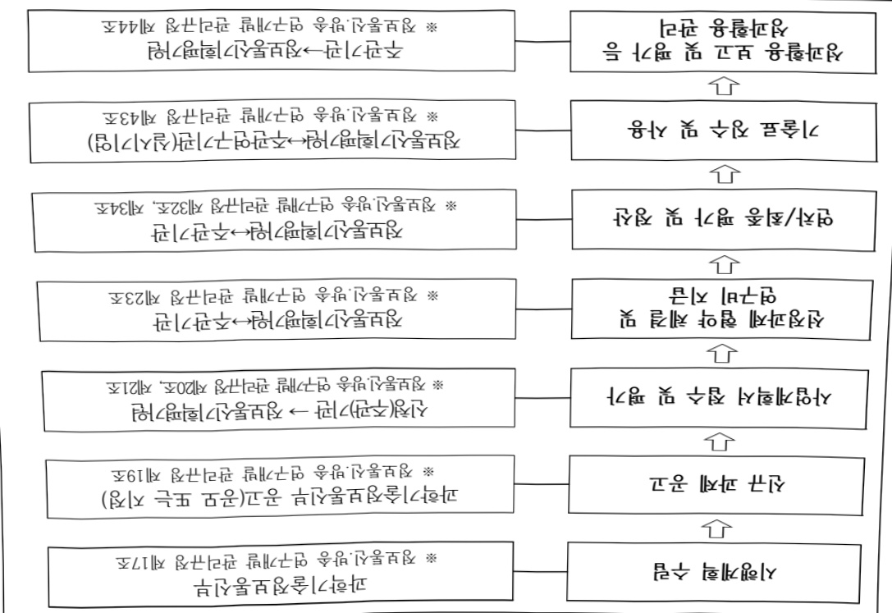

# 공존가능한 신뢰 AI를 위한 AI Safety 기술개발

**해당 페이지**: PDF 719 ~ 724 쪽 해당

**부처**: 과학기술정보통신부
**분야**: 통신
**회계유형**: 일반
**2026 확정예산**: 7950.0 백만원
**전년대비 증감률**: None%
**AI 도메인**: 보안/사이버

---

<table border=1 style='margin: auto; word-wrap: break-word;'><tr><td style='text-align: center; word-wrap: break-word;'>사 업 명</td></tr><tr><td style='text-align: center; word-wrap: break-word;'>(1) 공존가능한 신뢰 AI를 위한 AI Safety 기술개발 (2601-390)</td></tr></table>

## □ 사업 코드 정보

<table border=1 style='margin: auto; word-wrap: break-word;'><tr><td style='text-align: center; word-wrap: break-word;'>구분</td><td style='text-align: center; word-wrap: break-word;'>회계</td><td style='text-align: center; word-wrap: break-word;'>소관</td><td style='text-align: center; word-wrap: break-word;'>실국(기관)</td><td style='text-align: center; word-wrap: break-word;'>계정</td><td style='text-align: center; word-wrap: break-word;'>분야</td><td style='text-align: center; word-wrap: break-word;'>부문</td></tr><tr><td style='text-align: center; word-wrap: break-word;'>코드</td><td rowspan="2">일반</td><td rowspan="2">과학기술정보통신부</td><td rowspan="2">인공지능기반정책관</td><td rowspan="2">-</td><td style='text-align: center; word-wrap: break-word;'>130</td><td style='text-align: center; word-wrap: break-word;'>133</td></tr><tr><td style='text-align: center; word-wrap: break-word;'>명칭</td><td style='text-align: center; word-wrap: break-word;'>통신</td><td style='text-align: center; word-wrap: break-word;'>정보통신</td></tr></table>

<table border=1 style='margin: auto; word-wrap: break-word;'><tr><td style='text-align: center; word-wrap: break-word;'>구분</td><td style='text-align: center; word-wrap: break-word;'>프로그램</td><td style='text-align: center; word-wrap: break-word;'>단위사업</td><td style='text-align: center; word-wrap: break-word;'>세부사업</td></tr><tr><td style='text-align: center; word-wrap: break-word;'>코드</td><td style='text-align: center; word-wrap: break-word;'>2600</td><td style='text-align: center; word-wrap: break-word;'>2601</td><td style='text-align: center; word-wrap: break-word;'>390</td></tr><tr><td style='text-align: center; word-wrap: break-word;'>명칭</td><td style='text-align: center; word-wrap: break-word;'>인공지능데이터진흥</td><td style='text-align: center; word-wrap: break-word;'>AI기술개발</td><td style='text-align: center; word-wrap: break-word;'>공존가능한 신뢰 AI를 위한 AI Safety 기술개발</td></tr></table>

□ 사업 성격 (공통요구자료 Ⅱ-1 작성유의사항 4. 참조, 해당하는 사항에 “○” 표시)

<table border=1 style='margin: auto; word-wrap: break-word;'><tr><td colspan="6">☐ 사업 성격 (공통요구자료 Ⅱ-1 작성유의사항 4. 애당하는 사항에 “ㅇ” 표시)</td></tr><tr><td rowspan="2">신규 계속</td><td rowspan="2">완료</td><td rowspan="2">예비타당성 실시여부</td><td rowspan="2">총사업비 관리대상</td><td rowspan="2">총액계상 예산사업</td><td style='text-align: center; word-wrap: break-word;'>사업소관 변경정보</td></tr><tr><td style='text-align: center; word-wrap: break-word;'>2025예산 시 소관</td></tr><tr><td style='text-align: center; word-wrap: break-word;'></td><td style='text-align: center; word-wrap: break-word;'>O</td><td style='text-align: center; word-wrap: break-word;'></td><td style='text-align: center; word-wrap: break-word;'></td><td style='text-align: center; word-wrap: break-word;'></td><td style='text-align: center; word-wrap: break-word;'></td></tr></table>

□ 사업 지원 형태 및 지원을 (최소한 한 개는 반드시 선택하시오. 해당사항에 ○ 표시)

<table border=1 style='margin: auto; word-wrap: break-word;'><tr><td style='text-align: center; word-wrap: break-word;'>직접</td><td style='text-align: center; word-wrap: break-word;'>출자</td><td style='text-align: center; word-wrap: break-word;'>출연</td><td style='text-align: center; word-wrap: break-word;'>보조</td><td style='text-align: center; word-wrap: break-word;'>융자</td><td style='text-align: center; word-wrap: break-word;'>국고보조율(%)</td><td style='text-align: center; word-wrap: break-word;'>융자율(%)</td></tr><tr><td style='text-align: center; word-wrap: break-word;'></td><td style='text-align: center; word-wrap: break-word;'></td><td style='text-align: center; word-wrap: break-word;'>O</td><td style='text-align: center; word-wrap: break-word;'></td><td style='text-align: center; word-wrap: break-word;'></td><td style='text-align: center; word-wrap: break-word;'></td><td style='text-align: center; word-wrap: break-word;'></td></tr></table>

## 사업 소관부처 및 시행주체

<table border=1 style='margin: auto; word-wrap: break-word;'><tr><td style='text-align: center; word-wrap: break-word;'>사업명</td><td colspan="2">구분</td></tr><tr><td rowspan="3">공존가능한 신뢰 AI를 위한 AI Safety 기술개발</td><td rowspan="2">소관부처</td><td style='text-align: center; word-wrap: break-word;'>인공지능정책실 인공지능정책기획관</td></tr><tr><td style='text-align: center; word-wrap: break-word;'>인공지능안전신뢰정책과</td></tr><tr><td style='text-align: center; word-wrap: break-word;'>사업시행주체</td><td style='text-align: center; word-wrap: break-word;'>정보통신기획평가원</td></tr></table>

---

### 가. 예산 총괄표

(단위: 백만원, %)

<table border=1 style='margin: auto; word-wrap: break-word;'><tr><td rowspan="2">사업명</td><td rowspan="2">2024년 결산</td><td colspan="2">2025년 예산</td><td colspan="2">2026년 예산</td><td rowspan="2">중감(B-A)</td><td rowspan="2">(B-A)/A</td></tr><tr><td style='text-align: center; word-wrap: break-word;'>본예산</td><td style='text-align: center; word-wrap: break-word;'>추경*(A)</td><td style='text-align: center; word-wrap: break-word;'>요구안</td><td style='text-align: center; word-wrap: break-word;'>본예산(B)</td></tr><tr><td style='text-align: center; word-wrap: break-word;'>공존가능한 신뢰 AI를 위한 AI Safety 기술개발</td><td style='text-align: center; word-wrap: break-word;'>-</td><td style='text-align: center; word-wrap: break-word;'>7,950</td><td style='text-align: center; word-wrap: break-word;'>7,950</td><td style='text-align: center; word-wrap: break-word;'>7,950</td><td style='text-align: center; word-wrap: break-word;'>7,950</td><td style='text-align: center; word-wrap: break-word;'>-</td><td style='text-align: center; word-wrap: break-word;'>전년동</td></tr></table>

□ 기능별(내역사업별) 예산 내역

(단위: 백만원)

<table border=1 style='margin: auto; word-wrap: break-word;'><tr><td rowspan="2"></td><td colspan="5">2024</td><td colspan="5">2025</td><td rowspan="2">2026 倉圧</td></tr><tr><td style='text-align: center; word-wrap: break-word;'>倉圧の (専門)</td><td style='text-align: center; word-wrap: break-word;'>倉圧の 専門</td><td style='text-align: center; word-wrap: break-word;'>倉圧の 専門</td><td style='text-align: center; word-wrap: break-word;'>倉圧の 専門</td><td style='text-align: center; word-wrap: break-word;'>倉圧の 専門</td><td style='text-align: center; word-wrap: break-word;'>倉圧の (専門)</td><td style='text-align: center; word-wrap: break-word;'>倉圧の 専門</td><td style='text-align: center; word-wrap: break-word;'>倉圧の 専門</td><td style='text-align: center; word-wrap: break-word;'>倉圧の 専門</td><td style='text-align: center; word-wrap: break-word;'>倉圧の 専門</td></tr><tr><td style='text-align: center; word-wrap: break-word;'>○ 기능별 분류(합계)</td><td style='text-align: center; word-wrap: break-word;'>-</td><td style='text-align: center; word-wrap: break-word;'>-</td><td style='text-align: center; word-wrap: break-word;'>-</td><td style='text-align: center; word-wrap: break-word;'>-</td><td style='text-align: center; word-wrap: break-word;'>-</td><td style='text-align: center; word-wrap: break-word;'>7,950</td><td style='text-align: center; word-wrap: break-word;'>7,950</td><td style='text-align: center; word-wrap: break-word;'>7,950</td><td style='text-align: center; word-wrap: break-word;'>-</td><td style='text-align: center; word-wrap: break-word;'>-</td><td style='text-align: center; word-wrap: break-word;'>7,950</td></tr><tr><td style='text-align: center; word-wrap: break-word;'>· 공존가능한 신뢰 AI를 위한 AI Safety 기술개발</td><td style='text-align: center; word-wrap: break-word;'>-</td><td style='text-align: center; word-wrap: break-word;'>-</td><td style='text-align: center; word-wrap: break-word;'>-</td><td style='text-align: center; word-wrap: break-word;'>-</td><td style='text-align: center; word-wrap: break-word;'>-</td><td style='text-align: center; word-wrap: break-word;'>7,950</td><td style='text-align: center; word-wrap: break-word;'>7,950</td><td style='text-align: center; word-wrap: break-word;'>7,950</td><td style='text-align: center; word-wrap: break-word;'>-</td><td style='text-align: center; word-wrap: break-word;'>-</td><td style='text-align: center; word-wrap: break-word;'>7,950</td></tr></table>

### 나. 사업설명자료

## 1 ) 사업목적·내용

- (양손가능한 신뢰 AI를 위한 AI Safety 기술개발) 지속가능한 AI 혁신의 전제는 'AI Safety' 확보로, 고성능·다양성·자율성을 갖춘 첨단 AI의 실존·잠재위험을 완화·제거하기 위한 핵심기술 개발

## 2 ) 사업개요

## ☐ 사업근거 및 추진경위

① 법령상 근거 및 조항

- 인공지능기본법 제13조(인공지능기술 개발 및 안전한 이용 지원)

- 지능정보화기본법 제21조(기술기준)

- 정보통신산업진흥법 제7조(정보통신기술진흥 시행계획)

- 정보통신 진흥 및 융합 활성화 등에 관한 특별법 제32조(정보통신융합 등 기술서비스 개발 등의 지원)

---

② 추진경위

°'새로운 디지털 질서 정립 추진계획('24.5., 국무회의)

- AI 안전 전담조직 마련, AI 안전 R&D 추진 등

°'AI-반도체 이니셔티브 전략('24..4., 과학기술자문회의)

- 9대 기술혁신 과제 중 3번과제로 '공존 가능한 신뢰 AI를 위한 AI safety' 기술개발 과제 포함

° 'AI 서울 정상회의'('24.5.)

- AI 안전 평가·연구를 추진하는 대한민국 AI 안전연구소 설립

- 주요국 AI 안전연구소 간 협력 및 AI 안전 확보를 위한 연구협력

° 정부 123대 국정과제

- 23. (안전과 책임 기반의 AI 기본사회 실현)

## 주요내용

① 사업규모

- 총사업비(해당되는 경우에만 기재) : 471억원

- 사업기간 : '25년 ~ '28년

- 최근 5년 간 투입된 사업비(예산액기준, 추경편성한 연도에는 추경포함)

<table border=1 style='margin: auto; word-wrap: break-word;'><tr><td style='text-align: center; word-wrap: break-word;'>연도</td><td style='text-align: center; word-wrap: break-word;'>2022</td><td style='text-align: center; word-wrap: break-word;'>2023</td><td style='text-align: center; word-wrap: break-word;'>2024</td><td style='text-align: center; word-wrap: break-word;'>2025</td><td style='text-align: center; word-wrap: break-word;'>2026(안)</td></tr><tr><td style='text-align: center; word-wrap: break-word;'>사업비</td><td style='text-align: center; word-wrap: break-word;'>-</td><td style='text-align: center; word-wrap: break-word;'>-</td><td style='text-align: center; word-wrap: break-word;'>-</td><td style='text-align: center; word-wrap: break-word;'>7,950</td><td style='text-align: center; word-wrap: break-word;'>7,950</td></tr></table>

-기타: 해당없음

② 사업추진체계

- 사업시행방법 : 출연

- 사업시행주체 : 정보통신기획평가원

- 사업 수혜자 : 산·학·연 등

- 보조, 율자, 줄연, 줄자 능의 경우 보조·율자 등 지원 비율 및 법적근거

<table border=1 style='margin: auto; word-wrap: break-word;'><tr><td style='text-align: center; word-wrap: break-word;'>내역사업명</td><td style='text-align: center; word-wrap: break-word;'>구분</td><td style='text-align: center; word-wrap: break-word;'>피보조·피출연 등 기관명</td><td style='text-align: center; word-wrap: break-word;'>지원 금액 (2026예산안)</td><td style='text-align: center; word-wrap: break-word;'>지원 비율(%)</td><td style='text-align: center; word-wrap: break-word;'>보조율 법적근거 (해당 조항)</td></tr><tr><td style='text-align: center; word-wrap: break-word;'>공 존 가 능 한 신 퇴 AI를 위한 AI Safety 기술개발</td><td style='text-align: center; word-wrap: break-word;'>출연</td><td style='text-align: center; word-wrap: break-word;'>정보통신 기획 평가원</td><td style='text-align: center; word-wrap: break-word;'>7,950</td><td style='text-align: center; word-wrap: break-word;'>100</td><td style='text-align: center; word-wrap: break-word;'>AI기본법 제13조(인공지능기술 개발 및 안전한 이용 지원) 정보통신산업진흥법 제7조(정보통신기술 진흥 시행계획) 정보통신 진흥 및 융합 활성화 등에 관한 특별법 제32조(정보통신융합 등 기술·서비스 개발 등의 지원)</td></tr></table>

---

## 3 ) 2026년도 예산 산출 근거

<table border=1 style='margin: auto; word-wrap: break-word;'><tr><td style='text-align: center; word-wrap: break-word;'>☐ 공존가능한 신뢰 AI를 위한 AI Safety 기술개발 : (&#x27;25년 추경) 7,950백만원 → (2026 예산안) 7,950백만원, 전년동 ※ 추경 해당사항 없음</td></tr><tr><td style='text-align: center; word-wrap: break-word;'>① 공존가능한 신뢰 AI를 위한 AI Safety 기술개발 : (2025 추경) 7,950백만원 → (2026 예산안) 7,950백만원, 전년동 - (요구) AI-반도체 이니셔티브 전략(&#x27;24.4월) 등에 따라 글로벌 산업 경쟁력의 핵심 원천인 국가 차원 AI안전성 기술 확보를 위한 예산 요구 - (산출) ① (계속 과제) 1,987.5백만원 × 4개 과제 × 12/12개월 = 2,650백만원</td></tr></table>

## 4 ) 사업효과

사업영향, 산출물 성과지표 등

① 2022~2026년도 성과계획서 상 성과지표 및 최근 5년간 성과 달성도

<table border=1 style='margin: auto; word-wrap: break-word;'><tr><td style='text-align: center; word-wrap: break-word;'>성과지표</td><td style='text-align: center; word-wrap: break-word;'>구분</td><td style='text-align: center; word-wrap: break-word;'>2022</td><td style='text-align: center; word-wrap: break-word;'>2023</td><td style='text-align: center; word-wrap: break-word;'>2024</td><td style='text-align: center; word-wrap: break-word;'>2025</td><td style='text-align: center; word-wrap: break-word;'>2026</td><td style='text-align: center; word-wrap: break-word;'>2026 목표치산출근거</td><td style='text-align: center; word-wrap: break-word;'>측정산식(또는 측정방법)</td><td style='text-align: center; word-wrap: break-word;'>자료수집방법(또는 자료출처)</td></tr><tr><td rowspan="3">mrnIF 지수(단위: 점)</td><td style='text-align: center; word-wrap: break-word;'>목표</td><td style='text-align: center; word-wrap: break-word;'>-</td><td style='text-align: center; word-wrap: break-word;'>-</td><td style='text-align: center; word-wrap: break-word;'>-</td><td style='text-align: center; word-wrap: break-word;'>신규</td><td style='text-align: center; word-wrap: break-word;'>60</td><td rowspan="3">과제2차년도(26)부터목표치산출,AI 분야 R&amp;D 사업 목표치참고하여 60점으로설정*사람중심AI핵심원전기술개발의목표치(23년59.60)</td><td rowspan="3">(NxrnIFj - 1)/(N-1) x 100(N: 해당분야내학술지수,rnIFj: 순위보정영향력지수)</td><td rowspan="3">NTIS, 관리기관의등록증</td></tr><tr><td style='text-align: center; word-wrap: break-word;'>실적</td><td style='text-align: center; word-wrap: break-word;'>-</td><td style='text-align: center; word-wrap: break-word;'>-</td><td style='text-align: center; word-wrap: break-word;'>-</td><td style='text-align: center; word-wrap: break-word;'>-</td><td style='text-align: center; word-wrap: break-word;'>-</td></tr><tr><td style='text-align: center; word-wrap: break-word;'>달성도</td><td style='text-align: center; word-wrap: break-word;'>-</td><td style='text-align: center; word-wrap: break-word;'>-</td><td style='text-align: center; word-wrap: break-word;'>-</td><td style='text-align: center; word-wrap: break-word;'>-</td><td style='text-align: center; word-wrap: break-word;'>-</td></tr><tr><td rowspan="3">실증 또는 사업화 건수(단위: 건수)</td><td style='text-align: center; word-wrap: break-word;'>목표</td><td style='text-align: center; word-wrap: break-word;'>-</td><td style='text-align: center; word-wrap: break-word;'>-</td><td style='text-align: center; word-wrap: break-word;'>-</td><td style='text-align: center; word-wrap: break-word;'>신규</td><td style='text-align: center; word-wrap: break-word;'>5</td><td rowspan="3">기술개발결과물(25~28)의실증 및 사업화실적으로 설정(28년 5년)</td><td rowspan="3">실증사례 및 사업화 업체건수</td><td rowspan="3">성과분석보고서</td></tr><tr><td style='text-align: center; word-wrap: break-word;'>실적</td><td style='text-align: center; word-wrap: break-word;'>-</td><td style='text-align: center; word-wrap: break-word;'>-</td><td style='text-align: center; word-wrap: break-word;'>-</td><td style='text-align: center; word-wrap: break-word;'>-</td><td style='text-align: center; word-wrap: break-word;'>-</td></tr><tr><td style='text-align: center; word-wrap: break-word;'>달성도</td><td style='text-align: center; word-wrap: break-word;'>-</td><td style='text-align: center; word-wrap: break-word;'>-</td><td style='text-align: center; word-wrap: break-word;'>-</td><td style='text-align: center; word-wrap: break-word;'>-</td><td style='text-align: center; word-wrap: break-word;'>-</td></tr><tr><td rowspan="3">특허 등급지수(단위: 점)</td><td style='text-align: center; word-wrap: break-word;'>목표</td><td style='text-align: center; word-wrap: break-word;'>-</td><td style='text-align: center; word-wrap: break-word;'>-</td><td style='text-align: center; word-wrap: break-word;'>-</td><td style='text-align: center; word-wrap: break-word;'>신규</td><td style='text-align: center; word-wrap: break-word;'>4</td><td rowspan="3">과제2차년도(26)부터목표치산출,AI 분야 R&amp;D 사업 목표치참고하여4점(B등급)으로설정*사람중심AI핵심원전기술개발의목표치(23년 3.94)</td><td rowspan="2">$ \sum(A \times B) $</td><td rowspan="3">NTIS, 한국발명진흥회</td></tr><tr><td style='text-align: center; word-wrap: break-word;'>실적</td><td style='text-align: center; word-wrap: break-word;'>-</td><td style='text-align: center; word-wrap: break-word;'>-</td><td style='text-align: center; word-wrap: break-word;'>-</td><td style='text-align: center; word-wrap: break-word;'>-</td><td style='text-align: center; word-wrap: break-word;'>-</td></tr><tr><td style='text-align: center; word-wrap: break-word;'>달성도</td><td style='text-align: center; word-wrap: break-word;'>-</td><td style='text-align: center; word-wrap: break-word;'>-</td><td style='text-align: center; word-wrap: break-word;'>-</td><td style='text-align: center; word-wrap: break-word;'>-</td><td style='text-align: center; word-wrap: break-word;'>-</td><td style='text-align: center; word-wrap: break-word;'>특허등록건수(A: 특허등급별가중치, B: 등급별특허성과 건수)</td></tr></table>

② 성과지표 이외의 연도별 사업추진 경과 및 실적

<table border=1 style='margin: auto; word-wrap: break-word;'><tr><td style='text-align: center; word-wrap: break-word;'>2025</td><td style='text-align: center; word-wrap: break-word;'>2025년 신규 과제 4개 협약 체결 및 연구 수행</td></tr></table>

③ 향후(2026년도 이후) 기대효과 : 개조식으로 작성, 건 별로 계량적 수치 제시

o 국내 인공지능 기술주권 확보를 위한 외산 솔루션 국내 진입 방지 및 국내 인공 지능 산업경쟁력 강화에 기여

◦ AI Safety R&D 과제 수행을 통해 국내 우수 AI 인력 참여로 기업에 전문인력 확산 및 대학 인력양성을 통해 외국으로 인력 유출 방지, 이에 따른 국내 인공 지능 연구 기반 마련

---

7) 사업 집행절차

---

### 다. 최근 4년간 결산내역

## 1 ) 결산표

☐ 부처 결산내역

(단위: 백만원, %)

<table border=1 style='margin: auto; word-wrap: break-word;'><tr><td rowspan="2">연도</td><td colspan="3">예산액</td><td rowspan="2">예산현액(A)</td><td rowspan="2">집행액(B)</td><td rowspan="2">집행률(B/A)</td><td rowspan="2">다음연도이월액</td><td rowspan="2">불용액</td></tr><tr><td style='text-align: center; word-wrap: break-word;'>본예산</td><td style='text-align: center; word-wrap: break-word;'>추경증감액</td><td style='text-align: center; word-wrap: break-word;'>추경</td></tr><tr><td style='text-align: center; word-wrap: break-word;'>2022</td><td style='text-align: center; word-wrap: break-word;'>-</td><td style='text-align: center; word-wrap: break-word;'>-</td><td style='text-align: center; word-wrap: break-word;'>-</td><td style='text-align: center; word-wrap: break-word;'>-</td><td style='text-align: center; word-wrap: break-word;'>-</td><td style='text-align: center; word-wrap: break-word;'>-</td><td style='text-align: center; word-wrap: break-word;'>-</td><td style='text-align: center; word-wrap: break-word;'>-</td></tr><tr><td style='text-align: center; word-wrap: break-word;'>2023</td><td style='text-align: center; word-wrap: break-word;'>-</td><td style='text-align: center; word-wrap: break-word;'>-</td><td style='text-align: center; word-wrap: break-word;'>-</td><td style='text-align: center; word-wrap: break-word;'>-</td><td style='text-align: center; word-wrap: break-word;'>-</td><td style='text-align: center; word-wrap: break-word;'>-</td><td style='text-align: center; word-wrap: break-word;'>-</td><td style='text-align: center; word-wrap: break-word;'>-</td></tr><tr><td style='text-align: center; word-wrap: break-word;'>2024</td><td style='text-align: center; word-wrap: break-word;'>-</td><td style='text-align: center; word-wrap: break-word;'>-</td><td style='text-align: center; word-wrap: break-word;'>-</td><td style='text-align: center; word-wrap: break-word;'>-</td><td style='text-align: center; word-wrap: break-word;'>-</td><td style='text-align: center; word-wrap: break-word;'>-</td><td style='text-align: center; word-wrap: break-word;'>-</td><td style='text-align: center; word-wrap: break-word;'>-</td></tr><tr><td style='text-align: center; word-wrap: break-word;'>2025</td><td style='text-align: center; word-wrap: break-word;'>7,950</td><td style='text-align: center; word-wrap: break-word;'>-</td><td style='text-align: center; word-wrap: break-word;'>7,950</td><td style='text-align: center; word-wrap: break-word;'>-</td><td style='text-align: center; word-wrap: break-word;'>-</td><td style='text-align: center; word-wrap: break-word;'>-</td><td style='text-align: center; word-wrap: break-word;'>7,950</td><td style='text-align: center; word-wrap: break-word;'>7,950</td></tr></table>

2) 주요 결산사항 : 해당없음

---

### 원본 PDF 크롭 이미지

