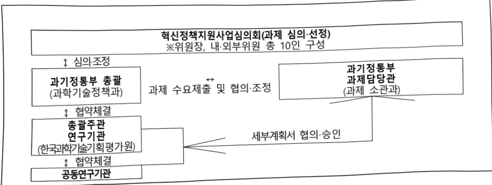

# 과학기술혁신정책 지원(R&D)

**해당 페이지**: PDF 744 ~ 749 쪽 해당

**부처**: 과학기술정보통신부
**분야**: 과학기술
**회계유형**: 일반회계
**2026 확정예산**: 8936.0 백만원
**전년대비 증감률**: 2.1%
**AI 도메인**: R&D 지원

---

<table border=1 style='margin: auto; word-wrap: break-word;'><tr><td style='text-align: center; word-wrap: break-word;'>사 업 명</td></tr><tr><td style='text-align: center; word-wrap: break-word;'>(1) 과학기술혁신정책지원(R&amp;D) (1031-401)</td></tr></table>

사업 코드 정보

<table border=1 style='margin: auto; word-wrap: break-word;'><tr><td style='text-align: center; word-wrap: break-word;'>구분</td><td style='text-align: center; word-wrap: break-word;'>회계</td><td style='text-align: center; word-wrap: break-word;'>소관</td><td style='text-align: center; word-wrap: break-word;'>실국(기관)</td><td rowspan="3">계정</td><td style='text-align: center; word-wrap: break-word;'>분야</td><td style='text-align: center; word-wrap: break-word;'>부문</td></tr><tr><td style='text-align: center; word-wrap: break-word;'>코드</td><td rowspan="2">11 일반회계</td><td rowspan="2">13 파학기술 정보통신부</td><td rowspan="2">과학기술정책국</td><td style='text-align: center; word-wrap: break-word;'>150</td><td style='text-align: center; word-wrap: break-word;'>152</td></tr><tr><td style='text-align: center; word-wrap: break-word;'>명칭</td><td style='text-align: center; word-wrap: break-word;'>과학기술</td><td style='text-align: center; word-wrap: break-word;'>과학기술연구지원</td></tr></table>

<table border=1 style='margin: auto; word-wrap: break-word;'><tr><td style='text-align: center; word-wrap: break-word;'>구분</td><td style='text-align: center; word-wrap: break-word;'>프로그램</td><td style='text-align: center; word-wrap: break-word;'>단위사업</td><td style='text-align: center; word-wrap: break-word;'>세부사업</td></tr><tr><td style='text-align: center; word-wrap: break-word;'>코드</td><td style='text-align: center; word-wrap: break-word;'>1000</td><td style='text-align: center; word-wrap: break-word;'>1031</td><td style='text-align: center; word-wrap: break-word;'>401</td></tr><tr><td style='text-align: center; word-wrap: break-word;'>명칭</td><td style='text-align: center; word-wrap: break-word;'>과학기술혁신지원</td><td style='text-align: center; word-wrap: break-word;'>과학기술종합조정지원</td><td style='text-align: center; word-wrap: break-word;'>과학기술혁신정책지원(R&amp;D)</td></tr></table>

<table border=1 style='margin: auto; word-wrap: break-word;'><tr><td colspan="6">☐ 사업 성격 (공통요구자료 Ⅱ-1 작성유의사항 4. 참조, 해당하는 사항에 “○” 표시)</td></tr><tr><td rowspan="2">신규 계속 완료</td><td rowspan="2">예비타당성 실시여부</td><td rowspan="2">총사업비 관리대상</td><td rowspan="2">총액계상 예산사업</td><td colspan="2">사업소관 변경정보</td></tr><tr><td colspan="2">2025예산 시 소관</td></tr><tr><td style='text-align: center; word-wrap: break-word;'></td><td style='text-align: center; word-wrap: break-word;'>○</td><td style='text-align: center; word-wrap: break-word;'></td><td style='text-align: center; word-wrap: break-word;'></td><td colspan="2"></td></tr></table>

□ 사업 지원 형태 및 지원을 (최소한 한 개는 반드시 선택하시오. 해당사항에 0 표시)

<table border=1 style='margin: auto; word-wrap: break-word;'><tr><td style='text-align: center; word-wrap: break-word;'>직접</td><td style='text-align: center; word-wrap: break-word;'>출자</td><td style='text-align: center; word-wrap: break-word;'>출연</td><td style='text-align: center; word-wrap: break-word;'>보조</td><td style='text-align: center; word-wrap: break-word;'>융자</td><td style='text-align: center; word-wrap: break-word;'>국고보조율(%)</td><td style='text-align: center; word-wrap: break-word;'>융자율(%)</td></tr><tr><td style='text-align: center; word-wrap: break-word;'></td><td style='text-align: center; word-wrap: break-word;'></td><td style='text-align: center; word-wrap: break-word;'>○</td><td style='text-align: center; word-wrap: break-word;'></td><td style='text-align: center; word-wrap: break-word;'></td><td style='text-align: center; word-wrap: break-word;'></td><td style='text-align: center; word-wrap: break-word;'></td></tr></table>

사업 소관부처 및 시행주체

<table border=1 style='margin: auto; word-wrap: break-word;'><tr><td style='text-align: center; word-wrap: break-word;'>사업명</td><td colspan="2">구분</td></tr><tr><td rowspan="2">과학기술혁신정책지원(R&amp;D)</td><td style='text-align: center; word-wrap: break-word;'>소관부처</td><td style='text-align: center; word-wrap: break-word;'>과학기술혁신본부 과학기술정책국 과학기술정책과</td></tr><tr><td style='text-align: center; word-wrap: break-word;'>사업시행주체</td><td style='text-align: center; word-wrap: break-word;'>한국과학기술기획평가원</td></tr></table>

---

### 가.예산 총괄표

(단위: 백만원, %)

<table border=1 style='margin: auto; word-wrap: break-word;'><tr><td rowspan="2">사업명</td><td rowspan="2">2024년 결산</td><td colspan="2">2025년 예산</td><td colspan="2">2026년 예산</td><td rowspan="2">증감(B-A)</td><td rowspan="2">(B-A)/A</td></tr><tr><td style='text-align: center; word-wrap: break-word;'>본예산</td><td style='text-align: center; word-wrap: break-word;'>추경(A)</td><td style='text-align: center; word-wrap: break-word;'>요구안</td><td style='text-align: center; word-wrap: break-word;'>본예산(B)</td></tr><tr><td style='text-align: center; word-wrap: break-word;'>과학기술혁신정책지원(R&amp;D)</td><td style='text-align: center; word-wrap: break-word;'>9,720</td><td style='text-align: center; word-wrap: break-word;'>8,751</td><td style='text-align: center; word-wrap: break-word;'>8,751</td><td style='text-align: center; word-wrap: break-word;'>9,139</td><td style='text-align: center; word-wrap: break-word;'>8,936</td><td style='text-align: center; word-wrap: break-word;'>185</td><td style='text-align: center; word-wrap: break-word;'>2.1</td></tr></table>

□ 기능별(내역사업별) 예산 내역

(단위:백만원)

<table border=1 style='margin: auto; word-wrap: break-word;'><tr><td rowspan="2"></td><td colspan="5">2024</td><td colspan="5">2025</td><td rowspan="2">2026 倉寧</td></tr><tr><td style='text-align: center; word-wrap: break-word;'>倉寧の (추경)</td><td style='text-align: center; word-wrap: break-word;'>倉寧の 현재</td><td style='text-align: center; word-wrap: break-word;'>집행의</td><td style='text-align: center; word-wrap: break-word;'>이월의</td><td style='text-align: center; word-wrap: break-word;'>불용의</td><td style='text-align: center; word-wrap: break-word;'>倉寧の (추경)</td><td style='text-align: center; word-wrap: break-word;'>倉寧の 현재</td><td style='text-align: center; word-wrap: break-word;'>집행의</td><td style='text-align: center; word-wrap: break-word;'>이월의</td><td style='text-align: center; word-wrap: break-word;'>불용의</td></tr><tr><td style='text-align: center; word-wrap: break-word;'>○ 기능별 분류(합계)</td><td style='text-align: center; word-wrap: break-word;'>9,723</td><td style='text-align: center; word-wrap: break-word;'>9,723</td><td style='text-align: center; word-wrap: break-word;'>9,720</td><td style='text-align: center; word-wrap: break-word;'>-</td><td style='text-align: center; word-wrap: break-word;'>3</td><td style='text-align: center; word-wrap: break-word;'>8,751</td><td style='text-align: center; word-wrap: break-word;'>8,751</td><td style='text-align: center; word-wrap: break-word;'>8,731</td><td style='text-align: center; word-wrap: break-word;'>-</td><td style='text-align: center; word-wrap: break-word;'>20</td><td style='text-align: center; word-wrap: break-word;'>8,936</td></tr><tr><td rowspan="2">· 국가과학기술 시스템 혁신 지원 · 과학기술 인공지능 정책 총괄·조정</td><td style='text-align: center; word-wrap: break-word;'>9,723</td><td style='text-align: center; word-wrap: break-word;'>9,723</td><td style='text-align: center; word-wrap: break-word;'>9,720</td><td style='text-align: center; word-wrap: break-word;'>-</td><td style='text-align: center; word-wrap: break-word;'>3</td><td style='text-align: center; word-wrap: break-word;'>8,751</td><td style='text-align: center; word-wrap: break-word;'>8,751</td><td style='text-align: center; word-wrap: break-word;'>8,731</td><td style='text-align: center; word-wrap: break-word;'>-</td><td style='text-align: center; word-wrap: break-word;'>20</td><td style='text-align: center; word-wrap: break-word;'>8,751</td></tr><tr><td style='text-align: center; word-wrap: break-word;'>-</td><td style='text-align: center; word-wrap: break-word;'>-</td><td style='text-align: center; word-wrap: break-word;'>-</td><td style='text-align: center; word-wrap: break-word;'>-</td><td style='text-align: center; word-wrap: break-word;'>-</td><td style='text-align: center; word-wrap: break-word;'>-</td><td style='text-align: center; word-wrap: break-word;'>-</td><td style='text-align: center; word-wrap: break-word;'>-</td><td style='text-align: center; word-wrap: break-word;'>-</td><td style='text-align: center; word-wrap: break-word;'>-</td><td style='text-align: center; word-wrap: break-word;'>185</td></tr></table>

### 나. 사업설명자료

## 1 ) 사업목적·내용

- 과학기술기본법에 따른 범부처 국가과학기술정책 및 국가연구개발사업의 기획·조정·

평가 등 업무활동을 효율적으로 지원

- (국가과학기술시스템 혁신 지원) 국가 과학기술시스템 혁신을 위해 범부처 국가 과학 기술정책 수립, R&D 투자전략 수립, 성과관리·활용 등의 활동을 효율적으로 지원

- (과학기술 인공지능 정책 총괄·조정) 과학기술·인공지능 정책 방향성 제시, 연계·

- 조율 및 다양한 범부처·민간·지자체 협업 체계 운용

## 2 ) 사업개요

## ☐ 사업근거 및 추진경위

① 법령상 근거 및 조항 적시

- 과학기술기본법 제4조(국가 등의 책무와 과학기술인의 윤리) ①국가는 과학기술

혁신과 이를 통한 경제·사회 발전을 위하여 종합적인 시책을 세우고 추진하여야 한다.

---

과학기술기본법 제5조(과학기술 정책의 중시와 개방화 촉진) ①정부는 과학기술 정책의 수립과 추진을 통하여 과학기술이 국가의 경제적·사회적 문제를 해결하고 미래전략을 달성하는 중추적인 역할을 할 수 있도록 필요한 자원을 최대한 동원하여 창의적 연구개발과 개방형 과학기술혁신활동을 적극적으로 지원하여야 한다.

## ② 추진경위

-(00년) 범부처 과학기술 정책 및 국가R&D예산 우선순위 설정, 국가R&D 사업 조사·분석, 연구기획·평가·관리 등을 지원하기 위해 과학기술종합조정사업 신설 → 이후 지속 추진

- (20년) 사업명 변경(→과학기술혁신정책지원)

## 주요내용

① 사업규모

- 총사업비 : 해당없음

- 사업기간 : '00~계속

- 최근 5년 간 투입된 사업비

<table border=1 style='margin: auto; word-wrap: break-word;'><tr><td style='text-align: center; word-wrap: break-word;'>$ \underline{\text{角}} $</td><td style='text-align: center; word-wrap: break-word;'>2022</td><td style='text-align: center; word-wrap: break-word;'>2023</td><td style='text-align: center; word-wrap: break-word;'>2024</td><td style='text-align: center; word-wrap: break-word;'>2025</td><td style='text-align: center; word-wrap: break-word;'>2026</td></tr><tr><td style='text-align: center; word-wrap: break-word;'>$ \underline{\text{人}} $</td><td style='text-align: center; word-wrap: break-word;'>9,727</td><td style='text-align: center; word-wrap: break-word;'>9,827</td><td style='text-align: center; word-wrap: break-word;'>9,723</td><td style='text-align: center; word-wrap: break-word;'>8,751</td><td style='text-align: center; word-wrap: break-word;'>8,936</td></tr></table>

## ② 사업추진체계

- 사업시행방법 : 출연(100%)

- 사업시행주체 : 한국과학기술기획평가원

- 사업 수혜자 : 정부출연기관, 대학, 국공립연구기관 등

- 보조, 융자, 출연, 출자 등의 경우 보조·융자 등 지원 비율 및 법적근거

<table border=1 style='margin: auto; word-wrap: break-word;'><tr><td style='text-align: center; word-wrap: break-word;'>내역사업명</td><td style='text-align: center; word-wrap: break-word;'>구분</td><td style='text-align: center; word-wrap: break-word;'>피보조·피출연 등 기관명</td><td style='text-align: center; word-wrap: break-word;'>지원 금액 (2026예산)</td><td style='text-align: center; word-wrap: break-word;'>지원 비율(%)</td><td style='text-align: center; word-wrap: break-word;'>보조율 법적근거 (해당 조항)</td></tr><tr><td style='text-align: center; word-wrap: break-word;'>국가과학 기술시스템 혁신 지원</td><td style='text-align: center; word-wrap: break-word;'>출연</td><td style='text-align: center; word-wrap: break-word;'>한국과학 기술기획 평가원</td><td style='text-align: center; word-wrap: break-word;'>8,751</td><td style='text-align: center; word-wrap: break-word;'>100</td><td style='text-align: center; word-wrap: break-word;'>과학기술기본법 제20조</td></tr><tr><td style='text-align: center; word-wrap: break-word;'>과학기술 인공지능 정책 총괄·조정</td><td style='text-align: center; word-wrap: break-word;'>출연</td><td style='text-align: center; word-wrap: break-word;'>한국과학 기술기획 평가원</td><td style='text-align: center; word-wrap: break-word;'>185</td><td style='text-align: center; word-wrap: break-word;'>100</td><td style='text-align: center; word-wrap: break-word;'>과학기술기본법 제20조</td></tr></table>

---

## 3 ) 2026년도 예산 산출 근거

○ 과학기술혁신정책 지원 : (25) 8,751 → (26) 8,939 (+185)

- 국가과학기술시스템 혁신 지원 : (25) 8,751 → (26) 8,751 백만원 (전년동)

· 8,751 백만원 = 1개 과제 x 8,751 백만원 x 12/12개월

· 새성부 국정기조를 반영한 R&D 정책 및 전략 마련, '26에 수립해야 하는 법정 계획 연도별 시행계획의 원활한 수립, R&D투자전략 마련 및 성과 분석·활용 등을 위한 예산 반영

- 과학기술 인공지능 정책 총괄·조정 : (26) 185백만원 (신규)

· 185백만원 = 1개 과제 x 185백만원 x 12/12개월

· AI 3강 도약, 과학기술 5강 실현을 위한 범정부 과학기술·인공지능 정책 총괄·조정 및 신속한 이행 지원을 위한 예산 반영

## 4 ) 사업효과

☐ 사업영향, 산출물 성과지표 등

(1) 2022~2026년도 성과계획서 상 성과지표 및 최근 5년간 성과 달성도 : 미대상

② 성과지표 이외의 연도별 사업추진 경과 및 실적

<table border=1 style='margin: auto; word-wrap: break-word;'><tr><td style='text-align: center; word-wrap: break-word;'>2022</td><td style='text-align: center; word-wrap: break-word;'>- 과학기술기본법 등에 따른 &#x27;22년 법정 5개년 계획의 원활한 수립을 통한 과학기술 전략 마련- 지속적인 범부처 과학기술·R&amp;D 혁신을 위해 국가과학기술자문회의, 과기 장관회의에 상정·논의- 혁신정책 이행을 위한 과학기술기본법 체계 개편 및 국가필수전략기술 관련 법령 제정 등 제도적 기반 정비 추진- 중장기 R&amp;D 투자전략(&#x27;23~&#x27;27), 국가필수전략기술 투자방향 등 R&amp;D 투자전략 및 방향성 수립</td></tr><tr><td style='text-align: center; word-wrap: break-word;'>2023</td><td style='text-align: center; word-wrap: break-word;'>- 국가전략기술 육성과 관련된 범부처 추진체계를 지속 운영하고, 주요 정책 수단을 마련하여 본격 가동- 국가연구개발혁신법 연구현장 안착 지속 지원 및 연구성과평가법 개정에 따른 효과성 분석, 성과연감 등 신설업무 추진- 제5차 과학기술기본계획의 주요 후속조치 이행을 위한 체계를 마련하고, 세부 후속 정책 마련- 중장기 R&amp;D 투자전략(&#x27;23~&#x27;27), 국가전략기술 투자방향 등에 따라 R&amp;D 투자전략 및 방향성 수립 추진</td></tr><tr><td style='text-align: center; word-wrap: break-word;'>2024</td><td style='text-align: center; word-wrap: break-word;'>- 제5차 과학기술기본계획 이행을 위한 2025년도 시행계획 수립 및 국가첨단 전략기술 지정(안) 마련- 지역주도 과학기술정책의 안정적·효과적 추진 및 혁신역량을 통한 자생력 강화를 위한 정책과제 발굴 및 법·제도적 기반 구축- 국가전략기술 분야 국제협력 전략성 강화를 위한 데이터 기반의 협력 전략 분석 및 시각화 자료 구축- 미래 사회·기술변화 대비 기술분야별 R&amp;D 투자전략성 분석 및 투자전략 마련</td></tr></table>

---

<table border=1 style='margin: auto; word-wrap: break-word;'><tr><td style='text-align: center; word-wrap: break-word;'>2025</td><td style='text-align: center; word-wrap: break-word;'>- 제5차 과학기술기본계획 추진실적 점검 및 ‘26년 시행계획 수립 - 지방종합계획의 2025년도 추진실적 점검 및 2026년도 시행계획 수립 - 국가전략기술 혁신포럼 개최를 통한 국내외 전략기술 관련 이슈·현안 공유 및 민·관 합동 정책 대안 제시 - 제5차 연구성과 관리·활용 기본계획(안) 수립 등</td></tr></table>

③향후(2026년도 이후)기대효과

- 범부처 과학기술정책 및 R&D사업 기획·조정 강화를 통해 과학기술경쟁력을 제고하고, 국가R&D 성과창출·확산체계 구축

- R&D 투자 전략에 따른 예산배분·조정과 R&D 시스템 혁신을 통해 R&D 투자 효율성 및 성과제고

- 현장의 숨어있는 과학기술 규제를 발굴·개선함으로써 R&D시스템을 연구자

친화적으로 개편하고, 연구자 책임성 강화

- 대내외 각종 기술적 현안 및 국가적 이슈(전략기술 글로벌 정책, 국제 협력, 탄소중립 등)에

적시 대응하고 R&D 전략 마련

## 5 ) 타당성조사 및 예비타당성조사 시행여부 및 결과 요지 : 해당없음

## 6 ) 총사업비 대상사업 정보 : 해당없음

## 7 ) 사업 집행절차

8) 각종 평가 : 해당없음

---

### 다. 최근 4년간 결산내역

## 1 ) 결산표

☐ 부처 결산내역

(단위: 백만원, %)

<table border=1 style='margin: auto; word-wrap: break-word;'><tr><td rowspan="2">연도</td><td colspan="3">예산액</td><td rowspan="2">예산현액(A)</td><td rowspan="2">집행액(B)</td><td rowspan="2">집행률(B/A)</td><td rowspan="2">다음연도이월액</td><td rowspan="2">불용액</td></tr><tr><td style='text-align: center; word-wrap: break-word;'>본예산</td><td style='text-align: center; word-wrap: break-word;'>추경중감액</td><td style='text-align: center; word-wrap: break-word;'>추경</td></tr><tr><td style='text-align: center; word-wrap: break-word;'>2022</td><td style='text-align: center; word-wrap: break-word;'>9,727</td><td style='text-align: center; word-wrap: break-word;'>-</td><td style='text-align: center; word-wrap: break-word;'>9,727</td><td style='text-align: center; word-wrap: break-word;'>9,727</td><td style='text-align: center; word-wrap: break-word;'>9,727</td><td style='text-align: center; word-wrap: break-word;'>100</td><td style='text-align: center; word-wrap: break-word;'>-</td><td style='text-align: center; word-wrap: break-word;'>-</td></tr><tr><td style='text-align: center; word-wrap: break-word;'>2023</td><td style='text-align: center; word-wrap: break-word;'>9,827</td><td style='text-align: center; word-wrap: break-word;'>-</td><td style='text-align: center; word-wrap: break-word;'>9,827</td><td style='text-align: center; word-wrap: break-word;'>9,827</td><td style='text-align: center; word-wrap: break-word;'>9,827</td><td style='text-align: center; word-wrap: break-word;'>100</td><td style='text-align: center; word-wrap: break-word;'>-</td><td style='text-align: center; word-wrap: break-word;'>-</td></tr><tr><td style='text-align: center; word-wrap: break-word;'>2024</td><td style='text-align: center; word-wrap: break-word;'>9,723</td><td style='text-align: center; word-wrap: break-word;'>-</td><td style='text-align: center; word-wrap: break-word;'>9,723</td><td style='text-align: center; word-wrap: break-word;'>9,723</td><td style='text-align: center; word-wrap: break-word;'>9,720</td><td style='text-align: center; word-wrap: break-word;'>99.9</td><td style='text-align: center; word-wrap: break-word;'>-</td><td style='text-align: center; word-wrap: break-word;'>3</td></tr><tr><td style='text-align: center; word-wrap: break-word;'>2025</td><td style='text-align: center; word-wrap: break-word;'>8,751</td><td style='text-align: center; word-wrap: break-word;'>-</td><td style='text-align: center; word-wrap: break-word;'>8,751</td><td style='text-align: center; word-wrap: break-word;'>8,751</td><td style='text-align: center; word-wrap: break-word;'>8,731</td><td style='text-align: center; word-wrap: break-word;'>99.8</td><td style='text-align: center; word-wrap: break-word;'>-</td><td style='text-align: center; word-wrap: break-word;'>20</td></tr></table>

## 2 ) 주요 결산사항

2022~2025년 결산 주요사항

<table border=1 style='margin: auto; word-wrap: break-word;'><tr><td style='text-align: center; word-wrap: break-word;'>2022～2025</td><td style='text-align: center; word-wrap: break-word;'>해당없음</td></tr></table>

□ 2025년 이·전용 등 세부내역 : 해당없음

---

### 원본 PDF 크롭 이미지

