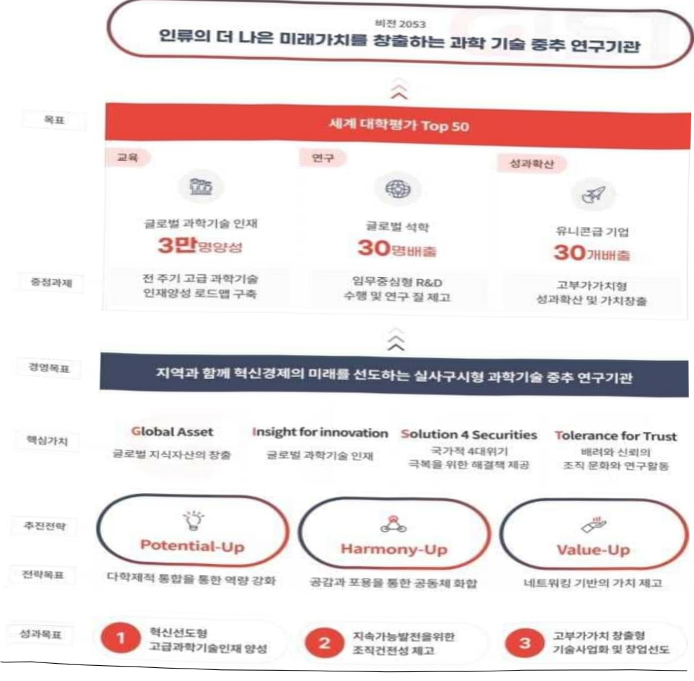
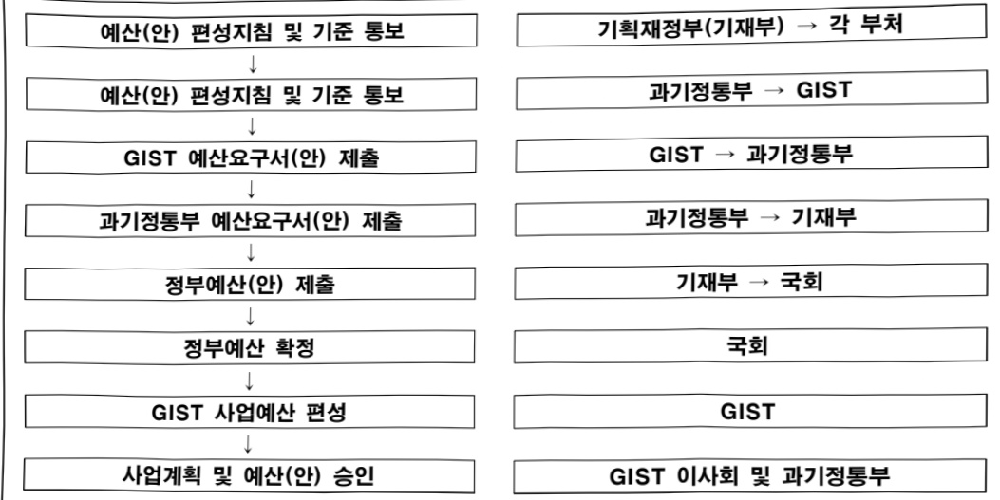

# 광주과학기술원 연구 운영비 지원(R&D)

**해당 페이지**: PDF 754 ~ 762 쪽 해당

**부처**: 과학기술정보통신부
**분야**: 과학기술
**회계유형**: 일반회계
**2026 확정예산**: 120610.0 백만원
**전년대비 증감률**: 23.5%
**AI 도메인**: R&D 지원

---

### 가. 예산 총괄표

(단위: 백만원, %)

<table border=1 style='margin: auto; word-wrap: break-word;'><tr><td rowspan="2">사업명</td><td rowspan="2">2024년 결산</td><td colspan="2">2025년 예산</td><td colspan="2">2026년 예산</td><td rowspan="2">중감(B-A)</td><td rowspan="2">(B-A)/A</td></tr><tr><td style='text-align: center; word-wrap: break-word;'>본예산</td><td style='text-align: center; word-wrap: break-word;'>추경*(A)</td><td style='text-align: center; word-wrap: break-word;'>요구안</td><td style='text-align: center; word-wrap: break-word;'>본예산(B)</td></tr><tr><td style='text-align: center; word-wrap: break-word;'>광주과학기술원연구운영비지원(R&amp;D)</td><td style='text-align: center; word-wrap: break-word;'>93,124</td><td style='text-align: center; word-wrap: break-word;'>97,634</td><td style='text-align: center; word-wrap: break-word;'>101,384</td><td style='text-align: center; word-wrap: break-word;'>117,461</td><td style='text-align: center; word-wrap: break-word;'>120,610</td><td style='text-align: center; word-wrap: break-word;'>22,976</td><td style='text-align: center; word-wrap: break-word;'>23.5</td></tr></table>

*추경: 추경증감액을 포함한 최종 예산액을 기재

## □ 기능별(내역사업별) 예산 내역

(단위:백만원)

<table border=1 style='margin: auto; word-wrap: break-word;'><tr><td rowspan="2"></td><td colspan="5">2024</td><td colspan="5">2025</td><td rowspan="2">2026예산</td></tr><tr><td style='text-align: center; word-wrap: break-word;'>예산액(추경)</td><td style='text-align: center; word-wrap: break-word;'>예산현액</td><td style='text-align: center; word-wrap: break-word;'>집행액</td><td style='text-align: center; word-wrap: break-word;'>이월액</td><td style='text-align: center; word-wrap: break-word;'>불용액</td><td style='text-align: center; word-wrap: break-word;'>예산액(추경)</td><td style='text-align: center; word-wrap: break-word;'>예산현액</td><td style='text-align: center; word-wrap: break-word;'>집행액</td><td style='text-align: center; word-wrap: break-word;'>이월액</td><td style='text-align: center; word-wrap: break-word;'>불용액</td></tr><tr><td style='text-align: center; word-wrap: break-word;'>○ 기능별 분류(합계)</td><td style='text-align: center; word-wrap: break-word;'>93,491</td><td style='text-align: center; word-wrap: break-word;'>93,491</td><td style='text-align: center; word-wrap: break-word;'>93,124</td><td style='text-align: center; word-wrap: break-word;'>-</td><td style='text-align: center; word-wrap: break-word;'>367</td><td style='text-align: center; word-wrap: break-word;'>101,384</td><td style='text-align: center; word-wrap: break-word;'>101,384</td><td style='text-align: center; word-wrap: break-word;'>101,019</td><td style='text-align: center; word-wrap: break-word;'>-</td><td style='text-align: center; word-wrap: break-word;'>365</td><td style='text-align: center; word-wrap: break-word;'>120,610</td></tr><tr><td style='text-align: center; word-wrap: break-word;'>·기관운영비</td><td style='text-align: center; word-wrap: break-word;'>42,714</td><td style='text-align: center; word-wrap: break-word;'>42,714</td><td style='text-align: center; word-wrap: break-word;'>42,347</td><td style='text-align: center; word-wrap: break-word;'>-</td><td style='text-align: center; word-wrap: break-word;'></td><td style='text-align: center; word-wrap: break-word;'>44,102</td><td style='text-align: center; word-wrap: break-word;'>44,102</td><td style='text-align: center; word-wrap: break-word;'>43,737</td><td style='text-align: center; word-wrap: break-word;'>-</td><td style='text-align: center; word-wrap: break-word;'>-</td><td style='text-align: center; word-wrap: break-word;'>45,545</td></tr><tr><td style='text-align: center; word-wrap: break-word;'>- 인건비</td><td style='text-align: center; word-wrap: break-word;'>33,172</td><td style='text-align: center; word-wrap: break-word;'>33,172</td><td style='text-align: center; word-wrap: break-word;'>32,805</td><td style='text-align: center; word-wrap: break-word;'>-</td><td style='text-align: center; word-wrap: break-word;'>367</td><td style='text-align: center; word-wrap: break-word;'>34,187</td><td style='text-align: center; word-wrap: break-word;'>34,187</td><td style='text-align: center; word-wrap: break-word;'>33,822</td><td style='text-align: center; word-wrap: break-word;'>-</td><td style='text-align: center; word-wrap: break-word;'>365</td><td style='text-align: center; word-wrap: break-word;'>35,704</td></tr><tr><td style='text-align: center; word-wrap: break-word;'>- 경상경비</td><td style='text-align: center; word-wrap: break-word;'>9,542</td><td style='text-align: center; word-wrap: break-word;'>9,542</td><td style='text-align: center; word-wrap: break-word;'>9,542</td><td style='text-align: center; word-wrap: break-word;'>-</td><td style='text-align: center; word-wrap: break-word;'>-</td><td style='text-align: center; word-wrap: break-word;'>9,915</td><td style='text-align: center; word-wrap: break-word;'>9,915</td><td style='text-align: center; word-wrap: break-word;'>9,915</td><td style='text-align: center; word-wrap: break-word;'>-</td><td style='text-align: center; word-wrap: break-word;'>-</td><td style='text-align: center; word-wrap: break-word;'>9,841</td></tr><tr><td style='text-align: center; word-wrap: break-word;'>·기관고유사업비</td><td style='text-align: center; word-wrap: break-word;'>35,824</td><td style='text-align: center; word-wrap: break-word;'>35,824</td><td style='text-align: center; word-wrap: break-word;'>35,824</td><td style='text-align: center; word-wrap: break-word;'>-</td><td style='text-align: center; word-wrap: break-word;'>-</td><td style='text-align: center; word-wrap: break-word;'>39,972</td><td style='text-align: center; word-wrap: break-word;'>39,972</td><td style='text-align: center; word-wrap: break-word;'>39,972</td><td style='text-align: center; word-wrap: break-word;'>-</td><td style='text-align: center; word-wrap: break-word;'>-</td><td style='text-align: center; word-wrap: break-word;'>37,222</td></tr><tr><td style='text-align: center; word-wrap: break-word;'>- 학사사업비</td><td style='text-align: center; word-wrap: break-word;'>21,904</td><td style='text-align: center; word-wrap: break-word;'>21,904</td><td style='text-align: center; word-wrap: break-word;'>21,904</td><td style='text-align: center; word-wrap: break-word;'>-</td><td style='text-align: center; word-wrap: break-word;'>-</td><td style='text-align: center; word-wrap: break-word;'>23,702</td><td style='text-align: center; word-wrap: break-word;'>23,702</td><td style='text-align: center; word-wrap: break-word;'>23,702</td><td style='text-align: center; word-wrap: break-word;'>-</td><td style='text-align: center; word-wrap: break-word;'>-</td><td style='text-align: center; word-wrap: break-word;'>23,852</td></tr><tr><td style='text-align: center; word-wrap: break-word;'>·기관협조율연구</td><td style='text-align: center; word-wrap: break-word;'>2,973</td><td style='text-align: center; word-wrap: break-word;'>2,973</td><td style='text-align: center; word-wrap: break-word;'>2,973</td><td style='text-align: center; word-wrap: break-word;'>-</td><td style='text-align: center; word-wrap: break-word;'>-</td><td style='text-align: center; word-wrap: break-word;'>3,623</td><td style='text-align: center; word-wrap: break-word;'>3,623</td><td style='text-align: center; word-wrap: break-word;'>3,623</td><td style='text-align: center; word-wrap: break-word;'>-</td><td style='text-align: center; word-wrap: break-word;'>-</td><td style='text-align: center; word-wrap: break-word;'>1,923</td></tr><tr><td style='text-align: center; word-wrap: break-word;'>- 글로벌앤드대응성</td><td style='text-align: center; word-wrap: break-word;'>3,559</td><td style='text-align: center; word-wrap: break-word;'>3,559</td><td style='text-align: center; word-wrap: break-word;'>3,559</td><td style='text-align: center; word-wrap: break-word;'>-</td><td style='text-align: center; word-wrap: break-word;'>-</td><td style='text-align: center; word-wrap: break-word;'>4,759</td><td style='text-align: center; word-wrap: break-word;'>4,759</td><td style='text-align: center; word-wrap: break-word;'>4,759</td><td style='text-align: center; word-wrap: break-word;'>-</td><td style='text-align: center; word-wrap: break-word;'>-</td><td style='text-align: center; word-wrap: break-word;'>3,559</td></tr><tr><td style='text-align: center; word-wrap: break-word;'>- 학술정보운영</td><td style='text-align: center; word-wrap: break-word;'>3,087</td><td style='text-align: center; word-wrap: break-word;'>3,087</td><td style='text-align: center; word-wrap: break-word;'>3,087</td><td style='text-align: center; word-wrap: break-word;'>-</td><td style='text-align: center; word-wrap: break-word;'>-</td><td style='text-align: center; word-wrap: break-word;'>3,087</td><td style='text-align: center; word-wrap: break-word;'>3,087</td><td style='text-align: center; word-wrap: break-word;'>3,087</td><td style='text-align: center; word-wrap: break-word;'>-</td><td style='text-align: center; word-wrap: break-word;'>-</td><td style='text-align: center; word-wrap: break-word;'>3,087</td></tr><tr><td style='text-align: center; word-wrap: break-word;'>- 기관고유센터운영</td><td style='text-align: center; word-wrap: break-word;'>2,201</td><td style='text-align: center; word-wrap: break-word;'>2,201</td><td style='text-align: center; word-wrap: break-word;'>2,201</td><td style='text-align: center; word-wrap: break-word;'>-</td><td style='text-align: center; word-wrap: break-word;'>-</td><td style='text-align: center; word-wrap: break-word;'>2,701</td><td style='text-align: center; word-wrap: break-word;'>2,701</td><td style='text-align: center; word-wrap: break-word;'>2,701</td><td style='text-align: center; word-wrap: break-word;'>-</td><td style='text-align: center; word-wrap: break-word;'>-</td><td style='text-align: center; word-wrap: break-word;'>2,701</td></tr><tr><td style='text-align: center; word-wrap: break-word;'>- 대청년정비운영유비</td><td style='text-align: center; word-wrap: break-word;'>2,100</td><td style='text-align: center; word-wrap: break-word;'>2,100</td><td style='text-align: center; word-wrap: break-word;'>2,100</td><td style='text-align: center; word-wrap: break-word;'>-</td><td style='text-align: center; word-wrap: break-word;'>-</td><td style='text-align: center; word-wrap: break-word;'>2,100</td><td style='text-align: center; word-wrap: break-word;'>2,100</td><td style='text-align: center; word-wrap: break-word;'>2,100</td><td style='text-align: center; word-wrap: break-word;'>-</td><td style='text-align: center; word-wrap: break-word;'>-</td><td style='text-align: center; word-wrap: break-word;'>2,100</td></tr><tr><td style='text-align: center; word-wrap: break-word;'>·일반사업비</td><td style='text-align: center; word-wrap: break-word;'>9,953</td><td style='text-align: center; word-wrap: break-word;'>9,953</td><td style='text-align: center; word-wrap: break-word;'>9,953</td><td style='text-align: center; word-wrap: break-word;'>-</td><td style='text-align: center; word-wrap: break-word;'>-</td><td style='text-align: center; word-wrap: break-word;'>12,310</td><td style='text-align: center; word-wrap: break-word;'>12,310</td><td style='text-align: center; word-wrap: break-word;'>12,310</td><td style='text-align: center; word-wrap: break-word;'>-</td><td style='text-align: center; word-wrap: break-word;'>-</td><td style='text-align: center; word-wrap: break-word;'>20,954</td></tr><tr><td style='text-align: center; word-wrap: break-word;'>- 창업 및 사업화협력</td><td style='text-align: center; word-wrap: break-word;'>2,278</td><td style='text-align: center; word-wrap: break-word;'>2,278</td><td style='text-align: center; word-wrap: break-word;'>2,278</td><td style='text-align: center; word-wrap: break-word;'>-</td><td style='text-align: center; word-wrap: break-word;'>-</td><td style='text-align: center; word-wrap: break-word;'>2,278</td><td style='text-align: center; word-wrap: break-word;'>2,278</td><td style='text-align: center; word-wrap: break-word;'>2,278</td><td style='text-align: center; word-wrap: break-word;'>-</td><td style='text-align: center; word-wrap: break-word;'>-</td><td style='text-align: center; word-wrap: break-word;'>2,278</td></tr><tr><td style='text-align: center; word-wrap: break-word;'>- 마케팅효율성화연구</td><td style='text-align: center; word-wrap: break-word;'>7,675</td><td style='text-align: center; word-wrap: break-word;'>7,675</td><td style='text-align: center; word-wrap: break-word;'>7,675</td><td style='text-align: center; word-wrap: break-word;'>-</td><td style='text-align: center; word-wrap: break-word;'>-</td><td style='text-align: center; word-wrap: break-word;'>6,282</td><td style='text-align: center; word-wrap: break-word;'>6,282</td><td style='text-align: center; word-wrap: break-word;'>6,282</td><td style='text-align: center; word-wrap: break-word;'>-</td><td style='text-align: center; word-wrap: break-word;'>-</td><td style='text-align: center; word-wrap: break-word;'>3,941</td></tr><tr><td style='text-align: center; word-wrap: break-word;'>- AI 국제패션양상협</td><td style='text-align: center; word-wrap: break-word;'>-</td><td style='text-align: center; word-wrap: break-word;'>-</td><td style='text-align: center; word-wrap: break-word;'>-</td><td style='text-align: center; word-wrap: break-word;'>-</td><td style='text-align: center; word-wrap: break-word;'>-</td><td style='text-align: center; word-wrap: break-word;'>3,750</td><td style='text-align: center; word-wrap: break-word;'>3,750</td><td style='text-align: center; word-wrap: break-word;'>3,750</td><td style='text-align: center; word-wrap: break-word;'>-</td><td style='text-align: center; word-wrap: break-word;'>-</td><td style='text-align: center; word-wrap: break-word;'>13,125</td></tr></table>

---

<table border=1 style='margin: auto; word-wrap: break-word;'><tr><td rowspan="2"></td><td colspan="5">2024</td><td colspan="5">2025</td><td rowspan="2">2026예산</td></tr><tr><td style='text-align: center; word-wrap: break-word;'>예산액(추경)</td><td style='text-align: center; word-wrap: break-word;'>예산현액</td><td style='text-align: center; word-wrap: break-word;'>집행액</td><td style='text-align: center; word-wrap: break-word;'>이월액</td><td style='text-align: center; word-wrap: break-word;'>불용액</td><td style='text-align: center; word-wrap: break-word;'>예산액(추경)</td><td style='text-align: center; word-wrap: break-word;'>예산현액</td><td style='text-align: center; word-wrap: break-word;'>집행액</td><td style='text-align: center; word-wrap: break-word;'>이월액</td><td style='text-align: center; word-wrap: break-word;'>불용액</td></tr><tr><td style='text-align: center; word-wrap: break-word;'>-AI 전사양상업(AI기업혁신프로젝션운영</td><td style='text-align: center; word-wrap: break-word;'>-</td><td style='text-align: center; word-wrap: break-word;'>-</td><td style='text-align: center; word-wrap: break-word;'>-</td><td style='text-align: center; word-wrap: break-word;'>-</td><td style='text-align: center; word-wrap: break-word;'>-</td><td style='text-align: center; word-wrap: break-word;'>-</td><td style='text-align: center; word-wrap: break-word;'>-</td><td style='text-align: center; word-wrap: break-word;'>-</td><td style='text-align: center; word-wrap: break-word;'>-</td><td style='text-align: center; word-wrap: break-word;'>-</td><td style='text-align: center; word-wrap: break-word;'>1,610</td></tr><tr><td style='text-align: center; word-wrap: break-word;'>-전 탁연구사업</td><td style='text-align: center; word-wrap: break-word;'>-</td><td style='text-align: center; word-wrap: break-word;'>-</td><td style='text-align: center; word-wrap: break-word;'>-</td><td style='text-align: center; word-wrap: break-word;'>-</td><td style='text-align: center; word-wrap: break-word;'>-</td><td style='text-align: center; word-wrap: break-word;'>-</td><td style='text-align: center; word-wrap: break-word;'>-</td><td style='text-align: center; word-wrap: break-word;'>-</td><td style='text-align: center; word-wrap: break-word;'>-</td><td style='text-align: center; word-wrap: break-word;'>-</td><td style='text-align: center; word-wrap: break-word;'>8,740</td></tr><tr><td style='text-align: center; word-wrap: break-word;'>-페로브스카이트캐링전시상용화컨구(GST-UNST)</td><td style='text-align: center; word-wrap: break-word;'>-</td><td style='text-align: center; word-wrap: break-word;'>-</td><td style='text-align: center; word-wrap: break-word;'>-</td><td style='text-align: center; word-wrap: break-word;'>-</td><td style='text-align: center; word-wrap: break-word;'>-</td><td style='text-align: center; word-wrap: break-word;'>-</td><td style='text-align: center; word-wrap: break-word;'>-</td><td style='text-align: center; word-wrap: break-word;'>-</td><td style='text-align: center; word-wrap: break-word;'>-</td><td style='text-align: center; word-wrap: break-word;'>-</td><td style='text-align: center; word-wrap: break-word;'>5,827</td></tr><tr><td style='text-align: center; word-wrap: break-word;'>-휴민단지탈트원프로젝트사업(DDST-KAST-UNST-GST)</td><td style='text-align: center; word-wrap: break-word;'>-</td><td style='text-align: center; word-wrap: break-word;'>-</td><td style='text-align: center; word-wrap: break-word;'>-</td><td style='text-align: center; word-wrap: break-word;'>-</td><td style='text-align: center; word-wrap: break-word;'>-</td><td style='text-align: center; word-wrap: break-word;'>-</td><td style='text-align: center; word-wrap: break-word;'>-</td><td style='text-align: center; word-wrap: break-word;'>-</td><td style='text-align: center; word-wrap: break-word;'>-</td><td style='text-align: center; word-wrap: break-word;'>-</td><td style='text-align: center; word-wrap: break-word;'>971</td></tr><tr><td style='text-align: center; word-wrap: break-word;'>-차세대모델보타형척사뉴로모델보단체지능형통합시스템(UNST-GST-DDST)</td><td style='text-align: center; word-wrap: break-word;'>-</td><td style='text-align: center; word-wrap: break-word;'>-</td><td style='text-align: center; word-wrap: break-word;'>-</td><td style='text-align: center; word-wrap: break-word;'>-</td><td style='text-align: center; word-wrap: break-word;'>-</td><td style='text-align: center; word-wrap: break-word;'>-</td><td style='text-align: center; word-wrap: break-word;'>-</td><td style='text-align: center; word-wrap: break-word;'>-</td><td style='text-align: center; word-wrap: break-word;'>-</td><td style='text-align: center; word-wrap: break-word;'>-</td><td style='text-align: center; word-wrap: break-word;'>1,942</td></tr><tr><td style='text-align: center; word-wrap: break-word;'>-장비·시스템구축비</td><td style='text-align: center; word-wrap: break-word;'>5,000</td><td style='text-align: center; word-wrap: break-word;'>5,000</td><td style='text-align: center; word-wrap: break-word;'>5,000</td><td style='text-align: center; word-wrap: break-word;'>-</td><td style='text-align: center; word-wrap: break-word;'>-</td><td style='text-align: center; word-wrap: break-word;'>5,000</td><td style='text-align: center; word-wrap: break-word;'>5,000</td><td style='text-align: center; word-wrap: break-word;'>5,000</td><td style='text-align: center; word-wrap: break-word;'>-</td><td style='text-align: center; word-wrap: break-word;'>-</td><td style='text-align: center; word-wrap: break-word;'>5,000</td></tr></table>

### 나. 사업설명자료

## 1 ) 사업목적·내용

□ 첨단 과학기술의 혁신을 선도할 고급 과학기술인재 양성

□ 산학계와의 협동연구 및 외국과의 교육 · 연구교류 촉진

□ 인재양성 및 연구개발을 통한 국가 과학기술 발전과 지역의 균형발전에 이바지

- (기관운영비) : 설립목적에 따라 수립된 기관 R&R(역할과 책임) 관련 주요 사업

목표 달성을 위한 인건비, 경상경비 등 기관운영경비

- (사업비) : 고급과학기술인재 양성 및 기초·응용과학 연구수행 등 기관 고유목적

달성을 위한 교육·연구 사업비

## 2 ) 사업개요

## □ 사업근거 및 추진경위

① 법령상 근거 및 조항 적시 : 광주과학기술원법 제8조

② 추진경위

- '91. 10 광주과학기술원 설립추진위원회 구성

- '92. 3 광주과학기술원 설립추진단 구성

- '93. 8 광주과학기술원법 제정, 공포(법률 제4580호)

---

- '93. 10 광주과학기술원법 시행령 제정, 공포(대통령령 제13988호)

□ 주요내용

① 사업규모

- 총사업비 : 해당없음

- 사업기간 : 1993 ~ 계속

- 최근 5년 간 투입된 사업비(예산액기준, 추경편성한 연도에는 추경포함)

<table border=1 style='margin: auto; word-wrap: break-word;'><tr><td style='text-align: center; word-wrap: break-word;'>$ H_{2}O $</td><td style='text-align: center; word-wrap: break-word;'>2022</td><td style='text-align: center; word-wrap: break-word;'>2023</td><td style='text-align: center; word-wrap: break-word;'>2024</td><td style='text-align: center; word-wrap: break-word;'>2025</td><td style='text-align: center; word-wrap: break-word;'>2026</td></tr><tr><td style='text-align: center; word-wrap: break-word;'>$ H_{2}O $</td><td style='text-align: center; word-wrap: break-word;'>104,268</td><td style='text-align: center; word-wrap: break-word;'>113,416</td><td style='text-align: center; word-wrap: break-word;'>93,491</td><td style='text-align: center; word-wrap: break-word;'>101,384</td><td style='text-align: center; word-wrap: break-word;'>120,610</td></tr></table>

- 기타 : 해당사항 없음

② 사업추진체계

- 사업시행방법 : 출연

- 사업시행주체 : 광주과학기술원

- 사업 수혜자 : 대학, 연구기관, 산업체 등

- 보조, 융자, 출연, 출자 등의 경우 보조·융자 등 지원 비율 및 법적근거

<table border=1 style='margin: auto; word-wrap: break-word;'><tr><td style='text-align: center; word-wrap: break-word;'>내역사업명</td><td style='text-align: center; word-wrap: break-word;'>구분</td><td style='text-align: center; word-wrap: break-word;'>피보조·피출연 등 기관명</td><td style='text-align: center; word-wrap: break-word;'>지원 금액 (2026예산안)</td><td style='text-align: center; word-wrap: break-word;'>지원 비율(%)</td><td style='text-align: center; word-wrap: break-word;'>보조율 법적근거 (해당 조항)</td></tr><tr><td style='text-align: center; word-wrap: break-word;'>광주과학기술원 연구운영비 지원 (R&amp;D)</td><td style='text-align: center; word-wrap: break-word;'>출연</td><td style='text-align: center; word-wrap: break-word;'>광주과학 기술원</td><td style='text-align: center; word-wrap: break-word;'>120,610</td><td style='text-align: center; word-wrap: break-word;'>100</td><td style='text-align: center; word-wrap: break-word;'>광주과학기술원법 제8조</td></tr></table>

---

## 3 ) 2026년도 예산 산출 근거

① 광주과학기술원 연구운영비 지원 : ('26 예산) 120,610백만원 - (산출) 기관운영비 45,545백만원

기관고유사업비 37,222백만원

일반사업비 24,103백만원

전략연구사업 8,740백만원

장비·시스템구축비 5,000백만원

ㅇ 2026년도 예산 산출 세부내역

<table border=1 style='margin: auto; word-wrap: break-word;'><tr><td colspan="2">2026년 예산</td></tr><tr><td style='text-align: center; word-wrap: break-word;'>예산</td><td style='text-align: center; word-wrap: break-word;'>산출내역</td></tr><tr><td rowspan="2">광주과학 기술원 연구운영비 지원 120,610</td><td style='text-align: center; word-wrap: break-word;'>° 기관운영비: 45,545백만원
- 인건비: 35,704백만원(1식×35,704백만원)
- 2025년 인건비 1식×34,187백만원
- 2025년 신규인력 인건비 미반영분: 20백만원
- &#x27;25년도 증원 직원 1명
- 2026년 AI분야 신규교원(5명 반영, 6개월분, 300백만원)
- 2026년 처우개선율(3.5%): 1,197백만원
- 경상경비: 9,841백만원(1식×9,841백만원)
- 2025년 경상경비 1식×9,915백만원
- 시설 완공소요 및 물가상승분 적용 등 64백만원 증
- 경상경비 지출효율화 △138백만원</td></tr><tr><td style='text-align: center; word-wrap: break-word;'>° 사업비: 75,065백만원
- 기관고유사업비: 37,222백만원(1식×37,222백만원)
- 학사사업비: 23,852백만원(1식×23,852백만원)
- 과학기술선도기초연구: 1,923백만원(1식×1,923백만원)
- 글로벌선도대학육성지원: 3,559백만원(1식×3,559백만원)
- 학술정보운영: 3,087백만원(1식×3,087백만원)
- 기관고유센터운영: 2,701백만원(1식×2,701백만원)
- 대형연구장비 운영유지비: 2,100백만원(1식×2,100백만원)
- 일반사업비: 24,103백만원(1식×24,103백만원)
- 창업및사업화협력: 2,278백만원(1식×2,278백만원)
- 미래선도형특성화연구: 7,090백만원(1식×7,090백만원)
- AI 국가대표 양성(InnoCORE): 13,125백만원(1식×13,125백만원)
- AI 전사 양성사업(AI거점대학 프로그램 운영): 1,610백만원(1식×1,610백만원)
- 전학연구사업: 8,740백만원(1식×8,740백만원)
- 페로브스카이트태양전지상용화연구단 5827백만원(1식×5827백만원)
- 휴먼디지털트원프로젝트사업단 971백만원(1식×971백만원)
- 차세대모빌리티향센서-뉴로모픽반도체지능형통합시스템 1,942백만원(1식×1,942백만원)
- 장비·시스템구축비: 5,000백만원(1식×5,000백만원)</td></tr></table>

---

## 4 ) 사업효과

사업영향, 산출물 성과지표 등

①2022~2026년도 성과계획서 상 성과지표 및 최근 5년간 성과 달성도

<table border=1 style='margin: auto; word-wrap: break-word;'><tr><td style='text-align: center; word-wrap: break-word;'>성과지표</td><td style='text-align: center; word-wrap: break-word;'>구분</td><td style='text-align: center; word-wrap: break-word;'>2022</td><td style='text-align: center; word-wrap: break-word;'>2023</td><td style='text-align: center; word-wrap: break-word;'>2024</td><td style='text-align: center; word-wrap: break-word;'>2025</td><td style='text-align: center; word-wrap: break-word;'>2026</td><td style='text-align: center; word-wrap: break-word;'>&#x27;26목표치산출근거</td><td style='text-align: center; word-wrap: break-word;'>측정산식(또는측정방법)</td><td style='text-align: center; word-wrap: break-word;'>자료수집방법(또는자료출처)</td></tr><tr><td rowspan="3">논문의 평균피인용 횟수(단위: 회)</td><td style='text-align: center; word-wrap: break-word;'>목표</td><td style='text-align: center; word-wrap: break-word;'>5.4</td><td style='text-align: center; word-wrap: break-word;'>5.8</td><td style='text-align: center; word-wrap: break-word;'>6.3</td><td style='text-align: center; word-wrap: break-word;'>6.7</td><td style='text-align: center; word-wrap: break-word;'>7.0</td><td rowspan="3">전년도 목표치대비 5%</td><td rowspan="3">(&#x27;23년~24년 발표한논문의 &#x27;24년~25년 피인용횟수의 합)/(&#x27;23년~24년 발표한 논문수의 합)</td><td rowspan="3">발표논문편수 및 피인용횟수 집계</td></tr><tr><td style='text-align: center; word-wrap: break-word;'>실적</td><td style='text-align: center; word-wrap: break-word;'>7.12</td><td style='text-align: center; word-wrap: break-word;'>7.1</td><td style='text-align: center; word-wrap: break-word;'>8.09</td><td style='text-align: center; word-wrap: break-word;'>-</td><td style='text-align: center; word-wrap: break-word;'>-</td></tr><tr><td style='text-align: center; word-wrap: break-word;'>달성도</td><td style='text-align: center; word-wrap: break-word;'>132%</td><td style='text-align: center; word-wrap: break-word;'>122%</td><td style='text-align: center; word-wrap: break-word;'>128%</td><td style='text-align: center; word-wrap: break-word;'>-</td><td style='text-align: center; word-wrap: break-word;'>-</td></tr></table>

② 성과지표 이외의 연도별 사업추진 경과 및 실적

<table border=1 style='margin: auto; word-wrap: break-word;'><tr><td style='text-align: center; word-wrap: break-word;'>2022</td><td style='text-align: center; word-wrap: break-word;'>- 개원 이래 학사 1,035명, 석사 4,707명, 박사 1,706명 등 총 7,448명 배출 - 2023 QS 세계대학평가 교수 1인당 논문피인용수 세계 6위, 15년 연속 국내 1위 - 2022 THE 아시아대학평가 81위, 국내 11위 - 2022년 네이처 인텍스(교육기관) 세계 353위, 국내 9위 - 2022년 중앙일보 이공계 대학평가 기업 수 1위, 창업교육 비율 1위</td></tr><tr><td style='text-align: center; word-wrap: break-word;'>2023</td><td style='text-align: center; word-wrap: break-word;'>- 개원 이래 학사 1,126명, 석사 4,819명, 박사 1,780명 등 총 7,725명 배출 - 2024 QS 세계대학평가 교수 1인당 논문피인용수 세계 5위, 16년 연속 국내 1위 - 2023 THE 아시아대학평가 94위, 국내 11위 - 2023 네이처 인텍스(교육기관) 세계 485위, 국내 13위 - 2023년 중앙일보 이공계 대학평가 전입교원 확보율 1위, 재학생당 기업 수 1위, 창업교육 비율 1위 - 2023 매경대학 창업성과 분야 1위</td></tr><tr><td style='text-align: center; word-wrap: break-word;'>2024</td><td style='text-align: center; word-wrap: break-word;'>- 개원 이래 학사 1,264명, 석사 5,023명, 박사 1,891명 등 총 8,178명 배출 - 2025 QS 세계대학평가 교수 1인당 논문피인용수 세계 4위, 17년 연속 국내 1위 - 2023 THE 아시아대학평가 94위, 국내 11위 - 2024 THE 아시아대학평가 62위, 국내 12위 - 2024 네이처 인텍스(교육기관) 세계560위, 국내 13위 - 2024 중앙일보 이공계대학평가 이공기초 9위, 이공공학 9위 * 1인당 등록금 대비 장학금 1위, 등록금 대비 교육비 1위, 창업지원액 1위, 창업기업수 1위 등</td></tr><tr><td style='text-align: center; word-wrap: break-word;'>2025</td><td style='text-align: center; word-wrap: break-word;'>- 개원 이래 학사 1,264명, 석사 5,208명, 박사 2,041명 등 총 8,688명 배출 - 2026 QS 세계대학평가 385위, 국내 10위, 교수 1인당 논문피인용수 지표점수 만점 - 2025 THE 아시아대학평가 68위, 국내 12위 - 2025 네이처 인텍스(교육기관) 세계 464위, 국내 10위 - 2025 중앙일보 학문분야별 평가 수학물리 최우수, 전기·컴퓨터 우수, 기계·모빌리티 우수</td></tr></table>

---

③ 향후(2026년도 이후) 기대효과 :

---

5)타당성조사 및 예비타당성조사 시행여부 및 결과 요지 : 해당없음

6) 총사업비 대상사업 정보 : 해당없음

## 7 ) 사업 집행절차

## 8 ) 각종 평가

1) 국회(예결위, 상임위, 예정처, 국정감사 포함) 지적 : 해당없음

2) 대외공개 평가 : 2019~2023년도 직할연구기관 연구사업평가 '보통'

---

### 다. 최근 4년간 결산내역

## 1 ) 결산표

☐ 부처 결산내역

(단위:백만원,%)

<table border=1 style='margin: auto; word-wrap: break-word;'><tr><td rowspan="2">연도</td><td colspan="3">예산액</td><td rowspan="2">예산현액(A)</td><td rowspan="2">집행액(B)</td><td rowspan="2">집행률(B/A)</td><td rowspan="2">다음연도이월액</td><td rowspan="2">불용액</td></tr><tr><td style='text-align: center; word-wrap: break-word;'>본예산</td><td style='text-align: center; word-wrap: break-word;'>추경증감액</td><td style='text-align: center; word-wrap: break-word;'>추경</td></tr><tr><td style='text-align: center; word-wrap: break-word;'>2022</td><td style='text-align: center; word-wrap: break-word;'>104,268</td><td style='text-align: center; word-wrap: break-word;'>-</td><td style='text-align: center; word-wrap: break-word;'>104,268</td><td style='text-align: center; word-wrap: break-word;'>104,268</td><td style='text-align: center; word-wrap: break-word;'>103,486</td><td style='text-align: center; word-wrap: break-word;'>99.3</td><td style='text-align: center; word-wrap: break-word;'>-</td><td style='text-align: center; word-wrap: break-word;'>782</td></tr><tr><td style='text-align: center; word-wrap: break-word;'>2023</td><td style='text-align: center; word-wrap: break-word;'>113,416</td><td style='text-align: center; word-wrap: break-word;'>-</td><td style='text-align: center; word-wrap: break-word;'>113,416</td><td style='text-align: center; word-wrap: break-word;'>113,416</td><td style='text-align: center; word-wrap: break-word;'>112,301</td><td style='text-align: center; word-wrap: break-word;'>99.0</td><td style='text-align: center; word-wrap: break-word;'>-</td><td style='text-align: center; word-wrap: break-word;'>1,115</td></tr><tr><td style='text-align: center; word-wrap: break-word;'>2024</td><td style='text-align: center; word-wrap: break-word;'>93,491</td><td style='text-align: center; word-wrap: break-word;'>-</td><td style='text-align: center; word-wrap: break-word;'>93,491</td><td style='text-align: center; word-wrap: break-word;'>93,491</td><td style='text-align: center; word-wrap: break-word;'>93,124</td><td style='text-align: center; word-wrap: break-word;'>99.6</td><td style='text-align: center; word-wrap: break-word;'>-</td><td style='text-align: center; word-wrap: break-word;'>367</td></tr><tr><td style='text-align: center; word-wrap: break-word;'>2025</td><td style='text-align: center; word-wrap: break-word;'>97,634</td><td style='text-align: center; word-wrap: break-word;'>3,750</td><td style='text-align: center; word-wrap: break-word;'>101,384</td><td style='text-align: center; word-wrap: break-word;'>101,384</td><td style='text-align: center; word-wrap: break-word;'>101,019</td><td style='text-align: center; word-wrap: break-word;'>99.6</td><td style='text-align: center; word-wrap: break-word;'>-</td><td style='text-align: center; word-wrap: break-word;'>365</td></tr></table>

## 2 ) 주요 결산사항

□ 2022~2025년 결산 주요사항

<table border=1 style='margin: auto; word-wrap: break-word;'><tr><td style='text-align: center; word-wrap: break-word;'>2022</td><td style='text-align: center; word-wrap: break-word;'>- &#x27;이·전용 등&#x27;의 상세내역 기술: 해당없음- 이·전용 등 사유: 해당없음- 예비비 배정 사유: 해당없음- 추경 편성 사유: 해당없음</td></tr><tr><td style='text-align: center; word-wrap: break-word;'>2023</td><td style='text-align: center; word-wrap: break-word;'>- &#x27;이·전용 등&#x27;의 상세내역 기술: 해당없음- 이·전용 등 사유: 해당없음- 예비비 배정 사유: 해당없음- 추경 편성 사유: 해당없음</td></tr><tr><td style='text-align: center; word-wrap: break-word;'>2024</td><td style='text-align: center; word-wrap: break-word;'>- &#x27;이·전용 등&#x27;의 상세내역 기술: 해당없음- 이·전용 등 사유: 해당없음- 예비비 배정 사유: 해당없음- 추경 편성 사유: 해당없음</td></tr><tr><td style='text-align: center; word-wrap: break-word;'>2025</td><td style='text-align: center; word-wrap: break-word;'>- - &#x27;이·전용 등&#x27;의 상세내역 기술: 해당없음- 이·전용 등 사유: 해당없음- 예비비 배정 사유: 해당없음- 추경 편성 사유: AI 해외인재 유출 방지 및 인재양성을 위한 AI국가대표양성 사업 3,750백만원 반영</td></tr></table>

□ 2025년 이·전용 등 세부내역 : 해당사항 없음

---

<table border=1 style='margin: auto; word-wrap: break-word;'><tr><td style='text-align: center; word-wrap: break-word;'>사 업 명</td></tr><tr><td style='text-align: center; word-wrap: break-word;'>(40) 국가 AI데이터센터 고도화 (2601-415)</td></tr></table>

사업 코드 정보

<table border=1 style='margin: auto; word-wrap: break-word;'><tr><td style='text-align: center; word-wrap: break-word;'>구분</td><td style='text-align: center; word-wrap: break-word;'>회계</td><td style='text-align: center; word-wrap: break-word;'>소관</td><td style='text-align: center; word-wrap: break-word;'>실국(기관)</td><td style='text-align: center; word-wrap: break-word;'>계정</td><td style='text-align: center; word-wrap: break-word;'>분야</td><td style='text-align: center; word-wrap: break-word;'>부문</td></tr><tr><td style='text-align: center; word-wrap: break-word;'>코드</td><td style='text-align: center; word-wrap: break-word;'>지역균형발전</td><td style='text-align: center; word-wrap: break-word;'>과학기술정보</td><td style='text-align: center; word-wrap: break-word;'>인공지능</td><td style='text-align: center; word-wrap: break-word;'>지역지원</td><td style='text-align: center; word-wrap: break-word;'>130</td><td style='text-align: center; word-wrap: break-word;'>133</td></tr><tr><td style='text-align: center; word-wrap: break-word;'>명칭</td><td style='text-align: center; word-wrap: break-word;'>특별회계</td><td style='text-align: center; word-wrap: break-word;'>통신부</td><td style='text-align: center; word-wrap: break-word;'>정책기획관</td><td style='text-align: center; word-wrap: break-word;'>계정</td><td style='text-align: center; word-wrap: break-word;'>통신</td><td style='text-align: center; word-wrap: break-word;'>정보통신</td></tr></table>

<table border=1 style='margin: auto; word-wrap: break-word;'><tr><td style='text-align: center; word-wrap: break-word;'>구분</td><td style='text-align: center; word-wrap: break-word;'>프로그램</td><td style='text-align: center; word-wrap: break-word;'>단위사업</td><td style='text-align: center; word-wrap: break-word;'>세부사업</td></tr><tr><td style='text-align: center; word-wrap: break-word;'>코드</td><td style='text-align: center; word-wrap: break-word;'>2600</td><td style='text-align: center; word-wrap: break-word;'>2601</td><td style='text-align: center; word-wrap: break-word;'>415</td></tr><tr><td style='text-align: center; word-wrap: break-word;'>명칭</td><td style='text-align: center; word-wrap: break-word;'>인공지능데이터진흥</td><td style='text-align: center; word-wrap: break-word;'>AI기술개발(지틀)</td><td style='text-align: center; word-wrap: break-word;'>국가 AI데이터센터 고도화</td></tr></table>

□ 사업 성격 (공통요구자료 Ⅱ-1 작성유의사항 4. 참조, 해당하는 사항에 “○” 표시)

<table border=1 style='margin: auto; word-wrap: break-word;'><tr><td rowspan="2">신규</td><td rowspan="2">계속</td><td rowspan="2">완료</td><td rowspan="2">예비타당성 실시여부</td><td rowspan="2">총사업비 관리대상</td><td rowspan="2">총액계상 예산사업</td><td style='text-align: center; word-wrap: break-word;'>사업소관 변경정보</td></tr><tr><td style='text-align: center; word-wrap: break-word;'>2025예산 시 소관</td></tr><tr><td style='text-align: center; word-wrap: break-word;'>○</td><td style='text-align: center; word-wrap: break-word;'></td><td style='text-align: center; word-wrap: break-word;'></td><td style='text-align: center; word-wrap: break-word;'></td><td style='text-align: center; word-wrap: break-word;'></td><td style='text-align: center; word-wrap: break-word;'></td><td style='text-align: center; word-wrap: break-word;'></td></tr></table>

사업 지원 형태 및 지원을 (최소한 한 개는 반드시 선택하시오. 해당사항에 O 표시)

<table border=1 style='margin: auto; word-wrap: break-word;'><tr><td style='text-align: center; word-wrap: break-word;'>직접</td><td style='text-align: center; word-wrap: break-word;'>출자</td><td style='text-align: center; word-wrap: break-word;'>출연</td><td style='text-align: center; word-wrap: break-word;'>보조</td><td style='text-align: center; word-wrap: break-word;'>융자</td><td style='text-align: center; word-wrap: break-word;'>국고보조율(%)</td><td style='text-align: center; word-wrap: break-word;'>융자율(%)</td></tr><tr><td style='text-align: center; word-wrap: break-word;'></td><td style='text-align: center; word-wrap: break-word;'></td><td style='text-align: center; word-wrap: break-word;'>○</td><td style='text-align: center; word-wrap: break-word;'></td><td style='text-align: center; word-wrap: break-word;'></td><td style='text-align: center; word-wrap: break-word;'></td><td style='text-align: center; word-wrap: break-word;'></td></tr></table>

□사업 소관부처 및 시행주체

<table border=1 style='margin: auto; word-wrap: break-word;'><tr><td style='text-align: center; word-wrap: break-word;'>사업명</td><td colspan="2">구분</td></tr><tr><td rowspan="3">국가 AI데이터센터 고도화</td><td rowspan="2">소관부처</td><td style='text-align: center; word-wrap: break-word;'>인공지능정책실 인공지능정책기획관</td></tr><tr><td style='text-align: center; word-wrap: break-word;'>디지털인재양성과</td></tr><tr><td style='text-align: center; word-wrap: break-word;'>사업시행주체</td><td style='text-align: center; word-wrap: break-word;'>정보통신산업진흥원</td></tr></table>

---

### 원본 PDF 크롭 이미지

