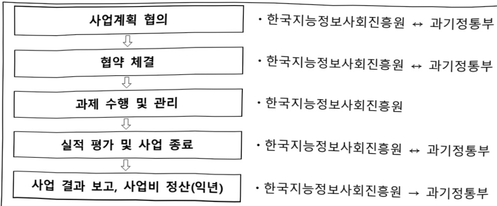

# 국가 데이터 인프라 기반 데이터 혁신(Data-X) 지원

**해당 페이지**: PDF 772 ~ 777 쪽 해당

**부처**: 과학기술정보통신부
**분야**: 통신
**회계유형**: 일반회계
**2026 확정예산**: 7000.0 백만원
**전년대비 증감률**: None%
**AI 도메인**: 데이터

---

### 가. 예산 총괄표

(단위: 백만원, %)

<table border=1 style='margin: auto; word-wrap: break-word;'><tr><td rowspan="2">사업명</td><td rowspan="2">2024년 결산</td><td colspan="2">2025년 예산</td><td colspan="2">2026년 예산</td><td rowspan="2">증감(B-A)</td><td rowspan="2">(B-A)/A</td></tr><tr><td style='text-align: center; word-wrap: break-word;'>본예산</td><td style='text-align: center; word-wrap: break-word;'>추경*(A)</td><td style='text-align: center; word-wrap: break-word;'>요구안</td><td style='text-align: center; word-wrap: break-word;'>본예산(B)</td></tr><tr><td style='text-align: center; word-wrap: break-word;'>국가 데이터 인프라 기반 데이터 혁신(Data-X) 지원</td><td style='text-align: center; word-wrap: break-word;'>-</td><td style='text-align: center; word-wrap: break-word;'>-</td><td style='text-align: center; word-wrap: break-word;'>-</td><td style='text-align: center; word-wrap: break-word;'>7,000</td><td style='text-align: center; word-wrap: break-word;'>7,000</td><td style='text-align: center; word-wrap: break-word;'>순증</td><td style='text-align: center; word-wrap: break-word;'>순증</td></tr></table>

□ 기능별(내역사업별) 계획 내역

(단위:백만원)

<table border=1 style='margin: auto; word-wrap: break-word;'><tr><td rowspan="2"></td><td colspan="5">2024</td><td colspan="5">2025</td><td rowspan="2">2026 예산</td></tr><tr><td style='text-align: center; word-wrap: break-word;'>예산액(추정)</td><td style='text-align: center; word-wrap: break-word;'>예산 현액</td><td style='text-align: center; word-wrap: break-word;'>집행액</td><td style='text-align: center; word-wrap: break-word;'>이월액</td><td style='text-align: center; word-wrap: break-word;'>불용액</td><td style='text-align: center; word-wrap: break-word;'>예산액(추정)</td><td style='text-align: center; word-wrap: break-word;'>예산 현액</td><td style='text-align: center; word-wrap: break-word;'>집행액</td><td style='text-align: center; word-wrap: break-word;'>이월액</td><td style='text-align: center; word-wrap: break-word;'>불용액</td></tr><tr><td style='text-align: center; word-wrap: break-word;'>○ 기능별 분류(합계)</td><td style='text-align: center; word-wrap: break-word;'>-</td><td style='text-align: center; word-wrap: break-word;'>-</td><td style='text-align: center; word-wrap: break-word;'>-</td><td style='text-align: center; word-wrap: break-word;'>-</td><td style='text-align: center; word-wrap: break-word;'>-</td><td style='text-align: center; word-wrap: break-word;'>-</td><td style='text-align: center; word-wrap: break-word;'>-</td><td style='text-align: center; word-wrap: break-word;'>-</td><td style='text-align: center; word-wrap: break-word;'>-</td><td style='text-align: center; word-wrap: break-word;'>-</td><td style='text-align: center; word-wrap: break-word;'>7,000</td></tr><tr><td style='text-align: center; word-wrap: break-word;'>• 국가 데이터 인프라 기반 데이터 혁신 (Data-X) 지원</td><td style='text-align: center; word-wrap: break-word;'>-</td><td style='text-align: center; word-wrap: break-word;'>-</td><td style='text-align: center; word-wrap: break-word;'>-</td><td style='text-align: center; word-wrap: break-word;'>-</td><td style='text-align: center; word-wrap: break-word;'>-</td><td style='text-align: center; word-wrap: break-word;'>-</td><td style='text-align: center; word-wrap: break-word;'>-</td><td style='text-align: center; word-wrap: break-word;'>-</td><td style='text-align: center; word-wrap: break-word;'>-</td><td style='text-align: center; word-wrap: break-word;'>-</td><td style='text-align: center; word-wrap: break-word;'>7,000</td></tr></table>

### 나. 사업설명자료

## 1 ) 사업목적·내용

- (국가 데이터 인프라 기반 데이터 혁신(Data-X) 지원) 분야별 데이터스페이스를 육성하고, 신뢰 기반의 데이터 연계와 유통·활용을 촉진

* 데이터스페이스 : 분야별로 공통 목적을 가진 여러 주체(참여자)가 모여 ① 상호 신뢰와 합의를 기반으로 ② 안전한 환경과 표준 기반 방식을 통해 ③ 참여자 간 데이터를 공유·연계·활용하는 연합형 데이터 생태계

(실증 및 기획) 우선 분야를 선정하여 참조모델을 적용한 데이터 스페이스 시범

조성 및 실증 사업 추진

※ (26년) ① 의료 분야 데이터 스페이스 구축·운영 ② 일반 분야 데이터 스페이스 사전기획(2~3개 분야)

## 2 ) 사업개요

## 사업근거 및 추진경위

① 법령상 근거 및 조항 적시

- 지능정보화기본법 제12조(한국지능정보사회진흥원의 설립), 제42조(데이터 관련 시책의 마련), 제43조(데이터의 유통·활용)

---

## <지능정보화 기본법>

제12조(한국지능정보사회진흥원의 설립) ① 과학기술정보통신부장관과 행정안전부장관은 지능정보사회 관련 정책의 개발과 국가기관등의 지능정보사회 시책 및 지능정보화 사업의 추진 등을 지원하기 위하여 한국지능정보사회진흥원(이하 "지능정보사회원"이라 한다)을 설립한다. ② ~ ⑥ (생 략) ⑦ 지능정보사회원이 아닌 자는 한국지능정보사회진흥원 또는 이와 유사한 명칭을 사용하지 못한다.

제42조(데이터 관련 시책의 마련) ① 정부는 지능정보화의 효율적 추진과 지능정보서비스의 제공·이용 활성화에 필요한 데이터의 생산·수집 및 유통·활용 등을 촉진하기 위하여 필요한 정책을 추진하여야 한다.(후 략)

제43조(데이터의 유통·활용) ① 정부는 데이터의 효율적인 생산·수집·관리와 원활한 유통·활용을 위하여 국가기관들, 법인, 기관 및 단체와의 협력체계를 구축하고, 이를 위한 지원을 할 수 있다. ② ~ ③ (생 락) ④ 제2항에 따른 지원의 내용 및 방법 등에 관하여 필요한 사항과 제3항에 따른 데이터통합지원센터의 기능·운영 등에 관한 구체적인 사항은 대통령령으로 정한다.

- 데이터산업법 제18조(데이터 유통 및 거래 체계 구축), 제19조(데이터 플랫폼에 대한 지원)

## <데이터산업법>

제18조(데이터 유통 및 거래 체계 구축) ① 과학기술정보통신부장관은 데이터 유통 및 거래를 활성화하기 위하여 데이터 유통 및 거래 체계를 구축하고, 데이터 유통 및 거래 기반 조성을 위하여 필요한 지원을 할 수 있다. ② 과학기술정보통신부장관은 데이터 유통과 거래를 촉진하기 위하여 데이터유통시스템을 구축·운영할 수 있다. ③ 제1항에 따른 데이터 유통 및 거래 기반 조성 지원을 위하여 필요한 방법 및 기준과 제2항에 따른 데이터유통시스템의 운영 등에 필요한 사항은 대통령령으로 정한다.

제19조(데이터 플랫폼에 대한 지원) ① 정부는 데이터의 수집·가공·분석·유통 및 데이터에 기반한 서비스를 제공하는 플랫폼을 지원하는 사업을 할 수 있다. ② 제1항에 따른 지원사업의 방법, 내용, 범위 등 필요한 내용은 대통령령으로 정한다.

-「인공지능 발전과 신뢰 기반 조성 등에 관한 기본법」제15조(인공지능 학습용 데이터 관련 시책의 수립 등)

< 인공지능 발전과 신뢰 기반 조성 등에 관한 기본법 >

제15조(인공지능 학습용데이터 관련 시책의 수립 등) ① 과학기술정보통신부장관은 관계 중앙행정기관의 장과 협의하여 인공지능의 개발·활용 등에 사용되는 데이터(이하 "학습용데이터"라 한다)의 생산·수집·관리·유통 및 활용 등을 촉진하기 위하여 필요한 시책을 추진하여야 한다. ② ~ ⑥ (후 략)

## ② 추진경위

- '25. 1 : 「인공지능 발전과 신뢰 기반 조성 등에 관한 기본법」 제정

- '25. 8 : 국정과제 20 (AI 3대 강국 도약을 위한 AI 고속도로 구축)

---

## 주요내용

① 사업규모

- 총사업비 : 해당없음

- 사업기간 : 2026년 ~ 2030년

- 최근 5년 간 투입된 사업비(예산액기준, 추경편성한 연도에는 추경포함)

<table border=1 style='margin: auto; word-wrap: break-word;'><tr><td style='text-align: center; word-wrap: break-word;'>연도</td><td style='text-align: center; word-wrap: break-word;'>2022</td><td style='text-align: center; word-wrap: break-word;'>2023</td><td style='text-align: center; word-wrap: break-word;'>2024</td><td style='text-align: center; word-wrap: break-word;'>2025</td><td style='text-align: center; word-wrap: break-word;'>2026(안)</td></tr><tr><td style='text-align: center; word-wrap: break-word;'>사업비</td><td style='text-align: center; word-wrap: break-word;'>-</td><td style='text-align: center; word-wrap: break-word;'>-</td><td style='text-align: center; word-wrap: break-word;'>-</td><td style='text-align: center; word-wrap: break-word;'>-</td><td style='text-align: center; word-wrap: break-word;'>7,000</td></tr></table>

- 기타: 해당없음

② 사업추진체계

- 사업시행방법 : 출연

- 사업시행주체 : 한국지능정보사회진흥원

- 사업 수혜자 : 분야별 특화 데이터를 기반으로 AI·데이터 기반 혁신을 주진하고자 하는 학계·민간기업·공공기관 중심의 컨소시엄

- 보조, 융자, 출연, 출자 등의 경우 보조·융자 등 지원 비율 및 법적근거

<table border=1 style='margin: auto; word-wrap: break-word;'><tr><td style='text-align: center; word-wrap: break-word;'>내역사업명</td><td style='text-align: center; word-wrap: break-word;'>구분</td><td style='text-align: center; word-wrap: break-word;'>피보조·피출연 등 기관명</td><td style='text-align: center; word-wrap: break-word;'>지원 금액 (2026예산)</td><td style='text-align: center; word-wrap: break-word;'>지원 비율(%)</td><td style='text-align: center; word-wrap: break-word;'>보조율 법적근거 (해당 조항)</td></tr><tr><td style='text-align: center; word-wrap: break-word;'>국가 데이터 인프라 기반 데이터 혁신 (Data-X) 지원</td><td style='text-align: center; word-wrap: break-word;'>출연</td><td style='text-align: center; word-wrap: break-word;'>한국지능 정보사회 진흥원</td><td style='text-align: center; word-wrap: break-word;'>7,000 백만원</td><td style='text-align: center; word-wrap: break-word;'>100</td><td style='text-align: center; word-wrap: break-word;'>지능정보화기본법 제12조</td></tr></table>

## 3 ) 2026년도 예산 산출 근거

□ 국가 데이터 인프라 기반 데이터 혁신(Data-X) 지원 : (2025) 해당없음 → (2026 예산) 7,000백만원, 신규

- (산출) 의료 분야 데이터 스페이스 6,000백만원 + 일반 분야 데이터 스페이스 1,000백만원

① 의료 분야 데이터 스페이스(선도) 구축 및 운영 X 6,000백만원

② 일반 분야(2개) 데이터 스페이스 기획 X 1,000백만원

---

## 4 ) 사업효과

☐ 사업영향, 산출물 성과지표 등

① 2022~2026년도 성과계획서 상 성과지표 및 최근 5년간 성과 달성도

<table border=1 style='margin: auto; word-wrap: break-word;'><tr><td style='text-align: center; word-wrap: break-word;'>성과지표</td><td style='text-align: center; word-wrap: break-word;'>구분</td><td style='text-align: center; word-wrap: break-word;'>2022</td><td style='text-align: center; word-wrap: break-word;'>2023</td><td style='text-align: center; word-wrap: break-word;'>2024</td><td style='text-align: center; word-wrap: break-word;'>2025</td><td style='text-align: center; word-wrap: break-word;'>2026</td><td style='text-align: center; word-wrap: break-word;'>2026 목표치산출근거</td><td style='text-align: center; word-wrap: break-word;'>측정산식(또는 측정방법)</td><td style='text-align: center; word-wrap: break-word;'>자료수집방법(또는 자료출처)</td></tr><tr><td rowspan="3">데이터 스페이스데이터 등록 건수(단위: 건)</td><td style='text-align: center; word-wrap: break-word;'>목표</td><td style='text-align: center; word-wrap: break-word;'></td><td style='text-align: center; word-wrap: break-word;'></td><td style='text-align: center; word-wrap: break-word;'></td><td style='text-align: center; word-wrap: break-word;'>-</td><td style='text-align: center; word-wrap: break-word;'>50</td><td rowspan="3">데이터 스페이스데이터 등록 건수</td><td rowspan="3">데이터 스페이스기반 분산형데이터 교환구조를 갖춘데이터 카탈로그 건수</td><td rowspan="3">데이터 스페이스플랫폼 내데이터 카탈로그</td></tr><tr><td style='text-align: center; word-wrap: break-word;'>실적</td><td style='text-align: center; word-wrap: break-word;'></td><td style='text-align: center; word-wrap: break-word;'></td><td style='text-align: center; word-wrap: break-word;'></td><td style='text-align: center; word-wrap: break-word;'>-</td><td style='text-align: center; word-wrap: break-word;'>-</td></tr><tr><td style='text-align: center; word-wrap: break-word;'>달성도</td><td style='text-align: center; word-wrap: break-word;'></td><td style='text-align: center; word-wrap: break-word;'></td><td style='text-align: center; word-wrap: break-word;'></td><td style='text-align: center; word-wrap: break-word;'>-</td><td style='text-align: center; word-wrap: break-word;'>-</td></tr><tr><td rowspan="3">데이터 스페이스기반 AI 혁신서비스 건수(단위: 건)</td><td style='text-align: center; word-wrap: break-word;'>목표</td><td style='text-align: center; word-wrap: break-word;'></td><td style='text-align: center; word-wrap: break-word;'></td><td style='text-align: center; word-wrap: break-word;'></td><td style='text-align: center; word-wrap: break-word;'>-</td><td style='text-align: center; word-wrap: break-word;'>3</td><td rowspan="3">데이터 스페이스 기반 AI 혁신서비스 건수</td><td rowspan="3">데이터 스페이스파이프라인기반 AI 혁신서비스개발 건수</td><td rowspan="3">AI 혁신 서비스기획서·프로토타입</td></tr><tr><td style='text-align: center; word-wrap: break-word;'>실적</td><td style='text-align: center; word-wrap: break-word;'></td><td style='text-align: center; word-wrap: break-word;'></td><td style='text-align: center; word-wrap: break-word;'></td><td style='text-align: center; word-wrap: break-word;'>-</td><td style='text-align: center; word-wrap: break-word;'>-</td></tr><tr><td style='text-align: center; word-wrap: break-word;'>달성도</td><td style='text-align: center; word-wrap: break-word;'></td><td style='text-align: center; word-wrap: break-word;'></td><td style='text-align: center; word-wrap: break-word;'></td><td style='text-align: center; word-wrap: break-word;'>-</td><td style='text-align: center; word-wrap: break-word;'>-</td></tr></table>

② 성과지표 이외의 연도별 사업추진 경과 및 실적 : 해당 없음(2026년도 신규사업)

③향후(2026년도 이후) 기대효과

- (단기) 의료·일반 분야 데이터 스페이스 구축·운영 및 사전기획을 통해 데이터 스페이스 기반 데이터 활용 전환 사례 및 공동 활용 기획 사례를 확보하고, 향후 분야 확산을 위한 운영·제도적 기반 마련

* ① 데이터 스페이스 기반 데이터 활용 사례 100건 이상 발굴 ② 데이터 스페이스 기반 공동 활용 기획 사례 약 10건 도출

- (중기) 표준화·상호운용성 기반의 데이터 교환 구조 확산을 통해 데이터 수집·

정제·활용 과정의 중복 비용을 완화하고, 데이터 스페이스 기반 혁신 서비스

기획·실증을 단계적으로 확대할 수 있는 기반 확보

* ① 데이터 스페이스 확산 시 데이터 활용·거래 증가 가능성 확인 ② 분야별 AI·데이터 기반 서비스 기획·실증 연계 기반 마련

5) 타당성조사 및 예비타당성조사 시행여부 및 결과 요지 : 해당없음

6) 총사업비 대상사업 정보 : 해당없음

---

## 7 ) 사업 집행절차

<국가 데이터 인프라 기반 데이터 혁신(Data-X) 지원>

<table border=1 style='margin: auto; word-wrap: break-word;'><tr><td style='text-align: center; word-wrap: break-word;'>부처</td><td style='text-align: center; word-wrap: break-word;'>피출연·피보조기관</td><td style='text-align: center; word-wrap: break-word;'>=&gt; (6,600백만원)</td><td style='text-align: center; word-wrap: break-word;'>간접보조사업자·사업수행자</td></tr><tr><td style='text-align: center; word-wrap: break-word;'>과학기술정보통신부 (7,000백만원)</td><td style='text-align: center; word-wrap: break-word;'>=&gt; (7,000백만원)</td><td style='text-align: center; word-wrap: break-word;'>한국지능정보사회진흥원 (400백만원)</td><td style='text-align: center; word-wrap: break-word;'>분야별 데이터 스페이스 구축·운영 산학연 컨소시엄</td></tr></table>

8) 각종 평가 : 해당없음

다. 최근 4년간 결산내역 : 해당없음

---

<table border=1 style='margin: auto; word-wrap: break-word;'><tr><td style='text-align: center; word-wrap: break-word;'>사 업 명</td></tr><tr><td style='text-align: center; word-wrap: break-word;'>(61) 국가 플래그십 초고성능컴퓨팅 인프라 고도화(R&amp;D) (1159-425)</td></tr></table>

☐ 사업 코드 정보

<table border=1 style='margin: auto; word-wrap: break-word;'><tr><td style='text-align: center; word-wrap: break-word;'>구분</td><td style='text-align: center; word-wrap: break-word;'>회계</td><td style='text-align: center; word-wrap: break-word;'>소관</td><td style='text-align: center; word-wrap: break-word;'>실국(기관)</td><td style='text-align: center; word-wrap: break-word;'>계정</td><td style='text-align: center; word-wrap: break-word;'>분야</td><td style='text-align: center; word-wrap: break-word;'>부문</td></tr><tr><td style='text-align: center; word-wrap: break-word;'>코드</td><td rowspan="2">일반회계</td><td rowspan="2">과학기술정보통신부</td><td rowspan="2">연구개발정책실기초원천연구정책관</td><td rowspan="2"></td><td style='text-align: center; word-wrap: break-word;'>150</td><td style='text-align: center; word-wrap: break-word;'>155</td></tr><tr><td style='text-align: center; word-wrap: break-word;'>명칭</td><td style='text-align: center; word-wrap: break-word;'>과학기술</td><td style='text-align: center; word-wrap: break-word;'>과학기술연구개발</td></tr></table>

<table border=1 style='margin: auto; word-wrap: break-word;'><tr><td style='text-align: center; word-wrap: break-word;'>구분</td><td style='text-align: center; word-wrap: break-word;'>프로그램</td><td style='text-align: center; word-wrap: break-word;'>단위사업</td><td style='text-align: center; word-wrap: break-word;'>세부사업</td></tr><tr><td style='text-align: center; word-wrap: break-word;'>코드</td><td style='text-align: center; word-wrap: break-word;'>1100</td><td style='text-align: center; word-wrap: break-word;'>1159</td><td style='text-align: center; word-wrap: break-word;'>425</td></tr><tr><td style='text-align: center; word-wrap: break-word;'>명칭</td><td style='text-align: center; word-wrap: break-word;'>미래유망원천기술개발</td><td style='text-align: center; word-wrap: break-word;'>차세대정보·컴퓨팅기술개발</td><td style='text-align: center; word-wrap: break-word;'>국가 플래그십 초고성능컴퓨팅 인프라 고도화(R&amp;D)</td></tr></table>

□ 사업 성격 (공통요구자료 Ⅱ-1 작성유의사항 4. 참조, 해당하는 사항에 “○” 표시)

<table border=1 style='margin: auto; word-wrap: break-word;'><tr><td style='text-align: center; word-wrap: break-word;'>신규</td><td style='text-align: center; word-wrap: break-word;'>계속</td><td style='text-align: center; word-wrap: break-word;'>완료</td><td style='text-align: center; word-wrap: break-word;'>예비타당성 실시여부</td><td style='text-align: center; word-wrap: break-word;'>총사업비 관리대상</td><td style='text-align: center; word-wrap: break-word;'>총액계상 예산사업</td><td style='text-align: center; word-wrap: break-word;'>사업소관 변경정보 2025예산 시 소관</td></tr><tr><td style='text-align: center; word-wrap: break-word;'></td><td style='text-align: center; word-wrap: break-word;'>○</td><td style='text-align: center; word-wrap: break-word;'></td><td style='text-align: center; word-wrap: break-word;'></td><td style='text-align: center; word-wrap: break-word;'></td><td style='text-align: center; word-wrap: break-word;'></td><td style='text-align: center; word-wrap: break-word;'></td></tr></table>

□ 사업 지원 형태 및 지원을 (최소한 한 개는 반드시 선택하시오. 해당사항에 0 표시)

<table border=1 style='margin: auto; word-wrap: break-word;'><tr><td style='text-align: center; word-wrap: break-word;'>직접</td><td style='text-align: center; word-wrap: break-word;'>출자</td><td style='text-align: center; word-wrap: break-word;'>출연</td><td style='text-align: center; word-wrap: break-word;'>보조</td><td style='text-align: center; word-wrap: break-word;'>융자</td><td style='text-align: center; word-wrap: break-word;'>국고보조율(%)</td><td style='text-align: center; word-wrap: break-word;'>융자율(%)</td></tr><tr><td style='text-align: center; word-wrap: break-word;'></td><td style='text-align: center; word-wrap: break-word;'></td><td style='text-align: center; word-wrap: break-word;'>○</td><td style='text-align: center; word-wrap: break-word;'></td><td style='text-align: center; word-wrap: break-word;'></td><td style='text-align: center; word-wrap: break-word;'></td><td style='text-align: center; word-wrap: break-word;'></td></tr></table>

사업 소관부처 및 시행주체

<table border=1 style='margin: auto; word-wrap: break-word;'><tr><td style='text-align: center; word-wrap: break-word;'>사업명</td><td colspan="2">구분</td></tr><tr><td rowspan="3">슈퍼컴퓨팅 활성화(R&amp;D)</td><td rowspan="2">소관부처</td><td style='text-align: center; word-wrap: break-word;'>연구개발정책실 기초원천연구정책관</td></tr><tr><td style='text-align: center; word-wrap: break-word;'>원천기술과(과학기술AI확산팀)</td></tr><tr><td style='text-align: center; word-wrap: break-word;'>사업시행주체</td><td style='text-align: center; word-wrap: break-word;'>한국연구재단</td></tr></table>

### 가. 예산 총괄표

(단위: 백만원, %)

<table border=1 style='margin: auto; word-wrap: break-word;'><tr><td rowspan="2">사업명</td><td rowspan="2">2024년 결산</td><td style='text-align: center; word-wrap: break-word;'>2025년 예산</td><td colspan="2">2026년 예산</td><td style='text-align: center; word-wrap: break-word;'>중감 (B-A)</td><td rowspan="2">(B-A)/A</td></tr><tr><td style='text-align: center; word-wrap: break-word;'>본예산</td><td style='text-align: center; word-wrap: break-word;'>추경*(A)</td><td style='text-align: center; word-wrap: break-word;'>요구안</td><td style='text-align: center; word-wrap: break-word;'>본예산(B)</td></tr><tr><td style='text-align: center; word-wrap: break-word;'>국가 플래그십 초고 성능컴퓨팅 인프라 고도화(R&amp;D)</td><td style='text-align: center; word-wrap: break-word;'>18,183</td><td style='text-align: center; word-wrap: break-word;'>11,194</td><td style='text-align: center; word-wrap: break-word;'>11,194</td><td style='text-align: center; word-wrap: break-word;'>68,431</td><td style='text-align: center; word-wrap: break-word;'>68,431</td><td style='text-align: center; word-wrap: break-word;'>57,237</td></tr></table>

---

### 원본 PDF 크롭 이미지

