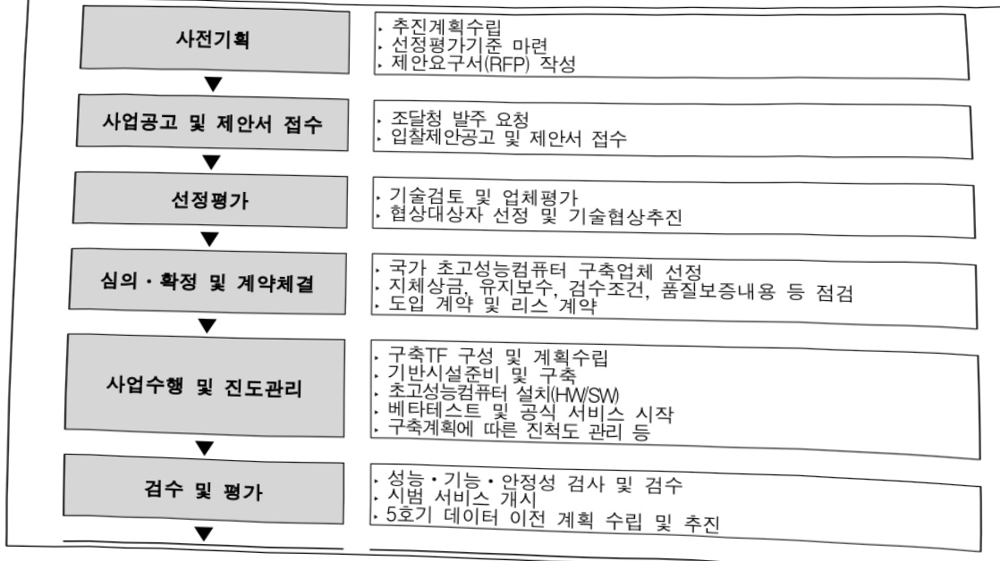
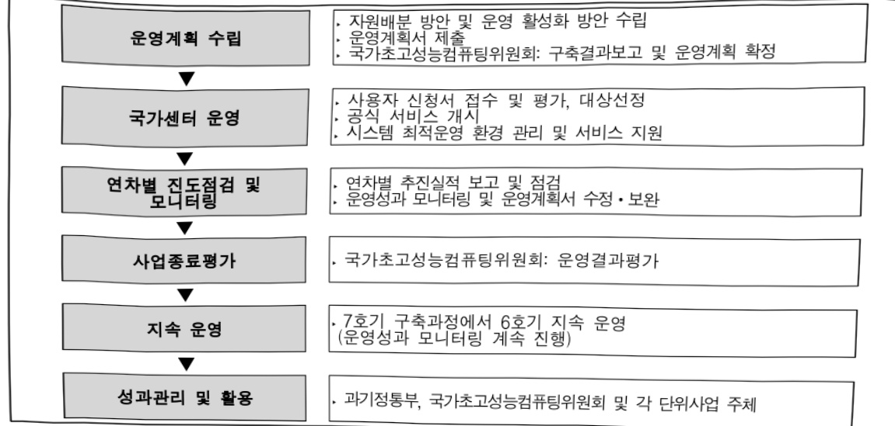

# 국가 플래그십 초고성능컴퓨팅 인프라 고도화 사업(R&D)

**해당 페이지**: PDF 778 ~ 785 쪽 해당

**부처**: 과학기술정보통신부
**분야**: 과학기술
**회계유형**: 일반회계
**2026 확정예산**: 68431.0 백만원
**전년대비 증감률**: 511.3%
**AI 도메인**: 데이터, 클라우드/컴퓨팅

---

## □ 기능별(내역사업별) 예산 내역

(단위:백만원)

<table border=1 style='margin: auto; word-wrap: break-word;'><tr><td rowspan="2"></td><td colspan="5">2024</td><td colspan="5">2025</td><td rowspan="2">2026예산</td></tr><tr><td style='text-align: center; word-wrap: break-word;'>예산액(추정)</td><td style='text-align: center; word-wrap: break-word;'>예산현액</td><td style='text-align: center; word-wrap: break-word;'>집행액</td><td style='text-align: center; word-wrap: break-word;'>이월액</td><td style='text-align: center; word-wrap: break-word;'>불용액</td><td style='text-align: center; word-wrap: break-word;'>예산액(추정)</td><td style='text-align: center; word-wrap: break-word;'>예산현액</td><td style='text-align: center; word-wrap: break-word;'>집행액</td><td style='text-align: center; word-wrap: break-word;'>이월액</td><td style='text-align: center; word-wrap: break-word;'>불용액</td></tr><tr><td style='text-align: center; word-wrap: break-word;'>○ 기능별 분류(합계)</td><td style='text-align: center; word-wrap: break-word;'>18,183</td><td style='text-align: center; word-wrap: break-word;'>18,183</td><td style='text-align: center; word-wrap: break-word;'>18,183</td><td style='text-align: center; word-wrap: break-word;'>-</td><td style='text-align: center; word-wrap: break-word;'>-</td><td style='text-align: center; word-wrap: break-word;'>11,194</td><td style='text-align: center; word-wrap: break-word;'>11,194</td><td style='text-align: center; word-wrap: break-word;'>11,194</td><td style='text-align: center; word-wrap: break-word;'>-</td><td style='text-align: center; word-wrap: break-word;'>-</td><td style='text-align: center; word-wrap: break-word;'>68,431</td></tr><tr><td style='text-align: center; word-wrap: break-word;'>· 국가 플래그십 초고성능 컴퓨팅 인프라 고도화</td><td style='text-align: center; word-wrap: break-word;'>18,183</td><td style='text-align: center; word-wrap: break-word;'>18,183</td><td style='text-align: center; word-wrap: break-word;'>18,183</td><td style='text-align: center; word-wrap: break-word;'>-</td><td style='text-align: center; word-wrap: break-word;'>-</td><td style='text-align: center; word-wrap: break-word;'>11,194</td><td style='text-align: center; word-wrap: break-word;'>11,194</td><td style='text-align: center; word-wrap: break-word;'>11,194</td><td style='text-align: center; word-wrap: break-word;'>-</td><td style='text-align: center; word-wrap: break-word;'>-</td><td style='text-align: center; word-wrap: break-word;'>68,431</td></tr><tr><td style='text-align: center; word-wrap: break-word;'>○ 비목별 분류(합계)</td><td style='text-align: center; word-wrap: break-word;'>18,183</td><td style='text-align: center; word-wrap: break-word;'>18,183</td><td style='text-align: center; word-wrap: break-word;'>18,183</td><td style='text-align: center; word-wrap: break-word;'>-</td><td style='text-align: center; word-wrap: break-word;'>-</td><td style='text-align: center; word-wrap: break-word;'>11,194</td><td style='text-align: center; word-wrap: break-word;'>11,194</td><td style='text-align: center; word-wrap: break-word;'>11,194</td><td style='text-align: center; word-wrap: break-word;'>-</td><td style='text-align: center; word-wrap: break-word;'>-</td><td style='text-align: center; word-wrap: break-word;'>68,431</td></tr><tr><td style='text-align: center; word-wrap: break-word;'>· 연구개발장비·시스템 구축비(360.04)</td><td style='text-align: center; word-wrap: break-word;'>8,521</td><td style='text-align: center; word-wrap: break-word;'>8,521</td><td style='text-align: center; word-wrap: break-word;'>8,521</td><td style='text-align: center; word-wrap: break-word;'>-</td><td style='text-align: center; word-wrap: break-word;'>-</td><td style='text-align: center; word-wrap: break-word;'>11,194</td><td style='text-align: center; word-wrap: break-word;'>11,194</td><td style='text-align: center; word-wrap: break-word;'>11,194</td><td style='text-align: center; word-wrap: break-word;'>-</td><td style='text-align: center; word-wrap: break-word;'>-</td><td style='text-align: center; word-wrap: break-word;'>67,417</td></tr><tr><td style='text-align: center; word-wrap: break-word;'>· 연구개발활동비 등 (360.05)</td><td style='text-align: center; word-wrap: break-word;'>9,662</td><td style='text-align: center; word-wrap: break-word;'>9,662</td><td style='text-align: center; word-wrap: break-word;'>9,662</td><td style='text-align: center; word-wrap: break-word;'>-</td><td style='text-align: center; word-wrap: break-word;'>-</td><td style='text-align: center; word-wrap: break-word;'>-</td><td style='text-align: center; word-wrap: break-word;'>-</td><td style='text-align: center; word-wrap: break-word;'>-</td><td style='text-align: center; word-wrap: break-word;'>-</td><td style='text-align: center; word-wrap: break-word;'>-</td><td style='text-align: center; word-wrap: break-word;'>1,014</td></tr><tr><td style='text-align: center; word-wrap: break-word;'>○ 기능·비목별 분류(합계)</td><td style='text-align: center; word-wrap: break-word;'>18,183</td><td style='text-align: center; word-wrap: break-word;'>18,183</td><td style='text-align: center; word-wrap: break-word;'>18,183</td><td style='text-align: center; word-wrap: break-word;'>-</td><td style='text-align: center; word-wrap: break-word;'>-</td><td style='text-align: center; word-wrap: break-word;'>11,194</td><td style='text-align: center; word-wrap: break-word;'>11,194</td><td style='text-align: center; word-wrap: break-word;'>11,194</td><td style='text-align: center; word-wrap: break-word;'>-</td><td style='text-align: center; word-wrap: break-word;'>-</td><td style='text-align: center; word-wrap: break-word;'>68,431</td></tr><tr><td style='text-align: center; word-wrap: break-word;'>· 국가 플래그십 초고성능 컴퓨팅 인프라 고도화</td><td style='text-align: center; word-wrap: break-word;'>18,183</td><td style='text-align: center; word-wrap: break-word;'>18,183</td><td style='text-align: center; word-wrap: break-word;'>18,183</td><td style='text-align: center; word-wrap: break-word;'>-</td><td style='text-align: center; word-wrap: break-word;'>-</td><td style='text-align: center; word-wrap: break-word;'>11,194</td><td style='text-align: center; word-wrap: break-word;'>11,194</td><td style='text-align: center; word-wrap: break-word;'>11,194</td><td style='text-align: center; word-wrap: break-word;'>-</td><td style='text-align: center; word-wrap: break-word;'>-</td><td style='text-align: center; word-wrap: break-word;'>68,431</td></tr><tr><td style='text-align: center; word-wrap: break-word;'>· 연구개발장비·시스템 구축비 (360.04)</td><td style='text-align: center; word-wrap: break-word;'>8,521</td><td style='text-align: center; word-wrap: break-word;'>8,521</td><td style='text-align: center; word-wrap: break-word;'>8,521</td><td style='text-align: center; word-wrap: break-word;'>-</td><td style='text-align: center; word-wrap: break-word;'>-</td><td style='text-align: center; word-wrap: break-word;'>11,194</td><td style='text-align: center; word-wrap: break-word;'>11,194</td><td style='text-align: center; word-wrap: break-word;'>11,194</td><td style='text-align: center; word-wrap: break-word;'>-</td><td style='text-align: center; word-wrap: break-word;'>-</td><td style='text-align: center; word-wrap: break-word;'>67,417</td></tr><tr><td style='text-align: center; word-wrap: break-word;'>· 연구개발활동비 등 (360.05)</td><td style='text-align: center; word-wrap: break-word;'>9,662</td><td style='text-align: center; word-wrap: break-word;'>9,662</td><td style='text-align: center; word-wrap: break-word;'>9,662</td><td style='text-align: center; word-wrap: break-word;'>-</td><td style='text-align: center; word-wrap: break-word;'>-</td><td style='text-align: center; word-wrap: break-word;'>-</td><td style='text-align: center; word-wrap: break-word;'>-</td><td style='text-align: center; word-wrap: break-word;'>-</td><td style='text-align: center; word-wrap: break-word;'>-</td><td style='text-align: center; word-wrap: break-word;'>-</td><td style='text-align: center; word-wrap: break-word;'>1,014</td></tr></table>

### 나.사업설명자료

## 1 ) 사업목적·내용

- 거대계산과학, 데이터 분석, 인공지능 활용 연구를 위한 세계 10위권 수준 초고성능

컴퓨팅 인프라 확보 및 운영을 통해 공공문제 해결 및 국가 기술혁신 경쟁력 제고 기여

---

## 2 ) 사업개요

## ☐ 사업근거 및 추진경위

① 법령상 근거 및 조항 적시

- 과학기술기본법 제28조(연구개발 시설·장비의 구축, 확충·고도화 및 관리·활용)

0 정부는 효율적이고 균형 있는 연구개발을 추진하기 위하여 필요한 연구개발 시설과 장비 등을 구축, 확충·고도화하고 관리·운영·공동활용 및 처분하기 위한 시책을 세우고 추진하여야 한다.

0 정부는 제1항에 따른 연구개발 시설·장비의 구축, 확충·고도화, 관리·운영·공동활용 및 처분을 추진하기 위하여 필요한 때에는 대통령령으로 정하는 바에 따라 이를 지원할 기관을 지정하고 그 운영에 필요한 경비를 지원할 수 있다.

- 국가초고성능컴퓨터 활용 및 육성에 관한 법률 제9조(국가초고성능컴퓨팅센터)

0 정부는 국가초고성능컴퓨팅의 육성과 그 활용을 촉진하기 위하여 대통령령으로 정하는 바에 따라 국가초고성능컴퓨팅센터를 설립 또는 지정할 수 있다.

- 국가초고성능컴퓨터 활용 및 육성에 관한 법률 제11조(국가초고성능컴퓨팅자원의 확보)

0 정부는 국가초고성능컴퓨팅자원의 수요변화와 기술발전의 속도에 맞추어 최고 수준의 초고성능컴퓨팅자원을 확보하도록 노력하여야 한다.

-국가초고성능컴퓨터 활용 및 육성에 관한 법률 제21조(국가초고성능컴퓨팅의 활용 촉진)

0 정부는 국가초고성능컴퓨팅자원의 수요변화와 기술발전의 속도에 맞추어 최고 수준의

초고성능컴퓨팅자원을 확보하도록 노력하여야 한다.

-기초연구진흥 및 기술개발지원에 관한 법률 제10조(연구 시설·장비 공동활용 촉진)

기초연구사업을 수행하는 기관 또는 단체의 장은 기초연구 관련 분야 연구자가 소속된 기관의 장으로부터 기초연구사업을 수행하는 기관 또는 단체가 소유하고 있는 연구시설·장비의 활용 요청을 받으면 그 연구자가 연구 시설·장비를 활용할 수 있도록 적극 협조하여야 한다.

- 제2차 국가초고성능컴퓨팅 육성 기본계획('18~'22)('18.12월, 국가초고성능컴퓨팅위원회)

- 국가초고성능컴퓨팅 혁신전략('21.5월, 제36차 비상경제 중앙대책본부 회의)

- 제3차 국가초고성능컴퓨팅 육성 기본계획('23~27)(23.5월, 국가초고성능컴퓨팅위원회)

- 국정과제 (20. AI 3대 강국 도약을 위한 AI 고속도로 구축)

1. '진짜성장'을 뒷받침하는 데이터센터 등 AI인프라 구축

° (국가 AI인프라) 국가 AI컴퓨팅 센터(新추진방향마련), 슈퍼컴 6호기 구축(0.9만장급), 정부 GPU 확충 등으로 GPU 5만장↑ 확보(~'30년)

---

② 추진경위

- 수요조사·시스템설계·경제성 분석 등 기획연구 수행('21.5~10.)

- '21년 제3차 예비타당성조사 면제 신청 및 자진철회('21.9~10.)

※ (혁신본부 검토 결과) ‘법령에 의해 추진되는’ 사업’에 미해당하여 면제불가, 대안으로 국무회의 의결 또는 계속사업으로 전환 제시

- 국가 플래그십 초고성능컴퓨팅 인프라 고도화 사업 공청회 개최('21.11.10.)

- '21년 제4차 예비타당성조사 대상사업 제출('21.12.7.)

- 예비타당성조사 대상사업 선정('22.1.27.)

- 예비타당성조사 ‘시행’ 결정('22.8.19.)

- 정책지정과제 협약 및 연구개시('23.1.1.)

- 1 · 2차 초고성능컴퓨터 구매 입찰 공고('23.5.~'23.8.)

- 비핵심 장비 위주 초고성능컴퓨터 규격 조정('23.8.)

- 3 · 4차 초고성능컴퓨터 구매 입찰 공고('23.9.~'23.11.)

- 사업계획 적정성 재검토('24.3~'24.10.)

- 5 · 6차 초고성능컴퓨터 구매 입찰 공고('24.11.~'25.2.)

- 슈퍼컴 6호기 구축사업자 최종계약 체결('25.5, HPE社)

- 과학기술 AI 국가전략 발표 (25.11.24, 과학기술관계장관회의)

## 주요내용

① 사업규모

- 총사업비 : 해당사항 없음

- 사업기간 : '23 ~ '31

- 최근 5년 간 투입된 사업비(예산액기준, 추경편성한 연도에는 추경포함)

<table border=1 style='margin: auto; word-wrap: break-word;'><tr><td style='text-align: center; word-wrap: break-word;'>연도</td><td style='text-align: center; word-wrap: break-word;'>2022</td><td style='text-align: center; word-wrap: break-word;'>2023</td><td style='text-align: center; word-wrap: break-word;'>2024</td><td style='text-align: center; word-wrap: break-word;'>2025</td><td style='text-align: center; word-wrap: break-word;'>2026</td></tr><tr><td style='text-align: center; word-wrap: break-word;'>사업비</td><td style='text-align: center; word-wrap: break-word;'>-</td><td style='text-align: center; word-wrap: break-word;'>18,423</td><td style='text-align: center; word-wrap: break-word;'>18,183</td><td style='text-align: center; word-wrap: break-word;'>11,194</td><td style='text-align: center; word-wrap: break-word;'>68,431</td></tr></table>

- 기타: 해당사항 없음

② 사업추진체계

- 사업시행방법 : 출연

- 사업시행주체 : 한국연구재단

- 사업 수혜자 : 대학, 출연연, 기업, 정부기관 등

- 보조, 융자, 출연, 출자 등의 경우 보조·융자 등 지원 비율 및 법적근거

<table border=1 style='margin: auto; word-wrap: break-word;'><tr><td style='text-align: center; word-wrap: break-word;'>내역사업명</td><td style='text-align: center; word-wrap: break-word;'>구분</td><td style='text-align: center; word-wrap: break-word;'>피보조·피출연 등 기관명</td><td style='text-align: center; word-wrap: break-word;'>지원 금액 (2026예산)</td><td style='text-align: center; word-wrap: break-word;'>지원 비율(%)</td><td style='text-align: center; word-wrap: break-word;'>보조율 법적근거 (해당 조항)</td></tr><tr><td style='text-align: center; word-wrap: break-word;'>국가 플래그십 초고등컴퓨팅 인프라 고도화</td><td style='text-align: center; word-wrap: break-word;'>출연</td><td style='text-align: center; word-wrap: break-word;'>한국연구 재단</td><td style='text-align: center; word-wrap: break-word;'>68,431</td><td style='text-align: center; word-wrap: break-word;'>100.0</td><td style='text-align: center; word-wrap: break-word;'>국가초고등컴퓨팅 활용 및 육성에 관한 법률 제10조, 제21조 및 기초연구진흥 및 기술개발지원에 관한 법률 제14조</td></tr></table>

---

## 3 ) 2026년도 예산 산출 근거

① 국가 플래그십 초고성능컴퓨팅 인프라 고도화 : (2025) 11,194백만원 → (2026요구) 68,431백만원

- (요구) 시스템 도입비 및 서비스를 위한 상용SW 라이선스비 68,431백만원 요구

- (산출) 시스템 구축 후 1차년도 은행차입 상환 67,417백만원 및 슈퍼컴 서비스를 위한 구조, 열유체, 화학 분야 등 상용SW 라이선스 1,014백만원

0 2025년도 예산 및 2026년도 예산 산출 세부내역 비교

<table border=1 style='margin: auto; word-wrap: break-word;'><tr><td colspan="2">2025년 예산</td><td colspan="2">2026년 예산</td></tr><tr><td style='text-align: center; word-wrap: break-word;'>예산</td><td style='text-align: center; word-wrap: break-word;'>산출내역</td><td style='text-align: center; word-wrap: break-word;'>예산</td><td style='text-align: center; word-wrap: break-word;'>산출내역</td></tr><tr><td style='text-align: center; word-wrap: break-word;'>11,194</td><td style='text-align: center; word-wrap: break-word;'>○ 연구개발활동비 등(360-05): 11,194백만원가. 국가 플래그십 초고성능컴퓨팅 인프라 고도화(11,194) • (산춤) (계속) 1개 × 11,194백만원 × 12/12개월 = 11,194백만원</td><td style='text-align: center; word-wrap: break-word;'>68,431</td><td style='text-align: center; word-wrap: break-word;'>○ 연구개발활동비 등(360-05): 1,014백만원가. 국가 플래그십 초고성능컴퓨팅 인프라 고도화(1,014) • (산춤) (계속) 1개 × 1,014백만원 × 12/12개월 = 1,014백만원</td></tr></table>

## 4 ) 사업효과

□ 사업영향, 산출물 성과지표 등

①2022~2026년도 성과계획서 상 성과지표 및 최근 5년간 성과 달성도

<table border=1 style='margin: auto; word-wrap: break-word;'><tr><td style='text-align: center; word-wrap: break-word;'>성과지표</td><td style='text-align: center; word-wrap: break-word;'>구분</td><td style='text-align: center; word-wrap: break-word;'>&#x27;23</td><td style='text-align: center; word-wrap: break-word;'>&#x27;24</td><td style='text-align: center; word-wrap: break-word;'>&#x27;25</td><td style='text-align: center; word-wrap: break-word;'>&#x27;26</td><td style='text-align: center; word-wrap: break-word;'>&#x27;26년 목표치산출근거</td><td style='text-align: center; word-wrap: break-word;'>측정산식(또는 측정방법)</td><td style='text-align: center; word-wrap: break-word;'>자료수집방법(또는 자료출처)</td></tr><tr><td rowspan="3">국가센터 내필요 성능의 시스템 구축</td><td style='text-align: center; word-wrap: break-word;'>목표</td><td style='text-align: center; word-wrap: break-word;'>30</td><td style='text-align: center; word-wrap: break-word;'>50</td><td style='text-align: center; word-wrap: break-word;'>20</td><td style='text-align: center; word-wrap: break-word;'></td><td rowspan="3">슈퍼컴 운영을 위한 기반시설 구축은 &#x27;25년 완료로 &#x27;26년 이후 목표치 없음</td><td rowspan="3">초고성능컴퓨터6호기 구축을 위한 기반시설 구축률 $ ^{1} $</td><td rowspan="3">연차실적보고서, 공정보고서 등</td></tr><tr><td style='text-align: center; word-wrap: break-word;'>실적</td><td style='text-align: center; word-wrap: break-word;'>30</td><td style='text-align: center; word-wrap: break-word;'>50</td><td style='text-align: center; word-wrap: break-word;'>20</td><td style='text-align: center; word-wrap: break-word;'>-</td></tr><tr><td style='text-align: center; word-wrap: break-word;'>달성도</td><td style='text-align: center; word-wrap: break-word;'>100</td><td style='text-align: center; word-wrap: break-word;'>100</td><td style='text-align: center; word-wrap: break-word;'>100</td><td style='text-align: center; word-wrap: break-word;'>-</td></tr><tr><td rowspan="3">6호기 시스템 구축 및 목표성능 달성도(단위: %)</td><td style='text-align: center; word-wrap: break-word;'>목표</td><td style='text-align: center; word-wrap: break-word;'>-</td><td style='text-align: center; word-wrap: break-word;'>-</td><td style='text-align: center; word-wrap: break-word;'>-</td><td style='text-align: center; word-wrap: break-word;'>100</td><td rowspan="3">6호기의 잠재 수요자 및 시스템 전문가, KISTI 내부 전담인력 인터뷰 결과 등을 통합하여 적정 목표치 산출</td><td rowspan="3">달성된 성능목표치의 기중치 $ ^{2} $ 합계로 계산</td><td rowspan="3">연차실적보고서, 구축완료보고서 등</td></tr><tr><td style='text-align: center; word-wrap: break-word;'>실적</td><td style='text-align: center; word-wrap: break-word;'>-</td><td style='text-align: center; word-wrap: break-word;'>-</td><td style='text-align: center; word-wrap: break-word;'>-</td><td style='text-align: center; word-wrap: break-word;'>-</td></tr><tr><td style='text-align: center; word-wrap: break-word;'>달성도</td><td style='text-align: center; word-wrap: break-word;'>-</td><td style='text-align: center; word-wrap: break-word;'>-</td><td style='text-align: center; word-wrap: break-word;'>-</td><td style='text-align: center; word-wrap: break-word;'>-</td></tr></table>

② 성과지표 이외의 연도별 사업추진 경과 및 실적

<table border=1 style='margin: auto; word-wrap: break-word;'><tr><td style='text-align: center; word-wrap: break-word;'>2023</td><td style='text-align: center; word-wrap: break-word;'>- 연구계획서 수립 및 과제 선정(&#x27;23.1월), 과제 협약체결 및 연구개시(&#x27;23.1월)</td></tr><tr><td style='text-align: center; word-wrap: break-word;'>2024</td><td style='text-align: center; word-wrap: break-word;'>- 사업계획 적정성 재검토(&#x27;24.3~10월)</td></tr><tr><td style='text-align: center; word-wrap: break-word;'>2025</td><td style='text-align: center; word-wrap: break-word;'>- 슈퍼컴 6호기 구축사업자 최종계약 체결(&#x27;25.5월)</td></tr></table>

③향후(2026년도 이후)기대효과

-6호기 시스템 구축 완료 및 서비스

- '26년 초 시스템 구축 완료 및 데이터, 서비스 마이그레이션 후 공식서비스 개시

※ 6호기 구축 완료 후 5호기 데이터 이전, 서비스 환경 구성, 상용 SW 준비 등

서비스 환경을 구성하고 공식 서비스 개시

---

## 5 ) 타당성조사 및 예비타당성조사 시행여부 및 결과 요지

국가 플래그십 초고성능컴퓨팅 인프라고도화 사업

□ 조사결과

○ (결과) B/C -, AHP 0.720

주요내용 : 세계 10위 수준의 초고성능컴퓨팅 인프라의 선제적 확보·운영으로 국내 과학반제 해결 및 인공지능 기반 신산업 성장 지원 위해 6년간('23년~28년) 2,929.49억원 투자

○ 추진체계 : 과기정통부 추진

<table border=1 style='margin: auto; word-wrap: break-word;'><tr><td style='text-align: center; word-wrap: break-word;'></td><td style='text-align: center; word-wrap: break-word;'>예비타당성조사</td><td style='text-align: center; word-wrap: break-word;'>사업계획적정성 재검토</td><td style='text-align: center; word-wrap: break-word;'>상위평가 및 특정평가</td><td style='text-align: center; word-wrap: break-word;'>자체평가(시장성 검토 등)</td></tr><tr><td style='text-align: center; word-wrap: break-word;'>○ 완료시기</td><td style='text-align: center; word-wrap: break-word;'>&#x27;22.10.</td><td style='text-align: center; word-wrap: break-word;'>&#x27;24.10.</td><td style='text-align: center; word-wrap: break-word;'>-</td><td style='text-align: center; word-wrap: break-word;'>-</td></tr><tr><td style='text-align: center; word-wrap: break-word;'>○ 평가결과</td><td style='text-align: center; word-wrap: break-word;'>B/C -, AHP 0.720</td><td style='text-align: center; word-wrap: break-word;'>-</td><td style='text-align: center; word-wrap: break-word;'>-</td><td style='text-align: center; word-wrap: break-word;'>-</td></tr><tr><td style='text-align: center; word-wrap: break-word;'>○ 평가결과 반영현황</td><td style='text-align: center; word-wrap: break-word;'>총 사업비 감액(3,099.30억원→2,929.49억원)</td><td style='text-align: center; word-wrap: break-word;'>총 사업비 증액(2,929.49억원→4,482.57억원)</td><td style='text-align: center; word-wrap: break-word;'>-</td><td style='text-align: center; word-wrap: break-word;'>-</td></tr></table>

## 6 ) 총사업비 대상사업 정보 : 해당없음

## 7 ) 사업 집행절차

---

## 8 ) 각종 평가

1) 국회(예결위 ‘24.9월) 지적 : 총사업비 조정 이후 사업관리를 철저히 하여 추가적 지연이 발생하지 않도록 하고, 집행지연으로 발생한 이자를 국고로 반납하도록 조치할 것

→ 조치 : 사업비 증액(‘24.10.31) 후 슈퍼컴 6호기 구축사업자(HPE)와 최종계약 체결('25.5월) 및 사업지연에 따른 발생이자는 과제 1단계 종료* 후 반납 예정

*1단계 기간은 ‘23.1월～’24.12월에서 ‘23.1월～’26.12월로 변경('24.12월)

2) 국회(예결위 ‘25.9월) 지적 : 연구개발장비·시스템구축비(360-04목)와 연구개발활동비등(360-05목)를 명확하게 구분하여 편성·집행하도록 주의할 것

→ 조치 : ‘25년 이후 예산은 비목별 기 정비하여 사업을 관리 중이며, 향후 비목 구분 등 예산 집행·편성에 대하 곽리를 철저히 하겠음

### 다. 최근 4년간 결산내역

## 1 ) 결산표

☐ 부처 결산내역

(단위: 백만원, %)

<table border=1 style='margin: auto; word-wrap: break-word;'><tr><td rowspan="2">연도</td><td colspan="3">예산액</td><td rowspan="2">예산현액(A)</td><td rowspan="2">집행액(B)</td><td rowspan="2">집행률(B/A)</td><td rowspan="2">다음연도이월액</td><td rowspan="2">불용액</td></tr><tr><td style='text-align: center; word-wrap: break-word;'>본예산</td><td style='text-align: center; word-wrap: break-word;'>추경중감액</td><td style='text-align: center; word-wrap: break-word;'>추경</td></tr><tr><td style='text-align: center; word-wrap: break-word;'>2022</td><td style='text-align: center; word-wrap: break-word;'>1,000</td><td style='text-align: center; word-wrap: break-word;'>-</td><td style='text-align: center; word-wrap: break-word;'>1,000</td><td style='text-align: center; word-wrap: break-word;'>1,000</td><td style='text-align: center; word-wrap: break-word;'>1,000</td><td style='text-align: center; word-wrap: break-word;'>100.0</td><td style='text-align: center; word-wrap: break-word;'>100.0</td><td style='text-align: center; word-wrap: break-word;'>-</td></tr><tr><td style='text-align: center; word-wrap: break-word;'>2023</td><td style='text-align: center; word-wrap: break-word;'>4,967</td><td style='text-align: center; word-wrap: break-word;'>-</td><td style='text-align: center; word-wrap: break-word;'>4,967</td><td style='text-align: center; word-wrap: break-word;'>4,967</td><td style='text-align: center; word-wrap: break-word;'>4,967</td><td style='text-align: center; word-wrap: break-word;'>100.0</td><td style='text-align: center; word-wrap: break-word;'>100.0</td><td style='text-align: center; word-wrap: break-word;'>-</td></tr><tr><td style='text-align: center; word-wrap: break-word;'>2024</td><td style='text-align: center; word-wrap: break-word;'>5,600</td><td style='text-align: center; word-wrap: break-word;'>-</td><td style='text-align: center; word-wrap: break-word;'>5,600</td><td style='text-align: center; word-wrap: break-word;'>5,600</td><td style='text-align: center; word-wrap: break-word;'>5,600</td><td style='text-align: center; word-wrap: break-word;'>100.0</td><td style='text-align: center; word-wrap: break-word;'>100.0</td><td style='text-align: center; word-wrap: break-word;'>-</td></tr><tr><td style='text-align: center; word-wrap: break-word;'>2025</td><td style='text-align: center; word-wrap: break-word;'>5,760</td><td style='text-align: center; word-wrap: break-word;'>-</td><td style='text-align: center; word-wrap: break-word;'>5,760</td><td style='text-align: center; word-wrap: break-word;'>5,760</td><td style='text-align: center; word-wrap: break-word;'>5,760</td><td style='text-align: center; word-wrap: break-word;'>100.0</td><td style='text-align: center; word-wrap: break-word;'>100.0</td><td style='text-align: center; word-wrap: break-word;'>-</td></tr></table>

---

## 2 ) 주요 결산사항

□ 2022~2025년 결산 주요 지적사항 및 시정요구사항

1) 국회(예결위 '24.9월) 지적 : 총사업비 조정 이후 사업관리를 철저히 하여 추가적 지연이 발생하지 않도록 하고, 집행지연으로 발생한 이자를 국고로 반납하도록 조치할 것

☐ 조치 : 사업비 증액('24.10.31) 후 슈퍼컴 6호기 구축사업자(HPE)와 최종계약 체결('25.5월) 및 사업지연에 따른 발생이자는 과제 1단계 종료* 후 반납 예정

*1단계 기간은 '23.1월~'24.12월에서 '23.1월~'26.12월로 변경('24.12월)

<table border=1 style='margin: auto; word-wrap: break-word;'><tr><td style='text-align: center; word-wrap: break-word;'>1) 국회(예결위 ‘24.9월) 지적: 총사업비 조정 이후 사업관리를 철저히 하여 추가적 지연이 발생하지 않도록 하고, 집행지연으로 발생한 이자를 국고로 반납하도록 조치할 것</td></tr><tr><td style='text-align: center; word-wrap: break-word;'>↔ 조치: 사업비 증액(‘24.10.31) 후 슈퍼컴 6호기 구축사업자(HPE)와 최종계약 체결(‘25.5월) 및 사업지연에 따른 발생이자는 과제 1단계 종료* 후 반납 예정</td></tr><tr><td style='text-align: center; word-wrap: break-word;'>*1단계 기간은 &#x27;23.1월~&#x27;24.12월에서 &#x27;23.1월~&#x27;26.12월로 변경(&#x27;24.12월)</td></tr><tr><td style='text-align: center; word-wrap: break-word;'>2) 국회(예결위 ‘25.9월) 지적: 연구개발장비·시스템구축비(360-04목)와 연구개발활동비등(360-05목)를 명확하게 구분하여 편성·집행하도록 주의할 것</td></tr><tr><td style='text-align: center; word-wrap: break-word;'>↔ 조치: &#x27;25년 이후 예산은 비목별 기 정비하여 사업을 관리 중이며, 향후 비목 구분 등 예산 집행·편성에 대한 관리를 철저히 하겠음</td></tr></table>

2) 국회(예결위 '25.9월) 지적 : 연구개발장비·시스템구축비(360-04목)와 연구개발활동비등(360-05목)를 명확하게 구분하여 편성·집행하도록 주의할 것

→ 조치 : '25년 이후 예산은 비목별 기 정비하여 사업을 관리 중이며, 향후 비목 구분 등 예산 집행·편성에 대한 관리를 철저히 하겠음

2025년 이·전용 등 세부내역 : 해당없음

2025년 예비비 배정 세부내역 : 해당없음

---

<table border=1 style='margin: auto; word-wrap: break-word;'><tr><td style='text-align: center; word-wrap: break-word;'>사 업 명</td></tr><tr><td style='text-align: center; word-wrap: break-word;'>(224) 국가과학기술연구회 연구운영비 지원 (2241-401)</td></tr></table>

사업 코드 정보

<table border=1 style='margin: auto; word-wrap: break-word;'><tr><td style='text-align: center; word-wrap: break-word;'>구분</td><td style='text-align: center; word-wrap: break-word;'>회계</td><td style='text-align: center; word-wrap: break-word;'>소관</td><td style='text-align: center; word-wrap: break-word;'>실국(기관)</td><td style='text-align: center; word-wrap: break-word;'>계정</td><td style='text-align: center; word-wrap: break-word;'>분야</td><td style='text-align: center; word-wrap: break-word;'>부문</td></tr><tr><td style='text-align: center; word-wrap: break-word;'>코드</td><td rowspan="2">일반회계</td><td rowspan="2">과학기술정보통신부</td><td rowspan="2">연구개발정책실기초원천연구정책관</td><td rowspan="2">-</td><td style='text-align: center; word-wrap: break-word;'>150</td><td style='text-align: center; word-wrap: break-word;'>152</td></tr><tr><td style='text-align: center; word-wrap: break-word;'>명칭</td><td style='text-align: center; word-wrap: break-word;'>과학기술</td><td style='text-align: center; word-wrap: break-word;'>과학기술연구지원</td></tr></table>

<table border=1 style='margin: auto; word-wrap: break-word;'><tr><td style='text-align: center; word-wrap: break-word;'>구분</td><td style='text-align: center; word-wrap: break-word;'>프로그램</td><td style='text-align: center; word-wrap: break-word;'>단위사업</td><td style='text-align: center; word-wrap: break-word;'>세부사업</td></tr><tr><td style='text-align: center; word-wrap: break-word;'>코드</td><td style='text-align: center; word-wrap: break-word;'>2200</td><td style='text-align: center; word-wrap: break-word;'>2241</td><td style='text-align: center; word-wrap: break-word;'>401</td></tr><tr><td style='text-align: center; word-wrap: break-word;'>명칭</td><td style='text-align: center; word-wrap: break-word;'>출연연구기관지원</td><td style='text-align: center; word-wrap: break-word;'>국가과학기술연구회 소관출연연구기관지원</td><td style='text-align: center; word-wrap: break-word;'>국가과학기술연구회 연구운영비 지원(R&amp;D)</td></tr></table>

<table border=1 style='margin: auto; word-wrap: break-word;'><tr><td rowspan="2">신규</td><td rowspan="2">계속</td><td rowspan="2">완료</td><td style='text-align: center; word-wrap: break-word;'>예비타당성</td><td style='text-align: center; word-wrap: break-word;'>총사업비</td><td style='text-align: center; word-wrap: break-word;'>총액계상</td><td style='text-align: center; word-wrap: break-word;'>사업소관 변경정보</td></tr><tr><td style='text-align: center; word-wrap: break-word;'>실시여부</td><td style='text-align: center; word-wrap: break-word;'>관리대상</td><td style='text-align: center; word-wrap: break-word;'>예산사업</td><td style='text-align: center; word-wrap: break-word;'>2025예산 시 소관</td></tr><tr><td style='text-align: center; word-wrap: break-word;'></td><td style='text-align: center; word-wrap: break-word;'></td><td style='text-align: center; word-wrap: break-word;'></td><td style='text-align: center; word-wrap: break-word;'></td><td style='text-align: center; word-wrap: break-word;'></td><td style='text-align: center; word-wrap: break-word;'></td><td style='text-align: center; word-wrap: break-word;'></td></tr></table>

□ 사업 지원 형태 및 지원을 (최소한 한 개는 반드시 선택하시오. 해당사항에 0 표시)

<table border=1 style='margin: auto; word-wrap: break-word;'><tr><td style='text-align: center; word-wrap: break-word;'>직접</td><td style='text-align: center; word-wrap: break-word;'>출자</td><td style='text-align: center; word-wrap: break-word;'>출연</td><td style='text-align: center; word-wrap: break-word;'>보조</td><td style='text-align: center; word-wrap: break-word;'>융자</td><td style='text-align: center; word-wrap: break-word;'>국고보조율(%)</td><td style='text-align: center; word-wrap: break-word;'>융자율(%)</td></tr><tr><td style='text-align: center; word-wrap: break-word;'></td><td style='text-align: center; word-wrap: break-word;'></td><td style='text-align: center; word-wrap: break-word;'>○</td><td style='text-align: center; word-wrap: break-word;'></td><td style='text-align: center; word-wrap: break-word;'></td><td style='text-align: center; word-wrap: break-word;'></td><td style='text-align: center; word-wrap: break-word;'></td></tr></table>

□ 사업 소관부처 및 시행주체

<table border=1 style='margin: auto; word-wrap: break-word;'><tr><td style='text-align: center; word-wrap: break-word;'>사업명</td><td colspan="2">구분</td></tr><tr><td rowspan="3">국가과학기술연구회연구운영비지원(R&amp;D)(2241-401)</td><td rowspan="2">소관부처</td><td style='text-align: center; word-wrap: break-word;'>연구개발정책실기초원천연구정책관</td></tr><tr><td style='text-align: center; word-wrap: break-word;'>연구기관혁신정책과</td></tr><tr><td style='text-align: center; word-wrap: break-word;'>사업시행주체</td><td style='text-align: center; word-wrap: break-word;'>국가과학기술연구회</td></tr></table>

---

### 원본 PDF 크롭 이미지

