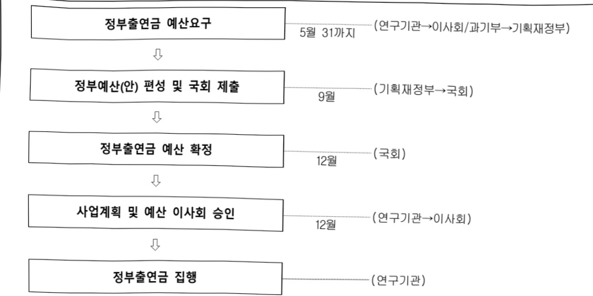

# 국가과학기술연구회 연구 운영비 지원(R&D)

**해당 페이지**: PDF 786 ~ 793 쪽 해당

**부처**: 과학기술정보통신부
**분야**: 과학기술
**회계유형**: 일반회계
**2026 확정예산**: 360849.0 백만원
**전년대비 증감률**: 45.8%
**AI 도메인**: R&D 지원

---

### 가. 예산 총괄표

(단위:백만원,%)

<table border=1 style='margin: auto; word-wrap: break-word;'><tr><td rowspan="2">사업명</td><td rowspan="2">2024년 결산</td><td colspan="2">2025년 예산</td><td colspan="2">2026년 예산</td><td rowspan="2">증감(B-A)</td><td rowspan="2">(B-A)/A</td></tr><tr><td style='text-align: center; word-wrap: break-word;'>본예산</td><td style='text-align: center; word-wrap: break-word;'>추경(A)</td><td style='text-align: center; word-wrap: break-word;'>요구안</td><td style='text-align: center; word-wrap: break-word;'>본예산(B)</td></tr><tr><td style='text-align: center; word-wrap: break-word;'>국가과학기술연구회연구운영비지원(R&amp;D)</td><td style='text-align: center; word-wrap: break-word;'>194,792</td><td style='text-align: center; word-wrap: break-word;'>247,439</td><td style='text-align: center; word-wrap: break-word;'>247,439</td><td style='text-align: center; word-wrap: break-word;'>370,614</td><td style='text-align: center; word-wrap: break-word;'>360,849</td><td style='text-align: center; word-wrap: break-word;'>113,410</td><td style='text-align: center; word-wrap: break-word;'>45.8</td></tr></table>

□ 기능별(내역사업별) 예산 내역

(단위:백만원)

<table border=1 style='margin: auto; word-wrap: break-word;'><tr><td rowspan="2">구분</td><td colspan="5">2024</td><td colspan="5">2025</td><td rowspan="2">2026예산</td></tr><tr><td style='text-align: center; word-wrap: break-word;'>예산액(추경)</td><td style='text-align: center; word-wrap: break-word;'>예산현액</td><td style='text-align: center; word-wrap: break-word;'>집행액</td><td style='text-align: center; word-wrap: break-word;'>이월액</td><td style='text-align: center; word-wrap: break-word;'>불용액</td><td style='text-align: center; word-wrap: break-word;'>예산액(추경)</td><td style='text-align: center; word-wrap: break-word;'>예산현액</td><td style='text-align: center; word-wrap: break-word;'>집행액</td><td style='text-align: center; word-wrap: break-word;'>이월액</td><td style='text-align: center; word-wrap: break-word;'>불용액</td></tr><tr><td style='text-align: center; word-wrap: break-word;'>○ 기능별 분류(합계)</td><td style='text-align: center; word-wrap: break-word;'>195,226</td><td style='text-align: center; word-wrap: break-word;'>195,226</td><td style='text-align: center; word-wrap: break-word;'>194,792</td><td style='text-align: center; word-wrap: break-word;'>-</td><td style='text-align: center; word-wrap: break-word;'>434</td><td style='text-align: center; word-wrap: break-word;'>247,439</td><td style='text-align: center; word-wrap: break-word;'>247,439</td><td style='text-align: center; word-wrap: break-word;'>242,137</td><td style='text-align: center; word-wrap: break-word;'>-</td><td style='text-align: center; word-wrap: break-word;'>302</td><td style='text-align: center; word-wrap: break-word;'>360,849</td></tr><tr><td style='text-align: center; word-wrap: break-word;'>· 기관운영비</td><td style='text-align: center; word-wrap: break-word;'>14,681</td><td style='text-align: center; word-wrap: break-word;'>14,681</td><td style='text-align: center; word-wrap: break-word;'>14,247</td><td style='text-align: center; word-wrap: break-word;'>-</td><td style='text-align: center; word-wrap: break-word;'>434</td><td style='text-align: center; word-wrap: break-word;'>15,242</td><td style='text-align: center; word-wrap: break-word;'>15,242</td><td style='text-align: center; word-wrap: break-word;'>14,940</td><td style='text-align: center; word-wrap: break-word;'>-</td><td style='text-align: center; word-wrap: break-word;'>302</td><td style='text-align: center; word-wrap: break-word;'>27,331</td></tr><tr><td style='text-align: center; word-wrap: break-word;'>· 주요사업비</td><td style='text-align: center; word-wrap: break-word;'>180,545</td><td style='text-align: center; word-wrap: break-word;'>180,545</td><td style='text-align: center; word-wrap: break-word;'>180,545</td><td style='text-align: center; word-wrap: break-word;'>-</td><td style='text-align: center; word-wrap: break-word;'>-</td><td style='text-align: center; word-wrap: break-word;'>232,197</td><td style='text-align: center; word-wrap: break-word;'>232,197</td><td style='text-align: center; word-wrap: break-word;'>232,197</td><td style='text-align: center; word-wrap: break-word;'>-</td><td style='text-align: center; word-wrap: break-word;'>-</td><td style='text-align: center; word-wrap: break-word;'>333,518</td></tr></table>

---

### 나. 사업설명자료

## 1 ) 사업목적·내용

- (기관운영비) 과학기술분야 정부출연연구기관 등의 설립·운영 및 육성에 관한 법률

(이하 ‘과기출연기관법’)에 의거, 연구회 설립목적과 고유임무 수행을 위한 인건비 및 경상경비 지원

- (주요사업비)

(출연(연) 지원·육성사업) 연구회 및 소관연구기관의 발전방향 기획 및 '책임과 자율'의 연구물입환경 구축을 위한 평가제도 운영과 출연(연) 연구행정선진화 지원 및 자체 감사지원 등 경영효율화 사업, 해외우수연구기관과의 교류 기반의 연구협력 플랫폼 구축을 통해 출연(연)이 R&R에 부합하는 연구역량 확보 지원

(출연(연) 연구성과학산·관리지원사업) 출연(연) 연구성과 사업화 및 기술창업 지원을 통한 우수연구성과 창출 유도와 출연(연)의 중소·중견기업 지원 활성화 지원

(유합연구사업) 출연(연)간 융합 및 협력 강화를 위한 융합연구사업 추진 및 출연(연)

R&R협업 지원과 목적지향적 융합연구 강화를 통한 국가·사회적 현안해결, 창의·도전적인 원천기술 확보 추진

(출연(연) 인재생태계조성사업) 우수인재가 출연(연)에 유입되어 지속 성장하고 안정적으로 정착하여 성과를 창출할 수 있는 선순환적 전주기 통합 인재생태계 조성 지원

(국가 과학AI 연구지원센터(NAIS) 설립사업) 출연(연) 과학AI 허브 조성, 연구자 AI활용 서비스 지원 등 AI를 통한 출연(연) R&D 패러다임 전환 지원

## 2 ) 사업개요

## 사업근거 및 추진경위

① 법령상 근거 조항 적시 : 「과학기술분야 정부출연연구기관 등의 설립·운영 및 육성에 관한 법률, 제18조, 제19조, 제21조

② 추진경위

- 1999. 1.29. 「정부출연연구기관등의설립운영및육성에관한법률」 공포

- 1999. 3.15. 과학기술분야 3개 연구회(기초·공공·산업기술연구회) 출범

- 2004. 9.23. 「과학기술분야 정부출연연구기관 등의 설립·운영 및 육성에 관한 법률」 공포

※ 감독관청변경 : 국무총리 → 과학기술부

- 2008. 2.29. 감독관청 변경 (과학기술부→교육과학기술부, 지식경제부) ※ 공공기술연구회 폐지

- 2013. 3.23. 감독관청 변경 (교육과학기술부, 지식경제부 → 미래창조과학부)

- 2014. 5. 2.

- 과학기술분야 정부출연연구기관 등의 설립운영 및 육성에 관한 법률 개정

※ 과학기술계 2개 연구회 통합

---

- 2014. 6.30. 국가과학기술연구회 출범

- 2017. 7.26. 감독관청 변경(미래창조과학부→과학기술정보통신부)

- 2020. 6. 9.

- 과학기술분야 정부출연연구기관 등의 설립·운영 및 육성에 관한 법률 개정

※ 출연(연) 자체감사 수행기능 부여('20.12.10. 시행)

- 2020.12.20.

- 과학기술분야 정부출연연구기관 등의 설립·운영 및 육성에 관한 법률 개정

※ 연구개발전략위원회 구성·운영 기능 부여('21.6.23. 시행)

## 주요내용

① 사업규모

- 총사업비 : 해당없음

- 사업기간 : 1999 ~ 계속

- 최근 5년 간 투입된 사업비

<table border=1 style='margin: auto; word-wrap: break-word;'><tr><td style='text-align: center; word-wrap: break-word;'>$ \underline{\text{所}} $</td><td style='text-align: center; word-wrap: break-word;'>2022</td><td style='text-align: center; word-wrap: break-word;'>2023</td><td style='text-align: center; word-wrap: break-word;'>2024</td><td style='text-align: center; word-wrap: break-word;'>2025</td><td style='text-align: center; word-wrap: break-word;'>2026</td></tr><tr><td style='text-align: center; word-wrap: break-word;'>$ \underline{\text{사}} $</td><td style='text-align: center; word-wrap: break-word;'>115,098</td><td style='text-align: center; word-wrap: break-word;'>121,717</td><td style='text-align: center; word-wrap: break-word;'>195,226</td><td style='text-align: center; word-wrap: break-word;'>247,439</td><td style='text-align: center; word-wrap: break-word;'>360,849</td></tr></table>

- 기타: 해당없음

② 사업추진체계

- 사업시행방법 : 출연, 직접수행

- 사업시행주체 : 국가과학기술연구회

- 사업 수혜자 : 소관 출연(연)을 비롯한 연구계, 학계, 산업계, 정부관계자 및 국민

- 보조, 융자, 출연, 출자 등의 경우 보조·융자 등 지원 비율 및 법적근거

<table border=1 style='margin: auto; word-wrap: break-word;'><tr><td style='text-align: center; word-wrap: break-word;'>내역사업명</td><td style='text-align: center; word-wrap: break-word;'>구분</td><td style='text-align: center; word-wrap: break-word;'>피보조·피출연 등 기관명</td><td style='text-align: center; word-wrap: break-word;'>지원 금액 (2026예산)</td><td style='text-align: center; word-wrap: break-word;'>지원 비율(%)</td><td style='text-align: center; word-wrap: break-word;'>보조율 법적근거 (해당 조항)</td></tr><tr><td style='text-align: center; word-wrap: break-word;'>국가과학 기술연구회 연구운영비 지원(R&amp;D)</td><td style='text-align: center; word-wrap: break-word;'>출연</td><td style='text-align: center; word-wrap: break-word;'>국가 과학기술 연구회</td><td style='text-align: center; word-wrap: break-word;'>360,849</td><td style='text-align: center; word-wrap: break-word;'>100%</td><td style='text-align: center; word-wrap: break-word;'>과학기술분야 정부출연연구기관 등의 설립·운영 및 육성에 관한 법률 제5조 제1, 2항</td></tr></table>

---

□（'26년) 360,849백만원 요구 (전년대비 113,410백만원 증액)
·（'25년) 247,439백만원 →（'26년) 360,849백만원
(1) 기관운영비 : 27,331백만원 (전년대비 12,089백만원 증액)
○ 인건비 : 23,040백만원 (전년대비 11,472백만원 증액)
-（'25년) 136명×85백만×100%×12/12개월 →（'26년) 289명×80백만×100%×12/12개월
○ 경상운영비 : 4,291백만원 (전년대비 617백만원 증액)
-（'25년) 1회×3,674백만×12/12개월 →（'26년) 1회×4,291백만×12/12개월
(2) 주요사업비 : 333,518백만원 (전년대비 101,321백만원 증액)
○ 출연(연) 지원·육성사업 : 16,198백만원 (전년대비 443백만원 증액)
- 출연(연) 연구행정생태계 지원사업 : 13,682백만원 (전년대비 711백만원 증액)
·（'25년) 1회×12,971백만원 →（'26년) 1회×13,682백만원
- 평가사업 : 760백만원 (전년대비 200백만원 감액)
·（'25년) 1회×960백만원 →（'26년) 1회×760백만원
- 출연(연) 자체감사 지원사업 : 1,756백만원 (전년대비 68백만원 감액)
·（'25년) 1회×1,824백만원 →（'26년) 1회×1,756백만원
○ 출연(연) 연구성과확산·관리지원사업 : 2,494백만원 (전년대비 1,584백만원 감액)
- 출연(연) 성과확산지원사업 : 1,500백만원 (전년대비 1,584백만원 감액)
·（'25년) 1회×3,084백만원 →（'26년) 1회×1,500백만원
- 출연(연) 중소중전지원사업 : 994백만원 (전년 동)
·（'25년) 1회×994백만원 →（'26년) 1회×994백만원
○ 융합연구사업 : 259,946백만원 (전년대비 56,642백만원 증액)
- 글로벌 TOP 전략연구단 지원사업 : 210,400백만원 (전년대비 58,350백만원 증액)
·（'25년) 1회×152,050백만원 →（'26년) 1회×210,400백만원
- 창의형 융합연구사업(CAP) : 20,458백만원(전년대비 238백만원 증액)
·（'25년) 1회×20,220백만원 →（'26년) 1회×20,458백만원
- 융합연구단사업 : 27,196백만원(전년대비 746백만원 감액)
·（'25년) 1회×27,942백만원 →（'26년) 1회×27,196백만원
- 선행융합연구사업 등 : 1,892백만원(전년대비 1,200백만원 감액)
·（'25년) 1회×3,092백만원 →（'26년) 1회×1,892백만원
○ 출연(연) 인재생태계 조성사업 : 14,880백만원 (전년대비 5,820백만원 증액)
- 출연(연) 미래인재 양성사업 : 8,760백만원 (전년대비 300백만원 감액)
·（'25년) 1회×9,060백만원 →（'26년) 1회×8,760백만원
- 출연(연) 인재혁신 지원사업 : 6,120백만원 (신규)
·（'26년) 1회×6,120백만원(신규)
○ 국가 과학AI 연구지원센터(NAIS) 설립사업 : 40,000백만원 (신규)
·（'26년) 1회×40,000백만원(신규)

---

## 4 ) 사업효과

사업영향, 산출물 성과지표 등

① 2022~2026년도 성과계획서 상 성과지표 및 최근 5년간 성과 달성도 : 해당없음

② 성과지표 이외의 연도별 사업추진 경과 및 실적

<table border=1 style='margin: auto; word-wrap: break-word;'><tr><td style='text-align: center; word-wrap: break-word;'>2022</td><td style='text-align: center; word-wrap: break-word;'>○ 4개 주요사업 수행 - 출연(연) 지원·육성사업(기획, 평가, 출연(연) 경영효율화 지원, 글로벌 연구협력 네트워크), 출연(연) 연구성과확산관리지원사업(성과확산지원, 중소중견기업 지원), 융합연구사업, 출연(연) 맞춤형 인력양성사업</td></tr><tr><td style='text-align: center; word-wrap: break-word;'>2023</td><td style='text-align: center; word-wrap: break-word;'>○ 4개 주요사업 수행 - 출연(연) 지원·육성사업(기획, 평가, 출연(연) 경영효율화 지원, 글로벌 연구협력 네트워크), 출연(연) 연구성과확산관리지원사업(성과확산지원, 중소중견기업 지원), 융합연구사업, 출연(연) 맞춤형 인력양성사업</td></tr><tr><td style='text-align: center; word-wrap: break-word;'>2024</td><td style='text-align: center; word-wrap: break-word;'>○ 4개 주요사업 수행 - 출연(연) 지원·육성사업(기획, 평가, 출연(연) 경영효율화 지원, 출연(연) 자체 감사지원, 글로벌 연구협력 네트워크, 출연(연) 연구행정디지털전환사업), 출연(연) 연구성과확산관리지원사업(성과확산지원, 중소중견기업 지원), 융합연구사업, 출연(연) 맞춤형 인력양성사업</td></tr><tr><td style='text-align: center; word-wrap: break-word;'>2025</td><td style='text-align: center; word-wrap: break-word;'>○ 4개 주요사업 수행 - 출연(연) 지원·육성사업(기획, 평가, 출연(연) 경영효율화 지원, 출연(연) 자체 감사지원, 글로벌 연구협력 네트워크, 출연(연) 연구행정디지털전환사업), 출연(연) 연구성과확산관리지원사업(성과확산지원, 중소중견기업 지원), 융합연구사업, 출연(연) 맞춤형 인력양성사업</td></tr></table>

## ③향후(2026년도 이후)기대효과

- (슬먼(언) 시원 · 효성사업) PBS개편 등 줄연(연) 연구시스템 개선을 통한 우수한 연구성과 도출 및 연구성과 중심의 평가 체계구축을 기반으로 한 선도형 연구체계 강화와 연구행정혁신 추진에 따른 연구몰입도 제고 및 인력고용, 근무환경 개선 추진에 의한 연구중심 경영체계 개선

- (출연(연) 연구성과학산 · 관리지원사업) 출연(연) 보유 인프라 및 우수기술 활용을 통한 국내 산업 기술경쟁력 제고, 출연(연) 특성에 따른 중소기업 지원 및 중소기업 기술혁신 역량 강화

- (융합연구사업) 국가현안 해결, 융합형 원천기술 개발, 국제공동연구를 위한

산·학·연 융합연구 활성화 및 출연(연) 중심 융합연구생태계 조성

- (출연(연) 인재생태계 조성사업) 출연(연)의 역할을 고려한 과학기술 인재 확보.

육성의 공정성 제고 및 수월성 확보

- (국가 과학AI 연구지원센터(NAIS) 설립사업) AI 중심 연구자 간 일상적·상시적 협력·교류 강화로 과학AI 선도에 기여하고, 컴퓨팅 인프라 및 AI전문성 지원을 통한 출연(연) 연구생산성 제고

---

5) 타당성조사 및 예비타당성조사 시행여부 및 결과 요지 : 해당없음

6) 총사업비 대상사업 정보 : 해당없음

7) 사업 집행절차

○ 국가과학기술연구회 이사회 (예산 요구(안) 심의·의결·제출)

○ 과학기술정보통신부 (예산 요구(안) 심의·제출)

○ 기획재정부 (예산 요구(안) 심의 및 정부(안) 확정)

○ 국회 과방위 (예산 요구(안) 심의 및 승인)

○ 국회 예결위 (예산 요구(안) 심의 및 승인)

○ 국가과학기술연구회 이사회 (사업계획 및 예산(안) 제출 및 승인)

○ 국가과학기술연구회 (출연금 교부 신청)

○ 과학기술정보통신부 (출연금 교부)

○ 국가과학기술연구회 (사업 수행)

## 8 ) 각종 평가

1) 국회(예결위, 상임위, 예정처, 국정감사 포함) 지적 : 해당없음

2) 대외공개 평가 : 해당없음

3) 자체평가 : 해당없음

---

### 다. 최근 4년간 결산내역

## 1 ) 결산표

☐ 부처 결산내역

(단위: 백만원, %)

<table border=1 style='margin: auto; word-wrap: break-word;'><tr><td rowspan="2">연도</td><td colspan="3">예산액</td><td rowspan="2">예산현액(A)</td><td rowspan="2">집행액(B)</td><td rowspan="2">집행률(B/A)</td><td rowspan="2">다음연도이월액</td><td rowspan="2">불용액</td></tr><tr><td style='text-align: center; word-wrap: break-word;'>본예산</td><td style='text-align: center; word-wrap: break-word;'>추경증감액</td><td style='text-align: center; word-wrap: break-word;'>추경</td></tr><tr><td style='text-align: center; word-wrap: break-word;'>2022</td><td style='text-align: center; word-wrap: break-word;'>115,098</td><td style='text-align: center; word-wrap: break-word;'>-</td><td style='text-align: center; word-wrap: break-word;'>115,098</td><td style='text-align: center; word-wrap: break-word;'>115,098</td><td style='text-align: center; word-wrap: break-word;'>114,562</td><td style='text-align: center; word-wrap: break-word;'>99.5</td><td style='text-align: center; word-wrap: break-word;'>-</td><td style='text-align: center; word-wrap: break-word;'>536</td></tr><tr><td style='text-align: center; word-wrap: break-word;'>2023</td><td style='text-align: center; word-wrap: break-word;'>121,717</td><td style='text-align: center; word-wrap: break-word;'>-</td><td style='text-align: center; word-wrap: break-word;'>121,717</td><td style='text-align: center; word-wrap: break-word;'>121,717</td><td style='text-align: center; word-wrap: break-word;'>121,472</td><td style='text-align: center; word-wrap: break-word;'>99.8</td><td style='text-align: center; word-wrap: break-word;'>-</td><td style='text-align: center; word-wrap: break-word;'>245</td></tr><tr><td style='text-align: center; word-wrap: break-word;'>2024</td><td style='text-align: center; word-wrap: break-word;'>195,226</td><td style='text-align: center; word-wrap: break-word;'>-</td><td style='text-align: center; word-wrap: break-word;'>195,226</td><td style='text-align: center; word-wrap: break-word;'>195,226</td><td style='text-align: center; word-wrap: break-word;'>194,792</td><td style='text-align: center; word-wrap: break-word;'>99.8</td><td style='text-align: center; word-wrap: break-word;'>-</td><td style='text-align: center; word-wrap: break-word;'>434</td></tr><tr><td style='text-align: center; word-wrap: break-word;'>2025</td><td style='text-align: center; word-wrap: break-word;'>247,439</td><td style='text-align: center; word-wrap: break-word;'>-</td><td style='text-align: center; word-wrap: break-word;'>247,439</td><td style='text-align: center; word-wrap: break-word;'>247,439</td><td style='text-align: center; word-wrap: break-word;'>247,137</td><td style='text-align: center; word-wrap: break-word;'>99.9</td><td style='text-align: center; word-wrap: break-word;'>-</td><td style='text-align: center; word-wrap: break-word;'>302</td></tr></table>

## 2 ) 주요 결산사항

□ 2022~2025년 결산 주요사항

<table border=1 style='margin: auto; word-wrap: break-word;'><tr><td style='text-align: center; word-wrap: break-word;'>2022</td><td style='text-align: center; word-wrap: break-word;'>- 불용사유 : 결원인건비 등으로 발생한 인건비 집행잔액 536백만원을 미교부하여 불용</td></tr><tr><td style='text-align: center; word-wrap: break-word;'>2023</td><td style='text-align: center; word-wrap: break-word;'>- 불용사유 : 결원인건비 등으로 발생한 인건비 집행잔액 245백만원을 미교부하여 불용</td></tr><tr><td style='text-align: center; word-wrap: break-word;'>2024</td><td style='text-align: center; word-wrap: break-word;'>- 불용사유 : 결원인건비 등으로 발생한 인건비 집행잔액 434백만원을 미교부하여 불용</td></tr><tr><td style='text-align: center; word-wrap: break-word;'>2025</td><td style='text-align: center; word-wrap: break-word;'>- 불용사유 : 결원인건비 등으로 발생한 인건비 집행잔액 302백만원을 미교부하여 불용</td></tr></table>

□ 2025년 이·전용 등 세부내역 : 해당없음

---

<table border=1 style='margin: auto; word-wrap: break-word;'><tr><td style='text-align: center; word-wrap: break-word;'>사 업 명</td></tr><tr><td style='text-align: center; word-wrap: break-word;'>(195) 국가수리과학연구소 연구운영비 지원(R&amp;D) (2231-416)</td></tr></table>

사업 코드 정보

<table border=1 style='margin: auto; word-wrap: break-word;'><tr><td style='text-align: center; word-wrap: break-word;'>구분</td><td style='text-align: center; word-wrap: break-word;'>회계</td><td style='text-align: center; word-wrap: break-word;'>소관</td><td style='text-align: center; word-wrap: break-word;'>실국(기관)</td><td style='text-align: center; word-wrap: break-word;'>계정</td><td style='text-align: center; word-wrap: break-word;'>분야</td><td style='text-align: center; word-wrap: break-word;'>부문</td></tr><tr><td style='text-align: center; word-wrap: break-word;'>코드</td><td rowspan="2">일반회계</td><td rowspan="2">과학기술정보통신부</td><td rowspan="2">기초원천연구정책관</td><td rowspan="2">-</td><td style='text-align: center; word-wrap: break-word;'>150</td><td style='text-align: center; word-wrap: break-word;'>152</td></tr><tr><td style='text-align: center; word-wrap: break-word;'>명칭</td><td style='text-align: center; word-wrap: break-word;'>과학기술</td><td style='text-align: center; word-wrap: break-word;'>과학기술연구지원</td></tr></table>

<table border=1 style='margin: auto; word-wrap: break-word;'><tr><td style='text-align: center; word-wrap: break-word;'>구분</td><td style='text-align: center; word-wrap: break-word;'>프로그램</td><td style='text-align: center; word-wrap: break-word;'>단위사업</td><td style='text-align: center; word-wrap: break-word;'>세부사업</td></tr><tr><td style='text-align: center; word-wrap: break-word;'>코드</td><td style='text-align: center; word-wrap: break-word;'>2200</td><td style='text-align: center; word-wrap: break-word;'>2231</td><td style='text-align: center; word-wrap: break-word;'>416</td></tr><tr><td style='text-align: center; word-wrap: break-word;'>명칭</td><td style='text-align: center; word-wrap: break-word;'>출연연구기관지원</td><td style='text-align: center; word-wrap: break-word;'>직할출연연구기관지원</td><td style='text-align: center; word-wrap: break-word;'>국가수리과학연구소 연구운영비 지원(R&amp;D)</td></tr></table>

☐ 사업 성격

<table border=1 style='margin: auto; word-wrap: break-word;'><tr><td rowspan="2">신규</td><td rowspan="2">계속</td><td rowspan="2">완료</td><td rowspan="2">예비타당성 실시여부</td><td rowspan="2">총사업비 관리대상</td><td rowspan="2">총액계상 예산사업</td><td style='text-align: center; word-wrap: break-word;'>사업소관 변경정보</td></tr><tr><td style='text-align: center; word-wrap: break-word;'>2025예산 시 소관</td></tr><tr><td style='text-align: center; word-wrap: break-word;'></td><td style='text-align: center; word-wrap: break-word;'>☐</td><td style='text-align: center; word-wrap: break-word;'></td><td style='text-align: center; word-wrap: break-word;'></td><td style='text-align: center; word-wrap: break-word;'></td><td style='text-align: center; word-wrap: break-word;'></td><td style='text-align: center; word-wrap: break-word;'></td></tr></table>

□ 사업 지원 형태 및 지원을 (최소한 한 개는 반드시 선택하시오. 해당사항에 O 표시)

<table border=1 style='margin: auto; word-wrap: break-word;'><tr><td style='text-align: center; word-wrap: break-word;'>직접</td><td style='text-align: center; word-wrap: break-word;'>출자</td><td style='text-align: center; word-wrap: break-word;'>출연</td><td style='text-align: center; word-wrap: break-word;'>보조</td><td style='text-align: center; word-wrap: break-word;'>융자</td><td style='text-align: center; word-wrap: break-word;'>국고보조율(%)</td><td style='text-align: center; word-wrap: break-word;'>융자율(%)</td></tr><tr><td style='text-align: center; word-wrap: break-word;'></td><td style='text-align: center; word-wrap: break-word;'></td><td style='text-align: center; word-wrap: break-word;'>○</td><td style='text-align: center; word-wrap: break-word;'></td><td style='text-align: center; word-wrap: break-word;'></td><td style='text-align: center; word-wrap: break-word;'></td><td style='text-align: center; word-wrap: break-word;'></td></tr></table>

## ☐ 사업 소관부처 및 시행주체

<table border=1 style='margin: auto; word-wrap: break-word;'><tr><td style='text-align: center; word-wrap: break-word;'>사업명</td><td colspan="2">구분</td></tr><tr><td rowspan="3">국가수리 과학연구소 연구운영비 지원(R&amp;D)</td><td rowspan="2">소관부처</td><td style='text-align: center; word-wrap: break-word;'>연구개발정책실 기초원천연구정책관</td></tr><tr><td style='text-align: center; word-wrap: break-word;'>기초연구진흥과</td></tr><tr><td style='text-align: center; word-wrap: break-word;'>사업시행주체</td><td style='text-align: center; word-wrap: break-word;'>국가수리과학연구소</td></tr></table>

---

### 원본 PDF 크롭 이미지

