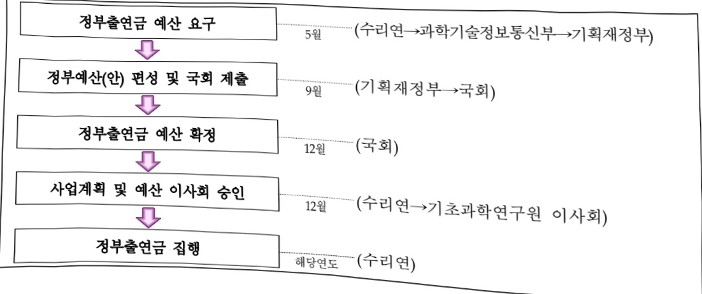

# 국가수리과학연구소 연구 운영비 지원(R&D)

**해당 페이지**: PDF 794 ~ 799 쪽 해당

**부처**: 과학기술정보통신부
**분야**: 과학기술
**회계유형**: 일반회계
**2026 확정예산**: 13216.0 백만원
**전년대비 증감률**: 16.2%
**AI 도메인**: R&D 지원

---

<table border=1 style='margin: auto; word-wrap: break-word;'><tr><td style='text-align: center; word-wrap: break-word;'>사 업 명</td></tr><tr><td style='text-align: center; word-wrap: break-word;'>(195) 국가수리과학연구소 연구운영비 지원(R&amp;D) (2231-416)</td></tr></table>

사업 코드 정보

<table border=1 style='margin: auto; word-wrap: break-word;'><tr><td style='text-align: center; word-wrap: break-word;'>구분</td><td style='text-align: center; word-wrap: break-word;'>회계</td><td style='text-align: center; word-wrap: break-word;'>소관</td><td style='text-align: center; word-wrap: break-word;'>실국(기관)</td><td style='text-align: center; word-wrap: break-word;'>계정</td><td style='text-align: center; word-wrap: break-word;'>분야</td><td style='text-align: center; word-wrap: break-word;'>부문</td></tr><tr><td style='text-align: center; word-wrap: break-word;'>코드</td><td rowspan="2">일반회계</td><td rowspan="2">과학기술정보통신부</td><td rowspan="2">기초원천연구정책관</td><td rowspan="2">-</td><td style='text-align: center; word-wrap: break-word;'>150</td><td style='text-align: center; word-wrap: break-word;'>152</td></tr><tr><td style='text-align: center; word-wrap: break-word;'>명칭</td><td style='text-align: center; word-wrap: break-word;'>과학기술</td><td style='text-align: center; word-wrap: break-word;'>과학기술연구지원</td></tr></table>

<table border=1 style='margin: auto; word-wrap: break-word;'><tr><td style='text-align: center; word-wrap: break-word;'>구분</td><td style='text-align: center; word-wrap: break-word;'>프로그램</td><td style='text-align: center; word-wrap: break-word;'>단위사업</td><td style='text-align: center; word-wrap: break-word;'>세부사업</td></tr><tr><td style='text-align: center; word-wrap: break-word;'>코드</td><td style='text-align: center; word-wrap: break-word;'>2200</td><td style='text-align: center; word-wrap: break-word;'>2231</td><td style='text-align: center; word-wrap: break-word;'>416</td></tr><tr><td style='text-align: center; word-wrap: break-word;'>명칭</td><td style='text-align: center; word-wrap: break-word;'>출연연구기관지원</td><td style='text-align: center; word-wrap: break-word;'>직할출연연구기관지원</td><td style='text-align: center; word-wrap: break-word;'>국가수리과학연구소 연구운영비 지원(R&amp;D)</td></tr></table>

☐ 사업 성격

<table border=1 style='margin: auto; word-wrap: break-word;'><tr><td rowspan="2">신규</td><td rowspan="2">계속</td><td rowspan="2">완료</td><td rowspan="2">예비타당성 실시여부</td><td rowspan="2">총사업비 관리대상</td><td rowspan="2">총액계상 예산사업</td><td style='text-align: center; word-wrap: break-word;'>사업소관 변경정보</td></tr><tr><td style='text-align: center; word-wrap: break-word;'>2025예산 시 소관</td></tr><tr><td style='text-align: center; word-wrap: break-word;'></td><td style='text-align: center; word-wrap: break-word;'>☐</td><td style='text-align: center; word-wrap: break-word;'></td><td style='text-align: center; word-wrap: break-word;'></td><td style='text-align: center; word-wrap: break-word;'></td><td style='text-align: center; word-wrap: break-word;'></td><td style='text-align: center; word-wrap: break-word;'></td></tr></table>

□ 사업 지원 형태 및 지원을 (최소한 한 개는 반드시 선택하시오. 해당사항에 O 표시)

<table border=1 style='margin: auto; word-wrap: break-word;'><tr><td style='text-align: center; word-wrap: break-word;'>직접</td><td style='text-align: center; word-wrap: break-word;'>출자</td><td style='text-align: center; word-wrap: break-word;'>출연</td><td style='text-align: center; word-wrap: break-word;'>보조</td><td style='text-align: center; word-wrap: break-word;'>융자</td><td style='text-align: center; word-wrap: break-word;'>국고보조율(%)</td><td style='text-align: center; word-wrap: break-word;'>융자율(%)</td></tr><tr><td style='text-align: center; word-wrap: break-word;'></td><td style='text-align: center; word-wrap: break-word;'></td><td style='text-align: center; word-wrap: break-word;'>○</td><td style='text-align: center; word-wrap: break-word;'></td><td style='text-align: center; word-wrap: break-word;'></td><td style='text-align: center; word-wrap: break-word;'></td><td style='text-align: center; word-wrap: break-word;'></td></tr></table>

## ☐ 사업 소관부처 및 시행주체

<table border=1 style='margin: auto; word-wrap: break-word;'><tr><td style='text-align: center; word-wrap: break-word;'>사업명</td><td colspan="2">구분</td></tr><tr><td rowspan="3">국가수리 과학연구소 연구운영비 지원(R&amp;D)</td><td rowspan="2">소관부처</td><td style='text-align: center; word-wrap: break-word;'>연구개발정책실 기초원천연구정책관</td></tr><tr><td style='text-align: center; word-wrap: break-word;'>기초연구진흥과</td></tr><tr><td style='text-align: center; word-wrap: break-word;'>사업시행주체</td><td style='text-align: center; word-wrap: break-word;'>국가수리과학연구소</td></tr></table>

---

### 가. 예산 총괄표

(단위: 백만원, %)

<table border=1 style='margin: auto; word-wrap: break-word;'><tr><td rowspan="2">사업명</td><td rowspan="2">2024년 결산</td><td colspan="2">2025년 예산</td><td colspan="2">2026년 예산</td><td rowspan="2">중감 (B-A)</td><td rowspan="2">(B-A)/A</td></tr><tr><td style='text-align: center; word-wrap: break-word;'>본예산</td><td style='text-align: center; word-wrap: break-word;'>추경*(A)</td><td style='text-align: center; word-wrap: break-word;'>요구안</td><td style='text-align: center; word-wrap: break-word;'>본예산(B)</td></tr><tr><td style='text-align: center; word-wrap: break-word;'>국가수리과학연구소 연구운영비 지원(R&amp;D)</td><td style='text-align: center; word-wrap: break-word;'>10,668</td><td style='text-align: center; word-wrap: break-word;'>11,369</td><td style='text-align: center; word-wrap: break-word;'>11,369</td><td style='text-align: center; word-wrap: break-word;'>13,216</td><td style='text-align: center; word-wrap: break-word;'>13,216</td><td style='text-align: center; word-wrap: break-word;'>1,847</td><td style='text-align: center; word-wrap: break-word;'>16.2</td></tr></table>

* 추경: 추경증감액을 포함한 최종 예산액을 기재

## □ 기능별(내역사업별) 예산 내역

(단위: 백만원)

<table border=1 style='margin: auto; word-wrap: break-word;'><tr><td rowspan="2"></td><td colspan="5">2024</td><td colspan="5">2025</td><td rowspan="2">2026
예산</td></tr><tr><td style='text-align: center; word-wrap: break-word;'>예산액
(추정)</td><td style='text-align: center; word-wrap: break-word;'>예산
현액</td><td style='text-align: center; word-wrap: break-word;'>집행액</td><td style='text-align: center; word-wrap: break-word;'>이일액</td><td style='text-align: center; word-wrap: break-word;'>불용액</td><td style='text-align: center; word-wrap: break-word;'>예산액
(추정)</td><td style='text-align: center; word-wrap: break-word;'>예산
현액</td><td style='text-align: center; word-wrap: break-word;'>집행액</td><td style='text-align: center; word-wrap: break-word;'>이일액</td><td style='text-align: center; word-wrap: break-word;'>불용액</td></tr><tr><td style='text-align: center; word-wrap: break-word;'>○ 기능별 분류(합계)</td><td style='text-align: center; word-wrap: break-word;'>10,668</td><td style='text-align: center; word-wrap: break-word;'>10,668</td><td style='text-align: center; word-wrap: break-word;'>10,668</td><td style='text-align: center; word-wrap: break-word;'>-</td><td style='text-align: center; word-wrap: break-word;'>-</td><td style='text-align: center; word-wrap: break-word;'>11,369</td><td style='text-align: center; word-wrap: break-word;'>11,369</td><td style='text-align: center; word-wrap: break-word;'>11,369</td><td style='text-align: center; word-wrap: break-word;'>-</td><td style='text-align: center; word-wrap: break-word;'>-</td><td style='text-align: center; word-wrap: break-word;'>13,216</td></tr><tr><td style='text-align: center; word-wrap: break-word;'>• 인건비</td><td style='text-align: center; word-wrap: break-word;'>4,959</td><td style='text-align: center; word-wrap: break-word;'>4,959</td><td style='text-align: center; word-wrap: break-word;'>4,959</td><td style='text-align: center; word-wrap: break-word;'>-</td><td style='text-align: center; word-wrap: break-word;'>-</td><td style='text-align: center; word-wrap: break-word;'>5,108</td><td style='text-align: center; word-wrap: break-word;'>5,108</td><td style='text-align: center; word-wrap: break-word;'>5,108</td><td style='text-align: center; word-wrap: break-word;'>-</td><td style='text-align: center; word-wrap: break-word;'>-</td><td style='text-align: center; word-wrap: break-word;'>5,287</td></tr><tr><td style='text-align: center; word-wrap: break-word;'>• 경상경비</td><td style='text-align: center; word-wrap: break-word;'>1,54</td><td style='text-align: center; word-wrap: break-word;'>1,54</td><td style='text-align: center; word-wrap: break-word;'>1,54</td><td style='text-align: center; word-wrap: break-word;'>-</td><td style='text-align: center; word-wrap: break-word;'>-</td><td style='text-align: center; word-wrap: break-word;'>1,551</td><td style='text-align: center; word-wrap: break-word;'>1,551</td><td style='text-align: center; word-wrap: break-word;'>1,551</td><td style='text-align: center; word-wrap: break-word;'>-</td><td style='text-align: center; word-wrap: break-word;'>-</td><td style='text-align: center; word-wrap: break-word;'>1,562</td></tr><tr><td style='text-align: center; word-wrap: break-word;'>• 사업비</td><td style='text-align: center; word-wrap: break-word;'>4,160</td><td style='text-align: center; word-wrap: break-word;'>4,160</td><td style='text-align: center; word-wrap: break-word;'>4,160</td><td style='text-align: center; word-wrap: break-word;'>-</td><td style='text-align: center; word-wrap: break-word;'>-</td><td style='text-align: center; word-wrap: break-word;'>4,710</td><td style='text-align: center; word-wrap: break-word;'>4,710</td><td style='text-align: center; word-wrap: break-word;'>4,710</td><td style='text-align: center; word-wrap: break-word;'>-</td><td style='text-align: center; word-wrap: break-word;'>-</td><td style='text-align: center; word-wrap: break-word;'>6,367</td></tr></table>

### 나. 사업설명자료

## 1 ) 사업목적·내용

- (목적) 전문적인 수학연구를 통해 수학분야 국가경쟁력을 확보하고 전문 인력을

양성하며, 수학을 기반으로 과학기술 및 산업과의 연계 강화

- (내용) 과기부 산업수학 육성에 따라 산업수학 핵심 원천기술(의료수학, 기초과학 등)

확보 및 산업·공공분야 산업문제 해결 등을 통한 국가 산업경쟁력 제고

## 2 ) 사업개요

## 사업근거 및 추진경위

- 국제과학비즈니스벨트 조성 및 지원에 관한 특별법 14조의2

※ 제14조의2(부설기관) 연구원은 과학기술정보통신부장관의 인가를 받아

정관으로 정하는 바에 따라 부설기관을 둘 수 있다. <본조신설 2018.6.12.>

---

- 기초과학연구원 정관 제37조의2

※ 제37조의2(국가수리과학연구소) 전문적인 수학연구를 통해 수학분야의 국가경쟁력 확보하고 전문 인력을 양성하며, 수학을 기반으로 과학기술 및 산업과의 연계를 강화하기 위하여 연구원의 부설기관으로 국가수리과학연구소를 둔다 <신설 2012.8.9> <개정 2016.3.24>

② 추진경위

- '03.12 : “수리과학전문연구소 설립을 위한 방안 연구”(03.12~04.8, 과학기술부)

- '05.03 : 국가수리과학연구소 설립추진위원회 구성

- '05.07 : 국가수리과학연구소 설립기본계획 확정(과학기술부 기초연구국)

- '05.10 : 한국기초과학지원연구원 부설 국가수리과학연구소 설립

※ 과학기술분야 정부출연연구기관 등의 설립·운영 및 육성에 관한 법률

- '06.03 : 개소식 및 초대소장 조용승 박사 취임

- '07.01 : 정부출연금 배정

- '12.08 : 특정연구기관 기초과학연구원 부설 연구소로 이관

※ 국제과학비즈니스벨트조성 및 지원에 관한 특별법

- '16.04 : 미래창조과학부 "산업수학 육성방안" 의결

주요내용

① 사업규모

- 총사업비 : 해당 없음

- 사업기간 : '07년 ~ 계속

- 최근 5년 간 투입된 사업비(예산액기준, 추경편성한 연도에는 추경포함)

<table border=1 style='margin: auto; word-wrap: break-word;'><tr><td style='text-align: center; word-wrap: break-word;'>闰五</td><td style='text-align: center; word-wrap: break-word;'>2022</td><td style='text-align: center; word-wrap: break-word;'>2023</td><td style='text-align: center; word-wrap: break-word;'>2024</td><td style='text-align: center; word-wrap: break-word;'>2025</td><td style='text-align: center; word-wrap: break-word;'>2026</td></tr><tr><td style='text-align: center; word-wrap: break-word;'>사업비</td><td style='text-align: center; word-wrap: break-word;'>10,080</td><td style='text-align: center; word-wrap: break-word;'>11,875</td><td style='text-align: center; word-wrap: break-word;'>10,668</td><td style='text-align: center; word-wrap: break-word;'>11,369</td><td style='text-align: center; word-wrap: break-word;'>13,216</td></tr></table>

② 사업추진체계

- 사업시행방법 : 출연

- 사업시행주체 : 국가수리과학연구소

- 사업 수혜자 : 수리과학 관련 분야 연구자, 산업체 및 공공분야, 일반인 등

- 보조, 융자, 출연, 출자 등의 경우 보조·융자 등 지원 비율 및 법적근거

<table border=1 style='margin: auto; word-wrap: break-word;'><tr><td style='text-align: center; word-wrap: break-word;'>내역사업명</td><td style='text-align: center; word-wrap: break-word;'>구분</td><td style='text-align: center; word-wrap: break-word;'>피보조·피출연 등 기관명</td><td style='text-align: center; word-wrap: break-word;'>지원 금액 (2026 예산)</td><td style='text-align: center; word-wrap: break-word;'>지원 비율(%)</td><td style='text-align: center; word-wrap: break-word;'>보조율 법적근거 (해당 조항)</td></tr><tr><td style='text-align: center; word-wrap: break-word;'>기관운영비 주요사업비</td><td style='text-align: center; word-wrap: break-word;'>출연</td><td style='text-align: center; word-wrap: break-word;'>국가수리 과학연구소</td><td style='text-align: center; word-wrap: break-word;'>6,849</td><td style='text-align: center; word-wrap: break-word;'>87%</td><td style='text-align: center; word-wrap: break-word;'>「국제과학비즈니스벨트 조성 및 지원에 관한 특별법」 제22조(연구원의 운영재원 등)</td></tr></table>

---

## 3 ) 2026년도 예산 산출 근거

□ 기관운영비 : 6,849백만원

o 인건비 : 5,287백만원

- 정규인력 채용 및 처우개선분 등 인건비

° 경상경비 : 1,562백만원

- 안정적 기관운영을 위한 경상비

□ 주요사업비 : 6,367 백만원

계산의료산업수학 연구, 산업수학 기반연구, 산업수학 문제해결 연구, 수리과학 통합정보시스템 운영사업, 수학문화 콘텐츠 개발 및 확산연구사업, 장비·시스템 구축비, 포스트 딥러닝과 사회적 인공지능 개발

## 4 ) 사업효과

☐ 사업영향, 산출물 성과지표 등

① 2022~2026년도 성과계획서 상 성과지표 및 최근 5년간 성과 달성도

※ 과학기술계 출연연 지원금 사업은 성과관리 비대상 사업으로 분류되어 성과계획서 미수립

② 성과지표 이외의 연도별 사업추진 경과 및 실적

<table border=1 style='margin: auto; word-wrap: break-word;'><tr><td style='text-align: center; word-wrap: break-word;'>2022</td><td style='text-align: center; word-wrap: break-word;'>· 기계학습 기반 농산물 가격 예측 개발 및 기술이전을 통한 연구성과 상용화(44백만원) · 양자내성암호 연산 고속화 기술 개발 국제 최고 저명 암호학회 “CHES 2022” 발표 · 강화학습을 통한 두부계측 연구 관련 대한의용생체공학회 우수 포스터상 수상 · 코로나19 관련 질병관리청 등 감염병 확산예측 정부지원 및 리포트 발간(‘20.9~’22.12) · 의료수학 및 암호 개발 기술의 특허 출원·등록(국내·외 각 1건 출원, 국내 2건 및 해외 1건 등록) · 산업·의료수학 관련 프로그램 저작권 등록(6건)</td></tr><tr><td style='text-align: center; word-wrap: break-word;'>2023</td><td style='text-align: center; word-wrap: break-word;'>· 계층 구조에 적합한 효율적인 양자내성 전자서명 알고리즘 기술이전(50백만원) · 국정원 추진 한국형 양자내성 암호 국가 공모전(KpqC)에 2개 알고리즘(MQ-Sign, NCC-Sign) 1라운드 선정 · 의료수학 및 암호개발 특허 출원(국내 3건, 미국 1건) 및 CT 영상에서의 영상품질 개선 등 프로그램 등록 4건 · 지역 과학기술 발전 및 의료·헬스케어 산업 활성화를 위한 NIMS-부산광역시 업무 협약 체결(‘23.7’)</td></tr><tr><td style='text-align: center; word-wrap: break-word;'>2024</td><td style='text-align: center; word-wrap: break-word;'>· X-ray CT 화질개선 국제 젤린지(AAPM-MAR Challenge) 2위 입상(하버드메디컬스쿨 주관/총 107개팀 참여) · 한국형 양자내성암호 국가공모전(KpqC) 1라운드 진출(전자서명 부분 상위 4개 중 2개 선정) · 다변수 이차식 기반 전자서명 MQ-Sign 2024년 상반기 TTA 정보통신 단체 표준 제정 · 예미랩 지하실험단 내 초전도중력계 기반의 중력과 검출 방법을 활용한 지진 등 재난예측 분석기법 개발 등을 위한 국제공동연구 추진 · 수리연 주관 동아시아 중력측정네트워크 협력단(ENIGMA) 조직 및 참여기관 연구 협약 체결을 통해 국제협력 기반 마련 * 8개국(한국, 일본, 중국, 대만, 캐나다, 미국, 프랑스, 독일) 참여 및 워크숍 개최</td></tr></table>

---

<table border=1 style='margin: auto; word-wrap: break-word;'><tr><td style='text-align: center; word-wrap: break-word;'>2025</td><td style='text-align: center; word-wrap: break-word;'>· Implicit Neural Representation (INR) 기반 CBCT 재구성 프레임워크 최초 제안하여 임상적용 가능한 차세대 의료영상 복원 및 화질개선 AI 기술 확립(시야 잘림 인공물을 60% 이상 개선) · 미국 NIST(국립표준기술연구소) 표준 양자내성 전자서명 ML-DSA 경량화 기술 개발 - 기준 대비 저 사양 기기에서 키 생성, 전자서명 검증이 최대 4.6배, 전자서명 생성 1.6배 성능 향상 · 차세대 우주 개발도약을 위한 주요기술 확보 및 국산화 기반 마련 - 한국형 원자산소 침식 모델 구현을 위한 핵심 요소 F10.7, Ap 변수에 대한 인공 지능형 예측모델 확보로 자체 우주 기술 개발을 극복할 수 있는 기반 마련 · 의료수학 및 암호개발 특허 출원 5건(국제 2건, 국내 3건) 등록 5건(국내 5건) · AI 연구를 활용한 산업, 의료 및 공공 전 분야 산업문제 해결 6건(서울성모병원 등) · 수학문화 콘텐츠 체험 SW 개발(4건) 및 문화 확산 프로그램 초·중·고 37개교 928명 참가</td></tr></table>

③향후(2026년도 이후)기대효과

0 의료영상 품질향상 기반 복원 및 분석 핵심기술 확보로 데이터 기반 보건의료 활성화를 통한 국내 의료산업 성장기여 및 의료비 절감 등 국민 건강·삶의 질 향상

0 현 국제표준 공개키 암호의 기술적 한계 극복 및 양자컴퓨터 대응 원천기술 확보,

감염병 확산예측 및 지진 등 재난·재해예측 연구를 통한 경제·사회적 피해 최소화

0 산업·공공분야 수요 기반 맞춤형 집중산업 분야 문제해결로 국내 산업 경쟁력 강화, 지자체 등과의 협력을 통한 지역 특화산업 창출 및 산업수학 양성인재의 고용창출 지원

o 제조, 의료, 자율주행 등 산업현장에 직접 적용 가능한 성과물을 통한 AI 활용 확대 및 지역 산업 활성화

ㅇ 데이터-AI알고리즘-성능평가 일괄 분석 지원 기술 개발(데이터 표준화 및 데이터 품질 평가 기술 보급)

5) 타당성조사 및 예비타당성조사 시행여부 및 결과 요지 : 해당 없음

6) 총사업비 대상사업 정보 : 해당 없음

7) 사업 집행절차

---

## 8 ) 각종 평가

<table border=1 style='margin: auto; word-wrap: break-word;'><tr><td style='text-align: center; word-wrap: break-word;'>1) 국회(예결위, 상임위, 예정처, 국정감사 포함) 지적 : 해당사항 없음</td></tr><tr><td style='text-align: center; word-wrap: break-word;'>2) 대외공개 평가 : 해당사항 없음</td></tr><tr><td style='text-align: center; word-wrap: break-word;'>3) 자체평가 : 해당사항 없음</td></tr></table>

1) 국회(예결위, 상임위, 예정처, 국정감사 포함) 지적 : 해당사항 없음

2) 대외공개 평가 : 해당사항 없음

3) 자체평가 : 해당사항 없음

### 다. 최근 4년간 결산내역

## 1 ) 결산표

☐ 부처 결산내역

(단위: 백만원, %)

<table border=1 style='margin: auto; word-wrap: break-word;'><tr><td rowspan="2">연도</td><td colspan="3">예산액</td><td rowspan="2">예산현액(A)</td><td rowspan="2">집행액(B)</td><td rowspan="2">집행를(B/A)</td><td rowspan="2">다음연도이월액</td><td rowspan="2">불용액</td></tr><tr><td style='text-align: center; word-wrap: break-word;'>본예산</td><td style='text-align: center; word-wrap: break-word;'>추경중감액</td><td style='text-align: center; word-wrap: break-word;'>추경</td></tr><tr><td style='text-align: center; word-wrap: break-word;'>2022</td><td style='text-align: center; word-wrap: break-word;'>10,080</td><td style='text-align: center; word-wrap: break-word;'>-</td><td style='text-align: center; word-wrap: break-word;'>10,080</td><td style='text-align: center; word-wrap: break-word;'>10,080</td><td style='text-align: center; word-wrap: break-word;'>10,080</td><td style='text-align: center; word-wrap: break-word;'>100.0</td><td style='text-align: center; word-wrap: break-word;'>-</td><td style='text-align: center; word-wrap: break-word;'>-</td></tr><tr><td style='text-align: center; word-wrap: break-word;'>2023</td><td style='text-align: center; word-wrap: break-word;'>11,875</td><td style='text-align: center; word-wrap: break-word;'>-</td><td style='text-align: center; word-wrap: break-word;'>11,875</td><td style='text-align: center; word-wrap: break-word;'>11,875</td><td style='text-align: center; word-wrap: break-word;'>11,853</td><td style='text-align: center; word-wrap: break-word;'>99.8</td><td style='text-align: center; word-wrap: break-word;'>-</td><td style='text-align: center; word-wrap: break-word;'>22</td></tr><tr><td style='text-align: center; word-wrap: break-word;'>2024</td><td style='text-align: center; word-wrap: break-word;'>10,668</td><td style='text-align: center; word-wrap: break-word;'>-</td><td style='text-align: center; word-wrap: break-word;'>10,068</td><td style='text-align: center; word-wrap: break-word;'>10,068</td><td style='text-align: center; word-wrap: break-word;'>10,068</td><td style='text-align: center; word-wrap: break-word;'>100.0</td><td style='text-align: center; word-wrap: break-word;'>-</td><td style='text-align: center; word-wrap: break-word;'>-</td></tr><tr><td style='text-align: center; word-wrap: break-word;'>2025</td><td style='text-align: center; word-wrap: break-word;'>11,369</td><td style='text-align: center; word-wrap: break-word;'>-</td><td style='text-align: center; word-wrap: break-word;'>11,369</td><td style='text-align: center; word-wrap: break-word;'>11,369</td><td style='text-align: center; word-wrap: break-word;'>11,369</td><td style='text-align: center; word-wrap: break-word;'>1000</td><td style='text-align: center; word-wrap: break-word;'>-</td><td style='text-align: center; word-wrap: break-word;'>-</td></tr></table>

## 2 ) 주요 결산사항

□ 2022~2025년 결산 주요사항

<table border=1 style='margin: auto; word-wrap: break-word;'><tr><td style='text-align: center; word-wrap: break-word;'>2022</td><td style='text-align: center; word-wrap: break-word;'>-</td></tr><tr><td style='text-align: center; word-wrap: break-word;'>2023</td><td style='text-align: center; word-wrap: break-word;'>- 불용 :「예산 및 기금운용계획 집행지침」에 따라 임금피크제 미충원에 따른 인건비(12백만원), 시설사업 낙찰차액(10백만원) 미교부 불용</td></tr><tr><td style='text-align: center; word-wrap: break-word;'>2024</td><td style='text-align: center; word-wrap: break-word;'>-</td></tr><tr><td style='text-align: center; word-wrap: break-word;'>2025</td><td style='text-align: center; word-wrap: break-word;'>-</td></tr></table>

□ 2025년 이·전용 등 세부내역 : 해당사항 없음

---

### 원본 PDF 크롭 이미지

