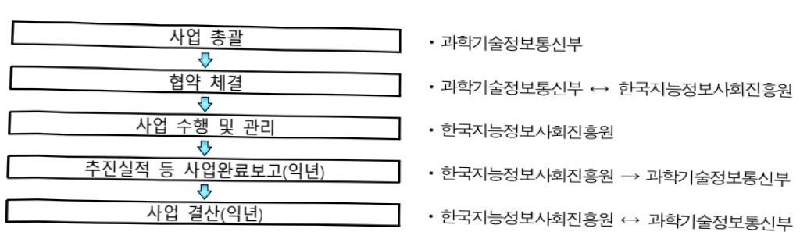

# 국가지식정보 연계 및 활용 촉진(정보화)

**해당 페이지**: PDF 800 ~ 807 쪽 해당

**부처**: 과학기술정보통신부
**분야**: 통신
**회계유형**: 일반회계
**2026 확정예산**: 3300.0 백만원
**전년대비 증감률**: 115.1%
**AI 도메인**: 데이터

---

### 가. 예산 총괄표

(단위: 백만원, %)

<table border=1 style='margin: auto; word-wrap: break-word;'><tr><td rowspan="2">사업명</td><td rowspan="2">2024년 결산</td><td colspan="2">2025년 예산</td><td colspan="2">2026년 예산</td><td rowspan="2">중감(B-A)</td><td rowspan="2">(B-A)/A</td></tr><tr><td style='text-align: center; word-wrap: break-word;'>본예산</td><td style='text-align: center; word-wrap: break-word;'>추경*(A)</td><td style='text-align: center; word-wrap: break-word;'>요구안</td><td style='text-align: center; word-wrap: break-word;'>본예산(B)</td></tr><tr><td style='text-align: center; word-wrap: break-word;'>국가지식정보연계 및 활용촉진(정보화)</td><td style='text-align: center; word-wrap: break-word;'>1,947</td><td style='text-align: center; word-wrap: break-word;'>1,534</td><td style='text-align: center; word-wrap: break-word;'>1,534</td><td style='text-align: center; word-wrap: break-word;'>3,300</td><td style='text-align: center; word-wrap: break-word;'>3,300</td><td style='text-align: center; word-wrap: break-word;'>1,766</td><td style='text-align: center; word-wrap: break-word;'>115.1</td></tr></table>

□ 기능별(내역사업별) 계획 내역

(단위:백만원)

<table border=1 style='margin: auto; word-wrap: break-word;'><tr><td rowspan="2"></td><td colspan="5">2024</td><td colspan="5">2025</td><td rowspan="2">2026 계획</td></tr><tr><td style='text-align: center; word-wrap: break-word;'>예산액(추경)</td><td style='text-align: center; word-wrap: break-word;'>예산 현액</td><td style='text-align: center; word-wrap: break-word;'>집행액</td><td style='text-align: center; word-wrap: break-word;'>이월액</td><td style='text-align: center; word-wrap: break-word;'>불용액</td><td style='text-align: center; word-wrap: break-word;'>예산액(추경)</td><td style='text-align: center; word-wrap: break-word;'>예산 현액</td><td style='text-align: center; word-wrap: break-word;'>집행액</td><td style='text-align: center; word-wrap: break-word;'>이월액</td><td style='text-align: center; word-wrap: break-word;'>불용액</td></tr><tr><td style='text-align: center; word-wrap: break-word;'>○ 기능별 분류(합계)</td><td style='text-align: center; word-wrap: break-word;'>1,947</td><td style='text-align: center; word-wrap: break-word;'>1,947</td><td style='text-align: center; word-wrap: break-word;'>1,947</td><td style='text-align: center; word-wrap: break-word;'>-</td><td style='text-align: center; word-wrap: break-word;'>-</td><td style='text-align: center; word-wrap: break-word;'>1,534</td><td style='text-align: center; word-wrap: break-word;'>1,534</td><td style='text-align: center; word-wrap: break-word;'>1,534</td><td style='text-align: center; word-wrap: break-word;'>-</td><td style='text-align: center; word-wrap: break-word;'>-</td><td style='text-align: center; word-wrap: break-word;'>3,300</td></tr><tr><td rowspan="3">• 국가 지식 정보 통합플랫폼 운영 • 국가 지식 정보 메타데이터 품질 개선 및 기술지원 • 국가 지식 정보 협의체 운영 및 제도개선</td><td style='text-align: center; word-wrap: break-word;'>1,947</td><td style='text-align: center; word-wrap: break-word;'>1,947</td><td style='text-align: center; word-wrap: break-word;'>1,947</td><td style='text-align: center; word-wrap: break-word;'>-</td><td style='text-align: center; word-wrap: break-word;'>-</td><td style='text-align: center; word-wrap: break-word;'>1,534</td><td style='text-align: center; word-wrap: break-word;'>1,534</td><td style='text-align: center; word-wrap: break-word;'>1,534</td><td style='text-align: center; word-wrap: break-word;'>-</td><td style='text-align: center; word-wrap: break-word;'>-</td><td style='text-align: center; word-wrap: break-word;'>1,500</td></tr><tr><td style='text-align: center; word-wrap: break-word;'>-</td><td style='text-align: center; word-wrap: break-word;'>-</td><td style='text-align: center; word-wrap: break-word;'>-</td><td style='text-align: center; word-wrap: break-word;'>-</td><td style='text-align: center; word-wrap: break-word;'>-</td><td style='text-align: center; word-wrap: break-word;'>-</td><td style='text-align: center; word-wrap: break-word;'>-</td><td style='text-align: center; word-wrap: break-word;'>-</td><td style='text-align: center; word-wrap: break-word;'>-</td><td style='text-align: center; word-wrap: break-word;'>-</td><td style='text-align: center; word-wrap: break-word;'>1,474</td></tr><tr><td style='text-align: center; word-wrap: break-word;'>-</td><td style='text-align: center; word-wrap: break-word;'>-</td><td style='text-align: center; word-wrap: break-word;'>-</td><td style='text-align: center; word-wrap: break-word;'>-</td><td style='text-align: center; word-wrap: break-word;'>-</td><td style='text-align: center; word-wrap: break-word;'>-</td><td style='text-align: center; word-wrap: break-word;'>-</td><td style='text-align: center; word-wrap: break-word;'>-</td><td style='text-align: center; word-wrap: break-word;'>-</td><td style='text-align: center; word-wrap: break-word;'>-</td><td style='text-align: center; word-wrap: break-word;'>326</td></tr></table>

### 나. 사업설명자료

## 1 ) 사업목적·내용

(국가지식정보 연계 및 활용 촉진(정보화)) 국가기관등이 보유한 신뢰할 수 있는 국가지식정보*를 국민이 자유롭고 편리하게 접근 및 이용할 수 있도록 통합플랫폼(디지털집현전, k-knowledge.kr 또는 디지털집현전.kr)을 구축·운영하고, 국가지식정보의 개방·연계·활용에 필요한 품질개선, 정책 수립, 제도개선 등 전 주기에 걸친 체계적 기반 마련·이행을 통해 국가 AI 기술 경쟁력 강화 등에 이바지

* 국가지식정보법 제2조(정의) : 국가지식정보란 국가기관, 지방자지단체 및 응용기관이 생산·보유·관리

하고 있는 정보 중 국가적 이용가치가 인정되는 정보로서 국가지식정보위원회의 지정을 받은 정보

---

- (국가지식정보 통합플랫폼 운영) 개별 기관 포털 등을 통해 분산 개방되고 있는 국가지식정보를 API 등 안정적 방식을 통해 연계·통합하여 한 곳에서 쉽고 편리하게 검색·활용할 수 있는 국가지식정보 통합플랫폼(디지털집현전) 구축·운영

※ (현황) 중앙행정기관, 공공기관 등 112개 기관, 139개 사이트, 약 2.6억 건의 국가지식정보 연계 중('25.12월)

- (국가지식정보 메타데이터 품질개선 및 기술지원) 고품질 멀티모달 데이터 확보 및 민간 활용 촉진을 위해 국가지식정보를 보유한 국가기관 등 대상으로 체계적인 메타데이터 품질 진단 및 관리 수행 및 AI 친화적 구조로 전환 등 기술지원

- (국가지식정보 협의체 운영 및 제도개선) 국가지식정보위원회 및 실무협의회, 민관협의체 등 범정부 거버넌스 구성·운영, 기본계획, 관리지침 등 정책 수립, 국가지식정보 현황조사, 실태점검 법정 업무 추진 등 국가지식정보의 연계 및 활용 촉진을 위한 제도적 기반 이행

## 2 ) 사업개요

## □ 사업근거 및 추진경위

① 법령상 근거 및 조항 : 국가지식정보 연계 및 활용 촉진에 관한 법률 및 동법 시행령

<table border=1 style='margin: auto; word-wrap: break-word;'><tr><td style='text-align: center; word-wrap: break-word;'>○ 국가지식정보법 제6조(기본계획의 수립·시행) ① 과학기술정보통신부장관은 국가지식정보의 연계 및 활용 촉진에 관한 기본계획을 3년마다 수립·시행하여야 한다.</td></tr><tr><td style='text-align: center; word-wrap: break-word;'>○ 국가지식정보법 제8조(국가지식정보위원회) ① 국가지식정보에 관한 정책을 심의·조정하기 위하여 과학기술정보통신부장관 소속으로 국가지식정보위원회를 둔다.</td></tr><tr><td style='text-align: center; word-wrap: break-word;'>○ 국가지식정보법 제10조(국가지식정보 관리지침) 과학기술정보통신부장관은 국가지식정보의 연계 및 활용 촉진을 위하여 국가지식정보의 관리에 관한 지침을 정하여 고시하여야 한다.</td></tr><tr><td style='text-align: center; word-wrap: break-word;'>○ 국가지식정보법 제11조(전담기관의 지정 등) ① 과학기술정보통신부장관은 다음 각 호의 사항을 종합적이고 효율적으로 추진하기 위하여「지능정보화 기본법」제12조에 따른 한국지능정보사회 진흥원을 전담기관으로 지정할 수 있다.</td></tr><tr><td style='text-align: center; word-wrap: break-word;'>○ 국가지식정보법 제14조(통합플랫폼의 구축·운영 등) ① 과학기술정보통신부장관은 국가지식정보의 효율적인 연계 및 활용을 위하여 통합플랫폼을 구축·운영하여야 한다.</td></tr><tr><td style='text-align: center; word-wrap: break-word;'>○ 국가지식정보법 제19조(국가지식정보 연계 및 활용 지원) ① 정부는 국가지식정보의 효율적 연계 및 활용을 촉진하기 위하여 국가기관등에 대하여 필요한 행정적·기술적·재정적 지원을 할 수 있으며, 예산의 범위에서 국가지식정보의 디지털화에 드는 비용을 지원할 수 있다.</td></tr><tr><td style='text-align: center; word-wrap: break-word;'>○ 국가지식정보법 시행령 제12조(협의체의 구성 및 운영) ② 협의체는 다음 각 호의 사항을 협의한다. 1. 국가지식정보 관련 정책 및 사업에 관한 사항 2. 통합플랫폼과의 연계 정책에 관한 사항 3. 민관(民官) 협력에 관한 사항 4. 그 밖에 국가지식정보의 연계 · 활용 촉진을 위하여 필요하다고 인정되는 사항 ③ 과학기술정보통신부장관 및 국가기관등의 장은 협의체에서 제시되는 의견이 국가지식정보 관련 정책에 반영될 수 있도록 노력해야 한다.</td></tr></table>

---

## ② 추진경위

- '20.7월 : 한국형 뉴딜(디지털 뉴딜) 사업 추진 발표

- '20.9월 : 기재부 21년 예산 국민의 삶을 개선하는 특색사업 60선 과제 선정

- '20.10월 : BH 한국판 뉴딜 국민 체감형 모범 선도사례 선정

- '20.10월 : 미래 전환 한국판 뉴딜 10대 입법 과제(31개 법률)에 포함

- '20.12월 : 관계부처 합동 '디지털집현전 추진계획' 4차산업혁명위원회 심의·의결

- '21.1~6월 : 「국가지식정보 연계 및 활용 촉진에 관한 법률」 제정

- '21.7~11월 : 「국가지식정보 연계 및 활용 촉진에 관한 법률 시행령」 제정

- '21.12월 : 「국가지식정보 연계 및 활용 촉진에 관한 법률」 시행

- '22.5월~'23.12월 : 디지털집현전 통합플랫폼 1차·2차 구축 추진

- '23.12월 : [제1차 국가지식정보 연계 및 활용 촉진 기본계획('24~'26)] 수립·의결

- '24.1 월 : 디지털집현전 통합플랫폼 대국민 서비스 개시(1.22~)

## 주요내용

① 사업규모

- 총사업비 : 해당 없음

- 사업기간 : 2021년 ~ 계속

-최근 5년 간 투입된 사업비(예산액기준, 추경편성한 연도에는 추경포함)

<table border=1 style='margin: auto; word-wrap: break-word;'><tr><td style='text-align: center; word-wrap: break-word;'>吋</td><td style='text-align: center; word-wrap: break-word;'>2022</td><td style='text-align: center; word-wrap: break-word;'>2023</td><td style='text-align: center; word-wrap: break-word;'>2024</td><td style='text-align: center; word-wrap: break-word;'>2025</td><td style='text-align: center; word-wrap: break-word;'>2026(吋)</td></tr><tr><td style='text-align: center; word-wrap: break-word;'>人</td><td style='text-align: center; word-wrap: break-word;'>7,076</td><td style='text-align: center; word-wrap: break-word;'>3,878</td><td style='text-align: center; word-wrap: break-word;'>1,947</td><td style='text-align: center; word-wrap: break-word;'>1,534</td><td style='text-align: center; word-wrap: break-word;'>3,300</td></tr></table>

-기타:해당없음

② 사업추진체계

- 사업시행방법 : 출연

- 사업시행주체 : 한국지능정보사회진흥원

-사업 수혜자 : 일반국민, 지식정보·AI 분야 국내 기업, 국가지식정보 보유 국가기관 등

- 보조, 융자, 출연, 출자 등의 경우 보조·융자 등 지원 비율 및 법적근거

<table border=1 style='margin: auto; word-wrap: break-word;'><tr><td style='text-align: center; word-wrap: break-word;'>내역사업명</td><td style='text-align: center; word-wrap: break-word;'>구분</td><td style='text-align: center; word-wrap: break-word;'>피보조·피출연 등 기관명</td><td style='text-align: center; word-wrap: break-word;'>지원 금액 (2026예산)</td><td style='text-align: center; word-wrap: break-word;'>지원 비율(%)</td><td style='text-align: center; word-wrap: break-word;'>보조율 법적근거 (해당 조항)</td></tr><tr><td style='text-align: center; word-wrap: break-word;'>국가지식정보 통합플랫폼 운영</td><td style='text-align: center; word-wrap: break-word;'>출연</td><td style='text-align: center; word-wrap: break-word;'>한국지능 정보사회 진흥원</td><td style='text-align: center; word-wrap: break-word;'>1,500백만원</td><td style='text-align: center; word-wrap: break-word;'>100</td><td style='text-align: center; word-wrap: break-word;'>o 지능정보화 기본법 제12조(한국지능 정보사회진흥원의 설립) o 국가지식정보법 제11조(전담기관의 지정 등)</td></tr></table>

---

<table border=1 style='margin: auto; word-wrap: break-word;'><tr><td style='text-align: center; word-wrap: break-word;'>국가지식정보 메타데이터 품질개선 및 기술지원</td><td style='text-align: center; word-wrap: break-word;'>졸연</td><td style='text-align: center; word-wrap: break-word;'>한국지능 정보사회 진흥원</td><td style='text-align: center; word-wrap: break-word;'>1,474백만원</td><td style='text-align: center; word-wrap: break-word;'>100</td><td style='text-align: center; word-wrap: break-word;'>o 지능정보화 기본법 제12조(한국지능 정보사회진흥원의 설립) o 국가지식정보법 제11조(전담기관의 지정 등)</td></tr><tr><td style='text-align: center; word-wrap: break-word;'>국가지식정보 협의체 운영 및 제도개선</td><td style='text-align: center; word-wrap: break-word;'>졸연</td><td style='text-align: center; word-wrap: break-word;'>한국지능 정보사회 진흥원</td><td style='text-align: center; word-wrap: break-word;'>326백만원</td><td style='text-align: center; word-wrap: break-word;'>100</td><td style='text-align: center; word-wrap: break-word;'>o 지능정보화 기본법 제12조(한국지능 정보사회진흥원의 설립) o 국가지식정보법 제11조(전담기관의 지정 등)</td></tr></table>

## 3 ) 2026년도 예산 산출 근거

① 국가지식정보 통합플랫폼 운영(계속) : (2025 본예산) 1,534 백만원 → (2026 요구) 1,500 백만원, △ 34 백만원, △ 2.2%

- (산출) ① 통합플랫폼(디지털집현전) 서비스 운영 : 366백만원(10.1백만원×3명×12개월)

② 상용SW 라이센스비 : 234백만원(1,560백만원×15% 요율×1년)

③ 민간 클라우드 이용료 : 900백만원(75백만원×12개월)

② 국가지식정보 메타데이터 품질개선 및 기술지원(신규) : (2026 요구) 1,474백만원

- (산줄) ① 국가지식정보 메타데이터 붉실신단 및 개선 : 1,234백만원(103백만원×6대분과×2개기관)

② AI 친화적 국가지식정보 개방·활용 체계 구축 : 240백만원(20백만원×6대분과×2개기관)

과학기술, 문화예술, 교육학술, 행정, 교육콘텐츠, 사회경제 등 국가지식정보 6대분과 기준 지원

③ 국가지식정보 협의체 운영 및 제도개선(신규) : (2026 요구) 326백만원

- (산출) ① 국가지식정보위, 민관협의체 등 협의체 운영 : 35백만원(5.83백만원/회×6회)

② 국가지식정보 현황조사·실태점검 : 141백만원(14.1백만원×2명×5개월)

③ 국가지식정보 기본계획, 관리지침 제정 등 제도개선 지원 : 150백만원(3.6백만원x7명x6개월)

## 4 ) 사업효과

사업영향, 산출물 성과지표 등

① 2022~2026년도 성과계획서 상 성과지표 및 최근 5년간 성과 달성도

<table border=1 style='margin: auto; word-wrap: break-word;'><tr><td style='text-align: center; word-wrap: break-word;'>성과지표</td><td style='text-align: center; word-wrap: break-word;'>구분</td><td style='text-align: center; word-wrap: break-word;'>2022</td><td style='text-align: center; word-wrap: break-word;'>2023</td><td style='text-align: center; word-wrap: break-word;'>2024</td><td style='text-align: center; word-wrap: break-word;'>2025</td><td style='text-align: center; word-wrap: break-word;'>2026</td><td style='text-align: center; word-wrap: break-word;'>2026 목표치산출근거</td><td style='text-align: center; word-wrap: break-word;'>측정산식(또는 측정방법)</td><td style='text-align: center; word-wrap: break-word;'>자료수집방법(또는 자료출처)</td></tr><tr><td rowspan="3">국가지식정보연계 사이트 수(단위: 개, 누적)</td><td style='text-align: center; word-wrap: break-word;'>목표</td><td style='text-align: center; word-wrap: break-word;'>67</td><td style='text-align: center; word-wrap: break-word;'>100</td><td style='text-align: center; word-wrap: break-word;'>115</td><td style='text-align: center; word-wrap: break-word;'>133</td><td style='text-align: center; word-wrap: break-word;'>149</td><td rowspan="3">국가지식정보현황조사, 지정등의 결과바탕으로 ‘25년실적치(139개)대비 10개사이트 추가 연계 목표설정</td><td rowspan="3">통합플랫폼과 연계되는 국가지식정보누적 사이트 수</td><td rowspan="3">‘22년~’26년 사업 결과보고서</td></tr><tr><td style='text-align: center; word-wrap: break-word;'>실적</td><td style='text-align: center; word-wrap: break-word;'>81</td><td style='text-align: center; word-wrap: break-word;'>105</td><td style='text-align: center; word-wrap: break-word;'>123</td><td style='text-align: center; word-wrap: break-word;'>139</td><td style='text-align: center; word-wrap: break-word;'>-</td></tr><tr><td style='text-align: center; word-wrap: break-word;'>달성도</td><td style='text-align: center; word-wrap: break-word;'>121</td><td style='text-align: center; word-wrap: break-word;'>105</td><td style='text-align: center; word-wrap: break-word;'>107</td><td style='text-align: center; word-wrap: break-word;'>105</td><td style='text-align: center; word-wrap: break-word;'>-</td></tr></table>

---

<table border=1 style='margin: auto; word-wrap: break-word;'><tr><td rowspan="3">통합플랫폼 이용자 만족도 (단위: 점)</td><td style='text-align: center; word-wrap: break-word;'>목표</td><td style='text-align: center; word-wrap: break-word;'>-</td><td style='text-align: center; word-wrap: break-word;'>-</td><td style='text-align: center; word-wrap: break-word;'>70</td><td style='text-align: center; word-wrap: break-word;'>83</td><td style='text-align: center; word-wrap: break-word;'>85</td><td rowspan="3">‘24년 실적(81점) 및 ‘25년 목표치(83점)를 고려하여 2점 상향 설정</td><td rowspan="3">통합플랫폼 이용자 대상 만족도 조사 후 100점 기준 환산</td><td rowspan="3">‘24년~’26년 만족도 조사 결과보고서</td></tr><tr><td style='text-align: center; word-wrap: break-word;'>실적</td><td style='text-align: center; word-wrap: break-word;'>-</td><td style='text-align: center; word-wrap: break-word;'>-</td><td style='text-align: center; word-wrap: break-word;'>81</td><td style='text-align: center; word-wrap: break-word;'>84</td><td style='text-align: center; word-wrap: break-word;'>-</td></tr><tr><td style='text-align: center; word-wrap: break-word;'>달성도</td><td style='text-align: center; word-wrap: break-word;'>-</td><td style='text-align: center; word-wrap: break-word;'>-</td><td style='text-align: center; word-wrap: break-word;'>116</td><td style='text-align: center; word-wrap: break-word;'>101</td><td style='text-align: center; word-wrap: break-word;'>-</td></tr><tr><td rowspan="3">국가지식정보 메타데이터 활용 (단위: 건)</td><td style='text-align: center; word-wrap: break-word;'>목표</td><td style='text-align: center; word-wrap: break-word;'>-</td><td style='text-align: center; word-wrap: break-word;'>-</td><td style='text-align: center; word-wrap: break-word;'>-</td><td style='text-align: center; word-wrap: break-word;'>20</td><td style='text-align: center; word-wrap: break-word;'>25</td><td rowspan="3">신규 지표임을 감안하여, ‘25년 목표치 대비 5건 상향 설정</td><td rowspan="3">OPEN API, 파일 데이터 개방 신청 건수</td><td rowspan="3">‘25년~’26년 사업 결과보고서</td></tr><tr><td style='text-align: center; word-wrap: break-word;'>실적</td><td style='text-align: center; word-wrap: break-word;'>-</td><td style='text-align: center; word-wrap: break-word;'>-</td><td style='text-align: center; word-wrap: break-word;'>-</td><td style='text-align: center; word-wrap: break-word;'>23</td><td style='text-align: center; word-wrap: break-word;'>-</td></tr><tr><td style='text-align: center; word-wrap: break-word;'>달성도</td><td style='text-align: center; word-wrap: break-word;'>-</td><td style='text-align: center; word-wrap: break-word;'>-</td><td style='text-align: center; word-wrap: break-word;'>-</td><td style='text-align: center; word-wrap: break-word;'>115</td><td style='text-align: center; word-wrap: break-word;'>-</td></tr></table>

② 성과지표 이외의 연도별 사업추진 경과 및 실적

<table border=1 style='margin: auto; word-wrap: break-word;'><tr><td style='text-align: center; word-wrap: break-word;'>2022</td><td style='text-align: center; word-wrap: break-word;'>o 국가지식정보 통합플랫폼(디지털 집현전) 구축(1차) - 디지털 집현전 통합플랫폼 구축 착수(5월~) - 국가지식정보 연계를 위한 5개 분과별 실무협의회 추진(10월) - 디지털 집현전 통합플랫폼 1차 구축 완료(12월) * 66개 기관, 81개 사이트 약 1.7억건 연계 완료(&#x27;22.12월 기준) o 국가지식정보 거버넌스 운영 - 제1회 국가지식정보위원회 개최(2월) - 제1회 국가지식정보위원회 실무협의회 개최(8월) - 제2회 국가지식정보위원회 개최(9월)</td></tr><tr><td style='text-align: center; word-wrap: break-word;'>2023</td><td style='text-align: center; word-wrap: break-word;'>o 국가지식정보 통합플랫폼(디지털 집현전) 구축(2차) - 연계기관 대상 사업설명회(2회, 2월) 및 전용 포털 사용설명회 개최(12월) - 디지털집현전 통합플랫폼 2차 구축 완료(12월) * 88개 기관, 105개 사이트 약 2.3억건 연계 완료(&#x27;23.12월 기준) - 디지털집현전 통합플랫폼 대국민 서비스 개시(&#x27;24.1~) o 국가지식정보 거버넌스 운영 - 국가지식정보 메타데이터 개방 설명회 및 수요기업 간담회 개최(10월) - 제3회 국가지식정보위원회 개최(12월) *「제1차 국가지식정보 연계 및 활용 촉진 기본계획(&#x27;24~&#x27;26)」수립 및 심의·의결</td></tr><tr><td style='text-align: center; word-wrap: break-word;'>2024</td><td style='text-align: center; word-wrap: break-word;'>o 디지털집현전 통합플랫폼 대국민 서비스 개시(&#x27;24.1~) - 국가기관 등 대상 사업설명회 개최 및 신규 연계 수요조사 실시(4월) - 신규 국가지식정보 발굴 및 연계 확대(~12월) * 102개 기관, 123개 사이트 약 2.5억 건 연계 완료(&#x27;24.12월 기준) - 대국민 대상 디지털집현전 체험수기 공모전 개최(9월) o 국가지식정보 거버넌스 운영 - 연계기관 대상 국가지식정보 연계·활용 정책 발전 세미나 개최(10월) - 제4회 국가지식정보위원회 개최(12월)</td></tr></table>

---

<table border=1 style='margin: auto; word-wrap: break-word;'><tr><td style='text-align: center; word-wrap: break-word;'>2025(‘25.12’)</td><td style='text-align: center; word-wrap: break-word;'>o 디지털집현전 통합플랫폼 대국민 서비스 운영- 국가기관등 대상 ‘25년 사업설명회 개최(‘25.4’)- 신규 국가지식정보 발굴 및 연계 확대(~12월) * 112개 기관, 139개 사이트 약 2.6억 건 연계 완료(‘25.12’) 온기(‘25.3’)o 국가지식정보 원문 개방·활용 촉진을 위한 민관간담회 개최(‘25.3’)- 과기정통부, 문체부, 한국SW산업협회, 네이버, 솔트룩스, BHSN 등 10개 기관 참석o 국가지식정보 거버넌스 운영- 신규 국가지식정보 연계 확대를 위한 실무협의 추진(‘25.6~7’) 12개 기관)- 연계기관 대상 국가지식정보 연계·활용 정책 발전 세미나 개최(9월)- 제5회 국가지식정보위원회 개최(‘25.12’)</td></tr></table>

③향후(2026년도 이후)기대효과

- 신규 국가지식정보 지정 및 통합플랫폼 연계 확대(149개 사이트 이상. '26년 기준)

- 국가지식정보 메타데이터 활용 확대(25건 이상, '26년 기준)

- 디지털집현전 사용자 만족도 점수 향상(85점 이상, '26년 기준)

## 5 ) 타당성조사 및 예비타당성조사 시행여부 및 결과 요지 : 해당없음

6) 총사업비 대상사업 정보 : 해당없음

## 7 ) 사업 집행절차

-국가지식정보 통합플랫폼 운영

<table border=1 style='margin: auto; word-wrap: break-word;'><tr><td style='text-align: center; word-wrap: break-word;'>부처</td><td style='text-align: center; word-wrap: break-word;'></td><td style='text-align: center; word-wrap: break-word;'>피출연·피보조기관</td><td style='text-align: center; word-wrap: break-word;'></td><td style='text-align: center; word-wrap: break-word;'>간접보조사업자·사업수행자</td></tr><tr><td style='text-align: center; word-wrap: break-word;'>과학기술정보통신부(1,500백만원)</td><td style='text-align: center; word-wrap: break-word;'>=&gt;(1,500백만원)</td><td style='text-align: center; word-wrap: break-word;'>한국지능정보사회진흥원(127백만원)</td><td style='text-align: center; word-wrap: break-word;'>=&gt;(1,373백만원)</td><td style='text-align: center; word-wrap: break-word;'>사업수행자(1,373백만원)</td></tr></table>

---

- 국가지식정보 메타데이터 품질개선 및 기술지원

<table border=1 style='margin: auto; word-wrap: break-word;'><tr><td style='text-align: center; word-wrap: break-word;'>부처</td><td style='text-align: center; word-wrap: break-word;'></td><td style='text-align: center; word-wrap: break-word;'>피출연·피보조기관</td><td style='text-align: center; word-wrap: break-word;'></td><td style='text-align: center; word-wrap: break-word;'>간접보조사업자·사업수행자</td></tr><tr><td style='text-align: center; word-wrap: break-word;'>과학기술정보통신부(1,474백만원)</td><td style='text-align: center; word-wrap: break-word;'>=&gt;(1,474백만원)</td><td style='text-align: center; word-wrap: break-word;'>한국지능정보사회진흥원(234백만원)</td><td style='text-align: center; word-wrap: break-word;'>=&gt;(1,240백만원)</td><td style='text-align: center; word-wrap: break-word;'>사업수행자(1,240백만원)</td></tr></table>

- 국가지식정보 협의체 운영 및 제도개선

<table border=1 style='margin: auto; word-wrap: break-word;'><tr><td style='text-align: center; word-wrap: break-word;'>부처</td><td style='text-align: center; word-wrap: break-word;'></td><td style='text-align: center; word-wrap: break-word;'>피출연·피보조기관</td><td style='text-align: center; word-wrap: break-word;'></td><td style='text-align: center; word-wrap: break-word;'>간접보조사업자·사업수행자</td></tr><tr><td style='text-align: center; word-wrap: break-word;'>과학기술정보통신부(326백만원)</td><td style='text-align: center; word-wrap: break-word;'>=&gt;(326백만원)</td><td style='text-align: center; word-wrap: break-word;'>한국지능정보사회진흥원(35백만원)</td><td style='text-align: center; word-wrap: break-word;'>=&gt;(291백만원)</td><td style='text-align: center; word-wrap: break-word;'>연구용역수행기관(291백만원)</td></tr></table>

## 8 ) 각종 평가

1) 국회(예결위, 상임위, 예정처, 국정감사 포함) 지적 : 해당없음

2) 대외공개 평가 : 해당없음

3) 자체평가 : 해당없음

### 다. 최근 4년간 결산내역

## 1 ) 결산표

☐ 부처 결산내역

(단위: 백만원, %)

<table border=1 style='margin: auto; word-wrap: break-word;'><tr><td rowspan="2">연도</td><td colspan="3">예산액</td><td rowspan="2">예산현액(A)</td><td rowspan="2">집행액(B)</td><td rowspan="2">집행률(B/A)</td><td rowspan="2">다음연도이월액</td><td rowspan="2">불용액</td></tr><tr><td style='text-align: center; word-wrap: break-word;'>본예산</td><td style='text-align: center; word-wrap: break-word;'>추경중감액</td><td style='text-align: center; word-wrap: break-word;'>추경</td></tr><tr><td style='text-align: center; word-wrap: break-word;'>2022</td><td style='text-align: center; word-wrap: break-word;'>7,076</td><td style='text-align: center; word-wrap: break-word;'>-</td><td style='text-align: center; word-wrap: break-word;'>7,076</td><td style='text-align: center; word-wrap: break-word;'>7,076</td><td style='text-align: center; word-wrap: break-word;'>7,076</td><td style='text-align: center; word-wrap: break-word;'>100</td><td style='text-align: center; word-wrap: break-word;'>-</td><td style='text-align: center; word-wrap: break-word;'>-</td></tr><tr><td style='text-align: center; word-wrap: break-word;'>2023</td><td style='text-align: center; word-wrap: break-word;'>3,878</td><td style='text-align: center; word-wrap: break-word;'>-</td><td style='text-align: center; word-wrap: break-word;'>3,878</td><td style='text-align: center; word-wrap: break-word;'>3,878</td><td style='text-align: center; word-wrap: break-word;'>3,878</td><td style='text-align: center; word-wrap: break-word;'>100</td><td style='text-align: center; word-wrap: break-word;'>-</td><td style='text-align: center; word-wrap: break-word;'>-</td></tr><tr><td style='text-align: center; word-wrap: break-word;'>2024</td><td style='text-align: center; word-wrap: break-word;'>1,947</td><td style='text-align: center; word-wrap: break-word;'>-</td><td style='text-align: center; word-wrap: break-word;'>1,947</td><td style='text-align: center; word-wrap: break-word;'>1,947</td><td style='text-align: center; word-wrap: break-word;'>1,947</td><td style='text-align: center; word-wrap: break-word;'>100</td><td style='text-align: center; word-wrap: break-word;'>-</td><td style='text-align: center; word-wrap: break-word;'>-</td></tr><tr><td style='text-align: center; word-wrap: break-word;'>2025</td><td style='text-align: center; word-wrap: break-word;'>1,534</td><td style='text-align: center; word-wrap: break-word;'>-</td><td style='text-align: center; word-wrap: break-word;'>1,534</td><td style='text-align: center; word-wrap: break-word;'>1,534</td><td style='text-align: center; word-wrap: break-word;'>1,534</td><td style='text-align: center; word-wrap: break-word;'>100</td><td style='text-align: center; word-wrap: break-word;'>-</td><td style='text-align: center; word-wrap: break-word;'>-</td></tr></table>

## 2 ) 주요 결산사항

□ 2022~2025년 결산 주요사항 : 해당 없음

□ 2025년 계획변경 세부내역 : 해당 없음

---

<table border=1 style='margin: auto; word-wrap: break-word;'><tr><td style='text-align: center; word-wrap: break-word;'>사 업 명</td></tr><tr><td style='text-align: center; word-wrap: break-word;'>(301) 국방인공지능핵심기술개발(R&amp;D) (2601-384)</td></tr></table>

□ 사업 코드 정보

<table border=1 style='margin: auto; word-wrap: break-word;'><tr><td style='text-align: center; word-wrap: break-word;'>구분</td><td style='text-align: center; word-wrap: break-word;'>회계</td><td style='text-align: center; word-wrap: break-word;'>소관</td><td style='text-align: center; word-wrap: break-word;'>실국(기관)</td><td style='text-align: center; word-wrap: break-word;'>계정</td><td style='text-align: center; word-wrap: break-word;'>분야</td><td style='text-align: center; word-wrap: break-word;'>부문</td></tr><tr><td style='text-align: center; word-wrap: break-word;'>코드 명칭</td><td style='text-align: center; word-wrap: break-word;'>일반회계</td><td style='text-align: center; word-wrap: break-word;'>과학기술정보통신부</td><td style='text-align: center; word-wrap: break-word;'>인공지능기반정책관</td><td style='text-align: center; word-wrap: break-word;'></td><td style='text-align: center; word-wrap: break-word;'>130통신</td><td style='text-align: center; word-wrap: break-word;'>133정보통신</td></tr></table>

<table border=1 style='margin: auto; word-wrap: break-word;'><tr><td style='text-align: center; word-wrap: break-word;'>구분</td><td style='text-align: center; word-wrap: break-word;'>프로그램</td><td style='text-align: center; word-wrap: break-word;'>단위사업</td><td style='text-align: center; word-wrap: break-word;'>세부사업</td></tr><tr><td style='text-align: center; word-wrap: break-word;'>코드</td><td style='text-align: center; word-wrap: break-word;'>2600</td><td style='text-align: center; word-wrap: break-word;'>2601</td><td style='text-align: center; word-wrap: break-word;'>384</td></tr><tr><td style='text-align: center; word-wrap: break-word;'>명칭</td><td style='text-align: center; word-wrap: break-word;'>인공지능데이터진흥</td><td style='text-align: center; word-wrap: break-word;'>AI기술개발(일반)</td><td style='text-align: center; word-wrap: break-word;'>국방인공지능핵심기술개발(R&amp;D)</td></tr></table>

□ 사업 성격 (공통요구자료 Ⅱ-1 작성유의사항 4. 참조, 해당하는 사항에 “○” 표시)

<table border=1 style='margin: auto; word-wrap: break-word;'><tr><td rowspan="2">신규</td><td rowspan="2">계속</td><td rowspan="2">완료</td><td rowspan="2">예비타당성 실시여부</td><td rowspan="2">총사업비 관리대상</td><td rowspan="2">총액계상 예산사업</td><td style='text-align: center; word-wrap: break-word;'>사업소관 변경정보</td></tr><tr><td style='text-align: center; word-wrap: break-word;'>2025예산 시 소관</td></tr><tr><td style='text-align: center; word-wrap: break-word;'></td><td style='text-align: center; word-wrap: break-word;'>☐</td><td style='text-align: center; word-wrap: break-word;'></td><td style='text-align: center; word-wrap: break-word;'></td><td style='text-align: center; word-wrap: break-word;'></td><td style='text-align: center; word-wrap: break-word;'></td><td style='text-align: center; word-wrap: break-word;'></td></tr></table>

□ 사업 지원 형태 및 지원을 (최소한 한 개는 반드시 선택하시오. 해당사항에 0 표시)

<table border=1 style='margin: auto; word-wrap: break-word;'><tr><td style='text-align: center; word-wrap: break-word;'>직접</td><td style='text-align: center; word-wrap: break-word;'>출자</td><td style='text-align: center; word-wrap: break-word;'>출연</td><td style='text-align: center; word-wrap: break-word;'>보조</td><td style='text-align: center; word-wrap: break-word;'>융자</td><td style='text-align: center; word-wrap: break-word;'>국고보조율(%)</td><td style='text-align: center; word-wrap: break-word;'>융자율(%)</td></tr><tr><td style='text-align: center; word-wrap: break-word;'></td><td style='text-align: center; word-wrap: break-word;'></td><td style='text-align: center; word-wrap: break-word;'>○</td><td style='text-align: center; word-wrap: break-word;'></td><td style='text-align: center; word-wrap: break-word;'></td><td style='text-align: center; word-wrap: break-word;'></td><td style='text-align: center; word-wrap: break-word;'></td></tr></table>

## □ 사업 담당자

<table border=1 style='margin: auto; word-wrap: break-word;'><tr><td style='text-align: center; word-wrap: break-word;'>사업명</td><td colspan="2">구분</td></tr><tr><td rowspan="3">국방인공지능 핵심기술개발</td><td rowspan="2">소관부처</td><td style='text-align: center; word-wrap: break-word;'>인공지능정책실 인공지능정책기획관</td></tr><tr><td style='text-align: center; word-wrap: break-word;'>디지털인재양성과</td></tr><tr><td style='text-align: center; word-wrap: break-word;'>사업시행주체</td><td style='text-align: center; word-wrap: break-word;'>정보통신기획평가원</td></tr></table>

---

### 원본 PDF 크롭 이미지

