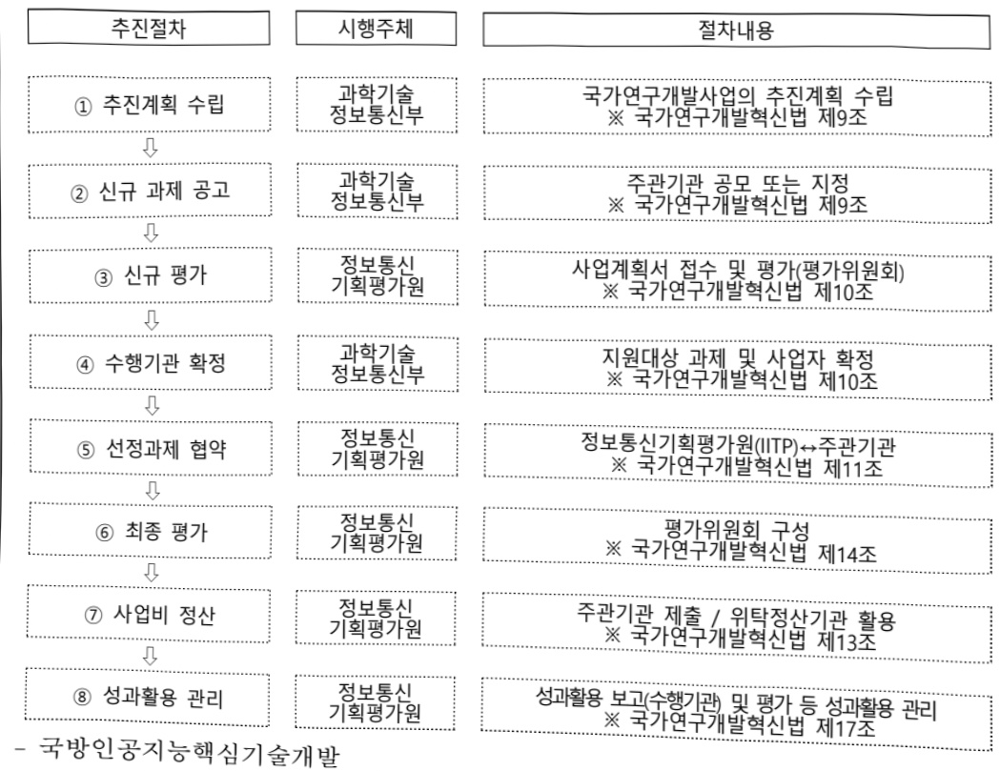

# 국방인공지능핵심기술개발(R&D)

**해당 페이지**: PDF 808 ~ 815 쪽 해당

**부처**: 과학기술정보통신부
**분야**: 통신
**회계유형**: 일반회계
**2026 확정예산**: 2926.0 백만원
**전년대비 증감률**: 192.6%
**AI 도메인**: 국방/안보

---

### 가. 예산안 총괄표

(단위: 백만원, %)

<table border=1 style='margin: auto; word-wrap: break-word;'><tr><td rowspan="2">사업명</td><td rowspan="2">2024년 결산</td><td colspan="2">2025년 예산</td><td colspan="2">2026년 예산</td><td rowspan="2">중감 (B-A)</td><td rowspan="2">(B-A)/A</td></tr><tr><td style='text-align: center; word-wrap: break-word;'>본예산</td><td style='text-align: center; word-wrap: break-word;'>추경(A)</td><td style='text-align: center; word-wrap: break-word;'>요구안</td><td style='text-align: center; word-wrap: break-word;'>본예산(B)</td></tr><tr><td style='text-align: center; word-wrap: break-word;'>국방인공지능 핵심기술개발</td><td style='text-align: center; word-wrap: break-word;'>-</td><td style='text-align: center; word-wrap: break-word;'>1,000</td><td style='text-align: center; word-wrap: break-word;'>1,000</td><td style='text-align: center; word-wrap: break-word;'>2,926</td><td style='text-align: center; word-wrap: break-word;'>2,926</td><td style='text-align: center; word-wrap: break-word;'>1,926</td><td style='text-align: center; word-wrap: break-word;'>192.6</td></tr></table>

□ 기능별(내역사업별), 목별 예산안 내역

(단위:백만원)

<table border=1 style='margin: auto; word-wrap: break-word;'><tr><td rowspan="2"></td><td colspan="5">2024</td><td colspan="5">2025</td><td rowspan="2">2026예산</td></tr><tr><td style='text-align: center; word-wrap: break-word;'>예산액(추정)</td><td style='text-align: center; word-wrap: break-word;'>예산현액</td><td style='text-align: center; word-wrap: break-word;'>집행액</td><td style='text-align: center; word-wrap: break-word;'>이월액</td><td style='text-align: center; word-wrap: break-word;'>불용액</td><td style='text-align: center; word-wrap: break-word;'>예산액(추정)</td><td style='text-align: center; word-wrap: break-word;'>예산현액</td><td style='text-align: center; word-wrap: break-word;'>집행액</td><td style='text-align: center; word-wrap: break-word;'>이월액</td><td style='text-align: center; word-wrap: break-word;'>불용액</td></tr><tr><td style='text-align: center; word-wrap: break-word;'>○ 기능별 분류(함께)</td><td style='text-align: center; word-wrap: break-word;'>-</td><td style='text-align: center; word-wrap: break-word;'>-</td><td style='text-align: center; word-wrap: break-word;'>-</td><td style='text-align: center; word-wrap: break-word;'>-</td><td style='text-align: center; word-wrap: break-word;'>-</td><td style='text-align: center; word-wrap: break-word;'>1,000</td><td style='text-align: center; word-wrap: break-word;'>1,000</td><td style='text-align: center; word-wrap: break-word;'>1,000</td><td style='text-align: center; word-wrap: break-word;'>-</td><td style='text-align: center; word-wrap: break-word;'>-</td><td style='text-align: center; word-wrap: break-word;'>2,926</td></tr><tr><td style='text-align: center; word-wrap: break-word;'>• 국방인공지능핵심기술개발</td><td style='text-align: center; word-wrap: break-word;'>-</td><td style='text-align: center; word-wrap: break-word;'>-</td><td style='text-align: center; word-wrap: break-word;'>-</td><td style='text-align: center; word-wrap: break-word;'>-</td><td style='text-align: center; word-wrap: break-word;'>-</td><td style='text-align: center; word-wrap: break-word;'>1,000</td><td style='text-align: center; word-wrap: break-word;'>1,000</td><td style='text-align: center; word-wrap: break-word;'>1,000</td><td style='text-align: center; word-wrap: break-word;'>-</td><td style='text-align: center; word-wrap: break-word;'>-</td><td style='text-align: center; word-wrap: break-word;'>2,926</td></tr><tr><td style='text-align: center; word-wrap: break-word;'>○ 비목별 분류(함께)</td><td style='text-align: center; word-wrap: break-word;'>-</td><td style='text-align: center; word-wrap: break-word;'>-</td><td style='text-align: center; word-wrap: break-word;'>-</td><td style='text-align: center; word-wrap: break-word;'>-</td><td style='text-align: center; word-wrap: break-word;'>-</td><td style='text-align: center; word-wrap: break-word;'>1,000</td><td style='text-align: center; word-wrap: break-word;'>1,000</td><td style='text-align: center; word-wrap: break-word;'>1,000</td><td style='text-align: center; word-wrap: break-word;'>-</td><td style='text-align: center; word-wrap: break-word;'>-</td><td style='text-align: center; word-wrap: break-word;'>2,926</td></tr><tr><td style='text-align: center; word-wrap: break-word;'>• 연구개발활동비 등(360-05)</td><td style='text-align: center; word-wrap: break-word;'>-</td><td style='text-align: center; word-wrap: break-word;'>-</td><td style='text-align: center; word-wrap: break-word;'>-</td><td style='text-align: center; word-wrap: break-word;'>-</td><td style='text-align: center; word-wrap: break-word;'>-</td><td style='text-align: center; word-wrap: break-word;'>1,000</td><td style='text-align: center; word-wrap: break-word;'>1,000</td><td style='text-align: center; word-wrap: break-word;'>1,000</td><td style='text-align: center; word-wrap: break-word;'>-</td><td style='text-align: center; word-wrap: break-word;'>-</td><td style='text-align: center; word-wrap: break-word;'>2,926</td></tr><tr><td style='text-align: center; word-wrap: break-word;'>○ 기능·비목별 분류(함께)</td><td style='text-align: center; word-wrap: break-word;'>-</td><td style='text-align: center; word-wrap: break-word;'>-</td><td style='text-align: center; word-wrap: break-word;'>-</td><td style='text-align: center; word-wrap: break-word;'>-</td><td style='text-align: center; word-wrap: break-word;'>-</td><td style='text-align: center; word-wrap: break-word;'>1,000</td><td style='text-align: center; word-wrap: break-word;'>1,000</td><td style='text-align: center; word-wrap: break-word;'>1,000</td><td style='text-align: center; word-wrap: break-word;'>-</td><td style='text-align: center; word-wrap: break-word;'>-</td><td style='text-align: center; word-wrap: break-word;'>2,926</td></tr><tr><td style='text-align: center; word-wrap: break-word;'>• 국방인공지능핵심기술개발• 연구개발활동비 등(360-05)</td><td style='text-align: center; word-wrap: break-word;'>-</td><td style='text-align: center; word-wrap: break-word;'>-</td><td style='text-align: center; word-wrap: break-word;'>-</td><td style='text-align: center; word-wrap: break-word;'>-</td><td style='text-align: center; word-wrap: break-word;'>-</td><td style='text-align: center; word-wrap: break-word;'>1,000</td><td style='text-align: center; word-wrap: break-word;'>1,000</td><td style='text-align: center; word-wrap: break-word;'>1,000</td><td style='text-align: center; word-wrap: break-word;'>-</td><td style='text-align: center; word-wrap: break-word;'>-</td><td style='text-align: center; word-wrap: break-word;'>2,926</td></tr></table>

---

### 나. 사업설명자료

## 1 ) 사업목적·내용

- (국방인공지능핵심기술개발) 고도의 보안성이 요구되는 국방 분야에 신속히 확산 가능

하고 지휘·의사결정 체계의 첨단화·지능화를 위한 국방 인공지능 핵심 기반 기술 확보

## 2 ) 사업개요

## □ 사업근거 및 추진경위

① 법령상 근거 및 조항 적시

- 과학기술기본법 제11조(국가연구개발사업의 추진)

제11조(국가연구개발사업의 추진) ① 중앙행정기관의 장은 기본계획에 따라 맡은 분야의 국가연구개발사업과 그 시책을 세워 추진하여야 한다. ② (이하 생략)

- 정보통신산업진흥법 제7조(정보통신기술진흥 시행계획)

제7조(정보통신기술진흥 시행계획) ① 과학기술정보통신부장관은 정보통신기술의 진흥을 위하여 진흥계획에 따라 다음 각 호의 사항이 포함된 정보통신기술진흥 시행계획을 매년 수립 · 시행하여야 한다. (중략) 3. 정보통신기술의 연구개발 및 다른 기술과의 결합 및 융합 촉진에 관한 사항 (이하 생략)

- 정보통신 진흥 및 융합 활성화 등에 관한 특별법 제32조(정보통신융합 등 기술·서비스 개발 등의 지원)

제32조(정보통신용합동 기술·서비스 개발 등의 지원) ① 과학기술정보통신부장관은 다른

산업 및 서비스 등에 정보통신의 접목을 통하여 생산성과 가치를 높일 수 있도록

노력하여야 한다.

② 과학기술정보통신부장관은 정보통신용합동 기술·서비스의 개발을 촉진하기 위하여

다음 각 호의 사업을 추진할 수 있다.

1. 정보통신용합동 기술·서비스 관련 연구개발 사업 (이하 생략)

- 국가과학기술 육성방안('22.10. 국가과학기술자문회의)

국가전략기술 육성으로 미래성장과 기술주권 확보

12대 국가전략기술 중 인공지능기술을 통해 세계 최고수준 AI 기술강국 도약

---

- 제5차 과학기술기본계획('23~'27)(안) ('22.12. 국가과학기술자문회의 심의회의)

### Ⅲ. 제5차 과학기술기본계획 비전 및 추진과제

### 1. 비전 및 추진과제

과제 3-6. 과학기술 강군 육성 및 사이버주권 수호

3-6-1. 미래전장 환경에 대비하는 국방과학기술 혁신

(과피적 도약을 가능하게 하는 첨단기술 분야 중점투자) 국가전략기술 연계 연구분야와 국방 영역 고유 연구분야를 모두 고려, 국방전략기술 선정 및 집중 투자

*인공지능 등 현격한 전력 차이를 가능하게 하는 비대칭·게임체인저 분야 중점 투자

## ② 추진경위

: 이재명 정부 국정과제 22번「초격차 AI 선도기술·인재 확보」

- 제5차 국방부-과기정통부 ICT 정책협의회 개최('21.3.5.)

· 스마트국방 혁신의 성공을 위해 첨단 ICT 기반의 R&D·실증·확산 프로젝트 공동 추진

ICT R&D 전문기관 정보통신기획평가원 내 ‘국방ICT단’ 신설 등

- 국방 정보통신기술 연구개발, 디지털 인재양성을 위한 과기정통부·국방부 MOU 체결('21.8.17.)

·양부처출연기관의디지털뉴스마트국방지원확대및협력촉진

스마트 국방혁신 구현을 위한 ICT R&D·실증·확산사업 공동 추진

##### - 제6차 국방부-과기정통부 ICT 정책협의회 개최('23.7.14.)

· 국방 분야 AI+X 프로젝트 확산 등 민·군 협력 기반 AI기술 응용개발을 위한 신규 국방 ICT R&D 사업 공동 기획

- 국방과학기술 분야 협력 강화를 위한 과기정통부-국방부 MOU 체결('24.4.1.)

· 국방과학기술의 민간 이전, 민간 기술의 국방 적용, 민·군 검용 기술 개발 등

·군 기술협력을 위한 연구개발·실증 추진

- 인공지능 일상화 및 산업고도화계획('23.1. 국가데이터정책위원회)

□ AI를 국가 전반으로 확산하고 실질적 산업성과 창출

- AI 핵심 10대 프로젝트에 투자, 국민과 혜택을 공유하면서 AI산업·기술 고도화를 추진

- 2024년 과기정통부 주요정책 주진계획('24.2. 과기정통부)

### Ⅲ. 2023년 핵심 추진과제

### 2. 국가전략기술 본격 육성

□ (임무중심 R&D 정착) 인공지능 등 12대 전략기술별로 로드맵을 수립(23년 10개), 국가차원의 임무와 달성시한을 명확히 설정하고, 전략적 투자방향 제시

---

2025년도 국가연구개발 투자방향 및 기준(안)(24.3.국가과학기술자문회의 심의회의)

Ⅱ.2025년도 국가연구개발 투자방향

<table border=1 style='margin: auto; word-wrap: break-word;'><tr><td style='text-align: center; word-wrap: break-word;'>2. 중점 투자방향(4) 新성장을 이끌 과학기술, 기술주권이 바로 선 국가☐ (미래기술) AI, 바이오, 양자에 전략적 투자 기반 공격적 예산 확대○ (AI) 국가역량을 총집결할 수 있도록 민·관간 역할분담 명확화, 미래 AI 서비스에 필수적인 기반기술은 국가가 선제적으로 확보Ⅲ. 2025년도 기술분야별 투자전략[ICT·SW] (1) 주요 정책목표☐ (전략기술 선도) 글로벌 기술 패권 경쟁에 대응하여 주요 디지털 혁신 기술 분야의 신격차 창출과 초격차 확보를 위한 집중지원 추진○ 차세대 인공지능, 양자 등 ICT 이미지 분야 우위 선점을 위해 원천·핵심기술 및 산업화 역량의 선제적인 확보(3) &#x27;25년도 투자방향☐ (인공지능) 공공·산업 문제해결에 특화된 핵심기술 개발과 차세대 인공지능 원천기술 확보를 위한 지원 확대○ 인공지능 융합을 통한 생산성·혁신성을 제고하고, 공공·산업 분야 난제 해결을 통한 핵심 제품·서비스 창출 및 응용·활용 저변 확대[국방] (1) 주요 정책목표☐ (과학기술 강군 건설) 현존하는 북 위협 대응능력의 획기적 보강을 위한 무기체계 연구개발 추진 및 미래 전장 주도를 위한 첨단기술역량확보(3) &#x27;25년도 투자방향☐ (민간 우수기술 활용 확대) 국가·국방(민·군) 간 연계가 가능한 분야는 민간R&amp;D 성과를 국방에 적용하는 이어달리기 및 협력 과제 지원 확대○ (기술수준별 접근) 국방대비 민간우위 기술은 활용·적용 연구에 집중하고, 민·군 수준이 유사한 분야는 민·군간 명확한 역할분담 하에 협력 연구 집중※ 주요 기술분야별 투자방향- (인공지능) 민간 사업계의 우수한 기술을 국방에 접목하기 위한 응용·개발 연구에 집중하고 민·군간 데이터 공유체계 활용 지원</td></tr></table>

## □ 주요내용

① 사업규모

- 총사업비(해당되는 경우에만 기재) : 해당 없음

- 사업기간 : '25 ~ '29

-최근 5년 간 투입된 사업비(예산액기준, 추경편성한 연도에는 추경포함)

<table border=1 style='margin: auto; word-wrap: break-word;'><tr><td style='text-align: center; word-wrap: break-word;'>$ \underline{\text{所}} $</td><td style='text-align: center; word-wrap: break-word;'>2022</td><td style='text-align: center; word-wrap: break-word;'>2023</td><td style='text-align: center; word-wrap: break-word;'>2024</td><td style='text-align: center; word-wrap: break-word;'>2025</td><td style='text-align: center; word-wrap: break-word;'>2026</td></tr><tr><td style='text-align: center; word-wrap: break-word;'>$ \underline{\text{人}} $</td><td style='text-align: center; word-wrap: break-word;'>-</td><td style='text-align: center; word-wrap: break-word;'>-</td><td style='text-align: center; word-wrap: break-word;'>-</td><td style='text-align: center; word-wrap: break-word;'>1,000</td><td style='text-align: center; word-wrap: break-word;'>2,926</td></tr></table>

-기타:해당 없음

---

## ② 사업추진체계

- 사업시행방법 : 출연

- 사업시행주체 : 정보통신기획평가원

- 사업 수혜자 : 산·학·연·군

- 보조, 융자, 출연, 줄자 등의 경우 보조 · 융자 등 지원 비율 및 법적근거

<table border=1 style='margin: auto; word-wrap: break-word;'><tr><td style='text-align: center; word-wrap: break-word;'>내역사업명</td><td style='text-align: center; word-wrap: break-word;'>구분</td><td style='text-align: center; word-wrap: break-word;'>피보조·피출연 등 기관명</td><td style='text-align: center; word-wrap: break-word;'>지원 금액 (2026예산)</td><td style='text-align: center; word-wrap: break-word;'>지원 비율(%)</td><td style='text-align: center; word-wrap: break-word;'>보조율 법적근거 (해당 조항)</td></tr><tr><td style='text-align: center; word-wrap: break-word;'>국방인공 지능핵심 기술개발</td><td style='text-align: center; word-wrap: break-word;'>출연</td><td style='text-align: center; word-wrap: break-word;'>정보통신 기획평가원</td><td style='text-align: center; word-wrap: break-word;'>2,926백만원</td><td style='text-align: center; word-wrap: break-word;'>100</td><td style='text-align: center; word-wrap: break-word;'>정보통신 진흥 및 융합 활성화 등에 관한 특별법 제32조</td></tr></table>

## 3 ) 2026년도 예산안 산출 근거

□ 국방인공지능핵심기술개발

① 국방인공지능핵심기술개발 : 2,926백만원

- (요구) 미래 AI 전장 환경 대응을 위한 국방 AI 핵심기술 확보 지원을 위한 예산 요구

- (산출) 숲 전술자산과 데이터 실시간 연결분석으로 신속한 합동작전 + 정확한 지휘통제 시스템을 구현 가능한 국방 AI 핵심기술 확보 필요성을 고려하여 비용 산출

(계속) 1개 × 1,333백만원 × 12/12개월, (신규) 2개 × 1,062백만원 × 9/12개월

## 4 ) 사업효과

☐ 사업영향, 산출물 성과지표 등

① 2022~2026년도 성과계획서 상 성과지표 및 최근 5년간 성과 달성도

<table border=1 style='margin: auto; word-wrap: break-word;'><tr><td style='text-align: center; word-wrap: break-word;'>성과지표</td><td style='text-align: center; word-wrap: break-word;'>구분</td><td style='text-align: center; word-wrap: break-word;'>2022</td><td style='text-align: center; word-wrap: break-word;'>2023</td><td style='text-align: center; word-wrap: break-word;'>2024</td><td style='text-align: center; word-wrap: break-word;'>2025</td><td style='text-align: center; word-wrap: break-word;'>2026</td><td style='text-align: center; word-wrap: break-word;'>2026 목표치산출근거</td><td style='text-align: center; word-wrap: break-word;'>측정산식(또는 측정방법)</td><td style='text-align: center; word-wrap: break-word;'>자료수집방법(또는 자료출처)</td></tr><tr><td rowspan="3">등록특허등급(SMART)지수</td><td style='text-align: center; word-wrap: break-word;'>목표</td><td style='text-align: center; word-wrap: break-word;'>-</td><td style='text-align: center; word-wrap: break-word;'>-</td><td style='text-align: center; word-wrap: break-word;'>-</td><td style='text-align: center; word-wrap: break-word;'>-</td><td style='text-align: center; word-wrap: break-word;'>4.05</td><td rowspan="3">유사 사업*초기 설정값을 목표치로 설정*DNA기반국방다지털혁신가술개발사업(23~25)*(대년 전년 목표치대비 3% 상향 설정)</td><td rowspan="3">∑(Ai x Bi)/∑Bi(Ai : 특허등급별 가중치, Bi : 등급별 특허성과 건수)</td><td rowspan="3">NTIS,한국발명진흥회(SMART)</td></tr><tr><td style='text-align: center; word-wrap: break-word;'>실적</td><td style='text-align: center; word-wrap: break-word;'>-</td><td style='text-align: center; word-wrap: break-word;'>-</td><td style='text-align: center; word-wrap: break-word;'>-</td><td style='text-align: center; word-wrap: break-word;'>-</td><td style='text-align: center; word-wrap: break-word;'>-</td></tr><tr><td style='text-align: center; word-wrap: break-word;'>달성도</td><td style='text-align: center; word-wrap: break-word;'>-</td><td style='text-align: center; word-wrap: break-word;'>-</td><td style='text-align: center; word-wrap: break-word;'>-</td><td style='text-align: center; word-wrap: break-word;'>-</td><td style='text-align: center; word-wrap: break-word;'>-</td></tr><tr><td rowspan="3">논문의 표준화된순위 보정 영향력 지수(단위: mrnIF)</td><td style='text-align: center; word-wrap: break-word;'>목표</td><td style='text-align: center; word-wrap: break-word;'>-</td><td style='text-align: center; word-wrap: break-word;'>-</td><td style='text-align: center; word-wrap: break-word;'>-</td><td style='text-align: center; word-wrap: break-word;'>-</td><td style='text-align: center; word-wrap: break-word;'>51.45</td><td rowspan="3">유사 사업*초기 설정값을 목표치로 설정*DNA기반국방다지털혁신가술개발사업(23~25)</td><td rowspan="3">NTIS에 등록된SCI(E)급 논문의 mrnIF를 도출하여 평균값으로 산정</td><td rowspan="3">NTIS,JCR DB</td></tr><tr><td style='text-align: center; word-wrap: break-word;'>실적</td><td style='text-align: center; word-wrap: break-word;'>-</td><td style='text-align: center; word-wrap: break-word;'>-</td><td style='text-align: center; word-wrap: break-word;'>-</td><td style='text-align: center; word-wrap: break-word;'>-</td><td style='text-align: center; word-wrap: break-word;'>-</td></tr><tr><td style='text-align: center; word-wrap: break-word;'>달성도</td><td style='text-align: center; word-wrap: break-word;'>-</td><td style='text-align: center; word-wrap: break-word;'>-</td><td style='text-align: center; word-wrap: break-word;'>-</td><td style='text-align: center; word-wrap: break-word;'>-</td><td style='text-align: center; word-wrap: break-word;'>-</td></tr></table>

② 성과지표 이외의 연도별 사업추진 경과 및 실적

<table border=1 style='margin: auto; word-wrap: break-word;'><tr><td style='text-align: center; word-wrap: break-word;'>2025</td><td style='text-align: center; word-wrap: break-word;'>- 국가적·사회적 파급력이 높은 국방 인공지능 핵심기반기술 개발 추진</td></tr></table>

---

③ 향후(2026년도 이후) 기대효과

- 민간의 첨단인공지능 기술로 국방 도메인의 문제를 해결하여 국방전영역합동지휘

통제 구현을 위한 핵심기반 기술 활용 및 군 전력화 기간 단축 전망

- 미래몇 개념에 부합하는 한국군 작전 수행 역량 증진 및 한·미 연합작전 수행

능력 확보와 주요 동맹국 협력 강화 기대

## 5 ) 타당성조사 및 예비타당성조사 시행여부 및 결과 요지 : 해당 없음

## 6 ) 총사업비 대상사업 여부 및 내역 : 해당 없음

## 7 ) 사업 집행절차

---

<table border=1 style='margin: auto; word-wrap: break-word;'><tr><td style='text-align: center; word-wrap: break-word;'>부처</td><td style='text-align: center; word-wrap: break-word;'></td><td style='text-align: center; word-wrap: break-word;'>피출연·피보조 기관</td><td style='text-align: center; word-wrap: break-word;'></td><td style='text-align: center; word-wrap: break-word;'>간접보조사업자·사업수행자</td></tr><tr><td style='text-align: center; word-wrap: break-word;'>과학기술정보통신부(2,926백만원)</td><td style='text-align: center; word-wrap: break-word;'>=&gt;(2,926백만원)</td><td style='text-align: center; word-wrap: break-word;'>정보통신기획평가원(-)</td><td style='text-align: center; word-wrap: break-word;'>=&gt;(2,926백만원)</td><td style='text-align: center; word-wrap: break-word;'>산·학·연</td></tr></table>

8) 각종 평가 : 해당 없음

다. 최근 4년간 결산내역

1) 결산표

☐ 부처 결산내역

(단위: 백만원, %)

<table border=1 style='margin: auto; word-wrap: break-word;'><tr><td rowspan="2">연도</td><td colspan="3">예산액</td><td rowspan="2">예산현액(A)</td><td rowspan="2">집행액(B)</td><td rowspan="2">집행률(B/A)</td><td rowspan="2">다음연도이월액</td><td rowspan="2">불용액</td></tr><tr><td style='text-align: center; word-wrap: break-word;'>본예산</td><td style='text-align: center; word-wrap: break-word;'>추경증감액</td><td style='text-align: center; word-wrap: break-word;'>추경</td></tr><tr><td style='text-align: center; word-wrap: break-word;'>2025</td><td style='text-align: center; word-wrap: break-word;'>1,000</td><td style='text-align: center; word-wrap: break-word;'>-</td><td style='text-align: center; word-wrap: break-word;'>1,000</td><td style='text-align: center; word-wrap: break-word;'>1,000</td><td style='text-align: center; word-wrap: break-word;'>1,000</td><td style='text-align: center; word-wrap: break-word;'>100</td><td style='text-align: center; word-wrap: break-word;'>-</td><td style='text-align: center; word-wrap: break-word;'>-</td></tr></table>

2) 주요 결산사항 : 해당 없음

---

<table border=1 style='margin: auto; word-wrap: break-word;'><tr><td style='text-align: center; word-wrap: break-word;'>사 업 명</td></tr><tr><td style='text-align: center; word-wrap: break-word;'>(335) 국산 AI반도체 기반 마이크로데이터센터 확산(R&amp;D) (2603-328)</td></tr></table>

사업 코드 정보

<table border=1 style='margin: auto; word-wrap: break-word;'><tr><td style='text-align: center; word-wrap: break-word;'>구분</td><td style='text-align: center; word-wrap: break-word;'>회계</td><td style='text-align: center; word-wrap: break-word;'>소관</td><td style='text-align: center; word-wrap: break-word;'>실국(기관)</td><td style='text-align: center; word-wrap: break-word;'>계정</td><td style='text-align: center; word-wrap: break-word;'>분야</td><td style='text-align: center; word-wrap: break-word;'>부문</td></tr><tr><td style='text-align: center; word-wrap: break-word;'>코드</td><td rowspan="2">일반회계</td><td style='text-align: center; word-wrap: break-word;'>과학기술</td><td style='text-align: center; word-wrap: break-word;'>정보통신</td><td rowspan="2"></td><td style='text-align: center; word-wrap: break-word;'>130</td><td style='text-align: center; word-wrap: break-word;'>133</td></tr><tr><td style='text-align: center; word-wrap: break-word;'>명칭</td><td style='text-align: center; word-wrap: break-word;'>정보통신부</td><td style='text-align: center; word-wrap: break-word;'>산업정책관</td><td style='text-align: center; word-wrap: break-word;'>통신</td><td style='text-align: center; word-wrap: break-word;'>정보통신</td></tr></table>

<table border=1 style='margin: auto; word-wrap: break-word;'><tr><td style='text-align: center; word-wrap: break-word;'>구분</td><td style='text-align: center; word-wrap: break-word;'>프로그램</td><td style='text-align: center; word-wrap: break-word;'>단위사업</td><td style='text-align: center; word-wrap: break-word;'>세부사업</td></tr><tr><td style='text-align: center; word-wrap: break-word;'>코드</td><td style='text-align: center; word-wrap: break-word;'>2600</td><td style='text-align: center; word-wrap: break-word;'>2603</td><td style='text-align: center; word-wrap: break-word;'>328</td></tr><tr><td style='text-align: center; word-wrap: break-word;'>명칭</td><td style='text-align: center; word-wrap: break-word;'>인공지능데이터진흥</td><td style='text-align: center; word-wrap: break-word;'>AI반도체경쟁력강화</td><td style='text-align: center; word-wrap: break-word;'>국산 AI반도체 기반 마이크로 데이터센터 확산</td></tr></table>

□ 사업 성격 (공통요구자료 Ⅱ-1 작성유의사항 4. 참조, 해당하는 사항에 “○” 표시)

<table border=1 style='margin: auto; word-wrap: break-word;'><tr><td style='text-align: center; word-wrap: break-word;'>신규</td><td style='text-align: center; word-wrap: break-word;'>계속</td><td style='text-align: center; word-wrap: break-word;'>완료</td><td style='text-align: center; word-wrap: break-word;'>예비타당성 실시여부</td><td style='text-align: center; word-wrap: break-word;'>총사업비 관리대상</td><td style='text-align: center; word-wrap: break-word;'>총액계상 예산사업</td><td style='text-align: center; word-wrap: break-word;'>사업소관 변경정보 2025예산 시 소관</td></tr><tr><td style='text-align: center; word-wrap: break-word;'></td><td style='text-align: center; word-wrap: break-word;'>O</td><td style='text-align: center; word-wrap: break-word;'></td><td style='text-align: center; word-wrap: break-word;'></td><td style='text-align: center; word-wrap: break-word;'></td><td style='text-align: center; word-wrap: break-word;'></td><td style='text-align: center; word-wrap: break-word;'></td></tr></table>

사업 지원 형태 및 지원을 (최소한 한 개는 반드시 선택하시오. 해당사항에 O 표시)

<table border=1 style='margin: auto; word-wrap: break-word;'><tr><td style='text-align: center; word-wrap: break-word;'>직접</td><td style='text-align: center; word-wrap: break-word;'>출자</td><td style='text-align: center; word-wrap: break-word;'>출연</td><td style='text-align: center; word-wrap: break-word;'>보조</td><td style='text-align: center; word-wrap: break-word;'>융자</td><td style='text-align: center; word-wrap: break-word;'>국고보조율(%)</td><td style='text-align: center; word-wrap: break-word;'>융자율(%)</td></tr><tr><td style='text-align: center; word-wrap: break-word;'></td><td style='text-align: center; word-wrap: break-word;'></td><td style='text-align: center; word-wrap: break-word;'>O</td><td style='text-align: center; word-wrap: break-word;'></td><td style='text-align: center; word-wrap: break-word;'></td><td style='text-align: center; word-wrap: break-word;'></td><td style='text-align: center; word-wrap: break-word;'></td></tr></table>

## □ 사업 소관부처 및 시행주체

<table border=1 style='margin: auto; word-wrap: break-word;'><tr><td style='text-align: center; word-wrap: break-word;'>사업명</td><td colspan="2">구분</td></tr><tr><td rowspan="2">국산 AI 반도체 적용 마이크로 데이터센터 개발 및 확산(R&amp;D)</td><td style='text-align: center; word-wrap: break-word;'>소관부처</td><td style='text-align: center; word-wrap: break-word;'>정보통신정책실 디바이스AX혁신팀</td></tr><tr><td style='text-align: center; word-wrap: break-word;'>사업시행주체</td><td style='text-align: center; word-wrap: break-word;'>정보통신기획평가원</td></tr><tr><td rowspan="2">마이크로 데이터센터 연동 하이브리드 클라우드 개발(R&amp;D)</td><td style='text-align: center; word-wrap: break-word;'>소관부처</td><td style='text-align: center; word-wrap: break-word;'>정보통신정책실 디바이스AX혁신팀</td></tr><tr><td style='text-align: center; word-wrap: break-word;'>사업시행주체</td><td style='text-align: center; word-wrap: break-word;'>정보통신기획평가원</td></tr><tr><td rowspan="2">국산 마이크로 데이터센터 활용 AI 서비스 확산(R&amp;D)</td><td style='text-align: center; word-wrap: break-word;'>소관부처</td><td style='text-align: center; word-wrap: break-word;'>정보통신정책실 디바이스AX혁신팀</td></tr><tr><td style='text-align: center; word-wrap: break-word;'>사업시행주체</td><td style='text-align: center; word-wrap: break-word;'>정보통신기획평가원</td></tr><tr><td rowspan="2">AI 반도체 SW 지원센터 운영(R&amp;D)</td><td style='text-align: center; word-wrap: break-word;'>소관부처</td><td style='text-align: center; word-wrap: break-word;'>정보통신정책실 디바이스AX혁신팀</td></tr><tr><td style='text-align: center; word-wrap: break-word;'>사업시행주체</td><td style='text-align: center; word-wrap: break-word;'>정보통신기획평가원</td></tr></table>

---

### 원본 PDF 크롭 이미지

