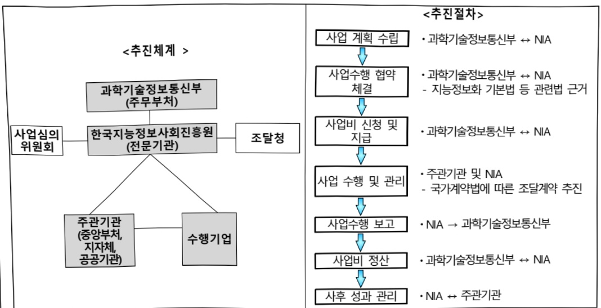

# 국산NPU기반 AI CCTV 전환

**해당 페이지**: PDF 823 ~ 828 쪽 해당

**부처**: 과학기술정보통신부
**분야**: 통신
**회계유형**: 일반회계
**2026 확정예산**: 10000.0 백만원
**전년대비 증감률**: None%
**AI 도메인**: AI반도체, 디지털전환(AX)

---

<table border=1 style='margin: auto; word-wrap: break-word;'><tr><td style='text-align: center; word-wrap: break-word;'>사 업 명</td></tr><tr><td style='text-align: center; word-wrap: break-word;'>(151) 국산 NPU 기반 AI CCTV 전환(2033-416)</td></tr></table>

## 사업 코드 정보

<table border=1 style='margin: auto; word-wrap: break-word;'><tr><td style='text-align: center; word-wrap: break-word;'>구분</td><td style='text-align: center; word-wrap: break-word;'>회계</td><td style='text-align: center; word-wrap: break-word;'>소관</td><td style='text-align: center; word-wrap: break-word;'>실국(기관)</td><td style='text-align: center; word-wrap: break-word;'>계정</td><td style='text-align: center; word-wrap: break-word;'>분야</td><td style='text-align: center; word-wrap: break-word;'>부문</td></tr><tr><td style='text-align: center; word-wrap: break-word;'>코드</td><td rowspan="2">일반회계</td><td rowspan="2">과학기술정보통신부</td><td rowspan="2">정보통신정책실정보통신정책관</td><td rowspan="2"></td><td style='text-align: center; word-wrap: break-word;'>130</td><td style='text-align: center; word-wrap: break-word;'>133</td></tr><tr><td style='text-align: center; word-wrap: break-word;'>명칭</td><td style='text-align: center; word-wrap: break-word;'>통신</td><td style='text-align: center; word-wrap: break-word;'>정보통신</td></tr></table>

<table border=1 style='margin: auto; word-wrap: break-word;'><tr><td style='text-align: center; word-wrap: break-word;'>구분</td><td style='text-align: center; word-wrap: break-word;'>프로그램</td><td style='text-align: center; word-wrap: break-word;'>단위사업</td><td style='text-align: center; word-wrap: break-word;'>세부사업</td></tr><tr><td style='text-align: center; word-wrap: break-word;'>코드</td><td style='text-align: center; word-wrap: break-word;'>2000</td><td style='text-align: center; word-wrap: break-word;'>2033</td><td style='text-align: center; word-wrap: break-word;'>416</td></tr><tr><td style='text-align: center; word-wrap: break-word;'>명칭</td><td style='text-align: center; word-wrap: break-word;'>인터넷융합산업</td><td style='text-align: center; word-wrap: break-word;'>스마트화산업기반확충</td><td style='text-align: center; word-wrap: break-word;'>국산 NPU 기반 AI CCTV 전환</td></tr></table>

□ 사업 성격 (공통요구자료 Ⅱ-1 작성유의사항 4. 참조, 해당하는 사항에 “○” 표시)

<table border=1 style='margin: auto; word-wrap: break-word;'><tr><td style='text-align: center; word-wrap: break-word;'>신규</td><td style='text-align: center; word-wrap: break-word;'>계속</td><td style='text-align: center; word-wrap: break-word;'>완료</td><td style='text-align: center; word-wrap: break-word;'>예비타당성 실시여부</td><td style='text-align: center; word-wrap: break-word;'>총사업비 관리대상</td><td style='text-align: center; word-wrap: break-word;'>총액계상 예산사업</td><td style='text-align: center; word-wrap: break-word;'>사업소관 변경정보 2025예산 시 소관</td></tr><tr><td style='text-align: center; word-wrap: break-word;'>O</td><td style='text-align: center; word-wrap: break-word;'></td><td style='text-align: center; word-wrap: break-word;'></td><td style='text-align: center; word-wrap: break-word;'></td><td style='text-align: center; word-wrap: break-word;'></td><td style='text-align: center; word-wrap: break-word;'></td><td style='text-align: center; word-wrap: break-word;'></td></tr></table>

사업지원형태 및지원을(최소한한개는반드시선택하시오.해당사항에O표시)

<table border=1 style='margin: auto; word-wrap: break-word;'><tr><td style='text-align: center; word-wrap: break-word;'>직접</td><td style='text-align: center; word-wrap: break-word;'>출자</td><td style='text-align: center; word-wrap: break-word;'>출연</td><td style='text-align: center; word-wrap: break-word;'>보조</td><td style='text-align: center; word-wrap: break-word;'>융자</td><td style='text-align: center; word-wrap: break-word;'>국고보조율(%)</td><td style='text-align: center; word-wrap: break-word;'>융자율(%)</td></tr><tr><td style='text-align: center; word-wrap: break-word;'></td><td style='text-align: center; word-wrap: break-word;'></td><td style='text-align: center; word-wrap: break-word;'>0</td><td style='text-align: center; word-wrap: break-word;'></td><td style='text-align: center; word-wrap: break-word;'></td><td style='text-align: center; word-wrap: break-word;'></td><td style='text-align: center; word-wrap: break-word;'></td></tr></table>

□ 사업 소관부처 및 시행주체

<table border=1 style='margin: auto; word-wrap: break-word;'><tr><td style='text-align: center; word-wrap: break-word;'>사업명</td><td colspan="2">구분</td></tr><tr><td rowspan="2">국산 NPU 기반 AI CCTV 전환</td><td style='text-align: center; word-wrap: break-word;'>소관부처</td><td style='text-align: center; word-wrap: break-word;'>정보통신정책실 정보통신정책관 디지털사회기획과</td></tr><tr><td style='text-align: center; word-wrap: break-word;'>사업시행주체</td><td style='text-align: center; word-wrap: break-word;'>한국지능정보사회진흥원</td></tr></table>

---

### 가.예산 총괄표

(단위: 백만원, %)

<table border=1 style='margin: auto; word-wrap: break-word;'><tr><td rowspan="2">사업명</td><td rowspan="2">2024년 결산</td><td colspan="2">2025년 예산</td><td colspan="2">2026년 예산</td><td rowspan="2">증감 (B-A)</td><td rowspan="2">(B-A)/A</td></tr><tr><td style='text-align: center; word-wrap: break-word;'>본예산</td><td style='text-align: center; word-wrap: break-word;'>추경*(A)</td><td style='text-align: center; word-wrap: break-word;'>요구안</td><td style='text-align: center; word-wrap: break-word;'>본예산(B)</td></tr><tr><td style='text-align: center; word-wrap: break-word;'>국산 NPU 기반 AI CCTV 전환</td><td style='text-align: center; word-wrap: break-word;'>-</td><td style='text-align: center; word-wrap: break-word;'>-</td><td style='text-align: center; word-wrap: break-word;'>-</td><td style='text-align: center; word-wrap: break-word;'>10,000</td><td style='text-align: center; word-wrap: break-word;'>10,000</td><td style='text-align: center; word-wrap: break-word;'>10,000</td><td style='text-align: center; word-wrap: break-word;'>순증</td></tr></table>

* 추경: 추경증감액을 포함한 최종 예산액을 기재

□ 기능별(내역사업별) 예산 내역

(단위:백만원)

<table border=1 style='margin: auto; word-wrap: break-word;'><tr><td rowspan="2"></td><td colspan="5">2024</td><td colspan="5">2025</td><td rowspan="2">2026 叁</td></tr><tr><td style='text-align: center; word-wrap: break-word;'>叁叁叁(叁柒)</td><td style='text-align: center; word-wrap: break-word;'>叁叁叁(叁柒)</td><td style='text-align: center; word-wrap: break-word;'>叁叁叁(叁柒)</td><td style='text-align: center; word-wrap: break-word;'>叁叁叁(叁柒)</td><td style='text-align: center; word-wrap: break-word;'>叁叁叁(叁柒)</td><td style='text-align: center; word-wrap: break-word;'>叁叁叁(叁柒)</td><td style='text-align: center; word-wrap: break-word;'>叁叁叁(叁柒)</td><td style='text-align: center; word-wrap: break-word;'>叁叁叁(叁柒)</td><td style='text-align: center; word-wrap: break-word;'>叁叁叁(叁柒)</td><td style='text-align: center; word-wrap: break-word;'>叁叁叁(叁柒)</td></tr><tr><td style='text-align: center; word-wrap: break-word;'>○ 기능별 분류(합계)</td><td style='text-align: center; word-wrap: break-word;'>-</td><td style='text-align: center; word-wrap: break-word;'>-</td><td style='text-align: center; word-wrap: break-word;'>-</td><td style='text-align: center; word-wrap: break-word;'>-</td><td style='text-align: center; word-wrap: break-word;'>-</td><td style='text-align: center; word-wrap: break-word;'>-</td><td style='text-align: center; word-wrap: break-word;'>-</td><td style='text-align: center; word-wrap: break-word;'>-</td><td style='text-align: center; word-wrap: break-word;'>-</td><td style='text-align: center; word-wrap: break-word;'>-</td><td style='text-align: center; word-wrap: break-word;'>10,000</td></tr><tr><td style='text-align: center; word-wrap: break-word;'>• 국산 NPU 기반 AI CCTV 전환</td><td style='text-align: center; word-wrap: break-word;'>-</td><td style='text-align: center; word-wrap: break-word;'>-</td><td style='text-align: center; word-wrap: break-word;'>-</td><td style='text-align: center; word-wrap: break-word;'>-</td><td style='text-align: center; word-wrap: break-word;'>-</td><td style='text-align: center; word-wrap: break-word;'>-</td><td style='text-align: center; word-wrap: break-word;'>-</td><td style='text-align: center; word-wrap: break-word;'>-</td><td style='text-align: center; word-wrap: break-word;'>-</td><td style='text-align: center; word-wrap: break-word;'>-</td><td style='text-align: center; word-wrap: break-word;'>10,000</td></tr></table>

### 나. 사업설명자료

## 1 ) 사업목적·내용

- (국산 NPU 기반 AI CCTV 전환) 공공 분야의 국산 NPU 수요 창출을 위하여 공공 CCTV의 국산 NPU 기반 AI CCTV 전환·확산 지원

· 기존 CCTV의 AI 전환 및 신규 AI CCTV 구축 수요를 대상으로, 국산 NPU를 활용하여 능동 감지하는 AI CCTV로 전화 지원

## 2 ) 사업개요

## ☐ 사업근거 및 추진경위

① 법령상 근거 및 조항 적시 :

- 지능정보화 기본법(법률 제20410호, 시행 '25.3.27)

제12조(한국지능정보사회진흥원의 설립) ① 과학기술정보통신부장관과 행정안전부장관은 지능정보사회 관련 정책의 개발과 국가기관등의 지능정보사회 시책 및 지능정보화사업의 추진 등을 지원하기 위하여 한국지능정보사회진흥원(이하 “지능정보사회원”이라 한다)을 설립한다.

---

② 지능정보사회원은 법인으로 한다.

③ 지능정보사회원은 다음 각 호의 사업을 한다.

1. 종합계획, 실행계획 및 제13조에 따른 부문별 추진계획의 수립·시행에 필요한 전문 기술의 지원

2. 지능정보기술의 보급을 위한 시책 수립의 지원 및 국가기관등의 지능정보기술 활용 촉진과 관련한 전문기술의 지원

3. 초연결지능정보통신기반 구축·운영을 위한 전문기술의 지원

4. 국가기관등의 초연결지능정보통신망의 관리·운영 및 지능정보화의 지원

5. 데이터 관련 시책의 수립 지원, 시범사업 추진 및 전문기술의 지원 등 데이터의 생산

·관리·유통·활용의 활성화를 위하여 필요한 지원

6. 정보격차의 해소, 지능정보서비스 과의존 예방·해소 등 지능정보사회 역기능 해소를 위한 지원 및 연구

7. 지능정보사회윤리 확립과 정보문화의 창달을 위하여 필요한 지원 및 연구

8. 국가기관등의 지능정보화 사업 추진 및 평가 지원

9. 지능정보사회 구현과 관련된 정책 개발을 지원하기 위한 동향분석, 미래예측 및 법·제도의 조사·연구

10. 지능정보화 및 지능정보사회 관련 교육·홍보·컨설팅 등 대국민 인식 제고, 인력 양성 및 국제협력

11. 다른 법령에서 지능정보사회원의 업무로 정하거나 지능정보사회원에 위탁한 사업

12. 그 밖에 국가기관등의 장이 위탁하는 사업

④ 국가기관등은 지능정보사회원의 설립·시설·운영 및 사업 추진 등에 필요한 경비에 충당하도록 하기 위하여 지능정보사회원에 출연할 수 있으며, 정부는 지능정보사회원의 설립 및 운영 등을 위하여 필요한 국유재산을 무상으로 대여할 수 있다.

⑤ 지능정보사회원은 지원을 받으려는 국가기관등에 그 지원에 드는 비용의 전부 또는 일부를 부담하게 할 수 있다.

⑥ 지능정보사회원에 관하여는 이 법 및「공공기관의 운영에 관한 법률」에서 정한 것을 제외하고는「민법」 중 재단법인에 관한 규정을 준용한다.

지능정보사회원이 아닌 자는 한국지능정보사회진흥원 또는 이와 유사한 명칭을 사용하지 못한다.

⑧ 제1항부터 제7항까지에서 규정한 사항 외에 지능정보사회원의 설립과 운영에 필요한 사항은 대통령령으로 정한다.

• 제14조(공공지능정보화의 추진) ① 국가기관들은 공공서비스의 지능정보화를 도모하고 국민 편익 증진 등을 위하여 행정, 보건, 사회복지, 교육, 문화, 환경, 교통, 물류, 과학기술, 재난안전, 치안, 국방, 에너지 등 소관 업무에 대한 지능정보화(이하 “공공지능정보화”라 한다)를 추진하여야 한다.

② 국가기관등은 공공지능정보화를 효율적으로 추진하기 위하여 필요한 방안을 마련하여야 한다.

· 제15조(지역지능정보화의 추진) ① 국가기관과 지방자치단체는 지역 주민의 삶의 질 향상, 주민의 역량강화와 지역 간 균형발전, 정보격차 해소 등을 위하여 하나 또는 여러 개의 지역 · 도시에 대하여 행정 · 생활 · 산업 등의 분야를 대상으로 하는 지능정보화(이하 “지역 지능정보화”라 한다)를 추진할 수 있다.

② 국가기관과 지방자치단체는 지역지능정보화를 추진하는 경우 지역의 수요와 특성을 고려하여야 하며, 관계 기관의 의견을 수렴하고 그 결과를 최대한 반영하여야 한다.

③ 국가기관은 지방자치단체가 추진하는 지역지능정보화를 위하여 행정, 재정, 기술 등에 관하여 필요한 사항을 지원할 수 있다.

· 제18조(지능정보화의 민간 확산) ① 정부는 공공분야의 지능정보화를 통하여 정보통신 및 지능정보기술 관련 산업의 조기 구축을 도모하고, 사회 각 분야에서 이용을 활성화할 수

---

있도록 필요한 시책을 마련하여야 한다.

② 국가기관등은 지능정보화의 추진을 통하여 생성되는 각종 지식과 정보가 사회 각 분야에 유용하게 유통·활용 될 수 있도록 필요한 기반을 마련하여야 한다. 이 경우 국가기관 등은 개인정보 및 「부정경쟁방지 및 영업비밀보호에 관한 법률」 제2조제2호에 따른 영업비밀을 보호하여야 한다.

## ② 추진경위

· 새정부 공약사항 : AI 등 신산업 집중육성- AI 시대, 차세대 첨단기술 개발과 투자

강화 - 차세대 AI 반도체 기술개발 및 산업생태계 육성

- 저전력·고성능 NPU, PIM 등 차세대 반도체 기술 개발 지원

-국산 AI 반도체를 중심으로 한 AI 반도체 생태계 조기 확립

·국정과제 22. 초격차 AI 선도기술·인재 확보 - AI 반도체 산업생태계 확립

-다양한 국산 NPU + AI 서비스 패키지 실증을 위한 테스트베드 확대 및 사업화 적시 지원

## □ 주요내용

① 사업규모

- 총사업비(해당되는 경우에만 기재) : 해당없음

- 사업기간 : '26년 ~ '30년

- 최근 5년 간 투입된 사업비(예산액기준, 추경편성한 연도에는 추경포함)

<table border=1 style='margin: auto; word-wrap: break-word;'><tr><td style='text-align: center; word-wrap: break-word;'>$ \underline{\text{연도}} $</td><td style='text-align: center; word-wrap: break-word;'>2022</td><td style='text-align: center; word-wrap: break-word;'>2023</td><td style='text-align: center; word-wrap: break-word;'>2024</td><td style='text-align: center; word-wrap: break-word;'>2025</td><td style='text-align: center; word-wrap: break-word;'>2026</td></tr><tr><td style='text-align: center; word-wrap: break-word;'>사업비</td><td style='text-align: center; word-wrap: break-word;'>-</td><td style='text-align: center; word-wrap: break-word;'>-</td><td style='text-align: center; word-wrap: break-word;'>-</td><td style='text-align: center; word-wrap: break-word;'>-</td><td style='text-align: center; word-wrap: break-word;'>10,000</td></tr></table>

## ② 사업추진체계

- 사업시행방법 : 출연

- 사업시행주체 : 한국지능정보사회진흥원

- 사업 수혜자 : NPU 기업, AI CCTV SW기업, AI CCTV 전환 기관·지자체 등

- 보조, 융자, 출연, 출자 등의 경우 보조·융자 등 지원 비율 및 법적근거

<table border=1 style='margin: auto; word-wrap: break-word;'><tr><td style='text-align: center; word-wrap: break-word;'>내역사업명</td><td style='text-align: center; word-wrap: break-word;'>구분</td><td style='text-align: center; word-wrap: break-word;'>피보조· 피출연 등 기관명</td><td style='text-align: center; word-wrap: break-word;'>지원 금액 (2026예산)</td><td style='text-align: center; word-wrap: break-word;'>지원 비율(%)</td><td style='text-align: center; word-wrap: break-word;'>보조율 법적근거 (해당 조항)</td></tr><tr><td style='text-align: center; word-wrap: break-word;'>국산 NPU 기반 AI CCTV 전환</td><td style='text-align: center; word-wrap: break-word;'>출연</td><td style='text-align: center; word-wrap: break-word;'>한국지능 정보사회 진흥원</td><td style='text-align: center; word-wrap: break-word;'>10,000</td><td style='text-align: center; word-wrap: break-word;'>100</td><td style='text-align: center; word-wrap: break-word;'>지능정보화기본법 제12조, 제14조 등 (한국지능정보사회진흥원의 설립, 공공지능정보화의 추진)</td></tr></table>

---

## 3 )2026년도 예산 산출 근거

□ 국산 NPU 기반 AI CCTV 전환 : (2026 예산안, 신규) 10,000백만원

① 국산 NPU 기반 AI CCTV 전환 : (2026 예산안, 신규) 10,000백만원

- (요구) 공공분야 국산 NPU 수요 창출을 위하여 공공 CCTV의 국산 NPU 기반 AI CCTV 전환을 위한 '26년 10,000백만원 예산 요구

- (산출) 3개 과제 x 3,333백만원 = 10,000백만원 (※ 과제당 약 4,000대 AI CCTV 전환 예상)

○ 사업출연금(350-02):10,000백만원

<table border=1 style='margin: auto; word-wrap: break-word;'><tr><td colspan="2">2025년 본예산</td><td colspan="2">2026년 예산안</td></tr><tr><td style='text-align: center; word-wrap: break-word;'>예산</td><td style='text-align: center; word-wrap: break-word;'>산출내역</td><td style='text-align: center; word-wrap: break-word;'>예산</td><td style='text-align: center; word-wrap: break-word;'>산출내역</td></tr><tr><td style='text-align: center; word-wrap: break-word;'>-</td><td style='text-align: center; word-wrap: break-word;'>-</td><td style='text-align: center; word-wrap: break-word;'>10,000</td><td style='text-align: center; word-wrap: break-word;'>○ 사업출연금(350-02) : 10,000백만원 가. 국산 NPU 기반 AI CCTV 전환(10,000백만원) • 3,333백만원 × 3개 과제 = 10,000백만원</td></tr></table>

## 4 ) 사업효과

☐ 사업영향, 산출물 성과지표 등

① 2022~2026년도 성과계획서 상 성과지표 및 최근 5년간 성과 달성도

<table border=1 style='margin: auto; word-wrap: break-word;'><tr><td style='text-align: center; word-wrap: break-word;'>성과지표</td><td style='text-align: center; word-wrap: break-word;'>구분</td><td style='text-align: center; word-wrap: break-word;'>2022</td><td style='text-align: center; word-wrap: break-word;'>2023</td><td style='text-align: center; word-wrap: break-word;'>2024</td><td style='text-align: center; word-wrap: break-word;'>2025</td><td style='text-align: center; word-wrap: break-word;'>2026</td><td style='text-align: center; word-wrap: break-word;'>2026 목표치산출근거</td><td style='text-align: center; word-wrap: break-word;'>측정산시(또는 측정방법)</td><td style='text-align: center; word-wrap: break-word;'>자료수집방법(또는 자료출처)</td></tr><tr><td rowspan="3">만족도(단위: 5점척도)</td><td style='text-align: center; word-wrap: break-word;'>목표</td><td style='text-align: center; word-wrap: break-word;'>-</td><td style='text-align: center; word-wrap: break-word;'>-</td><td style='text-align: center; word-wrap: break-word;'>-</td><td style='text-align: center; word-wrap: break-word;'>-</td><td style='text-align: center; word-wrap: break-word;'>4.25</td><td rowspan="3">수혜기관 대상5점척도 만족도조사하여 85% 목표설정</td><td rowspan="3">수혜기관 대상조사</td><td rowspan="3">사업결과보고서</td></tr><tr><td style='text-align: center; word-wrap: break-word;'>실적</td><td style='text-align: center; word-wrap: break-word;'>-</td><td style='text-align: center; word-wrap: break-word;'>-</td><td style='text-align: center; word-wrap: break-word;'>-</td><td style='text-align: center; word-wrap: break-word;'>-</td><td style='text-align: center; word-wrap: break-word;'>-</td></tr><tr><td style='text-align: center; word-wrap: break-word;'>달성도</td><td style='text-align: center; word-wrap: break-word;'>-</td><td style='text-align: center; word-wrap: break-word;'>-</td><td style='text-align: center; word-wrap: break-word;'>-</td><td style='text-align: center; word-wrap: break-word;'>-</td><td style='text-align: center; word-wrap: break-word;'>-</td></tr></table>

② 성과지표 이외의 연도별 사업추진 경과 및 실적 : 해당없음

③향후(2026년도 이후)기대효과

- (국산 NPU 기반 AI CCTV 전환) 국산 NPU 기반 AI CCTV 전환 지원을 통해 공공분야의 국산 NPU 수요 창출 및 AI CCTV 확대를 통한 국민 안전 제고

5) 타당성조사 및 예비타당성조사 시행여부 및 결과 요지

☐ 예비타당성 조상 대상에 해당하지 않음

6) 총사업비 대상사업 정보 : 해당없음

---

## 7 ) 사업 집행절차

-국산 NPU 기반 AI CCTV 전환

<table border=1 style='margin: auto; word-wrap: break-word;'><tr><td style='text-align: center; word-wrap: break-word;'>부처</td><td style='text-align: center; word-wrap: break-word;'></td><td style='text-align: center; word-wrap: break-word;'>피출연·피보조기관</td><td style='text-align: center; word-wrap: break-word;'></td><td style='text-align: center; word-wrap: break-word;'>간접보조사업자·사업수행자</td></tr><tr><td style='text-align: center; word-wrap: break-word;'>과학기술정보통신부(10,000백만원)</td><td style='text-align: center; word-wrap: break-word;'>=&gt;(10,000백만원)</td><td style='text-align: center; word-wrap: break-word;'>한국지능정보사회진흥원(700백만원)</td><td style='text-align: center; word-wrap: break-word;'>=&gt;(9,300백만원)</td><td style='text-align: center; word-wrap: break-word;'>·AI CCTV 기업 등(사업수행자)</td></tr></table>

## 8 ) 각종 평가

1) 국회(예결위, 상임위, 예정처, 국정감사 포함) 지적

<table border=1 style='margin: auto; word-wrap: break-word;'><tr><td style='text-align: center; word-wrap: break-word;'>1) 구분</td><td style='text-align: center; word-wrap: break-word;'>검토 의견 및 조치 계획</td></tr><tr><td style='text-align: center; word-wrap: break-word;'>구분</td><td style='text-align: center; word-wrap: break-word;'>(지적) 사업 최종 목표의 달성 정도를 측정할 수 있는 만족도 등 산출·영향지표를 추가·보완 필요(조치) 만족도 목표를 설정하여 산출·영향지표로 보완하였음</td></tr><tr><td style='text-align: center; word-wrap: break-word;'>예정처(26예산)</td><td style='text-align: center; word-wrap: break-word;'>(지적) 부처 간 지원 대상자 차별화 등에 대한 조율을 통해 효율적인 운영 방식을 모색할 필요가 있으며 사전 준비를 철저히 하여야 함(조치) 국산 NPU 기반 CCTV 관제 서비스 실증 결과 확인, 사전 수요조사 등 사업 추진을 위한 사전 준비 및 타 부처와 협업하여 사업을 상호 보완적으로 추진 노력하겠음</td></tr><tr><td style='text-align: center; word-wrap: break-word;'>예결위(26예산)</td><td style='text-align: center; word-wrap: break-word;'>(지적) 수요기관의 성공적인 AI CCTV 전환을 위해 수요기관 선정 시 관련 기술을 보유한 기업 현황도 면밀히 검토할 필요(조치) 국내 AI CCTV 기업 문의를 통해 배회, 쓰러짐, 폭력, 화재, 차량 인식 등의 다양한 서비스 제공이 가능한 것을 확인하였음</td></tr></table>

### 다. 최근 4년간 결산내역 : 26년 신규사업으로 해당없음

---

### 원본 PDF 크롭 이미지

