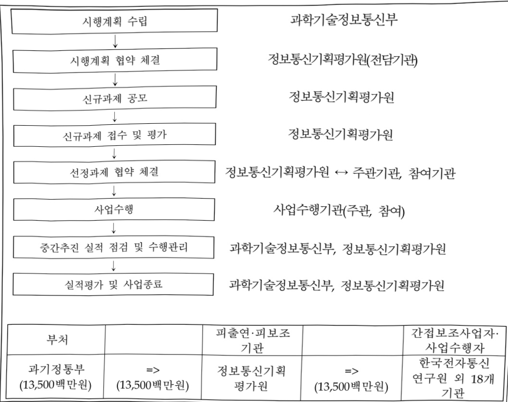

# 글로벌제조융합SW개발및실증(R&D)

**해당 페이지**: PDF 829 ~ 834 쪽 해당

**부처**: 과학기술정보통신부
**분야**: 산업·중소기업 및 에너지
**회계유형**: 지역균형발전 특별회계
**2026 확정예산**: 13500.0 백만원
**전년대비 증감률**: 800.0%
**AI 도메인**: 제조/스마트팩토리

---

### 가. 예산 총괄표

(단위: 백만원, %)

<table border=1 style='margin: auto; word-wrap: break-word;'><tr><td colspan="3">2024년 2025년 예산</td><td colspan="2">2026년 예산</td><td style='text-align: center; word-wrap: break-word;'>증감 (B-A)</td><td rowspan="2">(B-A)/A</td></tr><tr><td style='text-align: center; word-wrap: break-word;'>사업명</td><td style='text-align: center; word-wrap: break-word;'>결산</td><td style='text-align: center; word-wrap: break-word;'>본예산</td><td style='text-align: center; word-wrap: break-word;'>추경(A)</td><td style='text-align: center; word-wrap: break-word;'>요구안</td><td style='text-align: center; word-wrap: break-word;'>본예산(B)</td></tr><tr><td style='text-align: center; word-wrap: break-word;'>글로벌제조용함 SW개발및실증(R&amp;D)</td><td style='text-align: center; word-wrap: break-word;'>1,500</td><td style='text-align: center; word-wrap: break-word;'>1,500</td><td style='text-align: center; word-wrap: break-word;'>1,500</td><td style='text-align: center; word-wrap: break-word;'>13,500</td><td style='text-align: center; word-wrap: break-word;'>13,500</td><td style='text-align: center; word-wrap: break-word;'>12,000 800.0</td></tr></table>

□ 기능별(내역사업별) 예산 내역

(단위:백만원)

<table border=1 style='margin: auto; word-wrap: break-word;'><tr><td rowspan="2"></td><td colspan="5">2024</td><td colspan="5">2025</td><td rowspan="2">2026</td></tr><tr><td style='text-align: center; word-wrap: break-word;'>예산액(추경)</td><td style='text-align: center; word-wrap: break-word;'>예산현액</td><td style='text-align: center; word-wrap: break-word;'>집행액</td><td style='text-align: center; word-wrap: break-word;'>이월액</td><td style='text-align: center; word-wrap: break-word;'>불용액</td><td style='text-align: center; word-wrap: break-word;'>예산액(추경)</td><td style='text-align: center; word-wrap: break-word;'>예산현액</td><td style='text-align: center; word-wrap: break-word;'>집행액</td><td style='text-align: center; word-wrap: break-word;'>이월액</td><td style='text-align: center; word-wrap: break-word;'>불용액</td></tr><tr><td style='text-align: center; word-wrap: break-word;'>○ 기능별 분류(합계)</td><td style='text-align: center; word-wrap: break-word;'>1,500</td><td style='text-align: center; word-wrap: break-word;'>1,500</td><td style='text-align: center; word-wrap: break-word;'>1,500[1,500]</td><td style='text-align: center; word-wrap: break-word;'>-</td><td style='text-align: center; word-wrap: break-word;'>-</td><td style='text-align: center; word-wrap: break-word;'>1,500</td><td style='text-align: center; word-wrap: break-word;'>1,500</td><td style='text-align: center; word-wrap: break-word;'>1,500[1,500]</td><td style='text-align: center; word-wrap: break-word;'>-</td><td style='text-align: center; word-wrap: break-word;'>-</td><td style='text-align: center; word-wrap: break-word;'>13,500</td></tr><tr><td style='text-align: center; word-wrap: break-word;'>• 글로벌제조용협SW개발및실증</td><td style='text-align: center; word-wrap: break-word;'>1,500</td><td style='text-align: center; word-wrap: break-word;'>1,500</td><td style='text-align: center; word-wrap: break-word;'>1,500[1,500]</td><td style='text-align: center; word-wrap: break-word;'>-</td><td style='text-align: center; word-wrap: break-word;'>-</td><td style='text-align: center; word-wrap: break-word;'>1,500</td><td style='text-align: center; word-wrap: break-word;'>1,500</td><td style='text-align: center; word-wrap: break-word;'>1,500[1,500]</td><td style='text-align: center; word-wrap: break-word;'>-</td><td style='text-align: center; word-wrap: break-word;'>-</td><td style='text-align: center; word-wrap: break-word;'>13,500</td></tr></table>

### 나. 사업설명자료

## 1 ) 사업목적·내용

- (글로벌제조융합SW개발및실증) 제조기업이 글로벌 제품공급을 위해 사용 중인 외산 가상시운전SW를 국산화하여 소프트웨어를 활용한 디지털 제조혁신 및 글로벌 진출

## 2 ) 사업개요

사업근거 및 추진경위

① 법령상 근거 조항 적시

0 정보통신진흥및융합활성화 등에 관한 특별법 제32조

제32조(정보통신융합등 기술·서비스 개발 등의 지원) ① 과학기술정보통신부장관은 다른 산업 및 서비스 등에 정보통신의 접목을 통하여 생산성과 가치를 높일 수 있도록 노력하여야 한다.

② 과학기술정보통신부장관은 정보통신융합 등 기술·서비스의 개발을 촉진하기 위하여 다음 각 호의 사업을 추진할 수 있다.

1. 정보통신융합등 기술·서비스 관련 연구개발 사업

2. 제1호에 따라 주진되는 과제에 대한 기획·평가·관리

3. 국가·지방자치단체, 대학·정부출연연구기관, 민간 등이 보유한 정보통신융합등 기술의 거래 등 기술이전을 위한 중개·알선 지원

---

4. 정보통신융합등 기술에 대한 평가 및 평가 기법의 개발 · 보급
5. 정보통신융합등 기술의 기술이전·사업화에 관한 통계조사·연구 등 관련 정보의 수집분석제공
6. 정보통신융합등 기술의 기술이전 후 상용화 연구개발 지원
7. 정보통신융합등 기술의 기술사업화 전문인력 양성
8. 정보통신융합등 기술의 기술거래 · 사업화 촉진을 위한 정보시스템 구축 · 활용
9. 지식재산권 등 정보통신융합등 기술 관련 연구성과물의 관리 · 홍보 · 활용
10. 정보통신융합등 기술 · 서비스의 수준조사 등 정책연구 사업
11. 정보통신융합등 기술 · 서비스 관련 시범사업
12. 그 밖에 정보통신기술진흥을 위하여 필요한 사업
③ 과학기술정보통신부장관은 제2항 각 호의 사업을 추진하기 위하여 법인인 전담기관을 설립하거나 법인·단체에 위탁·운영할 수 있으며, 필요한 비용의 전부 또는 일부를 예산의 범위에서 출연 또는 보조할 수 있다.

0 소프트웨어진흥법 제3조(국가와 지방자치단체의 책무), 제5조(기본계획의 수립 등),

제9조(지역별 소프트웨어산업 진흥), 제28조(소프트웨어융합 촉진)

제3조(국가와지방자치단체의책무) 국가와 지방자치단체는 소프트웨어산업을 진흥시키고 국가 전반의 소프트웨어역량을 강화하는 데 필요한 각종 시책을 수립·시행하여야 한다.
제5조(기본계획의 수립 등) ① 과학기술정보통신부장관은 소프트웨어 진흥을 위하여 관계 중앙행정기관의 장과 협의를 거쳐 소프트웨어 진흥 기본계획(이하 "기본계획"이라 한다)을 수립·시행하여야 한다.
② 기본계획에는 다음 각 호의 사항이 포함되어야 한다.
1. 소프트웨어산업 진흥을 위한 시책의 기본방향
2. 소프트웨어산업 부문별 육성시책
3. 소프트웨어산업 기반 조성
4. 소프트웨어교육 및 인력 양성
5. 소프트웨어 기술의 연구개발 및 보급
6. 소프트웨어의 이용 촉진 및 유통 활성화
7. 소프트웨어사업 또는 소프트웨어융합 사업의 창업(이하 "소프트웨어창업"이라 한다) 지원
8. 소프트웨어산업의 국제협력 및 해외시장 진출
9. 소프트웨어 자산관리 활성화
10. 소프트웨어융합의 활성화
11. 지역별 특성에 기반한 소프트웨어산업의 진흥 및 지역 산업과의 융합 촉진
12. 소프트웨어안전 관리
13. 그 밖에 소프트웨어 진흥을 위하여 필요한 사항
제9조(지역별 소프트웨어산업 진흥) ① 과학기술정보통신부장관은 지역별 특성에 기반한 소프트웨어산업 진흥을 지원하고 지역 산업과의 융합을 촉진하여야 한다.
제28조(소프트웨어융합 촉진) ① 정부는 관계 법령에 따라 소프트웨어융합을 활성화하여 다른 산업 분야의 혁신을 촉진하고 경쟁력을 강화할 수 있도록 노력하여야 한다.
② 과학기술정보통신부장관은 소프트웨어융합을 촉진하기 위하여 시범사업을 하거나, 연구개발 및 수출 등을 지원할 수 있다.

② 추진경위 - 사업 시작년도, 추진배경, 부처별 중점과제, 대통령 공약사항 등

ㅇ 지역 제조메타버스 육성 협의체 발족 : '21.10.25.

0 대통령 경남지역공약 채택(5G기반 기계제조 메타버스 구축) : '22. 5.

o 정부부처 메타버스 경제 활성화 민관 TF운영 : '22.7.15.

ㅇ 지역 제조메타버스 기술수요조사 및 사전연구회 운영 : '22.8~12

---

## 주요내용

① 사업규모

- 총사업비(해당되는 경우에만 기재) : 해당없음

- 사업기간 : '24~'28

- 최근 5년 간 투입된 사업비(예산액기준, 추경편성한 연도에는 추경포함)

<table border=1 style='margin: auto; word-wrap: break-word;'><tr><td style='text-align: center; word-wrap: break-word;'>연도</td><td style='text-align: center; word-wrap: break-word;'>2022</td><td style='text-align: center; word-wrap: break-word;'>2023</td><td style='text-align: center; word-wrap: break-word;'>2024</td><td style='text-align: center; word-wrap: break-word;'>2025</td><td style='text-align: center; word-wrap: break-word;'>2026</td></tr><tr><td style='text-align: center; word-wrap: break-word;'>사업비</td><td style='text-align: center; word-wrap: break-word;'>-</td><td style='text-align: center; word-wrap: break-word;'>-</td><td style='text-align: center; word-wrap: break-word;'>1,500</td><td style='text-align: center; word-wrap: break-word;'>1,500</td><td style='text-align: center; word-wrap: break-word;'>13,500</td></tr></table>

② 사업추진체계

- 사업시행방법 : 출연

- 사업시행주체 : 정보통신기획평가원

- 사업 수혜자 : 지역 SW기업 및 제조기업 등

- 보조, 융자, 출연, 출자 등의 경우 보조·융자 등 지원 비율 및 법적근거

<table border=1 style='margin: auto; word-wrap: break-word;'><tr><td style='text-align: center; word-wrap: break-word;'>내역사업명</td><td style='text-align: center; word-wrap: break-word;'>구분</td><td style='text-align: center; word-wrap: break-word;'>피보조·피출연 등 기관명</td><td style='text-align: center; word-wrap: break-word;'>지원 금액 (2026예산)</td><td style='text-align: center; word-wrap: break-word;'>지원 비율(%)</td><td style='text-align: center; word-wrap: break-word;'>보조율 법적근거 (해당 조항)</td></tr><tr><td style='text-align: center; word-wrap: break-word;'>글로벌 제조융합SW 개발및 실증</td><td style='text-align: center; word-wrap: break-word;'>출연</td><td style='text-align: center; word-wrap: break-word;'>정보통신 기획평가원</td><td style='text-align: center; word-wrap: break-word;'>13,500</td><td style='text-align: center; word-wrap: break-word;'>100</td><td style='text-align: center; word-wrap: break-word;'>정보통신 진흥 및 융합 활성화 등에 관한 특별법 32조</td></tr></table>

## 3 ) 2026년도 예산 산출 근거

① 글로벌제조융합SW개발및실증 : (2025 본예산) 1,500백만원 → (2026 요구) 13,500백만원

- (요구) 제조공정설비간 실시간 데이터 연동을 위한 가상시운전 공통 플랫폼 요소기술 개발을 위한 예산 요구

- (산출) 1개 과제 X 13,500백만원 X 12/12개월 = 13,500백만원

---

## 4 ) 사업효과

사업영향, 산출물 성과지표 등

① 2022~2026년도 성과계획서 상 성과지표 및 최근 5년간 성과 달성도

<table border=1 style='margin: auto; word-wrap: break-word;'><tr><td style='text-align: center; word-wrap: break-word;'>성과지표</td><td style='text-align: center; word-wrap: break-word;'>구분</td><td style='text-align: center; word-wrap: break-word;'>2022</td><td style='text-align: center; word-wrap: break-word;'>2023</td><td style='text-align: center; word-wrap: break-word;'>2024</td><td style='text-align: center; word-wrap: break-word;'>2025</td><td style='text-align: center; word-wrap: break-word;'>2026</td><td style='text-align: center; word-wrap: break-word;'>2026 목표치산출근거</td><td style='text-align: center; word-wrap: break-word;'>측정산식(또는 측정방법)</td><td style='text-align: center; word-wrap: break-word;'>자료수집방법(또는 자료출처)</td></tr><tr><td rowspan="3">제조현장 주요장비가상화 모델 구축 수 (단위: 건)</td><td style='text-align: center; word-wrap: break-word;'>목표</td><td style='text-align: center; word-wrap: break-word;'>-</td><td style='text-align: center; word-wrap: break-word;'>-</td><td style='text-align: center; word-wrap: break-word;'>10</td><td style='text-align: center; word-wrap: break-word;'>12</td><td style='text-align: center; word-wrap: break-word;'>108</td><td rowspan="3">CNC,사출/조립,단조,프레스,전자부품 등 5대 공정 대상 목표 설정</td><td rowspan="3">가상시운전 플랫폼 구동환경에 따라 구동여부를 수량으로 확인</td><td rowspan="3">시험성적보고서 성과분석보고서 (IITP)</td></tr><tr><td style='text-align: center; word-wrap: break-word;'>실적</td><td style='text-align: center; word-wrap: break-word;'>-</td><td style='text-align: center; word-wrap: break-word;'>-</td><td style='text-align: center; word-wrap: break-word;'>10</td><td style='text-align: center; word-wrap: break-word;'>15</td><td style='text-align: center; word-wrap: break-word;'>-</td></tr><tr><td style='text-align: center; word-wrap: break-word;'>달성도</td><td style='text-align: center; word-wrap: break-word;'>-</td><td style='text-align: center; word-wrap: break-word;'>-</td><td style='text-align: center; word-wrap: break-word;'>100</td><td style='text-align: center; word-wrap: break-word;'>125</td><td style='text-align: center; word-wrap: break-word;'>-</td></tr><tr><td rowspan="3">공정별 알고리즘 구현 (단위:건)</td><td style='text-align: center; word-wrap: break-word;'>목표</td><td style='text-align: center; word-wrap: break-word;'>-</td><td style='text-align: center; word-wrap: break-word;'>-</td><td style='text-align: center; word-wrap: break-word;'>1</td><td style='text-align: center; word-wrap: break-word;'>1</td><td style='text-align: center; word-wrap: break-word;'>21</td><td rowspan="3">CNC,사출/조립,단조,프레스,전자부품 등 5대 공정 대상 목표 설정</td><td rowspan="3">공정별 연동 환경에 따라 알고리즘 구동 여부를 수량으로 확인</td><td rowspan="3">시험성적보고서 성과분석보고서 (IITP)</td></tr><tr><td style='text-align: center; word-wrap: break-word;'>실적</td><td style='text-align: center; word-wrap: break-word;'>-</td><td style='text-align: center; word-wrap: break-word;'>-</td><td style='text-align: center; word-wrap: break-word;'>1</td><td style='text-align: center; word-wrap: break-word;'>1</td><td style='text-align: center; word-wrap: break-word;'>-</td></tr><tr><td style='text-align: center; word-wrap: break-word;'>달성도</td><td style='text-align: center; word-wrap: break-word;'>-</td><td style='text-align: center; word-wrap: break-word;'>-</td><td style='text-align: center; word-wrap: break-word;'>100</td><td style='text-align: center; word-wrap: break-word;'>100</td><td style='text-align: center; word-wrap: break-word;'>-</td></tr><tr><td rowspan="3">직접고용인원 (단위:명)</td><td style='text-align: center; word-wrap: break-word;'>목표</td><td style='text-align: center; word-wrap: break-word;'>-</td><td style='text-align: center; word-wrap: break-word;'>-</td><td style='text-align: center; word-wrap: break-word;'>5</td><td style='text-align: center; word-wrap: break-word;'>-</td><td style='text-align: center; word-wrap: break-word;'>-</td><td rowspan="3">당해연도 정부출연금 등을 고려하여 설정</td><td rowspan="3">∑당해연도 고용인원수/∑당해연도 영리기관 정부출연금 (단위: 3억원)</td><td rowspan="3">전수조사 (고용보험 가입 중명원 확인)</td></tr><tr><td style='text-align: center; word-wrap: break-word;'>실적</td><td style='text-align: center; word-wrap: break-word;'>-</td><td style='text-align: center; word-wrap: break-word;'>-</td><td style='text-align: center; word-wrap: break-word;'>5</td><td style='text-align: center; word-wrap: break-word;'>-</td><td style='text-align: center; word-wrap: break-word;'>-</td></tr><tr><td style='text-align: center; word-wrap: break-word;'>달성도</td><td style='text-align: center; word-wrap: break-word;'>-</td><td style='text-align: center; word-wrap: break-word;'>-</td><td style='text-align: center; word-wrap: break-word;'>100</td><td style='text-align: center; word-wrap: break-word;'>-</td><td style='text-align: center; word-wrap: break-word;'>-</td></tr></table>

② 성과지표 이외의 연도별 사업추진 경과 및 실적

<table border=1 style='margin: auto; word-wrap: break-word;'><tr><td style='text-align: center; word-wrap: break-word;'>2024</td><td style='text-align: center; word-wrap: break-word;'>○ 글로벌 제조융합 SW개발 및 실증사업 신규과제 수행기관 선정 · 착수(&#x27;24.4.~&#x27;)</td></tr><tr><td style='text-align: center; word-wrap: break-word;'>2025</td><td style='text-align: center; word-wrap: break-word;'>○ 가상시운전 플랫폼 요소기술 개발 추진</td></tr></table>

③향후(2026년도 이후)기대효과

o 국제 표준 기반 가상시운전 공통 플랫폼(라이브러리 170종, 오브젤트 34종 이상)

구축하고 5대 제조공정 실증을 통한 트랙래코드 확보

- 외산 중심의 가상시운전 솔루션 국산화를 통해 실증기업의 글로벌 네트워크와

공급기업 글로벌 판매망 등을 활용하여 수출산업화 기반 마련

- 지역 제조기업의 생산 효율화 및 제품 개발비용 절감 효과 등으로 지역 제조기업의

제조 경쟁력 제고

o 전국 최대규모의 기계제조(창원), 전기전자(구미) 산업단지를 기반으로 뺄류체인(450개 제조기업) 내 확산함으로써, 디지털 효과성 극대화 및 지역산업 성장 도모

5) 타당성조사 및 예비타당성조사 시행여부 및 결과 요지 : 해당없음

6) 총사업비 대상사업 정보 : 해당없음

---

## 7 ) 사업 집행절차

<table border=1 style='margin: auto; word-wrap: break-word;'><tr><td style='text-align: center; word-wrap: break-word;'>부처</td><td style='text-align: center; word-wrap: break-word;'></td><td style='text-align: center; word-wrap: break-word;'>피출연·피보조기관</td><td style='text-align: center; word-wrap: break-word;'></td><td style='text-align: center; word-wrap: break-word;'>간접보조사업자·사업수행자</td></tr><tr><td style='text-align: center; word-wrap: break-word;'>과기정통부(13,500백만원)</td><td style='text-align: center; word-wrap: break-word;'>=&gt;(13,500백만원)</td><td style='text-align: center; word-wrap: break-word;'>정보통신기획평가원</td><td style='text-align: center; word-wrap: break-word;'>=&gt;(13,500백만원)</td><td style='text-align: center; word-wrap: break-word;'>한국전자통신연구원 외 18개기관</td></tr></table>

8) 각종 평가 : 해당없음

### 다. 최근 4년간 결산내역

## 1 ) 결산표

☐ 부처 결산내역

(단위: 백만원, %)

<table border=1 style='margin: auto; word-wrap: break-word;'><tr><td rowspan="2">연도</td><td colspan="3">예산액</td><td rowspan="2">예산현액(A)</td><td rowspan="2">집행액(B)</td><td rowspan="2">집행률(B/A)</td><td rowspan="2">다음연도이월액</td><td rowspan="2">불용액</td></tr><tr><td style='text-align: center; word-wrap: break-word;'>본예산</td><td style='text-align: center; word-wrap: break-word;'>추경증감액</td><td style='text-align: center; word-wrap: break-word;'>추경</td></tr><tr><td style='text-align: center; word-wrap: break-word;'>2024</td><td style='text-align: center; word-wrap: break-word;'>1,500</td><td style='text-align: center; word-wrap: break-word;'>-</td><td style='text-align: center; word-wrap: break-word;'>-</td><td style='text-align: center; word-wrap: break-word;'>1,500</td><td style='text-align: center; word-wrap: break-word;'>1,500</td><td style='text-align: center; word-wrap: break-word;'>100</td><td style='text-align: center; word-wrap: break-word;'>-</td><td style='text-align: center; word-wrap: break-word;'>-</td></tr><tr><td style='text-align: center; word-wrap: break-word;'>2025</td><td style='text-align: center; word-wrap: break-word;'>1,500</td><td style='text-align: center; word-wrap: break-word;'>-</td><td style='text-align: center; word-wrap: break-word;'>-</td><td style='text-align: center; word-wrap: break-word;'>1,500</td><td style='text-align: center; word-wrap: break-word;'>1,500</td><td style='text-align: center; word-wrap: break-word;'>100</td><td style='text-align: center; word-wrap: break-word;'>-</td><td style='text-align: center; word-wrap: break-word;'>-</td></tr></table>

2) 주요 결산사항 : 해당없음

---

<table border=1 style='margin: auto; word-wrap: break-word;'><tr><td style='text-align: center; word-wrap: break-word;'>사 업 명</td></tr><tr><td style='text-align: center; word-wrap: break-word;'>(1) 나노·소재기술개발(R&amp;D) (1139-301)</td></tr></table>

□ 사업 코드 정보

<table border=1 style='margin: auto; word-wrap: break-word;'><tr><td style='text-align: center; word-wrap: break-word;'>구분</td><td style='text-align: center; word-wrap: break-word;'>회계</td><td style='text-align: center; word-wrap: break-word;'>소관</td><td style='text-align: center; word-wrap: break-word;'>실국(기관)</td><td style='text-align: center; word-wrap: break-word;'>계정</td><td style='text-align: center; word-wrap: break-word;'>분야</td><td style='text-align: center; word-wrap: break-word;'>부문</td></tr><tr><td style='text-align: center; word-wrap: break-word;'>코드</td><td rowspan="2">소재부품장비 경쟁력강화 특별회계</td><td rowspan="2">13</td><td rowspan="2">과학기술정보 통신부</td><td rowspan="2">-</td><td style='text-align: center; word-wrap: break-word;'>150</td><td style='text-align: center; word-wrap: break-word;'>155</td></tr><tr><td style='text-align: center; word-wrap: break-word;'>명칭</td><td style='text-align: center; word-wrap: break-word;'>과학기술</td><td style='text-align: center; word-wrap: break-word;'>과학기술연구 개발</td></tr></table>

<table border=1 style='margin: auto; word-wrap: break-word;'><tr><td style='text-align: center; word-wrap: break-word;'>구분</td><td style='text-align: center; word-wrap: break-word;'>프로그램</td><td style='text-align: center; word-wrap: break-word;'>단위사업</td><td style='text-align: center; word-wrap: break-word;'>세부사업</td></tr><tr><td style='text-align: center; word-wrap: break-word;'>코드</td><td style='text-align: center; word-wrap: break-word;'>1100</td><td style='text-align: center; word-wrap: break-word;'>1139</td><td style='text-align: center; word-wrap: break-word;'>301</td></tr><tr><td style='text-align: center; word-wrap: break-word;'>명칭</td><td style='text-align: center; word-wrap: break-word;'>미래유망원천기술개발</td><td style='text-align: center; word-wrap: break-word;'>나노·소재기술개발</td><td style='text-align: center; word-wrap: break-word;'>나노·소재기술개발(R&amp;D)</td></tr></table>

사업 성격 (공통요구자료 Ⅱ-1 작성유의사항 4. 참조, 해당하는 사항에 “○” 표시)

<table border=1 style='margin: auto; word-wrap: break-word;'><tr><td rowspan="2">신규</td><td rowspan="2">계속</td><td rowspan="2">완료</td><td rowspan="2">예비타당성 실시여부</td><td rowspan="2">총사업비 관리대상</td><td rowspan="2">총액계상 예산사업</td><td style='text-align: center; word-wrap: break-word;'>사업소관 변경정보</td></tr><tr><td style='text-align: center; word-wrap: break-word;'>2025예산 시 소관</td></tr><tr><td style='text-align: center; word-wrap: break-word;'></td><td style='text-align: center; word-wrap: break-word;'>☐</td><td style='text-align: center; word-wrap: break-word;'></td><td style='text-align: center; word-wrap: break-word;'>☐</td><td style='text-align: center; word-wrap: break-word;'></td><td style='text-align: center; word-wrap: break-word;'></td><td style='text-align: center; word-wrap: break-word;'></td></tr></table>

□ 사업 지원 형태 및 지원율

<table border=1 style='margin: auto; word-wrap: break-word;'><tr><td style='text-align: center; word-wrap: break-word;'>직접</td><td style='text-align: center; word-wrap: break-word;'>출자</td><td style='text-align: center; word-wrap: break-word;'>출연</td><td style='text-align: center; word-wrap: break-word;'>보조</td><td style='text-align: center; word-wrap: break-word;'>융자</td><td style='text-align: center; word-wrap: break-word;'>국고보조율(%)</td><td style='text-align: center; word-wrap: break-word;'>융자율(%)</td></tr><tr><td style='text-align: center; word-wrap: break-word;'></td><td style='text-align: center; word-wrap: break-word;'></td><td style='text-align: center; word-wrap: break-word;'>○</td><td style='text-align: center; word-wrap: break-word;'></td><td style='text-align: center; word-wrap: break-word;'></td><td style='text-align: center; word-wrap: break-word;'></td><td style='text-align: center; word-wrap: break-word;'></td></tr></table>

사업 소관부처 및 시행주체

<table border=1 style='margin: auto; word-wrap: break-word;'><tr><td style='text-align: center; word-wrap: break-word;'>사업명</td><td colspan="2">구분</td></tr><tr><td rowspan="2">나노·소재 기술개발 (R&amp;D)</td><td style='text-align: center; word-wrap: break-word;'>소관부처</td><td style='text-align: center; word-wrap: break-word;'>연구개발정책실 기초원천연구정책관 원천기술과</td></tr><tr><td style='text-align: center; word-wrap: break-word;'>사업시행주체</td><td style='text-align: center; word-wrap: break-word;'>한국연구재단</td></tr></table>

### 가. 예산 총괄표

(단위:백만원,%)

<table border=1 style='margin: auto; word-wrap: break-word;'><tr><td rowspan="2">사업명</td><td rowspan="2">2024년 결산</td><td colspan="2">2025년 예산</td><td colspan="2">2026년 예산</td><td rowspan="2">증감(B-A)</td><td rowspan="2">(B-A)/A</td></tr><tr><td style='text-align: center; word-wrap: break-word;'>본예산</td><td style='text-align: center; word-wrap: break-word;'>추경*(A)</td><td style='text-align: center; word-wrap: break-word;'>요구안</td><td style='text-align: center; word-wrap: break-word;'>본예산(B)</td></tr><tr><td style='text-align: center; word-wrap: break-word;'>나노·소재기술개발(R&amp;D)</td><td style='text-align: center; word-wrap: break-word;'>223,048</td><td style='text-align: center; word-wrap: break-word;'>300,436</td><td style='text-align: center; word-wrap: break-word;'>300,436</td><td style='text-align: center; word-wrap: break-word;'>330,746</td><td style='text-align: center; word-wrap: break-word;'>330,746</td><td style='text-align: center; word-wrap: break-word;'>30,310</td><td style='text-align: center; word-wrap: break-word;'>10.1</td></tr></table>

---

### 원본 PDF 크롭 이미지

