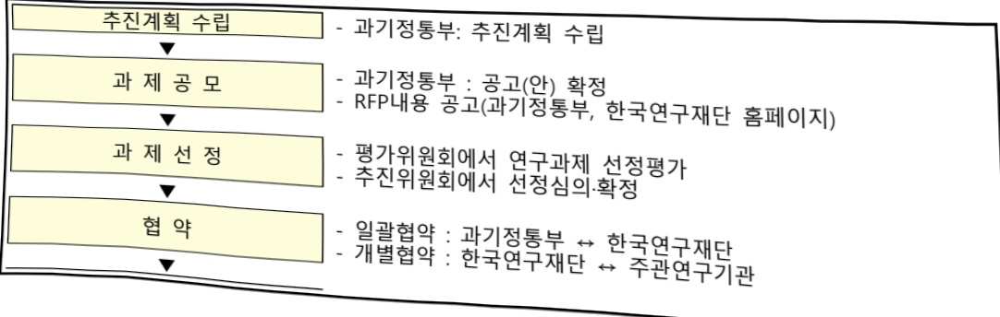
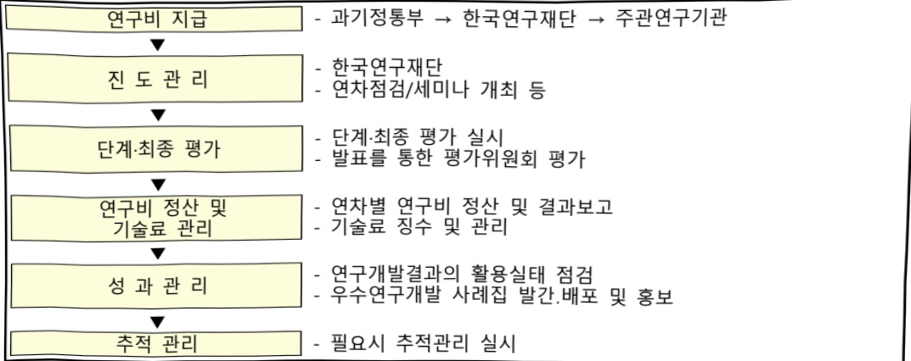

# 나노·소재기술개발(R&D)

**해당 페이지**: PDF 835 ~ 841 쪽 해당

**부처**: 과학기술정보통신부
**분야**: 과학기술
**회계유형**: 소재부품장비 경쟁력강화 특별회계
**2026 확정예산**: 330746.0 백만원
**전년대비 증감률**: 10.1%
**AI 도메인**: 제조/스마트팩토리

---

## □ 기능별(내역사업별) 예산 내역

(단위:백만원)

<table border=1 style='margin: auto; word-wrap: break-word;'><tr><td rowspan="2"></td><td colspan="5">2024</td><td colspan="5">2025</td><td rowspan="2">2026 예산</td></tr><tr><td style='text-align: center; word-wrap: break-word;'>예산액(추경)</td><td style='text-align: center; word-wrap: break-word;'>예산현액</td><td style='text-align: center; word-wrap: break-word;'>집행액</td><td style='text-align: center; word-wrap: break-word;'>이월액</td><td style='text-align: center; word-wrap: break-word;'>불용액</td><td style='text-align: center; word-wrap: break-word;'>예산액(추경)</td><td style='text-align: center; word-wrap: break-word;'>예산현액</td><td style='text-align: center; word-wrap: break-word;'>집행액</td><td style='text-align: center; word-wrap: break-word;'>이월액</td><td style='text-align: center; word-wrap: break-word;'>불용액</td></tr><tr><td style='text-align: center; word-wrap: break-word;'>○ 기능별 분류(함께)</td><td style='text-align: center; word-wrap: break-word;'>223,048</td><td style='text-align: center; word-wrap: break-word;'>223,048</td><td style='text-align: center; word-wrap: break-word;'>223,048</td><td style='text-align: center; word-wrap: break-word;'>-</td><td style='text-align: center; word-wrap: break-word;'>-</td><td style='text-align: center; word-wrap: break-word;'>300,436</td><td style='text-align: center; word-wrap: break-word;'>300,436</td><td style='text-align: center; word-wrap: break-word;'>300,436</td><td style='text-align: center; word-wrap: break-word;'>-</td><td style='text-align: center; word-wrap: break-word;'>-</td><td style='text-align: center; word-wrap: break-word;'>-</td></tr><tr><td style='text-align: center; word-wrap: break-word;'>· 글로벌 공급만첨단 소재기술개발</td><td style='text-align: center; word-wrap: break-word;'>113,151</td><td style='text-align: center; word-wrap: break-word;'>113,151</td><td style='text-align: center; word-wrap: break-word;'>113,151</td><td style='text-align: center; word-wrap: break-word;'>-</td><td style='text-align: center; word-wrap: break-word;'>-</td><td style='text-align: center; word-wrap: break-word;'>102,291</td><td style='text-align: center; word-wrap: break-word;'>102,291</td><td style='text-align: center; word-wrap: break-word;'>102,291</td><td style='text-align: center; word-wrap: break-word;'>-</td><td style='text-align: center; word-wrap: break-word;'>-</td><td style='text-align: center; word-wrap: break-word;'>-</td></tr><tr><td style='text-align: center; word-wrap: break-word;'>· 국가전략기술미래 소재기술개발</td><td style='text-align: center; word-wrap: break-word;'>33,022</td><td style='text-align: center; word-wrap: break-word;'>33,022</td><td style='text-align: center; word-wrap: break-word;'>33,022</td><td style='text-align: center; word-wrap: break-word;'>-</td><td style='text-align: center; word-wrap: break-word;'>-</td><td style='text-align: center; word-wrap: break-word;'>64,200</td><td style='text-align: center; word-wrap: break-word;'>64,200</td><td style='text-align: center; word-wrap: break-word;'>64,200</td><td style='text-align: center; word-wrap: break-word;'>-</td><td style='text-align: center; word-wrap: break-word;'>-</td><td style='text-align: center; word-wrap: break-word;'>-</td></tr><tr><td style='text-align: center; word-wrap: break-word;'>· 소재글로벌영커넥트</td><td style='text-align: center; word-wrap: break-word;'>7,875</td><td style='text-align: center; word-wrap: break-word;'>7,875</td><td style='text-align: center; word-wrap: break-word;'>7,875</td><td style='text-align: center; word-wrap: break-word;'>-</td><td style='text-align: center; word-wrap: break-word;'>-</td><td style='text-align: center; word-wrap: break-word;'>15,900</td><td style='text-align: center; word-wrap: break-word;'>15,900</td><td style='text-align: center; word-wrap: break-word;'>15,900</td><td style='text-align: center; word-wrap: break-word;'>-</td><td style='text-align: center; word-wrap: break-word;'>-</td><td style='text-align: center; word-wrap: break-word;'>-</td></tr><tr><td style='text-align: center; word-wrap: break-word;'>· 나노미래소재원천 기술개발</td><td style='text-align: center; word-wrap: break-word;'>34,000</td><td style='text-align: center; word-wrap: break-word;'>34,000</td><td style='text-align: center; word-wrap: break-word;'>34,000</td><td style='text-align: center; word-wrap: break-word;'>-</td><td style='text-align: center; word-wrap: break-word;'>-</td><td style='text-align: center; word-wrap: break-word;'>48,941</td><td style='text-align: center; word-wrap: break-word;'>48,941</td><td style='text-align: center; word-wrap: break-word;'>48,941</td><td style='text-align: center; word-wrap: break-word;'>-</td><td style='text-align: center; word-wrap: break-word;'>-</td><td style='text-align: center; word-wrap: break-word;'>-</td></tr><tr><td style='text-align: center; word-wrap: break-word;'>· 기반구축</td><td style='text-align: center; word-wrap: break-word;'>35,000</td><td style='text-align: center; word-wrap: break-word;'>35,000</td><td style='text-align: center; word-wrap: break-word;'>35,000</td><td style='text-align: center; word-wrap: break-word;'>-</td><td style='text-align: center; word-wrap: break-word;'>-</td><td style='text-align: center; word-wrap: break-word;'>69,104</td><td style='text-align: center; word-wrap: break-word;'>69,104</td><td style='text-align: center; word-wrap: break-word;'>69,104</td><td style='text-align: center; word-wrap: break-word;'>-</td><td style='text-align: center; word-wrap: break-word;'>-</td><td style='text-align: center; word-wrap: break-word;'>-</td></tr></table>

### 나.사업설명자료

## 1 ) 사업목적·내용

미래 신산업 창출 및 주력산업 고도화를 견인할 나노 및 소재 원천기술을 확보하고 관련 연구기반(데이터, Fab 등) 구축

*산학연 전문가와 도출한 '100대 첨단소재', '100대 미래소재' 원천기술 확보 등

(글로벌공급망첨단소재기술개발) 글로벌공급망 재편(對日→對세계)에 대응하여 소부장 핵심품목 중심 지원→글로벌공급망 대응 '100대 첨단소재' 중심 지원으로 개편

※ 내역명 변경을 통한 내역사업 성격 명확화(既 기술개발)

- (국가전략기술미래소재기술개발) 12대 전략기술 분야별로 우선 확보해야 하는 미래

소재를 발굴하고, 10년 뒤 초격차 목표달성과 기술난제 극복을 위한 R&D지원

※ 내역명 변경을 통한 내역사업 성격 명확화(25 국가전략기술소재개발 → '26 국가전략기술 미래소재기술개발')

- (소재글로벌영커넥트) 신진연구자*의 국가전략기술분야 미래소재 연구를 지원하여,

기술난제를 해결하고 리더십과 글로벌 네트워크 형성을 지원

* 만 40세이하 또는 박사학위 취득 후 7년 이내 연구자를 대상으로 지원

- (나노미래소재원천기술개발) 미래 나노소재 트렌드에 부합하는 창의·도전적 연구로, 기술과 산업 준비도를 고려하여 3가지 유형(선도형, 경쟁형, 도전형)으로 지원

- (기반구축) 소재 연구데이터 수집 등을 위한 소재 연구기반 조성, 반도체 등 관련

대학·공공 팸 인프라 시설·장비 및 팸 서비스 고도화 등

---

## 2 ) 사업개요

## 사업근거 및 추진경위

① 법령상 근거 조항 적시

- 과학기술기본법 제11조(국가연구개발사업의 추진)

- 기초연구진흥 및 기술개발지원에 관한 법률 제7조(기초연구진흥정책 등)

- 나노기술개발촉진법 제6조(연구개발의 추진) 및 제11조(연구시설 등의 확충)

- 소재·부품·장비산업 경쟁력강화를 위한 특별조치법(이하 소부장 특별법) 제24조

(소재부품장비 기술개발사업의 실시 등)

- 소부장특별법 제28조(소재·부품·장비 융합혁신지원단)

- 소부장특별법 제33조(신뢰성향상 기반구축사업)

- 소부장특별법 제36조(소재부품장비정보의 체계적 생산관리 등)

② 추진경위 - 사업 시작년도, 추진배경, 부처별 중점과제, 대통령 공약사항 등

- 나노기술종합발전계획수립('01. '05. '10. '16.), 제5기 나노기술종합발전계획('21. 4. 30.)

- 중합팬센터('02.7월, 사업주체 선정/'04.3월 KAIST부설/'05.3월 준공 및 서비스 개시)

- 특화팬센터('03.5월, 사업주관 선정/'05.11월 준공 및 서비스 개시)

- 나노/바이오연구개발사업으로 추진('06년)

- 나노/바이오기술개발사업을 미래기반기술개발사업으로 통합('09년)

- 미래기반기술개발사업을 나노·소재기술개발사업으로 추진('11년)

- 미래기반기술개발사업의 나노분야와 나노팸시설구축사업을 나노·소재기술개발

사업으로 통합·운영('11년)

- 나노팽시설구축사업 완료('12년)

- 미래소재디스커버리지원사업  

  内 소재융합혁신기술개발사업과 나노미래소재원천기술개발사업을 나노·소재기술개발사업으로 통합·운영('21년)

## 주요내용

① 사업규모

- 총사업비 : 해당없음

- 사업기간 : '04 ~

- 최근 5년 간 투입된 사업비(예산액기준, 추경편성한 연도에는 추경포함)

<table border=1 style='margin: auto; word-wrap: break-word;'><tr><td style='text-align: center; word-wrap: break-word;'>연도</td><td style='text-align: center; word-wrap: break-word;'>2022</td><td style='text-align: center; word-wrap: break-word;'>2023</td><td style='text-align: center; word-wrap: break-word;'>2024</td><td style='text-align: center; word-wrap: break-word;'>2025</td><td style='text-align: center; word-wrap: break-word;'>2026</td></tr><tr><td style='text-align: center; word-wrap: break-word;'>사업비</td><td style='text-align: center; word-wrap: break-word;'>236,336</td><td style='text-align: center; word-wrap: break-word;'>251,100</td><td style='text-align: center; word-wrap: break-word;'>223,048</td><td style='text-align: center; word-wrap: break-word;'>300,436</td><td style='text-align: center; word-wrap: break-word;'>330,746</td></tr></table>

-기타:해당없음

② 사업추진체계

---

-사업시행방법:출연

- 사업시행주체 : 한국연구재단

- 사업 수혜자 : 대학, 출연연, 기업 등

- 보조, 융자, 출연, 출자 등의 경우 보조·융자 등 지원 비율 및 법적근거

<table border=1 style='margin: auto; word-wrap: break-word;'><tr><td style='text-align: center; word-wrap: break-word;'>내역사업명</td><td style='text-align: center; word-wrap: break-word;'>구분</td><td style='text-align: center; word-wrap: break-word;'>피보조·피출연 등 기관명</td><td style='text-align: center; word-wrap: break-word;'>지원 금액 (2026예산)</td><td style='text-align: center; word-wrap: break-word;'>지원 비율(%)</td><td style='text-align: center; word-wrap: break-word;'>보조율 법적근거 (해당 조항)</td></tr><tr><td style='text-align: center; word-wrap: break-word;'>글로벌공급망 첨단소재 기술개발</td><td rowspan="5">출연</td><td rowspan="5">한국연구 재단</td><td style='text-align: center; word-wrap: break-word;'>81,810백만원</td><td rowspan="5">100%</td><td rowspan="5">기초연구진흥 및 기술개발지원에 관한 법률 제14조, 제15조</td></tr><tr><td style='text-align: center; word-wrap: break-word;'>국가전략기술 미래소재개발</td><td style='text-align: center; word-wrap: break-word;'>93,570백만원</td></tr><tr><td style='text-align: center; word-wrap: break-word;'>소재글로벌영 커넥트</td><td style='text-align: center; word-wrap: break-word;'>22,725백만원</td></tr><tr><td style='text-align: center; word-wrap: break-word;'>나노미래소재 원천기술개발</td><td style='text-align: center; word-wrap: break-word;'>41,484백만원</td></tr><tr><td style='text-align: center; word-wrap: break-word;'>기반구축</td><td style='text-align: center; word-wrap: break-word;'>91,157백만원</td></tr></table>

## 3 ) 2026년도 예산 산출 근거

□ 나노소재기술개발 : (2025) 300,436백만원 → (2026 예산안) 330,746백만원

① 글로벌공급망첨단소재기술개발

: (2025 본예산) 102,291 백만원 → (2026 요구) 81,810 백만원, 20,481 백만원 감액

② 국가전략기술 미래소재기술개발

:(2025 본예산) 64,200백만원 → (2026 요구) 93,570백만원, 29,370백만원 증액

③ 소재글로벌영커넥트

:(2025 본예산) 15,900백만원 → (2026 요구) 22,725백만원, 6,825백만원 증액

④ 나노미래소재 원천기술개발

:(2025 본예산) 48,941백만원 →(2026 요구) 41,484백만원, 7,457백만원 감액

⑤ 기반구축

:(2025 본예산) 69,104백만원 → (2026 요구) 91,157백만원, 22,053백만원 증액

2026년 예산

<table border=1 style='margin: auto; word-wrap: break-word;'><tr><td style='text-align: center; word-wrap: break-word;'>예산</td><td style='text-align: center; word-wrap: break-word;'>2026년 예산</td></tr><tr><td rowspan="2">330,746</td><td style='text-align: center; word-wrap: break-word;'>산출내역</td></tr><tr><td style='text-align: center; word-wrap: break-word;'>○ 연구개발연구활동비(360-05): 330,746백만원
가. 글로벌공급망첨단소재기술개발(81,810백만원)
&lt;플랫폼형&gt;
• (계속) 15개 × 1,490.4백만원 × 12/12=22,356백만원
• (신규) 4개 × 1,500백만원 × 9/12= 4,500백만원
• (신규) 6개 × 1,500백만원 × 6/12 = 4,500백만원
&lt;전략형&gt;
• (계속) 35개 × 963백만원 × 12/12= 33,715백만원
• (계속) 1개 × 1,794백만원 × 11/12= 1,645백만원
&lt;나노커넥트&gt;
• (계속) 4개 × 863백만원 × 6/12= 1,726백만원
• (계속) 13개 × 913백만원 × 12/12=11,868백만원
• (신규) 3개 × 1,000백만원 × 6/12 = 1,500백만원
나. 국가전략기술소재기술개발(93,570백만원)
&lt;국가전략기술소재&gt;
• (계속) 32개 × 1,439백만원 × 12/12=46,050백만원
• (신규) 5개 × 1,500백만원 × 9/12= 5,625백만원</td></tr></table>

---

2026년 예산

예산
산출내역

- (신규) 5개 × 1,500백만원 × 6/12 = 3,750백만원
  <소재HUB>
  - (계속) 11개 × 2,500백만원 × 12/12=27,500백만원
  - (신규) 3개 × 2,500백만원 × 9/12=5,625백만원
  - (신규) 2개 × 2,500백만원 × 6/12 = 2,500백만원
  <성과확산>
  - (계속) 2개 × 1,260백만원 × 12/12=2,520백만원

다. 소재글로벌영커넥트(22,725백만원)
  <소재글로벌영커넥트>
  - (계속) 13개 × 1,315백만원 × 12/12=17,100백만원
  - (신규) 3개 × 1,500백만원 × 9/12=3,375백만원
  - (신규) 3개 × 1,500백만원 × 6/12 = 2,250백만원

라. 나노미래소재원천기술개발(41,484백만원)
  <선도형>
  - (계속) 15개 × 944.3백만원 × 12/12=14,165백만원
  - (신규) 3개 × 1,000백만원 × 9/12=2,250백만원
  - (신규) 2개 × 1,000백만원 × 6/12 = 1,000백만원
  <경쟁형>
  - (계속) 20개 × 942백만원 × 12/12=18,838백만원
  - (신규) 3개 × 1,000백만원 × 9/12=2,250백만원
  - (신규) 2개 × 1,000백만원 × 6/12 = 1,000백만원
  <도전형>
  - (계속) 4개 × 468백만원 × 12/12=1,871백만원
  - (신규) 2개 × 55백만원 × 6/6=110백만원

마. 기반구축(91,157백만원)
  <연구기반혁신>
  - (계속) 15개 × 1,433백만원 × 12/12=21,500백만원
  - (신규) 1개 × 1,700백만원 × 9/12=1,275백만원
  - (신규) 2개 × 1,000백만원 × 6/12=1,000백만원
  - (신규) 1개 ×10,000백만원 × 6/12=5,000백만원
  <나노펠고도화>
  - (계속) 16개 × 3,512백만원 × 12/12=56,182백만원
  - (신규) 1개 × 1,600백만원 × 9/12=1,200백만원
  - (신규) 1개 × 2,000백만원 × 6/12=1,000백만원
  - (신규) 1개 × 8,000백만원 × 6/12=4,000백만원

## 4 ) 사업효과

☐ 사업영향,산출물 성과지표 등

① 2022~2026년도 성과계획서 상 성과지표 및 최근 5년간 성과 달성도

<table border=1 style='margin: auto; word-wrap: break-word;'><tr><td style='text-align: center; word-wrap: break-word;'>성과지표</td><td style='text-align: center; word-wrap: break-word;'>구분</td><td style='text-align: center; word-wrap: break-word;'>2022</td><td style='text-align: center; word-wrap: break-word;'>2023</td><td style='text-align: center; word-wrap: break-word;'>2024</td><td style='text-align: center; word-wrap: break-word;'>2025</td><td style='text-align: center; word-wrap: break-word;'>2026</td><td style='text-align: center; word-wrap: break-word;'>2026 목표치산출근거</td><td style='text-align: center; word-wrap: break-word;'>측정산식(또는 측정방법)</td><td style='text-align: center; word-wrap: break-word;'>자료수집방법(또는 자료출처)</td></tr><tr><td rowspan="3">연구성과(SCI급논문)의 질적우수성(단위: 점)</td><td style='text-align: center; word-wrap: break-word;'>목표</td><td style='text-align: center; word-wrap: break-word;'>78.44</td><td style='text-align: center; word-wrap: break-word;'>77.55</td><td style='text-align: center; word-wrap: break-word;'>78.5</td><td style='text-align: center; word-wrap: break-word;'>78.5</td><td style='text-align: center; word-wrap: break-word;'>78.5</td><td rowspan="3">전년 수준 목표치 설정</td><td rowspan="3">논문 표준화된 순위보정영향력지수(mrIF)산술평균</td><td rowspan="3">e-R&amp;D, NTIS, JCR</td></tr><tr><td style='text-align: center; word-wrap: break-word;'>실적</td><td style='text-align: center; word-wrap: break-word;'>80.92</td><td style='text-align: center; word-wrap: break-word;'>81.36</td><td style='text-align: center; word-wrap: break-word;'>86.75</td><td style='text-align: center; word-wrap: break-word;'>85.77</td><td style='text-align: center; word-wrap: break-word;'>-</td></tr><tr><td style='text-align: center; word-wrap: break-word;'>달성도</td><td style='text-align: center; word-wrap: break-word;'>103.2</td><td style='text-align: center; word-wrap: break-word;'>104.9</td><td style='text-align: center; word-wrap: break-word;'>110.5</td><td style='text-align: center; word-wrap: break-word;'>109.3</td><td style='text-align: center; word-wrap: break-word;'>-</td></tr></table>

---

② 성과지표 이외의 연도별 사업추진 경과 및 실적

<table border=1 style='margin: auto; word-wrap: break-word;'><tr><td style='text-align: center; word-wrap: break-word;'>2022</td><td style='text-align: center; word-wrap: break-word;'>소재스마트연구실 및 나노팽공정데이터 스마트서비스 지원</td></tr><tr><td style='text-align: center; word-wrap: break-word;'>2023</td><td style='text-align: center; word-wrap: break-word;'>새정부 국정과제에 따라 65대 미래선도품목 난제기술 극복 지원 확대 및 새정부 국가전략기술(양자, 우주항공, 모빌리티, 이차전지 등) 기반 소재 확보 위한 과제 확대</td></tr><tr><td style='text-align: center; word-wrap: break-word;'>2024</td><td style='text-align: center; word-wrap: break-word;'>나노·소재·기반구축 분야별 연구개발정책과 사업의 연계를 강화하여 사업의 전략성을 높이고, 성과를 제고할 수 있도록 과제 관리 강화</td></tr><tr><td style='text-align: center; word-wrap: break-word;'>2025</td><td style='text-align: center; word-wrap: break-word;'>소재 등 전략산업·첨단과학기술 분야 AI활용으로 난제해결·연구단축·소재혁신 등에 기여하고, AI를 활용한 실험 효율성 향상 지원 글로벌 공급망 이슈에 선제적으로 대응하기 위해 소재 및 나노 R&amp;D를 고도화하여, 현재 + 미래를 고려한 원천기술을 확보, 연구기반 확충 및 우수 성과의 사업화 촉진</td></tr></table>

③ 향후(2026년도 이후) 기대효과 :

- 첨단소재 R&D 발전 전략을 본격 이행하여 사업의 전략성을 높이고 질적 성과 제고

- 글로벌 공급망 리스크 이슈에 선제적으로 대응하기 위한 소재 R&D 고도화

- 범용 기반 기술이자 답테크인 나노기술의 R&D 융합 및 응용 분야 확대

- 반도체 등 첨단 전략기술·산업을 뒷받침하는 100대 첨단·미래 소재 및 나노기술

개발을 통해 글로벌 수준 원천기술 확보

## 5 ) 타당성조사 및 예비타당성조사 시행여부 및 결과 요지

□ 총사업비 500억원 이상인 경우 예비타당성조사 시행유무 및 그 결과요지 기재

※ (내역) 나노미래소재원천기술개발사업 예비타당성조사 시행

<table border=1 style='margin: auto; word-wrap: break-word;'><tr><td style='text-align: center; word-wrap: break-word;'></td><td style='text-align: center; word-wrap: break-word;'>조사기관</td><td style='text-align: center; word-wrap: break-word;'>조사기간</td><td style='text-align: center; word-wrap: break-word;'>조사결과 및 진행상황</td></tr><tr><td style='text-align: center; word-wrap: break-word;'>예비타당성 조사</td><td style='text-align: center; word-wrap: break-word;'>KISTEP</td><td style='text-align: center; word-wrap: break-word;'>&#x27;18.11.~ &#x27;19.6.</td><td style='text-align: center; word-wrap: break-word;'>○ (결과) B/C 0.78, AHP 0.772○ (특이사항) 과제유형 중 멤버십형을 제외</td></tr></table>

## 6 ) 총사업비 대상사업 여부 및 내역 : 해당없음

## 7 ) 사업 집행절차

---

## 8 ) 각종 평가

기술장벽 강화에 대응하여 나노·소재에 대한 차세대 원천특허 확보를 위한 특허장벽 회피 및 권리성 확보 필요(상위평가/‘24.6월)

0 대폭 확대된 예산 및 과제에 따른 우수연구자 선정 및 많은 과제의 효과적 관리 필요(상위평가/‘24.6월)

<조치사항>

o 과제별 IP-R&D 또는 특허동향조사 실시

- 특허청(한국특허전략개발원)과 연계하여 과제 유형을 고려한 1:1 맞춤형 특허분쟁 예방 및 핵심특허 확보 전략 수립(IP-R&D), 특허동향 조사·분석 지원 예정

o 우수 연구과제에 대한 갱신형 R&D 지원

- 탁월성·원천성이 인정된 우수연구성과는 신규과제 RFP로 후속연계 예정

### 다.최근 4년간 결산내역

## 1 ) 결산표

☐ 부처 결산내역

(단위: 백만원, %)

<table border=1 style='margin: auto; word-wrap: break-word;'><tr><td rowspan="2">연도</td><td colspan="3">예산액</td><td rowspan="2">예산현액(A)</td><td rowspan="2">집행액(B)</td><td rowspan="2">집행률(B/A)</td><td rowspan="2">다음연도이월액</td><td rowspan="2">불용액</td></tr><tr><td style='text-align: center; word-wrap: break-word;'>본예산</td><td style='text-align: center; word-wrap: break-word;'>추경증감액</td><td style='text-align: center; word-wrap: break-word;'>추경</td></tr><tr><td style='text-align: center; word-wrap: break-word;'>2022</td><td style='text-align: center; word-wrap: break-word;'>236,336</td><td style='text-align: center; word-wrap: break-word;'>-</td><td style='text-align: center; word-wrap: break-word;'>236,336</td><td style='text-align: center; word-wrap: break-word;'>236,336</td><td style='text-align: center; word-wrap: break-word;'>236,336</td><td style='text-align: center; word-wrap: break-word;'>100</td><td style='text-align: center; word-wrap: break-word;'>-</td><td style='text-align: center; word-wrap: break-word;'>-</td></tr><tr><td style='text-align: center; word-wrap: break-word;'>2023</td><td style='text-align: center; word-wrap: break-word;'>251,100</td><td style='text-align: center; word-wrap: break-word;'>-</td><td style='text-align: center; word-wrap: break-word;'>251,100</td><td style='text-align: center; word-wrap: break-word;'>251,100</td><td style='text-align: center; word-wrap: break-word;'>251,100</td><td style='text-align: center; word-wrap: break-word;'>100</td><td style='text-align: center; word-wrap: break-word;'>-</td><td style='text-align: center; word-wrap: break-word;'>-</td></tr><tr><td style='text-align: center; word-wrap: break-word;'>2024</td><td style='text-align: center; word-wrap: break-word;'>223,048</td><td style='text-align: center; word-wrap: break-word;'>-</td><td style='text-align: center; word-wrap: break-word;'>223,048</td><td style='text-align: center; word-wrap: break-word;'>223,048</td><td style='text-align: center; word-wrap: break-word;'>223,048</td><td style='text-align: center; word-wrap: break-word;'>100</td><td style='text-align: center; word-wrap: break-word;'>-</td><td style='text-align: center; word-wrap: break-word;'>-</td></tr><tr><td style='text-align: center; word-wrap: break-word;'>2025</td><td style='text-align: center; word-wrap: break-word;'>300,436</td><td style='text-align: center; word-wrap: break-word;'>-</td><td style='text-align: center; word-wrap: break-word;'>300,436</td><td style='text-align: center; word-wrap: break-word;'>300,436</td><td style='text-align: center; word-wrap: break-word;'>300,436</td><td style='text-align: center; word-wrap: break-word;'>100</td><td style='text-align: center; word-wrap: break-word;'>-</td><td style='text-align: center; word-wrap: break-word;'>-</td></tr></table>

## 2 ) 주요 결산사항 : 해당없음

---

<table border=1 style='margin: auto; word-wrap: break-word;'><tr><td style='text-align: center; word-wrap: break-word;'>사 업 명</td></tr><tr><td style='text-align: center; word-wrap: break-word;'>(200) 대구경북과학기술원 시설 지원(R&amp;D) (2231-425)</td></tr></table>

□ 사업 코드 정보

<table border=1 style='margin: auto; word-wrap: break-word;'><tr><td style='text-align: center; word-wrap: break-word;'>구분</td><td style='text-align: center; word-wrap: break-word;'>회계</td><td style='text-align: center; word-wrap: break-word;'>소관</td><td style='text-align: center; word-wrap: break-word;'>실국(기관)</td><td style='text-align: center; word-wrap: break-word;'>계정</td><td style='text-align: center; word-wrap: break-word;'>분야</td><td style='text-align: center; word-wrap: break-word;'>부문</td></tr><tr><td style='text-align: center; word-wrap: break-word;'>코드</td><td rowspan="2">일반회계</td><td rowspan="2">과학기술정보통신부</td><td rowspan="2">미래인재정책국</td><td rowspan="2">0</td><td style='text-align: center; word-wrap: break-word;'>150</td><td style='text-align: center; word-wrap: break-word;'>152</td></tr><tr><td style='text-align: center; word-wrap: break-word;'>명칭</td><td style='text-align: center; word-wrap: break-word;'>과학기술</td><td style='text-align: center; word-wrap: break-word;'>과학기술연구지원</td></tr></table>

<table border=1 style='margin: auto; word-wrap: break-word;'><tr><td style='text-align: center; word-wrap: break-word;'>구분</td><td style='text-align: center; word-wrap: break-word;'>프로그램</td><td style='text-align: center; word-wrap: break-word;'>단위사업</td><td style='text-align: center; word-wrap: break-word;'>세부사업</td></tr><tr><td style='text-align: center; word-wrap: break-word;'>코드</td><td style='text-align: center; word-wrap: break-word;'>2200</td><td style='text-align: center; word-wrap: break-word;'>2231</td><td style='text-align: center; word-wrap: break-word;'>425</td></tr><tr><td style='text-align: center; word-wrap: break-word;'>명칭</td><td style='text-align: center; word-wrap: break-word;'>출연연구기관지원</td><td style='text-align: center; word-wrap: break-word;'>직할출연연구기관지원</td><td style='text-align: center; word-wrap: break-word;'>대구경북과학기술원 시설 지원(R&amp;D)</td></tr></table>

☐ 사업 성격

<table border=1 style='margin: auto; word-wrap: break-word;'><tr><td rowspan="2">신규</td><td rowspan="2">계속</td><td rowspan="2">완료</td><td rowspan="2">예비타당성 실시여부</td><td rowspan="2">총사업비 관리대상</td><td rowspan="2">총액계상 예산사업</td><td style='text-align: center; word-wrap: break-word;'>사업소관 변경정보</td></tr><tr><td style='text-align: center; word-wrap: break-word;'>2025예산 시 소관</td></tr><tr><td style='text-align: center; word-wrap: break-word;'></td><td style='text-align: center; word-wrap: break-word;'>○</td><td style='text-align: center; word-wrap: break-word;'></td><td style='text-align: center; word-wrap: break-word;'></td><td style='text-align: center; word-wrap: break-word;'></td><td style='text-align: center; word-wrap: break-word;'></td><td style='text-align: center; word-wrap: break-word;'></td></tr></table>

□ 사업 지원 형태 및 지원을

<table border=1 style='margin: auto; word-wrap: break-word;'><tr><td style='text-align: center; word-wrap: break-word;'>직접</td><td style='text-align: center; word-wrap: break-word;'>출자</td><td style='text-align: center; word-wrap: break-word;'>출연</td><td style='text-align: center; word-wrap: break-word;'>보조</td><td style='text-align: center; word-wrap: break-word;'>융자</td><td style='text-align: center; word-wrap: break-word;'>국고보조율(%)</td><td style='text-align: center; word-wrap: break-word;'>융자율(%)</td></tr><tr><td style='text-align: center; word-wrap: break-word;'></td><td style='text-align: center; word-wrap: break-word;'></td><td style='text-align: center; word-wrap: break-word;'>○</td><td style='text-align: center; word-wrap: break-word;'></td><td style='text-align: center; word-wrap: break-word;'></td><td style='text-align: center; word-wrap: break-word;'></td><td style='text-align: center; word-wrap: break-word;'></td></tr></table>

사업 소관부처 및 시행주체

<table border=1 style='margin: auto; word-wrap: break-word;'><tr><td style='text-align: center; word-wrap: break-word;'>사업명</td><td colspan="2">구분</td></tr><tr><td rowspan="2">대구경북과학기술원시설 지원(R&amp;D)</td><td style='text-align: center; word-wrap: break-word;'>소관부처</td><td style='text-align: center; word-wrap: break-word;'>미래인재정책국미래인재양성과</td></tr><tr><td style='text-align: center; word-wrap: break-word;'>사업시행주체</td><td style='text-align: center; word-wrap: break-word;'>대구경북과학기술원</td></tr></table>

---

### 원본 PDF 크롭 이미지

