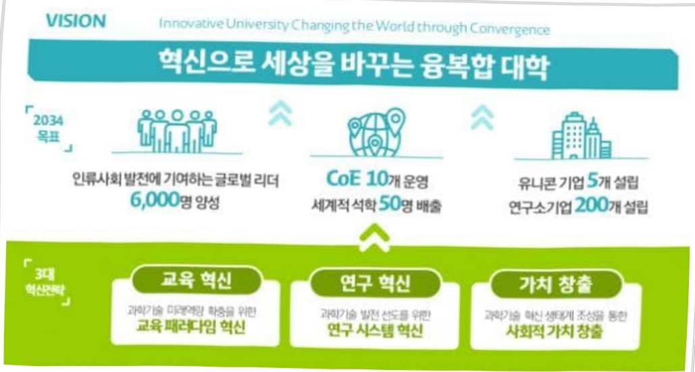

# 대구경북과학기술원 시설 지원(R&D)

**해당 페이지**: PDF 842 ~ 848 쪽 해당

**부처**: 과학기술정보통신부
**분야**: 과학기술
**회계유형**: 일반회계
**2026 확정예산**: 11707.0 백만원
**전년대비 증감률**: -17.3%
**AI 도메인**: 디지털전환(AX)

---

<table border=1 style='margin: auto; word-wrap: break-word;'><tr><td style='text-align: center; word-wrap: break-word;'>사 업 명</td></tr><tr><td style='text-align: center; word-wrap: break-word;'>(200) 대구경북과학기술원 시설 지원(R&amp;D) (2231-425)</td></tr></table>

□ 사업 코드 정보

<table border=1 style='margin: auto; word-wrap: break-word;'><tr><td style='text-align: center; word-wrap: break-word;'>구분</td><td style='text-align: center; word-wrap: break-word;'>회계</td><td style='text-align: center; word-wrap: break-word;'>소관</td><td style='text-align: center; word-wrap: break-word;'>실국(기관)</td><td style='text-align: center; word-wrap: break-word;'>계정</td><td style='text-align: center; word-wrap: break-word;'>분야</td><td style='text-align: center; word-wrap: break-word;'>부문</td></tr><tr><td style='text-align: center; word-wrap: break-word;'>코드</td><td rowspan="2">일반회계</td><td rowspan="2">과학기술정보통신부</td><td rowspan="2">미래인재정책국</td><td rowspan="2">0</td><td style='text-align: center; word-wrap: break-word;'>150</td><td style='text-align: center; word-wrap: break-word;'>152</td></tr><tr><td style='text-align: center; word-wrap: break-word;'>명칭</td><td style='text-align: center; word-wrap: break-word;'>과학기술</td><td style='text-align: center; word-wrap: break-word;'>과학기술연구지원</td></tr></table>

<table border=1 style='margin: auto; word-wrap: break-word;'><tr><td style='text-align: center; word-wrap: break-word;'>구분</td><td style='text-align: center; word-wrap: break-word;'>프로그램</td><td style='text-align: center; word-wrap: break-word;'>단위사업</td><td style='text-align: center; word-wrap: break-word;'>세부사업</td></tr><tr><td style='text-align: center; word-wrap: break-word;'>코드</td><td style='text-align: center; word-wrap: break-word;'>2200</td><td style='text-align: center; word-wrap: break-word;'>2231</td><td style='text-align: center; word-wrap: break-word;'>425</td></tr><tr><td style='text-align: center; word-wrap: break-word;'>명칭</td><td style='text-align: center; word-wrap: break-word;'>출연연구기관지원</td><td style='text-align: center; word-wrap: break-word;'>직할출연연구기관지원</td><td style='text-align: center; word-wrap: break-word;'>대구경북과학기술원 시설 지원(R&amp;D)</td></tr></table>

☐ 사업 성격

<table border=1 style='margin: auto; word-wrap: break-word;'><tr><td rowspan="2">신규</td><td rowspan="2">계속</td><td rowspan="2">완료</td><td rowspan="2">예비타당성 실시여부</td><td rowspan="2">총사업비 관리대상</td><td rowspan="2">총액계상 예산사업</td><td style='text-align: center; word-wrap: break-word;'>사업소관 변경정보</td></tr><tr><td style='text-align: center; word-wrap: break-word;'>2025예산 시 소관</td></tr><tr><td style='text-align: center; word-wrap: break-word;'></td><td style='text-align: center; word-wrap: break-word;'>○</td><td style='text-align: center; word-wrap: break-word;'></td><td style='text-align: center; word-wrap: break-word;'></td><td style='text-align: center; word-wrap: break-word;'></td><td style='text-align: center; word-wrap: break-word;'></td><td style='text-align: center; word-wrap: break-word;'></td></tr></table>

□ 사업 지원 형태 및 지원을

<table border=1 style='margin: auto; word-wrap: break-word;'><tr><td style='text-align: center; word-wrap: break-word;'>직접</td><td style='text-align: center; word-wrap: break-word;'>출자</td><td style='text-align: center; word-wrap: break-word;'>출연</td><td style='text-align: center; word-wrap: break-word;'>보조</td><td style='text-align: center; word-wrap: break-word;'>융자</td><td style='text-align: center; word-wrap: break-word;'>국고보조율(%)</td><td style='text-align: center; word-wrap: break-word;'>융자율(%)</td></tr><tr><td style='text-align: center; word-wrap: break-word;'></td><td style='text-align: center; word-wrap: break-word;'></td><td style='text-align: center; word-wrap: break-word;'>○</td><td style='text-align: center; word-wrap: break-word;'></td><td style='text-align: center; word-wrap: break-word;'></td><td style='text-align: center; word-wrap: break-word;'></td><td style='text-align: center; word-wrap: break-word;'></td></tr></table>

사업 소관부처 및 시행주체

<table border=1 style='margin: auto; word-wrap: break-word;'><tr><td style='text-align: center; word-wrap: break-word;'>사업명</td><td colspan="2">구분</td></tr><tr><td rowspan="2">대구경북과학기술원시설 지원(R&amp;D)</td><td style='text-align: center; word-wrap: break-word;'>소관부처</td><td style='text-align: center; word-wrap: break-word;'>미래인재정책국미래인재양성과</td></tr><tr><td style='text-align: center; word-wrap: break-word;'>사업시행주체</td><td style='text-align: center; word-wrap: break-word;'>대구경북과학기술원</td></tr></table>

---

### 가.예산 총괄표

(단위: 백만원, %)

<table border=1 style='margin: auto; word-wrap: break-word;'><tr><td rowspan="2">사업명</td><td rowspan="2">2024년 결산</td><td colspan="2">2025년 예산</td><td colspan="2">2026년 예산</td><td rowspan="2">중감(B-A)</td><td rowspan="2">(B-A)/A</td></tr><tr><td style='text-align: center; word-wrap: break-word;'>본예산</td><td style='text-align: center; word-wrap: break-word;'>추경*(A)</td><td style='text-align: center; word-wrap: break-word;'>요구안</td><td style='text-align: center; word-wrap: break-word;'>본예산(B)</td></tr><tr><td style='text-align: center; word-wrap: break-word;'>대구경북과학기술원시설 지원(R&amp;D)</td><td style='text-align: center; word-wrap: break-word;'>16,101</td><td style='text-align: center; word-wrap: break-word;'>14,150</td><td style='text-align: center; word-wrap: break-word;'>14,150</td><td style='text-align: center; word-wrap: break-word;'>10,742</td><td style='text-align: center; word-wrap: break-word;'>11,707</td><td style='text-align: center; word-wrap: break-word;'>△2,443</td><td style='text-align: center; word-wrap: break-word;'>△17.3</td></tr></table>

* 추경: 추경증감액을 포함한 최종 예산액을 기재

## □ 기능별(내역사업별) 예산 내역

(단위:백만원)

<table border=1 style='margin: auto; word-wrap: break-word;'><tr><td rowspan="2"></td><td colspan="5">2024</td><td colspan="3">2025</td><td colspan="2"></td><td rowspan="2">2026예산</td></tr><tr><td style='text-align: center; word-wrap: break-word;'>예산액(추경)</td><td style='text-align: center; word-wrap: break-word;'>예산현액</td><td style='text-align: center; word-wrap: break-word;'>집행액</td><td style='text-align: center; word-wrap: break-word;'>이월액</td><td style='text-align: center; word-wrap: break-word;'>불용액</td><td style='text-align: center; word-wrap: break-word;'>예산액(추경)</td><td style='text-align: center; word-wrap: break-word;'>예산현액</td><td style='text-align: center; word-wrap: break-word;'>집행액</td><td style='text-align: center; word-wrap: break-word;'>이월액</td><td style='text-align: center; word-wrap: break-word;'>불용액</td></tr><tr><td style='text-align: center; word-wrap: break-word;'>○ 기능별 분류(합계)</td><td style='text-align: center; word-wrap: break-word;'>16,101</td><td style='text-align: center; word-wrap: break-word;'>16,101</td><td style='text-align: center; word-wrap: break-word;'>16,101</td><td style='text-align: center; word-wrap: break-word;'>-</td><td style='text-align: center; word-wrap: break-word;'>-</td><td style='text-align: center; word-wrap: break-word;'>14,150</td><td style='text-align: center; word-wrap: break-word;'>14,150</td><td style='text-align: center; word-wrap: break-word;'>14,150</td><td style='text-align: center; word-wrap: break-word;'>-</td><td style='text-align: center; word-wrap: break-word;'>-</td><td style='text-align: center; word-wrap: break-word;'>11,707</td></tr><tr><td style='text-align: center; word-wrap: break-word;'>☐ 시설비</td><td style='text-align: center; word-wrap: break-word;'>16,101</td><td style='text-align: center; word-wrap: break-word;'>16,101</td><td style='text-align: center; word-wrap: break-word;'>16,101</td><td style='text-align: center; word-wrap: break-word;'>-</td><td style='text-align: center; word-wrap: break-word;'>-</td><td style='text-align: center; word-wrap: break-word;'>14,150</td><td style='text-align: center; word-wrap: break-word;'>14,150</td><td style='text-align: center; word-wrap: break-word;'>14,150</td><td style='text-align: center; word-wrap: break-word;'>-</td><td style='text-align: center; word-wrap: break-word;'>-</td><td style='text-align: center; word-wrap: break-word;'>11,707</td></tr><tr><td style='text-align: center; word-wrap: break-word;'>• SafeCampus운영</td><td style='text-align: center; word-wrap: break-word;'>800</td><td style='text-align: center; word-wrap: break-word;'>800</td><td style='text-align: center; word-wrap: break-word;'>800</td><td style='text-align: center; word-wrap: break-word;'>-</td><td style='text-align: center; word-wrap: break-word;'>-</td><td style='text-align: center; word-wrap: break-word;'>800</td><td style='text-align: center; word-wrap: break-word;'>800</td><td style='text-align: center; word-wrap: break-word;'>800</td><td style='text-align: center; word-wrap: break-word;'>-</td><td style='text-align: center; word-wrap: break-word;'>-</td><td style='text-align: center; word-wrap: break-word;'>800</td></tr><tr><td style='text-align: center; word-wrap: break-word;'>• 시설보수사업</td><td style='text-align: center; word-wrap: break-word;'>800</td><td style='text-align: center; word-wrap: break-word;'>800</td><td style='text-align: center; word-wrap: break-word;'>800</td><td style='text-align: center; word-wrap: break-word;'>-</td><td style='text-align: center; word-wrap: break-word;'>-</td><td style='text-align: center; word-wrap: break-word;'>800</td><td style='text-align: center; word-wrap: break-word;'>800</td><td style='text-align: center; word-wrap: break-word;'>800</td><td style='text-align: center; word-wrap: break-word;'>-</td><td style='text-align: center; word-wrap: break-word;'>-</td><td style='text-align: center; word-wrap: break-word;'>800</td></tr><tr><td style='text-align: center; word-wrap: break-word;'>• 산학연D-센서실험시설증축사업</td><td style='text-align: center; word-wrap: break-word;'>14,501</td><td style='text-align: center; word-wrap: break-word;'>14,501</td><td style='text-align: center; word-wrap: break-word;'>16,433</td><td style='text-align: center; word-wrap: break-word;'>-</td><td style='text-align: center; word-wrap: break-word;'>-</td><td style='text-align: center; word-wrap: break-word;'>11,285</td><td style='text-align: center; word-wrap: break-word;'>11,285</td><td style='text-align: center; word-wrap: break-word;'>11,285</td><td style='text-align: center; word-wrap: break-word;'>-</td><td style='text-align: center; word-wrap: break-word;'>-</td><td style='text-align: center; word-wrap: break-word;'>1,633</td></tr><tr><td style='text-align: center; word-wrap: break-word;'>• 도심형캠퍼스구축사업</td><td style='text-align: center; word-wrap: break-word;'>-</td><td style='text-align: center; word-wrap: break-word;'>-</td><td style='text-align: center; word-wrap: break-word;'>-</td><td style='text-align: center; word-wrap: break-word;'>-</td><td style='text-align: center; word-wrap: break-word;'>-</td><td style='text-align: center; word-wrap: break-word;'>665</td><td style='text-align: center; word-wrap: break-word;'>665</td><td style='text-align: center; word-wrap: break-word;'>665</td><td style='text-align: center; word-wrap: break-word;'>-</td><td style='text-align: center; word-wrap: break-word;'>-</td><td style='text-align: center; word-wrap: break-word;'>3,435</td></tr><tr><td style='text-align: center; word-wrap: break-word;'>• 차세대대학정보시스템구축ISP</td><td style='text-align: center; word-wrap: break-word;'>-</td><td style='text-align: center; word-wrap: break-word;'>-</td><td style='text-align: center; word-wrap: break-word;'>-</td><td style='text-align: center; word-wrap: break-word;'>-</td><td style='text-align: center; word-wrap: break-word;'>-</td><td style='text-align: center; word-wrap: break-word;'>600</td><td style='text-align: center; word-wrap: break-word;'>600</td><td style='text-align: center; word-wrap: break-word;'>600</td><td style='text-align: center; word-wrap: break-word;'>-</td><td style='text-align: center; word-wrap: break-word;'>-</td><td style='text-align: center; word-wrap: break-word;'>-</td></tr><tr><td rowspan="2">• 차세대대학정보시스템구축산업AX혁신허브구축사업</td><td style='text-align: center; word-wrap: break-word;'>-</td><td style='text-align: center; word-wrap: break-word;'>-</td><td style='text-align: center; word-wrap: break-word;'>-</td><td style='text-align: center; word-wrap: break-word;'>-</td><td style='text-align: center; word-wrap: break-word;'>-</td><td style='text-align: center; word-wrap: break-word;'>-</td><td style='text-align: center; word-wrap: break-word;'>-</td><td style='text-align: center; word-wrap: break-word;'>-</td><td style='text-align: center; word-wrap: break-word;'>-</td><td style='text-align: center; word-wrap: break-word;'>-</td><td style='text-align: center; word-wrap: break-word;'>4,074</td></tr><tr><td style='text-align: center; word-wrap: break-word;'>-</td><td style='text-align: center; word-wrap: break-word;'>-</td><td style='text-align: center; word-wrap: break-word;'>-</td><td style='text-align: center; word-wrap: break-word;'>-</td><td style='text-align: center; word-wrap: break-word;'>-</td><td style='text-align: center; word-wrap: break-word;'>-</td><td style='text-align: center; word-wrap: break-word;'>-</td><td style='text-align: center; word-wrap: break-word;'>-</td><td style='text-align: center; word-wrap: break-word;'>-</td><td style='text-align: center; word-wrap: break-word;'>-</td><td style='text-align: center; word-wrap: break-word;'>965</td></tr></table>

### 나. 사업설명자료

## 1 ) 사업목적·내용

- (대구경북과학기술원 시설지원(R&D)) 첨단과학기술의 혁신을 선도할 고급과학기술인재를 양성하고, 지역산업의 기술적 발전 및 경쟁력 향상을 위하여 지식기반사업 및 첨단과학 분야를 연구함으로써 지역군형발전과 국가과학기술발전에 이바지

- (시설비) : 교육·연구시설의 안정적 운영을 위한 유지보수 및 건축비

---

## 2 ) 사업개요

□ 사업근거 및 추진경위

① 법령상 근거 및 조항 적시 : 대구경북과학기술원법(법률 제18731호) 제8조

② 추진경위

- 2003. 12. 「대구경북과학기술연구원법」 공포(법률 제6996호)

- 2004. 09. 연구원 설립등기

- 2008. 06. 대구경북과학기술원법 공포(법률 제9108호 - 교육기능 추가)

- 2010. 12. 연구동 준공식

- 2011. 02. 초대총장 신성철 박사 취임

- 2011. 03. 제1회 석.박사 학위과정 입학식 개최

- 2011. 10. 부설기관 “한국뇌연구원” 설립

- 2013. 03. 제1회 학위수여식(첫 석사학위 졸업생 배출)

- 2014. 03. 제1회 학부생 입학식

- 2014. 06. 학사캠퍼스 준공식

- 2015. 07. 2015년도 미래부 기관평가 결과 ‘우수’

- 2015. 12. 2015년도 기관평가 국무총리 단체표창(2년

- 2018. 02. 제1회 융복합대학 기초학부 학위수여식(첫 학사학위 졸업생 96명 배출)

- 2018. 05. DGIST Innovation 2034 혁신선포

- 2018. 06. R&R 재정립 방안 발표 및 협약 체결

- 2020. 04. 발명장려유공 단체부분 ‘대통령 표창’

- 2019. 04. 제4대 충장 국양 박사 취임

- 2022. 12. 기술출자(연구소)기업 누적 21개사 설립

- 2023. 12. 제5대 총장 이건우 박사 취임

## □ 주요내용

① 사업규모

- 총사업비 : 해당없음

- 사업기간 : 2024 ~ 계속

- 최근 5년 간 투입된 사업비(예산액기준, 추경편성한 연도에는 추경포함)

<table border=1 style='margin: auto; word-wrap: break-word;'><tr><td style='text-align: center; word-wrap: break-word;'>$ \underline{\text{연도}} $</td><td style='text-align: center; word-wrap: break-word;'>2022</td><td style='text-align: center; word-wrap: break-word;'>2023</td><td style='text-align: center; word-wrap: break-word;'>2024</td><td style='text-align: center; word-wrap: break-word;'>2025</td><td style='text-align: center; word-wrap: break-word;'>2026</td></tr><tr><td style='text-align: center; word-wrap: break-word;'>$ \underline{\text{사업비}} $</td><td style='text-align: center; word-wrap: break-word;'>-</td><td style='text-align: center; word-wrap: break-word;'>-</td><td style='text-align: center; word-wrap: break-word;'>16,101</td><td style='text-align: center; word-wrap: break-word;'>14,150</td><td style='text-align: center; word-wrap: break-word;'>11,707</td></tr></table>

- 기타 : 해당사항 없음

---

## ② 사업추진체계

- 사업시행방법 : 출연

- 사업시행주체 : 대구경북과학기술원

- 사업 수혜자 : 대학, 연구기관, 산업체 등

- 보조, 융자, 출연, 출자 등의 경우 보조 · 융자 등 지원 비율 및 법적근거

<table border=1 style='margin: auto; word-wrap: break-word;'><tr><td style='text-align: center; word-wrap: break-word;'>내역사업명</td><td style='text-align: center; word-wrap: break-word;'>구분</td><td style='text-align: center; word-wrap: break-word;'>피보조·피출연 등 기관명</td><td style='text-align: center; word-wrap: break-word;'>지원 금액 (2026예산안)</td><td style='text-align: center; word-wrap: break-word;'>지원 비율(%)</td><td style='text-align: center; word-wrap: break-word;'>보조율 법적근거 (해당 조항)</td></tr><tr><td style='text-align: center; word-wrap: break-word;'>대구경북 과학기술원 시설 지원(R&amp;D)</td><td style='text-align: center; word-wrap: break-word;'>출연</td><td style='text-align: center; word-wrap: break-word;'>대구경북 과학기술원</td><td style='text-align: center; word-wrap: break-word;'>11,707</td><td style='text-align: center; word-wrap: break-word;'>100.0</td><td style='text-align: center; word-wrap: break-word;'>대구경북과학기술원 법 제8조</td></tr></table>

## 3 ) 2026년도 예산 산출 근거

## 대구경북과학기술원 시설 지원(2026년):총 11,707백만원

○ 시설비 : 11,707백만원

가.SafeCampus운영(800백만원)

·연구종사자가 연구활동에 매진할 수 있도록 체계적 안전관리 체계를 구축하여 연구인력의 생명과 물적재산 보호 800백만원

나. 시설보수사업 (800백만원)

· 건축물, 시설물의 노후화에 따른 시설 교체 및 환경 개선 800백만원

다.산학연D-센서실험시설증축사업(1,633백만원)

- 반도체 융합 센서 제작을 위한 기업 전용 실험시설 확충을 통해 반도체 센서 스타트업 및 기술사업화 지원, 신산업 창출 및 지역혁신에 기여하기 위한 연차소요 1,633백만원

라. 도심형캠퍼스구축사업 (3,435백만원)

AI, SW 교육 및 인재 양성을 위한 교육 캠퍼스 및 연구 캠퍼스 등 "DGIST 글로벌 캠퍼스" 조성을 위한 도심형 캠퍼스 구축을 위한 신규사업 3,435백만원

마. 차세대대학정보시스템구축 (4,074백만원)

· AI·클라우드 기반 차세대 통합정보시스템, 미래형 교육·연구 인프라 구축 4,074백만원

바. 산업AX혁신허브구축 (965백만원)

· 기업의 AX(AI Transformation) 전환 지원을 통해 지역 및 국가 산업의 AX 활성화를 선도하기 위한 산업AX혁신허브구축 965백만원

## 4 ) 사업효과

□ 사업영향, 산출물 성과지표 등

① 2022~2026년도 성과계획서 상 성과지표 및 최근 5년간 성과 달성도

<table border=1 style='margin: auto; word-wrap: break-word;'><tr><td style='text-align: center; word-wrap: break-word;'>성과지표</td><td style='text-align: center; word-wrap: break-word;'>구분</td><td style='text-align: center; word-wrap: break-word;'>2022</td><td style='text-align: center; word-wrap: break-word;'>2023</td><td style='text-align: center; word-wrap: break-word;'>2024</td><td style='text-align: center; word-wrap: break-word;'>2025</td><td style='text-align: center; word-wrap: break-word;'>2026</td><td style='text-align: center; word-wrap: break-word;'>2026 목표치산출근거</td><td style='text-align: center; word-wrap: break-word;'>측정산식(또는 측정방법)</td><td style='text-align: center; word-wrap: break-word;'>자료수집방법(또는 자료출처)</td></tr><tr><td rowspan="3">논문의 평균피인용 횟수(건)</td><td style='text-align: center; word-wrap: break-word;'>목표</td><td style='text-align: center; word-wrap: break-word;'>-</td><td style='text-align: center; word-wrap: break-word;'>-</td><td style='text-align: center; word-wrap: break-word;'>5.5</td><td style='text-align: center; word-wrap: break-word;'>5.7</td><td style='text-align: center; word-wrap: break-word;'>6.0</td><td rowspan="3">전년도 목표치대비 5% 상향설정</td><td rowspan="3">&#x27;23~&#x27;24년 발표한 논문의 &#x27;24~&#x27;25년 피인용 횟수의함) / &#x27;23~&#x27;24년 발표한 논문수의함</td><td rowspan="3">발표논문편수 및 피인용횟수 집계</td></tr><tr><td style='text-align: center; word-wrap: break-word;'>실적</td><td style='text-align: center; word-wrap: break-word;'>-</td><td style='text-align: center; word-wrap: break-word;'>-</td><td style='text-align: center; word-wrap: break-word;'>12.2</td><td style='text-align: center; word-wrap: break-word;'>-</td><td style='text-align: center; word-wrap: break-word;'>-</td></tr><tr><td style='text-align: center; word-wrap: break-word;'>달성도</td><td style='text-align: center; word-wrap: break-word;'>-</td><td style='text-align: center; word-wrap: break-word;'>-</td><td style='text-align: center; word-wrap: break-word;'>222</td><td style='text-align: center; word-wrap: break-word;'>-</td><td style='text-align: center; word-wrap: break-word;'>-</td></tr></table>

---

② 성과지표 이외의 연도별 사업추진 경과 및 실적

<table border=1 style='margin: auto; word-wrap: break-word;'><tr><td style='text-align: center; word-wrap: break-word;'>2024</td><td style='text-align: center; word-wrap: break-word;'>· 2024 QS 세계 대학평가 교원 1인당 피인용도 세계 7위, 종합 세계기준 307위, 국내기준 9위 · 2024 THE WUR 첫 진입 세계기준 351-400위 · THE 신흥대학평가 2024: 세계 33위(국내 3위, 신규 진입 대학 중 1위)</td></tr><tr><td style='text-align: center; word-wrap: break-word;'>2025</td><td style='text-align: center; word-wrap: break-word;'>· 2025 QS 세계 대학평가 교원 1인당 피인용도 세계 4위, 국내 1위 · 2025 QS 세계 대학평가 세계 370위, 국내 9위</td></tr></table>

③ 향후(2026년도 이후) 기대효과 :

- 융합형 인재양성을 통해 4차 산업혁명 시대 이공계 교육혁신을 선도하고, 융복합 연구혁신으로 국민 삶의 질 향상과 대구경북권 신산업 가치창출에 기여하기 위한 기관 R&R 재정립

- 사회가치 창출형 융복합 인재양성을 위한 '교육혁신' 선도

·(DGIST 융복합교육 2.0) 4차 산업혁명 시대 대비 DGIST만의 차별화된 융복합 교육 체계를 내실화하고, Computer Science 분야 교육 강화

(글로벌 리더양성 교육강화) 글로벌 선도대학으로서의 기관도약과 리더 양성을 위해 학생 맞춤형 과정지원프로그램(SCCSP)을 강화하고, 연구자로서의 석박사과 정생에 대한 연구력 강화 시행 및 학생연구원의 권익보호 장치마련

- 창의·도전을 중요시하는 융복합 '연구혁신' 주도

(DGIST CoE 운영) 국민체감형 이슈, 과학기술적 난제 해결 등 다학제간 융합 연구를 통해 과기원 혁신 융합연구모델인 개방형 융합연구단 운영

---

- 지역 신산업 '가치창출' 및 핵심연구 견인

(지역 전략산업 분야 국제경쟁력 강화) 대구경북 전략산업(자율주행차, 무인 비행장치 등) 및 관련 기업의 국제경쟁력 강화를 위해 지역기업과 글로벌 기업을 연계한 공동 연구개발 촉진

(첨단의료/바이오산업 지원) 대구경북지역 바이오의료 산업 혁신을 견인할 차세대

바이오 융합소자 기술개발

(청정에너지산업 육성 지원) 대구의 청정에너지(스마트분산형에너지) 및 경북의

에너지소재부품 산업을 지원하기 위한 핵심요소기술 개발 및 실용화 연구 수행

- 기술혁신형 창업·인프라 대외 활용

(DSP 운영) 차별화된 기술창업교육프로그램(DGIST Start-up Program, DSP)을 통해 실험실창업에 최적화된 교육 및 창업생태계 조성

(기술기반 창업기업 지원 및 육성) DGIST 기술기반 창업기업(연구소기업, 교직원·학생 창업기업)에 대한 투자유치 지원 및 경영지원을 통해 매출액 증대 및 기업 생존을 제고 등 고용창출 효과 달성

(공공연구인프라 대외활용) DGIST의 첨단핵심인프라를 대외에 개방, 관련 지원

서비스를 제공함으로써 기술개발 지원 및 지역산업의 가치창출 촉진

-협업적 혁신을 위한 유관기관 협업 강화

·과기특성화대 공동협력 프로그램의 지속적 강화 : MOOC, 교원공동활용, 교환학생, 산학연계 교육프로그램 등 운영

·'비슬벨리 산업발전 추진위원회' 발족 및 운영

· '테크노폴리스 혁신 페스티벌(DGIF)' 개최 및 '혁신융합 산학협의회' 구성 및 운영

5) 타당성조사 및 예비타당성조사 시행여부 및 결과 요지 : 해당사항 없음

6) 총사업비 대상사업 정보

-산학연 D-센서 실험시설 중축

(단위: 억원)

<table border=1 style='margin: auto; word-wrap: break-word;'><tr><td style='text-align: center; word-wrap: break-word;'>연도</td><td style='text-align: center; word-wrap: break-word;'>사업기간</td><td style='text-align: center; word-wrap: break-word;'>2022까지 기투자액</td><td style='text-align: center; word-wrap: break-word;'>2023</td><td style='text-align: center; word-wrap: break-word;'>2024</td><td style='text-align: center; word-wrap: break-word;'>2025</td><td style='text-align: center; word-wrap: break-word;'>2026</td><td style='text-align: center; word-wrap: break-word;'>2027이후 투자계획</td><td style='text-align: center; word-wrap: break-word;'>계</td></tr><tr><td style='text-align: center; word-wrap: break-word;'>사업비</td><td style='text-align: center; word-wrap: break-word;'>&#x27;23~&#x27;25</td><td style='text-align: center; word-wrap: break-word;'>-</td><td style='text-align: center; word-wrap: break-word;'>19.32</td><td style='text-align: center; word-wrap: break-word;'>145.01</td><td style='text-align: center; word-wrap: break-word;'>112.85</td><td style='text-align: center; word-wrap: break-word;'>16.33</td><td style='text-align: center; word-wrap: break-word;'>16.32</td><td style='text-align: center; word-wrap: break-word;'>309.83</td></tr></table>

---

## 7 ) 사업 집행절차

0 대구경북과학기술원 시설 지원

<table border=1 style='margin: auto; word-wrap: break-word;'><tr><td style='text-align: center; word-wrap: break-word;'>부처</td><td style='text-align: center; word-wrap: break-word;'></td><td style='text-align: center; word-wrap: break-word;'>피출연·피보조 기관</td></tr><tr><td style='text-align: center; word-wrap: break-word;'>과학기술정보통신부</td><td style='text-align: center; word-wrap: break-word;'>=&gt;</td><td style='text-align: center; word-wrap: break-word;'>대구경북과학기술원</td></tr></table>

## 8 ) 각종 평가

1) 국회(예결위, 상임위, 예정처, 국정감사 포함) 지적 : 해당없음

2) 대외공개 평가 : 해당없음

3) 자체평가 : 해당없음

### 다.최근 4년간 결산내역

## 1 ) 결산표

☐ 부처 결산내역

(단위:백만원,%)

<table border=1 style='margin: auto; word-wrap: break-word;'><tr><td rowspan="2">笹도</td><td colspan="3">예산액</td><td rowspan="2">예산현액(A)</td><td rowspan="2">집행액(B)</td><td rowspan="2">집행률(B/A)</td><td rowspan="2">다음연도이월액</td><td rowspan="2">불용액</td></tr><tr><td style='text-align: center; word-wrap: break-word;'>본예산</td><td style='text-align: center; word-wrap: break-word;'>추경증감액</td><td style='text-align: center; word-wrap: break-word;'>추경</td></tr><tr><td style='text-align: center; word-wrap: break-word;'>2022</td><td style='text-align: center; word-wrap: break-word;'>-</td><td style='text-align: center; word-wrap: break-word;'>-</td><td style='text-align: center; word-wrap: break-word;'>-</td><td style='text-align: center; word-wrap: break-word;'>-</td><td style='text-align: center; word-wrap: break-word;'>-</td><td style='text-align: center; word-wrap: break-word;'>-</td><td style='text-align: center; word-wrap: break-word;'>-</td><td style='text-align: center; word-wrap: break-word;'>-</td></tr><tr><td style='text-align: center; word-wrap: break-word;'>2023</td><td style='text-align: center; word-wrap: break-word;'>-</td><td style='text-align: center; word-wrap: break-word;'>-</td><td style='text-align: center; word-wrap: break-word;'>-</td><td style='text-align: center; word-wrap: break-word;'>-</td><td style='text-align: center; word-wrap: break-word;'>-</td><td style='text-align: center; word-wrap: break-word;'>-</td><td style='text-align: center; word-wrap: break-word;'>-</td><td style='text-align: center; word-wrap: break-word;'>-</td></tr><tr><td style='text-align: center; word-wrap: break-word;'>2024</td><td style='text-align: center; word-wrap: break-word;'>16,101</td><td style='text-align: center; word-wrap: break-word;'>-</td><td style='text-align: center; word-wrap: break-word;'>16,101</td><td style='text-align: center; word-wrap: break-word;'>16,101</td><td style='text-align: center; word-wrap: break-word;'>16,101</td><td style='text-align: center; word-wrap: break-word;'>100.0</td><td style='text-align: center; word-wrap: break-word;'>-</td><td style='text-align: center; word-wrap: break-word;'>-</td></tr><tr><td style='text-align: center; word-wrap: break-word;'>2025</td><td style='text-align: center; word-wrap: break-word;'>14,150</td><td style='text-align: center; word-wrap: break-word;'>-</td><td style='text-align: center; word-wrap: break-word;'>14,150</td><td style='text-align: center; word-wrap: break-word;'>14,150</td><td style='text-align: center; word-wrap: break-word;'>14,150</td><td style='text-align: center; word-wrap: break-word;'>100.0</td><td style='text-align: center; word-wrap: break-word;'>-</td><td style='text-align: center; word-wrap: break-word;'>-</td></tr></table>

## 2 ) 주요 결산사항

2022~2025년 결산 주요사항 : 해당사항 없음

□ 2025년 이·전용 등 세부내역 : 해당사항 없음

---

### 원본 PDF 크롭 이미지

