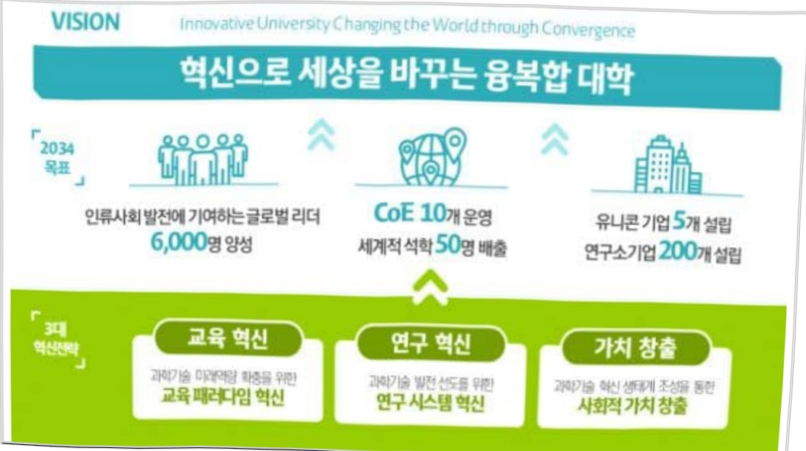

# 대구경북과학기술원 연구 운영비지원(R&D)

**해당 페이지**: PDF 849 ~ 857 쪽 해당

**부처**: 과학기술정보통신부
**분야**: 과학기술
**회계유형**: 일반회계
**2026 확정예산**: 116367.0 백만원
**전년대비 증감률**: 14.7%
**AI 도메인**: R&D 지원

---

<table border=1 style='margin: auto; word-wrap: break-word;'><tr><td style='text-align: center; word-wrap: break-word;'>사 업 명</td></tr><tr><td style='text-align: center; word-wrap: break-word;'>(184) 대구경북과학기술원 연구운영비 지원(R&amp;D) (2231-402)</td></tr></table>

사업 코드 정보

<table border=1 style='margin: auto; word-wrap: break-word;'><tr><td style='text-align: center; word-wrap: break-word;'>구분</td><td style='text-align: center; word-wrap: break-word;'>회계</td><td style='text-align: center; word-wrap: break-word;'>소관</td><td style='text-align: center; word-wrap: break-word;'>실국(기관)</td><td style='text-align: center; word-wrap: break-word;'>계정</td><td style='text-align: center; word-wrap: break-word;'>분야</td><td style='text-align: center; word-wrap: break-word;'>부문</td></tr><tr><td style='text-align: center; word-wrap: break-word;'>코드</td><td rowspan="2">일반회계</td><td rowspan="2">과학기술정보통신부</td><td rowspan="2">미래인재정책국</td><td rowspan="2">0</td><td style='text-align: center; word-wrap: break-word;'>150</td><td style='text-align: center; word-wrap: break-word;'>152</td></tr><tr><td style='text-align: center; word-wrap: break-word;'>명칭</td><td style='text-align: center; word-wrap: break-word;'>과학기술</td><td style='text-align: center; word-wrap: break-word;'>과학기술연구지원</td></tr></table>

<table border=1 style='margin: auto; word-wrap: break-word;'><tr><td style='text-align: center; word-wrap: break-word;'>구분</td><td style='text-align: center; word-wrap: break-word;'>프로그램</td><td style='text-align: center; word-wrap: break-word;'>단위사업</td><td style='text-align: center; word-wrap: break-word;'>세부사업</td></tr><tr><td style='text-align: center; word-wrap: break-word;'>코드</td><td style='text-align: center; word-wrap: break-word;'>2200</td><td style='text-align: center; word-wrap: break-word;'>2231</td><td style='text-align: center; word-wrap: break-word;'>402</td></tr><tr><td style='text-align: center; word-wrap: break-word;'>명칭</td><td style='text-align: center; word-wrap: break-word;'>출연연구기관지원</td><td style='text-align: center; word-wrap: break-word;'>직할출연연구기관지원</td><td style='text-align: center; word-wrap: break-word;'>대구경북과학기술원 연구운영비 지원(R&amp;D)</td></tr></table>

☐ 사업 성격

<table border=1 style='margin: auto; word-wrap: break-word;'><tr><td rowspan="2">신규</td><td rowspan="2">계속</td><td rowspan="2">완료</td><td style='text-align: center; word-wrap: break-word;'>예비타당성</td><td style='text-align: center; word-wrap: break-word;'>총사업비</td><td style='text-align: center; word-wrap: break-word;'>총액계상</td><td style='text-align: center; word-wrap: break-word;'>사업소관 변경정보</td></tr><tr><td style='text-align: center; word-wrap: break-word;'>실시여부</td><td style='text-align: center; word-wrap: break-word;'>관리대상</td><td style='text-align: center; word-wrap: break-word;'>예산사업</td><td style='text-align: center; word-wrap: break-word;'>2025예산 시 소관</td></tr><tr><td style='text-align: center; word-wrap: break-word;'></td><td style='text-align: center; word-wrap: break-word;'>○</td><td style='text-align: center; word-wrap: break-word;'></td><td style='text-align: center; word-wrap: break-word;'></td><td style='text-align: center; word-wrap: break-word;'></td><td style='text-align: center; word-wrap: break-word;'></td><td style='text-align: center; word-wrap: break-word;'></td></tr></table>

사업지원형태 및 지원을(최소한 한 개는 반드시 선택하시오. 해당사항에 O 표시)

<table border=1 style='margin: auto; word-wrap: break-word;'><tr><td style='text-align: center; word-wrap: break-word;'>직접</td><td style='text-align: center; word-wrap: break-word;'>출자</td><td style='text-align: center; word-wrap: break-word;'>출연</td><td style='text-align: center; word-wrap: break-word;'>보조</td><td style='text-align: center; word-wrap: break-word;'>융자</td><td style='text-align: center; word-wrap: break-word;'>국고보조율(%)</td><td style='text-align: center; word-wrap: break-word;'>융자율(%)</td></tr><tr><td style='text-align: center; word-wrap: break-word;'></td><td style='text-align: center; word-wrap: break-word;'></td><td style='text-align: center; word-wrap: break-word;'>○</td><td style='text-align: center; word-wrap: break-word;'></td><td style='text-align: center; word-wrap: break-word;'></td><td style='text-align: center; word-wrap: break-word;'></td><td style='text-align: center; word-wrap: break-word;'></td></tr></table>

□사업 소관부처 및 시행주체

<table border=1 style='margin: auto; word-wrap: break-word;'><tr><td style='text-align: center; word-wrap: break-word;'>사업명</td><td colspan="2">구분</td></tr><tr><td rowspan="3">대구경북과학기술원연구운영비지원(R&amp;D)</td><td rowspan="2">소관부처</td><td style='text-align: center; word-wrap: break-word;'>과학기술정보통신부 미래인재정책국</td></tr><tr><td style='text-align: center; word-wrap: break-word;'>미래인재양성과</td></tr><tr><td style='text-align: center; word-wrap: break-word;'>사업시행주체</td><td style='text-align: center; word-wrap: break-word;'>대구경북과학기술원</td></tr></table>

---

### 가. 예산 총괄표

(단위: 백만원, %)

<table border=1 style='margin: auto; word-wrap: break-word;'><tr><td rowspan="2">사업명</td><td rowspan="2">2024년 결산</td><td colspan="2">2025년 예산</td><td colspan="2">2026년 예산</td><td rowspan="2">증감(B-A)</td><td rowspan="2">(B-A)/A</td></tr><tr><td style='text-align: center; word-wrap: break-word;'>본예산</td><td style='text-align: center; word-wrap: break-word;'>추경*(A)</td><td style='text-align: center; word-wrap: break-word;'>요구안</td><td style='text-align: center; word-wrap: break-word;'>본예산(B)</td></tr><tr><td style='text-align: center; word-wrap: break-word;'>대구경북과학기술원연구운영비지원(R&amp;D)</td><td style='text-align: center; word-wrap: break-word;'>88,701</td><td style='text-align: center; word-wrap: break-word;'>97,697</td><td style='text-align: center; word-wrap: break-word;'>101,447</td><td style='text-align: center; word-wrap: break-word;'>115,367</td><td style='text-align: center; word-wrap: break-word;'>116,367</td><td style='text-align: center; word-wrap: break-word;'>14,920</td><td style='text-align: center; word-wrap: break-word;'>14.7</td></tr></table>

*추경: 추경증감액을 포함한 최종 예산액을 기재

## □ 기능별(내역사업별) 예산 내역

(단위:백만원)

<table border=1 style='margin: auto; word-wrap: break-word;'><tr><td rowspan="2"></td><td colspan="4">2024</td><td colspan="4">2025(2025.12월말)</td><td colspan="2"></td><td rowspan="2">2026예산</td></tr><tr><td style='text-align: center; word-wrap: break-word;'>예산액(추정)</td><td style='text-align: center; word-wrap: break-word;'>예산현액</td><td style='text-align: center; word-wrap: break-word;'>집행액</td><td style='text-align: center; word-wrap: break-word;'>이월액</td><td style='text-align: center; word-wrap: break-word;'>불용액</td><td style='text-align: center; word-wrap: break-word;'>예산액(추정)</td><td style='text-align: center; word-wrap: break-word;'>예산현액</td><td style='text-align: center; word-wrap: break-word;'>집행액</td><td style='text-align: center; word-wrap: break-word;'>이월액</td><td style='text-align: center; word-wrap: break-word;'>불용액</td></tr><tr><td style='text-align: center; word-wrap: break-word;'>○ 기능별 분류(합계)</td><td style='text-align: center; word-wrap: break-word;'>89,842</td><td style='text-align: center; word-wrap: break-word;'>89,842</td><td style='text-align: center; word-wrap: break-word;'>88,701</td><td style='text-align: center; word-wrap: break-word;'>-</td><td style='text-align: center; word-wrap: break-word;'>1,141</td><td style='text-align: center; word-wrap: break-word;'>101,447</td><td style='text-align: center; word-wrap: break-word;'>101,447</td><td style='text-align: center; word-wrap: break-word;'>100,450</td><td style='text-align: center; word-wrap: break-word;'>-</td><td style='text-align: center; word-wrap: break-word;'>997</td><td style='text-align: center; word-wrap: break-word;'>116,367</td></tr><tr><td style='text-align: center; word-wrap: break-word;'>☐ 기관운영비</td><td style='text-align: center; word-wrap: break-word;'>44,911</td><td style='text-align: center; word-wrap: break-word;'>44,911</td><td style='text-align: center; word-wrap: break-word;'>43,770</td><td style='text-align: center; word-wrap: break-word;'>-</td><td style='text-align: center; word-wrap: break-word;'>1,141</td><td style='text-align: center; word-wrap: break-word;'>46,730</td><td style='text-align: center; word-wrap: break-word;'>46,730</td><td style='text-align: center; word-wrap: break-word;'>45,733</td><td style='text-align: center; word-wrap: break-word;'>-</td><td style='text-align: center; word-wrap: break-word;'>997</td><td style='text-align: center; word-wrap: break-word;'>49,183</td></tr><tr><td style='text-align: center; word-wrap: break-word;'>· 인건비</td><td style='text-align: center; word-wrap: break-word;'>38,594</td><td style='text-align: center; word-wrap: break-word;'>38,594</td><td style='text-align: center; word-wrap: break-word;'>37,453</td><td style='text-align: center; word-wrap: break-word;'>-</td><td style='text-align: center; word-wrap: break-word;'>1,141</td><td style='text-align: center; word-wrap: break-word;'>40,386</td><td style='text-align: center; word-wrap: break-word;'>40,386</td><td style='text-align: center; word-wrap: break-word;'>39,389</td><td style='text-align: center; word-wrap: break-word;'>-</td><td style='text-align: center; word-wrap: break-word;'>997</td><td style='text-align: center; word-wrap: break-word;'>42,867</td></tr><tr><td style='text-align: center; word-wrap: break-word;'>· 경상경비</td><td style='text-align: center; word-wrap: break-word;'>6,317</td><td style='text-align: center; word-wrap: break-word;'>6,317</td><td style='text-align: center; word-wrap: break-word;'>6,317</td><td style='text-align: center; word-wrap: break-word;'>-</td><td style='text-align: center; word-wrap: break-word;'>-</td><td style='text-align: center; word-wrap: break-word;'>6,344</td><td style='text-align: center; word-wrap: break-word;'>6,344</td><td style='text-align: center; word-wrap: break-word;'>6,344</td><td style='text-align: center; word-wrap: break-word;'>-</td><td style='text-align: center; word-wrap: break-word;'>-</td><td style='text-align: center; word-wrap: break-word;'>6,316</td></tr><tr><td style='text-align: center; word-wrap: break-word;'>☐ 사업비</td><td style='text-align: center; word-wrap: break-word;'>44,931</td><td style='text-align: center; word-wrap: break-word;'>44,931</td><td style='text-align: center; word-wrap: break-word;'>44,931</td><td style='text-align: center; word-wrap: break-word;'>-</td><td style='text-align: center; word-wrap: break-word;'>-</td><td style='text-align: center; word-wrap: break-word;'>54,717</td><td style='text-align: center; word-wrap: break-word;'>54,717</td><td style='text-align: center; word-wrap: break-word;'>54,717</td><td style='text-align: center; word-wrap: break-word;'>-</td><td style='text-align: center; word-wrap: break-word;'>-</td><td style='text-align: center; word-wrap: break-word;'>67,184</td></tr><tr><td style='text-align: center; word-wrap: break-word;'>· 기관고유사업비</td><td style='text-align: center; word-wrap: break-word;'>31,256</td><td style='text-align: center; word-wrap: break-word;'>31,256</td><td style='text-align: center; word-wrap: break-word;'>31,256</td><td style='text-align: center; word-wrap: break-word;'>-</td><td style='text-align: center; word-wrap: break-word;'>-</td><td style='text-align: center; word-wrap: break-word;'>36,699</td><td style='text-align: center; word-wrap: break-word;'>36,699</td><td style='text-align: center; word-wrap: break-word;'>36,699</td><td style='text-align: center; word-wrap: break-word;'>-</td><td style='text-align: center; word-wrap: break-word;'>-</td><td style='text-align: center; word-wrap: break-word;'>38,213</td></tr><tr><td style='text-align: center; word-wrap: break-word;'>· 학사사업비</td><td style='text-align: center; word-wrap: break-word;'>15,922</td><td style='text-align: center; word-wrap: break-word;'>15,922</td><td style='text-align: center; word-wrap: break-word;'>15,922</td><td style='text-align: center; word-wrap: break-word;'>-</td><td style='text-align: center; word-wrap: break-word;'>-</td><td style='text-align: center; word-wrap: break-word;'>17,722</td><td style='text-align: center; word-wrap: break-word;'>17,722</td><td style='text-align: center; word-wrap: break-word;'>17,722</td><td style='text-align: center; word-wrap: break-word;'>-</td><td style='text-align: center; word-wrap: break-word;'>-</td><td style='text-align: center; word-wrap: break-word;'>18,372</td></tr><tr><td style='text-align: center; word-wrap: break-word;'>· 과학기술산도기초연구</td><td style='text-align: center; word-wrap: break-word;'>2,626</td><td style='text-align: center; word-wrap: break-word;'>2,626</td><td style='text-align: center; word-wrap: break-word;'>2,626</td><td style='text-align: center; word-wrap: break-word;'>-</td><td style='text-align: center; word-wrap: break-word;'>-</td><td style='text-align: center; word-wrap: break-word;'>2,626</td><td style='text-align: center; word-wrap: break-word;'>2,626</td><td style='text-align: center; word-wrap: break-word;'>2,626</td><td style='text-align: center; word-wrap: break-word;'>-</td><td style='text-align: center; word-wrap: break-word;'>-</td><td style='text-align: center; word-wrap: break-word;'>1,890</td></tr><tr><td style='text-align: center; word-wrap: break-word;'>· 글로벌산도기초연구</td><td style='text-align: center; word-wrap: break-word;'>4,032</td><td style='text-align: center; word-wrap: break-word;'>4,032</td><td style='text-align: center; word-wrap: break-word;'>4,032</td><td style='text-align: center; word-wrap: break-word;'>-</td><td style='text-align: center; word-wrap: break-word;'>-</td><td style='text-align: center; word-wrap: break-word;'>5,741</td><td style='text-align: center; word-wrap: break-word;'>5,741</td><td style='text-align: center; word-wrap: break-word;'>5,741</td><td style='text-align: center; word-wrap: break-word;'>-</td><td style='text-align: center; word-wrap: break-word;'>-</td><td style='text-align: center; word-wrap: break-word;'>7,341</td></tr><tr><td style='text-align: center; word-wrap: break-word;'>· 학술정보운영</td><td style='text-align: center; word-wrap: break-word;'>3,666</td><td style='text-align: center; word-wrap: break-word;'>3,666</td><td style='text-align: center; word-wrap: break-word;'>3,666</td><td style='text-align: center; word-wrap: break-word;'>-</td><td style='text-align: center; word-wrap: break-word;'>-</td><td style='text-align: center; word-wrap: break-word;'>4,026</td><td style='text-align: center; word-wrap: break-word;'>4,026</td><td style='text-align: center; word-wrap: break-word;'>4,026</td><td style='text-align: center; word-wrap: break-word;'>-</td><td style='text-align: center; word-wrap: break-word;'>-</td><td style='text-align: center; word-wrap: break-word;'>4,026</td></tr><tr><td style='text-align: center; word-wrap: break-word;'>· 기관고유센터운영</td><td style='text-align: center; word-wrap: break-word;'>1,612</td><td style='text-align: center; word-wrap: break-word;'>1,612</td><td style='text-align: center; word-wrap: break-word;'>1,612</td><td style='text-align: center; word-wrap: break-word;'>-</td><td style='text-align: center; word-wrap: break-word;'>-</td><td style='text-align: center; word-wrap: break-word;'>2,464</td><td style='text-align: center; word-wrap: break-word;'>2,464</td><td style='text-align: center; word-wrap: break-word;'>2,464</td><td style='text-align: center; word-wrap: break-word;'>-</td><td style='text-align: center; word-wrap: break-word;'>-</td><td style='text-align: center; word-wrap: break-word;'>2,464</td></tr><tr><td style='text-align: center; word-wrap: break-word;'>· 대한사업비</td><td style='text-align: center; word-wrap: break-word;'>3,398</td><td style='text-align: center; word-wrap: break-word;'>3,398</td><td style='text-align: center; word-wrap: break-word;'>3,398</td><td style='text-align: center; word-wrap: break-word;'>-</td><td style='text-align: center; word-wrap: break-word;'>-</td><td style='text-align: center; word-wrap: break-word;'>4,120</td><td style='text-align: center; word-wrap: break-word;'>4,120</td><td style='text-align: center; word-wrap: break-word;'>4,120</td><td style='text-align: center; word-wrap: break-word;'>-</td><td style='text-align: center; word-wrap: break-word;'>-</td><td style='text-align: center; word-wrap: break-word;'>4,120</td></tr><tr><td style='text-align: center; word-wrap: break-word;'>· 일반사업비</td><td style='text-align: center; word-wrap: break-word;'>11,675</td><td style='text-align: center; word-wrap: break-word;'>11,675</td><td style='text-align: center; word-wrap: break-word;'>11,675</td><td style='text-align: center; word-wrap: break-word;'>-</td><td style='text-align: center; word-wrap: break-word;'>-</td><td style='text-align: center; word-wrap: break-word;'>14,768</td><td style='text-align: center; word-wrap: break-word;'>14,768</td><td style='text-align: center; word-wrap: break-word;'>14,768</td><td style='text-align: center; word-wrap: break-word;'>-</td><td style='text-align: center; word-wrap: break-word;'>-</td><td style='text-align: center; word-wrap: break-word;'>18,919</td></tr><tr><td style='text-align: center; word-wrap: break-word;'>· 창업및사업화협력</td><td style='text-align: center; word-wrap: break-word;'>1,375</td><td style='text-align: center; word-wrap: break-word;'>1,375</td><td style='text-align: center; word-wrap: break-word;'>1,375</td><td style='text-align: center; word-wrap: break-word;'>-</td><td style='text-align: center; word-wrap: break-word;'>-</td><td style='text-align: center; word-wrap: break-word;'>2,000</td><td style='text-align: center; word-wrap: break-word;'>2,000</td><td style='text-align: center; word-wrap: break-word;'>2,000</td><td style='text-align: center; word-wrap: break-word;'>-</td><td style='text-align: center; word-wrap: break-word;'>-</td><td style='text-align: center; word-wrap: break-word;'>1,682</td></tr><tr><td style='text-align: center; word-wrap: break-word;'>· 마태산도형특성화연구</td><td style='text-align: center; word-wrap: break-word;'>10,200</td><td style='text-align: center; word-wrap: break-word;'>10,200</td><td style='text-align: center; word-wrap: break-word;'>10,200</td><td style='text-align: center; word-wrap: break-word;'>-</td><td style='text-align: center; word-wrap: break-word;'>-</td><td style='text-align: center; word-wrap: break-word;'>9,018</td><td style='text-align: center; word-wrap: break-word;'>9,018</td><td style='text-align: center; word-wrap: break-word;'>9,018</td><td style='text-align: center; word-wrap: break-word;'>-</td><td style='text-align: center; word-wrap: break-word;'>-</td><td style='text-align: center; word-wrap: break-word;'>2,502</td></tr><tr><td style='text-align: center; word-wrap: break-word;'>· 과학기술산도기초연구</td><td style='text-align: center; word-wrap: break-word;'>100</td><td style='text-align: center; word-wrap: break-word;'>100</td><td style='text-align: center; word-wrap: break-word;'>100</td><td style='text-align: center; word-wrap: break-word;'>-</td><td style='text-align: center; word-wrap: break-word;'>-</td><td style='text-align: center; word-wrap: break-word;'>-</td><td style='text-align: center; word-wrap: break-word;'>-</td><td style='text-align: center; word-wrap: break-word;'>-</td><td style='text-align: center; word-wrap: break-word;'>-</td><td style='text-align: center; word-wrap: break-word;'>-</td><td style='text-align: center; word-wrap: break-word;'>-</td></tr><tr><td style='text-align: center; word-wrap: break-word;'>· AI국가대표양성(InnoCORE)</td><td style='text-align: center; word-wrap: break-word;'>-</td><td style='text-align: center; word-wrap: break-word;'>-</td><td style='text-align: center; word-wrap: break-word;'>-</td><td style='text-align: center; word-wrap: break-word;'>-</td><td style='text-align: center; word-wrap: break-word;'>-</td><td style='text-align: center; word-wrap: break-word;'>3,750</td><td style='text-align: center; word-wrap: break-word;'>3,750</td><td style='text-align: center; word-wrap: break-word;'>3,750</td><td style='text-align: center; word-wrap: break-word;'>-</td><td style='text-align: center; word-wrap: break-word;'>-</td><td style='text-align: center; word-wrap: break-word;'>13,125</td></tr><tr><td style='text-align: center; word-wrap: break-word;'>· AI 전사 양성사업(AI 거점대학프로그램 운영)</td><td style='text-align: center; word-wrap: break-word;'>-</td><td style='text-align: center; word-wrap: break-word;'>-</td><td style='text-align: center; word-wrap: break-word;'>-</td><td style='text-align: center; word-wrap: break-word;'>-</td><td style='text-align: center; word-wrap: break-word;'>-</td><td style='text-align: center; word-wrap: break-word;'>-</td><td style='text-align: center; word-wrap: break-word;'>-</td><td style='text-align: center; word-wrap: break-word;'>-</td><td style='text-align: center; word-wrap: break-word;'>-</td><td style='text-align: center; word-wrap: break-word;'>-</td><td style='text-align: center; word-wrap: break-word;'>1,610</td></tr></table>

---

<table border=1 style='margin: auto; word-wrap: break-word;'><tr><td rowspan="2"></td><td colspan="5">2024</td><td colspan="3">2025(2025.12월말)</td><td colspan="2"></td><td rowspan="2">2026예산</td></tr><tr><td style='text-align: center; word-wrap: break-word;'>예산액(추경)</td><td style='text-align: center; word-wrap: break-word;'>예산현액</td><td style='text-align: center; word-wrap: break-word;'>집행액</td><td style='text-align: center; word-wrap: break-word;'>이월액</td><td style='text-align: center; word-wrap: break-word;'>불용액</td><td style='text-align: center; word-wrap: break-word;'>예산액(추경)</td><td style='text-align: center; word-wrap: break-word;'>예산현액</td><td style='text-align: center; word-wrap: break-word;'>집행액</td><td style='text-align: center; word-wrap: break-word;'>이월액</td><td style='text-align: center; word-wrap: break-word;'>불용액</td></tr><tr><td rowspan="4">· 전략연구사업  · 휴먼디지털트  원 기 술 (DGIST-KAIST-GIST-UNIST)  · 차세대 모빌리티형 센서-뉴로 모꾸 반도체 지능형 통합시스템 (UNIST-GIST-DGSI)  · 장비·시스템구축비</td><td style='text-align: center; word-wrap: break-word;'>-</td><td style='text-align: center; word-wrap: break-word;'>-</td><td style='text-align: center; word-wrap: break-word;'>-</td><td style='text-align: center; word-wrap: break-word;'>-</td><td style='text-align: center; word-wrap: break-word;'>-</td><td style='text-align: center; word-wrap: break-word;'>-</td><td style='text-align: center; word-wrap: break-word;'>-</td><td style='text-align: center; word-wrap: break-word;'>-</td><td style='text-align: center; word-wrap: break-word;'>-</td><td style='text-align: center; word-wrap: break-word;'>5,277</td><td rowspan="3"></td></tr><tr><td style='text-align: center; word-wrap: break-word;'>-</td><td style='text-align: center; word-wrap: break-word;'>-</td><td style='text-align: center; word-wrap: break-word;'>-</td><td style='text-align: center; word-wrap: break-word;'>-</td><td style='text-align: center; word-wrap: break-word;'>-</td><td style='text-align: center; word-wrap: break-word;'>-</td><td style='text-align: center; word-wrap: break-word;'>-</td><td style='text-align: center; word-wrap: break-word;'>-</td><td style='text-align: center; word-wrap: break-word;'>-</td><td style='text-align: center; word-wrap: break-word;'>4,222</td></tr><tr><td style='text-align: center; word-wrap: break-word;'>-</td><td style='text-align: center; word-wrap: break-word;'>-</td><td style='text-align: center; word-wrap: break-word;'>-</td><td style='text-align: center; word-wrap: break-word;'>-</td><td style='text-align: center; word-wrap: break-word;'>-</td><td style='text-align: center; word-wrap: break-word;'>-</td><td style='text-align: center; word-wrap: break-word;'>-</td><td style='text-align: center; word-wrap: break-word;'>-</td><td style='text-align: center; word-wrap: break-word;'>-</td><td style='text-align: center; word-wrap: break-word;'>1,055</td></tr><tr><td style='text-align: center; word-wrap: break-word;'>2,000</td><td style='text-align: center; word-wrap: break-word;'>2,000</td><td style='text-align: center; word-wrap: break-word;'>2,000</td><td style='text-align: center; word-wrap: break-word;'>-</td><td style='text-align: center; word-wrap: break-word;'>-</td><td style='text-align: center; word-wrap: break-word;'>3,250</td><td style='text-align: center; word-wrap: break-word;'>3,250</td><td style='text-align: center; word-wrap: break-word;'>3,250</td><td style='text-align: center; word-wrap: break-word;'>-</td><td style='text-align: center; word-wrap: break-word;'>-</td><td style='text-align: center; word-wrap: break-word;'>4,775</td></tr></table>

### 나.사업설명자료

## 1 ) 사업목적·내용

- (대구경북과학기술원 연구운영비 지원(R&D)) 첨단과학기술의 혁신을 선도할 고급과학기술인재를 양성하고, 지역산업의 기술적 발전 및 경쟁력 향상을 위하여 지식기반사업 및 첨단과학 분야를 연구함으로써 지역군형발전과 국가과학기술발전에 이바지

- (기관운영비) : 설립목적에 따라 수립된 기관 R&R(역할과 책임) 관련 주요 사업

목표 달성을 위한 인건비, 경상경비 등 기관운영경비

- (사업비) : 고급과학기술인재 양성 및 기초·응용과학 연구수행 등 기관 고유목적

달성을 위한 교육·연구 사업비

## 2 ) 사업개요

□ 사업근거 및 추진경위

① 법령상 근거 및 조항 적시 : 대구경북과학기술원법(법률 제18731호) 제8조

② 추진경위

-2003.12.「대구경북과학기술연구원법」공포(법률 제6996호)

- 2004. 09. 연구원 설립등기

- 2008. 06. 대구경북과학기술원법 공포(법률 제9108호 - 교육기능 추가)

- 2010. 12. 연구동 준공식

- 2011. 02. 초대총장 신성철 박사 취임

- 2011. 03. 제1회 석.박사 학위과정 입학식 개최

- 2011. 10. 부설기관 “한국뇌연구원” 설립

- 2013. 03. 제1회 학위수여식(첫 석사학위 졸업생 배출)

---

- 2014. 03. 제1회 학부생 입학식

- 2014. 06. 학사캠퍼스 준공식

2015. 07. 2015년도 미래부 기관평가 결과 ‘우수’

12. 2015년도 기관평가 국무총리 단체표창(2년

.02. 제1회 융복합대학 기초학부 학위수여식(첫 학사학위 졸업생 96명 배출)

- 2018. 05. DGIST Innovation 2034 혁신선포

- 2018. 06. R&R 재정립 방안 발표 및 협약 체결

- 2019. 04. 제4대 충장 국양 박사 취임

- 2020. 04. 발명장려유공 단체부분 ‘대통령 표창’

- 2022. 12. 기술출자(연구소)기업 누적 21개사 설립

- 2023. 12. 제5대 총장 이건우 박사 취임

□ 주요내용

① 사업규모

- 총사업비 : 해당사항 없음

- 사업기간 : 2004 ~ 계속

- 최근 5년 간 투입된 사업비(예산액기준, 추경편성한 연도에는 추경포함)

<table border=1 style='margin: auto; word-wrap: break-word;'><tr><td style='text-align: center; word-wrap: break-word;'>$ \underline{\text{所}} $</td><td style='text-align: center; word-wrap: break-word;'>2022</td><td style='text-align: center; word-wrap: break-word;'>2023</td><td style='text-align: center; word-wrap: break-word;'>2024</td><td style='text-align: center; word-wrap: break-word;'>2025</td><td style='text-align: center; word-wrap: break-word;'>2026</td></tr><tr><td style='text-align: center; word-wrap: break-word;'>$ \underline{\text{人}} $</td><td style='text-align: center; word-wrap: break-word;'>91,500</td><td style='text-align: center; word-wrap: break-word;'>94,925</td><td style='text-align: center; word-wrap: break-word;'>89,842</td><td style='text-align: center; word-wrap: break-word;'>101,447</td><td style='text-align: center; word-wrap: break-word;'>116,367</td></tr></table>

- 기타: 해당사항 없음

## ② 사업추진체계

- 사업시행방법 : 출연

- 사업시행주체 : 대구경북과학기술원

- 사업 수혜자 : 대학, 연구기관, 산업체 등

- 보조, 융자, 출연, 출자 등의 경우 보조·융자 등 지원 비율 및 법적근거

<table border=1 style='margin: auto; word-wrap: break-word;'><tr><td style='text-align: center; word-wrap: break-word;'>내역사업명</td><td style='text-align: center; word-wrap: break-word;'>구분</td><td style='text-align: center; word-wrap: break-word;'>피보조·피출연 등 기관명</td><td style='text-align: center; word-wrap: break-word;'>지원 금액 (2026예산)</td><td style='text-align: center; word-wrap: break-word;'>지원 비율(%)</td><td style='text-align: center; word-wrap: break-word;'>보조율 법적근거 (해당 조항)</td></tr><tr><td style='text-align: center; word-wrap: break-word;'>대구경북 과학기술원 연구운영비 지원(R&amp;D)</td><td style='text-align: center; word-wrap: break-word;'>출연</td><td style='text-align: center; word-wrap: break-word;'>대구경북 과학기술원</td><td style='text-align: center; word-wrap: break-word;'>116,367</td><td style='text-align: center; word-wrap: break-word;'>100.0</td><td style='text-align: center; word-wrap: break-word;'>대구경북과학기술원법 제8조</td></tr></table>

---

## 대구경북과학기술원 연구운영비지원(2026년) : 총 116,367백만원

○ 기관운영비 : 49,183백만원

가. 인건비 (42,867백만원)

나. 경상경비 (6,316백만원)

○ 기관고유사업비 : 38,213백만원

가. 학사사업비 (18,372백만원)

·학생경비:7,330백만원

·학사지원비:4,000백만원

· 특성화과정운영비 : UGRP운영비, 학생연구원 지원, 특성화전문대학원 운영, 지역 협의체 운영 등 7,042백만원

### 나. 과학기술선도기초연구 (1,890백만원)

·미래혁신성장 융합연구 및 원천기술 개발, 기초과학 분야 창의도전 연구 활성화 1,890백만원

### 다. 글로벌선도대학육성·지원 (7,341백만원)

·교원·연구원 역량강화 지원 및 특성화 연구분야 프로그램 기획·운영 7,341백만원

### 라. 학술정보운영 (4,026백만원)

· 창의적 인재양성과 융합연구에 필요한 과학기술 콘텐츠 확충 및 정보전산시스템 구축·운영 4,026백만원

### 마. 기관고유센터운영 (2,464백만원)

· 실험동물, 슈퍼컴퓨팅 분야 핵심 장비 및 지역거점 공용 인프라 센터의 안정적 운영·지원 2,464백만원

바. 대형연구시설장비운영유지 (4,120백만원)

· 교육·연구 수월성 확보를 위한 재료분석, 바이오분석, 소자클린룸, 기기가공, 계측시뮬레이션 등 집적화된 핵심장비 및 공용인프라 센터의 안정적 운영·지원 4,120백만원

## ☐ 일반사업비 : 18,919백만원

### 가. 창업및사업화협력 (1,682백만원)

· 창업인재 양성 및 연구개발 기술의 상용화를 통한 지역기업 지원, 기술이전(출자)을 통한 기술출자(연구소)기업 설립 및 창업기업 육성 1,682백만원

나. 미래선도형특성화연구 (2,502백만원)

중점연구 분야별 융복합 미래선도형 연구과제 수행을 통한 국가 및 지역 과학기술발전에 이바지할 원천기술 및 응용

· 그랜드챌린지연구혁신프로젝트 -백만원

·디지털혁신클러스터4.0 -백만원

·센소리움연구소운영 450백만원

·국제공동연구사업 1,000백만원

· 첨단산업파트너십강화프로젝트 450백만원

·산업전환형혁신팩토리 450백만원

·ISD Honors Program 운영 152백만원

### 다.AI국가대표양성(InnoCORE)(13,125백만원)

국내외 최고 수준 박사후연수연구원(이하 '포닉') 중심 중장기 집단·융합연구 지원 및 국내 포닉 양성 생태계 선도로 국가 전략기술 확보13,125백만원

### 라. AI 전사 양성사업 (1,610백만원)

• 4대 과기원이 보유한 대한민국 최고 수준의 교수진 및 교육역량에 기반, 학부생 대상 산업밀착형 고수준 문제해결능력 배양 등 AI+X 특화교육을 통해 Global-Standard에 부합하는 AI 인재를 양성 1,610백만원

---

○ 전략연구사업 : 5,222백만원

가. 휴먼디지털트윈기술(DGIST-KAIST-GIST-UNIST) (4,222백만원)

·바이오메디컬 패러다임 교체를 위한 휴먼디지털트윈기술 개발4,222백만원

나.차세대 모빌리티향 센서-뉴로모픽 반도체 지능형 통합시스템(UNIST-GIST-DGIST) (1,055백만원)

·차세대 모빌리티향 센서-뉴로모픽 반도체 지능형 통합시스템 개발 1,055백만원

○ 장비·시스템구축비 : 4,775백만원

## 4 ) 사업효과

☐ 사업영향, 산출물 성과지표 등

①2022~2026년도 성과계획서 상 성과지표 및 최근 5년간 성과 달성도

<table border=1 style='margin: auto; word-wrap: break-word;'><tr><td style='text-align: center; word-wrap: break-word;'>성과지표</td><td style='text-align: center; word-wrap: break-word;'>구분</td><td style='text-align: center; word-wrap: break-word;'>2022</td><td style='text-align: center; word-wrap: break-word;'>2023</td><td style='text-align: center; word-wrap: break-word;'>2024</td><td style='text-align: center; word-wrap: break-word;'>2025</td><td style='text-align: center; word-wrap: break-word;'>2026</td><td style='text-align: center; word-wrap: break-word;'>2026 목표치산출근거</td><td style='text-align: center; word-wrap: break-word;'>측정산식(또는 측정방법)</td><td style='text-align: center; word-wrap: break-word;'>자료수집방법(또는 자료출처)</td></tr><tr><td rowspan="3">논문의 평균 피인용 횟수(건)</td><td style='text-align: center; word-wrap: break-word;'>목표</td><td style='text-align: center; word-wrap: break-word;'>4.4</td><td style='text-align: center; word-wrap: break-word;'>4.8</td><td style='text-align: center; word-wrap: break-word;'>5.5</td><td style='text-align: center; word-wrap: break-word;'>5.7</td><td style='text-align: center; word-wrap: break-word;'>6.0</td><td rowspan="3">전년도 목표치대비 5% 상향설정</td><td rowspan="3">&#x27;23~&#x27;24년 발표한 논문의 &#x27;24~&#x27;25년 피인용 횟수의합) / &#x27;23~&#x27;24년 발표한 논문수의합</td><td rowspan="3">발표논문편수 및 피인용횟수 집계</td></tr><tr><td style='text-align: center; word-wrap: break-word;'>실적</td><td style='text-align: center; word-wrap: break-word;'>9.0</td><td style='text-align: center; word-wrap: break-word;'>10.5</td><td style='text-align: center; word-wrap: break-word;'>12.2</td><td style='text-align: center; word-wrap: break-word;'>-</td><td style='text-align: center; word-wrap: break-word;'>-</td></tr><tr><td style='text-align: center; word-wrap: break-word;'>달성도</td><td style='text-align: center; word-wrap: break-word;'>205</td><td style='text-align: center; word-wrap: break-word;'>219</td><td style='text-align: center; word-wrap: break-word;'>222</td><td style='text-align: center; word-wrap: break-word;'>-</td><td style='text-align: center; word-wrap: break-word;'>-</td></tr></table>

② 성과지표 이외의 연도별 사업추진 경과 및 실적

<table border=1 style='margin: auto; word-wrap: break-word;'><tr><td style='text-align: center; word-wrap: break-word;'>2022</td><td style='text-align: center; word-wrap: break-word;'>· QS 아시아 대학평가 교원 1인당 논문수·피인용도 국내 2위 · DGIST 장진호, 황재윤 교수 연구진, ‘Deep laser microscopy using optical clearing by ultrasound-induced gas bubbles’로 국제학술지 ‘Nature Photonics’에 게재(‘22.9.), DGIST 성주영 교수 연구진, ‘Ultrafast exciton transport at early times in quantum dot solids’으로 국제학술지 ‘Nature Materials’에 게재(‘22.3.), DGIST 박경준 교수, ‘Deep laser microscopy using optical clearing by ultrasound-induced gas bubbles’로 국제학술지 ‘Nature Photonics’ 게재(‘22.9.)) 등</td></tr><tr><td style='text-align: center; word-wrap: break-word;'>2023</td><td style='text-align: center; word-wrap: break-word;'>· 2023QS 아시아 대학평가 교원 1인당 논문수·피인용도 국내 2위 · 기술출자(연구소)기업 누적 21개사 설립 · JCR Q1 저널 표지 장식한 주저자 논문 13편 · 로봇및기계전자 최홍수 (IF 29.4) “A Neurospheroid-Based Microrobot for Targeted …” (‘23.3월), 에너지공학과 최종민 (IF 27.8) “The Impact of Multifunctional Ambipolar Polymer …” (‘23.11월), 뉴바이올로지 김민석 (IF 12.4) “Cytokine engineered NK-92 therapy to improve …” (‘23.3월) 등</td></tr><tr><td style='text-align: center; word-wrap: break-word;'>2024</td><td style='text-align: center; word-wrap: break-word;'>· 2024 QS 세계 대학평가 교원 1인당 피인용도 세계 7위, 종합 세계기준 307위, 국내기준 9위 · 2024 THE WUR 첫 진입 세계기준 351-400위 · THE 신흥대학평가 2024 : 세계 33위(국내 3위, 신규 진입 대학 중 1위)</td></tr><tr><td style='text-align: center; word-wrap: break-word;'>2025</td><td style='text-align: center; word-wrap: break-word;'>· 2025 QS 세계 대학평가 교원 1인당 피인용도 세계 4위, 국내 1위 · 2025 QS 세계 대학평가 세계 370위, 국내 9위</td></tr></table>

---

③향후(2026년도 이후) 기대효과 :

- 융합형 인재양성을 통해 4차 산업혁명 시대 이공계 교육혁신을 선도하고, 융복합 연구혁신으로 국민 삶의 질 향상과 대구경북권 신산업 가치창출에 기여하기 위한 기관 R&R 재정립

- 사회가치 창출형 융복합 인재양성을 위한 '교육혁신' 선도

• (DGIST 융복합교육 2.0) 4차 산업혁명 시대 대비 DGIST만의 차별화된 융복합 교육 체계를 내실화하고, Computer Science 분야 교육 강화

(글로벌 리더양성 교육강화) 글로벌 선도대학으로서의 기관도약과 리더 양성을 위해 학생 맞춤형 과정지원프로그램(SCCSP)을 강화하고, 연구자로서의 석박사과 정생에 대한 연구력 강화 시행 및 학생연구원의 권익보호 장치마련

- 창의·도전을 중요시하는 융복합 ‘연구혁신’ 주도

(DGIST CoE 운영) 국민체감형 이슈, 과학기술적 난제 해결 등 다학제간 융합

연구를 통해 과기원 혁신 융합연구모델인 개방형 융합연구단 운영

- 지역 신산업 ‘가치창출’ 및 핵심연구 견인

·(지역 전략산업 분야 국제경쟁력 강화) 대구경북 전략산업(자율주행차, 무인 비행장치 등) 및 관련 기업의 국제경쟁력 강화를 위해 지역기업과 글로벌 기업을 연계한 공동 연구개발 촉진

(첨단의료/바이오산업 지원) 대구경북지역 바이오의료 산업 혁신을 견인할 차세대

바이오 융합소자 기술개발

(청정에너지산업 육성 지원) 대구의 청정에너지(스마트분산형에너지) 및 경북의

에너지소재부품산업을지원하기위한핵심요소기술개발및실용화연구수행

---

- 기술혁신형 창업·인프라 대외 활용

(DSP 운영) 차별화된 기술창업교육프로그램(DGIST Start-up Program, DSP)을 통해 실험실창업에 최적화된 교육 및 창업생태계 조성

(기술기반 창업기업 지원 및 육성) DGIST 기술기반 창업기업(연구소기업, 교직원·학생 창업기업)에 대한 투자유치 지원 및 경영지원을 통해 매출액 증대 및 기업생존율 제고 등 고용창출 효과 달성

(공공연구인프라 대외활용) DGIST의 첨단핵심인프라를 대외에 개방, 관련 지원

서비스를 제공함으로써 기술개발 지원 및 지역산업의 가치창출 촉진

-협업적 혁신을 위한 유관기관 협업 강화

·과기특성화대 공동협력 프로그램의 지속적 강화 : MOOC, 교원공동활용, 교환학생, 산학연계 교육프로그램 등 운영

·‘비슬벨리 산업발전 추진위원회’ 발족 및 운영

· '테크노폴리스 혁신 페스티벌(DGIF)' 개최 및 '혁신융합 산학협의회' 구성 및 운영

5) 타당성조사 및 예비타당성조사 시행여부 및 결과 요지 : 해당사항 없음

6) 총사업비 대상사업 정보 : 해당사항 없음

## 7 ) 사업 집행절차

<table border=1 style='margin: auto; word-wrap: break-word;'><tr><td colspan="3">ㅇ 대구경북과학기술원 연구운영비 지원</td></tr><tr><td style='text-align: center; word-wrap: break-word;'>부처</td><td style='text-align: center; word-wrap: break-word;'></td><td style='text-align: center; word-wrap: break-word;'>피출연·피보조 기관</td></tr><tr><td style='text-align: center; word-wrap: break-word;'>과학기술정보통신부</td><td style='text-align: center; word-wrap: break-word;'>=&gt;</td><td style='text-align: center; word-wrap: break-word;'>대구경북과학기술원</td></tr></table>

## 8 ) 각종 평가

1) 국회(예결위, 상임위, 예정처, 국정감사 포함) 지적 : 해당없음

2) 대외공개 평가 : 해당없음

3) 자체평가 : 해당없음

---

### 다. 최근 4년간 결산내역

## 1 ) 결산표

☐ 부처 결산내역

(단위: 백만원, %)

<table border=1 style='margin: auto; word-wrap: break-word;'><tr><td rowspan="2">연도</td><td colspan="3">예산액</td><td rowspan="2">예산현액(A)</td><td rowspan="2">집행액(B)</td><td rowspan="2">집행률(B/A)</td><td rowspan="2">다음연도이월액</td><td rowspan="2">불용액</td></tr><tr><td style='text-align: center; word-wrap: break-word;'>본예산</td><td style='text-align: center; word-wrap: break-word;'>추경증감액</td><td style='text-align: center; word-wrap: break-word;'>추경</td></tr><tr><td style='text-align: center; word-wrap: break-word;'>2022</td><td style='text-align: center; word-wrap: break-word;'>91,500</td><td style='text-align: center; word-wrap: break-word;'>-</td><td style='text-align: center; word-wrap: break-word;'>91,500</td><td style='text-align: center; word-wrap: break-word;'>91,500</td><td style='text-align: center; word-wrap: break-word;'>90,299</td><td style='text-align: center; word-wrap: break-word;'>98.7</td><td style='text-align: center; word-wrap: break-word;'>-</td><td style='text-align: center; word-wrap: break-word;'>1,201</td></tr><tr><td style='text-align: center; word-wrap: break-word;'>2023</td><td style='text-align: center; word-wrap: break-word;'>94,925</td><td style='text-align: center; word-wrap: break-word;'>-</td><td style='text-align: center; word-wrap: break-word;'>94,925</td><td style='text-align: center; word-wrap: break-word;'>94,925</td><td style='text-align: center; word-wrap: break-word;'>93,839</td><td style='text-align: center; word-wrap: break-word;'>98.9</td><td style='text-align: center; word-wrap: break-word;'>-</td><td style='text-align: center; word-wrap: break-word;'>1,086</td></tr><tr><td style='text-align: center; word-wrap: break-word;'>2024</td><td style='text-align: center; word-wrap: break-word;'>89,842</td><td style='text-align: center; word-wrap: break-word;'>-</td><td style='text-align: center; word-wrap: break-word;'>89,842</td><td style='text-align: center; word-wrap: break-word;'>89,842</td><td style='text-align: center; word-wrap: break-word;'>88,701</td><td style='text-align: center; word-wrap: break-word;'>98.7</td><td style='text-align: center; word-wrap: break-word;'>-</td><td style='text-align: center; word-wrap: break-word;'>1,141</td></tr><tr><td style='text-align: center; word-wrap: break-word;'>2025</td><td style='text-align: center; word-wrap: break-word;'>97,697</td><td style='text-align: center; word-wrap: break-word;'>3,750</td><td style='text-align: center; word-wrap: break-word;'>101,447</td><td style='text-align: center; word-wrap: break-word;'>101,447</td><td style='text-align: center; word-wrap: break-word;'>100,450</td><td style='text-align: center; word-wrap: break-word;'>99.0</td><td style='text-align: center; word-wrap: break-word;'>-</td><td style='text-align: center; word-wrap: break-word;'>997</td></tr></table>

## 2 ) 주요 결산사항

□ 2022~2025년 결산 주요사항

<table border=1 style='margin: auto; word-wrap: break-word;'><tr><td style='text-align: center; word-wrap: break-word;'>2022</td><td style='text-align: center; word-wrap: break-word;'>- 이.전용 등 사유 : 해당사항 없음- 예비비 배정 사유 : 해당사항 없음- 추경 편성 사유 : 해당사항 없음- 이월 사유 및 불용 사유 : 인력 미충원 및 채용 지연에 따른 인건비 잔액(1,201백만원) 미교부 불용</td></tr><tr><td style='text-align: center; word-wrap: break-word;'>2023</td><td style='text-align: center; word-wrap: break-word;'>- 이.전용 등 사유 : 해당사항 없음- 예비비 배정 사유 : 해당사항 없음- 추경 편성 사유 : 해당사항 없음- 이월 사유 및 불용 사유 : 인력 미충원 및 채용 지연에 따른 인건비 잔액(1,086백만원) 미교부 불용</td></tr><tr><td style='text-align: center; word-wrap: break-word;'>2024</td><td style='text-align: center; word-wrap: break-word;'>- 이.전용 등 사유 : 해당사항 없음- 예비비 배정 사유 : 해당사항 없음- 추경 편성 사유 : 해당사항 없음- 이월 사유 및 불용 사유 : 인력 미충원 및 채용 지연에 따른 인건비 잔액(1,141백만원) 미교부 불용</td></tr><tr><td style='text-align: center; word-wrap: break-word;'>2025</td><td style='text-align: center; word-wrap: break-word;'>- 이.전용 등 사유 : 해당사항 없음- 예비비 배정 사유 : 해당사항 없음- 추경 편성 사유 : AI 국가대표 양성(InnoCORE) 사업을 위한 3,750백만원 추경 편성</td></tr></table>

□ 2025년 이·전용 등 세부내역 : 해당사항 없음

---

### 원본 PDF 크롭 이미지

