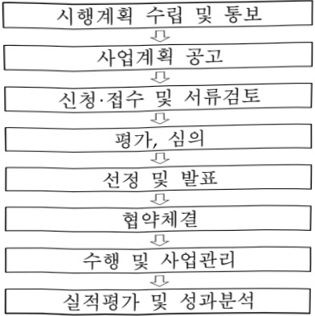

# 대학디지털교육역량강화

**해당 페이지**: PDF 858 ~ 867 쪽 해당

**부처**: 과학기술정보통신부
**분야**: 통신
**회계유형**: 기금
**2026 확정예산**: 12031.0 백만원
**전년대비 증감률**: -89.1%
**AI 도메인**: 교육/인재

---

### 가.지출계획 총괄표

(단위: 백만원, %)

<table border=1 style='margin: auto; word-wrap: break-word;'><tr><td rowspan="2">사업명</td><td rowspan="2">2024년 결산</td><td colspan="2">2025년 예산</td><td colspan="2">2026년 예산</td><td rowspan="2">증감(B-A)</td><td rowspan="2">(B-A)/A</td></tr><tr><td style='text-align: center; word-wrap: break-word;'>본예산</td><td style='text-align: center; word-wrap: break-word;'>추경*(A)</td><td style='text-align: center; word-wrap: break-word;'>요구안</td><td style='text-align: center; word-wrap: break-word;'>본예산(B)</td></tr><tr><td style='text-align: center; word-wrap: break-word;'>대학디지털교육역량강화</td><td style='text-align: center; word-wrap: break-word;'>106,241</td><td style='text-align: center; word-wrap: break-word;'>110,186</td><td style='text-align: center; word-wrap: break-word;'>110,186</td><td style='text-align: center; word-wrap: break-word;'>120,310</td><td style='text-align: center; word-wrap: break-word;'>12,031</td><td style='text-align: center; word-wrap: break-word;'>△98,155</td><td style='text-align: center; word-wrap: break-word;'>△89.1</td></tr></table>

□ 기능별(내역사업별) 계획 내역

(단위:백만원)

<table border=1 style='margin: auto; word-wrap: break-word;'><tr><td rowspan="2"></td><td colspan="5">2024</td><td colspan="5">2025</td><td rowspan="2">2026 계획</td></tr><tr><td style='text-align: center; word-wrap: break-word;'>계획의 (추정)</td><td style='text-align: center; word-wrap: break-word;'>계획 현재</td><td style='text-align: center; word-wrap: break-word;'>집행해</td><td style='text-align: center; word-wrap: break-word;'>이월해</td><td style='text-align: center; word-wrap: break-word;'>불용해</td><td style='text-align: center; word-wrap: break-word;'>계획의 (추정)</td><td style='text-align: center; word-wrap: break-word;'>계획 현재</td><td style='text-align: center; word-wrap: break-word;'>집행해</td><td style='text-align: center; word-wrap: break-word;'>이월해</td><td style='text-align: center; word-wrap: break-word;'>불용해</td></tr><tr><td style='text-align: center; word-wrap: break-word;'>○ 기능별 분류(합계)</td><td style='text-align: center; word-wrap: break-word;'>106,241</td><td style='text-align: center; word-wrap: break-word;'>106,241</td><td style='text-align: center; word-wrap: break-word;'>106,241</td><td style='text-align: center; word-wrap: break-word;'>-</td><td style='text-align: center; word-wrap: break-word;'>-</td><td style='text-align: center; word-wrap: break-word;'>110,186</td><td style='text-align: center; word-wrap: break-word;'>110,186</td><td style='text-align: center; word-wrap: break-word;'>110,186</td><td style='text-align: center; word-wrap: break-word;'>-</td><td style='text-align: center; word-wrap: break-word;'>-</td><td style='text-align: center; word-wrap: break-word;'>12,031</td></tr><tr><td style='text-align: center; word-wrap: break-word;'>• SW중심대화</td><td style='text-align: center; word-wrap: break-word;'>92,500</td><td style='text-align: center; word-wrap: break-word;'>92,500</td><td style='text-align: center; word-wrap: break-word;'>92,500</td><td style='text-align: center; word-wrap: break-word;'>-</td><td style='text-align: center; word-wrap: break-word;'>-</td><td style='text-align: center; word-wrap: break-word;'>97,500</td><td style='text-align: center; word-wrap: break-word;'>97,500</td><td style='text-align: center; word-wrap: break-word;'>97,500</td><td style='text-align: center; word-wrap: break-word;'>-</td><td style='text-align: center; word-wrap: break-word;'>-</td><td style='text-align: center; word-wrap: break-word;'>-</td></tr><tr><td style='text-align: center; word-wrap: break-word;'>• 초고속정보통신 기반인력양성</td><td style='text-align: center; word-wrap: break-word;'>6,023</td><td style='text-align: center; word-wrap: break-word;'>6,023</td><td style='text-align: center; word-wrap: break-word;'>6,023</td><td style='text-align: center; word-wrap: break-word;'>-</td><td style='text-align: center; word-wrap: break-word;'>-</td><td style='text-align: center; word-wrap: break-word;'>6,023</td><td style='text-align: center; word-wrap: break-word;'>6,023</td><td style='text-align: center; word-wrap: break-word;'>6,023</td><td style='text-align: center; word-wrap: break-word;'>-</td><td style='text-align: center; word-wrap: break-word;'>-</td><td style='text-align: center; word-wrap: break-word;'>6,018</td></tr><tr><td style='text-align: center; word-wrap: break-word;'>• ICT산학연계 멘토링 및 인턴십</td><td style='text-align: center; word-wrap: break-word;'>7,718</td><td style='text-align: center; word-wrap: break-word;'>7,718</td><td style='text-align: center; word-wrap: break-word;'>7,718</td><td style='text-align: center; word-wrap: break-word;'>-</td><td style='text-align: center; word-wrap: break-word;'>-</td><td style='text-align: center; word-wrap: break-word;'>6,663</td><td style='text-align: center; word-wrap: break-word;'>6,663</td><td style='text-align: center; word-wrap: break-word;'>6,663</td><td style='text-align: center; word-wrap: break-word;'>-</td><td style='text-align: center; word-wrap: break-word;'>-</td><td style='text-align: center; word-wrap: break-word;'>6,013</td></tr></table>

### 나. 사업설명자료

## 1 ) 사업목적·내용

- (대학디지털교육역량강화) 창의적이고 혁신적인 디지털인재 및 현장수요 맞춤형 실무

인재 양성을 위해 국내 ICT·SW분야 대학의 디지털교육역량 강화 사업

- (초고속정보통신기반인력양성) ICT인프라 구축, 유지보수 분야별 산업학사학위과정을 운영하여 양질의 네트워크 인력을 정보통신산업체에 공급하여, 청년실업 및 중소기업 인력난 해소에 기여

- (ICT산학연계 멘토링 및 인턴십) 국내 ICT·SW분야 대학생들의 실무(직무)역량 강화를 위한 산업계 전문가 멘토링 프로젝트 및 국내·외 기업 인턴십(학점인정) 수행

## 2 ) 사업개요

## □ 사업근거 및 추진경위

① 법령상 근거 및 조항 적시

---

-소프트웨어진흥법 제22조(소프트웨어인력 양성)

- 정보통신 진흥 및 융합 활성화 등에 관한 특별법 제11조(국내 전문인력의 양성), 제12조(학점이수 인턴제도)

- 정보통신산업진흥법 제16조(전문인력의 양성)

- 정보통신공사업법 제38조(정보통신기술인력의 양성 및 교육 등)

- 국민평생직업능력개발법 제48조(기능대학 및 학생 등에 대한 지원)

## <소프트웨어진흥법>

제22조(소프트웨어인력 양성) ① 과학기술정보통신부장관은 소프트웨어 및 소프트웨어융합과 관련한 전문적인 기술, 지식 등을 가진 인력(이하 “소프트웨어인력”이라 한다)을 양성하고 지속적인 자질 향상을 지원하기 위하여 다음 각 호의 사항에 관한 시책을 수립 · 시행할 수 있다.

② 과학기술정보통신부장관은 학교나 연구소, 그 밖의 기관이나 단체 중 대통령령으로 정하는 요건을 갖춘 자를 소프트웨어인력 양성기관으로 지정하여 필요한 예산을 지원할 수 있다.

## <정보통신 진흥 및 융합 활성화 등에 관한 특별법>

제11조(국내 전문인력의 양성) ① 과학기술정보통신부장관은 정보통신 분야의 전문적인 기술, 지식 등을 가진 인력(이하 “전문인력”이라 한다)의 육성에 관한 시책을 수립 · 추진하여야 하며, 특히 소프트웨어 교육의 저변 확대 및 지역산업의 발전을 위한 소프트웨어 특화교육 활성화를 위하여 노력하여야 한다.

② 제1항에 따른 시책에는 다음 각 호의 사항이 포함되어야 한다.

1. 전문인력의 육성 및 교육훈련에 관한 사항

2. 전문인력의 수급 및 활용에 관한 사항

3. 전문인력의 경력관리 지원 등에 관한 사항

4. 그 밖에 전문인력의 육성 및 관리 등을 위한 사항

④ 제1항 및 제2항에 따른 전문인력의 육성·지원 등에 필요한 사항은 대통령령으로 정한다.

제12조(학점)이수 인턴제도) ① 정부는 「고등교육법」 제2조제1호부터 제6호까지의 규정에 따른 대학, 산업대학, 교육대학, 전문대학, 원격대학, 기술대학(이하 “대학”이라 한다) 중 대통령령으로 정하는 정보통신 관련 학과에 재학 중인 사람이 2년을 초과하지 아니하는 기간 내에서 대통령령으로 정하는 중소기업 및 벤처 등에서 인턴으로 근무하도록 할 수 있다.

② 제1항에 따라 중소기업 및 벤처 등에서 인턴으로 근무한 사람에게는 그 기간 동안 소속 대학의 학사과정 및 학점을 학칙으로 정하는 바에 따라 이수한 것으로 본다.

③ 정부는 제1항에 따른 인턴제도를 도입한 대학, 중소기업 및 벤처 등에 대하여는 인건비등 필요한 지원을 할 수 있다.

④ 제1항부터 제3항까지의 규정에 따른 인턴제도의 운영 및 지원 등에 필요한 사항은 대통령령으로 정한다.

## <정보통신산업진흥법>

제16조(전문인력의 양성) 과학기술정보통신부장관은 정보통신산업의 진흥에 필요한 전문인력을 양성하기 위하여 다음 각 호의 시책을 마련하여야 한다.

1. 전문인력의 수요 실태 파악 및 중·장기 수급 전망 수립

2. 전문인력 양성기관의 설립 · 지원

3. 전문인력 양성 교육프로그램의 개발 및 보급 지원

---

4. 정보통신기술 관련 자격제도의 정착 및 전문인력 수급 지원

5.각급 학교 및 그 밖의 교육기관에서 시행하는 정보통신기술 및 정보통신산업 관련 교육의 지원

6. 그 밖에 전문인력 양성에 필요한 사항

## <정보통신공사업법>

제38조(정보통신기술인력의 양성 및 교육 등) ① 과학기술정보통신부장관은 정보통신기술자 등 정보통신기술인력의 효율적 활용 및 자질향상을 위하여 정보통신기술인력의 양성 및 인정교육훈련을 실시할 수 있다.

② 과학기술정보통신무상관은 성모통신기술인력을 안정적으로 공급하기 위하여 정보통신기술인력의 양성 기관을 지정하고, 이에 드는 비용을「정보통신산업 진흥법」 제41조에 따른 정보통신진흥기금 등에서 지원할 수 있다.

③ 정보통신기술인력의 양성 및 교육 등에 필요한 사항은 대통령령으로 정한다.

## <국민 평생 직업능력 개발법>

제48조(기능대학 및 학생 등에 대한 지원) ① 국가·지방자치단체 또는 사업주 등은 기능대학(부설학교를 포함한다. 이하 이 조에서 같다) 설립·경영자에게 교육·훈련시설의 설치, 장비구입, 학교운영 등에 필요한 비용의 전부 또는 일부를 지원할 수 있다.

③ 국가 또는 지방자치단체는 기능대학의 다기능기술자과정, 학위전공심화과정 및 직업훈련과정 등의 학생 및 훈련생에 대하여 그 재학기간 중의 교육·훈련에 필요한 비용의 전부 또는 일부를 지원할 수 있다.

② 추진경위 - 사업 시작년도, 추진배경, 부처별 중점과제, 대통령 공약사항 등

- '00. 7월 : 정보통신시공인력 양성계획 수립

- '00. 12월 : 정보통신기술인력양성기관(ICT폴리텍대학) 지정(정보통신부)

- '03. 9월 : 국내 대학 국제경쟁력 향상을 위한 외국인 유학생 유치

- '06. 1월 : ICT교육품질 향상을 위한 대학 ICT전공역량 강화

- '11. 4월 : 대학ICT교육 개선방안 발표(잘만 가르쳐도 IT일자리 3만개 창출)

- '12. 3월 : ICT인력양성사업 시행계획

- '13. 10월 : 소프트웨어 혁신전략 발표(국무회의)

- '14. 2월 : ICT인력양성사업 시행계획(미래창조과학부)

- '14. 3월 : 경제혁신 3개년 계획 세부 실행과제 발표(경제관계장관회의)

- '17. 11월 : 혁신성장을 위한 사람중심의 '4차 산업혁명 대응계획'(관계부처 합동)

17. 12월 : 과학기술 · ICT기반 일자리 창출 방안(관계부처 합동)

12월 : 4차산업혁명 선도인재 집중양성계획(관계부처 합동)

4월 : 사람투자 10대 과제(일자리위, 관계부처 합동)

9. 12월 : 인공지능 국가전략(국무회의, 관계부처 합동)

- '20. 7월 : 「한국판 뉴딜」 종합계획(관계부처 합동)

- '21. 6월 : 민·관협력 기반의 소프트웨어 인재양성 대책(관계부처 합동)

---

## □ 주요내용

① 사업규모

- 총사업비(해당되는 경우에만 기재) : 해당없음

- 사업기간 : '03년 ~ 계속 (초고속 정보통신 기반인력양성 기준)

- 최근 5년 간 투입된 사업비(예산액기준, 추경편성한 연도에는 추경포함)

<table border=1 style='margin: auto; word-wrap: break-word;'><tr><td style='text-align: center; word-wrap: break-word;'>$ \underline{\text{笹}} $</td><td style='text-align: center; word-wrap: break-word;'>2022</td><td style='text-align: center; word-wrap: break-word;'>2023</td><td style='text-align: center; word-wrap: break-word;'>2024</td><td style='text-align: center; word-wrap: break-word;'>2025</td><td style='text-align: center; word-wrap: break-word;'>2026(辭)</td></tr><tr><td style='text-align: center; word-wrap: break-word;'>$ \underline{\text{人}} $</td><td style='text-align: center; word-wrap: break-word;'>91,745</td><td style='text-align: center; word-wrap: break-word;'>98,864</td><td style='text-align: center; word-wrap: break-word;'>106,241</td><td style='text-align: center; word-wrap: break-word;'>110,186</td><td style='text-align: center; word-wrap: break-word;'>12,031</td></tr></table>

- 기타 : 해당없음

## ② 사업추진체계

- 사업시행방법 : 출연

- 사업시행주체 : 정보통신기획평가원(IITP)

- 사업 수혜자 : ICT·SW분야 대학생, 산업학사학위과정(기능대학) 대학생 등

- 보조, 융자, 출연, 출자 등의 경우 보조 · 융자 등 지원 비율 및 법적근거

<table border=1 style='margin: auto; word-wrap: break-word;'><tr><td style='text-align: center; word-wrap: break-word;'>내역사업명</td><td style='text-align: center; word-wrap: break-word;'>구분</td><td style='text-align: center; word-wrap: break-word;'>피보조·피출연 등 기관명</td><td style='text-align: center; word-wrap: break-word;'>지원 금액 (2026계획안)</td><td style='text-align: center; word-wrap: break-word;'>지원 비율(%)</td><td style='text-align: center; word-wrap: break-word;'>보조율 법적근거 (해당 조항)</td></tr><tr><td style='text-align: center; word-wrap: break-word;'>초고속정보 통신기반인력 양성</td><td style='text-align: center; word-wrap: break-word;'>출연</td><td style='text-align: center; word-wrap: break-word;'>정보통신 기획평가원</td><td style='text-align: center; word-wrap: break-word;'>6,018</td><td style='text-align: center; word-wrap: break-word;'>100%</td><td rowspan="2">한국연구재단법 제11조, 정보통신 진흥 및 융합 활성화 등에 관한 특별법 제32조</td></tr><tr><td style='text-align: center; word-wrap: break-word;'>ICT산학연계 멘토링 및 인텍십</td><td style='text-align: center; word-wrap: break-word;'>출연</td><td style='text-align: center; word-wrap: break-word;'>정보통신 기획평가원</td><td style='text-align: center; word-wrap: break-word;'>6,013</td><td style='text-align: center; word-wrap: break-word;'>100%</td></tr></table>

## 3 ) 2026년도 계획 산출 근거

□ 대학디지털교육역량강화 사업 : (2025 추경) 110,186백만원 → (2026 계획안) 12,031백만원, 순감

① SW중심대학

: (2025 당초 계획) 97,500백만원 → (2026) 사업종료('26년 고등교육특별회계 이관)

② 초고속정보통신기반인력양성 : (2025) 6,023백만원 → (2026 계획안) 6,018백만원, △5백만원

- (요구) ICT인프라 구축, 유지보수 분야별 특성화 산업학사학위과정을 운영하여 맞춤형 기술교육을 실시하고 정보통신분야 중소산업체에 졸업생을 취업시켜 중소기업 인력난 해소와 청년취업 활성화에 기여

- (산출) 64명 x 5개학과 x 18.81백만원 = 6,018백만원

③ ICT산학연계 멘토링 및 인턴십

:(2025 당초 계획) 6,663백만원 → (2026 계획안) 6,013백만원. △650백만원

- (요구) 국내 ICT·SW분야 대학생들의 실무(직무)역량 강화를 위한 산업계 전문가 멘토링 프로젝트

---

<table border=1 style='margin: auto; word-wrap: break-word;'><tr><td colspan="2">및 ICT분야 대학생의 전공과 현장 직무 학습을 연계한 학점이수 인턴제 지원</td></tr><tr><td colspan="2">- (산출) (ICT멘토링) 1,893명 x 2.14백만원 = 4,052백만원</td></tr><tr><td colspan="2">(ICT학점연계프로젝트인턴십) 206명 x 9.5백만원 = 1,961백만원</td></tr></table>

## 4 ) 사업효과

□ 사업영향,산출물 성과지표 등

① 2022~2026년도 성과계획서 상 성과지표 및 최근 5년간 성과 달성도

<table border=1 style='margin: auto; word-wrap: break-word;'><tr><td style='text-align: center; word-wrap: break-word;'>성과지표</td><td style='text-align: center; word-wrap: break-word;'>구분</td><td style='text-align: center; word-wrap: break-word;'>2022</td><td style='text-align: center; word-wrap: break-word;'>2023</td><td style='text-align: center; word-wrap: break-word;'>2024</td><td style='text-align: center; word-wrap: break-word;'>2025</td><td style='text-align: center; word-wrap: break-word;'>2026</td><td style='text-align: center; word-wrap: break-word;'>2026목표치산출근거</td><td style='text-align: center; word-wrap: break-word;'>측정산식(또는 측정방법)</td><td style='text-align: center; word-wrap: break-word;'>자료수집방법(또는 자료출처)</td></tr><tr><td rowspan="3">SW인재양성교육생 만족도(단위:점)</td><td style='text-align: center; word-wrap: break-word;'>목표</td><td style='text-align: center; word-wrap: break-word;'>85.2</td><td style='text-align: center; word-wrap: break-word;'>85.2</td><td style='text-align: center; word-wrap: break-word;'>85.2</td><td style='text-align: center; word-wrap: break-word;'>85.2</td><td style='text-align: center; word-wrap: break-word;'>-</td><td rowspan="3">최근3개년(최종 목표설정인 &#x27;21년도 기준&#x27; 18~2) 목표대비설비용(1.32%) 을 가존표화지표에 반영하며 산정된 수치(85.1) 대비 상향설정</td><td rowspan="3">21년기념교육생 만족도평균(10점)만점) × 내부사업채용/ 전체시업채용</td><td rowspan="3">전담기관의 성과분석보고서</td></tr><tr><td style='text-align: center; word-wrap: break-word;'>실적</td><td style='text-align: center; word-wrap: break-word;'>86.0</td><td style='text-align: center; word-wrap: break-word;'>89.5</td><td style='text-align: center; word-wrap: break-word;'>89.2</td><td style='text-align: center; word-wrap: break-word;'>집계중</td><td style='text-align: center; word-wrap: break-word;'>-</td></tr><tr><td style='text-align: center; word-wrap: break-word;'>달성도</td><td style='text-align: center; word-wrap: break-word;'>100.9</td><td style='text-align: center; word-wrap: break-word;'>105.0</td><td style='text-align: center; word-wrap: break-word;'>104.7</td><td style='text-align: center; word-wrap: break-word;'>집계중</td><td style='text-align: center; word-wrap: break-word;'>-</td></tr><tr><td rowspan="3">SW인재양성취업홀(단위:%)</td><td style='text-align: center; word-wrap: break-word;'>목표</td><td style='text-align: center; word-wrap: break-word;'>67.9</td><td style='text-align: center; word-wrap: break-word;'>67.9</td><td style='text-align: center; word-wrap: break-word;'>67.9</td><td style='text-align: center; word-wrap: break-word;'>67.9</td><td style='text-align: center; word-wrap: break-word;'>-</td><td rowspan="3">18~20년대학졸업생취률(취업통계보험용) 산술평균집에 7% 상향하여 설정</td><td rowspan="3">21(SW중심대학별 취업홀(100% 만점)) / 전체SW중심대학 수</td><td rowspan="3">취업통계연보</td></tr><tr><td style='text-align: center; word-wrap: break-word;'>실적</td><td style='text-align: center; word-wrap: break-word;'>68.8</td><td style='text-align: center; word-wrap: break-word;'>68.4</td><td style='text-align: center; word-wrap: break-word;'>63.9</td><td style='text-align: center; word-wrap: break-word;'>집계중</td><td style='text-align: center; word-wrap: break-word;'>-</td></tr><tr><td style='text-align: center; word-wrap: break-word;'>달성도</td><td style='text-align: center; word-wrap: break-word;'>101.3</td><td style='text-align: center; word-wrap: break-word;'>100.7</td><td style='text-align: center; word-wrap: break-word;'>94.1</td><td style='text-align: center; word-wrap: break-word;'>집계중</td><td style='text-align: center; word-wrap: break-word;'>-</td></tr><tr><td rowspan="3">ICT인재양성교육생 만족도(단위:점)* 26년 신규</td><td style='text-align: center; word-wrap: break-word;'>목표</td><td style='text-align: center; word-wrap: break-word;'></td><td style='text-align: center; word-wrap: break-word;'></td><td style='text-align: center; word-wrap: break-word;'></td><td style='text-align: center; word-wrap: break-word;'></td><td style='text-align: center; word-wrap: break-word;'>80</td><td rowspan="3">5개년(&#x27;20~24년) 목표치 및 매우수(80점이상) 기준설정</td><td rowspan="3">21(내역사업별 교육생 만족도평균(100점)만점) × 내역사업별 예산/ 전체 사업예산</td><td rowspan="3">성과조사결과보고서</td></tr><tr><td style='text-align: center; word-wrap: break-word;'>실적</td><td style='text-align: center; word-wrap: break-word;'></td><td style='text-align: center; word-wrap: break-word;'></td><td style='text-align: center; word-wrap: break-word;'></td><td style='text-align: center; word-wrap: break-word;'></td><td style='text-align: center; word-wrap: break-word;'>-</td></tr><tr><td style='text-align: center; word-wrap: break-word;'>달성도</td><td style='text-align: center; word-wrap: break-word;'></td><td style='text-align: center; word-wrap: break-word;'></td><td style='text-align: center; word-wrap: break-word;'></td><td style='text-align: center; word-wrap: break-word;'></td><td style='text-align: center; word-wrap: break-word;'>-</td></tr><tr><td rowspan="3">전공분야취업홀(단위:%)* 26년 신규</td><td style='text-align: center; word-wrap: break-word;'>목표</td><td style='text-align: center; word-wrap: break-word;'></td><td style='text-align: center; word-wrap: break-word;'></td><td style='text-align: center; word-wrap: break-word;'></td><td style='text-align: center; word-wrap: break-word;'></td><td style='text-align: center; word-wrap: break-word;'>58.5</td><td rowspan="3">ICT폴리텍대학전공분야 취업홀5개년(20~24년) 목표치 대비 0.5% 증가</td><td rowspan="3">ICT폴리텍대학전공취업자/(졸업자취업비대상자) × 100</td><td rowspan="3">취업통계연보</td></tr><tr><td style='text-align: center; word-wrap: break-word;'>실적</td><td style='text-align: center; word-wrap: break-word;'></td><td style='text-align: center; word-wrap: break-word;'></td><td style='text-align: center; word-wrap: break-word;'></td><td style='text-align: center; word-wrap: break-word;'></td><td style='text-align: center; word-wrap: break-word;'>-</td></tr><tr><td style='text-align: center; word-wrap: break-word;'>달성도</td><td style='text-align: center; word-wrap: break-word;'></td><td style='text-align: center; word-wrap: break-word;'></td><td style='text-align: center; word-wrap: break-word;'></td><td style='text-align: center; word-wrap: break-word;'></td><td style='text-align: center; word-wrap: break-word;'>-</td></tr></table>

ICT인재양성 교육생 만족도 조사중으로 '26년 2월말 산정 예정, 산업학사학위과정이 매년 학년도 (3.1-.28)로 운영되는 점을 고려하여, 전공분야 취업률은 2월말 기준으로 성과지표 측정

SW중심대학 '26년 고특회계 이관으로 SW인재양성 교육생 만족도 및 취업률 제외 및 신규 성과지표 설정

② 성과지표 이외의 연도별 사업추진 경과 및 실적

<table border=1 style='margin: auto; word-wrap: break-word;'><tr><td style='text-align: center; word-wrap: break-word;'>2022</td><td style='text-align: center; word-wrap: break-word;'>○ SW중심대화 - (계속 35개) 경희대, 중앙대, 광운대, 단국대, 조선대, 한동대, 강원대, 건국대, 숭실대, 한림대, 한양대ERICA, 동명대, 선문대, 우송대, 원광대, 제주대, 대구가톨릭대, 안동대, 연세대미래, 이화여대, 충북대, 동서대, 배재대, 상명대, 한국외대, 호서대, 가천대, 경북대, 성균관대, 충남대, 경기대, 전남대, 순천향대, 한국항공대, 삼육대 - (신규 일반 7개) 국민대, 숙명여대, 아주대, 인하대, 전북대, 한국과학기술원, 한발대 - (신규 특화 2개) 경운대, 인제대 ○ 초고속정보통신기반인력양성 - 산업학사학위과정(239명), 정보통신기술인력 향상교육(10,619명)</td></tr></table>

---

<table border=1 style='margin: auto; word-wrap: break-word;'><tr><td style='text-align: center; word-wrap: break-word;'></td><td style='text-align: center; word-wrap: break-word;'>○ ICT산학연계 멘토링 및 인턴십 - ICT멘토링 및 기업중심의 산학협력을 통해 실무역량을 갖춘 ICT · SW인재양성 및 ICT 중소기업 고용 촉진(프로젝트 참여멘티 : 3,364명) - ICT학점연계 프로젝트 인턴십 사업을 통해 347명 인턴십 수행(국내 327명, 글로벌 20명)</td></tr><tr><td style='text-align: center; word-wrap: break-word;'>2023</td><td style='text-align: center; word-wrap: break-word;'>○ SW중심대학 - SW중심대학 신규 및 계속 지원 · (계속 38개) 강원대, 건국대, 숭실대, 한림대, 한양대ERICA, 동명대, 선문대, 우송대, 원광대, 제주대, 대구가톨릭대, 안동대, 연세대(미래), 이화여대, 충북대, 동서대, 배재대, 상명대, 한국외대, 호서대, 가천대, 경기대, 경북대, 성균관대, 순천향대, 전남대, 충남대, 삼육대, 한국항공대, 국민대, 숙명여대, 아주대, 인하대, 전북대, 한국과학기술원, 한발대, 경운대, 인제대 · (신규 일반 11개) 경남대, 경희대, 고려대, 군산대, 동국대, 동아대, 부산대, 순천대, 연세대, 영남대, 한동대 (신규 특화 2개) 신한대, 한라대○ 초고속정보통신기반인력양성 - 산업학사학위과정(258명), 정보통신기술인력 향상교육(8,857명)○ ICT산학연계 멘토링 및 인턴십 - ICT멘토링 및 기업중심의 산학협력을 통해 실무역량을 갖춘 ICT · SW인재양성 및 ICT 중소기업 고용 촉진(프로젝트 참여멘티 : 3,200명) - ICT학점연계 프로젝트 인턴십 사업을 통해 321명 인턴십 수행(국내 301명, 글로벌 20명)</td></tr><tr><td style='text-align: center; word-wrap: break-word;'>2024</td><td style='text-align: center; word-wrap: break-word;'>○ SW중심대학 - SW중심대학 신규 및 계속 지원 · (계속 41개) 대구가톨릭대, 동서대, 배재대, 상명대, 안동대, 연세대 미래, 이화여대, 충북대, 한국외대, 호서대, 가천대, 경기대, 경북대, 삼육대, 성균관대, 순천향대, 전남대, 충남대, 한국항공대, 경운대, 국민대, 숙명여대, 아주대, 인하대, 전북대, 한국과학기술원, 한발대, 경남대, 경희대, 고려대, 군산대, 동국대, 동아대, 부산대, 순천대, 신한대, 연세대, 영남대, 한동대, 한라대 · (신규 일반 15개) 건양대, 고려대 세종, 공주대, 단국대, 부경대, 서강대, 선문대, 세종대, 숭실대, 우송대, 울산대, 조선대, 한림대, 한성대, 한양대 에리카 · (신규 특화 2개) 창원대, 한신대○ 초고속정보통신기반인력양성 - 산업학사학위과정(245명), 정보통신기술인력 향상교육(10,593명)○ ICT산학연계 멘토링 및 인턴십 - ICT멘토링 및 기업중심의 산학협력을 통해 실무역량을 갖춘 ICT · SW인재양성 및 ICT 중소기업 고용 촉진(프로젝트 참여멘티 : 2,516명) - ICT학점연계 프로젝트 인턴십 사업을 통해 327명 인턴십 수행(국내 308명, 글로벌 19명)</td></tr><tr><td style='text-align: center; word-wrap: break-word;'>2025</td><td style='text-align: center; word-wrap: break-word;'>○ SW중심대학 - SW중심대학 신규 및 계속 지원 · (계속 48개) 가천대, 경기대, 경북대, 삼육대, 성균관대, 순천향대, 전남대, 충남대, 한국항공대, 경운대, 국민대, 숙명여대, 아주대, 인제대, 인하대, 전북대, 한국과학기술원, 한발대, 경남대, 경희대, 고려대, 군산대, 동국대, 동아대, 부산대, 순천대, 신한대, 연세대, 영남대, 한동대, 한라대, 건양대, 고려대 세종, 공주대, 단국대, 부경대, 서강대, 선문대, 세종대, 숭실대, 우송대, 울산대, 조선대, 한림대, 한성대, 한양대 에리카 · (신규 일반 8개) 강원대, 대구대, 대전대, 서울시립대, 중앙대, 청주대, 한국기술교육대, 호서대</td></tr></table>

---

<table border=1 style='margin: auto; word-wrap: break-word;'><tr><td style='text-align: center; word-wrap: break-word;'></td><td style='text-align: center; word-wrap: break-word;'>· (신규 특화 2개) 목원대, 한국공학대○ 초고속정보통신기반인력양성- 산업학사학위과정(239명) (수혜·배출 실적은 ‘26년 상반기 중 산출)○ ICT산학연계 멘토링 및 인턴십- ICT멘토링 및 기업중심의 산학협력을 통해 실무역량을 갖춘 ICT·SW인재양성 및 ICT 중소기업 고용 촉진(프로젝트 참여멘티 : 2,001명)- ICT학점연계 프로젝트 인턴십 사업을 통해 261명 인턴십 수행(국내 242명, 글로벌 19명)</td></tr></table>

## ③ 향후(2026년도 이후) 기대효과

## <초고속정보통신기반인력양성>

° 수요 지향적·산업체 맞춤형 현장기술인력 양성

- 핵심 ICT 인프라 네트워크 구축·유지보수 및 인공지능(AI) 활용 능력을 겸비하여 전문지식과 현장기술력을 갖춘 전문기술인력 양성 교육과정 유영(연 250명 이상 양성)

## < ICT산학연계 멘토링 및 인턴십 >

0 실무 프로젝트 수행을 통해 산업현장에 바로 투입 가능한 실무인재양성

- 인공지능, 로봇, 모빌리티 등 디지털 혁신기술을 주도적으로 담당할 전문지식과 현장기술력을 갖춘 실무형 인력 양성 교육과정 운영

- 실무에 대한 기업의 재교육이 필요없어 고용가능성이 높고, 산업 현장에 바로 투입이 가능해 최근 6년('18년~'23년)간 평균 취업률 76.7%로 효과적인 취업날 완화 기여

o 국내·외 학점연계 현장 연수를 통한 ICT 실무 인재양성

- 국내·외 기업에서의 ICT 직무 중심 인턴십 운영을 통해 실무와 직결되는 정보통신 인재 양성 및 고용·채용 촉진(예산 규모에 따라 '26년 206명 내외 지원)

5) 타당성조사 및 예비타당성조사 시행여부 및 결과 요지 : 해당없음

6) 총사업비 대상사업 여부 및 내역 : 해당없음

---

## 7 ) 사업 집행절차

과학기술정보통신부 → 정보통신기획평가원 등

과학기술정보통신부, 정보통신기획평가원 등

주관기관 → 정보통신기획평가원 등

과학기술정보통신부, 정보통신기획평가원 등

과학기술정보통신부, 정보통신기획평가원 등

정보통신기획평가원 등 ↔ 주관기관

주관기관, 정보통신기획평가원 등

정보통신기획평가원 등

## <내역1 : 초고속정보통신기반인력양성>

<table border=1 style='margin: auto; word-wrap: break-word;'><tr><td style='text-align: center; word-wrap: break-word;'>부처</td><td style='text-align: center; word-wrap: break-word;'></td><td style='text-align: center; word-wrap: break-word;'>피출연·피보조기관</td><td style='text-align: center; word-wrap: break-word;'></td><td style='text-align: center; word-wrap: break-word;'>간접보조사업자·사업수행자</td></tr><tr><td style='text-align: center; word-wrap: break-word;'>과기정통부(6,018백만원)</td><td style='text-align: center; word-wrap: break-word;'>=&gt;(6,018백만원)</td><td style='text-align: center; word-wrap: break-word;'>정보통신기획평가원(0백만원)</td><td style='text-align: center; word-wrap: break-word;'>=&gt;(6,018백만원)</td><td style='text-align: center; word-wrap: break-word;'>ICT폴리텍대학</td></tr></table>

## <내역2 : ICT산학연계 멘토링 및 인턴십>

<table border=1 style='margin: auto; word-wrap: break-word;'><tr><td colspan="5">·(내내역) ICT멘토링</td></tr><tr><td style='text-align: center; word-wrap: break-word;'>부처</td><td style='text-align: center; word-wrap: break-word;'></td><td style='text-align: center; word-wrap: break-word;'>피출연·피보조기관</td><td style='text-align: center; word-wrap: break-word;'></td><td style='text-align: center; word-wrap: break-word;'>간접보조사업자·사업수행자</td></tr><tr><td style='text-align: center; word-wrap: break-word;'>과기정통부(4,052백만원)</td><td style='text-align: center; word-wrap: break-word;'>=&gt;(4,052백만원)</td><td style='text-align: center; word-wrap: break-word;'>정보통신기획평가원(150백만원)</td><td style='text-align: center; word-wrap: break-word;'>=&gt;(3,902백만원)</td><td style='text-align: center; word-wrap: break-word;'>사업수행기관</td></tr><tr><td colspan="5">·(내내역) ICT학점연계프로젝트인턴십</td></tr><tr><td style='text-align: center; word-wrap: break-word;'>과기정통부(1,961백만원)</td><td style='text-align: center; word-wrap: break-word;'>=&gt;(1,961백만원)</td><td style='text-align: center; word-wrap: break-word;'>정보통신기획평가원(104백만원)</td><td style='text-align: center; word-wrap: break-word;'>=&gt;(1,857백만원)</td><td style='text-align: center; word-wrap: break-word;'>사업수행기관</td></tr></table>

-적용규정:정보통신진흥기금운용관리규정 및 부속지침

## 각종 평가:해당없음

---

### 다. 최근 4년간 결산내역

## 1 ) 결산표

☐ 부처 결산내역

(단위: 백만원, %)

<table border=1 style='margin: auto; word-wrap: break-word;'><tr><td rowspan="2">연도</td><td colspan="3">계획액</td><td rowspan="2">전년도 이월액</td><td rowspan="2">계획 현액(B)</td><td rowspan="2">집행액(C)</td><td rowspan="2">집행률(C/A)</td><td rowspan="2">집행률(C/B)</td><td rowspan="2">다음연도 이월액</td><td rowspan="2">불용액</td></tr><tr><td style='text-align: center; word-wrap: break-word;'>당초</td><td style='text-align: center; word-wrap: break-word;'>증감액</td><td style='text-align: center; word-wrap: break-word;'>수정(A)</td></tr><tr><td style='text-align: center; word-wrap: break-word;'>2022</td><td style='text-align: center; word-wrap: break-word;'>91,745</td><td style='text-align: center; word-wrap: break-word;'>-</td><td style='text-align: center; word-wrap: break-word;'>91,745</td><td style='text-align: center; word-wrap: break-word;'>-</td><td style='text-align: center; word-wrap: break-word;'>91,745</td><td style='text-align: center; word-wrap: break-word;'>91,745</td><td style='text-align: center; word-wrap: break-word;'>100</td><td style='text-align: center; word-wrap: break-word;'>100</td><td style='text-align: center; word-wrap: break-word;'>-</td><td style='text-align: center; word-wrap: break-word;'>-</td></tr><tr><td style='text-align: center; word-wrap: break-word;'>2023</td><td style='text-align: center; word-wrap: break-word;'>98,864</td><td style='text-align: center; word-wrap: break-word;'>-</td><td style='text-align: center; word-wrap: break-word;'>98,864</td><td style='text-align: center; word-wrap: break-word;'>-</td><td style='text-align: center; word-wrap: break-word;'>98,864</td><td style='text-align: center; word-wrap: break-word;'>98,864</td><td style='text-align: center; word-wrap: break-word;'>100</td><td style='text-align: center; word-wrap: break-word;'>100</td><td style='text-align: center; word-wrap: break-word;'>-</td><td style='text-align: center; word-wrap: break-word;'>-</td></tr><tr><td style='text-align: center; word-wrap: break-word;'>2024</td><td style='text-align: center; word-wrap: break-word;'>106,241</td><td style='text-align: center; word-wrap: break-word;'>-</td><td style='text-align: center; word-wrap: break-word;'>106,241</td><td style='text-align: center; word-wrap: break-word;'>-</td><td style='text-align: center; word-wrap: break-word;'>106,241</td><td style='text-align: center; word-wrap: break-word;'>106,241</td><td style='text-align: center; word-wrap: break-word;'>100</td><td style='text-align: center; word-wrap: break-word;'>100</td><td style='text-align: center; word-wrap: break-word;'>-</td><td style='text-align: center; word-wrap: break-word;'>-</td></tr><tr><td style='text-align: center; word-wrap: break-word;'>2025</td><td style='text-align: center; word-wrap: break-word;'>110,186</td><td style='text-align: center; word-wrap: break-word;'>-</td><td style='text-align: center; word-wrap: break-word;'>110,186</td><td style='text-align: center; word-wrap: break-word;'>-</td><td style='text-align: center; word-wrap: break-word;'>110,186</td><td style='text-align: center; word-wrap: break-word;'>110,186</td><td style='text-align: center; word-wrap: break-word;'>100</td><td style='text-align: center; word-wrap: break-word;'>100</td><td style='text-align: center; word-wrap: break-word;'>-</td><td style='text-align: center; word-wrap: break-word;'>-</td></tr></table>

## 2 ) 주요 결산사항

□ 2022~2025년 결산사항

<table border=1 style='margin: auto; word-wrap: break-word;'><tr><td style='text-align: center; word-wrap: break-word;'>2022</td><td style='text-align: center; word-wrap: break-word;'>- 해당없음</td></tr><tr><td style='text-align: center; word-wrap: break-word;'>2023</td><td style='text-align: center; word-wrap: break-word;'>- 해당없음</td></tr><tr><td style='text-align: center; word-wrap: break-word;'>2024</td><td style='text-align: center; word-wrap: break-word;'>- 해당없음</td></tr><tr><td style='text-align: center; word-wrap: break-word;'>2025</td><td style='text-align: center; word-wrap: break-word;'>- 해당없음</td></tr></table>

□ 2025년 계획변경 세부내역 : 해당없음

---

<table border=1 style='margin: auto; word-wrap: break-word;'><tr><td style='text-align: center; word-wrap: break-word;'>사 업 명</td></tr><tr><td style='text-align: center; word-wrap: break-word;'>(34) 데이터 활용 의료·건강 생태계 조성 (2601-407)</td></tr></table>

□ 사업 코드 정보

<table border=1 style='margin: auto; word-wrap: break-word;'><tr><td style='text-align: center; word-wrap: break-word;'>구분</td><td style='text-align: center; word-wrap: break-word;'>회계</td><td style='text-align: center; word-wrap: break-word;'>소관</td><td style='text-align: center; word-wrap: break-word;'>실국(기관)</td><td style='text-align: center; word-wrap: break-word;'>계정</td><td style='text-align: center; word-wrap: break-word;'>분야</td><td style='text-align: center; word-wrap: break-word;'>부문</td></tr><tr><td style='text-align: center; word-wrap: break-word;'>코드</td><td style='text-align: center; word-wrap: break-word;'>지역균형발전</td><td style='text-align: center; word-wrap: break-word;'>과학기술</td><td style='text-align: center; word-wrap: break-word;'>인공지능</td><td style='text-align: center; word-wrap: break-word;'>지역지원</td><td style='text-align: center; word-wrap: break-word;'>130</td><td style='text-align: center; word-wrap: break-word;'>133</td></tr><tr><td style='text-align: center; word-wrap: break-word;'>명칭</td><td style='text-align: center; word-wrap: break-word;'>특별회계</td><td style='text-align: center; word-wrap: break-word;'>정보통신부</td><td style='text-align: center; word-wrap: break-word;'>정책기획관</td><td style='text-align: center; word-wrap: break-word;'>계정</td><td style='text-align: center; word-wrap: break-word;'>통신</td><td style='text-align: center; word-wrap: break-word;'>정보통신</td></tr></table>

<table border=1 style='margin: auto; word-wrap: break-word;'><tr><td style='text-align: center; word-wrap: break-word;'>구분</td><td style='text-align: center; word-wrap: break-word;'>프로그램</td><td style='text-align: center; word-wrap: break-word;'>단위사업</td><td style='text-align: center; word-wrap: break-word;'>세부사업</td></tr><tr><td style='text-align: center; word-wrap: break-word;'>코드</td><td style='text-align: center; word-wrap: break-word;'>2600</td><td style='text-align: center; word-wrap: break-word;'>2601</td><td style='text-align: center; word-wrap: break-word;'>407</td></tr><tr><td style='text-align: center; word-wrap: break-word;'>명칭</td><td style='text-align: center; word-wrap: break-word;'>인공지능데이터진흥</td><td style='text-align: center; word-wrap: break-word;'>AI기술개발(지틀)</td><td style='text-align: center; word-wrap: break-word;'>데이터 활용 의료·건강 생태계조성</td></tr></table>

☐ 사업 성격

<table border=1 style='margin: auto; word-wrap: break-word;'><tr><td rowspan="2">신규</td><td rowspan="2">계속</td><td rowspan="2">완료</td><td style='text-align: center; word-wrap: break-word;'>예비타당성</td><td style='text-align: center; word-wrap: break-word;'>총사업비</td><td style='text-align: center; word-wrap: break-word;'>총액계상</td><td style='text-align: center; word-wrap: break-word;'>사업소관 변경정보</td></tr><tr><td style='text-align: center; word-wrap: break-word;'>실시여부</td><td style='text-align: center; word-wrap: break-word;'>관리대상</td><td style='text-align: center; word-wrap: break-word;'>예산사업</td><td style='text-align: center; word-wrap: break-word;'>2025예산 시 소관</td></tr><tr><td style='text-align: center; word-wrap: break-word;'></td><td style='text-align: center; word-wrap: break-word;'>O</td><td style='text-align: center; word-wrap: break-word;'></td><td style='text-align: center; word-wrap: break-word;'></td><td style='text-align: center; word-wrap: break-word;'></td><td style='text-align: center; word-wrap: break-word;'></td><td style='text-align: center; word-wrap: break-word;'></td></tr></table>

□ 사업 지원 형태 및 지원율

<table border=1 style='margin: auto; word-wrap: break-word;'><tr><td style='text-align: center; word-wrap: break-word;'>직접</td><td style='text-align: center; word-wrap: break-word;'>출자</td><td style='text-align: center; word-wrap: break-word;'>출연</td><td style='text-align: center; word-wrap: break-word;'>보조</td><td style='text-align: center; word-wrap: break-word;'>융자</td><td style='text-align: center; word-wrap: break-word;'>국고보조율(%)</td><td style='text-align: center; word-wrap: break-word;'>융자율(%)</td></tr><tr><td style='text-align: center; word-wrap: break-word;'></td><td style='text-align: center; word-wrap: break-word;'></td><td style='text-align: center; word-wrap: break-word;'>O</td><td style='text-align: center; word-wrap: break-word;'></td><td style='text-align: center; word-wrap: break-word;'></td><td style='text-align: center; word-wrap: break-word;'></td><td style='text-align: center; word-wrap: break-word;'></td></tr></table>

사업 소관부처 및 시행주체

<table border=1 style='margin: auto; word-wrap: break-word;'><tr><td style='text-align: center; word-wrap: break-word;'>사업명</td><td colspan="2">구분</td></tr><tr><td rowspan="2">데이터활용의료·건강생태계조성</td><td style='text-align: center; word-wrap: break-word;'>소관부처</td><td style='text-align: center; word-wrap: break-word;'>인공지능정책실인공지능정책기획관디지털인재양성과</td></tr><tr><td style='text-align: center; word-wrap: break-word;'>사업시행주체</td><td style='text-align: center; word-wrap: break-word;'>정보통신산업진흥원</td></tr></table>

---

### 원본 PDF 크롭 이미지

