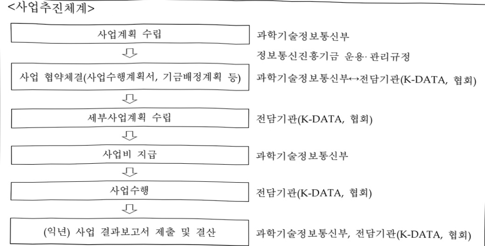

# 데이터 활용확산 정책지원

**해당 페이지**: PDF 875 ~ 881 쪽 해당

**부처**: 과학기술정보통신부
**분야**: 통신
**회계유형**: 기금
**2026 확정예산**: 1277.0 백만원
**전년대비 증감률**: -51.2%
**AI 도메인**: 데이터

---

<table border=1 style='margin: auto; word-wrap: break-word;'><tr><td style='text-align: center; word-wrap: break-word;'>사 업 명</td></tr><tr><td style='text-align: center; word-wrap: break-word;'>(39) 데이터 활용확산 정책지원 (2601-303)</td></tr></table>

사업 코드 정보

<table border=1 style='margin: auto; word-wrap: break-word;'><tr><td style='text-align: center; word-wrap: break-word;'>구분</td><td style='text-align: center; word-wrap: break-word;'>기금</td><td style='text-align: center; word-wrap: break-word;'>소관</td><td style='text-align: center; word-wrap: break-word;'>실국(기관)</td><td style='text-align: center; word-wrap: break-word;'>계정</td><td style='text-align: center; word-wrap: break-word;'>분야</td><td style='text-align: center; word-wrap: break-word;'>부문</td></tr><tr><td style='text-align: center; word-wrap: break-word;'>코드</td><td style='text-align: center; word-wrap: break-word;'>정보통신</td><td style='text-align: center; word-wrap: break-word;'>과학기술</td><td style='text-align: center; word-wrap: break-word;'>인공지능인프라</td><td rowspan="2">-</td><td style='text-align: center; word-wrap: break-word;'>130</td><td style='text-align: center; word-wrap: break-word;'>133</td></tr><tr><td style='text-align: center; word-wrap: break-word;'>명칭</td><td style='text-align: center; word-wrap: break-word;'>진흥기금</td><td style='text-align: center; word-wrap: break-word;'>정보통신부</td><td style='text-align: center; word-wrap: break-word;'>정책관</td><td style='text-align: center; word-wrap: break-word;'>통신</td><td style='text-align: center; word-wrap: break-word;'>정보통신</td></tr></table>

<table border=1 style='margin: auto; word-wrap: break-word;'><tr><td style='text-align: center; word-wrap: break-word;'>구분</td><td style='text-align: center; word-wrap: break-word;'>프로그램</td><td style='text-align: center; word-wrap: break-word;'>단위사업</td><td style='text-align: center; word-wrap: break-word;'>세부사업</td></tr><tr><td style='text-align: center; word-wrap: break-word;'>코드</td><td style='text-align: center; word-wrap: break-word;'>2600</td><td style='text-align: center; word-wrap: break-word;'>2601</td><td style='text-align: center; word-wrap: break-word;'>303</td></tr><tr><td style='text-align: center; word-wrap: break-word;'>명칭</td><td style='text-align: center; word-wrap: break-word;'>인공지능데이터진흥</td><td style='text-align: center; word-wrap: break-word;'>AI기술개발(정진)</td><td style='text-align: center; word-wrap: break-word;'>데이터 활용확산 정책지원</td></tr></table>

☐ 사업 성격

<table border=1 style='margin: auto; word-wrap: break-word;'><tr><td rowspan="2">신규</td><td rowspan="2">계속</td><td rowspan="2">완료</td><td rowspan="2">예비타당성 실시여부</td><td rowspan="2">총사업비 관리대상</td><td rowspan="2">총액계상 예산사업</td><td style='text-align: center; word-wrap: break-word;'>사업소관 변경정보</td></tr><tr><td style='text-align: center; word-wrap: break-word;'>2025예산 시 소관</td></tr><tr><td style='text-align: center; word-wrap: break-word;'></td><td style='text-align: center; word-wrap: break-word;'>O</td><td style='text-align: center; word-wrap: break-word;'></td><td style='text-align: center; word-wrap: break-word;'></td><td style='text-align: center; word-wrap: break-word;'></td><td style='text-align: center; word-wrap: break-word;'></td><td style='text-align: center; word-wrap: break-word;'></td></tr></table>

□ 사업 지원 형태 및 지원을

<table border=1 style='margin: auto; word-wrap: break-word;'><tr><td style='text-align: center; word-wrap: break-word;'>직접</td><td style='text-align: center; word-wrap: break-word;'>출자</td><td style='text-align: center; word-wrap: break-word;'>출연</td><td style='text-align: center; word-wrap: break-word;'>보조</td><td style='text-align: center; word-wrap: break-word;'>융자</td><td style='text-align: center; word-wrap: break-word;'>국고보조율(%)</td><td style='text-align: center; word-wrap: break-word;'>융자율(%)</td></tr><tr><td style='text-align: center; word-wrap: break-word;'></td><td style='text-align: center; word-wrap: break-word;'></td><td style='text-align: center; word-wrap: break-word;'></td><td style='text-align: center; word-wrap: break-word;'>O</td><td style='text-align: center; word-wrap: break-word;'></td><td style='text-align: center; word-wrap: break-word;'>100</td><td style='text-align: center; word-wrap: break-word;'></td></tr></table>

사업 소관부처 및 시행주체

<table border=1 style='margin: auto; word-wrap: break-word;'><tr><td style='text-align: center; word-wrap: break-word;'>사업명</td><td colspan="2">구분</td></tr><tr><td rowspan="2">데이터 활용·유통 활성화 기반 마련</td><td style='text-align: center; word-wrap: break-word;'>소관부처</td><td style='text-align: center; word-wrap: break-word;'>인공지능정책실 인공지능인프라정책관 인공지능데이터진흥과</td></tr><tr><td style='text-align: center; word-wrap: break-word;'>사업시행주체</td><td style='text-align: center; word-wrap: break-word;'>한국데이터산업진흥원</td></tr><tr><td rowspan="3">데이터 산업제도 기반 활성화</td><td rowspan="2">소관부처</td><td style='text-align: center; word-wrap: break-word;'>인공지능정책실 인공지능인프라정책관</td></tr><tr><td style='text-align: center; word-wrap: break-word;'>인공지능데이터진흥과</td></tr><tr><td style='text-align: center; word-wrap: break-word;'>사업시행주체</td><td style='text-align: center; word-wrap: break-word;'>한국데이터산업협회</td></tr></table>

---

### 가.지출계획 총괄표

(단위: 백만원, %)

<table border=1 style='margin: auto; word-wrap: break-word;'><tr><td rowspan="2">사업명</td><td rowspan="2">2024년 결산</td><td style='text-align: center; word-wrap: break-word;'>2025년 예산</td><td colspan="2">2026년 예산</td><td style='text-align: center; word-wrap: break-word;'>증감 (B-A)</td><td rowspan="2">(B-A)/A</td></tr><tr><td style='text-align: center; word-wrap: break-word;'>본예산</td><td style='text-align: center; word-wrap: break-word;'>추경(A)</td><td style='text-align: center; word-wrap: break-word;'>요구안</td><td style='text-align: center; word-wrap: break-word;'>본예산(B)</td></tr><tr><td style='text-align: center; word-wrap: break-word;'>데이터 활용확산 정책지원</td><td style='text-align: center; word-wrap: break-word;'>2,850</td><td style='text-align: center; word-wrap: break-word;'>2,615</td><td style='text-align: center; word-wrap: break-word;'>2,615</td><td style='text-align: center; word-wrap: break-word;'>1,277</td><td style='text-align: center; word-wrap: break-word;'>1,277</td><td style='text-align: center; word-wrap: break-word;'>△1,338</td></tr></table>

□ 기능별(내역사업별) 계획 내역

(단위:백만원)

<table border=1 style='margin: auto; word-wrap: break-word;'><tr><td rowspan="2"></td><td colspan="5">2024</td><td colspan="5">2025</td></tr><tr><td style='text-align: center; word-wrap: break-word;'>계획의(추정)</td><td style='text-align: center; word-wrap: break-word;'>계획현황</td><td style='text-align: center; word-wrap: break-word;'>집행액</td><td style='text-align: center; word-wrap: break-word;'>이월액</td><td style='text-align: center; word-wrap: break-word;'>불용액</td><td style='text-align: center; word-wrap: break-word;'>계획의(추정)</td><td style='text-align: center; word-wrap: break-word;'>계획현황</td><td style='text-align: center; word-wrap: break-word;'>집행액</td><td style='text-align: center; word-wrap: break-word;'>이월액</td><td style='text-align: center; word-wrap: break-word;'>불용액</td></tr><tr><td style='text-align: center; word-wrap: break-word;'>○ 기능별 분류(합계)</td><td style='text-align: center; word-wrap: break-word;'>2,850</td><td style='text-align: center; word-wrap: break-word;'>2,850</td><td style='text-align: center; word-wrap: break-word;'>2,850</td><td style='text-align: center; word-wrap: break-word;'>-</td><td style='text-align: center; word-wrap: break-word;'>-</td><td style='text-align: center; word-wrap: break-word;'>2,615</td><td style='text-align: center; word-wrap: break-word;'>2,615</td><td style='text-align: center; word-wrap: break-word;'>2,615</td><td style='text-align: center; word-wrap: break-word;'>-</td><td style='text-align: center; word-wrap: break-word;'>-</td></tr><tr><td style='text-align: center; word-wrap: break-word;'>• 데이터 활용·유통 활성화 기반 마련</td><td style='text-align: center; word-wrap: break-word;'>2,500</td><td style='text-align: center; word-wrap: break-word;'>2,500</td><td style='text-align: center; word-wrap: break-word;'>2,500</td><td style='text-align: center; word-wrap: break-word;'>-</td><td style='text-align: center; word-wrap: break-word;'>-</td><td style='text-align: center; word-wrap: break-word;'>1,965</td><td style='text-align: center; word-wrap: break-word;'>1,965</td><td style='text-align: center; word-wrap: break-word;'>1,965</td><td style='text-align: center; word-wrap: break-word;'>-</td><td style='text-align: center; word-wrap: break-word;'>-</td></tr><tr><td style='text-align: center; word-wrap: break-word;'>• 데이터 산업제도 기반 활성화</td><td style='text-align: center; word-wrap: break-word;'>350</td><td style='text-align: center; word-wrap: break-word;'>350</td><td style='text-align: center; word-wrap: break-word;'>350</td><td style='text-align: center; word-wrap: break-word;'>-</td><td style='text-align: center; word-wrap: break-word;'>-</td><td style='text-align: center; word-wrap: break-word;'>650</td><td style='text-align: center; word-wrap: break-word;'>650</td><td style='text-align: center; word-wrap: break-word;'>650</td><td style='text-align: center; word-wrap: break-word;'>-</td><td style='text-align: center; word-wrap: break-word;'>-</td></tr></table>

### 나. 사업설명자료

## 1 ) 사업목적·내용

- (데이터 활용학산 정책지원) [데이터 산업진흥 및 이용촉진에 관한 기본법]('22.4.20 시행)에

규정된 데이터 유통·거래 제도 운영으로 데이터 경제 활성화 기반 조성

- (데이터 활용·유통 활성화 기반 마련) 데이터 가치평가, 품질인증, 표준계약서 등

데이터 유통·활용 제도 운영 및 확산 지원

- (데이터 산업제도 기반 활성화) 데이터 경제 활성화를 위한 데이터 거래 전문인력

양성 및 데이터사업자 신고·등록 제도 운영

## 2 ) 사업개요

## 사업근거 및 추진경위

① 법령상 근거 및 조항 적시 : 「데이터 산업진흥 및 이용촉진에 관한 기본법」 제14조(가치평가 지원 등), 제16조(데이터사업자의 신고), 제20조(데이터 품질관리 등), 제21조(표준계약서), 제23조(데이터거래사 양성 지원)

---

## <데이터 활용·유통 활성화 기반 마련 >

법제14조(가치평가 지원 등) ① 과학기술정보통신부장관은 데이터에 대한 객관적인 가치평가를 촉진하기 위하여 데이터(공공데이터는 제외한다. 이하 이 조에서 같다) 가치의 평가 기법 및 평가 체계를 수립하여 이를 공표할 수 있다. ② ~ ⑧ (생 략)

법제20조(데이터 품질관리 등) ① 과학기술정보통신부장관은 데이터의 품질향상을 위하여 행정안전부장관과 협의하여 품질인증 등 품질관리에 필요한 사업을 추진할 수 있다. ② ~ ⑤ (생 략)

법제21조(표준계약서) 과학기술정보통신부장관은 데이터의 합리적 유통 및 공정한 거래를 위하여 공정거래위원회와 협의를 거쳐 표준계약서를 마련하고, 데이터사업자에게 그 사용을 권고할 수 있다. ② ~ ③ (생 략)

< 데이터 산업 제도 기반 활성화 >

법제16조(데이터 사업자의 신고) ① 다음 각 호의 사업자는 과학기술정보통신부장관에게 신고하여야 한다. 신고한 사항을 변경하는 경우에도 또한 같다. 1. 데이터거래사업자 2. 데이터분석제공사업자 ② ~ ③ (생 략)

법제23조(데이터거래사 양성 지원) ① 데이터 거래에 관한 전문지식이 있는 사람은 과학기술정보통신부장관에게 데이터거래사로 등록할 수 있다. ② ~ ⑤ (생 략)

## ② 추진경위

- '18. 6 : 데이터 경제 활성화 전략(VIP행사)

- '19. 1 : 데이터·AI경제 활성화 계획(혁신성장전략회의)

- '20. 07 : 한국판 뉴딜 종합계획

- '21. 10 : 데이터 산업진흥 및 이용촉진에 관한 기본법 제정('22.4.20 시행)

- '22. 6 : 국정과제 77-2(공공·민간데이터의 대통합으로 데이터 혁신강국 도약)

- '22. 7 : 데이터·AI 등 신산업 규제개선 현황 및 향후계획(국정현안점검조정회의)

- '22. 9 : 국가데이터정책위원회 출범

- '22. 9 : 대한민국 디지털 전략 1-2(충분한 디지털 자원 확보에 관한 사항)

- '23. 1 : 제1차 데이터산업 진흥 기본계획 수립

- '23. 11 : 데이터 경제 활성화 추진과제(비상경제장관회의)

- '24. 9 : 국가 AI전략 정책방향(국가AI위원회 출범식 및 제1차회의)

- '25. 01 : '인공지능 발전과 신뢰 기반 조성 등에 관한 기본법' 제정

- '25. 05 : 제21대 대통령선거 더불어민주당 정책공약집(AI 등 신사업 집중육성)

- '25. 08 : 국정과제 20(AI 3대 강국 도약을 위한 AI 고속도로 구축)

---

## □ 주요내용

① 사업규모

- 총사업비(해당되는 경우에만 기재) : 해당없음

- 사업기간 : 2023년 ~ 계속

- 최근 5년 간 투입된 사업비(예산액기준, 추경편성한 연도에는 추경포함)

<table border=1 style='margin: auto; word-wrap: break-word;'><tr><td style='text-align: center; word-wrap: break-word;'>연도</td><td style='text-align: center; word-wrap: break-word;'>2022</td><td style='text-align: center; word-wrap: break-word;'>2023</td><td style='text-align: center; word-wrap: break-word;'>2024</td><td style='text-align: center; word-wrap: break-word;'>2025</td><td style='text-align: center; word-wrap: break-word;'>2026</td></tr><tr><td style='text-align: center; word-wrap: break-word;'>사업비</td><td style='text-align: center; word-wrap: break-word;'>-</td><td style='text-align: center; word-wrap: break-word;'>850백만원</td><td style='text-align: center; word-wrap: break-word;'>2,850백만원</td><td style='text-align: center; word-wrap: break-word;'>2,615백만원</td><td style='text-align: center; word-wrap: break-word;'>1,277백만원</td></tr></table>

- 기타: 해당없음

② 사업추진체계

- 사업시행방법 : 보조, 위탁

- 사업시행주체 : 한국데이터산업진흥원(보조·민간위탁), 한국데이터산업협회(민간위탁)

- 사업 수혜자 : 데이터 관련 공공·민간 사업자, 연구소, 학교, 국민 등

- 보조, 융자, 출연, 출자 등의 경우 보조·융자 등 지원 비율 및 법적근거

<table border=1 style='margin: auto; word-wrap: break-word;'><tr><td style='text-align: center; word-wrap: break-word;'>내역사업명</td><td style='text-align: center; word-wrap: break-word;'>구분</td><td style='text-align: center; word-wrap: break-word;'>피보조·피출연 등 기관명</td><td style='text-align: center; word-wrap: break-word;'>지원 금액 (2026계획)</td><td style='text-align: center; word-wrap: break-word;'>지원 비율(%)</td><td style='text-align: center; word-wrap: break-word;'>보조율 법적근거 (해당 조항)</td></tr><tr><td rowspan="2">데이터 활용·유통 활성화 기반 마련</td><td style='text-align: center; word-wrap: break-word;'>보조</td><td rowspan="2">한국데이터 산업진흥원</td><td style='text-align: center; word-wrap: break-word;'>1,037백만원</td><td style='text-align: center; word-wrap: break-word;'>100</td><td style='text-align: center; word-wrap: break-word;'>지능정보화기본법 제42조, 제43조 데이터산업법 제14조, 제20조</td></tr><tr><td style='text-align: center; word-wrap: break-word;'>민간 위탁</td><td style='text-align: center; word-wrap: break-word;'>30백만원</td><td style='text-align: center; word-wrap: break-word;'>100</td><td style='text-align: center; word-wrap: break-word;'>지능정보화기본법 제42조, 제43조 데이터산업법 제21조</td></tr><tr><td style='text-align: center; word-wrap: break-word;'>데이터 산업제도 기반 활성화</td><td style='text-align: center; word-wrap: break-word;'>민간 위탁</td><td style='text-align: center; word-wrap: break-word;'>한국데이터 산업협회</td><td style='text-align: center; word-wrap: break-word;'>210백만원</td><td style='text-align: center; word-wrap: break-word;'>100</td><td style='text-align: center; word-wrap: break-word;'>데이터산업법 제16조, 제23조 같은법 시행령 제21조, 제22조, 제23조, 제29조 및 같은법 시행규칙 제4조</td></tr></table>

## 3 ) 2026년도 계획 산출 근거

① 데이터 활용유통 활성화 기반 마련 : (2025 당초 계획) 1,965 백만원 → (2026 계획) 1,067 백만원, 898 백만원 감액

- (산출) 데이터 가치평가제도 기획·운영 487백만원

데이터 품질관리제도 기획·운영 550백만원

데이터 표준계약서 제·개정 30백만원

② 데이터 산업 제도 기반 활성화 : (2025 당초 계획) 650백만원 → (2026 계획) 210백만원, 440백만원 감액 - (산출) 데이터 거래사 양성 160백만원

데이터 사업자 신고·접수 및 거래사 등록·관리 50백만원

---

## 4 ) 사업효과

☐ 사업영향, 산출물 성과지표 등

① 2022~2026년도 성과계획서 상 성과지표 및 최근 5년간 성과 달성도

<table border=1 style='margin: auto; word-wrap: break-word;'><tr><td style='text-align: center; word-wrap: break-word;'>성과지표</td><td style='text-align: center; word-wrap: break-word;'>구분</td><td style='text-align: center; word-wrap: break-word;'>2022</td><td style='text-align: center; word-wrap: break-word;'>2023</td><td style='text-align: center; word-wrap: break-word;'>2024</td><td style='text-align: center; word-wrap: break-word;'>2025</td><td style='text-align: center; word-wrap: break-word;'>2026</td><td style='text-align: center; word-wrap: break-word;'>2026 목표치산출근거</td><td style='text-align: center; word-wrap: break-word;'>측정산시(또는 측정방법)</td><td style='text-align: center; word-wrap: break-word;'>자료수집방법(또는 자료출처)</td></tr><tr><td rowspan="2">데이터가치평가·품질인증만족도(신규)(단위: 점)</td><td style='text-align: center; word-wrap: break-word;'>목표실적</td><td style='text-align: center; word-wrap: break-word;'>-</td><td style='text-align: center; word-wrap: break-word;'>-</td><td style='text-align: center; word-wrap: break-word;'>신규</td><td style='text-align: center; word-wrap: break-word;'>80</td><td style='text-align: center; word-wrap: break-word;'>80</td><td rowspan="2">보통 이상인80점을 목표치로 설정</td><td rowspan="2">(∑가치평가 지원기업 및 활용기업만족도 / 응답기업수) × 50% + (∑품질인증 지원기업 및 활용기업 만족도 / 응답기업수) × 50%</td><td rowspan="4">데이터 가치평가,품질인증 지원·활용기업 만족도 조사 / 사업결과보고서</td></tr><tr><td style='text-align: center; word-wrap: break-word;'>달성도</td><td style='text-align: center; word-wrap: break-word;'>-</td><td style='text-align: center; word-wrap: break-word;'>-</td><td style='text-align: center; word-wrap: break-word;'>-</td><td style='text-align: center; word-wrap: break-word;'>-</td><td style='text-align: center; word-wrap: break-word;'>-</td></tr><tr><td rowspan="2">데이터 거래사 교육생 만족도(단위: 점)</td><td style='text-align: center; word-wrap: break-word;'>목표실적</td><td style='text-align: center; word-wrap: break-word;'>-</td><td style='text-align: center; word-wrap: break-word;'>80</td><td style='text-align: center; word-wrap: break-word;'>80</td><td style='text-align: center; word-wrap: break-word;'>80</td><td style='text-align: center; word-wrap: break-word;'>5점 척도 만족도 조사익을 고려하여 우수(80점) 이상 목표</td><td rowspan="2">∑개인별 만족도 / 응답자수</td><td rowspan="2">데이터 거래사 교육생 만족도 조사 / 사업결과보고서</td></tr><tr><td style='text-align: center; word-wrap: break-word;'>달성도</td><td style='text-align: center; word-wrap: break-word;'>-</td><td style='text-align: center; word-wrap: break-word;'>108</td><td style='text-align: center; word-wrap: break-word;'>108</td><td style='text-align: center; word-wrap: break-word;'>106</td><td style='text-align: center; word-wrap: break-word;'>-</td></tr></table>

② 성과지표 이외의 연도별 사업추진 경과 및 실적

<table border=1 style='margin: auto; word-wrap: break-word;'><tr><td style='text-align: center; word-wrap: break-word;'>2023</td><td style='text-align: center; word-wrap: break-word;'>o 데이터 가치평가기관 지정(4개, &#x27;23.3.), 가치평가기관 협의회 운영(3회), 데이터 가치평가 가이드 개발(&#x27;23.12.) o 데이터 품질인증기관 지정 및 운영에 관한 지침 개발(&#x27;23.4), 데이터 품질 인증기관 지정(3개, &#x27;23.7.), AI학습데이터 품질인증 모델 개발(&#x27;23.12.) o 데이터 거래 표준계약서 개발(5종, &#x27;23.12.) 및 FGI·간담회·관계부처(&#x27;23.10.~12.) 의견수렴 o 데이터거래사 162명 양성</td></tr><tr><td style='text-align: center; word-wrap: break-word;'>2024</td><td style='text-align: center; word-wrap: break-word;'>o 데이터 가치평가 지원(90건, &#x27;24.12.), 데이터 가치평가 안내서 배포(&#x27;24.7.), 가치평가기관 협의회·가치평가자문단·평가모델 전문가협의회 개최(총 11회), 데이터 및업·사례공유회 개최(&#x27;24.12.) o 데이터 품질인증 지원(67건, &#x27;24.12.), 품질인증자문단·워킹그룹 운영(각 4회), 데이터 품질인증 가이드라인 개발(&#x27;24.12.), 데이터 품질대상·사례공유회 개최(&#x27;24.12.) o 데이터 표준계약서 및 활용 안내서 배포(&#x27;24.10.), 이용현황 조사(&#x27;24.11.~12.) o 데이터거래사 315명 양성</td></tr><tr><td style='text-align: center; word-wrap: break-word;'>2025</td><td style='text-align: center; word-wrap: break-word;'>o 데이터 가치평가 지원 개시(&#x27;25.3.), 가치평가기관 협의회·가치평가자문단 운영(총 4회), 데이터 가치평가모델 핵심변수 고도화 연구(&#x27;25.6~12.) o 데이터 품질인증 지원 개시(&#x27;25.3.), 품질인증자문단 운영(총 3회), 데이터 품질 인증 세미나 개최(&#x27;25.7.), 데이터 품질인증 가이드라인 고도화(&#x27;25.6~12.) o 데이터 표준계약서 활용 교육 실시(2회) o 데이터거래사(상반기) 305명 양성(&#x27;25.6~7) o 데이터거래사(하반기) 296명 양성(&#x27;25.11)</td></tr></table>

---

③ 향후(2026년도 이후) 기대효과

- 데이터 가치평가·품질관리 제도 운영 및 표준계약서 확산 등을 통해 신뢰할 수 있는 데이터 활용·유통 활성화 기반 마련

- 매년 데이터 거래사 500명 지속 양성 추진을 통한 데이터 거래 생태계 조성

- 데이터 사업자 신고·접수 및 거래사 등록·관리 개선

5) 타당성조사 및 예비타당성조사 시행여부 및 결과 요지 : 해당없음

## 6 ) 총사업비 대상사업 정보 : 해당없음

## 7 ) 사업 집행절차

<데이터 활용·유통 활성화 기반 마련 >

<table border=1 style='margin: auto; word-wrap: break-word;'><tr><td style='text-align: center; word-wrap: break-word;'>부처</td><td style='text-align: center; word-wrap: break-word;'></td><td style='text-align: center; word-wrap: break-word;'>피출연·피보조기관</td><td style='text-align: center; word-wrap: break-word;'></td><td style='text-align: center; word-wrap: break-word;'>간접보조사업자·사업수행자</td></tr><tr><td style='text-align: center; word-wrap: break-word;'>과학기술정보통신부(1,067백만원)</td><td style='text-align: center; word-wrap: break-word;'>=&gt;(1,067백만원)</td><td style='text-align: center; word-wrap: break-word;'>한국데이터산업진흥원(1,067백만원)</td><td style='text-align: center; word-wrap: break-word;'>-</td><td style='text-align: center; word-wrap: break-word;'>-</td></tr></table>

<데이터 산업제도 기반 활성화>

<table border=1 style='margin: auto; word-wrap: break-word;'><tr><td style='text-align: center; word-wrap: break-word;'>부처</td><td style='text-align: center; word-wrap: break-word;'></td><td style='text-align: center; word-wrap: break-word;'>피출연·피보조기관</td><td style='text-align: center; word-wrap: break-word;'></td><td style='text-align: center; word-wrap: break-word;'>간접보조사업자·사업수행자</td></tr><tr><td style='text-align: center; word-wrap: break-word;'>과학기술정보통신부(210백만원)</td><td style='text-align: center; word-wrap: break-word;'>=&gt;(210백만원)</td><td style='text-align: center; word-wrap: break-word;'>한국데이터산업협회(210백만원)</td><td style='text-align: center; word-wrap: break-word;'>-</td><td style='text-align: center; word-wrap: break-word;'>-</td></tr></table>

---

## 8 ) 각종 평가 : 해당없음

### 다. 최근 4년간 결산내역

## 1 ) 결산표

☐ 부처 결산내역

(단위: 백만원, %)

<table border=1 style='margin: auto; word-wrap: break-word;'><tr><td rowspan="2">闰도</td><td colspan="3">계획액</td><td rowspan="2">계획현액(A)</td><td rowspan="2">집행액(B)</td><td rowspan="2">집행률(B/A)</td><td rowspan="2">다음연도이월액</td><td rowspan="2">불용액</td></tr><tr><td style='text-align: center; word-wrap: break-word;'>본예산</td><td style='text-align: center; word-wrap: break-word;'>추경중감액</td><td style='text-align: center; word-wrap: break-word;'>추경</td></tr><tr><td style='text-align: center; word-wrap: break-word;'>2022</td><td style='text-align: center; word-wrap: break-word;'>-</td><td style='text-align: center; word-wrap: break-word;'>-</td><td style='text-align: center; word-wrap: break-word;'>-</td><td style='text-align: center; word-wrap: break-word;'>-</td><td style='text-align: center; word-wrap: break-word;'>-</td><td style='text-align: center; word-wrap: break-word;'>-</td><td style='text-align: center; word-wrap: break-word;'>-</td><td style='text-align: center; word-wrap: break-word;'>-</td></tr><tr><td style='text-align: center; word-wrap: break-word;'>2023</td><td style='text-align: center; word-wrap: break-word;'>850</td><td style='text-align: center; word-wrap: break-word;'>-</td><td style='text-align: center; word-wrap: break-word;'>850</td><td style='text-align: center; word-wrap: break-word;'>850</td><td style='text-align: center; word-wrap: break-word;'>850</td><td style='text-align: center; word-wrap: break-word;'>100.0</td><td style='text-align: center; word-wrap: break-word;'>-</td><td style='text-align: center; word-wrap: break-word;'>-</td></tr><tr><td style='text-align: center; word-wrap: break-word;'>2024</td><td style='text-align: center; word-wrap: break-word;'>2,850</td><td style='text-align: center; word-wrap: break-word;'>-</td><td style='text-align: center; word-wrap: break-word;'>2,850</td><td style='text-align: center; word-wrap: break-word;'>2,850</td><td style='text-align: center; word-wrap: break-word;'>2,850</td><td style='text-align: center; word-wrap: break-word;'>100.0</td><td style='text-align: center; word-wrap: break-word;'>-</td><td style='text-align: center; word-wrap: break-word;'>-</td></tr><tr><td style='text-align: center; word-wrap: break-word;'>2025</td><td style='text-align: center; word-wrap: break-word;'>2,615</td><td style='text-align: center; word-wrap: break-word;'>-</td><td style='text-align: center; word-wrap: break-word;'>2,615</td><td style='text-align: center; word-wrap: break-word;'>2,615</td><td style='text-align: center; word-wrap: break-word;'>2,615</td><td style='text-align: center; word-wrap: break-word;'>100.0</td><td style='text-align: center; word-wrap: break-word;'>-</td><td style='text-align: center; word-wrap: break-word;'>-</td></tr></table>

## 2 ) 주요 결산사항

2022~2025년 결산 주요사항: 해당없음

□ 2025년 계획변경 세부내역: 해당없음

---

### 원본 PDF 크롭 이미지

