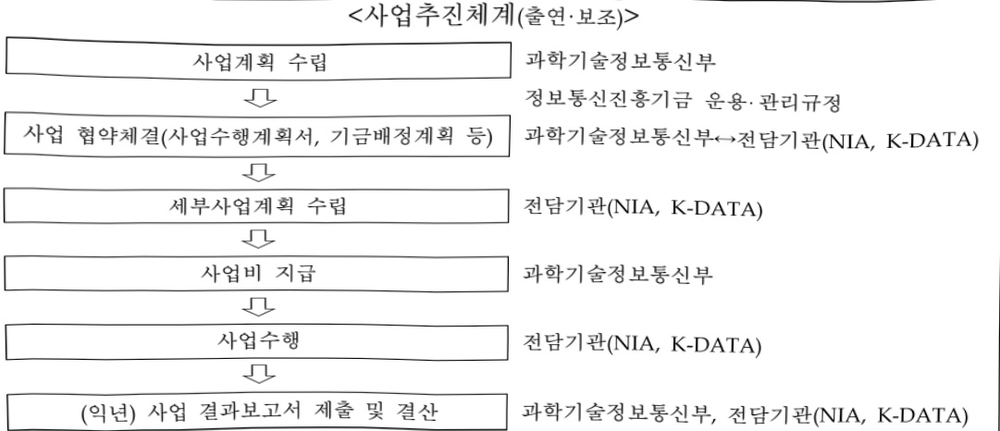
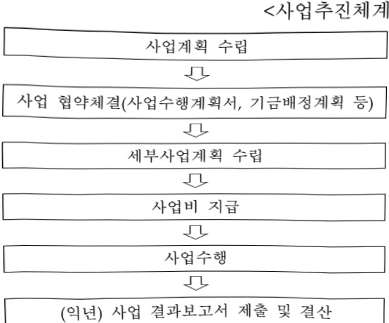

# 데이터경제인프라구축

**해당 페이지**: PDF 882 ~ 892 쪽 해당

**부처**: 과학기술정보통신부
**분야**: 통신
**회계유형**: 기금
**2026 확정예산**: 33511.0 백만원
**전년대비 증감률**: None%
**AI 도메인**: 데이터, 디지털전환(AX)

---

### 가.지출계획 총괄표

(단위: 백만원, %)

<table border=1 style='margin: auto; word-wrap: break-word;'><tr><td rowspan="2">사업명</td><td rowspan="2">2024년 결산</td><td colspan="2">2025년 예산</td><td colspan="2">2026년 예산</td><td rowspan="2">증감(B-A)</td><td rowspan="2">(B-A)/A</td></tr><tr><td style='text-align: center; word-wrap: break-word;'>본예산</td><td style='text-align: center; word-wrap: break-word;'>추경*(A)</td><td style='text-align: center; word-wrap: break-word;'>요구안</td><td style='text-align: center; word-wrap: break-word;'>본예산(B)</td></tr><tr><td style='text-align: center; word-wrap: break-word;'>데이터정제 인프라구축</td><td style='text-align: center; word-wrap: break-word;'>84,615</td><td style='text-align: center; word-wrap: break-word;'>46,714</td><td style='text-align: center; word-wrap: break-word;'>46,714</td><td style='text-align: center; word-wrap: break-word;'>33,511</td><td style='text-align: center; word-wrap: break-word;'>33,511</td><td style='text-align: center; word-wrap: break-word;'>△13,203</td><td style='text-align: center; word-wrap: break-word;'>△28.3%</td></tr></table>

□ 기능별(내역사업별) 계획 내역

(단위:백만원)

<table border=1 style='margin: auto; word-wrap: break-word;'><tr><td rowspan="2"></td><td colspan="5">2024</td><td colspan="5">2025</td><td rowspan="2">2026 계획</td></tr><tr><td style='text-align: center; word-wrap: break-word;'>계획액(추경)</td><td style='text-align: center; word-wrap: break-word;'>계획현액</td><td style='text-align: center; word-wrap: break-word;'>집행액</td><td style='text-align: center; word-wrap: break-word;'>이월액</td><td style='text-align: center; word-wrap: break-word;'>불용액</td><td style='text-align: center; word-wrap: break-word;'>계획액(추경)</td><td style='text-align: center; word-wrap: break-word;'>계획현액</td><td style='text-align: center; word-wrap: break-word;'>집행액</td><td style='text-align: center; word-wrap: break-word;'>이월액</td><td style='text-align: center; word-wrap: break-word;'>불용액</td></tr><tr><td style='text-align: center; word-wrap: break-word;'>○ 기능별 분류(함께)</td><td style='text-align: center; word-wrap: break-word;'>84,615</td><td style='text-align: center; word-wrap: break-word;'>84,683</td><td style='text-align: center; word-wrap: break-word;'>84,533</td><td style='text-align: center; word-wrap: break-word;'>-</td><td style='text-align: center; word-wrap: break-word;'>150</td><td style='text-align: center; word-wrap: break-word;'>46,714</td><td style='text-align: center; word-wrap: break-word;'>46,714</td><td style='text-align: center; word-wrap: break-word;'>46,714</td><td style='text-align: center; word-wrap: break-word;'>-</td><td style='text-align: center; word-wrap: break-word;'>150</td><td style='text-align: center; word-wrap: break-word;'>33,511</td></tr><tr><td style='text-align: center; word-wrap: break-word;'>· 국가데이터인프라 구축·확산</td><td style='text-align: center; word-wrap: break-word;'>2,804</td><td style='text-align: center; word-wrap: break-word;'>2,804</td><td style='text-align: center; word-wrap: break-word;'>2,804</td><td style='text-align: center; word-wrap: break-word;'>-</td><td style='text-align: center; word-wrap: break-word;'>-</td><td style='text-align: center; word-wrap: break-word;'>2,619</td><td style='text-align: center; word-wrap: break-word;'>2,619</td><td style='text-align: center; word-wrap: break-word;'>2,619</td><td style='text-align: center; word-wrap: break-word;'>-</td><td style='text-align: center; word-wrap: break-word;'>-</td><td style='text-align: center; word-wrap: break-word;'>2,880</td></tr><tr><td style='text-align: center; word-wrap: break-word;'>· AI 허브 운영</td><td style='text-align: center; word-wrap: break-word;'>5,400</td><td style='text-align: center; word-wrap: break-word;'>5,400</td><td style='text-align: center; word-wrap: break-word;'>5,400</td><td style='text-align: center; word-wrap: break-word;'>-</td><td style='text-align: center; word-wrap: break-word;'>-</td><td style='text-align: center; word-wrap: break-word;'>5,400</td><td style='text-align: center; word-wrap: break-word;'>5,400</td><td style='text-align: center; word-wrap: break-word;'>5,400</td><td style='text-align: center; word-wrap: break-word;'>-</td><td style='text-align: center; word-wrap: break-word;'>-</td><td style='text-align: center; word-wrap: break-word;'>30,000</td></tr><tr><td style='text-align: center; word-wrap: break-word;'>· 위원회 운영지원</td><td style='text-align: center; word-wrap: break-word;'>789</td><td style='text-align: center; word-wrap: break-word;'>857</td><td style='text-align: center; word-wrap: break-word;'>707</td><td style='text-align: center; word-wrap: break-word;'>-</td><td style='text-align: center; word-wrap: break-word;'>150</td><td style='text-align: center; word-wrap: break-word;'>789</td><td style='text-align: center; word-wrap: break-word;'>789</td><td style='text-align: center; word-wrap: break-word;'>639</td><td style='text-align: center; word-wrap: break-word;'>-</td><td style='text-align: center; word-wrap: break-word;'>150</td><td style='text-align: center; word-wrap: break-word;'>250</td></tr><tr><td style='text-align: center; word-wrap: break-word;'>· 데이터산업동향 분석*</td><td style='text-align: center; word-wrap: break-word;'>(677)</td><td style='text-align: center; word-wrap: break-word;'>(677)</td><td style='text-align: center; word-wrap: break-word;'>(677)</td><td style='text-align: center; word-wrap: break-word;'>-</td><td style='text-align: center; word-wrap: break-word;'>-</td><td style='text-align: center; word-wrap: break-word;'>(631)</td><td style='text-align: center; word-wrap: break-word;'>(631)</td><td style='text-align: center; word-wrap: break-word;'>(631)</td><td style='text-align: center; word-wrap: break-word;'></td><td style='text-align: center; word-wrap: break-word;'></td><td style='text-align: center; word-wrap: break-word;'>381</td></tr><tr><td style='text-align: center; word-wrap: break-word;'>· 데이터 구축·활용 네트워크 운영</td><td style='text-align: center; word-wrap: break-word;'>75,622</td><td style='text-align: center; word-wrap: break-word;'>75,622</td><td style='text-align: center; word-wrap: break-word;'>75,622</td><td style='text-align: center; word-wrap: break-word;'>-</td><td style='text-align: center; word-wrap: break-word;'>-</td><td style='text-align: center; word-wrap: break-word;'>37,906</td><td style='text-align: center; word-wrap: break-word;'>37,906</td><td style='text-align: center; word-wrap: break-word;'>37,906</td><td style='text-align: center; word-wrap: break-word;'>-</td><td style='text-align: center; word-wrap: break-word;'>-</td><td style='text-align: center; word-wrap: break-word;'>-</td></tr></table>

* DB산업육성(1131-501)에서 데이터경제인프라구축으로 내역(데이터산업동향분석) 이관

### 나.사업설명자료

## 1 ) 사업목적·내용

°「데이터산업법」에 따라 ‘데이터 경제 활성화’를 목표로 국가 데이터 인프라 구축·확산, AI허브 운영 및 통합제공체계 전환, 위원회 운영 지원, 데이터 산업동향 분석 등 사업 추진을 통해 중소기업·연구자·공공 등 데이터 활용 지원을 위한 데이터 생태계 기반 조성

- (국가데이터인프라 구축·확산) 민간·공공 데이터의 편리한 검색·활용 및 데이터 공급·수요·중개자에 대한 통합적인 서비스 제공을 위한 국가 데이터 인프라 운영 및 고도화 추진

※ 산재된 공공·민간 데이터 플랫폼을 국가 데이터산업 인프라로 연계·활용('One·원도우')

- (AI 허브 운영) 공공, 민간의 기구축·구축 예정인 학습용 데이터 수집체계 마련 및 연계·등록을 통해 학습용 데이터를 통합제공하고 국가적 차원에서 AI 활용을 지원

※ 고차원적 사고·추론·판단이 가능한 모델 고도화를 위해 생성·강화학습·필터링·재학습 등의 반복 구조의

추론 데이터 구축을 통해 AI 데이터 확충 및 개방 확대에 기여 및 글로벌 선도

---

-(위원회 운영지원) 국가 데이터 정책 전반을 총괄·조율하기 위한 국가데이터정책위원회 및 데이터 생산·거래·활용에 관한 분쟁 해소를 위한 데이터분쟁조정위원회 운영지원

- (데이터 산업동향 분석) 국내 데이터산업 경쟁력 강화를 위해 컨퍼런스 운영 등 활용

기반 확산 및 산업 활성화 정책에 필요한 시장동향 기초자료 생산·제공

## 2 ) 사업개요

## □ 사업근거 및 추진경위

① 법령상 근거 및 조항 적시

- 지능정보화기본법 제12조(한국지능정보사회진흥원의 설립), 제42조(데이터 관련 시책의 마련), 제43조(데이터의 유통·활용)

## <지능정보화 기본법>

제12조(한국지능정보사회진흥원의 설립) ① 과학기술정보통신부장관과 행정안전부장관은 지능정보사회 관련 정책의 개발과 국가기관등의 지능정보사회 시책 및 지능정보화 사업의 추진 등을 지원하기 위하여 한국지능정보사회진흥원(이하 "지능정보사회원"이라 한다)을 설립한다. ② ~ ⑥ (생 략) ⑦ 지능정보사회원이 아닌 자는 한국지능정보사회진흥원 또는 이와 유사한 명칭을 사용하지 못한다.

제42조(데이터 관련 시책의 마련) ① 정부는 지능정보화의 효율적 추진과 지능정보서비스의 제공·이용 활성화에 필요한 데이터의 생산·수집 및 유통·활용 등을 촉진하기 위하여 필요한 정책을 추진하여야 한다.(후략)

제43조(데이터의 유통·활용) ① 정부는 데이터의 효율적인 생산·수집·관리와 원활한 유통·활용을 위하여 국가기관등, 법인, 기관 및 단체와의 협력체계를 구축하고, 이를 위한 지원을 할 수 있다. ② ~ ③ (생 락) ④ 제2항에 따른 지원의 내용 및 방법 등에 관하여 필요한 사항과 제3항에 따른 데이터통합지원센터의 기능·운영 등에 관한 구체적인 사항은 대통령령으로 정한다.

- 데이터산업법 제6조(국가데이터정책위원회), 데이터산업법 제18조(데이터 유통 및 거래 체계 구축), 제19조(데이터 플랫폼에 대한 지원), 제27조(실태조사), 제34조(데이터분쟁조정위원회 설치 및 구성)

## <데이터산업법>

제6조(국가데이터정책위원회) ① 데이터 생산, 거래 및 활용 촉진에 관한 다음 각 호의 사항을 심의하기 위하여 국무총리 소속으로 국가데이터정책위원회를 둔다. 1. 기본계획 및 시행계획의 수립·추진에 관한 사항 2. ~ 5. (생 략) ② ~ ⑤ (생 략) ⑥ 위원회의 활동을 지원하고 행정사무를 처리하기 위하여 과학기술정보통신부에 사무국을 둘 수 있다.

제18조(데이터 유통 및 거래 제계 구축) ① 과학기술정보통신부장관은 데이터 유통 및 거래를 활성화하기 위하여 데이터 유통 및 거래 체계를 구축하고, 데이터 유통 및 거래 기반 조성을 위하여 필요한 지원을 할 수 있다. ② 과학기술정보통신부장관은 데이터 유통과 거래를 촉진하기 위하여 데이터유통시스템을 구축·운영할 수 있다. ③ 제1항에 따른 데이터 유통 및 거래 기반 조성 지원을 위하여 필요한 방법 및 기준과 제2항에 따른 데이터유통시스템의 운영 등에 필요한 사항은 대통령령으로 정한다.

제19조(데이터 플랫폼에 대한 지원) ① 정부는 데이터의 수집·가공·분석·유통 및 데이터에 기반한 서비스를 제공하는 플랫폼을 지원하는 사업을 할 수 있다. ② 제1항에 따른 지원사업의 방법, 내용, 범위 등 필요한 내용은 대통령령으로 정한다.

제27조(실태조사) ① 과학기술정보통신부장관은 데이터 거래 및 활용 기반 산업을 촉진하고, 이 법에 따른

---

시책 및 계획을 효율적으로 수립·주진하기 위하여 매년 데이터 산업 기반 및 데이터 대상 거래 현황

및 실태에 대한 조사를 실시하고 그 결과를 공표할 수 있다.

② 과학기술정보통신부장관은 제1항의 실태조사를 위하여 필요한 때에는 관계 중앙행정기관의 장, 지방자치단체의 장 또는 공공기관의 장에게 관련 자료(공공데이터에 관한 사항은 제외한다)를 요청할 수 있다. 이 경우 자료를 요청받은 관계 중앙행정기관의 장 등은 특별한 사정이 없으면 요청에 따라야 한다.

③ 과학기술정보통신부장관은 데이터사업자나 그 밖의 관련 기관 또는 단체에 대하여 제1항의 실태조사를 위하여 필요한 사항에 대한 협조를 요청할 수 있다.

④과학기술정보통신부장관은 대통령령으로 정하는 전문기관에 제1항에 따른 실태조사를 의뢰할 수 있다.

⑤ 제1항에 따른 실태조사의 범위와 방법 및 그 밖에 필요한 사항은 대통령령으로 정한다.

제34조(데이터분쟁조정위원회 설치 및 구성) ① 데이터 생산, 거래 및 활용에 관한 분쟁을 조정하기 위하여 데이터분쟁조정위원회를 둔다. ② ~ ⑤ (생 략) ⑥ 위원회의 업무를 지원하기 위하여 필요한 경우 사무국을 들 수 있다.

- 정보통신융합법 제32조(정보통신융합등 기술·서비스 개발 등의 지원)

<정보통신융합법>

32조(정보통신융합등 기술·서비스 개발 등의 지원) ① 과학기술정보통신부장관은 다른 산업 및 서비스 등에 정보통신의 접목을 통하여 생산성과 가치를 높일 수 있도록 노력하여야 한다. <개정 2017. 7. 26.> ② ~④ (생 략) ⑤ 제3항에 따른 전담기관에 관하여 이 법에서 정한 것을 제외하고는「민법」중 재단법인에 관한 규정을 준용하며, 전담기관의 운영 및 제2항 각 호의 업무수행에 필요한 사항은 대통령령으로 정한다.

- 인공지능기본법* 제15조(인공지능 학습용데이터 관련 시책의 수립 등)

## <인공지능기본법>

제15조(인공지능 학습용데이터 관련 시책의 수립 등) ① 과학기술정보통신부장관은 관계 중앙행정기관의 장과 협의하여 인공지능의 개발·활용 등에 사용되는 데이터(이하 "학습용데이터"라 한다)의 생산·수집·관리·유통 및 활용 등을 촉진하기 위하여 필요한 시책을 추진하여야 한다. ② 정부는 학습용데이터의 생산·수집·관리·유통 및 활용 등에 관한 시책을 효율적으로 추진하기 위하여 지원대상사업을 선정하고 예산의 범위에서 지원할 수 있다. ③ 정부는 학습용데이터의 생산·수집·관리·유통 및 활용의 활성화 등을 위하여 다양한 학습용데이터를 제작·생산하여 제공하는 사업(이하 "학습용데이터 구축사업"이라 한다)을 시행할 수 있다. ④ 과학기술정보통신부장관은 학습용데이터 구축사업의 효율적 수행을 위하여 학습용데이터를 통합적으로 제공·관리할 수 있는 시스템(이하 "통합제공시스템"이라 한다)을 구축·관리하고 민간이 자유롭게 이용할 수 있도록 제공하여야 한다. ⑤ 과학기술정보통신부장관은 통합제공시스템을 이용하는 자에 대하여 비용을 징수할 수 있다. ⑥ 그 밖에 제2항에 따른 지원대상사업의 선정 및 지원, 학습용데이터 구축사업의 시행, 통합제공시스템의 구축·관리 및 제5항에 따른 비용의 징수 등에 필요한 사항은 대통령령으로 정한다.

*「인공지능기본법」'26.1. 시행 예정

## ② 추진경위

- '17. 11 : 4차 산업혁명 대응 계획(4차산업혁명위원회)

- '18. 5 : 인공지능(AI) R&D 전략('18.5월, 4차산업혁명위원회)

- '18. 6 : 데이터 경제 활성화 전략(VIP행사)

- '18. 8 : 혁신성장 전략투자 방향(혁신성장 관계장관회의)

- '19. 1 : 데이터·AI경제 활성화 계획(혁신성장전략회의)

- '19. 12 : 인공지능 국가전략(국무회의)

- '20. 7 : 한국판 뉴딜 종합계획(비상경제회의)

- '21. 6 : 민·관 협력 기반 데이터 플랫폼 발전전략(4차산업혁명위원회)

---

- '21. 10 : 「데이터 산업진흥 및 이용촉진에 관한 기본법」 제정('22.4.20 시행)

- '22. 9: 국가데이터정책위원회 출범

- '22. 9 : 대한민국 디지털 전략 1-2(충분한 디지털 자원 확보에 관한 사항)

- '22. 12 : 新성장 4.0 전략 추진계획

- '23. 1 : 제1차 데이터산업 진흥 기본계획 수립

- '23. 4 : 초거대AI 경쟁력 강화 방안

- '23. 10 : 데이터분쟁조정위원회 출범

- '24. 4 : 인공지능(AI)-반도체 전략(이니셔티브) 의결

- '25. 1 : 「인공지능 발전과 신뢰 기반 조성 등에 관한 기본법」 제정('26.1.22 시행)

- '25. 2 : AI 데이터 확충 및 개방 확대방안

- '25. 8 : 국정과제 20 (AI 3대 강국 도약을 위한 AI 고속도로 구축)

(실천과제 3 : 생성형AI 학습데이터 확보 및 국가데이터 통합 플랫폼 구축)

## □ 주요내용

① 사업규모

- 총사업비 : 해당없음

- 사업기간 : '25년 ~ 계속

- 최근 5년 간 투입된 사업비(예산액기준, 추경편성한 연도에는 추경포함)

<table border=1 style='margin: auto; word-wrap: break-word;'><tr><td style='text-align: center; word-wrap: break-word;'>연도</td><td style='text-align: center; word-wrap: break-word;'>2022</td><td style='text-align: center; word-wrap: break-word;'>2023</td><td style='text-align: center; word-wrap: break-word;'>2024</td><td style='text-align: center; word-wrap: break-word;'>2025</td><td style='text-align: center; word-wrap: break-word;'>2026</td></tr><tr><td style='text-align: center; word-wrap: break-word;'>사업비</td><td style='text-align: center; word-wrap: break-word;'>649,608</td><td style='text-align: center; word-wrap: break-word;'>301,261</td><td style='text-align: center; word-wrap: break-word;'>84,615</td><td style='text-align: center; word-wrap: break-word;'>46,714</td><td style='text-align: center; word-wrap: break-word;'>33,511</td></tr></table>

## ② 사업추진체계

- 사업시행방법 : 직접수행, 출연, 보조

- 사업시행주체 : 과학기술정보통신부(직접), 한국지능정보사회진흥원(출연), 한국데이터산업진흥원(보조)

- 사업 수혜자 : 데이터 관련 공공·민간 사업자, 연구소, 학교, 국민 등

<table border=1 style='margin: auto; word-wrap: break-word;'><tr><td style='text-align: center; word-wrap: break-word;'>내역사업명</td><td style='text-align: center; word-wrap: break-word;'>구분</td><td style='text-align: center; word-wrap: break-word;'>피보조·피출연 등 기관명</td><td style='text-align: center; word-wrap: break-word;'>지원 금액 (2026계획)</td><td style='text-align: center; word-wrap: break-word;'>지원 비율(%)</td><td style='text-align: center; word-wrap: break-word;'>보조율 법적근거 (해당 조항)</td></tr><tr><td style='text-align: center; word-wrap: break-word;'>국가데이터 인프라 구축·확산</td><td style='text-align: center; word-wrap: break-word;'>출연</td><td style='text-align: center; word-wrap: break-word;'>한국지능 정보사회 진흥원</td><td style='text-align: center; word-wrap: break-word;'>2,880 백만원</td><td style='text-align: center; word-wrap: break-word;'>100</td><td style='text-align: center; word-wrap: break-word;'>지능정보화기본법 제12조 데이터 산업법 제18조 데이터 산업법 제19조</td></tr><tr><td style='text-align: center; word-wrap: break-word;'>AI 허브 운영</td><td style='text-align: center; word-wrap: break-word;'>출연</td><td style='text-align: center; word-wrap: break-word;'>한국지능 정보사회 진흥원</td><td style='text-align: center; word-wrap: break-word;'>30,000 백만원</td><td style='text-align: center; word-wrap: break-word;'>100</td><td style='text-align: center; word-wrap: break-word;'>지능정보화기본법 제12조 AI기본법 15조</td></tr><tr><td style='text-align: center; word-wrap: break-word;'>위원회 운영지원</td><td style='text-align: center; word-wrap: break-word;'>출연</td><td style='text-align: center; word-wrap: break-word;'>한국지능 정보사회 진흥원</td><td style='text-align: center; word-wrap: break-word;'>150 백만원</td><td style='text-align: center; word-wrap: break-word;'>100</td><td style='text-align: center; word-wrap: break-word;'>데이터 산업법 제6조 데이터 산업법 제34조</td></tr><tr><td style='text-align: center; word-wrap: break-word;'>데이터산업 동향분석</td><td style='text-align: center; word-wrap: break-word;'>보조</td><td style='text-align: center; word-wrap: break-word;'>한국 데이터산업 진흥원</td><td style='text-align: center; word-wrap: break-word;'>381 백만원</td><td style='text-align: center; word-wrap: break-word;'>100</td><td style='text-align: center; word-wrap: break-word;'>데이터 산업법 제27조 지능정보화기본법 제42조</td></tr></table>

---

## 3 ) 2026년도 계획 산출 근거

① 국가데이터인프라 구축·확산 : ('25) 2,619백만원 → ('26) 2,880백만원(181백만원)
- (산출) (국가데이터 인프라 개발·고도화) 905백만원 + (국가데이터 인프라 운영) 1,000백만원 + (국가데이터 인프라 거버넌스·확산) 975백만원

② AI 허브 운영: ('25) 5,400백만원 → ('26) 30,000백만원(24,600백만원)
- (산출) (AI 허브 인프라 운영) 5,400백만원 + (통합제공 표준 및 수집체계 마련) 680백만원 + (통합제공체계 연계 지원) 6,000백만원 + (추론 데이터 구축) 7,200백만원 + (통합제공시스템 운영) 10,120백만원 + (데이터가명정보 처리) 600백만원

③ 위원회 운영지원 : ('25) 789백만원 → ('26) 250백만원(△539백만원)
- 국가데이터정책위원회 운영지원: ('25) 164백만원 → ('26) 100백만원(△64백만원)
- (산출) (위원회 운영비) 94백만원 + (위원회 사업추진비) 6백만원

- 데이터분쟁조정위원회 운영지원: ('25) 325백만원 → ('26) 150백만원(△175백만원)
- (산출) (위원회 운영비) 74백만원 + (제도개선) 76백만원
- ※ 위원회 운영지원(활 데이터 정책 지원)의 내내역사업 중 데이터 표준화 사업 종료(△300백만원)

④ 데이터 산업동향 분석: ('25) (631백만원) → ('26) 381백만원(△250백만원)
- (산출) (데이터 산업현황 조사) 281백만원 + (데이터 활용기반 확산) 100백만원
* DB산업육성(1131-501)에서 데이터경제인프라구축으로 내역(데이터산업동향분석) 이관

---

## 4 ) 사업효과

사업영향, 산출물 성과지표 등

① 2022~2026년도 성과계획서 상 성과지표 및 최근 5년간 성과 달성도

<table border=1 style='margin: auto; word-wrap: break-word;'><tr><td style='text-align: center; word-wrap: break-word;'>성과지표</td><td style='text-align: center; word-wrap: break-word;'>구분</td><td style='text-align: center; word-wrap: break-word;'>2022</td><td style='text-align: center; word-wrap: break-word;'>2023</td><td style='text-align: center; word-wrap: break-word;'>2024</td><td style='text-align: center; word-wrap: break-word;'>2025</td><td style='text-align: center; word-wrap: break-word;'>2026</td><td style='text-align: center; word-wrap: break-word;'>2026 목표치산출근거</td><td style='text-align: center; word-wrap: break-word;'>측정산식(또는 측정방법)</td><td style='text-align: center; word-wrap: break-word;'>자료수집방법(또는 자료출처)</td></tr><tr><td rowspan="3">국가데이터인프라플랫폼 연계(단위: 진)</td><td style='text-align: center; word-wrap: break-word;'>목표</td><td style='text-align: center; word-wrap: break-word;'>-</td><td style='text-align: center; word-wrap: break-word;'>-</td><td style='text-align: center; word-wrap: break-word;'>-</td><td style='text-align: center; word-wrap: break-word;'>신규</td><td style='text-align: center; word-wrap: break-word;'>66</td><td rowspan="3">플랫폼 연계 누적 건수</td><td rowspan="3">One-윈도우 포털 플랫폼 연계 건수 측정</td><td rowspan="3">One-윈도우 포털</td></tr><tr><td style='text-align: center; word-wrap: break-word;'>실적</td><td style='text-align: center; word-wrap: break-word;'>-</td><td style='text-align: center; word-wrap: break-word;'>-</td><td style='text-align: center; word-wrap: break-word;'>-</td><td style='text-align: center; word-wrap: break-word;'>-</td><td style='text-align: center; word-wrap: break-word;'>-</td></tr><tr><td style='text-align: center; word-wrap: break-word;'>달성도</td><td style='text-align: center; word-wrap: break-word;'>-</td><td style='text-align: center; word-wrap: break-word;'>-</td><td style='text-align: center; word-wrap: break-word;'>-</td><td style='text-align: center; word-wrap: break-word;'>-</td><td style='text-align: center; word-wrap: break-word;'>-</td></tr><tr><td rowspan="3">통합제공시스템 구축률: (단위: %)</td><td style='text-align: center; word-wrap: break-word;'>목표</td><td style='text-align: center; word-wrap: break-word;'>-</td><td style='text-align: center; word-wrap: break-word;'>-</td><td style='text-align: center; word-wrap: break-word;'>-</td><td style='text-align: center; word-wrap: break-word;'>신규</td><td style='text-align: center; word-wrap: break-word;'>100</td><td rowspan="3">&#x27;26년 사업계획</td><td rowspan="3">통합제공체계 수립에 따라 연내 시스템 구현·시범 운영</td><td rowspan="3">보도자료 등 시스템 운영 증빙</td></tr><tr><td style='text-align: center; word-wrap: break-word;'>실적</td><td style='text-align: center; word-wrap: break-word;'>-</td><td style='text-align: center; word-wrap: break-word;'>-</td><td style='text-align: center; word-wrap: break-word;'>-</td><td style='text-align: center; word-wrap: break-word;'>-</td><td style='text-align: center; word-wrap: break-word;'>-</td></tr><tr><td style='text-align: center; word-wrap: break-word;'>달성도</td><td style='text-align: center; word-wrap: break-word;'>-</td><td style='text-align: center; word-wrap: break-word;'>-</td><td style='text-align: center; word-wrap: break-word;'>-</td><td style='text-align: center; word-wrap: break-word;'>-</td><td style='text-align: center; word-wrap: break-word;'>-</td></tr><tr><td rowspan="3">추론 데이터 종합 품질 (단위: %)</td><td style='text-align: center; word-wrap: break-word;'>목표</td><td style='text-align: center; word-wrap: break-word;'>-</td><td style='text-align: center; word-wrap: break-word;'>-</td><td style='text-align: center; word-wrap: break-word;'>-</td><td style='text-align: center; word-wrap: break-word;'>신규</td><td style='text-align: center; word-wrap: break-word;'>93.5</td><td rowspan="3">추론 데이터의 높은 구축난이도를 고려하여 학습용 데이터와 동일한 수준으로 신출</td><td rowspan="3">추론 데이터별 품질검증 결과*의 평균 * 다양성(10%) + 구문정확성(30%) + 의미정확성(40%) + 유효성(20%)</td><td rowspan="3">전문기관 결과보고서</td></tr><tr><td style='text-align: center; word-wrap: break-word;'>실적</td><td style='text-align: center; word-wrap: break-word;'>-</td><td style='text-align: center; word-wrap: break-word;'>-</td><td style='text-align: center; word-wrap: break-word;'>-</td><td style='text-align: center; word-wrap: break-word;'>-</td><td style='text-align: center; word-wrap: break-word;'>-</td></tr><tr><td style='text-align: center; word-wrap: break-word;'>달성도</td><td style='text-align: center; word-wrap: break-word;'>-</td><td style='text-align: center; word-wrap: break-word;'>-</td><td style='text-align: center; word-wrap: break-word;'>-</td><td style='text-align: center; word-wrap: break-word;'>-</td><td style='text-align: center; word-wrap: break-word;'>-</td></tr><tr><td rowspan="3">빅데이터 플랫폼 이용자 만족도* (단위: 점)</td><td style='text-align: center; word-wrap: break-word;'>목표</td><td style='text-align: center; word-wrap: break-word;'>80</td><td style='text-align: center; word-wrap: break-word;'>82</td><td style='text-align: center; word-wrap: break-word;'>82</td><td style='text-align: center; word-wrap: break-word;'>83</td><td style='text-align: center; word-wrap: break-word;'>-</td><td rowspan="3">&#x27;24년 목표치(82점) 대비 1점 목표치 상향</td><td rowspan="3">빅데이터 플랫폼 이용자 대상 만족도 조사</td><td rowspan="3">설문조사</td></tr><tr><td style='text-align: center; word-wrap: break-word;'>실적</td><td style='text-align: center; word-wrap: break-word;'>80.53</td><td style='text-align: center; word-wrap: break-word;'>82.04</td><td style='text-align: center; word-wrap: break-word;'>82.09</td><td style='text-align: center; word-wrap: break-word;'>83.03</td><td style='text-align: center; word-wrap: break-word;'>-</td></tr><tr><td style='text-align: center; word-wrap: break-word;'>달성도</td><td style='text-align: center; word-wrap: break-word;'>100.7</td><td style='text-align: center; word-wrap: break-word;'>100</td><td style='text-align: center; word-wrap: break-word;'>100.1</td><td style='text-align: center; word-wrap: break-word;'>100</td><td style='text-align: center; word-wrap: break-word;'>-</td></tr><tr><td rowspan="3">데이터 종합 품질 (단위: %)</td><td style='text-align: center; word-wrap: break-word;'>목표</td><td style='text-align: center; word-wrap: break-word;'>93</td><td style='text-align: center; word-wrap: break-word;'>93.5</td><td style='text-align: center; word-wrap: break-word;'>93.5</td><td style='text-align: center; word-wrap: break-word;'>93.5</td><td style='text-align: center; word-wrap: break-word;'>-</td><td rowspan="3">데이터 구축난이도 향상 등을 고려하여 &#x27;24년 목표치와 동일하게 유지</td><td rowspan="3">구축 데이터별 품질검증 결과*의 평균 (AI데이터셋)* 다양성(10%) + 구문정확성(40%) + 의미정확성(30%) + 유효성(20%)</td><td rowspan="3">전문기관 결과보고서</td></tr><tr><td style='text-align: center; word-wrap: break-word;'>실적</td><td style='text-align: center; word-wrap: break-word;'>93.73</td><td style='text-align: center; word-wrap: break-word;'>93.95</td><td style='text-align: center; word-wrap: break-word;'>-</td><td style='text-align: center; word-wrap: break-word;'>-</td><td style='text-align: center; word-wrap: break-word;'>-</td></tr><tr><td style='text-align: center; word-wrap: break-word;'>달성도</td><td style='text-align: center; word-wrap: break-word;'>100</td><td style='text-align: center; word-wrap: break-word;'>100</td><td style='text-align: center; word-wrap: break-word;'>-</td><td style='text-align: center; word-wrap: break-word;'>-</td><td style='text-align: center; word-wrap: break-word;'>-</td></tr></table>

* 내역사업 종료로 '26년 지표 미설정

② 성과지표 이외의 연도별 사업추진 경과 및 실적

<table border=1 style='margin: auto; word-wrap: break-word;'><tr><td rowspan="2">2022</td><td style='text-align: center; word-wrap: break-word;'>&lt;AI 허브 운영&gt;
o &#x27;21년 구축한 총 190종의 학습용 데이터를 AI 허브를 통해 개방(누적 개방 종수 381종) 및 학습용 데이터 활용실적 9만 건 달성</td></tr><tr><td style='text-align: center; word-wrap: break-word;'>&lt;데이터 산업동향 분석&gt;
o 데이터기업 8,940개의 현황 조사를 통한 데이터산업 현황 국가승인 기초통계 산출, 통계청 &#x27;22년 국가통계자체품질진단 &#x27;우수&#x27; 등급 획득, 진흥주간 및 데이터 그랜드 전퍼런스 개최(&#x27;22.12, 온/오프라인 총 5,032명 참가, 만족도 4.4점)</td></tr><tr><td style='text-align: center; word-wrap: break-word;'>2023</td><td style='text-align: center; word-wrap: break-word;'>&lt;AI 허브 운영&gt;</td></tr></table>

---

<table border=1 style='margin: auto; word-wrap: break-word;'><tr><td style='text-align: center; word-wrap: break-word;'></td><td style='text-align: center; word-wrap: break-word;'>o &#x27;22년 구축한 총 310종의 학습용 데이터를 AI 허브를 통해 개방(누적 개방 종수 691종) 및 학습용 데이터 활용실적 16만 건 달성
* 아동청소년 상담 데이터, 한국 전통 수육 재책화 제작 데이터, 한국어 및 다국어 초거대AI 말뭉치 데이터 등
&lt;위원회 운영지원&gt;
o 범부처 데이터 정책 전트를 타워 국가데이터정책위원회 운영을 통해「데이터 산업진흥 기본계획」 등 수립(전체회의 1회, 분과회의 25회 개최 등)
o 분쟁조정 제도 마련(운영세칙 등) 및 데이터분쟁조정위원회 구성(&#x27;23.10) 등
&lt;데이터 산업동향 분석&gt;
o 데이터기업 9,692개의 현황 조사를 통한 데이터산업 현황 국가승인 기초통계 산출, 통계청 &#x27;23년 국가통계자체품질진단 &#x27;우수&#x27; 등급 획득, 진흥주간 및 데이터 그랜드 전펴런스 행사 개최(&#x27;23.12, 참석자 총 668명, 만족도 4.5점)</td></tr><tr><td rowspan="2">2024</td><td style='text-align: center; word-wrap: break-word;'>&lt;국가데이터인프라 구축·화산&gt;
o 6개 분야 카탈로그 전환 및 연계 시범적용
o 통합 데이터 지도 이관 및 국가 데이터 인프라 시범 운영(&#x27;24.12~)
&lt;AI 허브 운영&gt;
o &#x27;23년에 구축한 총 142종의 데이터를 AI 허브를 통해 개방(누적 개방 종수 833종) 및 학습용 데이터 활용실적 27만 건 달성
* 한국어 및 다국어 초거대AI 말뭉치 데이터, 협상 데이터 등</td></tr><tr><td style='text-align: center; word-wrap: break-word;'>&lt;위원회 운영지원&gt;
o 국가데이터정책위원회 운영(전체회의, 분과위원회 개최 등)을 통해「&#x27;24년 데이터 산업진흥 시행계획」 수립 및 데이터 분야 &#x27;25년도 신규사업 기획방향 논의
o 데이터분쟁조정위원회 전체회의 개최(3월, 9월) 및 데이터 분쟁의 신축한 해결을 위한 대한상사중재원 업무협약 체결, 분쟁사건 접수에 따른 조정부 회의 운영 및 분쟁 해소
&lt;데이터 산업동향 분석&gt;
o 데이터기업 9,883개의 현황 조사를 통한 데이터산업현황 국가승인 기초통계 산출, 통계청 &#x27;24년 국가통계자체품질진단 &#x27;우수&#x27; 등급 획득, 진흥주간 및 데이터 그랜드 전펴런스 행사 개최(총 1,839명 참석, 만족도 4.4점)</td></tr><tr><td rowspan="4">2025</td><td style='text-align: center; word-wrap: break-word;'>&lt;국가데이터인프라 구축·화산&gt;
o 국가데이터인프라 기연계 플랫폼 대상 카탈로그(소재정보+상품화정보) 전환(8건*)
* AI-Hub, KAMP, 금융데이터거래소, 빅데이터플랫폼(①농식품 ②문화 ③산림 ④부동산 ⑤교통)
o One-윈도우 포털 대상 메타데이터(소재정보 중심) 기반 플랫폼 신규 연계(6개 플랫폼)
* DPG허브 국가공유데이터플랫폼, 국립한국해양OCEAN, KAMP, 산림청폰푸른샘2, 자동차데이터플랫폼</td></tr><tr><td style='text-align: center; word-wrap: break-word;'>&lt;AI 허브 운영&gt;
o &#x27;24년에 구축한 총 70종의 데이터를 AI 허브를 통해 개방(누적 개방 종수 903종) 및 학습용 데이터 활용실적 42.8만 건 달성(&#x27;25.11월말 기준)
* 한국어 및 다국어 초거대AI 말뭉치 데이터, 글로벌데이터, 온디바이스 데이터 등</td></tr><tr><td style='text-align: center; word-wrap: break-word;'>&lt;위원회 운영지원&gt;
o 데이터 관련 최신 관례를 통한 데이터 분쟁 유형을 분류, 유형에 맞는 분쟁 조정 접근법을 발굴하여 분쟁조정 제도체계 강화
o 유관 협회단체 온라인 배너 및 팝업, 전시회 및 설명회·포럼, 웹툰(매월)
배포 등 분쟁조정위원회 활성화를 위한 홍보 추진(총 26건)</td></tr><tr><td style='text-align: center; word-wrap: break-word;'>&lt;데이터 산업동향 분석&gt;
o 2025년 데이터산업 현황조사 및 주요 통계 산출, 데이터 그랜드 전펴런스 행사 지원</td></tr></table>

---

③ 향후(2026년도 이후) 기대효과 : 개조식으로 작성, 건 별로 계량적 수치 제시

## <국가데이터인프라 구축·확산>

- 국가 데이터산업 인프라 구축 및 운영을 통해 데이터 산업법의 효과적인 시행을 통합 지원하고 공공·민간의 데이터 활용을 촉진하여 데이터 산업 활성화에 기여

- 플랫폼 메타데이터·카탈로그 연계를 기반으로 카탈로그 기반 데이터 검색, 유통,

활용을 통한 국민의 데이터 활용 편의성 제고

* ① 메타데이터(소재정보 중심) : '25년(40개→46개, 누적), '28년까지 약 90개 플랫폼 추가 연계

② 데이터카탈로그(상품화정보) 전환 : '25년 6개, '27년까지 총 24개 플랫폼 연계

- 연계된 플랫폼 간 데이터 상품 중개·유통 기능을 구현('26년)하여 플랫폼 경계를 넘어 수요자·공급자 간 데이터 중개·활용 창출

## <AI 허브 운영>

- 공공, 민간의 고품질 학습용 데이터 등록·전환 및 통합제공을 통해 AI 데이터에 대한 접근성을 높이고, 공공·민간 영역에서 생활의 질을 높여줄 AI 서비스 개발 지원

- 부처, 민간이 보유하거나 사업 추진 후 사장되고 있는 학습용 데이터를 체계적으로 개방·관리할 수 있는 체계를 도입하여 민간 수요 대응 및 데이터 정책 효율성 강화

- 학습용 데이터 개방과 더불어 이용자 맞춤형 인프라 제공, 안전한 활용 지원 등을 통해 AI 데이터 활용 서비스의 개발 기간 및 비용 단축으로 기술혁신, 경쟁력 강화 지원

- 추론데이터는 단순 패턴을 학습한 초기모델이 복잡한 논리적 추론을 배워가는 과정을 학습할 수 있어 설명 가능한 AI로 발전 가능하며, AI의 성능·정확도 향상* 지원

* AI가 “왜” 특정 결과를 도출했는지 논리적 근거를 제공하여 사람이 이해할 수 있도록 과정과 이유를 설명하는 기술로 AI의 투명성과 신뢰성을 높이는 데 있어 필수적인 기술

**구글의 PaLM 모델 실험에서 CoT 데이터를 사용하여 수학 문제 정답률이 17%→78%로 증가

## <위원회 운영지원>

- 국가 데이터 AI·데이터 정책 심의·의결을 통한 신정부 AI·데이터 정책 및 국정과제 이행 기여

- 데이터 생산·거래·활용 관련한 분쟁으로 피해를 입고 어려움을 겪는 민간기업을

신속하고 효과적으로 조정·구제하여 분쟁 해결과 기업들의 애로사항을 지원

## <데이터 산업동향 분석>

-데이터 시장동향 관련 기초자료 생산 및 데이터 컨퍼런스 운영 등 데이터 활용

기반 확산을 통해 역량있는 혁신 중소·스타트업의 데이터 시장 진입 기반 강화

5) 타당성조사 및 예비타당성조사 시행여부 및 결과 요지 : 해당없음

6) 총사업비 대상사업 정보 : 해당없음

---

## 7 ) 사업 집행절차

## <사업추진체계(출연·보조)>

사업 협약체결(사업수행계획서, 기금배정계획 등)

과학기술정보통신부

정보통신진흥기금 운용·관리규정

세부사업계획 수립

과학기술정보통신부→전담기관(NIA, K-DATA)

전담기관(NIA, K-DATA)

과학기술정보통신부

(익년) 사업 결과보고서 제출 및 결산

전담기관(NIA, K-DATA)

과학기술정보통신부, 전담기관(NIA, K-DATA)

## <국가데이터인프라 구축·확산>

<table border=1 style='margin: auto; word-wrap: break-word;'><tr><td style='text-align: center; word-wrap: break-word;'>부처</td><td style='text-align: center; word-wrap: break-word;'></td><td style='text-align: center; word-wrap: break-word;'>피출연·피보조기관</td><td style='text-align: center; word-wrap: break-word;'></td><td style='text-align: center; word-wrap: break-word;'>간집보조사업자·사업수행자</td></tr><tr><td style='text-align: center; word-wrap: break-word;'>과학기술정보통신부 (2,880백만원)</td><td style='text-align: center; word-wrap: break-word;'>=&gt; (2,880백만원)</td><td style='text-align: center; word-wrap: break-word;'>한국지능정보사회진흥원 (380백만원)</td><td style='text-align: center; word-wrap: break-word;'>=&gt; (2,500백만원)</td><td style='text-align: center; word-wrap: break-word;'>원원도우 운영기관, 데이터관련 기관 등</td></tr></table>

## < AI 허브 운영 >

<table border=1 style='margin: auto; word-wrap: break-word;'><tr><td style='text-align: center; word-wrap: break-word;'>부처</td><td style='text-align: center; word-wrap: break-word;'></td><td style='text-align: center; word-wrap: break-word;'>피출연·피보조기관</td><td style='text-align: center; word-wrap: break-word;'></td><td style='text-align: center; word-wrap: break-word;'>간접보조사업자·사업수행자</td></tr><tr><td style='text-align: center; word-wrap: break-word;'>과학기술정보통신부(30,000백만원)</td><td style='text-align: center; word-wrap: break-word;'>=&gt;(30,000백만원)</td><td style='text-align: center; word-wrap: break-word;'>한국지능정보사회진흥원(5,750백만원)</td><td style='text-align: center; word-wrap: break-word;'>=&gt;(24,250백만원)</td><td style='text-align: center; word-wrap: break-word;'>AI허브 운영기관,AI 관련 기업기관 대학교·연구소 등</td></tr></table>

## <위원회 운영지원>

<table border=1 style='margin: auto; word-wrap: break-word;'><tr><td style='text-align: center; word-wrap: break-word;'>부처</td><td style='text-align: center; word-wrap: break-word;'></td><td style='text-align: center; word-wrap: break-word;'>피출연·피보조기관</td><td style='text-align: center; word-wrap: break-word;'></td><td style='text-align: center; word-wrap: break-word;'>간접보조사업자·사업수행자</td></tr><tr><td style='text-align: center; word-wrap: break-word;'>과학기술정보통신부(100백만원)</td><td style='text-align: center; word-wrap: break-word;'>-</td><td style='text-align: center; word-wrap: break-word;'>-</td><td style='text-align: center; word-wrap: break-word;'>-</td><td style='text-align: center; word-wrap: break-word;'>-</td></tr><tr><td style='text-align: center; word-wrap: break-word;'>과학기술정보통신부(150백만원)</td><td style='text-align: center; word-wrap: break-word;'>=&gt;(150백만원)</td><td style='text-align: center; word-wrap: break-word;'>한국지능정보사회진흥원(150백만원)</td><td style='text-align: center; word-wrap: break-word;'>-</td><td style='text-align: center; word-wrap: break-word;'>-</td></tr></table>

## <데이터산업 동향분석>

<table border=1 style='margin: auto; word-wrap: break-word;'><tr><td style='text-align: center; word-wrap: break-word;'>부처</td><td style='text-align: center; word-wrap: break-word;'></td><td style='text-align: center; word-wrap: break-word;'>피출연·피보조기관</td><td style='text-align: center; word-wrap: break-word;'></td><td style='text-align: center; word-wrap: break-word;'>간접보조사업자·사업수행자</td></tr><tr><td style='text-align: center; word-wrap: break-word;'>과학기술정보통신부 (381백만원)</td><td style='text-align: center; word-wrap: break-word;'>=&gt; (381백만원)</td><td style='text-align: center; word-wrap: break-word;'>한국데이터산업진흥원 (381백만원)</td><td style='text-align: center; word-wrap: break-word;'>-</td><td style='text-align: center; word-wrap: break-word;'>-</td></tr></table>

## 8 ) 각종 평가

---

<table border=1 style='margin: auto; word-wrap: break-word;'><tr><td style='text-align: center; word-wrap: break-word;'>국회(예결위, 상임위, 예정처, 국정감사 포함) 지적</td></tr><tr><td style='text-align: center; word-wrap: break-word;'>&lt;국가데이터인프라 구축·확산&gt;</td></tr><tr><td style='text-align: center; word-wrap: break-word;'>- 국가 데이터 산업 인프라 조성사업의 1차년도 예산이 ISP 계획 대비 감액된 점을 고려하여 사업계획 보완 필요(&#x27;24년 예산안 검토보고서)</td></tr><tr><td style='text-align: center; word-wrap: break-word;'>&lt;위원회 운영지원&gt;</td></tr><tr><td style='text-align: center; word-wrap: break-word;'>- 데이터분쟁조정위원회의 활성화 대책 마련하고 보고할 필요(&#x27;24년 국정감사)</td></tr><tr><td style='text-align: center; word-wrap: break-word;'>- 평가 : 해당없음</td></tr><tr><td style='text-align: center; word-wrap: break-word;'>, 사체평가 : 해당없음</td></tr></table>

2) 대외공개 평가 : 해당없음

3) 자체평가 : 해당없음

### 다. 최근 4년간 결산내역

## 1 ) 결산표

☐ 부처 결산내역

(단위: 백만원, %)

<table border=1 style='margin: auto; word-wrap: break-word;'><tr><td rowspan="2">闰五</td><td colspan="3">계획액</td><td rowspan="2">계획현액(A)</td><td rowspan="2">집행액(B)</td><td rowspan="2">집행를(B/A)</td><td rowspan="2">다음연도이월액</td><td rowspan="2">불용액</td></tr><tr><td style='text-align: center; word-wrap: break-word;'>본예산</td><td style='text-align: center; word-wrap: break-word;'>추경중감액</td><td style='text-align: center; word-wrap: break-word;'>추경</td></tr><tr><td style='text-align: center; word-wrap: break-word;'>2022</td><td style='text-align: center; word-wrap: break-word;'>649,608</td><td style='text-align: center; word-wrap: break-word;'>-</td><td style='text-align: center; word-wrap: break-word;'>649,608</td><td style='text-align: center; word-wrap: break-word;'>649,608</td><td style='text-align: center; word-wrap: break-word;'>649,608</td><td style='text-align: center; word-wrap: break-word;'>100.0</td><td style='text-align: center; word-wrap: break-word;'>-</td><td style='text-align: center; word-wrap: break-word;'>-</td></tr><tr><td style='text-align: center; word-wrap: break-word;'>2023</td><td style='text-align: center; word-wrap: break-word;'>318,961</td><td style='text-align: center; word-wrap: break-word;'>△17,700</td><td style='text-align: center; word-wrap: break-word;'>301,261</td><td style='text-align: center; word-wrap: break-word;'>301,261</td><td style='text-align: center; word-wrap: break-word;'>300,957</td><td style='text-align: center; word-wrap: break-word;'>99.9</td><td style='text-align: center; word-wrap: break-word;'>68</td><td style='text-align: center; word-wrap: break-word;'>236</td></tr><tr><td style='text-align: center; word-wrap: break-word;'>2024</td><td style='text-align: center; word-wrap: break-word;'>84,615</td><td style='text-align: center; word-wrap: break-word;'>-</td><td style='text-align: center; word-wrap: break-word;'>84,615</td><td style='text-align: center; word-wrap: break-word;'>84,683</td><td style='text-align: center; word-wrap: break-word;'>84,533</td><td style='text-align: center; word-wrap: break-word;'>99.9</td><td style='text-align: center; word-wrap: break-word;'>-</td><td style='text-align: center; word-wrap: break-word;'>150</td></tr><tr><td style='text-align: center; word-wrap: break-word;'>2025</td><td style='text-align: center; word-wrap: break-word;'>46,714</td><td style='text-align: center; word-wrap: break-word;'>-</td><td style='text-align: center; word-wrap: break-word;'>46,714</td><td style='text-align: center; word-wrap: break-word;'>46,714</td><td style='text-align: center; word-wrap: break-word;'>46,714</td><td style='text-align: center; word-wrap: break-word;'>100</td><td style='text-align: center; word-wrap: break-word;'>-</td><td style='text-align: center; word-wrap: break-word;'>-</td></tr></table>

## 2 ) 주요 결산사항

□ 2022~2025년 결산 주요사항

<table border=1 style='margin: auto; word-wrap: break-word;'><tr><td style='text-align: center; word-wrap: break-word;'>2022</td><td style='text-align: center; word-wrap: break-word;'>해당없음</td></tr><tr><td style='text-align: center; word-wrap: break-word;'>2023</td><td style='text-align: center; word-wrap: break-word;'>해당없음</td></tr><tr><td style='text-align: center; word-wrap: break-word;'>2024</td><td style='text-align: center; word-wrap: break-word;'>해당없음</td></tr><tr><td style='text-align: center; word-wrap: break-word;'>2025</td><td style='text-align: center; word-wrap: break-word;'>해당없음</td></tr></table>

□2025년 계획변경 세부내역 : 해당없음

---

<table border=1 style='margin: auto; word-wrap: break-word;'><tr><td style='text-align: center; word-wrap: break-word;'>사 업 명</td></tr><tr><td style='text-align: center; word-wrap: break-word;'>(31) 데이터기반산업경쟁력강화 (2604-301)</td></tr></table>

☐ 사업 코드 정보

<table border=1 style='margin: auto; word-wrap: break-word;'><tr><td style='text-align: center; word-wrap: break-word;'>구분</td><td style='text-align: center; word-wrap: break-word;'>기금</td><td style='text-align: center; word-wrap: break-word;'>소관</td><td style='text-align: center; word-wrap: break-word;'>실국(기관)</td><td style='text-align: center; word-wrap: break-word;'>계정</td><td style='text-align: center; word-wrap: break-word;'>분야</td><td style='text-align: center; word-wrap: break-word;'>부문</td></tr><tr><td style='text-align: center; word-wrap: break-word;'>코드</td><td style='text-align: center; word-wrap: break-word;'>방송통신</td><td style='text-align: center; word-wrap: break-word;'>과학기술</td><td style='text-align: center; word-wrap: break-word;'>인공지능인프라</td><td rowspan="2">-</td><td style='text-align: center; word-wrap: break-word;'>130</td><td style='text-align: center; word-wrap: break-word;'>133</td></tr><tr><td style='text-align: center; word-wrap: break-word;'>명칭</td><td style='text-align: center; word-wrap: break-word;'>발전기금</td><td style='text-align: center; word-wrap: break-word;'>정보통신부</td><td style='text-align: center; word-wrap: break-word;'>정책관</td><td style='text-align: center; word-wrap: break-word;'>통신</td><td style='text-align: center; word-wrap: break-word;'>정보통신</td></tr></table>

<table border=1 style='margin: auto; word-wrap: break-word;'><tr><td style='text-align: center; word-wrap: break-word;'>구분</td><td style='text-align: center; word-wrap: break-word;'>프로그램</td><td style='text-align: center; word-wrap: break-word;'>단위사업</td><td style='text-align: center; word-wrap: break-word;'>세부사업</td></tr><tr><td style='text-align: center; word-wrap: break-word;'>코드</td><td style='text-align: center; word-wrap: break-word;'>2600</td><td style='text-align: center; word-wrap: break-word;'>2604</td><td style='text-align: center; word-wrap: break-word;'>301</td></tr><tr><td style='text-align: center; word-wrap: break-word;'>명칭</td><td style='text-align: center; word-wrap: break-word;'>인공지능데이터진흥</td><td style='text-align: center; word-wrap: break-word;'>데이터산업경쟁력강화(방발)</td><td style='text-align: center; word-wrap: break-word;'>데이터기반산업경쟁력강화</td></tr></table>

☐ 사업 성격

<table border=1 style='margin: auto; word-wrap: break-word;'><tr><td style='text-align: center; word-wrap: break-word;'>신규</td><td style='text-align: center; word-wrap: break-word;'>계속</td><td style='text-align: center; word-wrap: break-word;'>완료</td><td style='text-align: center; word-wrap: break-word;'>예비타당성 실시여부</td><td style='text-align: center; word-wrap: break-word;'>총사업비 관리대상</td><td style='text-align: center; word-wrap: break-word;'>총액계상 예산사업</td><td style='text-align: center; word-wrap: break-word;'>사업소관 변경정보</td></tr><tr><td style='text-align: center; word-wrap: break-word;'></td><td style='text-align: center; word-wrap: break-word;'>O</td><td style='text-align: center; word-wrap: break-word;'></td><td style='text-align: center; word-wrap: break-word;'></td><td style='text-align: center; word-wrap: break-word;'></td><td style='text-align: center; word-wrap: break-word;'></td><td style='text-align: center; word-wrap: break-word;'>2025예산 시 소관</td></tr></table>

□ 사업 지원 형태 및 지원율

<table border=1 style='margin: auto; word-wrap: break-word;'><tr><td style='text-align: center; word-wrap: break-word;'>직접</td><td style='text-align: center; word-wrap: break-word;'>출자</td><td style='text-align: center; word-wrap: break-word;'>출연</td><td style='text-align: center; word-wrap: break-word;'>보조</td><td style='text-align: center; word-wrap: break-word;'>융자</td><td style='text-align: center; word-wrap: break-word;'>국고보조율(%)</td><td style='text-align: center; word-wrap: break-word;'>융자율(%)</td></tr><tr><td style='text-align: center; word-wrap: break-word;'></td><td style='text-align: center; word-wrap: break-word;'></td><td style='text-align: center; word-wrap: break-word;'>O</td><td style='text-align: center; word-wrap: break-word;'>O</td><td style='text-align: center; word-wrap: break-word;'></td><td style='text-align: center; word-wrap: break-word;'>100</td><td style='text-align: center; word-wrap: break-word;'></td></tr></table>

□ 사업 소관부처 및 시행주체

<table border=1 style='margin: auto; word-wrap: break-word;'><tr><td style='text-align: center; word-wrap: break-word;'>사업명</td><td colspan="2">구분</td></tr><tr><td rowspan="2">데이터 유통·활용 생태계 조성</td><td style='text-align: center; word-wrap: break-word;'>소관부처</td><td style='text-align: center; word-wrap: break-word;'>인공지능정책실 인공지능인프라정책관 인공지능데이터진흥과</td></tr><tr><td style='text-align: center; word-wrap: break-word;'>사업시행주체</td><td style='text-align: center; word-wrap: break-word;'>한국데이터산업진흥원</td></tr><tr><td rowspan="3">데이터선도 및 활성화 기반구축</td><td rowspan="2">소관부처</td><td style='text-align: center; word-wrap: break-word;'>인공지능정책실 인공지능인프라정책관</td></tr><tr><td style='text-align: center; word-wrap: break-word;'>인공지능데이터진흥과</td></tr><tr><td style='text-align: center; word-wrap: break-word;'>사업시행주체</td><td style='text-align: center; word-wrap: break-word;'>한국지능정보사회진흥원, 한국인터넷진흥원</td></tr></table>

---

### 원본 PDF 크롭 이미지

