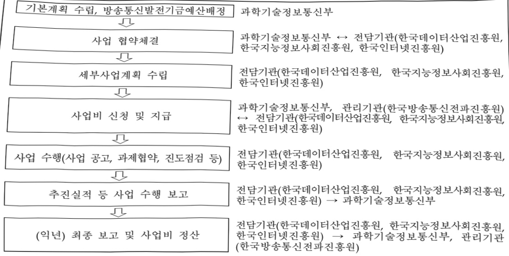

# 데이터기반산업경쟁력강화

**해당 페이지**: PDF 893 ~ 903 쪽 해당

**부처**: 과학기술정보통신부
**분야**: 통신
**회계유형**: 기금
**2026 확정예산**: 1280.0 백만원
**전년대비 증감률**: -3.8%
**AI 도메인**: 데이터

---

### 가.지출계획 총괄표

(단위: 백만원, %)

<table border=1 style='margin: auto; word-wrap: break-word;'><tr><td rowspan="2">2024년 사업명</td><td colspan="2">2025년 예산</td><td colspan="2">2026년 예산</td><td rowspan="2">중감 (B-A)</td><td rowspan="2">(B-A)/A</td></tr><tr><td style='text-align: center; word-wrap: break-word;'>본예산</td><td style='text-align: center; word-wrap: break-word;'>추경*(A)</td><td style='text-align: center; word-wrap: break-word;'>요구안</td><td style='text-align: center; word-wrap: break-word;'>본예산(B)</td></tr><tr><td style='text-align: center; word-wrap: break-word;'>민간경상보조</td><td style='text-align: center; word-wrap: break-word;'>11,960</td><td style='text-align: center; word-wrap: break-word;'>10,467</td><td style='text-align: center; word-wrap: break-word;'>10,467</td><td style='text-align: center; word-wrap: break-word;'>9,119</td><td style='text-align: center; word-wrap: break-word;'>9,119</td><td style='text-align: center; word-wrap: break-word;'>△1,348</td></tr><tr><td style='text-align: center; word-wrap: break-word;'>사업출연금</td><td style='text-align: center; word-wrap: break-word;'>3,080</td><td style='text-align: center; word-wrap: break-word;'>1,330</td><td style='text-align: center; word-wrap: break-word;'>1,330</td><td style='text-align: center; word-wrap: break-word;'>1,280</td><td style='text-align: center; word-wrap: break-word;'>1,280</td><td style='text-align: center; word-wrap: break-word;'>△50</td></tr></table>

※ 내내역사업(데이터 바우처, '25년 28,000백만원)은 '26회계연도부터 타세부사업(AI통합바우처, 2602-336)으로 이관됨에 따라 해당 내내역사업은 제외하고 작성

## □ 기능별(내역사업별) 계획 내역

(단위:백만원)

<table border=1 style='margin: auto; word-wrap: break-word;'><tr><td rowspan="2"></td><td colspan="5">2024</td><td colspan="5">2025</td><td rowspan="2">2026 계획</td></tr><tr><td style='text-align: center; word-wrap: break-word;'>계획액(추경)</td><td style='text-align: center; word-wrap: break-word;'>계획현액</td><td style='text-align: center; word-wrap: break-word;'>집행액</td><td style='text-align: center; word-wrap: break-word;'>이월액</td><td style='text-align: center; word-wrap: break-word;'>불용액</td><td style='text-align: center; word-wrap: break-word;'>계획액(추경)</td><td style='text-align: center; word-wrap: break-word;'>계획현액</td><td style='text-align: center; word-wrap: break-word;'>집행액</td><td style='text-align: center; word-wrap: break-word;'>이월액</td><td style='text-align: center; word-wrap: break-word;'>불용액</td></tr><tr><td style='text-align: center; word-wrap: break-word;'>○ 기능별 분류(합계)</td><td style='text-align: center; word-wrap: break-word;'>15,040</td><td style='text-align: center; word-wrap: break-word;'>15,040</td><td style='text-align: center; word-wrap: break-word;'>15,040</td><td style='text-align: center; word-wrap: break-word;'>-</td><td style='text-align: center; word-wrap: break-word;'>-</td><td style='text-align: center; word-wrap: break-word;'>11,797</td><td style='text-align: center; word-wrap: break-word;'>11,797</td><td style='text-align: center; word-wrap: break-word;'>11,797</td><td style='text-align: center; word-wrap: break-word;'>-</td><td style='text-align: center; word-wrap: break-word;'>-</td><td style='text-align: center; word-wrap: break-word;'>10,399</td></tr><tr><td style='text-align: center; word-wrap: break-word;'>• 데이터 유통·활용 생태계 조성</td><td style='text-align: center; word-wrap: break-word;'>11,960</td><td style='text-align: center; word-wrap: break-word;'>11,960</td><td style='text-align: center; word-wrap: break-word;'>11,960</td><td style='text-align: center; word-wrap: break-word;'>-</td><td style='text-align: center; word-wrap: break-word;'>-</td><td style='text-align: center; word-wrap: break-word;'>10,467</td><td style='text-align: center; word-wrap: break-word;'>10,467</td><td style='text-align: center; word-wrap: break-word;'>10,467</td><td style='text-align: center; word-wrap: break-word;'>-</td><td style='text-align: center; word-wrap: break-word;'>-</td><td style='text-align: center; word-wrap: break-word;'>9,119</td></tr><tr><td style='text-align: center; word-wrap: break-word;'>• 데이터 선도 및 활성화 기반구축</td><td style='text-align: center; word-wrap: break-word;'>3,080</td><td style='text-align: center; word-wrap: break-word;'>3,080</td><td style='text-align: center; word-wrap: break-word;'>3,080</td><td style='text-align: center; word-wrap: break-word;'>-</td><td style='text-align: center; word-wrap: break-word;'>-</td><td style='text-align: center; word-wrap: break-word;'>1,330</td><td style='text-align: center; word-wrap: break-word;'>1,330</td><td style='text-align: center; word-wrap: break-word;'>1,330</td><td style='text-align: center; word-wrap: break-word;'>-</td><td style='text-align: center; word-wrap: break-word;'>-</td><td style='text-align: center; word-wrap: break-word;'>1,280</td></tr></table>

### 나.사업설명자료

## 1 ) 사업목적·내용

- (데이터기반산업경쟁력강화) 데이터 수집·가공·활용 기반 강화를 통한 AI·데이터

경제 가속화 등을 위해 '데이터 유통·활용 생태계 조성', '데이터 선도 및 활성화

기반 구축' 등 추진

·(데이터 유통·활용 생태계 조성) 데이터 문제해결은행 운영으로 민간 주도 데이터·AI 활용을 지원하고, 마이데이터 기반 조성, 데이터 안심구역 운영 등 안전하고 신뢰할 수 있는 데이터 이용·활용 환경 조성

(데이터 선도 및 활성화 기반 구축) 데이터·AI 기반 중소기업·스타트업 중심의 데이터 분석·개발 인프라 및 실습 지원을 통해 데이터 활용을 촉진하고 가명정보 결합전문 기관 기반의 안전한 데이터 이용 환경 조성

---

## 2 ) 사업개요

① 법령상 근거 및 조항 적시

-지능정보화기본법

제12조(한국지능정보사회진흥원의 설립) ①~② (생 략)

③ 지능정보사회원은 다음 각 호의 사업을 한다.

1.~4. (생 략)

5. 데이터 관련 시책의 수립 지원, 시범사업 추진 및 전문기술의 지원 등 데이터의 생산·관리·유통·활용의 활성화를 위하여 필요한 지원

6.~12. (생 략)

④~⑧ (생 략)

제42조(데이터 관련 시책의 마련) ① 정부는 지능정보화의 효율적 추진과 지능정보서비스의 제공·이용 활성화에 필요한 데이터의 생산·수집 및 유통·활용 등을 촉진하기 위하여 필요한 정책을 추진하여야 한다.

② 과학기술정보통신부장관은 다음 각 호의 사항이 포함된 시책을 수립·시행하여야 한다.

다만, 공공데이터에 관한 사항은「공공데이터의 제공 및 이용 활성화에 관한 법률」에 따른다.

1. 데이터 관련 시책의 기본방향

2. 데이터의 생산·수집 및 유통·활용

3. 데이터 유통 활성화 및 유통체계 구축

4. 데이터의 생산·수집 및 유통·활용에 관한 기술개발의 추진

5. 데이터의 표준화 및 품질제고

6. 데이터 전문인력 양성 및 데이터 전문기업 육성

7. 제2호부터 제6호까지와 관련한 재원의 확보

8. 그 밖에 데이터의 생산·수집 및 유통·활용을 위하여 필요한 사항

③ (생 략)

제43조(데이터의 유통·활용) ① 정부는 데이터의 효율적인 생산·수집·관리와 원활한 유통·활용을 위하여 국가기관등, 법인, 기관 및 단체와의 협력체계를 구축하고, 이를 위한 지원을 할 수 있다.

② 정부는 지능정보사회 구현을 위하여 원활한 유통과 활용이 필요한 다음 각 호의 데이터를 생산·수집 또는 보유하고 있는 국가기관등, 법인, 기관 및 단체를 지원할 수 있다. 다만, 공공데이터에 관한 사항은「공공데이터의 제공 및 이용 활성화에 관한 법률」에 따른다.

1. 국가적으로 보존 및 이용 가치가 있는 자료로서 학술, 문화, 과학기술, 행정 등에 관한 디지털화된 자료나 디지털화의 필요성이 인정되는 데이터

2. 국민 생활의 질적 향상과 복리 증진 및 안전을 위하여 필요한 데이터

3. 국가 경제·산업의 발전을 도모하고 국가경쟁력 확보 등을 위하여 필요한 데이터

4. 그 밖에 지능정보화 및 지능정보서비스의 발전을 위하여 필요한 데이터

③~④ (생 략)

---

제13조(정보통신망의 이용촉진 등에 관한 사업) ① 과학기술정보통신부장관은 공공, 지역, 산업, 생활 및 사회적 복지 등 각 분야의 정보통신망의 이용촉진과 정보격차의 해소를 위하여 관련 기술·기기 및 응용서비스의 효율적인 활용·보급을 촉진하기 위한 사업을 대통령령으로 정하는 바에 따라 실시할 수 있다.

② 정부는 제1항에 따른 사업에 참여하는 자에게 재정 및 기술 등 필요한 지원을 할 수 있다.

## 제52조(한국인터넷진흥원) ①~② 생략

③ 인터넷진흥원은 다음 각 호의 사업을 한다.

1.~7. (생 략)

8.「개인정보 보호법」에 따른 개인정보 보호를 위한 대책의 연구 및 보호기술의 개발·보급 지원

9.~23. (생 략)

④ 인터넷진흥원이 사업을 수행하는 데 필요한 경비는 다음 각 호의 재원으로 충당한다.

1. 정부의 출연금

2. 제3항 각 호의 사업수행에 따른 수입금

3. 그 밖에 인터넷진흥원의 운영에 따른 수입금

⑤~⑦ (생 략)

-데이터산업진흥 및 이용촉진에 관한 기본법(데이터산업법)

제10조(데이터 결합 촉진) ① 과학기술정보통신부장관과 행정안전부장관은 데이터 간의 결합을 통해 새로운 데이터의 생산을 촉진하기 위하여 산업 간의 교류 및 다른 분야와의 융합기반 구축 등에 필요한 시책을 마련하여 추진하여야 한다.

② 과학기술정보통신부장관과 행정안전부장관은 공공데이터와 민간데이터의 결합 촉진을 위한 교류 및 협력 방안 등을 마련하여야 한다.

③ 과학기술정보통신부장관은 제1항 및 제2항에 따른 데이터 결합을 촉진하기 위하여 다음 각 호의 사항을 지원할 수 있다.

1. 국내외 연구기관·대학 및 기업 간의 연계 교육 프로그램의 개발과 시행

2.산업간데이터전문인력의교류활성화

3. 결합 데이터의 거래·활용을 위한 사업

4. 관련 사업을 실시하는 자에 대한 자금

5. 그 밖에 데이터 결합 및 융합 활성화에 필요한 사항

④ 제1항에 따른 시책 마련 및 추진의 내용, 제2항에 따른 교류 및 협력 방안, 제3항에 따른 지원 등에 필요한 사항은 대통령령으로 정한다.

안전하게 분석·활용할 수 있는 구역(이하"데이터안심구역"이라 한다)을 지정하여 운영할 수 있다.

② 과학기술정보통신부장관과 중앙행정기관의 장은 데이터안심구역 이용을 지원하기 위하여 미개방데이터, 분석 시스템 및 도구 등을 지원할 수 있다.

③과학기술정보통신부장관과 관계 중앙행정기관의 장은 제2항에 따른 미개방데이터 지원을 위하여

필요한 경우에는 정부 및 지방자치단체, 공공기관, 민간법인 등에 데이터 제공을 요청할 수 있다.

④과학기술정보통신부장관과 중앙행정기관의 장은 제3항에 따른 데이터 제공에 필요한 기술적

---

<table border=1 style='margin: auto; word-wrap: break-word;'><tr><td style='text-align: center; word-wrap: break-word;'>재정적 지원을 할 수 있다.</td></tr><tr><td style='text-align: center; word-wrap: break-word;'>⑤ 과학기술정보통신부장관과 관계 중앙행정기관의 장은 데이터안심구역에 대한 제3자의 불법적인 접근, 데이터의 변경·훼손·유출 및 파괴, 그 밖의 위험에 대하여 대통령령으로 정하는 바에 따라 기술적·물리적·관리적 보안대책을 수립·시행하여야 한다.</td></tr><tr><td style='text-align: center; word-wrap: break-word;'>⑥ 제1항부터 제5항까지에서 규정한 사항 외에 데이터안심구역의 지정 및 운영 등에 필요한 사항은 대통령령으로 정한다.</td></tr><tr><td style='text-align: center; word-wrap: break-word;'>제15조(데이터 이동의 촉진) 정부는 데이터의 생산, 거래 및 활용 촉진을 위하여 데이터를 컴퓨터 등 정보처리장치가 처리할 수 있는 형태로 본인 또는 제3자에게 원활하게 이동시킬 수 있는 제도적 기반을 구축하도록 노력하여야 한다.</td></tr><tr><td style='text-align: center; word-wrap: break-word;'>제31조(중소기업자에 대한 특별지원) ① 이 법에 따라 데이터산업과 관련한 각종 지원시책을 시행할 때에는「중소기업기본법」제2조의 중소기업자(이하 이 조에서 &quot;중소기업자&quot;라 한다)를 우선 고려하여야 한다.</td></tr><tr><td style='text-align: center; word-wrap: break-word;'>② 정부는 데이터산업에 대한 중소기업자의 참여 활성화를 위하여 노력하여야 하며, 이와 관련한 사항을 시행계획에 반영하여야 한다.</td></tr><tr><td style='text-align: center; word-wrap: break-word;'>③ 과학기술정보통신부장관은 데이터산업의 진흥을 위하여 중소기업자에게 데이터의 거래 및 가공 등에 필요한 비용의 일부를 지원하는 사업을 할 수 있다.</td></tr><tr><td style='text-align: center; word-wrap: break-word;'>④ 정부는 중소기업자인 데이터사업자에 대하여 경영·기술·재무·회계·인사 등의 개선을 위한 컨설팅 지원을 할 수 있다.</td></tr><tr><td style='text-align: center; word-wrap: break-word;'>제32조(전문기관의 지정·운영) ① 정부는 데이터산업 전반의 기반 조성 및 관련 산업의 육성을 효율적으로 지원하기 위하여 필요한 때에는 그 업무를 전문적으로 수행할 기관(이하 이 조에서 &quot;전문기관&quot;이라 한다)을 지정할 수 있다.</td></tr><tr><td style='text-align: center; word-wrap: break-word;'>② 전문기관은 이 법 또는 다른 법령에서 전문기관의 업무로 정하거나 전문기관에 위탁한 사업과 데이터 유통·활용 촉진 및 산업 기반 조성에 필요한 사업을 할 수 있다.</td></tr><tr><td style='text-align: center; word-wrap: break-word;'>③ 정부는 데이터산업 전반의 기반 조성 및 관련 산업의 육성과 관련된 업무를 수행하는 데 필요한 자금의 전부 또는 일부를 전문기관에 출연하거나 융자 등을 할 수 있다.</td></tr><tr><td style='text-align: center; word-wrap: break-word;'>④ 전문기관의 지정 및 운영 등에 관하여 필요한 사항은 대통령령으로 정한다.</td></tr></table>

## ② 추진경위

- '11.11 : 빅데이터를 활용한 스마트정부 구현안 수립(국가정보화전략위)

- '12.06 : 빅데이터 서비스 활성화 방안 수립(방통위)

- '13.12 : 빅데이터 산업 발전전략 수립(경제관계장관회의)

- '12.11 : 스마트 국가 구현을 위한 빅데이터 마스터플랜' 대통령 보고

- '14.12 : 데이터 산업 발전전략 수립(정보통신전략위원회)

---

- '15.03 : 빅데이터 분야 미래성장동력 종합실천계획(국과심미래특위) 및 K-ICT 전략 발표(미래창조과학부)

- '15.03 : 미래성장동력 종합실천계획 발표(미래창조과학부)

- '16.05 : K-ICT 전략 2016 발표(정보통신전략위원회)

- '16.05 : 빅데이터 산업 활성화를 위한 개인정보 보호제도 개선 방안 제5차 규제개혁 장관회의 상정(미래창조과학부)

- '18.06 : 데이터산업 활성화 전략 수립(4차산업혁명위원회)

- '19.01 : 데이터 · AI 경제 활성화 전략(관계부처합동)

- '19.12 : 인공지능 국가전략(관계부처합동)

- '20.07 : 한국판 뉴딜 종합계획(관계부처합동)

- '20.12 : 지능정보화기본법 시행

- '21.07 : 한국판 뉴딜 2.0 추진계획(관계부처합동)

- '22.04. : 데이터 산업진흥 및 이용촉진에 관한 기본법 시행

- '22.09 : 대한민국 디지털 전략(관계부처합동)

- '23.01 : 제1차 데이터산업 진흥 기본계획(관계부처합동)

- '23.04 : 디지털플랫폼정부 실현계획(디플정위원회)

- '23.11 : 데이터 경제 활성화 추진과제(비상경제장관회의)

- '24.08 : '24년 데이터 산업진흥 시행계획(관계부처합동)

- '25.08 : 국정과제 20(AI 3대 강국 도약을 위한 AI 고속도로 구축)

## 주요내용

① 사업규모

- 총사업비 : 해당없음

- 사업기간 : 2013년 ~ 계속

- 최근 5년 간 투입된 사업비(예산액기준, 추경편성한 연도에는 추경포함)

<table border=1 style='margin: auto; word-wrap: break-word;'><tr><td style='text-align: center; word-wrap: break-word;'>$ \underline{\text{焼}} $</td><td style='text-align: center; word-wrap: break-word;'>2022</td><td style='text-align: center; word-wrap: break-word;'>2023</td><td style='text-align: center; word-wrap: break-word;'>2024</td><td style='text-align: center; word-wrap: break-word;'>2025</td><td style='text-align: center; word-wrap: break-word;'>2026( $ \underline{\text{焼}} $)</td></tr><tr><td style='text-align: center; word-wrap: break-word;'>$ \underline{\text{사업비}} $</td><td style='text-align: center; word-wrap: break-word;'>20,584 $ \underline{\text{백만원}} $</td><td style='text-align: center; word-wrap: break-word;'>16,965 $ \underline{\text{백만원}} $</td><td style='text-align: center; word-wrap: break-word;'>15,040 $ \underline{\text{백만원}} $</td><td style='text-align: center; word-wrap: break-word;'>11,797 $ \underline{\text{백만원}} $</td><td style='text-align: center; word-wrap: break-word;'>10,399 $ \underline{\text{백만원}} $</td></tr></table>

-기타: 해당없음

② 사업추진체계

- 사업시행방법 : 보조, 출연

- 사업시행주체 : 한국데이터산업진흥원, 한국지능정보사회진흥원, 한국인터넷진흥원

- 사업 수혜자 : 데이터·AI분야 중소 및 중견기업, 스타트업, 학교, 일반국민 등

- 보조, 융자, 출연, 출자 등의 경우 보조·융자 등 지원 비율 및 법적근거

---

<table border=1 style='margin: auto; word-wrap: break-word;'><tr><td style='text-align: center; word-wrap: break-word;'>내역사업명</td><td style='text-align: center; word-wrap: break-word;'>구분</td><td style='text-align: center; word-wrap: break-word;'>피보조·피출연 등 기관명</td><td style='text-align: center; word-wrap: break-word;'>지원 금액 (2026계획)</td><td style='text-align: center; word-wrap: break-word;'>지원 비율(%)</td><td style='text-align: center; word-wrap: break-word;'>보조율 법적근거 (해당 조항)</td></tr><tr><td rowspan="2">데이터 유통·활용 생태계 조성</td><td style='text-align: center; word-wrap: break-word;'>보조</td><td style='text-align: center; word-wrap: break-word;'>한국데이터 산업진흥원</td><td style='text-align: center; word-wrap: break-word;'>9,119</td><td style='text-align: center; word-wrap: break-word;'>100</td><td style='text-align: center; word-wrap: break-word;'>- 지능정보화기본법 제42조, 제43조 - 데이터산업법 제11조, 제15조, 제31조</td></tr><tr><td style='text-align: center; word-wrap: break-word;'>출연</td><td style='text-align: center; word-wrap: break-word;'>한국자능정보 사회진흥원</td><td style='text-align: center; word-wrap: break-word;'>1,230</td><td style='text-align: center; word-wrap: break-word;'>100</td><td style='text-align: center; word-wrap: break-word;'>- 지능정보화기본법 제12조, 제42조, 제43조 - 데이터산업법 제10조, 제32조</td></tr><tr><td style='text-align: center; word-wrap: break-word;'>데이터 선도 및 활성화 기반구축</td><td style='text-align: center; word-wrap: break-word;'>출연</td><td style='text-align: center; word-wrap: break-word;'>한국인터넷 진흥원</td><td style='text-align: center; word-wrap: break-word;'>50</td><td style='text-align: center; word-wrap: break-word;'>100</td><td style='text-align: center; word-wrap: break-word;'>- 정보통신망법 제13조, 제52조</td></tr></table>

## 3 ) 2026년도 계획 산출 근거

□ 데이터기반산업경쟁력강화 : (2025 당초 계획) 39,797백만원 → (2026 계획) 10,399백만원, 29,398백만원 감액

① 데이터 유통·활용 생태계 조성 : (2025 당초 계획) 38,467백만원 → (2026 계획) 9,119백만원, 29,348백만원 감액 - (산출) 데이터 문제해결은행 운영 3,727백만원

마이데이터 기반조성 3,048백만원

데이터 안심구역 운영 2,344백만원

② 데이터 선도 및 활성화 기반 구축 : (2025 당초 계획) 1,330백만원 → (2026 계획) 1,280백만원, 50백만원 감액 - (산출) 데이터·AI 활용지원 인프라 운영 및 확충 1,280백만원

## 4 ) 사업효과

☐ 사업영향, 산출물 성과지표 등

① 2022~2026년도 성과계획서 상 성과지표 및 최근 5년간 성과 달성도

<table border=1 style='margin: auto; word-wrap: break-word;'><tr><td style='text-align: center; word-wrap: break-word;'>성과지표</td><td style='text-align: center; word-wrap: break-word;'>구분</td><td style='text-align: center; word-wrap: break-word;'>2022</td><td style='text-align: center; word-wrap: break-word;'>2023</td><td style='text-align: center; word-wrap: break-word;'>2024</td><td style='text-align: center; word-wrap: break-word;'>2025</td><td style='text-align: center; word-wrap: break-word;'>2026</td><td style='text-align: center; word-wrap: break-word;'>2026 목표치산출근거</td><td style='text-align: center; word-wrap: break-word;'>측정산식(또는 측정방법)</td><td style='text-align: center; word-wrap: break-word;'>자료수집방법(또는 자료출처)</td></tr><tr><td rowspan="3">데이터유통·활용 지원만족도* (단위: 점)</td><td style='text-align: center; word-wrap: break-word;'>목표</td><td style='text-align: center; word-wrap: break-word;'>신규</td><td style='text-align: center; word-wrap: break-word;'>80</td><td style='text-align: center; word-wrap: break-word;'>80</td><td style='text-align: center; word-wrap: break-word;'>80</td><td style='text-align: center; word-wrap: break-word;'>-</td><td rowspan="3">신규 기업 및 과제 선정 등의 상황을 고려하여 전년도와 동일한 만족(80점) 수준을 목표치로 설정</td><td rowspan="3">데이터바우처 활용만족도(80%)+ 마이데이터 지원과제 서비스 이용만족도(20%)</td><td rowspan="3">만족도 조사 결과 보고서</td></tr><tr><td style='text-align: center; word-wrap: break-word;'>실적</td><td style='text-align: center; word-wrap: break-word;'>-</td><td style='text-align: center; word-wrap: break-word;'>88.3</td><td style='text-align: center; word-wrap: break-word;'>87.7</td><td style='text-align: center; word-wrap: break-word;'>-</td><td style='text-align: center; word-wrap: break-word;'>-</td></tr><tr><td style='text-align: center; word-wrap: break-word;'>달성도</td><td style='text-align: center; word-wrap: break-word;'>-</td><td style='text-align: center; word-wrap: break-word;'>110.4</td><td style='text-align: center; word-wrap: break-word;'>109.6</td><td style='text-align: center; word-wrap: break-word;'>-</td><td style='text-align: center; word-wrap: break-word;'>-</td></tr><tr><td rowspan="3">마이데이터 지원과제 서비스 이용 만족도 (단위: 점)</td><td style='text-align: center; word-wrap: break-word;'>목표</td><td style='text-align: center; word-wrap: break-word;'>-</td><td style='text-align: center; word-wrap: break-word;'>-</td><td style='text-align: center; word-wrap: break-word;'>-</td><td style='text-align: center; word-wrap: break-word;'>신규</td><td style='text-align: center; word-wrap: break-word;'>75</td><td rowspan="3">단일지표 분리 및 도전성 등을 고려하여, 전년 목표 대비 7.1% 상향 설정</td><td rowspan="3">∑(항목별점수× 항목별응답자수)/응답자수</td><td rowspan="3">만족도 조사 결과 보고서</td></tr><tr><td style='text-align: center; word-wrap: break-word;'>실적</td><td style='text-align: center; word-wrap: break-word;'>-</td><td style='text-align: center; word-wrap: break-word;'>-</td><td style='text-align: center; word-wrap: break-word;'>-</td><td style='text-align: center; word-wrap: break-word;'>-</td><td style='text-align: center; word-wrap: break-word;'>-</td></tr><tr><td style='text-align: center; word-wrap: break-word;'>달성도</td><td style='text-align: center; word-wrap: break-word;'>-</td><td style='text-align: center; word-wrap: break-word;'>-</td><td style='text-align: center; word-wrap: break-word;'>-</td><td style='text-align: center; word-wrap: break-word;'>-</td><td style='text-align: center; word-wrap: break-word;'>-</td></tr><tr><td style='text-align: center; word-wrap: break-word;'>데이터안심구역</td><td style='text-align: center; word-wrap: break-word;'>목표</td><td style='text-align: center; word-wrap: break-word;'>-</td><td style='text-align: center; word-wrap: break-word;'>-</td><td style='text-align: center; word-wrap: break-word;'>신규</td><td style='text-align: center; word-wrap: break-word;'>100</td><td style='text-align: center; word-wrap: break-word;'>100</td><td style='text-align: center; word-wrap: break-word;'>최근 3년간</td><td style='text-align: center; word-wrap: break-word;'>안심구역방문</td><td style='text-align: center; word-wrap: break-word;'>데이터안심구역</td></tr></table>

---

<table border=1 style='margin: auto; word-wrap: break-word;'><tr><td rowspan="2">활용도 (단위: %)</td><td style='text-align: center; word-wrap: break-word;'>실적</td><td style='text-align: center; word-wrap: break-word;'>-</td><td style='text-align: center; word-wrap: break-word;'>-</td><td style='text-align: center; word-wrap: break-word;'>-</td><td style='text-align: center; word-wrap: break-word;'>-</td><td style='text-align: center; word-wrap: break-word;'>-</td><td rowspan="2">안심구역 방문 이용자수 및 이용만족도를 고려하여 목표치 설정</td><td rowspan="2">이용자수 목표 달성도(20%) + 이용자 만족도 목표 달성도(80%)</td><td rowspan="2">이용만족도 조사 결과 및 출입관리대장</td></tr><tr><td style='text-align: center; word-wrap: break-word;'>달성도</td><td style='text-align: center; word-wrap: break-word;'>-</td><td style='text-align: center; word-wrap: break-word;'>-</td><td style='text-align: center; word-wrap: break-word;'>-</td><td style='text-align: center; word-wrap: break-word;'>-</td><td style='text-align: center; word-wrap: break-word;'>-</td></tr><tr><td rowspan="3">데이터·AI 활용 수요확대 (단위: 건)</td><td style='text-align: center; word-wrap: break-word;'>목표</td><td style='text-align: center; word-wrap: break-word;'>-</td><td style='text-align: center; word-wrap: break-word;'>-</td><td style='text-align: center; word-wrap: break-word;'>신규</td><td style='text-align: center; word-wrap: break-word;'>1,700</td><td style='text-align: center; word-wrap: break-word;'>1,700</td><td rowspan="3">25년도 센터 데이터·AI 지원 이용신청 목표(1,700건) 대비 5% 이상 상향된 목표치 설정</td><td rowspan="3">데이터·AI 활용 수요확대를 위한 빅데이터센터 온·오프라인 이용 신청 수 누적 계산</td><td rowspan="3">센터 사업 결과 보고서</td></tr><tr><td style='text-align: center; word-wrap: break-word;'>실적</td><td style='text-align: center; word-wrap: break-word;'>-</td><td style='text-align: center; word-wrap: break-word;'>-</td><td style='text-align: center; word-wrap: break-word;'>-</td><td style='text-align: center; word-wrap: break-word;'>-</td><td style='text-align: center; word-wrap: break-word;'>-</td></tr><tr><td style='text-align: center; word-wrap: break-word;'>달성도</td><td style='text-align: center; word-wrap: break-word;'>-</td><td style='text-align: center; word-wrap: break-word;'>-</td><td style='text-align: center; word-wrap: break-word;'>-</td><td style='text-align: center; word-wrap: break-word;'>-</td><td style='text-align: center; word-wrap: break-word;'>-</td></tr></table>

*네이터 유통·활용 지원 만족도 : 2026년부터 데이터바우처 내역사업이 타 세부사업으로 이관됨에 따라

마이데이터 지원과제 서비스 이용 만족도 지표로 대체

② 성과지표 이외의 연도별 사업추진 경과 및 실적

<table border=1 style='margin: auto; word-wrap: break-word;'><tr><td style='text-align: center; word-wrap: break-word;'>2022</td><td style='text-align: center; word-wrap: break-word;'>&lt;데이터 유통·활용 생태계 조성&gt;○ 정보주체가 순분야 개인데이터를 통합·관리, 활용할 수 있는 마이데이터 실증서비스 발굴(종합관리, 이종분야 융합 등 신규 개발 4개, 고도화 3개 등 총 7개 과제 지원)○ 데이터 안심구역 운영 추진(공공·민간 분석센터 4개소 연계, 누적 기준 120종 미개방 데이터 확보 및 안심구역 이용자 수 2,685명(&#x27;22년 기준), 데이터안심구역 지역거점(대전) 신규 구축(&#x27;22.12)</td></tr><tr><td style='text-align: center; word-wrap: break-word;'>2023</td><td style='text-align: center; word-wrap: break-word;'>&lt;데이터 선도 및 활성화 기반 구축&gt;○ 데이터·지능정보기술 기반 국민 체감 선도 사례 발굴 데이터 플래그십 7건 지원○ 지역 중소· 벤처기업 대상 데이터 분석·활용 지원 75건 제공○ 데이터 분석 우수 인재 발굴 및 일자리 창출을 위한 빅매칭 캠프(8월, 12월) 개최○ 데이터 이용 확산 및 대국민 인식 제고를 위한 빅콘테스트(8월~12월) 개최○ 최신 데이터 분석 기술을 적용한 데이터 활용 성공사례 창출 4건 지원○ 공공기관 데이터 역량 강화 지원 사업(2건) 추진○ 개인정보 가명·익명처리 기술 경진대회(11월) 개최○ 중소·스타트업 중심의 데이터 분석·활용 인프라 8,976건 지원○ 데이터·AI 기반 분석활용·비식별 실습교육 20회 진행(904명 수료)</td></tr><tr><td style='text-align: center; word-wrap: break-word;'>2023</td><td style='text-align: center; word-wrap: break-word;'>&lt;데이터 유통·활용 생태계 조성&gt;○ 순분야에서 정보주체의 실질적인 데이터 권리 행사를 지원, 활용 할 수 있도록 마이데이터 실증서비스 발굴(종합관리서 서비스, 활용 서비스 등 6개 과제 지원)○ 안심구역 대전센터가 개소(&#x27;23.5)됨에 따라, 지역 특화산업(의료·연구 등)과 연계한 안심구역 활성화 추진○ 데이터 선도 및 활성화 기반구축&gt;○ 데이터·지능정보기술 기반 국민 체감 선도 사례 발굴 데이터 플래그십 5건 지원○ 최신 데이터 분석 기술을 적용한 데이터 활용 성공사례 창출 3건 지원</td></tr></table>

---

<table border=1 style='margin: auto; word-wrap: break-word;'><tr><td style='text-align: center; word-wrap: break-word;'></td><td style='text-align: center; word-wrap: break-word;'>o 데이터 분석· 활용 우수 인재 발굴을 위한 빅콘테스트 개최(12월~12월) 및 일자리 창출을 위한 빅매칭 캠프(8월, 12월) 개최o 가명·익명처리 기술 경진대회(11월) 개최o 데이터 이용 확산 및 대국민 인식 제고를 위한 데이터 톡톡페스티벌 개최 및 빅콘테스트 시상식 (12월) 개최o 중소·스타트업 중심의 데이터 분석·활용 인프라 12,083건 지원o 데이터·AI 기반 분석활용·가명처리 실습교육 18회 진행(947명 수료)&lt;데이터산업 통합지원 기반구축&gt;o 공공·민간 데이터 플랫폼을 통합적으로 검색·활용하고 데이터 산업법에 근거한다양한 제도를 관리·운영할 수 있는 기반 마련을 위해 정보화전략계획(ISP) 수립 및 국가 데이터 인프라 중장기 추진전략 수립</td></tr><tr><td style='text-align: center; word-wrap: break-word;'>2024</td><td style='text-align: center; word-wrap: break-word;'>&lt; 데이터 유통·활용 생태계 조성&gt;o 국민이 마이데이터를 통한 효용을 체감할 수 있는 생활 밀착형 및 사회문제 해결형 마이데이터 실증서비스 선정 및 지원(4건)o 데이터안심구역 이용 활성화 및 지역 거점 신규 구축·시범운영(~24.12, 대구센터)&lt;데이터 선도 및 활성화 기반 구축&gt;o 데이터·지능정보기술 기반 국민 체감 선도 사례 발굴 데이터 플래그십 4건 지원o 최신 데이터 분석 기술을 적용한 데이터 활용 성공사례 창출 3건 지원o 중소·스타트업 중심의 데이터 분석·활용 인프라 13,101건 지원o 데이터·AI 기반 분석활용·가명처리 실습교육 22회 진행(1,197명 수료)&lt;가명정보 활용 경진대회(11월) 개최</td></tr><tr><td style='text-align: center; word-wrap: break-word;'>2025</td><td style='text-align: center; word-wrap: break-word;'>&lt; 데이터 유통·활용 생태계 조성&gt;o 데이터·AI 활용 실사례를 효율적으로 제공하여 중소·스타트업이 자생할 수 있도록 상황·수준에 따른 데이터 분석·활용 지원 중(367건)o 개인·기업 등 정보주체가 적극적인 데이터 권리 행사를 통해 효용을 체감할 수 있는 마이데이터 서비스 발굴 지원 중(커뮤니티 및 일반 분야, 4건)o 다양한 양질의 공공·민간 미개방데이터 확보 및 분석환경 마련을 통한 안전한 데이터 분석·활용 환경 운영 중(지역거점, 서울·대전·대구 3개소)&lt;데이터 선도 및 활성화 기반 구축&gt;o 중소·스타트업 중심의 데이터 분석·활용 인프라 10,844건 지원(12월 말 기준)o 데이터·AI 기반 분석활용·가명처리 실습교육 진행(1,436명 수료)(12월 말 기준)o 가명정보 결합전문기관 5건의 결합 시행(12월 말 기준)</td></tr></table>

③향후(2026년도 이후)기대효과

- 데이터 문제해결은행 운영, 마이데이터 기반 조성, 데이터 안심구역 운영으로,

데이터 기반 시장 창출과 디지털 경제 가속화에 기여

- 중소·스타트업을 중심으로 데이터·AI 인프라 및 활용실습을 지원하여 공공·민간의

---

데이터 기반 사업을 촉진하고, 산업 전 분야에 디지털 대전환 주도

5) 타당성조사 및 예비타당성조사 시행여부 및 결과 요지 : 해당없음

6) 총사업비 대상사업 여부 및 내역 : 해당없음

## 7 ) 사업 집행절차

과학기술정보통신부, 관리기관(한국방송통신전파진흥원)

↔ 전담기관(한국데이터산업진흥원, 한국지능정보사회진흥원,

한국인터넷진흥원)

전담기관(한국데이터산업진흥원, 한국지능정보사회진흥원, 한국인터넷진흥원)

전담기관(한국데이터산업진흥원, 한국지능정보사회진흥원, 한국인터넷진흥원) → 과학기술정보통신부, 관리기관(한국방송통신전파진흥원)

※ 방송통신발전기금 운용·관리규정 및 부속지침 등 적용

## < 데이터 유통·활용 생태계 조성 >

<table border=1 style='margin: auto; word-wrap: break-word;'><tr><td style='text-align: center; word-wrap: break-word;'>부처</td><td style='text-align: center; word-wrap: break-word;'></td><td style='text-align: center; word-wrap: break-word;'>피출연·피보조기관</td><td style='text-align: center; word-wrap: break-word;'></td><td style='text-align: center; word-wrap: break-word;'>간접보조사업자·사업수행자</td></tr><tr><td style='text-align: center; word-wrap: break-word;'>과학기술정보통신부(9,119백만원)</td><td style='text-align: center; word-wrap: break-word;'>=&gt;(9,119백만원)</td><td style='text-align: center; word-wrap: break-word;'>한국테이터산업진흥원(2,350백만원)</td><td style='text-align: center; word-wrap: break-word;'>=&gt;(2,350백만원)* 민간이전 예산 기준</td><td style='text-align: center; word-wrap: break-word;'>마이데이터실증,데이터안심구역지역거점 등사업수행기관</td></tr><tr><td colspan="5">※ ‘26년 사업예산 확정 후, 사업수행기관 등에 대한 지원 세부내역(규모, 방식 등) 조정 예정 &lt; 데이터선도 및 활성화 기반 구축 &gt;</td></tr><tr><td style='text-align: center; word-wrap: break-word;'>부처</td><td style='text-align: center; word-wrap: break-word;'></td><td style='text-align: center; word-wrap: break-word;'>피출연·피보조기관</td><td style='text-align: center; word-wrap: break-word;'></td><td style='text-align: center; word-wrap: break-word;'>간접보조사업자·사업수행자</td></tr><tr><td style='text-align: center; word-wrap: break-word;'>과학기술정보통신부</td><td style='text-align: center; word-wrap: break-word;'>=&gt;(1,230백만원)</td><td style='text-align: center; word-wrap: break-word;'>한국지능정보사회진흥원</td><td style='text-align: center; word-wrap: break-word;'>-</td><td style='text-align: center; word-wrap: break-word;'>-</td></tr></table>

---

<table border=1 style='margin: auto; word-wrap: break-word;'><tr><td rowspan="2">(1,280 백 만원)</td><td style='text-align: center; word-wrap: break-word;'></td><td style='text-align: center; word-wrap: break-word;'>(1,230 백 만원)</td><td style='text-align: center; word-wrap: break-word;'></td><td style='text-align: center; word-wrap: break-word;'></td></tr><tr><td style='text-align: center; word-wrap: break-word;'>=&gt; (50 백 만원)</td><td style='text-align: center; word-wrap: break-word;'>한국인터넷진흥원 (50 백 만원)</td><td style='text-align: center; word-wrap: break-word;'>-</td><td style='text-align: center; word-wrap: break-word;'>-</td></tr></table>

## 8 ) 각종 평가

<table border=1 style='margin: auto; word-wrap: break-word;'><tr><td style='text-align: center; word-wrap: break-word;'>1) 국회(예결위, 상임위, 예정처, 국정감사 포함) 지적 - &#x27;22년 국정감사&#x27; · 마이데이터 실증서비스를 통해 이용자의 정보제공처 관리 및 통제 관련 기능을 검토할 것</td></tr><tr><td style='text-align: center; word-wrap: break-word;'>2) 감사원 감사 또는 국무총리실 지적: 해당없음</td></tr><tr><td style='text-align: center; word-wrap: break-word;'>3) 자체평가·감사: 해당없음</td></tr><tr><td style='text-align: center; word-wrap: break-word;'>4) 기타 시민단체, 언론 및 민원: 해당없음</td></tr><tr><td style='text-align: center; word-wrap: break-word;'>5) 문제점 지적에 대한 후속조치 - &#x27;22년 국정감사&#x27; · 실증서비스 공모 시, 이용자의 정보 제공처 관리 및 통제를 위한 &#x27;알고하는 동의&#x27; 원칙 구현을 필수 요건으로 포함(&#x27;23.2) * 정보주체가 본인정보 수집, 이용 및 제공되는 목적, 기관, 범위 등을 충분히 인지한 상태에서 동의여부를 결정</td></tr></table>

### 다. 최근 4년간 결산내역

## 1 ) 결산표

☐ 부처 결산내역

(단위: 백만원, %)

<table border=1 style='margin: auto; word-wrap: break-word;'><tr><td rowspan="2">연도</td><td colspan="3">계획액</td><td rowspan="2">계획현액(A)</td><td rowspan="2">집행액(B)</td><td rowspan="2">집행률(B/A)</td><td rowspan="2">다음연도이월액</td><td rowspan="2">불용액</td></tr><tr><td style='text-align: center; word-wrap: break-word;'>본예산</td><td style='text-align: center; word-wrap: break-word;'>주경증감액</td><td style='text-align: center; word-wrap: break-word;'>추경</td></tr><tr><td style='text-align: center; word-wrap: break-word;'>2022</td><td style='text-align: center; word-wrap: break-word;'>20,584</td><td style='text-align: center; word-wrap: break-word;'>-</td><td style='text-align: center; word-wrap: break-word;'>20,584</td><td style='text-align: center; word-wrap: break-word;'>20,584</td><td style='text-align: center; word-wrap: break-word;'>20,584</td><td style='text-align: center; word-wrap: break-word;'>100.0</td><td style='text-align: center; word-wrap: break-word;'>-</td><td style='text-align: center; word-wrap: break-word;'>-</td></tr><tr><td style='text-align: center; word-wrap: break-word;'>2023</td><td style='text-align: center; word-wrap: break-word;'>16,965</td><td style='text-align: center; word-wrap: break-word;'>-</td><td style='text-align: center; word-wrap: break-word;'>16,965</td><td style='text-align: center; word-wrap: break-word;'>16,965</td><td style='text-align: center; word-wrap: break-word;'>16,965</td><td style='text-align: center; word-wrap: break-word;'>100.0</td><td style='text-align: center; word-wrap: break-word;'>-</td><td style='text-align: center; word-wrap: break-word;'>-</td></tr><tr><td style='text-align: center; word-wrap: break-word;'>2024</td><td style='text-align: center; word-wrap: break-word;'>15,040</td><td style='text-align: center; word-wrap: break-word;'>-</td><td style='text-align: center; word-wrap: break-word;'>15,040</td><td style='text-align: center; word-wrap: break-word;'>15,040</td><td style='text-align: center; word-wrap: break-word;'>15,040</td><td style='text-align: center; word-wrap: break-word;'>100.0</td><td style='text-align: center; word-wrap: break-word;'>-</td><td style='text-align: center; word-wrap: break-word;'>-</td></tr><tr><td style='text-align: center; word-wrap: break-word;'>2025</td><td style='text-align: center; word-wrap: break-word;'>11,797</td><td style='text-align: center; word-wrap: break-word;'>-</td><td style='text-align: center; word-wrap: break-word;'>11,797</td><td style='text-align: center; word-wrap: break-word;'>11,797</td><td style='text-align: center; word-wrap: break-word;'>11,797</td><td style='text-align: center; word-wrap: break-word;'>100.0</td><td style='text-align: center; word-wrap: break-word;'>-</td><td style='text-align: center; word-wrap: break-word;'>-</td></tr></table>

2) 주요 결산사항: 해당없음

---

<table border=1 style='margin: auto; word-wrap: break-word;'><tr><td style='text-align: center; word-wrap: break-word;'>사 업 명</td></tr><tr><td style='text-align: center; word-wrap: break-word;'>(155) 데이터센터 네트워크 인프라 기술 선도사업(R&amp;D) (2132-423)</td></tr></table>

□ 사업 코드 정보

<table border=1 style='margin: auto; word-wrap: break-word;'><tr><td style='text-align: center; word-wrap: break-word;'>구분</td><td style='text-align: center; word-wrap: break-word;'>회계</td><td style='text-align: center; word-wrap: break-word;'>소관</td><td style='text-align: center; word-wrap: break-word;'>실국(기관)</td><td style='text-align: center; word-wrap: break-word;'>계정</td><td style='text-align: center; word-wrap: break-word;'>분야</td><td style='text-align: center; word-wrap: break-word;'>부문</td></tr><tr><td style='text-align: center; word-wrap: break-word;'>코드</td><td rowspan="2">일반회계</td><td rowspan="2">과학기술정보통신부</td><td rowspan="2">정보보호네트워크정책관</td><td rowspan="2"></td><td style='text-align: center; word-wrap: break-word;'>130</td><td style='text-align: center; word-wrap: break-word;'>133</td></tr><tr><td style='text-align: center; word-wrap: break-word;'>명칭</td><td style='text-align: center; word-wrap: break-word;'>통신</td><td style='text-align: center; word-wrap: break-word;'>정보통신</td></tr></table>

<table border=1 style='margin: auto; word-wrap: break-word;'><tr><td style='text-align: center; word-wrap: break-word;'>구분</td><td style='text-align: center; word-wrap: break-word;'>프로그램</td><td style='text-align: center; word-wrap: break-word;'>단위사업</td><td style='text-align: center; word-wrap: break-word;'>세부사업</td></tr><tr><td style='text-align: center; word-wrap: break-word;'>코드</td><td style='text-align: center; word-wrap: break-word;'>2100</td><td style='text-align: center; word-wrap: break-word;'>2132</td><td style='text-align: center; word-wrap: break-word;'>423</td></tr><tr><td style='text-align: center; word-wrap: break-word;'>명칭</td><td style='text-align: center; word-wrap: break-word;'>정보통신융합산업</td><td style='text-align: center; word-wrap: break-word;'>콘텐츠디바이스기술개발(일반)</td><td style='text-align: center; word-wrap: break-word;'>데이터센터 네트워크 인프라 기술 선도사업(R&amp;D)</td></tr></table>

□ 사업 성격 (공통요구자료 Ⅱ-1 작성유의사항 4. 참조, 해당하는 사항에 “○” 표시)

<table border=1 style='margin: auto; word-wrap: break-word;'><tr><td rowspan="2">신규</td><td rowspan="2">계속</td><td rowspan="2">완료</td><td rowspan="2">예비타당성 실시여부</td><td rowspan="2">총사업비 관리대상</td><td rowspan="2">총액계상 예산사업</td><td style='text-align: center; word-wrap: break-word;'>사업소관 변경정보</td></tr><tr><td style='text-align: center; word-wrap: break-word;'>2025예산 시 소관</td></tr><tr><td style='text-align: center; word-wrap: break-word;'>O</td><td style='text-align: center; word-wrap: break-word;'></td><td style='text-align: center; word-wrap: break-word;'></td><td style='text-align: center; word-wrap: break-word;'></td><td style='text-align: center; word-wrap: break-word;'></td><td style='text-align: center; word-wrap: break-word;'></td><td style='text-align: center; word-wrap: break-word;'></td></tr></table>

□ 사업 지원 형태 및 지원을 (최소한 한 개는 반드시 선택하시오. 해당사항에 0 표시)

<table border=1 style='margin: auto; word-wrap: break-word;'><tr><td style='text-align: center; word-wrap: break-word;'>직접</td><td style='text-align: center; word-wrap: break-word;'>출자</td><td style='text-align: center; word-wrap: break-word;'>출연</td><td style='text-align: center; word-wrap: break-word;'>보조</td><td style='text-align: center; word-wrap: break-word;'>융자</td><td style='text-align: center; word-wrap: break-word;'>국고보조율(%)</td><td style='text-align: center; word-wrap: break-word;'>융자율(%)</td></tr><tr><td style='text-align: center; word-wrap: break-word;'></td><td style='text-align: center; word-wrap: break-word;'></td><td style='text-align: center; word-wrap: break-word;'>O</td><td style='text-align: center; word-wrap: break-word;'></td><td style='text-align: center; word-wrap: break-word;'></td><td style='text-align: center; word-wrap: break-word;'></td><td style='text-align: center; word-wrap: break-word;'></td></tr></table>

## □ 사업 소관부처 및 시행주체

<table border=1 style='margin: auto; word-wrap: break-word;'><tr><td style='text-align: center; word-wrap: break-word;'>사업명</td><td colspan="2">구분</td></tr><tr><td rowspan="3">데이터센터네트워크인프라 기술선도사업(R&amp;D)</td><td rowspan="2">소관부처</td><td style='text-align: center; word-wrap: break-word;'>정보보호네트워크정책실정보보호네트워크정책관</td></tr><tr><td style='text-align: center; word-wrap: break-word;'>네트워크정책과</td></tr><tr><td style='text-align: center; word-wrap: break-word;'>사업시행주체</td><td style='text-align: center; word-wrap: break-word;'>정보통신기획평가원</td></tr></table>

---

### 원본 PDF 크롭 이미지

