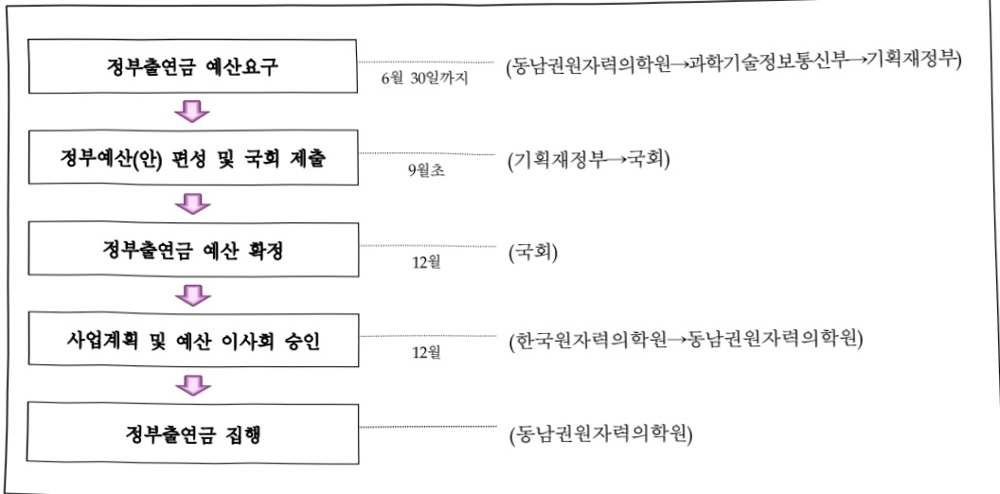

# 동남권원자력의학원연구운영비 지원(R&D)

**해당 페이지**: PDF 910 ~ 916 쪽 해당

**부처**: 과학기술정보통신부
**분야**: 과학기술
**회계유형**: 일반회계
**2026 확정예산**: 19921.0 백만원
**전년대비 증감률**: 34.3%
**AI 도메인**: R&D 지원

---

<table border=1 style='margin: auto; word-wrap: break-word;'><tr><td style='text-align: center; word-wrap: break-word;'>사 업 명</td></tr><tr><td style='text-align: center; word-wrap: break-word;'>(191) 동남권원자력의학원 연구운영비 지원(R&amp;D) (2231-412)</td></tr></table>

## 사업 코드 정보

<table border=1 style='margin: auto; word-wrap: break-word;'><tr><td style='text-align: center; word-wrap: break-word;'>구분</td><td style='text-align: center; word-wrap: break-word;'>회계</td><td style='text-align: center; word-wrap: break-word;'>소관</td><td style='text-align: center; word-wrap: break-word;'>실국(기관)</td><td style='text-align: center; word-wrap: break-word;'>계정</td><td style='text-align: center; word-wrap: break-word;'>분야</td><td style='text-align: center; word-wrap: break-word;'>부문</td></tr><tr><td style='text-align: center; word-wrap: break-word;'>코드</td><td rowspan="2">일반회계</td><td rowspan="2">과학기술정보통신부</td><td rowspan="2">연구개발정책실미래전략기술정책관</td><td rowspan="2"></td><td style='text-align: center; word-wrap: break-word;'>150</td><td style='text-align: center; word-wrap: break-word;'>152</td></tr><tr><td style='text-align: center; word-wrap: break-word;'>명칭</td><td style='text-align: center; word-wrap: break-word;'>과학기술</td><td style='text-align: center; word-wrap: break-word;'>과학기술연구지원</td></tr></table>

<table border=1 style='margin: auto; word-wrap: break-word;'><tr><td style='text-align: center; word-wrap: break-word;'>구분</td><td style='text-align: center; word-wrap: break-word;'>프로그램</td><td style='text-align: center; word-wrap: break-word;'>단위사업</td><td style='text-align: center; word-wrap: break-word;'>세부사업</td></tr><tr><td style='text-align: center; word-wrap: break-word;'>코드</td><td style='text-align: center; word-wrap: break-word;'>2200</td><td style='text-align: center; word-wrap: break-word;'>2231</td><td style='text-align: center; word-wrap: break-word;'>412</td></tr><tr><td style='text-align: center; word-wrap: break-word;'>명칭</td><td style='text-align: center; word-wrap: break-word;'>출연연구기관지원</td><td style='text-align: center; word-wrap: break-word;'>직할출연연구기관지원</td><td style='text-align: center; word-wrap: break-word;'>동남권원자력의학원 연구운영비 지원(R&amp;D)</td></tr></table>

사업 성격 (공통요구자료 II-1 작성유의사항 4. 참조, 해당하는 사항에 “○” 표시)

<table border=1 style='margin: auto; word-wrap: break-word;'><tr><td rowspan="2">신규 계속</td><td rowspan="2">완료</td><td rowspan="2">예비타당성 실시여부</td><td rowspan="2">총사업비 관리대상</td><td rowspan="2">총액계상 예산사업</td><td style='text-align: center; word-wrap: break-word;'>사업소관 변경정보</td></tr><tr><td style='text-align: center; word-wrap: break-word;'>2025예산 시 소관</td></tr><tr><td style='text-align: center; word-wrap: break-word;'></td><td style='text-align: center; word-wrap: break-word;'>0</td><td style='text-align: center; word-wrap: break-word;'></td><td style='text-align: center; word-wrap: break-word;'></td><td style='text-align: center; word-wrap: break-word;'></td><td style='text-align: center; word-wrap: break-word;'></td></tr></table>

사업 지원 형태 및 지원을 (최소한 한 개는 반드시 선택하시오. 해당사항에 0 표시)

<table border=1 style='margin: auto; word-wrap: break-word;'><tr><td style='text-align: center; word-wrap: break-word;'>직접</td><td style='text-align: center; word-wrap: break-word;'>출자</td><td style='text-align: center; word-wrap: break-word;'>출연</td><td style='text-align: center; word-wrap: break-word;'>보조</td><td style='text-align: center; word-wrap: break-word;'>융자</td><td style='text-align: center; word-wrap: break-word;'>국고보조율(%)</td><td style='text-align: center; word-wrap: break-word;'>융자율(%)</td></tr><tr><td style='text-align: center; word-wrap: break-word;'></td><td style='text-align: center; word-wrap: break-word;'></td><td style='text-align: center; word-wrap: break-word;'>0</td><td style='text-align: center; word-wrap: break-word;'></td><td style='text-align: center; word-wrap: break-word;'></td><td style='text-align: center; word-wrap: break-word;'></td><td style='text-align: center; word-wrap: break-word;'></td></tr></table>

## 사업 소관부처 및 시행주체

<table border=1 style='margin: auto; word-wrap: break-word;'><tr><td style='text-align: center; word-wrap: break-word;'>사업명</td><td colspan="2">구분</td></tr><tr><td rowspan="3">동남권원자력의학원연구운영비지원(R&amp;D)</td><td rowspan="2">소관부처</td><td style='text-align: center; word-wrap: break-word;'>연구개발정책실미래전략기술정책관</td></tr><tr><td style='text-align: center; word-wrap: break-word;'>원자력연구개발과</td></tr><tr><td style='text-align: center; word-wrap: break-word;'>사업시행주체</td><td style='text-align: center; word-wrap: break-word;'>동남권원자력의학원</td></tr></table>

---

### 가. 예산 총괄표

(단위: 백만원, %)

<table border=1 style='margin: auto; word-wrap: break-word;'><tr><td rowspan="2">사업명</td><td rowspan="2">2024년 결산</td><td colspan="2">2025년 예산</td><td colspan="2">2026년 예산</td><td rowspan="2">증감 (B-A)</td><td rowspan="2">(B-A)/A</td></tr><tr><td style='text-align: center; word-wrap: break-word;'>본예산</td><td style='text-align: center; word-wrap: break-word;'>추경*(A)</td><td style='text-align: center; word-wrap: break-word;'>요구안</td><td style='text-align: center; word-wrap: break-word;'>본예산(B)</td></tr><tr><td style='text-align: center; word-wrap: break-word;'>동남권원자력의학원 연구운영비 지원(R&amp;D)</td><td style='text-align: center; word-wrap: break-word;'>13,622</td><td style='text-align: center; word-wrap: break-word;'>14,828</td><td style='text-align: center; word-wrap: break-word;'>14,828</td><td style='text-align: center; word-wrap: break-word;'>19,921</td><td style='text-align: center; word-wrap: break-word;'>19,921</td><td style='text-align: center; word-wrap: break-word;'>5,093</td><td style='text-align: center; word-wrap: break-word;'>34.3</td></tr></table>

*추경: 추경증감액을 포함한 최종 예산액을 기재

## □ 기능별(내역사업별) 예산 내역

(단위:백만원)

<table border=1 style='margin: auto; word-wrap: break-word;'><tr><td rowspan="2"></td><td colspan="5">2024</td><td colspan="5">2025</td><td rowspan="2">2026예산</td></tr><tr><td style='text-align: center; word-wrap: break-word;'>예산액(추정)</td><td style='text-align: center; word-wrap: break-word;'>예산현액</td><td style='text-align: center; word-wrap: break-word;'>집행액</td><td style='text-align: center; word-wrap: break-word;'>이월액</td><td style='text-align: center; word-wrap: break-word;'>불용액</td><td style='text-align: center; word-wrap: break-word;'>예산액(추정)</td><td style='text-align: center; word-wrap: break-word;'>예산현액</td><td style='text-align: center; word-wrap: break-word;'>집행액</td><td style='text-align: center; word-wrap: break-word;'>이월액</td><td style='text-align: center; word-wrap: break-word;'>불용액</td></tr><tr><td style='text-align: center; word-wrap: break-word;'>○ 기능별 분류(합계)</td><td style='text-align: center; word-wrap: break-word;'>13,622</td><td style='text-align: center; word-wrap: break-word;'>13,622</td><td style='text-align: center; word-wrap: break-word;'>13,622</td><td style='text-align: center; word-wrap: break-word;'>-</td><td style='text-align: center; word-wrap: break-word;'>-</td><td style='text-align: center; word-wrap: break-word;'>14,828</td><td style='text-align: center; word-wrap: break-word;'>14,828</td><td style='text-align: center; word-wrap: break-word;'>14,828</td><td style='text-align: center; word-wrap: break-word;'>-</td><td style='text-align: center; word-wrap: break-word;'>-</td><td style='text-align: center; word-wrap: break-word;'>19,921</td></tr><tr><td style='text-align: center; word-wrap: break-word;'>· 기관운영비</td><td style='text-align: center; word-wrap: break-word;'>5,171</td><td style='text-align: center; word-wrap: break-word;'>5,171</td><td style='text-align: center; word-wrap: break-word;'>5,171</td><td style='text-align: center; word-wrap: break-word;'>-</td><td style='text-align: center; word-wrap: break-word;'>-</td><td style='text-align: center; word-wrap: break-word;'>5,379</td><td style='text-align: center; word-wrap: break-word;'>5,379</td><td style='text-align: center; word-wrap: break-word;'>5,379</td><td style='text-align: center; word-wrap: break-word;'>-</td><td style='text-align: center; word-wrap: break-word;'>-</td><td style='text-align: center; word-wrap: break-word;'>5,599</td></tr><tr><td style='text-align: center; word-wrap: break-word;'>· 기관고유사업비</td><td style='text-align: center; word-wrap: break-word;'>1,341</td><td style='text-align: center; word-wrap: break-word;'>1,341</td><td style='text-align: center; word-wrap: break-word;'>1,341</td><td style='text-align: center; word-wrap: break-word;'>-</td><td style='text-align: center; word-wrap: break-word;'>-</td><td style='text-align: center; word-wrap: break-word;'>2,679</td><td style='text-align: center; word-wrap: break-word;'>2,679</td><td style='text-align: center; word-wrap: break-word;'>2,679</td><td style='text-align: center; word-wrap: break-word;'>-</td><td style='text-align: center; word-wrap: break-word;'>-</td><td style='text-align: center; word-wrap: break-word;'>2,889</td></tr><tr><td style='text-align: center; word-wrap: break-word;'>· 일반사업비</td><td style='text-align: center; word-wrap: break-word;'>4,550</td><td style='text-align: center; word-wrap: break-word;'>4,550</td><td style='text-align: center; word-wrap: break-word;'>4,550</td><td style='text-align: center; word-wrap: break-word;'>-</td><td style='text-align: center; word-wrap: break-word;'>-</td><td style='text-align: center; word-wrap: break-word;'>4,550</td><td style='text-align: center; word-wrap: break-word;'>4,550</td><td style='text-align: center; word-wrap: break-word;'>4,550</td><td style='text-align: center; word-wrap: break-word;'>-</td><td style='text-align: center; word-wrap: break-word;'>-</td><td style='text-align: center; word-wrap: break-word;'>3,334</td></tr><tr><td style='text-align: center; word-wrap: break-word;'>· 전략연구사업</td><td style='text-align: center; word-wrap: break-word;'>-</td><td style='text-align: center; word-wrap: break-word;'>-</td><td style='text-align: center; word-wrap: break-word;'>-</td><td style='text-align: center; word-wrap: break-word;'>-</td><td style='text-align: center; word-wrap: break-word;'>-</td><td style='text-align: center; word-wrap: break-word;'>-</td><td style='text-align: center; word-wrap: break-word;'>-</td><td style='text-align: center; word-wrap: break-word;'>-</td><td style='text-align: center; word-wrap: break-word;'>-</td><td style='text-align: center; word-wrap: break-word;'>-</td><td style='text-align: center; word-wrap: break-word;'>5,959</td></tr><tr><td style='text-align: center; word-wrap: break-word;'>· 장비·시스템 구축비</td><td style='text-align: center; word-wrap: break-word;'>2,560</td><td style='text-align: center; word-wrap: break-word;'>2,560</td><td style='text-align: center; word-wrap: break-word;'>2,560</td><td style='text-align: center; word-wrap: break-word;'>-</td><td style='text-align: center; word-wrap: break-word;'>-</td><td style='text-align: center; word-wrap: break-word;'>-</td><td style='text-align: center; word-wrap: break-word;'>2,220</td><td style='text-align: center; word-wrap: break-word;'>2,220</td><td style='text-align: center; word-wrap: break-word;'>-</td><td style='text-align: center; word-wrap: break-word;'>-</td><td style='text-align: center; word-wrap: break-word;'>2,140</td></tr></table>

### 나. 사업설명자료

## 1 ) 사업목적·내용

- (동남권원자력의학원 연구운영비 지원(R&D)) 방사선 등의 의학적 이용 및 연구개발과 암진료 등의 업무수행을 통한 국가과학기술 발전 및 국민건강 증진에 기여

기초연구와 중개연구 활성화를 통한 방사선의학 중심 병원모델 창출

## 2 ) 사업개요

사업근거 및 추진경위

① 법령상 근거

- 방사선 및 방사성 동위원소 이용진흥법 제13조의2(한국원자력의학원의 설립)

· 제1항 : 방사선 등의 의학적 이용 및 연구개발 업무를 효율적으로 추진하기 위하여 한국원자력의학원을 설립한다.

· 제8항 : 정부는 예산의 범위 안에서 의학원의 설립 및 운영에 필요한 경비를 출연할 수 있다.

- 방사선 및 방사성 동위원소 이용진흥법 제13조의3(분원 또는 부설기관)

·의학원은 정관이 정하는 바에 따라 분원 또는 부설기관을 둘 수 있다.

---

② 추진경위

- 2004. 03. 동남권원자력의학원 분원추진단 발족

- 2006. 10. 동남권원자력의학원 건축공사 착공

- 2010. 04. 동남권원자력의학원 준공

- 2010. 07. 동남권원자력의학원 개원

- 2012. 06. 동남권원자력의학원 생활복지관 준공식

- 2023. 12. 동남권원자력의학원 실용화센터 개소식

## 주요내용

① 사업규모

- 총사업비(해당되는 경우에만 기재) : 해당사항 없음

- 사업기간 : '10~계속

- 최근 5년 간 투입된 사업비(예산액기준, 추경편성한 연도에는 추경포함)

<table border=1 style='margin: auto; word-wrap: break-word;'><tr><td style='text-align: center; word-wrap: break-word;'>연도</td><td style='text-align: center; word-wrap: break-word;'>2022</td><td style='text-align: center; word-wrap: break-word;'>2023</td><td style='text-align: center; word-wrap: break-word;'>2024</td><td style='text-align: center; word-wrap: break-word;'>2025</td><td style='text-align: center; word-wrap: break-word;'>2026(안)</td></tr><tr><td style='text-align: center; word-wrap: break-word;'>사업비</td><td style='text-align: center; word-wrap: break-word;'>24,185</td><td style='text-align: center; word-wrap: break-word;'>27,241</td><td style='text-align: center; word-wrap: break-word;'>13,622</td><td style='text-align: center; word-wrap: break-word;'>14,828</td><td style='text-align: center; word-wrap: break-word;'>19,921</td></tr></table>

- 기타: 연구개발건축비(360-03)는 '24년 예산안부터 별도 세부사업으로 편성

② 사업추진체계

- 사업시행방법 : 출연

- 사업시행주체 : 동남권원자력의학원

- 사업 수혜자 : 대국민

- 보조, 융자, 출연, 출자 등의 경우 보조·융자 등 지원 비율 및 법적근거

<table border=1 style='margin: auto; word-wrap: break-word;'><tr><td style='text-align: center; word-wrap: break-word;'>내역사업명</td><td style='text-align: center; word-wrap: break-word;'>구분</td><td style='text-align: center; word-wrap: break-word;'>피보조·피출연 등 기관명</td><td style='text-align: center; word-wrap: break-word;'>지원 금액 (2026예산)</td><td style='text-align: center; word-wrap: break-word;'>지원 비율(%)</td><td style='text-align: center; word-wrap: break-word;'>보조율 법적근거 (해당 조항)</td></tr><tr><td style='text-align: center; word-wrap: break-word;'>동남권원자력 의학원 연구운영비 지원(R&amp;D)</td><td style='text-align: center; word-wrap: break-word;'>출연</td><td style='text-align: center; word-wrap: break-word;'>동남권 원자력 의학원</td><td style='text-align: center; word-wrap: break-word;'>19,921</td><td style='text-align: center; word-wrap: break-word;'>100%</td><td style='text-align: center; word-wrap: break-word;'>방사선 및 방사성동위원소 이용진흥법 제13조의2(한국원자력의학원의 설립) 및 제13조의3(분원 또는 부설기관)</td></tr></table>

---

## 3 ) 2026년도 예산 산출 근거

<table border=1 style='margin: auto; word-wrap: break-word;'><tr><td style='text-align: center; word-wrap: break-word;'>① 기관운영비: 5,599백만원 인건비: 4,752백만원 847백만원</td></tr><tr><td style='text-align: center; word-wrap: break-word;'>② 기관고유사업비: 2,889백만원 - 차세대 방사선 안전 융복합 기술개발 사업: 1,589백만원 - 암치료 신기술 실증 필수의료 역량강화: 1,300백만원</td></tr><tr><td style='text-align: center; word-wrap: break-word;'>③ 일반사업비: 3,334백만원 - 방사선의학 조기기반구축 지원 사업: 2,000백만원 - ICT 기반 방사성의약품 헬스케어센터 구축 사업: 1,334백만원</td></tr><tr><td style='text-align: center; word-wrap: break-word;'>④ 전략연구사업: 5,959백만원 - 암극복을 위한 방사선-세포유전자치료 기술 개발 첨단바이오 선도화 사업: 5,959백만원</td></tr><tr><td style='text-align: center; word-wrap: break-word;'>⑤ 장비·시스템구축비: 2,140백만원</td></tr></table>

## 4 ) 사업효과

☐ 사업영향, 산출물 성과지표 등

① 2022~2026년도 성과계획서 상 성과지표 및 최근 5년간 성과 달성도

- 기관 운영 출연금사업으로 성과관리 비대상 사업임에 따라 해당사항 없음

② 성과지표 이외의 연도별 사업추진 경과 및 실적

<table border=1 style='margin: auto; word-wrap: break-word;'><tr><td style='text-align: center; word-wrap: break-word;'>2022</td><td style='text-align: center; word-wrap: break-word;'>· 인공지능 기반 방사선 피폭 진단용 판독 시스템 개발 (SCI(E) 1편 게재 및 특허 등록 1건) · 감마분광분석 동시합성효과 보정으로 검출효율 향상 (SCI(E) 1편 게재) · 9-MeV LINAC을 사용한 전임상용 신규 개발 가속기 원자력안전위원회 사용허가 획득 (2022.12) · MCNP 시뮬레이션을 활용한 초고선량율(FLASH) 전임상 전자범 조사 장치 개발 (SCI(E) 1편 게재) · 코로나19 대응 의료시스템 구축(선별진료소 및 코로나19 전담 치료병동 운영) · 특수 재난 대응 방사선비상의료지원(REMAT) 시범 훈련· 교육 수행 및 방재 교육 영상 및 자료 제작 · 특수 재난 상호 협력 네트워크 강화를 위한 유관기관(부산시, 을주군 등) 초청 심포지엄 개최 · 찾아가는 의료상담 및 방사능 방재· 감염병 예방교육 수행(12회) · 방사선영향클리닉(14회) 운영, 방사선 작업종사자 건강검진(127회) 실시 · 난치암의 방사선 치료 효율 증진을 위한 인자 발굴 및 제어 기전 연구 (SCI(E) 1편 게재) · 종양기질환경 조절을 통한 방사선 치료 증진 연구 (KCI 1편 게재) · 국가연구시설· 장비심의위원회 방사성의약품제조소 시설(상22-154, 2,460백만원) 및 핵심장비(핏셀) 3기(심22-516, 심22-544, 심22-545, 총 820백만원) 도입 승인 · 방사성의약품제조소 상세· 차폐설계 완료 및 방사성의약품제조소 외부 RI 배기 설비 공사 준공, 방사성의약품 및 투여환자 관리 디지털 헬스케어 연구개발</td></tr><tr><td style='text-align: center; word-wrap: break-word;'>2023</td><td style='text-align: center; word-wrap: break-word;'>· DIRAMS 토양 시료 내 다양한 방사선 동위원소의 활성농도 및 방사선 유해성 평가 (SCI(E) 1편 게재) · 저선량률 방사선에 의한 미세먼지 유도 폐손상의 악화 확인 (SCI(E) 1편 게재) · 9-MeV LINAC을 사용한 전임상용 신규 개발 가속기의 최적 엑스선 타겟 연구 (SCI(E) 1편 게재) · 초고선량률 전자범의 실시간 선량측정 방법 및 고전류 측정장치 방법 개발 (SCI(E) 2편 게재) · 방사선영향클리닉(6회) 및 작업종사자 건강검진(57회)실시, 방사능 방재훈련 및 통신훈련 실시(5회) · 찾아가는 의료상담 및 방사능 방재· 감염병 예방교육 수행(7회)(’ 23.8기준) · 난치암 극복 및 방사선 치료 효율 증진을 위한 종양모델 구축과 표적 발굴 연구 (SCI(E) 3편 게재)</td></tr></table>

---

<table border=1 style='margin: auto; word-wrap: break-word;'><tr><td style='text-align: center; word-wrap: break-word;'></td><td style='text-align: center; word-wrap: break-word;'>· 망사선 치료 효율 증진을 위한 방사선 바이오 융복합 항암면역세포 유전자 치료 기술 응용 연구(SCI(E) 2편 게재) · 망사성의약품제조소 핫셀 3기 및 전설팅용역 계약완료 · 웨어러블 다기능 센서패치 및 딥러닝 기반 이상신호 분석을 통한 방사성의약품 투여 환자의 건강상태 감지기술 개발 (SCI(E) 2편 게재)</td></tr><tr><td style='text-align: center; word-wrap: break-word;'>2024</td><td style='text-align: center; word-wrap: break-word;'>· 인공지능기술 용합 생물학적 선량평가 기술에 의한 피폭선량평가 (SCI(E) 논문 1편 게재) · 자산형재산량물 방사선에 의한 염증성 쟁쟁한 및 마케닌자에 의한 호흡기 질환 조절 현상 규명 (SCI(E) 논문 2편 개개) · 다중 인공 신경망 적용 생물학적 선량평가 기술 개발 (특허 출원 1건) · 전자상자성공명분광 분석법을 이용한 치료방사선 정도관리 (KCI 1편 게재) · 3D 프린터를 이용한 콘빌 CT 깊이선량 측정 및 궤도부 선량 평가 (ESCI 논문 1편 게재) · 방사선치료기용 전자가속기 핵심부품인 마그네트론 개발 (특허 2개 출원) · DIRAMS C-band 전자가속기를 사용한 전임상 플래시 전자범 조사 (구연발표, 2024 가속기 및 검출기 아시아 포럼(AFAD), 대만) · 방사선 인체영향연구의 미래 (구연발표, 2024 춘계 한국원자력학회) · 방사선 유도 양적 및 질적 돌연변이 발생 연구 및 방사선 생체 영향연구 삼차원 세포 플랫폼 개발 (SCI(E) 2편 게재) · 방사선영향량리낙(93회) 및 작업종사자 건강검진(139회)실시, 방사능 방제훈련 및 통신훈련 실사(10회) · 찾아가는 의료상담 및 방사능 방재(13회) · 감염병 예방교육 수행(4회) · 방사선 의생명 연구를 통한 난치성 질환의 원인 규명 및 표적 제어 기술 개발 연구 (SCI(E) 3편 게재, 특허출원 1건, 특허등록 1건, SCI(E) 1편 게재 승인) · 첨단재생의료 방사선 바이오 면역치료 기술 개발 및 첨단재생의료 기반 구축 연구 (기술이전 1건, 첨단재생의료 원천기술 임상연구 1건 수행, SCI(E) 2편 투고, 특허출원 1건) · 영남권 유일의 연구 · 임상용 방사성의약품 GMP 제조소 준공 1건 · 동남권 방사성의약품 GMP 제조소 내 방사성의약품 핫셀 3기 도입 완료 · 장기간 체내 종양 표적효과 확인을 위한 표지화합률 비임상 연구(SCI(E) 논문게재 1편)</td></tr><tr><td style='text-align: center; word-wrap: break-word;'>2025</td><td style='text-align: center; word-wrap: break-word;'>· 방사선에 대한 생체 영향평가 결과의 신뢰성 확보 (논문 2편 게재, 학술대회 1건) · 저선량 방사선 위해도 관리 기준 마련 (특허 출원 1건, 특허 등록 2건, 중국출원 진행 1건, 논문 9편 게재, 학술대회 3건) · 국제적 공신력 확보 및 방사선 · 능 측정능력에 대한 객관적 입증으로 연구결과의 신뢰성 확보 및 기관 수익창출에 기여 (논문 3편 게재) · 지역민 보호 환경 강화 : 학생, 지역민 등 대국민 대상의 방사선에 대한 이해도 제고와 방사능제안 시 행동요령 습득의 콘텐츠 개발 (저작권 등록 2건) · 유관기관(경찰청, 군, 소방서 등) 합동 방사능테러 대비 훈련 실시 · 지역응급의료기관 228개소 중 응급의료기관평가 전국 1위(A등급) 달성, 지역 응급의료 체계를 구축하여 원전지역 의료 취약 사각지대 해소 및 원자력의 사회적 수용성 확보 · 영남권 유일의 임상연구용 방사성의약품 GMP 제조소 구축을 통한 지역 공공의료 역량 강화 기반 마련 · 방사성의약품 임상적용(Ga-68 DOTA-TOC, Ga-68 PSMA-11)을 통한 수도권 외 지역 최초 첨단방사성의약품(PLUVICTO) 치료 개시(검사 : 92 건, 치료 1건) · 방사선바이오(방사성의약품 · 헬스케어) 융합연구개발 (논문 2편 게재, 특허 출원 2건, 특허 등록 1건, 미국출원 진행 1건) · 방사선 치료 효능 증진을 위한 면역세포치료 및 종양환경 제어 연구 성과(논문 3편 게재, 특허출원 1건, 특허등록 2건) · 방사선·세포유전자치료기술 그 외 성과 (특허 출원 1건, 특허 등록 2건)</td></tr></table>

---

③향후(2026년도 이후)기대효과

0 저선량 방사선 영향 규명, 선량평가·교정, 조사기 개발 등 안전 연구 기반 강화

° 신약개발, 식품안전, 환경영향 평가 등 연구 확장 및 산업·임상 활용(피폭 검사 등)

0 방사선·감염병 등 특수재난 대응 시스템 구축, 공공 안전 기여

°연구성과 기반 암치료 신기술 실증 역량 확보

ㅇ 지역 필수의료 거점 역할 수행, 첨단 의학 발전 기여

°방사선 의·과학 산단 연구 인프라 협업으로 국가 R&D 자원 효율 활용

방사성의약품-헬스케어 융합연구, 과학기술특성화병원 위상 정립

○ AI 영상 시뮬레이션 기반 초정밀 방사선 치료 시스템 구축

안전·효과적인 CAR-NK 치료제 개발, 재발·전이 한계 극복

° 방사선 조사 기반 CAR-NK 대량 증식 원천기술 이전·사업화

AI 기반 방사선치료 도입 시 병원 운영 효율 최대 20% 향상, 환자 치료비 15~30% 절감

## 5 )타당성조사 및 예비타당성조사 시행여부 및 결과 요지:해당없음

## 6 ) 총사업비 대상사업 정보 : 해당없음

## 7 ) 사업 집행절차

8) 각종 평가 : 해당없음

---

### 다. 최근 4년간 결산내역

## 1 ) 결산표

☐ 부처 결산내역

(단위: 백만원, %)

<table border=1 style='margin: auto; word-wrap: break-word;'><tr><td rowspan="2">연도</td><td colspan="3">예산액</td><td rowspan="2">예산현액(A)</td><td rowspan="2">집행액(B)</td><td rowspan="2">집행률(B/A)</td><td rowspan="2">다음연도이월액</td><td rowspan="2">불용액</td></tr><tr><td style='text-align: center; word-wrap: break-word;'>본예산</td><td style='text-align: center; word-wrap: break-word;'>추경중감액</td><td style='text-align: center; word-wrap: break-word;'>추경</td></tr><tr><td style='text-align: center; word-wrap: break-word;'>2022</td><td style='text-align: center; word-wrap: break-word;'>24,185</td><td style='text-align: center; word-wrap: break-word;'>-</td><td style='text-align: center; word-wrap: break-word;'>24,185</td><td style='text-align: center; word-wrap: break-word;'>24,185</td><td style='text-align: center; word-wrap: break-word;'>24,185</td><td style='text-align: center; word-wrap: break-word;'>100.0</td><td style='text-align: center; word-wrap: break-word;'>-</td><td style='text-align: center; word-wrap: break-word;'>-</td></tr><tr><td style='text-align: center; word-wrap: break-word;'>2023</td><td style='text-align: center; word-wrap: break-word;'>27,241</td><td style='text-align: center; word-wrap: break-word;'>-</td><td style='text-align: center; word-wrap: break-word;'>27,241</td><td style='text-align: center; word-wrap: break-word;'>27,241</td><td style='text-align: center; word-wrap: break-word;'>27,241</td><td style='text-align: center; word-wrap: break-word;'>100.0</td><td style='text-align: center; word-wrap: break-word;'>-</td><td style='text-align: center; word-wrap: break-word;'>-</td></tr><tr><td style='text-align: center; word-wrap: break-word;'>2024</td><td style='text-align: center; word-wrap: break-word;'>13,622</td><td style='text-align: center; word-wrap: break-word;'>-</td><td style='text-align: center; word-wrap: break-word;'>13,622</td><td style='text-align: center; word-wrap: break-word;'>13,622</td><td style='text-align: center; word-wrap: break-word;'>13,622</td><td style='text-align: center; word-wrap: break-word;'>100.0</td><td style='text-align: center; word-wrap: break-word;'>-</td><td style='text-align: center; word-wrap: break-word;'>-</td></tr><tr><td style='text-align: center; word-wrap: break-word;'>2025</td><td style='text-align: center; word-wrap: break-word;'>14,828</td><td style='text-align: center; word-wrap: break-word;'>-</td><td style='text-align: center; word-wrap: break-word;'>14,828</td><td style='text-align: center; word-wrap: break-word;'>14,828</td><td style='text-align: center; word-wrap: break-word;'>14,828</td><td style='text-align: center; word-wrap: break-word;'>100.0</td><td style='text-align: center; word-wrap: break-word;'>-</td><td style='text-align: center; word-wrap: break-word;'>-</td></tr></table>

## 2 ) 주요 결산사항

2022~2025년 결산 주요사항

<table border=1 style='margin: auto; word-wrap: break-word;'><tr><td style='text-align: center; word-wrap: break-word;'>2022</td><td style='text-align: center; word-wrap: break-word;'>- 해당사항 없음</td></tr><tr><td style='text-align: center; word-wrap: break-word;'>2023</td><td style='text-align: center; word-wrap: break-word;'>- 해당사항 없음</td></tr><tr><td style='text-align: center; word-wrap: break-word;'>2024</td><td style='text-align: center; word-wrap: break-word;'>- 해당사항 없음</td></tr><tr><td style='text-align: center; word-wrap: break-word;'>2025</td><td style='text-align: center; word-wrap: break-word;'>- 해당사항 없음</td></tr></table>

□ 2025년 이·전용 등 세부내역 : 해당없음

---

### 원본 PDF 크롭 이미지

