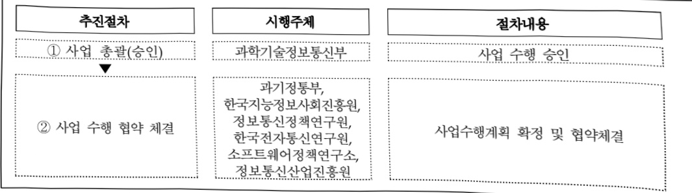

# 디지털 질서 기반 구축 및 글로벌 확산 지원

**해당 페이지**: PDF 929 ~ 940 쪽 해당

**부처**: 과학기술정보통신부
**분야**: 통신
**회계유형**: 일반회계
**2026 확정예산**: 27643.0 백만원
**전년대비 증감률**: 380.2%
**AI 도메인**: 디지털전환(AX)

---

<table border=1 style='margin: auto; word-wrap: break-word;'><tr><td style='text-align: center; word-wrap: break-word;'></td><td style='text-align: center; word-wrap: break-word;'>사업시행주체</td><td style='text-align: center; word-wrap: break-word;'>한국전자통신연구원, 정보통신정책연구원, 한국지능정보사회진흥원</td></tr><tr><td rowspan="2">AI신뢰성 및 산업 생태계 기반 조성</td><td style='text-align: center; word-wrap: break-word;'>소관부처</td><td style='text-align: center; word-wrap: break-word;'>AI정책실 AI안전신뢰정책과 인공지능기반정책과</td></tr><tr><td style='text-align: center; word-wrap: break-word;'>사업시행주체</td><td style='text-align: center; word-wrap: break-word;'>한국지능정보사회진흥원, 소프트웨어정책연구소</td></tr><tr><td rowspan="2">AI 선도국 도약 정책지원</td><td style='text-align: center; word-wrap: break-word;'>소관부처</td><td style='text-align: center; word-wrap: break-word;'>인공지능정책실 AI정책기획관 인공지능전략팀</td></tr><tr><td style='text-align: center; word-wrap: break-word;'>사업시행주체</td><td style='text-align: center; word-wrap: break-word;'>정보통신정책연구원, 한국지능정보사회진흥원</td></tr><tr><td rowspan="2">AI 특화 지구 조성(AHAP)</td><td style='text-align: center; word-wrap: break-word;'>소관부처</td><td style='text-align: center; word-wrap: break-word;'>인공지능정책실 인공지능정책기획관 인공지능융합팀</td></tr><tr><td style='text-align: center; word-wrap: break-word;'>사업시행주체</td><td style='text-align: center; word-wrap: break-word;'>정보통신산업진흥원</td></tr><tr><td rowspan="2">AI 산학연협력체계 구축</td><td style='text-align: center; word-wrap: break-word;'>소관부처</td><td style='text-align: center; word-wrap: break-word;'>정보통신정책실 인공지능기반정책관 인공지능기반정책과</td></tr><tr><td style='text-align: center; word-wrap: break-word;'>사업시행주체</td><td style='text-align: center; word-wrap: break-word;'>정보통신산업진흥원</td></tr></table>

### 가. 예산안 총괄표

(단위: 백만원, %)

<table border=1 style='margin: auto; word-wrap: break-word;'><tr><td rowspan="2">사업명</td><td rowspan="2">2024년 결산</td><td colspan="2">2025년 예산</td><td colspan="2">2026년</td><td rowspan="2">증감(B-A)</td><td rowspan="2">(B-A)/A</td></tr><tr><td style='text-align: center; word-wrap: break-word;'>본예산(A)</td><td style='text-align: center; word-wrap: break-word;'>추경</td><td style='text-align: center; word-wrap: break-word;'>정부안</td><td style='text-align: center; word-wrap: break-word;'>확정(B)</td></tr><tr><td style='text-align: center; word-wrap: break-word;'>디지털 질서 기반 구축 및 글로벌 확산 지원</td><td style='text-align: center; word-wrap: break-word;'>3,800</td><td style='text-align: center; word-wrap: break-word;'>5,757</td><td style='text-align: center; word-wrap: break-word;'>5,757</td><td style='text-align: center; word-wrap: break-word;'>26,993</td><td style='text-align: center; word-wrap: break-word;'>27,643</td><td style='text-align: center; word-wrap: break-word;'>21,886</td><td style='text-align: center; word-wrap: break-word;'>380.2</td></tr></table>

□ 기능별(내역사업별), 목별 예산안 내역

(단위:백만원)

<table border=1 style='margin: auto; word-wrap: break-word;'><tr><td rowspan="3"></td><td colspan="5">2024</td><td colspan="7">2025(2025.12월말)</td><td rowspan="3">2026예산안</td></tr><tr><td rowspan="2">예산액(추경)</td><td rowspan="2">예산현액</td><td rowspan="2">집행액[실집행액]</td><td rowspan="2">이월액</td><td rowspan="2">불용액</td><td rowspan="2">본예산</td><td rowspan="2">예산현액</td><td rowspan="2">집행액[실집행액]</td><td colspan="2">전년도이월액제외</td><td rowspan="2">이월예산액</td><td rowspan="2">불용예산액</td></tr><tr><td style='text-align: center; word-wrap: break-word;'>예산현액</td><td style='text-align: center; word-wrap: break-word;'>집행액[실집행액]</td></tr><tr><td style='text-align: center; word-wrap: break-word;'>○ 기능별 분류(합계)</td><td style='text-align: center; word-wrap: break-word;'>3,800</td><td style='text-align: center; word-wrap: break-word;'>3,800</td><td style='text-align: center; word-wrap: break-word;'>3,800[3,647]</td><td style='text-align: center; word-wrap: break-word;'>-</td><td style='text-align: center; word-wrap: break-word;'>-</td><td style='text-align: center; word-wrap: break-word;'>5,757</td><td style='text-align: center; word-wrap: break-word;'>5,757[5,226]</td><td style='text-align: center; word-wrap: break-word;'>5,757[5,226]</td><td style='text-align: center; word-wrap: break-word;'>5,757[5,226]</td><td style='text-align: center; word-wrap: break-word;'>5,757[5,226]</td><td style='text-align: center; word-wrap: break-word;'>-</td><td style='text-align: center; word-wrap: break-word;'>-</td><td style='text-align: center; word-wrap: break-word;'>27,643</td></tr><tr><td rowspan="2">· AI · 디지털 사회기반 구축· AI · 디지털 규범글로벌 확산</td><td style='text-align: center; word-wrap: break-word;'>1,000</td><td style='text-align: center; word-wrap: break-word;'>1,000</td><td style='text-align: center; word-wrap: break-word;'>1,000[918]</td><td style='text-align: center; word-wrap: break-word;'>-</td><td style='text-align: center; word-wrap: break-word;'>-</td><td style='text-align: center; word-wrap: break-word;'>827</td><td style='text-align: center; word-wrap: break-word;'>827[770]</td><td style='text-align: center; word-wrap: break-word;'>827[770]</td><td style='text-align: center; word-wrap: break-word;'>827[770]</td><td style='text-align: center; word-wrap: break-word;'>827[770]</td><td style='text-align: center; word-wrap: break-word;'>-</td><td style='text-align: center; word-wrap: break-word;'>-</td><td style='text-align: center; word-wrap: break-word;'>2,100</td></tr><tr><td style='text-align: center; word-wrap: break-word;'>800</td><td style='text-align: center; word-wrap: break-word;'>800</td><td style='text-align: center; word-wrap: break-word;'>800[734]</td><td style='text-align: center; word-wrap: break-word;'>-</td><td style='text-align: center; word-wrap: break-word;'>-</td><td style='text-align: center; word-wrap: break-word;'>630</td><td style='text-align: center; word-wrap: break-word;'>630[562]</td><td style='text-align: center; word-wrap: break-word;'>630[562]</td><td style='text-align: center; word-wrap: break-word;'>630[562]</td><td style='text-align: center; word-wrap: break-word;'>630[562]</td><td style='text-align: center; word-wrap: break-word;'>-</td><td style='text-align: center; word-wrap: break-word;'>-</td><td style='text-align: center; word-wrap: break-word;'>472</td></tr><tr><td style='text-align: center; word-wrap: break-word;'>○ 기능비무별 분류(합계)</td><td style='text-align: center; word-wrap: break-word;'>3,800</td><td style='text-align: center; word-wrap: break-word;'>3,800</td><td style='text-align: center; word-wrap: break-word;'>3,800</td><td style='text-align: center; word-wrap: break-word;'>-</td><td style='text-align: center; word-wrap: break-word;'>-</td><td style='text-align: center; word-wrap: break-word;'>5,757</td><td style='text-align: center; word-wrap: break-word;'>5,757</td><td style='text-align: center; word-wrap: break-word;'>5,757</td><td style='text-align: center; word-wrap: break-word;'>5,757</td><td style='text-align: center; word-wrap: break-word;'>5,757</td><td style='text-align: center; word-wrap: break-word;'>-</td><td style='text-align: center; word-wrap: break-word;'>-</td><td style='text-align: center; word-wrap: break-word;'>27,643</td></tr></table>

---

<table border=1 style='margin: auto; word-wrap: break-word;'><tr><td rowspan="3"></td><td colspan="5">2024</td><td colspan="7">2025(2025.12월 말)</td><td rowspan="3">2026예산안</td></tr><tr><td rowspan="2">예산액(추정)</td><td rowspan="2">예산현액</td><td rowspan="2">집행액[실집행액]</td><td rowspan="2">이월액</td><td rowspan="2">불용액</td><td rowspan="2">본예산</td><td rowspan="2">예산현액</td><td rowspan="2">집행액[실집행액]</td><td colspan="2">전년도이월액제외</td><td rowspan="2">이월예상액</td><td rowspan="2">불용예상액</td></tr><tr><td style='text-align: center; word-wrap: break-word;'>예산현액</td><td style='text-align: center; word-wrap: break-word;'>집행액[실집행액]</td></tr><tr><td style='text-align: center; word-wrap: break-word;'></td><td style='text-align: center; word-wrap: break-word;'></td><td style='text-align: center; word-wrap: break-word;'></td><td style='text-align: center; word-wrap: break-word;'></td><td style='text-align: center; word-wrap: break-word;'></td><td style='text-align: center; word-wrap: break-word;'></td><td style='text-align: center; word-wrap: break-word;'></td><td style='text-align: center; word-wrap: break-word;'></td><td style='text-align: center; word-wrap: break-word;'>[5,226]</td><td style='text-align: center; word-wrap: break-word;'></td><td style='text-align: center; word-wrap: break-word;'>[5,226]</td><td style='text-align: center; word-wrap: break-word;'></td><td style='text-align: center; word-wrap: break-word;'></td><td style='text-align: center; word-wrap: break-word;'></td></tr><tr><td rowspan="3">· AI·디지털 사회기반 구축· AI·디지털 규범글로벌 확산· 안전한 AI활용기반조성· AI신뢰성 및 산업생태계 기반 조성(&quot;26년 사업이관)· AI 선도국 도약정책지원(신규)· AI 특화 지구 조성(AHAP)(신규)· AI 산학연 협력체계 구축(신규)</td><td style='text-align: center; word-wrap: break-word;'>1,000</td><td style='text-align: center; word-wrap: break-word;'>1,000</td><td style='text-align: center; word-wrap: break-word;'>1,000[918]800[734]2,000[1,995]</td><td style='text-align: center; word-wrap: break-word;'>-</td><td style='text-align: center; word-wrap: break-word;'>-</td><td style='text-align: center; word-wrap: break-word;'>827</td><td style='text-align: center; word-wrap: break-word;'>827</td><td style='text-align: center; word-wrap: break-word;'>827[770]630[562]4,300[3,894]</td><td style='text-align: center; word-wrap: break-word;'>827</td><td style='text-align: center; word-wrap: break-word;'>827[770]630[562]4,300[3,894]</td><td style='text-align: center; word-wrap: break-word;'>-</td><td style='text-align: center; word-wrap: break-word;'>-</td><td style='text-align: center; word-wrap: break-word;'>2,100</td></tr><tr><td style='text-align: center; word-wrap: break-word;'>800</td><td style='text-align: center; word-wrap: break-word;'>800</td><td style='text-align: center; word-wrap: break-word;'>800[734]2,000[1,995]</td><td style='text-align: center; word-wrap: break-word;'>-</td><td style='text-align: center; word-wrap: break-word;'>-</td><td style='text-align: center; word-wrap: break-word;'>630</td><td style='text-align: center; word-wrap: break-word;'>630</td><td style='text-align: center; word-wrap: break-word;'>630[562]4,300[3,894]</td><td style='text-align: center; word-wrap: break-word;'>630[562]4,300[3,894]</td><td style='text-align: center; word-wrap: break-word;'>630[562]4,300[3,894]</td><td style='text-align: center; word-wrap: break-word;'>-</td><td style='text-align: center; word-wrap: break-word;'>-</td><td style='text-align: center; word-wrap: break-word;'>472</td></tr><tr><td style='text-align: center; word-wrap: break-word;'>2,000</td><td style='text-align: center; word-wrap: break-word;'>2,000</td><td style='text-align: center; word-wrap: break-word;'>2,000[1,995]</td><td style='text-align: center; word-wrap: break-word;'>-</td><td style='text-align: center; word-wrap: break-word;'>-</td><td style='text-align: center; word-wrap: break-word;'>4,300</td><td style='text-align: center; word-wrap: break-word;'>4,300</td><td style='text-align: center; word-wrap: break-word;'>4,300[3,894]</td><td style='text-align: center; word-wrap: break-word;'>4,300[3,894]</td><td style='text-align: center; word-wrap: break-word;'>-</td><td style='text-align: center; word-wrap: break-word;'>-</td><td style='text-align: center; word-wrap: break-word;'>10,100</td><td style='text-align: center; word-wrap: break-word;'>-</td></tr></table>

### 나. 사업설명자료

## 1 ) 사업목적·내용

- (AI·디지털 사회 기반 구축) 민간이 중심이 되어 전문가뿐 아니라 일반 국민까지 참여하는 사회적 공론화·담론 형성을 통해 AI 기본사회 국정과제 실현 기반을 조성하고, 전 국민이 참여하는 AI대전환(AX) 문화 확산 및 AI 글로벌 정책역량 강화 추진

- (AI·디지털 규범 글로벌 확산) OECD 등 국제기구 및 해외 연구기관과 공동 연구

수행 등을 통해 AI 규범 논의에서 한국 주도의 방향성 제시

※ 글로벌 디지털 규범 논의를 위해 '디지털 사회 이니셔티브'를 운영하고, 글로벌 연구기관과 공동

연구 수행 및 워크샵·포럼 등 개최

- (안전한 AI 활용 기반 조성) AI 안전성 평가 체계 구축 및 AI 안전 확보를 위한 글로벌 협력 강화를 추진하고, 국가 전반에 책임감 있고 윤리적인 AI 개발·활용 확산을 지원

- (AI신뢰성 및 산업 생태계 마련) 지속가능한 AI 산업 발전과 AI 기술의 사회적 수용도 제고를 위해 AI 신뢰성 확보를 지원하고, AI 정책 수립을 위한 국내외 AI 산업 분석

---

- (AI 선도국 도약 정책지원) 「AI 기본법」 이행을 위해 국가 인공지능 정책 및 인공지능 글로벌 협력 등 지원

(AI 특화 지구 조성(AHAP)) 우수인재·스타트업, 데이터가 모여 AI 유니콘과 신기술이 탄생하고, 일상의 다양한 서비스를 향연하는 AI 특화지구 조성

- (AI 산·학·연 협력체계 구축) AI분야 산·학·연이 참여하는 협력체계를 구성하고 AI 경쟁력 확보를 위한 공동과제 운영 등을 지원

## 2 ) 사업개요

## □ 사업근거 및 추진경위

① 법령상 근거 및 조항 적시

-지능정보화기본법

• 제4조(국가 · 지방자치단체 등의 책무), 제12조(한국지능정보사회진흥원의 설립), 제18조(지능정보화의 민간 확산), 제62조(지능정보사회윤리), 제65조(국제협력)

- 국제개발협력기본법

· 제20조(국제교류 및 협력의 강화)

- AI기본법

• 제6조(인공지능 기본계획의 수립), 제11조(인공지능정책센터), 제13조(인공지능기술 개발 및 안전한 이용 지원), 제12조(인공지능안전연구소), 제20조(제도개선 등), 제22조(국제협력 및 해외진출), 제23조(인공지능집적단지 지정 등), 제24조(인공지능 실증기반 조성 등), 제27조(인공지능 윤리원칙 등), 제28조(민간자율인공지능윤리위원회의 설치 등), 제29조(인공지능 신뢰 기반 조성을 위한 시책의 마련), 제32조(인공지능 안전성 확보 의무), 제33조(고영향 인공지능의 확인), 제35조(고영향 인공지능 영향평가)

- 정보통신산업진흥법

· 제26조(정보통신산업진흥원의 설립 등), 제27조(사업), 제28조(재원 등)

- 정부 123대 국정과제

20. (AI 3대 강국 도약을 위한 AI고속도로 구축), 21. (세계에서 AI를 가장 잘 쓰는 나라 구현), 23. (안전과 책임 기반의 AI 기본사회 실현)

## ② 추진경위

---

2022년

• 9월 : 관계부처 합동대한민국 디지털 전략 수립. 발표, UN-ESCAP 아태 디지털 장관회의 의장성명문 발표

· 11월 : B20 SUMMIT

12월 : 범부처 디지털 전략반 회의 개최, OECD 디지털 경제 장관회의 포럼

-2023년

3월 : 디지털 신질서 정립 협의체 발족 및 1차 회의 개최

• 5월 : '새로운 디지털 질서 정립 방안' 국무회의 보고

9월 : 디지털 공동번영 사회의 원칙과 가치에 관한 헌장(디지털 권리장전) 수립

10월 : UN GDC(UN 차원의 디지털 규범) 아태지역 의견 수렴 회의 개최

11월 : OECD 디지털 권리 위크숍 개최 및 OECD 內 디지털 규범 논의체 신설 협의, 제1차 관계부처 회의 및 디지털 심화 쟁점 실태조사 실시(전 부처)

-2024년

• 1월 : 제2차 '새로운 디지털 질서' 정립 관계부처 회의 개최(전 부처)

• 4월 : 추진계획 마련을 위한 '제3차 관계 부처 회의' 개최(전 부처)

• 5월 : 관계부처 합동 ‘새로운 디지털 질서 정립 추진계획’ 국무회의 보고, AI 안전성 확보를 위한 글로벌 공조·협력 이행을 강조한 ‘AI 서울정상회의’ 개최(대통령님, AI 안전연구소 설립 발표), OECD 디지털 규범 상설 논의체(DSI) 신설 및 운영그룹 운영

7월 : 국제 디지털 규범 선도를 위한 북미·유럽 주요기관·대학 간 연구 협력체계 구축(3건)

12월 : 새로운 디지털 질서 정립 추진계획 이행 실적 점검을 위한 '제4차 관계 부처 회의' 개최(전 부처)

-2025년

• 2월 : 'AI 서울 정상회의' 성과 확산을 위한 프랑스 'AI 행동 정상회의' 참여 및지지

• 4월 : 한-OECD 디지털 사회 이니셔티브(DSI) 워크숍 개최 및 국내 정책성과 확산

• 5월 : 한-OECD 디지털 사회 이니셔티브(DSI) 서울 세미나 개최

## □ 주요내용

① 사업규모

- 총사업비(해당되는 경우에만 기재) : 해당없음

- 사업기간 : '24년 ~ 계속

- 최근 5년 간 투입된 사업비(예산액기준, 추경편성한 연도에는 추경포함)

---

<table border=1 style='margin: auto; word-wrap: break-word;'><tr><td style='text-align: center; word-wrap: break-word;'>2022</td><td style='text-align: center; word-wrap: break-word;'>2023</td><td style='text-align: center; word-wrap: break-word;'>2024</td><td style='text-align: center; word-wrap: break-word;'>2025</td><td style='text-align: center; word-wrap: break-word;'>2026</td></tr><tr><td style='text-align: center; word-wrap: break-word;'>2023</td><td style='text-align: center; word-wrap: break-word;'>2024</td><td style='text-align: center; word-wrap: break-word;'>2025</td><td style='text-align: center; word-wrap: break-word;'>2026</td><td style='text-align: center; word-wrap: break-word;'></td></tr></table>

## ② 사업추진체계

- 사업시행방법 : 출연 100%

- 사업시행주체 : 한국지능정보사회진흥원, 정보통신정책연구원, 정보통신산업진흥원, 한국전자통신연구원, 정보통신기획평가원, 소프트웨어정책연구원,

- 사업 수혜자 : 국내 AI기업, 산 · 학 · 연 등

- 보조, 융자, 출연, 출자 등의 경우 보조·융자 등 지원 비율 및 법적근거

<table border=1 style='margin: auto; word-wrap: break-word;'><tr><td style='text-align: center; word-wrap: break-word;'>내역사업명</td><td style='text-align: center; word-wrap: break-word;'>구분</td><td style='text-align: center; word-wrap: break-word;'>피보조·피출연 등 기관명</td><td style='text-align: center; word-wrap: break-word;'>지원 금액 (2026예산)</td><td style='text-align: center; word-wrap: break-word;'>지원 비율(%)</td><td style='text-align: center; word-wrap: break-word;'>보조율 법적근거 (해당 조항)</td></tr><tr><td rowspan="3">AI·디지털 사회 기반 구축</td><td rowspan="3">출연</td><td style='text-align: center; word-wrap: break-word;'>한국지능 정보사회 진흥원</td><td style='text-align: center; word-wrap: break-word;'>250</td><td style='text-align: center; word-wrap: break-word;'>100%</td><td style='text-align: center; word-wrap: break-word;'>지능정보화기본법 제12조(한국지능정보사회진흥원의 설립)</td></tr><tr><td style='text-align: center; word-wrap: break-word;'>정보통신 산업진흥원</td><td style='text-align: center; word-wrap: break-word;'>1,200</td><td style='text-align: center; word-wrap: break-word;'>100%</td><td style='text-align: center; word-wrap: break-word;'>정보통신산업진흥법 제27조(사업) 제28조(제원 등)</td></tr><tr><td style='text-align: center; word-wrap: break-word;'>정보통신 기획평가원</td><td style='text-align: center; word-wrap: break-word;'>650</td><td style='text-align: center; word-wrap: break-word;'>100%</td><td style='text-align: center; word-wrap: break-word;'>정보통신융합법 제32조(정보통신융합등 기술·서비스 개발 등의 지원) 국가연구개발혁신법 제22조(전문기관의 지정 등)</td></tr><tr><td style='text-align: center; word-wrap: break-word;'>AI·디지털 규범 글로벌 확산</td><td style='text-align: center; word-wrap: break-word;'>출연</td><td style='text-align: center; word-wrap: break-word;'>한국지능 정보사회 진흥원</td><td style='text-align: center; word-wrap: break-word;'>472</td><td style='text-align: center; word-wrap: break-word;'>100%</td><td style='text-align: center; word-wrap: break-word;'>지능정보화기본법 제12조(한국지능정보사회진흥원의 설립)</td></tr><tr><td rowspan="3">안전한 AI활용 기반조성</td><td style='text-align: center; word-wrap: break-word;'>출연</td><td style='text-align: center; word-wrap: break-word;'>정보통신 정책 연구원</td><td style='text-align: center; word-wrap: break-word;'>600</td><td style='text-align: center; word-wrap: break-word;'>100%</td><td style='text-align: center; word-wrap: break-word;'>지능정보화기본법 제62조(지능정보사회윤리), 제64조(제원의 조달) AI기본법 제27조(인공지능 윤리원칙 등), 제28조(민간자율인공지능윤리위원회의 설치 등)</td></tr><tr><td style='text-align: center; word-wrap: break-word;'>출연</td><td style='text-align: center; word-wrap: break-word;'>한국전자 통신연구원</td><td style='text-align: center; word-wrap: break-word;'>9,200</td><td style='text-align: center; word-wrap: break-word;'>100%</td><td style='text-align: center; word-wrap: break-word;'>지능정보화 기본법 제21조, 22조 방송통신발전기본법 제34조 AI기본법 제12조(AI안전연구소)</td></tr><tr><td style='text-align: center; word-wrap: break-word;'>출연</td><td style='text-align: center; word-wrap: break-word;'>한국지능 정보사회 진흥원</td><td style='text-align: center; word-wrap: break-word;'>300</td><td style='text-align: center; word-wrap: break-word;'>100%</td><td style='text-align: center; word-wrap: break-word;'>지능정보화 기본법 제12조, 제20조, 31조, 제56조</td></tr><tr><td rowspan="2">AI 신뢰성 및 생태계 기반 조성</td><td rowspan="2">출연</td><td style='text-align: center; word-wrap: break-word;'>한국지능 정보사회 진흥원</td><td style='text-align: center; word-wrap: break-word;'>1,200</td><td style='text-align: center; word-wrap: break-word;'>100%</td><td style='text-align: center; word-wrap: break-word;'>지능정보화 기본법 제12조, 제20조, 31조, 제56조</td></tr><tr><td style='text-align: center; word-wrap: break-word;'>소프트 웨어정책 연구소</td><td style='text-align: center; word-wrap: break-word;'>896</td><td style='text-align: center; word-wrap: break-word;'>100%</td><td style='text-align: center; word-wrap: break-word;'>소프트웨어진흥법 제8조 소프트웨어진흥법 시행령 제6조</td></tr><tr><td rowspan="2">AI신도국 도약 정책지원</td><td rowspan="2">출연</td><td style='text-align: center; word-wrap: break-word;'>한국지능 정보사회 진흥원</td><td style='text-align: center; word-wrap: break-word;'>900</td><td style='text-align: center; word-wrap: break-word;'>100%</td><td style='text-align: center; word-wrap: break-word;'>AI기본법 제6조(AI기본계획수립), 제22조(국제협력 및 해외진출)</td></tr><tr><td style='text-align: center; word-wrap: break-word;'>정보통신 정책연구원</td><td style='text-align: center; word-wrap: break-word;'>275</td><td style='text-align: center; word-wrap: break-word;'>100%</td><td style='text-align: center; word-wrap: break-word;'>AI기본법 제35조(고영향AI영향평가), 제13조(AI기술 개발 및 안전한 활용 지원)</td></tr><tr><td style='text-align: center; word-wrap: break-word;'>AI 특화지구 조성(AHAP)</td><td style='text-align: center; word-wrap: break-word;'>출연</td><td style='text-align: center; word-wrap: break-word;'>정보통신 산업진흥원</td><td style='text-align: center; word-wrap: break-word;'>10,500</td><td style='text-align: center; word-wrap: break-word;'>100%</td><td style='text-align: center; word-wrap: break-word;'>정보통신산업진흥법 제26조 (정보통신산업진흥원의 설립 등), 제27조(사업), 제28조(재원 등)</td></tr><tr><td style='text-align: center; word-wrap: break-word;'>AI 산학연 협력체계 구축</td><td style='text-align: center; word-wrap: break-word;'>출연</td><td style='text-align: center; word-wrap: break-word;'>정보통신 산업진흥원</td><td style='text-align: center; word-wrap: break-word;'>1,200</td><td style='text-align: center; word-wrap: break-word;'>100%</td><td style='text-align: center; word-wrap: break-word;'>정보통신산업진흥법 제26조 (정보통신산업진흥원의 설립 등), 제27조(사업), 제28조(재원 등)</td></tr></table>

---

## □ 디지털질서기반구축 및 글로벌확산지원 27,643백만원,

① AI·디지털 사회 기반 구축 : 2,100백만원

- (산출) ① 디지털 소사이어티 확산 1,400백만원, ② 범부처 협업 AI·디지털 사회전환 기반 구축 50백만원, ③ AI 글로벌 정책역량 강화 650만원

② AI·디지털 규범 글로벌 확산 : 472백만원

- (산출) ① OECD 디지털 사회 이니셔티브 운영 등 252백만원, ② 글로벌 AI·디지털 규범 네트워크 구축 및 운영 등 220

③ 안전한 AI활용 기반조성 : 10,100백만원

- (산출) ① AI 윤리 확산 기반 조성 600백만원, ② 생성형 AI 안전성 평가 기반 마련 9,500백만원

④ AI신뢰성 및 생태계 기반 조성 : 2,096백만원

- (산출) ① AI신뢰성기반조성 1,200백만원, ② AI 산업생태계기반 마련 896백만원

⑤ AI선도국 도약 정책지원 : 1,175백만원

- (산출) ① 국가AI정책지원 250백만원, ② AI 글로벌 협력지원 및 글로벌 AI 지표 관리 650백만원, ③ 고영향AI 기본권 보호 175백만원, ④ AI 전환기 글로벌 구조 변화 대응체계 구축 100백만원

⑥ AI 특화 지구 조성(AHAP) : 10,500백만원

- (산출) 아태 AI 허브 조성 마스터플랜 수립 500백만원 해외기업 유치·AI서비스 실증 등 육성 프로그램 운영 10,000백만원

⑦ AI 산·학·연 협력체계 구축 : 1,200백만원, 신규

- (산출) AI 협력체계 구성·운영 지원 등 1,200백만원

## 4 ) 사업효과

☐ 사업영향, 산출물 성과지표 등

① 2022~2026년도 성과계획서 상 성과지표 및 최근 5년간 성과 달성도

<table border=1 style='margin: auto; word-wrap: break-word;'><tr><td style='text-align: center; word-wrap: break-word;'>성과지표</td><td style='text-align: center; word-wrap: break-word;'>구분</td><td style='text-align: center; word-wrap: break-word;'>2022</td><td style='text-align: center; word-wrap: break-word;'>2023</td><td style='text-align: center; word-wrap: break-word;'>2024</td><td style='text-align: center; word-wrap: break-word;'>2025</td><td style='text-align: center; word-wrap: break-word;'>2026</td><td style='text-align: center; word-wrap: break-word;'>2026 목표치산출근거</td><td style='text-align: center; word-wrap: break-word;'>측정산식(또는 측정방법)</td><td style='text-align: center; word-wrap: break-word;'>자료수집방법(또는 자료출처)</td></tr><tr><td rowspan="3">디지털 질서관련 정책실태조사 및 공론화(단위: 건)</td><td style='text-align: center; word-wrap: break-word;'>목표</td><td style='text-align: center; word-wrap: break-word;'>-</td><td style='text-align: center; word-wrap: break-word;'>-</td><td style='text-align: center; word-wrap: break-word;'>3</td><td style='text-align: center; word-wrap: break-word;'>4</td><td style='text-align: center; word-wrap: break-word;'>4</td><td rowspan="3">디지털 심화대응 실태조사 및 공론화 참여대상 조사</td><td rowspan="3">실태조사 및 공론화 횟수 합산/년</td><td rowspan="3">당해 연도실태조사결과서</td></tr><tr><td style='text-align: center; word-wrap: break-word;'>실적</td><td style='text-align: center; word-wrap: break-word;'>-</td><td style='text-align: center; word-wrap: break-word;'>-</td><td style='text-align: center; word-wrap: break-word;'>3</td><td style='text-align: center; word-wrap: break-word;'>4</td><td style='text-align: center; word-wrap: break-word;'>-</td></tr><tr><td style='text-align: center; word-wrap: break-word;'>달성도</td><td style='text-align: center; word-wrap: break-word;'>-</td><td style='text-align: center; word-wrap: break-word;'>-</td><td style='text-align: center; word-wrap: break-word;'>100%</td><td style='text-align: center; word-wrap: break-word;'>100%</td><td style='text-align: center; word-wrap: break-word;'>-</td></tr><tr><td rowspan="3">디지털 신질서글로벌 확산회의·포럼 참석 및 개최(단위: 건)</td><td style='text-align: center; word-wrap: break-word;'>목표</td><td style='text-align: center; word-wrap: break-word;'>-</td><td style='text-align: center; word-wrap: break-word;'>-</td><td style='text-align: center; word-wrap: break-word;'>3</td><td style='text-align: center; word-wrap: break-word;'>4</td><td style='text-align: center; word-wrap: break-word;'>4</td><td rowspan="3">당해 연도신질서 확산을 위한 글로벌회의·포럼 참석 및 개최</td><td rowspan="3">글로벌 확산회의·포럼 참석 및 개최 횟수 합산/년</td><td rowspan="3">추진사례 분석(‘22~’24)</td></tr><tr><td style='text-align: center; word-wrap: break-word;'>실적</td><td style='text-align: center; word-wrap: break-word;'>-</td><td style='text-align: center; word-wrap: break-word;'>-</td><td style='text-align: center; word-wrap: break-word;'>4</td><td style='text-align: center; word-wrap: break-word;'>6</td><td style='text-align: center; word-wrap: break-word;'>-</td></tr><tr><td style='text-align: center; word-wrap: break-word;'>달성도</td><td style='text-align: center; word-wrap: break-word;'>-</td><td style='text-align: center; word-wrap: break-word;'>-</td><td style='text-align: center; word-wrap: break-word;'>133%</td><td style='text-align: center; word-wrap: break-word;'>150%</td><td style='text-align: center; word-wrap: break-word;'>-</td></tr><tr><td rowspan="3">AI 안전성평가프레임워크개발 및안전평가 건수합계(단위: 건)</td><td style='text-align: center; word-wrap: break-word;'>목표</td><td style='text-align: center; word-wrap: break-word;'>-</td><td style='text-align: center; word-wrap: break-word;'>-</td><td style='text-align: center; word-wrap: break-word;'>5</td><td style='text-align: center; word-wrap: break-word;'>10</td><td style='text-align: center; word-wrap: break-word;'>24</td><td rowspan="3">글로벌 차원의 논의 중인AI 안전성평가방법 적시마련·활용</td><td rowspan="3">AI 안전성평가프레임워크개발 건수,평가건수합산/년</td><td rowspan="3">당해 연도평가프레임워크문서, 안전평가결과문서</td></tr><tr><td style='text-align: center; word-wrap: break-word;'>실적</td><td style='text-align: center; word-wrap: break-word;'>-</td><td style='text-align: center; word-wrap: break-word;'>-</td><td style='text-align: center; word-wrap: break-word;'>5</td><td style='text-align: center; word-wrap: break-word;'>12</td><td style='text-align: center; word-wrap: break-word;'>-</td></tr><tr><td style='text-align: center; word-wrap: break-word;'>달성도</td><td style='text-align: center; word-wrap: break-word;'>-</td><td style='text-align: center; word-wrap: break-word;'>-</td><td style='text-align: center; word-wrap: break-word;'>100%</td><td style='text-align: center; word-wrap: break-word;'>120%</td><td style='text-align: center; word-wrap: break-word;'>-</td></tr></table>

---

② 성과지표 이외의 연도별 사업추진 경과 및 실적

<table border=1 style='margin: auto; word-wrap: break-word;'><tr><td style='text-align: center; word-wrap: break-word;'>2024</td><td style='text-align: center; word-wrap: break-word;'>o 범부처 합동 새로운 디지털 질서 정립 추진계획 마련(&#x27;24.5.21.) -「디지털 권리장전」기반, 디지털 심화쟁점 해소를 위한 20대 정책과제* 수립 * 20대 정책과제 중 국민 관심사가 크거나 파급성·시급성이 높은 정책과제 8개는 핵심과제로 지정하여 집중 사회적 공론화 등 논의 o AI 윤리 확산 기반 조성 - &#x27;인공지능(AI) 윤리기준&#x27;(&#x27;20.12), 국제 기준(OECD, UNESCO 등)을 반영하는 &#x27;AI 윤리영향평가&#x27; 추진을 통해 &#x27;AI 영상합성 서비스&#x27;의 편익·위험을 식별하고 합리적 관리방안 제시(1건) - &#x27;인공지능 윤리기준 실천을 위한 자율점검표&#x27; 세부 분야 자율점검표 개발 및 현장 적용 컨설팅 지원(1건, 영상합성분야*) * 이스트소프트 AI Human 윤리점검표 - 국가 AI 윤리·신뢰성 정책 아카이브로서의 &#x27;AI 윤리 소통채널&#x27;을 지속 운영하고, 사업추진에 관한 정보 제공 및 상시의견 수렴 등 진행 o 생성형 AI 안전성 평가 기반 마련 - 인공지능 법제도 현황 및 AI 안전 관련 현황 분석 - 해외 AI 안전 연구소 핵심 기능 조사 - 국제 AI 안전성 강화를 위한 &#x27;국제 AI안전연구소 네트워크&#x27; 구축(11월) o AI 서비스 사회적 영향평가 추진 - 교육·교통 분야를 대상으로 AI 서비스에 대한 사회적 영향을 조사·평가(2건)</td></tr><tr><td style='text-align: center; word-wrap: break-word;'>2025</td><td style='text-align: center; word-wrap: break-word;'>o 디지털 소사이어티 전문위원회(사회전환·경제융합·문화) 분야별 디지털 심화 이슈에 대한 전문가 논의 및 디지털 전환 이슈 공론화 o 디지털 규범 글로벌 연구 협력 네트워크 구축 - 영국, 캐나다, 독일, 인도 4개국 연구기관이 참여하는 글로벌 연구 추진 o AI 윤리 확산 기반 조성 - &#x27;AI 채용 서비스&#x27; 윤리영향평가 추진 - &#x27;인공지능 윤리기준 실천을 위한 자율점검표&#x27; 세부 분야 자율점검표 개발 및 현장 적용 컨설팅 지원(1건, AI 헬스케어 분야) - AI 윤리·신뢰성 정책 아카이브로서의 &#x27;AI 윤리 소통채널&#x27;을 지속 운영 o &#x27;인공지능 발전과 신뢰 기반 조성 등에 관한 기본법&#x27; 제정(&#x27;25.1.22.) o 인공지능(AI) 사회적 영향평가 수행 - &#x27;인공지능(AI)&#x27;이 사회·문화·경제 및 국민의 일상생활에 미치는 영향에 대한 조사·평가를 수행하며, 전문가 검토를 통해 2개 분야(일자리, 에너지)를 대상으로 추진</td></tr></table>

③향후(2026년도 이후)기대효과

(AI·디지털 사회 기반 구축) AI·디지털 사회의 기술·사회 윤리 규범에 대한 전문가 및

전국민 논의·담론 형성을 통해 국민 참여형 디지털 전환 촉진 및 AI 기본사회 기반 조성

(AI·디지털 규범 글로벌 확산) 국제기구 및 국내·외 연구기관과의 연구 협력을 통해 AI

규범 논의에서 우리나라 역할 강화 추진

---

## °(안전한 AI 활용기반조성)

(생성형AI 안전성 평가기반 마련) 생성형 AI의 안전·신뢰에 대한 종합평가 및 검증기반을 확보·운영함으로써 국가적으로 AI를 안전하게 개발·이용할 수 있는 토대를 마련하고 글로벌 AI기본사회를 주도하는데 필요한 과학·기술 기본 역량 확보

- (AI 윤리 확산 기반 조성) AI 서비스 기획자·운영자가「인공지능 윤리기준」을 자율적으로 준수·점검할 수 있도록 분야별 가이드라인을 마련하고(1건), AI 윤리영향평가 시행을 통해 국제사회 기준에 부합하는 합리적 관리 방안 제공(1건)

## ° (AI신뢰성및생태계기반조성)

- (AI신뢰성기반조성) AI 법제 연구 및 하위법령 정비 지원(1건) 기반 AI 제도적 기반 마련

- (AI산업생태계기반마련) 인공지능산업실태조사 및 최신 동향 보고서 월 1회 발간

° (AI선도국 도약 정책지원) AI 기본법 이행과 국가 AI 정책 지원 및 글로벌 AI 협력을 통해 국가 AI 역량 강화와 글로벌 경쟁력 기반 확립 지원

- (국가 AI 정책 지원) 체계적인 AI 기본(3년주기)·실행(1년주기) 계획 수립 및 이행·점검을 통해 안정적인 AI 정책 도출과 지원 추진

(AI 글로벌 협력지원 및 글로벌 AI 지표 관리) 국제협력 강화와 글로벌 비교 분석을 통해 우리나라의 AI 정책 역량을 제고하고, 글로벌 AI 규범 형성과 경쟁력 강화 기반 마련

(AI 특화지구 조성) AI 기업, 기술, 데이터, 자본이 선순환하는 생태계를 구축하여 대한민국의 글로벌 AI 경쟁력 강화

° (AI 산·학·연 협력체계 구축) 국가 AI 대전환의 성공적 추진을 위한 신속한

산업확산 기반 조성 및 글로벌 진출 지원 등을 통한 국가 AI 경쟁력 강화

5)타당성조사 및 예비타당성조사 시행여부 및 결과 요지 : 해당없음

6) 총사업비 대상사업 여부 및 내역 : 해당없음

7) 사업 집행절차

---

과기정통부,

한국지능정보사회진흥원,

정보통신정책연구원,

한국전자통신연구원,

소프트웨어정책연구소,

정보통신산업진흥원

정보통신기획평가원

과기정통부,

한국지능정보사회진흥원,

정보통신정책연구원,

한국전자통신연구원,

소프트웨어정책연구소,

정보통신산업진흥원

정보통신기획평가원

디지털 질서 정립 및

디지털 글로벌 확산 사업 수행

⑤ 추진실적 및 결과 등

사업 수행 보고

과기정통부,

한국지능정보사회진흥원,

정보통신정책연구원,

한국전자통신연구원,

소프트웨어정책연구소,

정보통신산업진흥원

정보통신기획평가원

과기정통부,

한국지능정보사회진흥원,

정보통신정책연구원,

한국전자통신연구원,

소프트웨어정책연구소,

정보통신산업진흥원

정보통신기획평가원

과기정통부,

한국지능정보사회진흥원,

정보통신정책연구원,

한국전자통신연구원,

소프트웨어정책연구소,

정보통신산업진흥원

정보통신기획평가원

## - AI·디지털 사회 기반 구축

<table border=1 style='margin: auto; word-wrap: break-word;'><tr><td style='text-align: center; word-wrap: break-word;'>부처</td><td style='text-align: center; word-wrap: break-word;'></td><td style='text-align: center; word-wrap: break-word;'>피출연·피보조 기관</td><td style='text-align: center; word-wrap: break-word;'></td><td style='text-align: center; word-wrap: break-word;'>간접보조사업자·사업수행자</td></tr><tr><td rowspan="3">과학기술정보통신부(2,100백만원)</td><td style='text-align: center; word-wrap: break-word;'>=&gt;(250백만원)</td><td style='text-align: center; word-wrap: break-word;'>한국지능정보사회진흥원(250백만원)</td><td style='text-align: center; word-wrap: break-word;'>-</td><td style='text-align: center; word-wrap: break-word;'>-</td></tr><tr><td style='text-align: center; word-wrap: break-word;'>=&gt;(1,200백만원)</td><td style='text-align: center; word-wrap: break-word;'>정보통신산업진흥원(36백만원)</td><td style='text-align: center; word-wrap: break-word;'>=&gt;(1,164백만원)</td><td style='text-align: center; word-wrap: break-word;'>한국정보방송통신대연합(1,164백만원)</td></tr><tr><td style='text-align: center; word-wrap: break-word;'>=&gt;</td><td style='text-align: center; word-wrap: break-word;'>정보통신기획평가원</td><td style='text-align: center; word-wrap: break-word;'>-</td><td style='text-align: center; word-wrap: break-word;'>-</td></tr></table>

---

<table border=1 style='margin: auto; word-wrap: break-word;'><tr><td style='text-align: center; word-wrap: break-word;'></td><td style='text-align: center; word-wrap: break-word;'>(650백만원)</td><td style='text-align: center; word-wrap: break-word;'>(650백만원)</td><td style='text-align: center; word-wrap: break-word;'></td><td style='text-align: center; word-wrap: break-word;'></td></tr><tr><td colspan="5">- AI·디지털 규범 글로벌 확산</td></tr><tr><td style='text-align: center; word-wrap: break-word;'>부처</td><td style='text-align: center; word-wrap: break-word;'></td><td style='text-align: center; word-wrap: break-word;'>피출연·피보조 기관</td><td style='text-align: center; word-wrap: break-word;'></td><td style='text-align: center; word-wrap: break-word;'>간접보조사업자·사업수행자</td></tr><tr><td style='text-align: center; word-wrap: break-word;'>과학기술정보통신부(472백만원)</td><td style='text-align: center; word-wrap: break-word;'>=&gt;(472백만원)</td><td style='text-align: center; word-wrap: break-word;'>한국지능정보사회진흥원(472백만원)</td><td style='text-align: center; word-wrap: break-word;'>-</td><td style='text-align: center; word-wrap: break-word;'>-</td></tr><tr><td colspan="5">- 안전한 AI활용 기반조성</td></tr><tr><td style='text-align: center; word-wrap: break-word;'>부처</td><td style='text-align: center; word-wrap: break-word;'></td><td style='text-align: center; word-wrap: break-word;'>피출연·피보조 기관</td><td style='text-align: center; word-wrap: break-word;'></td><td style='text-align: center; word-wrap: break-word;'>간접보조사업자·사업수행자</td></tr><tr><td rowspan="3">과학기술정보통신부(10,100백만원)</td><td style='text-align: center; word-wrap: break-word;'>=&gt;(600백만원)</td><td style='text-align: center; word-wrap: break-word;'>정보통신정책연구원(600백만원)</td><td style='text-align: center; word-wrap: break-word;'>-</td><td style='text-align: center; word-wrap: break-word;'>-</td></tr><tr><td style='text-align: center; word-wrap: break-word;'>=&gt;(9,200백만원)</td><td style='text-align: center; word-wrap: break-word;'>한국전자통신연구원(9,200백만원)</td><td style='text-align: center; word-wrap: break-word;'>-</td><td style='text-align: center; word-wrap: break-word;'>-</td></tr><tr><td style='text-align: center; word-wrap: break-word;'>=&gt;(300백만원)</td><td style='text-align: center; word-wrap: break-word;'>국지능정보사회진흥원(300백만원)</td><td style='text-align: center; word-wrap: break-word;'>-</td><td style='text-align: center; word-wrap: break-word;'>-</td></tr><tr><td colspan="5">- AI신뢰성 및 생태계 기반 조성</td></tr><tr><td style='text-align: center; word-wrap: break-word;'>부처</td><td style='text-align: center; word-wrap: break-word;'></td><td style='text-align: center; word-wrap: break-word;'>피출연·피보조 기관</td><td style='text-align: center; word-wrap: break-word;'></td><td style='text-align: center; word-wrap: break-word;'>간접보조사업자·사업수행자</td></tr><tr><td rowspan="2">과학기술정보통신부(2,096백만원)</td><td style='text-align: center; word-wrap: break-word;'>=&gt;(1,200백만원)</td><td style='text-align: center; word-wrap: break-word;'>한국지능정보사회진흥원(1,200백만원)</td><td style='text-align: center; word-wrap: break-word;'>-</td><td style='text-align: center; word-wrap: break-word;'>-</td></tr><tr><td style='text-align: center; word-wrap: break-word;'>=&gt;(896백만원)</td><td style='text-align: center; word-wrap: break-word;'>소프트웨어정책연구소(896백만원)</td><td style='text-align: center; word-wrap: break-word;'>-</td><td style='text-align: center; word-wrap: break-word;'>-</td></tr><tr><td colspan="5">- AI선도국 도약 정책지원</td></tr><tr><td style='text-align: center; word-wrap: break-word;'>부처</td><td style='text-align: center; word-wrap: break-word;'></td><td style='text-align: center; word-wrap: break-word;'>피출연·피보조 기관</td><td style='text-align: center; word-wrap: break-word;'></td><td style='text-align: center; word-wrap: break-word;'>간접보조사업자·사업수행자</td></tr><tr><td rowspan="2">과학기술정보통신부(1,175백만원)</td><td style='text-align: center; word-wrap: break-word;'>=&gt;(275백만원)</td><td style='text-align: center; word-wrap: break-word;'>정보통신정책연구원(275백만원)</td><td style='text-align: center; word-wrap: break-word;'>-</td><td style='text-align: center; word-wrap: break-word;'>-</td></tr><tr><td style='text-align: center; word-wrap: break-word;'>=&gt;(900백만원)</td><td style='text-align: center; word-wrap: break-word;'>한국지능정보사회진흥원(900백만원)</td><td style='text-align: center; word-wrap: break-word;'>-</td><td style='text-align: center; word-wrap: break-word;'>-</td></tr><tr><td colspan="5">- AI 특화 지구 조성(AHAP)</td></tr><tr><td style='text-align: center; word-wrap: break-word;'>부처</td><td style='text-align: center; word-wrap: break-word;'></td><td style='text-align: center; word-wrap: break-word;'>피출연·피보조 기관</td><td style='text-align: center; word-wrap: break-word;'></td><td style='text-align: center; word-wrap: break-word;'>간접보조사업자·사업수행자</td></tr><tr><td style='text-align: center; word-wrap: break-word;'>과학기술정보통신부(10,500백만원)</td><td style='text-align: center; word-wrap: break-word;'>=&gt;(10,500백만원)</td><td style='text-align: center; word-wrap: break-word;'>정보통신산업진흥원(500백만원)</td><td style='text-align: center; word-wrap: break-word;'>=&gt;(10,000백만원)</td><td style='text-align: center; word-wrap: break-word;'>국내외 AI 기업 등 전소사업(10,000백만원)</td></tr><tr><td colspan="5">- AI 산·학·연 협력체계 구축</td></tr><tr><td style='text-align: center; word-wrap: break-word;'>부처</td><td style='text-align: center; word-wrap: break-word;'></td><td style='text-align: center; word-wrap: break-word;'>피출연·피보조 기관</td><td style='text-align: center; word-wrap: break-word;'></td><td style='text-align: center; word-wrap: break-word;'>간접보조사업자·사업수행자</td></tr><tr><td style='text-align: center; word-wrap: break-word;'>과학기술정보통신부(1,200백만원)</td><td style='text-align: center; word-wrap: break-word;'>=&gt;(1,200백만원)</td><td style='text-align: center; word-wrap: break-word;'>정보통신산업진흥원(600백만원)</td><td style='text-align: center; word-wrap: break-word;'>=&gt;(1,140백만원)</td><td style='text-align: center; word-wrap: break-word;'>한국인공지능·소프트웨어산업협회(1,140 백만원)</td></tr></table>

---

## 8 ) 각종평가

「국가재정법」제85조의8제1항에 따른 재정사업자율평가

1) 2024년도 재정사업 자율평가 최종 평가 결과 : 우수(97)

### 다. 최근 4년간 결산내역

## 1 ) 결산표

☐ 부처 결산내역

(단위: 백만원, %)

<table border=1 style='margin: auto; word-wrap: break-word;'><tr><td rowspan="2">闰도</td><td colspan="3">예산액</td><td rowspan="2">전년도 이월액</td><td rowspan="2">이·전용 등</td><td rowspan="2">예비비</td><td rowspan="2">예산 현액(B)</td><td rowspan="2">집행액(C)</td><td rowspan="2">집행률(C/A)</td><td rowspan="2">집행률(C/B)</td><td rowspan="2">다음연도 이월액</td><td rowspan="2">불용액</td></tr><tr><td style='text-align: center; word-wrap: break-word;'>본예산 중감액</td><td style='text-align: center; word-wrap: break-word;'>추경 중감액</td><td style='text-align: center; word-wrap: break-word;'>추경(A)</td></tr><tr><td style='text-align: center; word-wrap: break-word;'>2022</td><td style='text-align: center; word-wrap: break-word;'>-</td><td style='text-align: center; word-wrap: break-word;'>-</td><td style='text-align: center; word-wrap: break-word;'>-</td><td style='text-align: center; word-wrap: break-word;'>-</td><td style='text-align: center; word-wrap: break-word;'>-</td><td style='text-align: center; word-wrap: break-word;'>-</td><td style='text-align: center; word-wrap: break-word;'>-</td><td style='text-align: center; word-wrap: break-word;'>-</td><td style='text-align: center; word-wrap: break-word;'>-</td><td style='text-align: center; word-wrap: break-word;'>-</td><td style='text-align: center; word-wrap: break-word;'>-</td><td style='text-align: center; word-wrap: break-word;'>-</td></tr><tr><td style='text-align: center; word-wrap: break-word;'>2023</td><td style='text-align: center; word-wrap: break-word;'>-</td><td style='text-align: center; word-wrap: break-word;'>-</td><td style='text-align: center; word-wrap: break-word;'>-</td><td style='text-align: center; word-wrap: break-word;'>-</td><td style='text-align: center; word-wrap: break-word;'>-</td><td style='text-align: center; word-wrap: break-word;'>-</td><td style='text-align: center; word-wrap: break-word;'>-</td><td style='text-align: center; word-wrap: break-word;'>-</td><td style='text-align: center; word-wrap: break-word;'>-</td><td style='text-align: center; word-wrap: break-word;'>-</td><td style='text-align: center; word-wrap: break-word;'>-</td><td style='text-align: center; word-wrap: break-word;'>-</td></tr><tr><td style='text-align: center; word-wrap: break-word;'>2024</td><td style='text-align: center; word-wrap: break-word;'>3,800</td><td style='text-align: center; word-wrap: break-word;'>-</td><td style='text-align: center; word-wrap: break-word;'>3,800</td><td style='text-align: center; word-wrap: break-word;'>-</td><td style='text-align: center; word-wrap: break-word;'>-</td><td style='text-align: center; word-wrap: break-word;'>950</td><td style='text-align: center; word-wrap: break-word;'>4,750</td><td style='text-align: center; word-wrap: break-word;'>4,750</td><td style='text-align: center; word-wrap: break-word;'>125</td><td style='text-align: center; word-wrap: break-word;'>100</td><td style='text-align: center; word-wrap: break-word;'>-</td><td style='text-align: center; word-wrap: break-word;'>-</td></tr><tr><td style='text-align: center; word-wrap: break-word;'>2025</td><td style='text-align: center; word-wrap: break-word;'>5,757</td><td style='text-align: center; word-wrap: break-word;'>-</td><td style='text-align: center; word-wrap: break-word;'>5,757</td><td style='text-align: center; word-wrap: break-word;'>-</td><td style='text-align: center; word-wrap: break-word;'>-</td><td style='text-align: center; word-wrap: break-word;'>-</td><td style='text-align: center; word-wrap: break-word;'>5,757</td><td style='text-align: center; word-wrap: break-word;'>5,757</td><td style='text-align: center; word-wrap: break-word;'>100</td><td style='text-align: center; word-wrap: break-word;'>100</td><td style='text-align: center; word-wrap: break-word;'>-</td><td style='text-align: center; word-wrap: break-word;'>-</td></tr></table>

## 2 ) 주요 결산사항

2022~2025년 결산 주요 지적사항 및 시정요구사항 : 해당없음

□ 2025년 이·전용 등 세부내역 : 해당없음

2025년 예비비 배정 세부내역 : 해당없음

---

<table border=1 style='margin: auto; word-wrap: break-word;'><tr><td style='text-align: center; word-wrap: break-word;'>사 업 명</td></tr><tr><td style='text-align: center; word-wrap: break-word;'>(301) 디지털 혁신 기술 기반 K-CareNetwork (2233-336)</td></tr></table>

사업 코드 정보

<table border=1 style='margin: auto; word-wrap: break-word;'><tr><td style='text-align: center; word-wrap: break-word;'>구분</td><td style='text-align: center; word-wrap: break-word;'>회계</td><td style='text-align: center; word-wrap: break-word;'>소관</td><td style='text-align: center; word-wrap: break-word;'>실국(기관)</td><td style='text-align: center; word-wrap: break-word;'>계정</td><td style='text-align: center; word-wrap: break-word;'>분야</td><td style='text-align: center; word-wrap: break-word;'>부문</td></tr><tr><td style='text-align: center; word-wrap: break-word;'>코드</td><td rowspan="2">일반회계</td><td rowspan="2">과학기술정보통신부</td><td rowspan="2">안공지능정책기획관</td><td rowspan="2">0</td><td style='text-align: center; word-wrap: break-word;'>130</td><td style='text-align: center; word-wrap: break-word;'>133</td></tr><tr><td style='text-align: center; word-wrap: break-word;'>명칭</td><td style='text-align: center; word-wrap: break-word;'>통신</td><td style='text-align: center; word-wrap: break-word;'>정보통신</td></tr></table>

<table border=1 style='margin: auto; word-wrap: break-word;'><tr><td style='text-align: center; word-wrap: break-word;'>구분</td><td style='text-align: center; word-wrap: break-word;'>프로그램</td><td style='text-align: center; word-wrap: break-word;'>단위사업</td><td style='text-align: center; word-wrap: break-word;'>세부사업</td></tr><tr><td style='text-align: center; word-wrap: break-word;'>코드</td><td style='text-align: center; word-wrap: break-word;'>2600</td><td style='text-align: center; word-wrap: break-word;'>2601</td><td style='text-align: center; word-wrap: break-word;'>374</td></tr><tr><td style='text-align: center; word-wrap: break-word;'>명칭</td><td style='text-align: center; word-wrap: break-word;'>인공지능데이터진흥</td><td style='text-align: center; word-wrap: break-word;'>AI기술개발(일반)</td><td style='text-align: center; word-wrap: break-word;'>디지털 혁신 기술 기반 K-CareNetwork</td></tr></table>

□ 사업 성격 (공통요구자료 II-1 작성유의사항 4. 참조, 해당하는 사항에 “○” 표시)

<table border=1 style='margin: auto; word-wrap: break-word;'><tr><td rowspan="2">신규</td><td rowspan="2">계속</td><td rowspan="2">완료</td><td rowspan="2">예비타당성 실시여부</td><td rowspan="2">총사업비 관리대상</td><td rowspan="2">총액계상 예산사업</td><td style='text-align: center; word-wrap: break-word;'>사업소관 변경정보</td></tr><tr><td style='text-align: center; word-wrap: break-word;'>2025예산 시 소관</td></tr><tr><td style='text-align: center; word-wrap: break-word;'></td><td style='text-align: center; word-wrap: break-word;'>O</td><td style='text-align: center; word-wrap: break-word;'></td><td style='text-align: center; word-wrap: break-word;'></td><td style='text-align: center; word-wrap: break-word;'></td><td style='text-align: center; word-wrap: break-word;'></td><td style='text-align: center; word-wrap: break-word;'></td></tr></table>

□ 사업 지원 형태 및 지원을 (최소한 한 개는 반드시 선택하시오. 해당사항에 0 표시)

<table border=1 style='margin: auto; word-wrap: break-word;'><tr><td style='text-align: center; word-wrap: break-word;'>직접</td><td style='text-align: center; word-wrap: break-word;'>출자</td><td style='text-align: center; word-wrap: break-word;'>출연</td><td style='text-align: center; word-wrap: break-word;'>보조</td><td style='text-align: center; word-wrap: break-word;'>융자</td><td style='text-align: center; word-wrap: break-word;'>국고보조율(%)</td><td style='text-align: center; word-wrap: break-word;'>융자율(%)</td></tr><tr><td style='text-align: center; word-wrap: break-word;'></td><td style='text-align: center; word-wrap: break-word;'></td><td style='text-align: center; word-wrap: break-word;'>O</td><td style='text-align: center; word-wrap: break-word;'></td><td style='text-align: center; word-wrap: break-word;'></td><td style='text-align: center; word-wrap: break-word;'></td><td style='text-align: center; word-wrap: break-word;'></td></tr></table>

## □ 사업 소관부처 및 시행주체

<table border=1 style='margin: auto; word-wrap: break-word;'><tr><td style='text-align: center; word-wrap: break-word;'>사업명</td><td colspan="2">구분</td></tr><tr><td rowspan="2">디지털치료기기개발·실증내역사업</td><td style='text-align: center; word-wrap: break-word;'>소관부처</td><td style='text-align: center; word-wrap: break-word;'>인공지능정책실인공지능정책기획관인공지능융합팀</td></tr><tr><td style='text-align: center; word-wrap: break-word;'>사업시행주체</td><td style='text-align: center; word-wrap: break-word;'>정보통신산업진흥원</td></tr></table>

---

### 원본 PDF 크롭 이미지

