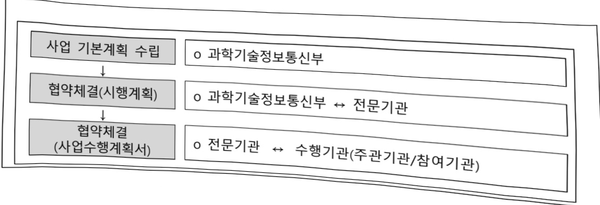
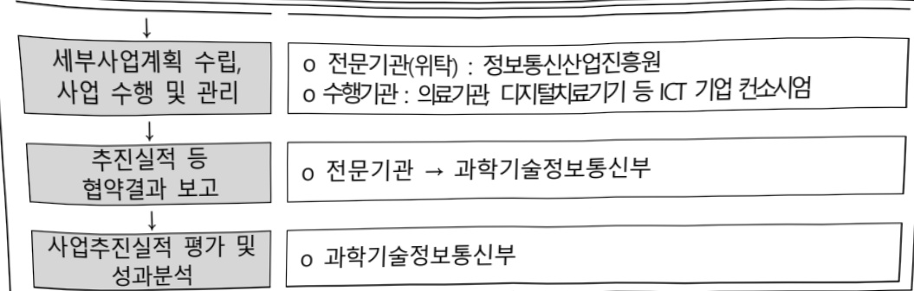

# 디지털 혁신 기술 기반 K-CareNetwork

**해당 페이지**: PDF 941 ~ 947 쪽 해당

**부처**: 과학기술정보통신부
**분야**: 통신
**회계유형**: 일반회계
**2026 확정예산**: 5600.0 백만원
**전년대비 증감률**: None%
**AI 도메인**: 의료/바이오, 디지털전환(AX)

---

### 가. 예산 총괄표

(단위: 백만원, %)

<table border=1 style='margin: auto; word-wrap: break-word;'><tr><td rowspan="2">사업명</td><td rowspan="2">2024년 결산</td><td colspan="2">2025년 예산</td><td colspan="2">2026년 예산</td><td rowspan="2">증감(B-A)</td><td rowspan="2">(B-A)/A</td></tr><tr><td style='text-align: center; word-wrap: break-word;'>본예산</td><td style='text-align: center; word-wrap: break-word;'>추경*(A)</td><td style='text-align: center; word-wrap: break-word;'>요구안</td><td style='text-align: center; word-wrap: break-word;'>본예산(B)</td></tr><tr><td style='text-align: center; word-wrap: break-word;'>디지털 혁신 기술 기반 K-CareNetwork</td><td style='text-align: center; word-wrap: break-word;'>4,000</td><td style='text-align: center; word-wrap: break-word;'>6,000</td><td style='text-align: center; word-wrap: break-word;'>6,000</td><td style='text-align: center; word-wrap: break-word;'>5,600</td><td style='text-align: center; word-wrap: break-word;'>5,600</td><td style='text-align: center; word-wrap: break-word;'>△400</td><td style='text-align: center; word-wrap: break-word;'>△6.7%</td></tr></table>

* 추경: 추경증감액을 포함한 최종 예산액을 기재

□ 기능별(내역사업별) 예산 내역

(단위: 백만원)

<table border=1 style='margin: auto; word-wrap: break-word;'><tr><td rowspan="2"></td><td colspan="5">2024</td><td colspan="5">2025</td><td rowspan="2">2026 倉冫</td></tr><tr><td style='text-align: center; word-wrap: break-word;'>倉冫効 (倉冫)</td><td style='text-align: center; word-wrap: break-word;'>倉冫効 倉冫効</td><td style='text-align: center; word-wrap: break-word;'>倉冫効</td><td style='text-align: center; word-wrap: break-word;'>倉冫効</td><td style='text-align: center; word-wrap: break-word;'>倉冫効</td><td style='text-align: center; word-wrap: break-word;'>倉冫効 (倉冫)</td><td style='text-align: center; word-wrap: break-word;'>倉冫効</td><td style='text-align: center; word-wrap: break-word;'>倉冫効</td><td style='text-align: center; word-wrap: break-word;'>倉冫効</td><td style='text-align: center; word-wrap: break-word;'>倉冫効</td></tr><tr><td style='text-align: center; word-wrap: break-word;'>○ 기능별 분류(倉冫)</td><td style='text-align: center; word-wrap: break-word;'>4,000</td><td style='text-align: center; word-wrap: break-word;'>4,000</td><td style='text-align: center; word-wrap: break-word;'>4,000</td><td style='text-align: center; word-wrap: break-word;'>-</td><td style='text-align: center; word-wrap: break-word;'>-</td><td style='text-align: center; word-wrap: break-word;'>6,000</td><td style='text-align: center; word-wrap: break-word;'>6,000</td><td style='text-align: center; word-wrap: break-word;'>6,000</td><td style='text-align: center; word-wrap: break-word;'>-</td><td style='text-align: center; word-wrap: break-word;'>-</td><td style='text-align: center; word-wrap: break-word;'>5,600</td></tr><tr><td style='text-align: center; word-wrap: break-word;'>· 디지털치료기기 개발·실증</td><td style='text-align: center; word-wrap: break-word;'>4,000</td><td style='text-align: center; word-wrap: break-word;'>4,000</td><td style='text-align: center; word-wrap: break-word;'>4,000</td><td style='text-align: center; word-wrap: break-word;'>-</td><td style='text-align: center; word-wrap: break-word;'>-</td><td style='text-align: center; word-wrap: break-word;'>6,000</td><td style='text-align: center; word-wrap: break-word;'>6,000</td><td style='text-align: center; word-wrap: break-word;'>6,000</td><td style='text-align: center; word-wrap: break-word;'>-</td><td style='text-align: center; word-wrap: break-word;'>-</td><td style='text-align: center; word-wrap: break-word;'>5,600</td></tr></table>

### 나. 사업설명자료

## 1 ) 사업목적·내용

o (디지털 혁신 기술 기반 K-CareNetwork) 개인 라이프로그 데이터, 의료 데이터 등을

활용하여 AI기술 기반 개인별 맞춤형 디지털치료기 개발·실증 지원

## 2 ) 사업개요

☐ 사업근거 및 추진경위

① 법령상 근거 및 조항 적시

- 정보통신산업진흥법 제21조(정보통신망 응용서비스의 개발촉진 등)

제21조(정보통신망 응용서비스의 개발촉진 등)

② 과학기술정보통신부장관은 민간부문에 의한 정보통신망 응용서비스의 개발을 촉진하기 위하여 재정 및 기술 등 필요한 지원을 할 수 있다.

- 정보통신 진흥 및 융합 활성화 등에 관한 특별법 제32조(정보통신융합 등 기술·서비스 개발 등의 지원)

---

제32조(정보통신융합 등 기술·서비스 개발 등의 지원)

② 과학기술정보통신부장관은 정보통신융합등 기술·서비스의 개발을 촉진하기 위하여 다음 각 호의 사업을 추진할 수 있다.

6. 정보통신융합등 기술의 기술이전 후 상용화 연구개발 지원

7. 정보통신융합등 기술의 기술사업화 전문인력 양성

11. 정보통신융합등 기술·서비스 관련 시범사업

12. 그 밖에 정보통신기술진흥을 위하여 필요한 사업

③ 과학기술정보통신부장관은 제2항 각 호의 사업을 추진하기 위하여 법인인 전담기관을 설립하거나 법인·단체에 위탁·운영할 수 있으며, 필요한 비용의 전부 또는 일부를 예산의 범위에서 출연 또는 보조할 수 있다.

## - 정보통신산업진흥법 제27조(사업), 제28조(재원)

제27조(사업)산업진흥원은 다음 각 호의 사업을 한다.

2. 전문인력 양성

4. 정보통신기업의 창업 · 성장 등의 지원

5. 정보통신산업 발전을 위한 유통시장 활성화와 마케팅 지원

7. 정보통신기술의 융합·활용에 관한 사업

8. 정보통신산업 관련 국제교류·협력 및 해외진출의 지원

14. 그 밖에 산업진흥원의 설립 목적을 달성하는 데 필요한 사업으로서 대통령

령으로 정하는 사업

제28조(재원)① 정부는 예산 또는 기금의 범위에서 산업진흥원의 설립 및 운영

에 필요한 경비의 전부 또는 일부를 출연하거나 보조할 수 있다.

## ② 추진경위

- '19.12월 : 인공지능 국가전략 발표

- '21.01 월 : 과학기술정보통신부 2021년도 업무계획

▶ (전략2.3) 디지털을 전산업·사회로 확산(닥터앤서 2단계 사업착수('21~'24년))

- '21.01월 : 제3차 혁신성장 전략·정책 점검 회의

▶ AI기술로 암·당뇨·간질환 등을 정확히 진단하는 ‘닥터앤서2.0(280억원)’ 투자

- '22.12 : 新성장 4.0 전략 추진 계획 (관계부처합동)

▶ (新일상) Digital Everywhere

- (내 삶 속의 디지털) 공공지역 의료기관 대상 AI-SW 적용·확산 등 AI 제품 서비스 개발·보급

- '23.1 : 제2차 인공지능 일상화 및 산업 고도화 계획 (국가데이터정책위원회)

---

국민 일상생활, 행정·입법·사법 등 공공영역, 전산업 분야로 인공지능 전면 확산

1 독거노인·장애인 등 취약계층을 보살피고 민생현안 해결을 위해 상용 AI 제품 및 서비스를 국민 생활 곳곳에 확산하는 '전 국민 AI 일상화'를 추진

▶ 대형 수요 창출로 AI산업성장 견인

4 공공·산업 AI전면 융합

-10대 분야 중심 AI 제품·서비스 개발·적용(23, 2,805억원) 등

### - '23.2월 : 바이오헬스 신시장 창출 전략 (관계부처합동)

의료·건강·돌봄 서비스 혁신

- 개인 맞춤 의료·건강 서비스 혁신, 삶터 중심의 돌봄 서비스 추진

-의료현장에필요로하는디지털·인공지능기술확산

### - '25.8월 : 이재명정부 123대 국정과제 (국정기획위원회 국민보고대회)

▶ 국정과제 23. 안전과 책임 기반의 'AI 기본사회' 실현

---

## 주요내용

① 사업규모

- 총사업비(해당되는 경우에만 기재) : 해당 없음

- 사업기간 : '24년 ~ '27년

- 최근 5년 간 투입된 사업비(예산액기준, 추경편성한 연도에는 추경포함)

<table border=1 style='margin: auto; word-wrap: break-word;'><tr><td style='text-align: center; word-wrap: break-word;'>$ \underline{\text{焼成}} $</td><td style='text-align: center; word-wrap: break-word;'>2022</td><td style='text-align: center; word-wrap: break-word;'>2023</td><td style='text-align: center; word-wrap: break-word;'>2024</td><td style='text-align: center; word-wrap: break-word;'>2025</td><td style='text-align: center; word-wrap: break-word;'>2026</td></tr><tr><td style='text-align: center; word-wrap: break-word;'>$ \underline{\text{사업비}} $</td><td style='text-align: center; word-wrap: break-word;'>-</td><td style='text-align: center; word-wrap: break-word;'>-</td><td style='text-align: center; word-wrap: break-word;'>4,000</td><td style='text-align: center; word-wrap: break-word;'>6,000</td><td style='text-align: center; word-wrap: break-word;'>5,600</td></tr></table>

-기타: 해당 없음

② 사업추진체계

- 사업시행방법 : 출연

- 사업시행주체 : 정보통신산업진흥원

- 사업 수혜자 : 의료기관, 디지털치료기기 개발사 등 ICT 기업

- 보조, 융자, 출연, 출자 등의 경우 보조·융자 등 지원 비율 및 법적근거

<table border=1 style='margin: auto; word-wrap: break-word;'><tr><td style='text-align: center; word-wrap: break-word;'>내역사업명</td><td style='text-align: center; word-wrap: break-word;'>구분</td><td style='text-align: center; word-wrap: break-word;'>피보조·피출연 등 기관명</td><td style='text-align: center; word-wrap: break-word;'>지원 금액 (2026예산)</td><td style='text-align: center; word-wrap: break-word;'>지원 비율(%)</td><td style='text-align: center; word-wrap: break-word;'>보조율 법적근거 (해당 조항)</td></tr><tr><td style='text-align: center; word-wrap: break-word;'>디지털 치료 기기 개발실증</td><td style='text-align: center; word-wrap: break-word;'>출연</td><td style='text-align: center; word-wrap: break-word;'>정보통신산업진흥원</td><td style='text-align: center; word-wrap: break-word;'>5,600</td><td style='text-align: center; word-wrap: break-word;'>100</td><td style='text-align: center; word-wrap: break-word;'>정보통신산업진흥법 제27조, 정보통신 진흥 및 융합 활성화 등에 관한 특별법 제32조</td></tr></table>

3) 2026년도 예산 산출 근거

○ 사업출연금(350-02):5,600백만원

가.디지털치료기 개발·실증 (5,600백만원)

(24계속) 4개 컨소시엄 × 900백만원 = 3,600백만원

• (25계속) 4개 컨소시엄 × 500백만원 = 2,000백만원

## 4 ) 사업효과

☐ 사업영향, 산출물 성과지표 등

① 2022~2026년도 성과계획서 상 성과지표 및 최근 5년간 성과 달성도

---

<table border=1 style='margin: auto; word-wrap: break-word;'><tr><td style='text-align: center; word-wrap: break-word;'>성과지표</td><td style='text-align: center; word-wrap: break-word;'>구분</td><td style='text-align: center; word-wrap: break-word;'>2022</td><td style='text-align: center; word-wrap: break-word;'>2023</td><td style='text-align: center; word-wrap: break-word;'>2024</td><td style='text-align: center; word-wrap: break-word;'>2025</td><td style='text-align: center; word-wrap: break-word;'>2026</td><td style='text-align: center; word-wrap: break-word;'>2026 목표 산출근거</td><td style='text-align: center; word-wrap: break-word;'>측정산식 (또는 측정방법)</td><td style='text-align: center; word-wrap: break-word;'>자료수집방법 (또는 자료출처)</td></tr><tr><td rowspan="3">학습데이터 수집·가공 (단위: 건)</td><td style='text-align: center; word-wrap: break-word;'>목표</td><td style='text-align: center; word-wrap: break-word;'>-</td><td style='text-align: center; word-wrap: break-word;'>-</td><td style='text-align: center; word-wrap: break-word;'>1,800</td><td style='text-align: center; word-wrap: break-word;'>3,600</td><td style='text-align: center; word-wrap: break-word;'>3,960</td><td rowspan="3">전년 대비 10% 상향하여 목표치 설정</td><td rowspan="3">학습데이터 수집·가공 수</td><td rowspan="3">결과보고서</td></tr><tr><td style='text-align: center; word-wrap: break-word;'>실적</td><td style='text-align: center; word-wrap: break-word;'>-</td><td style='text-align: center; word-wrap: break-word;'>-</td><td style='text-align: center; word-wrap: break-word;'>31,842</td><td style='text-align: center; word-wrap: break-word;'>108,842</td><td style='text-align: center; word-wrap: break-word;'>-</td></tr><tr><td style='text-align: center; word-wrap: break-word;'>달성도</td><td style='text-align: center; word-wrap: break-word;'>-</td><td style='text-align: center; word-wrap: break-word;'>-</td><td style='text-align: center; word-wrap: break-word;'>100%</td><td style='text-align: center; word-wrap: break-word;'>100%</td><td style='text-align: center; word-wrap: break-word;'>-</td></tr></table>

② 성과지표 이외의 연도별 사업추진 경과 및 실적

<table border=1 style='margin: auto; word-wrap: break-word;'><tr><td style='text-align: center; word-wrap: break-word;'>2024</td><td style='text-align: center; word-wrap: break-word;'>- 디지털치료기기 개발·실증 지원사업 4개 신규과제(전소시업) 공모·선정·지원 - 디지털치료 프로토콜 정립(4건), 탐색임상시험용 디지털치료기기 시작품 개발(4건)</td></tr><tr><td style='text-align: center; word-wrap: break-word;'>2025</td><td style='text-align: center; word-wrap: break-word;'>- 디지털치료기기 개발·실증 지원사업 4개 계속과제(전소시업) 2차년도 지원, 식약처 디지털치료기기 탐색임상시험계획 승인 획득(1건), 식약처 진단보조의료기기 확증임상 시험계획 승인 획득(1건) - 디지털치료기기 개발·실증 지원사업 4개 신규과제(전소시업) 공모·선정·지원, 디지털치료 프로토콜 정립(3건), 탐색임상시험용 디지털치료기기 시작품 개발(3건), 디지털치료기기 고도화 개발(1건)</td></tr></table>

③향후(2026년도 이후)기대효과

0 개인 라이프로그 데이터를 활용한 다양한 디지털치료기 개발, 병원 데이터를 활용한 디지털치료기 실증 지원으로 디지털헬스케어 산업 생태계 기반 조성

o 국내 식약처(MFDS) 디지털치료기 인허가 획득으로 개인 맞춤형 디지털치료 사업화 지원

o 디지털치료기 SW 국외 의료기관 교차검증 추진으로 글로벌 레퍼런스 확보 지원

5) 타당성조사 및 예비타당성조사 시행여부 및 결과 요지 : 해당 없음

6) 총사업비 대상사업 정보 : 해당 없음

7) 사업 집행절차

---

<디지털 혁신 기술 기반 K-CareNetwork>

<table border=1 style='margin: auto; word-wrap: break-word;'><tr><td style='text-align: center; word-wrap: break-word;'>부처</td><td style='text-align: center; word-wrap: break-word;'></td><td style='text-align: center; word-wrap: break-word;'>피출연·피보조기관</td><td style='text-align: center; word-wrap: break-word;'></td><td style='text-align: center; word-wrap: break-word;'>사업수행기관(기업 등)</td></tr><tr><td style='text-align: center; word-wrap: break-word;'>과학기술정보통신부(5,600백만원)</td><td style='text-align: center; word-wrap: break-word;'>=&gt;(5,600백만원)</td><td style='text-align: center; word-wrap: break-word;'>정보통신산업진흥원(280백만원)</td><td style='text-align: center; word-wrap: break-word;'>=&gt;(5,320백만원)</td><td style='text-align: center; word-wrap: break-word;'>의료기관,디지털치료기기등 ICT 기업 컨소시엄(5,320백만원)</td></tr></table>

## 8 ) 각종 평가

2025년도 부처 재정사업 자율평가 결과: 보통(81.7점)

### 다. 최근 4년간 결산내역

## 1 ) 결산표

☐ 부처 결산내역

(단위: 백만원, %)

<table border=1 style='margin: auto; word-wrap: break-word;'><tr><td rowspan="2">笹도</td><td colspan="3">예산액</td><td style='text-align: center; word-wrap: break-word;'>예산현액</td><td style='text-align: center; word-wrap: break-word;'>집행액</td><td style='text-align: center; word-wrap: break-word;'>집행률</td><td style='text-align: center; word-wrap: break-word;'>다음연도</td><td rowspan="2">불용액</td></tr><tr><td style='text-align: center; word-wrap: break-word;'>본예산</td><td style='text-align: center; word-wrap: break-word;'>추경증감액</td><td style='text-align: center; word-wrap: break-word;'>추경</td><td style='text-align: center; word-wrap: break-word;'>(A)</td><td style='text-align: center; word-wrap: break-word;'>(B)</td><td style='text-align: center; word-wrap: break-word;'>(B/A)</td><td style='text-align: center; word-wrap: break-word;'>이월액</td></tr><tr><td style='text-align: center; word-wrap: break-word;'>2024</td><td style='text-align: center; word-wrap: break-word;'>4,000</td><td style='text-align: center; word-wrap: break-word;'>-</td><td style='text-align: center; word-wrap: break-word;'>4,000</td><td style='text-align: center; word-wrap: break-word;'>4,000</td><td style='text-align: center; word-wrap: break-word;'>4,000</td><td style='text-align: center; word-wrap: break-word;'>100</td><td style='text-align: center; word-wrap: break-word;'>-</td><td style='text-align: center; word-wrap: break-word;'>-</td></tr><tr><td style='text-align: center; word-wrap: break-word;'>2025</td><td style='text-align: center; word-wrap: break-word;'>6,000</td><td style='text-align: center; word-wrap: break-word;'>-</td><td style='text-align: center; word-wrap: break-word;'>6,000</td><td style='text-align: center; word-wrap: break-word;'>6,000</td><td style='text-align: center; word-wrap: break-word;'>6,000</td><td style='text-align: center; word-wrap: break-word;'>100</td><td style='text-align: center; word-wrap: break-word;'>-</td><td style='text-align: center; word-wrap: break-word;'>-</td></tr></table>

## 2 ) 주요 결산사항

□2022~2025년 결산 주요사항 : 해당 없음

□ 2025년 이·전용 등 세부내역 : 해당 없음

---

<table border=1 style='margin: auto; word-wrap: break-word;'><tr><td style='text-align: center; word-wrap: break-word;'>사 업 명</td></tr><tr><td style='text-align: center; word-wrap: break-word;'>(13) 디지털미디어이노베이션기술개발(R&amp;D) (1131-520)</td></tr></table>

☐ 사업 코드 정보

<table border=1 style='margin: auto; word-wrap: break-word;'><tr><td style='text-align: center; word-wrap: break-word;'>구분</td><td style='text-align: center; word-wrap: break-word;'>회계</td><td style='text-align: center; word-wrap: break-word;'>소관</td><td style='text-align: center; word-wrap: break-word;'>실국(기관)</td><td style='text-align: center; word-wrap: break-word;'>계정</td><td style='text-align: center; word-wrap: break-word;'>분야</td><td style='text-align: center; word-wrap: break-word;'>부문</td></tr><tr><td style='text-align: center; word-wrap: break-word;'>코드</td><td rowspan="2">일반회계</td><td rowspan="2">과학기술정보통신부</td><td rowspan="2">전과정책국</td><td rowspan="2"></td><td style='text-align: center; word-wrap: break-word;'>060</td><td style='text-align: center; word-wrap: break-word;'>061</td></tr><tr><td style='text-align: center; word-wrap: break-word;'>명칭</td><td style='text-align: center; word-wrap: break-word;'>문화및관광</td><td style='text-align: center; word-wrap: break-word;'>문화예술</td></tr></table>

<table border=1 style='margin: auto; word-wrap: break-word;'><tr><td style='text-align: center; word-wrap: break-word;'>구분</td><td style='text-align: center; word-wrap: break-word;'>프로그램</td><td style='text-align: center; word-wrap: break-word;'>단위사업</td><td style='text-align: center; word-wrap: break-word;'>세부사업</td></tr><tr><td style='text-align: center; word-wrap: break-word;'>코드</td><td style='text-align: center; word-wrap: break-word;'>1100</td><td style='text-align: center; word-wrap: break-word;'>1131</td><td style='text-align: center; word-wrap: break-word;'>520</td></tr><tr><td style='text-align: center; word-wrap: break-word;'>명칭</td><td style='text-align: center; word-wrap: break-word;'>콘텐츠방송산업육성</td><td style='text-align: center; word-wrap: break-word;'>콘텐츠진흥</td><td style='text-align: center; word-wrap: break-word;'>디지털미디어이노베이션 기술개발(R&amp;D)</td></tr></table>

□ 사업 성격 (공통요구자료 Ⅱ-1 작성유의사항 4. 참조, 해당하는 사항에 “○” 표시)

<table border=1 style='margin: auto; word-wrap: break-word;'><tr><td rowspan="2">신규</td><td rowspan="2">계속</td><td rowspan="2">완료</td><td rowspan="2">예비타당성 실시여부</td><td rowspan="2">총사업비 관리대상</td><td rowspan="2">총액계상 예산사업</td><td style='text-align: center; word-wrap: break-word;'>사업소관 변경정보</td></tr><tr><td style='text-align: center; word-wrap: break-word;'>2025예산 시 소관</td></tr><tr><td style='text-align: center; word-wrap: break-word;'>○</td><td style='text-align: center; word-wrap: break-word;'></td><td style='text-align: center; word-wrap: break-word;'></td><td style='text-align: center; word-wrap: break-word;'>○</td><td style='text-align: center; word-wrap: break-word;'></td><td style='text-align: center; word-wrap: break-word;'></td><td style='text-align: center; word-wrap: break-word;'></td></tr></table>

사업지원형태 및지원을(최소한개는반드시선택하시오.해당사항에O표시)

<table border=1 style='margin: auto; word-wrap: break-word;'><tr><td style='text-align: center; word-wrap: break-word;'>직접</td><td style='text-align: center; word-wrap: break-word;'>출자</td><td style='text-align: center; word-wrap: break-word;'>출연</td><td style='text-align: center; word-wrap: break-word;'>보조</td><td style='text-align: center; word-wrap: break-word;'>융자</td><td style='text-align: center; word-wrap: break-word;'>국고보조율(%)</td><td style='text-align: center; word-wrap: break-word;'>융자율(%)</td></tr><tr><td style='text-align: center; word-wrap: break-word;'></td><td style='text-align: center; word-wrap: break-word;'></td><td style='text-align: center; word-wrap: break-word;'>0</td><td style='text-align: center; word-wrap: break-word;'></td><td style='text-align: center; word-wrap: break-word;'></td><td style='text-align: center; word-wrap: break-word;'></td><td style='text-align: center; word-wrap: break-word;'></td></tr></table>

□사업 소관부처 및 시행주체

<table border=1 style='margin: auto; word-wrap: break-word;'><tr><td style='text-align: center; word-wrap: break-word;'>사업명</td><td colspan="2">구분</td></tr><tr><td rowspan="9">디지털미디어이노베이션기술개발</td><td rowspan="8">소관부처</td><td style='text-align: center; word-wrap: break-word;'>전과정책국</td></tr><tr><td style='text-align: center; word-wrap: break-word;'>전과방송관리과</td></tr><tr><td style='text-align: center; word-wrap: break-word;'>정보통신정책실</td></tr><tr><td style='text-align: center; word-wrap: break-word;'>소프트웨어정책관</td></tr><tr><td style='text-align: center; word-wrap: break-word;'>디지털콘텐츠과</td></tr><tr><td style='text-align: center; word-wrap: break-word;'>네트워크정책실</td></tr><tr><td style='text-align: center; word-wrap: break-word;'>통신정책관</td></tr><tr><td style='text-align: center; word-wrap: break-word;'>디지털플랫폼팀</td></tr><tr><td style='text-align: center; word-wrap: break-word;'>사업시행주체</td><td style='text-align: center; word-wrap: break-word;'>정보통신기획평가원</td></tr></table>

---

### 원본 PDF 크롭 이미지

