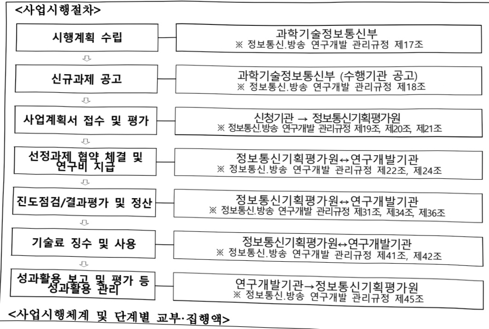

# 디지털미디어이노베이션기술개발(R&D)

**해당 페이지**: PDF 948 ~ 953 쪽 해당

**부처**: 과학기술정보통신부
**분야**: 문화 및 관광
**회계유형**: 일반회계
**2026 확정예산**: 7240.0 백만원
**전년대비 증감률**: None%
**AI 도메인**: 문화/콘텐츠

---

### 가.예산 총괄표

(단위: 백만원, %)

<table border=1 style='margin: auto; word-wrap: break-word;'><tr><td rowspan="2">사업명</td><td rowspan="2">2024년 결산</td><td colspan="2">2025년 예산</td><td colspan="2">2026년 예산</td><td rowspan="2">증감(B-A)</td><td rowspan="2">(B-A)/A</td></tr><tr><td style='text-align: center; word-wrap: break-word;'>본예산</td><td style='text-align: center; word-wrap: break-word;'>추경*(A)</td><td style='text-align: center; word-wrap: break-word;'>요구안</td><td style='text-align: center; word-wrap: break-word;'>본예산(B)</td></tr><tr><td style='text-align: center; word-wrap: break-word;'>디지털미디어이노베이션기술개발(R&amp;D)</td><td style='text-align: center; word-wrap: break-word;'>-</td><td style='text-align: center; word-wrap: break-word;'>-</td><td style='text-align: center; word-wrap: break-word;'>-</td><td style='text-align: center; word-wrap: break-word;'>7,240</td><td style='text-align: center; word-wrap: break-word;'>7,240</td><td style='text-align: center; word-wrap: break-word;'>7,240</td><td style='text-align: center; word-wrap: break-word;'>순증</td></tr></table>

□ 기능별(내역사업별) 예산 내역

(단위:백만원)

<table border=1 style='margin: auto; word-wrap: break-word;'><tr><td rowspan="2"></td><td colspan="5">2024</td><td colspan="5">2025</td><td rowspan="2">2026예산</td></tr><tr><td style='text-align: center; word-wrap: break-word;'>예산액(추정)</td><td style='text-align: center; word-wrap: break-word;'>예산현액</td><td style='text-align: center; word-wrap: break-word;'>집행액</td><td style='text-align: center; word-wrap: break-word;'>이월액</td><td style='text-align: center; word-wrap: break-word;'>불용액</td><td style='text-align: center; word-wrap: break-word;'>예산액(추정)</td><td style='text-align: center; word-wrap: break-word;'>예산현액</td><td style='text-align: center; word-wrap: break-word;'>집행액</td><td style='text-align: center; word-wrap: break-word;'>이월액</td><td style='text-align: center; word-wrap: break-word;'>불용액</td></tr><tr><td style='text-align: center; word-wrap: break-word;'>○ 기능별 분류(합계)</td><td style='text-align: center; word-wrap: break-word;'>-</td><td style='text-align: center; word-wrap: break-word;'>-</td><td style='text-align: center; word-wrap: break-word;'>-</td><td style='text-align: center; word-wrap: break-word;'>-</td><td style='text-align: center; word-wrap: break-word;'>-</td><td style='text-align: center; word-wrap: break-word;'>-</td><td style='text-align: center; word-wrap: break-word;'>-</td><td style='text-align: center; word-wrap: break-word;'>-</td><td style='text-align: center; word-wrap: break-word;'>-</td><td style='text-align: center; word-wrap: break-word;'>-</td><td style='text-align: center; word-wrap: break-word;'>7,240</td></tr><tr><td rowspan="3">• 미디어지능화제작핵심기술개발• 마이미디어플랫폼핵심기술개발• 미디어인프라핵심기술개발</td><td style='text-align: center; word-wrap: break-word;'>-</td><td style='text-align: center; word-wrap: break-word;'>-</td><td style='text-align: center; word-wrap: break-word;'>-</td><td style='text-align: center; word-wrap: break-word;'>-</td><td style='text-align: center; word-wrap: break-word;'>-</td><td style='text-align: center; word-wrap: break-word;'>-</td><td style='text-align: center; word-wrap: break-word;'>-</td><td style='text-align: center; word-wrap: break-word;'>-</td><td style='text-align: center; word-wrap: break-word;'>-</td><td style='text-align: center; word-wrap: break-word;'>-</td><td style='text-align: center; word-wrap: break-word;'>900</td></tr><tr><td style='text-align: center; word-wrap: break-word;'>-</td><td style='text-align: center; word-wrap: break-word;'>-</td><td style='text-align: center; word-wrap: break-word;'>-</td><td style='text-align: center; word-wrap: break-word;'>-</td><td style='text-align: center; word-wrap: break-word;'>-</td><td style='text-align: center; word-wrap: break-word;'>-</td><td style='text-align: center; word-wrap: break-word;'>-</td><td style='text-align: center; word-wrap: break-word;'>-</td><td style='text-align: center; word-wrap: break-word;'>-</td><td style='text-align: center; word-wrap: break-word;'>-</td><td style='text-align: center; word-wrap: break-word;'>533</td></tr><tr><td style='text-align: center; word-wrap: break-word;'>-</td><td style='text-align: center; word-wrap: break-word;'>-</td><td style='text-align: center; word-wrap: break-word;'>-</td><td style='text-align: center; word-wrap: break-word;'>-</td><td style='text-align: center; word-wrap: break-word;'>-</td><td style='text-align: center; word-wrap: break-word;'>-</td><td style='text-align: center; word-wrap: break-word;'>-</td><td style='text-align: center; word-wrap: break-word;'>-</td><td style='text-align: center; word-wrap: break-word;'>-</td><td style='text-align: center; word-wrap: break-word;'>-</td><td style='text-align: center; word-wrap: break-word;'>5,807</td></tr></table>

### 나.사업설명자료

## 1 ) 사업목적·내용

- (디지털미디어이노베이션기술개발) 방송미디어의 이용행태 변화(OTT, 개인맞춤 등)와 AI·디지털 접목 수요에 대응하기 위해 방송미디어 산업 혁신 및 기술경쟁력 확보

## 2 ) 사업개요

사업근거 및 추진경위

① 법령상 근거 및 조항 적시

<table border=1 style='margin: auto; word-wrap: break-word;'><tr><td style='text-align: center; word-wrap: break-word;'>법령상근거</td><td style='text-align: center; word-wrap: break-word;'>○「과학기술기본법」제11조(국가연구개발사업의 추진)○ 방송통신발전기본법 제16조(방송통신기술의 진흥 등)○ 정보통신 진흥 및 융합 활성화 등에 관한 특별법 제32조(정보통신융합 등) 기술·서비스 개발 등의 지원)○ 국가연구개발혁신법 시행령 제19조(연구개발비의 지원과 부담)○ 정보통신방송 연구개발 관리규정 제27조(정부지원 및 기관부담 연구개발비 기준)</td></tr></table>

---

°「AI와 디지털 기반의 미래 미디어 계획」수립(과기정통부,'23.9)

- 인공지능과 디지털 역량의 경쟁 원천을 확보하여 강력한 콘텐츠 파워를 기반으로 국내 미디어콘텐츠 산업의 디지털 전환을 가속해 미래 신시장 선점할 수 있는 전략 발표

지원느거

°「미디어·콘텐츠 산업융합 발전방안」수립(미디어·콘텐츠산업융합발전위원회/24.3.) - 글로벌 초경쟁 시대, 대한민국 재도약을 이끌어갈 미디어·콘텐츠 산업의 금로벌 경쟁력 강화를 위한 발전방안 발표

국정과제 108-2(디지털·미디어 산업 경쟁력 강화 지원)-6.방송미디어 R&D 확대, 21-3(지역·산업 전반의 AX 대전환)-5(AX태크·기술)-(AI혁신기업) 방송미디어·가상융합서비스 기업 육성을 위한 AI 기술개발 ('25.8월)

② 추진경위 - 사업 시작년도, 추진배경, 부처별 중점과제, 대통령 공약사항 등

°'24.1~3월 : 부처 고유임무 R&D 사업에 대한 예타 수요 제출

추진경위

°24.4월:부처고유임무형 예타사업 후보 결정 통보

° '24. 4월~12월 : 사업기획

°'24.11월 : '24년도 제3차 국가연구개발사업 예비타당성조사 대상선정 통보

0 '24. 12월~25. 6월. : 예비타당성조사 대응 조사통과(시행)

## □ 주요내용

① 사업규모

- 총사업비 : 해당없음

- 사업기간 : '26 ~ 계속*

* 동 사업은 부처고유임무형(프로그램형) 사업으로, "계속사업"으로 추진 예정(사업종료 전 평가를 통해 기간 연장)

- 최근 5년 간 투입된 사업비

<table border=1 style='margin: auto; word-wrap: break-word;'><tr><td style='text-align: center; word-wrap: break-word;'>연도</td><td style='text-align: center; word-wrap: break-word;'>2022</td><td style='text-align: center; word-wrap: break-word;'>2023</td><td style='text-align: center; word-wrap: break-word;'>2024</td><td style='text-align: center; word-wrap: break-word;'>2025</td><td style='text-align: center; word-wrap: break-word;'>2026</td></tr><tr><td style='text-align: center; word-wrap: break-word;'>사업비</td><td style='text-align: center; word-wrap: break-word;'></td><td style='text-align: center; word-wrap: break-word;'></td><td style='text-align: center; word-wrap: break-word;'></td><td style='text-align: center; word-wrap: break-word;'></td><td style='text-align: center; word-wrap: break-word;'>7,240</td></tr></table>

## ② 사업추진체계

- 사업시행방법 : 출연

- 사업시행주체 : 정보통신기획평가원

- 사업 수혜자 : 방송미디어 분야 산·학·연 등

- 보조, 융자, 출연, 출자 등의 경우 보조·융자 등 지원 비율 및 법적근거

<table border=1 style='margin: auto; word-wrap: break-word;'><tr><td style='text-align: center; word-wrap: break-word;'>내역사업명</td><td style='text-align: center; word-wrap: break-word;'>구분</td><td style='text-align: center; word-wrap: break-word;'>피보조·피출연 등 기관명</td><td style='text-align: center; word-wrap: break-word;'>지원 금액 (2026예산안)</td><td style='text-align: center; word-wrap: break-word;'>지원 비율(%)</td><td style='text-align: center; word-wrap: break-word;'>보조율 법적근거 (해당 조항)</td></tr><tr><td style='text-align: center; word-wrap: break-word;'>디지털미디어이노베이션기술개발</td><td style='text-align: center; word-wrap: break-word;'>출연</td><td style='text-align: center; word-wrap: break-word;'>정보통신기획평가원</td><td style='text-align: center; word-wrap: break-word;'>7,240</td><td style='text-align: center; word-wrap: break-word;'>100</td><td style='text-align: center; word-wrap: break-word;'>정보통신 진흥 및 융합 활성화 등에 관한 특별법 제32조, 정보통신·방송 연구개발 관리규정 제12조(전문기관)</td></tr></table>

---

## 3 ) 2026년도 예산 산출 근거

<table border=1 style='margin: auto; word-wrap: break-word;'><tr><td colspan="3">2026년 예산안</td></tr><tr><td style='text-align: center; word-wrap: break-word;'>예산</td><td colspan="2">산출내역</td></tr><tr><td style='text-align: center; word-wrap: break-word;'>7,240</td><td colspan="2">○ 연구개발활동비등(360-05): 7,240백만원 - (내역1) 미디어지능화제작핵심기술개발: 900백만원 • (계속) 900백만원×12개월/12개월×1개과제=900백만원 - (내역2) 마이미디어플랫폼핵심기술개발: 533 • (계속) 533백만원×12개월/12개월×1개과제=533백만원 - (내역3) 미디어인프라핵심기술개발: 5,807 • (신규) 1,288.9백만원×9개월/12개월×3개과제=2,900백만원 • (계속) 581.4백만원×12개월/12개월×5개과제=2,907백만원</td></tr></table>

## 4 ) 사업효과

☐ 사업영향, 산출물 성과지표 등

① 2022~2026년도 성과계획서 상 성과지표 및 최근 5년간 성과 달성도

※ 전략계획서 작성 전 사업(신규사업)으로 향후 전략계획서 작성에 따라 확정

② 성과지표 이외의 연도별 사업추진 경과 및 실적 : 해당없음(신규)

③향후(2026년도 이후)기대효과

- (방송·미디어 손주기 AI 전환) 방송·미디어 생태계 참여자들의 미디어 제작·서비스 핵심기술 확보를 지원하여 산업의 AX혁신 지원

<동 사업을 통한 AX 혁신 수혜자 >

<table border=1 style='margin: auto; word-wrap: break-word;'><tr><td style='text-align: center; word-wrap: break-word;'>구분(유형)</td><td style='text-align: center; word-wrap: break-word;'>수혜자 효과</td></tr><tr><td style='text-align: center; word-wrap: break-word;'>미디어테크기업</td><td style='text-align: center; word-wrap: break-word;'>AI 기반더빙, 추천 등 방송·미디어 기획·제작·소비 전반의 AI 솔루션·SW 개발 공급</td></tr><tr><td style='text-align: center; word-wrap: break-word;'>미디어·콘텐츠 제작사</td><td style='text-align: center; word-wrap: break-word;'>특수효과, 영상 생성·편집 등에 AI를 접목하여 미디어·콘텐츠 제작 비용 절감</td></tr><tr><td style='text-align: center; word-wrap: break-word;'>OTT, FAST사</td><td style='text-align: center; word-wrap: break-word;'>AI 기반 미디어·콘텐츠 기획·추천, 지능적 스트리밍, 더빙(해외 재유통 등)을 통해 추가수익 창출</td></tr><tr><td style='text-align: center; word-wrap: break-word;'>방송사업자(지상파, 유료방송 등)</td><td style='text-align: center; word-wrap: break-word;'>AI PPL, 어드레서불광고와 같이 AI·데이터를 활용한 효율적 광고 게재 서비스 도입 등</td></tr><tr><td style='text-align: center; word-wrap: break-word;'>광고사(광고대행사, 미디어랩사 등)_</td><td style='text-align: center; word-wrap: break-word;'>신매체 광고(OTT, FAST), 신유형 광고(AI PPL, 맞춤형 광고 등) 확산을 통한 시장규모 확대</td></tr><tr><td style='text-align: center; word-wrap: break-word;'>단말기제조사(스마트TV 등)</td><td style='text-align: center; word-wrap: break-word;'>스마트TV 기반 &quot;K-FAST 채널&quot;, 몰입·입체형 콘텐츠 제공 기기 확산 등 판로확대</td></tr></table>

- (지속가능한 생태계) “AI 기술혁신을 통한 방송·미디어 플랫폼의 추가 수익창출(新서비스, 해외진출) → 콘텐츠·서비스 투자 확대 → 국내 산업 경쟁력 강화, 글로벌 의존도 감소“처럼 기술혁신을 통한 선순환 추진

<방송·미디어산업 기술혁신을 통한 선순환 체계 >

문제/이슈

·글로벌잠식

·해외比 기술 활용 미흡

·제작비급등/제작기지화

해결방안

·新서비스 사업모델을 통한

추가 수익 창출

·해외진출 등 시장규모 확대

·AI 접목을 통한 비용절감

사업목표

·제작비절감

·AI 기반 참사업모델 확보

·기술사업화매출액증대

기대효과

국내 플랫폼의 경쟁력 강화,

투자 확대 → 방송·미디어

생태계 참여자들의 콘텐츠

솔루션 공급 대상 다양화

---

## 5 ) 타당성조사 및 예비타당성조사 시행여부 및 결과 요지

□ 예비타당성조사 시행(결과 : 통과)

<table border=1 style='margin: auto; word-wrap: break-word;'><tr><td style='text-align: center; word-wrap: break-word;'>예비타당성조사 결과</td><td style='text-align: center; word-wrap: break-word;'>ㅇ개요- 제목: 2024년도 예비타당성조사보고서 디지털미디어 이노베이션 기술개발사업(2025.8)- 작성자: 한국과학기술기획평가원(KISTEP)ㅇ 주요의견- 과기정통부 고유업무에 부합하는 사업으로 부처고유임무형 R&amp;D사업에 적정, 검토결과 국비 기준 사업원안(1,181억원) 대비 7.1% 감소한 1,097억원을 적정규모로 조사- 예비타당성조사 대안의 과학기술적·정책적·경제적 타당성에 대한 종합평가(AHP) 결과, ‘사업시행’을 최종결론으로 도출, 동사업의 비용저감 효과를 살펴보면, 예비타당성조사 연구진 검토안은 비용절감(92.38억원)의 경제성을 확보한 것으로 판단ㅇ 평가결과: 0.739(AHP) / 시행- 총사업비 1,363억원(국비 1,097억원) * (25년 조직개편으로 인해 일부사업 방미통위로 이관 과기정통부 369.4억원 방미통위 727.6억원)</td></tr></table>

## 6 ) 총사업비 대상사업 여부 및 내역 : 해당없음

## 7 ) 사업 집행절차

---

<table border=1 style='margin: auto; word-wrap: break-word;'><tr><td style='text-align: center; word-wrap: break-word;'>구분</td><td style='text-align: center; word-wrap: break-word;'>부처</td><td style='text-align: center; word-wrap: break-word;'></td><td style='text-align: center; word-wrap: break-word;'>피출연·피보조기관</td><td style='text-align: center; word-wrap: break-word;'></td><td style='text-align: center; word-wrap: break-word;'>간접보조사업자·사업수행자</td></tr><tr><td style='text-align: center; word-wrap: break-word;'>[내역1]미디어지능화제작핵심기술개발</td><td style='text-align: center; word-wrap: break-word;'>부처(900백만원)</td><td style='text-align: center; word-wrap: break-word;'>=&gt;(900백만원)</td><td style='text-align: center; word-wrap: break-word;'>정보통신기획평가원(900백만원)</td><td style='text-align: center; word-wrap: break-word;'>=&gt;(900백만원)</td><td style='text-align: center; word-wrap: break-word;'>방송미디어 분야 산학연</td></tr><tr><td style='text-align: center; word-wrap: break-word;'>[내역2]마이미디어플랫폼핵심기술개발</td><td style='text-align: center; word-wrap: break-word;'>부처(533백만원)</td><td style='text-align: center; word-wrap: break-word;'>=&gt;(533백만원)</td><td style='text-align: center; word-wrap: break-word;'>정보통신기획평가원(533백만원)</td><td style='text-align: center; word-wrap: break-word;'>=&gt;(533백만원)</td><td style='text-align: center; word-wrap: break-word;'>방송미디어 분야 산학연</td></tr><tr><td style='text-align: center; word-wrap: break-word;'>[내역3]미디어인프라핵심기술개발</td><td style='text-align: center; word-wrap: break-word;'>부처(5,807백만원)</td><td style='text-align: center; word-wrap: break-word;'>=&gt;(5,807백만원)</td><td style='text-align: center; word-wrap: break-word;'>정보통신기획평가원(5,807백만원)</td><td style='text-align: center; word-wrap: break-word;'>=&gt;(5,807백만원)</td><td style='text-align: center; word-wrap: break-word;'>방송미디어 분야 산학연</td></tr></table>

8) 각종 평가 : 해당없음

다. 최근 4년간 결산내역 : 해당없음

---

<table border=1 style='margin: auto; word-wrap: break-word;'><tr><td style='text-align: center; word-wrap: break-word;'>사 업 명</td></tr><tr><td style='text-align: center; word-wrap: break-word;'>(18) 디지털배움터(세종)(1945-304)</td></tr></table>

사업 코드 정보

<table border=1 style='margin: auto; word-wrap: break-word;'><tr><td style='text-align: center; word-wrap: break-word;'>구분</td><td style='text-align: center; word-wrap: break-word;'>회계</td><td style='text-align: center; word-wrap: break-word;'>소관</td><td style='text-align: center; word-wrap: break-word;'>실국(기관)</td><td style='text-align: center; word-wrap: break-word;'>계정</td><td style='text-align: center; word-wrap: break-word;'>분야</td><td style='text-align: center; word-wrap: break-word;'>부문</td></tr><tr><td style='text-align: center; word-wrap: break-word;'>코드명칭</td><td style='text-align: center; word-wrap: break-word;'>지역균형발전특별회계</td><td style='text-align: center; word-wrap: break-word;'>과학기술정보통신부</td><td style='text-align: center; word-wrap: break-word;'>정보통신정책관정보통신정책관</td><td style='text-align: center; word-wrap: break-word;'>세종특별자치시계정</td><td style='text-align: center; word-wrap: break-word;'>010일반·지방행정</td><td style='text-align: center; word-wrap: break-word;'>015정부자원관리</td></tr></table>

<table border=1 style='margin: auto; word-wrap: break-word;'><tr><td style='text-align: center; word-wrap: break-word;'>구분</td><td style='text-align: center; word-wrap: break-word;'>프로그램</td><td style='text-align: center; word-wrap: break-word;'>단위사업</td><td style='text-align: center; word-wrap: break-word;'>세부사업</td></tr><tr><td style='text-align: center; word-wrap: break-word;'>코드</td><td style='text-align: center; word-wrap: break-word;'>1900</td><td style='text-align: center; word-wrap: break-word;'>1945</td><td style='text-align: center; word-wrap: break-word;'>304</td></tr><tr><td style='text-align: center; word-wrap: break-word;'>명칭</td><td style='text-align: center; word-wrap: break-word;'>국가사회정보화</td><td style='text-align: center; word-wrap: break-word;'>생산적정보문화조성</td><td style='text-align: center; word-wrap: break-word;'>디지털배움터(세종)</td></tr></table>

□ 사업 성격 (공통요구자료 II-1 작성유의사항 4. 참조, 해당하는 사항에 “○” 표시)

<table border=1 style='margin: auto; word-wrap: break-word;'><tr><td rowspan="2">신규</td><td rowspan="2">계속</td><td rowspan="2">완료</td><td rowspan="2">예비타당성 실시여부</td><td rowspan="2">총사업비 관리대상</td><td rowspan="2">총액계상 예산사업</td><td style='text-align: center; word-wrap: break-word;'>사업소관 변경정보</td></tr><tr><td style='text-align: center; word-wrap: break-word;'>2025예산 시 소관</td></tr><tr><td style='text-align: center; word-wrap: break-word;'>O</td><td style='text-align: center; word-wrap: break-word;'></td><td style='text-align: center; word-wrap: break-word;'></td><td style='text-align: center; word-wrap: break-word;'></td><td style='text-align: center; word-wrap: break-word;'></td><td style='text-align: center; word-wrap: break-word;'></td><td style='text-align: center; word-wrap: break-word;'></td></tr></table>

□ 사업 지원 형태 및 지원을 (최소한 한 개는 반드시 선택하시오. 해당사항에 O 표시)

<table border=1 style='margin: auto; word-wrap: break-word;'><tr><td style='text-align: center; word-wrap: break-word;'>$ \underline{\text{직접}} $</td><td style='text-align: center; word-wrap: break-word;'>$ \underline{\text{출자}} $</td><td style='text-align: center; word-wrap: break-word;'>$ \underline{\text{출연}} $</td><td style='text-align: center; word-wrap: break-word;'>$ \underline{\text{보조}} $</td><td style='text-align: center; word-wrap: break-word;'>$ \underline{\text{읍자}} $</td><td style='text-align: center; word-wrap: break-word;'>$ \underline{\text{국고보조율(%)}} $</td><td style='text-align: center; word-wrap: break-word;'>$ \underline{\text{읍자율}} $ (%)</td></tr><tr><td style='text-align: center; word-wrap: break-word;'></td><td style='text-align: center; word-wrap: break-word;'></td><td style='text-align: center; word-wrap: break-word;'></td><td style='text-align: center; word-wrap: break-word;'>O</td><td style='text-align: center; word-wrap: break-word;'></td><td style='text-align: center; word-wrap: break-word;'>80</td><td style='text-align: center; word-wrap: break-word;'></td></tr></table>

☐ 사업 소관부처 및 시행주체

<table border=1 style='margin: auto; word-wrap: break-word;'><tr><td style='text-align: center; word-wrap: break-word;'>사업명</td><td colspan="2">구분</td></tr><tr><td rowspan="2">디지털 배움터 (세종)</td><td style='text-align: center; word-wrap: break-word;'>소관부처</td><td style='text-align: center; word-wrap: break-word;'>정보통신정책실 정보통신정책관 디지털포용정책팀</td></tr><tr><td style='text-align: center; word-wrap: break-word;'>사업시행주체</td><td style='text-align: center; word-wrap: break-word;'>지자체보조</td></tr></table>

---

### 원본 PDF 크롭 이미지

