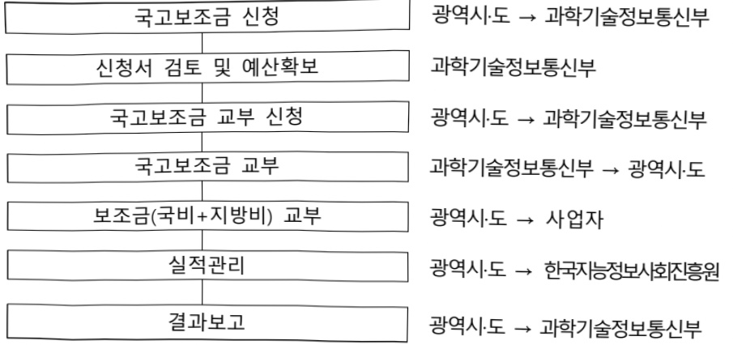

# 디지털배움터(자율)

**해당 페이지**: PDF 960 ~ 965 쪽 해당

**부처**: 과학기술정보통신부
**분야**: 일반·지방행정
**회계유형**: 지역균형발전 특별회계
**2026 확정예산**: 38121.0 백만원
**전년대비 증감률**: None%
**AI 도메인**: LLM/언어모델

---

<table border=1 style='margin: auto; word-wrap: break-word;'><tr><td style='text-align: center; word-wrap: break-word;'>사 업 명</td></tr><tr><td style='text-align: center; word-wrap: break-word;'>(1) 디지털배움터(자율)(1945-302)</td></tr></table>

사업 코드 정보

<table border=1 style='margin: auto; word-wrap: break-word;'><tr><td style='text-align: center; word-wrap: break-word;'>구분</td><td style='text-align: center; word-wrap: break-word;'>회계</td><td style='text-align: center; word-wrap: break-word;'>소관</td><td style='text-align: center; word-wrap: break-word;'>실국(기관)</td><td style='text-align: center; word-wrap: break-word;'>계정</td><td style='text-align: center; word-wrap: break-word;'>분야</td><td style='text-align: center; word-wrap: break-word;'>부문</td></tr><tr><td style='text-align: center; word-wrap: break-word;'>코드</td><td style='text-align: center; word-wrap: break-word;'>지역균형발전</td><td style='text-align: center; word-wrap: break-word;'>과학기술</td><td style='text-align: center; word-wrap: break-word;'>정보통신정책실</td><td style='text-align: center; word-wrap: break-word;'>지역자율</td><td style='text-align: center; word-wrap: break-word;'>010</td><td style='text-align: center; word-wrap: break-word;'>015</td></tr><tr><td style='text-align: center; word-wrap: break-word;'>명칭</td><td style='text-align: center; word-wrap: break-word;'>특별회계</td><td style='text-align: center; word-wrap: break-word;'>정보통신부</td><td style='text-align: center; word-wrap: break-word;'>정보통신정책관</td><td style='text-align: center; word-wrap: break-word;'>계정</td><td style='text-align: center; word-wrap: break-word;'>일반·지방행정</td><td style='text-align: center; word-wrap: break-word;'>정부자원관리</td></tr></table>

<table border=1 style='margin: auto; word-wrap: break-word;'><tr><td style='text-align: center; word-wrap: break-word;'>구분</td><td style='text-align: center; word-wrap: break-word;'>프로그램</td><td style='text-align: center; word-wrap: break-word;'>단위사업</td><td style='text-align: center; word-wrap: break-word;'>세부사업</td></tr><tr><td style='text-align: center; word-wrap: break-word;'>코드</td><td style='text-align: center; word-wrap: break-word;'>1900</td><td style='text-align: center; word-wrap: break-word;'>1945</td><td style='text-align: center; word-wrap: break-word;'>302</td></tr><tr><td style='text-align: center; word-wrap: break-word;'>명칭</td><td style='text-align: center; word-wrap: break-word;'>국가사회정보화</td><td style='text-align: center; word-wrap: break-word;'>생산적정보문화조성</td><td style='text-align: center; word-wrap: break-word;'>디지털배움터(자율)</td></tr></table>

□ 사업 성격 (공통요구자료 Ⅱ-1 작성유의사항 4. 참조, 해당하는 사항에 “○” 표시)

<table border=1 style='margin: auto; word-wrap: break-word;'><tr><td rowspan="2">신규</td><td rowspan="2">계속</td><td rowspan="2">완료</td><td rowspan="2">예비타당성 실시여부</td><td rowspan="2">총사업비 관리대상</td><td rowspan="2">총액계상 예산사업</td><td style='text-align: center; word-wrap: break-word;'>사업소관 변경정보</td></tr><tr><td style='text-align: center; word-wrap: break-word;'>2025예산 시 소관</td></tr><tr><td style='text-align: center; word-wrap: break-word;'>O</td><td style='text-align: center; word-wrap: break-word;'></td><td style='text-align: center; word-wrap: break-word;'></td><td style='text-align: center; word-wrap: break-word;'></td><td style='text-align: center; word-wrap: break-word;'></td><td style='text-align: center; word-wrap: break-word;'></td><td style='text-align: center; word-wrap: break-word;'></td></tr></table>

□ 사업 지원 형태 및 지원을 (최소한 한 개는 반드시 선택하시오. 해당사항에 ○ 표시)

<table border=1 style='margin: auto; word-wrap: break-word;'><tr><td style='text-align: center; word-wrap: break-word;'>직접</td><td style='text-align: center; word-wrap: break-word;'>출자</td><td style='text-align: center; word-wrap: break-word;'>출연</td><td style='text-align: center; word-wrap: break-word;'>보조</td><td style='text-align: center; word-wrap: break-word;'>융자</td><td style='text-align: center; word-wrap: break-word;'>국고보조율(%)</td><td style='text-align: center; word-wrap: break-word;'>융자율(%)</td></tr><tr><td style='text-align: center; word-wrap: break-word;'></td><td style='text-align: center; word-wrap: break-word;'></td><td style='text-align: center; word-wrap: break-word;'></td><td style='text-align: center; word-wrap: break-word;'>O</td><td style='text-align: center; word-wrap: break-word;'></td><td style='text-align: center; word-wrap: break-word;'>80</td><td style='text-align: center; word-wrap: break-word;'></td></tr></table>

사업 소관부처 및 시행주체

<table border=1 style='margin: auto; word-wrap: break-word;'><tr><td style='text-align: center; word-wrap: break-word;'>사업명</td><td colspan="2">구분</td></tr><tr><td rowspan="2">디지털 배움터 (자율)</td><td style='text-align: center; word-wrap: break-word;'>소관부처</td><td style='text-align: center; word-wrap: break-word;'>정보통신정책실 정보통신정책관 디지털포용정책팀</td></tr><tr><td style='text-align: center; word-wrap: break-word;'>사업시행주체</td><td style='text-align: center; word-wrap: break-word;'>지자체보조</td></tr></table>

---

### 가. 예산 총괄표

(단위: 백만원, %)

<table border=1 style='margin: auto; word-wrap: break-word;'><tr><td rowspan="2">사업명</td><td rowspan="2">2024년 결산</td><td colspan="2">2025년 예산</td><td colspan="2">2026년 예산</td><td rowspan="2">중감 (B-A)</td><td rowspan="2">(B-A)/A</td></tr><tr><td style='text-align: center; word-wrap: break-word;'>본예산</td><td style='text-align: center; word-wrap: break-word;'>추경*(A)</td><td style='text-align: center; word-wrap: break-word;'>요구안</td><td style='text-align: center; word-wrap: break-word;'>본예산(B)</td></tr><tr><td style='text-align: center; word-wrap: break-word;'>디지털배움터</td><td style='text-align: center; word-wrap: break-word;'>-</td><td style='text-align: center; word-wrap: break-word;'>-</td><td style='text-align: center; word-wrap: break-word;'>-</td><td style='text-align: center; word-wrap: break-word;'>38,121</td><td style='text-align: center; word-wrap: break-word;'>38,121</td><td style='text-align: center; word-wrap: break-word;'>38,121</td><td style='text-align: center; word-wrap: break-word;'>순증</td></tr></table>

* 추경: 추경증감액을 포함한 최종 예산액을 기재

## □ 기능별(내역사업별) 예산 내역

(단위:백만원)

<table border=1 style='margin: auto; word-wrap: break-word;'><tr><td rowspan="2"></td><td colspan="5">2024</td><td colspan="5">2025</td><td style='text-align: center; word-wrap: break-word;'>2026 倉塗</td></tr><tr><td style='text-align: center; word-wrap: break-word;'>倉塗劑(専倉塗)</td><td style='text-align: center; word-wrap: break-word;'>倉塗劑劑劑劑劑劑劑劑劑劑劑劑劑劑劑劑劑劑劑劑劑劑劑劑劑劑劑劑劑劑劑劑劑劑劑劑劑劑劑劑劑劑劑劑劑劑劑劑劑劑劑劑劑劑劑劑劑劑劑劑劑劑劑劑劑劑劑劑劑劑劑劑劑劑劑劑劑劑劑劑劑劑劑劑劑劑劑劑劑劑劑劑劑劑劑劑劑劑劑劑劑劑劑劑劑劑劑劑劑劑劑劑劑劑劑劑劑劑劑劑劑劑劑劑劑劑劑劑劑劑劑劑劑劑劑劑劑劑劑劑劑劑劑劑劑劑劑劑劑劑劑劑劑劑劑劑劑劑劑劑劑劑劑劑劑劑劑劑劑劑劑劑劑劑劑劑劑劑劑劑劑劑劑劑劑劑劑劑劑劑劑劑劑劑劑劑劑劑劑劑劑劑劑劑劑劑劑劑劑劑劑劑劑劑劑劑劑劑劑劑劑劑劑劑劑劑劑劑劑劑劑劑劑劑劑劑劑劑劑劑劑劑劑劑劑劑劑劑劑劑劑劑劑劑劑劑劑劑劑劑劑劑劑劑劑劑劑劑劑劑劑劑劑劑劑劑劑劑劑劑劑劑劑劑劑劑劑劑劑劑劑劑劑劑劑劑劑劑劑劑劑劑劑劑劑劑劑劑劑劑劑劑劑劑劑劑劑劑劑劑劑劑劑劑劑劑劑劑劑劑劑劑劑劑劑劑劑劑劑劑劑劑劑劑劑劑劑劑劑劑劑劑劑劑劑劑劑劑劑劑劑劑劑劑劑劑劑劑劑劑劑劑劑劑劑劑劑劑劑劑劑劑劑劑劑劑劑劑劑劑劑劑劑劑劑劑劑劑劑劑劑劑劑劑劑劑劑劑劑劑劑劑劑劑劑劑劑劑劑劑劑劑劑劑劑劑劑劑劑劑劑劑劑劑劑劑劑劑劑劑劑劑劑劑劑劑劑劑劑劑劑劑劑劑劑劑劑劑劑劑劑劑劑劑劑劑劑劑劑劑劑劑劑劑劑劑劑劑劑劑劑劑劑劑劑劑劑劑劑劑劑劑劑劑劑劑劑劑劑劑劑劑劑劑劑劑劑劑劑劑劑劑劑劑劑劑劑劑劑劑劑劑劑劑劑劑劑劑劑劑劑劑劑劑劑劑劑劑劑劑劑劑劑劑劑劑劑劑劑劑劑劑劑劑劑劑劑劑劑劑劑劑劑劑劑劑劑劑劑劑劑劑劑劑劑劑劑劑劑劑劑劑劑劑劑劑劑劑劑劑劑劑劑劑劑劑劑劑劑劑劑劑劑劑劑劑劑劑劑劑劑劑劑劑劑劑劑劑劑劑劑劑劑劑劑劑劑劑劑劑劑劑劑劑劑劑劑劑劑劑劑劑劑劑劑劑劑劑劑劑劑劑劑劑劑劑劑劑劑劑劑劑劑劑劑劑劑劑劑劑劑劑劑劑劑劑劑劑劑劑劑劑劑劑劑劑劑劑劑劑劑劑劑劑劑劑劑劑劑劑劑劑劑劑劑劑劑劑劑劑劑劑劑劑劑劑劑劑劑劑劑劑劑劑劑劑劑劑劑劑劑劑劑劑劑劑劑劑劑劑劑劑劑劑劑劑劑劑劑劑劑劑劑劑劑劑劑劑劑劑劑劑劑劑劑劑劑劑劑劑劑劑劑劑劑劑劑劑劑劑劑劑劑劑劑劑劑劑劑劑劑劑劑劑劑劑劑劑劑劑劑劑劑劑劑劑劑劑劑劑劑劑劑劑劑劑劑劑劑劑劑劑劑劑劑劑劑劑劑劑劑劑劑劑劑劑劑劑劑劑劑劑劑劑劑劑劑劑劑劑劑劑劑劑劑劑劑劑劑劑劑劑劑劑劑劑劑劑劑劑劑劑劑劑劑劑劑劑劑劑劑劑劑劑劑劑劑劑劑劑劑劑劑劑劑劑劑劑劑劑劑劑劑劑劑劑劑劑劑劑劑劑劑劑劑劑劑劑劑劑劑劑劑劑劑劑劑劑劑劑劑劑劑劑劑劑劑劑劑劑劑劑劑劑劑劑劑劑劑劑劑劑劑劑劑劑劑劑劑劑劑劑劑劑劑劑劑劑劑劑劑劑劑劑劑劑劑劑劑劑劑劑劑劑劑劑劑劑劑劑劑劑劑劑劑劑劑劑劑劑劑劑劑劑劑劑劑劑劑劑劑劑劑劑劑劑劑劑劑劑劑劑劑劑劑劑劑劑劑劑劑劑劑劑劑劑劑劑劑劑劑劑劑劑劑劑劑劑劑劑劑劑劑劑劑劑劑劑劑劑劑劑劑劑劑劑劑劑劑劑劑劑劑劑劑劑劑劑劑劑劑劑劑劑劑劑劑劑劑劑劑劑劑劑劑劑劑劑劑劑劑劑劑劑劑劑劑劑劑劑劑劑劑劑劑劑劑劑劑劑劑劑劑劑劑劑劑劑劑劑劑劑劑劑劑劑劑劑劑劑劑劑劑劑劑劑劑劑劑劑劑劑劑劑劑劑劑劑劑劑劑劑劑劑劑劑劑劑劑劑劑劑劑劑劑劑劑劑劑劑劑劑劑劑劑劑劑劑劑劑劑劑劑劑劑劑劑劑劑劑劑劑劑劑劑劑劑劑劑劑劑劑劑劑劑劑劑劑劑劑劑劑劑劑劑劑劑劑劑劑劑劑劑劑劑劑劑劑劑劑劑劑劑劑劑劑劑劑劑劑劑劑劑劑劑劑劑劑劑劑劑劑劑劑劑劑劑劑劑劑劑劑劑劑劑劑劑劑劑劑劑劑劑劑劑劑劑劑劑劑劑劑劑劑劑劑劑劑劑劑劑劑劑劑劑劑劑劑劑劑劑劑劑劑劑劑劑劑劑劑劑劑劑劑劑劑劑劑劑劑劑劑劑劑劑劑劑劑劑劑劑劑劑劑劑</td><td style='text-align: center; word-wrap: break-word;'></td><td style='text-align: center; word-wrap: break-word;'></td><td style='text-align: center; word-wrap: break-word;'></td><td style='text-align: center; word-wrap: break-word;'></td><td style='text-align: center; word-wrap: break-word;'></td><td style='text-align: center; word-wrap: break-word;'></td><td style='text-align: center; word-wrap: break-word;'></td><td style='text-align: center; word-wrap: break-word;'></td><td style='text-align: center; word-wrap: break-word;'></td></tr></table>

### 나. 사업설명자료

## 1 ) 사업목적·내용

- (디지털배움터) 국민 모두가 차별이나 배제없이 AI·디지털 기술 및 서비스의 혜택을 누릴 수 있도록 AI·디지털 교육 제공 및 디지털 포용 기반 조성

- (디지털배움터 운영) AI·디지털에 어려움을 느끼는 국민 대상 키오스크·스마트폰부터 생성형 AI까지 다양한 AI·디지털 교육 제공 및 시설·장비 구축

---

## 2 ) 사업개요

## 사업근거 및 추진경위

① 법령상 근거 조항 적시 :

0 지능정보화기본법 제15조(지역지능정보화의 추진)

0 지능정보화기본법 제45조(정보격차 해소 시책의 마련)

0 지능정보화기본법 제50조(정보격차해소교육의 시행)

② 추진경위

° 2025년 : 국정과제 21번(세계에서 AI를 가장 잘 쓰는 나라 구현)

## 주요내용

① 사업규모

- 총사업비(해당되는 경우에만 기재) : 해당없음

- 사업기간 : '26년 ~ 계속

- 최근 5년 간 투입된 사업비(예산액기준, 추경편성한 연도에는 추경포함)

<table border=1 style='margin: auto; word-wrap: break-word;'><tr><td style='text-align: center; word-wrap: break-word;'>2022</td><td style='text-align: center; word-wrap: break-word;'>2023</td><td style='text-align: center; word-wrap: break-word;'>2024</td><td style='text-align: center; word-wrap: break-word;'>2025</td><td style='text-align: center; word-wrap: break-word;'>2026</td></tr><tr><td style='text-align: center; word-wrap: break-word;'>2021</td><td style='text-align: center; word-wrap: break-word;'>2022</td><td style='text-align: center; word-wrap: break-word;'>2023</td><td style='text-align: center; word-wrap: break-word;'>2024</td><td style='text-align: center; word-wrap: break-word;'>2025</td></tr><tr><td style='text-align: center; word-wrap: break-word;'>2020</td><td style='text-align: center; word-wrap: break-word;'>2021</td><td style='text-align: center; word-wrap: break-word;'>202</td><td style='text-align: center; word-wrap: break-word;'></td><td style='text-align: center; word-wrap: break-word;'></td></tr></table>

- 기타: 해당없음

② 사업추진체계

- 사업시행방법 : 자치단체 경상보조

- 사업시행주체 : 15개 광역시·도(세종, 제주 제외)

- 사업 수혜자 : 전 국민

- 보조, 융자, 출연, 출자 등의 경우 보조·융자 등 지원 비율 및 법적근거

<table border=1 style='margin: auto; word-wrap: break-word;'><tr><td style='text-align: center; word-wrap: break-word;'>내역사업명</td><td style='text-align: center; word-wrap: break-word;'>구분</td><td style='text-align: center; word-wrap: break-word;'>피보조·피출연 등 기관명</td><td style='text-align: center; word-wrap: break-word;'>지원 금액 (2026예산)</td><td style='text-align: center; word-wrap: break-word;'>지원 비율(%)</td><td style='text-align: center; word-wrap: break-word;'>보조율 법적근거 (해당 조항)</td></tr><tr><td style='text-align: center; word-wrap: break-word;'>디지털배움터 운영</td><td style='text-align: center; word-wrap: break-word;'>보조</td><td style='text-align: center; word-wrap: break-word;'>지자체 보조</td><td style='text-align: center; word-wrap: break-word;'>38,121</td><td style='text-align: center; word-wrap: break-word;'>80%</td><td style='text-align: center; word-wrap: break-word;'>보조금 관리에 관한 법률 시행령 제4조 (보조금 지급 대상 사업의 범위와 기분보조율)</td></tr></table>

---

## 3 ) 2026년도 예산 산출 근거

□ 디지털배움터(자율) : (2025 본예산) 0백만원 → (2026 예산) 38,121백만원

①디지털배움터 운영

:(2025 본예산) 0백만원→(2026 요구) 38,121백만원, 신규

-(요구)지자체디지털배움터운영수요에따른예산요구(지자체자율편성)

- (산출) 15개 광역지자체 38,121백만원(세종, 제주 제외)

## 4 ) 사업효과

☐ 사업영향, 산출물 성과지표 등

①2022~2026년도 성과계획서 상 성과지표 및 최근 5년간 성과 달성도

<table border=1 style='margin: auto; word-wrap: break-word;'><tr><td style='text-align: center; word-wrap: break-word;'>성과지표</td><td style='text-align: center; word-wrap: break-word;'>구분</td><td style='text-align: center; word-wrap: break-word;'>2022</td><td style='text-align: center; word-wrap: break-word;'>2023</td><td style='text-align: center; word-wrap: break-word;'>2024</td><td style='text-align: center; word-wrap: break-word;'>2025</td><td style='text-align: center; word-wrap: break-word;'>2026</td><td style='text-align: center; word-wrap: break-word;'>2026 목표치산출근거</td><td style='text-align: center; word-wrap: break-word;'>측정산식(또는 측정방법)</td><td style='text-align: center; word-wrap: break-word;'>자료수집방법(또는 자료출처)</td></tr><tr><td rowspan="3">취약계층 디지털정보화 수준</td><td style='text-align: center; word-wrap: break-word;'>목표</td><td style='text-align: center; word-wrap: break-word;'>-</td><td style='text-align: center; word-wrap: break-word;'>-</td><td style='text-align: center; word-wrap: break-word;'>-</td><td style='text-align: center; word-wrap: break-word;'>신규</td><td style='text-align: center; word-wrap: break-word;'>77</td><td rowspan="3">&#x27;25년 취약계층 디지털 정보화 수준과 동일한 목표치설정</td><td rowspan="3">취약계층 디지털 정보화 수준=디지털접근수준(0.2)+디지털액량수준(0.4)+디지털활용수준(0.4)</td><td rowspan="3">디지털정보격차 실태조사(국가승인통계)</td></tr><tr><td style='text-align: center; word-wrap: break-word;'>실적</td><td style='text-align: center; word-wrap: break-word;'>-</td><td style='text-align: center; word-wrap: break-word;'>-</td><td style='text-align: center; word-wrap: break-word;'>-</td><td style='text-align: center; word-wrap: break-word;'>-</td><td style='text-align: center; word-wrap: break-word;'>-</td></tr><tr><td style='text-align: center; word-wrap: break-word;'>달성도</td><td style='text-align: center; word-wrap: break-word;'>-</td><td style='text-align: center; word-wrap: break-word;'>-</td><td style='text-align: center; word-wrap: break-word;'>-</td><td style='text-align: center; word-wrap: break-word;'>-</td><td style='text-align: center; word-wrap: break-word;'>-</td></tr></table>

② 성과지표 이외의 연도별 사업추진 경과 및 실적 : 해당없음

③향후(2026년도 이후)기대효과:

0 전 국민 대상 AI·디지털 교육을 제공하여 국민 모두가 차별이나 배제없이 서비스 혜택을 누릴 수 있도록 지원

- AI디지털배움터를 구축·운영하여 전 국민 대상 AI·디지털 교육 제공하고

전 국민 AI 리터러시 역량 강화

5) 타당성조사 및 예비타당성조사 시행여부 및 결과 요지 : 해당없음

6) 총사업비 대상사업 정보 : 해당없음

---

## 7 ) 사업 집행절차

국고보조금 신청

광역시·도 → 과학기술정보통신부

신청서 검토 및 예산확보

국고보조금 교부 신청

과학기술정보통신부

국고보조금 교부

광역시·도 → 과학기술정보통신부

보조금(국비+지방비) 교부

과학기술정보통신부 → 광역시·도

광역시·도 → 사업자

광역시·도→한국지능정보사회진흥원

광역시·도 → 과학기술정보통신부

## <디지털배움터 운영>

<table border=1 style='margin: auto; word-wrap: break-word;'><tr><td style='text-align: center; word-wrap: break-word;'>부처</td><td style='text-align: center; word-wrap: break-word;'></td><td style='text-align: center; word-wrap: break-word;'>피출연·피보조기관</td><td style='text-align: center; word-wrap: break-word;'></td><td style='text-align: center; word-wrap: break-word;'>간접보조사업자·사업수행자</td></tr><tr><td style='text-align: center; word-wrap: break-word;'>과학기술정보통신부(38,121백만원)</td><td style='text-align: center; word-wrap: break-word;'>=&gt;(38,121백만원)</td><td style='text-align: center; word-wrap: break-word;'>15개 광역 시·도(38,121백만원)</td><td style='text-align: center; word-wrap: break-word;'></td><td style='text-align: center; word-wrap: break-word;'></td></tr></table>

## 8 ) 각종 평가 : 해당없음

1) 국회(예결위, 상임위, 예정처, 국정감사 포함) 지적

2) 대외공개 평가

3) 자체평가

---

### 다. 최근 4년간 결산내역

## 1 ) 결산표

☐ 부처 결산내역

(단위: 백만원, %)

<table border=1 style='margin: auto; word-wrap: break-word;'><tr><td rowspan="2">闰土</td><td colspan="3">예산액</td><td rowspan="2">전년도 이월액</td><td rowspan="2">이·전용 등</td><td rowspan="2">예비비</td><td rowspan="2">예산 현액(B)</td><td rowspan="2">집행액(C)</td><td rowspan="2">집행률(C/A)</td><td rowspan="2">집행률(C/B)</td><td rowspan="2">다음연도 이월액</td><td rowspan="2">불용액</td></tr><tr><td style='text-align: center; word-wrap: break-word;'>본예산</td><td style='text-align: center; word-wrap: break-word;'>추경 중감액</td><td style='text-align: center; word-wrap: break-word;'>추경(A)</td></tr><tr><td style='text-align: center; word-wrap: break-word;'>2022</td><td style='text-align: center; word-wrap: break-word;'>-</td><td style='text-align: center; word-wrap: break-word;'>-</td><td style='text-align: center; word-wrap: break-word;'>-</td><td style='text-align: center; word-wrap: break-word;'>-</td><td style='text-align: center; word-wrap: break-word;'>-</td><td style='text-align: center; word-wrap: break-word;'>-</td><td style='text-align: center; word-wrap: break-word;'>-</td><td style='text-align: center; word-wrap: break-word;'>-</td><td style='text-align: center; word-wrap: break-word;'>-</td><td style='text-align: center; word-wrap: break-word;'>-</td><td style='text-align: center; word-wrap: break-word;'>-</td><td style='text-align: center; word-wrap: break-word;'>-</td></tr><tr><td style='text-align: center; word-wrap: break-word;'>2023</td><td style='text-align: center; word-wrap: break-word;'>-</td><td style='text-align: center; word-wrap: break-word;'>-</td><td style='text-align: center; word-wrap: break-word;'>-</td><td style='text-align: center; word-wrap: break-word;'>-</td><td style='text-align: center; word-wrap: break-word;'>-</td><td style='text-align: center; word-wrap: break-word;'>-</td><td style='text-align: center; word-wrap: break-word;'>-</td><td style='text-align: center; word-wrap: break-word;'>-</td><td style='text-align: center; word-wrap: break-word;'>-</td><td style='text-align: center; word-wrap: break-word;'>-</td><td style='text-align: center; word-wrap: break-word;'>-</td><td style='text-align: center; word-wrap: break-word;'>-</td></tr><tr><td style='text-align: center; word-wrap: break-word;'>2024</td><td style='text-align: center; word-wrap: break-word;'>-</td><td style='text-align: center; word-wrap: break-word;'>-</td><td style='text-align: center; word-wrap: break-word;'>-</td><td style='text-align: center; word-wrap: break-word;'>-</td><td style='text-align: center; word-wrap: break-word;'>-</td><td style='text-align: center; word-wrap: break-word;'>-</td><td style='text-align: center; word-wrap: break-word;'>-</td><td style='text-align: center; word-wrap: break-word;'>-</td><td style='text-align: center; word-wrap: break-word;'>-</td><td style='text-align: center; word-wrap: break-word;'>-</td><td style='text-align: center; word-wrap: break-word;'>-</td><td style='text-align: center; word-wrap: break-word;'>-</td></tr><tr><td style='text-align: center; word-wrap: break-word;'>2025</td><td style='text-align: center; word-wrap: break-word;'>-</td><td style='text-align: center; word-wrap: break-word;'>-</td><td style='text-align: center; word-wrap: break-word;'>-</td><td style='text-align: center; word-wrap: break-word;'>-</td><td style='text-align: center; word-wrap: break-word;'>-</td><td style='text-align: center; word-wrap: break-word;'>-</td><td style='text-align: center; word-wrap: break-word;'>-</td><td style='text-align: center; word-wrap: break-word;'>-</td><td style='text-align: center; word-wrap: break-word;'>-</td><td style='text-align: center; word-wrap: break-word;'>-</td><td style='text-align: center; word-wrap: break-word;'>-</td><td style='text-align: center; word-wrap: break-word;'>-</td></tr></table>

## 2 ) 주요 결산사항

2022~2025년 결산 주요사항 : 해당없음

□ 2025년 이·전용 등 세부내역 : 해당없음

---

### 원본 PDF 크롭 이미지

