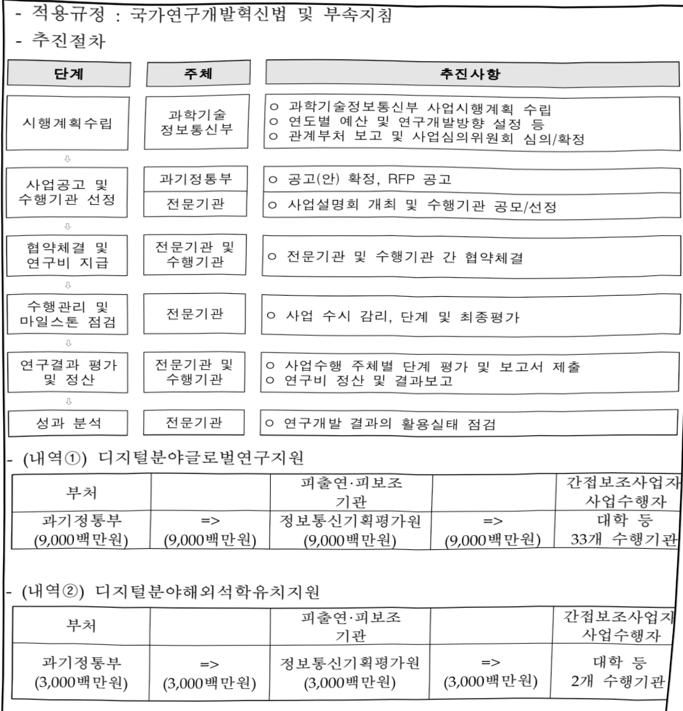

# 디지털분야글로벌인재양성(R&D)

**해당 페이지**: PDF 972 ~ 979 쪽 해당

**부처**: 과학기술정보통신부
**분야**: 통신
**회계유형**: 기금
**2026 확정예산**: 12000.0 백만원
**전년대비 증감률**: 0.0%
**AI 도메인**: 교육/인재

---

<table border=1 style='margin: auto; word-wrap: break-word;'><tr><td style='text-align: center; word-wrap: break-word;'>사 업 명</td></tr><tr><td style='text-align: center; word-wrap: break-word;'>(20) 디지털분야글로벌인재양성 (2137-308)</td></tr></table>

□ 사업 코드 정보

<table border=1 style='margin: auto; word-wrap: break-word;'><tr><td style='text-align: center; word-wrap: break-word;'>구분</td><td style='text-align: center; word-wrap: break-word;'>기금</td><td style='text-align: center; word-wrap: break-word;'>소관</td><td style='text-align: center; word-wrap: break-word;'>실국(기관)</td><td style='text-align: center; word-wrap: break-word;'>계정</td><td style='text-align: center; word-wrap: break-word;'>분야</td><td style='text-align: center; word-wrap: break-word;'>부문</td></tr><tr><td style='text-align: center; word-wrap: break-word;'>코드</td><td style='text-align: center; word-wrap: break-word;'>정보통신</td><td style='text-align: center; word-wrap: break-word;'>과학기술</td><td style='text-align: center; word-wrap: break-word;'>정보통신</td><td style='text-align: center; word-wrap: break-word;'></td><td style='text-align: center; word-wrap: break-word;'>130</td><td style='text-align: center; word-wrap: break-word;'>133</td></tr><tr><td style='text-align: center; word-wrap: break-word;'>명칭</td><td style='text-align: center; word-wrap: break-word;'>진흥기금</td><td style='text-align: center; word-wrap: break-word;'>정보통신부</td><td style='text-align: center; word-wrap: break-word;'>산업정책관</td><td style='text-align: center; word-wrap: break-word;'></td><td style='text-align: center; word-wrap: break-word;'>통신</td><td style='text-align: center; word-wrap: break-word;'>정보통신</td></tr></table>

<table border=1 style='margin: auto; word-wrap: break-word;'><tr><td style='text-align: center; word-wrap: break-word;'>구분</td><td style='text-align: center; word-wrap: break-word;'>프로그램</td><td style='text-align: center; word-wrap: break-word;'>단위사업</td><td style='text-align: center; word-wrap: break-word;'>세부사업</td></tr><tr><td style='text-align: center; word-wrap: break-word;'>코드</td><td style='text-align: center; word-wrap: break-word;'>2100</td><td style='text-align: center; word-wrap: break-word;'>2137</td><td style='text-align: center; word-wrap: break-word;'>308</td></tr><tr><td style='text-align: center; word-wrap: break-word;'>명칭</td><td style='text-align: center; word-wrap: break-word;'>정보통신융합산업</td><td style='text-align: center; word-wrap: break-word;'>ICT산업기반확충(정진)</td><td style='text-align: center; word-wrap: break-word;'>디지털분야글로벌인재양성(R&amp;D)</td></tr></table>

□ 사업 성격 (공통요구자료 Ⅱ-1 작성유의사항 4. 참조, 해당하는 사항에 “○” 표시)

<table border=1 style='margin: auto; word-wrap: break-word;'><tr><td rowspan="2">신규</td><td rowspan="2">계속</td><td rowspan="2">완료</td><td rowspan="2">예비타당성 실시여부</td><td rowspan="2">총사업비 관리대상</td><td rowspan="2">총액계상 예산사업</td><td style='text-align: center; word-wrap: break-word;'>사업소관 변경정보</td></tr><tr><td style='text-align: center; word-wrap: break-word;'>2025예산 시 소관</td></tr><tr><td style='text-align: center; word-wrap: break-word;'></td><td style='text-align: center; word-wrap: break-word;'>○</td><td style='text-align: center; word-wrap: break-word;'></td><td style='text-align: center; word-wrap: break-word;'></td><td style='text-align: center; word-wrap: break-word;'></td><td style='text-align: center; word-wrap: break-word;'></td><td style='text-align: center; word-wrap: break-word;'></td></tr></table>

□ 사업 지원 형태 및 지원을

<table border=1 style='margin: auto; word-wrap: break-word;'><tr><td style='text-align: center; word-wrap: break-word;'>직접</td><td style='text-align: center; word-wrap: break-word;'>출자</td><td style='text-align: center; word-wrap: break-word;'>출연</td><td style='text-align: center; word-wrap: break-word;'>보조</td><td style='text-align: center; word-wrap: break-word;'>융자</td><td style='text-align: center; word-wrap: break-word;'>국고보조율(%)</td><td style='text-align: center; word-wrap: break-word;'>융자율(%)</td></tr><tr><td style='text-align: center; word-wrap: break-word;'></td><td style='text-align: center; word-wrap: break-word;'></td><td style='text-align: center; word-wrap: break-word;'>○</td><td style='text-align: center; word-wrap: break-word;'></td><td style='text-align: center; word-wrap: break-word;'></td><td style='text-align: center; word-wrap: break-word;'></td><td style='text-align: center; word-wrap: break-word;'></td></tr></table>

□ 사업 소관부처 및 시행주체

<table border=1 style='margin: auto; word-wrap: break-word;'><tr><td style='text-align: center; word-wrap: break-word;'>사업명</td><td colspan="2">구분</td></tr><tr><td rowspan="3">디지털분야 글로벌인재양성</td><td rowspan="2">소관부처</td><td style='text-align: center; word-wrap: break-word;'>정보통신정책실 정보통신산업정책관</td></tr><tr><td style='text-align: center; word-wrap: break-word;'>정보통신산업기반과</td></tr><tr><td style='text-align: center; word-wrap: break-word;'>사업시행주체</td><td style='text-align: center; word-wrap: break-word;'>정보통신기획평가원</td></tr></table>

---

### 가.지출계획 총괄표

(단위: 백만원, %)

<table border=1 style='margin: auto; word-wrap: break-word;'><tr><td rowspan="2">목명</td><td rowspan="2">2024년 결산</td><td colspan="2">2025년 계획</td><td colspan="2">2026년</td><td rowspan="2">중감(B-A)</td><td rowspan="2">(B-A)/A</td></tr><tr><td style='text-align: center; word-wrap: break-word;'>본예산</td><td style='text-align: center; word-wrap: break-word;'>추경(A)</td><td style='text-align: center; word-wrap: break-word;'>요구안</td><td style='text-align: center; word-wrap: break-word;'>본예산(B)</td></tr><tr><td style='text-align: center; word-wrap: break-word;'>○ 디지털분야 글로벌 인재양성</td><td style='text-align: center; word-wrap: break-word;'>8,000</td><td style='text-align: center; word-wrap: break-word;'>12,000</td><td style='text-align: center; word-wrap: break-word;'>12,000</td><td style='text-align: center; word-wrap: break-word;'>12,000</td><td style='text-align: center; word-wrap: break-word;'>12,000</td><td style='text-align: center; word-wrap: break-word;'>0</td><td style='text-align: center; word-wrap: break-word;'>0</td></tr></table>

□ 기능별(내역사업별), 목별 계획 내역

(단위:백만원)

<table border=1 style='margin: auto; word-wrap: break-word;'><tr><td rowspan="2"></td><td colspan="5">2024</td><td colspan="5">2025</td><td rowspan="2">2026 계획</td></tr><tr><td style='text-align: center; word-wrap: break-word;'>계획액(추경)</td><td style='text-align: center; word-wrap: break-word;'>계획현액</td><td style='text-align: center; word-wrap: break-word;'>집행액</td><td style='text-align: center; word-wrap: break-word;'>이월액</td><td style='text-align: center; word-wrap: break-word;'>불용액</td><td style='text-align: center; word-wrap: break-word;'>계획액(추경)</td><td style='text-align: center; word-wrap: break-word;'>계획현액</td><td style='text-align: center; word-wrap: break-word;'>집행액</td><td style='text-align: center; word-wrap: break-word;'>이월액</td><td style='text-align: center; word-wrap: break-word;'>불용액</td></tr><tr><td style='text-align: center; word-wrap: break-word;'>○ 디지털분야글로벌인재양성</td><td style='text-align: center; word-wrap: break-word;'>8,000</td><td style='text-align: center; word-wrap: break-word;'>8,000</td><td style='text-align: center; word-wrap: break-word;'>8,000</td><td style='text-align: center; word-wrap: break-word;'>-</td><td style='text-align: center; word-wrap: break-word;'>-</td><td style='text-align: center; word-wrap: break-word;'>12,000</td><td style='text-align: center; word-wrap: break-word;'>12,000</td><td style='text-align: center; word-wrap: break-word;'>12,000</td><td style='text-align: center; word-wrap: break-word;'>-</td><td style='text-align: center; word-wrap: break-word;'>-</td><td style='text-align: center; word-wrap: break-word;'>12,000</td></tr><tr><td style='text-align: center; word-wrap: break-word;'>○ 디지털분야글로벌연구지원</td><td style='text-align: center; word-wrap: break-word;'>6,000</td><td style='text-align: center; word-wrap: break-word;'>6,000</td><td style='text-align: center; word-wrap: break-word;'>6,000</td><td style='text-align: center; word-wrap: break-word;'>-</td><td style='text-align: center; word-wrap: break-word;'>-</td><td style='text-align: center; word-wrap: break-word;'>9,000</td><td style='text-align: center; word-wrap: break-word;'>9,000</td><td style='text-align: center; word-wrap: break-word;'>9,000</td><td style='text-align: center; word-wrap: break-word;'>-</td><td style='text-align: center; word-wrap: break-word;'>-</td><td style='text-align: center; word-wrap: break-word;'>9,000</td></tr><tr><td style='text-align: center; word-wrap: break-word;'>• 연구개발활동비(360-05)</td><td style='text-align: center; word-wrap: break-word;'>6,000</td><td style='text-align: center; word-wrap: break-word;'>6,000</td><td style='text-align: center; word-wrap: break-word;'>6,000</td><td style='text-align: center; word-wrap: break-word;'>-</td><td style='text-align: center; word-wrap: break-word;'>-</td><td style='text-align: center; word-wrap: break-word;'>9,000</td><td style='text-align: center; word-wrap: break-word;'>9,000</td><td style='text-align: center; word-wrap: break-word;'>9,000</td><td style='text-align: center; word-wrap: break-word;'>-</td><td style='text-align: center; word-wrap: break-word;'>-</td><td style='text-align: center; word-wrap: break-word;'>9,000</td></tr><tr><td style='text-align: center; word-wrap: break-word;'>○ 디지털분야해외석학유치지원</td><td style='text-align: center; word-wrap: break-word;'>2,000</td><td style='text-align: center; word-wrap: break-word;'>2,000</td><td style='text-align: center; word-wrap: break-word;'>2,000</td><td style='text-align: center; word-wrap: break-word;'>-</td><td style='text-align: center; word-wrap: break-word;'>-</td><td style='text-align: center; word-wrap: break-word;'>3,000</td><td style='text-align: center; word-wrap: break-word;'>3,000</td><td style='text-align: center; word-wrap: break-word;'>3,000</td><td style='text-align: center; word-wrap: break-word;'>-</td><td style='text-align: center; word-wrap: break-word;'>-</td><td style='text-align: center; word-wrap: break-word;'>3,000</td></tr><tr><td style='text-align: center; word-wrap: break-word;'>• 연구개발활동비(360-05)</td><td style='text-align: center; word-wrap: break-word;'>2,000</td><td style='text-align: center; word-wrap: break-word;'>2,000</td><td style='text-align: center; word-wrap: break-word;'>2,000</td><td style='text-align: center; word-wrap: break-word;'>-</td><td style='text-align: center; word-wrap: break-word;'>-</td><td style='text-align: center; word-wrap: break-word;'>3,000</td><td style='text-align: center; word-wrap: break-word;'>3,000</td><td style='text-align: center; word-wrap: break-word;'>3,000</td><td style='text-align: center; word-wrap: break-word;'>-</td><td style='text-align: center; word-wrap: break-word;'>-</td><td style='text-align: center; word-wrap: break-word;'>3,000</td></tr></table>

---

### 나. 사업설명자료

## 1 ) 사업목적·내용

- (디지털분야글로벌인재양성) 글로벌 네트워크 구축과 디지털 기술분야 공동연구(대학자율형, 기업(연구소)연계형)를 통한 고급인력(석·박사) 양성 및 최고급 해외석학 유치를 통한 디지털분야 전문가 양성

(디지털분야글로벌연구지원) 국내대학원생의 국내 대학-해외 Top Tier 대학, 국내 대학-글로벌 기술 기업과의 공동연구 수행 및 해외 과격을 통한 디지털 전문 인재 양성

<table border=1 style='margin: auto; word-wrap: break-word;'><tr><td style='text-align: center; word-wrap: break-word;'>지원 유형</td><td style='text-align: center; word-wrap: break-word;'>주요 내용</td></tr><tr><td style='text-align: center; word-wrap: break-word;'>대학자율형</td><td style='text-align: center; word-wrap: break-word;'>대학의 자율성을 보장, 연구를 주도(해외 Top-Tier 대학, 국책 연구소 등과 협력)</td></tr><tr><td style='text-align: center; word-wrap: break-word;'>기업(연구소)연계형</td><td style='text-align: center; word-wrap: break-word;'>글로벌 기업의 수요를 반영, 대학과 공동연구를 수행</td></tr></table>

(디지털분야해외석학유치지원) 세계 석학급 해외 인재의 석·박사 과정 연구생 지도 및

R&D 수행 등을 통한 연구역량 강화로 기술격차 축소 및 고급인재 양성

## 2 ) 사업개요

## □ 사업근거 및 추진경위

① 법령상 근거 및 조항 적시

<table border=1 style='margin: auto; word-wrap: break-word;'><tr><td style='text-align: center; word-wrap: break-word;'>지원근거</td><td style='text-align: center; word-wrap: break-word;'>o 정보통신진흥 및 융합활성화 등에 관한 특별법 제11조(국내 전문인력 양성) 제11조(국내 전문인력의 양성) ① 과학기술정보통신부장관은 정보통신 분야의 전문적인 기술, 지식 등을 가진 인력(이하 &quot;전문인력&quot;이라 한다)의 육성에 관한 시책을 수립·추진하여야 하며, 특히 소프트웨어 교육의 저변 확대 및 지역산업의 발전을 위한 소프트웨어 특화교육 활성화를 위하여 노력하여야 한다. ② 제1항에 따른 시책에는 다음 각 호의 사항이 포함되어야 한다. 1. 전문인력의 육성 및 교육훈련에 관한 사항 2. 전문인력의 수급 및 활용에 관한 사항 3. 전문인력의 경력관리 지원 등에 관한 사항 4. 그 밖에 전문인력의 육성 및 관리 등을 위한 사항 o 정보통신산업진흥법 제16조(전문인력 양성) 제16조(전문인력의 양성) 과학기술정보통신부장관은 정보통신산업의 진흥에 필요한 전문인력을 양성하기 위하여 다음 각 호의 시책을 마련하여야 한다. 1. 전문인력의 수요 실태 파악 및 중·장기 수급 전망 수립 2. 전문인력 양성기관의 설립·지원 3. 전문인력 양성 교육프로그램의 개발 및 보급 지원 4. 정보통신기술 관련 자격제도의 정착 및 전문인력 수급 지원 5. 각급 학교 및 그 밖의 교육기관에서 시행하는 정보통신기술 및 정보통신산업 관련 교육의 지원 6. 그 밖에 전문인력 양성에 필요한 사항</td></tr></table>

---

## ② 추진경위

- '22. 8월 : 디지털 인재양성 종합방안(관계부처 합동)

- '22. 9월 : 글로벌 디지털 격차 해소(뉴욕 구상, 디지털 비전 포럼)

- '22. 11월 : 한국판 인도-태평양 전략(한-아세안 정상회의)

- '22. 12월 : 제5차 과학기술기본계획(안)(관계부처 합동)

- '22. 12월 : 경제협력개발기구(OECD) 디지털 장관회의

- '23. 2월 : 제2차 한-아세아 디지털 장관회의(과기부)

## □주요내용

① 사업규모

- 총사업비(해당되는 경우에만 기재) : 해당없음

- 사업기간 : 2024~2028

- 최근 5년 간 투입된 사업비(예산액기준, 추경편성한 연도에는 추경포함)

<table border=1 style='margin: auto; word-wrap: break-word;'><tr><td style='text-align: center; word-wrap: break-word;'>연도</td><td style='text-align: center; word-wrap: break-word;'>2022</td><td style='text-align: center; word-wrap: break-word;'>2023</td><td style='text-align: center; word-wrap: break-word;'>2024</td><td style='text-align: center; word-wrap: break-word;'>2025</td><td style='text-align: center; word-wrap: break-word;'>2026</td></tr><tr><td style='text-align: center; word-wrap: break-word;'>사업비</td><td style='text-align: center; word-wrap: break-word;'></td><td style='text-align: center; word-wrap: break-word;'></td><td style='text-align: center; word-wrap: break-word;'>8,000</td><td style='text-align: center; word-wrap: break-word;'>12,000</td><td style='text-align: center; word-wrap: break-word;'>12,000</td></tr></table>

-기타: 해당없음

## ② 사업추진체계

- 사업시행방법 : 출연

-사업시행주체:정보통신기획평가원

- 사업 수혜자 : ICT분야 국내 대학, 국내 대학원생 등

- 보조, 융자, 출연, 출자 등의 경우 보조·융자 등 지원 비율 및 법적근거

<table border=1 style='margin: auto; word-wrap: break-word;'><tr><td style='text-align: center; word-wrap: break-word;'>내역사업명</td><td style='text-align: center; word-wrap: break-word;'>구분</td><td style='text-align: center; word-wrap: break-word;'>피보조·피출연 등 기관명</td><td style='text-align: center; word-wrap: break-word;'>지원 금액 (2026계획)</td><td style='text-align: center; word-wrap: break-word;'>지원 비율(%)</td><td style='text-align: center; word-wrap: break-word;'>보조율 법적근거 (해당 조항)</td></tr><tr><td style='text-align: center; word-wrap: break-word;'>디지털분야 글로벌 연구지원</td><td style='text-align: center; word-wrap: break-word;'>출연</td><td style='text-align: center; word-wrap: break-word;'>정보통신 기획평가원 (한국연구재단 부설)</td><td style='text-align: center; word-wrap: break-word;'>9,000백만원</td><td style='text-align: center; word-wrap: break-word;'>100%</td><td rowspan="2">- 정보통신산업진흥법 제22조 (관련 기관에 대한 지원 등) - 정보통신융합법 제32조 (정보통신 융합 등 기술·서비스 개발 등의 지원)</td></tr><tr><td style='text-align: center; word-wrap: break-word;'>디지털분야 해외석학 유치지원</td><td style='text-align: center; word-wrap: break-word;'>출연</td><td style='text-align: center; word-wrap: break-word;'>정보통신 기획평가원 (한국연구재단 부설)</td><td style='text-align: center; word-wrap: break-word;'>3,000백만원</td><td style='text-align: center; word-wrap: break-word;'>100%</td></tr></table>

---

3) 2026년도 계획 산출 근거

□디지털분야글로벌인재양성:(25)12,000→(26)12,000백만원

①디지털분야글로벌연구지원:(25)9,000→(26)9,000백만원

- (요구) 계속과제의 안정적인 수행 및 과정 지역 다변화와 동시에 국내 AI·디지털 인재의 과정·공동연구 참여 기회 확대

- (산출) (계속) 파견학생 88명 x 91백만원 x 12/12개월 = 8,000백만원

(신규) 파견학생 11명 x 91백만원 x 12/12개월 = 1,000백만원

②디지털분야해외석학유치지원:(25)3,000→(26)3,000백만원

- (산출) (계속) 2개과제 x 1,500백만원 x 12/12개월 = 3,000백만원

°2025년도 계획 및 2026년도 계획안 산출 세부내역 비교

<table border=1 style='margin: auto; word-wrap: break-word;'><tr><td colspan="2">2025년 계획</td><td colspan="2">2026년 계획안</td></tr><tr><td style='text-align: center; word-wrap: break-word;'>예산</td><td style='text-align: center; word-wrap: break-word;'>산출내역</td><td style='text-align: center; word-wrap: break-word;'>예산</td><td style='text-align: center; word-wrap: break-word;'>산출내역</td></tr><tr><td rowspan="2">12,000</td><td style='text-align: center; word-wrap: break-word;'>디지털분야글로벌연구지원: 9,000백만원 - 계속과제: 9,000백만원(99명 × 91백만원 × 12/12 개월)</td><td style='text-align: center; word-wrap: break-word;'>12,000</td><td style='text-align: center; word-wrap: break-word;'>디지털분야글로벌연구지원: 9,000백만원 - 계속과제: 8,000백만원(88명 × 91백만원 × 12/12 개월) - 신규: 1,000백만원(11명 × 91백만원 × 12/12 개월)</td></tr><tr><td style='text-align: center; word-wrap: break-word;'>디지털분야해외석학유치지원: 3,000백만원 - 계속과제: 3,000백만원(2개과제 × 1,500백만원 × 12/12개월)</td><td colspan="2">디지털분야해외석학유치지원: 3,000백만원 - 계속과제: 3,000백만원(2개과제 × 1,500백만원 × 12/12개월)</td></tr></table>

## 4 ) 사업효과

☐ 사업영향, 산출물 성과지표 등

①2022~2026년도 성과계획서 상 성과지표 및 최근 5년간 성과 달성도

<table border=1 style='margin: auto; word-wrap: break-word;'><tr><td style='text-align: center; word-wrap: break-word;'>성과지표</td><td style='text-align: center; word-wrap: break-word;'>구분</td><td style='text-align: center; word-wrap: break-word;'>2022</td><td style='text-align: center; word-wrap: break-word;'>2023</td><td style='text-align: center; word-wrap: break-word;'>2024</td><td style='text-align: center; word-wrap: break-word;'>2025</td><td style='text-align: center; word-wrap: break-word;'>2026</td><td style='text-align: center; word-wrap: break-word;'>2026목표치산출근거</td><td style='text-align: center; word-wrap: break-word;'>측정산식(또는 측정방법)</td><td style='text-align: center; word-wrap: break-word;'>자료수집방법(또는 자료출처)</td></tr><tr><td rowspan="3">글로벌인재양성수혜학생수(단위:명)</td><td style='text-align: center; word-wrap: break-word;'>목표</td><td style='text-align: center; word-wrap: break-word;'>-</td><td style='text-align: center; word-wrap: break-word;'>-</td><td style='text-align: center; word-wrap: break-word;'>109</td><td style='text-align: center; word-wrap: break-word;'>119</td><td style='text-align: center; word-wrap: break-word;'>133</td><td rowspan="3">유사 사업의 선발인원과 배출 기간을 고려하여 설정</td><td rowspan="3">수혜 학생 인원 수총계</td><td rowspan="3">보고서</td></tr><tr><td style='text-align: center; word-wrap: break-word;'>실적</td><td style='text-align: center; word-wrap: break-word;'>-</td><td style='text-align: center; word-wrap: break-word;'>-</td><td style='text-align: center; word-wrap: break-word;'>109</td><td style='text-align: center; word-wrap: break-word;'>-</td><td style='text-align: center; word-wrap: break-word;'>-</td></tr><tr><td style='text-align: center; word-wrap: break-word;'>달성도</td><td style='text-align: center; word-wrap: break-word;'>-</td><td style='text-align: center; word-wrap: break-word;'>-</td><td style='text-align: center; word-wrap: break-word;'>100%</td><td style='text-align: center; word-wrap: break-word;'>-</td><td style='text-align: center; word-wrap: break-word;'>-</td></tr><tr><td rowspan="3">국제공동프로젝트건수(단위:건)</td><td style='text-align: center; word-wrap: break-word;'>목표</td><td style='text-align: center; word-wrap: break-word;'>-</td><td style='text-align: center; word-wrap: break-word;'>-</td><td style='text-align: center; word-wrap: break-word;'>-</td><td style='text-align: center; word-wrap: break-word;'>33</td><td style='text-align: center; word-wrap: break-word;'>36</td><td rowspan="3">과제 수와 수행기간을 고려하여 설정</td><td rowspan="3">파견연구원의 국제공동 프로젝트 참여 건수 총계</td><td rowspan="3">보고서</td></tr><tr><td style='text-align: center; word-wrap: break-word;'>실적</td><td style='text-align: center; word-wrap: break-word;'>-</td><td style='text-align: center; word-wrap: break-word;'>-</td><td style='text-align: center; word-wrap: break-word;'>-</td><td style='text-align: center; word-wrap: break-word;'>-</td><td style='text-align: center; word-wrap: break-word;'>-</td></tr><tr><td style='text-align: center; word-wrap: break-word;'>달성도</td><td style='text-align: center; word-wrap: break-word;'>-</td><td style='text-align: center; word-wrap: break-word;'>-</td><td style='text-align: center; word-wrap: break-word;'>-</td><td style='text-align: center; word-wrap: break-word;'>-</td><td style='text-align: center; word-wrap: break-word;'>-</td></tr><tr><td rowspan="3">글로벌연구역량도(SCI mrnif)(단위:점)</td><td style='text-align: center; word-wrap: break-word;'>목표</td><td style='text-align: center; word-wrap: break-word;'></td><td style='text-align: center; word-wrap: break-word;'></td><td style='text-align: center; word-wrap: break-word;'>-</td><td style='text-align: center; word-wrap: break-word;'>54.2</td><td style='text-align: center; word-wrap: break-word;'>54.4</td><td rowspan="3">유사 사업의 mrnif 증가율(0.33%)을 기준으로 설정</td><td rowspan="3">SCI 논문의 표준화된 영향 력 지 수(mrnif) = ∑(표준화된영향력지수(mrnif))/ 논문건수</td><td rowspan="3">보고서</td></tr><tr><td style='text-align: center; word-wrap: break-word;'>실적</td><td style='text-align: center; word-wrap: break-word;'></td><td style='text-align: center; word-wrap: break-word;'></td><td style='text-align: center; word-wrap: break-word;'>-</td><td style='text-align: center; word-wrap: break-word;'>-</td><td style='text-align: center; word-wrap: break-word;'>-</td></tr><tr><td style='text-align: center; word-wrap: break-word;'>달성도</td><td style='text-align: center; word-wrap: break-word;'></td><td style='text-align: center; word-wrap: break-word;'></td><td style='text-align: center; word-wrap: break-word;'>-</td><td style='text-align: center; word-wrap: break-word;'>-</td><td style='text-align: center; word-wrap: break-word;'>-</td></tr><tr><td rowspan="3">수혜학생만족도(단위:점)</td><td style='text-align: center; word-wrap: break-word;'>목표</td><td style='text-align: center; word-wrap: break-word;'></td><td style='text-align: center; word-wrap: break-word;'></td><td style='text-align: center; word-wrap: break-word;'>77</td><td style='text-align: center; word-wrap: break-word;'>77</td><td style='text-align: center; word-wrap: break-word;'>77</td><td rowspan="3">유사 사업의 최근 3년 교육과정만족도 평균을 목표로 적용</td><td rowspan="3">참여 학생 만족도 조사 * 리커트 7점 척도 적용, 100점 환산</td><td rowspan="3">설문조사</td></tr><tr><td style='text-align: center; word-wrap: break-word;'>실적</td><td style='text-align: center; word-wrap: break-word;'></td><td style='text-align: center; word-wrap: break-word;'></td><td style='text-align: center; word-wrap: break-word;'>94</td><td style='text-align: center; word-wrap: break-word;'>-</td><td style='text-align: center; word-wrap: break-word;'>-</td></tr><tr><td style='text-align: center; word-wrap: break-word;'>달성도</td><td style='text-align: center; word-wrap: break-word;'></td><td style='text-align: center; word-wrap: break-word;'></td><td style='text-align: center; word-wrap: break-word;'>122%</td><td style='text-align: center; word-wrap: break-word;'>-</td><td style='text-align: center; word-wrap: break-word;'>-</td></tr></table>

---

② 성과지표 이외의 연도별 사업추진 경과 및 실적

<table border=1 style='margin: auto; word-wrap: break-word;'><tr><td style='text-align: center; word-wrap: break-word;'>2022</td><td style='text-align: center; word-wrap: break-word;'>-</td></tr><tr><td style='text-align: center; word-wrap: break-word;'>2023</td><td style='text-align: center; word-wrap: break-word;'>-</td></tr><tr><td style='text-align: center; word-wrap: break-word;'>2024</td><td style='text-align: center; word-wrap: break-word;'>- 글로벌연구지원사업 수혜학생 89명 Top-Tier 해외연구기관으로 파견 및 각 분야 저명한 전문가 매칭을 통한 글로벌 네트워크 구축(89명, 60억원) ※ 기업연계형(Microsoft) : 창의적 아이디어 공모를 통한 MS리서치 아시아 파견 ※ 대학자율형 : 보안, ICT융합, AI 등 각분야 최고수준 해외연구기관과의 공동연구 - AI, 컴퓨터구조학 분야 등 최고급 해외석학 연구자의 국내 유치 및 대학(원)생 연구지도 및 멘토링 수행 - 세계 최고수준과의 간극을 줍히기 위한 지속적이고 차별화된 개방형 세미나/워크샵 수행 ※ 초거대 AI 向 차세대데이터연구센터 기술교류회(서울대학교, 김남승 해외석학) ※ Responsible AI 국내외 전문가교류 개방형 세미나(성균관대학교, Shyam Sundar 해외석학)</td></tr><tr><td style='text-align: center; word-wrap: break-word;'>2025</td><td style='text-align: center; word-wrap: break-word;'>- 디지털분야 글로벌인재양성 지원으로 세계적 수준의 대학과 협력 네트워크 구축 및 교육과정 참여를 통해 디지털 기술 분야 글로벌 인재 양성 추진(99명, 90억원) * 미국, 영국 등 40여개 기관에 파견 및 공간빅데이터, AI, 메타버스 등 디지털기술 분야 공동 연구 추진 - 국내 대학이 석학급 해외 인재를 적극 유치*하여 연구성과를 제고 하고 디지털 전환을 주도할 고급인재 양성 추진(2명, 30억원) * 서울대학교(김남승 일리노이대학) 및 성균관대학교(S.Shyam Sundar 펜실베니아주립대학교)</td></tr></table>

③향후(2026년도 이후)기대효과:개조식으로 작성,건 별로 계량적 수치 제시

- 디지털 전략기술 분야를 포함한 디지털 대전환을 위한 글로벌 리더급 고급인재 양성('24~28)

- 디지털 분야 글로벌 인재 양성을 통해 국내 디지털 역량을 다지고, 축적된 디지털 기술을 활용하여 국제 위상 제고

- 수혜자 본인의 역량 제고뿐만 아니라 글로벌 인적 네트워크 확보로 향후 관련 분야 진출 시 국제협력 활성화를 통한 시너지 효과 기대

- 동 사업의 성공은 기성연구자 중심의 기술개발에 편중된 정부 R&D를 석박사 재학생, 첨단 디지털기술 분야 교수인력 부고 해소 등 인재양성 지원으로 다각화 도모

5) 타당성조사 및 예비타당성조사 시행여부 및 결과 요지 : 해당없음

6) 총사업비 대상사업 여부 및 내역 : 해당없음

---

## 7 ) 사업 집행절차

8) 각종 사업평가 : 해당없음

### 다. 최근 4년간 결산내역

## 1 ) 결산표

---

☐ 부처 결산내역

(단위: 백만원, %)

<table border=1 style='margin: auto; word-wrap: break-word;'><tr><td rowspan="2">연도</td><td colspan="3">계획액</td><td rowspan="2">전년도 이월액</td><td rowspan="2">계획 현액(B)</td><td rowspan="2">집행액(C)</td><td rowspan="2">집행률(C/A)</td><td rowspan="2">집행률(C/B)</td><td rowspan="2">다음연도 이월액</td><td rowspan="2">불용액</td></tr><tr><td style='text-align: center; word-wrap: break-word;'>당초</td><td style='text-align: center; word-wrap: break-word;'>증감액</td><td style='text-align: center; word-wrap: break-word;'>수정(A)</td></tr><tr><td style='text-align: center; word-wrap: break-word;'>2022</td><td style='text-align: center; word-wrap: break-word;'>-</td><td style='text-align: center; word-wrap: break-word;'>-</td><td style='text-align: center; word-wrap: break-word;'>-</td><td style='text-align: center; word-wrap: break-word;'>-</td><td style='text-align: center; word-wrap: break-word;'>-</td><td style='text-align: center; word-wrap: break-word;'>-</td><td style='text-align: center; word-wrap: break-word;'>-</td><td style='text-align: center; word-wrap: break-word;'>-</td><td style='text-align: center; word-wrap: break-word;'>-</td><td style='text-align: center; word-wrap: break-word;'>-</td></tr><tr><td style='text-align: center; word-wrap: break-word;'>2023</td><td style='text-align: center; word-wrap: break-word;'>-</td><td style='text-align: center; word-wrap: break-word;'>-</td><td style='text-align: center; word-wrap: break-word;'>-</td><td style='text-align: center; word-wrap: break-word;'>-</td><td style='text-align: center; word-wrap: break-word;'>-</td><td style='text-align: center; word-wrap: break-word;'>-</td><td style='text-align: center; word-wrap: break-word;'>-</td><td style='text-align: center; word-wrap: break-word;'>-</td><td style='text-align: center; word-wrap: break-word;'>-</td><td style='text-align: center; word-wrap: break-word;'>-</td></tr><tr><td style='text-align: center; word-wrap: break-word;'>2024</td><td style='text-align: center; word-wrap: break-word;'>8,000</td><td style='text-align: center; word-wrap: break-word;'>-</td><td style='text-align: center; word-wrap: break-word;'>8,000</td><td style='text-align: center; word-wrap: break-word;'>-</td><td style='text-align: center; word-wrap: break-word;'>8,000</td><td style='text-align: center; word-wrap: break-word;'>8,000</td><td style='text-align: center; word-wrap: break-word;'>100</td><td style='text-align: center; word-wrap: break-word;'>100</td><td style='text-align: center; word-wrap: break-word;'>-</td><td style='text-align: center; word-wrap: break-word;'>-</td></tr><tr><td style='text-align: center; word-wrap: break-word;'>2025</td><td style='text-align: center; word-wrap: break-word;'>12,000</td><td style='text-align: center; word-wrap: break-word;'>-</td><td style='text-align: center; word-wrap: break-word;'>12,000</td><td style='text-align: center; word-wrap: break-word;'>-</td><td style='text-align: center; word-wrap: break-word;'>12,000</td><td style='text-align: center; word-wrap: break-word;'>12,000</td><td style='text-align: center; word-wrap: break-word;'>100</td><td style='text-align: center; word-wrap: break-word;'>100</td><td style='text-align: center; word-wrap: break-word;'>-</td><td style='text-align: center; word-wrap: break-word;'>-</td></tr></table>

## 2 ) 주요 결산사항

2022~2025년 결산사항 : 해당없음

2025년 계획변경 세부내역 : 해당없음

---

### 원본 PDF 크롭 이미지

