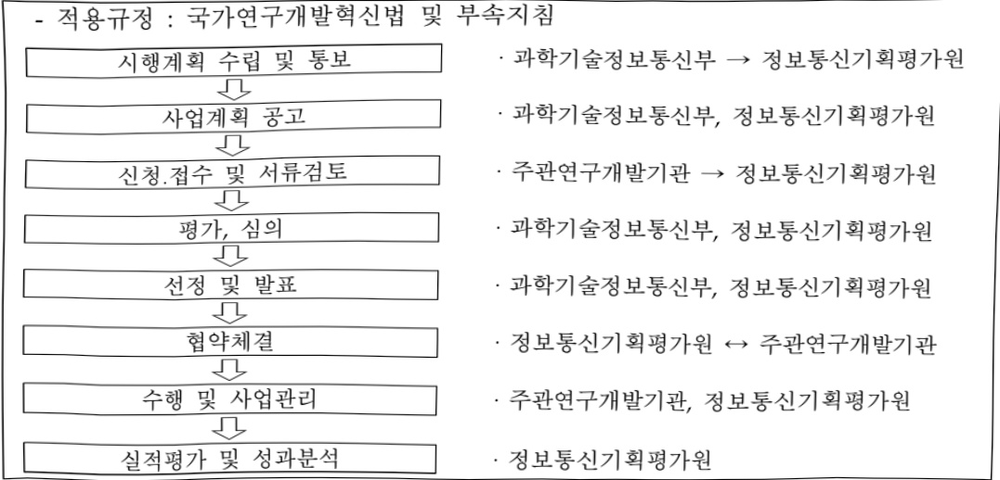

# 디지털선도기술 핵심인재양성(R&D)

**해당 페이지**: PDF 980 ~ 987 쪽 해당

**부처**: 과학기술정보통신부
**분야**: 통신
**회계유형**: 고등·평생교육 지원 특별회계
**2026 확정예산**: 59529.0 백만원
**전년대비 증감률**: 21.0%
**AI 도메인**: 교육/인재, 통신/네트워크

---

<table border=1 style='margin: auto; word-wrap: break-word;'><tr><td style='text-align: center; word-wrap: break-word;'>사 업 명</td></tr><tr><td style='text-align: center; word-wrap: break-word;'>(2) 디지털선도기술핵심인재양성(R&amp;D) (2133-301)</td></tr></table>

☐ 사업 코드 정보

<table border=1 style='margin: auto; word-wrap: break-word;'><tr><td style='text-align: center; word-wrap: break-word;'>구분</td><td style='text-align: center; word-wrap: break-word;'>회계</td><td style='text-align: center; word-wrap: break-word;'>소관</td><td style='text-align: center; word-wrap: break-word;'>실국(기관)</td><td style='text-align: center; word-wrap: break-word;'>계정</td><td style='text-align: center; word-wrap: break-word;'>분야</td><td style='text-align: center; word-wrap: break-word;'>부문</td></tr><tr><td style='text-align: center; word-wrap: break-word;'>코드</td><td rowspan="2">고등·평생교육지원 특별회계</td><td rowspan="2">과학기술정보통신부</td><td rowspan="2">정보통신산업정책관</td><td rowspan="2">-</td><td style='text-align: center; word-wrap: break-word;'>130</td><td style='text-align: center; word-wrap: break-word;'>133</td></tr><tr><td style='text-align: center; word-wrap: break-word;'>명칭</td><td style='text-align: center; word-wrap: break-word;'>통신</td><td style='text-align: center; word-wrap: break-word;'>정보통신</td></tr></table>

<table border=1 style='margin: auto; word-wrap: break-word;'><tr><td style='text-align: center; word-wrap: break-word;'>구분</td><td style='text-align: center; word-wrap: break-word;'>프로그램</td><td style='text-align: center; word-wrap: break-word;'>단위사업</td><td style='text-align: center; word-wrap: break-word;'>세부사업</td></tr><tr><td style='text-align: center; word-wrap: break-word;'>코드</td><td style='text-align: center; word-wrap: break-word;'>2100</td><td style='text-align: center; word-wrap: break-word;'>2133</td><td style='text-align: center; word-wrap: break-word;'>301</td></tr><tr><td style='text-align: center; word-wrap: break-word;'>명칭</td><td style='text-align: center; word-wrap: break-word;'>정보통신용합산업</td><td style='text-align: center; word-wrap: break-word;'>ICT사업화지원(고특)</td><td style='text-align: center; word-wrap: break-word;'>디지털선도기술핵심인재양성</td></tr></table>

☐ 사업 성격 (공통요구자료 II-1 작성유의사항 4. 참조, 해당하는 사항에 “○” 표시)

<table border=1 style='margin: auto; word-wrap: break-word;'><tr><td rowspan="2">신규</td><td rowspan="2">계속</td><td rowspan="2">완료</td><td rowspan="2">예비타당성 실시여부</td><td rowspan="2">총사업비 관리대상</td><td rowspan="2">총액계상 예산사업</td><td style='text-align: center; word-wrap: break-word;'>사업소관 변경정보</td></tr><tr><td style='text-align: center; word-wrap: break-word;'>2025예산 시 소관</td></tr><tr><td style='text-align: center; word-wrap: break-word;'></td><td style='text-align: center; word-wrap: break-word;'>O</td><td style='text-align: center; word-wrap: break-word;'></td><td style='text-align: center; word-wrap: break-word;'></td><td style='text-align: center; word-wrap: break-word;'></td><td style='text-align: center; word-wrap: break-word;'></td><td style='text-align: center; word-wrap: break-word;'></td></tr></table>

사업 지원 형태 및 지원을 (최소한 한 개는 반드시 선택하시오. 해당사항에 O 표시)

<table border=1 style='margin: auto; word-wrap: break-word;'><tr><td style='text-align: center; word-wrap: break-word;'>직접</td><td style='text-align: center; word-wrap: break-word;'>출자</td><td style='text-align: center; word-wrap: break-word;'>출연</td><td style='text-align: center; word-wrap: break-word;'>보조</td><td style='text-align: center; word-wrap: break-word;'>융자</td><td style='text-align: center; word-wrap: break-word;'>국고보조율(%)</td><td style='text-align: center; word-wrap: break-word;'>융자율(%)</td></tr><tr><td style='text-align: center; word-wrap: break-word;'></td><td style='text-align: center; word-wrap: break-word;'></td><td style='text-align: center; word-wrap: break-word;'>0</td><td style='text-align: center; word-wrap: break-word;'></td><td style='text-align: center; word-wrap: break-word;'></td><td style='text-align: center; word-wrap: break-word;'></td><td style='text-align: center; word-wrap: break-word;'></td></tr></table>

□ 사업 소관부처 및 시행주체

<table border=1 style='margin: auto; word-wrap: break-word;'><tr><td style='text-align: center; word-wrap: break-word;'>사업명</td><td colspan="2">구분</td></tr><tr><td rowspan="3">교육훈련</td><td rowspan="2">소관부처</td><td style='text-align: center; word-wrap: break-word;'>정보통신정책실정보통신산업정책관정보통신산업기반과</td></tr><tr><td style='text-align: center; word-wrap: break-word;'>정보통신정책실소프트웨어정책관소프트웨어정책과</td></tr><tr><td style='text-align: center; word-wrap: break-word;'>사업시행주체</td><td style='text-align: center; word-wrap: break-word;'>정보통신기획평가원</td></tr></table>

---

### 가.예산 총괄표

(단위: 백만원, %)

<table border=1 style='margin: auto; word-wrap: break-word;'><tr><td rowspan="2">사업명</td><td rowspan="2">2024년 결산</td><td colspan="2">2025년 예산</td><td colspan="2">2026년 예산</td><td rowspan="2">중감(B-A)</td><td rowspan="2">(B-A)/A</td></tr><tr><td style='text-align: center; word-wrap: break-word;'>본예산</td><td style='text-align: center; word-wrap: break-word;'>추경*(A)</td><td style='text-align: center; word-wrap: break-word;'>요구안</td><td style='text-align: center; word-wrap: break-word;'>본예산(B)</td></tr><tr><td style='text-align: center; word-wrap: break-word;'>디지털선도기술 핵심인재양성</td><td style='text-align: center; word-wrap: break-word;'>47,890</td><td style='text-align: center; word-wrap: break-word;'>49,206</td><td style='text-align: center; word-wrap: break-word;'>49,206</td><td style='text-align: center; word-wrap: break-word;'>58,206</td><td style='text-align: center; word-wrap: break-word;'>59,529</td><td style='text-align: center; word-wrap: break-word;'>10,323</td><td style='text-align: center; word-wrap: break-word;'>20.98</td></tr></table>

*추경: 추경증감액을 포함한 최종 예산액을 기재

## □ 기능별(내역사업별) 예산 내역

(단위:백만원)

<table border=1 style='margin: auto; word-wrap: break-word;'><tr><td rowspan="2"></td><td colspan="5">2024</td><td colspan="5">2025</td><td rowspan="2">2026예산</td></tr><tr><td style='text-align: center; word-wrap: break-word;'>예산액(추경)</td><td style='text-align: center; word-wrap: break-word;'>예산현액</td><td style='text-align: center; word-wrap: break-word;'>집행액</td><td style='text-align: center; word-wrap: break-word;'>이월액</td><td style='text-align: center; word-wrap: break-word;'>불용액</td><td style='text-align: center; word-wrap: break-word;'>예산액(추경)</td><td style='text-align: center; word-wrap: break-word;'>예산현액</td><td style='text-align: center; word-wrap: break-word;'>집행액</td><td style='text-align: center; word-wrap: break-word;'>이월액</td><td style='text-align: center; word-wrap: break-word;'>불용액</td></tr><tr><td style='text-align: center; word-wrap: break-word;'>○ 디지털선도기술핵심인재양성</td><td style='text-align: center; word-wrap: break-word;'>-</td><td style='text-align: center; word-wrap: break-word;'>47,890</td><td style='text-align: center; word-wrap: break-word;'>47,890</td><td style='text-align: center; word-wrap: break-word;'>-</td><td style='text-align: center; word-wrap: break-word;'>-</td><td style='text-align: center; word-wrap: break-word;'>49,206</td><td style='text-align: center; word-wrap: break-word;'>49,206</td><td style='text-align: center; word-wrap: break-word;'>49,206</td><td style='text-align: center; word-wrap: break-word;'>-</td><td style='text-align: center; word-wrap: break-word;'>-</td><td style='text-align: center; word-wrap: break-word;'>59,529</td></tr><tr><td style='text-align: center; word-wrap: break-word;'>· 교육훈련</td><td style='text-align: center; word-wrap: break-word;'>-</td><td style='text-align: center; word-wrap: break-word;'>45,090</td><td style='text-align: center; word-wrap: break-word;'>45,090</td><td style='text-align: center; word-wrap: break-word;'>-</td><td style='text-align: center; word-wrap: break-word;'>-</td><td style='text-align: center; word-wrap: break-word;'>49,206</td><td style='text-align: center; word-wrap: break-word;'>49,206</td><td style='text-align: center; word-wrap: break-word;'>49,206</td><td style='text-align: center; word-wrap: break-word;'>-</td><td style='text-align: center; word-wrap: break-word;'>-</td><td style='text-align: center; word-wrap: break-word;'>59,529</td></tr><tr><td style='text-align: center; word-wrap: break-word;'>- ICT명품인재양성</td><td style='text-align: center; word-wrap: break-word;'>-</td><td style='text-align: center; word-wrap: break-word;'>6,000</td><td style='text-align: center; word-wrap: break-word;'>6,000</td><td style='text-align: center; word-wrap: break-word;'>-</td><td style='text-align: center; word-wrap: break-word;'>-</td><td style='text-align: center; word-wrap: break-word;'>6,316</td><td style='text-align: center; word-wrap: break-word;'>6,316</td><td style='text-align: center; word-wrap: break-word;'>6,316</td><td style='text-align: center; word-wrap: break-word;'>-</td><td style='text-align: center; word-wrap: break-word;'>-</td><td style='text-align: center; word-wrap: break-word;'>6,316</td></tr><tr><td style='text-align: center; word-wrap: break-word;'>- 지역지능화혁신인재양성</td><td style='text-align: center; word-wrap: break-word;'>-</td><td style='text-align: center; word-wrap: break-word;'>27,590</td><td style='text-align: center; word-wrap: break-word;'>27,590</td><td style='text-align: center; word-wrap: break-word;'>-</td><td style='text-align: center; word-wrap: break-word;'>-</td><td style='text-align: center; word-wrap: break-word;'>29,890</td><td style='text-align: center; word-wrap: break-word;'>29,890</td><td style='text-align: center; word-wrap: break-word;'>29,890</td><td style='text-align: center; word-wrap: break-word;'>-</td><td style='text-align: center; word-wrap: break-word;'>-</td><td style='text-align: center; word-wrap: break-word;'>31,890</td></tr><tr><td style='text-align: center; word-wrap: break-word;'>- 학·석사연계ICT핵심인재양성</td><td style='text-align: center; word-wrap: break-word;'>-</td><td style='text-align: center; word-wrap: break-word;'>11,500</td><td style='text-align: center; word-wrap: break-word;'>11,500</td><td style='text-align: center; word-wrap: break-word;'>-</td><td style='text-align: center; word-wrap: break-word;'>-</td><td style='text-align: center; word-wrap: break-word;'>10,000</td><td style='text-align: center; word-wrap: break-word;'>10,000</td><td style='text-align: center; word-wrap: break-word;'>10,000</td><td style='text-align: center; word-wrap: break-word;'>-</td><td style='text-align: center; word-wrap: break-word;'>-</td><td style='text-align: center; word-wrap: break-word;'>11,323</td></tr><tr><td style='text-align: center; word-wrap: break-word;'>- ICT글로벌전문융합인재양성</td><td style='text-align: center; word-wrap: break-word;'>-</td><td style='text-align: center; word-wrap: break-word;'>-</td><td style='text-align: center; word-wrap: break-word;'>-</td><td style='text-align: center; word-wrap: break-word;'>-</td><td style='text-align: center; word-wrap: break-word;'>-</td><td style='text-align: center; word-wrap: break-word;'>1,000</td><td style='text-align: center; word-wrap: break-word;'>1,000</td><td style='text-align: center; word-wrap: break-word;'>1,000</td><td style='text-align: center; word-wrap: break-word;'>-</td><td style='text-align: center; word-wrap: break-word;'>-</td><td style='text-align: center; word-wrap: break-word;'>2,000</td></tr><tr><td style='text-align: center; word-wrap: break-word;'>- 산학연계AI반도체선도기술인재양성</td><td style='text-align: center; word-wrap: break-word;'>-</td><td style='text-align: center; word-wrap: break-word;'>-</td><td style='text-align: center; word-wrap: break-word;'>-</td><td style='text-align: center; word-wrap: break-word;'>-</td><td style='text-align: center; word-wrap: break-word;'>-</td><td style='text-align: center; word-wrap: break-word;'>2,000</td><td style='text-align: center; word-wrap: break-word;'>2,000</td><td style='text-align: center; word-wrap: break-word;'>2,000</td><td style='text-align: center; word-wrap: break-word;'>-</td><td style='text-align: center; word-wrap: break-word;'>-</td><td style='text-align: center; word-wrap: break-word;'>6,000</td></tr><tr><td style='text-align: center; word-wrap: break-word;'>- AI·디지털기반창업인재양성</td><td style='text-align: center; word-wrap: break-word;'>-</td><td style='text-align: center; word-wrap: break-word;'>-</td><td style='text-align: center; word-wrap: break-word;'>-</td><td style='text-align: center; word-wrap: break-word;'>-</td><td style='text-align: center; word-wrap: break-word;'>-</td><td style='text-align: center; word-wrap: break-word;'>-</td><td style='text-align: center; word-wrap: break-word;'>-</td><td style='text-align: center; word-wrap: break-word;'>-</td><td style='text-align: center; word-wrap: break-word;'>-</td><td style='text-align: center; word-wrap: break-word;'>-</td><td style='text-align: center; word-wrap: break-word;'>2,000</td></tr><tr><td style='text-align: center; word-wrap: break-word;'>· 해외연계지원(종료)</td><td style='text-align: center; word-wrap: break-word;'>-</td><td style='text-align: center; word-wrap: break-word;'>2,800</td><td style='text-align: center; word-wrap: break-word;'>2,800</td><td style='text-align: center; word-wrap: break-word;'>-</td><td style='text-align: center; word-wrap: break-word;'>-</td><td style='text-align: center; word-wrap: break-word;'>-</td><td style='text-align: center; word-wrap: break-word;'>-</td><td style='text-align: center; word-wrap: break-word;'>-</td><td style='text-align: center; word-wrap: break-word;'>-</td><td style='text-align: center; word-wrap: break-word;'>-</td><td style='text-align: center; word-wrap: break-word;'>-</td></tr><tr><td style='text-align: center; word-wrap: break-word;'>- ICT글로벌인재양성</td><td style='text-align: center; word-wrap: break-word;'>-</td><td style='text-align: center; word-wrap: break-word;'>2,800</td><td style='text-align: center; word-wrap: break-word;'>2,800</td><td style='text-align: center; word-wrap: break-word;'>-</td><td style='text-align: center; word-wrap: break-word;'>-</td><td style='text-align: center; word-wrap: break-word;'>-</td><td style='text-align: center; word-wrap: break-word;'>-</td><td style='text-align: center; word-wrap: break-word;'>-</td><td style='text-align: center; word-wrap: break-word;'>-</td><td style='text-align: center; word-wrap: break-word;'>-</td><td style='text-align: center; word-wrap: break-word;'>-</td></tr><tr><td style='text-align: center; word-wrap: break-word;'>○ 비목별 분류(합계)</td><td style='text-align: center; word-wrap: break-word;'>-</td><td style='text-align: center; word-wrap: break-word;'>47,890</td><td style='text-align: center; word-wrap: break-word;'>47,890</td><td style='text-align: center; word-wrap: break-word;'>-</td><td style='text-align: center; word-wrap: break-word;'>-</td><td style='text-align: center; word-wrap: break-word;'>49,206</td><td style='text-align: center; word-wrap: break-word;'>49,206</td><td style='text-align: center; word-wrap: break-word;'>49,206</td><td style='text-align: center; word-wrap: break-word;'>-</td><td style='text-align: center; word-wrap: break-word;'>-</td><td style='text-align: center; word-wrap: break-word;'>59,529</td></tr><tr><td style='text-align: center; word-wrap: break-word;'>· 연구개발활동비 등(360-05)</td><td style='text-align: center; word-wrap: break-word;'>-</td><td style='text-align: center; word-wrap: break-word;'>47,890</td><td style='text-align: center; word-wrap: break-word;'>47,890</td><td style='text-align: center; word-wrap: break-word;'>-</td><td style='text-align: center; word-wrap: break-word;'>-</td><td style='text-align: center; word-wrap: break-word;'>49,206</td><td style='text-align: center; word-wrap: break-word;'>49,206</td><td style='text-align: center; word-wrap: break-word;'>49,206</td><td style='text-align: center; word-wrap: break-word;'>-</td><td style='text-align: center; word-wrap: break-word;'>-</td><td style='text-align: center; word-wrap: break-word;'>59,529</td></tr></table>

### 나.사업설명자료

## 1 ) 사업목적·내용

- (디지털선도기술핵심인재양성) 대학, 기업, 지역 등 ICT융합 학·석·박사 교육연계를 통해

석·박사급 인재 양성 지원 및 글로벌 네트워크 기반 조성

(교육훈련) AI 대전환 시대를 견인하기 위해 대학, 기업, 지역 등이 연계하여 융합인재, 지역인재, 글로벌인재 등 ICT 유망·핵심기술 분야의 석·박사 인재 양성

---

## 2 ) 사업개요

## □ 사업근거 및 추진경위

① 법령상 근거 조항 적시

## 0 정보통신진흥 및 융합활성화 등에 관한 특별법 제11조(국내 전문인력 양성)

## - 정보통신진흥 및 융합활성화 등에 관한 특별법

제11조(국내 전문인력의 양성) ① 과학기술정보통신부장관은 정보통신 분야의 전문적인 기술, 지식 등을 가진 인력(이하 "전문인력"이라 한다)의 육성에 관한 시책을 수립 · 추진하여야 하며, 특히 소프트웨어 교육의 저변 확대 및 지역산업의 발전을 위한 소프트웨어 특화교육 활성화를 위하여 노력하여야 한다.

② 제1항에 따른 시책에는 다음 각 호의 사항이 포함되어야 한다.

1. 전문인력의 육성 및 교육훈련에 관한 사항

2. 전문인력의 수급 및 활용에 관한 사항

3. 전문인력의 경력관리 지원 등에 관한 사항

4. 그 밖에 전문인력의 육성 및 관리 등을 위한 사항

## 고등·평생교육지원특별회계법 제5조(세출)

## - 고등·평생교육지원특별회계법

## 제5조(세출) 특별회계는 다음 각 호의 지출을 세출로 한다

1. 대학의 교육·연구 역량 강화를 위한 사업 수행에 필요한 경비

2. 신기술 분야 등 국가 인재양성 사업 수행에 필요한 경비

3. 직업교육 등 대학의 평생교육 역량 강화를 위한 사업 수행에 필요한 경비

4. 국가 균형발전을 위한 지역 인재양성 사업 수행에 필요한 경비

5. 제7조에 따른 차입금에 대한 원리금 상환

6. 그 밖에 특별회계의 운용에 필요한 경비

## ② 추진경위

- '14. 2월 : 정보통신기술인력양성사업 시행계획(미래창조과학부)

- '15. 3월 : K-ICT 전략발표(미래창조과학부)

- '17. 11월 : 혁신성장을 위한 사람중심의 '4차 산업혁명 대응계획(관계부처 합동)

- '19. 8월 : 혁신성장 확산·가속화 전략(과학기술정보통신부)

- '20. 1월 : 정보통신기술인력양성사업, 인공지능핵심인재양성 등 ICT 석 · 박사 인재

양성사업 통합, 정보통신방송혁신인재사업 시행

---

- '20. 7월 : 한국판 뉴딜 2.0.(관계부처 합동)

- '21. 4월 : BIG3+인공지능 인재양성 방안(관계부처 합동)

- '21. 6월 : 민·관 협력 기반의 소프트웨어 인재양성 대책(관계부처 합동)

- '22. 8월 : 디지털 인재양성 종합방안(관계부처 합동)

- '22. 9월 : 대한민국 디지털 전략(관계부처 합동)

- '24. 1월 : 정보통신방송혁신인재양성(방송통신발전기금) 4개 내내역사업 이관

※ 대상 : ICT명품인재양성, 학·석사연계ICT핵심인재양성, 지역지능화혁신인재양성, ICT글로벌인재양성

- '24. 4월 : AI-반도체 이니셔티브(관계부처 합동)

- '24. 9월 : 과학기술 인재 성장·발전 전략(관계부처 합동)

- '24. 9월 : 국가 AI전략 정책방향(관계부처 합동)

- '25. 2월 : 국가 AI역량 강화 방안(관계부처 합동)

- '25. 9월 : 이재명 정부 123대 국정과제(국정22. 초격차 AI 선도기술 · 인재확보)

- '25. 12월 : AI반도체 산업 도약 전략(관계부처 합동)

## □주요내용

① 사업규모

- 총사업비(해당되는 경우에만 기재) : 해당 없음

- 사업기간 : '24년~ 계속

-최근 5년 간 투입된 사업비(예산액기준, 추경편성한 연도에는 추경포함)

<table border=1 style='margin: auto; word-wrap: break-word;'><tr><td style='text-align: center; word-wrap: break-word;'>연도</td><td style='text-align: center; word-wrap: break-word;'>2022</td><td style='text-align: center; word-wrap: break-word;'>2023</td><td style='text-align: center; word-wrap: break-word;'>2024</td><td style='text-align: center; word-wrap: break-word;'>2025</td><td style='text-align: center; word-wrap: break-word;'>2026</td></tr><tr><td style='text-align: center; word-wrap: break-word;'>사업비</td><td style='text-align: center; word-wrap: break-word;'>-</td><td style='text-align: center; word-wrap: break-word;'>-</td><td style='text-align: center; word-wrap: break-word;'>47,890</td><td style='text-align: center; word-wrap: break-word;'>49,206</td><td style='text-align: center; word-wrap: break-word;'>59,529</td></tr></table>

## ② 사업추진체계

- 사업시행방법 : 출연

- 사업시행주체 : (전문기관) 정보통신기획평가원, (주관연구개발기관) 대학(원) 등

- 사업수혜자 : ICT분야 대학, 대학(원)생 등

- 보조, 융자, 출연, 출자 등의 경우 보조·융자 등 지원 비율 및 법적근거

- 보조, 융자, 출연, 출자 등의 경우 보조·융자 등 지원 비율 및 법적근거

<table border=1 style='margin: auto; word-wrap: break-word;'><tr><td style='text-align: center; word-wrap: break-word;'>내역사업명</td><td style='text-align: center; word-wrap: break-word;'>구분</td><td style='text-align: center; word-wrap: break-word;'>피보조·피출연 등 기관명</td><td style='text-align: center; word-wrap: break-word;'>지원 금액 (2026예산)</td><td style='text-align: center; word-wrap: break-word;'>지원 비율(%)</td><td style='text-align: center; word-wrap: break-word;'>보조율 법적근거 (해당 조항)</td></tr><tr><td style='text-align: center; word-wrap: break-word;'>교육훈련</td><td style='text-align: center; word-wrap: break-word;'>출연</td><td style='text-align: center; word-wrap: break-word;'>정보통신 기획평가원 (한국연구재단 부설)</td><td style='text-align: center; word-wrap: break-word;'>59,529</td><td style='text-align: center; word-wrap: break-word;'>100%</td><td style='text-align: center; word-wrap: break-word;'>- 정보통신산업진흥법 제22조 (관련 기관에 대한 지원 등) - 정보통신융합법 제32조 (정보통신 융합 등 기술·서비스 개발 등의 지원)</td></tr></table>

---

## 3 ) 2026년도 예산 산출 근거

## ☐ 요구내용 : 59,529백만원

° 교육훈련 : 대학, 기업, 지역 등이 연계하여 융합인재, 지역인재, 글로벌인재 등 ICT 유망·핵심기술 분야의 석·박사 핵심 인재를 양성하기 위한 예산 요구 (25년) 49,206백만원 → (26년) 59,529백만원, 10,323백만원 중액 (+20.98%)

## ① ICT멍풀인재양성

- (요구) ICT기술 기반으로 타 분야와의 융합연구를 통해 사회문제해결 및 신기술을

선도할 수 있는 혁신리더형 연구인재 양성 지원을 위한 6,316백만원 요구

- (요구) 대학의 ICT 역량을 활용하여 지역산업을 고도화·다각화하기 위한 산·학

공동연구와 지역산업 재직자의 ICT 역량 지원을 위한 31,890백만원 요구

## ③ 학·석사연계ICT핵심인재양성

- (요구) 기업·대학이 긍농 개발한 학·석·박사생 연구·교육과정을 통해 실전문제

해결 역량을 갖춘 융합인재 양성 지원을 위한 11,323 백만원 요구

## ④ ICT글로벌전문융합인재양성

- (요구) 해외 디지털 정책 입안자 등 대상의 국내 AI·디지털 대학원 학위·비학위

과정 운영을 통해 글로벌 협력 기반 조성을 위한 2,000백만원 요구

## ⑤ 산학연계 AI반도체선도기술인재양성

- (요구) AI반도체 기업과 대학이 연계하여 산업 현장에 활용될 수 있는 석·박사급 실전형 연구 인재 양성을 위한 6,000 백만원 요구

## ⑥ AI·디지털기반창업인재양성(신규)

- (요구) AI·디지털 기술 기반 대학원생 창업 활성화 및 창업 생태계 조성을 통해

산업 성장 촉진을 지원하기 위한 2,000백만원 요구

---

## 4 ) 사업효과

□ 사업영향, 산출물 성과지표 등

① 2022~2026년도 성과계획서 상 성과지표 및 최근 5년간 성과 달성도

<table border=1 style='margin: auto; word-wrap: break-word;'><tr><td style='text-align: center; word-wrap: break-word;'>성과지표</td><td style='text-align: center; word-wrap: break-word;'>구분</td><td style='text-align: center; word-wrap: break-word;'>2022</td><td style='text-align: center; word-wrap: break-word;'>2023</td><td style='text-align: center; word-wrap: break-word;'>2024</td><td style='text-align: center; word-wrap: break-word;'>2025</td><td style='text-align: center; word-wrap: break-word;'>2026</td><td style='text-align: center; word-wrap: break-word;'>2026 목표치산출근거</td><td style='text-align: center; word-wrap: break-word;'>측정산식(또는 측정방법)</td><td style='text-align: center; word-wrap: break-word;'>자료수집방법(또는 자료출처)</td></tr><tr><td style='text-align: center; word-wrap: break-word;'>석·박사수혜인력(단위: 명)</td><td style='text-align: center; word-wrap: break-word;'>목표실적달성도</td><td style='text-align: center; word-wrap: break-word;'>-</td><td style='text-align: center; word-wrap: break-word;'>-</td><td style='text-align: center; word-wrap: break-word;'>952</td><td style='text-align: center; word-wrap: break-word;'>885</td><td style='text-align: center; word-wrap: break-word;'>1,039</td><td style='text-align: center; word-wrap: break-word;'>사업별 수혜인력 목표치의 합</td><td style='text-align: center; word-wrap: break-word;'>당해연도예산 대비성과목표치</td><td style='text-align: center; word-wrap: break-word;'>사업수행 보고서 및 증빙자료(연구개발기관 연차보고서 및 수혜 증빙자료)</td></tr></table>

* '25년 실적은 성과 검증 등의 절차를 거쳐 '26년 하반기 확정

② 성과지표 이외의 연도별 사업추진 경과 및 실적('25년은 잠정)

<table border=1 style='margin: auto; word-wrap: break-word;'><tr><td style='text-align: center; word-wrap: break-word;'>2024</td><td style='text-align: center; word-wrap: break-word;'>○ ICT명품인재양성 - 성균관대 등 ICT명품인재양성 2개 과제 지원 - 대학연구소 설립 및 최고 수준의 연구 환경을 구축하여 ICT융합 연구 SCI논문 1,212건, 특허 출원·등록 1,017의 연구성과 도출(&#x27;10~&#x27;24년) ○ 지역지능화혁신인재양성 - 금오공대 등 13개 과제 지원(&#x27;24년 4개 신규 지원) - 대학의 ICT·지능화 기술역량을 활용, 지역기업의 지능화 혁신을 지원하는 연구 수행 등을 통해 석·박사 1,654명 배출, 특허등록 473건, 기술이전 수입 11,516백만원, SCI급 논문 1,176건 등 성과 도출(&#x27;15~&#x27;24년) ○ 학·석사연계ICT핵심인재양성 - 가톨릭대 등 22개 대학 44개 과제 지원(&#x27;24년 18개 신규 지원) - PBL 연구교육과정 총 212개 과목 개발·편성 및 대학과 기업 멘토로 구성된 전문 교수요원 1,544명이 참여하여 석·박사 인재 443명 배출(&#x27;20~&#x27;24년) ○ ICT글로벌인재양성 - 서울대 등 4개 과제 지원(&#x27;24년 2개 신규 지원) - 신흥국 등 ICT관련 외국인 공무원 등에 대한 석·박사 학위과정 운영을 통해 총 47개국, 295명 지원, 석·박사 63명 배출, 재학생 및 수료생 본국 기술 수요 발굴 및 국내기업 기술수출 시 사업계약 체결 등에 직·간접 역할 수행(&#x27;19~&#x27;24)</td></tr><tr><td style='text-align: center; word-wrap: break-word;'>2025</td><td style='text-align: center; word-wrap: break-word;'>○ ICT명품인재양성 - 성균관대 등 ICT명품인재양성 2개 과제 지원 - 대학연구소 설립 및 최고 수준의 연구 환경을 구축하여 ICT융합 연구 SCI논문 59건, 특허 출원 30건·등록 15건의 연구성과 도출 ○ 지역지능화혁신인재양성 - 금오공대 등 16개 과제 지원(&#x27;25년 3개 신규 지원) - 대학의 ICT 역량을 활용하여 지역 산업의 혁신성장을 견인하기 위해 지역의 중소·중견기업 재직자 학위과정 총 332명 선발</td></tr></table>

---

<table border=1 style='margin: auto; word-wrap: break-word;'><tr><td style='text-align: center; word-wrap: break-word;'></td><td style='text-align: center; word-wrap: break-word;'>○ 학·석사연계ICT핵심인재양성- 가톨릭대 등 22개 대학 44개 과제 지원- PBL 연구교육과정 총 109개 과목 개발·편성 및 대학과 기업 멘토로 구성된 전문 교수요원 431명이 참여하여 804명의 인재양성○ ICT글로벌전문융합인재양성- 서울대 등 2개 과제 지원(&#x27;25년 2개 신규 지원)- 우방국 디지털정책 입안자 등 대상 학위·비학위 과정 운영을 통해 유효성있는 글로벌 네트워크 구축(&#x27;25년 학위 20명, 비학위 10명 지원)○ 산학연계 AI반도체선도기술인재양성- 성균관대 등 AI반도체혁신연구소 2개 과제 지원(&#x27;25년 2개 신규 지원)- AI반도체 실전형 연구인재 양성을 위한 석·박사급 재학생 55명 참여·지원</td></tr></table>

## ③향후(2026년도 이후)기대효과

ICT명품인재양성, 지역지능화혁신인재양성, 학·석사연계ICT핵심인재양성 등 사업을 통해 연간 1,000여명 규모('26년, 양성인원 목표)의 ICT 석·박사 인재 양성

0 전 산업으로 AI·디지털 혁신과 지역발전을 이끌어갈 연구인재 및 지역인재 양성을 통해 AI선도기술·인재 확보라는 국정과제 달성에 기여

- AI·디지털 기술 기반으로 지역산업 경쟁력을 제고하고 양성된 지역인재가 지역

산업으로 배출되어 지역 성장의 선순환을 유도

- AI·AI반도체 분야 등 학부생의 대학원 진학이 활성화되고 기업의 문제를 함께 해결하는 교육과정을 통해 소통·탐구 경험이 축적되어 현장 적응력 제고

- 해외 디지털 정책 입안자 등을 활용한 글로벌 협력네트워크 구축 및 글로벌 비즈니스·프로젝트 창출을 확충

- 전국 광역 단위에서 대학원 내 창업이 활성화되고 성공사례가 도출되어 산업

성장 기반 활성화 및 지역 취업률 제고

5) 타당성조사 및 예비타당성조사 시행여부 및 결과 요지 : 해당 없음

6) 총사업비 대상사업 여부 및 내역 : 해당 없음

---

## 7 ) 사업 집행절차

-적용규정:국가연구개발혁신법 및 부속지침

8) 각종 평가 : 해당없음

### 다.최근 4년간 결산내역

## 1 ) 결산표

☐ 부처 결산내역

(단위: 백만원, %)

<table border=1 style='margin: auto; word-wrap: break-word;'><tr><td rowspan="2">연도</td><td colspan="3">예산액</td><td rowspan="2">예산현액(A)</td><td rowspan="2">집행액(B)</td><td rowspan="2">집행률(B/A)</td><td rowspan="2">다음연도이월액</td><td rowspan="2">불용액</td></tr><tr><td style='text-align: center; word-wrap: break-word;'>본예산</td><td style='text-align: center; word-wrap: break-word;'>추경증감액</td><td style='text-align: center; word-wrap: break-word;'>추경</td></tr><tr><td style='text-align: center; word-wrap: break-word;'>2022</td><td style='text-align: center; word-wrap: break-word;'>-</td><td style='text-align: center; word-wrap: break-word;'>-</td><td style='text-align: center; word-wrap: break-word;'>-</td><td style='text-align: center; word-wrap: break-word;'>-</td><td style='text-align: center; word-wrap: break-word;'>-</td><td style='text-align: center; word-wrap: break-word;'>-</td><td style='text-align: center; word-wrap: break-word;'>-</td><td style='text-align: center; word-wrap: break-word;'>-</td></tr><tr><td style='text-align: center; word-wrap: break-word;'>2023</td><td style='text-align: center; word-wrap: break-word;'>-</td><td style='text-align: center; word-wrap: break-word;'>-</td><td style='text-align: center; word-wrap: break-word;'>-</td><td style='text-align: center; word-wrap: break-word;'>-</td><td style='text-align: center; word-wrap: break-word;'>-</td><td style='text-align: center; word-wrap: break-word;'>-</td><td style='text-align: center; word-wrap: break-word;'>-</td><td style='text-align: center; word-wrap: break-word;'>-</td></tr><tr><td style='text-align: center; word-wrap: break-word;'>2024</td><td style='text-align: center; word-wrap: break-word;'>47,890</td><td style='text-align: center; word-wrap: break-word;'>-</td><td style='text-align: center; word-wrap: break-word;'>47,890</td><td style='text-align: center; word-wrap: break-word;'>47,890</td><td style='text-align: center; word-wrap: break-word;'>47,890</td><td style='text-align: center; word-wrap: break-word;'>100.0</td><td style='text-align: center; word-wrap: break-word;'>-</td><td style='text-align: center; word-wrap: break-word;'>-</td></tr><tr><td style='text-align: center; word-wrap: break-word;'>2025</td><td style='text-align: center; word-wrap: break-word;'>49,206</td><td style='text-align: center; word-wrap: break-word;'>-</td><td style='text-align: center; word-wrap: break-word;'>49,206</td><td style='text-align: center; word-wrap: break-word;'>49,206</td><td style='text-align: center; word-wrap: break-word;'>49,206</td><td style='text-align: center; word-wrap: break-word;'>100.0</td><td style='text-align: center; word-wrap: break-word;'>-</td><td style='text-align: center; word-wrap: break-word;'>-</td></tr></table>

## 2 ) 주요 결산사항

□ 2022~2025년 결산 주요사항 : 해당없음

□2025년 이·전용 등 세부내역 : 해당없음

---

### 원본 PDF 크롭 이미지

