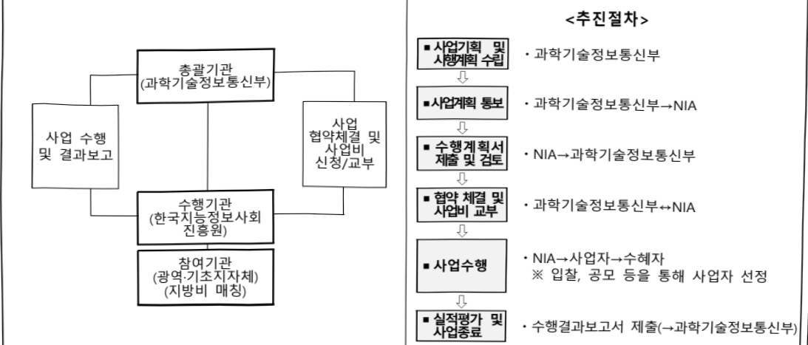
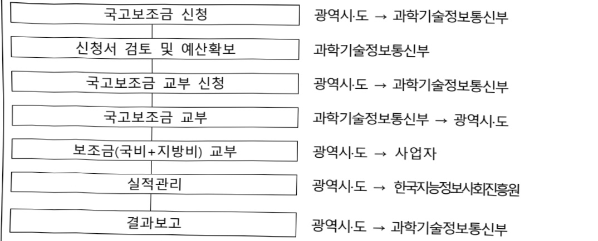
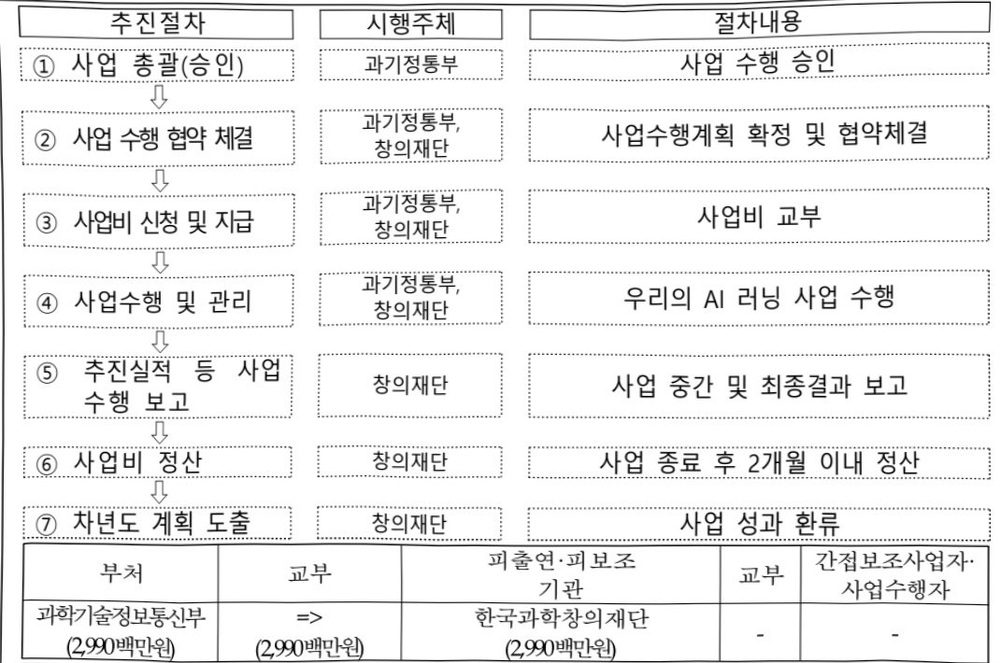

# 디지털역량강화교육

**해당 페이지**: PDF 988 ~ 995 쪽 해당

**부처**: 과학기술정보통신부
**분야**: 일반·지방행정
**회계유형**: 지역균형발전 특별회계
**2026 확정예산**: 14102.0 백만원
**전년대비 증감률**: -56.0%
**AI 도메인**: 교육/인재, 디지털전환(AX)

---

<table border=1 style='margin: auto; word-wrap: break-word;'><tr><td style='text-align: center; word-wrap: break-word;'>사 업 명</td></tr><tr><td style='text-align: center; word-wrap: break-word;'>(1) 디지털역량강화교육(1945-301)</td></tr></table>

사업 코드 정보

<table border=1 style='margin: auto; word-wrap: break-word;'><tr><td style='text-align: center; word-wrap: break-word;'>구분</td><td style='text-align: center; word-wrap: break-word;'>회계</td><td style='text-align: center; word-wrap: break-word;'>소관</td><td style='text-align: center; word-wrap: break-word;'>실국(기관)</td><td style='text-align: center; word-wrap: break-word;'>계정</td><td style='text-align: center; word-wrap: break-word;'>분야</td><td style='text-align: center; word-wrap: break-word;'>부문</td></tr><tr><td style='text-align: center; word-wrap: break-word;'>코드명칭</td><td style='text-align: center; word-wrap: break-word;'>지역군형발전특별회계</td><td style='text-align: center; word-wrap: break-word;'>과학기술정보통신부</td><td style='text-align: center; word-wrap: break-word;'>정보통신정책관정보통신정책관</td><td style='text-align: center; word-wrap: break-word;'>지역지원계정</td><td style='text-align: center; word-wrap: break-word;'>010일반·지방행정</td><td style='text-align: center; word-wrap: break-word;'>015정부자원관리</td></tr></table>

<table border=1 style='margin: auto; word-wrap: break-word;'><tr><td style='text-align: center; word-wrap: break-word;'>구분</td><td style='text-align: center; word-wrap: break-word;'>프로그램</td><td style='text-align: center; word-wrap: break-word;'>단위사업</td><td style='text-align: center; word-wrap: break-word;'>세부사업</td></tr><tr><td style='text-align: center; word-wrap: break-word;'>코드</td><td style='text-align: center; word-wrap: break-word;'>1900</td><td style='text-align: center; word-wrap: break-word;'>1945</td><td style='text-align: center; word-wrap: break-word;'>301</td></tr><tr><td style='text-align: center; word-wrap: break-word;'>명칭</td><td style='text-align: center; word-wrap: break-word;'>국가사회정보화</td><td style='text-align: center; word-wrap: break-word;'>생산적정보문화조성</td><td style='text-align: center; word-wrap: break-word;'>디지털역량강화교육</td></tr></table>

□ 사업 성격 (공통요구자료 II-1 작성유의사항 4. 참조, 해당하는 사항에 “○” 표시)

<table border=1 style='margin: auto; word-wrap: break-word;'><tr><td rowspan="2">신규</td><td rowspan="2">계속</td><td rowspan="2">완료</td><td rowspan="2">예비타당성 실시여부</td><td rowspan="2">총사업비 관리대상</td><td rowspan="2">총액계상 예산사업</td><td style='text-align: center; word-wrap: break-word;'>사업소관 변경정보</td></tr><tr><td style='text-align: center; word-wrap: break-word;'>2025예산 시 소관</td></tr><tr><td style='text-align: center; word-wrap: break-word;'></td><td style='text-align: center; word-wrap: break-word;'>O</td><td style='text-align: center; word-wrap: break-word;'></td><td style='text-align: center; word-wrap: break-word;'></td><td style='text-align: center; word-wrap: break-word;'></td><td style='text-align: center; word-wrap: break-word;'></td><td style='text-align: center; word-wrap: break-word;'></td></tr></table>

□ 사업 지원 형태 및 지원을 (최소한 한 개는 반드시 선택하시오. 해당사항에 ○ 표시)

<table border=1 style='margin: auto; word-wrap: break-word;'><tr><td style='text-align: center; word-wrap: break-word;'>$ \underline{\text{직접}} $</td><td style='text-align: center; word-wrap: break-word;'>$ \underline{\text{출자}} $</td><td style='text-align: center; word-wrap: break-word;'>$ \underline{\text{출연}} $</td><td style='text-align: center; word-wrap: break-word;'>$ \underline{\text{보조}} $</td><td style='text-align: center; word-wrap: break-word;'>$ \underline{\text{융자}} $</td><td style='text-align: center; word-wrap: break-word;'>$ \underline{\text{국고보조율(%)}} $</td><td style='text-align: center; word-wrap: break-word;'>$ \underline{\text{융자율}} $ (%)</td></tr><tr><td style='text-align: center; word-wrap: break-word;'></td><td style='text-align: center; word-wrap: break-word;'></td><td style='text-align: center; word-wrap: break-word;'>O</td><td style='text-align: center; word-wrap: break-word;'>O</td><td style='text-align: center; word-wrap: break-word;'></td><td style='text-align: center; word-wrap: break-word;'></td><td style='text-align: center; word-wrap: break-word;'></td></tr></table>

□ 사업 소관부처 및 시행주체

<table border=1 style='margin: auto; word-wrap: break-word;'><tr><td style='text-align: center; word-wrap: break-word;'>사업명</td><td colspan="2">구분</td></tr><tr><td rowspan="2">디지털역량함양지원</td><td style='text-align: center; word-wrap: break-word;'>소관부처</td><td style='text-align: center; word-wrap: break-word;'>정보통신정책실 정보통신정책관 디지털포용정책팀</td></tr><tr><td style='text-align: center; word-wrap: break-word;'>사업시행주체</td><td style='text-align: center; word-wrap: break-word;'>한국지능정보사회진흥원</td></tr><tr><td rowspan="2">우리의 AI러닝</td><td style='text-align: center; word-wrap: break-word;'>소관부처</td><td style='text-align: center; word-wrap: break-word;'>정보통신정책실 정보통신정책관 디지털포용정책팀</td></tr><tr><td style='text-align: center; word-wrap: break-word;'>사업시행주체</td><td style='text-align: center; word-wrap: break-word;'>한국과학창의재단</td></tr></table>

---

### 가. 예산 총괄표

(단위: 백만원, %)

<table border=1 style='margin: auto; word-wrap: break-word;'><tr><td rowspan="2">사업명</td><td rowspan="2">2024년 결산</td><td colspan="2">2025년 예산</td><td colspan="2">2026년 예산</td><td rowspan="2">중감 (B-A)</td><td rowspan="2">(B-A)/A</td></tr><tr><td style='text-align: center; word-wrap: break-word;'>본예산</td><td style='text-align: center; word-wrap: break-word;'>추경*(A)</td><td style='text-align: center; word-wrap: break-word;'>요구안</td><td style='text-align: center; word-wrap: break-word;'>본예산(B)</td></tr><tr><td style='text-align: center; word-wrap: break-word;'>디지털역량강화교육</td><td style='text-align: center; word-wrap: break-word;'>35,685</td><td style='text-align: center; word-wrap: break-word;'>32,085</td><td style='text-align: center; word-wrap: break-word;'>38,665</td><td style='text-align: center; word-wrap: break-word;'>14,102</td><td style='text-align: center; word-wrap: break-word;'>14,102</td><td style='text-align: center; word-wrap: break-word;'>△17,983</td><td style='text-align: center; word-wrap: break-word;'>△56.0</td></tr></table>

* 추경: 추경증감액을 포함한 최종 예산액을 기재

□ 기능별(내역사업별) 예산 내역

(단위:백만원)

<table border=1 style='margin: auto; word-wrap: break-word;'><tr><td rowspan="2"></td><td colspan="5">2024</td><td colspan="5">2025</td><td style='text-align: center; word-wrap: break-word;'>2026</td></tr><tr><td style='text-align: center; word-wrap: break-word;'>예산의 (추경)</td><td style='text-align: center; word-wrap: break-word;'>예산 현액</td><td style='text-align: center; word-wrap: break-word;'>집행액</td><td style='text-align: center; word-wrap: break-word;'>이월액</td><td style='text-align: center; word-wrap: break-word;'>불용액</td><td style='text-align: center; word-wrap: break-word;'>예산의 (추경)</td><td style='text-align: center; word-wrap: break-word;'>예산 현액</td><td style='text-align: center; word-wrap: break-word;'>집행액</td><td style='text-align: center; word-wrap: break-word;'>이월액</td><td style='text-align: center; word-wrap: break-word;'>불용액</td><td style='text-align: center; word-wrap: break-word;'>예산</td></tr><tr><td style='text-align: center; word-wrap: break-word;'>○ 기능별 분류(합계)</td><td style='text-align: center; word-wrap: break-word;'>35,685</td><td style='text-align: center; word-wrap: break-word;'>35,685</td><td style='text-align: center; word-wrap: break-word;'>35,685</td><td style='text-align: center; word-wrap: break-word;'>-</td><td style='text-align: center; word-wrap: break-word;'>-</td><td style='text-align: center; word-wrap: break-word;'>38,665</td><td style='text-align: center; word-wrap: break-word;'>38,665</td><td style='text-align: center; word-wrap: break-word;'>38,665</td><td style='text-align: center; word-wrap: break-word;'>-</td><td style='text-align: center; word-wrap: break-word;'>-</td><td style='text-align: center; word-wrap: break-word;'>14,102</td></tr><tr><td style='text-align: center; word-wrap: break-word;'>• 디지털역량협약지원</td><td style='text-align: center; word-wrap: break-word;'>35,685</td><td style='text-align: center; word-wrap: break-word;'>35,685</td><td style='text-align: center; word-wrap: break-word;'>35,685</td><td style='text-align: center; word-wrap: break-word;'>-</td><td style='text-align: center; word-wrap: break-word;'>-</td><td style='text-align: center; word-wrap: break-word;'>38,665</td><td style='text-align: center; word-wrap: break-word;'>38,665</td><td style='text-align: center; word-wrap: break-word;'>38,665</td><td style='text-align: center; word-wrap: break-word;'>-</td><td style='text-align: center; word-wrap: break-word;'>-</td><td style='text-align: center; word-wrap: break-word;'>11,112</td></tr><tr><td style='text-align: center; word-wrap: break-word;'>• 우리의 AI 리닝</td><td style='text-align: center; word-wrap: break-word;'>-</td><td style='text-align: center; word-wrap: break-word;'>-</td><td style='text-align: center; word-wrap: break-word;'>-</td><td style='text-align: center; word-wrap: break-word;'>-</td><td style='text-align: center; word-wrap: break-word;'>-</td><td style='text-align: center; word-wrap: break-word;'>-</td><td style='text-align: center; word-wrap: break-word;'>-</td><td style='text-align: center; word-wrap: break-word;'>-</td><td style='text-align: center; word-wrap: break-word;'>-</td><td style='text-align: center; word-wrap: break-word;'>-</td><td style='text-align: center; word-wrap: break-word;'>2,990</td></tr></table>

### 나. 사업설명자료

## 1 ) 사업목적·내용

o (디지털역량강화교육)국민 모두가 차별이나 배제 없이 디지털 기술 및 서비스의 혜택을 고르게 누리기 위한 디지털 기본역량 함양을 위한 디지털역량교육 등 추진

- (디지털역량함양지원) AI·디지털 전환에 대응하여 키오스크·금융·교통부터 AI 서비스

활용까지 경제·사회활동에 필요한 AI·디지털 역량 교육 제공

- (우리의 AI 러닝) 공공의 자원과 민간의 전문성 및 민첩성을 최대한 활용·총집결하여, 전 국민이 언제 어디서나 양질의 AI 교육을 받을 수 있도록 교육 기반 구축·확산

---

## 2 ) 사업개요

## 사업근거 및 추진경위

① 법령상 근거 및 조항 적시

- 지능정보화기본법

• 제12조(한국지능정보사회진흥원의 설립)

· 제45조(정보격차 해소 시책의 마련)

· 제50조(정보격차해소교육의 시행)

· 제55조(일자리·노동환경 변화 대응)

· 제67조(연차보고 등)

② 추진경위

- 2000년 : [1,000만 정보화교육계획] 수립 · 추진(1,380만명 교육)

- 2001년 : '정보격차해소에 관한 법률' 제정, 13개 부처 합동 중합계획('01~05) 수립

- 2005년 : 「제2차 정보격차해소종합계획」(06~10) 수립(05.12)

- 2009년 : 지방업무에 대해 체신청에서 16개 광역자치단체로 이관운영

11년 : 취약계층 집합정보화교육사업 국고보조사업으로 전환

- 2020년 : 혁신적 포용국가 실현을 위한 범부처 ‘디지털 포용 추진계획’ 수립(20.6)

- 2024년 : 디지털역량함양지원 사업 균형발전 특별회계로 이전(디지털격차해소기반

조성→디지털역량강화 교육)

- 2025년 : 국정과제 21번(세계에서 AI를 가장 잘 쓰는 나라 구현)

## □ 주요내용

① 사업규모

- 총사업비(해당되는 경우에만 기재) : 해당없음

- 사업기간 : '24년 ~ 계속

- 최근 5년 간 투입된 사업비(예산액기준, 추경편성한 연도에는 추경포함)

<table border=1 style='margin: auto; word-wrap: break-word;'><tr><td style='text-align: center; word-wrap: break-word;'>$ \underline{\text{所}} $</td><td style='text-align: center; word-wrap: break-word;'>2022</td><td style='text-align: center; word-wrap: break-word;'>2023</td><td style='text-align: center; word-wrap: break-word;'>2024</td><td style='text-align: center; word-wrap: break-word;'>2025</td><td style='text-align: center; word-wrap: break-word;'>2026</td></tr><tr><td style='text-align: center; word-wrap: break-word;'>$ \underline{\text{사업비}} $</td><td style='text-align: center; word-wrap: break-word;'>-</td><td style='text-align: center; word-wrap: break-word;'>-</td><td style='text-align: center; word-wrap: break-word;'>35,685</td><td style='text-align: center; word-wrap: break-word;'>38,665</td><td style='text-align: center; word-wrap: break-word;'>14,102</td></tr></table>

- 기타: 해당없음

② 사업추진체계

- 사업시행방법 : 출연, 자치단체 경상보조

- 사업시행주체 : (출연) 한국지능정보사회진흥원, 한국과학창의재단,

(자치단체 경상보조) 광역지자체

---

- 사업 수혜자 : 장애인, 고령층 등을 포함한 전 국민

- 보조, 융자, 출연, 출자 등의 경우 보조·융자 등 지원 비율 및 법적근거

<table border=1 style='margin: auto; word-wrap: break-word;'><tr><td style='text-align: center; word-wrap: break-word;'>내역사업명</td><td style='text-align: center; word-wrap: break-word;'>구분</td><td style='text-align: center; word-wrap: break-word;'>피보조·피출연 등 기관명</td><td style='text-align: center; word-wrap: break-word;'>지원 금액 (2026예산)</td><td style='text-align: center; word-wrap: break-word;'>지원 비율(%)</td><td style='text-align: center; word-wrap: break-word;'>보조율 법적근거 (해당 조항)</td></tr><tr><td rowspan="2">디지털 역량함양 지원</td><td style='text-align: center; word-wrap: break-word;'>출연</td><td style='text-align: center; word-wrap: break-word;'>한국지능정보 사회진흥원</td><td style='text-align: center; word-wrap: break-word;'>10,552</td><td style='text-align: center; word-wrap: break-word;'>100</td><td style='text-align: center; word-wrap: break-word;'>지능정보화기본법 제12조 (한국지능정보사회진흥원의 설립)</td></tr><tr><td style='text-align: center; word-wrap: break-word;'>보조</td><td style='text-align: center; word-wrap: break-word;'>지자체 보조</td><td style='text-align: center; word-wrap: break-word;'>560</td><td style='text-align: center; word-wrap: break-word;'>50</td><td style='text-align: center; word-wrap: break-word;'>보조금관리에 관한 법률시행령 제4조(보조금 지급 대상 사업의 범위와 기준보조율)</td></tr><tr><td style='text-align: center; word-wrap: break-word;'>우리의 AI 리닝</td><td style='text-align: center; word-wrap: break-word;'>출연</td><td style='text-align: center; word-wrap: break-word;'>한국과학 창의재단</td><td style='text-align: center; word-wrap: break-word;'>2,990</td><td style='text-align: center; word-wrap: break-word;'>100</td><td style='text-align: center; word-wrap: break-word;'>과학기술기본법 제30조의 2 (한국과학창의재단의 설립)</td></tr></table>

## 3 ) 2026년도 예산 산출 근거

□ 디지털 역량함양 지원 : (2025 주경) 38,665백만원 → (2026 예산) 14,102백만원
(2025 본예산 32,085백만원 → 제1회 추경 32,085백만원 → 제2회 추경 38,665백만원)
① 디지털역량함양지원 : (2025 추경) 38,665백만원 → (2026 예산) 11,112백만원, 27,553백만원 감액
- (요구) 키오스크금융교통부터 AI 서비스 활용까지 경제사회활동에 필요한 AI-디지털 역량 교육 제공하기 위한 예산 요구
- (산출) 디지털 교육 콘텐츠 개발·보급 : 2종 × 50백만원 = 100백만원
디지털 역량교육 통합 플랫폼 운영 : 12개월 × 55.2백만원 = 663백만원
장애인 집합 정보화교육 : 53개소 × 2.351백만원 × 9개월 × 50% = 560백만원
장애인 방문 정보화교육 : 2,200명 × 1.08백만원 = 2,376백만원
ICT 경진대회 : 1식 × 243백만원 = 243백만원
장애인 정보화 상담실 운영 : 12개월 × 22.5백만원 = 270백만원
디지털역량지원센터 운영 : 1식 × 300백만원 = 300백만원
웹기반 AI교육 콘텐츠 개발·보급 : 200만명×0.024백만원 = 4,800백만원
AI 기초역량 콘텐츠 개발·보급 : 20종 × 50백만원 = 1,000백만원
디지털 튜터 양성교육 : 1,000명 × 0.8백만원 : 800백만원
② 우리의 AI러닝 : (2026 예산) 2,990백만원, 신규
- (요구) 전 국민이 언제 어디서나 양질의 AI 교육을 받을 수 있도록 교육 기반 구축·확산을 위한 예산 요구
- (산출) 우리의 AI 러닝 플랫폼 구축·운영 : 1식 × 1,990백만원 = 1,990백만원
우리의 AI 러닝 챌린지(AI교육 콘텐츠 개발·사업화 지원) : 20개 과제 × 50백만원 = 1,000백만원

## 4 ) 사업효과

☐ 사업영향, 산출물 성과지표 등

① 2022~2026년도 성과계획서 상 성과지표 및 최근 5년간 성과 달성도

---

<table border=1 style='margin: auto; word-wrap: break-word;'><tr><td style='text-align: center; word-wrap: break-word;'>성과지표</td><td style='text-align: center; word-wrap: break-word;'>구분</td><td style='text-align: center; word-wrap: break-word;'>2022</td><td style='text-align: center; word-wrap: break-word;'>2023</td><td style='text-align: center; word-wrap: break-word;'>2024</td><td style='text-align: center; word-wrap: break-word;'>2025</td><td style='text-align: center; word-wrap: break-word;'>2026</td><td style='text-align: center; word-wrap: break-word;'>2026 목표치산출근거</td><td style='text-align: center; word-wrap: break-word;'>측정산식(또는 측정방법)</td><td style='text-align: center; word-wrap: break-word;'>자료수집방법(또는 자료출처)</td></tr><tr><td rowspan="3">취약계층디지털 정보화수준(단위: %)</td><td style='text-align: center; word-wrap: break-word;'>목표</td><td style='text-align: center; word-wrap: break-word;'>-</td><td style='text-align: center; word-wrap: break-word;'>-</td><td style='text-align: center; word-wrap: break-word;'>신규</td><td style='text-align: center; word-wrap: break-word;'>77</td><td style='text-align: center; word-wrap: break-word;'>77</td><td rowspan="3">&#x27;25년 취약계층디지털 정보화수준과 동일한 목표치 설정</td><td rowspan="3">취약계층 디지털 정보화 수준=디지털접근 수준(0.2)+디지털 역 량 수준(0.4)+디지털 활용수준(0.4)</td><td rowspan="3">디지털 정보 격차 실태조사(국가승인통계)</td></tr><tr><td style='text-align: center; word-wrap: break-word;'>실적</td><td style='text-align: center; word-wrap: break-word;'>-</td><td style='text-align: center; word-wrap: break-word;'>-</td><td style='text-align: center; word-wrap: break-word;'>-</td><td style='text-align: center; word-wrap: break-word;'>-</td><td style='text-align: center; word-wrap: break-word;'>-</td></tr><tr><td style='text-align: center; word-wrap: break-word;'>달성도</td><td style='text-align: center; word-wrap: break-word;'>-</td><td style='text-align: center; word-wrap: break-word;'>-</td><td style='text-align: center; word-wrap: break-word;'>-</td><td style='text-align: center; word-wrap: break-word;'>-</td><td style='text-align: center; word-wrap: break-word;'>-</td></tr><tr><td rowspan="3">우리의 AI러닝플랫폼 사용자 수(단위: 명)</td><td style='text-align: center; word-wrap: break-word;'>목표</td><td style='text-align: center; word-wrap: break-word;'>-</td><td style='text-align: center; word-wrap: break-word;'>-</td><td style='text-align: center; word-wrap: break-word;'>-</td><td style='text-align: center; word-wrap: break-word;'>신규</td><td style='text-align: center; word-wrap: break-word;'>30만</td><td rowspan="3">&#x27;26년3분기에 서비스개시 예정으로,타 플랫폼 사용자수 등을 고려하여 목표치 설정</td><td rowspan="3">연간 플랫폼 이용자 수</td><td rowspan="3">우리의 AI러닝 표털 접속 로그 및 서버 운영 로그</td></tr><tr><td style='text-align: center; word-wrap: break-word;'>실적</td><td style='text-align: center; word-wrap: break-word;'>-</td><td style='text-align: center; word-wrap: break-word;'>-</td><td style='text-align: center; word-wrap: break-word;'>-</td><td style='text-align: center; word-wrap: break-word;'>-</td><td style='text-align: center; word-wrap: break-word;'>-</td></tr><tr><td style='text-align: center; word-wrap: break-word;'>달성도</td><td style='text-align: center; word-wrap: break-word;'>-</td><td style='text-align: center; word-wrap: break-word;'>-</td><td style='text-align: center; word-wrap: break-word;'>-</td><td style='text-align: center; word-wrap: break-word;'>-</td><td style='text-align: center; word-wrap: break-word;'>-</td></tr></table>

② 성과지표 이외의 연도별 사업추진 경과 및 실적

<table border=1 style='margin: auto; word-wrap: break-word;'><tr><td style='text-align: center; word-wrap: break-word;'>2022</td><td style='text-align: center; word-wrap: break-word;'></td></tr><tr><td style='text-align: center; word-wrap: break-word;'>2023</td><td style='text-align: center; word-wrap: break-word;'></td></tr><tr><td style='text-align: center; word-wrap: break-word;'>2024</td><td style='text-align: center; word-wrap: break-word;'>○ (디지털 배움터) 기존 배움터 운영 효율화 및 연중·상시 운영 제공을 위해 ‘디지털 배움터 거점센터’ 중심 사업 개선 추진 - 거점센터에 방문하기 어려운 교육 수요에 대응하여 3,000개 이상 장소를 방문하여 ‘찾아가는 교육’을 제공하고, 온라인 교육 콘텐츠 개발·보급 확대(4월~)</td></tr><tr><td style='text-align: center; word-wrap: break-word;'>2025</td><td style='text-align: center; word-wrap: break-word;'>○ (디지털 배움터) 디지털배움터 거점센터 37개소 운영 및 거점센터 방문이 어려운 교육 수요에 대응하여 4,000개 이상의 장소(경로당·복지관)에 찾아가는 교육 등 지속 추진</td></tr></table>

③ 향후(2026년도 이후) 기대효과 :

° 전 국민, 전 지역 대상 디지털 역량 교육을 통해 개인별 AI·디지털 격차 해소

- 전 국민 대상 AI·디지털 교육 콘텐츠 지속 개발·보급 및 ‘디지털배움터’에서 활동할 수 있는 ‘디지털 튜터’ 양성을 통한 보편교육 제공 기반 마련

- AI 역량진단 및 다양한 주체(공공·민간)에서 추진하는 역량 콘텐츠를 단일 플랫폼에서 연계 추천·검색을 제공하는 전 국민 역량 강화 허브 구축·운영

- 민간의 역량·창의성을 활용하여 국민의 AI 학습 기회를 확대하고, 교육 콘텐츠의 다양성 확보(연도별 AI교육 콘텐츠 20개 개발)

5) 타당성조사 및 예비타당성조사 시행여부 및 결과 요지 : 해당없음

6) 총사업비 대상사업 정보 : 해당없음

---

## 7 ) 사업 집행절차

## <디지털역량함양지원>

0디지털 역량함양 지원(출연)

<table border=1 style='margin: auto; word-wrap: break-word;'><tr><td style='text-align: center; word-wrap: break-word;'>부처</td><td style='text-align: center; word-wrap: break-word;'>교부</td><td style='text-align: center; word-wrap: break-word;'>피출연·피보조기관</td><td style='text-align: center; word-wrap: break-word;'>교부</td><td style='text-align: center; word-wrap: break-word;'>간접보조사업자·사업수행자</td></tr><tr><td style='text-align: center; word-wrap: break-word;'>과학기술정보통신부(10,552백만원)</td><td style='text-align: center; word-wrap: break-word;'>=&gt;(10,552백만원)</td><td style='text-align: center; word-wrap: break-word;'>한국지능정보사회진흥원(781백만원)</td><td style='text-align: center; word-wrap: break-word;'>=&gt;(9,771백만원)</td><td style='text-align: center; word-wrap: break-word;'>사업수행자</td></tr></table>

## 0디지털역량함양지원(국고보조)

광역시·도 → 과학기술정보통신부

<table border=1 style='margin: auto; word-wrap: break-word;'><tr><td style='text-align: center; word-wrap: break-word;'>부처</td><td style='text-align: center; word-wrap: break-word;'>교부</td><td style='text-align: center; word-wrap: break-word;'>피출연·피보조기관</td><td style='text-align: center; word-wrap: break-word;'>교부</td><td style='text-align: center; word-wrap: break-word;'>간접보조사업자·사업수행자</td></tr><tr><td style='text-align: center; word-wrap: break-word;'>과학기술정보통신부(560백만원)</td><td style='text-align: center; word-wrap: break-word;'>=&gt;(560백만원)</td><td style='text-align: center; word-wrap: break-word;'>17개 광역시·도(560백만원)</td><td style='text-align: center; word-wrap: break-word;'></td><td style='text-align: center; word-wrap: break-word;'>교육사업 수행자</td></tr></table>

---

## 8 ) 각종 평가

<table border=1 style='margin: auto; word-wrap: break-word;'><tr><td colspan="2">1) 국회(예결위, 상임위, 예정처, 국정감사 포함) 지적</td></tr><tr><td style='text-align: center; word-wrap: break-word;'>2023회계연도 결산(2024)</td><td style='text-align: center; word-wrap: break-word;'>○ (지적) 디지털배움터 사업의 예산축소에 따른 대책 및 상설 디지털배움터 운영에 따라 교육 접근성이 떨어지는 문제에 대한 대책을 마련하고 성과지표를 개선할 것</td></tr><tr><td style='text-align: center; word-wrap: break-word;'>2025회계연도 예산(2024)</td><td style='text-align: center; word-wrap: break-word;'>○ (지적) 디지털배움터 예산 규모 및 운영방식과 관련하여 취약계층의 디지털 역량 강화를 위한 개선책 마련 필요</td></tr><tr><td style='text-align: center; word-wrap: break-word;'>국정감사 (2024)</td><td style='text-align: center; word-wrap: break-word;'>○ (지적) 디지털 배움터 예산 삭감에 대한 구체적인 대안을 마련할 것</td></tr><tr><td style='text-align: center; word-wrap: break-word;'>2024회계연도 결산(2025)</td><td style='text-align: center; word-wrap: break-word;'>○ (지적) 전문성 있는 강사 및 서포터즈 고용 개선방안 마련, 예산 증액 및 사업 구조 재설계를 통한 접근성 제고, 생활 현장 중심으로 ‘찾아가는 디지털 도우미’ 제도 강화, 디지털 배움터 사업 디지털 취약계층 집중 필요</td></tr><tr><td style='text-align: center; word-wrap: break-word;'>국정감사 (2025)</td><td style='text-align: center; word-wrap: break-word;'>○ (지적) 디지털배움터 사업 양적 확대, 포용 정책 추진 시 농어촌 인구 밀집 지역에 대한 지역별 편차 해소</td></tr></table>

---

### 다. 최근 4년간 결산내역

## 1 ) 결산표

☐ 부처 결산내역

(단위: 백만원, %)

<table border=1 style='margin: auto; word-wrap: break-word;'><tr><td rowspan="2">闰五</td><td colspan="3">예산액</td><td rowspan="2">예산현액(A)</td><td rowspan="2">집행액(B)</td><td rowspan="2">집행률(B/A)</td><td rowspan="2">다음연도이월액</td><td rowspan="2">불용액</td></tr><tr><td style='text-align: center; word-wrap: break-word;'>본예산</td><td style='text-align: center; word-wrap: break-word;'>추경중감액</td><td style='text-align: center; word-wrap: break-word;'>추경</td></tr><tr><td style='text-align: center; word-wrap: break-word;'>2024</td><td style='text-align: center; word-wrap: break-word;'>35,685</td><td style='text-align: center; word-wrap: break-word;'>-</td><td style='text-align: center; word-wrap: break-word;'>35,685</td><td style='text-align: center; word-wrap: break-word;'>35,685</td><td style='text-align: center; word-wrap: break-word;'>35,685</td><td style='text-align: center; word-wrap: break-word;'>100</td><td style='text-align: center; word-wrap: break-word;'>-</td><td style='text-align: center; word-wrap: break-word;'>-</td></tr><tr><td style='text-align: center; word-wrap: break-word;'>2025</td><td style='text-align: center; word-wrap: break-word;'>32,085</td><td style='text-align: center; word-wrap: break-word;'>6,580</td><td style='text-align: center; word-wrap: break-word;'>38,665</td><td style='text-align: center; word-wrap: break-word;'>38,665</td><td style='text-align: center; word-wrap: break-word;'>38,665</td><td style='text-align: center; word-wrap: break-word;'>100</td><td style='text-align: center; word-wrap: break-word;'>-</td><td style='text-align: center; word-wrap: break-word;'>-</td></tr></table>

## 2 ) 주요 결산사항

2022~2025년 결산 주요사항 : 해당없음

□ 2025년 이·전용 등 세부내역 : 해당없음

---

### 원본 PDF 크롭 이미지

