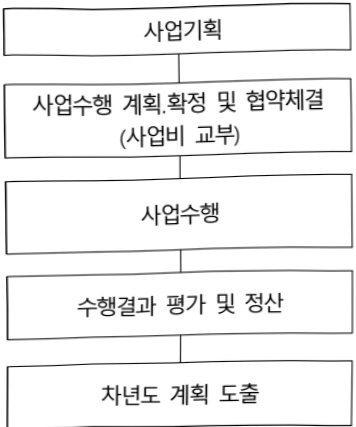

# 디지털트윈 융합 의료혁신 선도사업

**해당 페이지**: PDF 1011 ~ 1020 쪽 해당

**부처**: 과학기술정보통신부
**분야**: 통신
**회계유형**: 지역균형발전 특별회계
**2026 확정예산**: 2400.0 백만원
**전년대비 증감률**: 42.9%
**AI 도메인**: 의료/바이오, 건설/스마트시티

---

### 가.예산안 총괄표

(단위: 백만원, %)

<table border=1 style='margin: auto; word-wrap: break-word;'><tr><td rowspan="2">사업명</td><td rowspan="2">2024년 결산</td><td colspan="2">2025년 예산</td><td colspan="2">2026년</td><td rowspan="2">중감 (B-A)</td><td rowspan="2">(B-A)/A</td></tr><tr><td style='text-align: center; word-wrap: break-word;'>본예산</td><td style='text-align: center; word-wrap: break-word;'>추경(A)</td><td style='text-align: center; word-wrap: break-word;'>요구안</td><td style='text-align: center; word-wrap: break-word;'>본예산(B)</td></tr><tr><td style='text-align: center; word-wrap: break-word;'>디지털트윈 용합 의료혁신 선도사업</td><td style='text-align: center; word-wrap: break-word;'>2,400</td><td style='text-align: center; word-wrap: break-word;'>1,680</td><td style='text-align: center; word-wrap: break-word;'>1,680</td><td style='text-align: center; word-wrap: break-word;'>2,400</td><td style='text-align: center; word-wrap: break-word;'>2,400</td><td style='text-align: center; word-wrap: break-word;'>720</td><td style='text-align: center; word-wrap: break-word;'>42.9</td></tr></table>

□ 기능별(내역사업별) 예산안 내역

(단위:백만원)

<table border=1 style='margin: auto; word-wrap: break-word;'><tr><td rowspan="2"></td><td colspan="5">2024</td><td colspan="5">2025</td><td rowspan="2">2026예산</td></tr><tr><td style='text-align: center; word-wrap: break-word;'>예산액(추정)</td><td style='text-align: center; word-wrap: break-word;'>예산현액</td><td style='text-align: center; word-wrap: break-word;'>집행액</td><td style='text-align: center; word-wrap: break-word;'>이월액</td><td style='text-align: center; word-wrap: break-word;'>불용액</td><td style='text-align: center; word-wrap: break-word;'>예산액(추정)</td><td style='text-align: center; word-wrap: break-word;'>예산현액</td><td style='text-align: center; word-wrap: break-word;'>집행액</td><td style='text-align: center; word-wrap: break-word;'>이월액</td><td style='text-align: center; word-wrap: break-word;'>불용액</td></tr><tr><td style='text-align: center; word-wrap: break-word;'>○ 디지털트윈 융합의료혁신 선도사업</td><td style='text-align: center; word-wrap: break-word;'>2,400</td><td style='text-align: center; word-wrap: break-word;'>2,400</td><td style='text-align: center; word-wrap: break-word;'>2,400</td><td style='text-align: center; word-wrap: break-word;'></td><td style='text-align: center; word-wrap: break-word;'>0</td><td style='text-align: center; word-wrap: break-word;'>1,680</td><td style='text-align: center; word-wrap: break-word;'>1,680</td><td style='text-align: center; word-wrap: break-word;'>1,680</td><td style='text-align: center; word-wrap: break-word;'>-</td><td style='text-align: center; word-wrap: break-word;'>-</td><td style='text-align: center; word-wrap: break-word;'>2,400</td></tr><tr><td style='text-align: center; word-wrap: break-word;'>· 디지털트윈 융합의료혁신 기반구축</td><td style='text-align: center; word-wrap: break-word;'>2,400</td><td style='text-align: center; word-wrap: break-word;'>2,400</td><td style='text-align: center; word-wrap: break-word;'>2,400</td><td style='text-align: center; word-wrap: break-word;'></td><td style='text-align: center; word-wrap: break-word;'>0</td><td style='text-align: center; word-wrap: break-word;'>1,680</td><td style='text-align: center; word-wrap: break-word;'>1,680</td><td style='text-align: center; word-wrap: break-word;'>1,680</td><td style='text-align: center; word-wrap: break-word;'>-</td><td style='text-align: center; word-wrap: break-word;'>-</td><td style='text-align: center; word-wrap: break-word;'>2,400</td></tr></table>

---

### 나. 사업설명자료

## 1 ) 사업목적·내용

- (디지털 트런 융합 의료혁신 선도사업) 첨단 의료기기 클러스터를 운영중인 강원도를 중심으로, 국내 디지털 의료기기 개발과 임상 혁신을 위한 의료기기 기업의 디지털 트런 활용 기반 구축 및 시제품 제작 및 검증 지원

- (주요내용) 디지털 의료기기 실증 사업화 및 역량있는 의료기기 기업이 활용할 수 있는 디지털트런 공동기반을 구축하고, 시제품의 검증기반 및 사업화 지원

## 2 ) 사업개요

## □ 사업근거 및 추진경위

① 법령상 근거 조항 적시

- 정보통신산업진흥법 제27조(사업)

<table border=1 style='margin: auto; word-wrap: break-word;'><tr><td style='text-align: center; word-wrap: break-word;'>제27조(사업) 산업진흥원은 다음 각 호의 사업을 한다. &lt;개정 2011. 7. 25., 2012. 6. 1., 2020. 6. 9.&gt; 1. 정보통신산업 정책연구 및 정책수립 지원 2. 전문인력 양성 3. 정보통신산업 육성·발전 및 지원시설 등 기반조성사업 4. 정보통신기업의 창업·성장 등의 지원 5. 정보통신산업 발전을 위한 유통시장 활성화와 마케팅 지원 6. 정보통신산업 동향분석, 통계작성, 정보 유통, 서비스 등에 관한 사업 7. 정보통신기술의 융합·활용에 관한 사업 8. 정보통신산업 관련 국제교류·협력 및 해외진출의 지원 9. 정보통신산업 관련 출판·홍보 10. 「소프트웨어 진흥법」 제2조 제2호에 따른 소프트웨어산업에 관한 다음 각 목의 사업 가. 소프트웨어 기술진흥을 위한 정책 및 제도의 조사·연구 나. 소프트웨어사업자의 품질관리능력 및 전문성 향상에 필요한 사업 11. 삭제 &lt;2015. 6. 22.&gt; 12. 「이러닝(전자학습)산업 발전 및 이러닝 활용 촉진에 관한 법률」에 따른 이러닝산업의 발전에 필요한 기술개발 및 표준화 연구 13. 이 법 또는 다른 법령에서 산업진흥원의 업무로 정하거나 산업진흥원에 위탁한 사업 14. 그 밖에 산업진흥원의 설립 목적을 달성하는 데 필요한 사업으로서 대통령령으로 정하는 사업</td></tr></table>

3. 정보통신산업 육성 · 발전 및 지원시설 등 기반조성사업

4. 정보통신기업의 창업 · 성장 등의 지원

5. 정보통신산업 발전을 위한 유통시장 활성화와 마케팅 지원

6. 정보통신산업 동향분석, 통계작성, 정보 유통, 서비스 등에 관한 사업

7. 정보통신기술의 융합 · 활용에 관한 사업

8. 정보통신산업 관련 국제교류 · 협력 및 해외진출의 지원

9. 정보통신산업 관련 출판 · 홍보

10. 「소프트웨어 진흥법」 제2조 제2호에 따른 소프트웨어산업에 관한 다음 각 목의 사업

가. 소프트웨어 기술진흥을 위한 정책 및 제도의 조사 · 연구

나. 소프트웨어사업자의 품질관리능력 및 전문성 향상에 필요한 사업

11. 삭제 <2015. 6. 22.>

12. 「이러닝(전자학습)산업 발전 및 이러닝 활용 촉진에 관한 법률」에 따른 이러닝산업의 발전에 필요한 기술개발 및 표준화 연구

13. 이 법 또는 다른 법령에서 산업진흥원의 업무로 정하거나 산업진흥원에 위탁한 사업

14. 그 밖에 산업진흥원의 설립 목적을 달성하는 데 필요한 사업으로서 대통령령으로 정하는 사업

---

- 정보통신 진흥 및 융합 활성화 등에 관한 특별법 제32조(정보통신융합등 기술·서비스 개발 등의 지원)

제32조(정보통신융합등 기술·서비스 개발 등의 지원) ① 과학기술정보통신부장관은 다른 산

업 및 서비스 등에 정보통신의 접목을 통하여 생산성과 가치를 높일 수 있도록 노력하여야 한다.<개정 2017.7.26>

② 과학기술정보통신부장관은 정보통신융합등 기술·서비스의 개발을 촉진하기 위하여 다음 각

호의 사업을 추진할 수 있다. <개정 2017. 1. 26.>

1. 정보통신융합등 기술·서비스 관련 연구개발 사업

2. 제1호에 따라 추진되는 과제에 대한 기획·평가·관리

3.국가·지방자치단체,대학·정부출연연구기관,민간 등이 보유한 정보통신융합등 기술의 거래

등 기술이전을 위한 중개·알선 지원

4.정보통신융합등 기술에 대한 평가 및 평가 기법의 개발·보급

5. 정보통신융합등 기술의 기술이전·사업화에 관한 통계조사·연구 등 관련 정보의 수집·분석·제공

6.정보통신융합등 기술의 기술이전 후 상용화 연구개발 지원

7.정보통신융합등 기술의 기술사업화 전문인력 양성

8. 정보통신융합등 기술의 기술거래·사업화 촉진을 위한 정보시스템 구축·활용

9. 지식재산권 등 정보통신융합등 기술 관련 연구성과물의 관리·홍보·활용

10. 정보통신융합등 기술·서비스의 수준조사 등 정책연구 사업

11. 정보통신융합등 기술·서비스 관련 시범사업

12. 그 밖에 정보통신기술진흥을 위하여 필요한 사업

③ 과학기술정보통신부장관은 제2항 각 호의 사업을 추진하기 위하여 법인인 전담기관을 설립하

거나 법인·단체에 위탁·운영할 수 있으며, 필요한 비용의 전부 또는 일부를 예산의 범위에서 줄여 또는 보조할 수 있다. <개정 2017. 7. 26.>

④ 중앙행정기관의 장 및 지방자치단체의 장은 제2항 각 호의 사업을 제3항에 따른 전담기관으

로 하여금 수행하게 하고, 그에 소요되는 비용의 전부 또는 일부를 지원할 수 있다.

⑤ 제3항에 따른 전담기관에 관하여 이 법에서 정한 것을 제외하고는「민법」 중 재단법인에

관한 규정을 준용하며, 전담기관의 운영 및 제2항 각 호의 업무수행에 필요한 사항은 대통령령으로 정한다.

# -지능정보화 기본법 제15조

## 제 15조(지역지능정보화의 추진)

①국가기관과 지방자치단체는 지역 주민의 삶의 질 향상,주민의 역량 강화와 지역 간 균형발

전,정보격차 해소 등을 위하여 하나 또는 여러 개의 지역·도시에 대하여 행정·생활·산업 등

의 분야를 대상으로 하는 지능정보화(이하"지역지능정보화"라 한다)를 추진할 수 있다.

②국가기관과 지방자치단체는 지역지능정보화를 추진하는 경우 지역의 수요와 특성을 고려하여

야 하며, 관계 기관의 의견을 수렴하고 그 결과를 최대한 반영하여야 한다.

③ 국가기관은 지방자치단체가 주진하는 지역지능정보화를 위하여 행정, 재정, 기술 등에 관하여

필요한 사항을 지원할 수 있다.

---

- 지방자치분권 및 지역군형발전에 관한 특별법 제14조(지역산업 육성 및 일자리 창출 등 지역경제 활성화 촉진), 제16조(지역과학기술 및 정보통신의 진흥), 제79조(지역지원계정의 세입과 세출)

<table border=1 style='margin: auto; word-wrap: break-word;'><tr><td style='text-align: center; word-wrap: break-word;'>제14조(지역 산업 육성 및 일자리 창출 등 지역경제 활성화 촉진) ① 시·도지사는 관계 중앙행정기관의 장 및 관할 구역의 시·군·구의 시장·군수(광역시의 군수를 포함한다. 이하 같다)·구청장(자치구의 구청장을 말한다. 이하 같다)과 협의하여 해당 시·도의 지역특화산업을 선정할 수 있다. 이 경우 다음 각 호의 사항을 종합적으로 고려하여야 한다. 1. 국가의 성장잠재력과 경제성장에 대한 기여도 2. 지역일자리 창출 및 경쟁력 강화에 미치는 영향 3. 지역의 발전역량을 강화시킬 수 있는 가능성 ② 초광역권설정 지방자치단체의 장은 초광역권설정 지방자치단체를 구성하는 지방자치단체의 장 및 관계 중앙행정기관의 장과 협의하여 해당 초광역권의 초광역권산업을 선정할 수 있다. 이 경우 제1항 각 호의 사항을 종합적으로 고려하여야 한다. ③ 국가와 지방자치단체는 지역특화산업과 초광역권산업을 육성하기 위하여 해당 산업의 구조 고도화와 투자 유치 촉진, 집적(集積) 및 기반 확충 등에 관한 시책을 추진하여야 한다. ④ 국가와 지방자치단체는 지역 산업의 육성과 지역경제의 활성화를 위하여 지역의 일자리 창출과 투자 유치활동 지원, 정보통신 진흥 및 지역 특성에 맞는 중소기업의 창업 여건 개선 등에 관한 시책을 추진하여야 한다. ⑤ 제3항에 따른 지역특화산업·초광역권산업 및 제4항에 따른 지역 산업의 육성과 지역경제 활성화 촉진을 위한 시책의 추진 및 추진절차에 관하여 필요한 사항은 대통령령으로 정한다. 제16조(지역과학기술 및 정보통신의 진흥) 국가와 지방자치단체는 지역균형발전에 필요한 과학기술 및 정보통신의 진흥을 위하여 지역의 과학기술연구·교육기관 육성, 지역의 연구개발인력 및 정보통신인력의 확충, 지역균형발전을 위한 연구개발 촉진, 연구개발정보 유통체계 및 시설·장비 등 혁신기반 조성, 과학기술혁신 성과의 확산 및 산업화 촉진 등에 관한 시책을 추진하여야 한다. 제79조(지역지원계정의 세입과 세출) ① 회계의 지역지원계정의 세입은 다음 각 호와 같다. 1. 「주세법」에 따른 주세의 100분의 60 2. 「개발제한구역의 지정 및 관리에 관한 특별조치법」 제26조제1항에 따라 회계에 귀속되는 개발제한구역 보전 부담금 3. 「대도시권 광역교통 관리에 관한 특별법」 제11조의6제1항에 따라 회계에 귀속되는 광역교통시설부담금 4. 「공공자금관리기금법」에 따른 공공자금관리기금으로부터의 예수금 5. 일반회계 또는 다른 특별회계로부터의 전입금 6. 회계의 지역자율계정, 제주특별자치도계정 및 세종특별자치시계정으로부터의 전입금 7. 제2항제1호부터 제7호까지 및 제16호에 따른 융자금의 원리금 8. 제83조제1항에 따른 일시차임금 9. 제91조에 따른 전년도 결산상 잉여금 10. 제77조제1항에 따른 회계의 소속 재산의 임대료 및 매각대금 11. 그 밖에 다른 법률에 따라 회계로 귀속되는 수입금 ② 회계의 지역지원계정의 세출은 다음 각 호와 같다. 1. 초광역권 활성화 및 지역경쟁력 강화를 위한 교통·물류망 확충 관련 사업에 대한 출연·보조 또는 융자 2. 지역특화산업 및 초광역권산업의 육성과 투자 및 일자리 창출 촉진에 관련된 사업에 대한 출연·보조 또는 융자 3. 지방대학의 경쟁력 향상 및 지역인적자원의 개발 관련 사업에 대한 출연·보조 또는 융자 4. 지역의 과학기술 진흥 및 특성화 관련 사업에 대한 출연·보조 또는 융자 5. 공공기관·기업 및 대학 등 인구집중유발시설의 지방이전에 관한 사업에 대한 융자 등 필요한 경비의 지원 6. 지역의 문화·관광자원 육성, 지역고유정신문화 및 지역기적 발굴·선양, 환경 보전 사업 등에 대한 출연·보조 또는 융자 7. 지역의 주요 성장거점에 대한 출연·보조 또는 융자 8. 관련 법령에 따라 지방으로 이관되는 특별지방행정기관의 이관사무 수행에 필요한 경비 9. 「개발제한구역의 지정 및 관리에 관한 특별조치법」 제26조제2항에 따른 사업에 필요한 경비 10. 초광역권 활성화와 지역경쟁력 강화를 위한 조사·연구사업에 필요한 경비 11. 「공공자금관리기금법」에 따른 공공자금관리기금으로부터의 예수금의 원리금 상환 12. 제77조제1항에 따른 소속 재산의 관리·운영에 필요한 경비 13. 제83조제1항에 따른 일시차입금의 원리금 상환 14. 계정의 관리·운영에 필요한 경비 15. 회계의 지역자율계정, 제주특별자치도계정 및 세종특별자치시계정으로의 전출금 16. 그 밖에 지역균형발전에 관한 사업으로서 대통령령으로 정하는 사업의 시행에 필요한 지금의 융자 등 필요한 경비의 지원 ③ 제2항제1호부터 제7호까지 및 제16호에 따른 융자의 대상·조건 및 절차에 관하여 필요한 사항은 대통령령으로 정한다. ④ 국가는 제2항제8호와 관련하여 관련 법령에 따라 지방으로 이관되는 특별지방행정기관의 이관사무 수행에 필요한 경비의 전부를 해당 지방자치단체에 지원하여야 한다.</td></tr></table>

---

## ② 추진경위

### - 균형발전 지역공약, '22.4월

□강원도 7대 공약 및 15대 정책과제

Ⅲ. 권역별 특화 신산업 육성

6.디지털헬스케어 메카 육성

### -바이오헬스 신시장 창출 전략, '23.2월, 관계부처 합동

②데이터·인공지능을활용한의료기술개발
①(의료)임상수요에대응한인정기능기술개발지원
(메타버스·메디컬트런)가상환경기반진단치료등의료서비스기술및데이터기반
임상시험이 가능한 메디컬 트런 기술 개발

### - (현정부 123대 국정과제 전략, '25.08월, 국정기획위원회)

국정목표 : 세계를 이끄는 혁신경제

1. AI 3대 강국 도약, (23) 안전과 책임 기반의 'AI 기본사회' 실현

---

## □ 주요내용

① 사업규모

- 총사업비 : 해당사항 없음

- 사업기간 : 2024년 ~ 2028년

- 최근 5년 간 투입된 사업비(예산액기준, 추경편성한 연도에는 추경포함)

<table border=1 style='margin: auto; word-wrap: break-word;'><tr><td style='text-align: center; word-wrap: break-word;'>$ \underline{\text{焼成}} $</td><td style='text-align: center; word-wrap: break-word;'>2022</td><td style='text-align: center; word-wrap: break-word;'>2023</td><td style='text-align: center; word-wrap: break-word;'>2024</td><td style='text-align: center; word-wrap: break-word;'>2025</td><td style='text-align: center; word-wrap: break-word;'>2026</td></tr><tr><td style='text-align: center; word-wrap: break-word;'>$ \underline{\text{사업비}} $</td><td style='text-align: center; word-wrap: break-word;'>-</td><td style='text-align: center; word-wrap: break-word;'>-</td><td style='text-align: center; word-wrap: break-word;'>2,400</td><td style='text-align: center; word-wrap: break-word;'>1,680</td><td style='text-align: center; word-wrap: break-word;'>2,400</td></tr></table>

- 기타 : 해당없음

② 사업추진체계

- 사업시행방법 : 출연

· 사업시행주체 : 정보통신산업진흥원

- 사업 수혜자 : 의료기기 기업 및 의료기관 등

- 보조, 융자, 출연, 출자 등의 경우 보조·융자 등 지원 비율 및 법적근거

<table border=1 style='margin: auto; word-wrap: break-word;'><tr><td style='text-align: center; word-wrap: break-word;'>내역사업명</td><td style='text-align: center; word-wrap: break-word;'>구분</td><td style='text-align: center; word-wrap: break-word;'>피보조·피출연 등 기관명</td><td style='text-align: center; word-wrap: break-word;'>지원 금액 (2024결산)</td><td style='text-align: center; word-wrap: break-word;'>지원 비율(%)</td><td style='text-align: center; word-wrap: break-word;'>보조율 법적근거 (해당 조항)</td></tr><tr><td style='text-align: center; word-wrap: break-word;'>디지털트윈 융합 의료혁신 선도사업</td><td style='text-align: center; word-wrap: break-word;'>출연</td><td style='text-align: center; word-wrap: break-word;'>정보통신 산업진흥원</td><td style='text-align: center; word-wrap: break-word;'>2,400</td><td style='text-align: center; word-wrap: break-word;'>100%</td><td style='text-align: center; word-wrap: break-word;'>정보통신산업진흥법 제26조, 제27조 등</td></tr></table>

---

## 3 ) 2026년도 예산안 산출 근거

① 디지털트윈 융합 의료혁신 선도사업 : 2,400백만원
- (산출) 디지털트윈 통합플랫폼 구축 : 1개 x 400백만 = 400백만원
  디지털트윈 모델 개발 : 6식 x 250백만 = 1,500백만원
  디지털트윈 검증체계 : 4개 x 70백만 = 280백만원
  디지털트윈 사업화 : (컨설팅)10개 x 10백만 = 100백만원, (시장진출) 1식 x 120백만 = 120백만

## 4 ) 사업효과

□ 사업영향, 산출물 성과지표 등

① 2022~2026년도 성과계획서 상 성과지표 및 최근 5년간 성과 달성도

<table border=1 style='margin: auto; word-wrap: break-word;'><tr><td style='text-align: center; word-wrap: break-word;'>성과지표</td><td style='text-align: center; word-wrap: break-word;'>구분</td><td style='text-align: center; word-wrap: break-word;'>2022</td><td style='text-align: center; word-wrap: break-word;'>2023</td><td style='text-align: center; word-wrap: break-word;'>2024</td><td style='text-align: center; word-wrap: break-word;'>2025</td><td style='text-align: center; word-wrap: break-word;'>2026</td><td style='text-align: center; word-wrap: break-word;'>2026 목표치산출근거</td><td style='text-align: center; word-wrap: break-word;'>측정산식(또는 측정방법)</td><td style='text-align: center; word-wrap: break-word;'>자료수집방법(또는 자료출처)</td></tr><tr><td rowspan="3">디지털트윈 모델설계 건수(건)</td><td style='text-align: center; word-wrap: break-word;'>목표</td><td style='text-align: center; word-wrap: break-word;'>-</td><td style='text-align: center; word-wrap: break-word;'>-</td><td style='text-align: center; word-wrap: break-word;'>3</td><td style='text-align: center; word-wrap: break-word;'>5</td><td style='text-align: center; word-wrap: break-word;'>6</td><td rowspan="3">전년도 대비 10% 이상 향상</td><td rowspan="3">디지털트윈 통합 인프라 및 트윈모델 설계 간수</td><td rowspan="3">디지털트윈 모델 설계 결과보고서</td></tr><tr><td style='text-align: center; word-wrap: break-word;'>실적</td><td style='text-align: center; word-wrap: break-word;'>-</td><td style='text-align: center; word-wrap: break-word;'>-</td><td style='text-align: center; word-wrap: break-word;'>3</td><td style='text-align: center; word-wrap: break-word;'>5</td><td style='text-align: center; word-wrap: break-word;'>-</td></tr><tr><td style='text-align: center; word-wrap: break-word;'>달성도</td><td style='text-align: center; word-wrap: break-word;'>-</td><td style='text-align: center; word-wrap: break-word;'>-</td><td style='text-align: center; word-wrap: break-word;'>100%</td><td style='text-align: center; word-wrap: break-word;'>100%</td><td style='text-align: center; word-wrap: break-word;'>-</td></tr></table>

② 성과지표 이외의 연도별 사업추진 경과 및 실적

<table border=1 style='margin: auto; word-wrap: break-word;'><tr><td style='text-align: center; word-wrap: break-word;'>2024</td><td style='text-align: center; word-wrap: break-word;'>- 총괄사업수행기관(주관기관) 공모 및 선정(5월) * 강원(재)원주의료기기산업진흥원(컨) 선정 - 디지털트윈 통합플랫폼 개발사 공모 및 선정(7월) * 글로벌 다소 솔루션을 이용한 디지털트윈 통합플랫폼 구축 개발(24~25년) - 디지털트윈 (범용)모델 개발 완료(3식)(12월)</td></tr><tr><td style='text-align: center; word-wrap: break-word;'>2025</td><td style='text-align: center; word-wrap: break-word;'>- 디지털트윈 실증기업 공모 및 선정 및 지원(7월) * 2개사(당뇨-난청), 2년지원</td></tr></table>

③향후(2026년도 이후)기대효과

- 제품 개발 초기과정부터 임상 평가까지 디지털트런 기술을 활용한 가상 테스트 등의 도입으로 의료기기 효과성 등 검증 지원 및 사업화 기반 마련

- 디지털트런 의료기기개발 실증지원을 통한 지역 디지털의료기기 기업의 개발비용

- 절감, 개발기간 단축 등으로 디지털트런 융합 의료산업 선도 및 경쟁력 강화

5) 타당성조사 및 예비타당성조사 시행여부 및 결과 요지 : 해당 없음

6) 총사업비 대상사업 여부 및 내역 : 해당 없음

---

## 7 ) 사업 집행절차

<사업수행체계>

과학기술정보통신부(주무부처)

정보통신산업진흥원(전담기관)

주관지자체(강원특별자치도,원주시)

총괄운영기관(원주의료기기산업진흥원)

사업 참여기관

(연세대학교 미래의료산학협력단, 상지대학교 산학협력단, 강원테크노파크)

의료기기 실증기관

(의료기기 개발기업, 2년지원)

<사업추진 절차>

- NIPA → 과학기술정보통신부

- NIPA ↔ 과학기술정보통신부

* 사업비 교부 : 과기부 → NIPA

* 정보통신신업진흥법, 지방분권군형발전법, 국가재정법, 공공재정환수법, 정보통신기금 관계법령 등

- NIPA(총괄수행기관 선정 및 협약)

* 외부 전문가로 구성된 심사위원회 추진

* 정보통신산업진흥법, 지방분권균형발전법, 국가재정법, 공공재정환수법, 정보통신기금 관계법령 등

- 수행결과보고서 제출(NIPA → 과학기술정보통신부)

* 외부 전문가 평가

- 예산반영 : 과학기술정보통신부

* 사업 성과 환류

<디지털트윈 융합 의료혁신 선도사업>

<table border=1 style='margin: auto; word-wrap: break-word;'><tr><td style='text-align: center; word-wrap: break-word;'>부처</td><td style='text-align: center; word-wrap: break-word;'></td><td style='text-align: center; word-wrap: break-word;'>피출연·피보조기관</td><td style='text-align: center; word-wrap: break-word;'></td><td style='text-align: center; word-wrap: break-word;'>간접보조사업자·사업수행자</td></tr><tr><td style='text-align: center; word-wrap: break-word;'>과학기술정보통신부(2,400백만원)</td><td style='text-align: center; word-wrap: break-word;'>=&gt;(2,400백만원)</td><td style='text-align: center; word-wrap: break-word;'>정보통신산업진흥원(100백만원)</td><td style='text-align: center; word-wrap: break-word;'>=&gt;(2,300백만원)</td><td style='text-align: center; word-wrap: break-word;'>원주의료기기테크노멜리외 3개 기관,실증기업(6개)</td></tr></table>

8) 각종 평가 : 해당 없음

---

### 다.최근 4년간 결산내역

## 1 ) 결산표

☐ 부처 결산내역

(단위: 백만원, %)

<table border=1 style='margin: auto; word-wrap: break-word;'><tr><td rowspan="2">違反</td><td colspan="3">예산액</td><td rowspan="2">전년도 이월액</td><td rowspan="2">이·전용 등</td><td rowspan="2">예비비</td><td rowspan="2">예산 현액(B)</td><td rowspan="2">집행액(C)</td><td rowspan="2">집행률(C/A)</td><td rowspan="2">집행률(C/B)</td><td rowspan="2">디음연도 이월액</td><td rowspan="2">불용액</td></tr><tr><td style='text-align: center; word-wrap: break-word;'>본예산</td><td style='text-align: center; word-wrap: break-word;'>추경 중감액</td><td style='text-align: center; word-wrap: break-word;'>추경(A)</td></tr><tr><td style='text-align: center; word-wrap: break-word;'>2022</td><td style='text-align: center; word-wrap: break-word;'>-</td><td style='text-align: center; word-wrap: break-word;'>-</td><td style='text-align: center; word-wrap: break-word;'>-</td><td style='text-align: center; word-wrap: break-word;'>-</td><td style='text-align: center; word-wrap: break-word;'>-</td><td style='text-align: center; word-wrap: break-word;'>-</td><td style='text-align: center; word-wrap: break-word;'>-</td><td style='text-align: center; word-wrap: break-word;'>-</td><td style='text-align: center; word-wrap: break-word;'>-</td><td style='text-align: center; word-wrap: break-word;'>-</td><td style='text-align: center; word-wrap: break-word;'>-</td><td style='text-align: center; word-wrap: break-word;'>-</td></tr><tr><td style='text-align: center; word-wrap: break-word;'>2023</td><td style='text-align: center; word-wrap: break-word;'>-</td><td style='text-align: center; word-wrap: break-word;'>-</td><td style='text-align: center; word-wrap: break-word;'>-</td><td style='text-align: center; word-wrap: break-word;'>-</td><td style='text-align: center; word-wrap: break-word;'>-</td><td style='text-align: center; word-wrap: break-word;'>-</td><td style='text-align: center; word-wrap: break-word;'>-</td><td style='text-align: center; word-wrap: break-word;'>-</td><td style='text-align: center; word-wrap: break-word;'>-</td><td style='text-align: center; word-wrap: break-word;'>-</td><td style='text-align: center; word-wrap: break-word;'>-</td><td style='text-align: center; word-wrap: break-word;'>-</td></tr><tr><td style='text-align: center; word-wrap: break-word;'>2024</td><td style='text-align: center; word-wrap: break-word;'>2,400</td><td style='text-align: center; word-wrap: break-word;'>2,400</td><td style='text-align: center; word-wrap: break-word;'>2,400</td><td style='text-align: center; word-wrap: break-word;'>-</td><td style='text-align: center; word-wrap: break-word;'>-</td><td style='text-align: center; word-wrap: break-word;'>-</td><td style='text-align: center; word-wrap: break-word;'>2,400</td><td style='text-align: center; word-wrap: break-word;'>2,400</td><td style='text-align: center; word-wrap: break-word;'>100</td><td style='text-align: center; word-wrap: break-word;'>100</td><td style='text-align: center; word-wrap: break-word;'>-</td><td style='text-align: center; word-wrap: break-word;'>-</td></tr><tr><td style='text-align: center; word-wrap: break-word;'>2025</td><td style='text-align: center; word-wrap: break-word;'>1,680</td><td style='text-align: center; word-wrap: break-word;'>1,680</td><td style='text-align: center; word-wrap: break-word;'>1,680</td><td style='text-align: center; word-wrap: break-word;'>-</td><td style='text-align: center; word-wrap: break-word;'>-</td><td style='text-align: center; word-wrap: break-word;'>-</td><td style='text-align: center; word-wrap: break-word;'>1,680</td><td style='text-align: center; word-wrap: break-word;'>1,680</td><td style='text-align: center; word-wrap: break-word;'>100</td><td style='text-align: center; word-wrap: break-word;'>100</td><td style='text-align: center; word-wrap: break-word;'>-</td><td style='text-align: center; word-wrap: break-word;'>-</td></tr></table>

2) 주요 결산사항 : 해당 없음

---

<table border=1 style='margin: auto; word-wrap: break-word;'><tr><td style='text-align: center; word-wrap: break-word;'>사 업 명</td></tr><tr><td style='text-align: center; word-wrap: break-word;'>(28) 디지털헬스케어기반 AI 융합혁신 허브 조성 (2232-305)</td></tr></table>

사업 코드 정보

<table border=1 style='margin: auto; word-wrap: break-word;'><tr><td style='text-align: center; word-wrap: break-word;'>구분</td><td style='text-align: center; word-wrap: break-word;'>회계</td><td style='text-align: center; word-wrap: break-word;'>소관</td><td style='text-align: center; word-wrap: break-word;'>실국(기관)</td><td style='text-align: center; word-wrap: break-word;'>계정</td><td style='text-align: center; word-wrap: break-word;'>분야</td><td style='text-align: center; word-wrap: break-word;'>부문</td></tr><tr><td style='text-align: center; word-wrap: break-word;'>코드</td><td style='text-align: center; word-wrap: break-word;'>지역균형발전</td><td style='text-align: center; word-wrap: break-word;'>과학기술</td><td style='text-align: center; word-wrap: break-word;'>소프트웨어</td><td style='text-align: center; word-wrap: break-word;'>지역지원</td><td style='text-align: center; word-wrap: break-word;'>130</td><td style='text-align: center; word-wrap: break-word;'>133</td></tr><tr><td style='text-align: center; word-wrap: break-word;'>명칭</td><td style='text-align: center; word-wrap: break-word;'>특별회계</td><td style='text-align: center; word-wrap: break-word;'>정보통신부</td><td style='text-align: center; word-wrap: break-word;'>정책관</td><td style='text-align: center; word-wrap: break-word;'>계정</td><td style='text-align: center; word-wrap: break-word;'>통신</td><td style='text-align: center; word-wrap: break-word;'>정보통신</td></tr></table>

<table border=1 style='margin: auto; word-wrap: break-word;'><tr><td style='text-align: center; word-wrap: break-word;'>구분</td><td style='text-align: center; word-wrap: break-word;'>프로그램</td><td style='text-align: center; word-wrap: break-word;'>단위사업</td><td style='text-align: center; word-wrap: break-word;'>세부사업</td></tr><tr><td style='text-align: center; word-wrap: break-word;'>코드</td><td style='text-align: center; word-wrap: break-word;'>2200</td><td style='text-align: center; word-wrap: break-word;'>2232</td><td style='text-align: center; word-wrap: break-word;'>305</td></tr><tr><td style='text-align: center; word-wrap: break-word;'>명칭</td><td style='text-align: center; word-wrap: break-word;'>SW산업진흥</td><td style='text-align: center; word-wrap: break-word;'>SW융합인력양성(균특)</td><td style='text-align: center; word-wrap: break-word;'>디지털헬스케어기반 AI 융합혁신센터 구축</td></tr></table>

□ 사업 성격 (공통요구자료 Ⅱ-1 작성유의사항 4. 참조, 해당하는 사항에 “○” 표시)

<table border=1 style='margin: auto; word-wrap: break-word;'><tr><td rowspan="2">신규</td><td rowspan="2">계속</td><td rowspan="2">완료</td><td rowspan="2">예비타당성 실시여부</td><td rowspan="2">총사업 비 관리대상</td><td rowspan="2">총액계상 예산사업</td><td style='text-align: center; word-wrap: break-word;'>사업소관 변경정보</td></tr><tr><td style='text-align: center; word-wrap: break-word;'>2025예산 시 소관</td></tr><tr><td style='text-align: center; word-wrap: break-word;'>○</td><td style='text-align: center; word-wrap: break-word;'></td><td style='text-align: center; word-wrap: break-word;'></td><td style='text-align: center; word-wrap: break-word;'></td><td style='text-align: center; word-wrap: break-word;'></td><td style='text-align: center; word-wrap: break-word;'></td><td style='text-align: center; word-wrap: break-word;'></td></tr></table>

사업 지원 형태 및 지원을 (최소한 한 개는 반드시 선택하시오. 해당사항에 0 표시)

<table border=1 style='margin: auto; word-wrap: break-word;'><tr><td style='text-align: center; word-wrap: break-word;'>직접</td><td style='text-align: center; word-wrap: break-word;'>출자</td><td style='text-align: center; word-wrap: break-word;'>출연</td><td style='text-align: center; word-wrap: break-word;'>보조</td><td style='text-align: center; word-wrap: break-word;'>융자</td><td style='text-align: center; word-wrap: break-word;'>국고보조율(%)</td><td style='text-align: center; word-wrap: break-word;'>융자율(%)</td></tr><tr><td style='text-align: center; word-wrap: break-word;'></td><td style='text-align: center; word-wrap: break-word;'></td><td style='text-align: center; word-wrap: break-word;'>○</td><td style='text-align: center; word-wrap: break-word;'></td><td style='text-align: center; word-wrap: break-word;'></td><td style='text-align: center; word-wrap: break-word;'></td><td style='text-align: center; word-wrap: break-word;'></td></tr></table>

사업 소관부처 및 시행주체

<table border=1 style='margin: auto; word-wrap: break-word;'><tr><td style='text-align: center; word-wrap: break-word;'>사업명</td><td colspan="2">구분</td></tr><tr><td rowspan="2">디지털 헬스케어기반 AI융합혁신 허브 조성</td><td style='text-align: center; word-wrap: break-word;'>소관부처</td><td style='text-align: center; word-wrap: break-word;'>정보통신정책실 소프트웨어정책관 소프트웨어기반조성팀</td></tr><tr><td style='text-align: center; word-wrap: break-word;'>사업시행주체</td><td style='text-align: center; word-wrap: break-word;'>정보통신산업진흥원</td></tr></table>

---

### 원본 PDF 크롭 이미지

