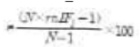
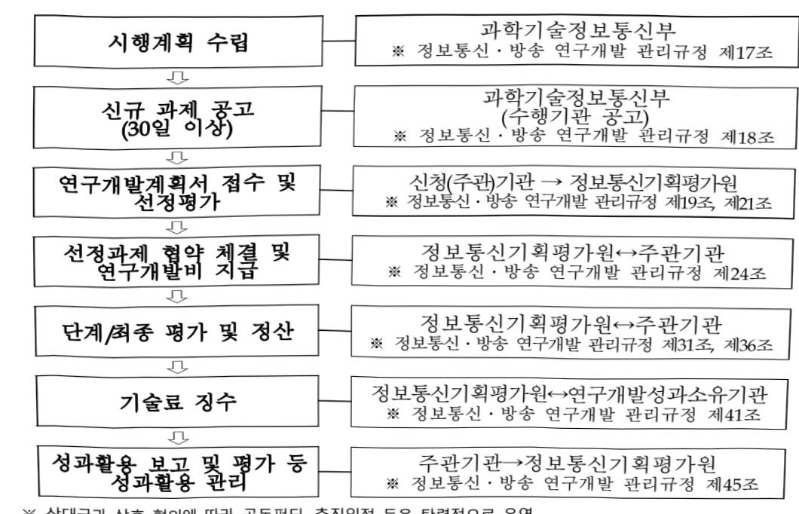

# 디지털혁신기술국제공동연구(R&D)

**해당 페이지**: PDF 1026 ~ 1036 쪽 해당

**부처**: 과학기술정보통신부
**분야**: 통신
**회계유형**: 일반회계
**2026 확정예산**: 9751.0 백만원
**전년대비 증감률**: 50.9%
**AI 도메인**: AI반도체, 보안/사이버, 교통/모빌리티, 로봇, 통신/네트워크, 디지털전환(AX)

---

<table border=1 style='margin: auto; word-wrap: break-word;'><tr><td style='text-align: center; word-wrap: break-word;'>사 업 명</td></tr><tr><td style='text-align: center; word-wrap: break-word;'>(160) 디지털혁신기술국제공동연구(R&amp;D)(2132-353)</td></tr></table>

☐ 사업 코드 정보

<table border=1 style='margin: auto; word-wrap: break-word;'><tr><td style='text-align: center; word-wrap: break-word;'>구분</td><td style='text-align: center; word-wrap: break-word;'>회계</td><td style='text-align: center; word-wrap: break-word;'>소관</td><td style='text-align: center; word-wrap: break-word;'>실국(기관)</td><td style='text-align: center; word-wrap: break-word;'>계정</td><td style='text-align: center; word-wrap: break-word;'>분야</td><td style='text-align: center; word-wrap: break-word;'>부문</td></tr><tr><td style='text-align: center; word-wrap: break-word;'>코드</td><td rowspan="2">일반회계</td><td style='text-align: center; word-wrap: break-word;'>과학기술</td><td style='text-align: center; word-wrap: break-word;'>정보통신정책실</td><td rowspan="2">-</td><td style='text-align: center; word-wrap: break-word;'>130</td><td style='text-align: center; word-wrap: break-word;'>133</td></tr><tr><td style='text-align: center; word-wrap: break-word;'>명칭</td><td style='text-align: center; word-wrap: break-word;'>정보통신부</td><td style='text-align: center; word-wrap: break-word;'>정보통신접경책관</td><td style='text-align: center; word-wrap: break-word;'>통신</td><td style='text-align: center; word-wrap: break-word;'>정보통신</td></tr></table>

<table border=1 style='margin: auto; word-wrap: break-word;'><tr><td style='text-align: center; word-wrap: break-word;'>구분</td><td style='text-align: center; word-wrap: break-word;'>프로그램</td><td style='text-align: center; word-wrap: break-word;'>단위사업</td><td style='text-align: center; word-wrap: break-word;'>세부사업</td></tr><tr><td style='text-align: center; word-wrap: break-word;'>코드</td><td style='text-align: center; word-wrap: break-word;'>2100</td><td style='text-align: center; word-wrap: break-word;'>2132</td><td style='text-align: center; word-wrap: break-word;'>353</td></tr><tr><td style='text-align: center; word-wrap: break-word;'>명칭</td><td style='text-align: center; word-wrap: break-word;'>정보통신융합산업</td><td style='text-align: center; word-wrap: break-word;'>콘텐츠디바이스 기술개발(일반)</td><td style='text-align: center; word-wrap: break-word;'>디지털혁신기술 국제공동연구(R&amp;D)</td></tr></table>

<table border=1 style='margin: auto; word-wrap: break-word;'><tr><td colspan="6">☐ 사업 성격 (공통요구자료 II-1 작성유의사항 4. 참조, 해당하는 사항에 “○” 표시)</td></tr><tr><td rowspan="2">신규 계속</td><td rowspan="2">완료</td><td rowspan="2">예비타당성 실시여부</td><td rowspan="2">총사업비 관리대상</td><td rowspan="2">총액계상 예산사업</td><td style='text-align: center; word-wrap: break-word;'>사업소관 변경정보</td></tr><tr><td style='text-align: center; word-wrap: break-word;'>2025예산 시 소관</td></tr><tr><td style='text-align: center; word-wrap: break-word;'></td><td style='text-align: center; word-wrap: break-word;'>○</td><td style='text-align: center; word-wrap: break-word;'></td><td style='text-align: center; word-wrap: break-word;'></td><td style='text-align: center; word-wrap: break-word;'></td><td style='text-align: center; word-wrap: break-word;'></td></tr></table>

□ 사업 지원 형태 및 지원율

<table border=1 style='margin: auto; word-wrap: break-word;'><tr><td style='text-align: center; word-wrap: break-word;'>직접</td><td style='text-align: center; word-wrap: break-word;'>출자</td><td style='text-align: center; word-wrap: break-word;'>출연</td><td style='text-align: center; word-wrap: break-word;'>보조</td><td style='text-align: center; word-wrap: break-word;'>융자</td><td style='text-align: center; word-wrap: break-word;'>국고보조율(%)</td><td style='text-align: center; word-wrap: break-word;'>융자율(%)</td></tr><tr><td style='text-align: center; word-wrap: break-word;'></td><td style='text-align: center; word-wrap: break-word;'></td><td style='text-align: center; word-wrap: break-word;'>○</td><td style='text-align: center; word-wrap: break-word;'></td><td style='text-align: center; word-wrap: break-word;'></td><td style='text-align: center; word-wrap: break-word;'></td><td style='text-align: center; word-wrap: break-word;'></td></tr></table>

□ 사업 소관부처 및 시행주체

<table border=1 style='margin: auto; word-wrap: break-word;'><tr><td style='text-align: center; word-wrap: break-word;'>사업명</td><td colspan="2">구분</td></tr><tr><td style='text-align: center; word-wrap: break-word;'>디지털 혁신기술</td><td style='text-align: center; word-wrap: break-word;'>소관부처</td><td style='text-align: center; word-wrap: break-word;'>정보통신정책실 정보통신산업정책관 정보통신방송기술정책과</td></tr><tr><td style='text-align: center; word-wrap: break-word;'>국제공동연구(R&amp;D)</td><td style='text-align: center; word-wrap: break-word;'>사업시행주체</td><td style='text-align: center; word-wrap: break-word;'>정보통신기획평가원</td></tr></table>

---

### 가. 예산 총괄표

(단위: 백만원, %)

<table border=1 style='margin: auto; word-wrap: break-word;'><tr><td rowspan="2">사업명</td><td rowspan="2">2024년 결산</td><td colspan="2">2025년 예산</td><td colspan="2">2026년 예산</td><td rowspan="2">중감(B-A)</td><td rowspan="2">(B-A)/A</td></tr><tr><td style='text-align: center; word-wrap: break-word;'>본예산</td><td style='text-align: center; word-wrap: break-word;'>추경(A)</td><td style='text-align: center; word-wrap: break-word;'>요구안</td><td style='text-align: center; word-wrap: break-word;'>본예산(B)</td></tr><tr><td style='text-align: center; word-wrap: break-word;'>디지털혁신기술국제공동연구(R&amp;D)</td><td style='text-align: center; word-wrap: break-word;'>2,930</td><td style='text-align: center; word-wrap: break-word;'>6,460</td><td style='text-align: center; word-wrap: break-word;'>-</td><td style='text-align: center; word-wrap: break-word;'>9,751</td><td style='text-align: center; word-wrap: break-word;'>9,751</td><td style='text-align: center; word-wrap: break-word;'>3,291</td><td style='text-align: center; word-wrap: break-word;'>50.9</td></tr></table>

* 추경: 추경증감액을 포함한 최종 예산액을 기재

## □ 기능별(내역사업별) 예산 내역

(단위:백만원)

<table border=1 style='margin: auto; word-wrap: break-word;'><tr><td rowspan="2"></td><td colspan="5">2024</td><td colspan="5">2025</td><td style='text-align: center; word-wrap: break-word;'>2026 倉冫</td></tr><tr><td style='text-align: center; word-wrap: break-word;'>倉冫倉(専倉)</td><td style='text-align: center; word-wrap: break-word;'>倉冫倉冫倉冫倉冫倉冫倉冫倉冫倉冫倉冫倉冫倉冫倉冫倉冫倉冫倉冫倉冫倉冫倉冫倉冫倉冫倉冫倉冫倉冫倉冫倉冫倉冫倉冫倉冫倉冫倉冫倉冫倉冫倉冫倉冫倉冫倉冫倉冫倉冫倉冫倉冫倉冫倉冫倉冫倉冫倉冫倉冫倉冫倉冫倉冫倉冫倉冫倉冫倉冫倉冫倉冫倉冫倉冫倉冫倉冫倉冫倉冫倉冫倉冫倉冫倉冫倉冫倉冫倉冫倉冫倉冫倉冫倉冫倉冫倉冫倉冫倉冫倉冫倉冫倉冫倉冫倉冫倉冫倉冫倉冫倉冫倉冫倉冫倉冫倉冫倉冫倉冫倉冫倉冫倉冫倉冫倉冫倉冫倉冫倉冫倉冫倉冫倉冫倉冫倉冫倉冫倉冫倉冫倉冫倉冫倉冫倉冫倉冫倉冫倉冫倉冫倉冫倉冫倉冫倉冫倉冫倉冫倉冫倉冫倉冫倉冫倉冫倉冫倉冫倉冫倉冫倉冫倉冫倉冫倉冫倉冫倉冫倉冫倉冫倉冫倉冫倉冫倉冫倉冫倉冫倉冫倉冫倉冫倉冫倉冫倉冫倉冫倉冫倉冫倉冫倉冫倉冫倉冫倉冫倉冫倉冫倉冫倉冫倉冫倉冫倉冫倉冫倉冫倉冫倉冫倉冫倉冫倉冫倉冫倉冫倉冫倉冫倉冫倉冫倉冫倉冫倉冫倉冫倉冫倉冫倉冫倉冫倉冫倉冫倉冫倉冫倉冫倉冫倉冫倉冫倉冫倉冫倉冫倉冫倉冫倉冫倉冫倉冫倉冫倉冫倉冫倉冫倉冫倉冫倉冫倉冫倉冫倉冫倉冫倉冫倉冫倉冫倉冫倉冫倉冫倉冫倉冫倉冫倉冫倉冫倉冫倉冫倉冫倉冫倉冫倉冫倉冫倉冫倉冫倉冫倉冫倉冫倉冫倉冫倉冫倉冫倉冫倉冫倉冫倉冫倉冫倉冫倉冫倉冫倉冫倉冫倉冫倉冫倉冫倉冫倉冫倉冫倉冫倉冫倉冫倉冫倉冫倉冫倉冫倉冫倉冫倉冫倉冫倉冫倉冫倉冫倉冫倉冫倉冫倉冫倉冫倉冫倉冫倉冫倉冫倉冫倉冫倉冫倉冫倉冫倉冫倉冫倉冫倉冫倉冫倉冫倉冫倉冫倉冫倉冫倉冫倉冫倉冫倉冫倉冫倉冫倉冫倉冫倉冫倉冫倉冫倉冫倉冫倉冫倉冫倉冫倉冫倉冫倉冫倉冫倉冫倉冫倉冫倉冫倉冫倉冫倉冫倉冫倉冫倉冫倉冫倉冫倉冫倉冫倉冫倉冫倉冫倉冫倉冫倉冫倉冫倉冫倉冫倉冫倉冫倉冫倉冫倉冫倉冫倉冫倉冫倉冫倉冫倉冫倉冫倉冫倉冫倉冫倉冫倉冫倉冫倉冫倉冫倉冫倉冫倉冫倉冫倉冫倉冫倉冫倉冫倉冫倉冫倉冫倉冫倉冫倉冫倉冫倉冫倉冫倉冫倉冫倉冫倉冫倉冫倉冫倉冫倉冫倉冫倉冫倉冫倉冫倉冫倉冫倉冫倉冫倉冫倉冫倉冫倉冫倉冫倉冫倉冫倉冫倉冫倉冫倉冫倉冫倉冫倉冫倉冫倉冫倉冫倉冫倉冫倉冫倉冫倉冫倉冫倉冫倉冫倉冫倉冫倉冫倉冫倉冫倉冫倉冫倉冫倉冫倉冫倉冫倉冫倉冫倉冫倉冫倉冫倉冫倉冫倉冫倉冫倉冫倉冫倉冫倉冫倉冫倉冫倉冫倉冫倉冫倉冫倉冫倉冫倉冫倉冫倉冫倉冫倉冫倉冫倉冫倉冫倉冫倉冫倉冫倉冫倉冫倉冫倉冫倉冫倉冫倉冫倉冫倉冫倉冫倉冫倉冫倉冫倉冫倉冫倉冫倉冫倉冫倉冫倉冫倉冫倉冫倉冫倉冫倉冫倉冫倉冫倉冫倉冫倉冫倉冫倉冫倉冫倉冫倉冫倉冫倉冫倉冫倉冫倉冫倉冫倉冫倉冫倉冫倉冫倉冫倉冫倉冫倉冫倉冫倉冫倉冫倉冫倉冫倉冫倉冫倉冫倉冫倉冫倉冫倉冫倉冫倉冫倉冫倉冫倉冫倉冫倉冫倉冫倉冫倉冫倉冫倉冫倉冫倉冫倉冫倉冫倉冫倉冫倉冫倉冫倉冫倉冫倉冫倉冫倉冫倉冫倉冫倉冫倉冫倉冫倉冫倉冫倉冫倉冫倉冫倉冫倉冫倉冫倉冫倉冫倉冫倉冫倉冫倉冫倉冫倉冫倉冫倉冫倉冫倉冫倉冫倉冫倉冫倉冫倉冫倉冫倉冫倉冫倉冫倉冫倉冫倉冫倉冫倉冫倉冫倉冫倉冫倉冫倉冫倉冫倉冫倉冫倉冫倉冫倉冫倉冫倉冫倉冫倉冫倉冫倉冫倉冫倉冫倉冫倉冫倉冫倉冫倉冫倉冫倉冫倉冫倉冫倉冫倉冫倉冫倉冫倉冫倉冫倉冫倉冫倉冫倉冫倉冫倉冫倉冫倉冫倉冫倉冫倉冫倉冫倉冫倉冫倉冫倉冫倉冫倉冫倉冫倉冫倉冫倉冫倉冫倉冫倉冫倉冫倉冫倉冫倉冫倉冫倉冫倉冫倉冫倉冫倉冫倉冫倉冫倉冫倉冫倉冫倉冫倉冫倉冫倉冫倉冫倉冫倉冫倉冫倉冫倉冫倉冫倉冫倉冫倉冫倉冫倉冫倉冫</td><td style='text-align: center; word-wrap: break-word;'></td><td style='text-align: center; word-wrap: break-word;'></td><td style='text-align: center; word-wrap: break-word;'></td><td style='text-align: center; word-wrap: break-word;'></td><td style='text-align: center; word-wrap: break-word;'></td><td style='text-align: center; word-wrap: break-word;'></td><td style='text-align: center; word-wrap: break-word;'></td><td style='text-align: center; word-wrap: break-word;'></td><td style='text-align: center; word-wrap: break-word;'></td></tr></table>

### 나. 사업설명자료

## 1 ) 사업목적·내용

o (디지털혁신기술국제공동연구) 글로벌 기술패권 경쟁 대응 및 초격차 기술확보를 위해 AI·반도체·사이버보안 등 디지털 핵심기술분야 국제공동연구 추진

- (디지털핵심기술국제공동연구) 국가전략기술(디지털분야*)의 핵심기술 축적을 위한 국제공동연구

* AI, AI반도체, 5G·6G, 양자, 사이버보안 + 디지털콘텐츠

- (디지털융합기술국제공동연구) 디지털혁신과의 융합을 통한 ICT응용·활용 기술개발 및 글로벌 현안대응을 위한 국제공동연구

* ICT 기술 + 첨단로봇·제조, 첨단 모빌리티, 교육, 에너지 등 융합기술

---

## 2 ) 사업개요

☐ 사업근거 및 추진경위

① 법령상 근거 및 조항 적시

- 「과학기술기본법」제11조, 제18조

제11조(국가연구개발사업의 추진) ① 중앙행정기관의 장은 기본계획에 따라 맡은 분야의 국가연구개발사업과 그 시책을 세워 추진하여야 한다.

제18조(과학기술의 국제화 촉진) ① 정부는 국제사회에 공헌하고 국내 과학기술 수준을 향상시킬 수 있도록 외국정부, 국제기구 또는 외국의 연구개발 관련 기관·단체 등과 과학기술분야의 국제협력을 촉진하기 위하여 다음 각 호의 사항에 관한 시책을 세우고 추진하여야 한다.

1. 국제공동연구개발의 활성화

2. (이하 생략)

「정보통신 진흥 및 융합 활성화 등에 관한 특별법」 제31조, 제32조

3. 정보통신융합등 관련 국제표준화와 국제공동연구·개발사업 등의 지원

4. (이하 생략)

제32조(정보통신융합등 기술·서비스 개발 등의 지원) ① 과학기술정보통신부장관은 다른

산업 및 서비스 등에 정보통신의 접목을 통하여 생산성과 가치를 높일 수 있도록

노력하여야 한다.

② 과학기술정보통신부장관은 정보통신융합등 기술·서비스의 개발을 촉진하기 위하여 다음

각 호의 사업을 추진할 수 있다.

1. 정보통신융합등 기술·서비스 관련 연구개발 사업

2. 제1호에 따라 추진되는 과제에 대한 기획·평가·관리

3. (이하 생략)

「정보통신산업 진흥법」 제17조, 제44조

---

제17조(정보통신산업의 국제협력 추진) ① 과학기술정보통신부장관은 정보통신기술 및 정보통신산업에 관한 국제적 동향을 과악하고 국제협력을 추진하여야 한다.

② 과학기술정보통신부장관은 정보통신산업 분야의 국제협력을 추진하기 위하여 정보통신기술 및 전문인력의 국제교류 및 국제공동연구개발 등의 사업을 지원할 수 있다.

③(이하 생략)

제44조(기금의 용도 등) ① 기금은 진흥계획에 따라 시행되는 다음 각 호의 어느 하나에 해당하는 용도에 사용한다.

1. 정보통신(전과방송을 포함한다. 이하 이 항에서 같다)에 관한 연구개발사업

2. (이하 생략)

-「방송통신발전 기본법」제23조

제23조(방송통신 국제협력) ① 과학기술정보통신부장관 또는 방송통신위원회는 방송통신 분야에 관한 국제적 동향을 파악하고 국제협력을 추진하여야 한다.

② 정부는 방송통신콘텐츠의 국제적 공동제작 및 유통, 방송통신 관련 기술·인력의 국제교류, 방송통신의 국제표준화 및 국제 공동연구개발 등의 사업을 지원할 수 있다.

③(이하 생략)

-「전파법」제65조

제65조(국제협력의 촉진) 과학기술정보통신부장관은 전과이용 기술을 향상시키기 위하여 관련 기술이나 인력의 국제교류, 국제표준화, 국제공동연구개발 등의 국제협력사업을 지원할 수 있다.

-「정보보호산업의 진흥에 관한 법률」제14조

제14조(기술개발 및 표준화 추진) ① 과학기술정보통신부장관은 정보보호기술의 개발 및 투자를 촉진하기 위하여 다음 각 호의 사업을 추진할 수 있다.

1. 정보보호기술 수준의 조사 및 기반기술의 연구개발

2. 미래 성장유망분야의 정보보호 핵심 원천기술 발굴 및 개발

3. 정보보호기술에 관한 국제 공동연구 개발 및 지원

4. (이하 생략)

-「정보통신기반 보호법」제26조

제26조(국제협력) ①정부는 정보통신기반시설의 보호에 관한 국제적 동향을 파악하고 국제협력을 추진하여야 한다.

②정부는 정보통신기반시설의 보호에 관한 국제협력을 촉진하기 위하여 관련기술 및 인력의 국제교류와 국제표준화 및 국제공동연구개발 등에 관한 사업을 지원할 수 있다.

---

② 추진경위

## 【추진배경】

0 글로벌 기술패권 경쟁의 심화로 인해 디지털 첨단기술 확보 여부가 경제·안보로

직결되는 만큼 전략기술에 대한 기술 외교 역량이 어느 때보다 중요한 시점

디지털 혁신기술에 대한 글로벌 우위 선점 및 전략적 동반자 관계 강화를 위한 ICT 국제공동 R&D 신규 투자 필요

○ 국정과제 23. 국민의 안전과 보편적 삶의 질 제고를 위한 'AI 기본사회' 실현

- 관련공약(A-1-2) 글로벌 AI 이니셔티브 전략 추진

## 【추진경과】

○ 미국

- (76. 11월) 과학기술협력협정 체결

- (16. 9월) 제3차 한-미 ICT 정책포럼 개최 및 공동연구ToR* 체결(美, 워싱턴DC)

* 미래부-美공군과학연구실간 사이버보안 공동연구 협력약정(ToR) 체결

- (21. 5월) 한-미 정상회담 공동성명(6G, AI, 양자정보통신 등 신흥기술분야 협력)

- (21.11월) 제6차 한-미 ICT 정책포럼 개최(서울)

* AI, 사이버보안 정책, 신흥기술 협력, 5G·6G·오픈랜(Open RAN) 등 논의

- (21년) 한-미 '6G' 및 '양자정보통신' 공동연구 신규과제 착수

- (22. 5월) 한-미 정상회담 공동성명

* AI, 양자기술 등을 포함한 핵심·신흥 기술 협력 강화 합의

- (23. 5월) 제11차 한-미 과학기술공동위원회 개최

- (23. 9월) 제7차 한-미 ICT 정책 포럼 개최

* 오픈랜, 6G, AI, 양자기술 등 협력을 위한 공동성명문 발표

○ 유럽연합(EU)

- (06. 11월) 과학기술협력협정 체결

- (14. 6월) 한-EU ICT 분야 교류 협력을 위한 장관급 공동선언문(Joint Declaration) * 5G, 클라우드, IoT 등 ICT 분야 공동연구 추진 합의

- (16. 6월) 1차 한-EU 공동연구 3개 과제 착수(2년, 총 72억원)

- (18. 6월) 2차 한-EU 공동연구 3개 과제 착수(3년, 총 80억원)

---

- (22. 2월) 제7차 한-EU 과학기술공동위원회 개최(서울)

* 디지털 파트너십, 한-EU 공동연구 협력 등 논의

- (22. 11월) 한-EU 디지털 파트너십 체결

* Beyond 5G/6G, 인공지능, 초고성능컴퓨팅 및 양자 등 분야 연구협력 강화에 합의

- (23. 6월) 제1차 한-EU 디지털 파트너십 협의회 개최

* Beyond 5G/6G 등 연구협력 추진점검

## ○ 영국

- (85. 6월) 과학기술협력협정 체결

- (13. 11월) 한·영 양국 정상회담시 ICT분야 협력 MoU(미래부·내각사무처) 체결

* 정보통신 분야의 협력 강화, 한·영 ICT 정책포럼 신설 등

- (18. 2월) 제3차 한-영 ICT 정책포럼 개최(서울)

* 5G 분야 공동연구 추진에 대한 양국 간 의사 교환

* 韓-英디지털문화미디어체육부(DCMS) 5G 기반 실감콘텐츠 공동연구 착수('19.4월)

- (21. 7월) 제4차 한-영 ICT 정책포럼 개최(화상)

* 2022년 ICT R&D 한-영 공동연구 추진 합의

- (22. 7월) 한-영DCMS 5G 오픈랜(Open RAN) 공동연구 착수

- (23. 2월) 제3차 한-영 사이버정책협의회 개최

- (23. 6월) 제15차 한-영 과학기술공동위원회 개최

- (23. 11월) 한-영 디지털파트너십 체결 * 무선통신, 오픈랜분야 R&D 협력 활성화 등

## ○ 핀란드

- (89. 5월) 과학기술협력협정 체결

- (19. 6월) 대통령 순방 계기 4차 산업혁명 공동대응 MoU(과기정통부·고용경제부) 체결 * ICT 정책 공유, 5G/인공지능/빅데이터 등 다양한 협력 프로젝트 발굴·추진 등

- (20. 4월) 한-핀란드 6G 이동통신기술 공동연구 착수

- (20.11월) 제6차 한-핀란드 과학기술공동위원회 개최(화상)

* 한-핀란드 6G 보안 공동연구 추진 합의 등

- (21. 7월) 한-핀란드 6G 보안기술 공동연구 착수

-(23.1) 한-핀란드 장관급 면담 및 디지털 역량 강화 라운드테이블 개최

* 6G, 양자, 우주 등 양국 디지털 협력 방안 논의

---

- (23. 6월) 제7차 한-핀란드 과학기술공동위원회 개최

* 한-핀란드 6G 공동연구, 표준화 등에서의 협력 방안 모색

○독일

- (86. 4) 과학기술협력협정 체결

- (22. 9월) 한-독 차관급 디지털 정책대화 개최

*지능형공장, 인공지능, 양자 등 디지털 분야 협력 논의

○ 캐나다

- (16. 12월) 과학기술협력협정 체결

- (19. 6월) 제2차 한-캐나다 과학기술혁신공동위원회 개최

* 인공지능 등 협력 강화 및 ICT분야 양국 간 전략적 협력 방안 논의

- (22. 9월) 대통령 순방 계기 한-캐나다 AI분야 협력 MOU(관련기관(기업)) 체결

* 우리나라 9개 기업·기관·캐나다 3개 기관간 AI 기본·응용기술, 인력양성 등 협력 합의

- (22. 11월) 제3차 한-캐나다 과학기술혁신공동위원회 개최

* 인공지능 등 혁신기술 분야의 협력현황 점검 및 계획 논의

○ 싱가포르

- (97. 2월) 과학기술협력협정 체결

- (22. 12월) 한-싱가포르 AI분야 협력 MOU(과기정통부-정보통신부) 체결

* '23년 한-싱가포르 AI분야 공동연구 착수 협의

□ 주요내용

① 사업규모

- 총사업비(해당되는 경우에만 기재) : 해당없음

- 사업기간 : '24 ~ '28

- 최근 5년 간 투입된 사업비(예산액기준, 추경편성한 연도에는 추경포함)

<table border=1 style='margin: auto; word-wrap: break-word;'><tr><td style='text-align: center; word-wrap: break-word;'>연도</td><td style='text-align: center; word-wrap: break-word;'>2022</td><td style='text-align: center; word-wrap: break-word;'>2023</td><td style='text-align: center; word-wrap: break-word;'>2024</td><td style='text-align: center; word-wrap: break-word;'>2025</td><td style='text-align: center; word-wrap: break-word;'>2026</td></tr><tr><td style='text-align: center; word-wrap: break-word;'>사업비</td><td style='text-align: center; word-wrap: break-word;'>-</td><td style='text-align: center; word-wrap: break-word;'>-</td><td style='text-align: center; word-wrap: break-word;'>2,930</td><td style='text-align: center; word-wrap: break-word;'>6,460</td><td style='text-align: center; word-wrap: break-word;'>9,751</td></tr></table>

- 기타: 해당없음

② 사업추진체계

- 사업시행방법 : 출연

- 사업시행주체 : 정보통신기획평가원

- 사업 수혜자 : 대학, 연구기관, 기업 등

- 보조, 율자, 출연, 출자 등의 경우 보조·율자 등 지원 비율 및 법적근거

---

<table border=1 style='margin: auto; word-wrap: break-word;'><tr><td style='text-align: center; word-wrap: break-word;'>내역사업명</td><td style='text-align: center; word-wrap: break-word;'>구분</td><td style='text-align: center; word-wrap: break-word;'>피보조·피출연 등 기관명</td><td style='text-align: center; word-wrap: break-word;'>지원 금액 (2026예산)</td><td style='text-align: center; word-wrap: break-word;'>지원 비율(%)</td><td style='text-align: center; word-wrap: break-word;'>보조율 법적근거 (해당 조항)</td></tr><tr><td style='text-align: center; word-wrap: break-word;'>디지털핵심 기술국제공동 연구</td><td style='text-align: center; word-wrap: break-word;'>출연</td><td style='text-align: center; word-wrap: break-word;'>정보통신 기획평가원</td><td style='text-align: center; word-wrap: break-word;'>7,798</td><td style='text-align: center; word-wrap: break-word;'>100</td><td style='text-align: center; word-wrap: break-word;'>「정보통신 진흥 및 융합 활성화 등에 관한 특별법」제32조(정보통신융합등 기술·서비스 개발 등의 지원) 제3항</td></tr><tr><td style='text-align: center; word-wrap: break-word;'>디지털융합 기술국제공동 연구</td><td style='text-align: center; word-wrap: break-word;'>출연</td><td style='text-align: center; word-wrap: break-word;'>정보통신 기획평가원</td><td style='text-align: center; word-wrap: break-word;'>1,953</td><td style='text-align: center; word-wrap: break-word;'>100</td><td style='text-align: center; word-wrap: break-word;'>「정보통신 진흥 및 융합 활성화 등에 관한 특별법」제32조(정보통신융합등 기술·서비스 개발 등의 지원) 제3항</td></tr></table>

## 3 ) 2026년도 예산 산출 근거

## □ 디지털혁신기술국제공동연구 : (2026) 9,751백만원

- 글로벌 기술패권 경쟁의 심화로 인해 디지털 첨단기술 확보 여부가 경제·안보로 직결되는 만큼 전략기술에 대한 기술 외교 역량이 어느 때보다 중요한 시점

- 디지털 혁신기술에 대한 글로벌 우위 선점 및 전략적 동반자 관계 강화를 위한 ICT 국제공동 R&D 지속 투자 필요

① 디지털핵심기술국제공동연구 : (2026) 7,798백만원

- (요구) 디지털 혁신기술 분야의 원천·핵심기술 확보·축적 및 전략적 협력관계 확장·심화를 위한 국제공동연구 추진

- (산출) (신규, 다/하) 4개 × 472백만원 × 6/12개월 = 944백만원

(계속) 15개 × 456.9백만원 × 12/12개월 = 6,854백만원

②디지털융합기술국제공동연구:(2026)1,953백만원

- (요구) 디지털혁신과의 융합을 통한 ICT응용·활용 기술개발 및 글로벌 현안대응을 위한 국제공동연구 추진

- (산출) (신규, 다/하) 3개 × 414백만원 × 6/12개월 = 621백만원

(계속) 3개 × 444백만원 × 12/12개월 = 1,332백만원

## 4 ) 사업효과

☐ 사업영향, 산출물 성과지표 등

① 2022~2026년도 성과계획서 상 성과지표 및 최근 5년간 성과 달성도

<table border=1 style='margin: auto; word-wrap: break-word;'><tr><td style='text-align: center; word-wrap: break-word;'>성과지표</td><td style='text-align: center; word-wrap: break-word;'>구분</td><td style='text-align: center; word-wrap: break-word;'>2022</td><td style='text-align: center; word-wrap: break-word;'>2023</td><td style='text-align: center; word-wrap: break-word;'>2024</td><td style='text-align: center; word-wrap: break-word;'>2025</td><td style='text-align: center; word-wrap: break-word;'>2026</td><td style='text-align: center; word-wrap: break-word;'>2024 목표치산출근거</td><td style='text-align: center; word-wrap: break-word;'>측정산식(또는 측정방법)</td><td style='text-align: center; word-wrap: break-word;'>자료수집방법(또는 자료출처)</td></tr><tr><td rowspan="3">10억원당국제공저논문수(건)</td><td style='text-align: center; word-wrap: break-word;'>목표</td><td style='text-align: center; word-wrap: break-word;'></td><td style='text-align: center; word-wrap: break-word;'></td><td style='text-align: center; word-wrap: break-word;'>신규</td><td style='text-align: center; word-wrap: break-word;'>1.90</td><td style='text-align: center; word-wrap: break-word;'>1.94</td><td rowspan="3">최근 5년(18년~22년) 국가 ICT R&amp;D 세부사업 정부출연금 10억원당 논문수 평균치(1.92)를 사업 2년차(25년) 목표로 설정하여 매년 2% 상향 목표</td><td rowspan="3">10 × 국제공저논문건수 / 당해연도 정부출연금(억원)</td><td rowspan="3">NTIS, IRIS</td></tr><tr><td style='text-align: center; word-wrap: break-word;'>실적</td><td style='text-align: center; word-wrap: break-word;'></td><td style='text-align: center; word-wrap: break-word;'></td><td style='text-align: center; word-wrap: break-word;'>신규</td><td style='text-align: center; word-wrap: break-word;'>미도래</td><td style='text-align: center; word-wrap: break-word;'>미도래</td></tr><tr><td style='text-align: center; word-wrap: break-word;'>달성도</td><td style='text-align: center; word-wrap: break-word;'></td><td style='text-align: center; word-wrap: break-word;'></td><td style='text-align: center; word-wrap: break-word;'>신규</td><td style='text-align: center; word-wrap: break-word;'>미도래</td><td style='text-align: center; word-wrap: break-word;'>미도래</td></tr><tr><td rowspan="3">논문질적점수(mrnIF, 점)</td><td style='text-align: center; word-wrap: break-word;'>목표</td><td style='text-align: center; word-wrap: break-word;'></td><td style='text-align: center; word-wrap: break-word;'></td><td style='text-align: center; word-wrap: break-word;'>신규</td><td style='text-align: center; word-wrap: break-word;'>65.88</td><td style='text-align: center; word-wrap: break-word;'>67.20</td><td rowspan="3">최근 5년(18년~22년) 국가 ICT R&amp;D 세부사업 mrnIF 평균치(65.88점)를 사업 2년차(25년) 목표로 설정하여 매년 2% 상향 목표</td><td rowspan="2">$  \sum  $논문(mrnIF) * 논문건수 * 표준화된 순위보정 영향력 지수(mmIF) - </td><td rowspan="3">NTIS, IRIS, JCR</td></tr><tr><td style='text-align: center; word-wrap: break-word;'>실적</td><td style='text-align: center; word-wrap: break-word;'></td><td style='text-align: center; word-wrap: break-word;'></td><td style='text-align: center; word-wrap: break-word;'>신규</td><td style='text-align: center; word-wrap: break-word;'>미도래</td><td style='text-align: center; word-wrap: break-word;'>미도래</td></tr><tr><td style='text-align: center; word-wrap: break-word;'>달성도</td><td style='text-align: center; word-wrap: break-word;'></td><td style='text-align: center; word-wrap: break-word;'></td><td style='text-align: center; word-wrap: break-word;'>신규</td><td style='text-align: center; word-wrap: break-word;'>미도래</td><td style='text-align: center; word-wrap: break-word;'>미도래</td><td style='text-align: center; word-wrap: break-word;'>(N: 해당분야 내 학술지수, mrnIF: 순위보정 영향력지수)</td></tr><tr><td rowspan="3">특허질적점수(SMART지수, 점)</td><td style='text-align: center; word-wrap: break-word;'>목표</td><td style='text-align: center; word-wrap: break-word;'></td><td style='text-align: center; word-wrap: break-word;'></td><td style='text-align: center; word-wrap: break-word;'>신규</td><td style='text-align: center; word-wrap: break-word;'>-</td><td style='text-align: center; word-wrap: break-word;'>4.07</td><td rowspan="3">최근 5년(18년~22년) 국가 ICT R&amp;D 세부사업 특허 SMART 지수평균치(4.07점)를 사업 3년치(26년) 목표로 설정하여 매년 2% 상향 목표</td><td rowspan="3">$  \sum  $A(A x B) /  $  \sum  $B * A: 특허등급별 가중치, B: 등급별 특허성과 진수 * 가중치(A) 설정 방법: AAA9권, AA8권, A7권, BBB6권, BB5권, B4권, CCC3권, CC2권, C1권</td><td rowspan="3">NTIS, IRIS, KIPRIS, SMART5</td></tr><tr><td style='text-align: center; word-wrap: break-word;'>실적</td><td style='text-align: center; word-wrap: break-word;'></td><td style='text-align: center; word-wrap: break-word;'></td><td style='text-align: center; word-wrap: break-word;'>신규</td><td style='text-align: center; word-wrap: break-word;'>-</td><td style='text-align: center; word-wrap: break-word;'>미도래</td></tr><tr><td style='text-align: center; word-wrap: break-word;'>달성도</td><td style='text-align: center; word-wrap: break-word;'></td><td style='text-align: center; word-wrap: break-word;'></td><td style='text-align: center; word-wrap: break-word;'>신규</td><td style='text-align: center; word-wrap: break-word;'>-</td><td style='text-align: center; word-wrap: break-word;'>미도래</td></tr></table>

---

② 성과지표 이외의 연도별 사업추진 경과 및 실적

<table border=1 style='margin: auto; word-wrap: break-word;'><tr><td style='text-align: center; word-wrap: break-word;'>2022</td><td style='text-align: center; word-wrap: break-word;'></td></tr><tr><td style='text-align: center; word-wrap: break-word;'>2023</td><td style='text-align: center; word-wrap: break-word;'></td></tr><tr><td style='text-align: center; word-wrap: break-word;'>2024</td><td style='text-align: center; word-wrap: break-word;'>○ AI TOP전펴런스* 및 국내 학회/저널 논문 18건, 국내 · 외 특허 4건 출원 * UniSumEval: Towards Unified, Fine-grained, Multi-dimensional Summarization Evaluation for LLMs(EMNLP, 2024) 등 7건</td></tr><tr><td style='text-align: center; word-wrap: break-word;'>2025</td><td style='text-align: center; word-wrap: break-word;'>○ 이동로봇 서비스분야 ITU-U 국제표준** 1건 채택 등 달성 ** ITU-T Y.Sup.DRI-usecases, Supplement to ITU-T Y.4607-Use cases of interworking-based autonomous mobile robot services 신규과제 채택 (&#x27;25.1.,ITU-T SG20)</td></tr></table>

③ 향후(2026년도 이후) 기대효과 : 개조식으로 작성, 건 별로 계량적 수치 제시

## 【기술적 측면】

- (전략기술 확보 공조) 공동연구를 통해 발전된 전략적 협력 관계를 기반으로 전략 기술의 국제표준화 공조 등 기술 주도권을 선점할 수 있을 것으로 기대

- (연구생태계 확장) 해외 장비 및 우수 인력과 협력 연구를 추진하여 협소한 국내

연구생태계의한계를뛰어넘는기술력을확보할것으로기대

## 【경제/사회적 측면】

- (디지털 국격 제고) 우리의 보편적 가치를 지향하는 파트너 국가와의 연대 강화를 통해 디지털 혁신의 모범 국가로서 세계 디지털 혁신 선도

- (국제사회 영향력 확대) 글로벌 공동이슈에 주도적으로 대응하여 국제사회에서의 영향력 확대 및 디지털 무역 규범 등에서의 국가 협상력 강화 기대

5) 타당성조사 및 예비타당성조사 시행여부 및 결과 요지 : 해당없음

6) 총사업비 대상사업 여부 및 내역 : 해당없음

---

## 7 ) 사업 집행절차

0 사업 추진절차 (내역사업별 동일)

※ 상대국과 상호 협의에 따라 공동편딩, 추진일정 등을 탄력적으로 운영

ㅇ 사업 집행절차(2026년)

<table border=1 style='margin: auto; word-wrap: break-word;'><tr><td style='text-align: center; word-wrap: break-word;'>부처</td><td style='text-align: center; word-wrap: break-word;'></td><td style='text-align: center; word-wrap: break-word;'>피출연·피보조기관</td><td style='text-align: center; word-wrap: break-word;'></td><td style='text-align: center; word-wrap: break-word;'>간접보조사업자·사업수행자</td></tr><tr><td style='text-align: center; word-wrap: break-word;'>과학기술정보통신부(9,751백만원)</td><td style='text-align: center; word-wrap: break-word;'>=&gt;(9,751백만원)</td><td style='text-align: center; word-wrap: break-word;'>정보통신기획평가원(9,751백만원)</td><td style='text-align: center; word-wrap: break-word;'>=&gt;(9,751백만원)</td><td style='text-align: center; word-wrap: break-word;'>산·학·연연구개발기관</td></tr></table>

## 8 ) 각종 평가

1) 국회(예결위, 상임위, 예정처, 국정감사 포함) 지적

2024년도 신규 연구개발 사업의 연구과제별 선정되 주관·참여기관의 연대 연구가능 기간이 부족하였다는 문제점을 감안하여, 향후 상대국과의 긴밀한 협의 등을 통해 신규 연구개발에 대한 사업관리를 철저히 하여 조속한 사업 추진을 할 필요 (‘24년도 과방위 결산 검토보고서, ’25.8.)

- (후속조치) 차년도 신규 선정과제의 연대 연구 가능기간 확보를 위해, '25년 중으로 국제공동연구 상대국 정부기관과의 연구주제, 예산, 선정방식 등 협의 완료

- '26년 1월 중 공모 추진 및 신규과제 전체 수행기관 선정을 상반기 내 확정하여 신규 수행기관의 연구기간('26년 6개월)이 보장되도록 사업 일정 관리 추진

---

### 다. 최근 4년간 결산내역

## 1 ) 결산표

☐ 부처 결산내역

(단위: 백만원, %)

<table border=1 style='margin: auto; word-wrap: break-word;'><tr><td rowspan="2">闰도</td><td colspan="3">예산액</td><td rowspan="2">예산현액(A)</td><td rowspan="2">집행액(B)</td><td rowspan="2">집행률(B/A)</td><td rowspan="2">다음연도이월액</td><td rowspan="2">불용액</td></tr><tr><td style='text-align: center; word-wrap: break-word;'>본예산</td><td style='text-align: center; word-wrap: break-word;'>추경중감액</td><td style='text-align: center; word-wrap: break-word;'>추경</td></tr><tr><td style='text-align: center; word-wrap: break-word;'>2022</td><td style='text-align: center; word-wrap: break-word;'>-</td><td style='text-align: center; word-wrap: break-word;'>-</td><td style='text-align: center; word-wrap: break-word;'>-</td><td style='text-align: center; word-wrap: break-word;'>-</td><td style='text-align: center; word-wrap: break-word;'>-</td><td style='text-align: center; word-wrap: break-word;'>-</td><td style='text-align: center; word-wrap: break-word;'>-</td><td style='text-align: center; word-wrap: break-word;'>-</td></tr><tr><td style='text-align: center; word-wrap: break-word;'>2023</td><td style='text-align: center; word-wrap: break-word;'>-</td><td style='text-align: center; word-wrap: break-word;'>-</td><td style='text-align: center; word-wrap: break-word;'>-</td><td style='text-align: center; word-wrap: break-word;'>-</td><td style='text-align: center; word-wrap: break-word;'>-</td><td style='text-align: center; word-wrap: break-word;'>-</td><td style='text-align: center; word-wrap: break-word;'>-</td><td style='text-align: center; word-wrap: break-word;'>-</td></tr><tr><td style='text-align: center; word-wrap: break-word;'>2024</td><td style='text-align: center; word-wrap: break-word;'>2,930</td><td style='text-align: center; word-wrap: break-word;'>-</td><td style='text-align: center; word-wrap: break-word;'>2,930</td><td style='text-align: center; word-wrap: break-word;'>2,930</td><td style='text-align: center; word-wrap: break-word;'>2,930</td><td style='text-align: center; word-wrap: break-word;'>100.0</td><td style='text-align: center; word-wrap: break-word;'>-</td><td style='text-align: center; word-wrap: break-word;'>-</td></tr><tr><td style='text-align: center; word-wrap: break-word;'>2025</td><td style='text-align: center; word-wrap: break-word;'>6,460</td><td style='text-align: center; word-wrap: break-word;'>-</td><td style='text-align: center; word-wrap: break-word;'>6,460</td><td style='text-align: center; word-wrap: break-word;'>6,460</td><td style='text-align: center; word-wrap: break-word;'>6,460</td><td style='text-align: center; word-wrap: break-word;'>100.0</td><td style='text-align: center; word-wrap: break-word;'>-</td><td style='text-align: center; word-wrap: break-word;'>-</td></tr></table>

## 2 ) 주요 결산사항

□ 2022~2025년 결산 주요사항

<table border=1 style='margin: auto; word-wrap: break-word;'><tr><td style='text-align: center; word-wrap: break-word;'>2022</td><td style='text-align: center; word-wrap: break-word;'>- 해당없음</td></tr><tr><td style='text-align: center; word-wrap: break-word;'>2023</td><td style='text-align: center; word-wrap: break-word;'>- 해당없음</td></tr><tr><td style='text-align: center; word-wrap: break-word;'>2024</td><td style='text-align: center; word-wrap: break-word;'>- 해당없음</td></tr><tr><td style='text-align: center; word-wrap: break-word;'>2025</td><td style='text-align: center; word-wrap: break-word;'>- 신규 연구개발 사업의 연구기관 선정 및 협약의 조속한 추진 필요</td></tr></table>

□ 2025년 이·전용 등 세부내역: 해당없음

---

### 원본 PDF 크롭 이미지

