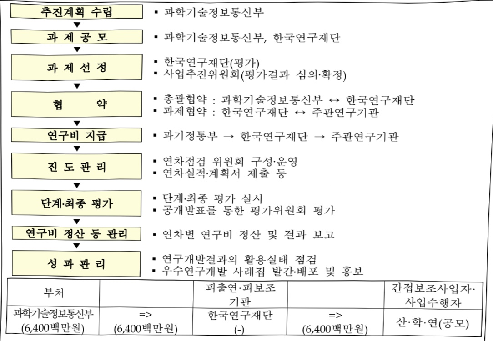

# 민관협력기반AI휴머노이드원천기술고도화(R&D)

**해당 페이지**: PDF 1051 ~ 1055 쪽 해당

**부처**: 과학기술정보통신부
**분야**: 과학기술
**회계유형**: 일반회계
**2026 확정예산**: 6400.0 백만원
**전년대비 증감률**: None%
**AI 도메인**: LLM/언어모델

---

## □ 기능별(내역사업별) 예산 내역

(단위: 백만원)

<table border=1 style='margin: auto; word-wrap: break-word;'><tr><td rowspan="2"></td><td colspan="5">2024</td><td colspan="5">2025</td><td rowspan="2">2026 예산</td></tr><tr><td style='text-align: center; word-wrap: break-word;'>예산액(추경)</td><td style='text-align: center; word-wrap: break-word;'>예산현액</td><td style='text-align: center; word-wrap: break-word;'>집행액</td><td style='text-align: center; word-wrap: break-word;'>이월액</td><td style='text-align: center; word-wrap: break-word;'>불용액</td><td style='text-align: center; word-wrap: break-word;'>예산액(추경)</td><td style='text-align: center; word-wrap: break-word;'>예산현액</td><td style='text-align: center; word-wrap: break-word;'>집행액</td><td style='text-align: center; word-wrap: break-word;'>이월액</td><td style='text-align: center; word-wrap: break-word;'>불용액</td></tr><tr><td style='text-align: center; word-wrap: break-word;'>○ 기능별 분류(합계)</td><td style='text-align: center; word-wrap: break-word;'>-</td><td style='text-align: center; word-wrap: break-word;'>-</td><td style='text-align: center; word-wrap: break-word;'>-</td><td style='text-align: center; word-wrap: break-word;'>-</td><td style='text-align: center; word-wrap: break-word;'>-</td><td style='text-align: center; word-wrap: break-word;'>-</td><td style='text-align: center; word-wrap: break-word;'>-</td><td style='text-align: center; word-wrap: break-word;'>-</td><td style='text-align: center; word-wrap: break-word;'>-</td><td style='text-align: center; word-wrap: break-word;'>-</td><td style='text-align: center; word-wrap: break-word;'>6,400</td></tr><tr><td style='text-align: center; word-wrap: break-word;'>• 민관협력 기반 AI 휴가소의드 원칙기술 고도화(R&amp;D)</td><td style='text-align: center; word-wrap: break-word;'>-</td><td style='text-align: center; word-wrap: break-word;'>-</td><td style='text-align: center; word-wrap: break-word;'>-</td><td style='text-align: center; word-wrap: break-word;'>-</td><td style='text-align: center; word-wrap: break-word;'>-</td><td style='text-align: center; word-wrap: break-word;'>-</td><td style='text-align: center; word-wrap: break-word;'>-</td><td style='text-align: center; word-wrap: break-word;'>-</td><td style='text-align: center; word-wrap: break-word;'>-</td><td style='text-align: center; word-wrap: break-word;'>-</td><td style='text-align: center; word-wrap: break-word;'>6,400</td></tr></table>

### 나. 사업설명자료

## 1 ) 사업목적·내용

- 민관 협력 기반 체화 AI 휴머노이드 핵심 원천기술 패키지(SW, HW 등) 개발 및 현장 실증

- 일상 환경 및 산업 현장에서 복합적·연속적으로 수행되는 작업을 대상으로, 각 세부 단계별 필요한 동작과 힘을 자율적으로 생성·추론할 수 있는 VHLA(시각·촉각·언어·행동) 모델 개발

## 2 ) 사업개요

## □ 사업근거 및 추진경위

① 법령상 근거 및 조항 적시

- 국가전략기술 육성에 관한 특별법 제11조(국가전략기술 연구개발사업의 지정 및 추진 등)

제11조(국가전략기술 연구개발사업의 지정 및 추진 등) ① 과학기술정보통신부장관은 기본계획 및 시행계획의 효율적 추진을 위하여 국가연구개발사업 중에서 다음 각 호의 사항을 고려하여 국가전략기술 연구개발사업(이하 “전략연구사업”이라 한다)을 지정할 수 있다.

② 중앙행정기관의 장은 전략연구사업의 추진에 필요한 재원을 우선적으로 확보하기 위하여 노력하여야 한다. ③ 중앙행정기관의 장은 「과학기술기본법」 제12조의2제1항에 따라 국가연구개발사업의 투자우선순위에 대한 의견을 제출하는 경우에는 전략연구사업으로 추진하는 사업이 우선적으로 반영될 수 있도록 노력하여야 한다.

- 과학기술기본법 제16조의5(성장동력의 발굴, 육성)

제16조의5(성장동력의 발굴·육성) ① 정부는 과학기술에 기반을 둔 성장동력을 발굴·육성하기 위하여 필요한 시책을 세우고 추진하여야 한다.

---

- 기초연구진흥 및 기술개발지원에 관한 법률 제14조(특정연구개발사업의 추진)

제14조(특정연구개발사업의 추진) ① 과학기술정보통신부장관은 기초연구의 성과 등을 바탕으로 하여 국가 미래 유망기술과 융합기술을 중점적으로 개발하기 위한 연구개발사업(이하 “특정연구개발사업”이라 한다)에 대하여 계획을 수립하고, 연도별로 연구과제를 선정하여 이를 다음 각 호의 기관 또는 단체와 협약을 맺어 연구하게 할 수 있다. 이 경우 제2호의 기관 중 대표권이 없는 기관에 대하여는 그 기관이 속한 법인의 대표자와 협약할 수 있다.

- 국정과제 (28. 세계를 선도할 넥스트(NEXT) 전략기술 육성)

1. 민관협업 기반 미래전략기술 집중 육성

- 국가전략기술의 미래 분야를 육성하고, 세계를 주도할 첨단과학기술 확보를 위해 초격차 원천기술개발에 주력

② 추진경위

- AI 휴머노이드 원천기술 개발 과제 기획('24.11~'25.4)

- 국가첨단전략기술 지정 등에 관한 고시('25.5) ▶ “로봇” 분야 신규 지정

주요내용

① 사업규모

- 총사업비 : 해당없음

- 사업기간 : '26 ~ '30(5년)

- 최근 5년 간 투입된 사업비(예산액기준, 추경편성한 연도에는 추경포함)

<table border=1 style='margin: auto; word-wrap: break-word;'><tr><td style='text-align: center; word-wrap: break-word;'>$ \underline{\text{연도}} $</td><td style='text-align: center; word-wrap: break-word;'>2022</td><td style='text-align: center; word-wrap: break-word;'>2023</td><td style='text-align: center; word-wrap: break-word;'>2024</td><td style='text-align: center; word-wrap: break-word;'>2025</td><td style='text-align: center; word-wrap: break-word;'>2026</td></tr><tr><td style='text-align: center; word-wrap: break-word;'>$ \underline{\text{사업비}} $</td><td style='text-align: center; word-wrap: break-word;'>-</td><td style='text-align: center; word-wrap: break-word;'>-</td><td style='text-align: center; word-wrap: break-word;'>-</td><td style='text-align: center; word-wrap: break-word;'>-</td><td style='text-align: center; word-wrap: break-word;'>6,400</td></tr></table>

② 사업추진체계

- 사업시행방법 : 출연

- 사업시행주체 : 한국연구재단

- 사업 수혜자 : 대학, 출연연, 기업 등

- 보조, 융자, 출연, 출자 등의 경우 보조·융자 등 지원 비율 및 법적근거

<table border=1 style='margin: auto; word-wrap: break-word;'><tr><td style='text-align: center; word-wrap: break-word;'>내역사업명</td><td style='text-align: center; word-wrap: break-word;'>구분</td><td style='text-align: center; word-wrap: break-word;'>피보조·피출연 등 기관명</td><td style='text-align: center; word-wrap: break-word;'>지원 금액 (2026예산)</td><td style='text-align: center; word-wrap: break-word;'>지원 비율(%)</td><td style='text-align: center; word-wrap: break-word;'>보조율 법적근거 (해당 조항)</td></tr><tr><td style='text-align: center; word-wrap: break-word;'>민관협력 기반 AI 휴마노이드 원칙기술 고도화</td><td style='text-align: center; word-wrap: break-word;'>출연</td><td style='text-align: center; word-wrap: break-word;'>한국연구 재단</td><td style='text-align: center; word-wrap: break-word;'>6,400</td><td style='text-align: center; word-wrap: break-word;'>100</td><td style='text-align: center; word-wrap: break-word;'>기초연구진흥 및 기술개발지원에 관한 법률 제14조</td></tr></table>

---

## 3 ) 2026년도 예산 산출 근거

① 민관협력 기반 AI 휴머노이드 원천기술 고도화 : (2025) - → (2026 예산안) 6,400백만원

- (요구) 전신 감각과 자율적 의사결정을 통해, 비정형화된 환경에서 장시간 동안 복잡·정교한 작업을 수행할 수 있는 '체화 AI 휴머노이드' 개발 및 실증을 위한 연구비 6,400백만원 요구

- (산출) (신규) 1개 × 8,534백만원 × 9/12개월 = 6,400백만원

ㅇ 2025년도 본예산 및 2026년도 예산안 산출 세부내역 비교

<table border=1 style='margin: auto; word-wrap: break-word;'><tr><td colspan="2">&#x27;25년 예산</td><td colspan="2">&#x27;26년 예산</td></tr><tr><td style='text-align: center; word-wrap: break-word;'>예산</td><td style='text-align: center; word-wrap: break-word;'>산출내역</td><td style='text-align: center; word-wrap: break-word;'>예산</td><td style='text-align: center; word-wrap: break-word;'>산출내역</td></tr><tr><td style='text-align: center; word-wrap: break-word;'>-</td><td style='text-align: center; word-wrap: break-word;'>-</td><td style='text-align: center; word-wrap: break-word;'>6,400</td><td style='text-align: center; word-wrap: break-word;'>○ 연구개발활동비등(360-05): 6,400백만원
• (산출) (신규) 1개 × 8,534백만원 × 9/12개월 = 6,400백만원</td></tr></table>

## 4 ) 사업효과

## ☐ 사업영향,산출물 성과지표 등

①2022~2026년도 성과계획서 상 성과지표 및 최근 5년간 성과 달성도

<table border=1 style='margin: auto; word-wrap: break-word;'><tr><td style='text-align: center; word-wrap: break-word;'>성과지표</td><td style='text-align: center; word-wrap: break-word;'>구분</td><td style='text-align: center; word-wrap: break-word;'>&#x27;22</td><td style='text-align: center; word-wrap: break-word;'>&#x27;23</td><td style='text-align: center; word-wrap: break-word;'>&#x27;24</td><td style='text-align: center; word-wrap: break-word;'>&#x27;25</td><td style='text-align: center; word-wrap: break-word;'>&#x27;26</td><td style='text-align: center; word-wrap: break-word;'>&#x27;26 목표치산출근거</td><td style='text-align: center; word-wrap: break-word;'>측정산식(또는 측정방법)</td><td style='text-align: center; word-wrap: break-word;'>자료수집방법(또는 자료출처)</td></tr><tr><td rowspan="3">연속작업가능일 수(일)</td><td style='text-align: center; word-wrap: break-word;'>목표</td><td style='text-align: center; word-wrap: break-word;'>-</td><td style='text-align: center; word-wrap: break-word;'>-</td><td style='text-align: center; word-wrap: break-word;'>-</td><td style='text-align: center; word-wrap: break-word;'>-</td><td style='text-align: center; word-wrap: break-word;'>-</td><td rowspan="3">&#x27;26년도 산규지표로 해외 기술 수준 대비 국내 기술 수준 고려 &#x27;30년도 기준 30일 연속작업 목표 설정(해외사례 전무)</td><td rowspan="3">8시간/일 기준, 사람미개입, 다수로봇교체 활용 및 충전 가능 조건</td><td rowspan="3">외부 공인 기관 입회 실증</td></tr><tr><td style='text-align: center; word-wrap: break-word;'>실적</td><td style='text-align: center; word-wrap: break-word;'>-</td><td style='text-align: center; word-wrap: break-word;'>-</td><td style='text-align: center; word-wrap: break-word;'>-</td><td style='text-align: center; word-wrap: break-word;'>-</td><td style='text-align: center; word-wrap: break-word;'>-</td></tr><tr><td style='text-align: center; word-wrap: break-word;'>달성도</td><td style='text-align: center; word-wrap: break-word;'>-</td><td style='text-align: center; word-wrap: break-word;'>-</td><td style='text-align: center; word-wrap: break-word;'>-</td><td style='text-align: center; word-wrap: break-word;'>-</td><td style='text-align: center; word-wrap: break-word;'>-</td></tr><tr><td rowspan="3">완전자율 수행 작업 종류(종)</td><td style='text-align: center; word-wrap: break-word;'>목표</td><td style='text-align: center; word-wrap: break-word;'>-</td><td style='text-align: center; word-wrap: break-word;'>-</td><td style='text-align: center; word-wrap: break-word;'>-</td><td style='text-align: center; word-wrap: break-word;'>-</td><td style='text-align: center; word-wrap: break-word;'>-</td><td rowspan="3">&#x27;26년도 산규지표로 해외 기술 수준 대비 국내 기술 수준 고려(상이한 환경 대상 다중 작업 완전자율 작업 해외사례 전무)&#x27;30년도 기준 3종이 상 달성 목표 설정</td><td rowspan="3">환경 조건 상이 일상공간 및 산업현장 포함</td><td rowspan="3">외부 공인 기관 입회 실증</td></tr><tr><td style='text-align: center; word-wrap: break-word;'>실적</td><td style='text-align: center; word-wrap: break-word;'>-</td><td style='text-align: center; word-wrap: break-word;'>-</td><td style='text-align: center; word-wrap: break-word;'>-</td><td style='text-align: center; word-wrap: break-word;'>-</td><td style='text-align: center; word-wrap: break-word;'>-</td></tr><tr><td style='text-align: center; word-wrap: break-word;'>달성도</td><td style='text-align: center; word-wrap: break-word;'>-</td><td style='text-align: center; word-wrap: break-word;'>-</td><td style='text-align: center; word-wrap: break-word;'>-</td><td style='text-align: center; word-wrap: break-word;'>-</td><td style='text-align: center; word-wrap: break-word;'>-</td></tr><tr><td rowspan="3">인간 대비 작업 완료율(%)</td><td style='text-align: center; word-wrap: break-word;'>목표</td><td style='text-align: center; word-wrap: break-word;'>-</td><td style='text-align: center; word-wrap: break-word;'>-</td><td style='text-align: center; word-wrap: break-word;'>-</td><td style='text-align: center; word-wrap: break-word;'>-</td><td style='text-align: center; word-wrap: break-word;'>-</td><td rowspan="3">&#x27;26년도 산규지표로 해외 기술 수준 대비 국내 기술 수준 고려(해외사례 민보고)&#x27;30년도 기준 100% 달성 목표 설정</td><td rowspan="3">동일 작업 대상 동일 환경·시간 조건 내 수행</td><td rowspan="3">외부 공인 기관 입회 실증</td></tr><tr><td style='text-align: center; word-wrap: break-word;'>실적</td><td style='text-align: center; word-wrap: break-word;'>-</td><td style='text-align: center; word-wrap: break-word;'>-</td><td style='text-align: center; word-wrap: break-word;'>-</td><td style='text-align: center; word-wrap: break-word;'>-</td><td style='text-align: center; word-wrap: break-word;'>-</td></tr><tr><td style='text-align: center; word-wrap: break-word;'>달성도</td><td style='text-align: center; word-wrap: break-word;'>-</td><td style='text-align: center; word-wrap: break-word;'>-</td><td style='text-align: center; word-wrap: break-word;'>-</td><td style='text-align: center; word-wrap: break-word;'>-</td><td style='text-align: center; word-wrap: break-word;'>-</td></tr></table>

※연구성과평가법에 따라 향후 전략계획서 수립 및 과학기술혁신본부 점검 후, 성과지표 및 목표치 최종 확정 예정

② 성과지표 이외의 연도별 사업추진 경과 및 실적 : 해당없음

③ 향후(2026년도 이후) 기대효과 : 민관 협력 기반 HW, SW, AI 등 패키지 기술개발을 통해 초기 경쟁 단계인 AI 휴머노이드 산업의 글로벌 기술 경쟁력 확보

---

5) 타당성조사 및 예비타당성조사 시행여부 및 결과 요지 : 해당 없음

6) 총사업비 대상사업 여부 및 내역 : 해당 없음

7) 사업 집행절차

8) 각종 평가 : 해당 없음

다.최근 4년간 결산내역 : 해당없음

---

<table border=1 style='margin: auto; word-wrap: break-word;'><tr><td style='text-align: center; word-wrap: break-word;'>사 업 명</td></tr><tr><td style='text-align: center; word-wrap: break-word;'>(18) 바이오·의료기술개발(R&amp;D) (1138-401)</td></tr></table>

## □ 사업 코드 정보

<table border=1 style='margin: auto; word-wrap: break-word;'><tr><td style='text-align: center; word-wrap: break-word;'>구분</td><td style='text-align: center; word-wrap: break-word;'>회계</td><td style='text-align: center; word-wrap: break-word;'>소관</td><td style='text-align: center; word-wrap: break-word;'>실국(기관)</td><td style='text-align: center; word-wrap: break-word;'>계정</td><td style='text-align: center; word-wrap: break-word;'>분야</td><td style='text-align: center; word-wrap: break-word;'>부문</td></tr><tr><td style='text-align: center; word-wrap: break-word;'>코드</td><td rowspan="2">일반회계</td><td rowspan="2">과학기술정보통신부</td><td rowspan="2">연구개발정책실미래전략기술정책관</td><td rowspan="2"></td><td style='text-align: center; word-wrap: break-word;'>150</td><td style='text-align: center; word-wrap: break-word;'>155</td></tr><tr><td style='text-align: center; word-wrap: break-word;'>명칭</td><td style='text-align: center; word-wrap: break-word;'>과학기술</td><td style='text-align: center; word-wrap: break-word;'>과학기술연구개발</td></tr></table>

<table border=1 style='margin: auto; word-wrap: break-word;'><tr><td style='text-align: center; word-wrap: break-word;'>구분</td><td style='text-align: center; word-wrap: break-word;'>프로그램</td><td style='text-align: center; word-wrap: break-word;'>단위사업</td><td style='text-align: center; word-wrap: break-word;'>세부사업</td></tr><tr><td style='text-align: center; word-wrap: break-word;'>코드</td><td style='text-align: center; word-wrap: break-word;'>1100</td><td style='text-align: center; word-wrap: break-word;'>1138</td><td style='text-align: center; word-wrap: break-word;'>401</td></tr><tr><td style='text-align: center; word-wrap: break-word;'>명칭</td><td style='text-align: center; word-wrap: break-word;'>미래유망원천기술개발</td><td style='text-align: center; word-wrap: break-word;'>바이오·의료기술개발</td><td style='text-align: center; word-wrap: break-word;'>바이오·의료기술개발</td></tr></table>

□ 사업 성격

<table border=1 style='margin: auto; word-wrap: break-word;'><tr><td rowspan="2">신규</td><td rowspan="2">계속</td><td rowspan="2">완료</td><td rowspan="2">예비타당성 실시여부</td><td rowspan="2">총사업비 관리대상</td><td rowspan="2">총액계상 예산사업</td><td style='text-align: center; word-wrap: break-word;'>사업소관 변경정보</td></tr><tr><td style='text-align: center; word-wrap: break-word;'>2025예산 시 소관</td></tr><tr><td style='text-align: center; word-wrap: break-word;'></td><td style='text-align: center; word-wrap: break-word;'>O</td><td style='text-align: center; word-wrap: break-word;'></td><td style='text-align: center; word-wrap: break-word;'></td><td style='text-align: center; word-wrap: break-word;'></td><td style='text-align: center; word-wrap: break-word;'></td><td style='text-align: center; word-wrap: break-word;'></td></tr></table>

□ 사업 지원 형태 및 지원을

<table border=1 style='margin: auto; word-wrap: break-word;'><tr><td style='text-align: center; word-wrap: break-word;'>직접</td><td style='text-align: center; word-wrap: break-word;'>출자</td><td style='text-align: center; word-wrap: break-word;'>출연</td><td style='text-align: center; word-wrap: break-word;'>보조</td><td style='text-align: center; word-wrap: break-word;'>융자</td><td style='text-align: center; word-wrap: break-word;'>국고보조율(%)</td><td style='text-align: center; word-wrap: break-word;'>융자율(%)</td></tr><tr><td style='text-align: center; word-wrap: break-word;'></td><td style='text-align: center; word-wrap: break-word;'></td><td style='text-align: center; word-wrap: break-word;'>O</td><td style='text-align: center; word-wrap: break-word;'></td><td style='text-align: center; word-wrap: break-word;'></td><td style='text-align: center; word-wrap: break-word;'></td><td style='text-align: center; word-wrap: break-word;'></td></tr></table>

□ 사업 소관부처 및 시행주체

<table border=1 style='margin: auto; word-wrap: break-word;'><tr><td style='text-align: center; word-wrap: break-word;'>사업명</td><td colspan="2">구분</td></tr><tr><td rowspan="3">바이오·의료기술개발(R&amp;D)</td><td rowspan="2">소관부처</td><td style='text-align: center; word-wrap: break-word;'>연구개발정책실미래전략기술정책관</td></tr><tr><td style='text-align: center; word-wrap: break-word;'>첨단바이오기술과</td></tr><tr><td style='text-align: center; word-wrap: break-word;'>사업시행주체</td><td style='text-align: center; word-wrap: break-word;'>한국연구재단</td></tr></table>

---

### 원본 PDF 크롭 이미지

