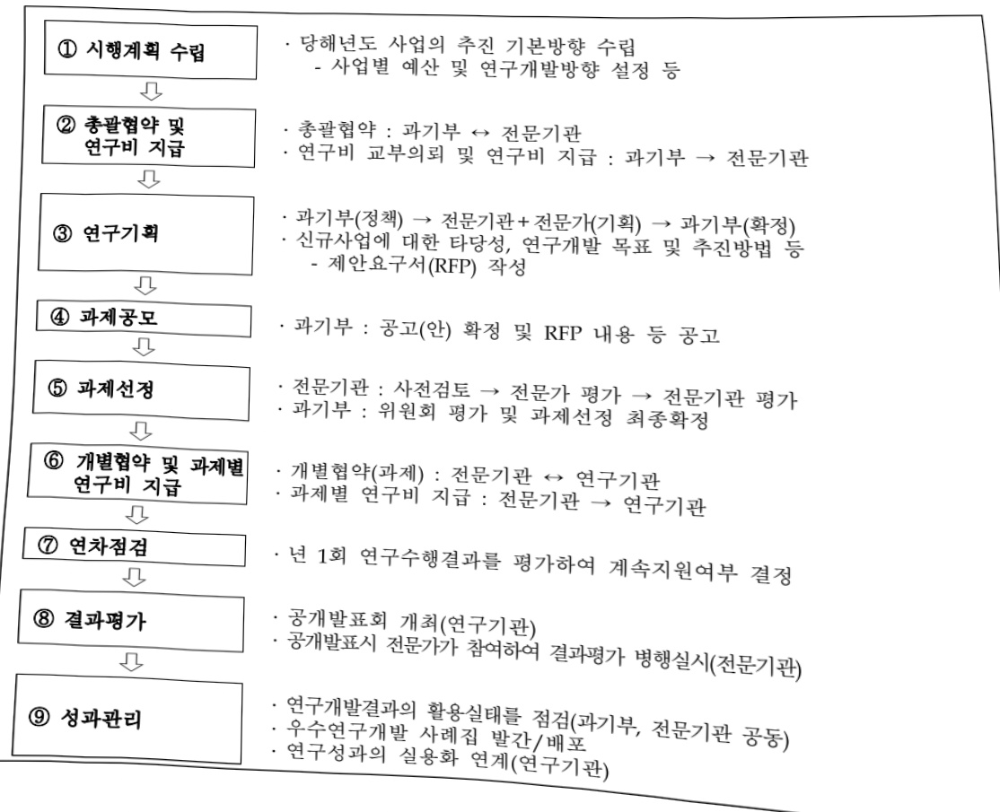

# 바이오.의료기술개발(R&D)

**해당 페이지**: PDF 1056 ~ 1066 쪽 해당

**부처**: 과학기술정보통신부
**분야**: 과학기술
**회계유형**: 일반회계
**2026 확정예산**: 442976.0 백만원
**전년대비 증감률**: 22.7%
**AI 도메인**: 교육/인재

---

<table border=1 style='margin: auto; word-wrap: break-word;'><tr><td style='text-align: center; word-wrap: break-word;'>사 업 명</td></tr><tr><td style='text-align: center; word-wrap: break-word;'>(18) 바이오·의료기술개발(R&amp;D) (1138-401)</td></tr></table>

## □ 사업 코드 정보

<table border=1 style='margin: auto; word-wrap: break-word;'><tr><td style='text-align: center; word-wrap: break-word;'>구분</td><td style='text-align: center; word-wrap: break-word;'>회계</td><td style='text-align: center; word-wrap: break-word;'>소관</td><td style='text-align: center; word-wrap: break-word;'>실국(기관)</td><td style='text-align: center; word-wrap: break-word;'>계정</td><td style='text-align: center; word-wrap: break-word;'>분야</td><td style='text-align: center; word-wrap: break-word;'>부문</td></tr><tr><td style='text-align: center; word-wrap: break-word;'>코드</td><td rowspan="2">일반회계</td><td rowspan="2">과학기술정보통신부</td><td rowspan="2">연구개발정책실미래전략기술정책관</td><td rowspan="2"></td><td style='text-align: center; word-wrap: break-word;'>150</td><td style='text-align: center; word-wrap: break-word;'>155</td></tr><tr><td style='text-align: center; word-wrap: break-word;'>명칭</td><td style='text-align: center; word-wrap: break-word;'>과학기술</td><td style='text-align: center; word-wrap: break-word;'>과학기술연구개발</td></tr></table>

<table border=1 style='margin: auto; word-wrap: break-word;'><tr><td style='text-align: center; word-wrap: break-word;'>구분</td><td style='text-align: center; word-wrap: break-word;'>프로그램</td><td style='text-align: center; word-wrap: break-word;'>단위사업</td><td style='text-align: center; word-wrap: break-word;'>세부사업</td></tr><tr><td style='text-align: center; word-wrap: break-word;'>코드</td><td style='text-align: center; word-wrap: break-word;'>1100</td><td style='text-align: center; word-wrap: break-word;'>1138</td><td style='text-align: center; word-wrap: break-word;'>401</td></tr><tr><td style='text-align: center; word-wrap: break-word;'>명칭</td><td style='text-align: center; word-wrap: break-word;'>미래유망원천기술개발</td><td style='text-align: center; word-wrap: break-word;'>바이오·의료기술개발</td><td style='text-align: center; word-wrap: break-word;'>바이오·의료기술개발</td></tr></table>

□ 사업 성격

<table border=1 style='margin: auto; word-wrap: break-word;'><tr><td rowspan="2">신규</td><td rowspan="2">계속</td><td rowspan="2">완료</td><td rowspan="2">예비타당성 실시여부</td><td rowspan="2">총사업비 관리대상</td><td rowspan="2">총액계상 예산사업</td><td style='text-align: center; word-wrap: break-word;'>사업소관 변경정보</td></tr><tr><td style='text-align: center; word-wrap: break-word;'>2025예산 시 소관</td></tr><tr><td style='text-align: center; word-wrap: break-word;'></td><td style='text-align: center; word-wrap: break-word;'>O</td><td style='text-align: center; word-wrap: break-word;'></td><td style='text-align: center; word-wrap: break-word;'></td><td style='text-align: center; word-wrap: break-word;'></td><td style='text-align: center; word-wrap: break-word;'></td><td style='text-align: center; word-wrap: break-word;'></td></tr></table>

□ 사업 지원 형태 및 지원을

<table border=1 style='margin: auto; word-wrap: break-word;'><tr><td style='text-align: center; word-wrap: break-word;'>직접</td><td style='text-align: center; word-wrap: break-word;'>출자</td><td style='text-align: center; word-wrap: break-word;'>출연</td><td style='text-align: center; word-wrap: break-word;'>보조</td><td style='text-align: center; word-wrap: break-word;'>융자</td><td style='text-align: center; word-wrap: break-word;'>국고보조율(%)</td><td style='text-align: center; word-wrap: break-word;'>융자율(%)</td></tr><tr><td style='text-align: center; word-wrap: break-word;'></td><td style='text-align: center; word-wrap: break-word;'></td><td style='text-align: center; word-wrap: break-word;'>O</td><td style='text-align: center; word-wrap: break-word;'></td><td style='text-align: center; word-wrap: break-word;'></td><td style='text-align: center; word-wrap: break-word;'></td><td style='text-align: center; word-wrap: break-word;'></td></tr></table>

□ 사업 소관부처 및 시행주체

<table border=1 style='margin: auto; word-wrap: break-word;'><tr><td style='text-align: center; word-wrap: break-word;'>사업명</td><td colspan="2">구분</td></tr><tr><td rowspan="3">바이오·의료기술개발(R&amp;D)</td><td rowspan="2">소관부처</td><td style='text-align: center; word-wrap: break-word;'>연구개발정책실미래전략기술정책관</td></tr><tr><td style='text-align: center; word-wrap: break-word;'>첨단바이오기술과</td></tr><tr><td style='text-align: center; word-wrap: break-word;'>사업시행주체</td><td style='text-align: center; word-wrap: break-word;'>한국연구재단</td></tr></table>

---

### 가.예산 총괄표

(단위: 백만원, %)

<table border=1 style='margin: auto; word-wrap: break-word;'><tr><td rowspan="2">2024년 열산</td><td colspan="2">2025년 예산</td><td colspan="2">2026년 예산</td><td rowspan="2">중감 (B-A)</td><td rowspan="2">(B-A)/A</td></tr><tr><td style='text-align: center; word-wrap: break-word;'>본예산</td><td style='text-align: center; word-wrap: break-word;'>추경(A)</td><td style='text-align: center; word-wrap: break-word;'>요구안</td><td style='text-align: center; word-wrap: break-word;'>본예산(B)</td></tr><tr><td style='text-align: center; word-wrap: break-word;'>바이오·의료기술 개발(R&amp;D)</td><td style='text-align: center; word-wrap: break-word;'>304,292</td><td style='text-align: center; word-wrap: break-word;'>361,072</td><td style='text-align: center; word-wrap: break-word;'>361,072</td><td style='text-align: center; word-wrap: break-word;'>434,276</td><td style='text-align: center; word-wrap: break-word;'>442,976</td><td style='text-align: center; word-wrap: break-word;'>81,904</td></tr></table>

□ 기능별(내역사업별) 예산 내역

(단위:백만원)

<table border=1 style='margin: auto; word-wrap: break-word;'><tr><td rowspan="2"></td><td colspan="5">2024</td><td colspan="5">2025</td><td rowspan="2">2026예산</td></tr><tr><td style='text-align: center; word-wrap: break-word;'>예산액(추정)</td><td style='text-align: center; word-wrap: break-word;'>예산현액</td><td style='text-align: center; word-wrap: break-word;'>집행액</td><td style='text-align: center; word-wrap: break-word;'>이월액</td><td style='text-align: center; word-wrap: break-word;'>불용액</td><td style='text-align: center; word-wrap: break-word;'>예산액(추정)</td><td style='text-align: center; word-wrap: break-word;'>예산현액</td><td style='text-align: center; word-wrap: break-word;'>집행액</td><td style='text-align: center; word-wrap: break-word;'>이월액</td><td style='text-align: center; word-wrap: break-word;'>불용액</td></tr><tr><td style='text-align: center; word-wrap: break-word;'>○ 기능별 분류(합계)</td><td style='text-align: center; word-wrap: break-word;'>304,292</td><td style='text-align: center; word-wrap: break-word;'>304,292</td><td style='text-align: center; word-wrap: break-word;'>304,292</td><td style='text-align: center; word-wrap: break-word;'>-</td><td style='text-align: center; word-wrap: break-word;'>-</td><td style='text-align: center; word-wrap: break-word;'>361,072</td><td style='text-align: center; word-wrap: break-word;'>361,072</td><td style='text-align: center; word-wrap: break-word;'>361,072</td><td style='text-align: center; word-wrap: break-word;'>-</td><td style='text-align: center; word-wrap: break-word;'>-</td><td style='text-align: center; word-wrap: break-word;'>442,976</td></tr><tr><td style='text-align: center; word-wrap: break-word;'>①차세대바이오</td><td style='text-align: center; word-wrap: break-word;'>90,880</td><td style='text-align: center; word-wrap: break-word;'>90,880</td><td style='text-align: center; word-wrap: break-word;'>90,880</td><td style='text-align: center; word-wrap: break-word;'>-</td><td style='text-align: center; word-wrap: break-word;'>-</td><td style='text-align: center; word-wrap: break-word;'>104,508</td><td style='text-align: center; word-wrap: break-word;'>104,508</td><td style='text-align: center; word-wrap: break-word;'>104,508</td><td style='text-align: center; word-wrap: break-word;'>-</td><td style='text-align: center; word-wrap: break-word;'>-</td><td style='text-align: center; word-wrap: break-word;'>86,094</td></tr><tr><td style='text-align: center; word-wrap: break-word;'>②인공지능바이오</td><td style='text-align: center; word-wrap: break-word;'>-</td><td style='text-align: center; word-wrap: break-word;'>-</td><td style='text-align: center; word-wrap: break-word;'>-</td><td style='text-align: center; word-wrap: break-word;'>-</td><td style='text-align: center; word-wrap: break-word;'>-</td><td style='text-align: center; word-wrap: break-word;'>-</td><td style='text-align: center; word-wrap: break-word;'>-</td><td style='text-align: center; word-wrap: break-word;'>-</td><td style='text-align: center; word-wrap: break-word;'>-</td><td style='text-align: center; word-wrap: break-word;'>-</td><td style='text-align: center; word-wrap: break-word;'>60,923</td></tr><tr><td style='text-align: center; word-wrap: break-word;'>③뇌과학선도융합기술개발</td><td style='text-align: center; word-wrap: break-word;'>17,700</td><td style='text-align: center; word-wrap: break-word;'>17,700</td><td style='text-align: center; word-wrap: break-word;'>17,700</td><td style='text-align: center; word-wrap: break-word;'>-</td><td style='text-align: center; word-wrap: break-word;'>-</td><td style='text-align: center; word-wrap: break-word;'>31,880</td><td style='text-align: center; word-wrap: break-word;'>31,880</td><td style='text-align: center; word-wrap: break-word;'>31,880</td><td style='text-align: center; word-wrap: break-word;'>-</td><td style='text-align: center; word-wrap: break-word;'>-</td><td style='text-align: center; word-wrap: break-word;'>46,243</td></tr><tr><td style='text-align: center; word-wrap: break-word;'>④전자약기술개발</td><td style='text-align: center; word-wrap: break-word;'>3,600</td><td style='text-align: center; word-wrap: break-word;'>3,600</td><td style='text-align: center; word-wrap: break-word;'>3,600</td><td style='text-align: center; word-wrap: break-word;'>-</td><td style='text-align: center; word-wrap: break-word;'>-</td><td style='text-align: center; word-wrap: break-word;'>1,309</td><td style='text-align: center; word-wrap: break-word;'>1,309</td><td style='text-align: center; word-wrap: break-word;'>1,309</td><td style='text-align: center; word-wrap: break-word;'>-</td><td style='text-align: center; word-wrap: break-word;'>-</td><td style='text-align: center; word-wrap: break-word;'>294</td></tr><tr><td style='text-align: center; word-wrap: break-word;'>⑤미래의료혁신대응기술개발</td><td style='text-align: center; word-wrap: break-word;'>44,784</td><td style='text-align: center; word-wrap: break-word;'>44,784</td><td style='text-align: center; word-wrap: break-word;'>44,784</td><td style='text-align: center; word-wrap: break-word;'>-</td><td style='text-align: center; word-wrap: break-word;'>-</td><td style='text-align: center; word-wrap: break-word;'>60,704</td><td style='text-align: center; word-wrap: break-word;'>60,704</td><td style='text-align: center; word-wrap: break-word;'>60,704</td><td style='text-align: center; word-wrap: break-word;'>-</td><td style='text-align: center; word-wrap: break-word;'>-</td><td style='text-align: center; word-wrap: break-word;'>36,671</td></tr><tr><td style='text-align: center; word-wrap: break-word;'>⑥신약개발</td><td style='text-align: center; word-wrap: break-word;'>11,050</td><td style='text-align: center; word-wrap: break-word;'>11,050</td><td style='text-align: center; word-wrap: break-word;'>11,050</td><td style='text-align: center; word-wrap: break-word;'>-</td><td style='text-align: center; word-wrap: break-word;'>-</td><td style='text-align: center; word-wrap: break-word;'>12,753</td><td style='text-align: center; word-wrap: break-word;'>12,753</td><td style='text-align: center; word-wrap: break-word;'>12,753</td><td style='text-align: center; word-wrap: break-word;'>-</td><td style='text-align: center; word-wrap: break-word;'>-</td><td style='text-align: center; word-wrap: break-word;'>11,090</td></tr><tr><td style='text-align: center; word-wrap: break-word;'>⑦첨단바이오의약품비임상유효성평가기술및제품개발</td><td style='text-align: center; word-wrap: break-word;'>-</td><td style='text-align: center; word-wrap: break-word;'>-</td><td style='text-align: center; word-wrap: break-word;'>-</td><td style='text-align: center; word-wrap: break-word;'>-</td><td style='text-align: center; word-wrap: break-word;'>-</td><td style='text-align: center; word-wrap: break-word;'>1,575</td><td style='text-align: center; word-wrap: break-word;'>1,575</td><td style='text-align: center; word-wrap: break-word;'>1,575</td><td style='text-align: center; word-wrap: break-word;'>-</td><td style='text-align: center; word-wrap: break-word;'>-</td><td style='text-align: center; word-wrap: break-word;'>2,100</td></tr><tr><td style='text-align: center; word-wrap: break-word;'>⑧미래감염병기술개발</td><td style='text-align: center; word-wrap: break-word;'>27,820</td><td style='text-align: center; word-wrap: break-word;'>27,820</td><td style='text-align: center; word-wrap: break-word;'>27,820</td><td style='text-align: center; word-wrap: break-word;'>-</td><td style='text-align: center; word-wrap: break-word;'>-</td><td style='text-align: center; word-wrap: break-word;'>30,263</td><td style='text-align: center; word-wrap: break-word;'>30,263</td><td style='text-align: center; word-wrap: break-word;'>30,263</td><td style='text-align: center; word-wrap: break-word;'>-</td><td style='text-align: center; word-wrap: break-word;'>-</td><td style='text-align: center; word-wrap: break-word;'>33,810</td></tr><tr><td style='text-align: center; word-wrap: break-word;'>⑨감염병국가전임상시험지원체계구축(앱국가전임상시험지원체계구축)</td><td style='text-align: center; word-wrap: break-word;'>9,000</td><td style='text-align: center; word-wrap: break-word;'>9,000</td><td style='text-align: center; word-wrap: break-word;'>9,000</td><td style='text-align: center; word-wrap: break-word;'>-</td><td style='text-align: center; word-wrap: break-word;'>-</td><td style='text-align: center; word-wrap: break-word;'>9,000</td><td style='text-align: center; word-wrap: break-word;'>9,000</td><td style='text-align: center; word-wrap: break-word;'>9,000</td><td style='text-align: center; word-wrap: break-word;'>-</td><td style='text-align: center; word-wrap: break-word;'>-</td><td style='text-align: center; word-wrap: break-word;'>8,100</td></tr><tr><td style='text-align: center; word-wrap: break-word;'>⑩범부처방역연계R&amp;D고도화(대응분담)</td><td style='text-align: center; word-wrap: break-word;'>-</td><td style='text-align: center; word-wrap: break-word;'>-</td><td style='text-align: center; word-wrap: break-word;'>-</td><td style='text-align: center; word-wrap: break-word;'>-</td><td style='text-align: center; word-wrap: break-word;'>-</td><td style='text-align: center; word-wrap: break-word;'>1,006</td><td style='text-align: center; word-wrap: break-word;'>1,006</td><td style='text-align: center; word-wrap: break-word;'>1,006</td><td style='text-align: center; word-wrap: break-word;'>-</td><td style='text-align: center; word-wrap: break-word;'>-</td><td style='text-align: center; word-wrap: break-word;'>1,600</td></tr><tr><td style='text-align: center; word-wrap: break-word;'>⑪첨단GW바이오</td><td style='text-align: center; word-wrap: break-word;'>20,532</td><td style='text-align: center; word-wrap: break-word;'>20,532</td><td style='text-align: center; word-wrap: break-word;'>20,532</td><td style='text-align: center; word-wrap: break-word;'>-</td><td style='text-align: center; word-wrap: break-word;'>-</td><td style='text-align: center; word-wrap: break-word;'>25,439</td><td style='text-align: center; word-wrap: break-word;'>25,439</td><td style='text-align: center; word-wrap: break-word;'>25,439</td><td style='text-align: center; word-wrap: break-word;'>-</td><td style='text-align: center; word-wrap: break-word;'>-</td><td style='text-align: center; word-wrap: break-word;'>27,264</td></tr><tr><td style='text-align: center; word-wrap: break-word;'>⑫바이오혁신기반조성</td><td style='text-align: center; word-wrap: break-word;'>10,758</td><td style='text-align: center; word-wrap: break-word;'>10,758</td><td style='text-align: center; word-wrap: break-word;'>10,758</td><td style='text-align: center; word-wrap: break-word;'>-</td><td style='text-align: center; word-wrap: break-word;'>-</td><td style='text-align: center; word-wrap: break-word;'>15,269</td><td style='text-align: center; word-wrap: break-word;'>15,269</td><td style='text-align: center; word-wrap: break-word;'>15,269</td><td style='text-align: center; word-wrap: break-word;'>-</td><td style='text-align: center; word-wrap: break-word;'>-</td><td style='text-align: center; word-wrap: break-word;'>81,137</td></tr><tr><td style='text-align: center; word-wrap: break-word;'>⑬보스턴 코리아공동연구지원(앱디지털바이오육성)</td><td style='text-align: center; word-wrap: break-word;'>15,000</td><td style='text-align: center; word-wrap: break-word;'>15,000</td><td style='text-align: center; word-wrap: break-word;'>15,000</td><td style='text-align: center; word-wrap: break-word;'>-</td><td style='text-align: center; word-wrap: break-word;'>-</td><td style='text-align: center; word-wrap: break-word;'>26,033</td><td style='text-align: center; word-wrap: break-word;'>26,033</td><td style='text-align: center; word-wrap: break-word;'>26,033</td><td style='text-align: center; word-wrap: break-word;'>-</td><td style='text-align: center; word-wrap: break-word;'>-</td><td style='text-align: center; word-wrap: break-word;'>36,900</td></tr><tr><td style='text-align: center; word-wrap: break-word;'>⑭첨단바이오글로벌역량강화</td><td style='text-align: center; word-wrap: break-word;'>10,000</td><td style='text-align: center; word-wrap: break-word;'>10,000</td><td style='text-align: center; word-wrap: break-word;'>10,000[10,000]</td><td style='text-align: center; word-wrap: break-word;'></td><td style='text-align: center; word-wrap: break-word;'></td><td style='text-align: center; word-wrap: break-word;'>15,000</td><td style='text-align: center; word-wrap: break-word;'>15,000</td><td style='text-align: center; word-wrap: break-word;'>15,000</td><td style='text-align: center; word-wrap: break-word;'>-</td><td style='text-align: center; word-wrap: break-word;'>-</td><td style='text-align: center; word-wrap: break-word;'>10,750</td></tr><tr><td style='text-align: center; word-wrap: break-word;'>⑮AI데이터기반바이오선도기술개발</td><td style='text-align: center; word-wrap: break-word;'>14,373</td><td style='text-align: center; word-wrap: break-word;'>14,373</td><td style='text-align: center; word-wrap: break-word;'>14,373[14,373]</td><td style='text-align: center; word-wrap: break-word;'></td><td style='text-align: center; word-wrap: break-word;'></td><td style='text-align: center; word-wrap: break-word;'>14,373</td><td style='text-align: center; word-wrap: break-word;'>14,373</td><td style='text-align: center; word-wrap: break-word;'>14,373</td><td style='text-align: center; word-wrap: break-word;'>-</td><td style='text-align: center; word-wrap: break-word;'>-</td><td style='text-align: center; word-wrap: break-word;'>-</td></tr></table>

---

<table border=1 style='margin: auto; word-wrap: break-word;'><tr><td rowspan="2"></td><td colspan="5">2024</td><td colspan="5">2025</td><td rowspan="2">2026예산</td></tr><tr><td style='text-align: center; word-wrap: break-word;'>예산액(추경)</td><td style='text-align: center; word-wrap: break-word;'>예산현액</td><td style='text-align: center; word-wrap: break-word;'>집행액</td><td style='text-align: center; word-wrap: break-word;'>이월액</td><td style='text-align: center; word-wrap: break-word;'>불용액</td><td style='text-align: center; word-wrap: break-word;'>예산액(추경)</td><td style='text-align: center; word-wrap: break-word;'>예산현액</td><td style='text-align: center; word-wrap: break-word;'>집행액</td><td style='text-align: center; word-wrap: break-word;'>이월액</td><td style='text-align: center; word-wrap: break-word;'>불용액</td></tr><tr><td style='text-align: center; word-wrap: break-word;'>⑯백신허브기반구축</td><td style='text-align: center; word-wrap: break-word;'>7,000</td><td style='text-align: center; word-wrap: break-word;'>7,000</td><td style='text-align: center; word-wrap: break-word;'>7,000[7,000]</td><td style='text-align: center; word-wrap: break-word;'></td><td style='text-align: center; word-wrap: break-word;'></td><td style='text-align: center; word-wrap: break-word;'>1,728</td><td style='text-align: center; word-wrap: break-word;'>1,728</td><td style='text-align: center; word-wrap: break-word;'>1,728</td><td style='text-align: center; word-wrap: break-word;'>-</td><td style='text-align: center; word-wrap: break-word;'>-</td><td style='text-align: center; word-wrap: break-word;'>-</td></tr><tr><td style='text-align: center; word-wrap: break-word;'>⑰줄기세포ATLAS기반난치성질환치료기술개발</td><td style='text-align: center; word-wrap: break-word;'>5,100</td><td style='text-align: center; word-wrap: break-word;'>5,100</td><td style='text-align: center; word-wrap: break-word;'>5,100[5,100]</td><td style='text-align: center; word-wrap: break-word;'></td><td style='text-align: center; word-wrap: break-word;'></td><td style='text-align: center; word-wrap: break-word;'>5,100</td><td style='text-align: center; word-wrap: break-word;'>5,100</td><td style='text-align: center; word-wrap: break-word;'>5,100</td><td style='text-align: center; word-wrap: break-word;'>-</td><td style='text-align: center; word-wrap: break-word;'>-</td><td style='text-align: center; word-wrap: break-word;'>-</td></tr><tr><td style='text-align: center; word-wrap: break-word;'>⑱바이오융복합기술개발</td><td style='text-align: center; word-wrap: break-word;'>3,000</td><td style='text-align: center; word-wrap: break-word;'>3,000</td><td style='text-align: center; word-wrap: break-word;'>3,000[3,000]</td><td style='text-align: center; word-wrap: break-word;'></td><td style='text-align: center; word-wrap: break-word;'></td><td style='text-align: center; word-wrap: break-word;'>3,000</td><td style='text-align: center; word-wrap: break-word;'>3,000</td><td style='text-align: center; word-wrap: break-word;'>3,000</td><td style='text-align: center; word-wrap: break-word;'>-</td><td style='text-align: center; word-wrap: break-word;'>-</td><td style='text-align: center; word-wrap: break-word;'>-</td></tr><tr><td style='text-align: center; word-wrap: break-word;'>⑲뇌기능규명 및뇌질환극복연구</td><td style='text-align: center; word-wrap: break-word;'>13,695</td><td style='text-align: center; word-wrap: break-word;'>13,695</td><td style='text-align: center; word-wrap: break-word;'>13,695[13,695]</td><td style='text-align: center; word-wrap: break-word;'></td><td style='text-align: center; word-wrap: break-word;'></td><td style='text-align: center; word-wrap: break-word;'>2,132</td><td style='text-align: center; word-wrap: break-word;'>2,132</td><td style='text-align: center; word-wrap: break-word;'>2,132</td><td style='text-align: center; word-wrap: break-word;'>-</td><td style='text-align: center; word-wrap: break-word;'>-</td><td style='text-align: center; word-wrap: break-word;'>-</td></tr></table>

### 나. 사업설명자료

## 1 ) 사업목적·내용

°(바이오·의료기술개발) 신약, 줄기세포, 첨단의료기반기술 등 미래유망 바이오 분야에 대한 연구개발을 통하여 고부가가치 창출이 가능한 핵심원천기술 확보 및 선진화 기반 확충

① (차세대바이오) 생명현상 발현 관련 질환 제어 및 시스템생물학적 생체정보 해석 등 국민 삶의 질 향상을 위한 미래유망 차세대 바이오 유망기술 개발

② (인공지능바이오) AIxBio 확산을 위한 인공지능 바이오 분야 기술개발 및 기반마련

③ (뇌과학 선도융합기술개발) 뇌질환 극복 및 뇌기능 활용 분야에서 응용의 교두보를 확보함으로써 국가·사회에 직접적 혜택을 주는 ‘국민 체감 뇌과학 기술’로 도약. 실천 방안으로 기술사업화를 견인하는 선도융합기술 개발

④ (전자약기술개발) 전자약 시장생태계 조성으로 희귀 · 난치질환 극복, 만성질환 등의 치료 편의를 증진하기 위한 국산화 연구개발 및 제품화 지원

⑤ (미래의료혁신대응기술개발) 의료현장을 중심으로 한 혁신형 공동연구 지원을 통해 개방형 혁신을 촉진하고 시장으로 연계되는 혁신기술 개발

⑥ (신약개발) 신약 타겟 검증·신약 후보물질 개발에서부터 기반기술개발에 이르기까지 글로벌 신약개발을 위한 핵심 원천기술 확보

⑦ (첨단바이오의약품비임상유효성평가기술및제품개발) 차세대 이종융합기술 기반의 세계 최초 임상연계 가능 첨단시험 플랫폼 구축을 통해, 국내개발 첨단바이오의약품의 글로벌 시장진입을 촉진할 혁신의료제품 개발 및 바이오 신사업 창출

⑧ (미래감염병기술개발) 국가경제 및 국민건강에 위협이 되는 신·변종 및 해외유입

감염병 대응 역량 강화를 위한 핵심기술개발 지원

⑨ (감염병 국가전임상시험지원체계구축(활국가전임상시험지원체계구축)) 백신상용화에 필수적인 전임상시험의 체계적인 지원을 위한 총괄 지원센터 및 연구단계별 지원

---

센터 운영 등

⑩ (범부처방역연계R&D고도화) NEXT 팬데믹 대비 관점에서 방역 전주기 단계별 방역 현장의 수요를 기반으로 감시, 예측·차단, 진단, 방역물품 검증 기반 지원을 위한 연구개발

(첨단GW바이오) 천연물·장내미생물·바이오에너지 등 향후 빠른 성장이 예상되는 그린·화이트 바이오 분야에 선제투자

(바이오혁신기반조성) R&D 성과창출을 위한 정책·인력·정보 기반조성 및 디지털바이오 융합인력양성 및 인력 교류

13 (보스턴 코리아 공동연구 지원 (촬 디지털바이오육성)) 한국·미국 간 세계 최초·최고를 지향하는 글로벌 공동연구를 통해 국가전략기술에 해당하는 첨단바이오 분야 기술육성

(첨단바이오글로벌역량강화) 첨단바이오 공동연구센터 구축 기반 지속가능한 공동 R&D 협력 프로그램 및 인력교류 네트워크를 통해 글로벌 수준의 첨단바이오 유망 기술 역량 확보를 위한 '26년 예산 소요 반영

## 2 ) 사업개요

## □ 사업근거 및 추진경위

① 법령상 근거

- 과학기술기본법 제11조, 생명공학육성법 제13조

- 기초연구진흥 및 기술개발지원에 관한 법률 제5조, 제6조, 제7조

② 추진경위

- '04년 국책연구개발사업에서 분리되어 나노·바이오기술개발사업으로 추진

- '07년 나노·바이오사업에서 바이오기술개발사업으로 분리 추진

- '09년부터 기존 바이오기술개발사업, 나노기술개발사업을 미래기반기술개발사업으로 통합

- '11년부터 미래기반기술개발사업 내 바이오분야와 바이오신약장기사업을 통합하여 바이오·의료기술개발사업으로 사업 개편

- '12년부터 연구소재지원사업이 바이오·의료기술개발사업으로 통합

- '13년부터 범부처전주기신약개발사업('12년 100억원) 예산과목 분리

- '14년부터 포스트게놈신산업육성을 위한 다부처 유전체사업('13년 70억원) 예산과목 분리

- '17년부터 신시장창조 차세대의료기기개발사업 및 첨단바이오의약품글로벌진출

사업을 바이오·의료기술개발사업으로 이관

- '18년부터 미래감염병기술개발, 바이오융복합기술개발, 미래의료혁신대응기술개발, 첨단GW바이오기술개발 내역분리

- '21년부터 혁신신약파이프라인발굴, 인공지능신약개발플랫폼구축사업, 가속기기반

---

신약개발지원, 3D생체조직칩기반신약개발플랫폼구축사업, 신약분야원천기술개발을 바이오·의료기술개발 사업으로 이관

- '22년까지 다부처국가생명연구자원 선진화사업의 과제로 수행하던 '바이러스연구

자원센터' 지원과제를 '23년 예산부터 미래감염병내역의 과제로 이관

- '22년 신규내역인 '백신허브기반구축'에서 1개 과제로 수행 하던 '국가전임상지원체계 구축'을 '23년 신규내역으로 분리 추진

- ‘24년부터 뇌과학선도융합기술개발사업, 뇌기능규명조절기술개발사업, 뇌질환극복연구사업, 전자약기술개발사업, 인공지능 활용 혁신신약 발굴, 데이터 기반 디지털 바이오 선도사업을 바이오·의료기술개발사업으로 이관

- '25년부터 미래감염병기술개발 내역사업에서 1개 과제로 수행하던 '범부처방역연계 R&D고도화'를 신규내역으로 분리

- '26년부터 차세대바이오 내역사업의 계속과제, AI데이터기반바이오선도기술개발 내역사업 및 신규과제 반영하여 인공지능 바이오 내역사업 신설

주요내용

① 사업규모

- 총사업비 : 해당 없음

- 사업기간 : '04~계속

-최근 5년 간 투입된 사업비(예산액기준, 추경편성한 연도에는 추경포함)

<table border=1 style='margin: auto; word-wrap: break-word;'><tr><td style='text-align: center; word-wrap: break-word;'>연도</td><td style='text-align: center; word-wrap: break-word;'>2022</td><td style='text-align: center; word-wrap: break-word;'>2023</td><td style='text-align: center; word-wrap: break-word;'>2024</td><td style='text-align: center; word-wrap: break-word;'>2025</td><td style='text-align: center; word-wrap: break-word;'>2026</td></tr><tr><td style='text-align: center; word-wrap: break-word;'>사업비</td><td style='text-align: center; word-wrap: break-word;'>243,837</td><td style='text-align: center; word-wrap: break-word;'>230,229</td><td style='text-align: center; word-wrap: break-word;'>304,292</td><td style='text-align: center; word-wrap: break-word;'>361,072</td><td style='text-align: center; word-wrap: break-word;'>442,976</td></tr></table>

② 사업추진체계

- 사업시행방법 : 전액 국고 출연

- 사업시행주체 : 한국연구재단, 한국보건산업진흥원

- 사업 수혜자 : 산·학·연·병 연구자 및 일반 국민

- 보조, 융자, 출연, 출자 등의 경우 보조·융자 등 지원 비율 및 법적근거

<table border=1 style='margin: auto; word-wrap: break-word;'><tr><td style='text-align: center; word-wrap: break-word;'>내역사업명</td><td style='text-align: center; word-wrap: break-word;'>구분</td><td style='text-align: center; word-wrap: break-word;'>피보조·피출연 등 기관명</td><td style='text-align: center; word-wrap: break-word;'>지원 금액 (2026예산)</td><td style='text-align: center; word-wrap: break-word;'>지원 비율(%)</td><td style='text-align: center; word-wrap: break-word;'>보조율 법적근거 (해당 조항)</td></tr><tr><td style='text-align: center; word-wrap: break-word;'>신약개발 등 13개</td><td style='text-align: center; word-wrap: break-word;'>출연</td><td style='text-align: center; word-wrap: break-word;'>한국 연구재단</td><td style='text-align: center; word-wrap: break-word;'>441,376</td><td style='text-align: center; word-wrap: break-word;'>99.6</td><td rowspan="2">기초연구진흥 및 기술개발지원에 관한 법률 제14조</td></tr><tr><td style='text-align: center; word-wrap: break-word;'>범부처방역 연계 R&amp;D 고도화</td><td style='text-align: center; word-wrap: break-word;'>출연</td><td style='text-align: center; word-wrap: break-word;'>한국 보건산업 진흥원</td><td style='text-align: center; word-wrap: break-word;'>1,600</td><td style='text-align: center; word-wrap: break-word;'>0.4</td></tr><tr><td colspan="3">합 계</td><td style='text-align: center; word-wrap: break-word;'>442,976</td><td style='text-align: center; word-wrap: break-word;'>100</td><td style='text-align: center; word-wrap: break-word;'>-</td></tr></table>

---

① 차세대바이오 : ('26년) 86,094백만원
- 생명현상 발현 관련 질환 제어 및 시스템생물학적 생체정보 해석 등 국민 삶의 질향상을 위한 미래유망 차세대 바이오 유망기술 개발
※ 구조개편 적용사항
① 인공지능 바이오 관련 18개 계속과제는 신규 내역사업인 '인공지능바이오' 내역으로 이관
② 기반조성 관련 7개 계속과제는 '바이오혁신기반조성' 내역으로 이관
- (산출)(계속) 66개 과제 x 1,002.9백만원 = 66,194백만원
(신규) 15개 과제 x 1,326.7백만원 = 19,900백만원
② 인공지능 바이오 : ('26년) 60,923백만원
- AlxBio 확산을 위한 인공지능 바이오 분야 기술개발 및 기반 마련
※ 구조개편 적용사항
① 인공지능 바이오 관련 계속과제(26개) 이관 및 신규과제(22개) 반영
- (산출)(계속) 26개 과제 x 1,277.8백만원 = 33,223백만원
(신규) 22개 과제 x 1,259.1백만원 = 27,700백만원
③ 뇌과학 선도융합기술개발 : ('26년) 46,243백만원
- 뇌질환 극복 및 뇌기능 활용 분야에서 응용의 교두보를 확보함으로써 국가·사회에 직접적 혜택을 주는 '국민 체감 뇌과학 기술'로 도약. 실천 방안으로 기술사업화를 견인하는 선도융합기술 개발
- (산출)(계속) 62개 과제 x 544.4백만원 = 33,755백만원
(신규) 31개 과제 x 402.8백만원 = 12,488백만원
④ 전자약기술개발 : ('26년) 294백만원
- 전자약 시장생태계 조성으로 희귀·난치질환 극복, 만성질환 등의 치료 편의를 증진하기 위한 국산화 연구개발 및 제품화 지원
- (산출)(계속) 1개 과제 x 294백만원 = 294백만원
⑤ 미래의료혁신대응기술개발 : ('26년) 36,671백만원
- 의료현장을 중심으로 한 혁신형 공동연구 지원을 통해 개방형 혁신을 촉진하고 시장으로 연계되는 혁신기술 개발
※ 구조개편 적용사항
① 규제 · 기술사업화 · 인재양성 · 지역기관 관련 19개 계속과제 바이오혁신기반조성 내역으로 이관
② 기존 내역사업인 줄기세포ATLAS 기반 난치성질환 치료기술개발을 미래의료혁신대응기술개발로 이관
- (산출)(계속) 29개 과제 x 1,100.7백만원 = 31,921백만원
(신규) 7개 과제 x 678.6백만원 = 4,750백만원

---

⑥ 신약개발 : ('26년) 11,090백만원
- 신약 타겟 검증·신약 후보물질 개발에서부터 기반기술개발에 이르기까지 글로벌 신약개발을 위한 핵심 원천기술 확보
- (산출)(계속) 36개 과제 x 308.1백만원 = 11,090백만원
⑦ 첨단바이오의약품비임상유효성평가기술및제품개발 : ('26년) 2,100백만원
- 차세대 이종융합기술 기반의 세계 최초 임상연계 가능 첨단시험 플랫폼 구축을 통해, 국내개발 첨단바이오의약품의 글로벌 시장진입을 촉진할 혁신의료제품 개발 및 바이오 신사업 창출
- (산출)(계속) 4개 과제 x 525백만원 = 2,100백만원
⑧ 미래감염병기술개발 : ('26년) 33,810백만원
- 국가경제 및 국민건강에 위협이 되는 신·변종 및 해외유입 감염병 대응 역량 강화를 위한 핵심기술개발 지원
※ 구조개편 적용사항 : 기존 내역사업인 백신허브기반구축을 동 내역사업에 편입
- (산출)(계속) 15개 과제 x 2,001.4백만원 = 30,021백만원
(신규) 8개 과제 x 473.6백만원 = 3,789백만원
⑨ 감염병 국가전임상시험지원체계구축(홈 국가전임상시험지원체계구축) : ('26년) 8,100백만원
- 백신상용화에 필수적인 전임상시험의 체계적인 지원을 위한 총괄 지원센터 및 연구단계별 지원센터 운영 등
- (산출)(계속) 2개 과제 x 4,050백만원 = 8,100백만원
⑩ 범부처방역연계R&D고도화 : ('26년) 1,600백만원
- NEXT 팬데믹 대비 관점에서 방역 전주기 단계별 방역 현장의 수요를 기반으로 감시, 예측·차단, 진단, 방역물품 검증 기반 지원을 위한 연구개발
- (산출)(계속) 12개 과제 x 133.3백만원 = 1,600백만원
⑪ 첨단GW바이오 : ('26년) 27,264백만원
- 천연물·장내미생물·바이오에너지 등 향후 빠른 성장이 예상되는 그린·화이트 바이오 분야에 선제투자
- (산출)(계속) 17개 과제 x 1,415.5백만원 = 24,064백만원
(신규) 2개 과제 x 1,600백만원 = 3,200백만원

---

## 12 바이오혁신기반조성 : (26년) 80,637백만원

- R&D 성과창출을 위한 정책·인력·정보 기반조성 및 디지털바이오 융합인력양성 및 인력 교류

※ 구조개편 적용사항 : 차세대바이오, 미래의료혁신대응기술개발 내역에서 규제 · 기술사업화 · 인재양성 등 관련 계속과제 이관

- (산출)(계속) 36개 과제 x 2,034.4백만원 = 73,237백만원

(신규) 9개 과제 x 877.8백만원 = 7,900백만원

13 보스턴 코리아 공동연구 지원 ( 홀 디지털바이오육성) : (26년) 36,900백만원

- 한국·미국 간 세계 최초·최고를 지향하는 글로벌 공동연구를 통해 국가전략기술에 해당하는 첨단바이오 분야 기술육성

- (산출)(계속) 22개 과제 x 1,677.3백만원 = 36,900백만원

14 첨단바이오 글로벌 역량강화 : (26년) 10,750백만원

- 바이오 선도국과의 글로벌 R&D 협력 프로그램 및 인력 교류 등 네트워크 구축 지원을 통해 글로벌 수준의 첨단바이오 유망기술 역량 확보

- (산출)(계속) 12개 과제 x 895.8백만원 = 10,750백만원

## 4 ) 사업효과

☐ 사업영향, 산출물 성과지표 등

① 2022~2026년도 성과계획서 상 성과지표 및 최근 5년간 성과 달성도

<table border=1 style='margin: auto; word-wrap: break-word;'><tr><td style='text-align: center; word-wrap: break-word;'>성과지표</td><td style='text-align: center; word-wrap: break-word;'>구분</td><td style='text-align: center; word-wrap: break-word;'>2022</td><td style='text-align: center; word-wrap: break-word;'>2023</td><td style='text-align: center; word-wrap: break-word;'>2024</td><td style='text-align: center; word-wrap: break-word;'>2025</td><td style='text-align: center; word-wrap: break-word;'>2026</td><td style='text-align: center; word-wrap: break-word;'>2026 목표치산출근거</td><td style='text-align: center; word-wrap: break-word;'>측정산식(또는 측정방법)</td><td style='text-align: center; word-wrap: break-word;'>자료수집방법(또는 자료출처)</td></tr><tr><td rowspan="3">평균 K-PEG 특허등록 지수(단위: 점)</td><td style='text-align: center; word-wrap: break-word;'>목표</td><td style='text-align: center; word-wrap: break-word;'>5.32</td><td style='text-align: center; word-wrap: break-word;'>5.37</td><td style='text-align: center; word-wrap: break-word;'>5.37</td><td style='text-align: center; word-wrap: break-word;'>5.42</td><td style='text-align: center; word-wrap: break-word;'>-</td><td rowspan="3">14년 기준 과거실적평균 50를 기준으로 매년 1% 증가된 목표 설정 * 2024년은 전면 지점 및 실적지 주1를 반영한 도전적인 목표지 제공성 * 2024년도 목표를 도전적으로 설정한 바 있다. 동시점 일률에 따른 사업교육에 따라 24년도에 한하여 유지 지표로 설정</td><td rowspan="3">∑기벌 특허의 K-PEG 등급지수 / 총 국내외 특허등록 건수  ** K-PEG에서 제공하는 특허 등급별 환산지수(점수)</td><td rowspan="3">NIS 성과지스템(재환곡허성보원 특허정보진흥센터(K-PEG)</td></tr><tr><td style='text-align: center; word-wrap: break-word;'>실적</td><td style='text-align: center; word-wrap: break-word;'>4.92</td><td style='text-align: center; word-wrap: break-word;'>5.05</td><td style='text-align: center; word-wrap: break-word;'>4.52</td><td style='text-align: center; word-wrap: break-word;'>-</td><td style='text-align: center; word-wrap: break-word;'>-</td></tr><tr><td style='text-align: center; word-wrap: break-word;'>달성도</td><td style='text-align: center; word-wrap: break-word;'>92.5%</td><td style='text-align: center; word-wrap: break-word;'>94.0%</td><td style='text-align: center; word-wrap: break-word;'>84.2%</td><td style='text-align: center; word-wrap: break-word;'>-</td><td style='text-align: center; word-wrap: break-word;'>-</td></tr><tr><td rowspan="3">SMART 국내 우수특허 비율(단위: %)</td><td style='text-align: center; word-wrap: break-word;'>목표</td><td style='text-align: center; word-wrap: break-word;'>-</td><td style='text-align: center; word-wrap: break-word;'>-</td><td style='text-align: center; word-wrap: break-word;'>-</td><td style='text-align: center; word-wrap: break-word;'>-</td><td style='text-align: center; word-wrap: break-word;'>7.56</td><td rowspan="3">최근 5년(19년 23년) 정부 R&amp;D 비율이 SMART 국내 우수특허 비율 72%보다 5% 상환 75%를 기준으로 매년 1% 증가된 값을 목표로 설정 * SMART 질적 지표 9개 등급 중 상위 3등급(상위 23%)에 특허 비율</td><td rowspan="3">SMART 우수특허 건수 / 총 SMART 특허 분석 건수</td><td rowspan="3">IRS 특허등록성과 및 한국발명진흥회 SMART 특허 분석 결과</td></tr><tr><td style='text-align: center; word-wrap: break-word;'>실적</td><td style='text-align: center; word-wrap: break-word;'>-</td><td style='text-align: center; word-wrap: break-word;'>-</td><td style='text-align: center; word-wrap: break-word;'>-</td><td style='text-align: center; word-wrap: break-word;'>-</td><td style='text-align: center; word-wrap: break-word;'>-</td></tr><tr><td style='text-align: center; word-wrap: break-word;'>달성도</td><td style='text-align: center; word-wrap: break-word;'>-</td><td style='text-align: center; word-wrap: break-word;'>-</td><td style='text-align: center; word-wrap: break-word;'>-</td><td style='text-align: center; word-wrap: break-word;'>-</td><td style='text-align: center; word-wrap: break-word;'>-</td></tr></table>

---

<table border=1 style='margin: auto; word-wrap: break-word;'><tr><td style='text-align: center; word-wrap: break-word;'>성과지표</td><td style='text-align: center; word-wrap: break-word;'>구분</td><td style='text-align: center; word-wrap: break-word;'>2022</td><td style='text-align: center; word-wrap: break-word;'>2023</td><td style='text-align: center; word-wrap: break-word;'>2024</td><td style='text-align: center; word-wrap: break-word;'>2025</td><td style='text-align: center; word-wrap: break-word;'>2026</td><td style='text-align: center; word-wrap: break-word;'>2026 목표치산출근거</td><td style='text-align: center; word-wrap: break-word;'>측정산식(또는 측정방법)</td><td style='text-align: center; word-wrap: break-word;'>자료수집방법(또는 자료출처)</td></tr><tr><td rowspan="3">SCI 논문의표준화된순위보정영향력지수(mrnIF) 평균</td><td style='text-align: center; word-wrap: break-word;'>목표</td><td style='text-align: center; word-wrap: break-word;'>74.28</td><td style='text-align: center; word-wrap: break-word;'>74.43</td><td style='text-align: center; word-wrap: break-word;'>74.43</td><td style='text-align: center; word-wrap: break-word;'>74.58</td><td style='text-align: center; word-wrap: break-word;'>74.73</td><td rowspan="3">14년 기준 과거실적평균없이 6219를 기준으로매년 02% 증가된 목표 설정* 2022년은 권한 지원 및 실적지 주1를 반영한 도전적인 목표지 재설정** 2022년도 목표지를 도전적으로 설정한 바 있다, 동시 임무에 따른 사람도 축소해 떠나 24년에 한하여 유지 지표로 설정</td><td rowspan="3">∑기별 SC논문제제절의 mmIF) / 총 SC 논문제제 건수</td><td rowspan="3">NIS 성과시스템</td></tr><tr><td style='text-align: center; word-wrap: break-word;'>실적</td><td style='text-align: center; word-wrap: break-word;'>75.64</td><td style='text-align: center; word-wrap: break-word;'>75.33</td><td style='text-align: center; word-wrap: break-word;'>79.22</td><td style='text-align: center; word-wrap: break-word;'>-</td><td style='text-align: center; word-wrap: break-word;'>-</td></tr><tr><td style='text-align: center; word-wrap: break-word;'>달성도</td><td style='text-align: center; word-wrap: break-word;'>101.9%</td><td style='text-align: center; word-wrap: break-word;'>101.2%</td><td style='text-align: center; word-wrap: break-word;'>106.4%</td><td style='text-align: center; word-wrap: break-word;'>-</td><td style='text-align: center; word-wrap: break-word;'>-</td></tr><tr><td rowspan="3">기술실시계약건당 금액(단위: 백만원)</td><td style='text-align: center; word-wrap: break-word;'>목표</td><td style='text-align: center; word-wrap: break-word;'>435.29</td><td style='text-align: center; word-wrap: break-word;'>439.64</td><td style='text-align: center; word-wrap: break-word;'>444.04</td><td style='text-align: center; word-wrap: break-word;'>448.48</td><td style='text-align: center; word-wrap: break-word;'>-</td><td rowspan="3">과거실적(18~20 평균: 426.71)대비 매년 1%증가된 목표 설정</td><td rowspan="3">∑기술실시계약 금액 / 기술실시계약 건수</td><td rowspan="3">NIS 성과시스템</td></tr><tr><td style='text-align: center; word-wrap: break-word;'>실적</td><td style='text-align: center; word-wrap: break-word;'>460.22</td><td style='text-align: center; word-wrap: break-word;'>734.00</td><td style='text-align: center; word-wrap: break-word;'>556.72</td><td style='text-align: center; word-wrap: break-word;'>-</td><td style='text-align: center; word-wrap: break-word;'>-</td></tr><tr><td style='text-align: center; word-wrap: break-word;'>달성도</td><td style='text-align: center; word-wrap: break-word;'>105.7%</td><td style='text-align: center; word-wrap: break-word;'>167%</td><td style='text-align: center; word-wrap: break-word;'>125.4%</td><td style='text-align: center; word-wrap: break-word;'>-</td><td style='text-align: center; word-wrap: break-word;'>-</td></tr><tr><td rowspan="3">JCR 상위 10% 글로벌국제공저논문게재 수(단위: 건)</td><td style='text-align: center; word-wrap: break-word;'>목표</td><td style='text-align: center; word-wrap: break-word;'>-</td><td style='text-align: center; word-wrap: break-word;'>-</td><td style='text-align: center; word-wrap: break-word;'>-</td><td style='text-align: center; word-wrap: break-word;'>-</td><td style='text-align: center; word-wrap: break-word;'>23</td><td rowspan="3">글로벌JCR 해당 내용과의 상담제과제의 요구에 제한 상담에 요구해 기간 몽낭JR 상위 10% 글로벌국제공저논문 발표에 근거되각과제상</td><td rowspan="3">∑JCR 상위 10% 글로벌 국제공저논문</td><td rowspan="3">IRS 글로벌 국제공저논문 성과</td></tr><tr><td style='text-align: center; word-wrap: break-word;'>실적</td><td style='text-align: center; word-wrap: break-word;'>-</td><td style='text-align: center; word-wrap: break-word;'>-</td><td style='text-align: center; word-wrap: break-word;'>-</td><td style='text-align: center; word-wrap: break-word;'>-</td><td style='text-align: center; word-wrap: break-word;'>-</td></tr><tr><td style='text-align: center; word-wrap: break-word;'>달성도</td><td style='text-align: center; word-wrap: break-word;'>-</td><td style='text-align: center; word-wrap: break-word;'>-</td><td style='text-align: center; word-wrap: break-word;'>-</td><td style='text-align: center; word-wrap: break-word;'>-</td><td style='text-align: center; word-wrap: break-word;'>-</td></tr></table>

*2025년 전략계획서 단계 재수립 대상사업으로 2026년 이후 단계에 대한 성과 목표 및 지표 등 재설정

② 성과지표 이외의 연도별 사업추진 경과 및 실적

<table border=1 style='margin: auto; word-wrap: break-word;'><tr><td style='text-align: center; word-wrap: break-word;'>2022</td><td style='text-align: center; word-wrap: break-word;'>11개 분야(신약개발, 차세대의료기술개발, 줄기세포/조직재생, 차세대바이오, 바이오혁신기반조성, 전통천연물 기반 유전자-동의보감, 미래감염병기술개발, 바이오융복합기술개발, 미래의료혁신대응기술개발, 첨단GW바이오, 백신허브기반구축) 35개 사업으로 추진, 2,438억원</td></tr><tr><td style='text-align: center; word-wrap: break-word;'>2023</td><td style='text-align: center; word-wrap: break-word;'>12개 분야(신약개발, 차세대의료기술개발, 줄기세포/조직재생, 차세대바이오, 바이오혁신기반조성, 미래감염병기술개발, 바이오융복합기술개발, 미래의료혁신대응기술개발, 첨단GW바이오, 백신허브기반구축, 국가전임상지원체계구축, 줄기세포ATLAS기반난치성질환치료기술개발) 36개 사업으로 추진, 2,302억원</td></tr><tr><td style='text-align: center; word-wrap: break-word;'>2024</td><td style='text-align: center; word-wrap: break-word;'>16개 내역사업(신약개발, 바이오융복합기술개발, 차세대바이오, 바이오혁신기반조성, 미래감염병기술개발, 미래의료혁신대응기술개발, 첨단GW바이오, 백신허브기반구축, 국가전임상지원체계구축, 줄기세포ATLAS기반난치성질환치료기술개발, 디지털바이오육성, 첨단바이오글로벌역량강화, AI데이터기반바이오선도기술개발, 뇌과학선도융합기술개발, 뇌기능규명및뇌질환극복연구, 전자약기술개발)으로 추진, 3,043억원</td></tr><tr><td style='text-align: center; word-wrap: break-word;'>2025</td><td style='text-align: center; word-wrap: break-word;'>18개 내역사업(신약개발, 바이오융복합기술개발, 차세대바이오, 바이오혁신기반조성, 미래감염병기술개발, 미래의료혁신대응기술개발, 첨단GW바이오, 백신허브기반구축, 국가전임상지원체계구축, 줄기세포ATLAS기반난치성질환치료기술개발, 디지털바이오육성, 첨단바이오글로벌역량강화, AI데이터기반바이오선도기술개발, 뇌과학선도융합기술개발, 뇌기능규명및뇌질환극복연구, 전자약기술개발, 첨단바이오의약품비임상유효성평가기술및제품개발, 범부처방역연계R&amp;D고도화)으로 추진, 3,611억원</td></tr></table>

③ 향후(2026년도 이후) 기대효과 : 생명공학분야의 전략적 투자 확대를 통해 세계적 수준의 원천기술을 확보, 세계적 수준의 논문·특허 성과 창출을 통해 바이오 경제 시대를 주도하는 국가 신성장 동력 육성

---

## 5 ) 타당성조사 및 예비타당성조사 시행여부 및 결과 요지

- 바이오·의료기술개발사업 내역사업에 대한 예비타당성 조사 결과

(단위 : 억원)

<table border=1 style='margin: auto; word-wrap: break-word;'><tr><td colspan="2">내역사업명</td><td style='text-align: center; word-wrap: break-word;'>뇌과학선도융합기술개발</td></tr><tr><td colspan="2">조사기관</td><td style='text-align: center; word-wrap: break-word;'>STEPI</td></tr><tr><td colspan="2">예타통과 시기</td><td style='text-align: center; word-wrap: break-word;'>2022.6</td></tr><tr><td colspan="2">총사업비</td><td style='text-align: center; word-wrap: break-word;'>4,497</td></tr><tr><td colspan="2">사업기간</td><td style='text-align: center; word-wrap: break-word;'>&#x27;23~&#x27;32(10년)</td></tr><tr><td colspan="2">사업목표</td><td style='text-align: center; word-wrap: break-word;'>기술사업화를 견인할 수 있는 뇌과학 선도융합기술 31건 이상 확보</td></tr><tr><td rowspan="2">타당성 조사결과</td><td style='text-align: center; word-wrap: break-word;'>B/C 분석</td><td style='text-align: center; word-wrap: break-word;'>미실시</td></tr><tr><td style='text-align: center; word-wrap: break-word;'>AHP 평가</td><td style='text-align: center; word-wrap: break-word;'>0.650</td></tr></table>

## 6 ) 총사업비 대상사업 정보 : 해당 없음

## 7 ) 사업 집행절차

·당해년도 사업의 추진 기본방향 수립

- 사업별 예산 및 연구개발방향 설정 등

· 총괄협약 : 과기부 ↔ 전문기관

· 연구비 교부의 몇 연구비 지급 : 과기부 → 전문기관

· 과기부(정책) → 전문기관 + 전문가(기획) → 과기부(확정)

· 신규사업에 대한 타당성, 연구개발 목표 및 추진방법 등

- 제안요구서(RFP) 작성

· 과기부 : 공고(안) 확정 및 RFP 내용 등 공고

· 전문기관 : 사전검토 → 전문가 평가 → 전문기관 평가

· 과기부 : 위원회 평가 및 과제선정 최종확정

· 개별협약(과제) : 전문기관 ↔ 연구기관

· 과제별 연구비 지급 : 전문기관 → 연구기관

· 년 1회 연구수행결과를 평가하여 계속지원여부 결정

· 공개발표회 개최(연구기관)

· 공개발표시 전문가가 참여하여 결과평가 병행실시(전문기관)

· 연구개발결과의 활용실태를 점검(과기부, 전문기관 공동)

· 우수연구개발 사례집 발간/배포

· 연구성과의 실용화 연계(연구기관)

---

## 8 ) 각종 평가

° '24년 예산안 지적 사항을 반영하여 신규 내역 사업의 차별성 확보 등 개선 추진

° '25년 예산안 지적 사항을 반영하여 글로벌 연구개발사업 관련 예산 조정 등 추진

° '24년 결산 지적 사항을 반영하여 국제협력 R&D 지원 체계 개선

° 2017년 국가연구개발사업 중간평가 상위 평가 결과 : 우수

<table border=1 style='margin: auto; word-wrap: break-word;'><tr><td style='text-align: center; word-wrap: break-word;'>○ &#x27;24년 예산안 지적 사항을 반영하여 신규 내역 사업의 차별성 확보 등 개선 추진</td></tr><tr><td style='text-align: center; word-wrap: break-word;'>○ &#x27;25년 예산안 지적 사항을 반영하여 글로벌 연구개발사업 관련 예산 조정 등 추진</td></tr><tr><td style='text-align: center; word-wrap: break-word;'>○ &#x27;24년 결산 지적 사항을 반영하여 국제협력 R&amp;D 지원 체계 개선</td></tr><tr><td style='text-align: center; word-wrap: break-word;'>○ 2017년 국가연구개발사업 중간평가 상위 평가 결과: 우수</td></tr><tr><td style='text-align: center; word-wrap: break-word;'>○ 2020년 국가연구개발사업 중간평가 상위 평가 결과: 우수</td></tr><tr><td style='text-align: center; word-wrap: break-word;'>○ 2023년 국가연구개발사업 중간평가 결과: 자체평가 우수/ 상위평가 적절</td></tr></table>

○ 2020년 국가연구개발사업 중간평가 상위 평가 결과 : 우수

○ 2023년 국가연구개발사업 중간평가 결과 : 자체평가 우수/ 상위평가 적절

### 다. 최근 4년간 결산내역

## 1 ) 결산표

☐ 부처 결산내역

(단위: 백만원, %)

<table border=1 style='margin: auto; word-wrap: break-word;'><tr><td rowspan="2">연도</td><td colspan="3">예산액</td><td rowspan="2">예산현액(A)</td><td rowspan="2">집행액(B)</td><td rowspan="2">집행률(B/A)</td><td rowspan="2">다음연도이월액</td><td rowspan="2">불용액</td></tr><tr><td style='text-align: center; word-wrap: break-word;'>본예산</td><td style='text-align: center; word-wrap: break-word;'>추경중감액</td><td style='text-align: center; word-wrap: break-word;'>추경</td></tr><tr><td style='text-align: center; word-wrap: break-word;'>2022</td><td style='text-align: center; word-wrap: break-word;'>243,837</td><td style='text-align: center; word-wrap: break-word;'>-</td><td style='text-align: center; word-wrap: break-word;'>243,837</td><td style='text-align: center; word-wrap: break-word;'>243,837</td><td style='text-align: center; word-wrap: break-word;'>243,837</td><td style='text-align: center; word-wrap: break-word;'>100.0</td><td style='text-align: center; word-wrap: break-word;'>100.0</td><td style='text-align: center; word-wrap: break-word;'>-</td></tr><tr><td style='text-align: center; word-wrap: break-word;'>2023</td><td style='text-align: center; word-wrap: break-word;'>230,229</td><td style='text-align: center; word-wrap: break-word;'>-</td><td style='text-align: center; word-wrap: break-word;'>230,229</td><td style='text-align: center; word-wrap: break-word;'>230,229</td><td style='text-align: center; word-wrap: break-word;'>230,229</td><td style='text-align: center; word-wrap: break-word;'>100.0</td><td style='text-align: center; word-wrap: break-word;'>100.0</td><td style='text-align: center; word-wrap: break-word;'>-</td></tr><tr><td style='text-align: center; word-wrap: break-word;'>2024</td><td style='text-align: center; word-wrap: break-word;'>304,292</td><td style='text-align: center; word-wrap: break-word;'>-</td><td style='text-align: center; word-wrap: break-word;'>304,292</td><td style='text-align: center; word-wrap: break-word;'>304,292</td><td style='text-align: center; word-wrap: break-word;'>304,292</td><td style='text-align: center; word-wrap: break-word;'>100.0</td><td style='text-align: center; word-wrap: break-word;'>100.0</td><td style='text-align: center; word-wrap: break-word;'>-</td></tr><tr><td style='text-align: center; word-wrap: break-word;'>2025</td><td style='text-align: center; word-wrap: break-word;'>361,072</td><td style='text-align: center; word-wrap: break-word;'>-</td><td style='text-align: center; word-wrap: break-word;'>361,072</td><td style='text-align: center; word-wrap: break-word;'>361,072</td><td style='text-align: center; word-wrap: break-word;'>361,072</td><td style='text-align: center; word-wrap: break-word;'>100.0</td><td style='text-align: center; word-wrap: break-word;'>100.0</td><td style='text-align: center; word-wrap: break-word;'>-</td></tr></table>

2) 주요 결산사항 : 해당 없음

---

### 원본 PDF 크롭 이미지

