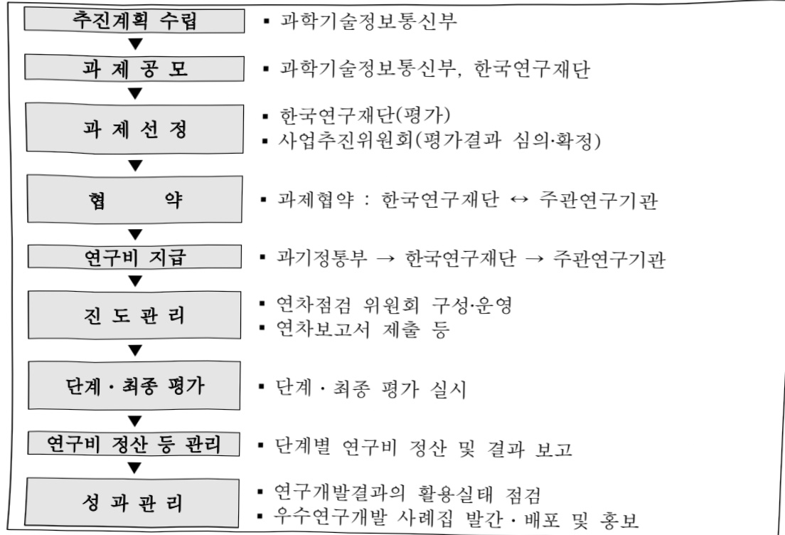

# 반도체원천기술개발사업(R&D)

**해당 페이지**: PDF 1067 ~ 1077 쪽 해당

**부처**: 과학기술정보통신부
**분야**: 과학기술
**회계유형**: 일반회계
**2026 확정예산**: 68808.0 백만원
**전년대비 증감률**: 5.8%
**AI 도메인**: AI반도체, 교육/인재

---

<table border=1 style='margin: auto; word-wrap: break-word;'><tr><td style='text-align: center; word-wrap: break-word;'>사 업 명</td></tr><tr><td style='text-align: center; word-wrap: break-word;'>(44) 반도체원천기술개발사업(R&amp;D) (1139-453)</td></tr></table>

□ 사업 코드 정보

<table border=1 style='margin: auto; word-wrap: break-word;'><tr><td style='text-align: center; word-wrap: break-word;'>구분</td><td style='text-align: center; word-wrap: break-word;'>회계</td><td style='text-align: center; word-wrap: break-word;'>소관</td><td style='text-align: center; word-wrap: break-word;'>실국(기관)</td><td style='text-align: center; word-wrap: break-word;'>계정</td><td style='text-align: center; word-wrap: break-word;'>분야</td><td style='text-align: center; word-wrap: break-word;'>부문</td></tr><tr><td style='text-align: center; word-wrap: break-word;'>코드</td><td rowspan="2">일반회계</td><td style='text-align: center; word-wrap: break-word;'>과학기술</td><td style='text-align: center; word-wrap: break-word;'>기초원천</td><td rowspan="2"></td><td style='text-align: center; word-wrap: break-word;'>150</td><td style='text-align: center; word-wrap: break-word;'>155</td></tr><tr><td style='text-align: center; word-wrap: break-word;'>명칭</td><td style='text-align: center; word-wrap: break-word;'>정보통신부</td><td style='text-align: center; word-wrap: break-word;'>연구정책관</td><td style='text-align: center; word-wrap: break-word;'>과학기술</td><td style='text-align: center; word-wrap: break-word;'>과학기술 연구개발</td></tr></table>

<table border=1 style='margin: auto; word-wrap: break-word;'><tr><td style='text-align: center; word-wrap: break-word;'>구분</td><td style='text-align: center; word-wrap: break-word;'>프로그램</td><td style='text-align: center; word-wrap: break-word;'>단위사업</td><td style='text-align: center; word-wrap: break-word;'>세부사업</td></tr><tr><td style='text-align: center; word-wrap: break-word;'>코드</td><td style='text-align: center; word-wrap: break-word;'>1100</td><td style='text-align: center; word-wrap: break-word;'>1139</td><td style='text-align: center; word-wrap: break-word;'>453</td></tr><tr><td style='text-align: center; word-wrap: break-word;'>명칭</td><td style='text-align: center; word-wrap: break-word;'>미래유망원천기술개발</td><td style='text-align: center; word-wrap: break-word;'>나노·소재기술개발</td><td style='text-align: center; word-wrap: break-word;'>반도체원천기술개발사업(R&amp;D)</td></tr></table>

□ 사업 성격 (공통요구자료 Ⅱ-1 작성유의사항 4. 참조, 해당하는 사항에 “○” 표시)

<table border=1 style='margin: auto; word-wrap: break-word;'><tr><td rowspan="2">신규</td><td rowspan="2">계속</td><td rowspan="2">완료</td><td rowspan="2">예비타당성 실시여부</td><td rowspan="2">총사업비 관리대상</td><td rowspan="2">총액계상 예산사업</td><td style='text-align: center; word-wrap: break-word;'>사업소관 변경정보</td></tr><tr><td style='text-align: center; word-wrap: break-word;'>2025예산 시 소관</td></tr><tr><td style='text-align: center; word-wrap: break-word;'></td><td style='text-align: center; word-wrap: break-word;'>○</td><td style='text-align: center; word-wrap: break-word;'></td><td style='text-align: center; word-wrap: break-word;'></td><td style='text-align: center; word-wrap: break-word;'></td><td style='text-align: center; word-wrap: break-word;'></td><td style='text-align: center; word-wrap: break-word;'></td></tr></table>

□ 사업 지원 형태 및 지원을 (최소한 한 개는 반드시 선택하시오. 해당사항에 0 표시)

<table border=1 style='margin: auto; word-wrap: break-word;'><tr><td style='text-align: center; word-wrap: break-word;'>직접</td><td style='text-align: center; word-wrap: break-word;'>출자</td><td style='text-align: center; word-wrap: break-word;'>출연</td><td style='text-align: center; word-wrap: break-word;'>보조</td><td style='text-align: center; word-wrap: break-word;'>융자</td><td style='text-align: center; word-wrap: break-word;'>국고보조율(%)</td><td style='text-align: center; word-wrap: break-word;'>융자율(%)</td></tr><tr><td style='text-align: center; word-wrap: break-word;'></td><td style='text-align: center; word-wrap: break-word;'></td><td style='text-align: center; word-wrap: break-word;'>O</td><td style='text-align: center; word-wrap: break-word;'></td><td style='text-align: center; word-wrap: break-word;'></td><td style='text-align: center; word-wrap: break-word;'></td><td style='text-align: center; word-wrap: break-word;'></td></tr></table>

□ 사업 소관부처 및 시행주체

<table border=1 style='margin: auto; word-wrap: break-word;'><tr><td style='text-align: center; word-wrap: break-word;'>사업명</td><td colspan="2">구분</td></tr><tr><td rowspan="2">반도체원천기술개발사업(R&amp;D)</td><td style='text-align: center; word-wrap: break-word;'>소관부처</td><td style='text-align: center; word-wrap: break-word;'>연구개발정책실 기초원천연구정책관 원천기술과</td></tr><tr><td style='text-align: center; word-wrap: break-word;'>사업시행주체</td><td style='text-align: center; word-wrap: break-word;'>한국연구재단</td></tr></table>

### 가. 예산안 총괄표

(단위: 백만원, %)

<table border=1 style='margin: auto; word-wrap: break-word;'><tr><td rowspan="2">사업명</td><td rowspan="2">2024년 결산</td><td colspan="2">2025년 예산</td><td colspan="2">2026년 예산</td><td rowspan="2">증감 (B-A)</td><td rowspan="2">(B-A)/A</td></tr><tr><td style='text-align: center; word-wrap: break-word;'>본예산</td><td style='text-align: center; word-wrap: break-word;'>추경*(A)</td><td style='text-align: center; word-wrap: break-word;'>요구안</td><td style='text-align: center; word-wrap: break-word;'>본예산(B)</td></tr><tr><td style='text-align: center; word-wrap: break-word;'>반도체원천기술개발 사업(R&amp;D)</td><td style='text-align: center; word-wrap: break-word;'>40,707</td><td style='text-align: center; word-wrap: break-word;'>65,011</td><td style='text-align: center; word-wrap: break-word;'>65,011</td><td style='text-align: center; word-wrap: break-word;'>68,808</td><td style='text-align: center; word-wrap: break-word;'>68,808</td><td style='text-align: center; word-wrap: break-word;'>3,797</td><td style='text-align: center; word-wrap: break-word;'>5.8</td></tr></table>

---

□ 기능별(내역사업별), 목별 예산안 내역

(단위:백만원)

<table border=1 style='margin: auto; word-wrap: break-word;'><tr><td rowspan="2"></td><td colspan="5">2024</td><td colspan="5">2025</td><td rowspan="2">2026예산</td></tr><tr><td style='text-align: center; word-wrap: break-word;'>예산액(추경)</td><td style='text-align: center; word-wrap: break-word;'>예산현액</td><td style='text-align: center; word-wrap: break-word;'>집행액</td><td style='text-align: center; word-wrap: break-word;'>이월액</td><td style='text-align: center; word-wrap: break-word;'>불용액</td><td style='text-align: center; word-wrap: break-word;'>예산액(추경)</td><td style='text-align: center; word-wrap: break-word;'>예산현액</td><td style='text-align: center; word-wrap: break-word;'>집행액</td><td style='text-align: center; word-wrap: break-word;'>이월액</td><td style='text-align: center; word-wrap: break-word;'>불용액</td></tr><tr><td style='text-align: center; word-wrap: break-word;'>○ 기능별 분류(함께)</td><td style='text-align: center; word-wrap: break-word;'>40,707</td><td style='text-align: center; word-wrap: break-word;'>40,707</td><td style='text-align: center; word-wrap: break-word;'>40,707</td><td style='text-align: center; word-wrap: break-word;'>-</td><td style='text-align: center; word-wrap: break-word;'>-</td><td style='text-align: center; word-wrap: break-word;'>65,011</td><td style='text-align: center; word-wrap: break-word;'>65,011</td><td style='text-align: center; word-wrap: break-word;'>65,011</td><td style='text-align: center; word-wrap: break-word;'>-</td><td style='text-align: center; word-wrap: break-word;'>-</td><td style='text-align: center; word-wrap: break-word;'>68,808</td></tr><tr><td style='text-align: center; word-wrap: break-word;'>· 차세대화합물반도체핵심기술개발</td><td style='text-align: center; word-wrap: break-word;'>7,938</td><td style='text-align: center; word-wrap: break-word;'>7,938</td><td style='text-align: center; word-wrap: break-word;'>7,938</td><td style='text-align: center; word-wrap: break-word;'>-</td><td style='text-align: center; word-wrap: break-word;'>-</td><td style='text-align: center; word-wrap: break-word;'>8,820</td><td style='text-align: center; word-wrap: break-word;'>8,820</td><td style='text-align: center; word-wrap: break-word;'>8,820</td><td style='text-align: center; word-wrap: break-word;'>-</td><td style='text-align: center; word-wrap: break-word;'>-</td><td style='text-align: center; word-wrap: break-word;'>8,820</td></tr><tr><td style='text-align: center; word-wrap: break-word;'>· 국가반도체연구실지원핵심기술개발</td><td style='text-align: center; word-wrap: break-word;'>8,933</td><td style='text-align: center; word-wrap: break-word;'>8,933</td><td style='text-align: center; word-wrap: break-word;'>8,933</td><td style='text-align: center; word-wrap: break-word;'>-</td><td style='text-align: center; word-wrap: break-word;'>-</td><td style='text-align: center; word-wrap: break-word;'>9,720</td><td style='text-align: center; word-wrap: break-word;'>9,720</td><td style='text-align: center; word-wrap: break-word;'>9,720</td><td style='text-align: center; word-wrap: break-word;'>-</td><td style='text-align: center; word-wrap: break-word;'>-</td><td style='text-align: center; word-wrap: break-word;'>9,717</td></tr><tr><td style='text-align: center; word-wrap: break-word;'>· 반도체설계검증인프라활성화</td><td style='text-align: center; word-wrap: break-word;'>6,000</td><td style='text-align: center; word-wrap: break-word;'>6,000</td><td style='text-align: center; word-wrap: break-word;'>6,000</td><td style='text-align: center; word-wrap: break-word;'>-</td><td style='text-align: center; word-wrap: break-word;'>-</td><td style='text-align: center; word-wrap: break-word;'>13,000</td><td style='text-align: center; word-wrap: break-word;'>13,000</td><td style='text-align: center; word-wrap: break-word;'>13,000</td><td style='text-align: center; word-wrap: break-word;'>-</td><td style='text-align: center; word-wrap: break-word;'>-</td><td style='text-align: center; word-wrap: break-word;'>9,200</td></tr><tr><td style='text-align: center; word-wrap: break-word;'>· 반도체첨단패키징핵심기술개발</td><td style='text-align: center; word-wrap: break-word;'>6,406</td><td style='text-align: center; word-wrap: break-word;'>6,406</td><td style='text-align: center; word-wrap: break-word;'>6,406</td><td style='text-align: center; word-wrap: break-word;'>-</td><td style='text-align: center; word-wrap: break-word;'>-</td><td style='text-align: center; word-wrap: break-word;'>7,544</td><td style='text-align: center; word-wrap: break-word;'>7,544</td><td style='text-align: center; word-wrap: break-word;'>7,544</td><td style='text-align: center; word-wrap: break-word;'>-</td><td style='text-align: center; word-wrap: break-word;'>-</td><td style='text-align: center; word-wrap: break-word;'>7,650</td></tr><tr><td style='text-align: center; word-wrap: break-word;'>· 차세대반도체대응미세기관기술개발</td><td style='text-align: center; word-wrap: break-word;'>6,410</td><td style='text-align: center; word-wrap: break-word;'>6,410</td><td style='text-align: center; word-wrap: break-word;'>6,410</td><td style='text-align: center; word-wrap: break-word;'>-</td><td style='text-align: center; word-wrap: break-word;'>-</td><td style='text-align: center; word-wrap: break-word;'>7,309</td><td style='text-align: center; word-wrap: break-word;'>7,309</td><td style='text-align: center; word-wrap: break-word;'>7,309</td><td style='text-align: center; word-wrap: break-word;'>-</td><td style='text-align: center; word-wrap: break-word;'>-</td><td style='text-align: center; word-wrap: break-word;'>7,800</td></tr><tr><td style='text-align: center; word-wrap: break-word;'>· 차세대반도체장비원천기술개발</td><td style='text-align: center; word-wrap: break-word;'>2,500</td><td style='text-align: center; word-wrap: break-word;'>2,500</td><td style='text-align: center; word-wrap: break-word;'>2,500</td><td style='text-align: center; word-wrap: break-word;'>-</td><td style='text-align: center; word-wrap: break-word;'>-</td><td style='text-align: center; word-wrap: break-word;'>6,125</td><td style='text-align: center; word-wrap: break-word;'>6,125</td><td style='text-align: center; word-wrap: break-word;'>6,125</td><td style='text-align: center; word-wrap: break-word;'>-</td><td style='text-align: center; word-wrap: break-word;'>-</td><td style='text-align: center; word-wrap: break-word;'>9,871</td></tr><tr><td style='text-align: center; word-wrap: break-word;'>· 반도체글로벌첨단팝연계활용사업</td><td style='text-align: center; word-wrap: break-word;'>2,520</td><td style='text-align: center; word-wrap: break-word;'>2,520</td><td style='text-align: center; word-wrap: break-word;'>2,520</td><td style='text-align: center; word-wrap: break-word;'>-</td><td style='text-align: center; word-wrap: break-word;'>-</td><td style='text-align: center; word-wrap: break-word;'>5,493</td><td style='text-align: center; word-wrap: break-word;'>5,493</td><td style='text-align: center; word-wrap: break-word;'>5,493</td><td style='text-align: center; word-wrap: break-word;'>-</td><td style='text-align: center; word-wrap: break-word;'>-</td><td style='text-align: center; word-wrap: break-word;'>4,730</td></tr><tr><td style='text-align: center; word-wrap: break-word;'>· 차세대광패키징기술개발</td><td style='text-align: center; word-wrap: break-word;'>-</td><td style='text-align: center; word-wrap: break-word;'>-</td><td style='text-align: center; word-wrap: break-word;'>-</td><td style='text-align: center; word-wrap: break-word;'>-</td><td style='text-align: center; word-wrap: break-word;'>-</td><td style='text-align: center; word-wrap: break-word;'>3,000</td><td style='text-align: center; word-wrap: break-word;'>3,000</td><td style='text-align: center; word-wrap: break-word;'>3,000</td><td style='text-align: center; word-wrap: break-word;'>-</td><td style='text-align: center; word-wrap: break-word;'>-</td><td style='text-align: center; word-wrap: break-word;'>5,144</td></tr><tr><td style='text-align: center; word-wrap: break-word;'>· 초고집적 반도체용vdW 소재 및공정기술개발</td><td style='text-align: center; word-wrap: break-word;'>-</td><td style='text-align: center; word-wrap: break-word;'>-</td><td style='text-align: center; word-wrap: break-word;'>-</td><td style='text-align: center; word-wrap: break-word;'>-</td><td style='text-align: center; word-wrap: break-word;'>-</td><td style='text-align: center; word-wrap: break-word;'>4,000</td><td style='text-align: center; word-wrap: break-word;'>4,000</td><td style='text-align: center; word-wrap: break-word;'>4,000</td><td style='text-align: center; word-wrap: break-word;'>-</td><td style='text-align: center; word-wrap: break-word;'>-</td><td style='text-align: center; word-wrap: break-word;'>5,876</td></tr></table>

### 나. 사업설명자료

## 1 ) 사업목적·내용

- 초격차 기술경쟁력 확보와 미래시장 선점을 위한 소자, 설계, 첨단패키징, 화합물 반도체 등을 포함한 반도체 전 분야 원천기술 개발

- (차세대화합물반도체핵심기술개발) 차세대 화합물 반도체 에피 소재 및 소자 원천

기술을 개발지원하여 연구 생태계를 조성하고 관련 산업 활성화 유도

- (국가반도체연구실지원핵심기술개발) 글로벌 반도체 기술패권 격화에 대응하여 연구

개발 및 인력양성의 기초 단위인 대학 반도체 연구실(Lab)의 역량 강화

- (반도체설계검증인프라활성화) 국내 공공팩의 CMOS 공정을 활용하여 학생들의 반도체 설계를 공정·검증 할 수 있는 서비스 제공 및 인프라 고도화 추진

---

- (반도체첨단패키징핵심기술개발) 3D 적층 패키징 소재기술, 고효율·미세피치 패키징 제조기술, 고방열 패키징 구조 설계 및 신뢰성 향상기술에 대한 핵심 원천기술 확보

- (차세대반도체대응미세기관기술개발) 반도체 패키징용 기관의 국내 기업 시장 점유율

획대 및 기술 장악력 확보를 위한 차세대 첨단기관 핵심기술 확보

- (차세대반도체장비원천기술개발) 반도체 첨단 패키징 분야 스택 및 검사장비와 대면적 고심도Metrology Inspection-SEM 장비 원천기술 개발

- (반도체글로벌첨단팩연계활용사업) 미국(NY Creates), 벨기에(IMEC) 등 글로벌 첨단반도체팩과 국내 공공팩과의 연계협력을 통한 공동연구, 소부장 테스트베드 실증지원, 국내대학(원)생 인턴쉽 및 기술인력 교류 지원

- (차세대광패키징기술개발) 광 통신 분야 공백 영역인 첨단 광패키징 원천기술 확보를 위한 초저전력 광학 온보드 패키징 및 Opto-chiplet 패키징 기술개발

- (초고집적반도체용vdW소재및공정기술개발) 극한 박막 vdW 소재를 활용한 초고집적 3D DRAM 반도체 기술개발을 통하여 미래 3D 반도체 신격차 기술 확보

## 2 ) 사업개요

□ 사업근거 및 추진경위

① 법령상 근거 및 조항 적시

- 과학기술기본법 제16조의5(성장동력의 발굴, 육성)

제16조의5(성장동력의 발굴·육성) ① 정부는 과학기술에 기반을 둔 성장동력을 발굴·육성하기 위하여 필요한 시책을 세우고 추진하여야 한다.

- 기초연구진흥 및 기술개발지원에 관한 법률 제14조(특정연구개발사업의 추진)

0 제14조(특정연구개발사업의 추진) ① 과학기술정보통신부장관은 기초연구의 성과 등을 바탕으로 하여 국가 미래 유망기술과 융합기술을 중점적으로 개발하기 위한 연구개발사업(이하 “특정연구개발사업”이라 한다)에 대하여 계획을 수립하고, 연도별로 연구과제를 선정하여 이를 다음 각 호의 기관 또는 단체와 협약을 맺어 연구하게 할 수 있다. 이 경우 제2호의 기관 중 대표권이 없는 기관에 대하여는 그 기관이 속한 법인의 대표자와 협약할 수 있다.

- 국가전략기술 육성에 관한 특별법 제11조(국가전략기술 연구개발사업의 지정 및 추진 등)

☐ 제11조(국가전략기술 연구개발사업의 지정 및 추진 등) ① 과학기술정보통신부장관은 기본 계획 및 시행계획의 효율적 추진을 위하여 국가연구개발사업 중에서 다음 각 호의 사항을 고려하여 국가전략기술 연구개발사업(이하 “전략연구사업”이라 한다)을 지정할 수 있다.

② 중앙행정기관의 장은 전략연구사업의 추진에 필요한 재원을 우선적으로 확보하기 위하여 노력하여야 한다.

③ 중앙행정기관의 장은 「과학기술기본법」 제12조의2제1항에 따라 국가연구개발사업의 투자 우선순위에 대한 의견을 제출하는 경우에는 전략연구사업으로 추진하는 사업이 우선적으로 반영될 수 있도록 노력하여야 한다.

---

② 추진경위

- 중합 반도체 강국 실현을 위한 K-반도체 전략('21.5.)

0 차세대 전력 반도체 소자 및 Epi 소재 원천기술 확보

- 3대 주력기술(반도체, 디스플레이, 차세대전지) 전략('23.4.)

°(반도체 미래기술 로드맵) 미래 유망 소자 연구를 통한 기술 선점

- AI-반도체 이니셔티브('24.4.)

(AI-반도체 이니셔티브) AI-반도체 초격차·신격차 확보

<추진경과>

° '22년도 신규사업(1개) 확정(차세대화합물반도체핵심기술개발)

° '23년도 신규사업(2개) 확정(국가반도체연구실지원핵심기술개발, 반도체설계검증인프라활성화)

°24년도 신규사업(4개) 확정(반도체첨단패키징핵심기술개발, 차세대반도체대응미세기관기술개발, 차세대반도체장비원친기술개발, 반도체글로벌첨단패업계활용사업)

°25년도 신규사업(2개) 확정(차세대광패키징기술개발, 초고집적반도체용vdW소재및공정기술개발)

0 차세대화합물반도체핵심기술개발 등 반도체 분야 9개 사업 2026년 예산 과목 구조 개편을 통한 반도체원천기술개발사업으로 통폐합

[차세대화합물반도체핵심기술개발]

° '22년도 예산 국회 확정(차세대화합물반도체핵심기술개발, 75억원)

o 신규 연구과제(4개) 선정 및 연구개시('22.4.)

[국가반도체연구실지원핵심기술개발]

° '23년도 예산 국회 확정(국가반도체연구실지원핵심기술개발, 65억원)

° '23년 신규과제 선정 및 연구개시('23.5., '23.8.)

[반도체설계검증인프라활성화]

° '23년도 예산 국회 확정(반도체설계검증인프라활성화, 120억원)

° '23년 신규과제 선정 및 연구개시('23.4.)

[반도체첨단패키징핵심기술개발]

° '24년도 예산 국회 확정(반도체첨단패키징핵심기술개발, 64억원)

° '24년도 신규 연구과제(8개) 선정 및 연구개시('24.4., '24.5.)

---

[차세대반도체대응미세기판기술개발]

°24년도 예산 국회 확정(차세대반도체대응미세기관기술개발, 64억원)

° '24년도 신규 연구과제(9개) 선정 및 연구개시('24.4., '24.5.)

[차세대반도체장비원천기술개발]

°'24년도 예산 국회 확정(차세대반도체장비원천기술개발,25억원)

° '24년도 신규 연구과제(1개) 선정 및 연구개시('24.5.)

° '25년도 신규 연구과제(1개) 선정 및 연구개시('25.7.)

## [반도체글로벌첨단팽연계활용사업]

° '24년도 예산 국회 확정(반도체글로벌첨단팽연계활용사업, 25.2억원)

° '24년도 신규 연구과제(16개) 선정 및 연구개시('24.7.~'24.11.), 인턴쉽 파견자 12명 선발 완료('24.12.)

° '25년도 신규 연구과제(8개) 선정 및 연구개시('25.4., '25.5.)

## [차세대광패키징기술개발]

°'24년도 예산 국회 확정(차세대광패키징기술개발, 30억원)

° '25년도 신규 연구과제(5개) 선정 및 연구개시('25.6., '25.7)

[초고집적반도체용vdW소재및공정기술개발]

° '24년도 예산 국회 확정(초고집적반도체용vdW소재 및공정기술개발, 40억원)

° '25년도 신규 연구과제(10개) 선정 및 연구개시('25.6.)

## □ 주요내용

① 사업규모

- 총사업비(해당되는 경우에만 기재) : 해당없음

- 사업기간 : '22 ~ '30(9년)

-최근 5년 간 투입된 사업비(예산액기준, 추경편성한 연도에는 추경포함)

<table border=1 style='margin: auto; word-wrap: break-word;'><tr><td style='text-align: center; word-wrap: break-word;'>연도</td><td style='text-align: center; word-wrap: break-word;'>2022</td><td style='text-align: center; word-wrap: break-word;'>2023</td><td style='text-align: center; word-wrap: break-word;'>2024</td><td style='text-align: center; word-wrap: break-word;'>2025</td><td style='text-align: center; word-wrap: break-word;'>2026</td></tr><tr><td style='text-align: center; word-wrap: break-word;'>사업비</td><td style='text-align: center; word-wrap: break-word;'>7,500</td><td style='text-align: center; word-wrap: break-word;'>28,275</td><td style='text-align: center; word-wrap: break-word;'>40,707</td><td style='text-align: center; word-wrap: break-word;'>65,011</td><td style='text-align: center; word-wrap: break-word;'>68,808</td></tr></table>

② 사업추진체계

- 사업시행방법 : 출연

- 사업시행주체 : 한국연구재단, 나노송합기술원

---

- 사업 수혜자 : 대학, 출연연, 기업 등

- 보조, 융자, 출연, 출자 등의 경우 보조·융자 등 지원 비율 및 법적근거

<table border=1 style='margin: auto; word-wrap: break-word;'><tr><td style='text-align: center; word-wrap: break-word;'>내역사업명</td><td style='text-align: center; word-wrap: break-word;'>구분</td><td style='text-align: center; word-wrap: break-word;'>피보조·피출연 등 기관명</td><td style='text-align: center; word-wrap: break-word;'>지원 금액 (2026예산)</td><td style='text-align: center; word-wrap: break-word;'>지원 비율(%)</td><td style='text-align: center; word-wrap: break-word;'>보조율 법적근거 (해당 조항)</td></tr><tr><td style='text-align: center; word-wrap: break-word;'>차세대화합물반도체 핵심기술개발</td><td rowspan="9">출연</td><td rowspan="6">한국연구 재단</td><td style='text-align: center; word-wrap: break-word;'>8,820</td><td rowspan="9">100</td><td rowspan="9">기초연구진흥 및 기술개발 지원에 관한 법률 제14조</td></tr><tr><td style='text-align: center; word-wrap: break-word;'>국가반도체연구실지원 핵심기술개발</td><td style='text-align: center; word-wrap: break-word;'>9,717</td></tr><tr><td style='text-align: center; word-wrap: break-word;'>반도체설계검증 인프라활성화</td><td style='text-align: center; word-wrap: break-word;'>9,200</td></tr><tr><td style='text-align: center; word-wrap: break-word;'>반도체첨단패키징 핵심기술개발</td><td style='text-align: center; word-wrap: break-word;'>7,650</td></tr><tr><td style='text-align: center; word-wrap: break-word;'>차세대반도체대응 미세기관기술개발</td><td style='text-align: center; word-wrap: break-word;'>7,800</td></tr><tr><td style='text-align: center; word-wrap: break-word;'>차세대반도체장비 원천기술개발</td><td style='text-align: center; word-wrap: break-word;'>9,871</td></tr><tr><td style='text-align: center; word-wrap: break-word;'>반도체글로벌첨단팝 연계활용사업</td><td style='text-align: center; word-wrap: break-word;'>나노종합 기술원·한국연구재단</td><td style='text-align: center; word-wrap: break-word;'>4,730</td></tr><tr><td style='text-align: center; word-wrap: break-word;'>차세대광패키징기술개발</td><td rowspan="2">한국연구 재단</td><td style='text-align: center; word-wrap: break-word;'>5,144</td></tr><tr><td style='text-align: center; word-wrap: break-word;'>초고집적 반도체용 vdW 소재 및 공정기술개발</td><td style='text-align: center; word-wrap: break-word;'>5,876</td></tr></table>

## 3 ) '26년도 예산 산출 근거

□ 반도체원천기술개발사업 : (2025) 65,011 → (2026요구) 68,808 백만원

① 차세대화합물반도체핵심기술개발 : (2025) 8,820 → (2026요구) 8,820 백만원

② 국가반도체연구실지원핵심기술개발 : (2025) 9,720 → (2026요구) 9,717 백만원

③ 반도체설계검증인프라활성화 : (2025) 13,000 → (2026요구) 9,200 백만원

④ 반도체첨단패키징핵심기술개발 : (2025) 7,544 → (2026요구) 7,650 백만원

⑤ 차세대반도체대응미세기관기술개발 : (2025) 7,309 → (2026요구) 7,800 백만원

⑥ 차세대반도체장비원천기술개발 : (2025) 6,125 → (2026요구) 9,871 백만원

⑦ 반도체글로벌첨단팝연계활용사업 : (2025) 5,493 → (2026요구) 4,730 백만원

⑧ 차세대광패키징기술개발 : (2025) 3,000 → (2026요구) 5.144 백만원

---

⑨ 초고집적 반도체용 vdW 소재 및 공정기술개발 : (2025) 4.000 → (2026반영) 5,876백만원

<table border=1 style='margin: auto; word-wrap: break-word;'><tr><td colspan="2">&#x27;26년 예산</td></tr><tr><td style='text-align: center; word-wrap: break-word;'>예산</td><td style='text-align: center; word-wrap: break-word;'>산출내역</td></tr><tr><td style='text-align: center; word-wrap: break-word;'>68,808</td><td style='text-align: center; word-wrap: break-word;'>○ 연구개발활동비 등(360-05): 68,808백만원가. 차세대화합물반도체핵심기술개발• (산출) (종료) 4개 × 2,205만원 × 12/12개월 = 8,820백만원나. 국가반도체연구실지원핵심기술개발• (산출) (계속) 20개 × 486백만원 × 12/12개월 = 9,717백만원다. 반도체설계검증인프라활성화• (산출) (계속) 1개 × 9,200백만원 × 12/12개월 = 9,200백만원라. 반도체청단패키징핵심기술개발• (산출) (계속) 8개 × 957백만원 × 12/12개월 = 7,650백만원마. 차세대반도체대응미세기판기술개발• (산출) (종료) 6개 × 794백만원 × 12/12개월 = 4,761백만원(계속) 3개 × 1,013백만원 × 12/12개월 = 3,039백만원바. 차세대반도체장비원천기술개발• (산출) (계속) 2개 × 4,936백만원 × 12/12개월 = 9,871백만원사. 반도체글로벌청단팝연계활용사업• (산출) (종료) 10개 × 275백만원 × 12/12개월 = 2,750백만원(계속) 4개 × 495백만원 × 12/12개월 = 1,980백만원아. 차세대광패키징기술개발• (산출) (계속) 5개 × 1,029백만원 × 12/12개월 = 5,144백만원자. 초고집적 반도체용vdW 소재 및 공정기술개발• (산출) (계속) 10개 × 706백만원 × 10/12개월 = 5,876백만원</td></tr></table>

## 4 ) 사업효과

☐ 사업영향, 산출물 성과지표 등

① '22~'26년도 성과계획서 상 성과지표 및 최근 5년간 성과 달성도

<table border=1 style='margin: auto; word-wrap: break-word;'><tr><td style='text-align: center; word-wrap: break-word;'>성과지표</td><td style='text-align: center; word-wrap: break-word;'>구분</td><td style='text-align: center; word-wrap: break-word;'>&#x27;22</td><td style='text-align: center; word-wrap: break-word;'>&#x27;23</td><td style='text-align: center; word-wrap: break-word;'>&#x27;24</td><td style='text-align: center; word-wrap: break-word;'>&#x27;25</td><td style='text-align: center; word-wrap: break-word;'>&#x27;26</td><td style='text-align: center; word-wrap: break-word;'>&#x27;26목표치산출근거</td><td style='text-align: center; word-wrap: break-word;'>측정산식(또는 측정방법)</td><td style='text-align: center; word-wrap: break-word;'>자료수집방법(또는 자료출처)</td></tr><tr><td rowspan="3">[화합물]차세대화합물반도체4대분야소자기술성숙도(단위:%)</td><td style='text-align: center; word-wrap: break-word;'>목표</td><td style='text-align: center; word-wrap: break-word;'>75</td><td style='text-align: center; word-wrap: break-word;'>80</td><td style='text-align: center; word-wrap: break-word;'>85</td><td style='text-align: center; word-wrap: break-word;'>93</td><td style='text-align: center; word-wrap: break-word;'>100</td><td rowspan="3">국내기술수준분석기반기술선도국대비격차감소를위한기술성숙도목표치설정</td><td rowspan="3">(현재기술성숙도)/(목표기술성숙도)×100%</td><td rowspan="3">연차/단계/최종보고서 및 외부전문가평가 등목표기술성숙도 대비 수준분석</td></tr><tr><td style='text-align: center; word-wrap: break-word;'>실적</td><td style='text-align: center; word-wrap: break-word;'>73.5</td><td style='text-align: center; word-wrap: break-word;'>79.3</td><td style='text-align: center; word-wrap: break-word;'>84.8</td><td style='text-align: center; word-wrap: break-word;'>-</td><td style='text-align: center; word-wrap: break-word;'>-</td></tr><tr><td style='text-align: center; word-wrap: break-word;'>달성도</td><td style='text-align: center; word-wrap: break-word;'>98.0</td><td style='text-align: center; word-wrap: break-word;'>99.2</td><td style='text-align: center; word-wrap: break-word;'>99.8</td><td style='text-align: center; word-wrap: break-word;'>-</td><td style='text-align: center; word-wrap: break-word;'>-</td></tr></table>

---

<table border=1 style='margin: auto; word-wrap: break-word;'><tr><td rowspan="3">[국가반도체] 고급인력 양성 (단위: 명)</td><td style='text-align: center; word-wrap: break-word;'>목표</td><td style='text-align: center; word-wrap: break-word;'>-</td><td style='text-align: center; word-wrap: break-word;'>15</td><td style='text-align: center; word-wrap: break-word;'>40</td><td style='text-align: center; word-wrap: break-word;'>65</td><td style='text-align: center; word-wrap: break-word;'>89</td><td rowspan="3">국가반도체연구실 (NSL) 당 6명의 박사급 인력이 배출되어야 하므로 사업 기간 중 목표 인원을 총 114명으로 하여 연도별 실적을 비율로 산출</td><td rowspan="3">과제별 고급인력 (박사급 학위수여자) 수 합계(누적)</td><td rowspan="3">연구실적보고서, 사업성과보고서 등</td><td rowspan="3"></td></tr><tr><td style='text-align: center; word-wrap: break-word;'>실적</td><td style='text-align: center; word-wrap: break-word;'>-</td><td style='text-align: center; word-wrap: break-word;'>3</td><td style='text-align: center; word-wrap: break-word;'>36.5</td><td style='text-align: center; word-wrap: break-word;'>-</td><td style='text-align: center; word-wrap: break-word;'>-</td></tr><tr><td style='text-align: center; word-wrap: break-word;'>달성도</td><td style='text-align: center; word-wrap: break-word;'>-</td><td style='text-align: center; word-wrap: break-word;'>20.0</td><td style='text-align: center; word-wrap: break-word;'>91.3</td><td style='text-align: center; word-wrap: break-word;'>-</td><td style='text-align: center; word-wrap: break-word;'>-</td></tr><tr><td rowspan="3">[설계검증] 설계검증서비스 제공 (단위: LOT)</td><td style='text-align: center; word-wrap: break-word;'>목표</td><td style='text-align: center; word-wrap: break-word;'>-</td><td style='text-align: center; word-wrap: break-word;'>1</td><td style='text-align: center; word-wrap: break-word;'>6</td><td style='text-align: center; word-wrap: break-word;'>6</td><td style='text-align: center; word-wrap: break-word;'>12</td><td rowspan="3">2단계(‘26~’27)는 매년 최소 12회 MPW 제공 목표</td><td rowspan="3">설계검증서비스 제공 건수</td><td rowspan="3">연구실적보고서 등</td><td rowspan="3"></td></tr><tr><td style='text-align: center; word-wrap: break-word;'>실적</td><td style='text-align: center; word-wrap: break-word;'>-</td><td style='text-align: center; word-wrap: break-word;'>1</td><td style='text-align: center; word-wrap: break-word;'>6</td><td style='text-align: center; word-wrap: break-word;'>-</td><td style='text-align: center; word-wrap: break-word;'>-</td></tr><tr><td style='text-align: center; word-wrap: break-word;'>달성도</td><td style='text-align: center; word-wrap: break-word;'>-</td><td style='text-align: center; word-wrap: break-word;'>100.0</td><td style='text-align: center; word-wrap: break-word;'>100.0</td><td style='text-align: center; word-wrap: break-word;'>-</td><td style='text-align: center; word-wrap: break-word;'>-</td></tr><tr><td rowspan="3">[첨단패키칭] SCI급 논문의 절적 우수성 (단위: 점 )</td><td style='text-align: center; word-wrap: break-word;'>목표</td><td style='text-align: center; word-wrap: break-word;'>-</td><td style='text-align: center; word-wrap: break-word;'>-</td><td style='text-align: center; word-wrap: break-word;'>66.2</td><td style='text-align: center; word-wrap: break-word;'>66.8</td><td style='text-align: center; word-wrap: break-word;'>67.5</td><td rowspan="3">유사사업(차세대 지 능형 반 도체 기술개발 등)의 과거 3개년(21~23) 논문 mmIF 평균압 66.2점을 기준 매년 1% 증가치를 설정</td><td rowspan="3">NTIS에서 검증된 SCI(E)급 논문 (한국연구재단 IF부여 학술대회 논문 포함)을 대상으로 mrnIF를 활용하여 측정</td><td rowspan="3">NTIS, 성과조사 결과(NRF)</td><td rowspan="3"></td></tr><tr><td style='text-align: center; word-wrap: break-word;'>실적</td><td style='text-align: center; word-wrap: break-word;'>-</td><td style='text-align: center; word-wrap: break-word;'>-</td><td style='text-align: center; word-wrap: break-word;'>80.7</td><td style='text-align: center; word-wrap: break-word;'>-</td><td style='text-align: center; word-wrap: break-word;'>-</td></tr><tr><td style='text-align: center; word-wrap: break-word;'>달성도</td><td style='text-align: center; word-wrap: break-word;'>-</td><td style='text-align: center; word-wrap: break-word;'>-</td><td style='text-align: center; word-wrap: break-word;'>121.9</td><td style='text-align: center; word-wrap: break-word;'>-</td><td style='text-align: center; word-wrap: break-word;'>-</td></tr><tr><td rowspan="3">[미세기판] 기술개발 성능목표 달성도 (단위: %)</td><td style='text-align: center; word-wrap: break-word;'>목표</td><td style='text-align: center; word-wrap: break-word;'>-</td><td style='text-align: center; word-wrap: break-word;'>-</td><td style='text-align: center; word-wrap: break-word;'>신규</td><td style='text-align: center; word-wrap: break-word;'>80</td><td style='text-align: center; word-wrap: break-word;'>80</td><td rowspan="3">유사사업(차세대 지 능형 반 도체 기술개발 등)의 과거 3개년(21~23) 연 구 개 발 과 제 죄 종 평 가 결 과 평 군 값 80.8점을 바탕으로 목표 달성도 산출 및 사업의 도전적 성격(반도체대응 미 세 기 관 기 술 개발)을 고려하여 연차별 목표 달성도 80% 설정</td><td rowspan="3">측정산식: (∑) (연구개발과제의 핵심 성능목표’ 건수) × 100 * 연구개발과제별 성공적인 과제 수행을 위해 달성해야하는 핵심 성능목표(5개)</td><td rowspan="3">연차/단계/최종 보고서, 연구개발 기관 실적 증빙 자료</td><td rowspan="3"></td></tr><tr><td style='text-align: center; word-wrap: break-word;'>실적</td><td style='text-align: center; word-wrap: break-word;'>-</td><td style='text-align: center; word-wrap: break-word;'>-</td><td style='text-align: center; word-wrap: break-word;'>신규</td><td style='text-align: center; word-wrap: break-word;'>-</td><td style='text-align: center; word-wrap: break-word;'>-</td></tr><tr><td style='text-align: center; word-wrap: break-word;'>달성도</td><td style='text-align: center; word-wrap: break-word;'>-</td><td style='text-align: center; word-wrap: break-word;'>-</td><td style='text-align: center; word-wrap: break-word;'>신규</td><td style='text-align: center; word-wrap: break-word;'>-</td><td style='text-align: center; word-wrap: break-word;'>-</td></tr><tr><td rowspan="3">[장비원천] 통합화율 (단위: %)</td><td style='text-align: center; word-wrap: break-word;'>목표</td><td style='text-align: center; word-wrap: break-word;'>-</td><td style='text-align: center; word-wrap: break-word;'>-</td><td style='text-align: center; word-wrap: break-word;'>신규</td><td style='text-align: center; word-wrap: break-word;'>20</td><td style='text-align: center; word-wrap: break-word;'>50</td><td rowspan="3">각 단계별로 통합화율 50% 달성을 기준으로 연차별 목표치 설정</td><td rowspan="3">과제관리시스템에 제출되는 연차 보고서 단계보고서 내 정렬 오차 측정 평가 결과 확인</td><td rowspan="3">연차/단계/최종 보고서, 연구개발 기관 실적 증빙 자료</td><td rowspan="3"></td></tr><tr><td style='text-align: center; word-wrap: break-word;'>실적</td><td style='text-align: center; word-wrap: break-word;'>-</td><td style='text-align: center; word-wrap: break-word;'>-</td><td style='text-align: center; word-wrap: break-word;'>신규</td><td style='text-align: center; word-wrap: break-word;'>-</td><td style='text-align: center; word-wrap: break-word;'>-</td></tr><tr><td style='text-align: center; word-wrap: break-word;'>달성도</td><td style='text-align: center; word-wrap: break-word;'>-</td><td style='text-align: center; word-wrap: break-word;'>-</td><td style='text-align: center; word-wrap: break-word;'>신규</td><td style='text-align: center; word-wrap: break-word;'>-</td><td style='text-align: center; word-wrap: break-word;'>-</td></tr><tr><td rowspan="3">[글로벌첨단패] 국내외 인프라 활용건수 (단위: 건)</td><td style='text-align: center; word-wrap: break-word;'>목표</td><td style='text-align: center; word-wrap: break-word;'>-</td><td style='text-align: center; word-wrap: break-word;'>-</td><td style='text-align: center; word-wrap: break-word;'>10</td><td style='text-align: center; word-wrap: break-word;'>31</td><td style='text-align: center; word-wrap: break-word;'>40</td><td rowspan="3">‘26년도 연구계획서 성과지표 기준으로 신규과제 2회, 계속과제 5회 제시 (반도체 웨이퍼 / 침제작, 성능 평가 공정 셋업 등 고려)</td><td rowspan="3">국내외 인프라 활용내역 (활용 건수, 공장내역 등 실질적 성과도출 결과) (연도별 신규과제 수 X 2회) + (연도별 계속과제 수 X 5회)</td><td rowspan="3">국내외 반도체 인프라 기관 활용내역, 시험 평가 결과보고서, 연차/단계/최종 보고서</td><td rowspan="3"></td></tr><tr><td style='text-align: center; word-wrap: break-word;'>실적</td><td style='text-align: center; word-wrap: break-word;'>-</td><td style='text-align: center; word-wrap: break-word;'>-</td><td style='text-align: center; word-wrap: break-word;'>21</td><td style='text-align: center; word-wrap: break-word;'>-</td><td style='text-align: center; word-wrap: break-word;'>-</td></tr><tr><td style='text-align: center; word-wrap: break-word;'>달성도</td><td style='text-align: center; word-wrap: break-word;'>-</td><td style='text-align: center; word-wrap: break-word;'>-</td><td style='text-align: center; word-wrap: break-word;'>210</td><td style='text-align: center; word-wrap: break-word;'>-</td><td style='text-align: center; word-wrap: break-word;'>-</td></tr></table>

---

<table border=1 style='margin: auto; word-wrap: break-word;'><tr><td rowspan="3">[광패키징] 특허출원 (단위: 건)</td><td style='text-align: center; word-wrap: break-word;'>목표</td><td style='text-align: center; word-wrap: break-word;'>-</td><td style='text-align: center; word-wrap: break-word;'>-</td><td style='text-align: center; word-wrap: break-word;'>-</td><td style='text-align: center; word-wrap: break-word;'>4</td><td style='text-align: center; word-wrap: break-word;'>10</td><td rowspan="3">국내 열악한 패기징 연구환경과 도전적 성격 R&amp;D임을 감안하여 국비 10억당 1.5건으로 설정</td><td rowspan="3">출원: 1.5건/10억</td><td rowspan="3">특허출원명세</td></tr><tr><td style='text-align: center; word-wrap: break-word;'>실적</td><td style='text-align: center; word-wrap: break-word;'>-</td><td style='text-align: center; word-wrap: break-word;'>-</td><td style='text-align: center; word-wrap: break-word;'>-</td><td style='text-align: center; word-wrap: break-word;'>-</td><td style='text-align: center; word-wrap: break-word;'>-</td></tr><tr><td style='text-align: center; word-wrap: break-word;'>달성도</td><td style='text-align: center; word-wrap: break-word;'>-</td><td style='text-align: center; word-wrap: break-word;'>-</td><td style='text-align: center; word-wrap: break-word;'>-</td><td style='text-align: center; word-wrap: break-word;'>-</td><td style='text-align: center; word-wrap: break-word;'>-</td></tr><tr><td rowspan="3">[vdW] vdW 웨이퍼 크기 (단위: inch)</td><td style='text-align: center; word-wrap: break-word;'>목표</td><td style='text-align: center; word-wrap: break-word;'>-</td><td style='text-align: center; word-wrap: break-word;'>-</td><td style='text-align: center; word-wrap: break-word;'>-</td><td style='text-align: center; word-wrap: break-word;'>4</td><td style='text-align: center; word-wrap: break-word;'>6</td><td rowspan="3">1단계(&#x27;27&#x27;) 목표 (8 inch이상)의 50% 수준</td><td rowspan="3">웨이퍼 직경 길이</td><td rowspan="3">연차/단계/최종 보고서, 연구개발 기관 실적 증빙 자료</td></tr><tr><td style='text-align: center; word-wrap: break-word;'>실적</td><td style='text-align: center; word-wrap: break-word;'>-</td><td style='text-align: center; word-wrap: break-word;'>-</td><td style='text-align: center; word-wrap: break-word;'>-</td><td style='text-align: center; word-wrap: break-word;'>-</td><td style='text-align: center; word-wrap: break-word;'>-</td></tr><tr><td style='text-align: center; word-wrap: break-word;'>달성도</td><td style='text-align: center; word-wrap: break-word;'>-</td><td style='text-align: center; word-wrap: break-word;'>-</td><td style='text-align: center; word-wrap: break-word;'>-</td><td style='text-align: center; word-wrap: break-word;'>-</td><td style='text-align: center; word-wrap: break-word;'>-</td></tr></table>

※향후 전략계획서 수립 및 혁신본부 점검 확정에 따라 성과지표 및 목표치 변동될 수 있음

② 성과지표 이외의 연도별 사업추진 경과 및 실적

<table border=1 style='margin: auto; word-wrap: break-word;'><tr><td style='text-align: center; word-wrap: break-word;'>2022</td><td style='text-align: center; word-wrap: break-word;'>&#x27;22년도 신규 연구과제(4개) 선정 및 연구개시(&#x27;22.4월)</td></tr><tr><td style='text-align: center; word-wrap: break-word;'>2023</td><td style='text-align: center; word-wrap: break-word;'>&#x27;23년도 신규 연구과제(21개) 선정 및 연구개시(&#x27;23.4·5·8월)</td></tr><tr><td style='text-align: center; word-wrap: break-word;'>2024</td><td style='text-align: center; word-wrap: break-word;'>&#x27;24년도 신규 연구과제(34개) 선정 및 연구개시(&#x27;24.4~11월)</td></tr><tr><td style='text-align: center; word-wrap: break-word;'>2025</td><td style='text-align: center; word-wrap: break-word;'>&#x27;25년도 신규 연구과제(23개) 선정 및 연구개시(&#x27;25.5~7월)</td></tr></table>

③ 향후(26년도 이후) 기대효과

- 소재, 공정, 설계, 패키징, 장비 등 반도체 전 영역의 원천기술 개발 통해 고성능

고집적 반도체 구현 및 첨단 기술 경쟁력 강화

5) 타당성조사 및 예비타당성조사 시행여부 및 결과 요지 : 해당없음

6) 총사업비 대상사업 여부 및 내역 : 해당없음

## 7 ) 사업 집행절차

---

※ 반도체글로벌첨단팬연계활용사업(공동연구개발 소부장실증평가)에 한해 나노종합기술원(공공팝기관)을 전문기관으로 지정하여 사업 추진

## 8 ) 각종 평가

1) 국회(예결위, 상임위, 예정처, 국정감사 포함) 지적

- ①('25년 예산안 분석/'24.10, 예정처) : [반도체글로벌첨단팩홀용연계사업] 테스트

  베드 실증평가 지원 내역사업의 지원방식 개선, 2024년 내에 실질적인 인턴십

  프로그램 대상자 공고 및 선정 등의 절차가 완료될 수 있도록 사업관리 강화 필요

- ②('24결산 주의/'25.11, 예결위) : [반도체글로벌첨단팩홀용연계사업] 협약을 체결

  하는 과정에서 예산 편성 시 계획하였던 연구기간 및 연구비 지급액이 증가하는

  상황이 발생하지 않도록 주의할 필요

- ③('24결산 제도개선/'25.11, 예결위) : [반도체설계검증인프라활성화] 참여학생을

  대상으로 설계검증서비스에 대한 의견 수렴 체계를 제도적으로 반영하여 사업의

  실효성과 현장적합성을 제고할 것

- ①조치완료 : 2차년도부터 정부지원 연구개발비의 20% 이내에서 인건비, 재료비 등 집행할 수 있도록 개선, 해외기관 팽공정 정보제공 및 프로세스 개선 등을 통해

---

사업참여 확대 방안 마련하고 인턴십 프로그램은 12명을 최종 선정 완료('24.12)

<table border=1 style='margin: auto; word-wrap: break-word;'><tr><td style='text-align: center; word-wrap: break-word;'>사업참여 확대 방안 마련하고 인턴십 프로그램은 12명을 최종 선정 완료(&#x27;24.12&#x27;) - ②조치완료 : 사업 추진 예산 편성 시, 계획하였던 연구기간 및 연구비 지급액이 증가하는 상황이 발생하지 않도록 만전을 기하겠음(&#x27;25.12&#x27;) - ③조치완료 : 내 칩 제작 서비스에 참여하여 MPW 설계 및 칩 평가결과 제출을 완료한 학생을 대상으로 만족도 조사 추진(&#x27;25.11), 향후 매년 의견 수렴을 통해 프로그램 개선 및 고도화에 반영하여 사업 실효성과 현장적합성을 제고 추진</td></tr></table>

- ②조치완료 : 사업 추진 예산 편성 시, 계획하였던 연구기간 및 연구비 지급액이

증가하는 상황이 발생하지 않도록 만전을 기하겠음('25.12)

- ③조치완료 : 내 칩 제작 서비스에 참여하여 MPW 설계 및 칩 평가결과 제출을 완료한 학생을 대상으로 만족도 조사 추진('25.11), 향후 매년 의견 수렴을 통해 프로그램 개선 및 고도화에 반영하여 사업 실효성과 현장적합성을 제고 추진

### 다. 최근 4년간 결산내역

## 1 ) 결산표

☐ 부처 결산내역

(단위: 백만원, %)

<table border=1 style='margin: auto; word-wrap: break-word;'><tr><td rowspan="2">연도</td><td colspan="3">예산액</td><td rowspan="2">예산현액(A)</td><td rowspan="2">집행액(B)</td><td rowspan="2">집행률(B/A)</td><td rowspan="2">다음연도이월액</td><td rowspan="2">불용액</td></tr><tr><td style='text-align: center; word-wrap: break-word;'>본예산</td><td style='text-align: center; word-wrap: break-word;'>추경증감액</td><td style='text-align: center; word-wrap: break-word;'>추경</td></tr><tr><td style='text-align: center; word-wrap: break-word;'>2022</td><td style='text-align: center; word-wrap: break-word;'>7,500</td><td style='text-align: center; word-wrap: break-word;'>-</td><td style='text-align: center; word-wrap: break-word;'>7,500</td><td style='text-align: center; word-wrap: break-word;'>7,500</td><td style='text-align: center; word-wrap: break-word;'>7,500</td><td style='text-align: center; word-wrap: break-word;'>100.0</td><td style='text-align: center; word-wrap: break-word;'>-</td><td style='text-align: center; word-wrap: break-word;'>-</td></tr><tr><td style='text-align: center; word-wrap: break-word;'>2023</td><td style='text-align: center; word-wrap: break-word;'>28,275</td><td style='text-align: center; word-wrap: break-word;'>-</td><td style='text-align: center; word-wrap: break-word;'>28,275</td><td style='text-align: center; word-wrap: break-word;'>28,275</td><td style='text-align: center; word-wrap: break-word;'>28,275</td><td style='text-align: center; word-wrap: break-word;'>100.0</td><td style='text-align: center; word-wrap: break-word;'>-</td><td style='text-align: center; word-wrap: break-word;'>-</td></tr><tr><td style='text-align: center; word-wrap: break-word;'>2024</td><td style='text-align: center; word-wrap: break-word;'>40,707</td><td style='text-align: center; word-wrap: break-word;'>-</td><td style='text-align: center; word-wrap: break-word;'>40,707</td><td style='text-align: center; word-wrap: break-word;'>40,707</td><td style='text-align: center; word-wrap: break-word;'>40,707</td><td style='text-align: center; word-wrap: break-word;'>100.0</td><td style='text-align: center; word-wrap: break-word;'>-</td><td style='text-align: center; word-wrap: break-word;'>-</td></tr><tr><td style='text-align: center; word-wrap: break-word;'>2025</td><td style='text-align: center; word-wrap: break-word;'>65,011</td><td style='text-align: center; word-wrap: break-word;'>-</td><td style='text-align: center; word-wrap: break-word;'>65,011</td><td style='text-align: center; word-wrap: break-word;'>65,011</td><td style='text-align: center; word-wrap: break-word;'>65,011</td><td style='text-align: center; word-wrap: break-word;'>100.0</td><td style='text-align: center; word-wrap: break-word;'>-</td><td style='text-align: center; word-wrap: break-word;'>-</td></tr></table>

2) 주요 결산사항 : 해당없음

---

### 원본 PDF 크롭 이미지

