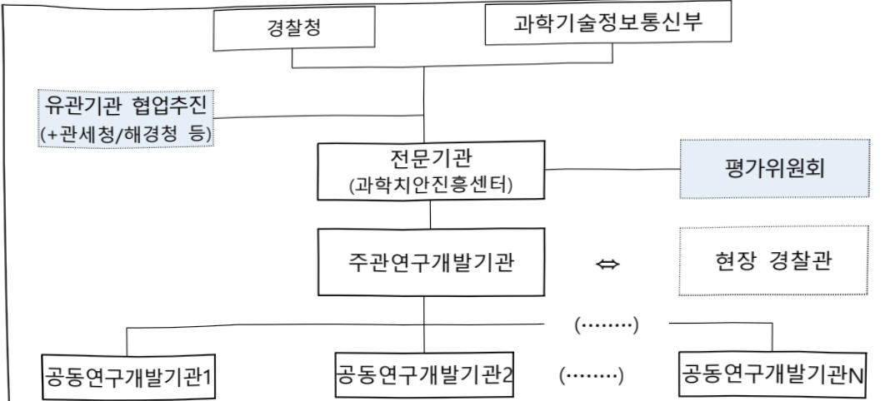

# 불법마약류 대응을 위한 현장기술 개발(R&D)

**해당 페이지**: PDF 1090 ~ 1096 쪽 해당

**부처**: 과학기술정보통신부
**분야**: 과학기술
**회계유형**: 일반회계
**2026 확정예산**: 1872.0 백만원
**전년대비 증감률**: None%
**AI 도메인**: 법률/치안

---

### 가. 예산 총괄표

(단위: 백만원, %)

<table border=1 style='margin: auto; word-wrap: break-word;'><tr><td rowspan="2">사업명</td><td rowspan="2">2024년 결산</td><td colspan="2">2025년 예산</td><td colspan="2">2026년 예산</td><td rowspan="2">중감(B-A)</td><td rowspan="2">(B-A)/A</td></tr><tr><td style='text-align: center; word-wrap: break-word;'>본예산</td><td style='text-align: center; word-wrap: break-word;'>추경*(A)</td><td style='text-align: center; word-wrap: break-word;'>요구안</td><td style='text-align: center; word-wrap: break-word;'>본예산(B)</td></tr><tr><td style='text-align: center; word-wrap: break-word;'>불법 마약류 대응을 위한 현장기술 개발</td><td style='text-align: center; word-wrap: break-word;'>-</td><td style='text-align: center; word-wrap: break-word;'>-</td><td style='text-align: center; word-wrap: break-word;'>-</td><td style='text-align: center; word-wrap: break-word;'>1,872</td><td style='text-align: center; word-wrap: break-word;'>1,872</td><td style='text-align: center; word-wrap: break-word;'>1,872</td><td style='text-align: center; word-wrap: break-word;'>순증</td></tr></table>

□ 기능별(내역사업별) 예산 내역

(단위:백만원)

<table border=1 style='margin: auto; word-wrap: break-word;'><tr><td rowspan="2"></td><td colspan="5">2024</td><td colspan="5">2025</td><td rowspan="2">2026예산</td></tr><tr><td style='text-align: center; word-wrap: break-word;'>예산액(추경)</td><td style='text-align: center; word-wrap: break-word;'>예산현액</td><td style='text-align: center; word-wrap: break-word;'>집행액</td><td style='text-align: center; word-wrap: break-word;'>이월액</td><td style='text-align: center; word-wrap: break-word;'>불용액</td><td style='text-align: center; word-wrap: break-word;'>예산액(추경)</td><td style='text-align: center; word-wrap: break-word;'>예산현액</td><td style='text-align: center; word-wrap: break-word;'>집행액</td><td style='text-align: center; word-wrap: break-word;'>이월액</td><td style='text-align: center; word-wrap: break-word;'>불용액</td></tr><tr><td style='text-align: center; word-wrap: break-word;'>○ 기능별 분류(합계)</td><td style='text-align: center; word-wrap: break-word;'>-</td><td style='text-align: center; word-wrap: break-word;'>-</td><td style='text-align: center; word-wrap: break-word;'>-</td><td style='text-align: center; word-wrap: break-word;'>-</td><td style='text-align: center; word-wrap: break-word;'>-</td><td style='text-align: center; word-wrap: break-word;'>-</td><td style='text-align: center; word-wrap: break-word;'>-</td><td style='text-align: center; word-wrap: break-word;'>-</td><td style='text-align: center; word-wrap: break-word;'>-</td><td style='text-align: center; word-wrap: break-word;'>-</td><td style='text-align: center; word-wrap: break-word;'>1,872</td></tr><tr><td style='text-align: center; word-wrap: break-word;'>· 다크웹 및 가상저산 거래추적 연계 마약수사통합시스템 개발 · 기획평가관리비</td><td style='text-align: center; word-wrap: break-word;'>-</td><td style='text-align: center; word-wrap: break-word;'>-</td><td style='text-align: center; word-wrap: break-word;'>-</td><td style='text-align: center; word-wrap: break-word;'>-</td><td style='text-align: center; word-wrap: break-word;'>-</td><td style='text-align: center; word-wrap: break-word;'>-</td><td style='text-align: center; word-wrap: break-word;'>-</td><td style='text-align: center; word-wrap: break-word;'>-</td><td style='text-align: center; word-wrap: break-word;'>-</td><td style='text-align: center; word-wrap: break-word;'>-</td><td style='text-align: center; word-wrap: break-word;'>1,800</td></tr></table>

### 나.사업설명자료

## 1 ) 사업목적·내용

- (①내역: 다크웹 및 가상자산 거래추적 연계 마약수사통합시스템 개발) 마약거래가 이루어지는 다크웹에 접속하는 IP를 특정하고, 주요 결제수단인 가상자산의 지갑 주소를 확보하여 자금의 이동 경로(자금세탁)를 추적하고, 마약 점조직을 식별하여 유통의 근원을 찾아내기 위한 기술개발

- (②내역: 기획평가관리비) 원활한 사업 추진을 위한 기획, 평가, 관리 등 소요 비용

---

## 2 ) 사업개요

## □ 사업근거 및 추진경위

① 법령상 근거 및 조항 적시

- 과학기술기본법 제16조의6(과학기술을 활용한 사회문제 해결)

① 정부는 과학기술을 활용한 삶의 질 향상, 경제적 · 사회적 현안 및 법지구적 문제 등의 해결을 위하여 필요한 시책을 세우고 추진하여야 한다.

② 제1항에 따른 시책을 세우고 추진하는 데 필요한 사항은 대통령령으로 정한다.

- 국가경찰과 자치경찰의 조직 및 운영에 관한 법 제33조(치안에 필요한 연구개발의 지원 등)

① 경찰청장은 치안에 필요한 연구·실험·조사·기술개발(이하 “연구개발사업”이라 한다) 및 전문인력 양성 등 치안분야의 과학기술진흥을 위한 시책을 마련하여 추진하여야 한다.

④ 경찰청장은 연구개발사업을 효율적으로 추진하기 위하여 다음 각 호의 어느 하나에 해당하는 기관 또는 단체 등과 협약을 맺어 연구개발사업을 실시하게 할 수 있다.

경찰청장은 제2항 각 호의 기관 또는 단체 등에 대하여 연구개발사업을 실시하는 데 필요한 경비의 전부 또는 일부를 출연하거나 보조할 수 있다.

④ 제2항에 따른 연구개발사업의 실시와 제3항에 따른 출연금의 지급·사용 및 관리 등에 필요한 사항은 대통령령으로 정한다.

- 마약류 관리에 관한 법률 제3조(일반 행위의 금지)

누구든지 다음 각 호의 어느 하나에 해당하는 행위를 하여서는 아니 된다.

1. 이 법에 따르지 아니한 마약류의 사용

2. 마약의 원료가 되는 식물을 재배하거나 그 성분을 함유하는 원료·종자·종묘(種苗)를 소지, 소유, 관리, 수출입, 수수, 매매 또는 매매의 유인·권유·알선을 하거나 그 성분을 추출하는 행위. 다만, 대통령령으로 정하는 바에 따라 식품의약품안전처장의 승인을 받은 경우는 제외한다.

3. 헤로인, 그 염류(鹽類) 또는 이를 함유하는 것을 소지, 소유, 관리, 수입, 제조, 매매, 매매의 유인·권유·알선, 수수, 운반, 사용, 투약하거나 투약하기 위하여 제공하는 행위. 다만, 대통령령으로 정하는 바에 따라 식품의약품안전처장의 승인을 받은 경우는 제외한다.

4. 마약 또는 향정신성의약품을 제조할 목적으로 원료물질을 제조, 수출입, 매매, 매매의 유인 · 권유 · 알선, 수수, 소지, 소유 또는 사용하는 행위. 다만, 대통령령으로 정하는 바에 따라 식품의약품안전처장의 승인을 받은 경우는 제외한다.

5. 제2조제3호가목의 향정신성의약품 또는 이를 함유하는 향정신성의약품을 소지, 소유, 사용, 관리, 수출입, 제조, 매매, 매매의 유인·권유·알선 또는 수수하는 행위. 다만, 대통령령으로 정하는 바에 따라 식품의약품안전처장의 승인을 받은 경우는 제외한다.

6. 제2조제3호가목의 향정신성의약품의 원료가 되는 식물 또는 버섯류에서 그 성분을 추출하거나 그 식물 또는 버섯류를 수출입, 매매, 매매의 유인·권유·알선, 수수, 흡연 또는 섭취하거나 흡연 또는 섭취할 목적으로 그 식물 또는 버섯류를 소지·소유하는 행위. 다만, 대통령령으로 정하는 바에 따라 식품의약품안전처장의 승인을 받은 경우는 제외한다.

7. 대마를 수출입 · 제조 · 매매하거나 매매를 유인 · 권유 · 알선하는 행위 · 다만, 공무, 학술연구 또는 의료 목적을 위하여 대통령령으로 정하는 바에 따라 식품의약품안전처장의 승인을 받은

---

경우는 제외한다.

13. 타인에게 마약류의 투약, 흡연 또는 섭취를 유인 또는 권유하는 행위. 다만, 제18조제2항제1호 또는 제21조제2항에 따라 허가를 받은 마약 또는 향정신성의약품은 제외한다.

## -마약류 관리에 관한 법률 제28조(마약류의 소매)

① 마약류소매업자가 아니면 마약류취급의료업자가 발급한 마약 또는 향정신성의약품을 기재한 처방전에 따라 조제한 마약 또는 향정신성의약품을 판매하지 못한다. 다만, 마약류취급의료업자가「약사법」에 따라 자신이 직접 조제할 수 있는 경우는 제외한다.

② 마약류소매업자는 그 조제한 처방전을 2년간 보존하여야 한다.

③ 마약류소매업자는 「전자문서 및 전자거래 기본법」 제2조제5호에 따른 전자거래를 통한 마약 또는 향정신성의약품의 판매를 하여서는 아니 된다.

④ 마약류소매업자는 다음 각 호의 어느 하나에 해당하는 경우에는 조제를 거부할 수 있다. 다만, 처방전을 발행한 마약류취급의료업자에게 전화 및 팩스를 이용하거나「정보통신망 이용촉진 및 정보보호 등에 관한 법률」 제2조제1항제1호에 따른 정보통신망을 통하여 다음 각 호에 해당하지 아니함을 확인한 경우에는 그러하지 아니하다.

1. 제4조제1항제3호를 위반하여 마약류취급의료업자가 아닌 자가 발급한 처방전으로 의심되는 경우

2. 제32조제2항에 따른 기재사항의 전부 또는 일부가 기입되어 있지 아니하거나 기재사항을 거짓으로 기입한 것으로 의심되는 처방전의 경우

## ② 추진경위

- '23. 4. ~ '25. 12: 미래치안도전기술개발(핵심원천)* 선행연구를 통한 기초원천기술 공동 개발

* 과기정통부-경찰청 협업사업(수행과제명: 다크웹 범죄예방을 위한 능동형 다크웹 정보 수집 및 분석·추적 기술개발)

- '25. 4. 11.: 과기정통부-경찰청 협력 확대 방안 검토 회의

* 기존 경찰청 단독으로 추진 예정이던 다크웹 및 가상자산 거래추적 연계 마약수사통합

시스템 개발 사업을 효율적인 사업추진을 위해, 1:1 협업 추진하는 방향으로 협의

□ 주요내용

① 사업규모

- 사업기간 : '26~'28

- 최근 5년 간 투입된 사업비(예산액기준, 추경편성한 연도에는 추경포함)

<table border=1 style='margin: auto; word-wrap: break-word;'><tr><td style='text-align: center; word-wrap: break-word;'>$ \underline{\text{所}} $</td><td style='text-align: center; word-wrap: break-word;'>2022</td><td style='text-align: center; word-wrap: break-word;'>2023</td><td style='text-align: center; word-wrap: break-word;'>2024</td><td style='text-align: center; word-wrap: break-word;'>2025</td><td style='text-align: center; word-wrap: break-word;'>2026</td></tr><tr><td style='text-align: center; word-wrap: break-word;'>$ \underline{\text{사업}} $</td><td style='text-align: center; word-wrap: break-word;'>-</td><td style='text-align: center; word-wrap: break-word;'>-</td><td style='text-align: center; word-wrap: break-word;'>-</td><td style='text-align: center; word-wrap: break-word;'>-</td><td style='text-align: center; word-wrap: break-word;'>1,872</td></tr></table>

② 사업추진체계

- 사업시행방법 : 출연

- 사업시행주체 : (재)과학치안진흥센터

---

※ 다부처 사업 - 경찰청(주), 과기정통부

- 사업 수혜자 : 국민, 현장 경찰관, 대학, 출연연, 기업 등

- 보조, 융자, 출연, 출자 등의 경우 보조·융자 등 지원 비율 및 법적근거

<table border=1 style='margin: auto; word-wrap: break-word;'><tr><td style='text-align: center; word-wrap: break-word;'>내역사업명</td><td style='text-align: center; word-wrap: break-word;'>구분</td><td style='text-align: center; word-wrap: break-word;'>피보조·피출연 등 기관명</td><td style='text-align: center; word-wrap: break-word;'>지원 금액 (2026예산)</td><td style='text-align: center; word-wrap: break-word;'>지원 비율(%)</td><td style='text-align: center; word-wrap: break-word;'>보조율 법적근거 (해당 조항)</td></tr><tr><td style='text-align: center; word-wrap: break-word;'>다크웹 및 가상자산 거래추적 연계 마약수사 통합시스템 개발</td><td style='text-align: center; word-wrap: break-word;'>출연</td><td style='text-align: center; word-wrap: break-word;'>산학연</td><td style='text-align: center; word-wrap: break-word;'>1,800</td><td style='text-align: center; word-wrap: break-word;'>100</td><td rowspan="2">국가경찰과 자치경찰의 조직 및 운영에 관한 법률 제33조</td></tr><tr><td style='text-align: center; word-wrap: break-word;'>기획평가 관리비</td><td style='text-align: center; word-wrap: break-word;'>출연</td><td style='text-align: center; word-wrap: break-word;'>(재)과학 치안진흥 센터</td><td style='text-align: center; word-wrap: break-word;'>72</td><td style='text-align: center; word-wrap: break-word;'>100</td></tr></table>

3) 2026년도 예산 산출 근거

① 다크웹 및 가상자산 거래추적 연계 마약수사통합시스템 개발

<table border=1 style='margin: auto; word-wrap: break-word;'><tr><td style='text-align: center; word-wrap: break-word;'>① 다크웹 및 가상자산 거래추적 연계 마약수사통합시스템 개발</td></tr><tr><td style='text-align: center; word-wrap: break-word;'>- (&#x27;26) 1개 과제 × 4,800백만원 × 9/12개월 × 50%(경찰청·과기정통부 1:1)</td></tr><tr><td style='text-align: center; word-wrap: break-word;'>② 기획평가관리비</td></tr><tr><td style='text-align: center; word-wrap: break-word;'>- (&#x27;26) - &#x27;26년 관리대상 1,800백만원 × 4%</td></tr></table>

- (26) 1개 과제 × 4,800백만원 × 9/12개월 × 50%(경찰청·과기정통부 1:1)

② 기획평가관리비

- (26) - '26년 관리대상 1,800백만원 × 4%

## 4 ) 사업효과

□ 사업영향, 산출물 성과지표 등

1 '22~'26년도 성과계획서 상 성과지표 및 최근 5년간 성과 달성도

<table border=1 style='margin: auto; word-wrap: break-word;'><tr><td style='text-align: center; word-wrap: break-word;'>성과지표</td><td style='text-align: center; word-wrap: break-word;'>구분</td><td style='text-align: center; word-wrap: break-word;'>&#x27;22</td><td style='text-align: center; word-wrap: break-word;'>&#x27;23</td><td style='text-align: center; word-wrap: break-word;'>&#x27;24</td><td style='text-align: center; word-wrap: break-word;'>&#x27;25</td><td style='text-align: center; word-wrap: break-word;'>&#x27;26</td><td style='text-align: center; word-wrap: break-word;'>&#x27;26목표치산출근거</td><td style='text-align: center; word-wrap: break-word;'>측정산식(또는 측정방법)</td><td style='text-align: center; word-wrap: break-word;'>자료수집방법(또는 자료출처)</td></tr><tr><td rowspan="3">마약 다크웹접속 탐지정확도(%)</td><td style='text-align: center; word-wrap: break-word;'>목표</td><td style='text-align: center; word-wrap: break-word;'>-</td><td style='text-align: center; word-wrap: break-word;'>-</td><td style='text-align: center; word-wrap: break-word;'>-</td><td style='text-align: center; word-wrap: break-word;'>-</td><td style='text-align: center; word-wrap: break-word;'>신규</td><td rowspan="3">최신 다크웹비익명화 관련논문의 Tor패킷 추적 재현율(89.6%)을 2차년도목표치로 설정하고, 3차년도에는 3% 상향된 수치로 설정함</td><td rowspan="3">Tor네트워크를 통해 다크웹에 접속한 진 증평거프린트 분석을 했을 때 마약 다크웹이라고 예측한 진수 대비 실제 마약 다크웹이었을 때의 정확도를 측정</td><td rowspan="3">공인인증기관성적서 발급</td></tr><tr><td style='text-align: center; word-wrap: break-word;'>실적</td><td style='text-align: center; word-wrap: break-word;'>-</td><td style='text-align: center; word-wrap: break-word;'>-</td><td style='text-align: center; word-wrap: break-word;'>-</td><td style='text-align: center; word-wrap: break-word;'>-</td><td style='text-align: center; word-wrap: break-word;'>-</td></tr><tr><td style='text-align: center; word-wrap: break-word;'>달성도</td><td style='text-align: center; word-wrap: break-word;'>-</td><td style='text-align: center; word-wrap: break-word;'>-</td><td style='text-align: center; word-wrap: break-word;'>-</td><td style='text-align: center; word-wrap: break-word;'>-</td><td style='text-align: center; word-wrap: break-word;'>-</td></tr><tr><td rowspan="2">가상자산 추적정확도(%)</td><td style='text-align: center; word-wrap: break-word;'>목표</td><td style='text-align: center; word-wrap: break-word;'>-</td><td style='text-align: center; word-wrap: break-word;'>-</td><td style='text-align: center; word-wrap: break-word;'>-</td><td style='text-align: center; word-wrap: break-word;'>-</td><td style='text-align: center; word-wrap: break-word;'>신규</td><td rowspan="2">최신 가상자산 추적 관련 논문의 최고 재현율(84.7%)을</td><td rowspan="2">비정상 패턴을 가진 트랜젝션 중팀블링/믹싱 등을 통해</td><td rowspan="2">공인인증기관성적서 발급</td></tr><tr><td style='text-align: center; word-wrap: break-word;'>실적</td><td style='text-align: center; word-wrap: break-word;'>-</td><td style='text-align: center; word-wrap: break-word;'>-</td><td style='text-align: center; word-wrap: break-word;'>-</td><td style='text-align: center; word-wrap: break-word;'>-</td><td style='text-align: center; word-wrap: break-word;'>-</td></tr></table>

---

<table border=1 style='margin: auto; word-wrap: break-word;'><tr><td rowspan="2"></td><td style='text-align: center; word-wrap: break-word;'></td><td style='text-align: center; word-wrap: break-word;'></td><td style='text-align: center; word-wrap: break-word;'></td><td style='text-align: center; word-wrap: break-word;'></td><td style='text-align: center; word-wrap: break-word;'></td><td rowspan="2">2차년도목표치로설정하고,3차년도에는3% 상향된수치로 설정함</td><td rowspan="2">성공적으로트랜젝션을추적한 재현을측정</td><td rowspan="2"></td></tr><tr><td style='text-align: center; word-wrap: break-word;'>달성도</td><td style='text-align: center; word-wrap: break-word;'>-</td><td style='text-align: center; word-wrap: break-word;'>-</td><td style='text-align: center; word-wrap: break-word;'>-</td><td style='text-align: center; word-wrap: break-word;'>-</td></tr><tr><td rowspan="3">소셜미디어마약광고게시물DB(건)</td><td style='text-align: center; word-wrap: break-word;'>목표</td><td style='text-align: center; word-wrap: break-word;'>-</td><td style='text-align: center; word-wrap: break-word;'>-</td><td style='text-align: center; word-wrap: break-word;'>-</td><td style='text-align: center; word-wrap: break-word;'>16,000</td><td rowspan="3">선행연구에서수집한소셜미디어X상의마약범죄트릿을기준으로약30%상향하여설정</td><td rowspan="3">마약 관련텍스트,이미지,동영상을포함하는소셜미디어게시물을식별하고,매년누적하여산정</td><td rowspan="3">연구개발데이터</td></tr><tr><td style='text-align: center; word-wrap: break-word;'>실적</td><td style='text-align: center; word-wrap: break-word;'>-</td><td style='text-align: center; word-wrap: break-word;'>-</td><td style='text-align: center; word-wrap: break-word;'>-</td><td style='text-align: center; word-wrap: break-word;'>-</td></tr><tr><td style='text-align: center; word-wrap: break-word;'>달성도</td><td style='text-align: center; word-wrap: break-word;'>-</td><td style='text-align: center; word-wrap: break-word;'>-</td><td style='text-align: center; word-wrap: break-word;'>-</td><td style='text-align: center; word-wrap: break-word;'>-</td></tr><tr><td rowspan="3">기술수요자만족도(점)</td><td style='text-align: center; word-wrap: break-word;'>목표</td><td style='text-align: center; word-wrap: break-word;'>-</td><td style='text-align: center; word-wrap: break-word;'>-</td><td style='text-align: center; word-wrap: break-word;'>-</td><td style='text-align: center; word-wrap: break-word;'>신규</td><td rowspan="3">기술수요자의만족도조사를수행하여지속적·선순환적피드백을통해개발기술이치안현장에서효율적으로활용될수있도록90%이상의만족도획득</td><td rowspan="3">기술수요자대상동사업의기술및성과물에대해만족여부설문조사</td><td rowspan="3">만족도설문조사결과보고서</td></tr><tr><td style='text-align: center; word-wrap: break-word;'>실적</td><td style='text-align: center; word-wrap: break-word;'>-</td><td style='text-align: center; word-wrap: break-word;'>-</td><td style='text-align: center; word-wrap: break-word;'>-</td><td style='text-align: center; word-wrap: break-word;'>-</td></tr><tr><td style='text-align: center; word-wrap: break-word;'>달성도</td><td style='text-align: center; word-wrap: break-word;'>-</td><td style='text-align: center; word-wrap: break-word;'>-</td><td style='text-align: center; word-wrap: break-word;'>-</td><td style='text-align: center; word-wrap: break-word;'>-</td></tr><tr><td rowspan="3">논문표준화된영향력지수(mrnIF)</td><td style='text-align: center; word-wrap: break-word;'>목표</td><td style='text-align: center; word-wrap: break-word;'>-</td><td style='text-align: center; word-wrap: break-word;'>-</td><td style='text-align: center; word-wrap: break-word;'>-</td><td style='text-align: center; word-wrap: break-word;'>신규</td><td rowspan="3">2021년과기정통부주요R&amp;D사업mrnIF평균(69.57)을기준으로매년mrnIF지수70이상논문을게재하도록목표치수립</td><td rowspan="3">성과조사분석평가</td><td rowspan="3">지수데이터</td></tr><tr><td style='text-align: center; word-wrap: break-word;'>실적</td><td style='text-align: center; word-wrap: break-word;'>-</td><td style='text-align: center; word-wrap: break-word;'>-</td><td style='text-align: center; word-wrap: break-word;'>-</td><td style='text-align: center; word-wrap: break-word;'>-</td></tr><tr><td style='text-align: center; word-wrap: break-word;'>달성도</td><td style='text-align: center; word-wrap: break-word;'>-</td><td style='text-align: center; word-wrap: break-word;'>-</td><td style='text-align: center; word-wrap: break-word;'>-</td><td style='text-align: center; word-wrap: break-word;'>-</td></tr></table>

※'26년 신규사업으로 추후 확정 예정

② 성과지표 이외의 연도별 사업추진 경과 및 실적 : 해당사항 없음

③ 향후('26년도 이후) 기대효과 :

- 다크웹 노드 구축을 통한 비익명화 기술(입구노드 316개, 출구노드 158개 구축), 불법 마약 관련 범죄수익 가상자산 추적 기술, 마약광고 탐지 멀티모달 알고리즘 및 실시간 모니터링(X 및 인스타그램 DB 57,000건 확보), 유관기관에 통보할 수 있는 지원기술 등을 개발

- 개발된 기술들을 활용하여 다크웹 추적, 가상자산 흐름 분석, 마약 광고 모니터링

데이터를 통합하고, 텔레그램과 같은 인스턴트 메신저상의 범죄 단서를 추가 확보

하여 다양한 경로와 수법으로 이루어지는 마약범죄를 실시간으로 탐지·분석하는

마약 수사 통합시스템을 개발하며, 기술 실증을 통해 신뢰성과 현장 적용성 강화

---

5) 타당성조사 및 예비타당성조사 시행여부 및 결과 요지 : 해당사항 없음

6) 총사업비 대상사업 정보 : 해당사항 없음

## 7 ) 사업 집행절차

① 다크웹 및 가상자산 거래추적 연계 마약수사통합시스템 개발

<table border=1 style='margin: auto; word-wrap: break-word;'><tr><td style='text-align: center; word-wrap: break-word;'>부처</td><td style='text-align: center; word-wrap: break-word;'></td><td style='text-align: center; word-wrap: break-word;'>피출연·피보조기관</td><td style='text-align: center; word-wrap: break-word;'></td><td style='text-align: center; word-wrap: break-word;'>간접보조사업자·사업수행자</td></tr><tr><td style='text-align: center; word-wrap: break-word;'>과기정통부(1,800백만원)</td><td style='text-align: center; word-wrap: break-word;'>=&gt;(1,800백만원)</td><td style='text-align: center; word-wrap: break-word;'>과학치안진흥센터(-)</td><td style='text-align: center; word-wrap: break-word;'>=&gt;(1,800백만원)</td><td style='text-align: center; word-wrap: break-word;'>미정</td></tr></table>

② 기획평가관리비

<table border=1 style='margin: auto; word-wrap: break-word;'><tr><td style='text-align: center; word-wrap: break-word;'>부처</td><td style='text-align: center; word-wrap: break-word;'></td><td style='text-align: center; word-wrap: break-word;'>피출연·피보조기관</td><td style='text-align: center; word-wrap: break-word;'></td><td style='text-align: center; word-wrap: break-word;'>간접보조사업자·사업수행자</td></tr><tr><td style='text-align: center; word-wrap: break-word;'>과기정통부(72백만원)</td><td style='text-align: center; word-wrap: break-word;'>=&gt;(72백만원)</td><td style='text-align: center; word-wrap: break-word;'>과학치안진흥센터(72백만원)</td><td style='text-align: center; word-wrap: break-word;'>=&gt;(-)</td><td style='text-align: center; word-wrap: break-word;'>-</td></tr></table>

9) 각종 평가 : 해당사항 없음

다. 최근 4년간 결산내역 : 해당사항 없음

---

<table border=1 style='margin: auto; word-wrap: break-word;'><tr><td style='text-align: center; word-wrap: break-word;'>사 업 명</td></tr><tr><td style='text-align: center; word-wrap: break-word;'>(292) 빅데이터 기반 생활전자과 예측 기술개발(R&amp;D) (2535-318)</td></tr></table>

□ 사업 코드 정보

<table border=1 style='margin: auto; word-wrap: break-word;'><tr><td style='text-align: center; word-wrap: break-word;'>구분</td><td style='text-align: center; word-wrap: break-word;'>회계</td><td style='text-align: center; word-wrap: break-word;'>소관</td><td style='text-align: center; word-wrap: break-word;'>실국(기관)</td><td style='text-align: center; word-wrap: break-word;'>계정</td><td style='text-align: center; word-wrap: break-word;'>분야</td><td style='text-align: center; word-wrap: break-word;'>부문</td></tr><tr><td style='text-align: center; word-wrap: break-word;'>코드</td><td style='text-align: center; word-wrap: break-word;'>11</td><td style='text-align: center; word-wrap: break-word;'>13</td><td rowspan="2">국립전파연구원</td><td rowspan="2"></td><td style='text-align: center; word-wrap: break-word;'>130</td><td style='text-align: center; word-wrap: break-word;'>131</td></tr><tr><td style='text-align: center; word-wrap: break-word;'>명칭</td><td style='text-align: center; word-wrap: break-word;'>일반회계</td><td style='text-align: center; word-wrap: break-word;'>과학술정보통신부</td><td style='text-align: center; word-wrap: break-word;'>통신</td><td style='text-align: center; word-wrap: break-word;'>방송통신</td></tr></table>

<table border=1 style='margin: auto; word-wrap: break-word;'><tr><td style='text-align: center; word-wrap: break-word;'>구분</td><td style='text-align: center; word-wrap: break-word;'>프로그램</td><td style='text-align: center; word-wrap: break-word;'>단위사업</td><td style='text-align: center; word-wrap: break-word;'>세부사업</td></tr><tr><td style='text-align: center; word-wrap: break-word;'>코드</td><td style='text-align: center; word-wrap: break-word;'>2500</td><td style='text-align: center; word-wrap: break-word;'>2535</td><td style='text-align: center; word-wrap: break-word;'>318</td></tr><tr><td style='text-align: center; word-wrap: break-word;'>명칭</td><td style='text-align: center; word-wrap: break-word;'>전과활용방송서비스산업</td><td style='text-align: center; word-wrap: break-word;'>전과연구지원</td><td style='text-align: center; word-wrap: break-word;'>빅데이터 기반 생활전자과 예측 기술개발(R&amp;D)</td></tr></table>

□ 사업 성격 (공통요구자료 Ⅱ-1 작성유의사항 4. 참조, 해당하는 사항에 “0” 표시)

<table border=1 style='margin: auto; word-wrap: break-word;'><tr><td rowspan="2">신규</td><td rowspan="2">계속</td><td rowspan="2">완료</td><td style='text-align: center; word-wrap: break-word;'>예비타당성</td><td style='text-align: center; word-wrap: break-word;'>총사업비</td><td style='text-align: center; word-wrap: break-word;'>총액계상</td><td style='text-align: center; word-wrap: break-word;'>사업소관 변경정보</td></tr><tr><td style='text-align: center; word-wrap: break-word;'>실시여부</td><td style='text-align: center; word-wrap: break-word;'>관리대상</td><td style='text-align: center; word-wrap: break-word;'>예산사업</td><td style='text-align: center; word-wrap: break-word;'>2025예산 시 소관</td></tr><tr><td style='text-align: center; word-wrap: break-word;'></td><td style='text-align: center; word-wrap: break-word;'>○</td><td style='text-align: center; word-wrap: break-word;'></td><td style='text-align: center; word-wrap: break-word;'></td><td style='text-align: center; word-wrap: break-word;'></td><td style='text-align: center; word-wrap: break-word;'></td><td style='text-align: center; word-wrap: break-word;'></td></tr></table>

□ 사업 지원 형태 및 지원을 (최소한 한 개는 반드시 선택하시오. 해당사항에 0 표시)

<table border=1 style='margin: auto; word-wrap: break-word;'><tr><td style='text-align: center; word-wrap: break-word;'>$ \underline{\text{冏}} $</td><td style='text-align: center; word-wrap: break-word;'>$ \underline{\text{耆}} $</td><td style='text-align: center; word-wrap: break-word;'>$ \underline{\text{耆}} $</td><td style='text-align: center; word-wrap: break-word;'>$ \underline{\text{扌}} $</td><td style='text-align: center; word-wrap: break-word;'>$ \underline{\text{鲁}} $</td><td style='text-align: center; word-wrap: break-word;'>$ \underline{\text{宀}} $</td><td style='text-align: center; word-wrap: break-word;'>$ \underline{\text{宀}} $</td></tr><tr><td style='text-align: center; word-wrap: break-word;'>$ \underline{\text{O}} $</td><td style='text-align: center; word-wrap: break-word;'></td><td style='text-align: center; word-wrap: break-word;'>$ \underline{\text{O}} $</td><td style='text-align: center; word-wrap: break-word;'></td><td style='text-align: center; word-wrap: break-word;'></td><td style='text-align: center; word-wrap: break-word;'></td><td style='text-align: center; word-wrap: break-word;'></td></tr></table>

## ☐ 사업 소관부처 및 시행주체

<table border=1 style='margin: auto; word-wrap: break-word;'><tr><td style='text-align: center; word-wrap: break-word;'>사업명</td><td colspan="2">구분</td></tr><tr><td rowspan="4">빅데이터 기반 생활전자과 예측 기술개발 (R&amp;D)</td><td rowspan="3">소관부처</td><td style='text-align: center; word-wrap: break-word;'>실·국·과(팀)</td></tr><tr><td style='text-align: center; word-wrap: break-word;'>국립전파연구원</td></tr><tr><td style='text-align: center; word-wrap: break-word;'>전파환경안전과</td></tr><tr><td style='text-align: center; word-wrap: break-word;'>사업시행주체</td><td style='text-align: center; word-wrap: break-word;'>정보통신기획평가원</td></tr></table>

---

### 원본 PDF 크롭 이미지

