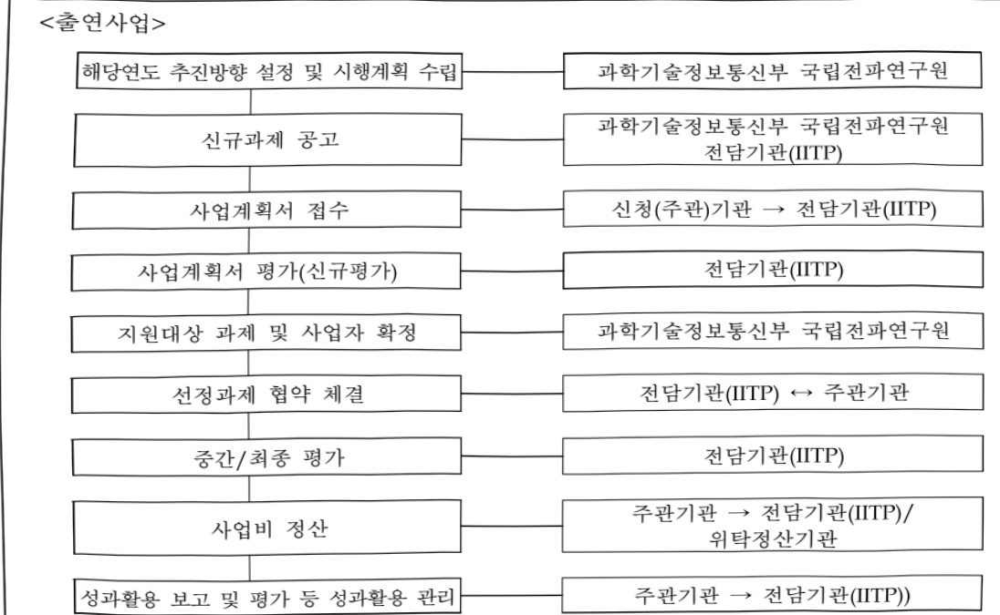

# 빅데이터기반생활전자파예측기술개발(R&D)

**해당 페이지**: PDF 1097 ~ 1104 쪽 해당

**부처**: 과학기술정보통신부
**분야**: 통신
**회계유형**: 일반회계
**2026 확정예산**: 1600.0 백만원
**전년대비 증감률**: None%
**AI 도메인**: 데이터, 통신/네트워크

---

### 가. 예산 총괄표

(단위: 백만원, %)

<table border=1 style='margin: auto; word-wrap: break-word;'><tr><td rowspan="2">사업명</td><td rowspan="2">2024년 결산</td><td colspan="2">2025년 예산</td><td colspan="2">2026년 예산</td><td rowspan="2">중감(B-A)</td><td rowspan="2">(B-A)/A</td></tr><tr><td style='text-align: center; word-wrap: break-word;'>본예산</td><td style='text-align: center; word-wrap: break-word;'>추경*(A)</td><td style='text-align: center; word-wrap: break-word;'>요구안</td><td style='text-align: center; word-wrap: break-word;'>본예산(B)</td></tr><tr><td style='text-align: center; word-wrap: break-word;'>빅데이터 기반생활전자파 예측기술개발(R&amp;D)</td><td style='text-align: center; word-wrap: break-word;'>930</td><td style='text-align: center; word-wrap: break-word;'>1,600</td><td style='text-align: center; word-wrap: break-word;'>-</td><td style='text-align: center; word-wrap: break-word;'>1,600</td><td style='text-align: center; word-wrap: break-word;'>1,600</td><td style='text-align: center; word-wrap: break-word;'>-</td><td style='text-align: center; word-wrap: break-word;'>-</td></tr></table>

□ 기능별(내역사업별) 예산 내역

(단위:백만원)

<table border=1 style='margin: auto; word-wrap: break-word;'><tr><td rowspan="2"></td><td colspan="5">2024</td><td colspan="5">2025</td><td rowspan="2">2026 예산</td></tr><tr><td style='text-align: center; word-wrap: break-word;'>예산액(추정)</td><td style='text-align: center; word-wrap: break-word;'>예산 현액</td><td style='text-align: center; word-wrap: break-word;'>집행액</td><td style='text-align: center; word-wrap: break-word;'>이월액</td><td style='text-align: center; word-wrap: break-word;'>불용액</td><td style='text-align: center; word-wrap: break-word;'>예산액(추정)</td><td style='text-align: center; word-wrap: break-word;'>예산 현액</td><td style='text-align: center; word-wrap: break-word;'>집행액</td><td style='text-align: center; word-wrap: break-word;'>이월액</td><td style='text-align: center; word-wrap: break-word;'>불용액</td></tr><tr><td style='text-align: center; word-wrap: break-word;'>○ 기능별 분류(함께)</td><td style='text-align: center; word-wrap: break-word;'>930</td><td style='text-align: center; word-wrap: break-word;'>930</td><td style='text-align: center; word-wrap: break-word;'>930[930]</td><td style='text-align: center; word-wrap: break-word;'>-</td><td style='text-align: center; word-wrap: break-word;'>-</td><td style='text-align: center; word-wrap: break-word;'>1,600</td><td style='text-align: center; word-wrap: break-word;'>1,600</td><td style='text-align: center; word-wrap: break-word;'>1,600</td><td style='text-align: center; word-wrap: break-word;'>-</td><td style='text-align: center; word-wrap: break-word;'>-</td><td style='text-align: center; word-wrap: break-word;'>1,600</td></tr><tr><td style='text-align: center; word-wrap: break-word;'>• 전자화 박태아터 분석 관리 플랫폼 개발</td><td style='text-align: center; word-wrap: break-word;'>190</td><td style='text-align: center; word-wrap: break-word;'>190</td><td style='text-align: center; word-wrap: break-word;'>190[190]</td><td style='text-align: center; word-wrap: break-word;'>-</td><td style='text-align: center; word-wrap: break-word;'>-</td><td style='text-align: center; word-wrap: break-word;'>350</td><td style='text-align: center; word-wrap: break-word;'>350</td><td style='text-align: center; word-wrap: break-word;'>350</td><td style='text-align: center; word-wrap: break-word;'>-</td><td style='text-align: center; word-wrap: break-word;'>-</td><td style='text-align: center; word-wrap: break-word;'>350</td></tr><tr><td style='text-align: center; word-wrap: break-word;'>• 인공지능 기반 전자화 예측 앞도돔 개발 및 향상 연구</td><td style='text-align: center; word-wrap: break-word;'>700</td><td style='text-align: center; word-wrap: break-word;'>700</td><td style='text-align: center; word-wrap: break-word;'>700[700]</td><td style='text-align: center; word-wrap: break-word;'>-</td><td style='text-align: center; word-wrap: break-word;'>-</td><td style='text-align: center; word-wrap: break-word;'>1,200</td><td style='text-align: center; word-wrap: break-word;'>1,200</td><td style='text-align: center; word-wrap: break-word;'>1,200</td><td style='text-align: center; word-wrap: break-word;'>-</td><td style='text-align: center; word-wrap: break-word;'>-</td><td style='text-align: center; word-wrap: break-word;'>1,200</td></tr><tr><td style='text-align: center; word-wrap: break-word;'>• 예측 기술을 이용한 전자화 인체노출량 평가제도 연구</td><td style='text-align: center; word-wrap: break-word;'>40</td><td style='text-align: center; word-wrap: break-word;'>40</td><td style='text-align: center; word-wrap: break-word;'>40</td><td style='text-align: center; word-wrap: break-word;'>-</td><td style='text-align: center; word-wrap: break-word;'>-</td><td style='text-align: center; word-wrap: break-word;'>50</td><td style='text-align: center; word-wrap: break-word;'>50</td><td style='text-align: center; word-wrap: break-word;'>50</td><td style='text-align: center; word-wrap: break-word;'>-</td><td style='text-align: center; word-wrap: break-word;'>-</td><td style='text-align: center; word-wrap: break-word;'>50</td></tr></table>

### 나.사업설명자료

## 1 ) 사업목적·내용

- (빅데이터 기반 생활전자과 예측 기술개발) 5G 이후 기하급수적으로 증가할 것으로 예상되는 기지국의 전자과 평가방법 전환과 국민 불안감 해소를 위해 AI 기반의 전자과 예측기술 개발

(전자파 빅데이터 분석 관리 플랫폼 개발) 전자파 보유/실측데이터 조사·수집과 데이터 처리 알고리즘 및 데이터 전처리 기술 개발

(인공지능 기반 전자파 예측 알고리즘 개발 및 향상 연구) 인공지능 계산 방정식 /환경별(도심, 부도심, 고속도로 등) 전자파 예측 알고리즘 등의 개발 및 향상 연구

(예측 기술을 이용한 전자과 인체노출량 평가제도 연구) 미래통신 이용 기지국의 전자과 실험실 레벨의 측정 등 평가방식의 타당성 검증

## 2 ) 사업개요

---

## □ 사업근거 및 추진경위

## ① 법령상 근거 및 조항 적시

## - 전파법 제44조의3(안전한 전파환경 기반 조성)

<table border=1 style='margin: auto; word-wrap: break-word;'><tr><td style='text-align: center; word-wrap: break-word;'>제44조의3(안전한 전과환경 기반 조성) 과학기술정보통신부장관은 전자과가 인체, 기자재, 무선설비 등에 미치는 영향을 최소화하고 안전한 전과환경을 조성하기 위하여 다음 각 호의 시책을 마련하여야 한다.</td></tr><tr><td style='text-align: center; word-wrap: break-word;'>1. 전과 이용과 관련된 역기능 방지 및 안전한 전과환경 조성대책의 수립 · 추진</td></tr><tr><td style='text-align: center; word-wrap: break-word;'>2. 전자과가 인체에 미치는 영향 등에 관한 종합적인 보호대책의 수립 · 추진</td></tr><tr><td style='text-align: center; word-wrap: break-word;'>3. 기자재의 전자과장해를 방지하고 전자과로부터 기자재를 보호하기 위한 전자과적합성에 관한 정책의 수립 · 추진</td></tr><tr><td style='text-align: center; word-wrap: break-word;'>4. 전자과 인체흡수율, 전자과강도 및 전과환경 등에 대한 관련 기준 마련 및 측정 · 조사</td></tr><tr><td style='text-align: center; word-wrap: break-word;'>5. 전자과 차폐 · 차단 및 저감(低減) 기술 등 전자과 역기능 해소를 위한 기반기술 연구</td></tr><tr><td style='text-align: center; word-wrap: break-word;'>6. 안전한 전과환경 기반 조성을 위한 교육 및 홍보계획의 수립 · 시행</td></tr></table>

제44조의3(안전한 전과환경 기반 조성) 과학기술정보통신부장관은 전자과가 인체, 기자재, 무선설비 등에 미치는 영향을 최소화하고 안전한 전과환경을 조성하기 위하여 다음 각 호의 시책을 마련하여야 한다.

1. 전파 이용과 관련된 역기능 방지 및 안전한 전파환경 조성대책의 수립 · 추진

2. 전자과가 인체에 미치는 영향 등에 관한 종합적인 보호대책의 수립 · 추진

3. 기자재의 전자과장해를 방지하고 전자과로부터 기자재를 보호하기 위한 전자과적합성에 관한 정책의 수립 · 추진

4. 전자과 인체흡수율, 전자과강도 및 전파환경 등에 대한 관련 기준 마련 및 측정 · 조사

5. 전자과 차폐 · 차단 및 저감(低減) 기술 등 전자과 역기능 해소를 위한 기반기술 연구

6. 안전한 전파환경 기반 조성을 위한 교육 및 홍보계획의 수립 · 시행

## - 전파법 제47조의2(전자파 인체보호 기준 등)

<table border=1 style='margin: auto; word-wrap: break-word;'><tr><td style='text-align: center; word-wrap: break-word;'>제47조의 2(전자과 인체보호 기준 등) ① 과학기술정보통신부장관은 무선설비, 전기·전자기기 등(이하 &quot;무선설비등&quot;이라 한다)에서 발생하는 전자과가 인체에 미치는 영향을 고려하여 다음 각 호의 사항을 정하여 고시하여야 한다.</td></tr><tr><td style='text-align: center; word-wrap: break-word;'>1. 전자과 인체보호기준</td></tr><tr><td style='text-align: center; word-wrap: break-word;'>2. 전자과 등급기준</td></tr><tr><td style='text-align: center; word-wrap: break-word;'>3. 전자과 강도 측정기준</td></tr><tr><td style='text-align: center; word-wrap: break-word;'>4. 전자과 흡수율 측정기준</td></tr><tr><td style='text-align: center; word-wrap: break-word;'>5. 전자과 측정대상 기자재와 측정방법</td></tr><tr><td style='text-align: center; word-wrap: break-word;'>6. 전자과 등급 표시대상과 표시방법</td></tr><tr><td style='text-align: center; word-wrap: break-word;'>7. 그 밖에 전자과로부터 인체를 보호하기 위하여 필요한 사항</td></tr></table>

1. 전자과 인체보호기준

2. 전자과 등급기준

3. 전자과 강도 측정기준

4. 전자과 흡수율 측정기준

5. 전자과 측정대상 기자재와 측정방법

6. 전자과 등급 표시대상과 표시방법

7. 그 밖에 전자과로부터 인체를 보호하기 위하여 필요한 사항

## - 전파법 제61조(전파연구)

<table border=1 style='margin: auto; word-wrap: break-word;'><tr><td style='text-align: center; word-wrap: break-word;'>제61조(전과 연구) ① 과학기술정보통신부장관은 전과이용을 촉진하고 보호하기 위하여 필요한 연구를 수행하여야 한다.</td></tr><tr><td style='text-align: center; word-wrap: break-word;'>② 제1항에 따라 수행하는 연구는 다음 각 호와 같다.</td></tr><tr><td style='text-align: center; word-wrap: break-word;'>4. 전자과장해 및 전과가 인체에 미치는 위해에 관한 연구</td></tr><tr><td style='text-align: center; word-wrap: break-word;'>5. 전자과 흡수율의 측정에 관한 연구</td></tr><tr><td style='text-align: center; word-wrap: break-word;'>6. 전과기기의 측정방법 및 측정기술에 관한 연구</td></tr></table>

② 제1항에 따라 수행하는 연구는 다음 각 호와 같다.

4. 전자파장해 및 전파가 인체에 미치는 위해에 관한 연구

5. 전자파 흡수율의 측정에 관한 연구

6. 전파기기의 측정방법 및 측정기술에 관한 연구

## - 전파법 제62조(기술개발의 촉진)

---

<table border=1 style='margin: auto; word-wrap: break-word;'><tr><td style='text-align: center; word-wrap: break-word;'>제62조(기술개발의 촉진) 과학기술정보통신부장관은 전과산업과 방송기기산업의 기반 조성에 필요한 기술의 연구·개발 및 활용을 촉진하기 위하여 다음 각 호의 사항을 추진하여야 한다.</td></tr><tr><td style='text-align: center; word-wrap: break-word;'>4. 산업계·학계 및 연구계의 공동 연구·개발</td></tr><tr><td style='text-align: center; word-wrap: break-word;'>5. 그 밖에 기술개발을 위하여 필요한 사항</td></tr></table>

4. 산업계·학계 및 연구계의 공동 연구·개발

5.그밖에기술개발을위하여필요한사항

② 추진경위 - 사업 시작년도, 추진배경, 부처별 중점과제, 대통령 공약사항 등

- 2018. 05 : 「인공지능(AI) R&D 전략」 수립, AI 기술 자체를 인재, 기반(인프라) 분야 중심으로, 기술 파급력이 높은 일부 서비스·산업분야 AI개발을 추진

* (기술) 인지, 학습 등을 위한 AI SW, AI 성능향상을 위한 HW, AI이론기반을 제공하는 기초과학 분야, (인재) AI개발 핵심 인재양성 등, (기반) 데이터, 컴퓨팅 파워 제공 등

※ 전략목표('22년) : 세계 4대 AI 강국 도약, 우수 인재 5천여 명 확보, AI 데이터 1.6억 여 건 구축

- 2019. 01 : 제3차 「전파진흥기본계획 (‘19~’23)」 수립, ‘혁신적인 전파활용으로 열어가는 초연결 지능화 사회’ 라는 비전 하에 4대 분야* 11개 중점 과제로 구성 * (제도) 융합·혁신 패러다임에 부응하는 제도를 마련, (산업) 전파기반 산업의 활력제고, (자원) 초연결 혁신성장을 위한 전파자원공급, (환경) 사람 중심의 안전한 전파이용 환경 등

· 전자과 인체보호 분야는 (전략4) 사람 중심의 안전한 전파 이용환경, [과제10] 신기술에 대응한 전자과 안전 기준 정립 과제를 제시

* 신기술 환경에서도 안전한 전파이용 질서를 유지하기 위해 새로운 기기 및 시스템에 대한 전자파 안전기준 개발 및 대응 체계마련

- 2021. 01 : 2021년 [5G+ 전략] 추진계획(안) 수립, '21년을 세계 최고의 5G+ 융합생태계 창출의 원년으로 삼을 수 있도록 정책 점검 및 실행력 강화, '5G 융합생태계 조기 구축 추진

22년까지 전국을 춤춤히 연결하는 5G 전국당 조기구축 촉진

※ (20) 서울, 6대 광역시 → (21) 85개시 주요 행정동 → (22) 85개시 행정동 / 주요 읍면 중심지

- 2024. 10 : 제4차 「전파진흥기본계획 (’24~’28)」 수립

· 전자과 인체보호 분야는 '전략4, 안전하고 국민이 신뢰할 수 있는 전과환경 조성, [과제12] 합리적 제도 및 엄정한 관리로 깨끗한 전과환경 조성, [과제12-1] 전자과 인체보호 강화 및 국민우려 해소('24~28) 제시

## □ 주요내용

① 사업규모

- 총사업비(해당되는 경우에만 기재) : 해당없음

- 사업기간 : '22~'26

-최근 5년 간 투입된 사업비(예산액기준, 추경편성한 연도에는 추경포함)

---

<table border=1 style='margin: auto; word-wrap: break-word;'><tr><td style='text-align: center; word-wrap: break-word;'>$ \underline{\text{角}} $</td><td style='text-align: center; word-wrap: break-word;'>2022</td><td style='text-align: center; word-wrap: break-word;'>2023</td><td style='text-align: center; word-wrap: break-word;'>2024</td><td style='text-align: center; word-wrap: break-word;'>2025</td><td style='text-align: center; word-wrap: break-word;'>2026</td></tr><tr><td style='text-align: center; word-wrap: break-word;'>$ \underline{\text{人}} $</td><td style='text-align: center; word-wrap: break-word;'>1,000</td><td style='text-align: center; word-wrap: break-word;'>1,100</td><td style='text-align: center; word-wrap: break-word;'>930</td><td style='text-align: center; word-wrap: break-word;'>1,600</td><td style='text-align: center; word-wrap: break-word;'>1,600</td></tr></table>

-기타:해당없음

## ② 사업추진체계

- 사업시행방법 : 직접수행, 출연

- 사업시행주체 : 과학기술정보통신부 국립전과연구원, 정보통신기획평가원

- 사업 수혜자 : 이동통신 사업자, 전자과 측정기관(국가, 공공기관), 일반 국민 등

- 보조, 융자, 출연, 출자 등의 경우 보조·융자 등 지원 비율 및 법적근거

<table border=1 style='margin: auto; word-wrap: break-word;'><tr><td style='text-align: center; word-wrap: break-word;'>내역사업명</td><td style='text-align: center; word-wrap: break-word;'>구분</td><td style='text-align: center; word-wrap: break-word;'>피보조·피출연 등 기관명</td><td style='text-align: center; word-wrap: break-word;'>지원 금액 (2026예산안)</td><td style='text-align: center; word-wrap: break-word;'>지원 비율(%)</td><td style='text-align: center; word-wrap: break-word;'>보조율 법적근거 (해당 조항)</td></tr><tr><td style='text-align: center; word-wrap: break-word;'>전자파 박데이터 분석 관리 플랫폼 개발</td><td style='text-align: center; word-wrap: break-word;'>출연</td><td style='text-align: center; word-wrap: break-word;'>정보통신 기획평가원 (IITP)</td><td style='text-align: center; word-wrap: break-word;'>350</td><td style='text-align: center; word-wrap: break-word;'>100</td><td style='text-align: center; word-wrap: break-word;'>· 국가연구개발혁신법 제22조제3항 · 정보통신 진흥 및 융합 활성화 등에 관한 특별법 제32조제3항</td></tr><tr><td style='text-align: center; word-wrap: break-word;'>인공지능 기반 전자파 예측 알고리즘 개발 및 향상 연구</td><td style='text-align: center; word-wrap: break-word;'>출연</td><td style='text-align: center; word-wrap: break-word;'>정보통신 기획평가원 (IITP)</td><td style='text-align: center; word-wrap: break-word;'>1,200</td><td style='text-align: center; word-wrap: break-word;'>100</td><td style='text-align: center; word-wrap: break-word;'>· 국가연구개발혁신법 제22조제3항 · 정보통신 진흥 및 융합 활성화 등에 관한 특별법 제32조제3항</td></tr></table>

## 3 ) 2026년도 예산 산출 근거

① 전자파 빅데이터 분석 관리 플랫폼 개발 : 350백만원

- (산출) 실내외 환경의 측정데이터 확보), 실측데이터 DB화, 측정데이터 분석 및 시각화 등 빅데이터 분석 관리 플랫폼 개발 350백만원

② 인공지능 기반 전자파 예측 알고리즘 개발 및 향상 연구 : 1,200백만원

- (산출) 건물 내부의 전자파 분석 및 데이터 처리결과와 예측 알고리즘과의 연동, 실외 환경의 지형데이터 처리, 3D 건물 데이터 처리 등 전자파 예측 알고리즘 개발 및 향상 연구 1,200백만원

③ 예측 기술을 이용한 전자파 인체노출량 평가제도 연구 : 50백만원

- (산출) 실내환경의 측정데이터 및 예측 결과 등의 타당성 검증 50백만원

## 4 ) 사업효과

□ 사업영향, 산출물 성과지표 등

① 2022~2026년도 성과계획서 상 성과지표 및 최근 5년간 성과 달성도

---

<table border=1 style='margin: auto; word-wrap: break-word;'><tr><td style='text-align: center; word-wrap: break-word;'>성과지표</td><td style='text-align: center; word-wrap: break-word;'>구분</td><td style='text-align: center; word-wrap: break-word;'>2022</td><td style='text-align: center; word-wrap: break-word;'>2023</td><td style='text-align: center; word-wrap: break-word;'>2024</td><td style='text-align: center; word-wrap: break-word;'>2025</td><td style='text-align: center; word-wrap: break-word;'>2026</td><td style='text-align: center; word-wrap: break-word;'>2026 목표치산출근거</td><td style='text-align: center; word-wrap: break-word;'>측정산식(또는 측정방법)</td><td style='text-align: center; word-wrap: break-word;'>자료수집방법(또는 자료출처)</td></tr><tr><td rowspan="3">국제표준 기고(단위:건)</td><td style='text-align: center; word-wrap: break-word;'>목표</td><td style='text-align: center; word-wrap: break-word;'>1</td><td style='text-align: center; word-wrap: break-word;'>1</td><td style='text-align: center; word-wrap: break-word;'>1</td><td style='text-align: center; word-wrap: break-word;'>1</td><td style='text-align: center; word-wrap: break-word;'>1</td><td rowspan="3">국제표준 기고 또는 제안</td><td rowspan="3">(제출건수/목표 건수) × 100</td><td rowspan="3">ITU 의장보고서 또는 IEC 기고서</td></tr><tr><td style='text-align: center; word-wrap: break-word;'>실적</td><td style='text-align: center; word-wrap: break-word;'>1</td><td style='text-align: center; word-wrap: break-word;'>1</td><td style='text-align: center; word-wrap: break-word;'>1</td><td style='text-align: center; word-wrap: break-word;'>1</td><td style='text-align: center; word-wrap: break-word;'>-</td></tr><tr><td style='text-align: center; word-wrap: break-word;'>달성도</td><td style='text-align: center; word-wrap: break-word;'>100</td><td style='text-align: center; word-wrap: break-word;'>100</td><td style='text-align: center; word-wrap: break-word;'>100</td><td style='text-align: center; word-wrap: break-word;'>100</td><td style='text-align: center; word-wrap: break-word;'>-</td></tr><tr><td rowspan="3">논문 제출(단위:건)</td><td style='text-align: center; word-wrap: break-word;'>목표</td><td style='text-align: center; word-wrap: break-word;'>1</td><td style='text-align: center; word-wrap: break-word;'>1</td><td style='text-align: center; word-wrap: break-word;'>1</td><td style='text-align: center; word-wrap: break-word;'>1</td><td style='text-align: center; word-wrap: break-word;'>1</td><td rowspan="3">국제학회 제출(SCI급 1건)</td><td rowspan="3">(제출건수/목표 건수) × 100</td><td rowspan="3">논문 채택결과</td></tr><tr><td style='text-align: center; word-wrap: break-word;'>실적</td><td style='text-align: center; word-wrap: break-word;'>1</td><td style='text-align: center; word-wrap: break-word;'>1</td><td style='text-align: center; word-wrap: break-word;'>1</td><td style='text-align: center; word-wrap: break-word;'>1</td><td style='text-align: center; word-wrap: break-word;'>-</td></tr><tr><td style='text-align: center; word-wrap: break-word;'>달성도</td><td style='text-align: center; word-wrap: break-word;'>100</td><td style='text-align: center; word-wrap: break-word;'>100</td><td style='text-align: center; word-wrap: break-word;'>100</td><td style='text-align: center; word-wrap: break-word;'>100</td><td style='text-align: center; word-wrap: break-word;'>-</td></tr></table>

## ② 성과지표 이외의 연도별 사업추진 경과 및 실적

<table border=1 style='margin: auto; word-wrap: break-word;'><tr><td style='text-align: center; word-wrap: break-word;'>2022</td><td style='text-align: center; word-wrap: break-word;'>- 고정형 전자파 정밀 수집기 시제품 개발- 이동형 전자파 측정시스템 특허출원 1건- 5G 기지국 전자파 평가방법 연구결과 BioEM 국제학회 논문 발표 1건- 소도시 환경의 3.5GHz 5G 기지국 전처리기의 핵심변수, AI 학습을 위한 변수 도출</td></tr><tr><td style='text-align: center; word-wrap: break-word;'>2023</td><td style='text-align: center; word-wrap: break-word;'>- 이동형 전자파 측정시스템 시제품 개발- 드론 이용 전자파 측정시스템 특허출원 1건- 5G 기지국 전자파 평가방법 연구결과 BioEM 국제학회 논문 발표 1건- 중도시 환경의 빅데이터 전처리 핵심변수 및 AI 학습을 위한 변수 도출</td></tr><tr><td style='text-align: center; word-wrap: break-word;'>2024</td><td style='text-align: center; word-wrap: break-word;'>- 드론 이용 전자파 측정시스템 시제품 개발- 드론 이용 5G 기지국의 복사패턴 측정장비 특허출원 1건- 5G 기지국 전자파 평가방법 연구결과 BioEM 국제학회 논문발표 1건- 부도심 환경의 빅데이터 전처리 핵심변수 및 AI 학습을 위한 변수 도출</td></tr><tr><td style='text-align: center; word-wrap: break-word;'>2025</td><td style='text-align: center; word-wrap: break-word;'>- 실시간 전자파 측정시스템 시제품 개발- 실시간 전자파 측정장비 특허출원 1건- 5G 전자파 인체노출량 평가방법 연구결과 BioEM 국제학회 논문발표 1건</td></tr></table>

## ③향후(2026년도 이후)기대효과

- (기술적 기대효과) 전자과 실측 빅데이터 활용 및 인공지능 기술을 이용하여 전자과 예측 알고리즘을 개발함으로서 전파환경의 디지털 뉴딜을 실현하고,

5G의 3차원(공간), 4차원(공간+시간 변화량) 측정 기법 확보를 통해 해당 기술의 조기 산업화 추진 및 타국 대비 기술 우위 확보

- (사회적 기대효과) 국민이 원하는 모든 장소에서 실시간 전자과 노출량 정보를 제공하여 전자과로 인한 피담과 민원을 근본적으로 해소

28 GHz 이상의 높은 주파수 이용과 6G 등 새비스 출현으로 인한 무선국 설치 급증에 대비하여 국민들에게 실시간 전자과 인체노출 정보 제공(전자과 인체보호 정책 전자과 갈등 사전 방지 대책에 활용)

---

- (경제적 기대효과) 6G 등 완통신 기술에 확대 적용하여 다양한 산업 분야를 연결하는 전과 응용 서비스 등을 통해 완성장 기술 산업을 창출하고,

자율 주행·비행 항공 산업(드론, UAM, UTM 등) 및 전파·전자파 시뮬레이션 분야 중소기업 경제 진흥 활성화

## 5 ) 타당성조사 및 예비타당성조사 시행여부 및 결과 요지 : 해당없음

6) 총사업비 대상사업 정보 : 해당없음

## 7 ) 사업 집행절차

0 전자과 빅데이터 분석 관리 플랫폼 개발, 인공지능 기반 전자과 예측 알고리즘 개발 및

향상 연구(출연사업), 예측 기술을 이용한 전자과 인체노출량 평가제도 연구(직접수행사업)

<table border=1 style='margin: auto; word-wrap: break-word;'><tr><td style='text-align: center; word-wrap: break-word;'>부처</td><td style='text-align: center; word-wrap: break-word;'></td><td style='text-align: center; word-wrap: break-word;'>피출연기관</td><td style='text-align: center; word-wrap: break-word;'></td><td style='text-align: center; word-wrap: break-word;'>수행자</td></tr><tr><td style='text-align: center; word-wrap: break-word;'>국립전과연구원</td><td style='text-align: center; word-wrap: break-word;'>=&gt; (1,550백만원)</td><td style='text-align: center; word-wrap: break-word;'>정보통신기획평가원 (IITP)</td><td style='text-align: center; word-wrap: break-word;'>=&gt; (1,550백만원)</td><td style='text-align: center; word-wrap: break-word;'>연구수행기관</td></tr><tr><td style='text-align: center; word-wrap: break-word;'>국립전과연구원</td><td colspan="3">=&gt; (50백만원)</td><td style='text-align: center; word-wrap: break-word;'>국립전과연구원 (직접수행)</td></tr></table>

---

## 8 ) 각종 평가 : 해당없음

### 다. 최근 4년간 결산내역

## 1 ) 결산표

☐ 부처 결산내역

(단위: 백만원, %)

<table border=1 style='margin: auto; word-wrap: break-word;'><tr><td rowspan="2">연도</td><td colspan="3">예산액</td><td rowspan="2">예산현액(A)</td><td rowspan="2">집행액(B)</td><td rowspan="2">집행률(B/A)</td><td rowspan="2">다음연도이월액</td><td rowspan="2">불용액</td></tr><tr><td style='text-align: center; word-wrap: break-word;'>본예산</td><td style='text-align: center; word-wrap: break-word;'>추경중감액</td><td style='text-align: center; word-wrap: break-word;'>추경</td></tr><tr><td style='text-align: center; word-wrap: break-word;'>2022</td><td style='text-align: center; word-wrap: break-word;'>1,000</td><td style='text-align: center; word-wrap: break-word;'>-</td><td style='text-align: center; word-wrap: break-word;'>1,000</td><td style='text-align: center; word-wrap: break-word;'>-</td><td style='text-align: center; word-wrap: break-word;'>-</td><td style='text-align: center; word-wrap: break-word;'>-</td><td style='text-align: center; word-wrap: break-word;'>1,000</td><td style='text-align: center; word-wrap: break-word;'>1,000</td></tr><tr><td style='text-align: center; word-wrap: break-word;'>2023</td><td style='text-align: center; word-wrap: break-word;'>1,100</td><td style='text-align: center; word-wrap: break-word;'>-</td><td style='text-align: center; word-wrap: break-word;'>1,100</td><td style='text-align: center; word-wrap: break-word;'>-</td><td style='text-align: center; word-wrap: break-word;'>-</td><td style='text-align: center; word-wrap: break-word;'>-</td><td style='text-align: center; word-wrap: break-word;'>1,100</td><td style='text-align: center; word-wrap: break-word;'>1,100</td></tr><tr><td style='text-align: center; word-wrap: break-word;'>2024</td><td style='text-align: center; word-wrap: break-word;'>930</td><td style='text-align: center; word-wrap: break-word;'>-</td><td style='text-align: center; word-wrap: break-word;'>930</td><td style='text-align: center; word-wrap: break-word;'>-</td><td style='text-align: center; word-wrap: break-word;'>-</td><td style='text-align: center; word-wrap: break-word;'>-</td><td style='text-align: center; word-wrap: break-word;'>930</td><td style='text-align: center; word-wrap: break-word;'>930</td></tr><tr><td style='text-align: center; word-wrap: break-word;'>2025</td><td style='text-align: center; word-wrap: break-word;'>1,600</td><td style='text-align: center; word-wrap: break-word;'>-</td><td style='text-align: center; word-wrap: break-word;'>1,600</td><td style='text-align: center; word-wrap: break-word;'>-</td><td style='text-align: center; word-wrap: break-word;'>-</td><td style='text-align: center; word-wrap: break-word;'>-</td><td style='text-align: center; word-wrap: break-word;'>1,600</td><td style='text-align: center; word-wrap: break-word;'>-</td></tr></table>

## 2 ) 주요 결산사항

2022~2025년 결산 주요사항 : 해당없음

□ 2025년 이·전용 등 세부내역 : 해당없음

---

<table border=1 style='margin: auto; word-wrap: break-word;'><tr><td style='text-align: center; word-wrap: break-word;'>사 업 명</td></tr><tr><td style='text-align: center; word-wrap: break-word;'>(297) 사람중심인공지능핵심원천기술개발 (2601-312)</td></tr></table>

## □ 사업 코드 정보

<table border=1 style='margin: auto; word-wrap: break-word;'><tr><td style='text-align: center; word-wrap: break-word;'>구분</td><td style='text-align: center; word-wrap: break-word;'>회계</td><td style='text-align: center; word-wrap: break-word;'>소관</td><td style='text-align: center; word-wrap: break-word;'>실국(기관)</td><td style='text-align: center; word-wrap: break-word;'>계정</td><td style='text-align: center; word-wrap: break-word;'>분야</td><td style='text-align: center; word-wrap: break-word;'>부문</td></tr><tr><td style='text-align: center; word-wrap: break-word;'>코드</td><td rowspan="2">일반회계</td><td style='text-align: center; word-wrap: break-word;'>과학기술</td><td style='text-align: center; word-wrap: break-word;'>인공지능기반</td><td rowspan="2">-</td><td style='text-align: center; word-wrap: break-word;'>130</td><td style='text-align: center; word-wrap: break-word;'>133</td></tr><tr><td style='text-align: center; word-wrap: break-word;'>명칭</td><td style='text-align: center; word-wrap: break-word;'>정보통신부</td><td style='text-align: center; word-wrap: break-word;'>정책관</td><td style='text-align: center; word-wrap: break-word;'>통신</td><td style='text-align: center; word-wrap: break-word;'>정보통신</td></tr></table>

<table border=1 style='margin: auto; word-wrap: break-word;'><tr><td style='text-align: center; word-wrap: break-word;'>구분</td><td style='text-align: center; word-wrap: break-word;'>프로그램</td><td style='text-align: center; word-wrap: break-word;'>단위사업</td><td style='text-align: center; word-wrap: break-word;'>세부사업</td></tr><tr><td style='text-align: center; word-wrap: break-word;'>코드</td><td style='text-align: center; word-wrap: break-word;'>2600</td><td style='text-align: center; word-wrap: break-word;'>2601</td><td style='text-align: center; word-wrap: break-word;'>312</td></tr><tr><td style='text-align: center; word-wrap: break-word;'>명칭</td><td style='text-align: center; word-wrap: break-word;'>인공지능데이터진흥</td><td style='text-align: center; word-wrap: break-word;'>AI기술개발(일반)</td><td style='text-align: center; word-wrap: break-word;'>사람중심인공지능혁신원천기술개발(R&amp;D)</td></tr></table>

□ 사업 성격 (공통요구자료 Ⅱ-1 작성유의사항 4. 참조, 해당하는 사항에 “○” 표시)

<table border=1 style='margin: auto; word-wrap: break-word;'><tr><td style='text-align: center; word-wrap: break-word;'>신규</td><td style='text-align: center; word-wrap: break-word;'>계속</td><td style='text-align: center; word-wrap: break-word;'>완료</td><td style='text-align: center; word-wrap: break-word;'>예비타당성실시여부</td><td style='text-align: center; word-wrap: break-word;'>총사업비관리대상</td><td style='text-align: center; word-wrap: break-word;'>총액계상예산사업</td><td style='text-align: center; word-wrap: break-word;'>사업소관 변경정보</td></tr><tr><td style='text-align: center; word-wrap: break-word;'></td><td style='text-align: center; word-wrap: break-word;'>O</td><td style='text-align: center; word-wrap: break-word;'></td><td style='text-align: center; word-wrap: break-word;'>O</td><td style='text-align: center; word-wrap: break-word;'></td><td style='text-align: center; word-wrap: break-word;'></td><td style='text-align: center; word-wrap: break-word;'></td></tr></table>

□ 사업 지원 형태 및 지원을 (최소한 한 개는 반드시 선택하시오. 해당사항에 O 표시)

<table border=1 style='margin: auto; word-wrap: break-word;'><tr><td style='text-align: center; word-wrap: break-word;'>직접</td><td style='text-align: center; word-wrap: break-word;'>출자</td><td style='text-align: center; word-wrap: break-word;'>출연</td><td style='text-align: center; word-wrap: break-word;'>보조</td><td style='text-align: center; word-wrap: break-word;'>융자</td><td style='text-align: center; word-wrap: break-word;'>국고보조율(%)</td><td style='text-align: center; word-wrap: break-word;'>융자율(%)</td></tr><tr><td style='text-align: center; word-wrap: break-word;'></td><td style='text-align: center; word-wrap: break-word;'></td><td style='text-align: center; word-wrap: break-word;'>O</td><td style='text-align: center; word-wrap: break-word;'></td><td style='text-align: center; word-wrap: break-word;'></td><td style='text-align: center; word-wrap: break-word;'></td><td style='text-align: center; word-wrap: break-word;'></td></tr></table>

## □ 사업 담당자

<table border=1 style='margin: auto; word-wrap: break-word;'><tr><td style='text-align: center; word-wrap: break-word;'>사업명</td><td colspan="2">구분</td></tr><tr><td rowspan="3">사람중심인공지능핵심원천기술개발</td><td rowspan="2">소관부처</td><td style='text-align: center; word-wrap: break-word;'>인공지능정책실인공지능정책기획관</td></tr><tr><td style='text-align: center; word-wrap: break-word;'>디지털인재양성과</td></tr><tr><td style='text-align: center; word-wrap: break-word;'>사업시행주체</td><td style='text-align: center; word-wrap: break-word;'>정보통신기획평가원</td></tr></table>

---

### 원본 PDF 크롭 이미지

