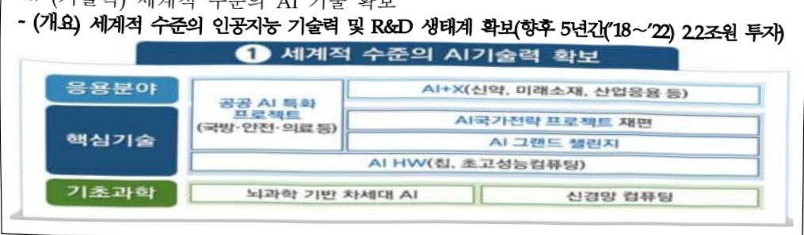
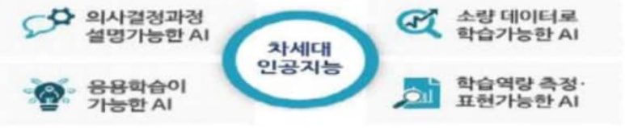
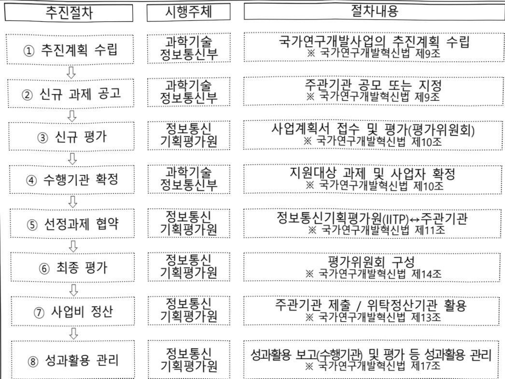

# 사람중심인공지능핵심원천기술개발(R&D)

**해당 페이지**: PDF 1105 ~ 1115 쪽 해당

**부처**: 과학기술정보통신부
**분야**: 통신
**회계유형**: 일반회계
**2026 확정예산**: 42860.0 백만원
**전년대비 증감률**: None%
**AI 도메인**: 데이터, 교육/인재, 디지털전환(AX)

---

<table border=1 style='margin: auto; word-wrap: break-word;'><tr><td style='text-align: center; word-wrap: break-word;'>사 업 명</td></tr><tr><td style='text-align: center; word-wrap: break-word;'>(297) 사람중심인공지능핵심원천기술개발 (2601-312)</td></tr></table>

## □ 사업 코드 정보

<table border=1 style='margin: auto; word-wrap: break-word;'><tr><td style='text-align: center; word-wrap: break-word;'>구분</td><td style='text-align: center; word-wrap: break-word;'>회계</td><td style='text-align: center; word-wrap: break-word;'>소관</td><td style='text-align: center; word-wrap: break-word;'>실국(기관)</td><td style='text-align: center; word-wrap: break-word;'>계정</td><td style='text-align: center; word-wrap: break-word;'>분야</td><td style='text-align: center; word-wrap: break-word;'>부문</td></tr><tr><td style='text-align: center; word-wrap: break-word;'>코드</td><td rowspan="2">일반회계</td><td style='text-align: center; word-wrap: break-word;'>과학기술</td><td style='text-align: center; word-wrap: break-word;'>인공지능기반</td><td rowspan="2">-</td><td style='text-align: center; word-wrap: break-word;'>130</td><td style='text-align: center; word-wrap: break-word;'>133</td></tr><tr><td style='text-align: center; word-wrap: break-word;'>명칭</td><td style='text-align: center; word-wrap: break-word;'>정보통신부</td><td style='text-align: center; word-wrap: break-word;'>정책관</td><td style='text-align: center; word-wrap: break-word;'>통신</td><td style='text-align: center; word-wrap: break-word;'>정보통신</td></tr></table>

<table border=1 style='margin: auto; word-wrap: break-word;'><tr><td style='text-align: center; word-wrap: break-word;'>구분</td><td style='text-align: center; word-wrap: break-word;'>프로그램</td><td style='text-align: center; word-wrap: break-word;'>단위사업</td><td style='text-align: center; word-wrap: break-word;'>세부사업</td></tr><tr><td style='text-align: center; word-wrap: break-word;'>코드</td><td style='text-align: center; word-wrap: break-word;'>2600</td><td style='text-align: center; word-wrap: break-word;'>2601</td><td style='text-align: center; word-wrap: break-word;'>312</td></tr><tr><td style='text-align: center; word-wrap: break-word;'>명칭</td><td style='text-align: center; word-wrap: break-word;'>인공지능데이터진흥</td><td style='text-align: center; word-wrap: break-word;'>AI기술개발(일반)</td><td style='text-align: center; word-wrap: break-word;'>사람중심인공지능혁신원천기술개발(R&amp;D)</td></tr></table>

□ 사업 성격 (공통요구자료 Ⅱ-1 작성유의사항 4. 참조, 해당하는 사항에 “○” 표시)

<table border=1 style='margin: auto; word-wrap: break-word;'><tr><td style='text-align: center; word-wrap: break-word;'>신규</td><td style='text-align: center; word-wrap: break-word;'>계속</td><td style='text-align: center; word-wrap: break-word;'>완료</td><td style='text-align: center; word-wrap: break-word;'>예비타당성실시여부</td><td style='text-align: center; word-wrap: break-word;'>총사업비관리대상</td><td style='text-align: center; word-wrap: break-word;'>총액계상예산사업</td><td style='text-align: center; word-wrap: break-word;'>사업소관 변경정보</td></tr><tr><td style='text-align: center; word-wrap: break-word;'></td><td style='text-align: center; word-wrap: break-word;'>O</td><td style='text-align: center; word-wrap: break-word;'></td><td style='text-align: center; word-wrap: break-word;'>O</td><td style='text-align: center; word-wrap: break-word;'></td><td style='text-align: center; word-wrap: break-word;'></td><td style='text-align: center; word-wrap: break-word;'></td></tr></table>

□ 사업 지원 형태 및 지원을 (최소한 한 개는 반드시 선택하시오. 해당사항에 O 표시)

<table border=1 style='margin: auto; word-wrap: break-word;'><tr><td style='text-align: center; word-wrap: break-word;'>직접</td><td style='text-align: center; word-wrap: break-word;'>출자</td><td style='text-align: center; word-wrap: break-word;'>출연</td><td style='text-align: center; word-wrap: break-word;'>보조</td><td style='text-align: center; word-wrap: break-word;'>융자</td><td style='text-align: center; word-wrap: break-word;'>국고보조율(%)</td><td style='text-align: center; word-wrap: break-word;'>융자율(%)</td></tr><tr><td style='text-align: center; word-wrap: break-word;'></td><td style='text-align: center; word-wrap: break-word;'></td><td style='text-align: center; word-wrap: break-word;'>O</td><td style='text-align: center; word-wrap: break-word;'></td><td style='text-align: center; word-wrap: break-word;'></td><td style='text-align: center; word-wrap: break-word;'></td><td style='text-align: center; word-wrap: break-word;'></td></tr></table>

## □ 사업 담당자

<table border=1 style='margin: auto; word-wrap: break-word;'><tr><td style='text-align: center; word-wrap: break-word;'>사업명</td><td colspan="2">구분</td></tr><tr><td rowspan="3">사람중심인공지능핵심원천기술개발</td><td rowspan="2">소관부처</td><td style='text-align: center; word-wrap: break-word;'>인공지능정책실인공지능정책기획관</td></tr><tr><td style='text-align: center; word-wrap: break-word;'>디지털인재양성과</td></tr><tr><td style='text-align: center; word-wrap: break-word;'>사업시행주체</td><td style='text-align: center; word-wrap: break-word;'>정보통신기획평가원</td></tr></table>

---

### 가.예산안 총괄표

(단위: 백만원, %)

<table border=1 style='margin: auto; word-wrap: break-word;'><tr><td rowspan="2">사업명</td><td rowspan="2">2024년 결산</td><td colspan="2">2025년 예산</td><td colspan="2">2026년 예산</td><td rowspan="2">증감 (B-A)</td><td rowspan="2">(B-A)/A</td></tr><tr><td style='text-align: center; word-wrap: break-word;'>본예산</td><td style='text-align: center; word-wrap: break-word;'>추경(A)</td><td style='text-align: center; word-wrap: break-word;'>요구안</td><td style='text-align: center; word-wrap: break-word;'>본예산(B)</td></tr><tr><td style='text-align: center; word-wrap: break-word;'>사람중심인공지능핵심원천기술개발</td><td style='text-align: center; word-wrap: break-word;'>45,075</td><td style='text-align: center; word-wrap: break-word;'>42,860</td><td style='text-align: center; word-wrap: break-word;'>42,860</td><td style='text-align: center; word-wrap: break-word;'>42,860</td><td style='text-align: center; word-wrap: break-word;'>42,860</td><td style='text-align: center; word-wrap: break-word;'>-</td><td style='text-align: center; word-wrap: break-word;'>-</td></tr></table>

□ 기능별(내역사업별), 목별 예산안 내역

(단위:백만원)

<table border=1 style='margin: auto; word-wrap: break-word;'><tr><td rowspan="2"></td><td colspan="5">2024</td><td colspan="5">2025</td><td rowspan="2">2026 예산</td></tr><tr><td style='text-align: center; word-wrap: break-word;'>예산액(추정)</td><td style='text-align: center; word-wrap: break-word;'>예산현액</td><td style='text-align: center; word-wrap: break-word;'>집행액</td><td style='text-align: center; word-wrap: break-word;'>이월액</td><td style='text-align: center; word-wrap: break-word;'>불용액</td><td style='text-align: center; word-wrap: break-word;'>예산액(추정)</td><td style='text-align: center; word-wrap: break-word;'>예산현액</td><td style='text-align: center; word-wrap: break-word;'>집행액</td><td style='text-align: center; word-wrap: break-word;'>이월액</td><td style='text-align: center; word-wrap: break-word;'>불용액</td></tr><tr><td style='text-align: center; word-wrap: break-word;'>○ 기능별 분류(함께)</td><td style='text-align: center; word-wrap: break-word;'>45,075</td><td style='text-align: center; word-wrap: break-word;'>45,075</td><td style='text-align: center; word-wrap: break-word;'>45,075</td><td style='text-align: center; word-wrap: break-word;'>-</td><td style='text-align: center; word-wrap: break-word;'>-</td><td style='text-align: center; word-wrap: break-word;'>42,860</td><td style='text-align: center; word-wrap: break-word;'>42,860</td><td style='text-align: center; word-wrap: break-word;'>42,860</td><td style='text-align: center; word-wrap: break-word;'>-</td><td style='text-align: center; word-wrap: break-word;'>-</td><td style='text-align: center; word-wrap: break-word;'>42,860</td></tr><tr><td style='text-align: center; word-wrap: break-word;'>· AI 학습능력개선기술개발</td><td style='text-align: center; word-wrap: break-word;'>19,380</td><td style='text-align: center; word-wrap: break-word;'>19,380</td><td style='text-align: center; word-wrap: break-word;'>19,380</td><td style='text-align: center; word-wrap: break-word;'>-</td><td style='text-align: center; word-wrap: break-word;'>-</td><td style='text-align: center; word-wrap: break-word;'>17,701</td><td style='text-align: center; word-wrap: break-word;'>17,701</td><td style='text-align: center; word-wrap: break-word;'>17,701</td><td style='text-align: center; word-wrap: break-word;'>-</td><td style='text-align: center; word-wrap: break-word;'>-</td><td style='text-align: center; word-wrap: break-word;'>17,701</td></tr><tr><td style='text-align: center; word-wrap: break-word;'>· AI 활용성개선기술개발</td><td style='text-align: center; word-wrap: break-word;'>25,695</td><td style='text-align: center; word-wrap: break-word;'>25,695</td><td style='text-align: center; word-wrap: break-word;'>25,695</td><td style='text-align: center; word-wrap: break-word;'>-</td><td style='text-align: center; word-wrap: break-word;'>-</td><td style='text-align: center; word-wrap: break-word;'>25,159</td><td style='text-align: center; word-wrap: break-word;'>25,159</td><td style='text-align: center; word-wrap: break-word;'>25,159</td><td style='text-align: center; word-wrap: break-word;'>-</td><td style='text-align: center; word-wrap: break-word;'>-</td><td style='text-align: center; word-wrap: break-word;'>25,159</td></tr><tr><td style='text-align: center; word-wrap: break-word;'>○ 비목별 분류(함께)</td><td style='text-align: center; word-wrap: break-word;'>45,075</td><td style='text-align: center; word-wrap: break-word;'>45,075</td><td style='text-align: center; word-wrap: break-word;'>45,075</td><td style='text-align: center; word-wrap: break-word;'>-</td><td style='text-align: center; word-wrap: break-word;'>-</td><td style='text-align: center; word-wrap: break-word;'>42,860</td><td style='text-align: center; word-wrap: break-word;'>42,860</td><td style='text-align: center; word-wrap: break-word;'>42,860</td><td style='text-align: center; word-wrap: break-word;'>-</td><td style='text-align: center; word-wrap: break-word;'>-</td><td style='text-align: center; word-wrap: break-word;'>42,860</td></tr><tr><td style='text-align: center; word-wrap: break-word;'>· 연구개발활동비등(360-05)</td><td style='text-align: center; word-wrap: break-word;'>45,075</td><td style='text-align: center; word-wrap: break-word;'>45,075</td><td style='text-align: center; word-wrap: break-word;'>45,075</td><td style='text-align: center; word-wrap: break-word;'>-</td><td style='text-align: center; word-wrap: break-word;'>-</td><td style='text-align: center; word-wrap: break-word;'>42,860</td><td style='text-align: center; word-wrap: break-word;'>42,860</td><td style='text-align: center; word-wrap: break-word;'>42,860</td><td style='text-align: center; word-wrap: break-word;'>-</td><td style='text-align: center; word-wrap: break-word;'>-</td><td style='text-align: center; word-wrap: break-word;'>42,860</td></tr><tr><td style='text-align: center; word-wrap: break-word;'>○ 기능·비목별 분류(함께)</td><td style='text-align: center; word-wrap: break-word;'>45,075</td><td style='text-align: center; word-wrap: break-word;'>45,075</td><td style='text-align: center; word-wrap: break-word;'>45,075</td><td style='text-align: center; word-wrap: break-word;'>-</td><td style='text-align: center; word-wrap: break-word;'>-</td><td style='text-align: center; word-wrap: break-word;'>42,860</td><td style='text-align: center; word-wrap: break-word;'>42,860</td><td style='text-align: center; word-wrap: break-word;'>42,860</td><td style='text-align: center; word-wrap: break-word;'>-</td><td style='text-align: center; word-wrap: break-word;'>-</td><td style='text-align: center; word-wrap: break-word;'>42,860</td></tr><tr><td style='text-align: center; word-wrap: break-word;'>· AI 학습능력개선기술개발</td><td style='text-align: center; word-wrap: break-word;'>19,380</td><td style='text-align: center; word-wrap: break-word;'>19,380</td><td style='text-align: center; word-wrap: break-word;'>19,380</td><td style='text-align: center; word-wrap: break-word;'>-</td><td style='text-align: center; word-wrap: break-word;'>-</td><td style='text-align: center; word-wrap: break-word;'>17,701</td><td style='text-align: center; word-wrap: break-word;'>17,701</td><td style='text-align: center; word-wrap: break-word;'>17,701</td><td style='text-align: center; word-wrap: break-word;'>-</td><td style='text-align: center; word-wrap: break-word;'>-</td><td style='text-align: center; word-wrap: break-word;'>17,701</td></tr><tr><td style='text-align: center; word-wrap: break-word;'>· 연구개발활동비등(360-05)</td><td style='text-align: center; word-wrap: break-word;'>19,380</td><td style='text-align: center; word-wrap: break-word;'>19,380</td><td style='text-align: center; word-wrap: break-word;'>19,380</td><td style='text-align: center; word-wrap: break-word;'>-</td><td style='text-align: center; word-wrap: break-word;'>-</td><td style='text-align: center; word-wrap: break-word;'>17,701</td><td style='text-align: center; word-wrap: break-word;'>17,701</td><td style='text-align: center; word-wrap: break-word;'>17,701</td><td style='text-align: center; word-wrap: break-word;'>-</td><td style='text-align: center; word-wrap: break-word;'>-</td><td style='text-align: center; word-wrap: break-word;'>17,701</td></tr><tr><td style='text-align: center; word-wrap: break-word;'>· AI 활용성개선기술개발</td><td style='text-align: center; word-wrap: break-word;'>25,695</td><td style='text-align: center; word-wrap: break-word;'>25,695</td><td style='text-align: center; word-wrap: break-word;'>25,695</td><td style='text-align: center; word-wrap: break-word;'>-</td><td style='text-align: center; word-wrap: break-word;'>-</td><td style='text-align: center; word-wrap: break-word;'>25,159</td><td style='text-align: center; word-wrap: break-word;'>25,159</td><td style='text-align: center; word-wrap: break-word;'>25,159</td><td style='text-align: center; word-wrap: break-word;'>-</td><td style='text-align: center; word-wrap: break-word;'>-</td><td style='text-align: center; word-wrap: break-word;'>25,159</td></tr><tr><td style='text-align: center; word-wrap: break-word;'>· 연구개발활동비등(360-05)</td><td style='text-align: center; word-wrap: break-word;'>25,695</td><td style='text-align: center; word-wrap: break-word;'>25,695</td><td style='text-align: center; word-wrap: break-word;'>25,695</td><td style='text-align: center; word-wrap: break-word;'>-</td><td style='text-align: center; word-wrap: break-word;'>-</td><td style='text-align: center; word-wrap: break-word;'>25,159</td><td style='text-align: center; word-wrap: break-word;'>25,159</td><td style='text-align: center; word-wrap: break-word;'>25,159</td><td style='text-align: center; word-wrap: break-word;'>-</td><td style='text-align: center; word-wrap: break-word;'>-</td><td style='text-align: center; word-wrap: break-word;'>25,159</td></tr></table>

### 나. 사업설명자료

## 1 ) 사업목적·내용

- (사람중심인공지능핵심원천기술개발) 32개 AI과제 수행기관인 국책연구소, 대학, 기업 등에 정부출연금을 지원하여 현재의 AI기술 한계를 극복하여 인간이 효과적으로 활용가능한 AI구현을 위한 AI핵심원천기술개발 추진

- (AI학습능력개선기술개발) 소량의 학습데이터를 통한 보다 효율적인 학습, 적용분야

학장이 가능한 추론, 실세계의 동적인 경험을 지속적으로 학습하고 성장할 수 있도록

인공지능 학습/추론 능력을 개선

---

- (AI활용성개선기술개발) 다중감각을 활용하여 소통할 수 있고, 의사결정의 이유나 사건의 인과관계 등에 대한 이해를 바탕으로 AI신뢰성 강화를 통해 인공지능의 복합지능 활용 능력 제고

## 2 ) 사업개요

## □ 사업근거 및 추진경위

① 법령상 근거 및 조항 적시

- 과학기술 기본법 제11조(국가연구개발사업의 추진)

제11조(국가연구개발사업의 추진) ① 중앙행정기관의 장은 기본계획에 따라 말은 분야의 국가연구개발사업과 그 시책을 세워 추진하여야 한다.

② (이하 생략)

- 정보통신산업 진흥법 제7조(정보통신기술진흥 시행계획)

제7조(정보통신기술진흥 시행계획) ① 과학기술정보통신부장관은 정보통신기술의 진흥을 위하여 진흥계획에 따라 다음 각 호의 사항이 포함된 정보통신기술진흥 시행계획을 매년 수립·시행하여야 한다. (중략)

3. 정보통신기술의 연구개발 및 다른 기술과의 결합 및 융합 촉진에 관한 사항

(이하 생략)

- 정보통신 진흥 및 융합 활성화 등에 관한 특별법 제32조(정보통신융합등 기술·서비스 개발 등의 지원)

제32조(정보통신용합동 기술·서비스 개발 등의 지원) ① 과학기술정보통신부장관은 다른 산업 및 서비스 등에 정보통신의 접목을 통하여 생산성과 가치를 높일 수 있도록 노력하여야 한다.

② 과학기술정보통신부장관은 정보통신용합동 기술·서비스의 개발을 촉진하기 위하여 다음 각 호의 사업을 추진할 수 있다.

1. 정보통신융합등 기술·서비스 관련 연구개발 사업 (이하 생략)

---

## ② 추진경위

: 이재명 정부 국정과제 22번「초격차 AI 선도기술·인재 확보」

- “I-Korea 4.0 실현을 위한 인공지능(AI) R&D 전략” 발표(4차산업혁명위원회. '18.5)

※ (기술력) 세계적 수준의 AI 기술 확보

- (개요) 세계적 수준의 인공지능 기술력 및 R&D 생태계 확보(향후 5년간(18~22) 22조원 투자)

-데이터AI 경제 활성화 계획 발표(2019년 제3차 경제관련장관회의(관계부처합동), '19.1월)

[전략2. 세계적 수준의 AI 혁신 생태계 조성]
□ 차세대 AI 핵심 기술 확보
0 알고리즘(딥러닝 진화) 한계를 극복하기 위해, 강화학습 AI, 공정한 AI 프레임워크 등 차세대 AI 기술개발을 신규 추진하고, 미국, 유럽 등 해외 선도국과의 국제공동연구를 강화
*①인간의 뇌의 동작 원리를 모사한 강화학습 기술개발, ②편향적으로 구축된 데이터를 공정하게 학습하는 AI프레임워크 등

- “인공지능 국가전략” 발표(제27차 경제활력대책회의, 제53회 국무회의(관계부처합동), '19.12)

※ 세계를 선도하는 인공지능 생태계 구축

□ 차세대 AI 선점

o 뚜렷한 주도국이 없는 창의적·도전적 차세대 AI 연구에 선제 투자('20~)* 차세대 AI 개발사업 예타 추진 → '30년까지 핵심기술 5개 이상 확보

- 2022년 과기정통부 업무계획('22.1)

Ⅲ.2022년 핵심 추진과제

3 디지털 뉴딜 가속화로 디지털 선도국가 도약

(2) 세계와 경쟁하는 신산업 육성 및 디지털 융합 확산

1 기술·산업생태계 구축

°(인공지능) 인공지능의 기술적 난제 극복 및 인공지능 반도체의 경쟁력 확보를 위한 대규모 투자 추진

-2023년도 국가연구개발 투자방향 및 기준(안)(22.3, 국가과학기술자문회의 심의회의)

---

### Ⅱ. 2023년도 국가연구개발 중점 투자방향

2. 9대 중점 투자방향

(2)국가 필수전략기술의 체계적 육성을 위한 토대 마련

□(인공지능)경제·안보 패권경쟁을 위한 AI 핵심원천기술을 중장기적으로 확보하고,

전문 인력양성 및 민군·양용 AI 활용 기술 개발 지원 확대

°(추진 목표) '30년까지 최고 수준의 인공지능 핵심기술 5개 이상 확보

(중점기술개발) 학습능력·신뢰성을 높이는 차세대 AI 핵심원천기술, 자율감시·정찰, 지능형 지휘통제 등 군사적 활용성이 높은 AI 개발 지원

o(R&D 투자방향) 차세대 핵심원천기술에 대해 지속·안정적으로 투자

- 또한, 수준별 AI 고급인력 양성, 빠른 기술변화에 대한 대응 투자를 강화하고, 자율 주행, 민-군 협력을 통한 국방·안보분야AI 적용 지원확대

### Ⅲ. 2023년도 기술분야별 투자전략

1. ICT·SW

(1) 주요 정책목표

□ (전략기술 선도) 주요 ICT 분야 기술 패권 경쟁 및 글로벌 공급망 재편 등 전략기술 분야 선제적 대응을 위한 기술 경쟁력 확보

디지털 경제로의 전환을 목표로 인공지능 인프라 및 기술경쟁력 확보, 글로벌 기술 패권 경쟁에 대응하는 6G 핵심원천기술 및 표준 선점

(3) '22년도 투자방향

□ (디지털 전환 촉진) ICT 주력산업 주도권 강화를 위해 AI반도체, 6G, 양자 등 도전적 혁신기술 분야 R&D 선제적 투자하여 기술경쟁력 제고

° (인공지능) 인공지능 기초 R&D에 대한 투자를 확대하고, 민-관 역할 분담을 통한 AI 핵심인력 양성 및 전문기업 역량 강화 지원

- 범용 인공지능 구현을 위한 초거대 AI 모델 연구 생태계 활성화 및 차세대 AI 유망 기술 개발 지원 강화

### - 제4차 과학기술기본계획 2022년도 시행계획(안)('22.3, 국가과학기술자문회의 심의회의)

V.2022년도 추진계획

전략3. 과학기술이 선도하는 신산업·일자리 창출

114차산업혁명대응기반강화

o 인공지능, 인공지능 반도체, 메타버스 플랫폼 등 디지털 융합 기술개발 및 산업 생태계 구축에 투자 확대

### - 인공지능 일상화 및 산업 고도화 계획(안)(23.1, 과학기술정보통신부)

## -대형 AI 수요창출을 통한 디지털 혜택 공유 및 AI 산업 육성

°(공공·산업 전면 융합) 공공혁신과 산업성장을 견인하기 위한 AI 활용 전면화

°(AI기업성장) AI인프라(데이터, 컴퓨팅자원), 제품개발·시장진출 지원

- AI 기술·인프라 선도를 통한 국가 AI 역량 혁신

°(AI 기술 초격차) AI기초·응용기술, AI반도체 등 AISW·HW 초격차 실현

### - 초거대 AI경쟁력 강화방안('23.4월, 관계부처합동)

AI 산업기반과 국내 초거대 AI플랫폼 글로벌 시장에서 성과 창출

ㅇ 초거대 AI한계돌파를 위한 차세대 미래원천기술 확보

---

- 새정부 공약('25.6월)

o "AI시대, 차세대 첨단기술 개발과 투자를 강화하겠습니다."

- 신규사업 추진을 위한 예비타당성조사 추진경위

차세대 인공지능 핵심원천기술개발 사업 기획('19.10~'20.8)

20년도 제3차 국가연구개발사업 예비타당성조사 대상사업 제출(20.8)

20년도 제3차 국가연구개발사업 예비타당성조사 대상사업 선정(20.9)

본 예비타당성조사 1차 자문회의 및 사업설명회('20.11)

본 예비타당성조사 2차 자문회의 및 사업설명회('20.12)

· 본 예비타당성조사 3차 자문회의('21.1)

본 예비타당성조사 1차 부처 점검회의 및 대안 도출(21.2)

본 예비타당성조사 4차 자문회의(21.3)

본 예비타당성조사 2차 부처 점검회의(21.4)

21년 3차 국가연구개발사업평가 총괄위원회 안건 상정, 최종 결과 '시행'(21.4)

22년 신규과제 공고(21.12~22.) 및 사업 수행기관 선정(22.3)

## □ 주요내용

① 사업규모

- 총사업비 : 해당없음

- 사업기간 : 2022 ~ 2026

- 최근 5년 간 투입된 사업비(예산액기준, 추경편성한 연도에는 추경포함)

<table border=1 style='margin: auto; word-wrap: break-word;'><tr><td style='text-align: center; word-wrap: break-word;'>$ \underline{\text{所}} $</td><td style='text-align: center; word-wrap: break-word;'>2022</td><td style='text-align: center; word-wrap: break-word;'>2023</td><td style='text-align: center; word-wrap: break-word;'>2024</td><td style='text-align: center; word-wrap: break-word;'>2025</td><td style='text-align: center; word-wrap: break-word;'>2026</td></tr><tr><td style='text-align: center; word-wrap: break-word;'>$ \underline{\text{사}} $</td><td style='text-align: center; word-wrap: break-word;'>37,125</td><td style='text-align: center; word-wrap: break-word;'>49,850</td><td style='text-align: center; word-wrap: break-word;'>45,075</td><td style='text-align: center; word-wrap: break-word;'>42,860</td><td style='text-align: center; word-wrap: break-word;'>42,860</td></tr></table>

-기타:해당없음

② 사업추진체계

- 사업시행방법 : 출연

- 사업시행주체 : 한국연구재단 부설 정보통신기획평가원

- 사업 수혜자 : 산·학·연·기타

- 보조, 융자, 출연, 출자 등의 경우 보조·융자 등 지원 비율 및 법적근거

<table border=1 style='margin: auto; word-wrap: break-word;'><tr><td style='text-align: center; word-wrap: break-word;'>내역사업명</td><td style='text-align: center; word-wrap: break-word;'>구분</td><td style='text-align: center; word-wrap: break-word;'>피보조·피출연 등 기관명</td><td style='text-align: center; word-wrap: break-word;'>지원 금액 (2026예산)</td><td style='text-align: center; word-wrap: break-word;'>지원 비율(%)</td><td style='text-align: center; word-wrap: break-word;'>보조율 법적근거 (해당 조항)</td></tr><tr><td style='text-align: center; word-wrap: break-word;'>AI학습능력 개선기술개발</td><td rowspan="2">졸연</td><td rowspan="2">정보통신 기획평가원</td><td style='text-align: center; word-wrap: break-word;'>17,701백만원</td><td rowspan="2">100% 이내</td><td rowspan="2">○ 한국연구재단법 제11조 ○ 정보통신산업진흥법 제28조 ○ 정보통신 진흥 및 융합 활성화 등에 관한 특별법 제32조</td></tr><tr><td style='text-align: center; word-wrap: break-word;'>AI활용성개선기술개발</td><td style='text-align: center; word-wrap: break-word;'>25,159백만원</td></tr></table>

---

① AI학습능력개선기술개발 : 17,701백만원

- (요구내용) 소량의 학습데이터를 통한 보다 효율적 학습, 적용분야 확장이 가능한 추론 및 실세계의 동적인 경험을 지속 학습·성장할 수 있도록 AI 학습/추론 능력 개선 17,701백만원 요구

- (산출근거) 931.6백만원 × 19개 × 12/12개월(종료)

② AI활용성개선기술개발 : 25,159백만원

- (요구내용) 다중감각을 활용한 소통, 의사결정 이유나 사건 인과관계 등 이해기반의 AI 신뢰성

강화, 인공지능의 복합지능 활용 능력 제고 25,159백만원 요구

- (산출근거) 1,935.3백만원 × 13개 × 12/12개월(종료)

4) 사업효과

□ 사업영향, 산출물 성과지표 등

① 2022~2026년도 성과계획서 상 성과지표 및 최근 5년간 성과 달성도

<table border=1 style='margin: auto; word-wrap: break-word;'><tr><td style='text-align: center; word-wrap: break-word;'>성과지표</td><td style='text-align: center; word-wrap: break-word;'>구분</td><td style='text-align: center; word-wrap: break-word;'>2022</td><td style='text-align: center; word-wrap: break-word;'>2023</td><td style='text-align: center; word-wrap: break-word;'>2024</td><td style='text-align: center; word-wrap: break-word;'>2025</td><td style='text-align: center; word-wrap: break-word;'>2025</td><td style='text-align: center; word-wrap: break-word;'>2026 목표치산출근거</td><td style='text-align: center; word-wrap: break-word;'>측정산식(또는 측정방법)</td><td style='text-align: center; word-wrap: break-word;'>자료수집방법(또는 자료출처)</td></tr><tr><td rowspan="3">mrnIF 지수(단위: 점)</td><td style='text-align: center; word-wrap: break-word;'>목표</td><td style='text-align: center; word-wrap: break-word;'>-</td><td style='text-align: center; word-wrap: break-word;'>59.60</td><td style='text-align: center; word-wrap: break-word;'>61.39</td><td style='text-align: center; word-wrap: break-word;'>63.23</td><td style='text-align: center; word-wrap: break-word;'>65.13</td><td rowspan="3">혁신성장동력프로젝트(인공지능)실적(&#x27;18년 59.60, &#x27;19년 63.38&#x27;)</td><td rowspan="3">(NxrnIFj - 1)/(N-1) x 100(N: 해당분야내 학술지수, rnIFj: 순위보정영향력지수)</td><td rowspan="3">NTIS, 관리기관의 등록중 등</td></tr><tr><td style='text-align: center; word-wrap: break-word;'>실적</td><td style='text-align: center; word-wrap: break-word;'>-</td><td style='text-align: center; word-wrap: break-word;'>72.19</td><td style='text-align: center; word-wrap: break-word;'>79.56</td><td style='text-align: center; word-wrap: break-word;'>-</td><td style='text-align: center; word-wrap: break-word;'>-</td></tr><tr><td style='text-align: center; word-wrap: break-word;'>달성도</td><td style='text-align: center; word-wrap: break-word;'>-</td><td style='text-align: center; word-wrap: break-word;'>100%</td><td style='text-align: center; word-wrap: break-word;'>100%</td><td style='text-align: center; word-wrap: break-word;'>-</td><td style='text-align: center; word-wrap: break-word;'>-</td></tr><tr><td rowspan="3">IF 4 이상 논문(단위: 건수)</td><td style='text-align: center; word-wrap: break-word;'>목표</td><td style='text-align: center; word-wrap: break-word;'>-</td><td style='text-align: center; word-wrap: break-word;'>19</td><td style='text-align: center; word-wrap: break-word;'>20</td><td style='text-align: center; word-wrap: break-word;'>21</td><td style='text-align: center; word-wrap: break-word;'>21</td><td rowspan="3">과제별 투입 25억원당 1건을 기준으로 설정</td><td rowspan="3">∑(세계 AI 관련 IF 4 이상 Journals 및 Conference 등재 건수)</td><td rowspan="3">실적보고서, 세계 AI 관련 Top Journals 및 Conference 목록 등</td></tr><tr><td style='text-align: center; word-wrap: break-word;'>실적</td><td style='text-align: center; word-wrap: break-word;'>-</td><td style='text-align: center; word-wrap: break-word;'>219</td><td style='text-align: center; word-wrap: break-word;'>200</td><td style='text-align: center; word-wrap: break-word;'>-</td><td style='text-align: center; word-wrap: break-word;'>-</td></tr><tr><td style='text-align: center; word-wrap: break-word;'>달성도</td><td style='text-align: center; word-wrap: break-word;'>-</td><td style='text-align: center; word-wrap: break-word;'>100%</td><td style='text-align: center; word-wrap: break-word;'>100%</td><td style='text-align: center; word-wrap: break-word;'>-</td><td style='text-align: center; word-wrap: break-word;'>-</td></tr><tr><td rowspan="3">특허등급지수(단위: 점)</td><td style='text-align: center; word-wrap: break-word;'>목표</td><td style='text-align: center; word-wrap: break-word;'>-</td><td style='text-align: center; word-wrap: break-word;'>3.94</td><td style='text-align: center; word-wrap: break-word;'>4.06</td><td style='text-align: center; word-wrap: break-word;'>4.18</td><td style='text-align: center; word-wrap: break-word;'>4.31</td><td rowspan="3">혁신성장동력프로젝트 특허(전체 특허) 등급지수 실적(&#x27;18년 4.03, &#x27;19년 3.81&#x27;)</td><td rowspan="3">(SMART 등급 총점) / (SMART 등록특허 분석 대상 건수)</td><td rowspan="3">NTIS, 한국발명진흥회 (SMART 점수 산출) 등</td></tr><tr><td style='text-align: center; word-wrap: break-word;'>실적</td><td style='text-align: center; word-wrap: break-word;'>-</td><td style='text-align: center; word-wrap: break-word;'>5.48</td><td style='text-align: center; word-wrap: break-word;'>5.07</td><td style='text-align: center; word-wrap: break-word;'>-</td><td style='text-align: center; word-wrap: break-word;'>-</td></tr><tr><td style='text-align: center; word-wrap: break-word;'>달성도</td><td style='text-align: center; word-wrap: break-word;'>-</td><td style='text-align: center; word-wrap: break-word;'>100%</td><td style='text-align: center; word-wrap: break-word;'>100%</td><td style='text-align: center; word-wrap: break-word;'>-</td><td style='text-align: center; word-wrap: break-word;'>-</td></tr><tr><td rowspan="3">공개SW 활성화 지수(단위: 지수)</td><td style='text-align: center; word-wrap: break-word;'>목표</td><td style='text-align: center; word-wrap: break-word;'>-</td><td style='text-align: center; word-wrap: break-word;'>1.03</td><td style='text-align: center; word-wrap: break-word;'>1.06</td><td style='text-align: center; word-wrap: break-word;'>1.09</td><td style='text-align: center; word-wrap: break-word;'>1.13</td><td rowspan="3">SW컴퓨팅산업원천기술개발 사업의 &#x27;22년도 목표치1.03을 기준으로 &#x27;23년도 목표치 설정&#x27;</td><td rowspan="3">∑(commit+Fork+Star+Issue(closed)+PullRequest(closed)) / 당해연도 공개 SW개발방식의 지원예산(10억원)</td><td rowspan="3">NTIS, 저장소 (Github 등), 성과조사 결과 등</td></tr><tr><td style='text-align: center; word-wrap: break-word;'>실적</td><td style='text-align: center; word-wrap: break-word;'>-</td><td style='text-align: center; word-wrap: break-word;'>1.90</td><td style='text-align: center; word-wrap: break-word;'>2.00</td><td style='text-align: center; word-wrap: break-word;'>-</td><td style='text-align: center; word-wrap: break-word;'>-</td></tr><tr><td style='text-align: center; word-wrap: break-word;'>달성도</td><td style='text-align: center; word-wrap: break-word;'>-</td><td style='text-align: center; word-wrap: break-word;'>100%</td><td style='text-align: center; word-wrap: break-word;'>100%</td><td style='text-align: center; word-wrap: break-word;'>-</td><td style='text-align: center; word-wrap: break-word;'>-</td></tr></table>

② 성과지표 이외의 연도별 사업추진 경과 및 실적

---

<table border=1 style='margin: auto; word-wrap: break-word;'><tr><td style='text-align: center; word-wrap: break-word;'>2022</td><td style='text-align: center; word-wrap: break-word;'>현 인공지능 기술의 한계를 극복하고 인간이 효과적으로 활용, 구현이 가능하고 AI학습능력개선, AI활용성 개선을 위한 32개 신규과제 선정(‘22.4월’ 및 지원)</td></tr><tr><td style='text-align: center; word-wrap: break-word;'>2023</td><td style='text-align: center; word-wrap: break-word;'>SCI 논문 125건, Top-tier conference 논문 220건, 특허출원 270건, 특허등록 21건, 기술이전 10건(537백만원), 표준안 채택 2건 등 성과 창출</td></tr><tr><td style='text-align: center; word-wrap: break-word;'>2024</td><td style='text-align: center; word-wrap: break-word;'>SCI 논문 157건, Top-tier conference 논문 185건, 특허출원 295건, 특허등록 25건, 기술이전 7건(921백만원), 표준안 채택 3건 등 성과 창출</td></tr><tr><td style='text-align: center; word-wrap: break-word;'>2025</td><td style='text-align: center; word-wrap: break-word;'>SCI 논문 133건, Top-tier conference 논문 355건, 특허출원 198건, 특허등록 44건, 기술이전 9건(150백만원), 표준안 채택 2건 등 성과 창출</td></tr></table>

## ③향후(2026년도 이후) 기대효과

0 인간 수준의 차세대 인공지능 구현을 위해 소량의 학습데이터를 통한 보다 효율적인 학습, 적용분야 확장이 가능한 추론, 실세계의 동적인 경험을 지속적으로 학습하고 성장할 수 있도록 인공지능 학습/추론 능력을 개선

- (효율학습AI) 간단한 사례나 현상을 경험하고 지식을 취득할 수 있도록 소량의

학습데이터를 가지고도 기존 인공지능이 가진 학습의 성능과 유사한 수준까지

도달할 수 있도록 학습 방법의 효율성 확보

- (범위학습AI) 기 학습된 지식에 대해 새로운 사실이나 환경 등에 대한 추가적인 학습을 하지 않고도 지식, 상식, 현장의 상황 등을 활용하여 지식의 적용범위를 확장할 수 있도록 추론 능력을 강화

- (지속성장AI) 현장에서 벌어지는 새로운 경험을 지속적으로 학습하여 인간처럼 과거의 경험과 새로운 지식을 모두 활용할 수 있도록 점진적인 학습능력과 과거의 기억을 활용할 수 있는 추론능력의 확보

0 다중감각을 활용하여 소통할 수 있고, 의사결정의 이유나 사건의 인과관계 등에 대한 이해를 바탕으로 AI신뢰성 강화를 통해 인공지능의 복합지능 활용 능력 제고

- (AI 신뢰성 확보) 인간 수준의 차세대 인공지능 구현을 위해 결과에 대한 설명이 가능하고, 견고한 판단을 할 수 있으며, 편향되지 않는 공정한 결과를 제공할 수 있도록 인공지능의 신뢰성 확보

- (소통하는 AI) 다양한 감각 센서와 표현 수단을 동시에 복합적으로 활용하여 소통할 수 있고,

인간 뿐만 아니라 다른 AI 에이전트와도 협업이 가능하도록 인공지능의 소통능력 향상

° '26.12월 사업종료 후 연구성과 활용계획을 수립하고, 사업화 등 실세계 적용 확산 - AI 연구성과를 교육, 의료, 법률 등 사회 각 분야에 적용·확산

* 의료 : 의료지식 생성을 위한 설명가능한 논리추론 기술개발(경희대) 등

*법률 : 법률분야 전문 언어모델(LxPERT) 개발(서강대) 등

* 자율드론(울산과기원), AI윤리(KAIST), AI정보보호(성균관대), 로봇(ETRI) 등

---

## 5 ) 타당성조사 및 예비타당성조사 시행여부 및 결과 요지

☐ 타당성조사 보고서가 있는 경우는 편익/비용을 중심으로 내용을 요약제시(보고서 제목, 작성자(기관), 작성일 명시)

<table border=1 style='margin: auto; word-wrap: break-word;'><tr><td style='text-align: center; word-wrap: break-word;'>2020년도 예비타당성조사 보고서 “사람중심 AI 강국 실현을 위한 차세대 인공지능 핵심원천기술개발사업”, 2021.7월, KISTEP</td></tr><tr><td style='text-align: center; word-wrap: break-word;'>ㅏ업개요)</td></tr><tr><td style='text-align: center; word-wrap: break-word;'>‘적) 현 AI 기술의 한계를 극복하여 인간이 효과적으로 활용가능한 인공지능 구현으로’ 대 인공지능 핵심원천기술 확보</td></tr><tr><td style='text-align: center; word-wrap: break-word;'>‘) AI학습능력 개선 기술개발, AI신뢰 확보 기술개발, AI활용성 개선 기술개발,’ 1기반 기술검증, 추진단 운영비</td></tr><tr><td style='text-align: center; word-wrap: break-word;'>업비) 9,286억원 (국고: 8,065억원 민자: 1,221억원)</td></tr><tr><td style='text-align: center; word-wrap: break-word;'>삼기간) &#x27;22 ~ &#x27;26년(5년) / (주관부처) 과학기술정보통신부</td></tr><tr><td style='text-align: center; word-wrap: break-word;'>토의견)</td></tr><tr><td style='text-align: center; word-wrap: break-word;'>동 사업은 “도전·혁신형 사업”으로서, 기존 AI 기술의 한계를 극복하고 “차세대 AI 원천기술” 확보를 위한 정부 투자 필요성이 인정됨</td></tr><tr><td style='text-align: center; word-wrap: break-word;'>- 사업 취지와 부합도가 낮은 세부 활동, 목표 설정이 불명확한 과제 및 과대 계상된 과제비용 일부를 조정하여 대안을 마련함(대안 도출된 총 사업비는 3,018.12억원)</td></tr></table>

□ 총사업비 500억원 이상인 경우 예비타당성조사 시행유무 및 그 결과요지 기재

<table border=1 style='margin: auto; word-wrap: break-word;'><tr><td style='text-align: center; word-wrap: break-word;'>구분</td><td style='text-align: center; word-wrap: break-word;'>조사기관</td><td style='text-align: center; word-wrap: break-word;'>조사기간</td><td style='text-align: center; word-wrap: break-word;'>조사결과 및 진행상황</td></tr><tr><td style='text-align: center; word-wrap: break-word;'>예비타당성조사</td><td style='text-align: center; word-wrap: break-word;'>KISTEP</td><td style='text-align: center; word-wrap: break-word;'>&#x27;20.7월 ~ &#x27;21.4월</td><td style='text-align: center; word-wrap: break-word;'>○ (결과) 시행 (AHP 0.7)○ (특이사항) 해당없음</td></tr></table>

□ 시행하지 않은 경우 그 이유를 적시 : 해당없음

## 6 ) 총사업비 대상사업 여부 및 내역 : 해당사항 없음

---

## 7 ) 사업 집행절차

국가연구개발사업의 추진계획 수립

※국가연구개발혁신법 제9조

⑧ 성과활용 관리

주관기관 공모 또는 지정

※ 국가연구개발혁신법 제9조

사업계획서 접수 및 평가(평가위원회)

※국가연구개발혁신법 제10조

지원대상 과제 및 사업자 확정

※ 국가연구개발혁신법 제10조

정보통신기획평가원(IITP)↔주관기관

※ 국가연구개발혁신법 제11조

평가위원회 구성

※ 국가연구개발혁신법 제14조

주관기관 제출 / 위탁정산기관 활용

※ 국가연구개발혁신법 제13조

성과활용 보고(수행기관) 및 평가 등 성과활용 관리

※ 국가연구개발혁신법 제17조

## - AI학습능력개선기술개발

<table border=1 style='margin: auto; word-wrap: break-word;'><tr><td style='text-align: center; word-wrap: break-word;'>부처</td><td style='text-align: center; word-wrap: break-word;'></td><td style='text-align: center; word-wrap: break-word;'>피출연·피보조기관</td><td style='text-align: center; word-wrap: break-word;'></td><td style='text-align: center; word-wrap: break-word;'>간접보조사업자·사업수행자</td></tr><tr><td style='text-align: center; word-wrap: break-word;'>부처 (17,701백만원)</td><td style='text-align: center; word-wrap: break-word;'>=&gt; (17,701백만원)</td><td style='text-align: center; word-wrap: break-word;'>정보통신기획평가원 (-백만원)</td><td style='text-align: center; word-wrap: break-word;'>=&gt; (17,701백만원)</td><td style='text-align: center; word-wrap: break-word;'>산학연</td></tr></table>

## -AI활용성개선기술개발

<table border=1 style='margin: auto; word-wrap: break-word;'><tr><td style='text-align: center; word-wrap: break-word;'>부처</td><td style='text-align: center; word-wrap: break-word;'></td><td style='text-align: center; word-wrap: break-word;'>피출연·피보조기관</td><td style='text-align: center; word-wrap: break-word;'></td><td style='text-align: center; word-wrap: break-word;'>간접보조사업자·사업수행자</td></tr><tr><td style='text-align: center; word-wrap: break-word;'>부처(25,159백만원)</td><td style='text-align: center; word-wrap: break-word;'>=&gt;(25,159백만원)</td><td style='text-align: center; word-wrap: break-word;'>정보통신기획평가원(-백만원)</td><td style='text-align: center; word-wrap: break-word;'>=&gt;(25,159백만원)</td><td style='text-align: center; word-wrap: break-word;'>산학연</td></tr></table>

---

8) 각종 평가 : 해당 없음

### 다. 최근 4년간 결산내역

1) 결산표

☐ 부처 결산내역

(단위: 백만원, %)

<table border=1 style='margin: auto; word-wrap: break-word;'><tr><td rowspan="2">연도</td><td colspan="3">예산액</td><td rowspan="2">예산현액(A)</td><td rowspan="2">집행액(B)</td><td rowspan="2">집행률(B/A)</td><td rowspan="2">다음연도이월액</td><td rowspan="2">불용액</td></tr><tr><td style='text-align: center; word-wrap: break-word;'>본예산</td><td style='text-align: center; word-wrap: break-word;'>추경중감액</td><td style='text-align: center; word-wrap: break-word;'>추경</td></tr><tr><td style='text-align: center; word-wrap: break-word;'>2022</td><td style='text-align: center; word-wrap: break-word;'>37,125</td><td style='text-align: center; word-wrap: break-word;'>-</td><td style='text-align: center; word-wrap: break-word;'>37,125</td><td style='text-align: center; word-wrap: break-word;'>37,125</td><td style='text-align: center; word-wrap: break-word;'>37,125</td><td style='text-align: center; word-wrap: break-word;'>100</td><td style='text-align: center; word-wrap: break-word;'>-</td><td style='text-align: center; word-wrap: break-word;'>-</td></tr><tr><td style='text-align: center; word-wrap: break-word;'>2023</td><td style='text-align: center; word-wrap: break-word;'>49,850</td><td style='text-align: center; word-wrap: break-word;'>-</td><td style='text-align: center; word-wrap: break-word;'>49,850</td><td style='text-align: center; word-wrap: break-word;'>49,850</td><td style='text-align: center; word-wrap: break-word;'>49,850</td><td style='text-align: center; word-wrap: break-word;'>100</td><td style='text-align: center; word-wrap: break-word;'>-</td><td style='text-align: center; word-wrap: break-word;'>-</td></tr><tr><td style='text-align: center; word-wrap: break-word;'>2024</td><td style='text-align: center; word-wrap: break-word;'>45,075</td><td style='text-align: center; word-wrap: break-word;'>-</td><td style='text-align: center; word-wrap: break-word;'>45,075</td><td style='text-align: center; word-wrap: break-word;'>45,075</td><td style='text-align: center; word-wrap: break-word;'>45,075</td><td style='text-align: center; word-wrap: break-word;'>100</td><td style='text-align: center; word-wrap: break-word;'>-</td><td style='text-align: center; word-wrap: break-word;'>-</td></tr><tr><td style='text-align: center; word-wrap: break-word;'>2025</td><td style='text-align: center; word-wrap: break-word;'>42,860</td><td style='text-align: center; word-wrap: break-word;'>-</td><td style='text-align: center; word-wrap: break-word;'>42,860</td><td style='text-align: center; word-wrap: break-word;'>42,860</td><td style='text-align: center; word-wrap: break-word;'>42,860</td><td style='text-align: center; word-wrap: break-word;'>100</td><td style='text-align: center; word-wrap: break-word;'>-</td><td style='text-align: center; word-wrap: break-word;'>-</td></tr></table>

2) 주요 결산사항 : 해당 없음

---

### 원본 PDF 크롭 이미지

